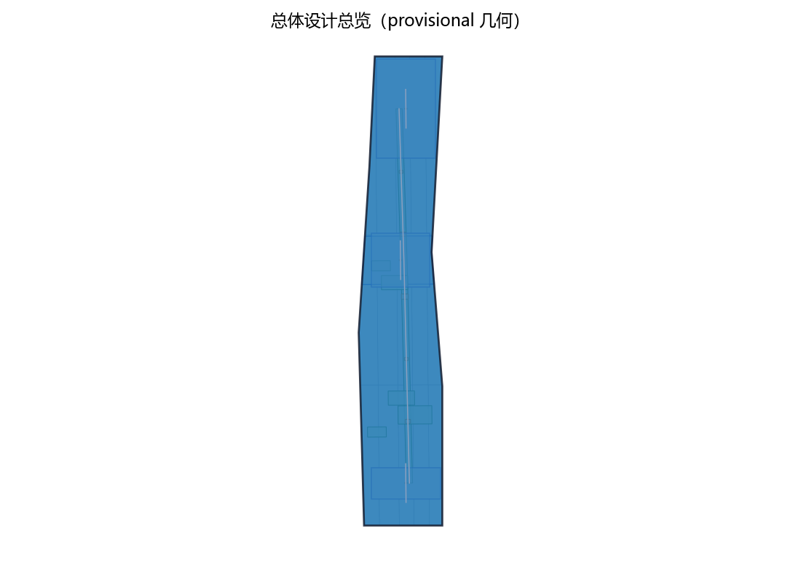
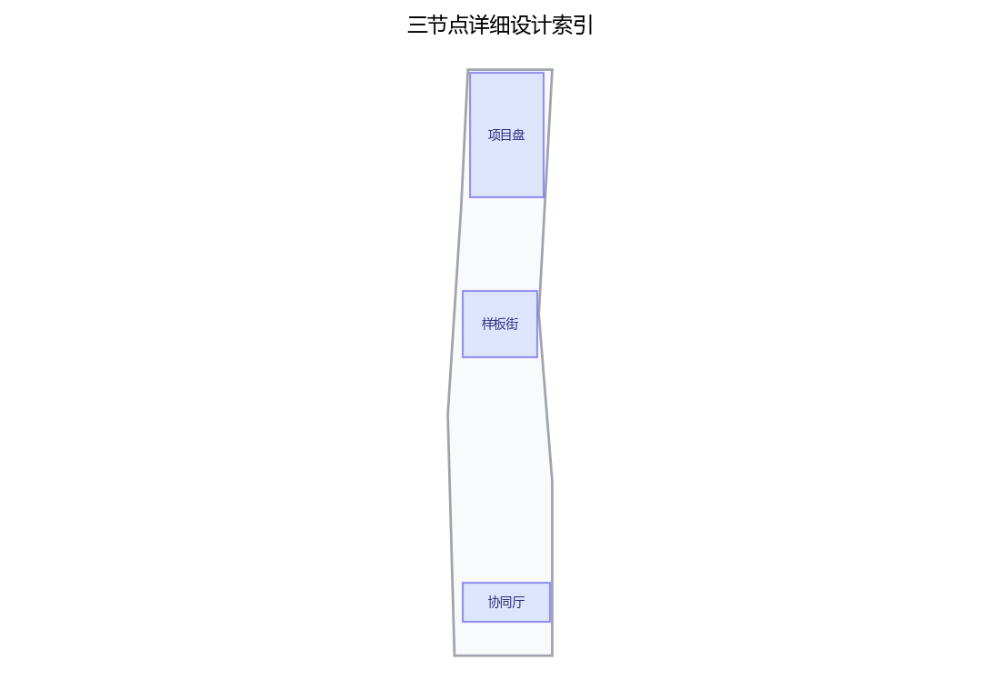
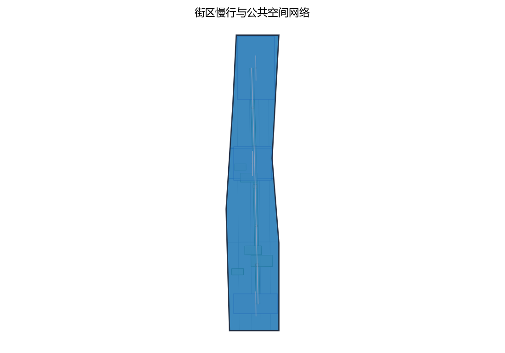
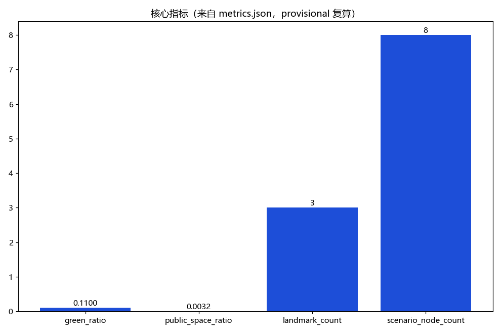

> 定位：面向「OPEN CITY · HAIDIAN 百年京张AI创新带城市设计开源征集」的重点区域更新专项概念章节。本草案仅为概念建议，不给出容积率、建筑高度、具体拆改留或工程实施结论，不编造拆建数据；边界与选址均为 provisional，待资料核验后调整。

## 设计依据与资料清单
资料清单所列公开史料、规划报道与通则规范等均为概念工作依据清单，并非本包已获取的数据；本包实际使用的全部数据见 sources.json，未获取项已在假设与缺失数据说明中如实标注。

本节的"依据"均为公开口径引用清单，而非已获取数据。主要包括：征集公告与征集任务书（要求重点区域更新以存量更新为主、提出更新项目清单、实施政策与分期计划）；京张铁路遗址公园沿线"留改拆并举、优先保留遗址公园肌理与铁路历史遗存"的原则表述；AI创新带"开放、可学习、可进化、可落地"的总体要求；《北京市城市更新条例》及城市更新相关指导意见、专项规划等公开文件。正式编制时应以官方发布文本逐项核验后引用。

> **证据锚点**：[source:DATA-SRC-OFFICIAL-ANNOUNCEMENT-20260509]、[source:DATA-SRC-AGENT-TASKBOOK-20260518]（组织方公告与任务书为文本口径依据）。

## 三层范围工作框架
三层成果逐级传导：统筹研究输出的更新清单治理环境与沿线协同判断约束总体设计，总体设计校核的更新节点布局、清单滚动机制与时序生长落实到节点详设；每层均保留与任务书对应章节的机器可读证据锚点，便于评审对照。

采用"统筹研究—总体设计—重点区域"三层递进框架。统筹研究层覆盖京张铁路遗址公园沿线及其腹地，研判产业与未来城市关系；总体设计层以公园绿带为骨架，开展城市更新与控规深度城市设计；重点区域层聚焦三个原创概念节点。各层范围边界均为 provisional 概念边界，随任务书口径更新与资料核验动态调整，不以本方案边界替代法定规划范围。

> **证据锚点**：[source:DATA-SRC-AGENT-TASKBOOK-20260518]（三层范围划分依据任务书官方文本口径）。

## 统筹研究范围产业与未来城市研究
产业与城市研究识别更新项目清单的「适配」效应：以项目库与样板实施把沿线高校、科创片区、轨道站点与住区的发展需求有序组织为可入库、可实施、可评估的更新单元，形成「更新节点—科创片区—住区」三级联动结构；未来城市研究仅作方向性预判，不构成对用地与投资的承诺。
概念级判断：更新项目清单应优先与沿线高校创新资源、科创片区功能外溢、轨道站点周边集约更新及存量住区品质提升形成协同关系；项目排序不以单一土地价值为准，而以"开放、可学习、可进化、可落地"为权重，识别高协同潜力的更新单元作为清单优先项。研究结论仅作方向性建议，为总体设计层提供底图逻辑，不替代产业专项研究。

> **证据锚点**：[source:DATA-SRC-PROVISIONAL-BOUNDARIES-20260605]（边界为 provisional，研究范围仅作概念示意）。

## 总体设计范围城市更新与控规深度城市设计
总体设计强调「以绿带为骨架的更新清单治理环境」：依托京张铁路遗址公园绿带组织更新单元、清单滚动机制与慢行骨架，更新设施可逆生长、街道可分时承载更新与节事需求；强调更新而非新建，优先利用存量空间植入更新功能；对控规指标只做校核建议，不预设数值结论。

以京张铁路遗址公园绿带为骨架组织城市更新项目清单总体概念：划分更新单元，遵循留改拆并举、优先保留遗址公园肌理与铁路历史遗存；建立"单元—项目"两级清单与滚动更新机制，形成入库、实施、评估、出库闭环。控规相关指标仅作校核建议，用于检验空间概念的一致性，不预设、不替代法定控规指标结论。

> **证据锚点**：[source:DATA-SRC-MOHURD-CONTROL-DETAILED-PLANNING]、[source:DATA-SRC-PROVISIONAL-BOUNDARIES-20260605]。

## 重点区域详细设计
三节点的设施选址均为概念点位，须经现场踏勘、资料核验与主管部门评估及公众意见后重新落位；节点间的绿带动线与慢行通道构成完整更新动线，详细平面与剖面以图册与 geometry 层表达。
原创节点一"更新项目库·项目盘"：沿线更新项目的汇聚、比对与可视化决策中枢；节点二"更新样板段·样板街"：留改拆并举的示范性街道空间；节点三"更新协同站·协同厅"：政府、产权人、公众与AI工具协同的更新服务站点。三节点选址均为概念点位，须经现场踏勘、资料核验与公众意见后另行确定，不预设落位结论。

> **证据锚点**：[data:PACKAGE-GEOMETRY]（三节点示意多边形来自本包 geometry/key_areas.geojson）。

## AI 创新生态、人才画像与 AI+ 场景
更新项目台账AI、更新进度跟踪AI、拆改留合规核验AI为主干场景，每处均配置人工复核兜底；更新效果评估AI、公众更新意见反馈AI为支撑场景；仅处理匿名聚合数据、关键决策人工复核双保险，不设过度监控；更新清单管理为概念性机制建议，不替代法定管理职责。
识别五类用户画像：创业者（落地与成长）、AI开发者（工具共建）、社区居民（生活参与）、学生（学习实践）、更新实施人员（项目管理）。设置五个AI+场景：更新项目台账AI、更新进度跟踪AI、拆改留合规核验AI、更新效果评估AI、公众更新意见反馈AI。全部数据匿名聚合并设人工复核环节，禁止过度监控，尊重隐私边界，体现开放、可学习、可进化的技术态度。

> **证据锚点**：[source:DATA-SRC-GENERATIVE-AI-INTERIM-MEASURES]（AI 生成内容治理表述的参照依据）。

## 用地、建筑规模与拆改留方案
拆改留坚持留改拆并举：以留为主保留遗址公园肌理与铁路历史遗存，存量建筑功能置换并预留更新化改造方向（更新接口、协同窗口），拆除仅限经个案论证的局部疏通慢行零星建筑；全部面积为概念口径，官方数据发布后复算。
概念清单坚持留改拆并举、以留为主：优先保留遗址公园肌理与铁路历史遗存，鼓励功能置换激活存量空间，拆除仅限个案论证并公示，不预设拆建数值。用地与建筑规模仅作概念级空间关系判断，不给出容积率、建筑高度等结论；最终拆改留方案须经个案论证、公众参与与法定程序确定。

> **证据锚点**：[source:DATA-SRC-MNR-LAND-USE-CLASSIFICATION-202311]（用地分类名称参照现行国标口径）。

## 交通、轨道、市政与公共服务设施
以交通慢行优先为核心组织交通概念机制：连续慢行轴贯通项目盘、样板街与协同厅，街道断面按日常与节事状态分时响应，衔接沿线高校、园区与轨道站点（接驳以步行与骑行为主），更新服务设施沿慢行空间低干预布置；市政以集约共享为原则，更新设施与建筑一体化概念、优先利用现状设施条件；公共服务配置多语服务、更新信息公示与研习空间，AI决策均设人工复核。

交通以慢行优先：以连续慢行轴贯通"项目盘—样板街—协同厅"三节点，强化与轨道站点的顺畅接驳；市政设施倡导集约共享、地下统筹；公共服务设施结合更新单元就近补缺、存量挖潜。通道关系与站点接驳仅作概念示意，不预设工程数值，待专项研究核验与法定程序后确定。

> **证据锚点**：[source:DATA-SRC-MOHURD-URBAN-DESIGN-MEASURES]（市政与慢行设计表述的方法参照）。

## 蓝绿空间、公共空间与城市风貌
构建「绿带为轴、节点公园为珠」的蓝绿公共空间体系：以遗址公园绿带为蓝绿骨架串联沿线小微绿地与开敞空间，更新服务设施与公园融合布置、宜轻宜透宜可逆，不遮挡历史遗迹与绿带视线；指示与解说系统统一克制；风貌延续京张铁路工业记忆语汇并与更新有序的新氛围对话，整体风貌导控克制统一，避免符号堆砌与口号化包装。

构建连续蓝绿公共空间体系，更新项目与京张铁路遗址公园绿地低干预融合，保持铁路历史遗存可读；公共空间强调可达、连续、宜人，与慢行轴一体化组织；城市风貌克制统一，新建与改造界面均不遮挡历史遗迹视线廊道。风貌控制以原则性引导为主，不作具体形态与高度结论。

> **证据锚点**：[source:DATA-SRC-MOHURD-URBAN-DESIGN-MEASURES]（蓝绿空间组织的方法参照）。

## 更新项目清单、实施政策与分期计划
四类项目清单（项目库建立/样板实施/协同机制完善/评估出库上线）为概念清单，规模与投资估算均为建议性表述；政策建议（项目入库规程、实施导则、公众参与渠道）均须依法依规论证，不构成政府或运营方承诺。

分期概念建议：近期（1-3年）建立更新项目库与清单滚动机制、启动样板段实施；中期（3-5年）推进协同厅与项目盘落地、清单滚动更新；远期（5-10年）面向全域更新清单系统性实施。配套实施政策建议包括项目入库规程、实施导则与公众参与渠道（公示、意见反馈、听证），具体政策以主管部门发布为准。

> **证据锚点**：[source:DATA-SRC-AGENT-TASKBOOK-20260518]（分期与实施条目对应任务书要求）。

## 指标体系、面积复算与合规矩阵
更新项目入库率、样板段实施进度、拆改留合规核验率、更新效果评估覆盖率、公众意见处理率五类概念指标体系进入 metrics.json；三项formal核心指标（site_area_sqm、green_ratio、public_space_ratio）以本包几何复算为准，面积复算以官方文本口径为底，官方数据到位后整体复算并标注复算版本。

概念指标体系五项：更新项目入库率、样板段实施进度、拆改留合规核验率、更新效果评估覆盖率、公众意见处理率。三项 formal 核心指标以本方案包几何复算结果为准，不与外部口径混同；面积复算以官方文本口径为底数，仅作一致性校核，不新增、不替代官方数据。合规矩阵对应拆改留合规核验与法定程序节点，随程序推进更新。

> **证据锚点**：[metric:green_ratio]、[metric:public_space_ratio]、[source:PACKAGE-GEOMETRY]。

## 风险、版权与合规说明
本方案为概念研究性设计，不构成行政审批依据，也不构成容积率、建筑高度、拆改留或工程可行性结论；风险已按产权协调复杂性与权属信息不全、实施时序与资金安排不确定、合规边界随法定程序变化、公众接受度波动、AI工具有效性依赖数据质量与人工复核五维度如实登记于 assumptions.json 与缺失数据说明（应对原则：匿名聚合、最小必要、人工复核、来源标注与意见通道）；引用公开资料均已标注来源并注明获取时间，图形、名称与文字为原创或公共领域素材，若与既有标识雷同属巧合；更新清单表达不歪曲事实，未经授权不使用肖像商标论文图像等版权材料；正式实施前须完成多部门联审、数据安全与公开评估。

如实登记以下风险：产权协调复杂性与权属信息不全、实施时序与资金安排不确定、合规边界随法定程序变化、公众接受度存在波动、AI工具有效性依赖数据质量与人工复核。本方案为概念建议，版权按征集规则处理，不构成对官方数据的替代或承诺；任何引用以官方发布文本为准。

> **证据锚点**：[source:DATA-SRC-OFFICIAL-ANNOUNCEMENT-20260509]（征集规则为权属与合规表述的依据）。

## 参考资料
参考资料以政府正式发布版本为准，按公开/内部分类存档并标注获取时间：京张铁路历史与遗址公园公开材料（含詹天佑与京张铁路公开史料口径）、北京城市总体规划及分区规划公开口径、北京城市更新专项规划与实施意见及配套文件、城市更新相关技术导则与标准、国内外更新项目清单管理公开案例（伦敦城市更新项目清单管理、纽约曼哈顿中城更新计划、东京丸之内更新协定、新加坡URA项目库，以及北京、上海、深圳、广州国内对标）、现场踏勘记录与自绘分析草图（本项目自行采集）；本包 sources.json 仅收录可查证条目，未虚构任何官方数据或链接。

以引用清单形式列示：征集公告与征集任务书；京张铁路遗址公园相关公开资料；北京城市更新专项规划、实施意见及配套文件；城市更新相关技术导则与标准；国际国内城市更新项目清单管理公开文献（见附）。清单仅表明引用关系，不代表已获取或核验官方数据，正式提交前应逐一更新核验。

> **证据锚点**：[source:DATA-SRC-OFFICIAL-ANNOUNCEMENT-20260509]（本清单首条即组织方公开资料包）。

## 附：对标案例（概念参考，均以公开渠道信息为准，具体数据以官方发布为准）

**国际案例（3-4个）**：
1. 伦敦城市更新项目清单管理——以存量更新为主的项目清单与分期实施机制，可参照其清单滚动与评估逻辑，供"项目盘"机制设计。
2. 纽约曼哈顿中城更新计划——公共领域更新与区划工具协同，通过规划工具引导存量更新，供政策工具设计参照。
3. 东京丸之内更新協定——产权人协同更新与街区公约机制，通过街区协约推动整体更新，供"协同厅"多方协同机制参照。
4. 新加坡市区重建局（URA）项目库——法定规划与项目库结合、分期滚动与公众参与流程，供清单滚动与公众反馈机制参照。

**国内对标（3-4个）**：
1. 北京城市更新专项规划与项目清单——以专项规划统筹项目清单，供总体框架对标。
2. 上海城市更新项目库——市级项目库入库、出库与精细化管理，供项目管理流程对标。
3. 深圳城市更新单元计划——单元计划与分类更新管理，供"单元—项目"两级结构对标。
4. 广州城市更新项目清单——项目清单与实施计划滚动管理，供分期计划与滚动更新机制对标。

> 声明：本草案全部内容为概念建议，未给出容积率、建筑高度、具体拆改留或工程实施结论，未编造拆建数据；三层范围边界与三节点选址均为 provisional，最终以官方口径、现场踏勘与法定程序为准。
