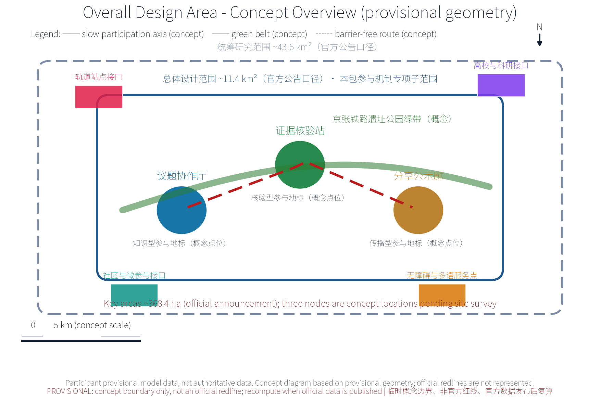
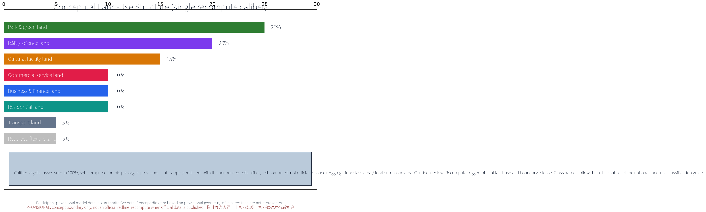
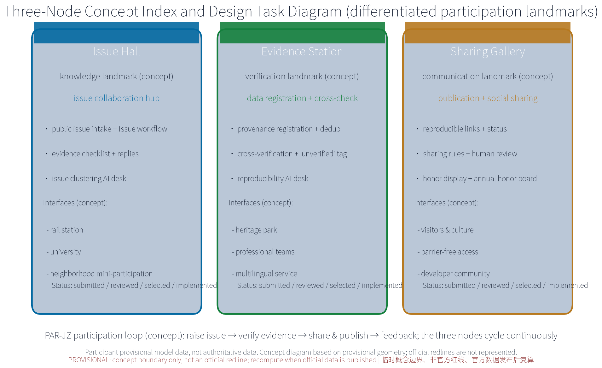
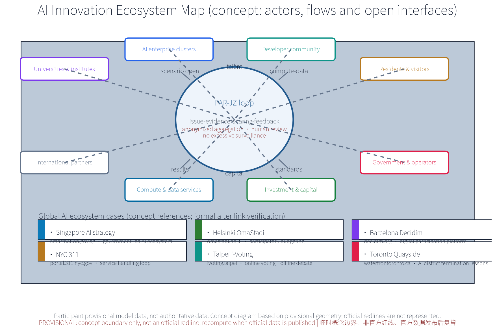
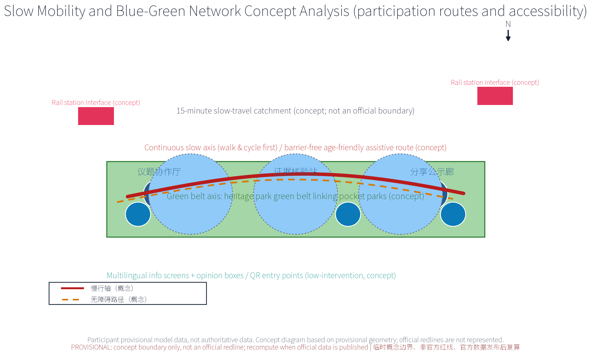
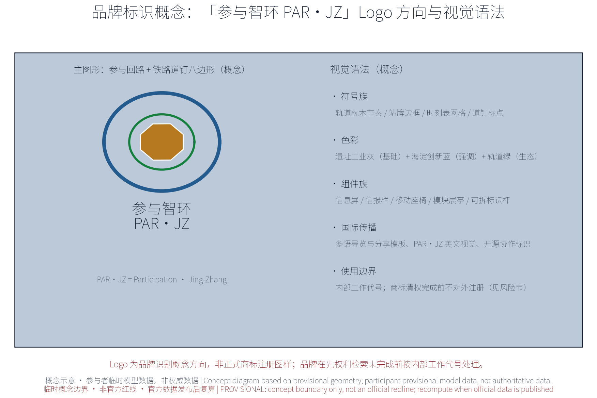
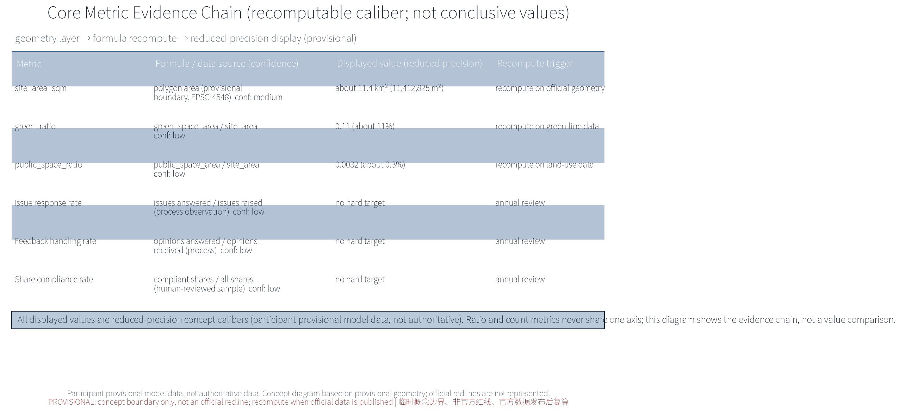

*Concept advice only: no FAR, building height, retain-renovate-demolish or engineering conclusions; no fabricated official data; all boundaries are provisional.*

## Design Basis and Source List
The basis list below covers public archival materials, planning reports, standards and participation-mechanism references used as conceptual working references; it is not a statement of data already acquired. All data actually used by this package are registered in sources.json, and organizer-side gaps (official geometry, statutory controls, site baseline) are declared in the assumptions and missing-data statements.

The basis includes: the open-call announcement (project name, organizer, official three-tier scope calibers and submission depth requirements); the open-call taskbook (three positionings, five functions, three-areas-two-wings structure and tasks agent.1-6, including the continuous participation caliber and its recommended collaboration loop); the public Issue/PR collaboration conventions (issue impact scope, expected versus actual behavior, reproduction steps, logs or verification output, anonymized screenshots, data sources and uncertainties); public statements on retaining the heritage park fabric and railway relics with a keep-renovate-demolish balance along the Jing-Zhang railway heritage park; six global AI innovation ecosystem cases registered one by one in sources.json (publisher, link, dates and reuse boundary); and appendices 1 and 2 listed as research hypotheses pending link verification before entering the formal evidence chain.

> **Evidence anchor**: [source:DATA-SRC-OFFICIAL-ANNOUNCEMENT], [source:DATA-SRC-AGENT-TASKBOOK].

## Three-Level Scope Framework
Per the official announcement caliber, the three official tiers are: coordinated research area about 43.6 km2, overall design area about 11.4 km2, and key areas about 368.4 ha. This package's public participation and continuous collaboration track sits inside the overall design area as a conceptual sub-scope: the three nodes — Issue Collaboration Hall, Evidence Verification Station, Sharing and Publicity Gallery — and a continuous slow-mobility participation axis are its spatial carriers; it does not extend into a full-area layout claim.

The three tiers deliver successively: the coordinated tier assesses, at concept level, how the participation network partners with universities, science and technology precincts, rail stations and neighborhoods; the overall tier organizes the participation network and slow-mobility spine around the heritage park green belt, with regulatory-plan indicators used only as cross-checks; the key-area tier details the three nodes, all of which are concept locations. All tiers share one issue-evidence-feedback loop; every boundary is provisional, revised as issues and evidence evolve, never replacing statutory planning procedures, and recomputed when official geometry is published.

> **Evidence anchor**: [source:DATA-SRC-OFFICIAL-ANNOUNCEMENT] (three-tier scope figures follow the announcement text caliber; not issued by this package).

## Coordinated Research Area: Industry and Future City Research
The coordinated research identifies the "fit" effect of the participation mechanism: issue collaboration and evidence verification organize participation demand from universities, science precincts, rail stations and neighborhoods into units that can be raised, verified and shared, forming a three-level linkage of participation nodes, science-and-technology precincts and neighborhoods. Future-city research is directional only and implies no land-use or investment commitment.

On regional synergy, the theme anchors the Haidian main area within the taskbook's three-areas-two-wings structure: reserved concept interfaces for Beiwei community and corridor neighborhoods (community-level participation points), for Future Science City and Huairou Science City (university and research participation network), for the economic-development zone (industry issues), and for Jing-Jin-Ji coordination (cross-regional initiative). All interfaces are concept reservations, not cross-region implementation commitments, pending official materials and survey data.

Function mapping to the taskbook's three positionings and five functions (concept mapping, not an officially authorized caliber): Positioning 1, Centennial Jing-Zhang Culture Belt — the green belt and heritage relics become participation carriers for raising, verifying and sharing; Positioning 2, Metropolitan AI Life Experience Belt — issue intake, feedback and activity booking become perceptible AI life experiences for residents and visitors; Positioning 3, AI-Integrated Innovation Belt — universities, science precincts, rail stations and neighborhoods form a collaborative issue network. Within the five functions, this theme works directly on Global AI Governance Voice and the AI+ Scenario Enablement Paradigm: open deliberation, evidence verification and result publication provide a city-scale participation testbed for AI governance, five AI+ scenarios provide reproducible and evaluable scenario samples, and the theme adds a public participation foundation to the world-class AI innovation ecosystem, the smart AI vital city and the full-stack independent AI innovation system.

> **Evidence anchor**: [source:DATA-SRC-AGENT-TASKBOOK], [source:DATA-SRC-PROVISIONAL-BOUNDARIES].

## Overall Design Area: Urban Renewal and Regulatory-Plan-Level Urban Design
The overall design stresses a public participation environment whose skeleton is the green belt: participation nodes, the participation network spine and slow-mobility systems are organized along the Jing-Zhang railway heritage park; participation facilities grow reversibly and streets time-share participation and festival needs; renewal precedes new construction, with existing space reused first for participation functions; regulatory-plan indicators are cross-checked only, without preset numerical conclusions.

A three-level participation network of regions, nodes and facilities is built on the green belt: regional hubs (e.g., the Issue Collaboration Hall), corridor theme participation points, and facility-level community micro-participation fittings (info screens, bulletin boards and other lightweight media from the reversible public-space component library concept). The network integrates with the green belt and rail stations; keeping the heritage park fabric and railway relics first, with a keep-renovate-demolish balance, is the bottom line.

> **Evidence anchor**: [source:DATA-SRC-MOHURD-CONTROL-DETAILED-PLANNING], [source:DATA-SRC-PROVISIONAL-BOUNDARIES].

## Detailed Design of Key Areas
All three node locations are concept locations: they must be re-sited after on-site survey, data verification, authority evaluation and public comment. Green-belt routes and slow-mobility links between nodes form the complete participation itinerary; detailed plans and sections are expressed in the booklets and geometry layers. The nodes are differentiated typologies: the Issue Collaboration Hall is a knowledge-type landmark (issue and Issue-workflow hub: public issue intake, evidence checklist verification and collaboration interface); the Evidence Verification Station is a verification-type landmark (external data registration and cross-check: authority and provenance registration, cross-verification, and unverified tagging routed to issue discussion); the Sharing and Publicity Gallery is a communication-type landmark (publication and social sharing: reproducible links, site-relevance notes, diagrams and alternative text, attribution and licensing, distinguishing submitted/reviewed/selected/implemented status, protecting privacy, and authorizing before publication).

Concept running mechanisms include the participation covenant, deliberation rules, tiered publication and venue rotation, with bookable venues; the Gallery hosts an honor-and-status display area linked to the annual honor board and trial participation points; participation facilities are selected from the reversible public-space component library (info screens, bulletin boards, movable seats, modular pavilions, demountable signage) with part-level replacement and relocatable decommissioning. Concept space types and interfaces: all three nodes reserve rail-station connection, heritage park, university, neighborhood, barrier-free and multilingual service interfaces. Site suitability, station entrance conditions and current accessibility status are unverified — a registered data gap that must be closed by site-level checks before siting.

> **Evidence anchor**: [data:PACKAGE-GEOMETRY] (the three-node concept polygons come from geometry/key_areas.geojson).

## AI Innovation Ecosystem, Personas, and AI+ Scenarios
Five persona groups: entrepreneurs, AI developers, community residents, students, and visitors and tourists, mapped to industry issues, open-source collaboration issues, daily concerns, learning and volunteering issues, and experience and communication issues (concept caliber). Personas only inform scenario design; no individual profiling occurs.

The AI innovation ecosystem is organized as actors, flows and open interfaces (concept): eight actor types — universities and institutes, AI enterprise clusters, developer community, residents and visitors, government and operators, investment and capital, compute and data services, international partners; six flows — talent and issues, scenario opening and conversion, compute and data (anonymized aggregation), capital and incubation, results and sharing, standards and compliance reference; and open interfaces including data sandboxes, testbeds, issue-to-dev-task conversion and multilingual communication templates, forming a linkage vision across land, space, industry, capital, talent, compute, data and scenario access (concept level, no scale preselected; see the ecosystem map figure).

Global AI innovation ecosystem cases (concept references, registered one by one in sources.json; research hypotheses upgraded to formal evidence after link verification):

| Case | Country / city | Mechanism | Lesson for this package | Source |
| --- | --- | --- | --- | --- |
| Singapore AI strategy | Singapore | government-led AI ecosystem and talent planning | governance testbed and scenario opening channel | [source:SRC-GLOBAL-CASE-01] |
| Helsinki OmaStadi | Finland | open participatory budgeting | public issue collection and result feedback | [source:SRC-GLOBAL-CASE-02] |
| Barcelona Decidim | Spain | digital participation platform | digital deliberation and publication norms | [source:SRC-GLOBAL-CASE-03] |
| NYC 311 | United States | unified non-emergency service entry | opinion receipt and status transparency | [source:SRC-GLOBAL-CASE-04] |
| Taipei i-Voting | Chinese Taipei | online voting plus offline debate | online-offline participation loop | [source:SRC-GLOBAL-CASE-05] |
| Toronto Quayside | Canada | AI district pilot termination lessons | pilot gating and decommission review | [source:SRC-GLOBAL-CASE-06] |

Ten AI+ scenario cards (concept level):

| Scenario card | Scenario name | Spatial carrier | AI capability | Data and privacy boundary | Operator |
| --- | --- | --- | --- | --- | --- |
| S01 | Issue clustering AI | Issue Collaboration Hall | issue grouping, dedup, theme aggregation, hot topics | anonymized aggregation, no individual-identifying tracking | operator team and volunteers |
| S02 | Evidence ledger AI | Evidence Verification Station | external data registration, provenance ledger, dedup | provenance filing, unverified tagging, human review | professional team |
| S03 | Reproducibility check AI | Evidence Verification Station | reproduction steps and validation output checking | public reproducible data only, anonymized | professional team and university volunteers |
| S04 | Sharing copy AI | Sharing and Publicity Gallery | site-relevance notes, diagrams, alt text | authorized publication, attribution, no excessive surveillance | operator team |
| S05 | Feedback processing AI | Issue Collaboration Hall | opinion intake, receipts, status updates | anonymized; human review backstop | operator team |
| S06 | Slow-travel guide AI | along the slow axis | wayfinding and barrier-free route advice | anonymized trajectory aggregation, no per-person records | operator team |
| S07 | Multilingual service AI | node service desks | translation and information conversion | anonymized, human review | operator team and volunteers |
| S08 | Activity booking AI | node venues | booking, rotation, reminders | minimal collection, periodic purge | operator team |
| S09 | Micro-participation AI | community points | voice and QR opinion entry, large-type mode | anonymized, human review | community and volunteers |
| S10 | Operations monitoring AI | back office (concept) | anonymized activity aggregation for annual review | aggregate statistics only, no excessive surveillance | professional team |

Three industry test protocols (concept; process verifications without hard thresholds; results feed the annual review): Test 1, anonymization and privacy-boundary testing — verifies aggregate-only outputs, no individual identification, and pass of desensitization and post-processing checks; Test 2, human review and false-positive-rate testing — sampled human review of AI summaries, receipts and copy, with errors stratified and rolled back by error grouping; Test 3, participation route accessibility field testing — on-site walk-through of the three nodes and slow axis verifying barrier-free, multilingual and offline accessibility.

AI technical protocols (concept): model evaluation against public benchmarks aligned to task scenarios; data quality controlled via registration calibers, deduplication and provenance labeling; errors stratified by false-positive rates; runtime monitoring covering anonymized-aggregation logs and human-review triggers. The three governance sentences apply throughout: only anonymized aggregation, human review for consequential decisions, and no excessive surveillance (no individual-identifying tracking). The five main scenarios cover six domains — transport, industry, space, public services, culture and governance — as conceptual correspondence without preset indicators.

> **Evidence anchor**: [source:DATA-SRC-GENERATIVE-AI-INTERIM-MEASURES], [source:SRC-GLOBAL-CASE-01].

## Land Use, Building Scale, and Retain-Renovate-Demolish Strategy
The conceptual land-use structure uses one single recompute caliber (the table below and the land-use figure, HTML pages, PDFs and metrics.json are identical; the eight class names follow the public subset of the national land-use classification guide):

| Land class (single caliber) | Concept share | Computation caliber |
| --- | --- | --- |
| Park and green land | 25% | self-computed on this package's provisional sub-scope |
| R&D / science land | 20% | same |
| Cultural facility land | 15% | same |
| Commercial service land | 10% | same |
| Business and finance land | 10% | same |
| Residential land | 10% | same |
| Transport land | 5% | same |
| Reserved flexible land | 5% | same |

Caliber and recompute rule: shares sum to 100%; aggregation formula is class area divided by total sub-scope area, consistent with the announcement caliber (self-computed per the announcement, not officially issued); confidence is low; a full recompute is triggered when official land-use and boundary data are published, updating the narrative, figures, HTML, PDFs and metrics.json together. This structure is concept advice; no land areas or floor areas are preset.

The retain-renovate-demolish strategy keeps the heritage park fabric and railway relics first: existing buildings are functionally replaced with participation-oriented upgrade interfaces (issue-space interfaces, publication windows), demolition is limited to narrow case-by-case clearance for slow links, and participation facilities are light, reversible and low-footprint without large new buildings. No FAR or height conclusions are given.

> **Evidence anchor**: [source:DATA-SRC-MNR-LAND-USE-CLASSIFICATION-202311].

## Transport, Rail, Municipal Infrastructure, and Public Services
Slow mobility comes first: a continuous slow axis links the Issue Collaboration Hall, the Evidence Verification Station and the Sharing and Publicity Gallery; the participation network and slow system are integrated and connect universities, parks, districts and rail stations (walking and cycling first); station-to-node routes are continuous and legible; info screens, signage and wayfinding sit along the slow space with low intervention.

Municipal services follow intensive sharing: lighting, barrier-free facilities and participation screens are integrated in one concept package, reusing current facilities where possible, without preset road cross-sections or engineering scales. Public services include multilingual information, issue reception, study rooms and staffed service points; every AI decision has human review. Public opinion channels link online and offline: opinion boxes and QR entry points along the slow axis; issues receive receipts and may enter open deliberation.

Inclusive services (concept): barrier-free routes and age-friendly services cover the three nodes and the slow axis; large-type and voice prompts support seniors and low-digital-literacy users; child-friendly and family spaces are reserved at blue-green nodes; people unable or unwilling to use AI or digital channels receive offline registration and volunteer assistance (echoing the service-intent boundary of Article 39 of the Barrier-Free Environment Law, without over-generalizing to a compliance claim).

> **Evidence anchor**: [source:DATA-SRC-MOHURD-URBAN-DESIGN-MEASURES], [source:DATA-SRC-BARRIER-FREE-ENVIRONMENT-LAW].

## Blue-Green Network, Public Space, and Urban Character
A blue-green public space system of a green belt as the axis and node parks as pearls: the heritage park green belt links pocket green spaces along the corridor; participation facilities blend with parks — light, transparent, reversible — without blocking heritage views; public space serves both daily rest and participation activities with flexible sharing, configured for all ages: age-friendly facilities for seniors, child-friendly design for children and families, barrier-free routes and assistance for persons with disabilities and other vulnerable groups, alongside residents, visitors, students, commuters and corridor workers.

The character continues the industrial memory vocabulary of the Jing-Zhang railway and dialogues with an orderly new atmosphere of innovation, with restrained unified guidance and no symbol stacking or sloganeering; the information and interpretation system is unified, provided in multilingual, large-type and diagram versions. Brand identity direction (concept): the main mark "PAR-JZ Participation Ring" uses the participation loop and a railway-spike octagon as its concept graphic (see the identity concept figure); visual grammar uses sleeper rhythms, station-frame borders and timetable grids; colors use heritage industrial grey as the base, Haidian innovation blue as the accent and rail green for ecology; the reversible public-space component library provides one unified, demountable component family; the cultural symbol system draws on spikes, station signs and timetables for wayfinding, remembrance and honor expression; international communication copy outputs via multilingual guides, sharing templates and open-source identity assets (concept).

> **Evidence anchor**: [source:DATA-SRC-MOHURD-URBAN-DESIGN-MEASURES].

## Renewal Projects, Implementation Policy, and Phasing
Four concept project lists (issue reception, evidence registration, sharing and publication, annual renewal) with advisory scale and cost statements only, implying no government or operator commitment. Concept phasing: near term 1-3 years, establish the base procedures (issue reception procedure, evidence registration and verification procedure, sharing and publication guidelines, upload-and-self-check mechanism) and pilot demonstration nodes; mid term 3-5 years, complete the three nodes and connect the slow axis; long term 5-10 years, form the full participation mechanism with annual renewal.

Implementation and operations roles (concept RACI table; R lead / A collaborate / C consult / I inform):

| Task | Lead | Collaborate | Consult | Inform |
| --- | --- | --- | --- | --- |
| Issue reception and open deliberation | operator team | community, volunteers | university experts | government authority |
| Evidence registration and cross-verification | professional team | universities and institutes | domain experts | issue raiser |
| Sharing, publication and honor display | operator team | volunteers, merchants | legal and copyright advisers | public |
| AI scenario operations and human review | operator team | professional team | AI governance advisers | authority |
| Annual recompute, evaluation and publication | professional team | operator team, universities | evaluation agency | public and government |
| Facility maintenance and component library | operator team | volunteers, merchants | engineering advisers | public |

Pilot gating and acceptance (concept): pilot candidates rank on four factors — station connection and accessibility, existing-space suitability, barrier-free conditions and existing-facility assessment (research hypothesis until the organizer supplies the site baseline); acceptance observes process metrics such as issue response rate, opinion closure rate, evidence reproduction rate and barrier-free pass rate, with no hard targets. Service workflow and human escalation (concept): online/offline intake → receipt → processing and status updates → appeal and human escalation channel → major matters into open deliberation; offline registration, telephone and volunteer assistance are available to those who cannot use digital channels. Data governance (concept): minimal collection, anonymized aggregation only, purpose-based retention periods, access control and annual purging; public data releases follow authorization and desensitization rules.

Annual event system (concept, 4 items):

| Event brand | Frequency | Target group | Link to the mechanism |
| --- | --- | --- | --- |
| Public participation open day | daily normal + annual open week | residents, visitors and the public | issue intake and on-site deliberation |
| Issue collaboration week | weekly | developers, university staff and students | issue-to-dev-task conversion and co-creation |
| Issue collaboration briefing | quarterly | government, enterprises, universities and others | annual issue list and publication |
| Results sharing festival | annual festival | public, visitors, developers | results display and honor board |

Operations and cost tiers (concept; no precise amounts, low/medium/high):

| Cost tier | Estimation method | Price basis | Included scope | Confidence | Recompute trigger |
| --- | --- | --- | --- | --- | --- |
| Low | market-price analogy | concept period | lightweight facilities, volunteer operations | low | project justification |
| Medium | market-price analogy | concept period | basic node operations and staffing | low | annual review |
| High | market-price analogy | concept period | component-library expansion and events | low | annual review |

Stop conditions and exit mechanism (concept): two consecutive annual reviews not meeting process observations, a privacy or security incident, or facility function changes trigger the decommission assessment; facilities are removed through the reversible component library, data archived and a public notice published. Long-term operations (concept): developer community (open-source collaboration, co-creation workshops, annual hackathon, open interfaces, issue-to-dev-task conversion), scenario opening and conversion channels (data sandbox, testbed, results-to-industry conversion), participation alliance (stations, universities and communities co-authoring the issue rhythm and event calendar) and annual publication form the long-term operations backbone.

> **Evidence anchor**: [source:DATA-SRC-AGENT-TASKBOOK].

## Metrics, Area Recalculation, and Compliance Matrix
The concept indicator system is an observation-caliber set without hard targets; each indicator states its data caliber and formula, confidence, use limit and recompute trigger:

| Metric | Data caliber and formula | Confidence | Use limit | Recompute trigger |
| --- | --- | --- | --- | --- |
| site_area_sqm | polygon area of geometry/site_boundary.geojson (EPSG:4548) | medium | concept display only, not an approval basis | official geometry release |
| green_ratio | green_space area / site_area | low | concept display only | official green-line data |
| public_space_ratio | public_space area / site_area | low | concept display only | official land-use data |
| Issue response rate | issues answered / issues raised (process observation) | low | process observation | annual review |
| Feedback handling rate | opinions answered / opinions received (process observation) | low | process observation | annual review |
| Share compliance rate | compliant shares / all shares (human-reviewed sample) | low | process observation | annual review |

Area recalculation caliber: the three formal core metrics are recomputed from this package's geometry — participant provisional model data, not claimed as authoritative; areas are consistent with the official three-tier scopes (self-computed per the announcement, not officially issued); all displays are reduced-precision (about 11.4 km2, 0.11, 0.0032, etc.), with a full recompute and version note when official data are published. The compliance matrix covers all 23 requirements of the announcement (1.3-1.5) and the taskbook (agent.1-6), each pointing to concrete sections, figures, geometry layers, metrics and tables (see compliance_matrix.json); the design-depth matrix points each of its 15 items to verifiable outputs (see design_depth_matrix.json).

> **Evidence anchor**: [metric:green_ratio], [metric:public_space_ratio], [data:PACKAGE-GEOMETRY].

## Risk, Copyright, and Compliance
This package is concept research: it is not an administrative approval basis and gives no FAR, height, retain-renovate-demolish or feasibility conclusions. All geometry and values are participant provisional model data and are not claimed as authoritative. Five risk dimensions are registered in assumptions.json and the missing-data notes: participation data privacy boundary (minimal collection, anonymized aggregation only, authorized publication, periodic purging); AI-generated content and image/font copyright (generation source and authorization labeling); issue and share content accuracy (unverified tagging, human review); participation activity fluctuation and mechanism sustainability (annual review, decommission and exit mechanism); unknown heritage-protection and green-line conditions (no preset values, pending official data).

Three governance sentences run through the whole package: only anonymized aggregation, human review for consequential decisions, and no excessive surveillance (no individual-identifying tracking). Resident opinion channels, annual publication and annual events are standing mechanism items. Brand prior rights and use boundary: no official trademark search has been completed at the concept stage; "PAR-JZ", the three node names and the logo are treated as internal working codenames, not to be registered or claimed externally until clearance; any resemblance to existing marks is coincidental, and related assets are registered in sources.json under the COMMUNITY-DISPLAY-ONLY license.

All cited public materials state their sources and access dates; portraits, trademarks, fonts, images and paper figures are not used without authorization; before any formal implementation, multi-agency joint review, public evaluation and statutory procedure linkage are required. This statement is open to the organizer, reviewers and the public; all mitigations are recommendations, not commitments.

> **Evidence anchor**: [source:DATA-SRC-OFFICIAL-ANNOUNCEMENT].

## References
References follow the officially published versions, archived by public/internal class with access dates: the open-call announcement; the open-call taskbook (including the continuous participation caliber and recommended collaboration loop); the public Issue/PR collaboration conventions; Jing-Zhang railway history and heritage park public materials (keep-renovate-demolish balance, preserving heritage park fabric and railway relics); six global AI innovation ecosystem cases (registered in sources.json with publisher, links, dates and reuse boundaries); domestic platform references (appendix 2, research hypotheses); and public literature on participatory budgeting and citizen services. sources.json contains only verifiable entries; no official data or links are fabricated. Official geometry, control conditions and site baselines not yet supplied by the organizer are declared in the assumptions and missing-data notes pending official releases.

> **Evidence anchor**: [source:DATA-SRC-OFFICIAL-ANNOUNCEMENT].

## Appendix 1: International Mechanism References (Concept, Research Hypotheses)
- Helsinki OmaStadi participatory budgeting: citizen proposals, online voting, budget allocation, fully public. Lesson: public issue collection, evidence checklists and result feedback.
- Paris participatory budgeting: city-wide proposals and voting with themed project pools. Lesson: issue pools and results publication.
- NYC 311 citizen services: unified non-emergency entry with trackable requests. Lesson: opinion receipts and status transparency.
- Taipei i-Voting participatory budgeting: online proposals and voting with offline discussion. Lesson: online-offline participation loop.

(These four mechanism references are research hypotheses without registered claim-level sources; they do not enter the formal evidence chain and are not double-counted with the six AI ecosystem cases.)

## Appendix 2: Domestic Platform References (Concept, Research Hypotheses)
- Beijing 12345 response-now: intake-dispatch-handling-follow-up loop. Lesson: response closure and handling transparency.
- Shanghai people's suggestion collection: standing suggestion collection and adoption conversion. Lesson: adoption publication.
- Shenzhen unified livelihood request platform: multi-channel unified intake and handling. Lesson: unified registration caliber and evidence aggregation.
- Hangzhou "people call, I respond": direct public opinion delivery with handling feedback. Lesson: status publication and follow-up.

(Research hypotheses as well; they do not enter the formal evidence chain before link verification.)