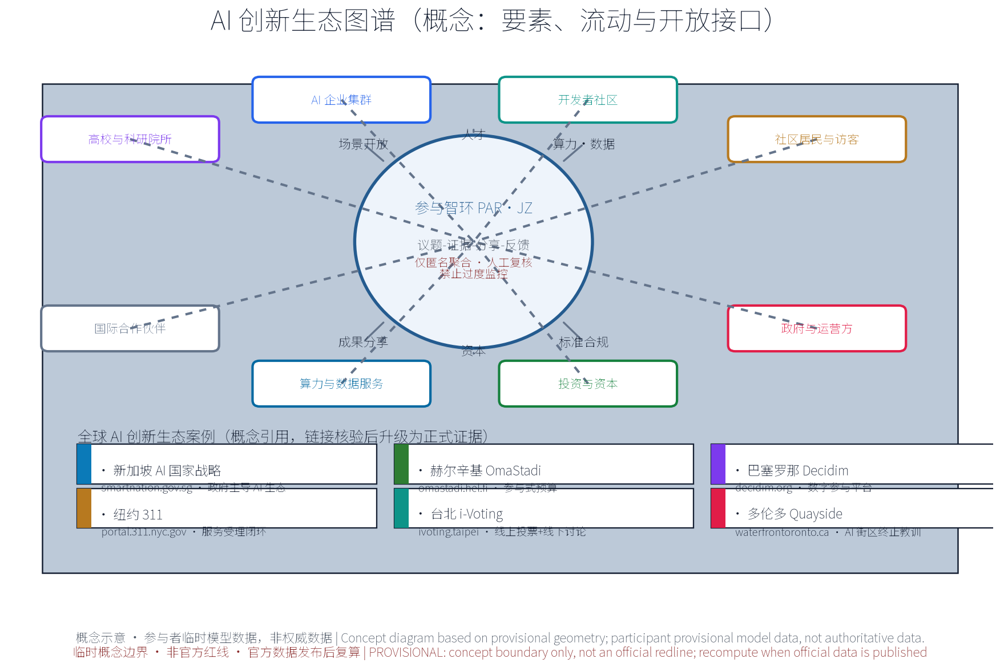

*本方案为概念建议：不给出现状数据之外的容积率、建筑高度、具体拆改留或工程实施结论；不编造任何官方数据；边界均标为 provisional。*

## 设计依据与资料清单
资料清单所列公开史料、规划报道、通则规范与国内外参与机制公开参照等均为概念工作依据清单，并非本包已获取的数据；本包实际使用的全部数据见 sources.json，组织方未提供的官方几何、控规条件与现状基线已在假设与缺失数据说明中如实登记。

依据清单：征集公告（项目名称、组织方、官方三层范围文本口径与提交深度要求）；征集任务书（三大定位、五大功能、三区两翼与 agent.1-6 任务，含「持续参与与协作」continuous_participation 口径及相关推荐协作循环）；Issue 与 PR 协作公开规范中的证据要素（议题标题与影响范围、预期与实际行为、复现步骤、日志或校验输出、脱敏截图、数据来源与不确定性等）；京张铁路遗址公园沿线留改拆并举、优先保留遗址公园肌理与铁路历史遗存的公开表述；六项全球 AI 创新生态案例已逐条登记于 sources.json（发布方、链接、日期与复用边界）；附录一、二所列国际与国内机制参照为待研究假设（research hypothesis），链接核验通过前不进入正式证据链。

> **证据锚点**：[source:DATA-SRC-OFFICIAL-ANNOUNCEMENT]、[source:DATA-SRC-AGENT-TASKBOOK]（组织方公告与任务书为文本口径依据）。

## 三层范围工作框架
按官方公告文本口径，三层官方范围依次为：统筹研究范围约 43.6 平方公里、总体设计范围约 11.4 平方公里、重点区域约 368.4 公顷。本包「公众参与与持续协作机制」专项位于总体设计范围之内，为概念性子范围：以「议题协作厅—证据核验站—分享公示廊」三节点与连续慢行参与轴为空间载体，不延伸为全域布局判断。

三层成果逐级传导：统筹研究层判断参与网络与沿线高校、科创片区、轨道站点、住区的协同关系，为概念级；总体设计层以遗址公园绿带为骨架组织参与网络与慢行骨架，控规指标仅作校核建议；重点区域层对三节点作详细设计，均为概念点位。三层共享同一条「议题—证据—反馈」回路，保证顶层判断与节点设计不脱节；全部边界为 provisional，随议题推进与证据校核动态修订，不替代任何法定规划程序，官方几何发布后整体复算。

> **证据锚点**：[source:DATA-SRC-OFFICIAL-ANNOUNCEMENT]（三层范围数值按公告文本口径引用，非本包核发）。

## 统筹研究范围产业与未来城市研究
产业与未来城市研究识别公众参与机制的「适配」效应：以议题协作与证据核验把沿线高校、科创片区、轨道站点与住区的参与需求组织为可提出、可核验、可分享的参与单元，形成「参与节点—科创片区—住区」三级联动结构；未来城市研究仅作方向性预判，不构成对用地与投资的承诺。

区域协同层面，本主题在任务书「三区两翼」总体结构中锚定海淀主区：为北纬社区与沿线住区预留社区级参与点接口，为未来科学城、怀柔科学城预留高校与科研参与网络接口，为经开区预留产业议题接口，为京津冀协同预留跨区域倡议接口。上述接口均为概念预留，不构成跨区实施承诺；相关协同判断待官方资料与踏勘数据到位后补充。

本主题与任务书三大定位、五大功能的功能映射（概念映射，非官方授权口径）：定位一「百年京张文化带」——依托京张铁路遗址公园绿带与历史遗存，三节点沿带展开，把百年京张文化转化为可提出、可核验、可分享的参与载体；定位二「都市 AI 生活体验带」——议题受理、意见反馈与活动预约成为沿线居民和访客可感知的 AI 生活体验；定位三「AI 融合创新带」——高校、科创片区、轨道站点与住区通过议题协作与证据核验结成创新协同网络。五大功能中，本主题以「AI 治理全球话语权」与「AI+ 场景赋能新范式」为直接着力点：公开议事、证据核验与结果公示为 AI 治理提供城市级参与试验场，五个 AI+ 场景提供可复现、可评估的场景样本，并为「世界级 AI 创新生态」「智能化 AI 活力城市」「AI 全栈自主创新体系」补充公众参与底座。

> **证据锚点**：[source:DATA-SRC-AGENT-TASKBOOK]、[source:DATA-SRC-PROVISIONAL-BOUNDARIES]（区域协同与边界为概念口径）。

## 总体设计范围城市更新与控规深度城市设计
总体设计强调「以绿带为骨架的公众参与环境」：依托京张铁路遗址公园绿带组织参与节点、参与网络骨架与慢行系统；参与设施可逆生长、街道可分时承载参与与节事需求；强调更新而非新建，优先利用存量空间植入参与功能；对控规指标只做校核建议，不预设、不提出数值结论。

以绿带为骨架构建「区域—节点—设施」三级参与网络：区域级为议题协作厅等中枢节点，节点级为沿线主题参与点，设施级为社区微参与设施（信息屏、信报栏等轻量媒介，选自「可逆公共空间组件库」概念）。参与网络与绿带、轨道站点作一体化衔接考虑；留改拆并举、优先保留遗址公园肌理与铁路历史遗存为底线原则，公共空间按全龄与无障碍取向预留。

> **证据锚点**：[source:DATA-SRC-MOHURD-CONTROL-DETAILED-PLANNING]、[source:DATA-SRC-PROVISIONAL-BOUNDARIES]。

## 重点区域详细设计
三节点的设施选址均为概念点位：须经现场踏勘、资料核验与主管部门评估及公众意见后重新落位；节点间的绿带动线与慢行通道构成完整参与动线，详细平面与剖面以图册与 geometry 层表达。节点类型互为区分：议题协作厅为知识型参与地标（议题与 Issue 协作中枢：公开议题收集、证据清单核对与协作界面），证据核验站为核验型参与地标（外部数据登记与交叉核验：来源权威性与出处登记、交叉复核、未验证标注并转议题讨论），分享公示廊为传播型参与地标（成果公示与社交分享：可复现链接、场地相关性说明、图示与替代文本、署名与许可，区分投稿/评审/入选/落地状态，保护隐私，发布前取得授权）。

三节点运行机制（概念）配套「参与公约」「议事规则」「分级公示」与档期轮换，场地可预约使用；分享公示廊设「荣誉与状态展示」区，衔接年度荣誉榜与参与积分（试行）；参与设施从「可逆公共空间组件库」（信息屏、信报栏、移动座椅、模块化展亭、可拆标识杆）选配，零件级更换、撤收可复用。空间类型与接口（概念）：三节点均预留轨道站点接驳、遗址公园、高校与住区及无障碍与多语服务接口；现状设施适宜性、站点出入口条件与无障碍现状未核验，属已登记的数据缺口，节点落位前须完成场地级核查。

> **证据锚点**：[data:PACKAGE-GEOMETRY]（三节点示意多边形来自本包 geometry/key_areas.geojson）。

## AI 创新生态、人才画像与 AI+ 场景
五类人才画像：创业者、AI 开发者、社区居民、学生、访客游客，分别对应产业议题、开源协作议题、日常诉求、学习与志愿议题、体验与传播议题（概念口径）；画像仅用于场景设计，不对个体建档。

AI 创新生态按「要素—流动—开放接口」组织（概念）：高校与科研院所、AI 企业集群、开发者社区、社区居民与访客、政府与运营方、投资与资本、算力与数据服务、国际合作伙伴八类要素；人才与议题、场景开放与转化、算力与数据（匿名聚合）、资本与孵化、成果与分享、标准与合规参照六类流动；开放接口包括数据沙箱、测试床、议题转开发任务与多语传播模板，形成土地、空间、产业、资本、人才、算力、数据与场景准入联动设想（概念级，不预设规模；生态图谱见图）。

全球 AI 创新生态案例（概念引用，逐条登记于 sources.json；待研究假设，链接核验后升级为正式证据）：
| 案例 | 国家/城市 | 机制要点 | 借鉴点（本包） | 来源 |
| --- | --- | --- | --- | --- |
| 新加坡 AI 国家战略 | 新加坡 | 政府主导 AI 生态与人才规划 | 治理试验场与场景开放通道 | [source:SRC-GLOBAL-CASE-01] |
| 赫尔辛基 OmaStadi | 芬兰 | 参与式预算全流程公开 | 议题公开收集与结果反馈 | [source:SRC-GLOBAL-CASE-02] |
| 巴塞罗那 Decidim | 西班牙 | 数字参与平台 | 数字化议事与公示规范 | [source:SRC-GLOBAL-CASE-03] |
| 纽约 311 | 美国 | 非紧急服务统一入口 | 意见受理回执与状态公开 | [source:SRC-GLOBAL-CASE-04] |
| 台北 i-Voting | 中国台北 | 线上投票与线下讨论结合 | 线上线下参与循环 | [source:SRC-GLOBAL-CASE-05] |
| 多伦多 Quayside | 加拿大 | AI 街区试点终止教训 | 试点准入与撤收评估 | [source:SRC-GLOBAL-CASE-06] |

十个 AI+ 场景卡（概念级，与 metrics.json 的场景口径一致）：
| 场景卡编号 | 场景名称 | 空间载体 | AI 能力 | 数据与隐私边界 | 运营主体 |
| --- | --- | --- | --- | --- | --- |
| S01 | 议题聚类 AI | 议题协作厅 | 议题归类去重、主题聚合与热点识别 | 匿名聚合，不进行个体识别式追踪 | 运营团队与志愿者 |
| S02 | 证据台账 AI | 证据核验站 | 外部数据登记、出处台账与去重比对 | 出处登记备案，未验证标注，人工复核 | 专业团队 |
| S03 | 复现核验 AI | 证据核验站 | 复现步骤与校验输出核对 | 仅处理公开可复现数据，匿名聚合 | 专业团队与高校志愿者 |
| S04 | 分享文案 AI | 分享公示廊 | 场地相关性说明、图示与替代文本辅助 | 授权后发布，版权标注，禁止过度监控 | 运营团队 |
| S05 | 反馈处理 AI | 议题协作厅 | 意见受理、回执生成与状态更新 | 匿名聚合，人工复核兜底 | 运营团队 |
| S06 | 慢行导览 AI | 慢行轴沿线 | 寻路与无障碍路径建议 | 匿名轨迹聚合，不保留个体记录 | 运营团队 |
| S07 | 多语服务 AI | 三节点服务台 | 多语翻译与信息转化 | 匿名聚合，人工复核 | 运营团队与志愿者 |
| S08 | 活动预约 AI | 三节点场地 | 档期预约、轮换与提醒 | 预约信息最小化收集，定期清理 | 运营团队 |
| S09 | 微参与 AI | 社区微参与点 | 语音与扫码意见录入、大字模式 | 匿名聚合，人工复核 | 社区与志愿者 |
| S10 | 运营监测 AI | 后台（概念） | 参与热度匿名聚合与年度评估辅助 | 仅聚合统计，禁止过度监控 | 专业团队 |

三项行业测试协议（概念，过程性验证协议，不设硬性阈值，结果进入年度评估）：
| 测试协议编号 | 测试场景 | 测试内容与方法 | 结果去向 |
| --- | --- | --- | --- |
| 行业测试一 | 匿名聚合与隐私边界测试 | 验证输出仅含聚合统计、无个体识别，脱敏与后处理校验通过 | 年度评估 |
| 行业测试二 | 人工复核与误报率测试 | AI 产出的摘要、回执与文案抽样人工复核，误报按误差分群处置并回滚 | 年度评估 |
| 行业测试三 | 参与动线可及性现场测试 | 三节点与慢行轴实地踏勘，验证无障碍、多语与离线可达性 | 年度评估 |

AI 技术协议（概念）：模型评测采用公开基准测试并与任务场景对齐；数据质量按登记口径、去重与来源标注控制；误差按误报率分群分层处置；运行监测覆盖匿名聚合日志与人工复核触发条件。AI 应用坚持三句治理底线：仅匿名聚合、关键决策人工复核、禁止过度监控（不进行个体识别式追踪）；五个主干场景覆盖交通、产业、空间、公共服务、文化、治理六域（概念性对应，不预设指标）。

> **证据锚点**：[source:DATA-SRC-GENERATIVE-AI-INTERIM-MEASURES]、[source:SRC-GLOBAL-CASE-01]（AI 治理与案例来源参照）。

## 用地、建筑规模与拆改留方案
概念用地结构采用单一复算口径（下表与 land-use-structure 图件、HTML、PDF、metrics.json 完全一致；八类名称参照国土空间用地用海分类指南的公开子集）：
| 用地分类（单一口径） | 概念占比 | 计算口径 |
| --- | --- | --- |
| 公园绿地 | 25% | 本包 provisional 子范围自算 |
| 科研用地 | 20% | 同上 |
| 文化设施用地 | 15% | 同上 |
| 商业服务业用地 | 10% | 同上 |
| 商务金融用地 | 10% | 同上 |
| 居住用地 | 10% | 同上 |
| 交通运输用地 | 5% | 同上 |
| 留白用地（弹性） | 5% | 同上 |

口径与复算规则：占比合计 100%，聚合公式为分类面积除以子范围总面积，与公告口径一致（按公告自算、非官方核发）；置信等级低；官方用地与边界数据发布后整体复算，并同步更新正文、图件、HTML、PDF 与 metrics.json。本结构为概念建议，不预设用地规模与建筑面积数值。

拆改留坚持留改拆并举：以留为主保留遗址公园肌理与铁路历史遗存，存量建筑功能置换并预留参与化改造方向（议题空间接口、公示窗口），拆除仅限经个案论证的局部疏通慢行零星建筑；参与设施以轻介入、可逆、低占地为主，不新增大体量建筑；不给容积率与建筑高度结论。

> **证据锚点**：[source:DATA-SRC-MNR-LAND-USE-CLASSIFICATION-202311]（用地分类名称参照现行国标口径）。

## 交通、轨道、市政与公共服务设施
以交通慢行优先为核心组织交通概念机制：连续慢行轴贯通议题协作厅、证据核验站与分享公示廊，参与网络与慢行系统一体化，衔接沿线高校、园区与轨道站点（接驳以步行与骑行为主），出站至参与节点的路径连续、可识别；信息屏、标识与导向设施沿慢行空间低干预布置。

市政以集约共享为原则：照明、无障碍设施与参与信息屏纳入市政一体化概念统筹，优先利用现状设施条件，不预设道路断面与工程规模数值。公共服务配置多语信息、议题接待、研习空间与人工服务点，AI 决策均设人工复核；公众意见通道线上线下衔接：慢行沿线设意见箱与扫码入口，议题建议受理后生成回执并可进入公开议事流程。

包容性服务（概念）：无障碍通道与适老服务覆盖三节点与慢行轴，大字与语音提示供长者与低数字素养人群使用；儿童友好与亲子活动空间在蓝绿节点预留；对不便使用 AI 或数字渠道的人群提供线下人工登记与志愿协助（呼应无障碍环境建设法第 39 条的服务理念边界，不泛化为合规结论）。

> **证据锚点**：[source:DATA-SRC-MOHURD-URBAN-DESIGN-MEASURES]、[source:DATA-SRC-BARRIER-FREE-ENVIRONMENT-LAW]。

## 蓝绿空间、公共空间与城市风貌
构建「绿带为轴、节点公园为珠」的蓝绿公共空间体系：以遗址公园绿带为蓝绿骨架串联沿线小微绿地与开敞空间，参与设施与公园融合布置、宜轻宜透宜可逆，不遮挡历史遗迹与绿带视线；公共空间兼顾日常休憩与参与活动，弹性共享，按全龄友好配置参与设施与活动：长者与银龄人群的适老设施与服务、儿童与亲子活动的儿童友好设计、残疾人及弱势群体的无障碍通道与辅助服务，兼顾居民、游客、学生、通勤人群与沿线从业者的日常使用。

风貌延续京张铁路工业记忆语汇并与创新有序的新氛围对话，整体导控克制统一，避免符号堆砌与口号化包装；信息与解说系统统一克制，提供多语、大字与图示版本。品牌识别方向（概念）：主标识「参与智环 PAR·JZ」Logo 以参与回路与铁路道钉八边形为概念图形（见标识概念图）；视觉语法采用轨道枕木节奏、站牌边框与时刻表网格；色彩以遗址工业灰为基础、海淀创新蓝为强调、轨道绿为生态色；「可逆公共空间组件库」为参与设施提供统一而可拆装的组件族；文化符号系统取自道钉、站牌与时刻表，用于导向、纪念与荣誉表达；国际传播文案以多语导览、分享模板与开源协作标识输出（概念）。

> **证据锚点**：[source:DATA-SRC-MOHURD-URBAN-DESIGN-MEASURES]（风貌与公共空间方法参照）。

## 更新项目清单、实施政策与分期计划
四类项目清单（议题受理、证据登记、分享公示、年度更新）为概念清单，规模与投资估算均为建议性表述，不构成政府或运营方承诺。分期为概念建议：近期 1-3 年，建立基础规程（议题受理规程、证据登记与核验规程、分享发布准则、上传统检机制）并试点样板节点；中期 3-5 年，三节点建成、慢行轴贯通；远期 5-10 年，形成全域持续参与机制与年度更新。

实施与运营角色分工（概念 RACI 表，R 牵头 / A 协作 / C 咨询 / I 知会）：
| 任务 | 牵头 | 协作 | 咨询 | 知会 |
| --- | --- | --- | --- | --- |
| 议题受理与公开议事 | 运营团队 | 社区、志愿者 | 高校专家 | 政府主管部门 |
| 证据登记与交叉核验 | 专业团队 | 高校与科研机构 | 领域专家 | 议题提出人 |
| 分享公示与荣誉展示 | 运营团队 | 志愿者、商户 | 法务与版权顾问 | 公众 |
| AI 场景运营与人工复核 | 运营团队 | 专业团队 | AI 治理顾问 | 主管部门 |
| 年度复算、评估与公示 | 专业团队 | 运营团队、高校 | 评估机构 | 公众与政府 |
| 设施维护与组件库管理 | 运营团队 | 志愿者、商户 | 工程顾问 | 公众 |

试点准入与验收（概念）：试点选择依站点衔接与可达性、存量空间适宜性、无障碍条件与现状设施评估四项要素排序（组织方未提供现状基线前为待研究假设）；验收观测议题响应率、意见处理闭环率、证据复现率与无障碍通过率等过程指标，不设硬性目标。服务流程与人工升级（概念）：线上与线下受理 → 生成回执 → 处理与状态更新 → 申诉与人工升级通道 → 重大事项进入公开议事；对无法使用数字渠道的人群提供线下登记、电话与志愿协助。数据治理（概念）：参与数据最小化收集、仅匿名聚合处理、按用途设定留存期限、访问控制与年度清理，公开数据发布遵循授权与脱敏准则。

年度活动体系（概念，4 项）：
| 活动品牌 | 频次 | 目标人群 | 与参与机制衔接 |
| --- | --- | --- | --- |
| 公众参与开放日 | 每日常态 + 年度开放周 | 居民、游客与全体公众 | 议题受理与现场议事 |
| 议题协作周 | 每周 | 开发者、高校师生 | 议题转开发任务与共创 |
| 议题协作通报会 | 每季 | 政府、企业、高校等多方主体 | 年度议题清单与公示 |
| 成果分享节 | 每年节庆 | 公众、游客、开发者 | 成果展示与荣誉榜发布 |

运维与成本分级（概念，不给精确金额，按 低/中/高 三档）：
| 成本层级 | 估算方法 | 价格基期 | 包含范围 | 置信等级 | 复算触发 |
| --- | --- | --- | --- | --- | --- |
| 低 | 类比市场价 | 概念期 | 轻量设施、志愿运营 | 低 | 立项论证时 |
| 中 | 类比市场价 | 概念期 | 三节点基本运维与人力 | 低 | 年度评估时 |
| 高 | 类比市场价 | 概念期 | 组件库扩展与活动体系 | 低 | 年度评估时 |

停止条件与退出机制（概念）：试点连续两个年度评估不达标、发生隐私或安全事件、场地功能调整致不可用等情形，触发停用评估；通过「可逆公共空间组件库」撤收设施、归档数据并公示说明。长期运营（概念）：开发者社区（开源协作、共创工作坊、年度黑客松、开放接口与议题转开发任务）、场景开放与转化通道（数据沙箱、测试床、成果转产业应用）、参与联盟（沿线站点、高校与社区共建议题节奏与活动日历）与年度公示构成长期运营骨架。

> **证据锚点**：[source:DATA-SRC-AGENT-TASKBOOK]（分期与实施条目对应任务书要求）。

## 指标体系、面积复算与合规矩阵
概念指标体系为过程观测口径，不设硬性目标；每项注明数据口径与公式、置信等级、用途限制与复算触发：
| 指标 | 数据口径与公式 | 置信等级 | 用途限制 | 复算触发 |
| --- | --- | --- | --- | --- |
| site_area_sqm | geometry/site_boundary.geojson 多边形面积（EPSG:4548） | 中 | 概念示意，不作审批依据 | 官方几何发布 |
| green_ratio | green_space.geojson 面积 ÷ site_area | 低 | 概念示意，不作审批依据 | 官方绿线数据 |
| public_space_ratio | public_space.geojson 面积 ÷ site_area | 低 | 概念示意，不作审批依据 | 官方用地数据 |
| 议题响应率 | 已受理议题 ÷ 提出议题（过程观测） | 低 | 过程观测 | 年度评估 |
| 意见处理率 | 已回执意见 ÷ 受理意见（过程观测） | 低 | 过程观测 | 年度评估 |
| 分享内容合规率 | 合规分享 ÷ 全部分享（人工复核样本） | 低 | 过程观测 | 年度评估 |

面积复算口径：三项 formal 核心指标的复算值以本包 geometry 为准，属参与者临时模型数据，不宣称权威数据；面积与官方公告三层范围口径一致（按公告自算、非官方核发）；显示均降精度（约 11.4 km²、0.11、0.3% 等），官方数据发布后整体复算并标注复算版本。合规矩阵覆盖公告（1.3-1.5）与任务书（agent.1-6）全部 23 项要求，逐项指向正文具体章节、图件、geometry 层、指标与表卡（见 compliance_matrix.json）；设计深度矩阵 15 项逐项指向可核验输出（见 design_depth_matrix.json）。

> **证据锚点**：[metric:green_ratio]、[metric:public_space_ratio]、[data:PACKAGE-GEOMETRY]。

## 风险、版权与合规说明
本方案为概念研究性设计，不构成行政审批依据，也不构成容积率、建筑高度、拆改留或工程可行性结论；全部几何与数值为参与者临时模型数据，不宣称权威数据。风险按五维如实登记于 assumptions.json 与缺失数据说明：参与数据隐私边界（最小化收集、仅匿名聚合、授权后发布、定期清理）；AI 生成内容与图片、字体版权（标注生成来源与授权情况）；议题与分享内容准确性（未验证内容标注、人工复核）；参与热度波动与机制可持续性（年度评估、撤收与退出机制）；文保与绿线控制条件未知（不预设数值，待官方数据发布）。

AI 治理三句底线贯穿全程：仅匿名聚合、关键决策人工复核、禁止过度监控（不进行个体识别式追踪）；居民意见通道、年度公示与年度活动为机制常设项。品牌在先权利与使用边界：概念阶段未完成官方商标检索，「参与智环（PAR·JZ）」、三节点名称及 Logo 均按内部工作代号处理，清权完成前不对外注册、不主张在先权利；若与既有标识雷同属巧合，相关资产按 sources.json 登记并受 COMMUNITY-DISPLAY-ONLY 许可约束。

引用公开资料均已标注来源与获取时间；未经授权不使用肖像、商标、字体、图片、论文图像等版权材料；正式实施前须完成多部门联审、公开评估与法定程序衔接。本说明对组织方、评审方与公众如实开放；全部缓解措施均为建议，不构成实施承诺。

> **证据锚点**：[source:DATA-SRC-OFFICIAL-ANNOUNCEMENT]（征集规则为权属与合规表述的依据）。

## 参考资料
参考资料以政府正式发布版本为准，按公开/内部分类存档并标注获取时间：征集公告；征集任务书（含「持续参与与协作」口径及相关推荐协作循环）；Issue 与 PR 协作公开规范；京张铁路历史与遗址公园公开材料（含留改拆并举、优先保留遗址公园肌理与铁路历史遗存等表述）；六项全球 AI 创新生态案例（逐条登记于 sources.json：发布方、链接、日期与复用边界）；国内平台参照（附录二，待研究假设）；参与式预算与市民服务领域公开文献。本包 sources.json 仅收录可查证条目，未虚构任何官方数据或链接；组织方未提供的官方几何、控规条件与现状基线已在假设与缺失数据说明中如实标注，待官方发布后复算。

> **证据锚点**：[source:DATA-SRC-OFFICIAL-ANNOUNCEMENT]（本清单首条为组织方公开资料包）。

## 附录一：国际机制参照（概念引用，待研究假设）
- 赫尔辛基 OmaStadi 参与式预算：市民提案—线上投票—预算分配，全程公开。借鉴：议题公开收集、证据清单与结果反馈。
- 巴黎参与式预算：全市规模提案与投票，分主题项目库。借鉴：议题分类池与成果公示。
- 纽约 311 市民服务：非紧急服务统一入口，诉求全程可追踪。借鉴：意见受理回执与状态公开。
- 台北 i-Voting 参与式预算：线上提案投票结合线下讨论。借鉴：线上线下结合参与循环。

（上述四条为机制参照，属待研究假设，未获注册级来源核验，不进入正式证据链；与 AI 创新生态六案例不重复计数。）

## 附录二：国内平台参照（概念引用，待研究假设）
- 北京 12345 接诉即办：受理—派单—办理—回访闭环。借鉴：响应闭环与办理透明。
- 上海人民建议征集：常态化建议征集与采纳转化。借鉴：建议采纳公示。
- 深圳民生诉求一体化平台：多渠道统一受理与办理。借鉴：统一登记口径与证据归集。
- 杭州民呼我为：民意直达与办理反馈。借鉴：办理状态公开与回访。

（同属待研究假设，链接核验通过前不进入正式证据链。）