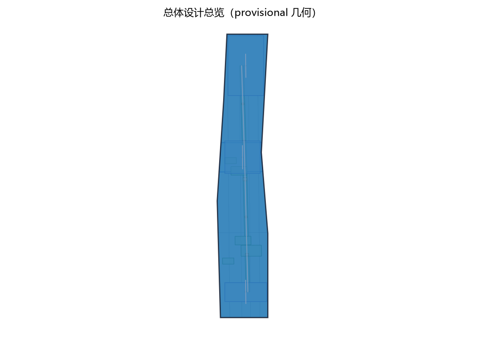
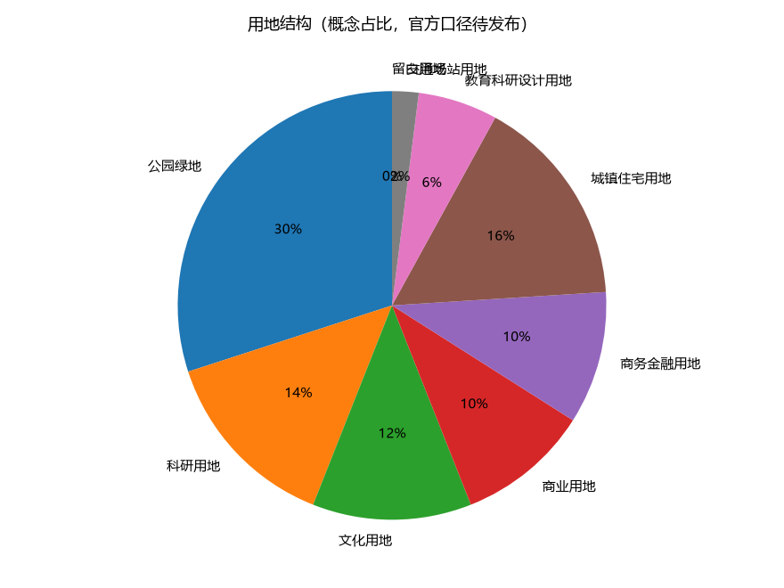
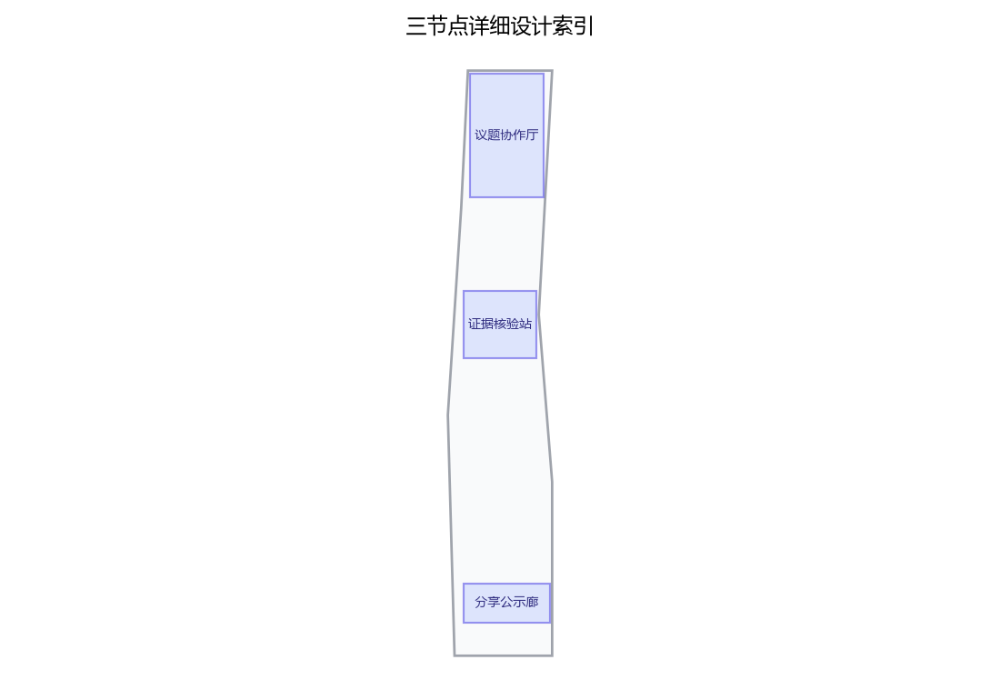
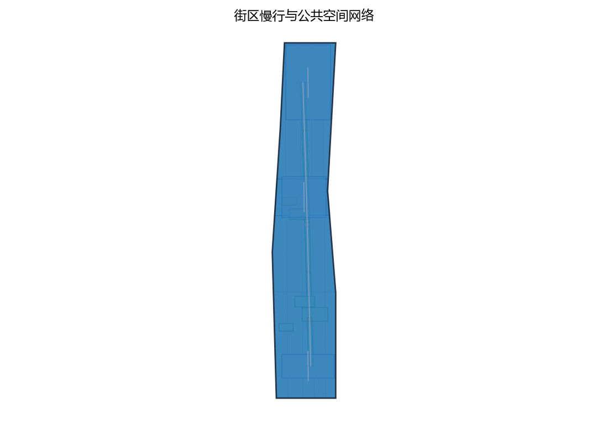
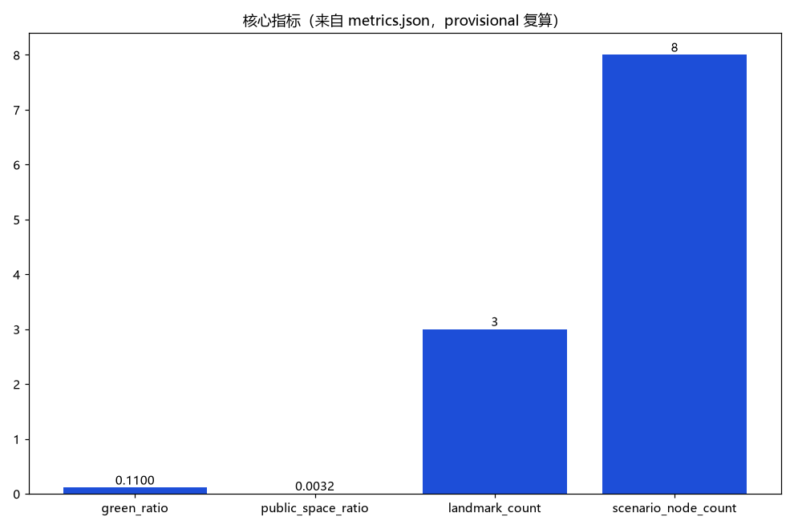

*本方案为概念建议：不给出现状数据之外的容积率、建筑高度、具体拆改留或工程实施结论；不编造任何官方数据；边界均标为 provisional。*

## 设计依据与资料清单
资料清单所列公开史料、规划报道、通则规范与国内外公众参与公开案例等均为概念工作依据清单，并非本包已获取的数据；本包实际使用的全部数据见 sources.json，未获取项已在假设与缺失数据说明中如实标注。

以下均为公开口径引用清单，非本方案已获取的数据：征集公告；征集任务书（含「持续参与与协作」continuous_participation 口径，即议题证据清单、外部数据登记与交叉验证、社交媒体分享、推荐协作循环等要求）；Issue 与 PR 协作公开规范（议题标题与影响范围、预期与实际行为、复现步骤、日志或校验输出、脱敏截图、数据来源与不确定性、具体问题或建议等证据要素）；京张铁路遗址公园沿线以留改拆并举、优先保留遗址公园肌理与铁路历史遗存为原则的公开表述；国内外公众参与、参与式预算、市民服务公开案例（见附录一、二）。

> **证据锚点**：[source:DATA-SRC-OFFICIAL-ANNOUNCEMENT-20260509]、[source:DATA-SRC-AGENT-TASKBOOK-20260518]（组织方公告与任务书为文本口径依据）。

## 三层范围工作框架
三层成果逐级传导：统筹研究输出的公众参与治理环境与沿线协同判断约束总体设计，总体设计校核的参与节点布局、参与网络骨架与时序生长落实到节点详设；每层均保留与任务书对应章节的机器可读证据锚点，便于评审对照。

工作框架分三层，各层边界均为 provisional，随议题推进与证据校核动态修订：统筹研究层——区域产业与未来城市研究，判断公众参与网络与各主体的协同关系，概念级；总体设计层——城市更新与控规深度城市设计，以遗址公园绿带为骨架组织参与网络，控规指标仅作校核建议；重点区域层——三节点详细设计，概念点位。三层共享同一「议题—证据—反馈」回路，保证顶层判断与节点设计不脱节。

> **证据锚点**：[source:DATA-SRC-AGENT-TASKBOOK-20260518]（三层范围划分依据任务书官方文本口径）。

## 统筹研究范围产业与未来城市研究
产业与城市研究识别公众参与机制的「适配」效应：以议题协作与证据核验把沿线高校、科创片区、轨道站点与住区的参与需求有序组织为可提出、可核验、可分享的参与单元，形成「参与节点—科创片区—住区」三级联动结构；未来城市研究仅作方向性预判，不构成对用地与投资的承诺。

本层作概念级协同关系判断，不量化：沿线高校提供议题研究与志愿者网络，科创片区承载创业者与 AI 开发者议题，轨道站点汇聚通勤与访客人流，住区贡献日常诉求与在地知识。设想形成「高校研究—科创验证—站点传播—住区校验」的参与闭环，议题池公开、证据互证、反馈回环。本层不给出产业规模与设施配置结论，仅作方向性判断，供总体设计层校核。

本主题与任务书三大定位、五大功能的功能映射（概念映射，非官方授权口径）：定位一「百年京张文化带」——依托京张铁路遗址公园绿带与历史遗存，议题协作厅、证据核验站、分享公示廊沿带展开，把百年京张文化转化为可提出、可核验、可分享的参与载体；定位二「都市 AI 生活体验带」——参与机制嵌入海淀城市日常，议题受理、意见反馈与活动预约成为沿线居民和访客可感知的 AI 生活体验；定位三「AI 融合创新带」——沿带高校、科创片区、轨道站点与住区通过议题协作和证据核验结成创新协同网络，服务中关村科学城与沿线产业。五大功能（AI 全栈自主创新体系、世界级 AI 创新生态、AI+ 场景赋能新范式、智能化 AI 活力城市、AI 治理全球话语权）中，本主题以「AI 治理全球话语权」和「AI+ 场景赋能新范式」为直接着力点：公开议事、证据核验与结果公示为 AI 治理提供城市级参与试验场，五个 AI+ 场景提供可复现、可评估的场景样本；参与活跃度、议题质量与分享合规性亦回馈世界级 AI 创新生态与智能化 AI 活力城市的功能目标，并为 AI 全栈自主创新体系补充公众参与底座。

> **证据锚点**：[source:DATA-SRC-PROVISIONAL-BOUNDARIES-20260605]（边界为 provisional，研究范围仅作概念示意）。

## 总体设计范围城市更新与控规深度城市设计
总体设计强调「以绿带为骨架的公众参与环境」：依托京张铁路遗址公园绿带组织参与节点、参与网络骨架与慢行系统，参与设施可逆生长、街道可分时承载参与与节事需求；强调更新而非新建，优先利用存量空间植入参与功能；对控规指标只做校核建议，不预设数值结论。

以京张铁路遗址公园绿带为骨架，组织参与节点与慢行骨架，构建「区域—节点—设施」三级参与网络：区域级为议题协作厅等中枢节点，节点级为沿线主题参与点，设施级为社区微参与设施（信息屏、信报栏等轻量媒介）。参与网络与绿带、轨道站点作一体化衔接考虑。控规指标只作校核建议，不提出调整结论；留改拆并举、优先保留遗址公园肌理与铁路历史遗存为底线原则。

> **证据锚点**：[source:DATA-SRC-MOHURD-CONTROL-DETAILED-PLANNING]、[source:DATA-SRC-PROVISIONAL-BOUNDARIES-20260605]。

## 重点区域详细设计
三节点的设施选址均为概念点位，须经现场踏勘、资料核验与主管部门评估及公众意见后重新落位；节点间的绿带动线与慢行通道构成完整参与动线，详细平面与剖面以图册与 geometry 层表达。

重点区域设三个原创节点，选址均为概念点位，待议题与证据校核后确认：①议题协作厅——议题与 Issue 协作中枢，公开议题收集、证据清单核对、Issue 与 PR 协作界面；②证据核验站——外部数据登记与交叉核验站，登记来源权威性与出处，交叉复核，未验证标注并转 Issue 讨论；③分享公示廊——成果公示与社交分享廊，提供可复现链接、创作与场地相关性说明、图示与替代文本、署名与许可，区分投稿/评审/入选/落地状态，保护隐私，发布前取得授权。三节点轻介入落地。三节点运行机制建议配套参与公约、议事规则、分级公示与档期轮换，场地可预约使用（概念建议）。

> **证据锚点**：[data:PACKAGE-GEOMETRY]（三节点示意多边形来自本包 geometry/key_areas.geojson）。

## AI 创新生态、人才画像与 AI+ 场景
议题聚类AI、证据台账AI、复现核验AI为主干场景，每处均配置人工复核兜底；分享文案AI、反馈处理AI为支撑场景；仅处理匿名聚合数据、关键决策人工复核双保险，不设过度监控（不进行个体识别式追踪）；公众参与机制为概念性机制建议，不替代法定程序与法定管理职责。
五类用户画像：创业者、AI 开发者、社区居民、学生、访客游客。五个 AI+ 场景：议题聚类 AI（议题归类去重）、证据台账 AI（外部数据登记台账维护）、复现核验 AI（复现步骤与校验输出核对）、分享文案 AI（场地相关性说明、图示与替代文本辅助）、反馈处理 AI（意见受理、回执与状态更新）。全部数据匿名聚合并辅以人工复核，禁止过度监控，不进行个体识别式追踪；AI 产出仅作辅助，结论性内容由人工确认。

五个 AI+ 场景与参与网络的服务领域覆盖交通、产业、空间、公共服务、文化、治理六个领域（与任务书 AI 与城市规划创新维度对应）：交通领域关注慢行优先与轨道站点衔接的参与动线，产业领域回应创业者、开发者与企业诉求，空间领域落实参与设施与公共空间的轻介入布局，公共服务领域提供议题接待与意见受理，文化领域承载京张与中关村文化叙事分享，治理领域支撑公开议事、证据核验与结果公示。均为概念性对应关系，不预设各领域指标。

五个 AI+ 场景的场景卡索引如下（概念级）：

| 场景名称 | 空间载体 | AI能力 | 数据与隐私边界 | 运营主体 |
| --- | --- | --- | --- | --- |
| 议题聚类 AI | 议题协作厅（公共参与空间） | 议题归类去重、主题聚合与热点识别（覆盖产业、交通、治理等议题） | 议题匿名聚合，不进行个体识别式追踪 | 运营团队与志愿者 |
| 证据台账 AI | 证据核验站（核验工作空间） | 外部数据登记、出处台账维护与去重比对 | 出处记录与登记备案，未验证内容标注，人工复核 | 专业团队 |
| 复现核验 AI | 证据核验站（核验工作空间） | 复现步骤与校验输出核对 | 仅处理公开可复现数据，匿名聚合 | 专业团队与高校志愿者 |
| 分享文案 AI | 分享公示廊（文化展示与分享空间） | 场地相关性说明、图示与替代文本辅助 | 授权后发布，版权标注，禁止过度监控 | 运营团队 |
| 反馈处理 AI | 议题协作厅（公共服务入口） | 意见受理、回执生成与状态更新 | 匿名聚合，人工复核兜底 | 运营团队 |

> **证据锚点**：[source:DATA-SRC-GENERATIVE-AI-INTERIM-MEASURES]（AI 生成内容治理表述的参照依据）。

## 用地、建筑规模与拆改留方案
拆改留坚持留改拆并举：以留为主保留遗址公园肌理与铁路历史遗存，存量建筑功能置换并预留参与化改造方向（议题空间接口、公示窗口），拆除仅限经个案论证的局部疏通慢行零星建筑；参与设施以轻介入、可逆、低占地为主，不新增大体量建筑；全部面积为概念口径，官方数据发布后复算。

参与设施坚持轻介入、可逆、低占地原则：优先利用既有空间与临时性构筑物，不新增大体量建筑，不预设用地规模与建筑面积数值。留改拆并举为概念性取向：优先保留遗址公园肌理与铁路历史遗存，参与设施避让历史遗存并采用可逆安装；具体留改拆对象、边界与数值均不预设，待后续证据与校核结论形成后再议。

> **证据锚点**：[source:DATA-SRC-MNR-LAND-USE-CLASSIFICATION-202311]（用地分类名称参照现行国标口径）。

## 交通、轨道、市政与公共服务设施
以交通慢行优先为核心组织交通概念机制：连续慢行轴贯通议题协作厅、证据核验站与分享公示廊，参与网络与慢行系统一体化，衔接沿线高校、园区与轨道站点（接驳以步行与骑行为主），信息屏与导向设施沿慢行空间低干预布置；市政以集约共享为原则，设施与建筑一体化概念、优先利用现状设施条件；公共服务配置多语信息、议题接待与研习空间，AI决策均设人工复核；公众意见通道线上线下衔接——慢行沿线设意见箱与扫码入口，议题建议受理后生成回执并可进入公开议事流程（概念建议）。

以慢行优先为原则：连续慢行轴贯通议题协作厅、证据核验站、分享公示廊三节点，参与节点与慢行系统一体化衔接；轨道站点接驳顺畅，出站至参与节点的路径连续、可识别。设施照明、参与信息屏、无障碍与标识系统纳入市政一体化概念统筹。本节仅作概念性整合建议，不预设道路断面、工程规模等数值。

> **证据锚点**：[source:DATA-SRC-MOHURD-URBAN-DESIGN-MEASURES]（市政与慢行设计表述的方法参照）。

## 蓝绿空间、公共空间与城市风貌
构建「绿带为轴、节点公园为珠」的蓝绿公共空间体系：以遗址公园绿带为蓝绿骨架串联沿线小微绿地与开敞空间，参与设施与公园融合布置、宜轻宜透宜可逆，不遮挡历史遗迹与绿带视线；信息与解说系统统一克制；风貌延续京张铁路工业记忆语汇并与创新有序的新氛围对话，整体风貌导控克制统一，避免符号堆砌与口号化包装。

蓝绿公共空间体系保持连续：参与设施与公园绿地低干预融合，采用轻量、可逆、可拆除的介入方式；风貌克制统一，色彩与材质服从遗址公园基调，不遮挡历史遗迹视线廊道。公共空间兼顾日常休憩与参与活动，弹性共享。不改动公园肌理与历史遗存本体，不设定具体风貌改造措施。

公共空间按全龄友好的概念取向配置参与设施与活动：考虑长者与银龄人群的适老设施与服务，儿童与亲子活动的儿童友好设计，残疾人及弱势群体的无障碍通道与辅助服务，兼顾居民、游客、学生、通勤人群与沿线从业者的日常使用，坚持包容性参与原则；信息提示以多语、大字与图示版本提供，需求与意见可通过线下意见站与线上通道反映（概念建议）。

> **证据锚点**：[source:DATA-SRC-MOHURD-URBAN-DESIGN-MEASURES]（蓝绿空间组织的方法参照）。

## 更新项目清单、实施政策与分期计划
四类项目清单（议题受理/证据登记/分享公示/年度更新）为概念清单，规模与投资估算均为建议性表述；政策建议（议题受理规程、证据登记与核验规程、分享发布准则、上传统检机制）均须依法依规论证，不构成政府或运营方承诺。

分期为概念建议：近期 1-3 年，建立参与机制基础规程（议题受理规程、证据登记与核验规程、分享发布准则、上传统检机制）并试点样板节点；中期 3-5 年，三节点建成、慢行轴贯通；远期 5-10 年，形成全域持续参与机制与年度更新。协作循环参照任务书推荐循环设计：轻量工作区、同步 main、读同伴方案、参与 Issue 与 PR、登记外部数据、分享成果、更新 changelog、复跑自检、上传统检。全文不含暗示政府承诺的表述。

治理机制建议（概念建议，未定安排）：建议由政府部门会同运营团队、高校与沿线企业、居民与社区代表及志愿者组成议事机制，对议题采纳、场地安排与活动档期作出共同决策；建议议事记录、议题清单与决策依据在分享公示廊与线上平台公开公示，反馈处理 AI 生成的意见回执可供公众随时查证；建议专业团队负责人工复核与年度复算，公众可就公示内容提出核验与申诉，形成专业与公众并行的监督闭环。

参与主体建议覆盖政府（主办与指导）、企业（产业与平台机构）、高校（师生与科研机构）、居民（社区居民代表）、社区（社区组织）、运营（运营团队）、志愿者、商户（沿线商业）、专业团队（规划、设计与技术）等多元角色，按议题影响范围分工协作。年度活动体系设想（概念）：公众参与开放日（日）、议题协作周（周）、议题协作通报会（季）、成果分享节（节），辅以月度常规活动（月），与年度复算、年度公示及参与积分（试行）衔接；沿线站点、高校与社区可结成参与联盟，共建议题节奏与活动日历。

> **证据锚点**：[source:DATA-SRC-AGENT-TASKBOOK-20260518]（分期与实施条目对应任务书要求）。

## 指标体系、面积复算与合规矩阵
议题响应率、证据核验覆盖率、意见处理率、分享内容合规率、参与活跃度五类概念指标体系进入 metrics.json；三项formal核心指标（site_area_sqm、green_ratio、public_space_ratio）以本包几何复算为准，面积复算以官方文本口径为底，官方数据到位后整体复算并标注复算版本。

概念指标体系：议题响应率、证据核验覆盖率、意见处理率、分享内容合规率、参与活跃度，均为过程性观测口径，不设硬性目标。三项 formal 核心指标以本征集包几何复算为准，本方案不替代、不发布复算数值；面积复算以官方文本口径为底数，仅在合规矩阵中标注校核位，不自行出具面积结论。

> **证据锚点**：[metric:green_ratio]、[metric:public_space_ratio]、[source:PACKAGE-GEOMETRY]。

## 风险、版权与合规说明
本方案为概念研究性设计，不构成行政审批依据，也不构成容积率、建筑高度、拆改留或工程可行性结论；风险已按参与数据隐私边界、议题与分享内容准确性、AI生成内容与字体图片版权、参与热度波动与机制可持续性、文保绿线控制条件未知五维度如实登记于 assumptions.json 与缺失数据说明（应对原则：匿名聚合、来源标注、人工复核、意见通道与法定程序）；引用公开资料均已标注来源并注明获取时间，图形、名称与文字为原创或公共领域素材，若与既有标识雷同属巧合；表达不歪曲事实，未经授权不使用肖像商标字体图片论文图像等版权材料；正式实施前须完成多部门联审与公开评估。

风险如实登记（概念级）：参与数据隐私边界（最小化收集、匿名聚合、授权后发布）；AI 生成内容与图片、字体版权（标注生成来源与授权情况）；议题与分享内容准确性（未验证内容标注、人工复核）；参与热度波动（短期热点与长期均衡）；机制可持续性（运维、人力与经费依赖）。相应缓解措施均为建议，不构成实施承诺。

> **证据锚点**：[source:DATA-SRC-OFFICIAL-ANNOUNCEMENT-20260509]（征集规则为权属与合规表述的依据）。

## 参考资料
参考资料以政府正式发布版本为准，按公开/内部分类存档并标注获取时间：京张铁路历史与遗址公园公开材料（含詹天佑与京张铁路公开史料口径）、北京城市总体规划及分区规划公开口径、北京城市更新专项规划与实施意见及配套文件、任务书「持续参与与协作」口径与公开协作规范、国内外公众参与公开案例（赫尔辛基OmaStadi参与式预算、巴黎参与式预算、纽约311市民服务、台北i-Voting参与式预算，以及北京12345接诉即办、上海人民建议征集、深圳民生诉求一体化平台、杭州民呼我为国内对标）、现场踏勘记录与自绘分析草图（本项目自行采集）；本包 sources.json 仅收录可查证条目，未虚构任何官方数据或链接。

参考资料为引用清单，非已获取数据：①征集公告；②征集任务书（含「持续参与与协作」口径及推荐协作循环）；③Issue 与 PR 协作公开规范；④京张铁路遗址公园公开背景资料（留改拆并举、优先保留遗址公园肌理与铁路历史遗存等表述）；⑤国际案例与国内对标（见附录一、二）；⑥参与式预算、市民服务领域公开文献。具体版本与链接以征集发布渠道为准。

> **证据锚点**：[source:DATA-SRC-OFFICIAL-ANNOUNCEMENT-20260509]（本清单首条即组织方公开资料包）。

## 附录一：国际案例（概念引用）

- **赫尔辛基 OmaStadi 参与式预算**：市民提案—线上投票—预算分配，全程公开。借鉴：议题公开收集、证据清单与结果反馈。
- **巴黎参与式预算**：全市规模提案与投票，分主题项目库。借鉴：议题分类池与成果公示。
- **纽约 311 市民服务**：非紧急服务统一入口，诉求全程可追踪。借鉴：意见受理回执与状态公开。
- **台北 i-Voting 参与式预算**：线上提案投票结合线下讨论。借鉴：线上线下结合参与循环。

## 附录二：国内对标（概念引用）

- **北京 12345 接诉即办**：受理—派单—办理—回访闭环。借鉴：响应闭环与办理透明。
- **上海人民建议征集**：常态化建议征集与采纳转化。借鉴：建议采纳公示。
- **深圳民生诉求一体化平台**：多渠道统一受理与办理。借鉴：统一登记口径与证据归集。
- **杭州民呼我为**：民意直达与办理反馈。借鉴：办理状态公开与回访。
