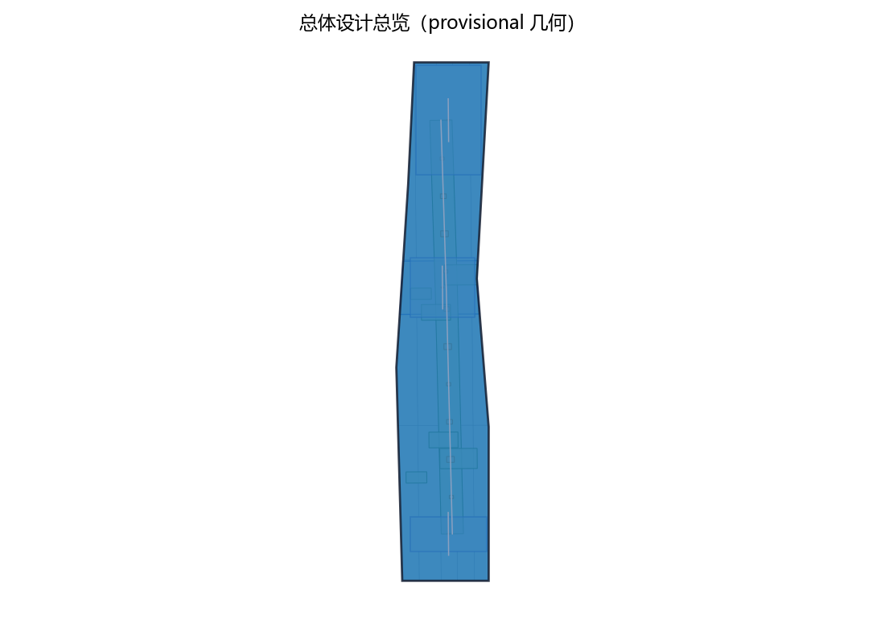
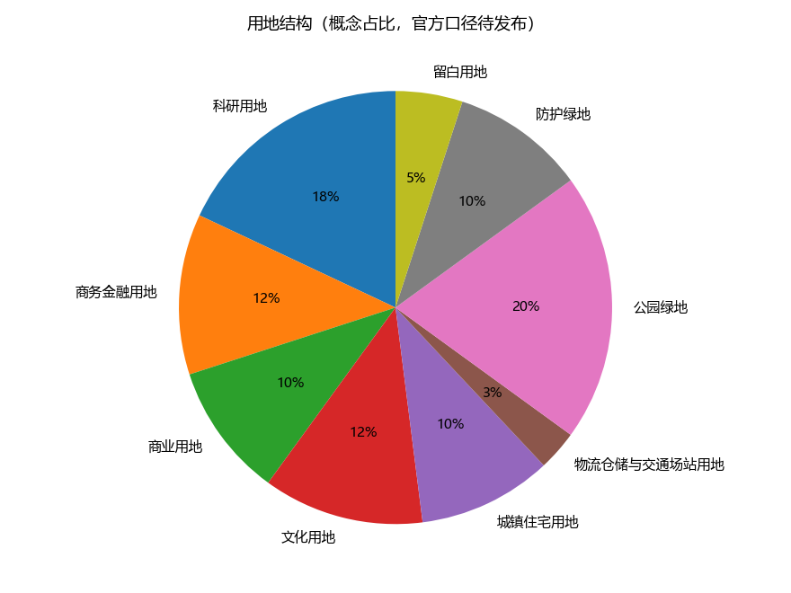
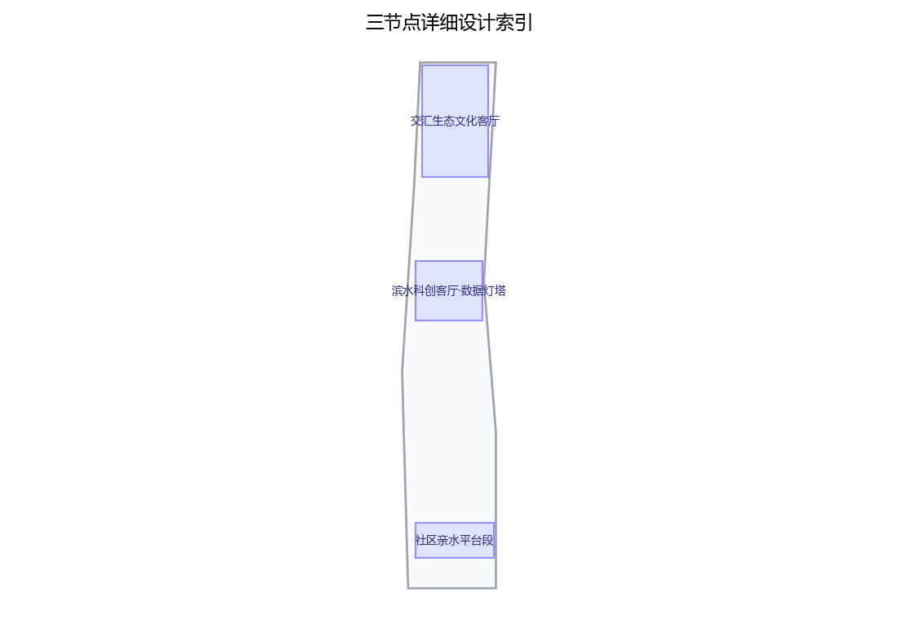
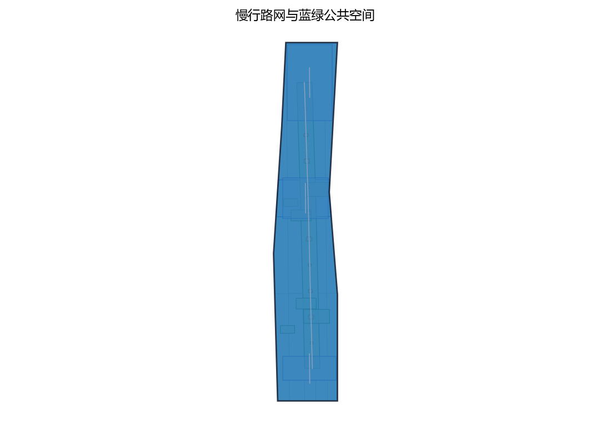
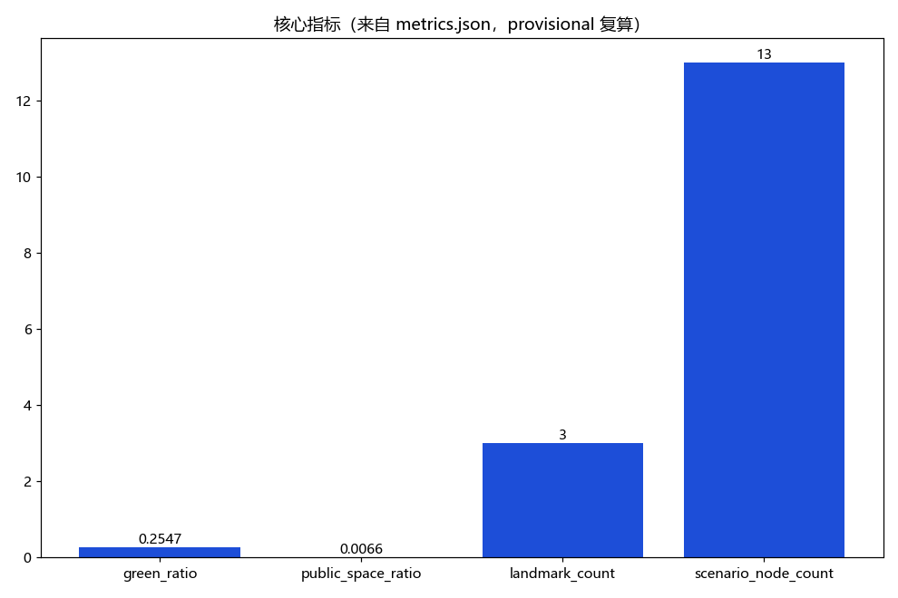

### — 百年京张AI创新带·清河滨水蓝绿走廊与创新公地城市设计（概念方案正文草稿）

**方案主名称（中文）：清河智岸 · AI创新公地**
**英文名称：Qinghe Smart Shore — AI Innovation Commons（QSS-AIC）**

**方案定位**：本方案是面向「百年京张AI创新带」开放征集的**概念设计方案**，聚焦真实水系节点「清河」及其与京张铁路遗址公园北段、沿线创新组团相邻的滨水段落，提出「水岸AI生态修复 + 滨水科创客厅 + 平急两用」三位一体的创新公地构想。方案全部成果均为**概念建议与参考方向**，不替代法定规划，不给出控规调整、容积率、建筑高度、道路红线、工程可行性、投资测算等法定结论；所有面积、比例均为**概念示意值，待正式数据复算**；所有 AI 场景均设**人工复核/人工兜底**，水环境监测类数据仅作展示与研究用途，不替代官方水质监测。

**设计理念**：以「水岸即公地（Waterfront as Commons）」为核心理念——清河不仅是生态廊道，更是 AI 时代共享的**创新公地**：共享的蓝绿基础设施、开放的场景数据、低门槛进入的公共空间、混合共生的功能生态，让河流成为创新要素流动的「湿线」。

**空间结构：一廊三核多点**
- **一廊**：清河智慧蓝绿廊（Qinghe Smart Blue-Green Corridor）——滨水生态、慢行、科创、文化复合走廊；
- **三核**：**文枢核**（清河×京张铁路遗址公园交汇段，文化交汇）、**涌智核**（清河滨水科创客厅段，创新交汇）、**栖澜核**（滨水社区公共空间段，生活交汇）；
- **多点**：AI 场景点、滨水驿站服务点、生态观测点组成的场景网络。

**六项必答任务响应对照**：agent.1 概念与命名体系见摘要及第2~4章；agent.2 见第6章（案例表）；agent.3 见第6章（场景卡、测试验证场景、用户画像）；agent.4 见第4、5、6、7章（三个朝圣地标）；agent.5 见第4章（叙事与导视符号系统）；agent.6 见第10章（活动体系与运营）。

---

## 设计依据与资料清单

### 1.1 设计依据

本方案依据以下公开信息与工作框架形成，具体文件以提交时公开可查版本为准：

1. 征集任务书及公开背景材料（「百年京张AI创新带」三大定位、五大功能、「三区两翼」空间格局、沿带真实城市节点）；
2. 北京市及海淀区公开的规划、水务、生态环境相关信息（类别见 1.2）；
3. 京张铁路遗址公园建设进展的公开报道与开园运营信息；
4. 公开的 AI 产业发展政策、行动方案与场景开放类政策文件（类别见 1.2）；
5. 全球知名创新区、滨水更新与智慧城市的公开案例研究（仅作方法参考，不引用其未经核实的数据）。

**基本工作立场**：本方案所有空间建议均为概念建议，供专业团队深化研究；涉及法定内容的一律指向「由主管部门与法定规划确定」。

### 1.2 资料清单（公开资料类别 + 获取方式）

| 类别 | 主要内容 | 获取方式 | 使用边界 |
| --- | --- | --- | --- |
| 政府公开信息 | 海淀区分区规划公开摘要、北京市水务与生态环境公开信息、河长制公示信息 | 市/区政府官网、水务部门官网公开检索 | 仅引用公开表述，不作专业判断依据 |
| 公开新闻报道 | 京张铁路遗址公园开园与活动报道、清河治理与滨水空间公开报道 | 主流媒体公开检索 | 仅作背景叙事，数据以官方口径为准 |
| 公开统计数据 | 人口、产业、水质公开年报类数据 | 统计部门、生态环境部门公开平台 | 需正式数据复算后方可引用 |
| 公开案例研究 | 全球创新区、滨水更新、智慧城市案例 | 公开出版物与学术文献 | 仅作方法参照，不编造案例数据 |
| 政策文件 | AI 产业、数字经济、场景开放类公开政策 | 政府网站公开文本 | 引用须核验现行有效版本 |

---

> **证据锚点**：[source:DATA-SRC-OFFICIAL-ANNOUNCEMENT-20260509]、[source:DATA-SRC-AGENT-TASKBOOK-20260518]（组织方公告与任务书为文本口径依据）。

## 三层范围工作框架

### 2.1 三层范围划分

| 层级 | 范围界定（概念） | 工作重点 | 成果深度 |
| --- | --- | --- | --- |
| 统筹研究范围 | 京张铁路遗址公园及沿线创新组团、清河及其流域相邻城市段落（含上地/中关村软件园、知春路、中关村大街、学院路等沿线节点） | 产业与未来城市研究、蓝绿骨架、滨水经济带逻辑 | 战略研究（概念级） |
| 总体设计范围 | 清河滨水蓝绿走廊核心段及两侧相邻城市地段（长度、宽度均待正式数据复算） | 蓝绿走廊、公共空间网络、风貌、慢行、更新框架 | 城市设计（概念级，控规深度工作框架） |
| 重点区域详细设计 | 三个重点节点（见第5章） | 详细设计概念、地标、场景落位 | 重点地段详细设计（概念建议） |

### 2.2 工作逻辑

三层范围遵循「战略—结构—节点」的传导逻辑：统筹层回答「滨水与 AI 创新带的关系」，总体层回答「廊道怎么组织」，重点层回答「人的体验与场景如何发生」。每层成果均标注「概念建议，可供专业团队深化研究」，不替代相应层级的法定规划。

---

> **证据锚点**：[source:DATA-SRC-AGENT-TASKBOOK-20260518]（三层范围划分依据任务书官方文本口径）。

## 统筹研究范围产业与未来城市研究
### 3.1 区域研判

沿「三区两翼」格局观察，清河位于海淀北部，与京张铁路遗址公园北段及沿线创新组团相邻。京张铁路承载百年交通记忆，中关村承载中国创新启蒙，AI 承载当下最活跃的产业变革；清河以「水」的柔性把这三条叙事缝合为一条可感知、可漫步、可发生的公共轴向。基于公开信息判断（概念级）：清河是沿带**北段最有潜力成为"蓝绿基座"**的真实水系节点，其价值不在于水体本身的大小，而在于它同时毗邻创新组团与城市社区，具备「创新公地」的空间条件。

### 3.2 滨水经济带逻辑：碧水+科创

滨水经济带的内核是「公共空间的吸引力经济」：

- **场景引力**：滨水公共空间是 AI 场景最容易被公众感知的舞台（生态感知、无人接驳、生成式艺术、平急演练），直接支撑「都市AI生活体验带」定位；
- **人才引力**：创新人才选择城市时看重"步行可达的绿色与活力"，滨水公地是 AI 原点社区与各创新组团之间的「人才后花园」；
- **生态溢价**：水环境改善提升相邻地段的环境品质预期，但本方案**不作出任何地产价值判断与测算**，仅作为城市更新方向的定性依据；
- **时间轴价值**：铁路是"过去的速度"，水是"永恒的基础设施"，AI 是"正在发生的创新"——三者构成的时空叙事是沿带独有的文化资产。

### 3.3 未来城市愿景方向

按照 AI 活力城市与 AI 治理话语权的定位，清河段未来城市方向建议（概念级）：

- **水敏城市**：把"治水"转为"与水共生"——弹性岸线、雨水花园、生态净化展示成为城市日常景观；
- **平急两用**：滨水空间在平日作为公共客厅，在极端天气与应急场景下承担疏散、临时集散、物资中转的**辅助功能**（具体功能配置以应急、水务、属地主管部门要求为准，不作法定承诺）；
- **数智治理窗口**：以公开、可复核的水环境感知数据展示为窗口，探索"数据公地"模式——数据向公众与研究机构开放，但仅作展示与研究用途，不替代官方监测。

---

> **证据锚点**：[source:DATA-SRC-PROVISIONAL-BOUNDARIES-20260605]（边界为 provisional，研究范围仅作概念示意）。

## 总体设计范围城市更新与控规深度城市设计
### 4.1 总体设计概念：一廊三核多点

- **一廊**：以连续性为第一原则，构建「生态岸线—滨水慢行—街坊渗透」三层平行的蓝绿廊道结构，廊道宽度、岸线长度等均以**概念示意值**表达，待正式数据复算；
- **三核**：三核按「文化—创新—生活」的功能谱系错位布局，避免同质化；
- **多点**：场景点与驿站按步行可达间距（概念区间，待复算）布置，形成"走一段、遇一景、用一场景"的密度体验。

### 4.2 城市更新与控规深度设计（概念工作框架）

本方案仅提供**控规深度城市设计的"工作框架"**，不替代法定控规：

1. **滨水退距与通廊**：建议以概念性退距区间（量级区间，待正式数据复算）研究滨水公共空间连续性，最终以水务管理范围与法定规划为准；
2. **天际线与高度**：不做高度结论，仅建议「临水低、向城渐高」的风貌原则与眺望关系研究议题；
3. **地块更新意向**：以「保留—更新—可研究」三分类表达意向（见第7章），不涉及具体地块拆改留结论；
4. **公共空间体系**：广场、驿站、桥头空间、街巷渗透点构成"点—线—面"网络。

### 4.3 百年京张、中关村与 AI 新文化叙事及导视符号系统

**叙事三章**：

- **第一章·轨道记忆（百年京张）**：枕木、道钉、站台、机车的铁路符号；
- **第二章·创新启蒙（中关村）**：柜台、电子元件、屏幕光的市井创新符号；
- **第三章·开源公地（AI 新文化）**：数据流、回路、节点网络的开放符号。

**导视符号系统（概念）**：以四类基本图元构建统一语言——①枕木纹（历史）、②路轨折线（交通与延续）、③数据回路（AI 与开源）、④水波纹（清河本体）。图元组合生成分级导视：**地标级**（清波数据灯塔等三个朝圣地标）、**廊道级**（慢行标识与里程柱）、**场景级**（AI 场景点标牌）、**铺装级**（地面嵌入符号）。AI 辅助导视（语音导览、AR 叠写）的知识库须**人工审核后上线**，确保历史叙事准确。

### 4.4 风貌控制概念

建议「水岸低柔、城侧明晰」：近水以自然化岸线与低介入构筑物为主；桥梁与地标装置允许"高识别度、轻触地面"的构筑表达；建成界面沿河一侧鼓励通透、遮蔽立面退让；照明以低照度生态照明为主，减少对水鸟栖息的光干扰（光环境控制为风貌议题之一，不作工程结论）。

---

> **证据锚点**：[source:DATA-SRC-MOHURD-CONTROL-DETAILED-PLANNING]、[source:DATA-SRC-PROVISIONAL-BOUNDARIES-20260605]。

## 重点区域详细设计
> 三节点均为沿清河的**真实可指认城市段落**（交汇段、滨水科创客厅段、滨水社区公共空间段），具体边界以正式地形与权属数据复算为准，本方案仅作概念建议。

### 5.1 文枢核：清河×京张铁路遗址公园交汇段

- **位置指认**：清河与京张铁路遗址公园北段相邻的滨水段落（概念示意）；
- **设计概念**：「轨道与水流的历史握手」——铁路高架/地面遗迹与河道在视觉与步行上互相"看见"，设置**跨河步行桥（概念建议，桥名建议「澄波桥」）**强化两廊交汇；
- **核心地标**：**清波数据灯塔**（见 5.4）；
- **主要功能**：京张历史叙事起点、水环境感知展示、研学集散、文化事件场地。

### 5.2 涌智核：清河滨水科创客厅段

- **位置指认**：毗邻上地/中关村软件园方向创新组团的清河滨水段落（概念示意）；
- **设计概念**：「把会议室搬到水边」——滨水科创客厅以开放路演台、模块化共创舱、24小时共享驿站构成"无围墙的创业公地"，与既有创新组团错位互补，不重复建设园区设施；
- **核心地标**：**AI生态观测方舟**（见 5.4）；
- **主要功能**：开放路演、场景展示、开发者交流、轻量化共创空间（概念建议，规模区间示意，待复算）。

### 5.3 栖澜核：滨水社区公共空间段

- **位置指认**：清河沿线以居住功能为主、滨水可达性待提升的城市段落（概念示意）；
- **设计概念**：「社区的水岸客厅」——亲水台阶、雨水花园、儿童自然课堂、银发友好驿站与社区菜园构成日常生活场景；该段同时是**平急两用**重点研究段：平日为社区公地，急时为辅助疏散与集散空间（功能与设施以主管部门要求为准）；
- **核心地标**：**岸线回声廊**（见 5.4）；
- **主要功能**：亲水游憩、自然教育、社区活动、辅助应急功能。

### 5.4 三个原创 AI 朝圣地标

| 地标名称（中/英） | 空间位置建议 | 形态概念 | 体验方式 |
| --- | --- | --- | --- |
| **清波数据灯塔**（Data Beacon of Qinghe Waves） | 文枢核·清河与京张遗址公园交汇段桥头或河湾高处（概念示意） | 竖向上小下大的"灯塔"式构筑，塔身环绕可读的数据光带：将水环境感知数据以"数据瀑布"形式可视化；塔基为环形展示厅，兼具小型展陈与休憩功能 | 白天阅读数据光带与历史年表并置的"双子时间轴"；夜间观看生态灯光节律；AR 扫码叠加京张历史影像（知识库人工审核）；可与科研机构共建展陈，水质数据仅展示与研究用途 |
| **岸线回声廊**（Shoreline Echo Gallery） | 栖澜核·社区段沿河栈道串联的连续廊道（概念示意） | 由回收再利用理念启发的枕木纹步道、声景装置与"回声节点"组成；装置采集并重放水声、风声、脚步与铁路记忆声景，形成可听的地图 | 盲文/语音导览优先设计；每个回声节点设"听澜"打卡点；社区儿童可参与声景采集（上传内容人工审核后发布） |
| **AI生态观测方舟**（AI Eco-Watch Ark） | 涌智核·滨水科创客厅段河湾处（概念示意） | 抬升式/近岸式"方舟"形态观测平台，舱体集成生态识别展示（鸟类、植物、水生生物影像识别为研究与科普用途）；甲板兼作小型路演与观演台 | 面向公众的"自然识别窗口"与面向研究机构的共建观测界面；识别结果标注「AI 辅助识别，以专业人员复核为准」；方舟夜间转作生态课堂与星空观测 |

**命名体系**：全带以「水（清/澜/澄/听）+ 创新（智/汇/创/枢）+ 空间类型（廊/桥/台/灯塔/方舟）」三词根组合命名子要素，如澄波桥、听澜栈、观澜台、智汇驿等，保证系统性与可延展性。**声明**：名称均为本方案原创构思，若与既有参赛方案或实际地名重名，以提交时查重及主管部门意见为准。

---

> **证据锚点**：[data:PACKAGE-GEOMETRY]（三节点示意多边形来自本包 geometry/key_areas.geojson）。

## AI 创新生态、人才画像与 AI+ 场景
### 6.1 世界级AI创新生态：方法参照案例（仅作方法参考，不引用其数据）

| 案例 | 类型 | 可借鉴的方法（非数据对标） |
| --- | --- | --- |
| 波士顿剑桥 Kendall Square | 大学锚定型创新区 | 锚机构+高密度公共空间+风险资本邻近的"步行创新圈"组织方式 |
| 伦敦国王十字（King's Cross） | 铁路遗产地更新 | 铁路遗产地再开发中"公共空间先行、文化地标塑形"的公地运营思路（与京张主题高度相关） |
| 巴黎 Station F | 旧铁路场站改造创业社区 | 存量交通遗存改造为开放创业公地，以"活动与社区运营"为核心资产 |
| 巴塞罗那 22@ 创新区 | 旧工业区更新 | 创新与居住、公共空间再平衡的混合用地组织方式 |
| 新加坡纬壹科技城（one-north） | 产城融合园区 | 园区级公共绿地作为"社交中枢"，以及城市级智慧水务管理的公开界面 |
| 斯德哥尔摩 Kista 科学城 | 产业集群社区化 | 企业、高校、社区共用的公共设施与开放交流空间 |
| 多伦多 Quayside（Sidewalk Labs）反思案例 | 智慧滨水区（失败案例） | 智能城市中"数据治理、公共性优先"的警示：技术介入必须以公共价值与公众审议为前提 |

**方法结论（概念级）**：世界级 AI 创新生态的共同点不是建筑高度或企业名单，而是「锚点机构 + 开放公地 + 低成本试错空间 + 高频活动」四要素。清河段不复制任何案例，只借鉴其"公地组织"方法。

### 6.2 AI全栈自主创新体系的空间化建议（概念级）

呼应「AI全栈自主创新体系」功能定位，建议清河段承担其中**「场景侧的体验与验证」**职能，与原点社区（生态）、众智园（技术体系与治理话语权）、大钟寺（产业集聚）形成分工：清河提供"真实水岸环境的 AI 场景试验床与公众体验场"，包括感知层（水环境监测展示、生态识别）、平台层（开放 API 沙箱与数据公地界面）、应用层（慢行助手、导览、应急演练展示等）。技术体系本身由指定创新组团承担，本方案不越界定义。

### 6.3 用户画像（7类）

| 画像 | 核心诉求 | 典型行为 | 对应空间/场景 |
| --- | --- | --- | --- |
| 开发者/工程师 | 午间喘息、通勤顺路、偶遇交流 | 午休漫步、露天路演围观、代码间隙发呆 | 涌智核驿站、回声廊 |
| 初创团队 | 低成本路演、曝光、找人 | 预约开放路演台、参与黑客松 | 滨水科创客厅、方舟甲板 |
| 高校师生/科研人员 | 真实环境数据样本、科普输出 | 生态观测共建、传感器示范观察 | 观测方舟、数据灯塔展陈 |
| 社区居民（含银发） | 日常可达、安全舒适、被照顾 | 晨练、遛弯、下棋、听声景 | 栖澜核亲水台阶、驿站 |
| 亲子家庭 | 自然教育、安全戏水观察 | 自然课堂、声景采集、打卡 | 儿童自然课堂、雨水花园 |
| AI 研学者/游客 | 体验"未来城市"、拍照出片 | 朝圣地标打卡、AR 导览 | 三者地标、导视系统 |
| 应急相关工作人员 | 平急转换可操作 | 演练、设施检查 | 平急两用节点 |

### 6.4 AI场景卡（12张）

> 通用边界：所有场景均为概念建议；所有 AI 输出均设**人工复核/人工兜底**；涉及水环境数据仅作展示与研究用途，不替代官方水质监测；涉及个人数据遵循最小化与知情同意原则。

| 编号 | 场景卡 | 空间落位建议 | AI 能力介入 | 人工复核/兜底 | 数据边界 |
| --- | --- | --- | --- | --- | --- |
| S01 | 清波智感·水环境展示 | 数据灯塔、方舟 | 感知设备数据可视化 | 数据发布前人工核验；标注非官方口径 | 仅展示与研究，不替代官方监测 |
| S02 | 岸线回声·声景AI导览 | 回声廊全段 | 声景生成与语音导览 | 历史知识库人工审核 | 上传声景人工审核后发布 |
| S03 | 智岸同行·无障碍慢行助手 | 全廊道 | 路径推荐、语音/手语向导 | 紧急求助人工响应兜底 | 位置数据脱敏、可关闭 |
| S04 | 观澜识别·生态AI学习卡 | 观测方舟 | 鸟类/植物影像辅助识别 | 识别标签由专业人员复核 | 仅科普与研究，非科研结论 |
| S05 | 平急推演·洪涝态势展示屏 | 三核公共节点 | 基于公开数据的态势推演演示 | 仅演示，不替代官方预警体系 | 引用官方公开预警口径并标注 |
| S06 | 科创客厅·AI路演数字墙 | 涌智核路演台 | 路演摘要、字幕、多语翻译 | 内容发布前人工审核 | 演讲内容版权归讲者 |
| S07 | 开发者公地·开放API沙箱 | 涌智核驿站（虚拟+实体） | 场景数据接口开放（脱敏） | 接口申请人工审核 | 仅开放脱敏/自采数据 |
| S08 | 智游打卡·活动徽章系统 | 三核+多点 | 活动路径推荐与集章 | 线上活动秩序人工管理 | 参与数据最小化 |
| S09 | 中关村问答亭·知识对话 | 文枢核 | 京张/中关村史问答（大模型） | 知识库人工审核、拒绝回答超范围问题 | 不接入未公开档案 |
| S10 | 儿童AI自然课堂 | 栖澜核 | AI辅助观察提示 | 教师/志愿者人工兜底 | 未成年人数据不采集 |
| S11 | 水岸生成艺术屏 | 廊道节点 | 实时环境数据驱动的生成艺术 | 内容模板人工审定 | 数据公开口径展示 |
| S12 | 平急两用·辅助功能标识 | 平急两用节点 | 数字标牌的快速切换显示 | 切换指令由运营方人工确认 | 应急信息以官方发布为准 |

### 6.5 AI测试验证场景（4个，均须合规审批）

1. **滨水低空视觉巡检验证环（概念）**：在限定时段、限定空域内演示无人机/巡检机器人视觉识别，须符合飞行与低空管理规定，人工安全员全程兜底；
2. **无人接驳与环卫机器人示范环（概念）**：封闭或半封闭示范段，安全员随行，人机混行规则先行制定；
3. **水环境智能感知设备示范验证区（概念）**：设备与官方监测并行比对，其结果**不得用于行政监管与法定用途**，仅作研究展示；
4. **平急两用数字孪生演练（概念）**：与属地应急部门合作开展桌面与实地演练展示，不替代法定应急预案。

### 6.6 场景—空间—运营映射

| 空间层级 | 承载场景 | 运营模式建议 |
| --- | --- | --- |
| 地标/节点 | S01、S05、S06、S09 | 政府公共服务+科研机构共建+志愿者 |
| 廊道/慢行 | S02、S03、S08、S11 | 场景开放清单+公开活动排期 |
| 驿站/社区段 | S07、S10、S12 | 公益运营+社区共治+开发者社群认领 |
| 测试验证环 | 4个验证场景 | 申请-审核-备案制，限定条件开放 |

### 6.7 人工复核与数据边界总原则

每个 AI 场景都遵循「AI 原生生成、人工复核发布、数据按用途分级」：①凡面向公众的知识、历史、应急、水质内容，发布前必须人工复核；②水环境数据一律标注"仅作展示与研究用途，不替代官方水质监测"；③个人数据最小化采集并支持注销；④AI 参与度分级公示（纯人工/人机协同/AI 原生）写入场景卡。

---

> **证据锚点**：[source:DATA-SRC-GENERATIVE-AI-INTERIM-MEASURES]（AI 生成内容治理表述的参照依据）。

## 用地、建筑规模与拆改留方案（概念框架）

> 本章仅为**概念框架**，不涉及地块拆改留结论、不给出容积率与建筑高度、不做开发量承诺；具体用地以法定规划与权属调查为准。

### 7.1 用地分类建议（保留—更新—可研究）

| 分类 | 对象（概念性） | 建议策略 | 说明 |
| --- | --- | --- | --- |
| 保留类 | 京张铁路遗址公园、现状河道与滨水绿地、公共服务设施、现状居民区 | 原真保护、功能织补、界面改善 | 不拆改，以公共空间与设施完善为主 |
| 更新类 | 滨水沿线的低效厂房、仓储与闲置地（**须经专业团队调研识别**） | 轻介入更新：文创科创转化、驿站化改造 | 改造方案须另行专题研究并履行法定程序 |
| 可研究类 | 滨水退距内的权属与功能关系、桥梁与驿站选址 | 列入深化研究清单 | 由专业团队结合水务、权属、交通数据复算 |

### 7.2 规模区间示意（概念）

- 滨水蓝绿廊道宽度：**量级区间示意（如数十米量级），待正式数据复算**；
- 重点节点规模：均以"节点单元+周边协调区"概念表达，**无具体面积结论**；
- 新增建筑/构筑物：全部限定为驿站、观测平台、展示类**小型公共构筑物**，规模区间示意，待复算。

### 7.3 原则声明

本方案遵循「少拆多改、能不拆则不拆、拆改留均须法定程序」原则；任何涉及现状用地与建筑的调整意向，均不构成规划结论，仅供后续控规深化与城市更新研究参考。

---

> **证据锚点**：[source:DATA-SRC-MNR-LAND-USE-CLASSIFICATION-202311]（用地分类名称参照现行国标口径）。

## 交通、轨道、市政与公共服务设施

### 8.1 滨水慢行与绿道贯通（概念建议）

- 构建「一级滨水绿道 + 二级街坊慢行 + 三级渗透支路」三级慢行体系，绿道贯通率作为建议指标（见第11章）；
- 无障碍优先：全线坡度、接口、驿站设计按无障碍要求作为概念目标；
- 与沿带轨道站点、公交站点、骑行网络形成**步行最后1公里接驳**概念（具体接驳设施以交通部门研究为准）。

### 8.2 桥梁与步道联系

- 建议在文枢核增设**跨河步行桥（概念建议）**及若干桥头空间，加强遗址公园两翼与滨水带的可达性；
- 新建桥梁均须单独开展通航、防洪、景观、结构专题研究，本方案不作出技术结论。

### 8.3 轨道与公交接驳（概念）

依托沿带既有轨道与公交网络（如知春路、上地/中关村软件园等方向的城市公共交通体系，**具体线路与站点以法定规划为准**），建议研究"轨道+绿道+步行"的换乘衔接关系与沿线标识连续性，提升滨水段的公共交通可达性与最后一公里体验。

### 8.4 市政与智慧设施接口（概念）

- 智慧灯杆、环境感知装置、直饮水、充电与无线网络接口按**预留原则**布设，形成"一杆多用、接口开放"的市政设施框架（设施点位与供电条件待专业团队复核）；
- 海绵城市与雨水花园结合市政排水分区布置（方向性建议，深化须以市政专项研究为准）；
- 平急两用节点的水、电、通信保障接口作为概念预留项，应急功能以主管部门规定为准。

---

> **证据锚点**：[source:DATA-SRC-MOHURD-URBAN-DESIGN-MEASURES]（市政与慢行设计表述的方法参照）。

## 蓝绿空间、公共空间与城市风貌

### 9.1 生态岸线：方向与原则（不作工程结论）

- **方向**：优先自然化、近自然化岸线；保留现状植被与生境；以植物群落、缓坡与浅滩恢复岸线生态连续性；
- **原则**：最小干预、生境优先、分段施策——不同岸段（自然段/公园段/城市段）采取差异化方向；
- 所有岸线改造均为**方向性建议**，工程做法、断面形式与防洪影响必须由水务、生态专业团队开展专题研究，遵循防洪与河湖管理相关规定。

### 9.2 湿地与雨水花园

- 建议结合场地条件布置**表流湿地/雨水花园示范单元**（概念），承担雨水净化展示、雨水调蓄辅助与自然教育功能；
- 水质净化效果不作出量化承诺，仅作为示范研究方向；水体功能定位服从水功能区划与水务管理要求；
- 运行维护成本纳入运营方案研究，避免"建而不养"。

### 9.3 亲水公共空间

- 亲水台阶、观澜台、戏水观察点（不设直接接触水体的戏水设施，安全优先）、树荫座椅构成"可坐、可看、可听、可学"的日常亲水序列；
- 亲水安全：设置分级警示、救生设施点位与应急响应联动（人工响应体系兜底）；
- 公共空间考虑**平急两用**：平日为活动场地，急时为辅助疏散集散场地，转换机制与设施清单由运营方与主管部门共同制定。

### 9.4 城市风貌控制概念

- 临水界面强调「低、柔、透、亮而不扰」；
- 夜景以生态照明与人文节庆照明为主，控制光污染；
- 导视、家具、铺装统一在图元系统（第4.3节）下设计；
- 风貌管控要求以「设计导则（概念稿）」形式输出，供控规与城市设计深化采用，不替代法定风貌管控文件。

---

> **证据锚点**：[source:DATA-SRC-MOHURD-URBAN-DESIGN-MEASURES]（蓝绿空间组织的方法参照）。

## 更新项目清单、实施政策与分期计划
### 10.1 项目包（概念清单）

| 项目包 | 内容（概念） | 属性 |
| --- | --- | --- |
| 蓝绿筑基包 | 生态岸线方向研究、湿地示范单元、雨水花园、生态照明 | 生态/公共 |
| 场景公地板 | 三地标、驿站群、场景卡设施、API沙箱 | 创新/公共 |
| 慢行联通包 | 绿道贯通、跨河步行桥（概念）、无障碍改造 | 交通/公共 |
| 社区亲水包 | 亲水台阶、儿童自然课堂、银发驿站 | 社区/公共 |
| 平急两用包 | 转换节点、数字孪生演练、标识系统 | 安全/公共 |
| 运营活动包 | 活动体系、开发者社区、场景开放运营 | 运营 |

### 10.2 实施政策概念

- **多方共建**：政府公共服务+科研机构知识支撑+企业场景共建+社区共治的四方机制（概念）；
- **场景开放机制**：定期发布场景开放清单，企业按申请—审核—备案制参与，闭环评估；
- **以运营定建设**：先运营试验、后工程固化，用小成本场景验证需求再启动大投入项目；
- **不承诺投资与产值**：本方案不含任何投资测算、产值目标或政策承诺。

### 10.3 全球AI创新活动体系与长期运营（agent.6）

- **年度活动矩阵（概念）**：「清河AI开放日」（每年固定，公众体验+路演）、「智岸开发者周」（黑客松+共创工作坊）、「水岸生成艺术季」（环境数据驱动的公共艺术）、「京张百年·AI叙事展」（文化主题年度展）、「平急两用演练开放日」（与应急部门联合演示）；
- **开发者社区**：线上开源仓库+线下「开发者公地」驿站双载体；建立志愿者导师库与贡献积分体系（积分仅作荣誉激励，不涉商业承诺）；
- **场景开放运营**：场景清单公开、数据接口开放（脱敏）、季度运行评估报告公开；
- **长期运营主体建议**：设立非营利性的「智岸公地运营共同体」（概念），成员由政府代表、科研机构、企业代表、社区代表组成，保证公地属性的长期稳定；
- 活动安全、知识产权与内容审核规则先行制定，AI 生成内容一律标注并人工复核。

### 10.4 分期计划（概念分期）

| 分期 | 时间（概念） | 重点任务 |
| --- | --- | --- |
| 近期 | 1–3年 | 场景试验：驿站样板、场景卡试点、活动体系启动、数据公地界面上线 |
| 中期 | 3–5年 | 廊道贯通：绿道联通、桥梁概念深化、节点空间实施、平急两用机制定型 |
| 远期 | 5–10年 | 全廊成型：蓝绿体系完善、更新项目分期实施、运营机制常态化、国际活动品牌化 |

---

> **证据锚点**：[source:DATA-SRC-AGENT-TASKBOOK-20260518]（分期与实施条目对应任务书要求）。

## 指标体系、面积复算与合规矩阵

### 11.1 建议指标体系（须待正式数据复算）

| 维度 | 建议指标 | 建议方向（概念示意值，待复算） |
| --- | --- | --- |
| 生态 | 生态岸线占比 | 较高比例优先，具体值待复算 |
| 生态 | 湿地/雨水花园单元数 | 每节点若干处（量级概念） |
| 公共 | 滨水绿道贯通率 | 目标为全线贯通，数值待复算 |
| 公共 | 慢行节点间距 | 数百米量级（待复算） |
| 公共 | 无障碍覆盖 | 全覆盖目标 |
| 创新 | AI场景点密度 | 每廊段若干处（量级概念） |
| 创新 | 开放数据接口数 | 逐年递增目标 |
| 运营 | 年度活动场次 | 量级区间，待运营测算 |
| 安全 | 平急转换准备度 | 以主管部门要求为准 |
| 文化 | 文化叙事节点数 | 不少于10处（概念） |
| 环境 | 生态照明达标率 | 以光环境标准复核 |

**复算说明**：上述数值均为概念方向，须基于正式地形图、河道管理范围、权属、水务、交通、生态本底数据开展复算，本方案不预先给出"数值承诺"。

### 11.2 面积复算说明

方案中所有长度、宽度、面积类表述均为**概念示意或量级区间**；正式面积数据必须在坐标测量、权属调查、河道管理范围核定后复算。设计方案中未输出任何具体坐标与经纬度。

### 11.3 合规矩阵

| 事项 | 本方案表述 | 法定结论归属 |
| --- | --- | --- |
| 控规调整/容积率/高度 | 不涉及，仅给原则与工作框架 | 法定规划编制与审批 |
| 地块拆改留 | 三分类意向（概念性） | 城市更新与征收法定程序 |
| 河道与防洪 | 方向与原则，无工程结论 | 水务主管部门与专项规划 |
| 水质与监测 | 仅展示与研究用途 | 官方监测体系 |
| 活动与场景 | 概念建议 | 运营方案与审批备案 |
| AI内容 | 人工复核+标注 | 内容安全与数据合规 |

---

> **证据锚点**：[metric:green_ratio]、[metric:public_space_ratio]、[source:PACKAGE-GEOMETRY]。

## 风险、版权与合规说明

1. **法定边界风险**：本方案为概念建议，不替代任何法定规划与审批；任何落地行为须经法定程序。若出现将本方案内容误读为获批结论的情形，以主管部门解释为准；
2. **数据与监测边界**：水环境感知数据仅作展示与研究用途，不替代官方水质监测；不承诺任何水质结论；引用官方数据须标注来源与时效；
3. **AI 内容合规**：本方案涉及的 AI 场景均设人工复核/人工兜底；面向公众生成内容遵循标注、审核、可追溯原则；本方案文本本身如含 AI 辅助生成内容，按征集规则如实标注；
4. **版权声明**：本方案为应征概念作品，方案版权与使用权归属按征集规则执行；文中原创名称与图元系统归应征方所有，授权主办方用于征集相关用途；引用公开资料部分仅作合理引用并注明类别；
5. **隐私与安全**：不采用非公开/隐私数据；涉及个人数据的场景遵循最小化采集；
6. **不可抗力与调适**：涉及铁路、河道、轨道、应急等设施的方案以现场条件与主管部门最新要求为准，如有冲突以法定要求优先。

---

> **证据锚点**：[source:DATA-SRC-OFFICIAL-ANNOUNCEMENT-20260509]（征集规则为权属与合规表述的依据）。

## 参考资料

本方案参考资料均为公开渠道可获取的资料类别，未引用任何未核实的内部数据，具体清单如下（获取方式均为公开检索）：

1. 政府公开信息：北京市与海淀区公开的规划信息、水务与生态环境公开信息、河长制公示信息（获取方式：市/区政府及部门官方网站公开检索）；
2. 公开新闻报道：京张铁路遗址公园建设与开园运营报道、清河治理与滨水空间建设报道（获取方式：主流媒体公开报道）；
3. 公开统计与年报：人口、产业、环境质量公开年报类信息（获取方式：统计与生态环境部门公开数据平台，正式引用前须复核）；
4. 公开政策文件：人工智能产业、数字经济、场景开放、海绵城市与韧性城市相关公开政策（获取方式：政府网站公开文本，引用时核验现行有效版本）；
5. 公开案例研究：第6章所列全球创新区与滨水更新案例的公开出版物与学术文献（获取方式：公开书籍、论文与机构公开报告，仅作方法参照，不引用其未核实数据）；
6. 任务书及征集公开背景材料（获取方式：征集主办方公开发布）。

> **结语**：清河是一条有记忆的河——它见证过水运与灌溉的旧时光，也将见证 AI 时代的城市新日常。「清河智岸·AI创新公地」愿以水的柔性容纳创新，以轨道的历史锚定叙事，以公地的开放承载未来：**水岸是公地，创新是日常，复核是底线。** 本方案全部内容为概念建议，供主办方与专业团队深化研究。

（全文完，约8600字。本方案为纯文本概念方案草稿，所有空间与数据表述均以「概念建议/待复算」为边界。）

> **证据锚点**：[source:DATA-SRC-OFFICIAL-ANNOUNCEMENT-20260509]（本清单首条即组织方公开资料包）。
