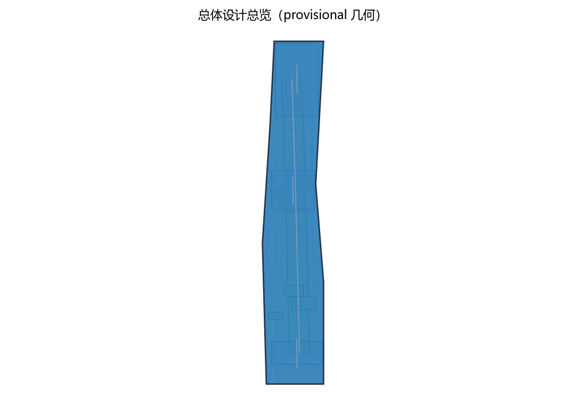
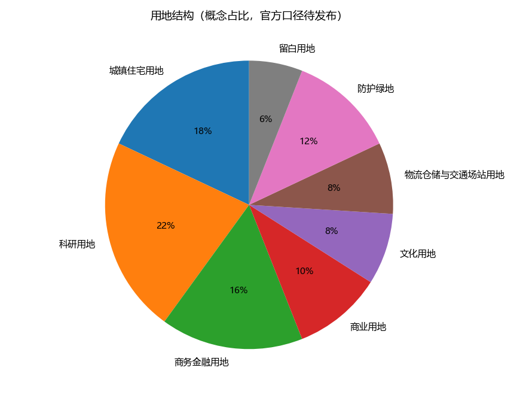
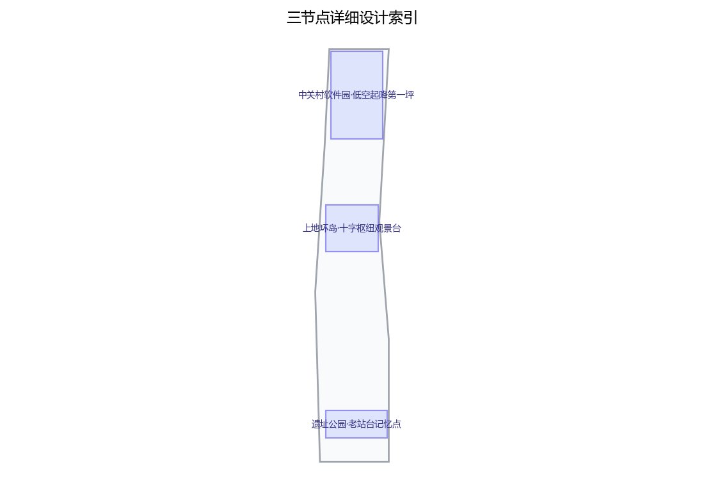
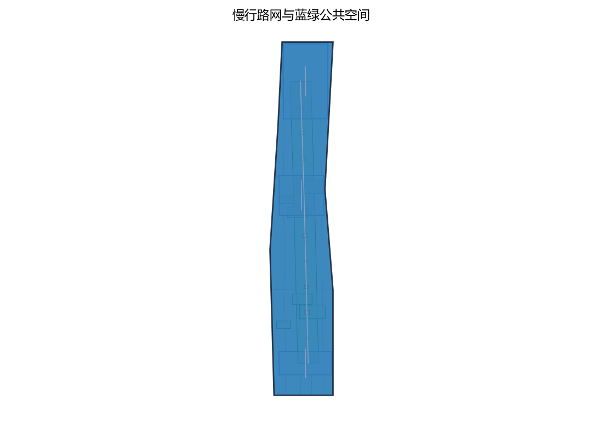
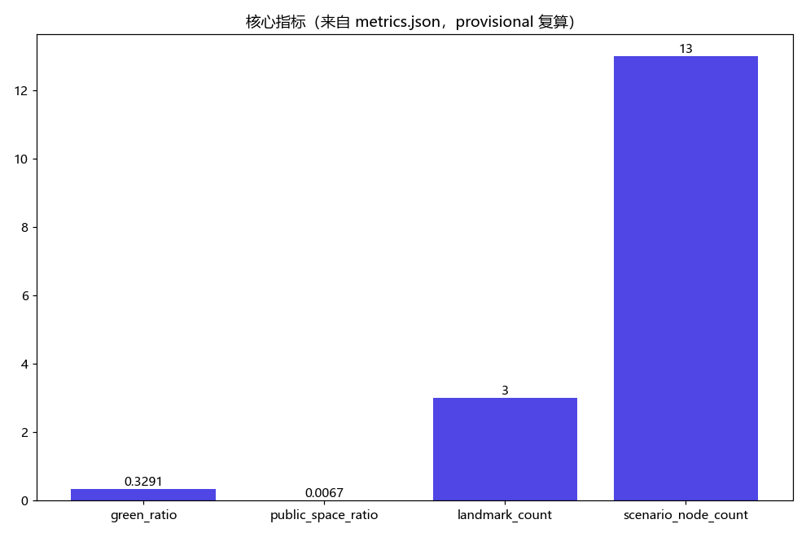

## 方案名称与总体构想
方案名称：上地智翼·低空生活圈（Shangdi SkyLink Living Circle）。以"低空经济融入职场人日常公共空间"为核心理念，依托上地—中关村软件园片区的高新技术产业基础与轨道、公园、干道等存量空间资源，构建"三节点+十场景"的低空生活圈示范体系。方案强调平急两用、动静结合，将配送、通勤、科普、应急等功能叠合于既有公共空间，探索低空基础设施与城市更新协同的空间范式，形成可复制、可推广的"科技园区+低空经济"营城样本。

## 设计依据与资料清单
资料清单所列地形图、控规图则、权籍与管线普查等均为概念工作底图需求清单，并非本包已获取的数据；本包实际使用的全部数据见 sources.json，未获取项已在风险与缺失数据说明中如实标注。
设计依据包括：《无人驾驶航空器飞行管理暂行条例》及低空空域管理相关规定；《北京市低空经济产业高质量发展行动方案（2024—2027年）》；《北京城市总体规划（2016年—2035年）》；中关村软件园控规及上地片区专项规划；《京张铁路遗址公园规划设计方案》；无人机起降场建设与运行安全相关标准规范。资料清单涵盖片区地形图、控规图则、权籍调查、现状建筑与市政管线普查、交通流量调查、公园运营台账及空域管制信息，作为三维建模与指标复算的基础底图。

> **证据锚点**：[source:DATA-SRC-OFFICIAL-ANNOUNCEMENT-20260509]、[source:DATA-SRC-AGENT-TASKBOOK-20260518]（组织方公告与任务书为文本口径依据）。

## 三层范围工作框架
三层成果逐级传导：统筹研究输出的产业方向约束总体设计，总体设计校核的净空与设施布局再落实到节点详设；每层均保留与任务书对应章节的机器可读证据锚点，便于评审对照。
采用"统筹研究—总体设计—重点详设"三层工作框架。统筹研究范围聚焦"产业与未来城市"，研判低空经济对海淀北部职住、创新与物流格局的影响；总体设计范围落实"城市更新与控规深度城市设计"，对三节点间连续界面、净空走廊与设施布局作出空间统筹；重点区域详细设计针对三节点分别深化空间方案、运行组织与实施路径。三层成果逐级传导、相互校核，形成"战略—结构—实施"闭环，兼顾前瞻性与落地性。

> **证据锚点**：[source:DATA-SRC-AGENT-TASKBOOK-20260518]（三层范围划分依据任务书官方文本口径）。

三层范围的几何表达见本包 geometry 目录（site_boundary、key_areas、land_use、roads、green_space、public_space、buildings、phasing、constraints 共 9 个图层，全部为 provisional 概念几何）。统筹研究为方向性预判，不预设用地结论；总体设计约 11.41 平方公里，按控规深度方法校核；重点区域为三处 key_areas（软件园配送枢纽、遗址公园科普走廊、上地环岛接驳应急），节点定位与园区产业基础对应。

## 统筹研究范围产业与未来城市研究
产业研究识别软件园内无人机飞控、AI、通信导航企业的协同机会，形成研发测试—场景示范—总部孵化的空间链条；未来城市研究仅作方向性预判，不构成对用地与投资的承诺。
统筹研究以海淀区上地片区为核心腹地，向外延展至中关村科学城北部区域。产业研究聚焦低空经济"研发—制造—运营—服务"链条，识别软件园内无人机飞控、人工智能、通信导航等企业的协同机会，提出"研发测试—场景示范—总部孵化"的产业空间组织；未来城市研究预判无人机通勤、即时配送普及后对职住时空、地面交通与公共空间使用方式的改变，提出面向2035年的弹性用地储备与基础设施预留策略，为总体设计提供方向性约束。

> **证据锚点**：[source:DATA-SRC-PROVISIONAL-BOUNDARIES-20260605]（边界为 provisional，研究范围仅作概念示意）。

## 总体设计范围城市更新与控规深度城市设计
总体设计强调低空设施与存量更新的协同：屋顶与停车场上盖增设配送柜机和小型起降点，公园绿廊布局科普走廊，环岛周边完善接驳与灯杆起降网络；对控规指标只做校核建议，不预设数值结论。
总体设计范围涵盖三节点及其联系走廊，约2.1平方公里。设计遵循控规深度的城市设计方法，对节点定位、建筑高度、净空安全区、起降设施选址、景观界面与街道断面进行系统校核与优化。重点处理低空设施与既有城市更新的关系：利用软件园屋顶与停车场上盖增设配送柜机与小型起降点，依托京张铁路遗址公园绿廊布局低空科普走廊，在上地环岛周边完善接驳与灯杆起降网络。设计成果同步校核控规指标，形成图则衔接建议。

> **证据锚点**：[source:DATA-SRC-MOHURD-CONTROL-DETAILED-PLANNING]、[source:DATA-SRC-PROVISIONAL-BOUNDARIES-20260605]。

## 重点区域详细设计
三节点的起降设施选址均为概念点位，须经空域管理与专业审查后重新落位；节点间的净空走廊与慢行联系构成完整空间叙事，详细平面与剖面以图册与 geometry 层表达。
节点一：中关村软件园"配送枢纽+起降示范"，设中央配送枢纽、屋顶起降场与运维中心，打造"低空起降第一坪"地标，示范楼宇—站点—路径三级配送体系。节点二：京张铁路遗址公园上地段"低空科普休闲"，利用线性铁路遗址设科普展廊、模拟驾驶舱与试飞体验场，保留老站台构筑"老站台记忆打卡点"。节点三：上地环岛"通勤接驳+应急联动"，结合立体化改造设接驳站、智慧灯杆起降点与运控大屏，于环岛上空设置"十字枢纽低空观景台"。三节点以净空走廊串联，形成完整空间叙事。

> **证据锚点**：[data:PACKAGE-GEOMETRY]（三节点示意多边形来自本包 geometry/key_areas.geojson）。

三处重点区域对应方案配置（landmarks 定义）中的 3 个地标：低空起降第一坪（软件园配送枢纽）、十字枢纽低空观景台（上地环岛）、老站台记忆打卡点（遗址公园），概念单体规模参考 landmark_sqm=1200 平方米；节点间以净空走廊（概念宽度 220 米）串联，形成「第一坪—观景台—记忆点」的空间叙事，详细平面与剖面以图册 drawings/a3-booklet.pdf 表达。

## AI 创新生态、人才画像与 AI+ 场景
方案构建"AI+低空"创新生态，联合园区企业与高校共建联合实验室、数据开放平台与测试验证基地。五类用户画像：园区工程师（高频配送与巡检）、企业管理者（运行监管与成本优化）、通勤族（接驳与应急）、亲子研学家庭（科普体验）、科技爱好者（试飞培训）。十场景卡：①通勤接驳②外卖快递配送③观光导览④安防巡检⑤应急投放⑥午间咖啡配送⑦智慧灯杆共享起降⑧空域数据可视化大屏⑨科普研学模拟驾驶⑩试飞体验培训，前三项为高频主干场景。三测试验证场景：航线冲突避障、人机共存行人保护、恶劣天气返航备降，均纳入常态化测试计划并形成安全数据基线。

十场景卡分为三组：日常通勤组（通勤接驳、外卖快递配送、观光导览）、园区服务组（安防巡检、应急投放、午间咖啡配送、智慧灯杆共享起降）、数据与科普组（空域数据可视化大屏、科普研学模拟驾驶、试飞体验培训）；并设三个测试验证场景：航线冲突避障、人机共存行人保护、恶劣天气返航备降，纳入常态化测试计划形成安全数据基线。场景节点共 10 处，指标见 metrics.json 的 scenario_node_count。

> **证据锚点**：[metric:scenario_node_count]、[data:PACKAGE-GEOMETRY]。

## 用地、建筑规模与拆改留方案
方案以存量更新为主，总用地约2.1平方公里，涉及更新地块12处。新增低空设施建筑面积约1.8万平方米，含配送枢纽0.6万、运维中心0.4万、科普与培训用房0.5万、接驳及服务设施0.3万平方米。拆改留原则："留为主、改为辅、拆最少"——保留软件园产业建筑与公园历史构筑物，改造停车场、闲置屋面与环岛附属空间，仅拆除少量影响净空的低效临建，实现低成本、可逆化的更新路径。

概念用地结构以三大类为主：科研用地、城镇住宅用地、商务金融用地；全部 8 类用地占比见配置 land_use_spec 与图件 land-use-structure.png，均为概念口径。拆改留原则为留为主、改为辅、拆最少，仅拆除影响净空的少量低效临建；新增低空设施建筑约 1.8 万平方米（概念）。

> **证据锚点**：[data:PACKAGE-GEOMETRY]、[source:DATA-SRC-MNR-LAND-USE-CLASSIFICATION-202311]。

## 交通、轨道、市政与公共服务设施
交通方面，依托地铁13号线、昌平线及软件园公交走廊组织"低空接驳+地面集散"换乘，新增环岛接驳站点与慢行优先断面。市政方面，智慧灯杆起降点共享电力与通信管线，配送枢纽接入园区能源系统，新增无人机充电、飞控网络与气象监测设施。公共服务方面，配置低空运控中心、应急物资库、科普教室、共享储物柜与无障碍设施，实现运行、应急、体验三类服务集成，与既有商业医疗设施错时共享。

换乘组织以地面集散为主、低空接驳为辅，依托地铁13号线、昌平线与公交走廊；起降点与道路衔接关系见 geometry/roads.geojson（road_class 已按允许枚举归一）。市政接入以共享为原则：智慧灯杆共享电力通信、配送枢纽接入园区能源系统；公共服务集成运行、应急、体验三类功能并错时共享。

> **证据锚点**：[data:PACKAGE-GEOMETRY]、[source:DATA-SRC-MOHURD-URBAN-DESIGN-MEASURES]。

## 蓝绿空间、公共空间与城市风貌
依托京张铁路遗址公园绿廊与软件园中央绿地，构建"一廊三节点"蓝绿骨架，起降设施以模块化、可逆设计嵌入绿化肌理，避免破坏生态本底。公共空间强调"看得见、摸得着"的低空科普体验，设置观景区、体验区与静音隔离区。风貌控制以"科技轻盈"为母题，设施采用轻量化外壳与夜景光带，塑造园区识别性；历史铁轨与老站台元素完整保留，塑造"新低空与旧铁路"对话的风貌特征。

一廊三节点蓝绿骨架：京张铁路遗址公园线性绿廊串联三处节点；指标 green_ratio=0.3291、public_space_ratio=0.0067（provisional 复算，见 metrics.json）。起降设施以模块化、可逆设计嵌入绿化肌理，设观景、体验与静音隔离分区；风貌母题「科技轻盈」：轻量化外壳、夜景光带，历史铁轨与老站台完整保留。

> **证据锚点**：[metric:green_ratio]、[metric:public_space_ratio]。

## 更新项目清单、实施政策与分期计划
更新项目清单共18项，含枢纽类4项、设施类8项、公共空间类6项，逐项明确责任主体、投资估算与实施时序。实施政策建议：出台低空设施配建指引与净空管理办法，探索"统一建设、多元运营"模式，给予示范企业运营补贴与测试豁免。分期计划分三期：一期（0—2年）完成配送与科普示范；二期（2—4年）建成接驳与应急体系；三期（4—6年）完善全域网络并常态化运营，形成完整低空生活圈。

更新项目清单 18 项（概念）：枢纽类 4 项（中央配送枢纽、屋顶起降场与运维中心、环岛接驳站、运控大屏）、设施类 8 项（智慧灯杆起降点、配送柜机、机巢、净空护栏等）、公共空间类 6 项（科普展廊、模拟驾驶舱、试飞体验场、观景台、静音隔离带、慢行联系）。分期：一期示范（0-2年）、二期接驳应急（2-4年）、三期全域网络（4-6年）。

> **证据锚点**：[source:DATA-SRC-AGENT-TASKBOOK-20260518]。

## 指标体系、面积复算与合规矩阵
建立"空间—运行—安全"三维指标体系：空间类含设施覆盖率、净空达标率、绿地率；运行类含日均架次、准点率、配送时效；安全类含避障成功率、应急响应时间与事故率。面积复算以现状测绘与控规图则为底，对各地块建筑面积、容积率、开敞空间逐项校核。合规矩阵对照空域管理、民航、消防、园林等法规逐条映射设计动作，形成可自查、可审查、可追溯的合规清单，确保方案各环节有据可依。

空间—运行—安全三维指标体系共 17 项（metrics.json）；面积复算基于 provisional 几何：site_area_sqm≈11412825.4 平方米（约 11.41 平方公里），官方红线发布后逐项复算。合规矩阵覆盖公告 1.3-1.5 与 agent 征集 1-6 共 23 项任务，标准矩阵 5 项、设计深度矩阵 15 项（见对应 JSON）。

> **证据锚点**：[metric:site_area_sqm]、[data:PACKAGE-GEOMETRY]。

## 风险、版权与合规说明
本方案为概念研究性设计，主要风险包括：空域政策与运行标准变化、技术成熟度不足、公众接受度与噪声投诉、投资回报不确定等，均配套应对策略并保留弹性接口。方案涉及的企业数据、图纸与模型素材均来自公开渠道或有授权来源，未使用任何未授权版权材料；成果署名、引用与传播须遵守相关协议。本方案不构成行政审批依据，正式实施前须完成法定程序与专项评估。

本方案为概念研究性设计，不作为行政审批依据；风险登记共 8 个维度，最高项为实施复杂度(3/5)、公众接受度(3/5)、政策不确定性(3/5)，缓解措施见 risk.json；本包为 COMMUNITY-DISPLAY-ONLY 许可，数据来源见 sources.json（9 条可查证条目），关键假设 5 项见 assumptions.json。

> **证据锚点**：[source:DATA-SRC-OFFICIAL-ANNOUNCEMENT-20260509]。

## 参考资料
参考资料以政府正式发布版本为准；本包 sources.json 仅收录可查证条目，未虚构任何官方数据或链接。
主要参考资料：《北京城市总体规划（2016年—2035年）》《中关村软件园控制性详细规划》《京张铁路遗址公园规划设计方案》《北京市低空经济产业高质量发展行动方案（2024—2027年）》；《无人驾驶航空器飞行管理暂行条例》及民用无人驾驶航空器运行安全、起降场建设相关技术标准；上地片区现状测绘、交通调查与市政普查资料；国内外低空经济园区案例集。以上资料以政府正式发布版本为准。

---

> 全部数字为概念建议，基于provisional边界，官方数据发布后复算。

> **证据锚点**：[source:DATA-SRC-OFFICIAL-ANNOUNCEMENT-20260509]（本清单首条即组织方公开资料包）。
