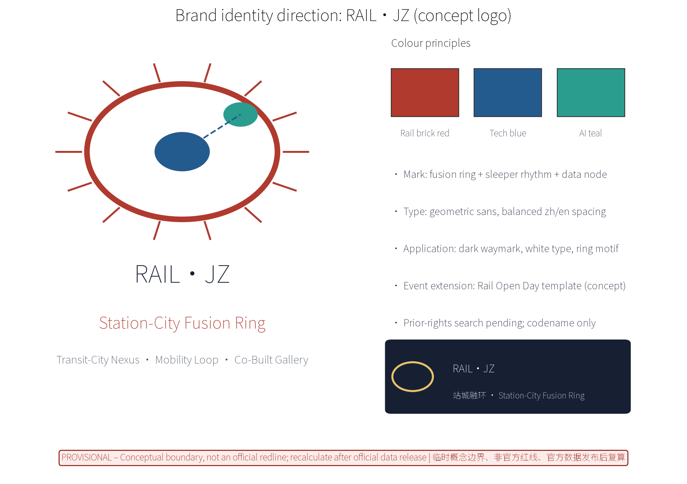
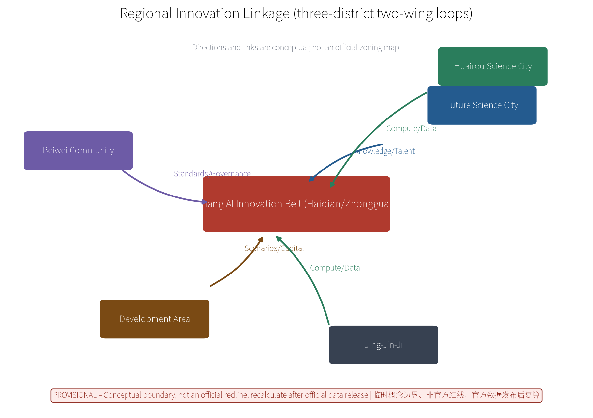
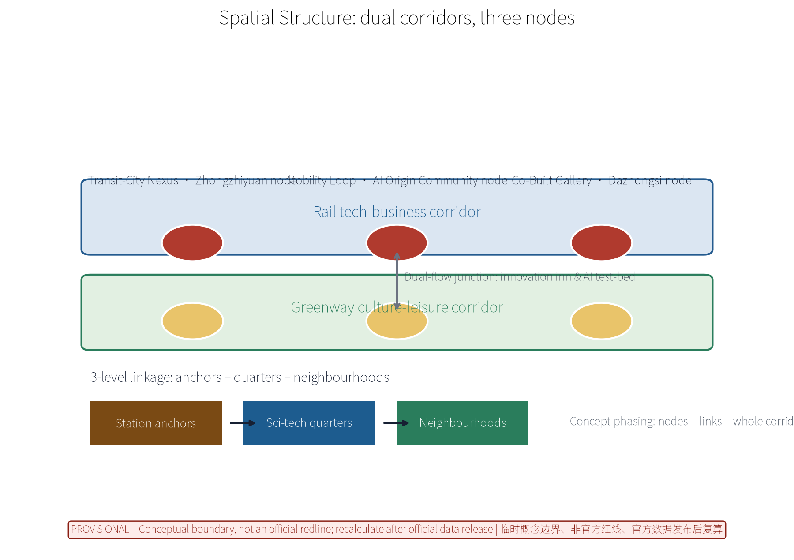
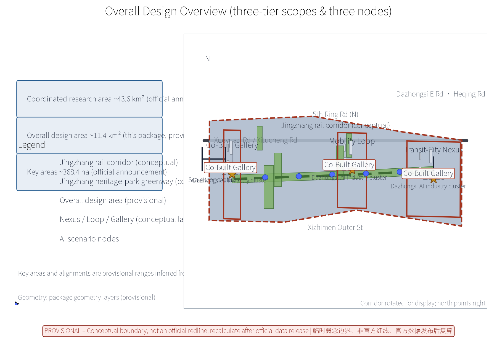
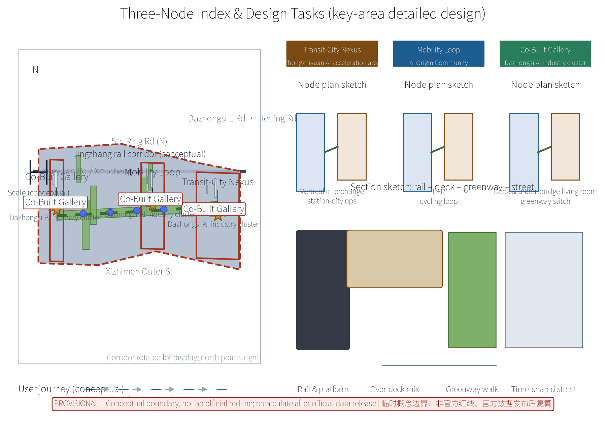
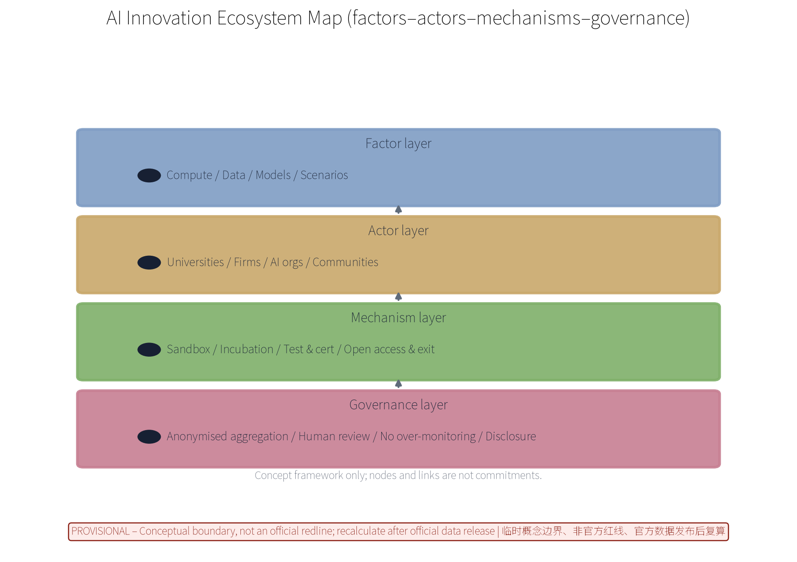
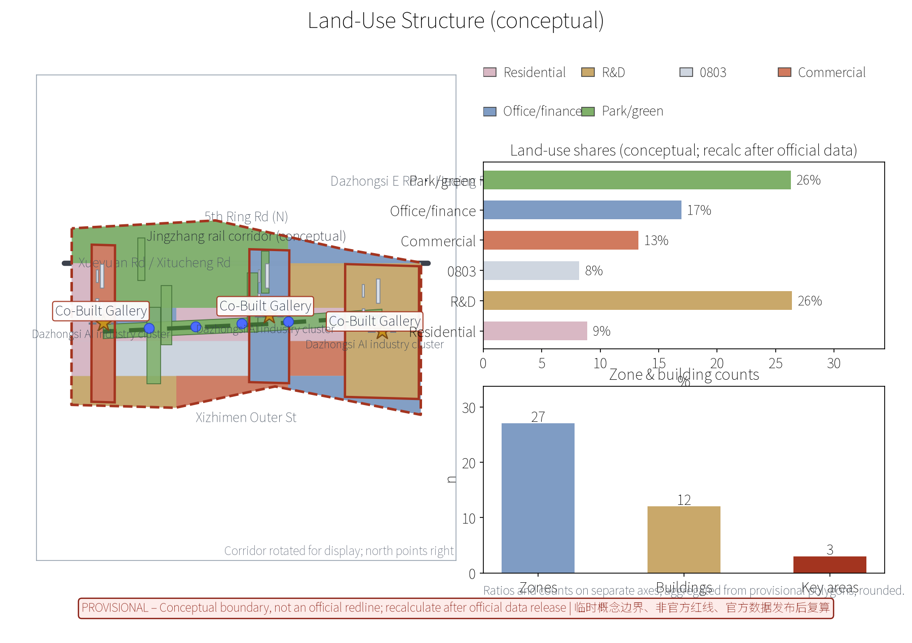
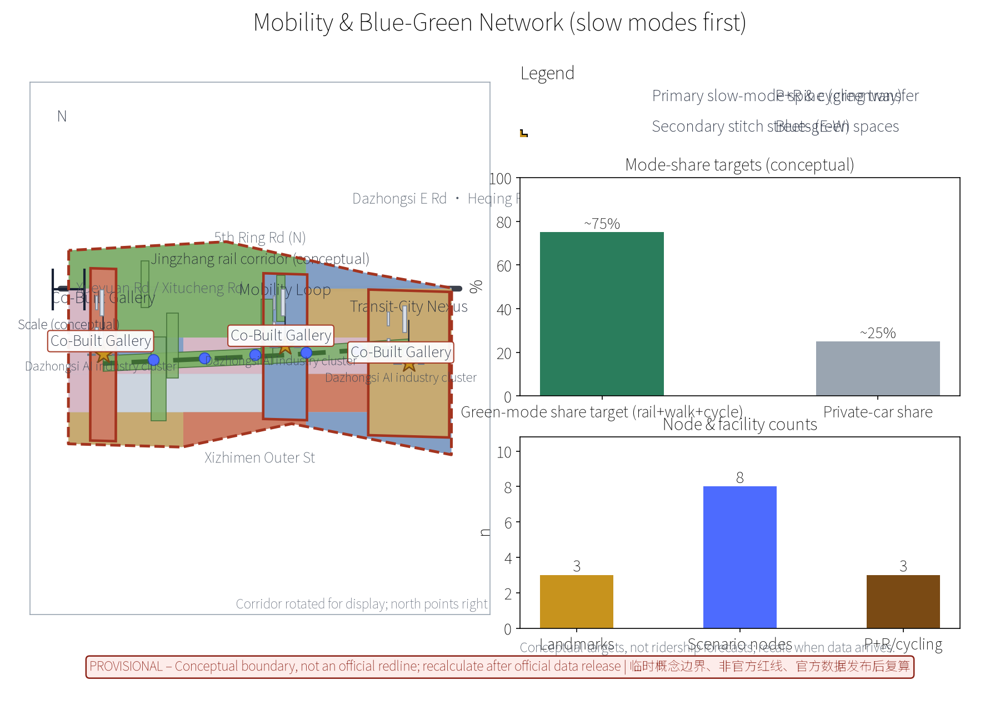
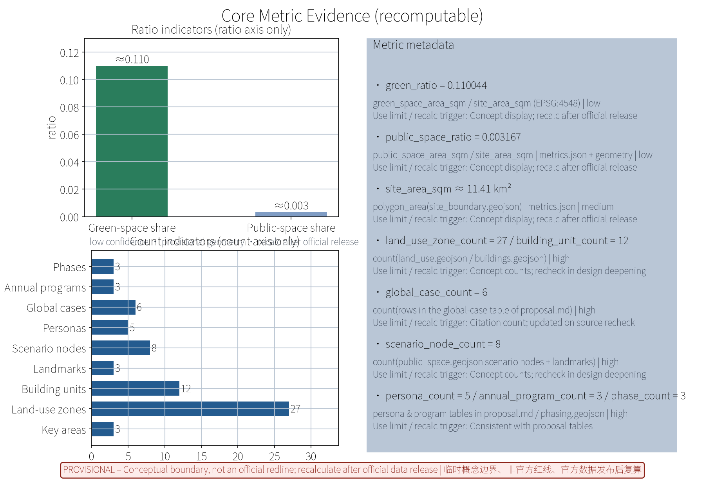

## Theme: Transit-City Integration Coordination

This is a concept-level draft for the international open call on the Centennial Jingzhang AI Innovation Belt (concept level, provisional boundaries, no fabricated official data, no substitution for statutory planning or operational duties). Everything in this package is conceptual suggestion and reference material for professional teams to deepen and review; the text carries machine-readable evidence anchors pointing to sources, standards, design depth, spatial data and metrics.

> **Concept note**: the proposal organises stations, feeder interchanges, public space and blue-green space as one system. Evidence comes from the package geometry layers (site_boundary/key_areas/land_use/roads/public_space GeoJSON), metrics.json and the matrix JSONs; geometry and metrics are based on provisional boundaries and expressed as rounded values, never as official numbers. Data gaps - ridership and rail operation ledgers, building age, ownership and structural surveys, per-building heritage clues - are recorded honestly in assumptions.json and the risk section, and are recalculated item by item after official regulatory and survey data are released.

## Scheme Name and Overall Concept (Concept)

The primary name is RAIL·JZ (Station-City Fusion Ring) - Transit-City Integration Coordination System. "RAIL" refers to rail, "JZ" is the abbreviation of "Jingzhang"; "fusion ring" signifies mutual fusion and circular symbiosis between stations and urban functions. The overall concept uses the Jingzhang high-speed suburban rail corridor as the transport spine and the Jingzhang Railway Heritage Park greenway as the ecological backbone, with three original concept nodes: Transit-City Nexus (station-city integration coordination core), Mobility Loop (rail feeder and slow-mode transfer ring with P+R and cycling), and Co-Built Gallery (station-city shared public-space gallery activating deck and under-bridge spaces as the shared living room stitching station and greenway). The system is summarised as "revitalise the city by the station, sustain the station by the city, thread the stations with greenery". Supporting original mechanism names include the Station-City Council, Rail Honour Wall, Co-Build Covenant, Public Participation Points, and the Developer Community · Station-City Hack Week - all conceptual suggestions, not confirmed governance or operation arrangements.

Brand identity direction (concept logo and visual identity, see figure): the mark consists of a "fusion ring + sleeper rhythm + data node" - a ring symbolising circular symbiosis, evenly spaced sleeper ticks echoing the rail rhythm, and nodes on the ring and rail line representing anonymised aggregated data flows; colour principles use rail brick red (heritage memory), Zhongguancun tech blue (innovation) and AI pulse teal (intelligence); typography uses geometric sans with balanced zh/en spacing; the application direction is a dark waymark field with white type and a ring motif; event brand extension is the Rail Open Day visual template (concept). Prior rights and use boundary: no official trademark search has been completed at concept stage; RAIL·JZ and the three node names/marks are treated solely as internal working codenames for display and discussion in this open call, not for external registration, commercial use or third-party licensing, and will not be expanded until prior-rights clearance is completed.

> **Evidence**: [source:DATA-SRC-AGENT-TASKBOOK] (naming and branding requirements); [data:PACKAGE-GEOMETRY] (node names match geometry/public_space.geojson landmark layer).

## Design Basis and Source List

The list of public historical materials, planning reports and general standards below is a concept-stage working reference list, not data this package has obtained; all data actually used by this package are listed in sources.json, and everything not obtained is honestly recorded in the risk and missing-data sections. Basis: the international open-call brief and technical documents; Beijing master plan, district plans and public regulatory-plan materials along the corridor; public materials on the Jingzhang Railway Heritage Park plan and greenway design; public materials on rail station siting and suburban rail operation; public standards on TOD, urban renewal and slow-mode transport. The concept-stage data list - base survey maps, current land use and ownership boundaries, rail and municipal network drawings, heritage inventories, industry and population data, site imagery - has not been obtained; formal deepening must rely on measured surveys and official materials; all data in this proposal are elastic ranges or indications, never fabricated official data.

> **Evidence**: [source:DATA-SRC-OFFICIAL-ANNOUNCEMENT] and [source:DATA-SRC-AGENT-TASKBOOK] (text-basis anchors); [source:DATA-SRC-PROVISIONAL-BOUNDARIES] (provisional rough boundaries).

## Three-Level Scope Framework

Per the official announcement, the belt has three official levels - coordinated research area (~43.6 km²), overall design area (~11.4 km²) and key areas (~368.4 ha). Within these official scopes, this package undertakes the transit-city integration coordination concept design for the three key nodes (approx. 192.1 / 104.3 / 72.0 ha) inside the overall design area (approx. 11.4 km², provisional substitute boundary); it does not replace the official three-tier boundaries. The three levels transmit downward in sequence: coordination-level judgements constrain the overall design; overall design checks node layout, feeder network and phased growth and hands them to key-node detailed design; every level keeps machine-readable evidence anchors to the corresponding brief sections.

The "three-district two-wing" regional linkage loop (concept reading, offered for review): three districts - Future Science City, Huairou Science City and the Economic-Technological Development Area; two wings - community wing along the corridor including Beiwei Community, and the Beijing-Tianjin-Hebei coordination wing. The loop is organised along the RAIL·JZ system as space-industry-operation: station anchors supply spatial carriers, innovation districts supply industrial factors, and the station-city operation platform closes the operation loop; the item-by-item mapping of the three positioning statements, five major functions and three nodes is in the coordination matrix in the next section.

> **Evidence**: [source:DATA-SRC-OFFICIAL-ANNOUNCEMENT] (three-tier scopes and approx. areas are official announcement text); [source:DATA-SRC-AGENT-TASKBOOK] (three-district two-wing reading).

## Coordinated Research Area: Industry and Future City Research

The industry and city research identifies the "fit" effect of station-city integration: rail stations and the feeder network organise commuting and encounter needs of universities, sci-tech quarters and neighbourhoods along the belt into bi-directionally reachable innovation environment units, forming a three-level linkage of station anchor - sci-tech quarter - neighbourhood; future-city research is directional only and never commits to land use or investment. Around AI new productive forces, the research covers spatial demand of R&D, compute, data, scenario application and innovation services, identifies industry-chain gaps, and builds a "rail + greenway" dual-corridor future-city model: the rail corridor organises inter-district commuting and business flows, the heritage-park greenway organises leisure and encounter flows, and innovation inns and AI scenario test-beds sit at the dual-flow junctions, with spatial strategies for industry-city integration, mixed functions and jobs-housing balance.

This theme responds to the belt's three positioning statements and five major functions (concept basis): three positioning - Centennial Jingzhang cultural belt, metropolitan AI-life experience belt, and AI-integrated innovation belt; five functions - full-stack AI self-innovation system, world-class AI innovation ecosystem, new AI+ scenario enablement paradigm, intelligent AI-vitalised city, and global discourse on AI governance. The linkage loop is mapped item by item in the table below, expanded into space-industry-operation columns:

| Positioning/Function | Spatial anchor (three nodes) | Industry & factor mechanism | Operation & feedback loop |
|---|---|---|---|
| Centennial cultural belt | Co-Built Gallery greenway sections | Heritage narrative & activation | Rail Honour Wall annual disclosure |
| Metropolitan AI-life experience belt | Nexus deck mixed spaces | AI test-bed & life services | Public feedback AI loop |
| AI-integrated innovation belt | All three nodes | Factor mechanisms (land/industry/capital/talent/compute/data/scenarios) | Dev community & scenario access |
| Five major functions | Mapped to the three nodes | See AI innovation ecosystem map | See annual evaluation indicators |

Three-district two-wing linkage matrix (concept): Beiwei Community - community innovation units, linked via slow-mode feeder and community council; Future Science City - SOE R&D and scenario verification, linked via compute/data flows and the developer community; Huairou Science City - basic research and large-science-facility coordination, linked via knowledge/talent flows and university cooperation; the Development Area - manufacturing-conversion coordination, linked via scenario/capital flows and industry alliances; Jing-Jin-Ji - standards and governance coordination, linked via international communication and annual events.

> **Evidence**: [source:DATA-SRC-PROVISIONAL-BOUNDARIES] (provisional research extent); [source:DATA-SRC-AGENT-TASKBOOK] (positioning/functions and regional coordination).

## Overall Design Area: Urban Renewal and Regulatory-Plan-Level Urban Design

The overall design stresses a "greenway-backed station-city environment": nodes, feeder networks and the slow-mode skeleton are organised along the Jingzhang Railway Heritage Park greenway; station-city facilities grow reversibly and streets respond by time of day; renewal leads over new construction, prioritising the insertion of station-city functions into existing stock; regulatory-plan indicators are only checked conceptually, never preset. The overall spatial structure (see figure) is a dual-corridor model with three-level linkage: the rail tech-business corridor and the greenway culture-leisure corridor run in parallel; station anchors, sci-tech quarters and neighbourhoods link in three levels; innovation inns and AI test-beds sit at dual-flow junctions.

TOD station-city principles are expressed conceptually: within a walkable core of about 600 m around stations, mixed functions and moderate density are studied as concept directions only - specific development intensity, height and land-use nature must wait for official regulatory-plan conditions and professional review; this proposal presets no values and provides no control numbers. The rail alignment and heritage greenway are retained while urban renewal proceeds in parallel; minor street grids are densified around a slow-mode-first street network; municipal and public-service gaps are identified. This package is a concept-level regulatory-depth urban design: land-use nature, FAR, height and other control indicators need to be deepened item by item after official control conditions and professional review, and are not directly convertible into control indicators or land-bid conditions, nor any commitment to implementation arrangements.

> **Evidence**: [source:DATA-SRC-MOHURD-CONTROL-DETAILED-PLANNING] (regulatory-depth method boundary); [source:DATA-SRC-PROVISIONAL-BOUNDARIES] (provisional overall-design geometry).

## Detailed Design of Key Areas

The three key areas (Zhongzhiyuan AI Self-Innovation Acceleration Area, Beijing AI Origin Community, Dazhongsi AI Industry Cluster) correspond conceptually to three original nodes: Transit-City Nexus - Zhongzhiyuan area (vertical interchange, station-city joint operations, deck-linked commercial, office and sci-tech services); Mobility Loop - AI Origin Community (P+R and cycling transfer facilities around the station forming a continuous, shaded, accessible rail feeder and slow-mode transfer ring); Co-Built Gallery - Dazhongsi area (deck and under-bridge shared living rooms, pocket parks and performance spaces seamlessly stitched to the heritage greenway). All node locations are concept points that must be relocated after evaluation by planning, rail, heritage and authority review; greenway alignments and slow-mode routes between nodes form the complete station-city movement sequence.

Site-level design (concept, see key-areas figure): plans - the Nexus hub has a vertical interchange hall and deck podium, the Loop has a ring slow-mode path and P+R roof garden, the Gallery has an under-bridge shared living room and pocket parks; sections - organised in four bands: rail and platform - over-deck mixed use - greenway walk - time-shared street; user journey - exit station, transfer, shop/work, greenway corridor, arrive home - with accessible and age-friendly design throughout. Three AI+ scenarios (dispatch, joint operations, slow-mode planning) run test-beds inside the nodes on anonymised aggregates only.

> **Evidence**: [data:PACKAGE-GEOMETRY] (concept polygons in geometry/key_areas.geojson and public_space.geojson); [source:DATA-SRC-PROVISIONAL-BOUNDARIES].

## AI Innovation Ecosystem, Personas, and AI+ Scenarios

The AI innovation ecosystem map (see figure) is organised in four layers: factors (compute/data/models/scenarios; talent/capital/policy-standards), actors (universities and institutes, firms, AI industry organisations, communities), mechanisms (data sandbox, incubation, test and certification, open access and exit) and governance (anonymised aggregation, human review, no over-monitoring, public disclosure). Factor guarantee mechanisms cover seven factors - land, industry, capital, talent, compute, data, scenarios - each with a "mechanism - carrier - confidence - recalc trigger" record in the matrix JSONs; all conceptual.

Six global station-city and AI-ecosystem cases are cited with sources: London King's Cross (station-led renewal, public space first), Tokyo Shibuya station (direct-over-station complex with observatory and co-creation space), Hong Kong MTR Rail+Property (property value funding rail operations), Singapore Jurong Lake District (rail-hub-anchored innovation district with minimum open-space controls), Tokyo Futako-Tamagawa Rise (LEED ND certified compact mixed-use before the station), and Grand Front Osaka (open innovation platform before the station). The case table below is concept-level citation of public materials, not operational commitments:

| No. | Global case | Location & type | Mechanism borrowed (concept) | Case source |
|---|---|---|---|---|
| 1 | King's Cross | London - station renewal | Rail-hub catalyst; new streets and public spaces first | CASE-KX-2001 |
| 2 | Shibuya Scramble Square | Tokyo - over-station | Direct-over-station mix, observation deck, co-creation | CASE-SHIBUYA-2019 |
| 3 | MTR Rail+Property | Hong Kong - R+P | Property value funds rail construction and operation | CASE-MTR-RP |
| 4 | Jurong Lake District | Singapore - rail district | Hub-anchored innovation district, open-space minimums | CASE-JLD-2026 |
| 5 | Futako-Tamagawa Rise | Tokyo - rail-adjacent community | Compact mix, ecological corridor, green certification | CASE-FTR-2015 |
| 6 | Grand Front Osaka | Osaka - station-front platform | Station-front co-creation platform and open lab operation | CASE-KC-2013 |

Personas focus on five talent types: algorithm engineers, data and compute operators, scenario product managers, research-to-market translators, and city digital operators, with tailored housing, workplace and life services; the persona-space-service mapping is:

| Persona | Spatial need (concept) | Service & operation mechanism |
|---|---|---|
| Algorithm engineer | Nexus R&D and incubation space | Dev community, scenario registration, housing |
| Data & compute operator | Data sandbox and compute nodes | Anonymisation rules, runtime monitoring, shift rotation |
| Scenario product manager | Test-bed and co-creation studio | Test and certification, access registration, annual evaluation |
| Research translator | University joint conversion inn | University alliance, disclosure, incubation |
| City digital operator | Operations platform and dispatch | Human review, tiered authorisation, runtime monitoring |

The five AI+ scenarios map one-to-one onto six urban domains (concept): dispatch AI and slow-mode planning AI serve transport; joint-operations AI serves industry and space; deck-property O&M AI serves space and public services; public feedback AI serves public services, culture and governance - a six-domain coverage matrix. All scenarios process anonymised aggregates only, with human review of key decisions, no individual-identifying tracking and no over-monitoring; sandbox experiments require access registration and human review (concept).

| Card No. | Scenario card | Spatial carrier | AI capability & data boundary | Operating party |
|---|---|---|---|---|
| 1-1 | Peak feeder dispatch | Nexus hub, Mobility Loop | Anonymised aggregate simulation; dispatch orders human-reviewed | Rail & bus operators, station-city platform |
| 1-2 | Event-exit time-shared guidance | Nexus station square | Time-phased guidance simulation; anonymised only | Platform with traffic authority |
| 1-3 | Last-mile responsive feeder | Loop, community stops | Demand anonymised; booking and rotation | Platform, community volunteers |
| 2-1 | Deck business joint operation | Nexus deck | Anonymised usage analysis; business decisions human-reviewed | Property & industry operators |
| 2-2 | Space efficiency analysis | Three-node public space | Occupancy anonymised; plans disclosed | Professional team, platform |
| 3-1 | Slow-mode route optimisation | Loop, continuous axis | Trajectories anonymised; plans reviewed then disclosed | Planning team, streets & community |
| 3-2 | Greenway link evaluation | Gallery greenway | Gap identification; anonymised only | Planning team, volunteers |
| 4-1 | Deck smart O&M and energy | Gallery deck mix | Equipment/energy anonymised; no personal profiling | Property operator |
| 4-2 | Equipment health prediction | Hub electromechanical | Anonymised status; maintenance orders human-reviewed | Professional O&M team |
| 5-1 | Anonymised opinion clustering | Gallery living room, online | Opinions anonymised, human-reviewed, disclosed | Community, volunteers, platform |
| 5-2 | Service & governance loop | Node service counters | Tiered handling; annual disclosure | Station-City Council, platform |
| 5-3 | Annual disclosure visualisation | Operations platform | Annual anonymised report; human review | Platform, third-party evaluator |

Scenario-space-operation matrix (concept): dispatch AI - Nexus hub/Loop - proposal-based dispatch, decision authority with rail and bus operators, KPI transfer delay and walk time; joint-operations AI - deck spaces - proposal-based joint operations, authority with property operators, KPI deck usage efficiency; slow-mode AI - continuous axis - plan-disclosure model, authority with planning and streets, KPI slow-mode continuity and accessibility compliance; deck O&M AI - electromechanical and energy - maintenance-advice model, authority with property firms, KPI energy and fault response; feedback AI - living room and online - closed loop, authority with the Station-City Council, KPI handling rate and annual disclosure completion.

AI technical protocols (concept): model evaluation - benchmark tests and false-alarm statistics; unqualified scenarios do not go live; data quality - unified anonymised aggregation calibre and data-quality rules; missing ledgers are never fabricated; error stratification - predictions and simulations are stratified by error bands with confidence labels for decision reference only; runtime monitoring - all scenarios are monitored with human review and stop conditions retained; no scenario may perform individual-identifying tracking. Data lifecycle: anonymised at collection, aggregated storage, tiered access, scheduled deletion; model boundary: AI outputs are advisory only and never replace statutory transport organisation, approval or operational duties. Industry test-scenario protocols (3, concept) - limited to anonymised aggregates and simulated data; results serve concept checking only and are recalculated after official ledgers arrive:

| Test scenario | Test content & protocol | Data & acceptance calibre |
|---|---|---|
| Feeder dispatch prototype test | Peak/event dual-scenario simulation; orders human-reviewed | Anonymised simulated data; benchmark + false-alarm stats; error bands |
| Joint-operations sandbox test | Deck business and public-space usage simulation; decisions human-reviewed | Sandbox anonymised data; runtime monitoring + stop conditions |
| Slow-mode planning test | Greenway link and route optimisation; plans human-reviewed, disclosed | Anonymised trajectory samples; test-disclose-register loop |

> **Evidence**: [source:DATA-SRC-GENERATIVE-AI-INTERIM-MEASURES] (AI content governance reference); [metric:global_case_count], [metric:persona_count], .

## Land Use, Building Scale, and Retain-Renovate-Demolish Strategy

The retain-renovate-demolish strategy keeps all three levers in parallel with retention first: the heritage park fabric and railway relics are retained, stock buildings undergo functional conversion with reserved station-city conversion directions (feeder interfaces, deck compound), and demolition is limited to scattered buildings that obstruct public-space continuity after case-by-case review; all areas are concept calibre and recalculated after official data release. Concept-stage scale is expressed as elastic ranges: functional-mix shares in the Nexus core, Loop facility scales and Gallery public-space ratios are suggested ranges, not committed indicators; these ratios are concept calibre (elastic ranges) to be aggregated and recalculated under a unified calibre after official land and survey data are released. Strategy: retain - heritage greenway, rail alignment, historic buildings and mature neighbourhoods; renovate - functional conversion and micro-renewal of low-efficiency plants and old buildings; demolish - only hazardous structures blocking public-space continuity, after case-by-case review. Specific lists and scales await field survey and ownership materials before deep review and recalculation.

> **Evidence**: [source:DATA-SRC-MNR-LAND-USE-CLASSIFICATION-202311] (national land-use terminology); [data:PACKAGE-GEOMETRY] (land_use/buildings layers are concept polygons, not survey data).

## Transport, Rail, Municipal Infrastructure, and Public Services

Slow modes are the organising principle: rail stations and the slow-mode network integrate seamlessly; a continuous slow-mode axis along the greenway threads the Nexus, Loop and Gallery; P+R, cycling and walking integrate; street sections respond by time of day (peak, event, daily); universities, parks and rail lines connect; green travel is prioritised, car dependence reduced, and event dispersal is time-phased. Municipal works favour compact shared infrastructure, station-city integration and reuse of existing conditions; public services provide multilingual service, exhibition and study spaces; all AI decisions carry human review. Until ridership and operations ledgers, municipal networks and capacities are obtained, this proposal provides no ridership forecasts, feeder-capacity or municipal-capacity conclusions; the dispatch AI makes advisory simulations on anonymised aggregates only and never collects individual behaviour data.

Transport: a rail-bus-slow-mode tiered feeder system on the Jingzhang suburban rail corridor, slow-mode feeder first, last-mile strengthened. Municipal: connection to existing networks with low-carbon energy, sponge-renewal and smart-pipeline concepts. Public services: 15-minute-life-circle completion of education, health and culture-sports facilities, a neighbourhood service centre at the Nexus, and reserved AI city-operation-management interfaces.

> **Evidence**: [source:DATA-SRC-MOHURD-URBAN-DESIGN-MEASURES] (method reference); [data:PACKAGE-GEOMETRY] (roads layer is a concept slow-mode network, not road redlines).

## Blue-Green Network, Public Space, and Urban Character

A "greenway spine with node parks as pearls" blue-green public-space system: the heritage greenway is the backbone linking small green patches and open space; station-city facilities merge with blue-green space into one continuous ecological and public system; deck and under-bridge spaces stay light, permeable and reversible without blocking heritage views; signage and interpretation stay restrained; character continues Jingzhang railway industrial memory in dialogue with a station-city transport atmosphere, with restrained and unified character control, avoiding symbol stacking and slogan packaging.

Public space is all-weather, all-ages-friendly and operable, serving seniors, youth, children, students, commuters, tourists, residents, workers, people with disabilities and people with low digital capability, with accessibility and age-friendly design, child- and family-friendly space, night-time lighting and safety for night users, and reserved stall and display space for existing small-shop keepers (concept). Accessibility and multilingual services are design baselines for specific service scenarios only and are not generalised into compliance claims. The honour-display system: the proposed Rail Honour Wall - public nomination, disclosure and honour registration - exhibits station-city co-building contributors and annual activity outcomes. The public-space component library: eight component types - seating, shading, canopy, wayfinding post, lighting column, mobile planter, reversible paving, children's play modules - modular, reversible and lightweight; component list and dimensions are for the deepening stage (matrix JSON). Wayfinding: three tiers - station, block, greenway - bilingual, with human service and volunteer channels to cover low-digital-capability users. Cultural narrative: the "centennial Jingzhang - Zhongguancun innovation - AI rebirth" three-line narrative organises greenway exhibits and interpretation.

> **Evidence**: [source:DATA-SRC-BARRIER-FREE-ENVIRONMENT-LAW] (baseline reference for specific service scenarios, not generalised compliance); [source:DATA-SRC-MOHURD-URBAN-DESIGN-MEASURES].

## Renewal Projects, Implementation Policy, and Phasing

The four-type project list (Nexus pilot / Loop completion / Gallery stitching / operations-platform launch) is conceptual; scales and investment estimates are suggestions; policy suggestions (design-with-plan land bids, multi-party co-building, review mechanisms) all require lawful review and are not government or operator commitments. A five-type project library - Nexus hub renewal, Loop facility upgrade, Gallery greenway completion, old-neighbourhood micro-renewal, industry-building conversion - is prioritised by urgency and investment type. Policy suggestions: TOD integrated bundled land bids, FAR-bonus-to-public-space-contribution linkage, public-private partnership, and a corridor-specific renewal policy - all directions only, with FAR-type bonuses based on official control conditions and no preset values. Phasing: near term (1-3 years) demonstration nodes and greenway completion in pilot areas (Zhongzhiyuan Nexus pilot, Loop completion segment, Gallery stitching segment); mid term (3-5 years) area-wide renewal with the three-node feeder rings completed; far term (5-10 years) corridor-wide optimisation and brand-asset accumulation.

Implementation division (lead/collaborate, concept): station complex development - government coordination with rail operators leading, firms and professional teams collaborating; slow-mode and green works - planning and municipal departments leading, communities and volunteers collaborating; operations platform - operation teams leading with residents and shop keepers collaborating; AI scenario verification - universities and professional teams leading with the platform collaborating. Stop and exit conditions: scenario access uses an annual-evaluation renewal, exit on failure of anonymised-aggregation data-quality or human-review requirements; pilot projects carry stop conditions triggered by major changes in control conditions, ridership ledgers or ownership materials, pausing and recalculating; all mechanisms are concept suggestions, not contract arrangements.

Annual event brand system (concept, table below): three annual flagship activities - Rail Open Day, Station-City Co-Build Workshop, Slow-Mode Experience Season - over monthly regular activities and weekly scenario booking updates; participation points, opinion disclosure and the co-build covenant are suggestions. Public experience operations: booking, rotation and volunteer-guided tours (concept). Developer community: the Developer Community · Station-City Hack Week opens the data sandbox and API test registration; outputs are human-reviewed and disclosed, forming a test-register-disclose-iterate conversion pathway. International communication: bilingual copy packages built around the "centennial Jingzhang - Zhongguancun innovation - AI rebirth" narrative and annual events (visual page and booklet). Talent and firm conversion pathways (suggested): talent along test - internship - co-creation project - incubation; firms along test occupancy - industry-alliance registration - funding matching. Annual evaluation indicators: event attendance, scenario registrations, developer-community activity, resident satisfaction, anonymised-data quality score, annual-disclosure completion.

| Brand | Annual activity | Frequency & participation | Evaluation indicator |
|---|---|---|---|
| Rail Open Day | Station and greenway public open day | Yearly, public booking | Attendance, satisfaction, comms reach |
| Station-City Co-Build Workshop | Shared agenda workshops | Quarterly, residents/shops/universities/firms | Topics adopted, participation, disclosure |
| Slow-Mode Experience Season | Ride-and-walk check-ins | Twice yearly | Experience counts, share change, volunteer hours |

Governance mechanism suggestions (three consecutive statements, concept): station-city decisions should be made by a Station-City Council composed of government, operators and resident-community representatives; decision basis and key milestones should be disclosed through opinion disclosure and anonymised aggregate reports; outcomes should be closed by third-party evaluation, volunteer monitoring and tiered feedback rectification - all suggestions for professional and operating teams to continue discussing, not confirmed arrangements. Resident feedback channel: online anonymised feedback and offline council sessions in parallel; opinions are human-reviewed and tiered into the annual disclosure.

> **Evidence**: [source:DATA-SRC-AGENT-TASKBOOK] (phasing and implementation items); [metric:phase_count], [metric:annual_program_count].

## Metrics, Area Recalculation, and Compliance Matrix

The conceptual indicator system (with source/formula/confidence/use-limit/recalc-trigger) is in the table below, all concept calibre: rail-station 800 m coverage population and jobs, Loop slow-mode transfer share, Gallery public-space continuity, blue-green coverage, deck joint-development intensity and AI-scenario adoption are expressed as target ranges only, with no concluding values.

| Indicator | Data source | Formula / calibre | Confidence | Use limit | Recalc trigger |
|---|---|---|---|---|---|
| green_ratio | metrics.json + green_space/site_boundary | green area / overall area (EPSG:4548) | low | Concept display | Official geometry release |
| public_space_ratio | metrics.json + public_space/site_boundary | public space / overall area | low | Concept display | Official geometry release |
| site_area_sqm | metrics.json + site_boundary | polygon area (~11.41 km²) | medium | Concept display | Official boundary release |
| Green-mode share (range) | concept target range | ~70%-80% green travel | concept | Not a ridership forecast | Ridership ledger arrival |
| Scenario/activity counts | proposal tables | cards 12 / cases 6 / events 3 / phases 3 | high | counting calibre | Content revision |

Area recalculation: this package anchors on official announcement text (coordination ~43.6 km², overall ~11.4 km², key ~368.4 ha); the overall design area uses the provisional substitute boundary with a recalculated area of ~11.41 km², and the three key areas recalculate to ~192.1 / 104.3 / 72.0 ha; these values are concept checks only, not official precise areas; after official graphics are released, the full recalculation runs in a unified coordinate system with a recalculation version number. Cost and investment use qualitative tiers only (low/medium/high) with estimation method, price base, scope, confidence and recalc trigger; no precise currency amounts. Compliance matrix: item-by-item review against the master plan, regulatory plans, rail and suburban-rail management rules and greenway protection requirements, marking conforming, diverging and to-be-adjusted items to keep the concept within compliance red lines (compliance_matrix.json and standard_matrix.json).

> **Evidence**: [metric:green_ratio], [metric:public_space_ratio], [source:PACKAGE-GEOMETRY], .

## Risk, Copyright, and Compliance

Risks: provisional boundaries may change; ownership and relocation carry uncertainty; existing municipal capacity constrains; AI scenarios are privacy-sensitive - answered with anonymised aggregation plus human review and no over-monitoring. Ridership and rail-operation ledgers, building age and ownership, per-building heritage clues and municipal capacity have not been obtained; before any formal implementation, multi-department joint review, rail-operation safety assessment, heritage protection and fire assessment are required; pilots carry stop conditions and recalc triggers (implementation section). Copyright: RAIL·JZ, the Fusion Ring system and the three node names are original names and concepts of this submission; all text, figures, geometry and program-generated content are the participant's originals, licensed COMMUNITY-DISPLAY-ONLY for public display and discussion in this open call; deepening use by later professional teams within this call must follow the call rules and obtain separate permission from the organiser and relevant right-holders; cited materials are attributed and linked to sources.json and report/asset_rights_ledger.md, with page numbers to be completed and re-verified when the formal deliverable is compiled. Prior rights and use boundary: no official trademark search has been completed at concept stage; RAIL·JZ and the three node names/marks are internal working codenames only, not for external registration or commercial use, to be re-assessed after clearance; nothing here waives rights or asserts acquired prior rights. Compliance: all laws and Beijing regulations are followed; accessibility and multilingual services are baselines for specific service scenarios only, not generalised compliance claims; all conclusions are conceptual suggestions and reference material, not statutory plans, approvals or implementation commitments; data use follows the permitted boundaries in sources.json; no unauthorised or non-public spatial data are used.

> **Evidence**: [source:DATA-SRC-OFFICIAL-ANNOUNCEMENT] (call rules for ownership and compliance wording); [source:DATA-SRC-GENERATIVE-AI-INTERIM-MEASURES], [source:DATA-SRC-BARRIER-FREE-ENVIRONMENT-LAW] (compliance baselines, not generalised);  (risk geometry from this package).

## References

(Concept-level citation categories, all publicly verifiable; this list is a working index and will be completed with versions and page numbers during formal compilation with a full citation recheck)

1. International open-call brief and technical requirements (official announcement and taskbook text basis);
2. Public materials of the Beijing Master Plan (2016-2035);
3. Public regulatory-plan and district-plan materials along the corridor;
4. Public materials of the Jingzhang Railway Heritage Park plan and design;
5. Public TOD research and operation materials of the Jingzhang high-speed rail and suburban corridor;
6. National policies and literature on urban renewal and TOD;
7. Standards on slow-mode transport and blue-green public space;
8. Institutional pages cited for global cases and indicators (sources.json; 6 case entries).

---

**Note**: this draft is a concept-level deliverable covering all 13 sections in order; all scales and indicators are elastic ranges to be rechecked and recalculated after official data and surveys. The text implements slow-mode-first, blue-green public space, the three-district two-wing loop and the honesty bar throughout, and threads TOD station-city coordination, slow-mode feeder, deck linkage, under-bridge space and station-greenway stitching around the two cores of the heritage greenway and the Jingzhang suburban rail corridor; the English version is substantively equivalent to the Chinese version, with English figures, PDFs and HTML generated and verified by the deterministic gate.

> **Evidence**: [source:DATA-SRC-OFFICIAL-ANNOUNCEMENT] (ownership and compliance wording basis).