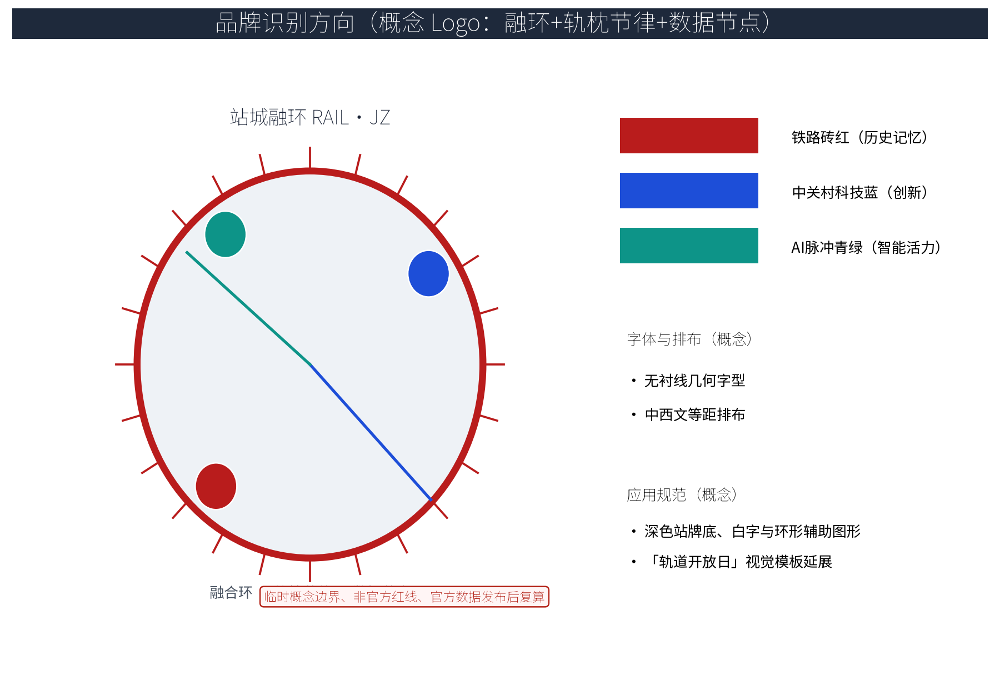
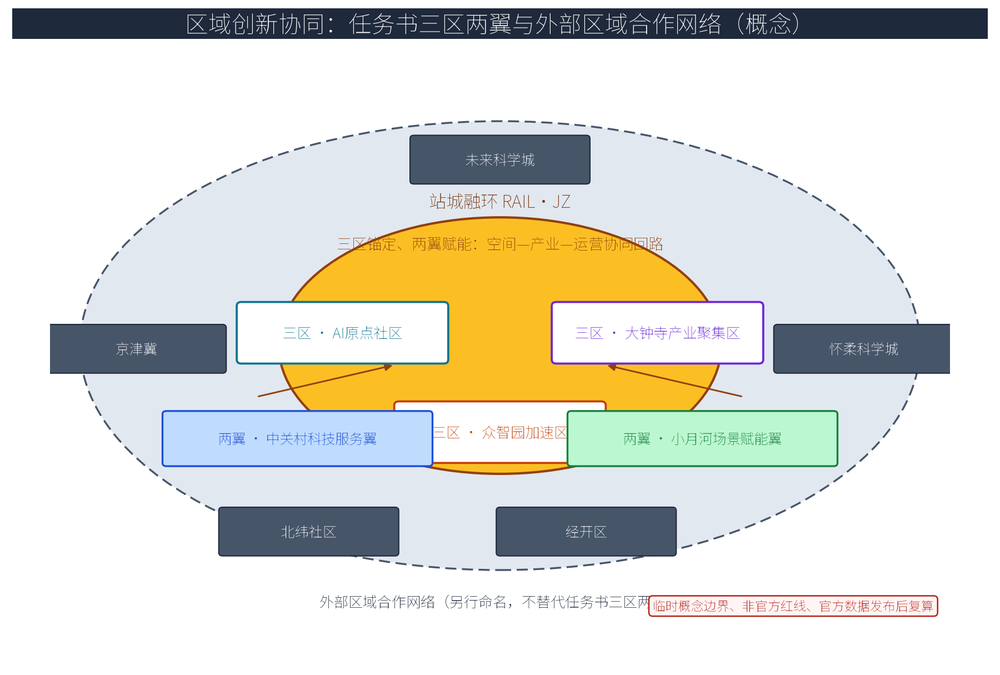
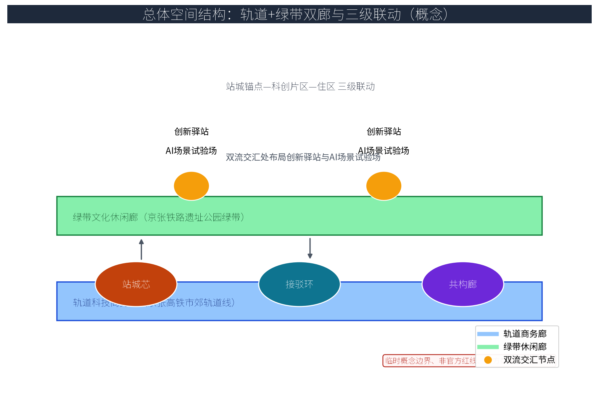
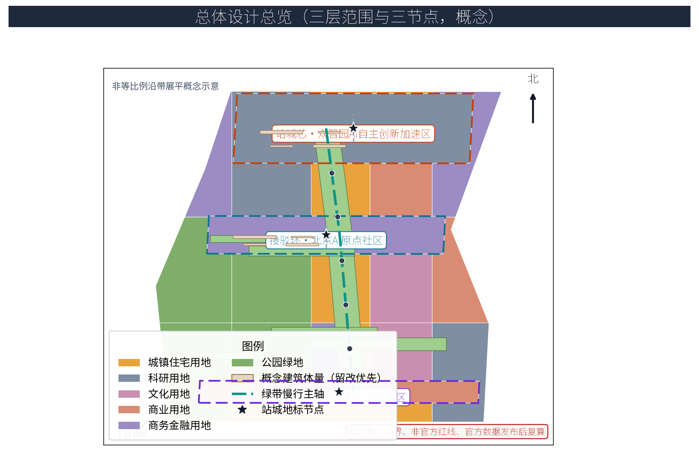
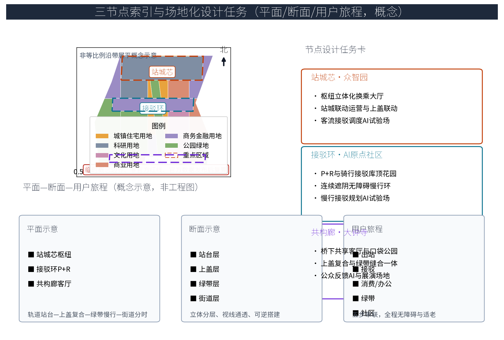
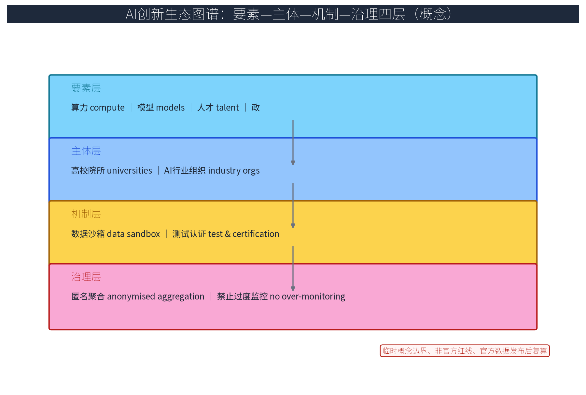
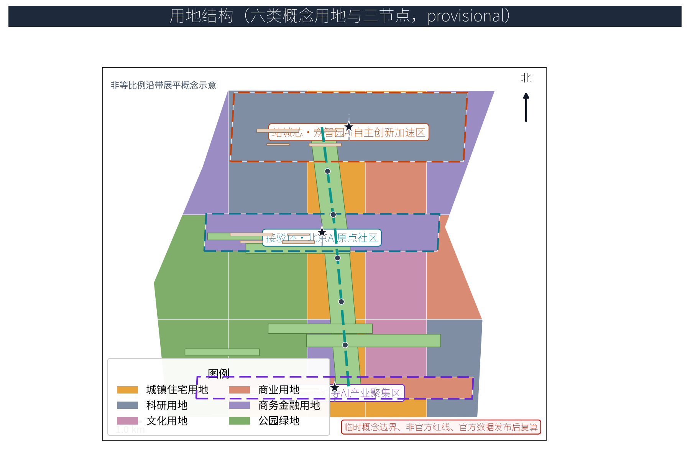
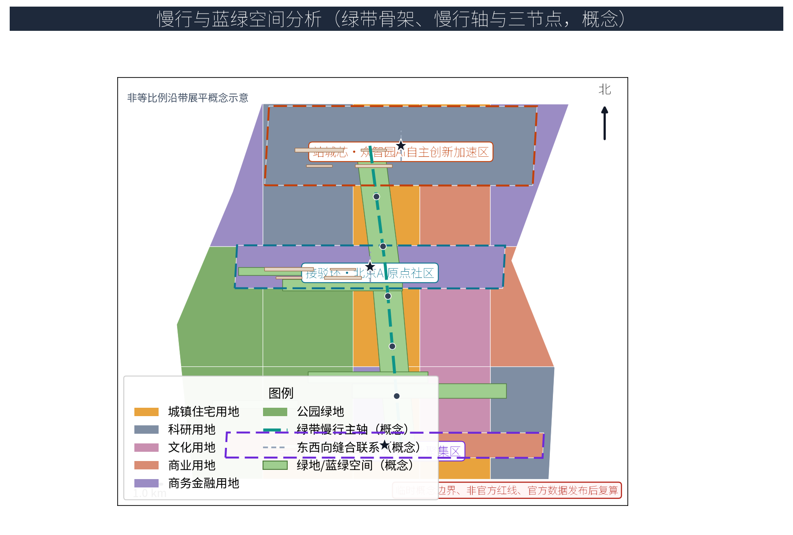
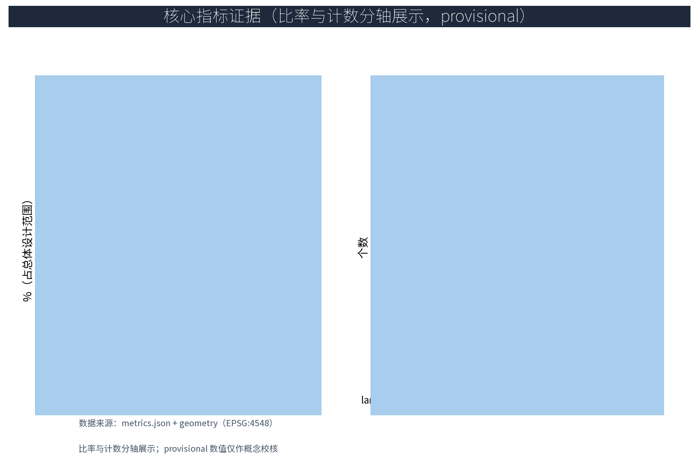

## 主题：轨道站城一体化统筹

以下为「京张AI创新带」国际征集概念方案草案（概念级、provisional 边界、不虚构官方数据、不替代法定规划与运营职责），主题为轨道站城一体化统筹。本包全部内容均为概念建议与参考方案，供专业团队深化校核；正文以机器可读证据锚点标注对应来源、标准、设计深度、空间数据与指标。

> **补充（概念口径）**：本方案以「轨道站城一体化统筹」为主线，将站点、接驳、公共空间与蓝绿空间作为统一体系组织；证据来自本包 geometry 层（site_boundary/key_areas/land_use/roads/public_space 等 GeoJSON）、metrics.json 与矩阵 JSON；几何与指标均基于 provisional 边界并在正文以约值表达，不预设官方数值；客流与轨道运营台账、现状建筑年代、产权与结构鉴定、文保逐栋线索等缺口已在 assumptions.json 与风险节如实登记，官方控规与测绘数据发布后逐项复核复算。

## 方案名称与总体构想（概念）

方案主名称：站城融环（RAIL·JZ）——轨道站城一体化统筹体系。"RAIL"取轨道之意，"JZ"为京张缩写；"融环"寓意轨道站点与城市功能相互融合、循环共生。整体构想以京张高铁市郊轨道线为交通主轴、京张铁路遗址公园绿带为生态脊梁，提出三个原创概念节点：「站城芯（Transit-City Nexus）」——站城一体化统筹核心节点，轨道站点与城市功能联动统筹；「接驳环（Mobility Loop）」——轨道接驳与慢行换乘环，集成P+R与骑行接驳；「共构廊（Co-Built Gallery）」——站城融合公共空间廊道，活化上盖与桥下空间，作为车站与绿带缝合的共享客厅。三者构成"以站兴城、以城养站、以绿串站"的原创体系，并配套原创机制名：「站城议事会」（协同议事）、「轨道荣誉墙」（荣誉展示）、「站城共建公约」（共建约章）、「公众参与积分」（参与激励）、「开发者社区·站城黑客周」（开放共创）——以上均为概念建议，不构成已确定的治理或运营安排。

品牌识别方向（概念 Logo 与视觉识别，详见附图）：标志构成为「融环+轨枕节律+数据节点」——环形象征循环共生，环缘均匀布置的轨枕刻度呼应铁路节律，环心与轨道连线上的节点代表匿名聚合的数据流；色彩原则采用铁路砖红（历史记忆）、中关村科技蓝（创新气质）与AI脉冲青绿（智能活力）三色体系；字体原则采用无衬线几何字型、中西文等距排布；应用规范方向为深色站牌底、白字与环形辅助图形的导视系统；活动品牌延展为「轨道开放日」视觉模板（概念）。品牌在先权利与使用边界：概念阶段未完成官方商标检索，站城融环、RAIL·JZ 及三节点名称/标志仅作为内部工作代号供本次征集展示与讨论，不用于对外注册、商业使用或第三方授权，在先权利清理完成前不扩展使用。

> **证据锚点**：[source:DATA-SRC-AGENT-TASKBOOK]（命名与品牌要求参照任务书）；[data:PACKAGE-GEOMETRY]（节点名称对应 geometry/public_space.geojson 地标层）。

## 设计依据与资料清单
资料清单所列公开史料、规划报道与通则规范均为概念工作依据清单，并非本包已获取的数据；本包实际使用的全部数据见 sources.json，未获取项已在风险与缺失数据说明中如实标注。依据包括：国际征集任务书与技术文件；北京城市总体规划、分区规划及沿线街区控规公开资料；京张铁路遗址公园规划及绿带设计公开资料；轨道线站位与市郊铁路运营公开资料；TOD综合开发、城市更新、慢行交通相关公开标准。资料清单（概念阶段）：基础测绘地形图、现状用地与产权边界、轨道与市政管线图、文物与历史要素清单、产业与人口现状数据、场地影像——以上六类资料均未获取，正式深化须依实测与官方资料补充；本方案全部数据为弹性区间或示意，不虚构官方数据。

> **证据锚点**：[source:DATA-SRC-OFFICIAL-ANNOUNCEMENT]、[source:DATA-SRC-AGENT-TASKBOOK]（组织方公告与任务书为文本口径依据）；[source:DATA-SRC-PROVISIONAL-BOUNDARIES]（边界为 provisional 临时粗略范围）。

## 三层范围工作框架
按官方公告口径，本带设置"统筹研究范围（约43.6 km²）—总体设计范围（约11.4 km²）—重点区域（约368.4 ha）"三层官方范围；本包在官方范围之下承担总体设计范围（约11.4 km²，provisional 替代边界）内三处重点节点（约192.1/104.3/72.0 公顷）的站城一体化统筹概念设计，不替代官方三层边界。三层成果逐级传导：统筹研究输出的站城统筹环境与沿线协同判断约束总体设计，总体设计校核的站城节点布局、接驳网络与时序生长落实到重点节点详设；每层均保留与任务书对应章节的机器可读证据锚点。

「三区两翼」按任务书口径落实（概念解读，供评审校核）：三区为北京AI原点社区、众智园AI自主创新加速区、大钟寺AI产业聚集区——即本包三处重点区域，分别对应「接驳环」「站城芯」「共构廊」三个原创节点；两翼为中关村科技服务翼与小月河场景赋能翼，作为沿带空间—产业—运营协同的两条功能翼。本包沿站城融环构建"三区锚定、两翼赋能"协同回路：站城锚点提供空间载体，创新片区提供产业要素，站城运营平台提供运营闭环；三大定位、五大功能与三节点、三区两翼的逐项映射见"统筹研究范围"节协同矩阵表。未来科学城、怀柔科学城、经开区、北纬社区与京津冀不在任务书三区两翼内涵之内，本包将其另行命名为「外部区域合作网络」，作为跨带协同的开放接口单独表述，不替代任务书口径的三区两翼。

> **证据锚点**：[source:DATA-SRC-OFFICIAL-ANNOUNCEMENT]（三层范围与约面积数值为官方公告文本口径）；[source:DATA-SRC-AGENT-TASKBOOK]（三区两翼按任务书口径落实，外部区域合作网络为另行命名的概念解读）。

## 统筹研究范围产业与未来城市研究
产业与城市研究识别站城一体化的「适配」效应：以轨道站点与接驳网络把沿线高校、科创片区与住区的通勤与交往需求有序组织为双向可达的创新环境单元，形成「站城锚点—科创片区—住区」三级联动结构；未来城市研究仅作方向性预判，不构成对用地与投资的承诺。围绕AI新质生产力，研究研发、算力、数据、场景应用与创新服务产业的空间需求，识别产业链断点；构建"轨道+绿带"双廊未来城市模型：京张高铁市郊轨道线组织跨区通勤与商务流，京张铁路遗址公园绿带组织休闲与交往流，双流交汇处布局创新驿站与AI场景试验场，并提出产城融合、功能混合、职住均衡的空间策略。

本主题对应一带三大定位与五大功能（概念口径）：三大定位为百年京张文化带、都市AI生活体验带、AI融合创新带；五大功能为AI全栈自主创新体系、世界级AI创新生态、AI+场景赋能新范式、智能化AI活力城市、AI治理全球话语权。协同回路逐项映射如下表，按空间—产业—运营三列展开：

| 定位/功能 | 空间落位（三节点） | 产业与要素机制 | 运营与反馈闭环 |
|---|---|---|---|
| 百年京张文化带 | 共构廊·绿带段 | 文化叙事与遗产活化机制 | 「轨道荣誉墙」年度公示 |
| 都市AI生活体验带 | 站城芯·上盖复合空间 | AI场景试验场与生活服务 | 公众站城反馈AI闭环 |
| AI融合创新带 | 三节点全带 | 要素保障机制（土地/产业/资金/人才/算力/数据/场景） | 开发者社区与场景准入 |
| 五大功能 | 对应站城芯/接驳环/共构廊 | 见AI创新生态图谱 | 见年度评估指标 |

「三区两翼」协同矩阵（按任务书口径，概念）：

| 三区两翼 | 协同机制（概念） | 联动载体 |
|---|---|---|
| 三区·北京AI原点社区 | 慢行接驳与社区议事联动，AI生活场景试验 | 接驳环、社区议事会 |
| 三区·众智园加速区 | 站城联动运营与科创孵化联动 | 站城芯、开发者社区 |
| 三区·大钟寺产业聚集区 | 上盖与桥下空间产业展示联动 | 共构廊、产业联盟备案 |
| 两翼·中关村科技服务翼 | 科技服务与要素配套协同 | 沿带服务节点、场景备案 |
| 两翼·小月河场景赋能翼 | 场景赋能与公共体验协同 | 绿带驿站、年度活动品牌 |

「外部区域合作网络」（另行命名，不替代任务书三区两翼）：未来科学城——央企研发与场景验证协同，以算力/数据流与开发者社区联动；怀柔科学城——基础研究与科学装置协同，以知识/人才流与高校合作联动；经开区——智造转化协同，以场景/资本流与产业联盟联动；北纬社区——社区创新单元共建，以慢行接驳与社区议事会联动；京津冀——标准与治理协同，以国际传播与年度活动联动。区域创新协同图示意见附图。

> **证据锚点**：[source:DATA-SRC-PROVISIONAL-BOUNDARIES]（边界为 provisional，研究范围仅作概念示意）；[source:DATA-SRC-AGENT-TASKBOOK]（三大定位五大功能与区域协同为任务书口径）。

## 总体设计范围城市更新与控规深度城市设计
总体设计强调「以绿带为骨架的站城统筹环境」：依托京张铁路遗址公园绿带组织站城节点、接驳网络与慢行骨架，站城设施可逆生长、街道可分时响应；强调更新而非新建，优先利用存量空间植入站城功能；对控规指标只做校核建议，不预设数值结论。总体空间结构图示意见附图：轨道科技商务廊与绿带文化休闲廊双廊并行，站城锚点—科创片区—住区三级联动，创新驿站与AI场景试验场布置于双流交汇处。

落实TOD站城统筹的概念原则：站点周边约600米步行核心圈优先研究功能混合与适度密集开发的可能（概念建议方向；具体开发强度、建筑高度与用地性质须待正式控规条件发布并经专业审查后深化确定，本方案不预设数值结论、不提供管控数字）；保留轨道线位与遗址绿带，同步实施城市更新；加密支路网，构建以"交通慢行"为优先的街道网络；补足市政与公共服务缺口。本方案为控规深度城市设计的概念建议成果，其用地性质、容积率、建筑高度等管控指标需要待正式控规条件与专业审查后逐项深化，不直接转化为管控指标或出让条件，也不构成对实施安排的承诺。

> **证据锚点**：[source:DATA-SRC-MOHURD-CONTROL-DETAILED-PLANNING]（控规深度与方法边界参照）；[source:DATA-SRC-PROVISIONAL-BOUNDARIES]（总体设计范围几何为 provisional）。

## 重点区域详细设计
三处重点片区（众智园AI自主创新加速区、北京AI原点社区、大钟寺AI产业聚集区）与三个原创节点的概念对应关系为：站城芯——众智园AI自主创新加速区（枢纽立体化、站城联动运营、上盖联动商业办公与科创服务）；接驳环——北京AI原点社区（环站点设置P+R与骑行接驳设施，形成连续、遮阴、无障碍的轨道接驳与慢行换乘环）；共构廊——大钟寺AI产业聚集区（利用上盖与桥下空间塑造共享客厅、口袋公园与展演场地，与京张铁路遗址公园绿带无缝衔接）。三节点的设施选址均为概念点位，须经规划、轨道、文保与主管部门评估及专业审查后重新落位；节点间的绿带动线与慢行通道构成完整站城动线。

节点场地化设计（概念，详见 key-areas 图）：平面——站城芯枢纽设置立体换乘大厅与上盖裙房，接驳环设置环形慢行道与P+R库顶花园，共构廊设置桥下共享客厅与口袋公园；断面——按"轨道与站台—上盖复合—绿带慢行—街道分时"四段组织；用户旅程——"出站—接驳—消费/办公—绿带走廊—社区到达"五步串联，全程落实无障碍与适老设计。三类AI+场景（客流接驳调度AI、站城联动运营AI、慢行接驳规划AI）在节点内布置试验场，仅处理匿名聚合数据。

> **证据锚点**：[data:PACKAGE-GEOMETRY]（三节点示意多边形来自 geometry/key_areas.geojson 与 public_space.geojson）；[source:DATA-SRC-PROVISIONAL-BOUNDARIES]。

## AI 创新生态、人才画像与 AI+ 场景
AI创新生态图谱（见附图）按"要素层（算力/数据/模型/场景、人才/资本/政策标准）—主体层（高校院所/企业/AI行业组织/社区）—机制层（数据沙箱/孵化加速/测试认证/开放准入退出）—治理层（匿名聚合/人工复核/禁止过度监控/结果公示）"四层组织；要素保障机制按土地、产业、资金、人才、算力、数据、场景七类要素逐项建立"保障机制—建议载体—置信等级—复算触发"登记（见矩阵 JSON），全部为概念建议。

全球站城一体与AI生态案例（6个，均有来源）：伦敦国王十字（station-led 更新，公共空间先行）、东京涩谷站（车站直上复合，观测层与共创空间）、香港MTR车厂加物业模式（R+P 反哺轨道运营）、新加坡裕廊湖区（轨道枢纽+创新产业区，地面开放空间最低比例控制）、东京二子玉川（LEED ND 认证的轨前紧凑混合开发）、大阪站前知识资本（站前创新共创平台）。案例表与比较结论如下（均为公开资料概念引用，不作运营承诺）：

| 序号 | 全球案例 | 所在地与类型 | 借鉴机制（概念） | 案例来源 |
|---|---|---|---|---|
| 1 | 国王十字更新 | 伦敦·站区更新 | 轨道枢纽为催化剂，20条新街道与10处公共空间先行 | CASE-KX-2001 |
| 2 | 涩谷Scramble Square | 东京·车站上盖 | 230米站上复合与共创设施、观测层公共体验 | CASE-SHIBUYA-2019 |
| 3 | 港铁R+P模式 | 香港·车厂+物业 | 物业价值反哺轨道建设与运营 | CASE-MTR-RP |
| 4 | 裕廊湖区 | 新加坡·轨道产业区 | 轨道枢纽锚定创新产业区，开放空间最低比例导控 | CASE-JLD-2026 |
| 5 | 二子玉川Rise | 东京·轨前社区 | 紧凑混合、生态走廊与绿野认证 | CASE-FTR-2015 |
| 6 | 大阪知识资本 | 大阪·站前平台 | 站前共创平台与开放实验室运营 | CASE-KC-2013 |

人才画像聚焦五类人才：算法工程师、数据与算力运营者、场景产品经理、科研转化者、城市数字运营师，配套定制化居住、办公与生活服务，画像—空间—服务映射见下表：

| 用户画像 | 需求空间（概念） | 服务与运营机制 |
|---|---|---|
| 算法工程师 | 站城芯科研与孵化空间 | 开发者社区、场景备案、配套公寓 |
| 数据与算力运营者 | 数据沙箱与算力服务节点 | 匿名聚合规范、运行监测、值班轮换 |
| 场景产品经理 | 场景试验场与共创工作室 | 测试认证、准入备案、年度评测 |
| 科研转化者 | 高校共建与成果转化驿站 | 高校联盟、成果公示、孵化加速 |
| 城市数字运营师 | 站城运营平台与指挥调度 | 人工复核、分级授权、运行监测 |

五大AI+场景与城市六域逐域对应（概念口径）：客流接驳调度AI与慢行接驳规划AI承接交通域，站城联动运营AI承接产业与空间域，上盖物业运维AI承接空间与公共服务域，公众站城反馈AI承接公共服务、文化与治理域，形成六域全覆盖场景矩阵；所有场景仅处理匿名聚合数据、关键决策人工复核、不进行个体识别式追踪、禁止过度监控。数据沙箱内的场景实验实行接入备案与人工复核（概念建议）。

| 场景卡编号 | 场景卡名称 | 空间载体 | AI能力与数据边界 | 运营主体 |
|---|---|---|---|---|
| 1-1 | 高峰接驳运力调度卡 | 站城芯枢纽、接驳环 | 匿名聚合客流模拟、调度指令人工复核 | 轨道与公交运营单位、站城运营平台 |
| 1-2 | 节事散场分时疏导卡 | 站城芯站前广场 | 分时分区疏导推演、仅匿名聚合 | 运营平台、公安交管协作 |
| 1-3 | 最后一公里响应接驳卡 | 接驳环、社区接驳点 | 需求匿名聚合、运力预约与轮换 | 运营平台、社区志愿者 |
| 2-1 | 上盖业态联动运营卡 | 站城芯上盖空间 | 功能使用匿名分析、经营决策人工复核 | 物业运营企业、产业运营方 |
| 2-2 | 空间使用效率分析卡 | 三节点公共空间 | 占用率匿名聚合、方案公示 | 专业团队、运营平台 |
| 3-1 | 慢行路径优化推演卡 | 接驳环、连续慢行轴 | 轨迹匿名聚合、方案人工复核后公示 | 规划专业团队、街道社区 |
| 3-2 | 绿道衔接评估卡 | 共构廊绿带段 | 衔接断点识别、仅匿名聚合 | 规划专业团队、志愿者 |
| 4-1 | 上盖智慧运维能耗卡 | 共构廊上盖复合空间 | 设备与能耗匿名数据、不涉及个人画像 | 物业运营企业 |
| 4-2 | 设备健康预测维护卡 | 枢纽机电系统 | 设备状态匿名聚合、维护指令人工复核 | 专业运维团队 |
| 5-1 | 匿名意见聚类卡 | 共构廊公共客厅、线上通道 | 意见匿名聚合、人工复核、结果公示 | 社区、志愿者、运营平台 |
| 5-2 | 服务与治理反馈闭环卡 | 三节点服务窗口 | 反馈分级处理、年度公示 | 站城议事会、运营平台 |
| 5-3 | 年度公示可视化卡 | 站城运营平台 | 年度匿名数据报告可视化、人工复核 | 运营平台、第三方评估 |

场景—空间—运营矩阵（概念）：客流接驳调度AI——站城芯枢纽/接驳环——调度提案制，决策权在轨道与公交运营单位，KPI为接驳延误与换乘步行时间；站城联动运营AI——上盖空间——业态联动提案制，决策权在物业与运营企业，KPI为上盖空间使用效率；慢行接驳规划AI——连续慢行轴——方案公示制，决策权在规划与街道，KPI为慢行连续度与无障碍达标率；上盖物业运维AI——机电与能耗系统——维护建议制，决策权在物业企业，KPI为能耗与故障响应；公众站城反馈AI——公共客厅与线上通道——意见闭环制，决策权在站城议事会，KPI为意见处理率与年度公示完成度。

AI技术协议（概念建议）：模型评测——接入基准测试与误报率统计，未达标场景不进入运行；数据质量——统一匿名聚合口径与数据质量规则，缺台账数据不补造；误差分群——预测与推演结果按误差分群标注置信等级，仅供决策参考；运行监测——场景运行全程监测并保留人工复核与停止条件，任何场景不得进行个体识别式追踪。实测基线诚实口径：本阶段未取得客流、能耗与运行实测基线，三个产业测试场景以公开仿真与匿名聚合数据先行建立「基线与复现协议」——固定输入数据版本、随机种子、评测指标与误差分群规则，形成可复现的实验配方，测试结果仅用于概念校核；官方台账与实测数据到位后以实测基线复算并替换概念基线，未达标场景不进入运行（概念建议）。数据生命周期：采集即匿名、聚合存储、分级访问、按规则定期销毁；模型适用边界：AI输出仅为辅助建议，不替代法定运输组织、审批与运营职责。产业测试场景协议（3个，概念）：以匿名聚合与仿真数据为限，测试结果仅用于概念校核，官方台账到位后复算。

| 产业测试场景 | 测试内容与协议 | 数据与验收口径 |
|---|---|---|
| 客流接驳调度原型测试 | 高峰/节事两场景模拟推演，调度指令人工复核 | 匿名聚合仿真数据；基准测试+误报率统计；误差分群标注 |
| 站城联动运营沙箱测试 | 上盖业态与公共空间使用模拟，经营决策人工复核 | 数据沙箱内匿名数据；运行监测+停止条件 |
| 慢行接驳规划推演测试 | 绿道衔接与路径优化推演，方案人工复核后公示 | 匿名聚合轨迹样本；方案测试→公示→备案闭环 |

> **证据锚点**：[source:DATA-SRC-GENERATIVE-AI-INTERIM-MEASURES]（AI生成内容治理表述的参照依据）；[metric:global_case_count]、[metric:persona_count]、。

## 用地、建筑规模与拆改留方案
拆改留坚持留改拆并举：以留为主保留遗址公园肌理与铁路历史遗存，存量建筑功能置换并预留站城一体化改造方向（接驳接口、上盖复合），拆除仅限经个案论证的局部疏通慢行零星建筑；全部面积为概念口径，官方数据发布后复算。概念阶段以弹性区间表达规模：站城芯核心圈功能混合比例、接驳环设施规模、共构廊公共空间占比等均为建议区间而非承诺指标，上述比例为概念口径（弹性区间），官方用地与测绘数据发布后按统一口径复算聚合。拆改留策略：留——京张铁路遗址公园绿带、轨道线位、历史建筑与成熟社区；改——低效厂房与老旧楼宇功能置换、微更新；拆——仅对安全等级低、阻碍公共空间贯通性的危旧建筑以个案论证拆除。具体清单与规模待实测与产权资料到位后在深化阶段复核复算。

> **证据锚点**：[source:DATA-SRC-MNR-LAND-USE-CLASSIFICATION-202311]（用地分类名称参照现行国标口径）；[data:PACKAGE-GEOMETRY]（land_use/buildings 层为概念多边形，非现状测绘）。

## 交通、轨道、市政与公共服务设施
以交通慢行优先为核心组织交通概念机制：轨道站点与慢行网络一体化接驳，沿绿带构建连续慢行轴贯通站城芯、接驳环与共构廊，P+R、骑行与步行接驳一体化，街道断面按活动需求分时响应（早高峰、节事、日常模式），衔接沿线高校、园区与轨道线路，绿色出行优先、降低小汽车依赖、节事散场分时分区疏导；市政以集约共享为原则，站城设施与建筑一体化概念、优先利用现状设施条件；公共服务配置多语服务、站城展示与研习空间，AI决策均设人工复核。客流与运营台账、市政管线与容量资料未获取前，本方案不提供客流预测、接驳运力与市政容量结论；客流接驳调度AI仅以匿名聚合模拟数据做推演建议，不采集个人行为数据。

交通：以京张高铁市郊轨道线为主体，构建"轨道+公交+慢行"分层接驳体系，慢行接驳优先，强化最后一公里；市政：衔接现状管网，提出低碳能源、海绵化更新与智慧管线概念；公共服务：按十五分钟生活圈补齐教育、医疗、文体设施，结合站城芯设置便民服务中心，并预留AI城市运行管理设施接口。

> **证据锚点**：[source:DATA-SRC-MOHURD-URBAN-DESIGN-MEASURES]（市政与慢行设计表述的方法参照）；[data:PACKAGE-GEOMETRY]（roads 层为概念慢行轴线，非道路红线）。

## 蓝绿空间、公共空间与城市风貌
构建「绿带为轴、节点公园为珠」的蓝绿公共空间体系：以遗址公园绿带为蓝绿骨架串联沿线小微绿地与开敞空间，站城设施与蓝绿空间融合布置，形成连续生态与公共空间体系；上盖与桥下空间宜轻宜透宜可逆，不遮挡历史遗迹与绿带视线；指示与解说系统统一克制；风貌延续京张铁路工业记忆语汇并与站城一体的新交通氛围对话，整体风貌导控克制统一，避免符号堆砌与口号化包装。

公共空间强调全天候、全龄友好与可运营性，兼顾长者银龄、青年、儿童、学生、通勤者、游客、居民、从业者、残障人士与低数字能力群体，落实无障碍与适老设计，提供儿童友好与亲子空间，为夜间使用者保留照明与安全服务，为既有社区小商户预留流动摊位与经营展示空间（概念建议）；无障碍与多语服务仅作为特定服务场景的设计基线，不泛化为已合规的承诺。荣誉展示系统：「轨道荣誉墙」建议机制——公众评选、意见公示、荣誉备案，展示站城共建贡献者（个人与团队）与年度活动成果；公共空间组件库：座椅、遮阳棚、雨棚、导视柱、灯柱、移动花箱、可逆铺装、儿童游戏模块八类组件，遵循模块化、可逆、轻介入原则，组件清单与尺寸待深化阶段编制（见矩阵 JSON）；导视系统：站点级、街区级、绿带级三级导视，中英双语并配套人工服务与志愿者双通道，覆盖低数字能力群体；文化叙事：以"百年京张—中关村创新—AI新生"三线叙事组织绿带展陈与解说内容。

> **证据锚点**：[source:DATA-SRC-BARRIER-FREE-ENVIRONMENT-LAW]（无障碍服务场景基线的参照，不泛化为合规结论）；[source:DATA-SRC-MOHURD-URBAN-DESIGN-MEASURES]（蓝绿空间组织的方法参照）。

## 更新项目清单、实施政策与分期计划
四类项目清单（站城芯试点/接驳环贯通/共构廊织补/站城运营平台上线）为概念清单，规模与投资估算均为建议性表述；政策建议（带方案出让、多元主体共建、意见复核机制）均须依法依规论证，不构成政府或运营方承诺。建立"站城芯枢纽更新、接驳环设施提升、共构廊绿道贯通、老旧社区微更新、产业楼宇改造"五类项目库，按紧迫度与投资类型排序。实施政策建议：TOD一体化开发捆绑出让、容积率奖励与公共空间贡献联动、政府与社会资本合作、绿带沿线城市更新专项政策——均为建议方向，且容积率类奖励以正式控规条件为基础、不预设数值。分期计划：近期（1—3年）在试点区域（众智园站城芯样板、接驳环贯通段、共构廊织补段）开展示范节点与绿带贯通；中期（3—5年）总体范围成片更新并完成三节点接驳环成网；远期（5—10年）全域统筹优化提升与品牌资产沉淀。

实施分工（牵头/协作，概念建议）：站点综合开发由政府统筹与轨道运营单位牵头、企业与专业团队协作；慢行与蓝绿工程由规划与市政部门牵头、社区与志愿者协作；站城运营平台由运营团队牵头、居民与商户协作参与；AI场景验证由高校与专业团队牵头、运营平台协作。停止与退出条件：场景开放实行准入与退出机制，以年度评估复核为准入依据，未达到匿名数据质量与人工复核要求的场景触发停止条件并撤收；试点项目设置停用条件，当控规条件、客流台账、产权资料发生重大变化时暂停深化并复算；所有机制为概念建议，不构成契约安排。

年度活动品牌体系（概念设想，见下表）：以「轨道开放日」「站城共构工作坊」「慢行接驳体验季」三个年度品牌化活动为主体，铺开月度常规活动与周度场景预约更新；公众参与积分、意见公示与站城共建公约均为建议性设计。公共体验运营：公共空间实行预约、轮换与志愿讲解制度（概念）；开发者社区：设立「开发者社区·站城黑客周」，开放数据沙箱与API测试备案，成果经人工复核后公示，形成测试—备案—公示—迭代的转化路径；国际传播：编制中英双语国际传播文案，围绕"百年京张—中关村创新—AI新生"叙事与年度活动形成传播内容包（见视觉页面与图册）；人才与企业后续转化：人才沿"场景测试—实习岗位—共创项目—创业孵化"路径转化，企业沿"测试入驻—产业联盟备案—融资对接"路径转化，均为建议机制。年度评估指标：活动参与人次、场景备案数、开发者社区活跃度、居民满意度、匿名数据质量得分、年度公示完成度。

| 品牌 | 年度活动 | 频次与参与 | 评估指标 |
|---|---|---|---|
| 站城融环文化单元 | 「轨道开放日」 | 每年一次，公众预约参观站点与绿带 | 参与人次、满意度、国际传播覆盖 |
| 站城共构工作坊 | 「站城共构工作坊」 | 每季一次，居民/商户/高校/企业共建议题 | 议题落地数、议事参与率、公示完成度 |
| 慢行体验单元 | 「慢行接驳体验季」 | 每年两季，骑行步行打卡与节点体验 | 体验人次、慢行分担率变化、志愿小时数 |

治理机制建议（连续三句，概念口径）：站城运营的决策宜由政府部门、运营企业与居民社区代表共同组成的站城议事机构作出；决策依据与关键节点宜通过意见公示与匿名聚合数据报告向公众公开；实施效果宜由第三方专业评估、志愿者监督与分级反馈整改共同闭环，以上均为可供专业团队与运营团队继续讨论深化的建议，不构成已确定的治理安排。居民意见通道：线上匿名反馈与线下议事会并行，意见经人工复核后按分级纳入年度公示。分群影响评估与参与记录（概念协议）：对长者、儿童、残障人士、低数字能力群体、夜间使用者与学生等分群开展影响预评估与年度回访记录，参与记录仅以匿名聚合保存、按年度公示，评估结果作为空间与服务调整的依据之一，不形成个体档案。

> **证据锚点**：[source:DATA-SRC-AGENT-TASKBOOK]（分期与实施条目对应任务书要求）；[metric:phase_count]、[metric:annual_program_count]。

## 指标体系、面积复算与合规矩阵
概念指标体系（含数据来源/公式/置信等级/用途限制/复算触发）见下表，全部为概念口径：轨道站点800米覆盖人口与就业、接驳环慢行接驳分担率、共构廊公共空间连续度、蓝绿公共空间覆盖率、上盖联动开发强度、AI场景落地数均以目标区间表达，不预设结论性数值。

| 指标名称 | 数据来源 | 公式/口径 | 置信等级 | 用途限制 | 复算触发 |
|---|---|---|---|---|---|
| green_ratio | metrics.json + green_space/site_boundary | 绿空间面积/总体范围面积（EPSG:4548） | 低 | 概念展示 | 官方几何发布后复算 |
| public_space_ratio | metrics.json + public_space/site_boundary | 公共空间面积/总体范围面积 | 低 | 概念展示 | 官方几何发布后复算 |
| site_area_sqm | metrics.json + site_boundary | 多边形面积（约11.41 km²） | 中 | 概念展示 | 官方边界发布后复算 |
| 慢行接驳分担率（区间） | 概念目标区间 | 绿色出行分担约70%—80% | 概念 | 不作客流预测 | 客流台账到位后复算 |
| 场景与活动计数 | proposal.md 表格行数 | 场景卡12/案例6/年度活动3/分期3 | 高 | 计数口径 | 内容修订时复核 |

面积复算：本包以官方公告文本口径为底（统筹约43.6 km²、总体约11.4 km²、重点约368.4 ha），总体设计范围使用 provisional 替代边界，复算面积约11.41 km²，三处重点区复算约192.1/104.3/72.0 公顷；上述数值仅作概念校核，不替代官方精确面积，官方图形发布后按统一坐标系整体复算并标注复算版本号。投资与成本只作定性分级（低/中/高），含估算方法、价格基期、包含范围、置信等级与复算触发说明，不给精确金额。合规矩阵：逐项对照总规、控规、轨道及市郊铁路管理规定、绿带保护要求，标注符合、偏离与待调整事项，确保概念方案不越合规红线（见 compliance_matrix.json 与 standard_matrix.json）。

> **证据锚点**：[metric:green_ratio]、[metric:public_space_ratio]、[source:PACKAGE-GEOMETRY]、。

## 风险、版权与合规说明
风险提示：provisional 边界数据可能变化、权属与搬迁存在不确定性、既有市政承载力约束、AI场景的隐私敏感性——本方案以匿名聚合+人工复核机制予以回应，禁止过度监控；客流与轨道运营台账、现状建筑年代与产权、文保线索逐栋核查、市政管线容量均未获取，正式实施前须完成多部门联审、轨道运营安全评估、文物保护与消防评估；试点项目设有停止条件与复算触发，见实施节。版权说明：站城融环（RAIL·JZ）、站城芯、接驳环、共构廊均为本次提交的原创名称与概念；本包文字、图件、几何与程序生成内容为参与方原创，许可类型为 COMMUNITY-DISPLAY-ONLY，仅限本项目公开展示与讨论；供后续专业团队在本征集框架内深化使用时，须遵守征集规则并另行取得组织方及相应权利方许可；引用资料均注明来源并关联 sources.json 的许可与用途边界登记，引用版本的页码将在正式成果编制时逐条补全复核。品牌在先权利与使用边界：概念阶段未完成官方商标检索，站城融环、RAIL·JZ 及三节点名称与标志仅作内部工作代号，不对外注册、不使用于商业场景，清理完成后另行评估；上述检索与清理不构成放弃权利，也不视为已取得任何在先权利。合规说明：严格遵循国家及北京市相关法律法规；无障碍与多语服务仅针对特定服务场景作为设计基线，不泛化为已合规；全部结论为概念建议、参考方案，不构成法定规划、审批或实施承诺；涉及公开数据的使用均以 sources.json 许可边界为准，未使用任何未授权或非公开的空间数据，亦不涉及敏感数据。

> **证据锚点**：[source:DATA-SRC-OFFICIAL-ANNOUNCEMENT]（征集规则为权属与合规表述的依据）；[source:DATA-SRC-GENERATIVE-AI-INTERIM-MEASURES]、[source:DATA-SRC-BARRIER-FREE-ENVIRONMENT-LAW]（合规基线参照，不泛化）；（风险几何边界来自本包 geometry）。

## 参考资料
（概念级引用清单，均为公开可查资料类别；本清单为概念工作依据索引，正式深化时逐条补全版本与页码并完成引用复核）
1. 国际征集任务书与技术要求（官方公告与任务书文本口径）；
2. 《北京城市总体规划（2016年—2035年）》公开资料；
3. 沿线街区控制性详细规划与分区规划公开资料；
4. 京张铁路遗址公园规划及设计方案公开资料；
5. 京张高铁及市郊轨道线运营与TOD研究公开资料；
6. 城市更新、TOD综合开发相关国家政策与文献；
7. 慢行交通、蓝绿公共空间相关标准规范；
8. 全球案例与指标体系引用的机构公开页面（详见 sources.json，共6个案例条目）。

---

**说明**：本草案为概念级成果，共13个章节全部按序覆盖；所有规模、指标均以弹性区间表达，官方数据待后续实测与资料补充后校核复算。正文落实「交通慢行」「蓝绿公共空间」「三区两翼」等口径，并贯穿TOD站城统筹、慢行接驳、上盖联动、桥下空间、车站与绿带缝合，以及京张铁路遗址公园绿带与京张高铁市郊轨道线两大核心要素；中英文版本内容实质等值，英文版本及图件、PDF、HTML 均已配套生成并经确定性校验。

> **证据锚点**：[source:DATA-SRC-OFFICIAL-ANNOUNCEMENT]（征集规则为权属与合规表述的依据）。