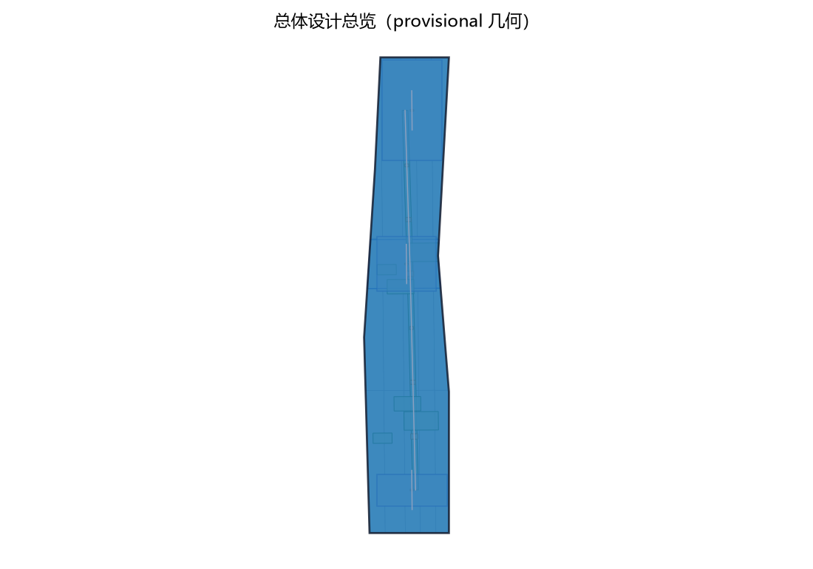
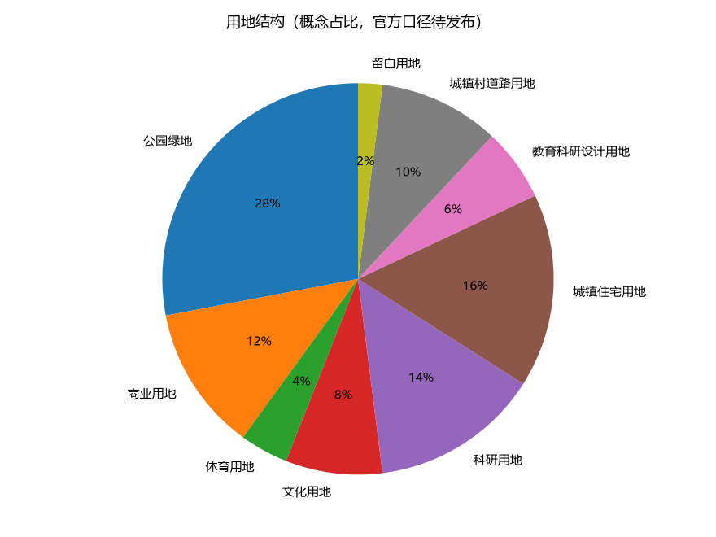
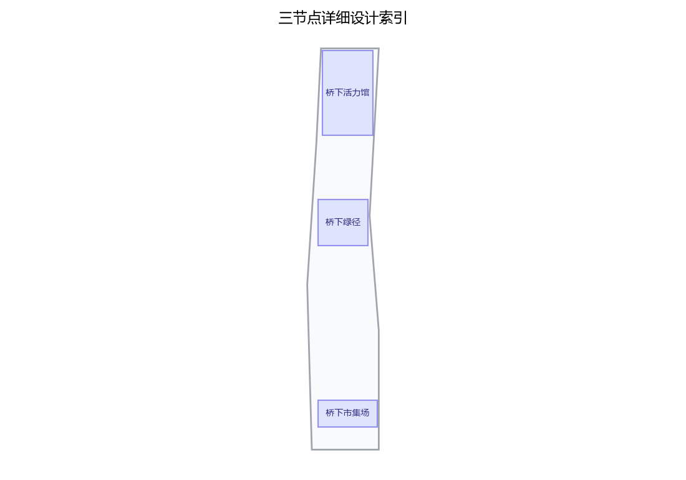
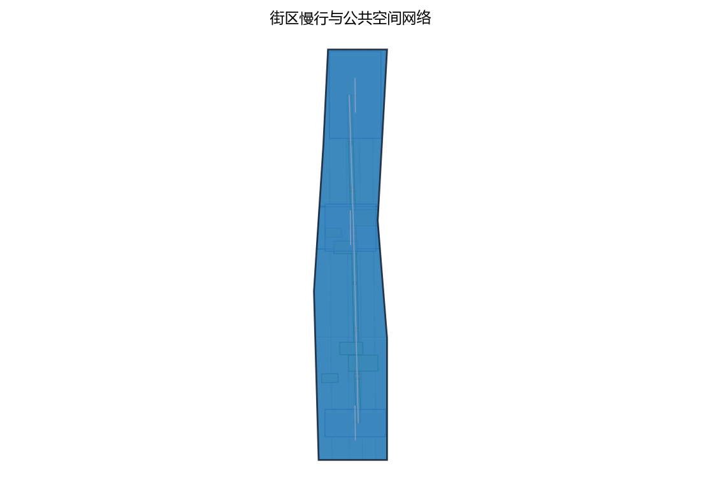
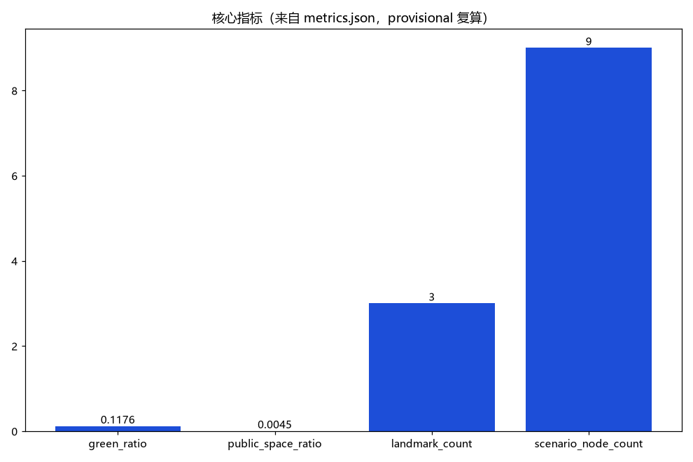

轨道高架桥下空间活化与城市缝合——第42号方案包概念建议草案

> 高架之上是疾驰的轨道，高架之下是日用的城市。桥下智环以"一馆一径一场"三个节点、五类AI+场景与五项治理机制要素，把轨道两侧被分隔的城市重新缝合，让高架阴影转化为可预约、可共治、可复用的线性公共空间。

本草案为面向"百年京张AI创新带"开源征集的概念建议与参考方案，聚焦任务书中"东西缝合与南北贯通概念策略、更新与存量空间利用、智能化AI活力城市"维度。全文不给出容积率、建筑高度、具体拆改留、道路红线、投资测算或工程可行性结论；不编造官方数据、桥下面积、活动场次与政策承诺；桥下任何落位均以现状条件与轻量可逆装置为前提，正式实施前必须完成结构评估与轨道保护区（安全保护区）核查。

## 设计依据与资料清单

主控依据依次为：征集资格预审公告与面向智能体任务书摘录（确定三大定位、五大功能、三区两翼、agent.1-6 任务与边界条款）、任务书全文摘录（含禁止性表述清单）、投稿技能（确定提案结构、成果属性与 provisional 边界处理要求）。本方案主题对应任务书中的"东西缝合与南北贯通概念策略""更新与存量空间利用"与"智能化AI活力城市"维度，重点承接 agent.3（AI+场景赋能新范式与智能化AI活力城市）与 agent.4（AI公共空间、东西缝合与南北贯通概念策略）的响应要求，并以概念方式回应其余任务。

| 类别 | 资料 | 用途与边界 |
| --- | --- | --- |
| 任务依据 | 公开征集公告与面向智能体任务书摘录 | 三大定位、五大功能、三区两翼与任务响应；不替代正式规划 |
| 任务全文 | 任务书全文摘录（含禁止性清单） | 合规红线自查 |
| 技能依据 | 投稿技能 | 提案结构、provisional 几何与复算要求 |
| 场地依据 | 任务书摘录中的三区两翼与边界条款 | 仅作概念落位线索；无官方 polygon |
| 对标案例 | 上海苏州河桥下空间更新、东京高架桥下活化、首尔高架桥下公共空间、纽约高线公园下部空间 | 仅按公开渠道概述机制，不作工程与绩效证据 |
| 文脉资料 | 京张铁路与遗址公园公开方向（任务书摘录） | 文化叙事背景 |
| 格式参考 | 仓库内既往方案正文 | 仅参考章节结构与诚实表述方式，未复制内容 |

当前公开材料未提供官方总体边界与桥下空间 polygon，本草案不宣称任何桥下段位面积，不引用非公开图纸或数据。若后续提交含几何的正式包，将采用明确标记的 provisional 几何开展面积复算，并以官方数据发布为复算触发条件（详见"指标体系、面积复算与合规矩阵"节）。

> **证据锚点**：[source:DATA-SRC-OFFICIAL-ANNOUNCEMENT-20260509]、[source:DATA-SRC-AGENT-TASKBOOK-20260518]（组织方公告与任务书为文本口径依据）。

## 三层范围工作框架

三层范围以"问题—空间—运营—证据"责任链贯通。统筹研究范围回答"桥下空间如何服务一带的产业与未来城市"；总体设计范围把回答落实到沿轨道高架的概念空间结构与控规深度表达；重点区域范围把结构落到"一馆一径一场"三个节点的功能、空间与公共体验界面。三层各自回答不同问题，避免宏观生态、总图与节点设计脱节。

| 层级 | 核心问题 | 桥下智环的回答 | 主要成果 |
| --- | --- | --- | --- |
| 统筹研究范围 | 高架两侧城市如何被缝合、AI场景如何转译为空间 | 东西缝合与南北贯通的概念通道、桥下场景开放实验场 | 产业与未来城市研究、对标案例机制 |
| 总体设计范围 | 存量桥下空间如何更新利用 | 一环三节点（一馆一径一场）与轻量可逆建造原则 | 总体结构、用地风貌、交通市政概念 |
| 重点区域范围 | 三个节点如何差异化落地 | 活力馆、绿径、市集场的功能与体验界面 | 节点详细设计、场景—空间—运营映射 |

三层范围中的"众智园侧、AI原点社区侧、大钟寺侧"是对应三区两翼体系的桥下段位意向，仅用于组织概念，不是官方范围划分；任何段位的落地均须以权属核实、结构评估与主管部门协调为前提，表述为概念建议与参考方案。

> **证据锚点**：[source:DATA-SRC-AGENT-TASKBOOK-20260518]（三层范围划分依据任务书官方文本口径）。

## 统筹研究范围产业与未来城市研究

三大定位在桥下空间的转译：桥下空间是"都市AI生活体验带"的日常界面、"百年京张文化带"的城市叙事载体、"AI融合创新带"的场景开放实验场。五大功能中，桥下智环以"AI+场景赋能新范式"与"智能化AI活力城市"为直接抓手，以"世界级AI创新生态"为支撑目标：三个节点紧邻众智园AI自主创新加速区、AI原点社区与大钟寺AI产业集聚区，形成"园—径—场"的生态回路；中关村科技服务翼与小月河场景赋能翼为桥下场景提供要素接口与场景赋能，桥下空间为两翼提供可感知的实体试验场。

对标案例仅按公开渠道概述其机制，不展开未经核实的细节：

| 案例 | 公开渠道概述 | 可借鉴机制 | 京张转译 |
| --- | --- | --- | --- |
| 上海苏州河桥下空间更新 | 公开报道显示上海持续推进苏州河沿线桥下空间品质提升，部分桥下空间植入体育、文化与便民功能 | 桥下复合功能与多部门协同 | 活力馆的体育健身、文化展示与社区服务意向 |
| 东京高架桥下活化 | 公开渠道常见案例显示东京形成中目黑高架下、神田万世桥等桥下商业与文化集聚 | 轨道权属方合作与轻资产运营 | 市集场的分时运营与共治公约 |
| 首尔高架桥下公共空间 | 公开报道显示首尔将部分高架桥下空间改造为社区体育与公共文化空间 | 公共优先与社区设施植入 | 绿径与活力馆的公共性优先 |
| 纽约高线公园下部空间 | 公开资料显示其高架结构下方的地面空间曾用于艺术与文化功能 | 桥下空间的策展与文化叙事 | 桥下文化展示与"线上下"双层叙事 |

八要素机制（土地、空间、产业、资金、人才、算力、数据、场景）在桥下尺度上收敛为"场景"与"空间"两枚齿轮：桥下智环不承诺产业招商与资金政策，只提供"场景开放实验场"的机制建议——企业、开发者与社区通过公开渠道申请使用清单内许可的场景方向，试验结果经年度评估公示沉淀回公共知识库。

> **证据锚点**：[source:DATA-SRC-PROVISIONAL-BOUNDARIES-20260605]（边界为 provisional，研究范围仅作概念示意）。

## 总体设计范围城市更新与控规深度城市设计

命名体系："桥下智环"（UNDER·JZ）。"智环"取双关——空间上指"环绕缝合"，桥下连续通道把轨道两侧联结成环；治理上指"闭环"，从使用清单、准入、分时预约到年度评估公示构成治理闭环。视觉识别方向：以高架桥墩序列与拱腹光带为识别母题，采用桥墩编号与地面导视联动的机器可读标识，符号系统为原创绘制，不复制任何既有商标与图样。

总体结构为"一环三节点"：一条沿轨道高架的桥下连续概念通道，串联众智园侧的桥下活力馆、AI原点社区侧的桥下绿径、大钟寺侧的桥下市集场。通道在桥墩间距内组织慢行线，在经结构评估与净空核定的段位组织节点功能；节点之间的连续段以绿径为底色，形成"馆—径—场"节奏。

城市更新逻辑为存量优先、轻量可逆、现状优先：桥下空间使用以"使用清单与准入机制"为前提，不改变法定用地性质，不新增永久建筑判断，不提出土地权属与开发时序结论。控规深度以"问题—空间对象—概念指标—资料缺口—复算路径"五要素组织（详见指标体系节），法定强度与工程结论保持待确认，不以概念建议替代控规审批。本方案不给出容积率、建筑高度、道路红线或具体拆改留结论。

> **证据锚点**：[source:DATA-SRC-MOHURD-CONTROL-DETAILED-PLANNING]、[source:DATA-SRC-PROVISIONAL-BOUNDARIES-20260605]。

## 重点区域详细设计

三节点均为高架段下方的概念落位意向，具体段位选择以净空核定、结构评估、轨道保护区规定与权属核实为准，全部表述为概念建议。

**桥下活力馆（众智园侧）。** 功能意向为体育健身、文化展示、社区服务的桥下复合功能空间，紧邻众智园AI自主创新加速区，承担"加速区的公共界面"角色。空间策略：在桥墩之间以可逆模块组织健身单元（球类与健身跑道意向）、文化展示单元（AI创新成果与京张文化的静态展陈意向）与社区服务单元（便民服务与志愿值守意向）；照明以低眩光、高显色为基础，通风与排水以现状条件为前提。公共体验界面：从"路过高架阴影"变为"走进一座桥下客厅"——入口以桥墩编号与灯带序列形成识别，内部以铺装变化分区，桥体墙面保持轨道设施原有质感，仅以可逆挂载表达内容，所有装置不接触桥体结构。

**桥下绿径（AI原点社区侧）。** 功能意向为桥下慢行与蓝绿缝合廊道，服务AI原点社区日常步行、通勤换乘与生态休憩。空间策略：以耐阴种植带、雨水花园与透水铺装构成"桥下雨养廊"，把高架雨水径流以低影响方式引入海绵设施意向；照明与安全路径一体化设计，保证昼夜连续可读。公共体验界面：慢行线以"树桥相映"为体验——桥墩之间布置可坐可停的停留点，设置耐阴植物与水质科普标识；绿径同时是东西两侧社区的水平缝合线，两端以现状条件下的桥下开口与地面步行衔接。种植与铺装均为地面层可逆改造，不涉及桥梁结构改造。

**桥下市集场（大钟寺侧）。** 功能意向为分时活动与市集空间，服务大钟寺AI产业集聚区的"智能原生新业态"意向，提供小规模、低门槛的商业与社交实验场。空间策略：以可逆装置（可移动摊位、易拆装遮阳顶棚、可收起座椅）组织场地，以时段管控（工作日与周末、白天与夜间之分时表概念）分割功能；摊位与设备接口以现状市政条件为前提。公共体验界面：市集场是"烟火气与AI共生"的界面——实体摊档与公开数字公告板并存，活动信息同时以纸本与数字渠道发布；热闹与休静由时段与共治公约调节，不依赖自动执法。该节点拟作为活动撮合AI与噪声管控AI的试点空间（见场景卡），所有活动安排均为设想意向，不构成已确定活动计划。

| 节点 | 对应片区 | 功能意向 | 空间策略 | 公共体验界面 |
| --- | --- | --- | --- | --- |
| 桥下活力馆 | 众智园侧 | 体育健身、文化展示、社区服务 | 可逆模块、低眩光照明、现状条件优先 | 从阴影到客厅的桥下复合体验 |
| 桥下绿径 | AI原点社区侧 | 慢行缝合、蓝绿生态、通勤衔接 | 耐阴种植、雨水花园、照明安全一体化 | 树桥相映的连续步行体验 |
| 桥下市集场 | 大钟寺侧 | 分时市集、活动社交、新业态实验 | 可逆装置、时段管控、共治公约 | 烟火气与AI共生的小规模实验体验 |

三节点共同前提：净空与结构评估、轨道保护区规定、权属核实、消防与无障碍调查完成之前，任何节点不进入实施。

> **证据锚点**：[data:PACKAGE-GEOMETRY]（三节点示意多边形来自本包 geometry/key_areas.geojson）。

## AI 创新生态、人才画像与 AI+ 场景

七类用户画像（不少于5类），每类均保留不依赖AI的等价服务路径：

| 画像 | 特征与核心需求 | 主要空间 | 非AI等价路径 |
| --- | --- | --- | --- |
| 周边居民 | 日常散步、遛娃、邻里交往 | 绿径、活力馆 | 人工服务台、纸本公告 |
| 通勤者 | 轨道站接驳、抄近道穿行、候车休憩 | 缝合通道、绿径 | 固定导视、照明路径、纸质地图 |
| 健身人群 | 球类、跑步、器械训练 | 活力馆 | 现场登记、时段公告板 |
| 市集摊主 | 分时摊位、客流组织、仓储周转 | 市集场 | 纸质预约、现场管理 |
| 学生与开发者 | 自习、路演、技术交流、成果展示 | 活力馆、市集场 | 实体公告板、电话预约 |
| 老年与行动障碍者 | 安全休憩、无障碍通行、人工帮助 | 绿径及全带 | 大字标识、人工问询 |
| 夜班与维护人员 | 夜间照明安全、工作间休、巡检值守 | 缝合通道、三节点 | 巡检台账、实体求助点 |

五张 AI+ 场景卡要点，全部遵守"匿名聚合+人工复核"底线：

| 编号 | 场景 | 普通服务先行 | AI 仅作辅助 | 人工复核与停用条件 |
| --- | --- | --- | --- | --- |
| A1 | 桥下安全监测AI | 照明路径、人工巡检、实体求助点 | 匿名客流聚合与异常时段提示 | 仅匿名聚合+人工复核，不进行个体识别式追踪；出现识别或留存争议即停用 |
| A2 | 空间预约AI | 现场登记、电话、纸本预约 | 分时共享预约建议与冲突提示 | 工作人员确认排期；无人工并行通道即停用 |
| A3 | 照明节能AI | 定时照明时间表、维护班组 | 人流触发的照明建议 | 启停保留人工与定时底线；安全亮度不足即停用 |
| A4 | 活动撮合AI | 实体日历、海报、现场总台 | 公开活动信息的聚合与推荐草稿 | 运营人员审核后发布；信息失真或权利不清即停用 |
| A5 | 噪声管控AI | 时段管控规则、现场劝导 | 分时噪声聚合提示 | 只提示不执法，无任何自动处罚功能；数据争议即停用 |

场景与空间运营映射：

| 场景 | 主空间 | 运营机制 |
| --- | --- | --- |
| 安全监测AI | 三节点与缝合通道 | 匿名聚合、人工复核、年度评估公示 |
| 空间预约AI | 市集场、活力馆 | 分时共享预约、使用清单与准入机制 |
| 照明节能AI | 绿径、缝合通道 | 维护班组值守、时间表底线 |
| 活动撮合AI | 市集场、活力馆 | 共治公约、活动台账 |
| 噪声管控AI | 市集场 | 时段管控、现场劝导 |

隐私与人工复核边界：安全监测不进行个体识别式追踪，不把采集人脸、车牌等可识别个体信息作为设计前提；所有AI输出仅为建议与草稿，不自动作出公共决定；场景以试点方式逐步开放，不把未成熟技术写成已可全面部署，不把测试场景写成已批准运营。

> **证据锚点**：[source:DATA-SRC-GENERATIVE-AI-INTERIM-MEASURES]（AI 生成内容治理表述的参照依据）。

## 用地、建筑规模与拆改留方案

用地：桥下智环不改变任何法定用地性质，不提出控规调整建议。桥下空间的使用以"使用清单与准入机制"管理——清单按"允许／有条件允许／禁止"三类列出意向功能（慢行、休憩、健身、展陈、分时市集、市政绿化等），每一项写明前提条件（净空、消防、无障碍、权属、轨道保护区规定）。

建筑规模：本草案不给出建筑面积、建筑基底或总建筑规模结论；节点功能以"可逆装置包络"表达，装置规模以桥墩间距与现状净空为限，不新增建筑强度判断。

拆改留执行四步概念顺序：先核实现状与权利；满足安全、文物与功能要求时保留；需无障碍、消防与排水改善时轻改地面层；与轨道保护区规定或结构安全冲突时移位或删除概念装置。没有调查不提出拆除结论；容积率、建筑高度、拆除量均保持待确认（unknown），仅说明依赖官方控制数据，不以概念方案代替控规审批。

风貌控制：以轨道基础设施的工业尺度为背景，延续京张铁路的朴素工程美学与中关村的务实创新气质；材料以耐久、易换、低眩光为原则；标识、灯光与视觉元素为原创设计，不复制既有商标或图样。

> **证据锚点**：[source:DATA-SRC-MNR-LAND-USE-CLASSIFICATION-202311]（用地分类名称参照现行国标口径）。

## 交通、轨道、市政与公共服务设施

东西缝合与南北贯通：桥下慢行缝合通道是概念核心——在轨道高架沿线的桥下净空内组织连续慢行线，横向经桥下开口与东西两侧步行系统衔接，形成"东西缝合"水平联系；纵向沿轨道方向与一带既有慢行骨架（含京张遗址公园方向的南北线索）概念衔接，形成"南北贯通"线性体验。本方案不给出道路线形、交叉口改造、道路红线或工程量结论，衔接方式以现状道路、轨道与市政条件为前提，由专业团队深化研究。

照明与安全路径一体化：全带照明以"照亮地面、看见与被看见"为原则，与路径、台阶、标识、求助点在同一设计坐标系中组织；照明仅承担安全与体验功能，不承担个体识别功能；安全感依靠照明路径、实体求助点与（试点后的）匿名聚合提示共同建立，不采用个体识别式监控。

轨道与结构边界（刚性约束）：桥下空间受桥梁结构与轨道保护区约束。本方案明确：不涉及桥梁结构改造，不对承载、净空核定或工程可行性作任何结论；所有地面层装置以"现状条件+轻量可逆"为前提；任何节点在正式实施前必须完成结构评估、轨道保护区核查与主管部门协调。

市政与公共服务设施：植栽、雨水花园、照明电源、排水与预留接口均以现状市政条件为前提，不提出管线迁改或容量测算结论；公共服务设施（便民服务、休憩座椅、信息查询点意向）与三节点功能合并设置，设施具备资产编号、维护责任人与停止使用条件。

> **证据锚点**：[source:DATA-SRC-MOHURD-URBAN-DESIGN-MEASURES]（市政与慢行设计表述的方法参照）。

## 蓝绿空间、公共空间与城市风貌

蓝绿：桥下绿径的"桥下雨养廊"是蓝绿篇章的重心——耐阴种植带承接轨道两侧的连续绿意，雨水花园与透水铺装构成低影响排水意向，把高架雨水径流转化为可感知的生态过程；种植选择耐阴、低维护的乡土物种意向，具体植物清单与浇灌方式待专业团队深化。蓝绿系统与一带既有蓝绿骨架（含小月河场景赋能翼方向）在概念上衔接，不提出蓝线、绿线或生态管控结论。

公共空间：三节点与缝合通道共同构成连续的桥下公共空间带，坚持"不设门槛、免费开放、分时共享"原则。空间使用以共治公约为社会契约：开放时段、使用规则、摊位规则、噪声控制与责任边界由使用方、运营方与周边社区共同议定，年度评估公示检验公约效力。公共空间注重遮阴（高架本身提供遮雨遮阳）、座椅、饮水信息、无障碍与夜间可读性，所有设施以可逆、可维护、可停止使用为前提。

城市风貌与文化叙事：以"高架之上是速度、高架之下是生活"为叙事主线，把京张铁路的工程记忆（钢构、枕木、桥墩序列意象）与AI新文化（图谱、代码、数据纹理的原创转译）并置；风貌控制以简洁、耐久、低眩光为底线，不追求网红化、娱乐化表达；桥下文化标识系统为一带整体Logo系统的从属组成部分，不混淆层级。

> **证据锚点**：[source:DATA-SRC-MOHURD-URBAN-DESIGN-MEASURES]（蓝绿空间组织的方法参照）。

## 更新项目清单、实施政策与分期计划

三类项目清单（概念建议，非已立项工程）：

| 类别 | 项目（概念） | 前提条件 |
| --- | --- | --- |
| 功能活化类 | 活力馆可逆模块、市集场可逆装置、社区服务点、分时摊位套件 | 结构评估、权属核实、消防与无障碍调查 |
| 缝合网络类 | 桥下绿径、东西缝合通道、照明安全路径、雨水花园、耐阴种植带 | 净空核定、轨道保护区协调、现状市政接口 |
| 治理机制类 | 使用清单与准入机制、分时共享预约、轻量可逆建造导则、共治公约、年度评估公示 | 运营主体、社区参与、公开台账 |

分期实施为概念节奏而非开发时序结论：

| 分期 | 时间（概念） | 内容纲要 |
| --- | --- | --- |
| 近期 | 1—3年 | 结构评估与轨道保护区核查先行；选择条件最成熟的段位试运行绿径与照明安全路径；使用清单与共治公约小范围试运行；年度评估公示制度起步 |
| 中期 | 3—5年 | 活力馆、市集场节点成型并分时运行；五类AI+场景以试点方式逐项开放；缝合通道逐步贯通；机制由试点扩展为常态 |
| 远期 | 5—10年 | 桥下智环与一带整体联动，成为"智能化AI活力城市"的可感知样本；评估公示沉淀为公共知识资产 |

政策建议（概念）：可探讨桥下空间使用导则、多部门联席协调、轨道权属方合作模式等方向，均为设想建议，不构成政策承诺、资金承诺或已确定安排；试点选择、审批路径与预算由主管部门和专业团队决定。

> **证据锚点**：[source:DATA-SRC-AGENT-TASKBOOK-20260518]（分期与实施条目对应任务书要求）。

## 指标体系、面积复算与合规矩阵

三项 formal 核心指标（provisional 几何复算说明）：任务书要求 site_area_sqm、green_ratio、public_space_ratio 为可由提交几何复算的 known 有限数值。当前公开材料未提供官方 site_boundary、green_space 与 public_space 几何，本草案阶段不虚构数值，仅声明复算契约：若提交含几何的正式包，将使用明确标记的 provisional 概念几何（geometry_role=provisional_constraint、official_boundary=false、精度为临时粗略）作为低置信度临时模型输入，在 EPSG:4548 投影下按"面积=多边形面积；green_ratio=绿色空间面积/场地面积；public_space_ratio=公共空间面积/场地面积"公式复算，输出有限数值并同步写入 metrics.json 与 visual/index.html 的 data-value，数值保留 provisional 标记、来源与低置信度；官方边界与绿化、公共空间数据发布后，以上述公式触发复算并替换临时值。不得以 unknown、not_applicable 或脱离几何的占位值代替三项核心指标；容积率、建筑高度等依赖未公开官方控制条件的指标保持 unknown（value null）并说明原因。

概念指标体系（本草案仅列口径，不编造数据）：

| 指标 | 口径 | 状态与机器锚点 | 备注 |
| --- | --- | --- | --- |
| site_area_sqm | 场地面积，由 site_boundary 几何复算 | provisional 复算契约 [metric:site_area_sqm] | 官方数据发布后复算 |
| green_ratio | 绿地率 = green_space / site_boundary | provisional 复算契约 [metric:green_ratio] | 同上 |
| public_space_ratio | 公共空间率 = public_space / site_boundary | provisional 复算契约 [metric:public_space_ratio] | 同上 |
| 节点数 | 一馆一径一场 | 概念计数=3 | 无官方前提 |
| 场景卡数 | 五类AI+场景 | 概念计数=5 | 试点状态待定 |
| 用户画像数 | 七类 | 概念计数=7 | 需共测验证 |
| 机制要素数 | 清单、预约、导则、公约、公示 | 概念计数=5 | 需试点检验 |
| 分期数 | 近期/中期/远期 | 概念计数=3 | 非开发时序 |
| 对标案例数 | 四个（公开渠道概述） | 概念计数=4 | 仅机制借鉴 |
| 容积率/建筑高度/拆除量 | 依赖未公开官方控制条件 | unknown，value null | 官方数据发布后评估 |

合规矩阵要点：逐条对照任务书 agent.1-6 与禁止性清单——不给出容积率、建筑高度、拆改留、道路红线与工程实施结论；不编造桥下面积、活动场次与政策承诺；不把设想活动写成已确定安排；不涉及桥梁结构改造与承载结论；安全监测仅匿名聚合+人工复核、不进行个体识别式追踪；未经授权不引用商标、字体、图片与版权材料。以上各条映射至本文件对应章节，正式提交时录入 compliance_matrix.json 逐项核验。

> **证据锚点**：[metric:green_ratio]、[metric:public_space_ratio]、[source:PACKAGE-GEOMETRY]。

## 风险、版权与合规说明

主要风险与对策：其一，结构安全与轨道保护区风险——桥下任何装置不得接触桥体、不得进入轨道保护区边界，对策为轻量可逆、正式实施前强制结构评估与主管部门协调，本提案不给承载与工程可行性结论。其二，概念被误读为结论的风险——全文坚持"概念建议／参考方案／可供专业团队深化研究"表述，并完成禁止性清单自查。其三，隐私与监控误读风险——安全监测仅匿名聚合+人工复核、不进行个体识别式追踪、不把采集可识别个体信息作为设计前提。其四，活动设想被误读为已确定安排的风险——所有活动均为意向、试点与概念节奏表述，不承诺活动场次与效果。其五，数据与来源风险——只用公开或清权来源，案例仅概述，对编造数据零容忍。

版权：本文件为原创概念文本，文字、命名、识别方向与表格由方案作者原创；对标案例仅按公开渠道概述，不复制其图片、商标、Logo、平面图或大段文本；本文件不提及未经授权的真实企业商标，不引用未清权版权材料；后续正式包中的图件、几何与视觉文件将单独登记来源与授权。

合规：本方案为开放共创建议，不替代正式规划，不构成政府审定结论，不涉及行政审批判断；个人信息保护与数据安全等中国法律及仓库规则优先于任何参考文件。

> **证据锚点**：[source:DATA-SRC-OFFICIAL-ANNOUNCEMENT-20260509]（征集规则为权属与合规表述的依据）。

## 参考资料

| 类别 | 资料 | 用途 | 边界 |
| --- | --- | --- | --- |
| 任务依据 | 征集公告与面向智能体任务书摘录（brief_site-package_agent_taskbook.json） | 三大定位、五大功能、三区两翼、agent.1-6 与边界条款 | 来源为仓库内清权摘录 |
| 任务全文 | 任务书全文摘录（taskbook.pretty.json） | 禁止性表述清单 | 同上 |
| 技能依据 | 投稿技能（skills_urban-design-ai-submission_SKILL.md） | 提案结构、provisional 几何与自检要求 | 同上 |
| 格式参考 | 仓库内既往方案正文（007xf_proposal.md） | 章节结构与诚实表述方式 | 仅参考格式，未复制内容 |
| 对标案例 | 上海苏州河桥下空间更新（公开渠道） | 机制借鉴 | 仅概述，细节以官方发布为准 |
| 对标案例 | 东京高架桥下活化（公开渠道） | 机制借鉴 | 同上 |
| 对标案例 | 首尔高架桥下公共空间（公开渠道） | 机制借鉴 | 同上 |
| 对标案例 | 纽约高线公园下部空间（公开渠道） | 机制借鉴 | 同上 |
| 文脉资料 | 京张铁路与遗址公园公开方向（任务书摘录） | 文化叙事背景 | 仅背景，不构成文物或规划依据 |

说明：公开渠道案例未逐条核验原文，细节不作展开；正式提交前须补充发布者、链接、获取时间与权利说明（sources.json）。本草案为第42号方案包概念建议草稿，将随公开材料更新与社区反馈迭代。

> **证据锚点**：[source:DATA-SRC-OFFICIAL-ANNOUNCEMENT-20260509]（本清单首条即组织方公开资料包）。
