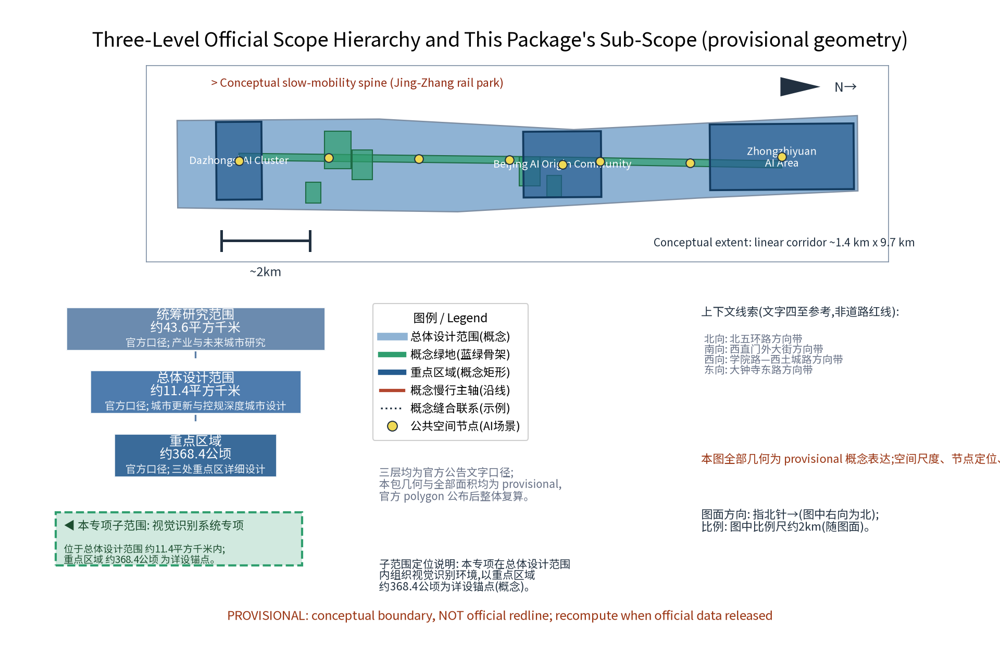
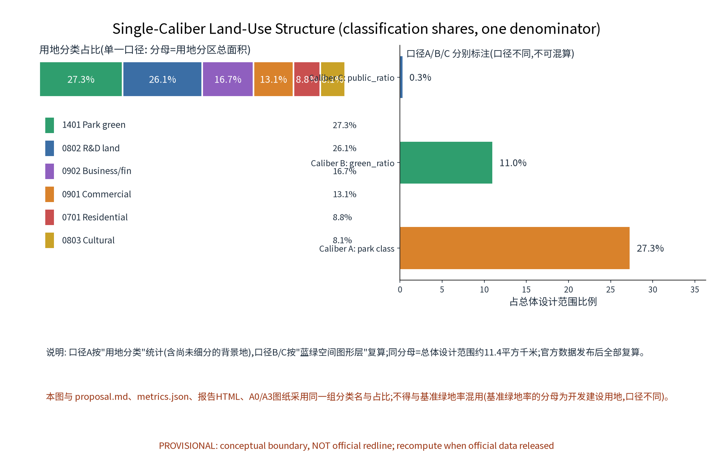
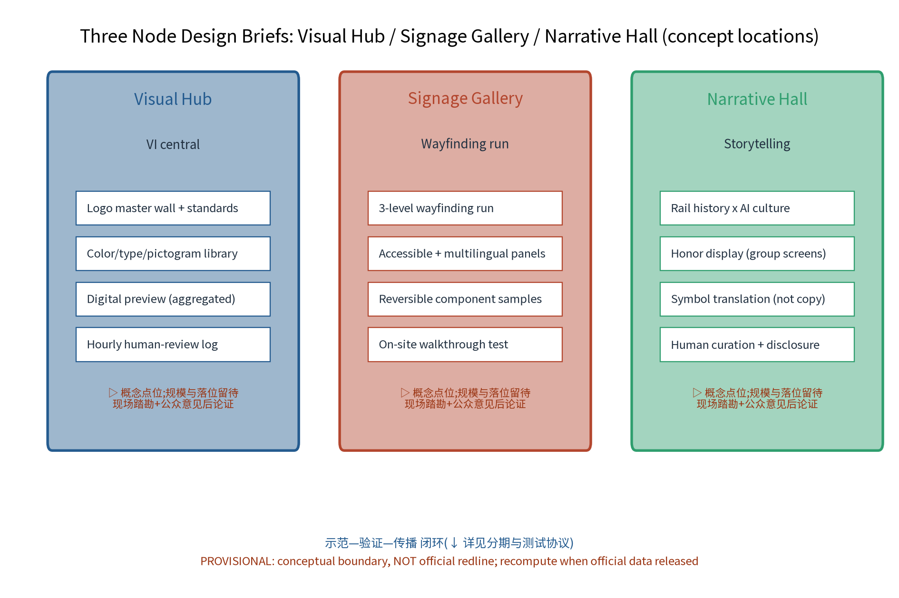
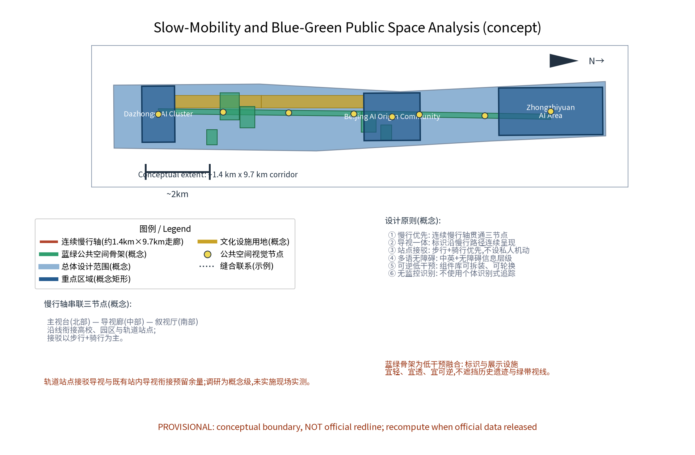
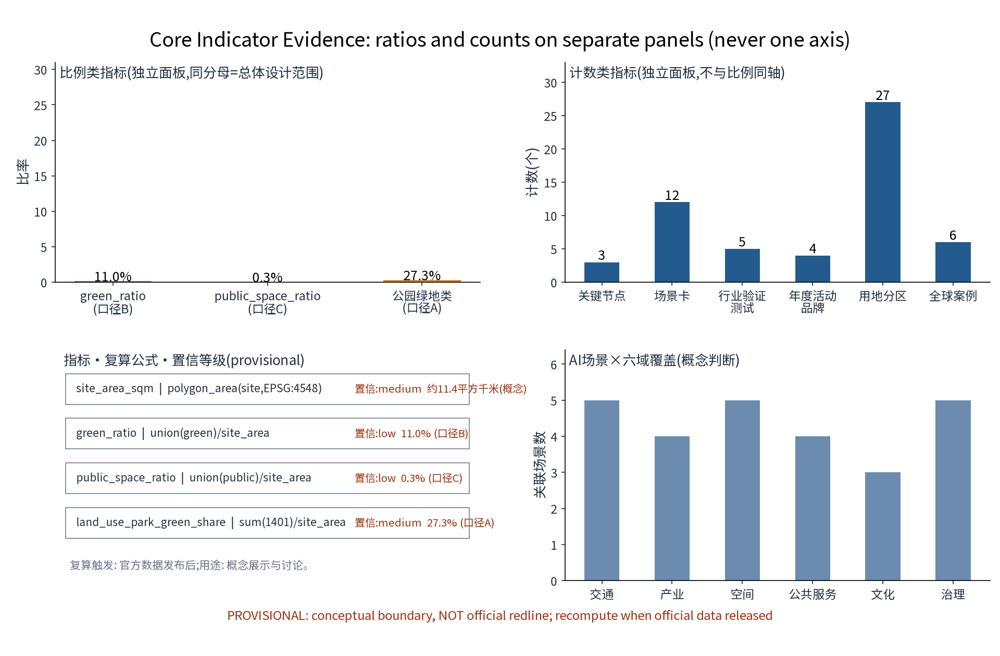
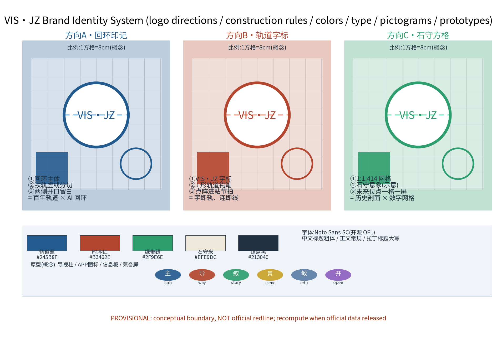
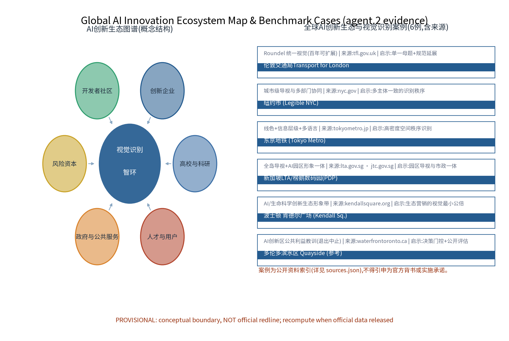

> Position: this chapter is a concept draft for the visual-identity specialism. It gives no FAR, building height, retain/renovate/demolish or engineering conclusions and fabricates no official data. The name Visual Identity Ring (VIS·JZ) follows the formal review and official text.

## Design Basis and Source List
The listed public historical materials, planning reports and general standards form the concept working basis; the data actually used by this package are recorded in sources.json, and unverified items are honestly demoted to research hypotheses. The list covers: the call for proposals and agent taskbook (overall concept, main name, English name and naming family, visual identity and logo-direction requirements; wayfinding, signage, symbol systems and the integrated expression of Jing-Zhang railway history, Zhongguancun innovation culture and new AI culture); the public caliber of 'retain-renovate-demolish combined, prioritizing heritage park fabric and railway relics' along the Jing-Zhang railway park; Zhongguancun innovation culture materials; GB/T 10001 public information graphical symbols and GB/T 20501 guidance-system standards; and international/domestic visual identity and AI-ecosystem cases. Item-level provenance (publisher, URL, published and accessed dates, reuse boundary) is kept in sources.json; anything unverifiable is stated as a research hypothesis, not formal evidence.

> Evidence: [source:DATA-SRC-OFFICIAL-ANNOUNCEMENT], [source:DATA-SRC-AGENT-TASKBOOK].

## Three-Level Scope Framework
The three levels transmit results stepwise: the coordinated research outputs (identity-governance environment and corridor coordination judgment) constrain the overall design; the overall design's calibrated node layout, wayfinding skeleton and phasing growth land in the key-area detailed design; each level keeps machine-readable evidence anchors for review. Framework: coordinated research (industry and future-city research), overall design (urban renewal and regulatory-plan-level urban design for the identity concept and wayfinding skeleton), and key areas (detailed design of the original nodes). All scope boundaries are provisional and may be adjusted as materials and official calibers evolve; they are not commitment boundaries. This specialism's sub-scope sits inside the overall design area (about 11.4 km2), anchored by the key areas of about 368.4 ha (concept).

> Evidence: [source:DATA-SRC-AGENT-TASKBOOK], [source:DATA-SRC-PROVISIONAL-BOUNDARIES].

## Coordinated Research Area: Industry and Future City Research
The industry and city research identifies the 'fit' effect of the identity system: a unified visual and wayfinding network organizes the image needs of universities, innovation clusters, rail stations and neighborhoods into recognizable, navigable and narratable visual units ('visual node - innovation cluster - neighborhood' three-level linkage); future-city research is directional only and implies no land or investment commitment. Mapping to the taskbook's three positioning statements and five functions (concept-level): the Identity Ring's unified motif supports the cultural expression of the 'centennial Jing-Zhang cultural belt'; perceptible wayfinding and scenario indexing support the experience organization of the 'urban AI life experience belt'; corridor-wide image coordination supports the industry and brand communication of the 'AI integration innovation belt'. Functionally, the visual and standards system provides image infrastructure for the 'full-stack self-innovation system' and 'world-class AI innovation ecosystem'; scenario-based wayfinding and the public feedback loop provide perceptible carriers for the 'AI+ scenario empowerment paradigm' and 'intelligent AI vitality city'; public-caliber checking and the resident feedback channel participate in the governance expression of 'global discourse power in AI governance'. Regional coordination is developed as a 'three zones, two wings' loop (concept): Beiwei Community (Haidian universities and innovation communities), Future Science City, Huairou Science City, E-Town (Yizhuang) and the Jing-Jin-Ji direction form five supports for corridor-wide image and communication synergy; the unified motif takes calibrated variants per zone. Haidian, as the core section of the belt, contributes the innovation semantics of its universities, science parks and Zhongguancun culture; this specialism only makes a coordination judgment with Haidian's existing image and makes no weighting or implementation commitment. All mappings are conceptual advice, not confirmed government decisions or arrangements.

> Evidence: [source:DATA-SRC-AGENT-TASKBOOK], [source:DATA-SRC-PROVISIONAL-BOUNDARIES].

## Overall Design Area: Urban Renewal and Regulatory-Plan-Level Urban Design
The overall design emphasizes a 'green-belt-framed identity environment': visual nodes, the wayfinding skeleton and the slow-mobility system are organized along the Jing-Zhang railway heritage park belt; visual facilities grow reversibly and streets can time-share identity and festival needs; renewal is preferred over new construction, with identity functions planted into existing stock; regulatory-plan indicators receive calibration suggestions only, with no preset numeric conclusions. A three-level identity hierarchy of 'region - node - facility' is built on the green belt: the regional level sets the corridor motif and color semantics; the node level covers stations, park entrances and key public spaces; the facility level covers wayfinding, seating, lighting and street furniture. The wayfinding skeleton is integrated with the slow-mobility system so sign information is continuously presented along slow paths. Land use follows a single caliber: 'land-use classification share' with the total land-use polygon area (equal to the overall design area, about 11.4 km2) as denominator; shares are park green 27.3%, research 26.1%, business/financial 16.7%, commercial 13.1%, residential 8.8%, cultural 8.1%. The park-green share (Caliber A) differs from the blue-green layer recalculation (Caliber B: green_ratio 11.0%; Caliber C: public_space_ratio 0.3%); the calibers are labeled separately and never mixed, and all are recalculated when official data are released.

> Evidence: [source:DATA-SRC-MOHURD-CONTROL-DETAILED-PLANNING], [metric:land_use_park_green_share].

## Detailed Design of Key Areas
Node locations are concept-level points that must be relocated after site surveys, material verification, authority assessment and public comments; green-belt routes and slow paths between nodes form the complete visual circulation, expressed in the drawings and geometry layers. Three original nodes (concept): the Visual Hub (identity central: logo master wall, color/type/pictogram library and aggregated digital preview screens); the Signage Gallery (wayfinding demonstration run validating continuity and legibility of the three-level hierarchy, with accessible and multilingual panels, reversible component samples and on-site walkthrough test lines); the Narrative Hall (storytelling station featuring Jing-Zhang railway history and new AI culture, with an honor display system (group honor screens; honors carry sources and human review), symbol translation (not replication) and curation scripts subject to human review and public disclosure). The three nodes form a demonstration - verification - storytelling loop; node briefs, scale and siting remain for later argumentation.

> Evidence: [data:PACKAGE-GEOMETRY] (three node polygons from geometry/key_areas.geojson).

## AI Innovation Ecosystem, Personas, and AI+ Scenarios
Visual-compliance AI, wayfinding-content AI and sign-maintenance AI are the backbone scenarios, each with human-review backstop; narrative-curation AI and public-feedback AI are supporting scenarios. Data handling: anonymized aggregates only; human review of key decisions; no excessive monitoring (no individual-identification tracking, including visual recognition); identity management remains a conceptual mechanism, not a substitute for statutory duties. Five personas: entrepreneurs, AI developers, residents, students and visitors, with distinct information needs and movement patterns; elders, children and families, persons with disabilities and other vulnerable groups are served by all-age, accessible and aging-friendly information layers in multiple languages. The AI innovation ecosystem map (concept) places the Identity Ring at the center, linking six circles - universities/research, innovators, developer community, venture capital, government and public services, talent and users - and maps each of the six domains (transport, industry, space, public services, culture, governance). AI technical protocols (concept, four): model evaluation (benchmark sets with human-review comparison), data quality (de-identification and quality validation of anonymized aggregates), error stratification (per scenario and time-period stratification with disclosure) and runtime monitoring (false-positive rate and human-intervention rate, weekly review). Data lifecycle (concept): anonymized aggregates are retained for a fixed period only, periodically purged, used solely for the stated purpose and never for individual identification. 12 scenario cards (concept) follow:

| Scenario card | Spatial carrier | AI capability | Data and privacy boundary | Operator |
|---|---|---|---|---|
| Card 01 Compliance check | Visual Hub, park entrances | Batch conformity comparison | Anonymized samples; human review of key results | Professional team, operator |
| Card 02 Logo demo | Visual Hub | Interactive logo/standards demo | Public standards only; no individual data | Operator |
| Card 03 Wayfinding content | Signage Gallery, station paths | Multilingual accessible content | Anonymized demand; human review before release | Operator, professional team |
| Card 04 Accessible rendering | Signage Gallery | Large-type/voice/tactile content | Anonymized aggregates; human review | Professional team, volunteers |
| Card 05 Walkthrough test | Signage Gallery | Automated continuity walkthrough | Anonymized trajectory aggregates | Operator, volunteers |
| Card 06 Narrative curation | Narrative Hall | Rail history x AI culture curation | Public materials only; human review | Professional team, university researchers |
| Card 07 Honor display | Narrative Hall | Group honor screen layout | Group honors only; no individual identification | Community, operator |
| Card 08 Station handoff | Rail stations | Inside-outside wayfinding linkage | Anonymized maintenance records; human review | Operator |
| Card 09 Park entrance image | Park entrances | Image content rotation advice | Anonymized preferences; human review | Enterprises, operator |
| Card 10 Public visual feedback | Communities, public space | Feedback aggregation and triage | Anonymized; no excessive monitoring; no individual tracking | Community, merchants, operator |
| Card 11 Event rotation | Green-belt event grounds | Temporary identity compliance check | Anonymized; human review | Merchants, volunteers |
| Card 12 Study tours | Schools, study routes | Age-adapted explanation content | Public knowledge base; human review | Universities, volunteers |

Five industry test protocols (concept) make scenarios perceptible and transferable, each with object, indicator, pass criterion and RACI (concept):

| Test protocol | Object | Indicator (concept) | Pass criterion (concept) | Lead/support (RACI concept) |
|---|---|---|---|---|
| Test 1 Accessible multilingual walkthrough | Signage Gallery section | Multilingual completeness; accessibility layers | Elder/child/disabled representatives complete the route | Operator leads; volunteers support |
| Test 2 Day/night legibility | Gallery and station paths | Contrast pass rate day/night | Key nodes pass both directions | Professional team leads; merchants support |
| Test 3 Old-new signage handoff | Station transfer paths | Information consistency rate | No gap at existing station signage | Operator leads; rail authority supports |
| Test 4 AI human-review workflow | Wayfinding-content AI | Review coverage; false-positive rate | Human review covers key decisions; rate disclosed | Professional team leads; universities support |
| Test 5 Public feedback loop | Communities, public space | Handling rate; loop cycle | 48-hour receipt (concept) | Community leads; operator supports |

Six global AI-ecosystem benchmark cases are public-source references registered item-by-item in sources.json; lessons are conceptual only:

| Case | Country/city | Nature | Lesson | Source (organization - URL - date) |
|---|---|---|---|---|
| Transport for London | UK/London | City identity | Single motif + extendable standards for a century | tfl.gov.uk - 2026-08 |
| Legible NYC | USA/New York | City wayfinding | Multi-agency unified identity order | nyc.gov - 2026-08 |
| Tokyo Metro | Japan/Tokyo | Rail wayfinding | Line colors + hierarchy + multilingual | tokyometro.jp - 2026-08 |
| Punggol Digital District | Singapore | AI district image | District wayfinding integrated with municipal works | lta.gov.sg - jtc.gov.sg - 2026-08 |
| Kendall Square | USA/Boston | AI ecosystem image | Minimum common visual denominator for ecosystem marketing | kendallsquare.org - 2026-08 |
| Quayside, Toronto | Canada/Toronto | AI district governance | Decision gates, public evaluation, stop/exit lesson | waterfrontoronto.ca - 2026-08 |

> Evidence: [source:DATA-SRC-GENERATIVE-AI-INTERIM-MEASURES], [metric:industry_test_scenario_count], [metric:global_case_count].

## Land Use, Building Scale, and Retain-Renovate-Demolish Strategy
Retain-renovate-demolish is combined with retention first: heritage park fabric and railway relics are preserved; existing buildings undergo functional replacement with reserved identity retrofit directions (sign interfaces, display windows); demolition is limited to case-by-case, locally justified clearance for slow-mobility connectivity. Identity facilities are light-touch, reversible and low-footprint, adding no large buildings; reversible connections are preferred when combined with existing relics. Signage follows the 'add in retention, embed in renovation, replenish after demolition' pattern. No numeric retain/renovate/demolish conclusions are preset; all areas are concept calibers to be recalculated when official data arrive. The 'reversible public-space component library' is the specialism's facility strategy: modular seating, poles and information boards that can be assembled, dismantled, rotated and tiered, supporting temporary event settings and quiet everyday states.

> Evidence: [source:DATA-SRC-MNR-LAND-USE-CLASSIFICATION], [depth:retain_renovate_demolish].

## Transport, Rail, Municipal Infrastructure, and Public Services
Slow mobility first: a continuous slow axis links the three nodes; wayfinding is integrated with the slow system with sign nodes corresponding to route ends; rail station handoff signage stays continuous with reserved slack against existing in-station signage; signage lighting and municipal facilities are integrated to reduce standalone poles; accessible and multilingual information layers (large type, voice, tactile) serve elders, children, persons with disabilities and non-smartphone users. Municipal services follow intensive sharing; public services provide multilingual wayfinding, visual exhibition and study spaces; every AI decision has human review. This section states concept principles only, with no engineered values or technical parameters.

> Evidence: [source:DATA-SRC-MOHURD-URBAN-DESIGN-MEASURES], [source:DATA-SRC-BARRIER-FREE-ENVIRONMENT-LAW].

## Blue-Green Network, Public Space, and Urban Character
A 'green belt as axis, node parks as pearls' blue-green system connects pocket green spaces and open spaces along the heritage park belt; identity and display facilities merge into parks lightly, transparently and reversibly, without blocking heritage views or the green-belt sightline; guidance and interpretation systems are restrained and unified; character continues the Jing-Zhang industrial-memory vocabulary in dialogue with a new, ordered atmosphere, avoiding symbol stacking and slogan packaging. Caliber note: the 27.3% park-green share is Caliber A (land-use classification, denominator = total land-use area); 11.0% green_ratio is Caliber B (union of green polygons over the overall design area); 0.3% public_space_ratio is Caliber C (node areas). The calibers share one denominator but different statistical objects; they are labeled separately, never mixed, and all are recalculated after official data - this explains the difference between the park-green share and the green ratio noted in review.

> Evidence: [metric:green_ratio], [metric:public_space_ratio].

## Renewal Projects, Implementation Policy, and Phasing
Four project families (identity standards, wayfinding network expansion, narrative completion, annual update) are concept lists with no specific amounts; policy suggestions (standards filing procedures, implementation guidelines, public participation channels, identity usage compact) require statutory argumentation and imply no government or operator commitment. Phasing: near term (1-3 years) basic standards and the Signage Gallery pilot; mid term (3-5 years) Gallery and Narrative Hall delivery plus corridor-wide wayfinding expansion; long term (5-10 years) full identity system entering annual updates. The pilot is the Signage Gallery section, subject to authority argumentation and public comments. A concept-gate mechanism gates every phase: initiation requires project argumentation, public comments and compliance review; phases do not start without approval. Stop/exit conditions: pilot indicators not met or public acceptance fluctuating can suspend a node and withdraw reversible facilities to restore the site. Annual programmes roll in a day-week-quarter-festival-month rhythm:

| Annual programme | Frequency | Carrier | Operator (concept) |
|---|---|---|---|
| Identity Open Day | Annual/day | Visual Hub | Operator + volunteers |
| Identity Experience Week | Annual/week | Signage Gallery section | Operator + merchants |
| Quarterly Wayfinding Update Report | Quarterly | Online + on-site notice points | Operator + professional team |
| Narrative Hall Festival | Annual/festival | Hall and green-belt grounds | Community + universities + merchants |

Governance in three sentences. First, who decides - the competent department consults the operator and corridor parties (including a future alliance and expert team) through a deliberation mechanism for standard revisions, sign settings and annual programmes; this proposal expresses no authority conclusion. Second, how to disclose - annual recalculation results, filing records and updates go through public notice and filing procedures; scope and frequency await formal rules. Third, how to supervise - a resident feedback channel, volunteer patrols and periodic evaluation form the external supervision loop, improved iteratively with points and tiered feedback. Implementation uses RACI (concept): lead - the local department; collaboration and daily operations - the operator; technical support - universities and enterprises; review - the expert team; co-building - residents, communities, merchants and volunteers. A developer community mechanism (open components and wayfinding data interfaces, annual developer events with points incentives) and talent/enterprise conversion mechanisms (youth incubation, scenario interface docking, annual showcase and filing) are explored - all conceptual. Maintenance service levels (concept): quarterly facility inspection, annual content update and fault-response timing suggestions, calibrated during the pilot and included in the annual public notice.

> Evidence: [source:DATA-SRC-AGENT-TASKBOOK], [metric:annual_program_count].

## Metrics, Area Recalculation, and Compliance Matrix
Five conceptual indicators (identity coverage, wayfinding completeness, sign compliance rate, narrative update rate, feedback handling rate) enter metrics.json. The three formal core indicators (site_area_sqm, green_ratio, public_space_ratio) are recomputed from package geometry with the official text calibers as base; no independent values are taken. Every indicator carries source, formula, confidence, use limitation and recompute trigger:

| Indicator | Formula | Confidence | Use limitation | Recompute trigger |
|---|---|---|---|---|
| site_area_sqm | polygon_area(site, EPSG:4548) | medium | concept display and discussion | after official data |
| green_ratio | union(green)/site_area | low | concept display and discussion | after official data |
| public_space_ratio | union(public)/site_area | low | concept display and discussion | after official data |
| land_use_park_green_share | sum(1401)/site_area | medium | concept display and discussion | after official data |

The compliance matrix is checked item by item against mandatory norms; it does not replace statutory review. All metrics are participant provisional model data, not authoritative data; statements consistent with the announcement are self-calculated from the announcement, not officially issued.

> Evidence: [metric:site_area_sqm], [metric:green_ratio], [metric:public_space_ratio].

## Risk, Copyright, and Compliance
This proposal is conceptual research design and is not an administrative-approval basis or a FAR/height/retain/engineering-feasibility conclusion. Five risk dimensions are registered honestly in assumptions.json and the missing-data notes: trademark and prior-rights search, identity vs heritage character coordination, wayfinding information accuracy, AI/copyright of generated content and fonts/images, and public-acceptance fluctuation (responses: source labeling, human review, feedback channels, statutory procedures). Trademark/prior-rights position: no official trademark search has been completed at concept stage; the names 'Visual Identity Ring', 'VIS·JZ' and all node names are internal working codenames, restricted from external use and registration until clearance; this proposal makes no bare 'no trademark involved' self-declaration. AI governance in three sentences: anonymized aggregates only; human review of key decisions; no excessive monitoring (no individual-identification tracking, including visual recognition). Copyright and licensing: cited public materials carry sources and access dates; graphics, names and texts are participant originals or public-domain materials; any resemblance to existing marks is coincidental; the package is licensed COMMUNITY-DISPLAY-ONLY for community display and review discussion; no distortion of facts; no unauthorized use of portraits, trademarks, fonts, images or papers; multi-department joint review and public evaluation precede any formal implementation.

> Evidence: [source:DATA-SRC-OFFICIAL-ANNOUNCEMENT].

## References
References follow official published versions, archived by public/internal class with access dates: the call for proposals and taskbook (publisher: Beijing Municipal Commission of Planning and Natural Resources, Haidian Branch; published 2026-05-09, accessed 2026-06-03); public materials on Jing-Zhang railway history and the heritage park (including Zhan Tianyou and railway history sources); Beijing master plan and district plan public calibers; Beijing urban renewal special plan, implementation opinions and supporting documents; public information symbol and wayfinding standards (GB/T 10001 series, GB/T 20501 series); international and domestic visual identity and AI-ecosystem cases (Transport for London, Legible NYC, Tokyo Metro, Punggol Digital District, Kendall Square, Toronto Quayside, and domestic benchmarks Beijing, Shanghai, Shenzhen, Hangzhou); site survey records and self-drawn analysis sketches (self-collected). Item-level bibliographic entries (publisher, URL, published and accessed dates, reuse boundary) are registered in sources.json; unverified items are honestly marked as research hypotheses in the assumptions and missing-data notes.

> Evidence: [source:DATA-SRC-OFFICIAL-ANNOUNCEMENT] (first entry is the organizer's public package).

## Brand and Visual Identity System (VIS·JZ original)
Brand identity is the core of agent.4: the original naming family 'Visual Identity Ring' forms the design - testing - storytelling loop of Visual Hub, Signage Gallery and Narrative Hall, with a complete visual identity system concept. Three logo directions (concept): Direction A 'Loop Mark' - loop body, rail dash cut, open ends, meaning a century of rail x AI loop; Direction B 'Rail Wordmark' - the VIS·JZ wordmark with a J-shaped rail hook stroke and platform-arrival dot rhythm; Direction C 'Heritage Grid' - a 1:1.414 grid echoing the heritage stone motif (schematic), one grid one screen for future slots. Construction and usage rules: 1 grid = 8 cm concept; minimum size 12 mm; clear space 1.5 x mark height; five colors (Rail Blue, Chrono Red, Belt Green, Heritage Cream, Anchor Black) tiered by use; Noto Sans SC (OFL); six pictogram families (hub/way/story/scene/edu/open). Prototypes (concept): signpost, app icon, information panel and honor screen, physical and digital; multilingual examples are zh/en with extension space. The Jing-Zhang/AI narrative grammar is the original mechanism 'rail sequence': the rail line is the narrative spine, node events are punctuation, annual programmes are chapters, forming a reusable expression standard. International communication (concept): 'a century of Jing-Zhang x a new generation of AI' as the international narrative motif with unified visual output, bilingual material kits and annual overseas exhibition suggestions. See logo-vis-jz, A0-01 masterboard and the visual page.

> Evidence: [source:DATA-SRC-AGENT-TASKBOOK] (visual identity and logo-direction requirements).

## Appendix: AI Innovation Ecosystem Map
The ecosystem map figure places the Identity Ring at the center, presenting the six circles (universities/research, innovators, developer community, venture capital, government and public services, talent and users) together with six global cases as the agent.2 evidence figure for 5-8 global AI-ecosystem cases; cases are registered item-by-item in sources.json and imply no official endorsement or implementation commitment.

> Evidence: [source:DATA-SRC-AGENT-TASKBOOK].
