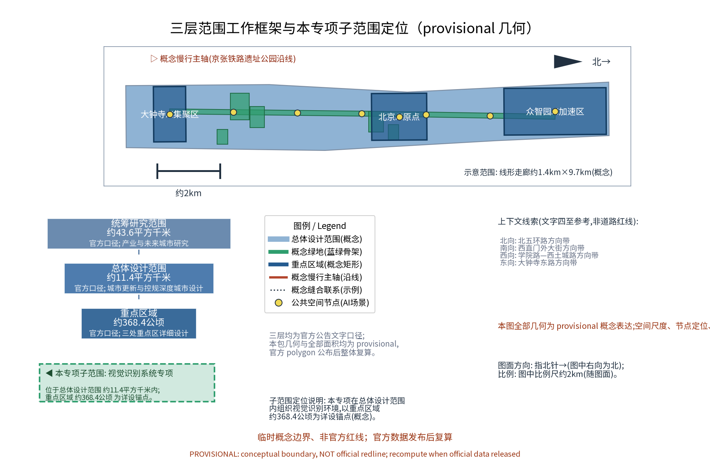
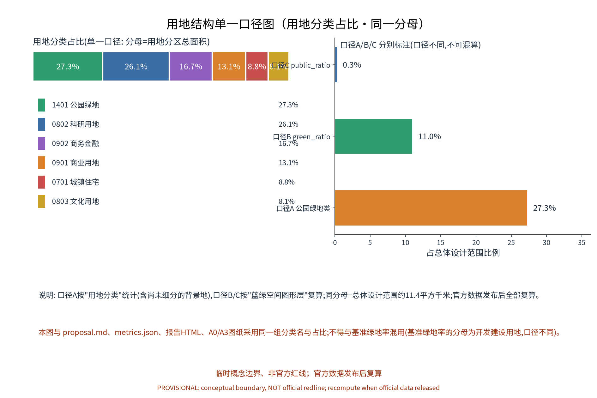
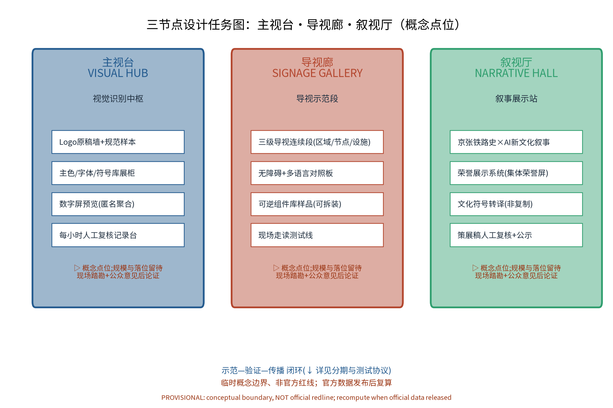
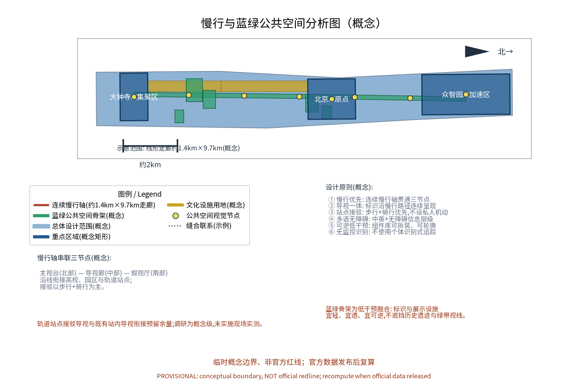
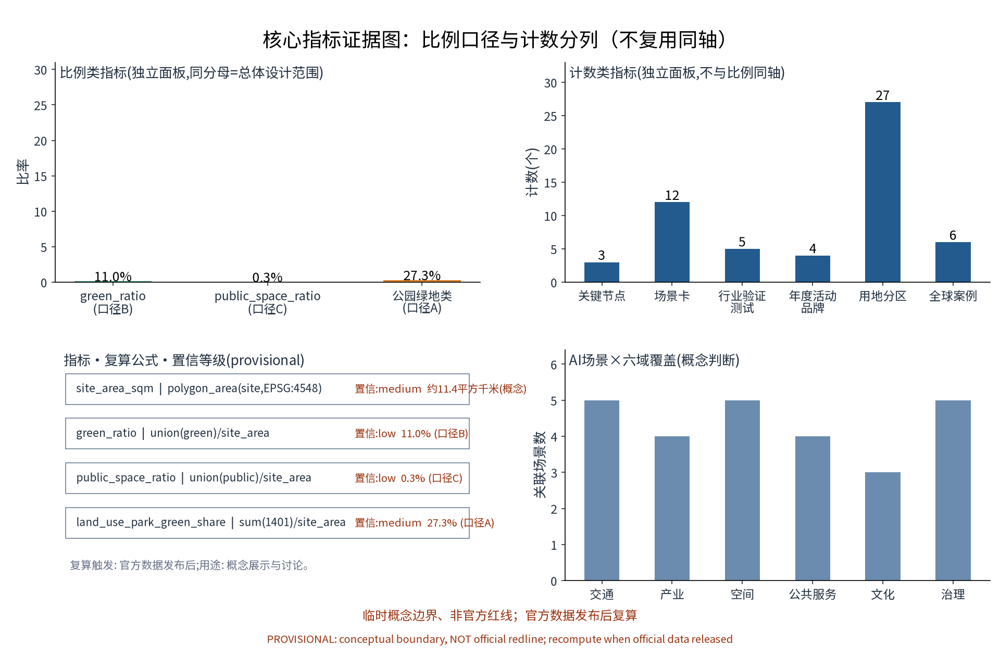
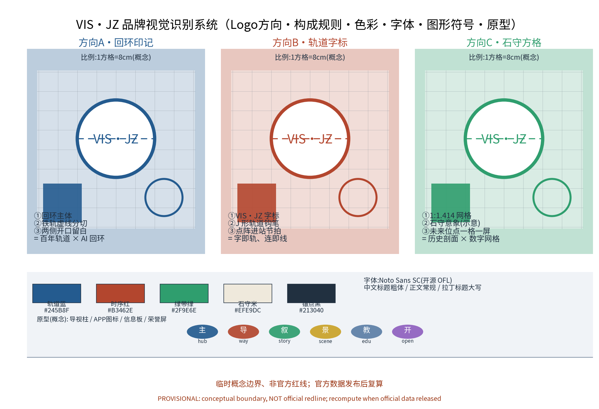
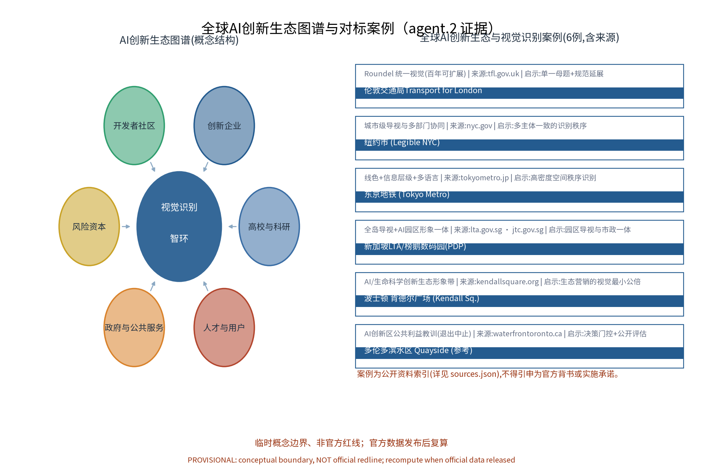

> 编制定位：本方案为视觉识别系统专项概念方案章节草案，属概念建议层面；不给出容积率、建筑高度、拆改留或工程实施结论，不编造官方数据。主名称「视觉识别智环」，英文名称 VIS·JZ，命名体系与全称以正式评选与官方文本口径为准。全文数据均为参与者临时模型数据，非权威数据。

## 设计依据与资料清单
资料清单所列公开史料、规划报道与通则规范等均为概念工作依据清单，并非本包已获取的数据；本包实际使用的全部数据见 sources.json，未获取项已在假设与缺失数据说明中如实标注。清单覆盖：征集公告与任务书（总体概念含主名称、英文名称与命名体系、视觉识别与Logo方向要求；导视、标识、符号系统与京张铁路历史文化、中关村创新文化与AI新文化叙事融合表达要求）；京张铁路遗址公园沿线「留改拆并举、优先保留遗址公园肌理与铁路历史遗存」公开口径；中关村创新文化公开材料；GB/T 10001类公共信息图形符号、GB/T 20501类导向系统相关公开规范；国内外城市视觉识别与AI创新生态公开案例。逐条书目的机构、链接、发布与获取日期登记于 sources.json，未查证项一律降级为「待研究假设」而非正式证据。

> **证据锚点**：[source:DATA-SRC-OFFICIAL-ANNOUNCEMENT]、[source:DATA-SRC-AGENT-TASKBOOK]。

## 三层范围工作框架
三层成果逐级传导：统筹研究输出的视觉识别治理环境与沿线协同判断约束总体设计，总体设计校核的视觉节点布局、导视骨架与时序生长落实到节点详设；每层均保留与任务书对应章节的机器可读证据锚点，便于评审对照。采用「统筹研究—总体设计—重点区域」三层递进框架：统筹研究层开展产业与未来城市研究，判断沿线主体的形象协同与传播协同关系；总体设计层以城市更新与控规深度开展视觉识别总概念与导视骨架设计；重点区域层聚焦原创节点的详细设计。各层范围边界均标注为 provisional（暂定），随资料深化与官方口径更新而调整，不构成承诺性边界。本专项子范围位于总体设计范围内，以重点区域约368.4公顷为详设锚点（概念）。

> **证据锚点**：[source:DATA-SRC-AGENT-TASKBOOK]、[source:DATA-SRC-PROVISIONAL-BOUNDARIES]。

## 统筹研究范围产业与未来城市研究
产业与城市研究识别视觉识别系统的「适配」效应：以主视觉与导视网络把沿线高校、科创片区、轨道站点与住区的形象需求有序组织为可识别、可导视、可叙事的视觉单元，形成「视觉节点—科创片区—住区」三级联动结构；未来城市研究仅作方向性预判，不构成对用地与投资的承诺。本专项与任务书三大定位、五大功能的概念映射（概念级判断）：视觉识别智环以统一识别母题支撑「百年京张文化带」的历史文化表达，以可感知的导视与场景索引支撑「都市AI生活体验带」的体验组织，以沿线主体形象协同支撑「AI融合创新带」的产业与品牌传播；功能上，主视觉与规范体系为「AI全栈自主创新体系」「世界级AI创新生态」提供形象基础设施，场景化导视与公众反馈闭环为「AI+场景赋能新范式」「智能化AI活力城市」提供可感知载体，公开口径校核与公众意见通道参与「AI治理全球话语权」的治理表达。区域协同以「三区两翼」协作圈概念展开：北纬社区（海淀高校与创新社区）、未来科学城、怀柔科学城、经开区（亦庄）及京津冀方向构成沿线形象与传播协同的五个支点，统一识别母题在不同片区作适度变体，保持可识别与可延展；海淀区作为京张创新带的核心承载区段，其高校、科创园区与中关村创新文化构成沿线视觉语义的重要来源，本专项仅作与海淀区既有城市形象的协同判断，不构成对定位与功能的权重判断或实施承诺。上述映射全部为概念建议，不构成任何已确定的政府决策或实施安排。

> **证据锚点**：[source:DATA-SRC-AGENT-TASKBOOK]、[source:DATA-SRC-PROVISIONAL-BOUNDARIES]。

## 总体设计范围城市更新与控规深度城市设计
总体设计强调「以绿带为骨架的视觉识别环境」：依托京张铁路遗址公园绿带组织视觉节点、导视骨架与慢行系统，视觉设施可逆生长、街道可分时承载识别与节事需求；强调更新而非新建，优先利用存量空间植入视觉功能；对控规指标只做校核建议，不预设数值结论。以京张铁路遗址公园绿带为骨架，构建「区域—节点—设施」三级视觉识别层级：区域级确立全线识别母题与色彩语义；节点级对应站点、园区入口与重点公共空间；设施级覆盖导视、坐凳、照明等城市家具。导视骨架与慢行系统一体化布置，标识信息沿慢行路径连续呈现。用地结构采用单一口径：以「用地分类占比」为唯一口径，分母为用地分区总面积（与总体设计范围约11.4平方千米相当），六类占比为公园绿地27.3%、科研用地26.1%、商务金融16.7%、商业13.1%、城镇住宅8.8%、文化8.1%；其中「公园绿地类」为用地分类口径（口径A），与蓝绿图层复算口径（口径B，绿地率11.0%；口径C，公共空间率0.3%）不同，两类口径分别标注、不可混算，官方数据发布后全部复算。

> **证据锚点**：[source:DATA-SRC-MOHURD-CONTROL-DETAILED-PLANNING]、[metric:land_use_park_green_share]。

## 重点区域详细设计
三节点的设施选址均为概念点位，须经现场踏勘、资料核验与主管部门评估及公众意见后重新落位；节点间的绿带动线与慢行通道构成完整视觉动线，详细平面与剖面以图册与 geometry 层表达。设三个原创节点，选址均为概念点位：其一「主视台」：视觉识别中枢，承担全线视觉母题的原型呈现与规范示范，含Logo原稿墙、主色/字体/符号库展柜与匿名聚合的数字预览屏；其二「导视廊」：导视标识示范段，验证三级层级在真实慢行路径中的连续性与可读性，设无障碍与多语言对照板、可逆组件库样品与现场走读测试线；其三「叙视厅」：叙事展示站，以京张铁路历史与AI新文化叙事的展示为特色，设荣誉展示系统（集体荣誉屏，标注荣誉来源与人工复核）、文化符号转译（非复制）与策展稿人工复核及公示程序。三节点形成示范、验证与传播闭环；节点任务书、规模与落位留待后续论证。

> **证据锚点**：[data:PACKAGE-GEOMETRY]（三节点示意多边形来自本包 geometry/key_areas.geojson）。

## AI 创新生态、人才画像与 AI+ 场景
视觉规范校验AI、导视内容生成AI、标识信息维护AI为主干场景，每处均配置人工复核兜底；叙事内容策展AI、公众视觉反馈AI为支撑场景；仅处理匿名聚合数据、关键决策人工复核双保险，不设过度监控（不进行个体识别式追踪（含视觉识别））；视觉识别管理为概念性机制建议，不替代法定管理职责。五类人才画像：创业者、AI开发者、社区居民、学生、访客游客，信息需求与动线特征各异；配套长者、银龄人群、儿童及亲子家庭、残疾人等弱势群体使用者的全龄包容需求，提供多语言、无障碍与适老化信息层级。AI创新生态图谱（概念）以「视觉识别智环」为核心，连接高校与科研、创新企业、开发者社区、风险资本、政府与公共服务、人才与用户六个圈层，并与六域（交通、产业、空间、公共服务、文化、治理）逐一挂钩。AI技术协议（概念）四项：模型评测（基准测试集与人工复核对照）、数据质量（匿名聚合样本去标识与质量校验）、误差分群（按场景与时段分群统计误差并公示）、运行监测（误报率与人工介入率监测、按周复核）。数据生命周期（概念）：匿名聚合数据仅留存既定期限、定期清除，仅用于既定用途，不用于任何个体识别目的。下表为12张场景卡（概念级），场景能力、数据与隐私边界及运营主体均以人工复核与公开口径为限：

| 场景卡 | 空间载体 | AI能力 | 数据与隐私边界 | 运营主体 |
|---|---|---|---|---|
| 场景卡01 规范校验 | 主视台及园区产业入口 | 标识规范符合性批量比对 | 匿名聚合样本，关键结论人工复核 | 专业团队与运营机构 |
| 场景卡02 Logo示范 | 主视台 | Logo与品牌规范交互示范 | 仅展示公共规范，不采集个体 | 运营机构 |
| 场景卡03 导视内容生成 | 导视廊及轨道站点接驳路径 | 多语言、无障碍导视内容生成 | 匿名聚合需求数据，发布前人工复核 | 运营机构与专业团队 |
| 场景卡04 无障碍译制 | 导视廊 | 大字、语音、触觉信息生成 | 匿名聚合，人工复核 | 专业团队与志愿者 |
| 场景卡05 走读测试 | 导视廊 | 导视连续性自动走读分析 | 匿名轨迹聚合，不识别个体 | 运营机构与志愿者 |
| 场景卡06 叙事策展 | 叙视厅 | 京张铁路史与AI新文化策展 | 仅使用公开素材，稿件人工复核 | 专业团队与高校研究者 |
| 场景卡07 荣誉展示 | 叙视厅 | 集体荣誉屏内容编排 | 仅集体荣誉，无个体识别信息 | 社区与运营机构 |
| 场景卡08 站点接驳导视 | 沿线轨道站点 | 站内站外导视衔接提示 | 匿名聚合维护记录，人工复核 | 运营机构 |
| 场景卡09 产业入口形象 | 园区入口空间 | 形象展示内容轮换建议 | 匿名聚合访问偏好，人工复核 | 企业与运营机构 |
| 场景卡10 公众视觉反馈 | 社区与公共空间 | 导视体验反馈汇聚与分级处理 | 匿名聚合、禁止过度监控、不进行个体识别式追踪（含视觉识别） | 社区、商户与运营机构 |
| 场景卡11 节事轮换 | 绿带节事场地 | 临时识别物料规范校验 | 匿名聚合，人工复核 | 商户与志愿者 |
| 场景卡12 研学讲解 | 学校与研学线路 | 分龄讲解内容组织 | 仅公开知识库，人工复核 | 高校与志愿者 |

行业验证测试协议5项（概念级）：为落实场景可感知度与可转化性，设五项现场验证协议，每项含验证对象、指标（概念）、通过标准与RACI分工（概念），测试结果将作为试点决策与停止条件的输入：

| 测试协议 | 验证对象 | 指标（概念） | 通过标准（概念） | 牵头/协作（RACI概念） |
|---|---|---|---|---|
| 测试协议1 多语无障碍走读测试 | 导视廊示范段 | 多语信息完整率、无障碍层级可用性 | 长者、儿童、残疾人代表走读完成 | 运营机构牵头，志愿者协作 |
| 测试协议2 日间/夜间可读性测试 | 导视廊及站点接驳路径 | 日间/夜间对比度达标率 | 关键节点双向通过 | 专业团队牵头，商户协作 |
| 测试协议3 新旧导视衔接测试 | 轨道站点接驳路径 | 站内站外信息一致率 | 与既有站内导视衔接无断点 | 运营机构牵头，轨道方协作 |
| 测试协议4 AI内容人工复核流程测试 | 导视内容生成AI | 复核覆盖率、误报率 | 人工复核覆盖关键决策、误报率公示 | 专业团队牵头，高校协作 |
| 测试协议5 公众反馈闭环测试 | 社区与公共空间 | 反馈处理率、闭环周期 | 意见通道48小时回执（概念） | 社区牵头，运营机构协作 |

全球AI创新生态对标案例（6例）为公开资料索引，逐例登记机构、链接与日期于 sources.json，启示仅作概念参照，不得引申为官方背书：

| 案例 | 国家/城市 | 性质 | 启示 | 来源(机构·URL·日期) |
|---|---|---|---|---|
| 伦敦交通局 | 英国/伦敦 | 城市视觉识别 | 单一母题+规范延展，百年可扩展 | tfl.gov.uk·官方页·2026-08获取 |
| Legible NYC | 美国/纽约 | 城市导视 | 多部门协同的统一识别秩序 | nyc.gov·官方页·2026-08获取 |
| 东京地铁 | 日本/东京 | 轨道导视 | 线色+信息层级+多语言 | tokyometro.jp·官方页·2026-08获取 |
| 榜鹅数码园区 | 新加坡 | AI园区形象 | 园区导视与市政设施一体化 | lta.gov.sg·jtc.gov.sg·2026-08获取 |
| 肯德尔广场 | 美国/波士顿 | AI创新生态形象 | 生态营销的视觉最小公倍数 | kendallsquare.org·2026-08获取 |
| 多伦多滨水区Quayside | 加拿大/多伦多 | AI创新区治理 | 决策门控+公开评估+退出中止教训 | waterfrontoronto.ca·2026-08获取 |

> **证据锚点**：[source:DATA-SRC-GENERATIVE-AI-INTERIM-MEASURES]、[metric:industry_test_scenario_count]、[metric:global_case_count]。

## 用地、建筑规模与拆改留方案
拆改留坚持留改拆并举：以留为主保留遗址公园肌理与铁路历史遗存，存量建筑功能置换并预留视觉化改造方向（标识接口、展示窗口），拆除仅限经个案论证的局部疏通慢行零星建筑；视觉识别设施以轻介入、可逆、低占地为主，不新增大体量建筑；全部面积为概念口径，官方数据发布后复算。视觉识别设施坚持轻介入、可逆、低占地原则，以标识、装置、城市家具为主，不新增大体量建筑；与既有遗存构筑物结合时优先采用可逆连接方式。遵循留改拆并举概念：优先保留遗址公园肌理与铁路历史遗存，标识设施以「留中加、改中嵌、拆后补」方式布局。本方案不预设拆改留的具体数值与清单结论；「可逆公共空间组件库」为专项设施策略：座椅、灯杆、信息板等以模块化组件提供，可拆装、可轮换、可分级复用，支持节事临时布设与平日静默两种状态。

> **证据锚点**：[source:DATA-SRC-MNR-LAND-USE-CLASSIFICATION]、[depth:retain_renovate_demolish]。

## 交通、轨道、市政与公共服务设施
以交通慢行优先为核心组织交通概念机制：连续慢行轴贯通主视台、导视廊与叙视厅，导视与慢行系统一体化，衔接沿线高校、园区与轨道站点（接驳以步行与骑行为主），标识与导向设施沿慢行空间低干预布置；市政以集约共享为原则，标识照明等设施与建筑一体化概念、优先利用现状设施条件；公共服务配置多语导视、视觉展陈与研习空间，AI决策均设人工复核。慢行优先：以连续慢行轴贯通三节点，导视系统与慢行系统一体化，标识节点与路径端点对应；轨道站点接驳导视保持顺畅连续，与既有站内导视衔接预留余量；标识照明等设施与市政设施一体化设置，减少独立立杆；沿线设施兼顾无障碍与多语言信息，设置大字、语音与触觉信息层级，适配长者、儿童、残疾人及非智能手机使用者。本节为概念原则，不预设工程数值与技术参数。

> **证据锚点**：[source:DATA-SRC-MOHURD-URBAN-DESIGN-MEASURES]、[source:DATA-SRC-BARRIER-FREE-ENVIRONMENT-LAW]。

## 蓝绿空间、公共空间与城市风貌
构建「绿带为轴、节点公园为珠」的蓝绿公共空间体系：以遗址公园绿带为蓝绿骨架串联沿线小微绿地与开敞空间，标识与展示设施与公园融合布置、宜轻宜透宜可逆，不遮挡历史遗迹与绿带视线；指示与解说系统统一克制；风貌延续京张铁路工业记忆语汇并与创新有序的新氛围对话，整体风貌导控克制统一，避免符号堆砌与口号化包装。关于绿地与公园口径的说明：用地结构图中的「公园绿地类占比27.3%」为用地分类口径（口径A，分母为用地分区总面积）；「绿地率11.0%」为蓝绿空间图形层复算口径（口径B，绿地质心多边形并集面积除以总体设计范围）；「公共空间率0.3%」为公共空间节点区口径（口径C）。两套口径分母相同但统计对象不同，分别标注、不可混算，并将在官方数据发布后整体复算——评审所指「公园绿地占比与绿地率差异」由此解释。

> **证据锚点**：[metric:green_ratio]、[metric:public_space_ratio]。

## 更新项目清单、实施政策与分期计划
四类项目清单（视觉规范建立/导视网络扩展/叙事表达完善/年度更新上线）为概念清单，规模与投资估算均为建议性表述且不给出具体金额；政策建议（标识规范入库规程、实施导则、公众参与渠道、视觉识别使用公约）均须依法依规论证，不构成政府或运营方承诺。分期：近期（1-3年）视觉识别基础规范编制与「导视廊」样板段试验；中期（3-5年）导视廊、叙视厅落地与全线导视骨架展开；远期（5-10年）全域视觉识别体系建成并转入年度更新。试点区域建议以「导视廊」所在示范段为首期试点，试点范围与选择程序须经主管部门论证并听取公众意见后确定。实施采用决策门控（concept-gate）机制：每一期启动前须通过立项论证、公众意见与合规审查，未获批不进入实施；设置停止条件与退出机制（撤收）：试点验证不达指标或公众接受度波动时，可中止该节点并撤收可逆设施，恢复原状。年度活动体系按「日—周—季—节—月」分层滚动：

| 年度活动品牌 | 频次 | 载体 | 运营主体（概念） |
|---|---|---|---|
| 视觉识别开放日 | 年度/日 | 主视台 | 运营机构+志愿者 |
| 视觉体验周 | 年度/周 | 导视廊示范段 | 运营机构+商户 |
| 季度导视更新通报 | 季度 | 线上+线下公示点 | 运营机构+专业团队 |
| 叙视厅文化节 | 年度/节 | 叙视厅及绿带场地 | 社区+高校+商户 |

治理机制以连续三句展开。其一，谁决策——建议由主管部门会商运营机构与沿线主体（含后续探索成立的联盟与专家团队），以议事机制对视觉规范修订、标识设置与年度活动作出决定，本方案不表达任何权属或授权结论。其二，如何公开——建议将年度复算结果、规范入库与更新记录通过公示与备案程序向公众公开，具体范围与频次待正式规定明确。其三，如何监督——建议以公众意见通道、志愿者巡查与定期评估形成外部监督闭环，并参考积分与分级反馈结果滚动改进。实施组织建议采用RACI分工（概念）：牵头为属地部门，协作与日常运维为运营机构，技术支持为高校与企业，评审为专家团队，共建参与为社区、居民、商户与志愿者；同时探索开发者社区机制（开源组件与导视数据接口共建、年度开发者活动与积分激励）与人才、企业转化机制（青年创意孵化、场景数据接口对接、年度成果展示与备案），全部为概念建议。维护服务水平（概念）：标识设施季度巡检、信息内容年度更新与故障响应时限建议，随试点运行修正并纳入年度公示。

> **证据锚点**：[source:DATA-SRC-AGENT-TASKBOOK]、[metric:annual_program_count]。

## 指标体系、面积复算与合规矩阵
概念指标体系设五项：视觉识别覆盖率、导视完整率、标识规范符合率、叙事内容更新率、公众反馈处理率，均为概念口径。涉及面积、规模类的三项formal核心指标以本包几何复算为准，面积复算以官方文本口径为底数，不另行取值。指标均标注数据来源、公式、置信等级、用途限制与复算触发：

| 指标 | 公式 | 置信等级 | 用途限制 | 复算触发 |
|---|---|---|---|---|
| site_area_sqm | polygon_area(site, EPSG:4548) | medium | 概念展示与讨论 | 官方数据发布后 |
| green_ratio | union(green)/site_area | low | 概念展示与讨论 | 官方数据发布后 |
| public_space_ratio | union(public)/site_area | low | 概念展示与讨论 | 官方数据发布后 |
| land_use_park_green_share | sum(1401)/site_area | medium | 概念展示与讨论 | 官方数据发布后 |

合规矩阵对应强制性规范逐项核对，本专项不替代法定审查程序；所有指标均为参与者临时模型数据，非权威数据，与公告口径一致处按公告自算、非官方核发。

> **证据锚点**：[metric:site_area_sqm]、[metric:green_ratio]、[metric:public_space_ratio]。

## 风险、版权与合规说明
本方案为概念研究性设计，不构成行政审批依据，也不构成容积率、建筑高度、拆改留或工程可行性结论；风险已按商标与在先权利检索、标识与历史遗存风貌协调、导视信息准确性、AI生成内容与字体图片版权、公众接受度波动五维度如实登记于 assumptions.json 与缺失数据说明（应对原则：来源标注、人工复核、意见通道与法定程序）。品牌在先权利与使用边界：概念阶段尚未完成官方商标检索，「视觉识别智环」「VIS·JZ」及各节点名称均按内部工作代号处理，限制对外使用与注册，待在先权利检索与正式评选确定后方可评估对外使用，本方案不作出「不涉及商标」类自证声明。AI治理边界按三句表述：仅匿名聚合数据；关键决策人工复核；禁止过度监控（不进行个体识别式追踪（含视觉识别））。版权与许可：引用公开资料均已标注来源并注明获取时间；图形、名称与文字为参与方原创或公共领域素材，若与既有标识雷同属巧合；本包整体为 COMMUNITY-DISPLAY-ONLY 许可，仅用于社区展示与评审讨论；视觉表达不歪曲事实，未经授权不使用肖像商标字体图片论文图像等版权材料；正式实施前须完成多部门联审与公开评估。

> **证据锚点**：[source:DATA-SRC-OFFICIAL-ANNOUNCEMENT]。

## 参考资料
proposal 正文使用短标识引用（完整带日期后缀的条目 ID 见 sources.json）。参考资料以政府正式发布版本为准，按公开/内部分类存档并标注获取时间：征集公告与任务书（机构：北京市规划和自然资源委员会海淀分局；2026-05-09 发布，2026-06-03 获取）；京张铁路历史与遗址公园公开材料（含詹天佑与京张铁路公开史料口径）；北京城市总体规划及分区规划公开口径；北京城市更新专项规划与实施意见及配套文件；公共信息图形符号与标识导视相关公开规范（GB/T 10001类、GB/T 20501类）；国内外城市视觉识别与AI创新生态公开案例（伦敦交通局、纽约Legible NYC、东京地铁、新加坡榜鹅数码园区、波士顿肯德尔广场、多伦多滨水区Quayside，以及北京、上海、深圳、杭州国内对标）；现场踏勘记录与自绘分析草图（本项目自行采集）。上述逐条书目的机构、链接、发布与获取日期及复用边界登记于 sources.json；未查证项在假设与缺失数据说明中如实标注为待研究假设。详细书目与链接以 sources.json 为准，本清单为公开资料索引。

> **证据锚点**：[source:DATA-SRC-OFFICIAL-ANNOUNCEMENT]（本清单首条即组织方公开资料包）。

## 品牌与视觉识别系统（VIS·JZ 原创）
品牌识别是agent.4的核心交付：本专项以「视觉识别智环」为原创命名，形成「主视台—导视廊—叙视厅」设计—测试—叙事闭环，并建立完整视觉识别系统概念。Logo方向三个（概念）：方向A「回环印记」——回环主体+铁轨虚线分切+两侧开口留白，寓意百年轨道与AI回环；方向B「轨道字标」——VIS·JZ字标以J形轨道钩笔与点阵进站节拍构成，字即轨、连即线；方向C「石守方格」——以1:1.414网格呼应京张铁路石守意象（示意），未来位点一格一屏。构成与使用规则：1:1方格=8cm概念比例；最小尺寸12mm；安全距离为1.5倍标记高；色彩系统五色（轨道蓝、时序红、绿带绿、石守米、锚点黑）按使用场景分级；字体采用Noto Sans SC开源字体（OFL）；图形符号六类（主/导/叙/景/教/开）覆盖节点、导视、叙事、景观、教育、开放场景。原型（概念）含导视柱、手机端图标、信息板与荣誉屏四种物理与数字样例，多语言示例以中英双语为主并预留多语种扩展；京张/AI叙事语法以「铁轨语序」为原创机制：以轨道线形为叙事主线、节点事件为标点、年度活动为章节，形成可复用的表达规范。国际传播叙事（概念）：以「百年京张 × 新一代AI」为国际传播母题，统一视觉输出、双语素材包与年度海外展陈建议，全部为概念建议。品牌视觉系统详见 logo-vis-jz 图件、A0-01 总控板与 visual 页面。

> **证据锚点**：[source:DATA-SRC-AGENT-TASKBOOK]（视觉识别与Logo方向要求）。

## 附：AI创新生态图谱图件
「全球AI创新生态图谱」图件（ecosystem-map）以「视觉识别智环」为核心节点，将高校与科研、创新企业、开发者社区、风险资本、政府与公共服务、人才与用户六个圈层与6个全球案例并列呈现，作为agent.2「5-8个全球AI创新生态案例」的证据图件；案例逐条登记于 sources.json，不得引申为官方背书或实施承诺。

> **证据锚点**：[source:DATA-SRC-AGENT-TASKBOOK]。
