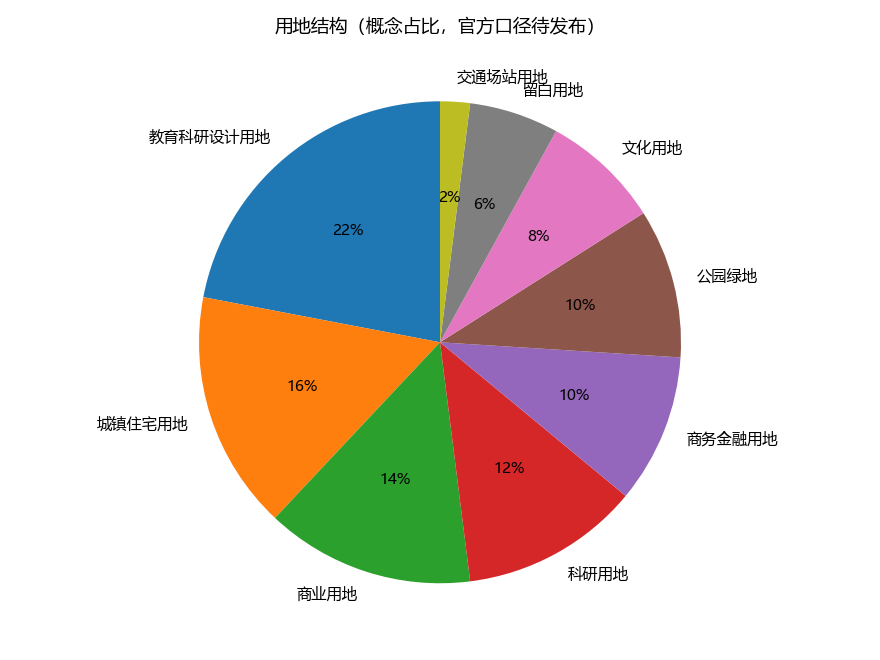
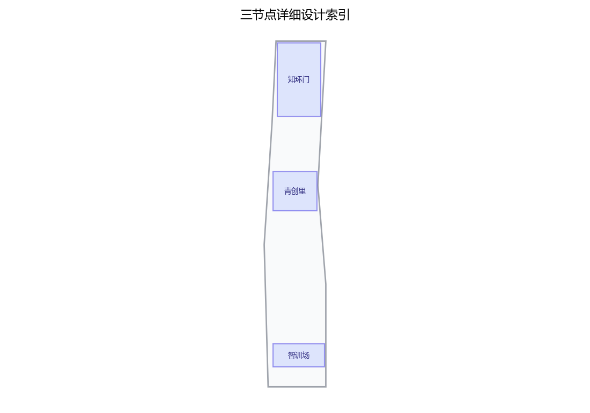
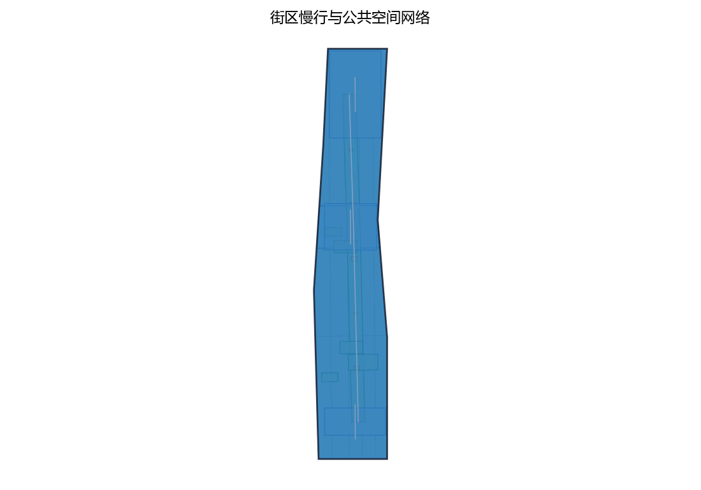
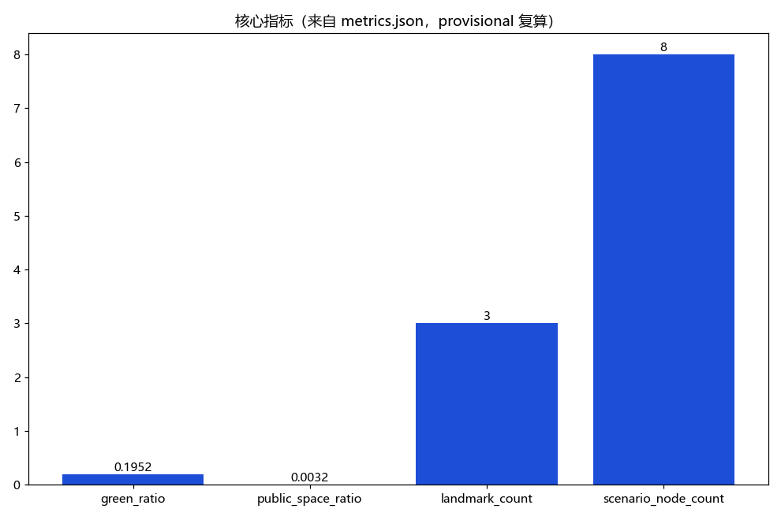

**方案名称与总体构想(概念)**:主名称「环知里」,英文名 KnowRing(Campus Knowledge Loop,理念为"知识成环、青年为核")。"环知里"取意于环抱高校院所的知识之环与老北京里坊街巷的生活尺度:以学院路及环高校地带为空间载体,将知识圈层、青年创造圈层与AI应用圈层叠合成一条可步行、可共创、可持续生长的环形知识生态。方案紧扣"百年京张文化带、都市AI生活体验带、AI融合创新带"三大定位与五大功能,将本期主题落实为"一环、三节点、多场景":一条环高校知识环廊,串联「知环门」「青创里」「智训场」三个原创概念点位,以AI+场景织入日常街巷,使校城互哺、代际共生,作为AI融合创新带上的示范段落。本方案为国际征集概念方案,所有落地建议均为概念建议、参考方案,可供专业团队深化研究,不构成法定规划结论。

## 设计依据与资料清单
本方案依据公开资料编制:征集组织方任务书及开源材料(open-city-ai/haidian)中的三大定位、五大功能与三区两翼表述;官方文本口径面积——统筹研究范围约43.6平方公里、总体设计范围约11.4平方公里、重点区域合计约368.4公顷,其中众智园AI自主创新加速区约192公顷、北京AI原点社区约104公顷、大钟寺AI产业集聚区约72公顷;《北京城市总体规划(2016年—2035年)》《北京市城市更新条例》、北京市"十四五"时期城市更新专项规划及京张铁路遗址公园、"百年京张"等公开报道与海淀区AI产业公开文件。特别说明:组织方尚未发布官方边界多边形,现有几何均为临时数据(provisional),本方案不引述任何精确坐标或自算面积,以上数值均为官方文本口径,最终以组织方发布为准。

> **证据锚点**：[source:DATA-SRC-OFFICIAL-ANNOUNCEMENT-20260509]、[source:DATA-SRC-AGENT-TASKBOOK-20260518]（组织方公告与任务书为文本口径依据）。

## 三层范围工作框架
方案建立"宏观—中观—微观"三层递进框架:统筹研究范围(约43.6平方公里,官方文本口径)承担产业格局与未来城市研究,研判全带创新链、人才流与空间耦合关系;总体设计范围(约11.4平方公里,官方文本口径)承担城市更新与控规深度城市设计,以京张铁路遗址公园为脊组织更新单元;重点区域(合计约368.4公顷,官方文本口径)落实三区两翼详细设计。本期"学院路环高校创新带"作为总体设计范围内与三区两翼协同的概念深化片区,向上承接众智园、AI原点社区、大钟寺的产业势能,向外联动中关村科技服务翼与小月河场景赋能翼,向下以三个概念点位锚定实施抓手,形成"范围嵌套、环带耦合、节点落地"的工作框架。

> **证据锚点**：[source:DATA-SRC-AGENT-TASKBOOK-20260518]（三层范围划分依据任务书官方文本口径）。

## 统筹研究范围产业与未来城市研究
在43.6平方公里统筹范围内(官方文本口径),以清河、上地/中关村软件园、知春路、中关村大街、学院路等真实节点构成全带空间叙事锚点,形成"源头创新—平台转化—场景落地"的产业梯度。研究提出:呼应AI全栈自主创新体系,培育"基础算法—算力基座—模型服务—行业应用"的链条协同;对标世界级AI创新生态,强化人才、资本、数据、算力、场景五要素循环;面向未来城市,以数字孪生、低碳韧性、无障碍全龄友好为方向,探索AI治理全球话语权议题下的伦理、标准与数据治理中国方案。学院路段被界定为全带"人才供给侧",其校城融合程度直接决定创新带的长期竞争力。本层研究为概念研究,相关判断供专业团队深化。

> **证据锚点**：[source:DATA-SRC-PROVISIONAL-BOUNDARIES-20260605]（边界为 provisional，研究范围仅作概念示意）。

## 总体设计范围城市更新与控规深度城市设计
在11.4平方公里总体设计范围内(官方文本口径),方案提出"存量更新为主、减量提质为先"的概念策略:以京张铁路遗址公园绿带为脊,沿学院路及环高校地带组织街区更新单元,形成"绿脊串里坊、环廊连校城"的结构。控规深度城市设计聚焦街坊尺度——概念性校核退线、首层功能、街道剖面与天际线节奏,重点塑造高校边界"柔性界面":实体围墙转化为绿篱、景墙与可开启的共享入口,首层植入咖啡工坊、展览橱窗与通勤廊道。依据城校错峰规律,概念提出体育、图书、食堂等公共设施"分时共享"清单与预约制开放机制。本层成果为概念方案,法定规划事宜(如控规调整)须按法定程序另行校核,本方案仅提供参考思路。

> **证据锚点**：[source:DATA-SRC-MOHURD-CONTROL-DETAILED-PLANNING]、[source:DATA-SRC-PROVISIONAL-BOUNDARIES-20260605]。

## 重点区域详细设计
三区两翼按官方文本口径与定位深化(概念建议):众智园AI自主创新加速区聚焦硬核孵化与中试用房改造;北京AI原点社区营造人机共生的社区生活实验室;大钟寺AI产业集聚区依托站城连廊组织产业楼宇集群;中关村科技服务翼强化要素全球化配置与IP资本赋能;小月河场景赋能翼依托滨水空间布置实测场景。本期主题沿线设三个原创概念点位:其一「知环门」(环高校知识环廊门户节点,概念点位),选址于学院路与知春路交会地带(概念选址,以组织方边界为准),设环廊起点标识、AI科普导览屏与共享驿站;其二「青创里」(青年共创活力街区节点,概念点位),对存量楼宇实施青年化改造;其三「智训场」(校城共享AI教育实训节点,概念点位),布局AI通识课堂与开放实训车间。各点位均待专业团队深化。

> **证据锚点**：[data:PACKAGE-GEOMETRY]（三节点示意多边形来自本包 geometry/key_areas.geojson）。

## AI 创新生态、人才画像与 AI+ 场景
概念提出"高校—企业—政府—青年"四螺旋生态与五类人才画像:基础研究员、平台工程师、青年创业者、青年学生、国际学者与数字游民,以其时空行为规律反推空间供给。AI+场景清单(概念建议):AI教育科普(互动科普馆、智能导览)、实验室开放日(预约制、分时开放)、青年创业孵化(共享工坊、导师制)、无障碍伴随(语音导盲、无障碍导航、伴随机器人试点)、绿色共享出行(共享单车电子围栏、MaaS接驳)。隐私保护为硬边界:坚持最小化采集与知情同意,数据仅做匿名化聚合(低于设定阈值不发布),涉人决策设人工复核环节,每年公开审计;不部署个体行为追踪、无感人脸识别等过度监控类应用,相关制度细则可供专业团队深化。

> **证据锚点**：[source:DATA-SRC-GENERATIVE-AI-INTERIM-MEASURES]（AI 生成内容治理表述的参照依据）。

## 用地、建筑规模与拆改留方案
拆改留坚持留改拆排序：保留高校与院所建筑及成龄社区，改造老旧楼宇与低效商业，仅作插入式点状新建并严控增量与高度；全部面积为概念口径，官方数据发布后复算。
本层为概念建议,不进行法定测算。用地结构概念方向:科研教育用地与创新产业用地为底,青年居住与共享服务用地补链,蓝绿与广场用地织网。建筑规模坚持"以留为主、以改增效、拆除从严":概念性参考比例约为留70%、改20%、拆控制在10%以内(概念参考值,非承诺指标)。拆改留三类清单框架:保留类含具有历史与风貌价值的校园建筑、铁路遗产及结构完好楼宇;改造类含科研楼宇功能复合、厂房转共享办公、宿舍转青年公寓;拆除类仅限经鉴定危旧且依法定程序认定者。具体地块指标须待组织方发布边界后,由专业团队按法定口径复算,本方案不提供任何精确面积与规模数值。

> **证据锚点**：[source:DATA-SRC-MNR-LAND-USE-CLASSIFICATION-202311]（用地分类名称参照现行国标口径）。

## 交通、轨道、市政与公共服务设施
慢行组织以知识环廊为主线，步行与骑行优先，校城共享错峰组织；市政结合更新预留智慧管线接口；公共服务按「共享服务+社区服务」双圈配置，AI决策均设人工复核。
概念建议:轨道层面依托既有通道与清河、知春路等真实节点组织站城衔接,强化轨道站点与环高校环廊的步行接驳;地面交通打造"骑行+步行+微公交"的绿色出行体系,以MaaS整合共享单车、接驳小巴与无障碍约车。市政层面提出电力与算力双扩容方向(智算负荷预测、绿电消纳)、5G与物联感知网、CIM数字底座及再生水利用,均为概念方向。公共服务突出校城共享:体育场馆、图书馆、食堂等分时开放,街区补齐社区卫生、托育与青年服务设施,形成"15分钟环廊服务圈"。以上均为参考方案,实施规模与管线方案须经专业团队依据法定程序深化论证。

> **证据锚点**：[source:DATA-SRC-MOHURD-URBAN-DESIGN-MEASURES]（市政与慢行设计表述的方法参照）。

## 蓝绿空间、公共空间与城市风貌
一环多园整合绿网，知识环廊串联校园绿地与口袋公园，形成「树荫下的知识环」；设施以模块化、可逆设计嵌入街区，风貌导则以红砖文教语汇与轻量科技元素克制表达。
以京张铁路遗址公园为全带蓝绿主轴,概念提出"一脊一环多点":绿脊串联铁轨记忆节点,环高校知识环廊如人文之环渗入街区,口袋公园、街角广场与校园开放绿地织成蓝绿网络。风貌分三段引导(概念):铁轨记忆段强调锈色钢构、枕石铺装等百年京张叙事元素;AI体验段以科技立面、柔性屏街具与影廊呈现"都市AI生活";青年生活段以低干预、可涂装、可移动的轻型设计保持活力与弹性。街道家具、标识系统、夜景照明与无障碍设施一体化设计,强调全龄友好与雨天韧性。风貌管控应以法定风貌导则为依据,本方案仅提供概念意向供深化。

> **证据锚点**：[source:DATA-SRC-MOHURD-URBAN-DESIGN-MEASURES]（蓝绿空间组织的方法参照）。

## 更新项目清单、实施政策与分期计划
概念项目包:环廊贯通工程(步道、标识、驿站、照明)、「知环门」门户、「青创里」街坊更新、「智训场」实训设施、校园柔性界面与首层共享改造、无障碍与绿色出行微系统、活动运营体系。实施政策建议:校地共建协议、与《北京市城市更新条例》程序衔接、"首层开放"容积与租金激励(概念)、青年保障性租赁住房政策衔接、AI场景清单与沙盒机制。分期节奏:近期(2026—2028)试点节点与环廊示范段,举办快闪活动;中期(2029—2031)环廊贯通、节点深化、运营机制成型;远期(2032—2035)环廊整体成型,输出治理范式。活动体系为常设"环知季":学院开放日、AI科普夜市、青年黑客松、实验室开放周、环廊骑行日、无障碍伙伴日。

> **证据锚点**：[source:DATA-SRC-AGENT-TASKBOOK-20260518]（分期与实施条目对应任务书要求）。

## 指标体系、面积复算与合规矩阵
概念指标体系(参考值均待深化):校城共享设施开放率、青年就业与居住净增量、AI场景落地数、绿廊与环廊贯通率、慢行分担率、绿色建筑与无障碍达标率、隐私合规审计通过率。面积复算规则:本方案凡涉面积一律采用官方文本口径(统筹研究约43.6平方公里、总体设计约11.4平方公里、重点区域合计约368.4公顷),不依据provisional几何自算;组织方发布官方边界后,由专业团队完成图层闭合复算与指标校核。合规矩阵:与北京城市总体规划定位衔接,涉及城市更新条例程序、控规调整法定流程、铁路遗产保护、生态与文物保护等事项,均标注"须在后续法定阶段校核",本方案不替代任何法定规划结论。

> **证据锚点**：[metric:green_ratio]、[metric:public_space_ratio]、[source:PACKAGE-GEOMETRY]。

## 风险、版权与合规说明
本方案为概念研究性设计，不构成行政审批依据；正式实施前须完成校城权属协调、安全评估与法定程序。
主要风险:官方边界未发布导致的几何不确定性,故方案坚持临时数据声明与官方文本口径;隐私与数据风险,通过最小化采集、匿名聚合、人工复核与公开审计防控;运营与市场风险,依靠分期小步快跑与弹性设计化解。版权说明:主名称「环知里」(KnowRing)及「知环门」「青创里」「智训场」三个概念点位名称均为本方案原创自拟,不照搬现实城市、园区或高校名称,不涉及商标;引用的公共资料均具公开出处,以组织方最终文件为准。本方案为概念文本,不构成投资建议或任何法定规划承诺。

> **证据锚点**：[source:DATA-SRC-OFFICIAL-ANNOUNCEMENT-20260509]（征集规则为权属与合规表述的依据）。

## 参考资料
参考资料以政府正式发布版本为准；本包 sources.json 仅收录可查证条目，未虚构任何官方数据或链接。
1. 征集组织方发布的任务书与开源资料(open-city-ai/haidian),含三大定位、五大功能、三区两翼及官方文本口径面积;2.《北京城市总体规划(2016年—2035年)》(公开文件);3.《北京市城市更新条例》(2023年施行,公开文本);4.北京市"十四五"时期城市更新专项规划(公开文本);5.京张铁路遗址公园及"百年京张"项目公开资料与政府公开报道;6.海淀区国民经济和社会发展"十四五"规划及AI产业相关公开文件。以上均为公开资料,具体数据以组织方最终发布为准;官方边界多边形未发布前,所有几何信息均为provisional临时数据。

> **证据锚点**：[source:DATA-SRC-OFFICIAL-ANNOUNCEMENT-20260509]（本清单首条即组织方公开资料包）。
