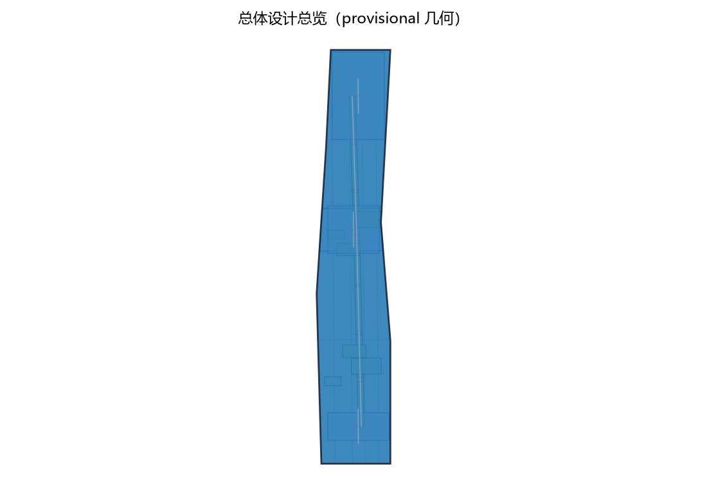
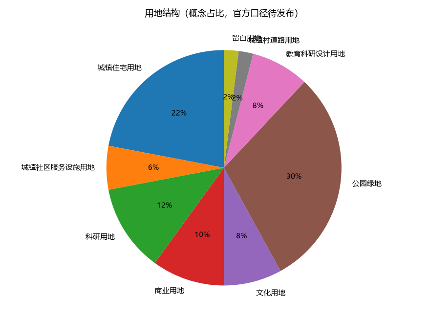
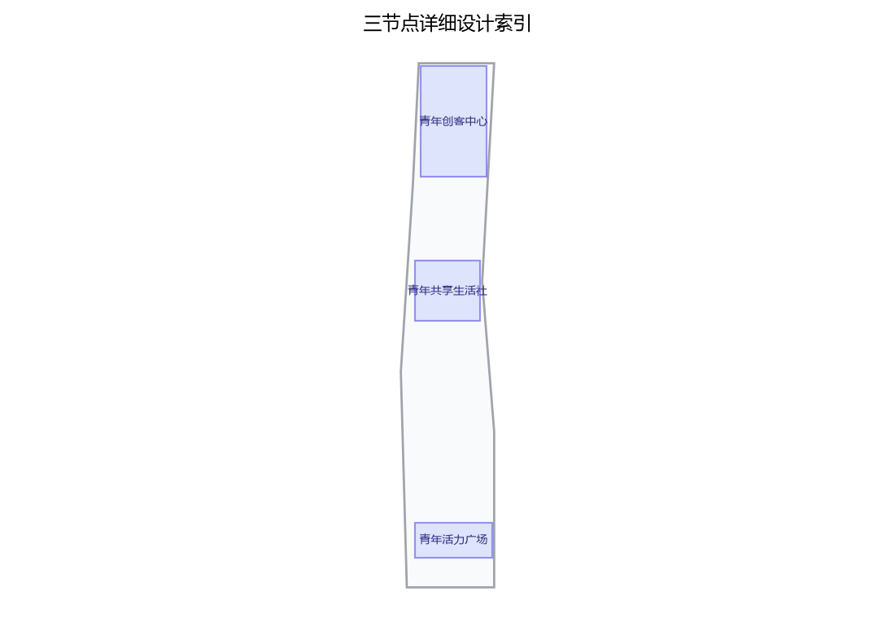
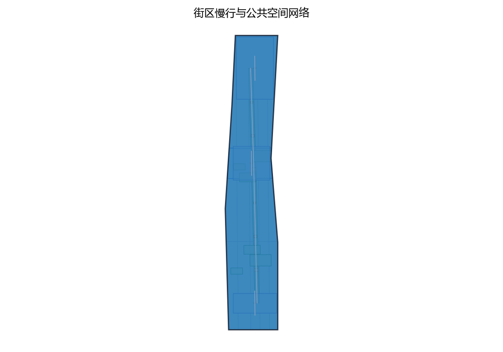
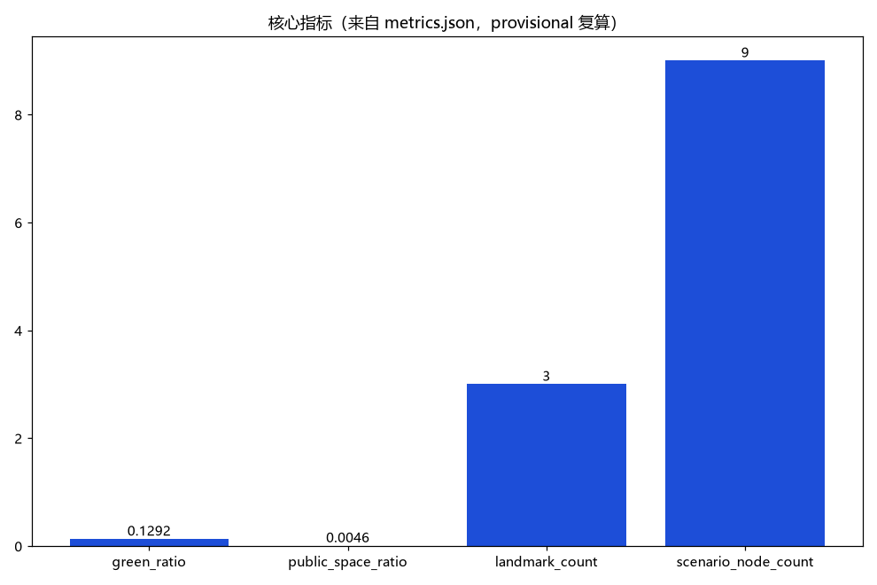

> 本稿为第 38 号方案包"青年创享环 YOUTH·JZ"的中文设计提案草案，对应公开任务书"青年友好公共空间"（youth-friendly-public-space）轨道与面向智能体任务书 agent.3 用户画像中的青年人才维度。方案提出"一社一居一场"三节点体系、五类 AI+ 场景与五项要素机制概念，全部内容为概念建议、参考方案，供专业团队深化研究，不替代正式规划，不构成政府审定结论；本稿不给出容积率、建筑高度、建筑强度、具体拆改留、租金水平、房源数量、投资测算或工程实施结论。

## 设计依据与资料清单

本提案的主控依据依次为：征集任务书摘录，确定三大定位、五大功能、三区两翼布局与 agent.1—agent.6 六项任务要求，以及禁止性边界条款；投稿技能，确定提案的章节结构、证据分层与"概念建议"表述边界；参考样例，确定章节深度与诚实披露风格；任务书全文摘录，核对禁止性表述清单。设计所需场地事实仅采用公开或清权来源：本仓库任务书摘录与投稿技能文件、北京市关于加快发展保障性租赁住房的公开实施方案及官方解读、深圳水围柠盟人才公寓的公开报道与设计机构公开资料、首尔市政府公开的青年住房政策页面、新加坡公共住区社区空间的公开资料，以及仅作定向背景的地图语境（若使用，带署名呈现，不推导红线、权属、文保、规划或工程事实）。

当前仓库未提供官方总体边界与重点区多边形。本稿的全部总体与节点设计均基于 provisional 概念几何，标记为 official_boundary=false、geometry_role=provisional_constraint，只用于内容设计与机器校验，不解释为法定红线、权属、规划许可或工程定位；官方图形到位后触发整体复算与替换。现状诊断、精度限制与复算路径收录于本稿相关章节。

| 类别 | 资料 | 用途与性质 |
| --- | --- | --- |
| 任务书 | 面向智能体任务书摘录与全文摘录 | 三大定位、五大功能、三区两翼、agent.1—6、边界条款、禁止性表述清单 |
| 技能 | 投稿技能参考文件 | 提案结构、证据分层、合规表述要求 |
| 样例 | 已披露参考样例 | 章节风格、诚实披露与指标表达参考 |
| 政策 | 北京市保障性租赁住房公开实施方案及解读（官方门户公开发布） | 青年居住政策背景，概念接口依据 |
| 案例 | 深圳水围柠盟人才公寓公开报道与设计机构公开资料 | 存量改造与共享公共空间机制借鉴 |
| 案例 | 首尔市政府公开的青年住房政策资料 | 居住成本可负担与社区空间机制借鉴 |
| 案例 | 新加坡公共住区社区空间公开资料 | 开放底层公共客厅机制借鉴 |
| 数据 | 官方边界与重点区几何 | 缺失待补，暂以 provisional 概念几何替代 |

> **证据锚点**：[source:DATA-SRC-OFFICIAL-ANNOUNCEMENT-20260509]、[source:DATA-SRC-AGENT-TASKBOOK-20260518]（组织方公告与任务书为文本口径依据）。

## 三层范围工作框架

三层范围以一条"问题—空间—运营—证据—退出"责任链贯通。统筹研究范围回答"青年人才资源如何转化为一带公共价值"：青年的就业、居住、创业与归属问题，如何经由产业研究、机制概念与活动体系形成可交付物。总体设计范围将回答落实到"青年创享环"空间结构：一条概念环线串联三节点，叠加青年公共服务网络。重点区域范围把任务落实到三个节点的功能、空间与公共体验界面。三层共用同一套证据口径与 provisional 标记，避免宏观生态、总图与节点设计各说各话。

总体范围面积以本稿提交的 site_boundary 概念几何在 EPSG:4548 下复算产生，属于低置信度的临时设计模型值：几何为 provisional、official_boundary=false，来源与公式随提交登记，仅用于设计组织与方案篇幅测算；官方边界与控制条件发布后，以官方几何重新复算并替换全部面积类表述。三处重点区范围为公开线索下的概念范围，不构成正式规划面积。

| 层级 | 核心问题 | 本方案的回答 | 主要成果 |
| --- | --- | --- | --- |
| 统筹研究范围 | 青年人才如何成为一带公共价值 | 青年三链（就业—居住—创业）、五项要素机制、四案例机制借鉴 | 生态接口与长期运营概念 |
| 总体设计范围 | 存量城市如何承载青年友好 | 一环三节点、青年公共服务网络、存量优先更新原则 | 空间结构、更新原则与指标口径 |
| 重点区域范围 | 三处节点如何差异化落地 | 创客中心、共享生活社、活力广场 | 三节点功能空间与公共体验界面 |

> **证据锚点**：[source:DATA-SRC-AGENT-TASKBOOK-20260518]（三层范围划分依据任务书官方文本口径）。

## 统筹研究范围产业与未来城市研究

### 三大定位与五大功能

三大定位在青年维度分别落点为精神传承、生活体验先行与创业就业；五大功能分别对应青年人才蓄水池、场景共创、公共与夜间活力、议事参与样本与开发者社区支撑。

### 三区两翼协同回路与命名识别

三区对应三节点：众智园侧青年创客中心承载共创、验证与辅导，AI原点社区侧青年共享生活社承载居住、生活与社群，大钟寺侧青年活力广场承载展示、运动与夜间活力；中关村科技服务翼与小月河场景赋能翼作为导师、服务与场景测试的概念接口，形成"创客—生活—活力"循环回路（机制概念，不作承诺）。中文名"青年创享环"、英文名 YOUTH·JZ 强调共创共享的环形网络；Logo 方向为原创"一环三点"图形，主色为京张砖红、深墨蓝与亮橙，低眩光、无障碍对比，不照搬任何既有城市、园区或企业标识。

### 对标案例（仅按公开渠道信息概述）

四个案例仅概述公开机制（细节见表），借鉴"存量改造公共产品化""共享公共空间配置""开放底层公共客厅""政策接口与小户型共享导向""色彩导视机制"，不照搬案例的产权安排、补贴标准、租金水平与管理模式；数字一律标注公开口径，不转写为本方案承诺。

| 案例 | 公开机制概述 | 借鉴要点 |
| --- | --- | --- |
| 深圳水围柠盟人才公寓 | 公开报道显示其为全国首个由城中村握手楼改造的人才保障房社区试点：保留原有肌理与结构，增设电梯连廊与共享公共空间（青年之家、屋顶花园等），政府统筹、企业改造运营、村社筹房协作，政府补贴后以低于市场水平租金定向配租企业青年人才（数字为公开口径） | 存量改造公共产品化、共享公共空间、色彩导视 |
| 北京保障性租赁住房公开政策 | 公开实施方案明确保租房面向无房新市民与青年群体、重点保障新毕业大学生等，"十四五"公开目标为建设筹集约四十万套（间）；小户型为主，鼓励共享空间与功能混合 | 政策接口、小户型与共享导向 |
| 首尔青年住房政策 | 首尔市政府公开资料显示其面向无房青年提供月度租金补贴、低门槛青年住房与租赁服务支持，青年住房配套社区交流空间 | 居住成本可负担与社区空间并重 |
| 新加坡公共住区活力空间 | 公开资料显示组屋底层架空空间为开放、无围栏的社区空间传统，近年出现以共享厨房为核心、面向社区开放的公共空间改造实践 | 开放底层公共客厅、共享厨房 |

### 要素机制（概念）

五项机制概念：弹性租住与押金优化，探索短租期弹性、合租匹配与信用记录、机构担保、分期缴纳等降低一次性押金负担的方向，规则须经法律与主管部门审核；共创会籍，低成本会籍含共享工位、路演与导师轮值机会，规则由运营方与青年议事会共同议定；青年服务积分，自愿参与、匿名聚合，用于时段兑换排序与运营复盘，不进行个体识别式追踪，异常人工复核；青年议事会，定期公开议事，对时段分配、活动内容与机制调整提出建议，决定按法定程序审定；创业导师轮值，依托公开公益导师与服务资源设立，不承诺具体机构与频次。

> **证据锚点**：[source:DATA-SRC-PROVISIONAL-BOUNDARIES-20260605]（边界为 provisional，研究范围仅作概念示意）。

## 总体设计范围城市更新与控规深度城市设计

总体结构为"一环三节点加公共服务网络"："青年创享环"是一条概念环形慢行与服务结构，串联青年创客中心、青年共享生活社与青年活力广场三个节点，并叠加青年公共服务网络——沿环布置次级服务点（共享自习、问询服务、活动公告与意见收集、夜归值守点）。环线为概念结构而非道路红线，可在官方边界到位后整体重定位，不预设道路线形与交叉口工程。

更新策略为存量优先、渐进更新与可逆轻改造：优先识别可保留与可轻改的建筑与空间，以可逆部件（共享厨房、移动舞台、可拆装工位、可移动绿植）承载功能，不以大规模拆除为前提；具体保留、适配、移位或删除均须在现状、权属、文保、结构、消防与无障碍调查后由专业团队逐一判断，本稿不给具体地块的拆改留结论。

控规深度以"问题—空间对象—指标—资料缺口—复算路径"表达：本稿可提供的空间对象与概念指标均基于 provisional 几何，面积与比率类指标以提交几何复算并标记低置信度与官方复算触发条件；容积率、建筑高度、建筑强度等依赖未公开官方控制条件的指标保持待确认，不以概念方案替代控规审批。

| 设计层 | 空间对象（概念） | 状态与复算路径 |
| --- | --- | --- |
| 总体结构 | 青年创享环（概念环线） | provisional 几何，官方数据发布后重定位复算 |
| 节点 | 三节点概念包络 | provisional，待现状与权属调查后逐一判断 |
| 网络 | 次级服务点（共享自习、问询、夜归值守） | 概念点位，可整体移位 |
| 指标 | 面积与比率类 | provisional 复算；强度类待官方控制条件 |

> **证据锚点**：[source:DATA-SRC-MOHURD-CONTROL-DETAILED-PLANNING]、[source:DATA-SRC-PROVISIONAL-BOUNDARIES-20260605]。

## 重点区域详细设计

### 青年创客中心（众智园侧）

功能上，面向 AI 青年创业者与开发者的共创空间，承载路演、孵化辅导、导师轮值与共创会籍四项功能，承接众智园全栈体系的青年测试验证界面。空间上，概念包络含路演厅、共创工位区、导师轮值室与会籍服务台，优先嵌入可保留建筑或采用可逆轻改造，低层化、耐久可修。公共体验界面上，沿街通透界面与可开启路演区使公开活动向公共空间开放；设荣誉展示墙，经授权后展示开发者与共创者的公开成果；无门票、时段可预约，活动内容由运营方与青年议事会共同议定。

### 青年共享生活社（AI原点社区侧）

功能上，弹性租住与共享生活单元，承载合租匹配、共享厨房客厅与社群运营，以公开保障性租赁住房政策背景作为概念接口（不承诺具体支持）。空间上，概念包络含弹性租赁单元（存量改造适配、户型以小户型为宜的概念倾向）、共享厨房与公共客厅、洗衣晾晒区、社区书房；首层参考开放公共客厅原型组织，边界通透不设围栏。公共体验界面上，首层公共客厅向社区开放、不设门禁，公告墙公布社群活动日历、服务班表与意见渠道，租住区与公共区分区管理，保障居住安宁与夜间安静。

### 青年活力广场（大钟寺侧）

功能上，开放舞台、运动社交与夜间活力场，作为大钟寺AI产业集聚区面向公众的体验与展示界面。空间上，概念包络含开放舞台、运动场地、弹性市集区与夜间照明休息区；舞台与场地采用可拆装组件，夜间照明与慢行路径一体化布置。公共体验界面上，无门票、时段可预约，活动内容公开评审（青年议事会建议、运营方审定）；夜间活力以安全、值守与噪音控制为前提，避免过度商业化与低俗化，夜间开放时段与临近居住界面分区管理。

| 节点 | 功能 | 空间（概念） | 公共体验界面 |
| --- | --- | --- | --- |
| 青年创客中心 | 路演、孵化辅导、导师轮值、共创会籍 | 路演厅、共创工位、导师轮值室、会籍服务台 | 通透界面、开放路演、荣誉展示墙、无门票 |
| 青年共享生活社 | 弹性租住、合租匹配、共享厨房客厅、社群运营 | 租赁单元、共享厨房客厅、社区书房 | 首层公共客厅开放、公告墙、分区管理 |
| 青年活力广场 | 开放舞台、运动社交、夜间活力 | 舞台、运动场地、弹性市集、夜间照明休息区 | 无门票、时段预约、公开评审、安全值守 |

> **证据锚点**：[data:PACKAGE-GEOMETRY]（三节点示意多边形来自本包 geometry/key_areas.geojson）。

## AI 创新生态、人才画像与 AI+ 场景

AI 创新生态以"青年人才蓄水池—场景共创—机制回流"组织：青年创客中心承接众智园体系的测试验证界面，青年共享生活社以真实生活问题反哺场景清单，青年活力广场承担公共体验与展示；中关村科技服务翼与区域公开协同资源作为要素接口（机制概念，不作承诺）。

用户画像共六类（见下表），仅作为服务差异设计依据，不作人口统计推断，不用于任何个体识别。

| 画像 | 核心需求 | 对应场景卡 |
| --- | --- | --- |
| 应届毕业生 | 求职、过渡居住、通勤适应 | 求职辅导、租房通勤 |
| 青年AI开发者 | 共创、技术交流、夜归 | 活动组局、创业陪伴 |
| 自由职业者 | 弹性空间、共享办公与社交 | 活动组局、意见反馈 |
| 青年创业者 | 路演、辅导、会籍 | 创业陪伴、意见反馈 |
| 青年家庭 | 稳定租住、社区生活与儿童照护 | 租房通勤、意见反馈 |
| 泛青年夜归人群 | 夜间路径安全与夜间活力 | 租房通勤、意见反馈 |

五类 AI+ 场景卡要点均遵循"普通服务先行、AI 仅生成草稿与候选、具名人工复核、立即移除"四要素，细节见下表：任何场景在隐私、来源或人工复核不满足时立即移除，测试与试点不表述为已批准运营。

| 场景卡 | 普通服务先行 | AI 辅助（草稿/候选） | 具名复核角色 | 移除条件 |
| --- | --- | --- | --- | --- |
| 青年求职辅导AI | 就业服务窗口、招聘信息墙 | 公开岗位聚合、简历资料检索草稿 | 就业服务专员 | 推断敏感属性或差别排序 |
| 租房通勤导览AI | 租赁服务台、公开房源册 | 公开房源与通勤信息核对清单 | 租赁服务专员、轮值咨询 | 代替合同或法律判断 |
| 活动组局AI | 实体公告板、活动总台 | 自愿登记的匿名兴趣标签撮合建议 | 社区主持人 | 时间地点或权利未核实 |
| 创业陪伴AI | 导师轮值室、政策资料架 | 公开政策摘要、路演提纲草稿、导师候选 | 轮值导师 | 给出融资或许可结论 |
| 意见反馈AI | 意见箱、议事会现场 | 去标识意见主题聚类、转派建议 | 议事会秘书、街区运营负责人 | 隐藏少数意见或生成个人画像 |

场景与空间运营映射：求职辅导AI对应创客中心就业服务台；租房通勤导览AI对应共享生活社租赁服务台；活动组局AI对应活力广场活动总台与三节点公告墙；创业陪伴AI对应创客中心导师轮值室；意见反馈AI对应三节点意见箱与青年议事会。隐私与人工复核边界：数据仅匿名聚合用于运营复盘，不进行个体识别式追踪，不做个人画像排序，全程保留免登录的普通服务等价路径。

> **证据锚点**：[source:DATA-SRC-GENERATIVE-AI-INTERIM-MEASURES]（AI 生成内容治理表述的参照依据）。

## 用地、建筑规模与拆改留方案

用地表达采用概念分区并完整覆盖 provisional 总体范围：三节点为核心用地概念，环线两侧为公共服务网络点，其余为既有功能延伸区；概念分区不改变法定用地性质，官方控规到位后以同一逻辑重切复算。

建筑规模方面，本稿以"存量优先、低层为宜"的概念倾向表达设计意图，不给出容积率、建筑高度、建筑基底面积与总建筑规模等数值承诺；建筑包络概念（路演厅、共享厨房客厅、开放舞台等部件）仅作功能组织示意，正式高度、退线、密度与消防由后续专业设计依据控规与调查确定，属待确认状态。

拆改留执行四步原则：先核实现状与权利；满足安全、文保与功能时保留；需要无障碍、消防、节能与服务界面改善时轻改；不满足安全或与保护要求冲突时移位或删除概念部件。没有调查就不提出拆除面积与拆除结论；具体地块的保留、改建与拆除判断由专业团队依据实测与权属调查作出，本稿不预判、不给具体地块拆改留方案。

> **证据锚点**：[source:DATA-SRC-MNR-LAND-USE-CLASSIFICATION-202311]（用地分类名称参照现行国标口径）。

## 交通、轨道、市政与公共服务设施

本稿不给道路线形、轨道线位、桥隧、市政管线与工程量结论，仅提出概念组织原则。核心概念是夜归慢行照明与安全路径一体化设计：以三节点及创享环为主体，将连续照明、视线通透、夜间导视、求助与值守串联为一个整体。其一，照明连续而分级——主路径保持连续照明，交叉口与节点做识别照明强化，避免眩光与暗角；其二，路径两侧保持视线通透，消除暗角与死角，绿化与设施布置不遮挡观察；其三，沿线设置求助点，以实体按钮、电话与人工值守界面构成免 App 求助通道；其四，夜间导视与开放时间信息在熄灯后仍可读；其五，夜间活力场与居住界面以分区与时段管理控制噪音，照明与绿化、公共空间一体化布置而非叠加布置。照明、治安、应急等市政职责的衔接与实施由主管部门决定，本稿不给工程参数与实施结论。

交通组织上，三节点概念性衔接既有轨道与公交站点及慢行网络（不断言线位与站点改造），停车与接驳以现状条件核实为前提。公共服务设施以"青年服务驿站"为概念单元：问询、饮水、充电、共享设施、公告与意见收集，配套资产编号、维护人、巡检频率与停止使用条件；夜归服务点（深夜值守界面）以人员、安全与维护条件成熟为前提弹性开设，可随时关闭。

> **证据锚点**：[source:DATA-SRC-MOHURD-URBAN-DESIGN-MEASURES]（市政与慢行设计表述的方法参照）。

## 蓝绿空间、公共空间与城市风貌

蓝绿空间以"三庭一园一带"概念组织：创客中心绿庭、共享生活社社区花园、活力广场林荫广场，加环线两侧绿带与口袋节点；屋顶与共享空间可承载社区种植等轻活动（概念）。概念绿地率与公共空间率均以 provisional 几何复算并标记低置信度，官方数据发布后复算替换。

公共空间构建"青年十五分钟公共生活圈"：以三节点为核心，连续的步行路径串联遮阴座椅、饮水信息、无障碍标识、活动公告与共享组件；公共组件采用耐久可修、可逆可换原则，不依赖屏幕与网络即可完整使用，视觉导视采用原创配色体系的高对比无障碍设计。

城市风貌以京张铁路遗产的朴素工业尺度为底，青年活力以克制用色与清晰界面呈现：低眩光夜景、耐久材料、连续檐下空间与清晰公共入口，不以"AI 造型"或霓虹表皮为目标。色彩导视借鉴案例的色彩识别机制而非照搬形象，使用本方案原创配色。文化叙事以"百年京张的青年工程精神—中关村创新文化—当代青年创客文化"为主线：京张铁路由青年为主的工程团队自主修筑是公开历史事实，本稿以精神传承而不是造型复刻来表达，不歪曲历史，不把文化当作科技装饰或口号。

> **证据锚点**：[source:DATA-SRC-MOHURD-URBAN-DESIGN-MEASURES]（蓝绿空间组织的方法参照）。

## 更新项目清单、实施政策与分期计划

项目清单按三类组织，均以现状、权属、安全与维护条件调查为前提，本稿不给投资测算与审批判断：共创空间类——青年创客中心（路演厅、共创工位、导师轮值室等概念包络）与沿环共享自习位；生活配套类——青年共享生活社（弹性租赁单元存量适配、共享厨房客厅、社区书房）与夜归服务点；活力运营类——青年活力广场（开放舞台、运动场地、弹性市集）与活动组局、青年议事会运营机制。

| 类别 | 代表项目（概念） | 内容要点 |
| --- | --- | --- |
| 共创空间类 | 青年创客中心、共享自习网络 | 路演、工位、导师轮值、会籍、荣誉展示 |
| 生活配套类 | 青年共享生活社、夜归服务点 | 弹性租住、共享厨房客厅、社区书房、深夜值守界面 |
| 活力运营类 | 青年活力广场、活动与议事机制 | 开放舞台、运动、弹性市集、组局与议事会 |

分期实施为概念节奏：近期（1—3年）以"一社一居一场"试点起步，选择场地与权属条件成熟的一个或两个节点先行开放，同步试点青年议事会、共创会籍与青年服务积分机制；中期（3—5年）完善青年公共服务网络，加密服务点、连通夜归安全路径、扩展 AI 场景测试清单；远期（5—10年）实现青年创享环全线贯通与跨区联动，沉淀年度活动体系与运营品牌资产。任一期均以"可值守、可维护、可撤回、可被公众否决"为开放前提，不把概念节奏写成已确定安排。

实施政策仅作机制建议：将北京市公开的保障性租赁住房政策方向与存量改造导向作为背景接口（不承诺具体支持与房源）；空间与机制的调整由青年议事会提出建议，并按法定程序由主管部门审定；不把政策、资金与招商安排写成确定承诺。

> **证据锚点**：[source:DATA-SRC-AGENT-TASKBOOK-20260518]（分期与实施条目对应任务书要求）。

## 指标体系、面积复算与合规矩阵

指标分三类：可从提交几何复算的概念指标；依赖未公开官方控制条件、保持待确认的指标；需运营基线后设定的绩效指标。三项 formal 核心视觉指标说明如下。site_area_sqm：以本稿提交的 site_boundary 概念几何在 EPSG:4548 下投影复算；green_ratio：以 green_space 面积除以 site_area；public_space_ratio：以 public_space 面积除以 site_area。由于官方总体边界与重点区几何尚未发布或清权，上述几何全部为 provisional_constraint、official_boundary=false，对应数值为低置信度临时设计模型值，公式与来源随提交登记；复算触发条件为：官方边界与控制条件发布后，以官方几何重新复算并替换全部面积与比率表述；未复算前，任何此类数值不得用于法定面积、评分性结论或对外正式口径。容积率、建筑高度、建筑强度等指标保持未知（value null），原因：依赖未公开的官方控制条件，公布后复算。

| 指标 | 口径（概念） | 状态 | 复算路径 |
| --- | --- | --- | --- |
| site_area_sqm | site_boundary 投影面积 | provisional 低置信度 | EPSG:4548 复算，官方边界发布后替换 |
| green_ratio | green_space 面积 / site_area | provisional 低置信度 | 同左 |
| public_space_ratio | public_space 面积 / site_area | provisional 低置信度 | 同左 |
| 容积率、建筑高度、强度 | — | 未知（value null） | 官方控制条件发布后复算 |
| 概念计数类 | 节点数、场景数、机制数、分期数 | 本稿口径可复核 | 随提交结构化记录 |

合规矩阵：三大定位、五大功能、三区两翼与 agent.1—agent.6 六项任务在本稿逐条映射——agent.1 对应命名与识别、总体结构与三区两翼回路；agent.2 对应案例研究、生态组织与要素机制（均为概念）；agent.3 对应本稿用户画像、五类场景卡、场景—空间—运营映射与隐私边界；agent.4 对应三节点公共空间与荣誉展示概念；agent.5 对应京张—中关村—AI 新文化叙事与导视概念；agent.6 对应三类项目、分期节奏与议事会、活动组局等运营机制概念。全部条目声明"概念建议、参考方案"属性，符合任务书禁止性边界，不出现过度监控、个体识别式追踪、伪造数据或把设想写成已确定安排的表述。

> **证据锚点**：[metric:green_ratio]、[metric:public_space_ratio]、[source:PACKAGE-GEOMETRY]。

## 风险、版权与合规说明

主要风险与应对：provisional 边界被误读为官方红线——所有几何与面积保持 provisional 标记并声明官方数据发布后的复算触发条件；官方数据缺口导致指标失效——强度类指标保持未知并说明原因，不制造精确感；积分与场景数据出现个体识别式使用——数据仅匿名聚合、人工复核，保留免登录普通服务等价路径，任何场景可立即移除；公共空间缺乏值守与维护而闲置——以"可值守、可维护、可撤回、可被公众否决"为开放前提；概念被表述为已确定安排——所有机制与节奏一律以"概念""建议""试点"表述，人类与专业团队拥有最终判断。

版权与生成方法披露：本稿文字、概念图形与表格由投稿者与 AI 协作原创，生成方式、工具与授权范围随提交登记；对标案例仅按公开渠道信息概述其机制，不复制、转载或拼贴受版权保护的图片、Logo、版式与长段落；不未经授权使用任何商标、企业标识、人物肖像与论文图像；若使用地图语境，仅作带署名的定向背景，不从中推导红线、权属、文保、规划或工程事实；第三方内容权利状态逐项记录于来源台账。

合规说明：本稿为开放共创建议，不替代正式规划，不构成政府审定结论，不越过专业规划、政府审定与法定审批；符合公开资料边界、人本治理、生成方法披露与贡献可记忆要求；未提及具体企业商标，未编造青年人口、房源数量、租金水平、活动场次或政策承诺。正式深化前必须补齐官方边界、控规、权属、地形建筑与管线调查、文保控制、交通与市政条件、运营预算与法律合规复核。

> **证据锚点**：[source:DATA-SRC-OFFICIAL-ANNOUNCEMENT-20260509]（征集规则为权属与合规表述的依据）。

## 参考资料

以下为机器登记来源的可读索引；网址、发布者、获取日期、用途与权利说明随提交包的结构化记录保存。本地必读参考文件共四份：任务书摘录（brief_site-package_agent_taskbook.json）、投稿技能（skills_urban-design-ai-submission_SKILL.md）、参考样例（007xf_proposal.md）与任务书全文摘录（taskbook.pretty.json），均以公开或清权来源使用；公开政策与案例资料于 2026 年 8 月检索，仅概述机制与公开口径，不保留受版权保护的图片、版式与长段落。本稿的指标与自检遵循投稿技能要求：三项 formal 核心指标以提交几何复算并标记 provisional，官方数据发布后以官方几何复算替换；全部引用的可核验性随提交包自检记录保存，供人类评审复核。

| 类别 | 资料与用途 |
| --- | --- |
| 任务书 | 面向智能体任务书摘录与全文摘录（三大定位、五大功能、三区两翼、agent.1—6、边界条款、禁止性表述清单） |
| 技能 | 投稿技能参考文件（提案结构、证据分层、指标契约） |
| 样例 | 参考样例（章节风格与诚实披露） |
| 政策 | 北京市关于加快发展保障性租赁住房的实施方案及官方解读（北京市人民政府门户网站公开发布，2022 年），青年居住政策背景 |
| 案例 | 深圳水围柠盟人才公寓公开报道与设计机构公开资料（2017—2022 年公开渠道），机制概述 |
| 案例 | 首尔市政府公开青年住房政策页面（英文版），机制概述 |
| 案例 | 新加坡公共住区社区空间公开资料（组屋架空空间与社区空间公开报道），机制概述 |
| 地图 | 地图语境（如使用，带署名背景，仅作定向） |
| 数据 | 官方总体边界与重点区几何（缺失待补，暂以 provisional 概念几何替代） |

完整机器索引（来源、指标、假设、合规矩阵、自检）随提交包保存；正式深化前必须补齐官方边界、重点区多边形、控规、权属、文保、交通市政与运营预算等资料，并以官方几何完成全部面积与指标复算。本稿不引用非公开数据与内部资料；任何第三方内容的复用须按其许可与署名要求执行。

> **证据锚点**：[source:DATA-SRC-OFFICIAL-ANNOUNCEMENT-20260509]（本清单首条即组织方公开资料包）。
