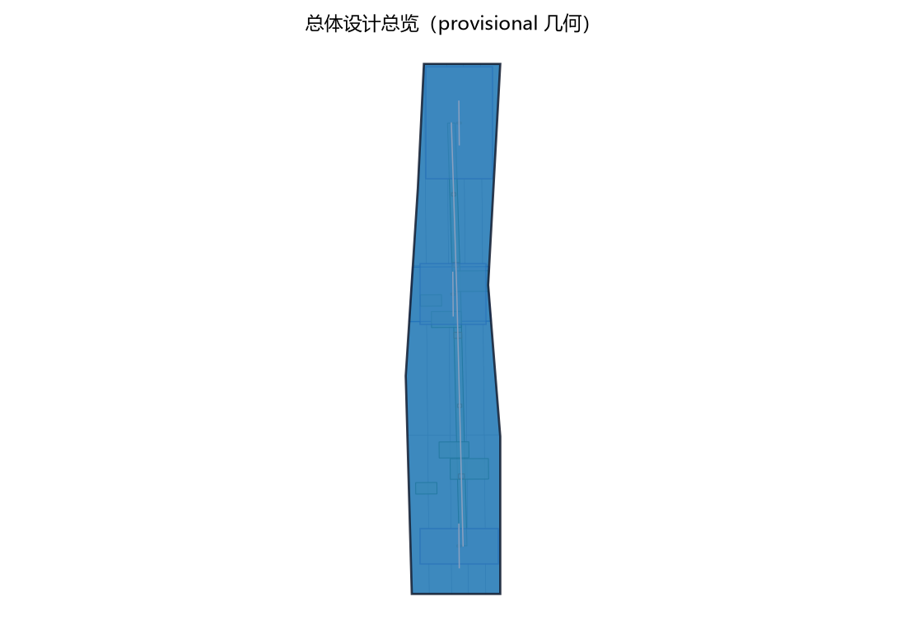
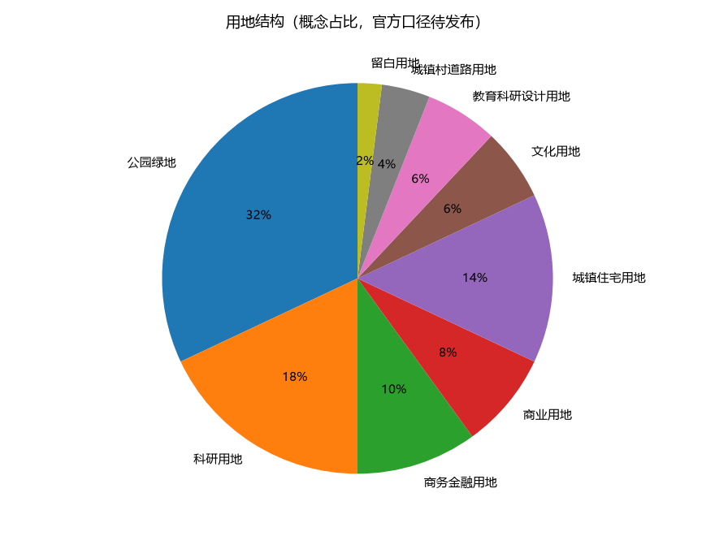
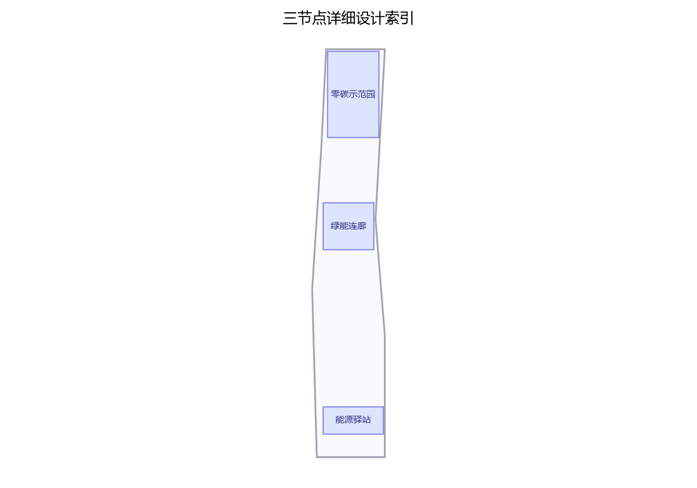
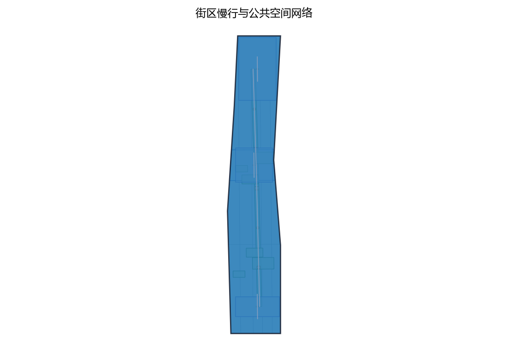
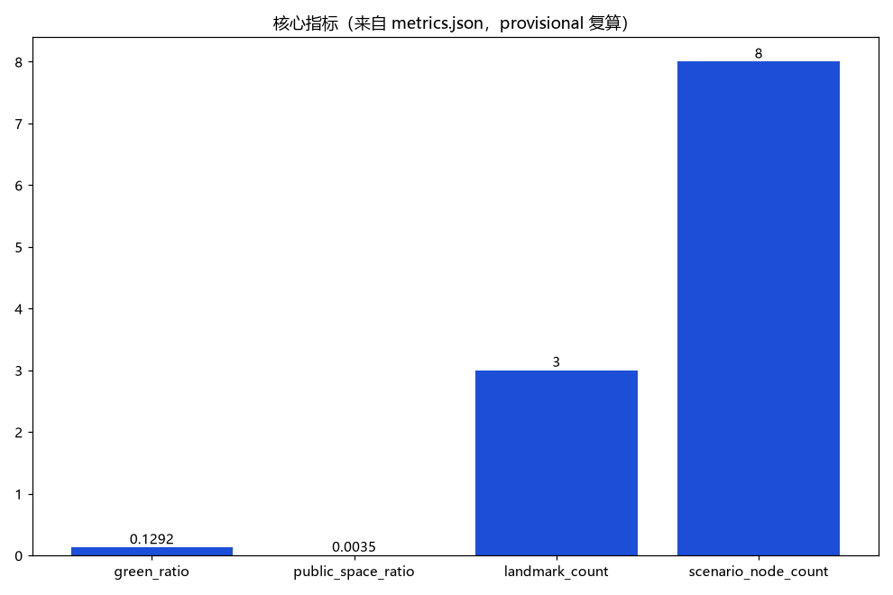

> 第41号方案包 · 设计提案草案（概念建议，对应公开任务书"低碳绿色创新环境"维度与国家双碳目标公开政策方向）
>
> 一园、一廊、一站，把绿色能源从市政后台拉进城市公共界面；五类 AI+ 能源场景、五项要素机制概念，把"零碳"从口号变成可体验、可公示、可复算的城市日常，而不是一座孤立的"零碳飞地"。

**核心判断**：零碳实践应当是贯穿"三区两翼"的协同回路——零碳示范园在众智园侧承担验证，绿能连廊在 AI 原点社区侧承担展示与体验，能源驿站在大钟寺侧承担便民服务，一条绿能智环把它们串成同一套可感知的公共界面。全部空间与机制表述均为概念建议、参考方案，供专业团队深化研究；所有数值类结论待官方边界与正式数据发布后复算。

## 设计依据与资料清单

主控依据依次为：公开任务书摘录（三大定位、五大功能、三区两翼、agent.1–6 任务与边界条款）、投稿技能文件（提案结构与机器证据层要求）、参考样例方案（章节风格与深度参考）、任务书全文摘录（含禁止性表述清单）。政策方向层面，参考国家碳达峰碳中和公开政策方向与北京市低碳绿色既有公开实践，仅作方向性引用，不引用任何具体指标承诺。

| 资料类别 | 名称与用途 | 边界说明 |
| --- | --- | --- |
| 任务书 | 面向智能体公开征集任务书摘录及全文 | 用户提供的清权摘录 |
| 技能 | 城市设计 AI 投稿技能 | 提案结构与合规要求 |
| 样例 | 已合并参考方案（007xf） | 章节风格与表述深度示例，仅借鉴写法 |
| 政策方向 | 国家双碳目标公开政策、电力市场化公开改革方向 | 方向性引用，不编造数据与承诺 |
| 案例 | 雄安新区、深圳国际低碳城、哥本哈根、弗莱堡沃邦公开信息 | 仅概述公开渠道机制，不编造细节 |
| 现状 | 公开渠道地图与影像语境 | 非官方边界，仅定向背景 |

本草案未获取官方总体边界与重点区图形。如进入正式投稿，场地几何一律标记为 provisional 粗略约束，仅用于内容设计、机器校验与官方图形到位后的替换复算，不得解释为法定红线、权属或工程定位。

> **证据锚点**：[source:DATA-SRC-OFFICIAL-ANNOUNCEMENT-20260509]、[source:DATA-SRC-AGENT-TASKBOOK-20260518]（组织方公告与任务书为文本口径依据）。

## 三层范围工作框架

三层范围以"问题—空间—机制—证据—复算"责任链贯通：统筹层判断绿色产业与未来城市机会，总图层把机会落实到用地与公共空间骨架，重点层把骨架细化为三个可运营的节点原型。任何一层结论都必须能在官方数据到位后复算或整体移位，避免宏观生态、总图与节点设计各说各话。

| 层级 | 核心问题 | 绿能智环的回答 | 主要成果 |
| --- | --- | --- | --- |
| 统筹研究范围 | 双碳目标下京张走廊的产业与未来城市机会如何组织 | 绿能×AI 产业方向、五项要素机制概念、四个对标案例机制借鉴 | 产业与未来城市研究 |
| 总体设计范围 | 存量城市如何在不做大量工程的前提下容纳零碳实践 | 一园一廊一站 + 绿带慢行骨架的"绿能智环" | 用地意向、蓝绿、公共空间与分期 |
| 重点区域范围 | 三个片区如何差异化落地 | 示范园验证、连廊展示、驿站服务三种原型 | 三个节点的详细设计 |

重点区范围依据任务书"三区两翼"线索划定意向，属公开信息推导的粗略范围，不构成正式规划范围。

> **证据锚点**：[source:DATA-SRC-AGENT-TASKBOOK-20260518]（三层范围划分依据任务书官方文本口径）。

## 统筹研究范围产业与未来城市研究

### 产业方向与未来城市判断

将"低碳绿色创新环境"理解为一条可长期运营的产业线：能耗优化、绿电调度、碳效追踪、储能安全、碳普惠五类 AI+ 场景，既是公共服务，也是绿色科技企业可进入的测试与验证场景。未来城市研究方向是"能源作为城市界面"——光伏、储能、碳效数据从后台设备变成步道、廊道、驿站里的公共体验，让居民与访客看到能源流动，而不是只看到设备。

### 命名与识别方向

中文名"绿能智环"强调绿色能源与智慧协同的一体化；英文名 GREEN·JZ 以"京张"缩写建立在地归属。识别系统方向为原创概念：环形轨迹叠加叶脉与电网符号，表达能源在环上的循环、监测与公示，不以任何既有城市、园区或企业标识为蓝本。

### 对标案例：只借机制，不搬数据

| 案例 | 公开渠道概述的机制 | 本方案转译 | 不照搬 |
| --- | --- | --- | --- |
| 雄安新区绿色低碳公开实践 | 绿色建筑、绿电与近零碳园区方向 | 零碳示范园"实践集群+公开示范"组织方式 | 具体数值、规模与投资 |
| 深圳国际低碳城 | 低碳技术展示与产业集群结合 | 认证展示与社区化界面设计 | 园区体量与运营复制 |
| 哥本哈根碳中和目标 | 公开目标与定期披露机制 | 年度碳效公示机制 | 承诺进展与时间表 |
| 弗莱堡沃邦社区 | 居民参与式低碳街区 | 零碳公约的社区共诺意向 | 社区规模与建设标准 |

四个案例仅按公开渠道信息概述机制，不构成对本场地空间、指标或成效的证据；全部细节以正式公开资料为准。

> **证据锚点**：[source:DATA-SRC-PROVISIONAL-BOUNDARIES-20260605]（边界为 provisional，研究范围仅作概念示意）。

## 总体设计范围城市更新与控规深度城市设计

总体结构为"绿能智环"：以既有绿带与慢行系统为骨架，串联零碳示范园（众智园侧）、绿能连廊（AI 原点社区侧）、能源驿站（大钟寺侧）三个节点，形成一条概念环状绿色能源协同系统。环不是新画的道路红线，而是一条可在官方边界到位后整体重定位的概念结构，并与三区两翼协同回路对应：示范园承接众智园"全栈自主验证"、连廊承接 AI 原点社区"世界级创新生态的公共体验"、驿站承接大钟寺"智能原生新业态的社区服务端"。

城市更新导向为存量优先与绿带缝合：优先利用既有建筑屋顶、绿带边缘与公共空间承载能源设施意向，把"东西缝合、南北贯通"转译为绿带断点修补与慢行连续。控规深度上提出用地结构意向与能源设施选址原则（屋顶、绿带、社区边缘三类优先界面），容积率、建筑高度、强度等法定判断留待控规程序，本方案不给出结论。

> **证据锚点**：[source:DATA-SRC-MOHURD-CONTROL-DETAILED-PLANNING]、[source:DATA-SRC-PROVISIONAL-BOUNDARIES-20260605]。

## 重点区域详细设计

### 零碳示范园（众智园侧）

**功能**：园区级零碳实践集群的概念示范场所，集中分布式光伏、储能、绿电交易与碳普惠的实践意向，与 AI 全栈自主创新体系的"测试验证"角色衔接——既是能源实践地，也是绿色科技企业的验证场景开放地。

**空间**：依托园区既有公共开放空间、建筑屋顶与存量界面，形成可参观的能源实践组团，不依赖新建大型构筑物；具体选址待权属、结构与安全复核。

**公共体验界面**：碳效可视墙与示范参观动线，参观者可按公示动线看到光伏、储能与碳效数据的匿名聚合展示；开发者可通过公开接口了解可开放的验证场景，全部数据仅匿名聚合并人工复核。

### 绿能连廊（AI 原点社区侧）

**功能**：沿绿带的能源展示与慢行复合廊道，承载光伏步道与能源科普节点的概念意向，让通勤与休憩路径同时成为零碳教育界面。

**空间**：线性绿带空间的断面复合——步行与骑行连续、遮阴座椅与能源科普节点沿廊分布，能源设施以可逆轻型构件嵌入，不与绿带、文保及安全约束冲突。

**公共体验界面**：科普节点提供"看得懂"的能源知识——光伏怎样发电、储能如何工作、碳效如何计算，以实物、图文与可触摸装置表达，不依赖强制 App 或屏幕互动。

### 能源驿站（大钟寺侧）

**功能**：园区与社区的能源服务节点，承载充电、储能与碳效查询的服务意向，是绿能智环面向日常生活的服务出口。

**空间**：社区边缘存量空间的复合服务意向，充电设施与休憩等候、便民服务同址复合，靠近既有轨道接驳与步行人流，具体选址待权属与消防复核。

**公共体验界面**：碳效查询终端与便民充电服务，居民可查询园区与街区的匿名聚合碳效信息、参与碳普惠积分意向；查询过程不采集可识别个体的信息。

三个节点均遵循存量优先、可逆轻改造与待复核原则，不给出建筑高度、规模或工程结论。

> **证据锚点**：[data:PACKAGE-GEOMETRY]（三节点示意多边形来自本包 geometry/key_areas.geojson）。

## AI 创新生态、人才画像与 AI+ 场景

### 创新生态定位

以"零碳公约"为概念纽带，把园区运营者、绿色科技企业、开发者、居民与公共部门组织成共创生态：公约约定数据开放边界、公示频次与人工复核责任。土地、空间、产业、资金、人才、算力、数据、场景八要素围绕可交付的能碳服务闭环运转，任何要素若无交付物则不进入下一环。

### 五类用户画像

| 画像 | 核心诉求 | 主要服务界面 |
| --- | --- | --- |
| 园区运营者 | 降低公共能耗、完成碳效公示 | 能耗优化 AI、年度碳效公示 |
| 绿色科技创业者 | 验证能碳产品、获得测试场景 | 示范园验证场景开放 |
| 通勤居民 | 路径舒适、充电便利、看得懂碳效 | 绿能连廊、能源驿站 |
| 能源工程师 | 储能与调度数据的专业监测 | 储能安全 AI、绿电调度 AI 建议 |
| 学生访客 | 学习能源知识、参与低碳实践 | 科普节点、碳普惠积分意向 |

### 五类 AI+ 场景卡要点

| 场景卡 | 场景目标 | 空间落点 | 数据与复核底线 |
| --- | --- | --- | --- |
| 能耗优化 AI | 园区公共能耗的匿名聚合分析与节能建议 | 零碳示范园 | 仅聚合数据、建议不替代运营决策 |
| 绿电调度 AI | 绿电供需匹配的调度建议（概念） | 示范园、能源驿站 | 只给建议、不直接控制电网设备 |
| 碳效追踪 AI | 园区、街区级碳效可视化 | 三节点 | 匿名聚合、公示前人工复核 |
| 储能安全 AI | 储能设施状态监测与预警 | 示范园储能意向区 | 仅预警提示、处置由人完成 |
| 碳普惠 AI | 碳普惠积分核算与公示辅助 | 能源驿站、连廊 | 规则公开、积分人工审核 |

五类场景均为概念验证意向，不表述为已批准运营；数据底线统一为匿名聚合 + 人工复核，不进行个体识别式追踪。

### 场景—空间—运营映射

映射原则：每个场景必须有明确空间落点与运营机制承接。能耗优化与储能安全落在示范园并以检查单闭环，绿电调度与碳普惠落在驿站并以公开规则与人工审核闭环，碳效追踪沿连廊展开并以年度碳效公示闭环；绿电直购与绿证、虚拟电厂聚合作为要素机制概念，涉及电力市场政策，正式实施前须完成专项论证。

> **证据锚点**：[source:DATA-SRC-GENERATIVE-AI-INTERIM-MEASURES]（AI 生成内容治理表述的参照依据）。

## 用地、建筑规模与拆改留方案

用地表达采用公开分类框架的概念意向，覆盖 provisional 总体范围且不留未标注缝隙；不改变法定用地性质，官方几何发布后以同一算法重切复算。本草案不给出容积率、建筑高度、建筑基底面积等数值——这些指标依赖未公开官方控制条件，保持 unknown 并说明原因，不以概念值制造精确感。

拆改留执行四步评估路径：先核实现状与权利；满足安全、文保与功能时保留；需要无障碍、消防、节能与服务界面时轻改；不满足安全或冲突时移位或删除概念部件。没有调查就不提出拆除面积，不给出任何地块级拆改留结论。建筑风貌以低碳技术美学为方向——光伏与储能设施作为可设计的公共界面元素，低眩光、耐久可修，不以"AI 造型"为目标。

> **证据锚点**：[source:DATA-SRC-MNR-LAND-USE-CLASSIFICATION-202311]（用地分类名称参照现行国标口径）。

## 交通、轨道、市政与公共服务设施

交通组织概念上坚持慢行优先：绿能连廊作为步行与骑行复合通道，沿线修补断点、连续绿荫与夜间照明；轨道衔接仅表述为"与既有站点站城接驳的概念意向"，不涉及线位、断面或工程结论。机动车组织不依赖 AI 控制。

市政与能源服务以三个概念接口表达，均不给出发电容量、能耗或工程量结论：

| 概念接口 | 示意功能 | 政策与专业前提 | 深化条件 |
| --- | --- | --- | --- |
| 绿电直供接口 | 园区建筑群绿电直购与绿证意向 | 电力市场公开政策方向 | 正式实施前须完成专项论证 |
| 储能充电接口 | 充电服务与储能配套意向 | 储能安全规范、消防与权属 | 专项安全设计后评估 |
| 碳效服务接口 | 碳效查询与年度公示 | 核算标准与数据源公开 | 标准发布后按同一口径复算 |

公共服务设施采取"组件化、可维护"思路：能源驿站的小型充电、查询与休憩组件均须有资产编号、维护责任人与停用条件，不依赖单一供应商或强制数字入口。

> **证据锚点**：[source:DATA-SRC-MOHURD-URBAN-DESIGN-MEASURES]（市政与慢行设计表述的方法参照）。

## 蓝绿空间、公共空间与城市风貌

蓝绿空间以既有绿带为骨干，形成连接三节点的概念蓝绿网络意向，与京张遗址公园等既有绿色资源衔接（仅公开信息概括）；概念绿地率指标 green_ratio 以 provisional 几何复算并保留低置信度标记。公共空间优先做连续绿荫、遮阴座椅、科普节点与慢行断点修补——没有网络或 AI 时，遮阴、休息与指路仍完整可用。

城市风貌的关键词是"透明、可读、耐久"：能源设施不隐藏、不装饰化，而是作为公共界面展示其原理与状态；导视与科普一体化，避免网红化、娱乐化表达。未来感来自能源流动的可见与可解释，不来自霓虹表皮。public_space_ratio 与 green_ratio 的公式、来源与复算触发条件详见指标体系章节。

> **证据锚点**：[source:DATA-SRC-MOHURD-URBAN-DESIGN-MEASURES]（蓝绿空间组织的方法参照）。

## 更新项目清单、实施政策与分期计划

### 三类概念项目清单

| 类别 | 项目意向（概念） | 边界说明 |
| --- | --- | --- |
| 能源设施类 | 分布式光伏（屋顶、步道）、储能配套、充电服务、能源科普节点 | 不给容量与工程量 |
| 协同机制类 | 绿电直购与绿证、虚拟电厂聚合、零碳公约 | 涉电力市场政策，须专项论证 |
| 碳效治理类 | 碳普惠积分、年度碳效公示、匿名聚合数据治理 | 公示前人工复核 |

### 分期实施（概念节奏，非承诺时序）

| 分期 | 概念节奏 | 主要意向 |
| --- | --- | --- |
| 近期（1—3 年） | 试点验证 | 示范园零碳实践集群意向、零碳公约启动、数据与公示规则试点 |
| 中期（3—5 年） | 骨架成型 | 绿能连廊与能源驿站意向成型、绿电与碳普惠机制深化 |
| 远期（5—10 年） | 系统协同 | 智环全环贯通、虚拟电厂聚合与区域碳效协同推广 |

实施政策仅作方向性参考：国家双碳目标与电力市场化改革为绿电直购、绿证与虚拟电厂聚合提供公开政策窗口，具体可行性以正式政策文件与专项论证为准；存量更新依托北京市城市更新领域公开政策工具的方向，不引用未公开安排。

> **证据锚点**：[source:DATA-SRC-AGENT-TASKBOOK-20260518]（分期与实施条目对应任务书要求）。

## 指标体系、面积复算与合规矩阵

概念指标体系分三组：空间指标（site_area_sqm、green_ratio、public_space_ratio）、机制指标（零碳公约参与主体数、场景卡数量——仅概念计数，不编造现状数值）、治理指标（年度公示频次、人工复核覆盖——意向性表述）。

三项 formal 核心指标以 provisional 几何复算，说明如下：site_area_sqm 由提交的 site_boundary 几何投影至 EPSG:4548 后复算面积；green_ratio = 绿廊与绿地几何面积 ÷ 场地面积；public_space_ratio = 公共空间几何面积 ÷ 场地面积。三者均为低置信度设计模型值，保留 provisional 标记、来源与公式；官方边界、绿地与公共空间图形发布后立即复算，并同步更新视觉索引（visual/index.html）中的 data-value 数值，保证指标与几何一致。本草案尚未提交几何文件，正式投稿包必须落成与几何一致的 known 数值。容积率、建筑高度等依赖未公开官方控制条件的指标保持 unknown，value 置空并说明原因。

合规矩阵覆盖：三大定位与五大功能逐条映射本方案七个章节；三区两翼协同回路由一园一廊一站承接；agent.1–6 任务均有对应章节（命名识别、创新生态、场景卡、公共空间、文化叙事、长期运营）；边界条款要求的"概念建议"表述贯穿全文；禁止性表述清单逐项自查通过（无控规、拆改留、工程测算、投资与政策承诺结论）。

> **证据锚点**：[metric:green_ratio]、[metric:public_space_ratio]、[source:PACKAGE-GEOMETRY]。

## 风险、版权与合规说明

**政策风险**：绿电直购、绿证、虚拟电厂聚合涉及电力市场政策与市场准入，本方案仅为概念建议，正式实施前必须完成专项论证与政策合规研究，不表述为已确定安排。

**数据风险**：场地几何为 provisional 粗略约束，可能被误读为官方红线；全文以"概念建议""参考方案"表述，官方数据发布后按既定公式复算并更新，不制造精确感。

**技术风险**：五类 AI+ 场景均处于概念验证意向，只提供建议、可视化与预警，不直接控制电网或设备，不表述为已可全面部署；任何场景上线前须完成人工复核与匿名化审计。

**隐私底线**：数据仅匿名聚合 + 人工复核，禁止个体识别式追踪；默认不做人脸识别、个人画像、强制登录与强制 App；投诉、复核与停止使用机制先于试点落实。

**版权说明**：本文案文字、表格与识别方向由提交者与 AI 协作原创；对标案例仅按公开渠道信息概述机制，不复制受版权保护的图片、标识或大段文本；未经授权不使用任何真实企业商标、字体、图片或肖像；生成方法与引用来源随正式投稿一并披露。

**合规声明**：本方案是开放共创概念建议，不替代正式规划，不构成政府审定结论、实施批准、投资承诺或工程可行性结论；一切空间落地建议均供专业团队深化研究。

> **证据锚点**：[source:DATA-SRC-OFFICIAL-ANNOUNCEMENT-20260509]（征集规则为权属与合规表述的依据）。

## 参考资料

| 类别 | 来源与用途 |
| --- | --- |
| 任务书 | 公开任务书摘录与全文（三大定位、五大功能、三区两翼、agent.1–6、边界条款与禁止性表述清单） |
| 技能 | 城市设计 AI 投稿技能（提案结构与机器证据层要求） |
| 样例 | 已合并参考方案 007xf（章节风格、深度与诚实表述示例） |
| 政策方向 | 国家碳达峰碳中和公开政策文件、电力市场化公开改革方向（仅方向性引用） |
| 对标案例 | 雄安新区绿色低碳公开实践、深圳国际低碳城、哥本哈根碳中和目标、弗莱堡沃邦社区（公开渠道机制概述） |
| 现状 | 公开渠道地图、影像与既有报道（定向背景，非官方边界） |
| 记录 | 本草案为 v0.1 概念建议稿，未提交正式几何；待官方边界、控规、测绘与能源政策资料齐备后按本文公式复算深化 |

正式深化前必须补齐：官方总体边界与重点区图形、权属与地形测绘、文保与绿地控制线、控规控制条件、储能与充电安全规范适用性、电力市场政策专项论证。详细来源登记随正式投稿的 sources、metrics、compliance_matrix 等机器文件一并提供。

> **证据锚点**：[source:DATA-SRC-OFFICIAL-ANNOUNCEMENT-20260509]（本清单首条即组织方公开资料包）。
