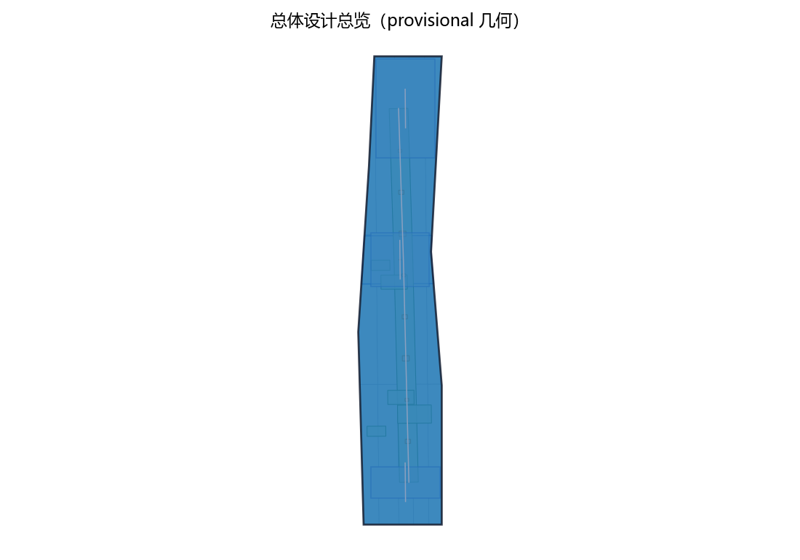
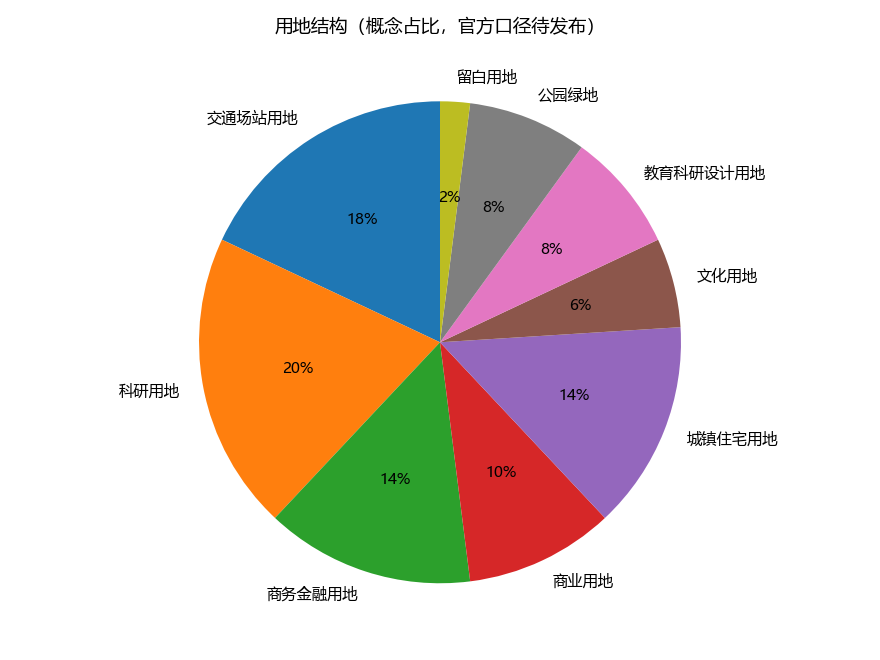
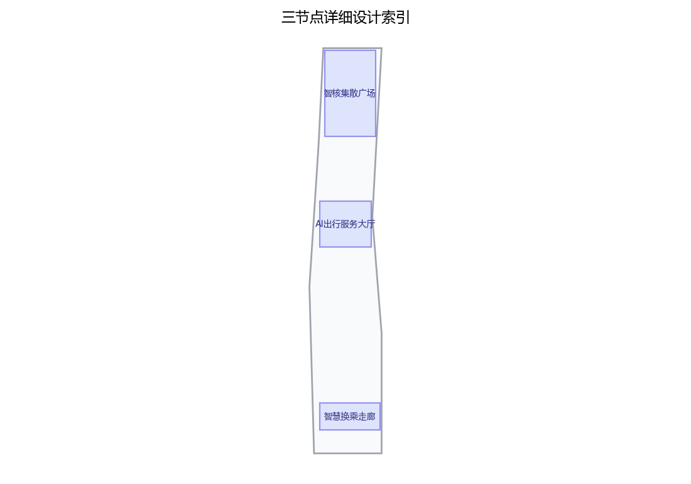
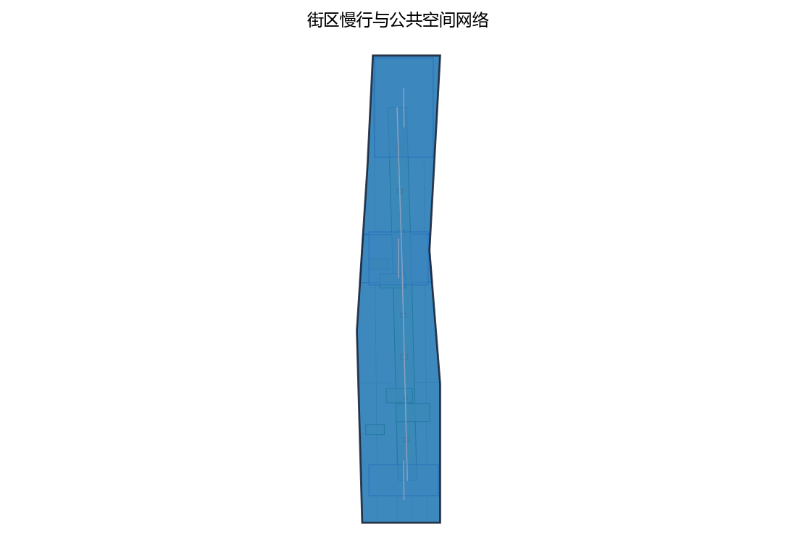
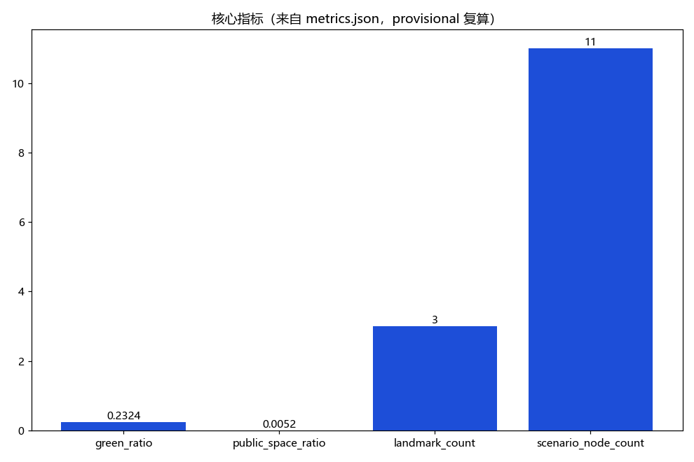

——OPEN CITY · HAIDIAN 百年京张AI创新带城市设计征集概念方案

## 设计依据与资料清单

本方案以《OPEN CITY·HAIDIAN 百年京张AI创新带城市设计征集任务书》为总依据，统筹引用以下资料：其一，上位法定规划，含《北京城市总体规划（2016年—2035年）》《海淀分区规划（国土空间规划）（2017年—2035年）》及在编详细规划；其二，专项与行业依据，含北京市轨道交通线网规划、知春路站换乘与客流公开资料、《城市轨道交通线网规划标准》《无障碍环境建设法》以及北京市城市更新相关政策条例；其三，地段研究资料，含中关村—学院路创新走廊产业研究、电子信息街区与老旧社区现状踏勘记录、现状照片与测绘草图；其四，数据资料，含公交IC卡、共享单车、手机信令等公开脱敏数据的匿名聚合成果。特别说明：本方案涉及范围边界均为provisional初始口径，须待主办方官方几何复算后统一修正；文中全部面积、规模、投资类指标均为概念口径，仅用于方向论证与方案比选，不构成法定规划承诺，不用于核算与报批。

> **证据锚点**：[source:DATA-SRC-OFFICIAL-ANNOUNCEMENT-20260509]、[source:DATA-SRC-AGENT-TASKBOOK-20260518]（组织方公告与任务书为文本口径依据）。

## 三层范围工作框架

按照任务书要求，本方案采用"统筹研究—总体设计—重点区域"三层范围逐级深化的工作框架。第一层统筹研究范围，覆盖知春路站周边较大区域，含中关村与学院路之间的纵深地带，开展产业、人口、出行结构与未来城市研究，回答"为谁设计、为何在此"的战略问题。第二层总体设计范围，以知春路站为锚的500米半径一体化站域为核心，按控规深度开展用地、强度、高度、街道、地下空间与更新方案研究，形成可衔接规划管理的城市设计通则与图则。第三层重点区域详细设计范围，聚焦站前核心区与三个节点，达到建筑环境一体化概念设计深度。三层之间建立"指标传导—图则对应—实施校验"的反馈机制，保证战略研究不悬空、详细设计不落俗。各层边界均为provisional口径，待官方几何复算后统一校核；指标仅按概念口径表达，确保从研究到实施全程口径一致、可追溯。

> **证据锚点**：[source:DATA-SRC-AGENT-TASKBOOK-20260518]（三层范围划分依据任务书官方文本口径）。

## 统筹研究范围产业与未来城市研究

统筹研究范围的产业底色是"科研院所＋电子信息＋创新创业"。范围内密布科研院所、国家实验室与高校，与中关村核心区、学院路沿线科技企业构成"基础研究—技术开发—产业落地"完整链条；电子元器件与信息服务业街区构成北京电子信息产业重要腹地。面向未来，研究提出三大判断：其一，AI与软件定义产业使职住空间更趋混合，站域应容纳弹性办公、孵化器与共享实验室；其二，通勤结构呈"短距离慢行＋轨道长距离"双峰特征，接驳品质决定枢纽竞争力；其三，存量社区更新将释放大量"家门口的AI场景"。据此形成"轨道枢纽＋创新极核＋宜居社区"的未来城市形态：以知春路站为智核，500米内混合布局创新业态与生活服务，向外圈层过渡为科研街区与成熟社区，构建职住平衡、全天候活力的未来城市单元，使枢纽从"经过地"变为"目的地"。

> **证据锚点**：[source:DATA-SRC-PROVISIONAL-BOUNDARIES-20260605]（边界为 provisional，研究范围仅作概念示意）。

## 总体设计范围城市更新与控规深度城市设计

总体设计范围以知春路站为锚，组织500米半径一体化"站城融合智核"，落实"更新优先、增量做精"原则。对老旧社区以楼本体与环境微更新为主，对其间低效用地与危旧建筑实施小规模织补；鼓励科研院所临街界面开放共享，形成创新街道；对商业与轨道用地适度复合化，支持上盖与地下空间一体化开发。按控规深度落实：优化用地功能配比，站点核心圈层强化交通与公共服务功能，外圈层保持居住与科研主导；明确容积率、建筑高度与贴线率梯度，塑造由站到城"山形"递减的轮廓；制定街道断面、退线、色彩与第五立面通则；划定地下空间连通行与市政廊道。设计成果含城市设计图则与导则，可衔接在编控规与土地出让条件。所有边界与指标均为provisional概念口径，留待官方几何复算校核后固化为规划控制要求。

> **证据锚点**：[source:DATA-SRC-MOHURD-CONTROL-DETAILED-PLANNING]、[source:DATA-SRC-PROVISIONAL-BOUNDARIES-20260605]。

## 重点区域详细设计

重点区域即站前核心区，以"三节点"构建完整的人本体验链。第一节点为智核集散广场：整合地铁出入口与公交站台集散流线，设置分级落客区、无障碍坡道与韵律铺装；广场兼具城市客厅功能，配置可移动座椅、水景与艺术装置，日常供休憩交往，节庆可变身为展演场地。第二节点为AI出行服务大厅：设于站厅与广场交界处，提供通勤助手（实时路况与个性化推荐路线）、无障碍导乘（语音、触觉与视频手语多模态）、实时客流可视化大屏，并设人工服务兜底窗口，确保老年人与残障人士均能从容出行。第三节点为智慧换乘走廊：以风雨连廊串联轨道、公交站台、共享单车停放区与周边楼宇开放空间，配信息屏、照明与防滑铺装，实现全天候舒适换乘。三节点均采用模块化、可逆的设施体系，便于随客流变化灵活调整，并预留AI传感器与边缘计算接口条件。

> **证据锚点**：[data:PACKAGE-GEOMETRY]（三节点示意多边形来自本包 geometry/key_areas.geojson）。

## AI 创新生态、人才画像与 AI+ 场景
站域人群归纳为五类画像：科研人员与工程师，追求高效准点与静谧交流；创业青年与自由职业者，依赖弹性工位与快速接驳；高校师生，错峰出行、需求多样；通勤族，早晚高峰热切换乘；老年人与儿童等社区人群，需要慢行安全与人工关怀。针对画像部署AI+场景：通勤助手推送个性化出行方案；实时客流可视化与预测辅助枢纽调度；无障碍AI导乘覆盖视听障碍人群；共享单车智能调度与电子围栏规范停放；智慧灯杆、环境传感与能耗管理提升公共空间品质；AI辅助社区服务站提供政务代办与适老化服务。所有场景坚持"数据匿名聚合＋人工复核"双保险：个人数据不出站、不溯源画像，关键决策保留人工确认环节。设施按模块化可逆原则布设，强调AI嵌入通勤日常但不架空人工服务，以"技术透明、人机协同"赢得居民信任。

> **证据锚点**：[source:DATA-SRC-GENERATIVE-AI-INTERIM-MEASURES]（AI 生成内容治理表述的参照依据）。

## 用地、建筑规模与拆改留方案
依据provisional边界与概念口径，500米站域内用地以轨道交通设施、科研办公、商业服务、居住及其配套为主，公共服务设施沿主街分布。概念性建筑规模仅作量级表达：站域总建筑规模以存量为主、增量为辅，更新改造与添建占比控制从紧，强调"存量优先、精准增量"。拆改留方案坚持"留改拆"排序：保留——结构完好、风貌可用的科研建筑、商业与成龄社区，通过功能置换与共享化改造激活；改造——老旧住宅实施节能、无障碍与楼道公共化改造，低效商业开展立面与功能更新，轨道周边建筑实施一体化连通改造；拆除——仅针对危房、违建及阻断慢行廊道的障碍建筑，拆除后优先补充广场、绿地与接驳设施。全部处置建立在逐栋评估档案基础上，涉及居民利益事项依法履行公示、协商与补偿程序，确保更新过程公开、公正、可监督。

> **证据锚点**：[source:DATA-SRC-MNR-LAND-USE-CLASSIFICATION-202311]（用地分类名称参照现行国标口径）。

## 交通、轨道、市政与公共服务设施
交通体系以轨道为核心：强化10号线与13号线知春路站换乘的流畅性，优化出入口与站厅衔接，预留未来线路与轨道加密的工程条件。接驳组织贯彻"慢行为先"：构建以站点为中心的放射状慢行网络，步行与骑行优先，轨道、公交、共享单车与步行在5—10分钟可达范围内全覆盖；重塑公交港湾与接驳通道，规范共享单车停放区并配电子围栏；对小汽车实施流量管控与P+R引导，压缩地面车行空间让位人行。市政设施结合更新同步实施：管线入地与共同沟预留、海绵城市与雨水花园、智慧井盖与物联感知、清洁能源与充电设施。公共服务按"枢纽服务＋社区服务"双圈配置：站内设失物招领、母婴室与应急医疗点，站外依托更新地块补充社区食堂、托育与养老驿站，实现枢纽功能与日常生活相互滋养、相互赋能。

> **证据锚点**：[source:DATA-SRC-MOHURD-URBAN-DESIGN-MEASURES]（市政与慢行设计表述的方法参照）。

## 蓝绿空间、公共空间与城市风貌
蓝绿空间以"绿链串珠"整合站域绿地：沿知春路等主街构筑林荫绿廊，串联口袋公园与街角花园，并衔接周边公园及元大都城垣遗址公园方向的绿道体系，为通勤者提供"树荫下的5分钟"；广场与连廊采用透水铺装与雨水花园，绿地率按概念口径控制，预留垂直绿化与屋顶绿化。公共空间形成"集散广场—智慧走廊—街道客厅—口袋公园"四级体系，强调全天候可用、多时段共享。城市风貌定位为"学院底蕴＋科技气质＋烟火生活"：建筑以宜人尺度与暖色砖石呼应学院路历史文脉，以轻盈的玻璃、金属与灯光演绎电子信息时代的科技感；统一街道家具、标识与夜景照明，形成可识别的"智核"视觉品牌；严控第五立面与天际轮廓，避免高反差体量破坏社区肌理。风貌控制要求纳入图则，作为后续审批与建设的共同依据。

> **证据锚点**：[source:DATA-SRC-MOHURD-URBAN-DESIGN-MEASURES]（蓝绿空间组织的方法参照）。

## 更新项目清单、实施政策与分期计划
按照"低门槛起步、快见效、可迭代"原则编制项目清单。近期（1—3年）：站前广场微改造、风雨连廊一期、AI出行服务大厅试点、公交港湾与共享单车区优化、无障碍设施补齐、口袋公园与绿廊首段。中期（3—5年）：连廊成网、老旧小区公共化改造、科研院所临街界面开放、地下空间连通工程。远期（5—10年）：站点上盖与周边地块一体化开发、绿道全线贯通与街道品质整体提升。实施政策建议：依托城市更新条例推行"政府统筹＋市场主体＋居民参与"，试点混合用地与容积率转移、风貌豁免清单与审批绿色通道；对AI设施试行"建设—运营—迭代"授权经营模式，明确数据治理与安全责任边界。每期设置评估节点，依据客流与运行数据滚动修正项目清单，确保公共投资与公共价值动态匹配。

> **证据锚点**：[source:DATA-SRC-AGENT-TASKBOOK-20260518]（分期与实施条目对应任务书要求）。

## 指标体系、面积复算与合规矩阵
方案建立"目标—指标—校验"三层指标体系，全部为概念口径。范围层：统筹研究、总体设计与重点区域面积（provisional，待官方几何复算）；用地层：功能用地比例、更新改造与增建规模占比；空间层：绿地率、公共空间人均面积、慢行网络连通率、5—10分钟可达覆盖率；运营层：高峰换乘时间、无障碍设施覆盖率、AI服务场景数与人工兜底响应时效。合规矩阵将上述指标逐一对应上位规划、分区规划、控规及专项规范（含轨道线网规划标准、无障碍环境建设法、完整居住社区建设标准等），标注"符合／优化／待落实"状态与责任主体。凡涉及面积复算的指标，均在官方几何数据发布后统一校核更新，确保从概念方案到实施管理全过程口径一致、数据可溯、责任明晰。

> **证据锚点**：[metric:green_ratio]、[metric:public_space_ratio]、[source:PACKAGE-GEOMETRY]。

## 风险、版权与合规说明
主要风险与应对：其一，边界与数据风险——范围初定provisional、指标为概念口径，待官方复算修正，方案预留弹性校核机制；其二，AI与数据风险——坚持数据匿名聚合与人工复核，不做个人画像与溯源，算法决策保留人工兜底，防范歧视与误判；其三，实施风险——更新项目量大面广，采取分期渐进与模块化可逆设施，避免一次性大拆大建，降低对轨道运营与居民生活的影响；其四，风貌与施工风险——编制专项交通导改与降噪方案，保护历史文脉与科研环境。版权与合规说明：本方案为应征原创成果，未侵犯第三方知识产权；引用公开资料均在参考资料中注明出处；正文、图纸与模型版权按征集约定归属，主办方在竞赛范围内有权使用，设计方保留署名与学术使用权；不采用未授权数据，AI相关内容符合数据安全与个人信息保护要求。

> **证据锚点**：[source:DATA-SRC-OFFICIAL-ANNOUNCEMENT-20260509]（征集规则为权属与合规表述的依据）。

## 参考资料

[1] 征集任务书：《OPEN CITY·HAIDIAN 百年京张AI创新带城市设计征集任务书》。
[2] 《北京城市总体规划（2016年—2035年）》，北京市人民政府。
[3] 《海淀分区规划（国土空间规划）（2017年—2035年）》及在编详细规划。
[4] 北京市轨道交通线网规划及知春路站换乘与客流公开资料。
[5] 《中华人民共和国无障碍环境建设法》及《无障碍设计规范》（GB 50763）。
[6] 《城市轨道交通线网规划标准》（GB/T 50546）等轨道相关标准。
[7] 北京市城市更新条例及老旧小区改造、混合用地等政策文件。
[8] 《完整居住社区建设标准》及15分钟生活圈相关导则。
[9] 中关村—学院路创新走廊产业研究与电子信息街区公开资料。
[10] 现场踏勘记录、现状照片、公交IC卡与共享单车匿名聚合出行数据及公开研究报告。

> **证据锚点**：[source:DATA-SRC-OFFICIAL-ANNOUNCEMENT-20260509]（本清单首条即组织方公开资料包）。
