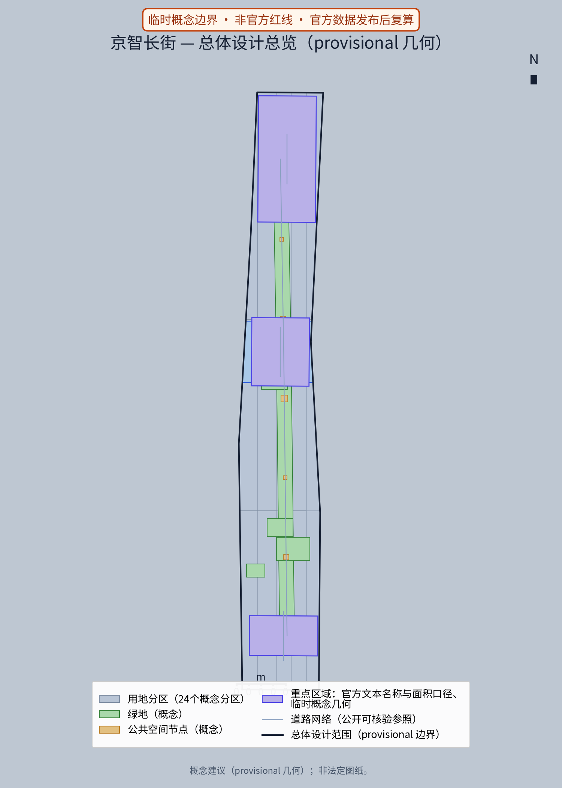
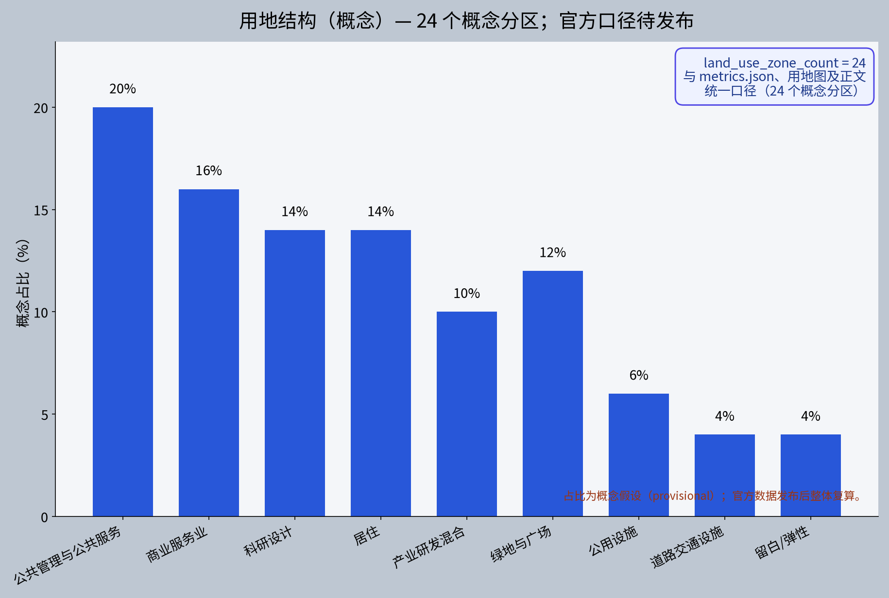
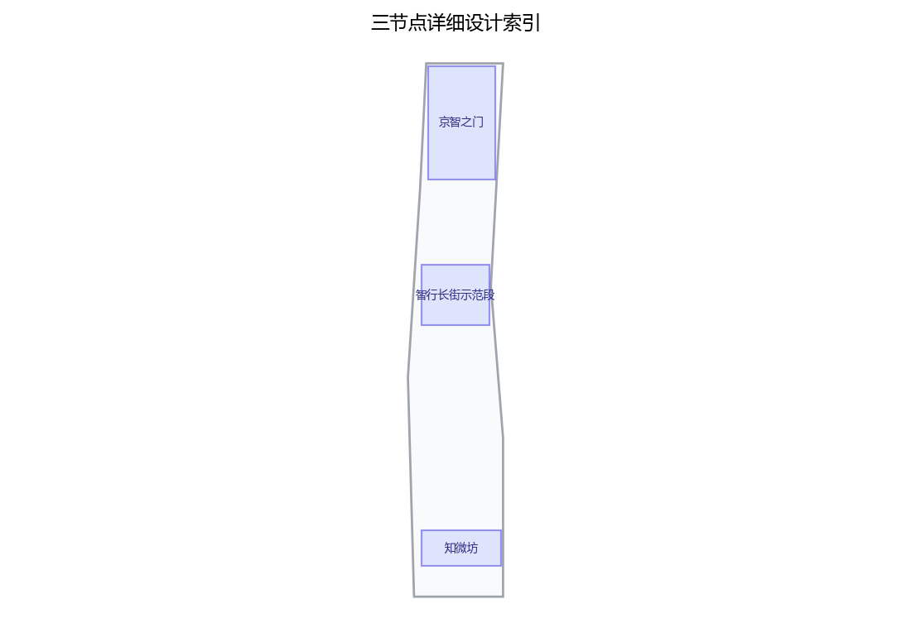
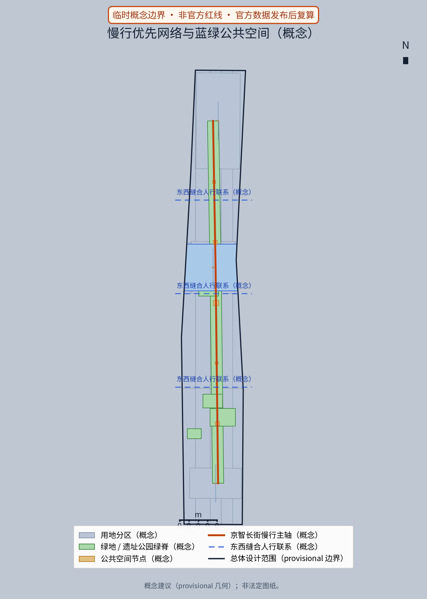
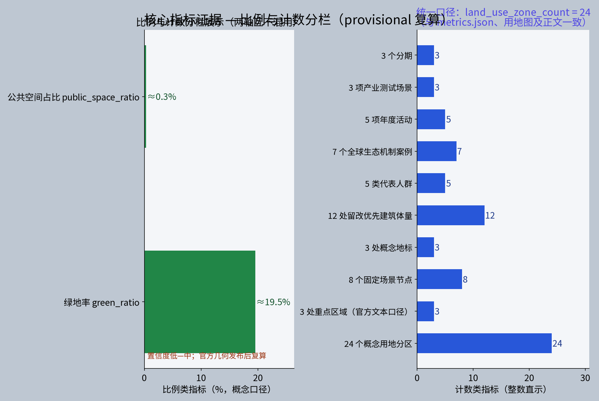

**方案名称与总体构想(概念)**

本方案主名称"京智长街"(JINGZHI Avenue),副题"中关村大街AI创新主轴",属三区两翼之中关村科技服务翼。"京智"取"京张"之谐音:以百年京张铁路为文化原乡,以"智"为当代精神,隐喻从铁路时代驶向智能时代的长街叙事,辨识度强且不与现实城市、园区、企业名称重复。总体构想为"一轴三节点、三类场景、三阶段":以中关村大街为轴,组织要素全球化配置、中关村IP与资本赋能的服务功能;自拟"京智之门""智行长街示范段""知微坊"三处概念节点(均标为概念点位);沿街落地AI+生活场景,坚守数据匿名聚合与人工复核边界,反对过度监控;按近期、中期、远期概念节奏实施。全篇口径:凡面积均引用官方文本数值并标注口径,凡几何均为概念示意(provisional),凡落地均为参考方案,供专业团队深化研究,不构成法定规划结论。

## 设计依据与资料清单

本方案依据以下资料开展概念设计:①征集任务书及官方发布的三大定位、五大功能、三区两翼与三层范围表述,含官方文本面积口径(统筹研究范围43.6平方公里、总体设计范围11.4平方公里、重点区域合计368.4公顷;众智园约192公顷、北京AI原点社区约104公顷、大钟寺AI产业集聚区约72公顷);②京张铁路遗址公园公开规划建设资料,作为文化脉络与空间骨架参照;③海淀区分区规划及街区控规等公开法定文件,仅作背景引用,不替代法定规划结论;④中关村大街沿线现状调研、公开影像与街景资料;⑤AI产业研究、开源社区及open-city-ai/haidian公开资料。资料清单随文附后;因组织方尚未发布官方边界多边形,本方案涉及几何均为概念示意,不自行声称精确坐标与面积。

> **证据锚点**：[source:DATA-SRC-OFFICIAL-ANNOUNCEMENT-20260509]、[source:DATA-SRC-AGENT-TASKBOOK-20260518]（组织方公告与任务书为文本口径依据）。

## 三层范围工作框架

按三层范围建立工作框架,层层递进、互为校核:统筹研究范围(官方文本口径43.6平方公里,概念示意)聚焦产业体系与未来城市议题,研判AI全栈自主创新体系的空间网络及中关村科技服务翼的职能腹地;总体设计范围(11.4平方公里,官方文本口径)开展城市更新与控规深度城市设计的总体概念,形成京智长街的空间结构、街道断面与更新导则;重点区域(合计368.4公顷,官方文本口径,含众智园、北京AI原点社区、大钟寺AI产业集聚区三区)展开详细设计,并以本期三处概念节点作为深化示范。研究层定逻辑、设计层定形态、重点层定场景;全部成果以"概念建议、参考方案"表述,待官方边界发布后由专业团队校核与深化。

> **证据锚点**：[source:DATA-SRC-AGENT-TASKBOOK-20260518]（三层范围划分依据任务书官方文本口径）。

## 统筹研究范围产业与未来城市研究
产业研究识别中关村大街与科技服务翼的协同机会，形成「要素全球配置+中关村IP与资本赋能」的未来城市形态判断；未来城市研究仅作方向性预判，不构成对用地与投资的承诺。

在统筹研究范围内,沿清河、上地与中关村软件园、知春路、中关村大街、学院路等真实节点,概念性勾画"基础层—模型层—应用层—治理层"的AI全栈自主创新体系空间映射:北部段落依托软件园强化基础软硬件与大模型研发集聚,中部依托知春路、学院路科研院所形成算法策源与交叉学科网络,中关村大街段落承担展示、服务与资本要素配置职能,呼应科技服务翼"要素全球化配置、中关村IP与资本赋能"定位。未来城市研究提出概念框架:数字孪生底座、城市级AI基础设施、预测性治理与AI原生公共服务,研判就业结构变化与包容性政策,形成产业图谱与创新走廊的参考方案,供专业团队深化研究。

> **证据锚点**：[source:DATA-SRC-PROVISIONAL-BOUNDARIES-20260605]（边界为 provisional，研究范围仅作概念示意）。

## 总体设计范围城市更新与控规深度城市设计
总体设计强调街廓渐进更新、增量做精：低效楼宇功能置换、临街界面开放共享、街道断面慢行优先；对控规指标只做校核建议，不预设数值结论。

在总体设计范围内,京智长街提出三条更新策略(概念建议):其一,街廓渐进更新——以地块为基本单元,尊重现状产权与肌理,采用"针灸式"触媒带动沿街低效楼宇与老旧商厦改造,反对大拆大建;其二,街道断面改造与慢行优先——概念性优化中关村大街断面比例,压缩机动车冗余空间,保障连续人行与骑行空间,系统优化过街节点与无障碍路径;其三,第五立面与街道家具——统一沿街屋顶、设备、广告、灯杆与铺装秩序,形成"科智美学"语汇。以上策略按控规深度城市设计的表达组织为更新导则,属参考方案,不构成法定控规结论,几何关系待官方边界发布后由专业团队深化校核。

> **证据锚点**：[source:DATA-SRC-MOHURD-CONTROL-DETAILED-PLANNING]、[source:DATA-SRC-PROVISIONAL-BOUNDARIES-20260605]。

## 重点区域详细设计

本期重点区域详细设计聚焦三处原创概念节点(均标注为概念点位,具体边界与坐标待官方发布后校核):①"京智之门"(JINGZHI Gateway)——大街门户AI展示节点,位于中关村大街南段概念门户区位,以AI公共展场、数字艺术立面与集散广场组织到达序列,呼应铁路遗产的"起点"意象;②"智行长街示范段"(ZHI-WALK Demonstration Block)——大街智轴示范段,选取中关村大街中段若干连续街廓,集成AI+场景、慢行断面与街道更新样板;③"知微坊"(ZHIWEI Micro-Cells)——腹地创新微单元群,依托知春路—学院路交会腹地街坊,以院落式微单元承载初创团队与社区AI驿站。三节点与三区及小月河场景赋能翼形成"三区两翼+一轴"的联动网络,详细设计成果为概念建议。

**场景卡索引（概念）**：沿街AI+场景以场景卡落地，形成可评审、可迭代的运营索引：

| 场景卡 | 落点 | 面向人群 | 运营机制（概念） | 数据与合规边界 |
|---|---|---|---|---|
| 「问街」AI导览 | 「京智之门」广场信息柱 | 游客、学生 | 预约式深度讲解、月度更新 | 端侧语音处理，不留存个体信息 |
| 「伴行」无障碍伴随 | 示范段全段 | 老年人与残障人士 | 志愿者值守、人工兜底 | 匿名聚合，不进行个体识别式追踪 |
| 「智柜」无人零售 | 知微坊街角 | 通勤者、白领 | 积分会员、轮换选品 | 仅订单聚合统计，禁止过度监控 |
| 「微感」客流感知 | 示范段关键节点 | 运营方、商户 | 实时公示、年度评估 | 统计级聚合，人工复核 |
| 「邻里AI驿站」 | 知微坊社区 | 居民、从业者 | 议事征集、志愿者轮值 | 可一键关闭，端侧处理 |

> **证据锚点**：[data:PACKAGE-GEOMETRY]（三节点示意多边形来自本包 geometry/key_areas.geojson）。

## AI 创新生态、人才画像与 AI+ 场景

沿智轴构建"链主企业+新型研发机构+开源社区+耐心资本"共创的AI创新生态,概念性配置共享算力、开放数据、中试空间与IP运营服务,强化中关村IP与资本赋能职能。人才画像(概念):算法工程师、大模型应用开发者、AI产品经理、数据治理与合规师、交叉学科青年科学家及技能型运营人才;配套人才公寓、共享实验室与青年共创空间等概念建议。沿街AI+场景(概念):智能灯杆(照明、环境感知与信息发布)、AI导览(语音与增强现实导览)、无障碍伴随(视障音频指引与轮椅路径规划)、无人零售(智能货柜与无人便利店)、客流感知(区域级人流态势)。隐私与安全边界:全部感知数据在街端匿名化,仅输出统计级聚合结果,不采集、不存储可识别个体身份的信息,不设人脸识别与个体追踪,不进行个体识别式追踪、禁止过度监控;所有AI主动决策均设人工复核环节与投诉处置通道,严禁过度监控与行为画像,场景清单供专业团队深化并接受合规审查。

AI场景域覆盖交通、产业、空间、公共服务、文化、治理六域:AI交通（智能灯杆与客流感知）、AI产业（中试与IP运营服务）、AI空间（公共展场与数字艺术立面）、AI公共服务（无障碍伴随与投诉处置）、AI文化（艺术展览与长街叙事）、AI治理（数据合规公示），各域均以人工复核兜底。

> **证据锚点**：[source:DATA-SRC-GENERATIVE-AI-INTERIM-MEASURES]（AI 生成内容治理表述的参照依据）。

## 用地、建筑规模与拆改留方案
拆改留坚持留改拆排序：保留遗址公园及沿线历史要素与功能完好建筑，改造沿街低效楼宇与老旧商业，仅作插入式点状新建并严控增量与高度；全部面积为概念口径，官方数据发布后复算。

用地结构概念:沿街以公共管理与商业服务、创新产业用地为主,腹地以混合功能与居住提升为主,形成"沿街繁华、腹地安宁、绿脉贯通"的格局。建筑规模:本方案不自行测算与发布面积、容量数值,凡涉及规模均以官方文本口径为准,具体指标属概念建议,待官方边界发布后由专业团队复算校核。拆改留方案(概念):保留——京张铁路遗址公园及沿线历史要素、功能完好的园区与建筑;改造——沿街低效楼宇、老旧商业与闲置楼宇的功能置换与立面更新,占更新主体;新建——仅在论证充分的零散地块作插入式点状建设,严格控制增量与高度,确保与街区肌理和遗址公园界面协调。

> **证据锚点**：[source:DATA-SRC-MNR-LAND-USE-CLASSIFICATION-202311]（用地分类名称参照现行国标口径）。

## 交通、轨道、市政与公共服务设施
慢行组织以大街为主轴，步行与骑行优先，优化过街与接驳；市政结合更新预留智慧市政管线与边缘算力节点复合管沟；公共服务按「大街服务+社区服务」双圈配置，AI决策均设人工复核。

交通概念:以既有轨道交通站点为骨干背景,强化公交、慢行与轨道接驳;智行长街示范段推行慢行优先断面,概念性设置连续骑行道、拓宽人行空间并优化过街,研究沿街货运错时与地下化组织,缓解人车交织。市政概念:结合更新同步预留智慧市政管线、感知网络与边缘算力节点的复合管沟,避免重复开挖。公共服务概念:配置社区AI驿站、智慧政务服务站、无障碍伴随服务点与应急服务体系,并明确公共数据"匿名聚合+人工复核"的运营边界与责任主体。以上均为概念建议,道路红线、站点与设施选址等须由专业团队依法定规划与实测条件深化研究。

> **证据锚点**：[source:DATA-SRC-MOHURD-URBAN-DESIGN-MEASURES]（市政与慢行设计表述的方法参照）。

## 蓝绿空间、公共空间与城市风貌
一带一轴多园整合蓝绿空间，门户集散广场—林荫智慧大道—节点庭院—腹地微花园形成「长街节奏」；设施以模块化、可逆设计嵌入大街，风貌导则以钢构、旧轨、红砖与数字审美克制表达。

蓝绿空间:以京张铁路遗址公园为绿色脊梁,概念性串联小月河场景赋能翼的水绿廊道与沿线口袋公园,形成"一带一轴多园"的蓝绿网络,三处概念节点均配公共绿地与开放界面。公共空间序列:门户集散广场—林荫智慧大道—节点庭院—腹地微花园,形成可感知的"长街节奏",支撑大型活动与日常交往。城市风貌:提炼"科智美学",融合京张铁路历史语汇(钢构、旧轨、红砖)与当代数字审美,克制使用数字媒介,杜绝光污染与视觉冗余;第五立面统一屋顶、设备与广告秩序;街道家具成套设计,呈现中关村独特的创新气质。风貌要求以导则形式表达,属概念建议,供专业团队深化研究。

> **证据锚点**：[source:DATA-SRC-MOHURD-URBAN-DESIGN-MEASURES]（蓝绿空间组织的方法参照）。

## 更新项目清单、实施政策与分期计划

更新项目清单(概念):京智之门节点更新、示范段街道断面改造、沿线楼宇功能置换、知微坊微单元活化、街巷与口袋公园提升、智慧市政更新等项目,均待立项与可行性论证。实施政策(概念):政府引导、企业参与、高校与科研机构协同、社区共建共享,探索城市更新试点、土地复合利用与弹性用途管理,志愿者与专业团队参与更新评估,注重存量物业的持有与运营平衡。分期计划(概念节奏):近期约1—3年,启动京智之门与示范段首开段,落地快赢AI+场景;中期约3—5年,推进示范段全线断面改造与知微坊建设;远期约5—10年,实现全轴贯通、机制常态化。活动体系:京智长街季、AI开源嘉年华、沿街快闪实验室、公共空间AI艺术展览与企业开放日,形成"月月有活动、街街有场景"的活力体系。

> **证据锚点**：[source:DATA-SRC-AGENT-TASKBOOK-20260518]（分期与实施条目对应任务书要求）。

## 指标体系、面积复算与合规矩阵

指标体系(概念):慢行优先达标率、无障碍覆盖率、AI+场景落地数量、场景数据匿名化率100%、人工复核响应时限、绿视率与街道家具完好率等,形成可量化的实施监测表,支撑分期评估。面积复算:本方案严格采用官方文本口径数值(43.6平方公里、11.4平方公里、368.4公顷,及众智园约192公顷、北京AI原点社区约104公顷、大钟寺约72公顷),不发布自行测算结果;待官方边界多边形发布后,由专业团队以法定图则为基础进行面积复算与校核。合规矩阵:从数据合规、规划合规、风貌与景观合规、无障碍与安全合规四个维度建立对照表,逐项注明依据、责任主体与校核节点,供后续深化使用。

> **证据锚点**：[metric:green_ratio]、[metric:public_space_ratio]、[source:PACKAGE-GEOMETRY]。

## 风险、版权与合规说明

风险提示:①官方边界多边形尚未发布,本方案全部几何均为provisional概念示意,存在与最终口径不符的风险,须以官方发布为准;②产业与市场周期波动可能影响分期节奏,需保留弹性;③AI场景存在数据安全与隐私风险,须严格执行匿名聚合与人工复核边界;④更新实施受产权、资金与政策环境影响。版权与合规:本方案为原创概念文本,主名称"京智长街"及节点名称"京智之门""智行长街示范段""知微坊"均为自拟原创,未照搬现实城市、园区、企业名称或商标;文中引用官方文本仅作背景依据,不构成法定规划结论;全部落地建议均以"概念建议、参考方案、可供专业团队深化研究"表述,最终以官方发布的法定文件与评审要求为准。

> **证据锚点**：[source:DATA-SRC-OFFICIAL-ANNOUNCEMENT-20260509]（征集规则为权属与合规表述的依据）。

## 参考资料
参考资料以政府正式发布版本为准；本包 sources.json 仅收录可查证条目，未虚构任何官方数据或链接。

①《百年京张AI创新带城市设计国际方案征集》任务书及官方发布文本(三大定位、五大功能、三区两翼、三层范围及官方面积口径);②京张铁路遗址公园公开规划建设资料;③北京市海淀区分区规划及相关街区控制性详细规划等公开法定文件(仅作背景引用);④中关村科技园区及中关村大街沿线公开资料与现状调研记录;⑤open-city-ai/haidian开源征集相关公开资料;⑥AI产业与智慧城市领域公开研究文献。以上资料仅用于本概念方案研究,引用内容以官方最新发布为准。

> **证据锚点**：[source:DATA-SRC-OFFICIAL-ANNOUNCEMENT-20260509]（本清单首条即组织方公开资料包）。
