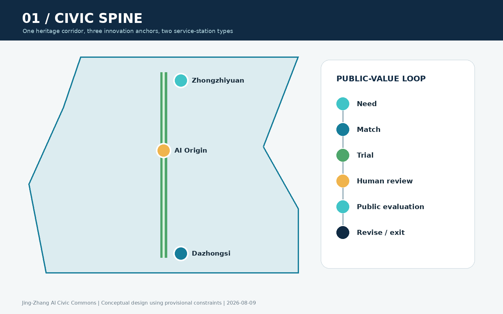
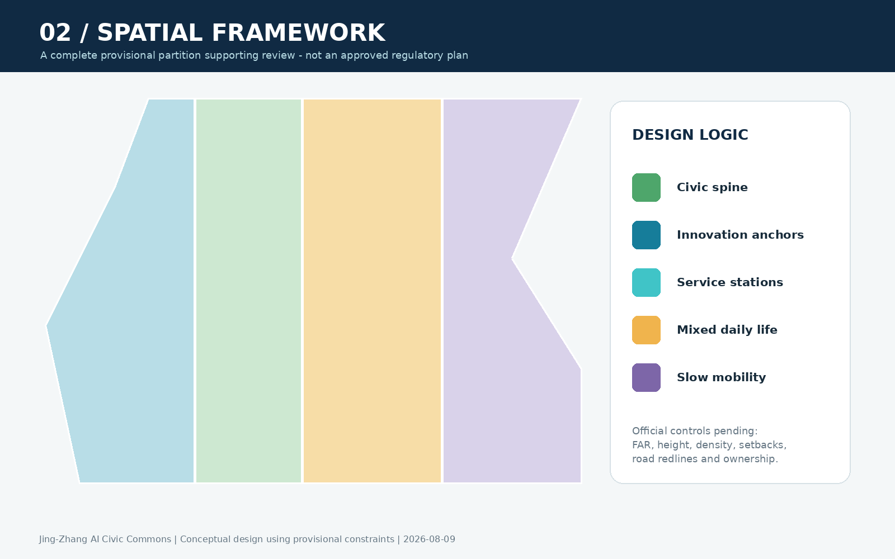
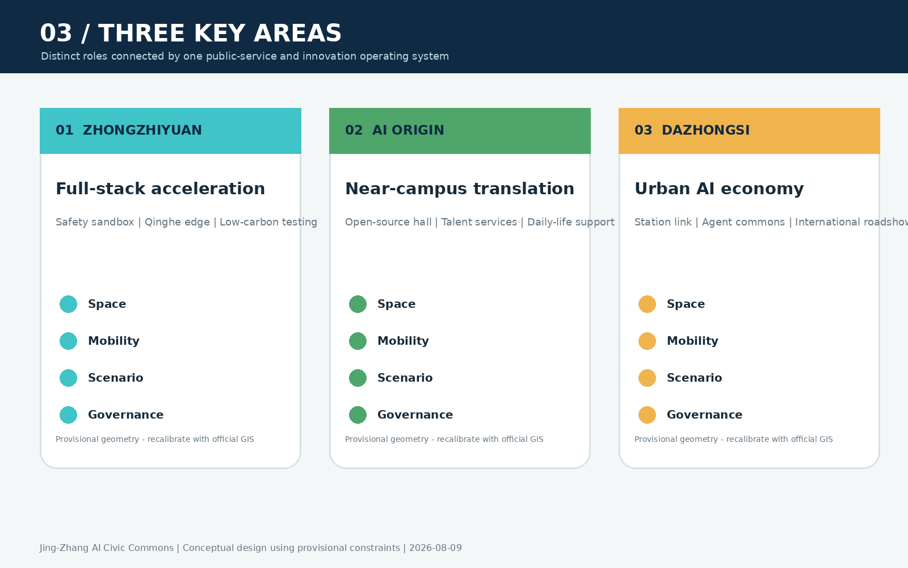
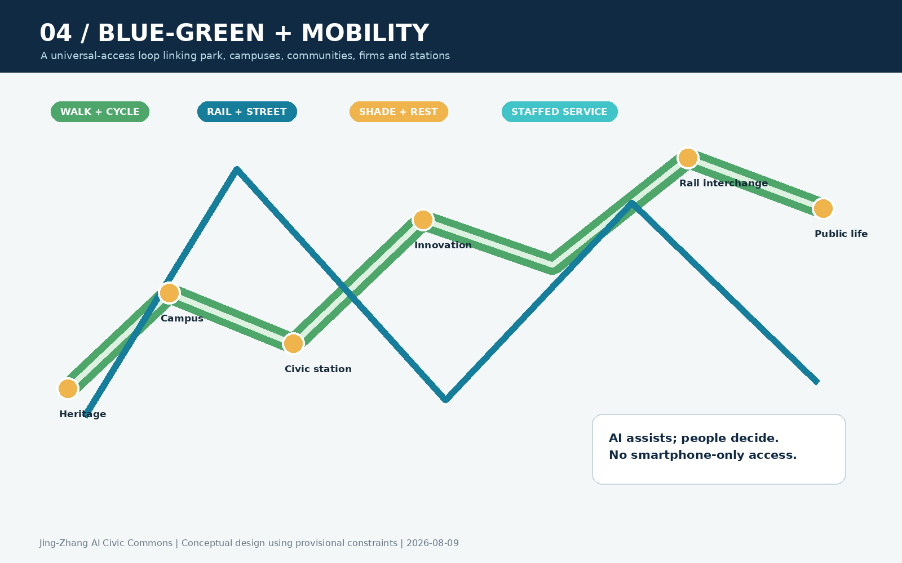
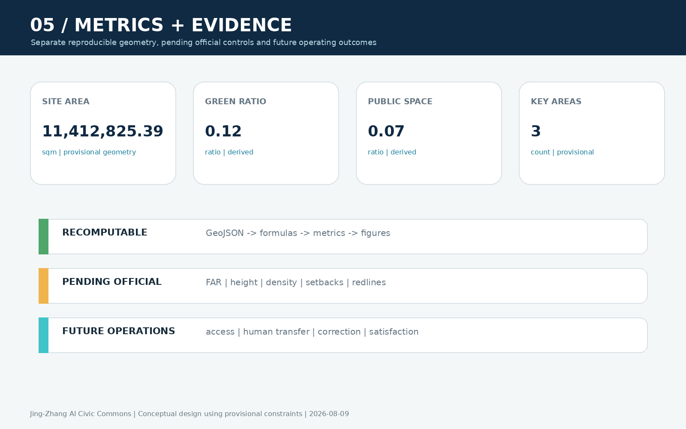

# Jing-Zhang AI Civic Commons

> Core judgement: a world-class AI innovation belt must accelerate technology, talent and enterprise while also allowing residents, founders, visitors and public-service workers to share its benefits safely and at low cost. The proposal treats AI as accountable civic infrastructure, not spectacle, and retains an in-person service channel at every critical touchpoint.

## Design Basis and Source List

The proposal follows the official open-call announcement, the cleared Agent taskbook, repository standards and the registered public-data workflow. The official text establishes the three planning scopes and required tasks, while the repository's rough polygons are used only for temporary generation and visual review [source:OFFICIAL-ANNOUNCEMENT] [source:AGENT-TASKBOOK]. Geometry, metrics and matrices remain the machine-audit layer; this document explains design intent and consequences for people. The exact official boundary, parcel controls, ownership, utility capacity, heritage controls and road redlines are still pending. All precision-sensitive calculations must therefore be repeated when cleared official files become available [data:geometry/site_boundary.geojson#SITE-001] [depth:existing_conditions_diagnosis].

## Three-Level Scope Framework

The 43.6-square-kilometre coordinated research area frames industry, talent and future-city strategy; the approximately 11.4-square-kilometre overall design area organizes renewal, mobility, public space and facilities; and three key areas totalling 368.4 hectares test detailed implementation. The spatial idea is one civic spine, three innovation anchors, two service-station types, ten co-tested scenarios and a blue-green slow-mobility loop. Enterprise and talent stations provide policy, incubation and technology services; civic-life stations provide inclusive guidance, neighborhood support and visitor orientation. These are conceptual service typologies rather than approved facilities [standard:PROJECT-OFFICIAL-ANNOUNCEMENT] [depth:three_level_scope_framework].

## Coordinated Research Area: Industry and Future City Research

The strategic loop links university invention, open-source collaboration, enterprise translation, public testing and global communication. Five functions - full-stack innovation, a world-class ecosystem, AI+ scenario enablement, an intelligent and lively city, and global governance dialogue - are distributed across the three areas and two wings. Relevant precedents include Station F for founder services, 22@Barcelona for mixed urban innovation, Toronto's MaRS for research translation, Singapore's living-lab approach, Seoul's digital civic services, Boston Kendall Square's university-industry interface and Shenzhen's rapid prototype ecosystem. Their transferable lesson is institutional proximity and shared service infrastructure, not copying architectural forms [source:AGENT-TASKBOOK] [standard:PROJECT-AGENT-OPEN-CALL-TASKBOOK].

The identity “Jing-Zhang AI Civic Commons” combines railway heritage with a contemporary promise of shared intelligence. A proposed visual mark joins a rail line, an open bracket and a human-scale node. It may guide wayfinding, event routes and service stations after professional copyright review. Annual developer weeks, public scenario reviews and an open contribution ledger can turn the identity into a long-term community asset rather than a temporary campaign.

## Overall Design Area: Urban Renewal and Regulatory-Plan-Level Urban Design

The overall area is organized as a continuous heritage-and-service spine with cross-connections to campuses, neighborhoods, firms and rail stations. Existing buildings should be retained and adapted by default; demolition or new construction requires verified structural, ownership, heritage and regulatory evidence. Ground floors near the spine are prioritized for shared labs, founder services, affordable daily amenities and public-service interfaces. Land-use geometry is a complete provisional partition for review, not an approved plan [data:geometry/land_use.geojson#LU-001] [depth:land_use_layout].

Mobility actions focus on slow-movement continuity, station interchange, safe crossings and universal access. Municipal proposals include reservable edge-compute points, distributed energy monitoring and resilient public Wi-Fi, all subject to security, energy and engineering review. Floor-area ratio, height, density, setbacks and road redlines remain pending official controls; the proposal does not invent substitutes [standard:MOHURD-CONTROL-DETAILED-PLANNING] [metric:building_footprint_area_sqm].

## Detailed Design of Key Areas

Zhongzhiyuan is conceived as a garden-based full-stack acceleration district. A Qinghe innovation edge combines low-carbon landscape, standards workshops, safety-governance demonstrations and shared testing. Beijing AI Origin Community becomes a near-campus translation neighborhood, linking open-source release space, talent services, affordable daily life and campus-park walking connections. Dazhongsi becomes an urban AI economy and international exchange district organized around station access, four-quadrant pedestrian continuity, demonstration retail and a public roadshow hall [data:geometry/key_areas.geojson#PROV-KEY-001] [data:geometry/key_areas.geojson#PROV-KEY-002] [data:geometry/key_areas.geojson#PROV-KEY-003].

Each area combines positioning, spatial structure, adaptive reuse, mobility, public space, scenarios and implementation risks. The polygons are provisional constraints and cannot decide parcel demolition, building scale or official redlines. The detailed schemes are reference material for later professional teams and must be recalibrated after official GIS, regulatory, utility and ownership information is cleared [depth:three_key_area_detailed_design].

## AI Innovation Ecosystem, Personas, and AI+ Scenarios

Six primary personas guide the design: open-source developers, startup teams, established-company visitors, surrounding residents, university communities, and older or disabled users. Ten scenario cards include an open-source release hall, safety sandbox, edge-compute station, explainable walking guidance, international roadshow hall, Qinghe low-carbon corridor, university translation street, data-governance lounge, AI daily-service street and global AI event route. Three industrial tests focus on model safety, low-carbon computing and compliant data collaboration [data:geometry/public_space.geojson#PUBLIC-001] [metric:public_space_ratio].

Every scenario follows a governance loop: need identification, small-scale match, time-limited trial, human review, public evaluation and revision or exit. Critical services never require a smartphone as the only entrance. Personal traces are not published, and aggregated dashboards disclose service volume, human-transfer rate, corrections and suspensions. AI may recommend, translate or detect operational risks, but people retain decision authority.

## Land Use, Building Scale, and Retain-Renovate-Demolish Strategy

The land-use layer is a topology-safe provisional partition using nationally recognized terminology. Buildings are treated through a retain-first sequence: retain sound and culturally valuable fabric; adapt suitable structures for shared services; renew only after evidence review; and consider new construction where public value and formal controls support it. The current building layer is design evidence, not a survey [standard:MNR-LAND-USE-CLASSIFICATION-GUIDE] [data:geometry/buildings.geojson#BLDG-001].

Official floor area, building height, density, green ratio and setback conditions are unavailable. Consequently, the proposal records these indicators as pending rather than presenting artificial precision. A later professional phase must verify structure, fire access, utilities, daylight, heritage, ownership and lifecycle carbon before any retain-renovate-demolish decision [depth:retain_renovate_demolish] [depth:development_intensity_controls].

## Transport, Rail, Municipal Infrastructure, and Public Services

The mobility strategy prioritizes a continuous north-south heritage path, east-west campus and neighborhood links, station interchange, bicycle parking, safer crossings and barrier-free rest points. AI walking guidance may identify interruptions and crowding only with minimal, aggregated data and visible human oversight. Road geometry expresses a conceptual network inside the provisional boundary; it does not replace official redlines or traffic engineering [data:geometry/roads.geojson#ROAD-001] [depth:traffic_rail_slow_parking].

Public-service stations combine enterprise guidance, founder support, employment assistance, cultural interpretation and accessible neighborhood help. Edge computing, distributed energy and sensing are modular options subject to cyber-security, utility, flood, fire and operating-capacity review. The design retains staffed counters or scheduled human assistance for consequential services [depth:municipal_new_infrastructure] [data:geometry/constraints.geojson#CONSTRAINTS].

## Blue-Green Network, Public Space, and Urban Character

The Jing-Zhang Heritage Park is treated as everyday civic infrastructure. The proposal connects Qinghe, Xiaoyuehe, campuses, communities, enterprises and stations through walking, cycling, shade, seating and activity nodes. Green and public-space geometry supports a connected concept while awaiting official ecological, flood and ownership constraints [data:geometry/green_space.geojson#GREEN-001] [data:geometry/public_space.geojson#PUBLIC-001] [depth:blue_green_public_space].

Urban character combines railway heritage, Zhongguancun innovation culture and a responsible AI culture. Three pilgrimage landmarks are proposed: an AI Origin contribution wall, a Full-Stack Safety Forum and a Dazhongsi Global Agent Commons. They are honor-display and learning nodes, not monumental objects or approved projects. Wayfinding, public art, corporate marks and historical imagery require rights review before public deployment [standard:MOHURD-URBAN-DESIGN-MEASURES].

## Renewal Projects, Implementation Policy, and Phasing

Six priority projects structure implementation: repair slow-mobility gaps, shape the Zhongzhiyuan-Qinghe innovation edge, create the Origin translation street, improve Dazhongsi station's four-quadrant walking network, pilot staffed AI service and edge-compute points, and test a global AI event route. Phase 1 uses reversible wayfinding, service pilots and public evaluation; Phase 2 advances adaptive reuse and station-area public space after formal verification; Phase 3 establishes durable governance, community operation and international exchange [data:geometry/phasing.geojson#PHASE-001] [depth:phasing_implementation].

Policy recommendations include a scenario application and exit protocol, shared service procurement, public-interest evaluation, accessible service standards and an auditable contribution ledger. Funding, ownership, operating bodies and approvals are dependencies, not commitments. Each project must publish responsible parties, evidence requirements, evaluation indicators and stop conditions before implementation [depth:renewal_project_list].

## Metrics, Area Recalculation, and Compliance Matrix

Known geometric metrics include the submitted provisional site area, land-use partition, building footprint, green and public-space ratios and phasing coverage. Their formulas and source files are recorded in `metrics.json`; official planning controls remain unknown. The primary performance measures for service pilots are accessibility, human-transfer rate, correction rate, satisfaction across user groups, scenario suspension rate and reuse of shared facilities. These operational indicators require future collection and are not official planning targets [metric:site_area_sqm] [metric:green_ratio] [depth:metrics_recalculation].

The compliance, standards and design-depth matrices connect every requirement to narrative, geometry, metrics, drawings and assumptions. A successful intake check demonstrates internal package consistency, not official approval or engineering feasibility. Replacement of provisional polygons triggers recalculation of every dependent layer, metric and figure.

## Risk, Copyright, and Compliance

Major open issues are the official boundary and key-area polygons, regulatory controls, parcel and building surveys, ownership, transport engineering, utilities, flood and fire conditions, heritage controls, implementation bodies and funding. The proposal clearly distinguishes public evidence, provisional constraints, design suggestions and pending professional confirmation [depth:risk_missing_data] [source:SITE-PACKAGE].

All original diagrams and text are generated for this submission from cleared repository material. No commercial map tiles, remote fonts, trackers, private records or unlicensed images are embedded. The proposal claims neither official approval nor guaranteed implementation. AI supports analysis and service recommendations; human professionals, public authorities and communities retain final judgement.

## References

Primary references are the official announcement, the cleared Agent taskbook, the repository source registry, local professional-standard snapshots and the machine-audit files included in this package. Full publisher, access-date, reuse and limitation records are maintained in `sources.json` [source:SOURCE-REGISTRY] [standard:PROJECT-AGENT-OPEN-CALL-TASKBOOK].
