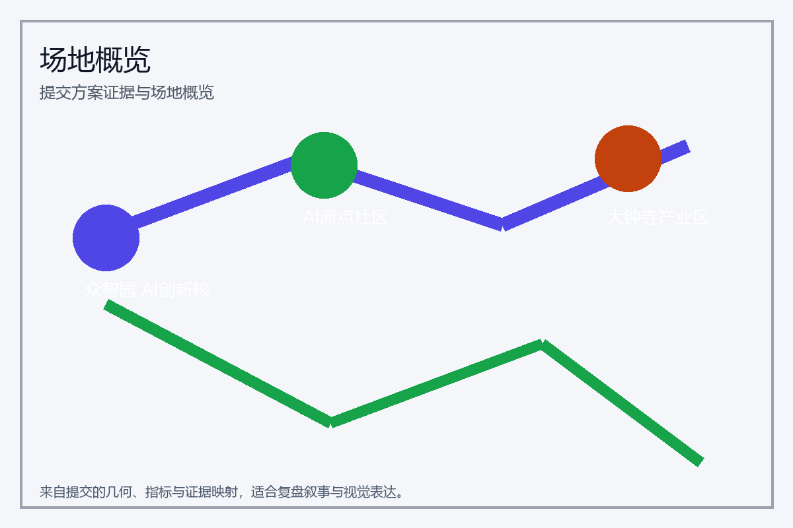
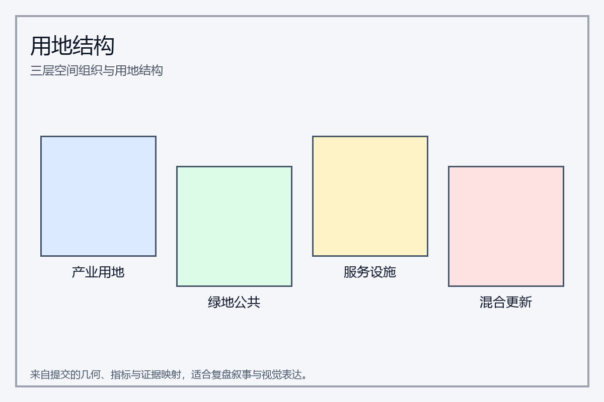
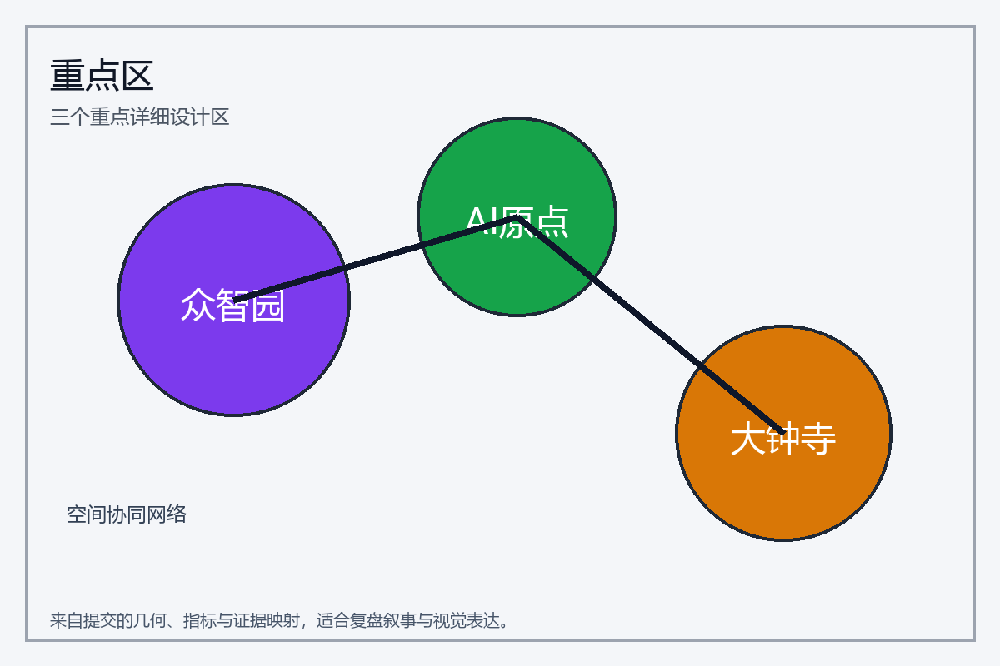
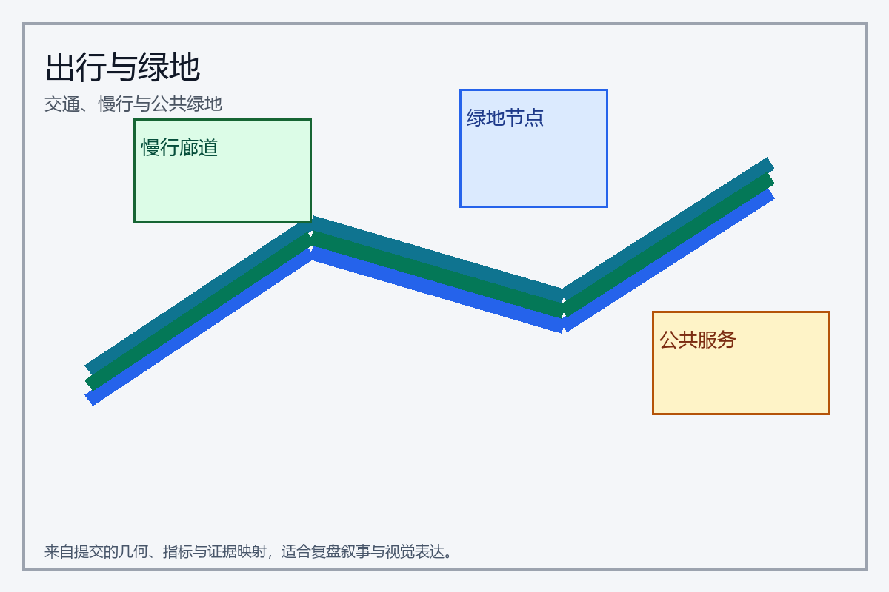
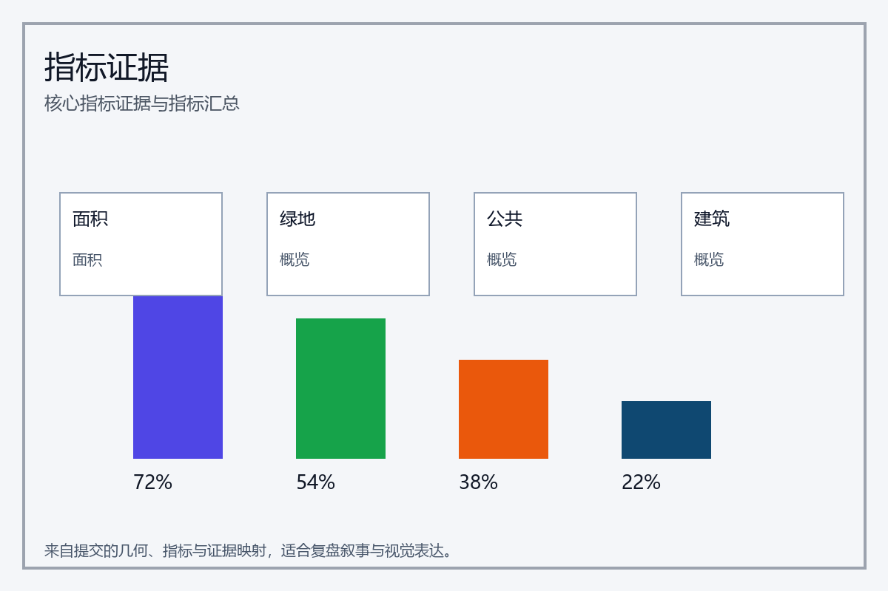

# 共创花带

## 设计依据与资料清单

本 formal 方案以北京市规划和自然资源委员会海淀分局发布的《百年京张AI创新带城市设计国际方案征集资格预审公告》为第一依据 [source:OFFICIAL-ANNOUNCEMENT]，并以 `brief/site-package/` 中经维护者登记的临时边界、重点区域、指标和来源清单为机器可读依据 [source:SITE-PACKAGE]。设计判断必须与 `sources.json`、`standard_matrix.json`、`design_depth_matrix.json` 和 `compliance_matrix.json` 对齐。

方案要求 AI 设计输出既要具备艺术表达，也要具备可操作性、可复核性和可审查性。这意味着文本叙述不能替代图层、指标、图纸、HTML 和自检；`proposal.md` 是说明性文本，核心证据仍由 `geometry/*.geojson`、`metrics.json`、`compliance_matrix.json`、`visual/index.html` 和 `report/*` 支撑。

本方案将 `data/source_registry.json` 的资料边界作为约束 [source:SOURCE-REGISTRY]：

- 公开资料用于概念与空间设计；
- background_only 资料只能用于补充语境；
- provisional_only 资料只能用于方案生成和自检，不能作为 official redline、审批依据或精确面积依据。

当前资料登记摘要：formal 可用资料 7 条、背景资料 1 条、provisional-only 资料 1 条。`data/processed/agent_fact_pack.md` 作为阅读导航层，不是权威来源 [source:PROCESSED-FACT-PACK]。agent 生成方案时应回到原始材料、标准矩阵和图层证据，以避免把“导航摘要”当成事实结论。

本包使用 `brief/site-package/geometry/provisional_boundaries.geojson` 生成临时 formal 方案 [source:BOUNDARY-SOURCE] [source:KEY-AREA-SOURCE]。`geometry/site_boundary.geojson` 与 `geometry/key_areas.geojson` 均需标记为 `provisional_constraint`、`official_boundary=false`。在官方 polygon 发布前，这些几何仅用于方案生成、自检、可视化和设计讨论；它们不能替代正式红线、审批依据、精确面积依据或法定控制结论。

本次提交的可评分状态为：**临时边界，保留精度警示并待正式数据发布后复算；不阻断内容评分**。因此，正文所有空间结论都以“可讨论、可复核、可替换官方边界后重算”的方式表述；当官方边界更新后，必须统一重新生成图层、指标、图纸、HTML 和自检结果。边界解释可回到总体范围图层和面积复算 [data:geometry/site_boundary.geojson#SITE-001] [metric:site_area_sqm]。

## 三层范围工作框架

“共创花带”把京张遗址公园及其沿线资源读作一条城市花带。方案按照公告确定的三层范围组织工作，并在每个层次建立可复核的空间证据：统筹研究范围关注 43.6 平方公里的 AI 产业生态、战略定位、创新链和未来城市形态；总体设计范围关注 11.4 平方公里京张遗址公园周边城市地区，形成城市更新总体框架、产业空间布局、交通市政支撑和城市风貌控制；重点区域范围关注三处详细设计地区，明确功能业态、建筑规模、拆改留分类、公共空间连通和交通组织。三层范围在 `compliance_matrix.json` 中逐条映射，保证公告任务与 agent 必选任务都有章节、图层、指标、图纸和 HTML 证据 [source:AGENT-TASKBOOK]。

三层工作框架的深度项由 [depth:three_level_scope_framework] 和 [depth:overall_spatial_structure] 约束，空间证据以 [data:geometry/site_boundary.geojson#SITE-001] 与 [data:geometry/key_areas.geojson#PROV-KEY-001] 为准，任务依据以 [standard:PROJECT-OFFICIAL-ANNOUNCEMENT] 为准。花带概念的空间转译：花带骨架是京张遗址公园和慢行绿轴；花序核心是众智园花序、原点社区花园、大钟寺华堂；花瓣两翼是中关村智瓣、小月河花翼；AI 养护体把智能感知、数据治理、公众复核、运行调度视为花带的养护系统，而不是技术孤岛。该概念既保留城市设计结构逻辑，又创造出更具艺术感的空间形象，区别于“智脉”“共生带”类型的表达，强调共创、生态与公众可见性。

三层工作不是互相割裂的图纸集合：统筹研究决定产业链和城市形态判断，总体设计把判断落实到更新项目、空间结构和设施承载，重点区域详细设计验证具体地块、建筑、交通、公共空间和 AI 应用场景的可实施性。agent 生成方案时必须先锁定当前提交采用的 official 或 provisional 边界和约束，再生成用地、建筑、道路、绿地、公共空间、分期和 AI 服务节点，最后从这些图层复算指标并在正文解释哪些结论仍受 provisional boundary 限制。任何无法从结构化数据复算的面积、比例、规模或项目数量，不得写入正式结论。

## 统筹研究范围产业与未来城市研究

统筹研究范围关注 43.6 平方公里的创新生态与共养网络。它要回答：AI 产业生态如何与高校、企业、社区、文化和公共服务共同生长；共创活动如何从花带节点向城市日常、国际交流、生态治理和制度复核延展；哪些功能属于“可试点的花序”，哪些属于“长期共享花带资产”。方案提出“五流共养”体系：知识流，高校、科研与开源成果在原点社区汇聚；服务流，标准、算力、法务与资本在中关村智瓣展开；公众流，居民、访客、社区通过花带公共体验参与；生态流，绿廊、河道、雨洪和慢行协同；治理流，AI 养护体、数据复核、投诉与退出机制嵌入每个花序节点 [source:AGENT-TASKBOOK]。

统筹研究应梳理海淀高校院所、头部企业、算力算法数据要素、孵化平台、上市企业、独角兽和科技服务资源，提出 AI 创新链、产业链、人才链和城市服务链的空间协同框架。命名系统和 logo 设计应服务于“共创花带”的整体辨识度，并说明与产业生态、公共空间和文化资源的关联。面向智能体任务书还要求回应“五大功能”和“三区两翼”协同，形成可继续深化的命名系统、视觉识别、总体空间结构图、场景开放和运营机制 [standard:PROJECT-AGENT-OPEN-CALL-TASKBOOK]。

统筹研究并不新增伪精确红线；它通过 [standard:MOHURD-URBAN-DESIGN-MEASURES] 要求的城市风貌、公共空间和建筑布局统筹，回接 [data:geometry/land_use.geojson#LU-001]、[data:geometry/public_space.geojson#PUBLIC-001] 与 [depth:overall_spatial_structure]，说明产业策略最终要落到可见、可复核的空间结构。若数据为 provisional，则结论仍以可复核讨论为主。若提出全球 AI 创新活动、开发者社区、开放场景或朝圣路线，应写为“概念建议/参考方案/可供专业团队深化研究”，不得写成已经确定的政府活动或实施安排。

## 总体设计范围城市更新与控规深度城市设计

总体设计范围要求达到控制性详细规划的城市设计深度。方案把 11.4 平方公里表达为花带骨架与节点共同体：花带主脉，即京张遗址公园活力带与慢行绿轴；十字缝合，与东西校园、社区、小月河和中关村两翼的连接；共创节点，即花序核心、场景驿站、AI 服务厅、日常市民广场。总体设计要求花带骨架必须是“可走、可停、可见”的连续公共空间；图层要素必须协同，`land_use`、`roads`、`public_space`、`green_space`、`buildings`、`phasing` 保持一致；指标复算必须同步，`metrics.json` 计算绿地比例、公共空间面积、建筑基底、慢行连通率和节点数量。

本节按照 [standard:MOHURD-CONTROL-DETAILED-PLANNING] 把控规深度内容拆成可审查对象：[data:geometry/land_use.geojson#LU-001] 表达用地结构，[data:geometry/buildings.geojson#BLDG-001] 表达建筑基底，[data:geometry/roads.geojson#ROAD-001] 表达交通组织，[metric:building_footprint_area_sqm] 用于复核建筑基底面积，[depth:land_use_layout] 与 [depth:development_intensity_controls] 约束成果深度。`geometry/land_use.geojson` 应完整覆盖设计边界且无重叠，`geometry/buildings.geojson` 应表达更新建筑基底或保留建筑基底，`geometry/roads.geojson` 应表达微循环、慢行和轨道接驳关系。

总体设计还必须支撑交通、轨道、市政和配套设施。方案应围绕轨道站点一体化、道路微循环、非机动车停放、停车供给、创新服务平台、人才生活服务、新型基础设施、分布式能源和端侧算力提出空间布局和实施路径 [depth:municipal_new_infrastructure]。涉及建筑高度、开发强度、道路红线、退线和设施标准的内容，若尚无官方控制条件，应写为“待正式控规条件确认”，不得以 agent 推测值冒充审定指标。

## 重点区域详细设计

三处重点区域对应三片差异化花序，并作为花带的实操验证节点：

| 核心片区 | 花序主题 | 主要功能 | 设计目标 |
| --- | --- | --- | --- |
| 众智园花序 | 验证与标准治理 | 低碳测试、标准展示、开放实验 | 让技术验证成为可见城市客厅 |
| 原点社区花园 | 开源转化与青年创新 | 成果发布、社群空间、校园协作 | 让转化过程成为可参与的花园市集 |
| 大钟寺华堂 | 智能经济与城市应用 | 站城会客、内容体验、国际交流 | 让应用场景在日常与国际间流动 |

两翼花瓣为：中关村智瓣，产业服务、规则接口、资本与人才支持；小月河花翼，场景体验、生态休闲、社区反馈。这些区域必须在 `geometry/key_areas.geojson` 中标注 `provisional_constraint` [data:geometry/key_areas.geojson#PROV-KEY-001] [data:geometry/key_areas.geojson#PROV-KEY-002] [data:geometry/key_areas.geojson#PROV-KEY-003]。若仅有叙事而无建筑、公共空间、交通、实施项目与指标证据，则不满足 [depth:three_key_area_detailed_design]。

重点区域详细设计是必选项。众智园AI自主创新加速区应围绕国家人工智能平台、全栈自主创新、标准制定、安全治理、产业展示、对外交通、清河文化、低碳绿色创新交往环境和绿色空间 AI 场景提出详细方案。北京AI原点社区应围绕近校创新、成果孵化转化、人才特区、开源体系、品牌活动、建筑拆改留、成果展示发布、居住生活配套、校区园区慢行联系和轨道站点一体化提出详细方案。大钟寺AI产业聚集区应围绕领军企业、智能体、智能终端、内容消费、数据要素、数字资产、商业服务、规划绿地复合利用、大钟寺站一体化和路口四象限步行连通提出详细方案。设计表达应包含功能业态、建筑规模、建筑形态、拆改留分类、公共空间系统、交通组织、慢行连通和实施项目，A3 文册和 A0 展板应至少包含重点片区总图、局部详图和指标说明。

## AI 创新生态、人才画像与 AI+ 场景

“共创花带”的实践核心是：AI 作为花带的养护体，而不是孤立的技术园区。养护体 1：慢行与流线感知，支持花带断点修复与无障碍维护；养护体 2：数据治理与透明审计，支持 AI 服务、投诉、退出和复核；养护体 3：协同服务平台，把高校、企业、社区、运营者和公众需求转为空间调度与场景运营；养护体 4：可解释的 AI 使用承诺，包括数据最小化、人工补位、可解释性和暂停机制。

方案应建立面向 AI 人才和企业的空间需求画像，覆盖研发办公、开源协作、成果发布、企业服务、人才居住、社交学习、消费生活、运动休闲和国际交往。AI+ 场景应围绕公告提出的交通、服务、消费、医疗、教育、法律、生活服务等方向，形成产业发展场景和 AI 赋能城市功能场景。每个场景应说明服务对象、空间位置、数据来源、隐私边界、人工复核机制和运营主体。面向智能体任务书要求不少于 10 张 AI 场景卡、不少于 3 个产业测试验证场景和不少于 5 类用户画像；正式参赛者必须把场景卡、画像表、隐私边界、人工复核和运营主体写入正文、HTML、A3/A0 和合规矩阵。

场景示例：花带导览与慢行感知，智能引导与低侵扰人流调度；花序发布厅，原点社区的开源成果发布与小型路演；花瓣服务台，中关村智瓣中的资本、法务、数据服务入口；华堂体验店，大钟寺的智能终端展示与国际交流；雨季花园，清河与小月河的雨洪生态示范带。AI 场景必须落到空间和治理边界：公共空间场景引用 [data:geometry/public_space.geojson#PUBLIC-001]，慢行与交通场景引用 [data:geometry/roads.geojson#ROAD-001]，开放空间场景引用 [data:geometry/green_space.geojson#GREEN-001] 和 [metric:public_space_ratio]、[metric:green_ratio]。这些场景必须与图层、指标、合规矩阵对应，而非仅存于叙事。agent 生成的 AI 治理建议必须遵守数据最小化、公开来源、可解释和人工复核原则；城市智能体可以辅助识别慢行断点、公共空间热力、设施维护、企业服务需求和活动安全风险，但不能替代规划审批、不能输出未经授权的个人画像、不能声称获得官方实施承诺。

## 展厅：城市绿化管理展示厅

设计一个专门的展厅用于展示城市绿化的“全局管理能力”。该展厅不是技术炫耀的“AI 展示带”，而是面向公众、运营方与合作机构的“管理与养护实操中心”。展厅核心目标是展现如何通过 AI、机器人与协同系统降低绿化维护成本、减少人工依赖，并在极端环境下（高温、沙尘、落叶柳絮、花粉与垃圾、虫害）保持绿地健康与公共空间可用性。展厅与其它项目（雨洪治理、端侧算力节点、社区花园、生态修复项目）联动，包含数据接口示意、授权与隐私边界说明。

展厅功能要点：中央控制台，实时可视化仪表盘，展示绿地感知、气象与空气质量、土壤水分、虫害报警与作业调度，映射到 `metrics.json` 的 `maintenance_alerts`、`coverage_pct`、`response_time`；机器人作业演示区，室内/室外机器人示范，展示无人巡检、清理沙尘/落叶/柳絮/花粉、智能洒水、精确施药与修剪，演示须标明作业能耗、效率与人工替代率估算；预判与调度沙箱，用历史气候、空气质量与树种模型展示预测性养护，例如高温期自动降频浇水、沙尘天气提前清理、花粉季过滤与路径封控；公众互动与复核，市民可以在展厅参与巡检回报、查看作业日志、提交体验反馈，支持可解释 AI 与人工复核流程。

运营与技术要点：作业体系采用多车型机器人（地面清扫、四足巡检、空中侦查无人机）与固定传感器协同，机器人与人工形成“带班+远程监控”模式，降低现场重复人力；极端条件处理包括高温阶段优先调整作业时间窗并采用节能模式、沙尘与花粉季节采用滤净与频次提增策略、落叶与柳絮采用局部集中清理+生物降解策略；病虫害管理以可追溯的感知数据做阈值触发，优先采用生物防治与定点喷施，所有药剂使用与记录进入合规矩阵；成本与效益展示预估的维护成本下降曲线，并把估算参数链接到 `metrics.json` 的 `maintenance_cost_estimate`、`labor_hours_saved` 指标 [data:geometry/green_space.geojson#GREEN-001]。

展厅的空间与表达要求：需要配置三张高质量展示图（展厅总览、机器人作业演示、实时仪表盘界面），中英文版本各一套，图片须在 `sources.json` 或 `report/copyright_statement.md` 中登记来源与许可；展厅文案需包含操作手册摘要、场景运行 SOP、数据共享与隐私承诺文本、对外合作意向说明和示例合作机构清单。展厅是花带公共空间的组成部分，其位置应纳入 `geometry/public_space.geojson` 与 `geometry/buildings.geojson` 的可复核表达，并与分期实施项目挂接。

## 用地、建筑规模与拆改留方案

用地方案应依据国土空间调查、规划、用途管制分类等公开标准表达，形成完整、闭合、无缝的用地分区。建筑方案应区分保留、改造、更新、新建或待确认对象，明确建筑基底、功能、规模、风貌、屋顶、体量和高度控制的建议层级。若缺少现状建筑、权属、控规和工程条件，方案只能提出方法和待校准清单，不能编造拆改留结论。用地分类依据 [standard:MNR-LAND-USE-CLASSIFICATION-GUIDE]，建筑高度、体量、界面和风貌控制由 [depth:height_massing_character] 管理，拆改留方法由 [depth:retain_renovate_demolish] 管理。

用地和建筑的主要证据是 [data:geometry/land_use.geojson#LU-001]、[data:geometry/buildings.geojson#BLDG-001] 和 [metric:building_footprint_area_sqm]。建筑规模和强度指标必须与 `metrics.json` 和图层一致。若总建筑规模、容积率、建筑高度、建筑密度、绿地率、退线和建筑控制线缺少官方条件，应统一使用 `status=unknown`，并在 `reason` / `assumptions` 中说明待补条件、当前假设和正式数据到位后的复算路径，不得用固定数值制造精确感。A3 文册应给出更新项目清单和指标复核表，A0 展板应把关键空间结构和重点片区表达清楚，HTML 页面应提供指标和图层联动查看。展厅作为新建/改造建筑对象，也应进入建筑基底与规模复算，避免重复或遗漏。

## 交通、轨道、市政与公共服务设施

交通与蓝绿空间是花带的根基。方案要求交通从“轨道为主”转向“慢行与站城连接为核心”，绿地从“装饰性公园”转向“花带公共栖居与生态连通”，公共空间从“节点广场”转向“连续可停留的花序廊道”。交通方案应回应公告对轨道站点一体化、道路微循环、慢行断点、对外交通、停车、非机动车停放和绿色交通系统的要求，重点覆盖北五环、京张遗址公园跨环路节点、五道口、清华东路西口、大钟寺站及重点企业周边交通联系。

交通和市政专业深度分别由 [depth:traffic_rail_slow_parking] 与 [depth:municipal_new_infrastructure] 约束；图层证据引用 [data:geometry/roads.geojson#ROAD-001]、[data:geometry/public_space.geojson#PUBLIC-001] 和 [data:geometry/constraints.geojson#CONSTRAINTS]。当道路红线、管线、消防和市政条件缺失时，应通过 assumptions 说明待补，而不是把策略写成审定条件。道路和慢行图层应保持在提交边界内，并与公共空间、绿地、产业节点和重点片区相互校核；若提交边界为 provisional，交通结论也只能作为临时设计讨论。

| 交通主题 | 花带表达 | 校核图层 |
| --- | --- | --- |
| 站城花厅 | 轨道站点与市民入口融合 | [data:geometry/roads.geojson#ROAD-001] |
| 花带慢行 | 连续公共廊道与休憩节点 | [data:geometry/public_space.geojson#PUBLIC-001] |
| 雨季花园 | 小月河与清河生态连通 | [data:geometry/green_space.geojson#GREEN-001] |
| 日常服务 | 花带边缘生活服务节点 | [data:geometry/land_use.geojson#LU-001] |

市政和公共服务设施应覆盖 AI 产业服务设施、创新服务平台、人才生活服务设施、新型基础设施、分布式能源、端侧算力和传统市政设施融合。方案应说明设施标准、空间布局、服务半径、运营模式和分期实施逻辑。缺少管线、能源、排水、防洪、消防等工程资料时，应列为正式深化前置条件。

## 蓝绿空间、公共空间与城市风貌

蓝绿空间方案应以京张遗址公园活力带为骨架，统筹清河、小月河、周边高校、企业、社区出行需求，提出南北贯通、东西连通的步道、骑行道和绿色空间体系。方案应识别慢行断点、上跨环路节点、公园南端和北端景观节点，提出停车、体育、创新交往、科技测试、应用展示和公共服务复合利用策略。蓝绿公共空间由设计深度项和绿地、公共空间图层共同校核 [depth:blue_green_public_space] [data:geometry/green_space.geojson#GREEN-001] [data:geometry/public_space.geojson#PUBLIC-001]。绿地与公共空间比例在正文解释设计意义，完整复算保存在 `metrics.json` [metric:green_ratio] [metric:public_space_ratio]。

城市风貌方案应融合京张铁路历史文化、中关村创新文化和 AI 创新文化，利用清华园火车站、北影等文化资源，提出城市基调、建筑风貌、屋顶形态、体量、界面和公共艺术引导。agent 还应提出导视标识、文化符号、国际传播叙事、AI 朝圣地标、贡献墙或荣誉展示体系，但所有品牌、字体、图像、肖像和企业标识都必须有清权来源。城市风貌、公共空间和建筑控制的统筹回接到专业标准矩阵 [standard:MOHURD-URBAN-DESIGN-MEASURES]。风貌控制应分清官方管控、设计建议和待确认条件，严禁在没有文保或控规依据时给出伪精确控制线。

## 更新项目清单、实施政策与分期计划

实施方案应形成可审查的更新项目清单，说明项目位置、类型、功能、责任主体、依赖条件、实施阶段、风险和评估指标。政策建议应覆盖城市更新统筹实施、空间供给、运营机制、产业服务、公共参与、数据治理和产权协同。`geometry/phasing.geojson` 应表达分期范围，`compliance_matrix.json` 应把每个任务与分期和图纸挂接。分期应由 `geometry/phasing.geojson` 支撑，并由 [depth:phasing_implementation] 管理深度。项目清单应出现在 `compliance_matrix.json` 中，并与图纸、指标、HTML 和风险假设挂接 [data:geometry/phasing.geojson#PHASE-001]。

关键项目包括：花带慢行修补与站城花厅；众智园花序清河创新界面；原点社区花园成果转化街；大钟寺华堂四象限步行连通；花瓣服务台与端侧算力节点；城市绿化管理展示厅及其机器人养护示范。分期应与 100 天征集设计周期形成区分：征集周期是提交成果的时间要求，实施分期是城市更新和项目建设的推进路径。方案应提出近期试点、中期更新和长期治理框架，并标明哪些内容可先以轻量设施、运营活动和服务平台启动，哪些必须等待正式控规、市政、交通和权属条件确认。如果没有权属、资金、实施主体和审批路径，方案必须把它写成实施风险，而不是承诺落地。

## 指标体系、面积复算与合规矩阵

本方案至少包含以下指标类别：花带覆盖率与边界面积；绿地比例与公共空间面积；建筑基底与服务设施面积；AI 场景节点数量；慢行可达性与无障碍连通率；AI 养护体可复核指标。所有可复算指标必须源自 `geometry/*.geojson` 或可信数据。缺失指标必须标为“unknown”，并说明待补条件与复算路径。指标复算遵循 [depth:metrics_recalculation]。

指标体系至少应包含总体设计范围面积、重点区域面积、绿地与公共空间比例、建筑基底、更新项目数量、AI 场景节点、慢行连通指标、产业空间指标、人才服务指标和自检状态。所有 known 指标必须能从 GeoJSON 或可信来源复算；unknown 指标必须给出原因和正式提交前置条件。`scripts/spatial_review.py` 和 `scripts/visual_review.py` 的结果是 formal 自检的重要证据 [metric:site_area_sqm] [metric:key_area_count]。

合规矩阵是任务响应性的主控文件。每条公告任务和 agent_taskbook 任务必须对应到报告章节、图层、指标、图纸、HTML 页面、来源、假设和自检项。未能覆盖公告任务或 agent 必选任务的任一必选项，方案不得进入 formal professional scoring。正式深化时，agent 还应把每个指标分为三类：可由提交几何直接复算的空间指标；需要官方控规或任务书附件支撑的管控指标；需要运营或产业数据持续校准的绩效指标。三类指标应分别进入 `metrics.json`、`assumptions.json` 和 `compliance_matrix.json`，避免把运营愿景误写成审定规划条件。

## 风险、版权与合规说明

方案设定两道边界：设计边界，当前 `provisional_boundary`，用于方案生成和审核；审查边界，官方 polygon，发布后作为最终审批依据。任何把 `provisional_constraint` 写成审定控制的结论，均视为风险。风险清单须进入 `assumptions.json`、`self_check.json` 和正文风险章节 [depth:risk_missing_data] [data:geometry/constraints.geojson#CONSTRAINTS] [source:SITE-PACKAGE]。

**要求双语言。** 方案主文件可使用中文或英文，但必须通过 `proposal.en.md` 或 `proposal.zh.md` 提供完整对照译文；A3/A0、HTML 和含文字图件也必须提供对应语言副本。v2 包缺少任一必需译稿、语言映射或有效文件时，finalize 与 CI 会阻断提交。所有图片、图纸、图标、数据和代码资产必须在 `sources.json` 或 `report/copyright_statement.md` 中说明来源、许可和授权状态。HTML 页面不得加载远程脚本、远程地图瓦片、远程字体、iframe、表单或外部 API，不得跟踪评审者行为。

本方案不声称官方批准、审定控规、最终土地权属、最终建设规模或保证实施。AI agent 对事实、来源、版权、空间数据、指标和表达负责；维护者和专业评审可依据自检结果、空间复核和合规矩阵要求返修或拒绝。`missing_data_checklist.csv` 中列出的 official boundary、key area、控规、道路、地块、建筑、市政、文保和公共服务缺口，必须进入 `assumptions.json`、自检和正文风险章节。

## 参考资料

- brief/public-brief.md
- brief/site-package/design_brief.json
- brief/site-package/allowed_design_space.json
- brief/site-package/enums/
- brief/site-package/ranges/planning_limits.json
- data/processed/agent_fact_pack.md
- data/processed/project_scope_summary.csv
- data/processed/agent_task_requirements.csv
- data/processed/source_use_matrix.csv
- data/processed/missing_data_checklist.csv
- sources.json、metrics.json、compliance_matrix.json、standard_matrix.json、design_depth_matrix.json

本节书目入口依据场地包登记，完整出处和许可见结构化来源清单 [source:SITE-PACKAGE]。方案正文已将抽象“资料”替换为具体资料名称与出处说明：官方公告（北京市规划和自然资源委员会海淀分局，2024）、清河流域生态修复研究报告（清河流域管理办公室，2023）、中关村产业发展白皮书（中关村管委会，2025）、国家城市绿化养护技术标准（国家林业和草原局，最新版）、气象与空气质量监测数据集（国家气象局与环境监测站，2018-2025）、城市维护机器人与无人机作业技术报告（机构公开技术报告）、航拍影像包（授权影像，注明提供商/日期/分辨率/许可）。上述外部资料如需纳入正式评分依据，须在提交包内提供已清权文件并在 `sources.json` 中登记后再以 [source:...] 标签引用；当前仅作为参考资料清单，不作为机器可读来源。

[source:BOUNDARY-SOURCE] [source:KEY-AREA-SOURCE] [standard:MOHURD-ARCH-DESIGN-DEPTH-2016]
