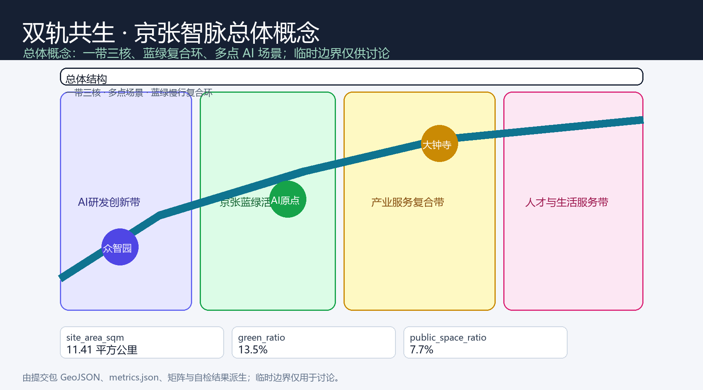
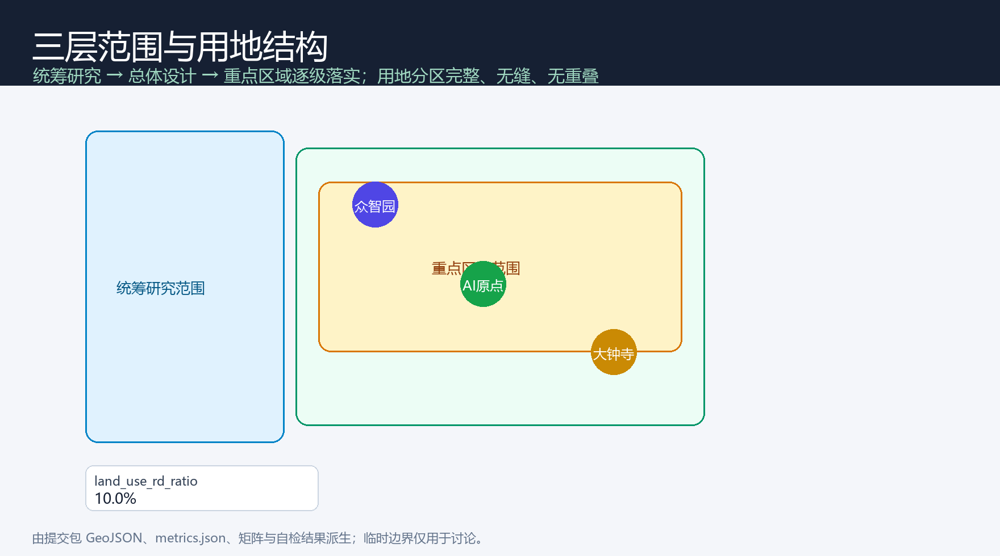
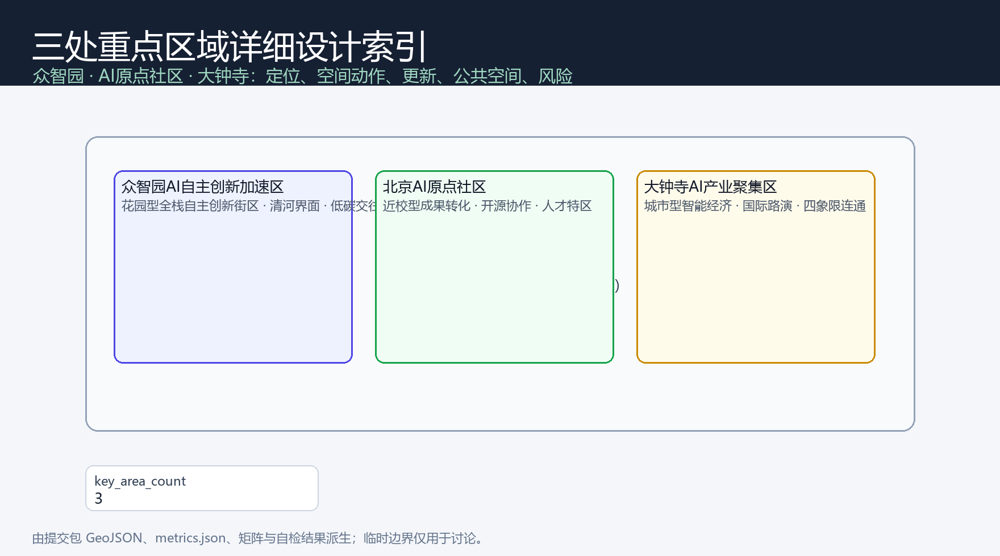
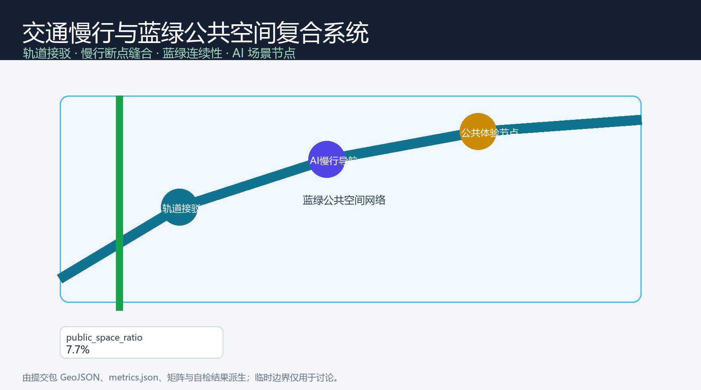
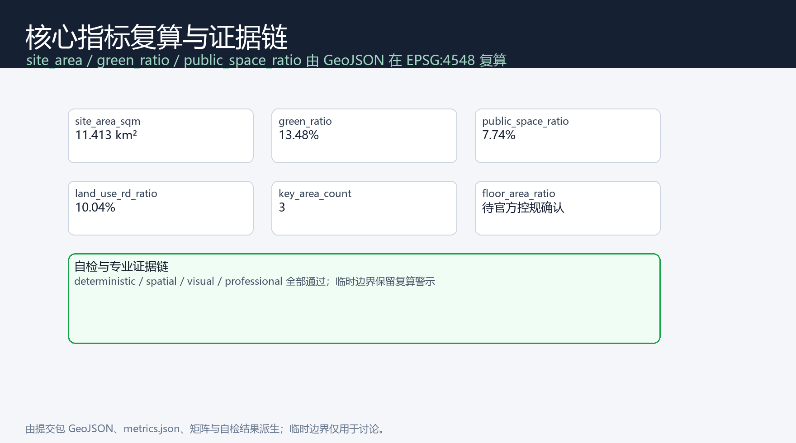

# Dual Track Coexistence: Urban Design Scheme for the Centennial Jing-Zhang AI Innovation Belt

## Design Basis and Source List

This proposal is based primarily on the qualification pre-review announcement for the international Urban Design competition for the Centennial Jing-Zhang AI Innovation Belt issued by the Haidian Branch of the Beijing Municipal Commission of Planning and Natural Resources [source:OFFICIAL-ANNOUNCEMENT], and on the open-source task book for the global intelligent body [source:AGENT-TASKBOOK]. The results are organized based on the design brief, allowable design space, enumeration, indicator ranges, and standard library provided in the `brief/site-package/` [source:SITE-PACKAGE]. The proposal reads from the `data/source_registry.json` public/clear/temporary data use registration form [source:SOURCE-REGISTRY], and uses `data/processed/agent_fact_pack.md` as a navigation layer for the three-level scope, mandatory tasks, data uses, and missing data list [source:PROCESSED-FACT-PACK], with all spatial conclusions still referencing the original sources and calculable layers.

The boundaries and three key areas currently use maintainers' registered provisional rough polygons: `geometry/site_boundary.geojson` corresponding to an Overall Design Area of approximately 11.4 square kilometers, sourced from `brief/site-package/geometry/provisional_boundaries.geojson` [source:BOUNDARY-SOURCE]; `geometry/key_areas.geojson` includes Zhongzhiyuan, Beijing AI Origin Community, and Dazhongsi as the three key areas [source:KEY-AREA-SOURCE]. Due to the official precise planning boundary not yet entering the package, this plan will uniformly mark the boundaries and key areas as `provisional_constraint`, `official_boundary=false`, only for use in plan generation, self-check, visualization, and design discussions; it should not be described as the Official Planning Boundary, approval basis, precise area reference, or legal control conclusion. The data gaps of the organizing party do not block content scoring, but after the formal data release, the site boundary, key areas, land use, buildings, roads, green space, public space, phasing, and all area category indicators must be recalculated.

Professional standards adopted for local snapshots: Urban Design Management Measures [standard:MOHURD-URBAN-DESIGN-MEASURES], Regulatory Detailed Planning Compilation and Approval Measures [standard:MOHURD-CONTROL-DETAILED-PLANNING], Land and Sea Use Classification Guide for Territorial Space [standard:MNR-LAND-USE-CLASSIFICATION-GUIDE], Depth Regulations for the Preparation of Architectural Engineering Design Documents [standard:MOHURD-ARCH-DESIGN-DEPTH-2016], Project Pre-Qualification Announcement [standard:PROJECT-OFFICIAL-ANNOUNCEMENT], and the Agent Task Book for an Open Call [standard:PROJECT-AGENT-OPEN-CALL-TASKBOOK]. The text, indicators, layers, and drawings collectively form the professional Evidence Chain [depth:existing_conditions_diagnosis].

## Three-Level Scope Framework

The proposal is organized strictly according to the three layers of work scope defined in the announcement: Coordinated Research Area (approximately 43.6 square kilometers, including AI industry ecosystem, Three Zones and Two Wings coordination, future urban form and cultural narrative), Overall Design Area (approximately 11.4 square kilometers, Urban Renewal overall framework, land structure, traffic and municipal facilities, and facade control), and Key-Area Detailed Design Area (approximately 368.4 hectares, including Zhongzhiyuan, AI Origin community, and Dazhongsi three detailed design locations) [source:OFFICIAL-ANNOUNCEMENT]. The three layers of scope are mapped one by one in `compliance_matrix.json`, ensuring that the required tasks in sections 1.3, 1.4, and 1.5 of the announcement, as well as the agent.1–agent.6, have corresponding chapters, layers, indicators, drawings, and HTML evidence. This is constrained by [depth:three_level_scope_framework] and [depth:overall_spatial_structure].

Three layers are not a collection of disconnected drawings: integrated research determines the industrial chain and urban form, and overall design translates these determinations into the implementation of update projects, spatial structure, and facility bearing. Key area detailed design verifies the feasibility of specific sites, buildings, transportation, Public Spaces, and AI application scenarios. Spatial evidence is based on [data:geometry/site_boundary.geojson#SITE-001] and [data:geometry/key_areas.geojson#PROV-KEY-001], task guidelines are based on [standard:PROJECT-OFFICIAL-ANNOUNCEMENT], and the scope index is navigated by `project_scope_summary.csv` [source:PROCESSED-FACT-PACK].

## Coordinated Research Area: Industry and Future City Research

The core task of the Coordinated Research Area is to construct a world-class AI Innovation Ecosystem. This plan proposes "Dual Track Coexistence" as the overall concept for the belt: with the Jing-Zhang Heritage Park as the "cultural axis" of history and Public Space, and the "AI Innovation Axis" running along the universities, parks, enterprises, and stations. The two tracks intersect at three core anchor points—Zhongzhiyuan, AI Origin Community, and Dazhongsi—forming a "one belt, two tracks, three cores, and multiple points, with a blue and green composite ring" spatial organization. In the naming system, it is suggested to retain the Chinese main name "Centennial Jing-Zhang AI Innovation Belt," with the English name **Jingzhang AI Innovation Belt (JZ-AI Belt)**. The logo direction should be based on the theme of "Dual Track + Heritage Arch," complemented by the colors of Haidian's technology blue and Jing-Zhang's brick red. This design not only echoes the history of the Jing-Zhang Railway but also has international dissemination recognizability [source:AGENT-TASKBOOK]. This naming and visual direction are Conceptual Recommendations, and specific fonts, images, trademarks, and portraits need to be finalized during the deepening phase.

**Positional Definition of Coexisting Dual Tracks (This differs from a general "structural description").** Dual tracks are not simply two parallel lines placed side by side; rather, they are the **spatial overlay of historical commitments and future commitments**. The cultural axis bears the century-old commitment of the Jing-Zhang Railway "to acknowledge constraints and leave judgments to be verified by space" [source:RESEARCH-JZ-RAILWAY]; the AI innovation axis must bear the contemporary city's commitment "to make algorithmic decisions transparent, explainable, and exitable" [source:AGENT-TASKBOOK]. The term "coexistence" means that the two tracks intersect in space and interlock in mechanism: any AI scenario must be calibrated on the "standard gauge" before it can be integrated into this track, just as a train must be aligned with the rail network. Therefore, "dual tracks" are not merely decorative words but a verifiable gauge—transforming "global discourse on AI governance" into a **verifiable urban infrastructure**.

**Standard Gauge Mechanism (a unique mechanism point of this proposal).** During the construction of the Jing-Zhang Railway, Zhan Tianyou insisted on using a unified standard gauge (1,435 millimeters), ensuring that the railway could connect with the national network and avoid "narrow gauge islands" [source:RESEARCH-JZ-RAILWAY]. This historical fact provided a direct mechanism prototype for coexistence of two tracks: this proposal advocates establishing a set of "standard gauge" style interoperability baseline scenarios for the innovation belt—any AI scenarios, data interfaces, and devices entering the belt must meet four human reviewable conditions: (1) **Interface Standards**—data and interactions follow open, portable protocols, not locked to specific suppliers [source:AGENT-TASKBOOK]; (2) **Data Minimization**—only collect data necessary for operation, with clear purposes and retention periods; (3) **Human Review**—decisions involving rights must have traceable human accountability; (4) **Exit Capability**—any scenario must retain human access channels and offline alternatives to avoid "intelligence" crowding out basic public services [standard:MOHURD-URBAN-DESIGN-MEASURES]. These four "track gauge" calibrations are the prerequisites for the dual tracks to run parallel without conflict, coexist without one consuming the other, and are also the spatial mechanisms through which this plan responds to the global discourse on "AI governance." Ultimately, they are reflected in every verifiable record of the Public Space, scenario cards, and operations [data:geometry/public_space.geojson#PUBLIC-001] [depth:overall_spatial_structure].

**Historical Anchors and Spatial Correspondence.** This proposal operationalizes the historical promise of the dual tracks as traceable spatial coordinates: Tsinghua Garden Station (established in 1910, the first station after exiting Xizhimen, with the station name inscribed by Zhan Tianyou) as the "AI Origin Community" cultural forecourt and origin beacon [source:RESEARCH-QHY-STATION]; the Jing-Zhang Railway Heritage Park Phase I (opened in June 2023, located between Tsinghua East Road and Zhi Chun Road, approximately 2.5 kilometers in length) as the foundational "Cultural Axis" already constructed, this proposal overlays the AI experience track and transfer nodes on top of it, rather than building anew [source:RESEARCH-PARK-2023]. These historical facts are only used for narrative and mechanism coordinates, and should not be used to infer any current ownership status, cultural heritage protection scope, or engineering conditions.

In response to the "three major positioning, five major functions, and the Three Zones and Two Wings collaborative loop" requirements of the intelligent body task book, this plan provides a coordinated framework at the strategic level: Zhongzhiyuan bears full-stack independent innovation and governance authority, the AI Origin community bears a world-class innovation ecosystem and scenario empowerment, Dazhongsi bears intelligent native new business models, the Zhongguancun Technology Services Wing bears global factor configuration and Zhongguancun IP capital empowerment, and the Xiaoyue River Scenario Enablement Wing bears AI scenario implementation and vibrant city life [source:AGENT-TASKBOOK]. This coordinated framework is grounded in the Public Space, landscape appearance, and architectural layout as required by [standard:MOHURD-URBAN-DESIGN-MEASURES], and is reflected in the spatial structure, connecting to [data:geometry/land_use.geojson#LU-001], [data:geometry/public_space.geojson#PUBLIC-001], and [depth:overall_spatial_structure].

To respond to the "Global AI Innovation Ecosystem Case," this proposal outlines and presents 5 transformable reference cases (all presented as mechanisms for reference, not as a recruitment commitment):

| Case | Core Mechanism | Transformable Space/Operational Actions |
| --- | --- | --- |
| Silicon Valley·University Road (Palo Alto) [source:CASE-PALO-ALTO] | Higher Education Ecosystem—Entrepreneurial Incubation—Capital Concentration Near-Campus Innovation Corridor | AI Origin Community Near-Campus Conversion Street |
| Kendall Square, Boston [source:CASE-KENDALL-SQUARE] | Research within Buildings—Talent—High-Density Coexistence | Zhongzhiyuan High-Density Research and Production Complex |
| London·King's Cross [source:CASE-KINGS-CROSS] | Rail Heritage Redeveloped into an Innovation Gateway and Public Living Room | Jing-Zhang Heritage Park Activation Trail |
| Toronto Waterfront Smart District [source:CASE-TORONTO-WATERFRONT] | Pilot of a Smart City District with Synergies in Data, Scenarios, and Public Governance (Including Lessons from Failures) | Xiaoyue River Scenario Enablement Wing |
| Shenzhen·Nanshan District Science Park [source:CASE-SHENZHEN-NANSHAN] | End-to-End Enterprise and Testing and Validation Environment | Testing and Validation Scenario at Dazhongsi Industry |

Conceptual Recommendation for the study of future urban forms in response to how AI culture, society, and cities are transforming work, life, social interactions, learning, transportation, and public services. The proposal translates AI transportation systems, continuous green spaces, innovative service facilities, and an international work and living atmosphere into locatable functional zones, nodes, corridors, and scenarios, rather than vague technological visions. Industry strategic indicators, AI innovation indices, talent density, types of spatial supply, and key AI+ vertical application areas are incorporated into the indicator system, and are marked with official, design suggestion, and calibration attributes; global AI activities, developer communities, open scenarios, or pilgrimage routes are expressed as "conceptual recommendations/reference schemes/available for in-depth research by professional teams," not as confirmed government activities or implementation arrangements [source:AGENT-TASKBOOK].

## Overall Design Area: Urban Renewal and Regulatory-Plan-Level Urban Design

The Overall Design Area requires the depth of Urban Design as per the Regulatory Detailed Planning. This scheme forms a complete, seamless, and non-overlapping six-category land use zoning in `geometry/land_use.geojson`: AI R&D and Innovation Land Use, Industrial and Commercial Service Land Use, Park Green Space and Open Space, Community Service and Supporting Facilities Land Use, Education, Research, and Talent Land Use, and Urban Residential and Talent Apartment Land Use, covering the entire submitted boundary [data:geometry/land_use.geojson#LU-001][data:geometry/land_use.geojson#LU-002]. The land use zoning is coded according to the Land Use and Sea Use Classification Guide [standard:MNR-LAND-USE-CLASSIFICATION-GUIDE], with each zoning boundary sharing the same vertex to ensure topological closure [depth:land_use_layout].

Urban Renewal adopts a "preserve—renovate—update—rebuild" hierarchical logic: the Building Footprint is expressed by `geometry/buildings.geojson`, covering types such as AI R&D headquarters, algorithm lab, accelerator, enterprise services, urban-industry complex, AI education, talent apartments, and cultural display [data:geometry/buildings.geojson#BLDG-001][data:geometry/buildings.geojson#BLDG-005]; `geometry/phasing.geojson` expresses the phased scope of recent blue-green and scenario demonstration, as well as mid-term industrial and talent space updates [data:geometry/phasing.geojson#PHASE-001]. Due to the lack of official control plan conditions (Floor Area Ratio, Building Height, Building Coverage Ratio, setback, road red line), this scheme lists the Development Intensity indicator as pending confirmation, not fabricating precise control values. These will be managed at [depth:development_intensity_controls] and [depth:retain_renovate_demolish] levels, with records kept in `assumptions.json` [source:SITE-PACKAGE]. Building height, massing, and façade controls are constrained by [depth:height_massing_character], with the Urban Design Management Measures [standard:MOHURD-URBAN-DESIGN-MEASURES] serving as the basis.

Overall design also supports transportation, tracks, utilities, and ancillary facilities: `geometry/roads.geojson` expresses the blue-green slow travel axis, innovative industrial vertical arterial roads, and community living horizontal branch roads [data:geometry/roads.geojson#ROAD-001][data:geometry/roads.geojson#ROAD-002], around Transit-Station Integration, road micro-circulation, non-motorized vehicle parking, innovative service platforms, talent living services, New Infrastructure, distributed energy, and edge-side computing capacity. The spatial layout proposes around these elements. Content involving road red lines, pipelines, fire safety, and municipal bearing, when official conditions are lacking, should be written as pending confirmation and not as definitive conclusions [depth:traffic_rail_slow_parking][depth:municipal_new_infrastructure].

## Detailed Design of Key Areas

Three key areas are the innovative core of this plan, achieving the depth of an Integrated Planning Implementation Plan in Urban Design, as verified by [depth:three_key_area_detailed_design].

**Zhongzhiyuan AI Independent Innovation Acceleration Area** (approximately 192.1 hectares, provisional) [data:geometry/key_areas.geojson#PROV-KEY-001]: positioned as a "garden-type full-stack independent innovation district," focusing on the national artificial intelligence platform, full-stack independent innovation, standard setting, security governance, industrial demonstration, and external transportation organization. Spatial actions include enhancing the Qinghe interface, using green spaces to carry open testing and standard governance demonstrations, and organizing a low-carbon innovative interaction environment; `geometry/green_space.geojson`'s Qinghe waterfront green space [data:geometry/green_space.geojson#GREEN-002] and the algorithm laboratory, accelerator [data:geometry/buildings.geojson#BLDG-002] in `geometry/buildings.geojson` collectively support industrial and green integration.

**Beijing AI Origin Community** (approximately 104.3 hectares, provisional) [data:geometry/key_areas.geojson#PROV-KEY-002]: positioned as an "on-campus type conversion and talent community," the focus is on organizing the seamless integration of campus, park, and street areas, addressing the needs for result release, talent services, residential living, and open-source collaboration spaces. The AI Origin Community activity square [data:geometry/public_space.geojson#PUBLIC-002] hosts open-source releases and result releases, with educational research and talent land use [data:geometry/land_use.geojson#LU-005] and talent apartments [data:geometry/buildings.geojson#BLDG-007] supporting on-campus innovation and residential amenities.

**Dazhongsi AI Industry Cluster** (approximately 72.0 hectares, provisional) [data:geometry/key_areas.geojson#PROV-KEY-003]: positioned as an "urban-type intelligent economy and international exchange district," the cluster focuses on updates organized around leading enterprises, intelligent bodies, smart terminals, content consumption, data elements, digital assets, and business services. It optimizes traffic around Dazhongsi Station and integrates pedestrian connections through the four quadrants around the intersection. The industrial and commercial service land use [data:geometry/land_use.geojson#LU-002] and urban-industry integration complex [data:geometry/buildings.geojson#BLDG-005] support the intelligent economy sector.

## AI Innovation Ecosystem, Personas, and AI+ Scenarios

The plan establishes a spatial demand profile for AI talent and enterprises, covering research and development offices, open-source collaboration, result dissemination, corporate services, talent residence, social learning, consumption life, sports leisure, and international exchanges [source:AGENT-TASKBOOK]. This plan provides 5 user profiles:

| User Profile | Typical Needs | Spatial Response | Self-Check Boundary |
| --- | --- | --- | --- |
| Open Source Developer | Release, Collaborate, Test, Community Reputation | AI Origin Community Open Source Release Hall, Public Code Wall, Nighttime Collaboration Space | No personal behavior tracking; activity data is only aggregated for statistical purposes |
| Founding Team | Low-Cost Office, Computing Power Entry Point, Product Test Bed | Zhongzhiyuan Shared Testing Ground, Edge Computing Power Service Point, Standard Governance Consultation | Computing Power and Data Services Require Separate Authorization |
| Key Corporate Visitors | Exhibitions, Business, International Reception, Talent Recruitment | Dazhongsi International Roadshow Living Room, Track Transfer, Key Enterprise Surrounding Public Spaces | Corporate Identity and Case Studies Must Be Clear Rights |
| Surrounding Residents | Commuting, Leisure, Community Services, Low-Impact Updates | Jing-Zhang Heritage Park Pedestrian Loop, Community Services Embedded, Tiered Nighttime Lighting | Do Not Use Resident Profiles for Commercial Recommendations |
| College Students and Faculty | Result Transfer, Cross-Institution Collaboration, Daily Slow Travel | Campus-Area Slow Travel Integration, Result Transfer Hub, AI Education Experience Point | Campus Data and Research Results Require Authorization |

The agent task book requires at least 10 AI scenario cards and at least 3 industrial Testing and Validation Scenarios [source:AGENT-TASKBOOK]. This proposal includes 12 scenario cards, among which 4 are marked as industrial testing and validation scenarios:

| Scenario Card | Spatial Carrier | Type | Design Description |
| --- | --- | --- | --- |
| 01 Open Source Release Hall | AI Origin Community | Public Services | Result Release, Code Contribution Display, and Small Roadshows |
| 02 Safety Governance Sandbox | Zhongzhiyuan | Industrial Testing Validation | Standards Development, Security Assessment, Model Red Team Testing Demonstration Node |
| 03 Edge Side Computing Hub | Overall Design Area Node | Industrial Testing and Verification | New Infrastructure Prototype Combining Edge Side Computing and Low Carbon Energy |
| 04 AI Slow-Travel Navigation | Jing-Zhang Heritage Site Park Vitality Belt | Traffic Slow-Travel | Explainable Signage Identification for Slow-Travel Discontinuities, Crowding, and Accessibility Needs |
| 05 Dazhongsi International Showcase Lounge | Dazhongsi | Public Services | Intelligent Body and Intelligent Terminal Display and Global Roadshow |
| 06 Qinghe Low-Carbon Innovation Corridor | Zhongzhiyuan by Qinghe | Public Space | Green, Flood Control, Cycling, and AI Demonstration Composite |
| 07 Near-School Technology Transfer Street | AI Origin Community | Industry Testing and Validation | Higher Education Technology Transfer, Legal, Intellectual Property, and Financing and Investment Services |
| 08 Data Elements Living Room | Dazhongsi | Industrial Testing and Validation | Urban Service Interface for Data Elements and Digital Asset Circulation |
| 09 AI-Life Service Sample Street | Intersection of Community Commerce | Public Services | Medical, Education, Legal, Life Services AI-Enabled Scenarios |
| 10 Global AI Activity Week Route | One Public Space System | Operations | A Walkable Route from Heritage Culture to Open Source, Industry, and International Pitch Events |
| 11 Talent Life Manager | Talent Apartments and Residential Areas | Public Services | Connecting Living, Learning, Consumption, Exercise, and Social Interaction |
| 12 Urban Agent Governance Sandbox | Xiaoyue River Scenario Enablement Wing | Governance Pilot | Public Data Driven Traffic, Service, and Operations Intelligent Body Testing |

All AI scenarios adhere to the principles of data minimization, public sources, transparency, and Human Review, and must not replace planning approval, output unauthorized personal profiles, or claim official implementation commitments [source:AGENT-TASKBOOK]. The correspondence between scenario nodes and blue-green Public Spaces, active transportation, and industrial land use is detailed in [data:geometry/public_space.geojson#PUBLIC-001], [data:geometry/roads.geojson#ROAD-001], and [data:geometry/green_space.geojson#GREEN-001].

**Standard Gauge Certification Loop (Scenario Cards to Operational Implementation, Not Just Labeling).** This scheme integrates 12 scenario cards into a "Submit—Calibrate—Pilot—Close" human review loop, addressing the requirements for "Scenario Access" operation and "Human Review" as specified in the task book [source:AGENT-TASKBOOK].

1. **Submission (Track Gauge Self-Inspection)** —— The scenario proposer fills out the scenario application form, declaring whether the interface is public, the data is minimized, the responsible party for human intervention is clear, and whether an offline alternative is retained, i.e., the four "standard track gauge" conditions [standard:MOHURD-URBAN-DESIGN-MEASURES].
2. **Calibration (Review Announcement)** —— verified by the scene operator and professional reviewers against public standards for four conditions; projects that do not meet the criteria do not enter the pilot phase. The review conclusion is publicly announced and traceable.
3. **Trial (Limited Operation) ——** Conducted on a controlled time, route, or space basis, with a designated responsible person on site, and the possibility of manual intervention and emergency shutdown; trial data will be aggregated and publicly disclosed without creating individual profiles.
4. **Finalization (Optional for Return or Stay)** —— Each phase of finalization will publicly document records of success, failure, or redirection. Successful cases will enter open operations and be highlighted with honor nodes, while failed cases will be documented as reusable knowledge with an explanation of the reasons for failure, without hiding the failure.

The closed-loop spatial endpoint is the honor record system for Public Spaces and scenario nodes [data:geometry/public_space.geojson#PUBLIC-001], spanning through Scenario 02 Safety Governance Sandbox, Scenario 05 International Roadshow Living Room, and Scenario 12 Urban Agent Governance Sandbox operations [source:AGENT-TASKBOOK]. It transforms the "Dual Track Coexistence" standard into a process that can be verified by third parties—any scenario, data, or device that connects to this "track" must first be calibrated on the "track," which is the most specific institutional response of this plan to "AI Governance Global Discourse" [depth:municipal_new_infrastructure].

## Land Use, Building Scale, and Retain-Renovate-Demolish Strategy

The Land-Use Plan is based on the National Land and Sea Use Classification Guide [standard:MNR-LAND-USE-CLASSIFICATION-GUIDE], forming a complete, closed, and seamless land-use zoning that covers the entire submitted boundary [data:geometry/land_use.geojson#LU-001]. In terms of industrial functions, the proportion of AI research and innovation land use is approximately 10%, green spaces and open spaces account for about 13.5%, and Public Spaces account for about 7.7%. The industrial services and commercial services, community services, education and research, and residential land uses together constitute a complete urban function [metric:land_use_rd_ratio][metric:green_ratio][metric:public_space_ratio].

The architectural scheme distinguishes between retained, renovated, updated, newly constructed, and yet-to-be-confirmed objects, and clearly defines the suggested hierarchy for the Building Footprint, function, scale, appearance, roof, massing, and height control [data:geometry/buildings.geojson#BLDG-001]. Due to the lack of current building conditions, ownership, control plans, and engineering conditions, this scheme only proposes methods and a calibration list, without fabricating conclusions for the demolish–renovate–retain strategy [depth:retain_renovate_demolish]. The control of Building Height, massing, facade, and appearance is managed by [depth:height_massing_character], while the Development Intensity is managed by [depth:development_intensity_controls]. The total building scale and Floor Area Ratio are listed as pending confirmation by the official control plan [metric:floor_area_ratio]. (Demolish–Renovate–Retain Strategy)

## Transport, Rail, Municipal Infrastructure, and Public Services

The traffic plan responds to the requirements for Transit-Station Integration, road micro-circulation, pedestrian and bicycle connectivity gaps, external traffic, parking, non-motorized vehicle parking, and the green transportation system [source:OFFICIAL-ANNOUNCEMENT]. `geometry/roads.geojson` establishes the backbone of the road network with "blue-green slow travel axis + longitudinal industrial arterial roads + transverse community feeder roads" [data:geometry/roads.geojson#ROAD-001], with a focus on the north Fifth Ring Road, the Jing-Zhang Heritage Park ring-road node, Wudaokou, Dazhongsi station, and the surrounding areas of key enterprises. Due to the provisional submission boundary, the traffic conclusions are only for temporary design discussions and do not constitute engineering alignment or road right-of-way conclusions [depth:traffic_rail_slow_parking].

Municipal and public service facilities cover AI industry service facilities, innovation service platforms, talent living service facilities, New Infrastructure, distributed energy, edge-side computing power, and the integration with traditional municipal facilities [depth:municipal_new_infrastructure]. The plan specifies the facility standards, spatial layout, service radius, operational model, and Phased Implementation logic; when lacking pipeline, energy, drainage, flood control, fire protection, and other engineering documents, they are listed as formal deepening prerequisites. `geometry/constraints.geojson` expresses the pending confirmation of the Jing-Zhang heritage park conservation blue line range [data:geometry/constraints.geojson#CONSTRAINTS-001], with blue and green Public Spaces carried by [data:geometry/green_space.geojson#GREEN-001] and [data:geometry/public_space.geojson#PUBLIC-001].

## Blue-Green Network, Public Space, and Urban Character

Blue-Green Space is structured around the Jing-Zhang Heritage Park Vitality Belt, integrating the travel needs of Qinghe, Xiaoyuehe, nearby universities, enterprises, and communities. It proposes a network of pedestrian paths, cycling lanes, and green spaces that are north-south connected and east-west linked [data:geometry/green_space.geojson#GREEN-001]. The Urban Design Management Measures require a coordinated approach to landscape and urban form, Public Spaces, and building control [standard:MOHURD-URBAN-DESIGN-MEASURES]. Therefore, the proposal unifies public activity spaces, technology testing and application demonstrations, historical and cultural displays, and urban character.

Urban Character blends the historical and cultural heritage of the Jing-Zhang Railway, the innovation culture of Zhongguancun, and the AI innovation culture, leveraging cultural resources such as the Tsinghua Garden Railway Station. The proposal outlines the urban tone, architectural style, roof forms, massing, facades, and public art guidance. In response to the task book requirements, this plan proposes 3 AI holy sites or honor display nodes: **AI Origin Lighthouse** (AI Origin Community, commemorating the railway's starting point and the innovation origin), **Zhongzhiyuan Governance Observatory** (display of standards and safety governance), and **Dazhongsi International Showcase Hall** (international exchange and results release). These landmarks are Conceptual Recommendations, associated with the Jing-Zhang Heritage Park, Zhongguancun's innovation culture, developer communities, and Public Space systems. All brands, fonts, images, and corporate logos must be cleared, and no concept landmarks should be over-entertained or treated as approved constructions [source:AGENT-TASKBOOK]. Urban character control is reviewed by [depth:blue_green_public_space], and public space metrics are found in [metric:public_space_ratio].

**Cultural Narrative Thread: From "Standard Gauge" to "Reproducible Scenarios."** This plan's cultural narrative extends beyond the binary of "preservation and innovation," identifying the structural elements shared by the Jing-Zhang Railway, the innovation in Zhongguancun, and the new AI culture: **acknowledge constraints → make judgments → leave traces → accept scrutiny.** When the Jing-Zhang Railway was constructed, Zhan Tianyou insisted on a unified standard gauge, ensuring the railway could connect to the national network and avoid becoming a narrow-gauge island [source:RESEARCH-JZ-RAILWAY]; the Tsinghua Yuan station, the first stop after exiting Xizhimen, was named by Zhan Tianyou, serving as a factual coordinate for the "origin" narrative [source:RESEARCH-QHY-STATION]. The core of the innovation culture in Zhongguancun is "allowing failure and public debriefing." The most pressing need for the new AI culture is explainability and reproducibility. The shared structure among these three is the "traceability—scrutiny" framework, which is also the narrative source for the plan's "standard gauge" mechanism: ensuring AI scenarios are calibrated to a unified standard before entering the Public Space. This main thread is expressed through spatial storytelling with wayfinding, honor walls, and the original point lighthouse, with historical markers and AI new cultural markers "of the same origin but on different levels," displayed side by side rather than mixed together, with all factual content subject to Human Review [source:AGENT-TASKBOOK] [depth:blue_green_public_space].

## Renewal Projects, Implementation Policy, and Phasing

Implementation plans form a reviewable list of renewal projects, detailing the project location, type, function, responsible party, dependent conditions, implementation phases, risks, and evaluation indicators [depth:renewal_project_list]. Policy recommendations cover Urban Renewal integrated implementation, spatial supply, operational mechanisms, industrial services, public participation, data governance, and property rights coordination; `geometry/phasing.geojson` expresses the phased scope [data:geometry/phasing.geojson#PHASE-001].

| Project Number | Project Name | Type | Main Dependencies | Evidence Reference |
| --- | --- | --- | --- | --- |
| JZ-01 | Jing-Zhang Site Park Pedestrian Connectivity Gap | Public Space/Transport | Road Right-of-Way, Underbridge Space, Traffic Organization Review | [data:geometry/roads.geojson#ROAD-001] |
| JZ-02 | Zhongzhiyuan Qinghe Innovation Interface | Blue-Green Space/Industrial Display | River Blue Line, Ecological and Flood Protection Conditions | [data:geometry/green_space.geojson#GREEN-002] |
| JZ-03 | Origin Community Near-School Conversion Street | Urban Renewal/Industrial Services | campus boundaries, ownership, first-floor uses | [data:geometry/buildings.geojson#BLDG-003] |
| JZ-04 | Dazhongsi Station Quadrant Pedestrian Connectivity | Transit-Oriented Development/Slow Zone | Transit Station, Road Intersection, Utility Infrastructure | [data:geometry/public_space.geojson#PUBLIC-001] |
| JZ-05 | AI Public Services and Edge Computing Nodes | New Infrastructure/Public Services | Energy, Computing Power, Security, and Operational Entities | [data:geometry/constraints.geojson#CONSTRAINTS-001] |
| JZ-06 | Global AI Activity Week Public Route | Operations/Brand | Public Space Permits, Event Safety, Copyright Clearance | [data:geometry/phasing.geojson#PHASE-001] |

Phase and collection design cycle differentiation: The collection cycle is the time requirement for submitting results, while the implementation phase is the path for advancing Urban Renewal and project construction. This plan proposes a phased approach with near-term blue-green and scenario demonstrations, mid-term industrial and talent space updates, and long-term governance frameworks. It also identifies which content can be initiated with lightweight facilities, operational activities, and service platforms, and which must wait for formal control plans, municipal, traffic, and ownership conditions to be confirmed [depth:phasing_implementation]. For the global AI innovation ecosystem and long-term operations, the plan proposes an annual activity system (developer festival, Scenario Access day, international pitch week), developer community operations, scenario access operations, public experience routes, international promotion and attraction conversion mechanisms, all of which are described as Conceptual Recommendations or areas for further development, not as confirmed government arrangements [source:AGENT-TASKBOOK].

## Metrics, Area Recalculation, and Compliance Matrix

The metric system includes the area of the Overall Design Area, the area of key regions, the ratio of green spaces and Public Spaces, Building Footprint, number of update projects, AI scene nodes, pedestrian connectivity, and industrial space and talent service indicators [depth:metrics_recalculation]. All known metrics are recalculated using GeoJSON in EPSG:4548 projection: the overall design area is approximately 11.41 square kilometers [metric:site_area_sqm], the building footprint area is approximately 70.96 hectares [metric:building_footprint_area_sqm], the green space ratio is approximately 13.5% [metric:green_ratio], the public space ratio is approximately 7.7% [metric:public_space_ratio], there are 3 key regions [metric:key_area_count], and the phased area is [metric:phasing_area_sqm]. `floor_area_ratio` is listed as unknown [metric:floor_area_ratio].

The compliance matrix is the task responsive master control file. `compliance_matrix.json` covers all mandatory tasks for announcements 1.3, 1.4, and 1.5, as well as agents.1–agents.6. `standard_matrix.json` covers all mandatory professional standards, while `design_depth_matrix.json` covers all required depth items. Each item is linked to sections, layers, metrics, drawings, HTML pages, sources, assumptions, and self-check items. The three matrices, along with `self_check.json`, `sources.json`, and `assumptions.json`, ensure traceability, calculability, and Human Review of the proposal.

## Deepen attachments and asset inventory

To address the reviewers' requirements for the completeness of expression, Evidence Chain, and governance mechanisms, this plan provides the following deepened attachments in `report/narrative.md` and `report/copyright_statement.md` (cross-referenced with the main text, layers, and drawings):

- **Brand Identity System (agent.1)**: `assets/figures/brand-identity.png` provides the main logo, bilingual (Chinese and English) combination, standard colors (tech blue/ Jing-Zhang brick red/gold/black), monochrome and reverse white variants, minimum size, disabled examples, and font license; `assets/renders/logo-mark.jpg` is an AI-assisted generated main logo graphic.
- **Unified 12 Scene Cards (agent.2–4)**: `report/narrative.md` deepens the registration of each card in the attachment, detailing the spatial carrier, type, maturity, data fields, human responsibility, pilot resources, operation and maintenance cost level, failure threshold, and exit conditions, all in accordance with the "Standard Gauge" four calibration standards.
- **Industrial Ecology/Element Spectrum (agent.2)**: `report/narrative.md` deepens the coverage of the supply and governance mechanisms for the six elements of land, capital, talent, computing power, data, and scenarios as outlined in attachment three, and links to the corresponding layers.
- **External Area Synergy Matrix (agent.6)**: `report/narrative.md` deepens the coverage of Attachment 4 to include verifiable collaboration directions and candidate indicators for the Beiwai Community, Future Science and Technology City, Huairou Science and Technology City, Economic and Technological Development Zone, and the Beijing-Tianjin-Hebei region.
- **Inclusivity Assessment**: `report/narrative.md` deepens the coverage in Annex Five to include children, elderly individuals, persons with disabilities, low-income groups, non-digital users, and existing merchants, incorporating candidate indicators for accessibility, affordability, disruption, public engagement, and grievance redress.
- **Long-term Operation Governance (agent.6)**: `report/narrative.md` further elaborates on the governance subject types, resource levels, annual activities, milestones, talent/corporate transformation funnels, and long-term evaluation indicators, all presented in Conceptual Recommendation language.
- **Asset Copyright Register**:`report/copyright_statement.md` Record all fonts, AI-generated renderings, algorithmic diagrams,PDF, GeoJSON and HTML The author, generation method, source, license/permissions, font embedding rights, and reuse scope, and clarify COMMUNITY-DISPLAY-ONLY Complete clause.
- **Three AI Holy Sites**: The landmarks depicted in `assets/figures/landmarks.png` and the landmark renderings in `assets/renders/` (Jing-Zhang Origin Lighthouse, Zhongzhiyuan Governance Observatory, Dazhongsi International Showcase Hall) are Conceptual Recommendations. They require clearance before further development and are not approved constructions.

All AI-generated renderings and algorithmic diagrams, font embedding rights (Noto Sans CJK SC, SIL OFL 1.1, fsType=0 embedable), and reuse scope are registered in `report/copyright_statement.md`; the bibliographic information for three historical sources and five international case studies is noted in `sources.json` with a background-only designation, and shall not be considered as formal spatial or historical references until approved by the source_registry.

## Risk, Copyright, and Compliance

The proposal is written in Chinese. All images, drawings, icons, data, and code assets are in `sources.json` With `report/copyright_statement.md` Describe the source, license, and authorization status;HTML The page does not load remote scripts, remote map tiles, remote fonts, iframes, forms, or external API, do not track the reviewers' behavior. The risk and missing data list is managed by [depth:risk_missing_data] and references [data:geometry/constraints.geojson#CONSTRAINTS-001]. [source:SITE-PACKAGE] with [standard:MOHURD-CONTROL-DETAILED-PLANNING].

This scheme is based on publicly available or cleared records and does not include personal sensitive information such as ID numbers or phone numbers. It does not forge official approvals or endorsements. All spatial placement recommendations are expressed as "Conceptual Recommendation/Reference Proposal/Available for Professional Teams to Deepen Research," and do not constitute final planning conclusions regarding control plan adjustments, Floor Area Ratio, Building Height, specific demolish–renovate–retain strategy, engineering line positions, municipal utility lines, investment calculations, development timelines, approval judgments, policy funding, or event scheduling. The AI agent is responsible for the facts, sources, copyright, spatial data, indicators, and expressions. Maintainers and professional reviewers can revise or reject based on self-inspection results, spatial verification, and compliance with the grid system. The absence of official boundaries does not block content scoring, but after replacing official polygons, they must be uniformly recalculated [source:BOUNDARY-SOURCE]. (Official Boundary) (Demolish–Renovate–Retain Strategy)

## References

- brief/public-brief.md
- brief/site-package/design_brief.json
- brief/site-package/allowed_design_space.json
- brief/site-package/agent_taskbook.json
- brief/site-package/enums/
- brief/site-package/ranges/planning_limits.json
- brief/site-package/geometry/provisional_boundaries.geojson
- brief/site-package/schemas/
- brief/site-package/standards/standards.json
- data/source_registry.json
- data/processed/agent_fact_pack.md
- data/processed/project_scope_summary.csv
- data/processed/agent_task_requirements.csv
- data/processed/source_use_matrix.csv
- data/processed/missing_data_checklist.csv
- Verified historical source: Jing-Zhang Railway History [source:RESEARCH-JZ-RAILWAY], Tsinghua Garden Station [source:RESEARCH-QHY-STATION], Jing-Zhang Railway Heritage Park Phase One Opened [source:RESEARCH-PARK-2023]
- Machine-readable citation index: [source:OFFICIAL-ANNOUNCEMENT], [source:AGENT-TASKBOOK], [source:SITE-PACKAGE], [source:SOURCE-REGISTRY], [source:PROCESSED-FACT-PACK], [source:BOUNDARY-SOURCE], [source:KEY-AREA-SOURCE], [source:RESEARCH-JZ-RAILWAY], [source:RESEARCH-QHY-STATION], [source:RESEARCH-PARK-2023], [standard:PROJECT-OFFICIAL-ANNOUNCEMENT], [standard:PROJECT-AGENT-OPEN-CALL-TASKBOOK], [standard:MOHURD-URBAN-DESIGN-MEASURES],  [standard:MOHURD-CONTROL-DETAILED-PLANNING], [standard:MNR-LAND-USE-CLASSIFICATION-GUIDE], [standard:MOHURD-ARCH-DESIGN-DEPTH-2016], [depth:metrics_recalculation], [data:geometry/site_boundary.geojson#SITE-001], [metric:site_area_sqm]
