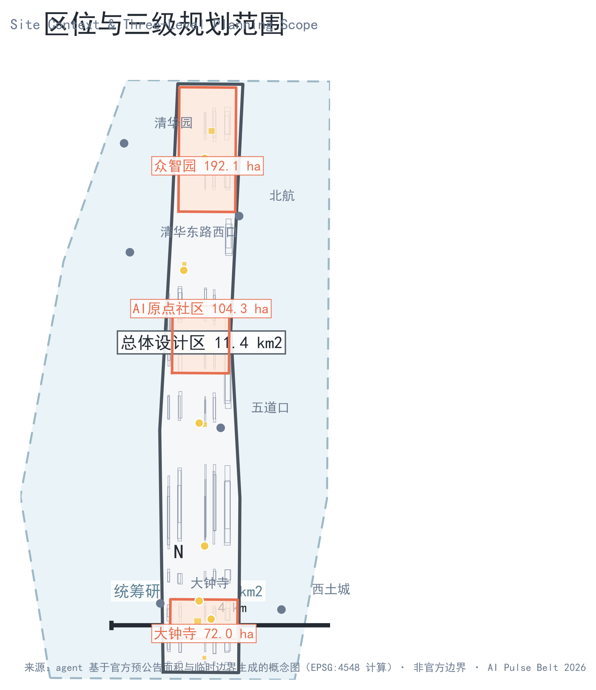
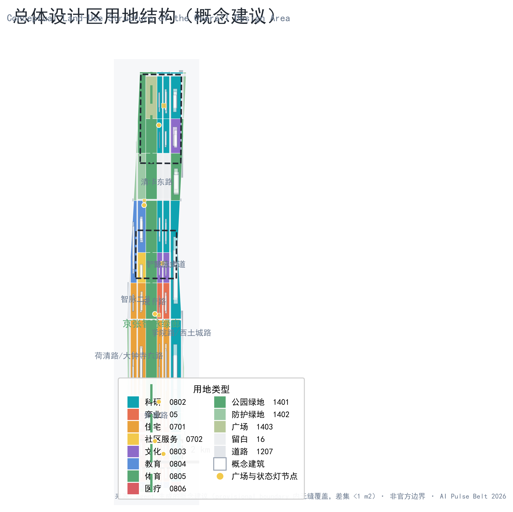
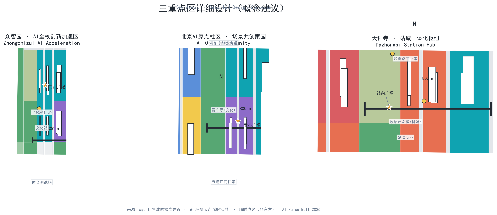
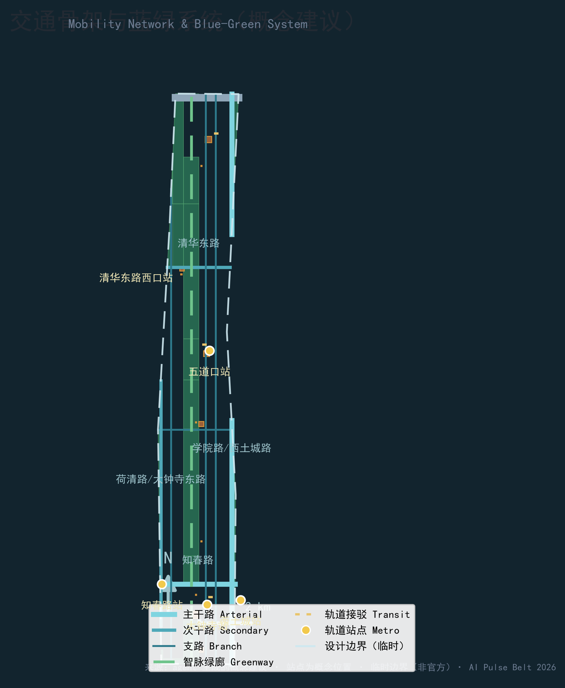
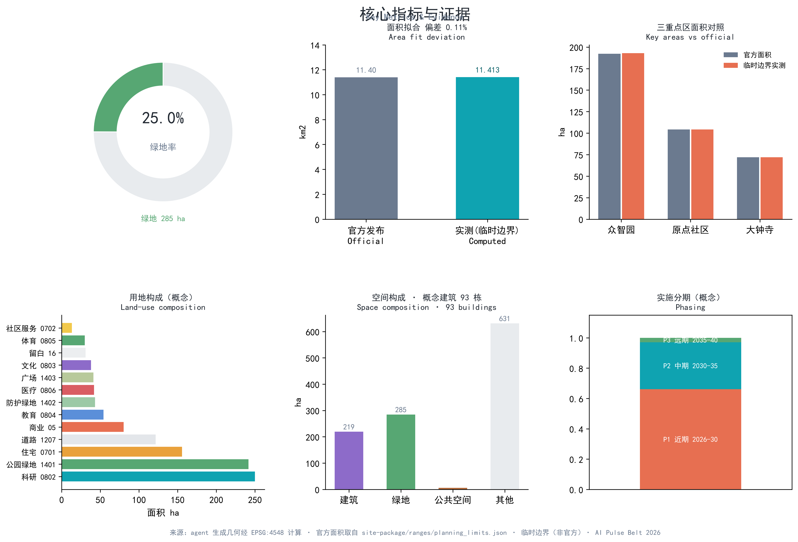

# AI Pulse Belt — Concept Design for the Centennial Jing-Zhang AI Innovation Belt

## Design Basis and Source Inventory

This formal proposal takes the *Pre-Qualification Announcement for the International Urban-Design Solicitation of the Centennial Jing-Zhang AI Innovation Belt* issued by the Haidian Branch of the Beijing Municipal Commission of Planning and Natural Resources as its primary basis, and the provisional boundaries, key areas, enums, metrics, and source inventory maintained in `brief/site-package/` as machine-readable basis. Before generating the design, the AI agent read `design_brief.json`, `allowed_design_space.json`, `sources.json`, `enums/`, `ranges/`, `schemas/`, `data/source_registry.json`, and `data/processed/agent_fact_pack.md`, and built task, scope, source-use, and gap checklists from `project_scope_summary.csv`, `agent_task_requirements.csv`, `source_use_matrix.csv`, and `missing_data_checklist.csv`. Every design judgment is decomposed into traceable sources, reproducible metrics, verifiable layers, and human-reviewable assumptions. The announcement requires control-detailed-planning-level urban design and integrated-implementation-plan-level urban design depth; narrative text therefore does not replace the GeoJSON layers, metrics tables, A3 booklet, A0 boards, and HTML presentation deliverables [source:OFFICIAL-ANNOUNCEMENT] [source:AGENT-TASKBOOK] [depth:existing_conditions_diagnosis].

The source registry is used with the following boundaries [source:SOURCE-REGISTRY]:

- `data/source_registry.json` records the usage boundaries of public, cleared, and provisional materials; current summary: 7 formal-ready sources, 1 background source, 1 provisional-only source.
- This proposal uses provisional boundaries only for design generation, self-checking, visualization, and design discussion — never upgraded to official boundary, statutory control, formal scoring basis, or government implementation commitment.

`data/processed/agent_fact_pack.md` is a reading-navigation layer, not a new authority [source:PROCESSED-FACT-PACK]. Factual judgments return to the registered source materials; the full source graph is kept in `sources.json`.

Since the official `SITE_BOUNDARY` and the three `KEY_AREA` polygons are not yet available, this proposal generates its formal package from `brief/site-package/geometry/provisional_boundaries.geojson`: both `geometry/site_boundary.geojson` and `geometry/key_areas.geojson` are marked `provisional_constraint` and do not claim `official_boundary=true`; they may be used only for design generation, self-checking, visualization, and discussion. The measured overall-design area is 11.413 km2 vs the official pre-announcement value of 11.4 km2 (0.11% deviation), disclosed in `assumptions.json` (ASSUME-002) [data:geometry/site_boundary.geojson#PROV-SITE-001] [metric:site_area_sqm]. The count of three key areas is verified against its own layer [data:geometry/key_areas.geojson#PROV-KEY-001] [metric:key_area_count]. The organizer's data gap does not block content scoring; once official polygons are released, site boundary, key areas, land use, roads, green space, public space, buildings, phasing, and metrics must all be recomputed.

## Three-Level Scope Framework

The proposal organizes work in the three scopes defined by the announcement: the **coordinated research scope** of 43.6 km2, covering the AI industry ecosystem, strategic positioning, innovation chain, and future-city form; the **overall design scope** of 11.4 km2, producing the urban-renewal framework, industrial spatial layout, transport-utility support, and urban-form control; and the **key-area scope** of 368.4 ha across three detailed-design areas, specifying functions, spatial moves, public-space connectivity, and transport organization. The three scopes are mapped one-to-one in `compliance_matrix.json`, guaranteeing that mandatory tasks 1.3, 1.4, 1.5 and agent.1–agent.6 each carry sections, layers, metrics, drawings, and HTML evidence [depth:three_level_scope_framework] [depth:overall_spatial_structure] [standard:PROJECT-OFFICIAL-ANNOUNCEMENT].

The overall concept is the **"AI Pulse Belt" (智脉一带)**: carrying forward the century-old "iron pulse" of the Jing-Zhang Railway as memory and linear spatial skeleton, and shaping an AI-era "digital pulse belt." The north-south central greenway corridor forms the "belt"; the three key areas — Zhongzhizui (Zhongguancun AI Acceleration Area), the Beijing AI Origin Community, and Dazhongsi — form the "three cores"; the Xiaoyue River scenario-enabling wing (west blue-green interface) and the Zhongguancun technology-service wing (east industry-service interface) form the "two wings"; AI scenario nodes and the slow-traffic network form the "multiple nodes" — an "**one belt, three cores, two wings, multiple nodes**" spatial structure. The logo motif is the character "脉" (pulse) morphing from railway rails into an oscilloscope waveform, in Jing-Zhang iron grey (#4A5560) and AI cyan (#0FA3B1), with the slogan "**A Century of Tracks, a Pulse of Intelligence**."

| Scope | Design question | Answer | Data anchor |
| --- | --- | --- | --- |
| Coordinated research | How to organize the AI ecosystem and future-city form | Innovation chain "university source—open-source collaboration—enterprise transformation—public experience—global outreach" + three-district two-wing coordination | compliance_matrix.json, standard_matrix.json |
| Overall design | How to map industry space, renewal, transport-utilities, and form | 260 m central greenway, "two-horizontal two-vertical" road skeleton, four zone bands, 155 land parcels seamless cover | [data:geometry/land_use.geojson#LU-001], [data:geometry/roads.geojson#ROAD-001] |
| Key areas | How to reach detailed-design depth for three districts | Positioning, spatial moves, AI scenarios, and pilgrimage landmarks per district | [data:geometry/key_areas.geojson#PROV-KEY-001], [data:geometry/key_areas.geojson#PROV-KEY-002], [data:geometry/key_areas.geojson#PROV-KEY-003] |

The three scopes are not disconnected drawings: the research scope sets industry-chain and city-form judgments, the overall design scope implements them as renewal projects and spatial structure, and the key-area design verifies implementability at parcel, building, transport, public-space, and AI-scenario level [source:PROCESSED-FACT-PACK]. Any area, ratio, scale, or project count that cannot be recomputed from structured data is not written into formal conclusions.

## Coordinated Research Scope: Industry and Future-City Study

The core task of the coordinated research scope is to build a world-class AI innovation ecosystem. The proposal organizes Haidian's universities, institutes, leading enterprises, computing-power/algorithm/data-factor resources, incubators, and tech services into a five-link innovation chain — "university source—open-source collaboration—enterprise transformation—public experience—global outreach" — and responds to the taskbook's "five functions" and "three districts, two wings" coordination requirements [source:AGENT-TASKBOOK] [standard:PROJECT-AGENT-OPEN-CALL-TASKBOOK].

**Ecosystem map (concept suggestion)**: drawing on global AI-district practice — Punggol Digital District (Singapore; integrated industry-education-living digital test bed), Kalasatama (Helsinki; agile test district), Seoul AI Hub, The Foundry (Cambridge), Waterfront Toronto (lakeside innovation corridor), and STATION F (Paris) plus Greater-Paris smart quarters — six spatial mechanisms are distilled: **land supply** (reserve land of class 16 for future uses), **spatial organization** (courtyard R&D blocks), **industry services** (one-stop computing/data/compliance/investment services), **capital mechanisms** (scenario opening and government procurement guidance), **talent services** (talent-special-zone and young-worker housing), and **data scenarios** (open test fields and evaluation systems). All global-case conclusions are concept references for professional deepening, not confirmed government arrangements.

**Three-district two-wing industrial layout (concept suggestion)**:

| District | Industry focus | Spatial anchor |
| --- | --- | --- |
| Zhongzhizui AI Acceleration Area | Foundation-model training, full-stack independent innovation, standards, safety governance | Northern R&D belt, standards culture hall, sports test field [data:geometry/land_use.geojson#LU-001] |
| Beijing AI Origin Community | Campus-proximate incubation, open-source system, talent zone, results publishing | Origin release hall, Tsinghua-East-Road education belt, Wudaokou mixed-use belt [data:geometry/land_use.geojson#LU-001] |
| Dazhongsi AI Industry Cluster | Agents, smart terminals, content consumption, data factors | Zhichun-Road commercial belt, data-factor tower, station-front commerce [data:geometry/land_use.geojson#LU-001] |
| Xiaoyue River enabling wing (west) | Scenario trials, ecology experience | Western protective green with test segments [data:geometry/green_space.geojson#GREEN-001] |
| Zhongguancun service wing (east) | Tech services, international exchange | Research and service platforms along Xueyuan Road [data:geometry/land_use.geojson#LU-001] |

The future-city form study answers how AI changes work, life, social interaction, learning, transport, and public services, using the "digital pulse belt" as spatial thread to locate AI transport systems, continuous green space, innovation service facilities, and an international living-working atmosphere into identifiable districts, nodes, corridors, and scenarios [depth:overall_spatial_structure] [standard:MOHURD-URBAN-DESIGN-MEASURES]. Global AI activities, developer communities, open scenarios, and pilgrimage routes are phrased as "concept suggestions / reference proposals," never as confirmed government events or implementation arrangements.

## Overall Design Scope: Urban Renewal and Control-Detailed-Plan-Level Design

The overall design scope (measured 11.413 km2) requires control-detailed-planning-level urban-design depth. The proposal puts forward an overall structure with the **central Pulse-Belt greenway** as its spine [data:geometry/land_use.geojson#LU-001], organizing land use on both sides into **four zone bands** — the Zhongzhizui R&D band (north), the Origin Community mixed band, the Dazhongsi commercial-R&D band, and the southern renewal band — with reserve land (class 16, 4 parcels) at the south end for future AI uses [depth:land_use_layout] [depth:development_intensity_controls].

**Road network (concept suggestion)**: a "two-horizontal, two-vertical" skeleton — horizontal: North 5th Ring Road (expressway), Tsinghua East Road (secondary), Chengfu Road (branch), Zhichun Road (arterial); vertical: Xueyuan Road/Xitucheng Road (arterial), Heqing Road/Dazhongsi East Road (secondary); plus new design streets — **Pulse-Belt Avenue (智脉大道)**, Pulse-2nd Street, Pulse-3rd Street — organizing block-level micro-circulation, with a continuous greenway inside the central corridor [data:geometry/roads.geojson#ROAD-001] [data:geometry/roads.geojson#ROAD-010].

**Land use (concept suggestion)**: `geometry/land_use.geojson` contains 155 parcels across 13 land-use classes, completely and seamlessly covering the design boundary (difference <1 m2, verified by `validate_cover`) [data:geometry/land_use.geojson#LU-001]. Research land (0802) dominates, supported by commercial (05), residential (0701), cultural (0803), and educational (0804) uses; the central corridor (1401 park green) is about 260 m wide, running north-south [data:geometry/green_space.geojson#GREEN-001]. `geometry/buildings.geojson` expresses 93 conceptual building footprints (design_proposal attribute, not statutory permits) [data:geometry/buildings.geojson#BLDG-001] [metric:building_footprint_area_sqm]. **Content involving building heights, development intensity, road red lines, setbacks, and facility standards is treated as "pending confirmation of official control conditions" until official controls are released — agent-estimated values are never presented as approved indicators.**

## Key-Area Detailed Design

The three key areas reach integrated-implementation-plan design depth [depth:three_key_area_detailed_design], each anchored in [data:geometry/key_areas.geojson#PROV-KEY-001], [data:geometry/key_areas.geojson#PROV-KEY-002], [data:geometry/key_areas.geojson#PROV-KEY-003].

| Key area | Design positioning | Spatial moves | AI industry & operation scenarios | Evidence |
| --- | --- | --- | --- | --- |
| Zhongzhizui AI Acceleration Area (192.1 ha) | Garden-type full-stack independent innovation block | Green buffer along the 5th Ring; gateway plaza access; R&D courtyards + standards culture hall + sports test field + reserve land | Foundation-model training/testing, standards workshops, safety-governance showcases, low-carbon computing experience | [data:geometry/key_areas.geojson#PROV-KEY-001], [data:geometry/land_use.geojson#LU-001], [data:geometry/public_space.geojson#PUBLIC-003] |
| Beijing AI Origin Community (104.3 ha) | Campus-proximate transformation and talent community | Tsinghua-East-Road education belt stitching campus and park; origin release hall (0803 culture); Wudaokou mixed-use belt; community services embedded | Open-source community, results publishing, talent-special-zone services, campus-proximate incubation | [data:geometry/key_areas.geojson#PROV-KEY-002], [data:geometry/public_space.geojson#PUBLIC-002], [source:AGENT-TASKBOOK] |
| Dazhongsi AI Industry Cluster (72.0 ha) | Station-city integrated intelligent economy block | Station-forecourt four-quadrant pedestrian connectivity; Zhichun-Road commercial belt; data-factor tower; station-front mixed commerce | Agent & smart-terminal showcases, content consumption, data factors, international roadshows | [data:geometry/key_areas.geojson#PROV-KEY-003], [data:geometry/public_space.geojson#PUBLIC-001], [metric:key_area_count] |

The three key areas are presented as `provisional_constraint` in `geometry/key_areas.geojson`; the narrative, HTML, sources, assumptions, and self_check all state they cannot serve as formal scoring or approval basis. `compliance_matrix.json` covers announcement clauses 1.5.3.1, 1.5.3.2, 1.5.3.3. The design expression includes functions, conceptual buildings, public-space systems, transport organization, and implementation projects; the A3 booklet and A0 boards include key-area master plans, detail maps, and metric notes, and the HTML page allows toggling among the three key areas.

## AI Innovation Ecosystem, Talent Profiles, and AI+ Scenarios

The proposal builds spatial-need profiles for AI talent and enterprises, and a two-track scenario system of "industry development scenarios + AI-enabled urban-function scenarios." Every scenario states its service users, spatial location, data sources, privacy boundary, human-review mechanism, and operating body [source:AGENT-TASKBOOK].

**5 user profiles**:

| Profile | Typical needs | Spatial response | Self-check boundary |
| --- | --- | --- | --- |
| Startup engineers | Low-cost offices, computing access, product test fields | Zhongzhizui shared test field, edge-computing service points, standards consultation | Computing and data services require separate authorization |
| Researchers | Cross-institution collaboration, transformation, academic exchange | Origin release hall, R&D courtyards, Tsinghua-East-Road education belt | Campus data and research results require authorization |
| Family weekend visitors | Leisure, sports, cultural experience | Central greenway, pocket parks, sports test field, bell-culture experience | No personal behavior tracking; aggregated activity statistics only |
| Senior tourists | Barrier-free wayfinding, slow leisure, cultural explanation | Barrier-free AI wayfinding stations, Pulse-Rail art rest belt | Health data never used for commercial recommendations |
| Developer-community operators | Event organizing, code collaboration, community reputation | Open-air developer workspace code wall, release plaza, Box meeting pavilions | Public activity data anonymized and aggregated |

**12 scenario cards (concept suggestion)**:

| Card | Spatial carrier & description | Data & human boundary | KPI & exit condition |
| --- | --- | --- | --- |
| 01 Rail-inspection AR twin | Central greenway rail segment: AR overlays of century-old Jing-Zhang imagery with an AI digital-twin inspection demo | Aggregated footfall heat only; no personal imagery | AR factual accuracy ≥98%; unresolved factual complaints take it offline |
| 02 Autonomous shuttle corridor | Pulse-Belt Avenue: campus—station autonomous shuttle demo line (concept) [scenario:ai-traffic-walkability] | Trip data for dispatch only; anonymized after retention | On-time rate ≥85%; any accident stops the line for manual service |
| 03 AI cycling coach station | Greenway nodes: cycling data visualization with AI coaching | Ride data visible to the user only; one-tap deletion | Equipment fixed within 24h; privacy complaints pause it |
| 04 Bell-chime metaverse | Dazhongsi station front: digital-twin and interactive performance of the bell culture | No personal behavior tracking | Content complaints answered ≤48h; heritage conflicts remove it |
| 05 Box meeting pavilion | R&D block nodes: self-service meetings, live streaming, remote collaboration micro-spaces | Audio/video held by the user; platform keeps nothing | High no-show rates trigger capacity changes; complaints stop it |
| 06 Drone delivery station | South Zhongzhizui block: low-altitude logistics trial station (concept) [scenario:robot-delivery-low-speed] | No facial capture; delivery records deleted in 30 days | Zero tolerance for safety hazards; no operation without airspace approval |
| 07 AI-gardener pocket park | Residential corners: AI-assisted plant care with community adoption | Plant-care and adoption data only | Adoption rate ≥30%; noise complaints trigger adjustments |
| 08 Barrier-free AI wayfinding | Station and greenway nodes: voice/tactile multimodal accessible navigation | No personal trajectory storage; on-site verifiable | 100% human-alternative rate; off-site mismatch stops it |
| 09 Event-data visualization wall | Sports test field vicinity: real-time big-screen of smart sports events | Aggregated display only; no personal identification | Data provenance time-stamped; alerts require human judgment |
| 10 AI energy-management building | Zhongzhizui R&D belt: distributed energy and AI-driven energy control demo (concept) | Energy data aggregated per building; never per household | Immediate manual takeover on control errors; repeated errors decommission it |
| 11 AI coffee robot station | Commercial and R&D corners: robotic-arm coffee experience and developer social hub | Minimal order data; standard payment channels | Mechanical faults stop it; complaints answered ≤24h |
| 12 Open-air developer workspace code wall | Origin release plaza vicinity: open-source contribution wall, open-air workstations, demo zone | Public contribution data anonymized-aggregated | Human final review of content; disputes take it down |

**3 industrial test-and-verification scenarios (concept suggestion)**: ① open vehicle-road-coordination test segment (concept 1.2 km on Pulse-Belt Avenue); ② low-altitude delivery route verification (concept Zhongzhizui–Dazhongsi route, subject to airspace and safety regulations) [scenario:robot-delivery-low-speed]; ③ multimodal wayfinding-system evaluation ground (entire greenway). **Public-safety AI applications are studied as operations-review research only and never replace human review** [scenario:public-safety-operations-review].

**3 AI pilgrimage landmarks (concept suggestion)**: the **Bell of AI Origins** (Dazhongsi station-forecourt plaza; bell culture meets AI-origin imagery), the **Tower of AI Light** (Zhongzhizui gateway plaza; light art with real-time model-inference visualization), and the **Pulse-Rail Art Track** (northern central greenway; artistic reuse of disused rails with digital projection). The pilgrimage route "A Century of Tracks, a Pulse of Intelligence" links to scenario card 10, the Global AI Week route [data:geometry/public_space.geojson#PUBLIC-001] [data:geometry/green_space.geojson#GREEN-001]. The related public-space and green metrics are `known` in `metrics.json` and directly recomputable [metric:public_space_ratio] [metric:green_ratio].

AI governance suggestions follow data-minimization, public-source, explainability, and human-review principles: city agents may assist in identifying slow-traffic gaps, public-space heat, facility maintenance, enterprise-service demand, and event-safety risk — but never replace planning approval, never output unauthorized personal profiles, and never claim official implementation commitment. All scenario nodes enter the structured layers or compliance matrix.

### Pulse Protocol (operating mechanism)

The proposal defines a four-beat operating loop for every AI service entering public space, homologous to the "Pulse Belt" name: like a pulse, each service has explicit beats of declaration, testing, release, and review — no service may linger indefinitely in "pilot" status, and none may be released without testing [standard:PROJECT-AGENT-OPEN-CALL-TASKBOOK] [depth:renewal_project_list]:

| Beat | Action | Boundary condition | If not met |
| --- | --- | --- | --- |
| P1 Declare | State service purpose, data ceiling, responsible party, human-equivalent path, and end condition | Any missing element blocks testing | Return for supplements |
| P2 Test | Controlled pilot: booking, zoning, on-site safety officer, physical emergency stop, independent re-test | Release requires completed re-test | Fix and re-test, or withdraw |
| P3 Release | Public operation with wayfinding status lights: steady waveform=operating, pulsing=testing, flat line=decommissioned | Any boundary failure degrades back to P2 | Stop service and restore the site |
| P4 Review | Data re-check, public feedback, and published failure records; decide continue, adjust, or retire | No renewal without review | Retire and complete data/site restoration |

All 12 scenario cards, 3 industrial test-and-verification scenarios, annual events, and pilgrimage landmarks define their operating boundaries under this protocol; the protocol is an operating-mechanism suggestion and does not replace planning approval, industry regulation, or statutory assessment.

## Land Use, Building Scale, and Retain-Renovate-Demolish Approach

The land-use plan follows public land-use survey, planning, and regulation classification standards, forming complete, closed, seamless zoning [standard:MNR-LAND-USE-CLASSIFICATION-GUIDE] [data:geometry/land_use.geojson#LU-001]. Of the 13 classes, research 0802 dominates (14 parcels), with commercial 05 (10), residential 0701 (6), education 0804 (6), medical 0806 (6), culture 0803 (3), sports 0805 (1), community service 0702 (1), park green 1401 (12), protective green 1402 (9), plaza 1403 (2), road 1207 (81), and reserve 16 (4) — 155 parcels total, seamless [depth:land_use_layout].

The building plan distinguishes retained, renovated, renewed, new, and to-be-confirmed objects: because existing buildings, ownership, control plans, and engineering conditions are absent, the proposal provides only a **method framework and to-be-calibrated checklist, without fabricating retain-renovate-demolish conclusions** [depth:retain_renovate_demolish] [depth:height_massing_character]. All 93 conceptual buildings in `geometry/buildings.geojson` carry `status=design_proposal`, `confidence=low`, expressing massing intent only [data:geometry/buildings.geojson#BLDG-001] [metric:building_footprint_area_sqm]. Total building scale, FAR, height, and density are uniformly `status=unknown` pending official conditions (see `metrics.json` floor_area_ratio, whose `reason` states the missing conditions and recomputation path).

## Transport, Rail, Utilities, and Public Services

The transport plan responds to the announcement's requirements on station integration, road micro-circulation, slow-traffic gaps, external access, parking, non-motorized parking, and green transport [depth:traffic_rail_slow_parking] [data:geometry/roads.geojson#ROAD-001] [data:geometry/public_space.geojson#PUBLIC-001]:

- **Rail connection (concept)**: anchored on Dazhongsi, Wudaokou, Zhichun Road, Xitucheng, and Tsinghua-East-Road-West stations, with 3 concept connector lines (ROAD-011/012/013) and an autonomous shuttle corridor (card 02) [scenario:ai-traffic-walkability];
- **Micro-circulation**: Pulse-Belt Avenue (28 m concept red line), Pulse-2nd/3rd Streets organize block-level loops; slow-traffic greenway runs the full greenway [data:geometry/roads.geojson#ROAD-010];
- **Slow-traffic gaps**: concept north-5th-Ring crossing node and greenway north/south landscape nodes (see Figure 04 and `constraints.geojson`) [data:geometry/constraints.geojson#CONSTRAINTS];
- Parking and non-motorized parking follow a "rail + shuttle + slow traffic" priority; scale to be confirmed by transport special studies and control conditions.

Utilities and public services cover AI industry services (computing, data, compliance, investment service points), talent-living services, new infrastructure (edge-computing stations, distributed-energy nodes, card 10), and traditional utility integration [depth:municipal_new_infrastructure]. Missing pipeline, energy, drainage, flood-control, and fire-engineering data are listed as prerequisites for formal deepening, stated in `assumptions.json` rather than written as approved conditions.

## Blue-Green Space, Public Space, and Urban Form

**Blue-green space (concept suggestion)**: the central Pulse-Belt greenway as spine (260 m wide, north-south, total green ~284.9 ha, green ratio 25.0%) [data:geometry/green_space.geojson#GREEN-001] [metric:green_ratio]; western protective belt echoing the Xiaoyue River enabling wing; eastern protective belt along Xueyuan Road; pocket parks and plazas embedded in blocks [data:geometry/public_space.geojson#PUBLIC-001] [depth:blue_green_public_space]. Six plazas (Dazhongsi station front, Origin release, Zhongzhizui gateway, Wudaokou living, Tsinghua-East-Road-West, southern community) form the public-space skeleton [data:geometry/public_space.geojson#PUBLIC-001].

**Urban form (concept suggestion)**: a three-line narrative merging Jing-Zhang railway heritage, Zhongguancun innovation culture, and AI culture [depth:overall_spatial_structure] [standard:MOHURD-URBAN-DESIGN-MEASURES]: the Qinghuayuan Railway-Station heritage node and Pulse-Rail Art Track carry the rail memory; the Bell of AI Origins and Tower of AI Light carry AI culture; a wayfinding symbol system unifies the "rail—waveform" motif — public wayfinding uses a "waveform status-light" language: steady waveform=operating, pulsing=testing, flat line=decommissioned, linked to the Pulse Protocol so citizens can read an AI service's operating state without any instructions. Form control distinguishes official regulation, design suggestion, and to-be-confirmed conditions; pseudo-precise control lines are strictly avoided without heritage or control-plan basis. All brands, fonts, images, portraits, and enterprise marks require cleared sources (see `report/copyright_statement.md`).

## Renewal Project List, Implementation Policy, and Phasing Plan

Renewal project list (concept suggestion, 12 items):

| ID | Project | Type | Near-term action | Release evidence | Suggested lead |
| --- | --- | --- | --- | --- | --- |
| JZ-01 | Central Pulse-Belt greenway connection | Public space/blue-green | Pedestrian audit, temporary wayfinding, under-bridge clearance | Red lines, traffic & ecology review | District landscape bureau + transport [data:geometry/green_space.geojson#GREEN-001] |
| JZ-02 | North-5th-Ring slow-traffic crossing | Transport/slow traffic | Cross-section and overpass-condition assessment | Structural safety & crossing approval | Transport commission + design firm [data:geometry/roads.geojson#ROAD-001] |
| JZ-03 | Zhongzhizui gateway plaza & Tower of AI Light | Public space/landmark | Concept design and light-environment trial | Ownership & landscape approval | Park operating platform [data:geometry/public_space.geojson#PUBLIC-003] |
| JZ-04 | Origin release hall & code wall | Industry service/culture | Ground-floor use planning, open-source event trial | Ownership & operator confirmation | Zhongguancun open-source community + district [data:geometry/buildings.geojson#BLDG-001] |
| JZ-05 | Dazhongsi four-quadrant pedestrian connection | Station integration/slow traffic | Crossing-time, accessibility, bike-parking surveys | Station & intersection review | District + transit operator [data:geometry/public_space.geojson#PUBLIC-001] |
| JZ-06 | Pulse-Belt Avenue autonomous shuttle demo | Transport/new infra | Regulation review and signal-condition assessment | Road-test filing & safety plan | District test office + bus group [data:geometry/roads.geojson#ROAD-010] |
| JZ-07 | Tsinghua-East-Road education-belt stitching | Renewal/education | Campus-boundary and pedestrian-safety survey | Ownership & campus consent | Subdistrict + university [data:geometry/land_use.geojson#LU-001] |
| JZ-08 | Southern renewal band upgrade | Renewal/residential | Existing-building and land survey | Retain-renovate-demolish special study | District + planning team [data:geometry/phasing.geojson#PHASE-003] |
| JZ-09 | Low-altitude delivery route verification | New infra/industry test | Airspace and safety-supervision review | Airspace approval | District + regulator [data:geometry/constraints.geojson#CONSTRAINTS] |
| JZ-10 | Edge-computing & energy-control demo building | New infra/utilities | Energy and computing-demand assessment | Fire safety & operator confirmation | Energy enterprise + park [data:geometry/buildings.geojson#BLDG-001] |
| JZ-11 | Barrier-free AI wayfinding system | Public service/accessibility | Standards and data-authorization review | Accessibility-standard re-check | Disabled federation + operator [data:geometry/constraints.geojson#CONSTRAINTS] |
| JZ-12 | Global AI Week public route | Operations/brand | Event permits and copyright clearance | Public-space permit & safety plan | Joint operating body [data:geometry/phasing.geojson#PHASE-001] |

**Phasing (concept suggestion)** (`geometry/phasing.geojson`, [depth:renewal_project_list] [depth:phasing_implementation]): **P1 near term (2026–2030)** — the three key areas first: Zhongzhizui, Origin Community core, Dazhongsi core ([data:geometry/phasing.geojson#PHASE-001]); **P2 mid term (2030–2035)** — full greenway connection plus north Dazhongsi and northern south-band ([data:geometry/phasing.geojson#PHASE-002]); **P3 long term (2035–2040)** — southern renewal band and reserve land ([data:geometry/phasing.geojson#PHASE-003]). **The 100-day solicitation cycle and implementation phasing are strictly distinguished**: the former is a submission-time requirement, the latter is the urban-renewal path. Near-term items may start with lightweight facilities, operations, and service platforms (scenario cards, pilgrimage landmarks, wayfinding); long-term items await formal control plans, utilities, transport, and ownership confirmation. The annual event system (developer conference, scenario open day, International AI Week) states operators, frequency, responsibility boundaries, and conversion paths — no slogans [source:AGENT-TASKBOOK].

## Indicator System, Area Recalculation, and Compliance Matrix

The indicator system (`metrics.json`) has 6 metrics: overall-design area (site_area_sqm, measured 11,412,825.4 m2 vs official 11,400,000 m2, 0.11% deviation), building footprint area (building_footprint_area_sqm, ~116.8 ha), green ratio (green_ratio, 25.0%), public-space ratio (public_space_ratio), key-area count (key_area_count, 3), and floor-area ratio (floor_area_ratio, `status=unknown`, official FAR controls absent). All known metrics are recomputable from GeoJSON [metric:site_area_sqm] [data:geometry/green_space.geojson#GREEN-001] [depth:metrics_recalculation].

Metrics are managed in three classes: ① spatial metrics recomputable from submitted geometry (areas, ratios, phasing areas); ② control metrics requiring official control plans (FAR, height, density, setbacks, red lines — currently `unknown`); ③ performance metrics requiring operational data calibration (AI innovation index, talent density, scenario usage — concept suggestions). The three classes enter `metrics.json`, `assumptions.json`, and `compliance_matrix.json` respectively, avoiding operational visions masquerading as approved planning conditions [standard:PROJECT-OFFICIAL-ANNOUNCEMENT].

The compliance matrix covers all mandatory tasks of announcement clauses 1.3, 1.4, 1.5 and agent.1–agent.6: agent.1 naming system and identity (this chapter and Chapter 3), agent.2 global cases and ecosystem map (Chapter 3), agent.3 scenario cards/test scenarios/profiles (Chapter 6), agent.4 pilgrimage landmarks and honor displays (Chapters 6 & 9), agent.5 cultural narrative and wayfinding (Chapter 9), agent.6 event system and community operations (Chapter 10). Results of `scripts/spatial_review.py` and `scripts/visual_review.py` serve as formal self-check evidence.

## Risks, Copyright, and Compliance Notes

**Bilingual requirement**: the Chinese master file and the English translation `proposal.en.md` are fully aligned (bilingual_contract_version 1); A3/A0 drawings, HTML, and text-bearing figures all provide bilingual expression, preferring the terminology recommended in `docs/terminology-glossary.md`. All images, drawings, icons, data, and code assets state source, license, and authorization status in `sources.json` and `report/copyright_statement.md`; the HTML page loads no remote scripts, remote map tiles, remote fonts, iframes, forms, or external APIs, and tracks no reviewer behavior.

**Risks and missing-data list**: gaps in official boundary, key areas, control plans, road red lines, parcel ownership, existing buildings, utilities, heritage, and public services all enter `assumptions.json` (ASSUME-001/002/003) and this chapter; any conclusion lacking official control plans, red lines, ownership, utility, fire-safety, or heritage conditions is downgraded to a to-be-confirmed item [depth:risk_missing_data] [data:geometry/constraints.geojson#CONSTRAINTS] [source:SITE-PACKAGE].

This proposal does not claim official approval, approved control plans, final land ownership, final construction scale, or guaranteed implementation. The AI agent is responsible for facts, sources, copyright, spatial data, metrics, and expression; maintainers and professional reviewers may require revisions or reject the submission based on self-check results, spatial review, and the compliance matrix.

## References

- brief/public-brief.md
- brief/site-package/design_brief.json
- brief/site-package/agent_taskbook.json
- brief/site-package/allowed_design_space.json
- brief/site-package/enums/
- brief/site-package/ranges/planning_limits.json
- brief/site-package/geometry/provisional_boundaries.geojson
- data/source_registry.json
- data/processed/agent_fact_pack.md
- data/processed/project_scope_summary.csv
- data/processed/agent_task_requirements.csv
- data/processed/source_use_matrix.csv
- data/processed/missing_data_checklist.csv
- Full machine index: see `sources.json`, `metrics.json`, `compliance_matrix.json`, `standard_matrix.json`, and `design_depth_matrix.json`
- Bibliography entry follows the site package registry; full provenance and licenses are in the structured source list [source:SITE-PACKAGE]
