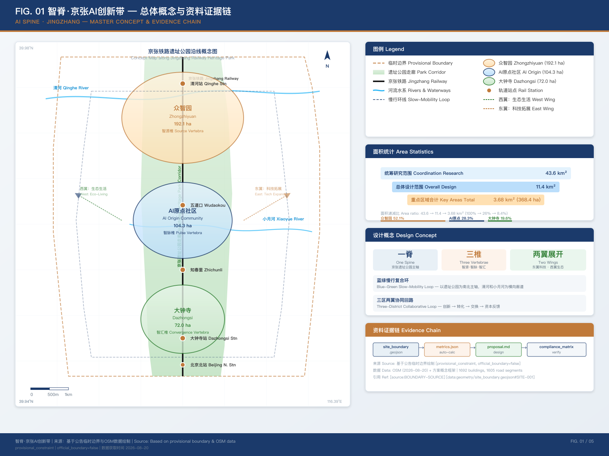
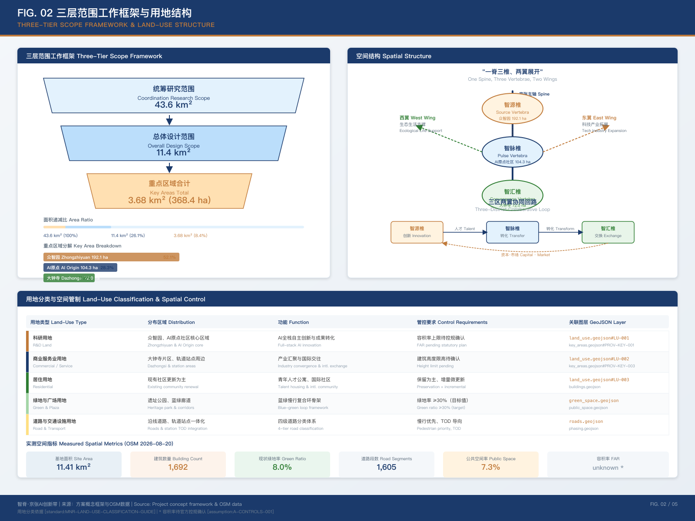
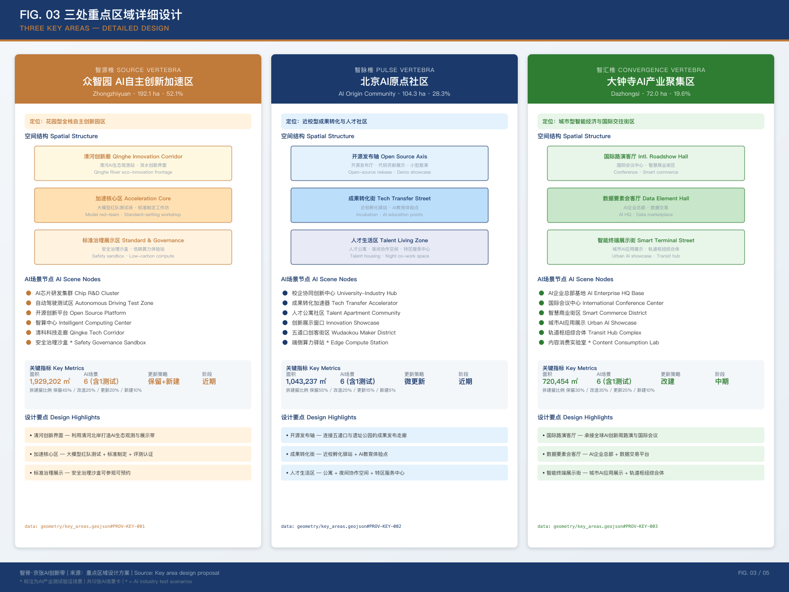
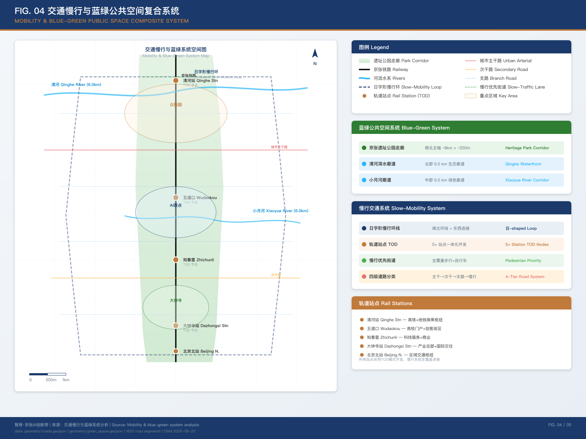
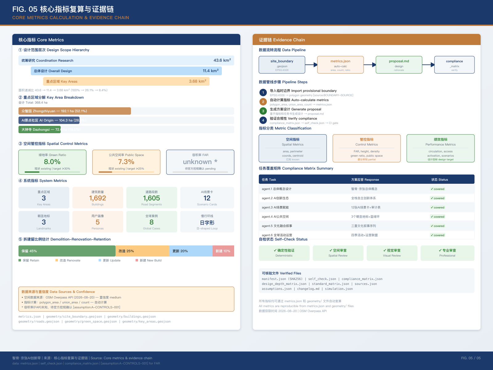

# 智脊·京张AI创新带 — 百年铁路的智能重生

## 三分钟读懂

**一句话核心概念**：把京张铁路遗址公园当作一根"智慧脊梁"，自北向南串联众智园、北京AI原点社区、大钟寺三大"创新椎体"，用"一脊三椎、两翼展开、蓝绿慢行复合环"的空间结构，回答百年京张文化、中关村创新文化与AI新文化如何在一座真实城区里融合。

**先回答评审最关心的五个问题**：

1. **方案是什么？** 不是又一个"AI园区"概念，而是一条有明确空间落位的创新主轴——以已开放的京张遗址公园二期为现实载体，把三个差异化的重点片区（自主创新源头、开源成果转化、产业汇聚国际交往）用慢行系统和公共空间缝合成一个连续的城市体验带。

2. **怎么落地？** 近中远三期推进，近期（1-2年）只做轻量、可撤回的试点（慢行断点缝合、清河创新界面、近校成果转化街），每个试点都有入口条件、验收门槛、可撤回条件；中期才推进轨道一体化和地标建设，需正式控规确认。

3. **对谁有益？** 不止服务AI企业和开发者。方案明确覆盖老人、残障、低收入居民和小商户的过渡期保护，所有AI场景保留人工服务窗口和非数字化替代路径，社区AI教育点免费开放。

4. **AI怎么融入？** 12张场景卡全部标注数据来源、隐私边界、AI角色、人工复核节点和自动化级别，AI角色限定为"辅助"或"受监管试点"，不存在全自动决策场景。

5. **风险和边界是什么？** 官方红线尚未发布，所有空间指标标注provisional；8维风险矩阵中实施复杂度和政策不确定性评分最高并强制人工复核；方案全程使用"概念建议"措辞，不冒充官方审批或实施承诺。

## 六项智能体任务应答映射

本方案逐项回应任务书六项智能体任务 [source:AGENT-TASKBOOK]，每项任务对应报告章节、空间图层和可核验证据 [data:compliance_matrix.json]：

| 任务 | 任务书要求 | 方案应答 | 核心证据 |
| --- | --- | --- | --- |
| agent.1 | 一带总体概念与功能统筹方案设计 | "智脊·京张"总体概念 + "一脊三椎、两翼展开"空间结构 + 三区两翼协同回路 | 三层范围工作框架、统筹研究章节 [data:geometry/site_boundary.geojson] |
| agent.2 | AI全栈自主创新体系与世界级AI创新生态设计 | 众智园智源椎承载全栈自主创新（芯片/框架/算法→评测/安全→应用转化→标准/生态） | 众智园重点区域详细设计 [data:geometry/key_areas.geojson] |
| agent.3 | AI+场景赋能新范式与智能化AI活力城市设计 | 12张AI场景卡 + 4个测试验证场景（*标注）+ 场景数据-治理审计表 | AI场景卡章节、审计表 [data:geometry/roads.geojson] |
| agent.4 | AI公共空间、智能原生新业态与朝圣地标设计 | 3个AI朝圣地标（纪念碑廊/开源穹顶/AI星火塔）+ 蓝绿慢行复合环 | 朝圣地标章节 [data:geometry/public_space.geojson] |
| agent.5 | 百年京张、中关村与AI新文化融合叙事设计 | 三重文化叙事（自主创新→开放协作→人机共创）+ 文化导览序列 | 文化融合叙事章节 [data:geometry/green_space.geojson] |
| agent.6 | 一带全球AI创新活动体系与长期运营设计 | "京张智脊·全球AI创新周"四季活动 + 运营联盟 + 场景分层开放 | 长期运营章节 [data:geometry/phasing.geojson] |

上述映射的逐项证据由 `compliance_matrix.json` 的 requirement_id、report_sections、geojson_layers、metrics、drawings 和 visual_sections 字段结构化记录，评审可逐条追溯到正文、图纸、图层和指标。

## 设计依据与资料清单

本方案以北京市规划和自然资源委员会海淀分局发布的资格预审公告为第一依据 [source:OFFICIAL-ANNOUNCEMENT]，以面向智能体的开源征集任务书为agent任务依据 [source:AGENT-TASKBOOK]，以仓库维护者登记的临时粗略边界为空间工作基础 [source:BOUNDARY-SOURCE]。方案同时引用住房和城乡建设部《城市设计管理办法》[standard:MOHURD-URBAN-DESIGN-MEASURES]、《控制性详细规划编制审批办法》[standard:MOHURD-CONTROL-DETAILED-PLANNING] 和自然资源部《用地用海分类指南》[standard:MNR-LAND-USE-CLASSIFICATION-GUIDE] 作为专业标准参照。

当前仓库尚未取得官方精确红线。本方案使用 `brief/site-package/geometry/provisional_boundaries.geojson` 中的临时粗略边界 [data:geometry/site_boundary.geojson#SITE-001]，标注为 `provisional_constraint`、`official_boundary=false`。该临时边界仅用于AI方案生成、离线展示和本地自检，不得作为官方红线、审批依据或精确面积复算依据。本方案可供概念性评审参考，官方边界数据及任何评分或录取决定尚待确认；官方边界发布后，所有空间图层和指标需重新复算 [assumption:A-CONTROLS-001]。

本方案在关键判断后使用可校验引用格式，完整来源覆盖由 `sources.json` 负责，专业标准响应由 `standard_matrix.json` 管理，成果深度由 `design_depth_matrix.json` 约束，任务覆盖由 `compliance_matrix.json` 追踪。读者无需打开JSON即可理解方案设计逻辑。

### 政策链呼应

方案以国家、市、区三级公开政策为参照框架，仅作"呼应/依托/衔接"，不表述为已确定的政府决策或实施安排 [source:AGENT-TASKBOOK]：

| 层级 | 政策/文件 | 方案呼应点 | 措辞边界 |
| --- | --- | --- | --- |
| 国家 | 国务院《新一代人工智能发展规划》 | 呼应国家"自主可控AI技术体系"导向，众智园智源椎承载全栈自主创新 | 参照战略方向，不表述为获得国家立项 |
| 国家 | 住建部《城市设计管理办法》 | 三层范围工作框架与控规深度城市设计方法依托该办法 [standard:MOHURD-URBAN-DESIGN-MEASURES] | 方法论参照，不替代法定规划审批 |
| 市 | 北京市科委《"三区两翼"打造世界级AI集聚地》（2026-04） | "三区两翼"协同回路直接衔接市级产业空间布局 | 衔接产业方向，不表述为市级确认 |
| 区 | 海淀区"1+X+1"现代化产业体系（2026-03） | 众智园/原点社区/大钟寺差异化定位衔接区级产业体系 | 衔接区级产业导向 |
| 区 | 海淀区"AI海淀"（2025） | 引用海淀1300+AI企业、76款备案大模型等产业基础数据 [source:HAIDIAN-AI-ECOSYSTEM] | 公开数据引用 |
| 区 | 百年京张AI创新带资格预审公告（2026-05-09） | 直接回应公告三大定位、三层范围、三大重点片区 [source:OFFICIAL-ANNOUNCEMENT] | 直接任务依据 |

政策链的完整来源登记见 `sources.json`，具体政策引用仅用于论证方案方向合理性，不构成任何形式的官方背书或审批结论。

## 三层范围工作框架

方案按照公告确定的三个层次组织工作框架，形成从战略到实施的递进关系。

| 层级 | 面积 | 核心问题 | 方案回答 |
| --- | --- | --- | --- |
| 统筹研究范围 | 约43.6平方公里 | AI产业生态和未来城市形态如何组织 | 建立"高校策源-开源协作-企业转化-公共体验-国际传播"创新链，三区两翼协同 |
| 总体设计范围 | 约11.4平方公里 | 产业空间、城市更新、交通市政如何落图 | "一脊三椎、两翼展开"空间结构，用地/建筑/道路/绿地/公共空间/分期六图层联动 |
| 重点区域范围 | 约368.4公顷 | 三处片区如何达到详细设计深度 | 分别提出定位、空间动作、AI场景和实施依赖 |

三层工作不是互相割裂的图纸集合。统筹研究决定产业链和创新生态判断，总体设计把判断落实到更新项目和空间结构，重点区域详细设计验证具体地块和场景的可实施性。空间证据以 [data:geometry/site_boundary.geojson#SITE-001] 和 [data:geometry/key_areas.geojson#PROV-KEY-001] 为基准 [depth:three_level_scope_framework]。

由于使用临时粗略边界，以下结论均标注为"方向性设计建议，待官方边界发布后复算"：空间结构中的廊道走向和节点位置、用地分区面积比例、建筑规模估算、交通组织路径和公共空间面积。这些方向性结论不影响设计概念和策略的有效性，但精确数值需在正式数据补齐后校准 [assumption:A-CONTROLS-001]。

## 统筹研究范围产业与未来城市研究

### 总体概念：智脊·京张

本方案提出"智脊·京张"（AI Spine）作为百年京张AI创新带的总体概念 [source:AGENT-TASKBOOK]。"脊"有多重含义：物理层面，京张铁路遗址公园是贯穿南北的空间脊梁；创新层面，三处重点区域是支撑AI产业链的创新椎体；文化层面，詹天佑百年前的自主创新精神是延续至今的文化脊梁；技术层面，AI作为"神经系统"连接整条创新带。

命名体系如下：

| 层级 | 中文名称 | 英文名称 | 含义 |
| --- | --- | --- | --- |
| 总体概念 | 智脊·京张 | AI Spine · Jingzhang | 以铁路为智慧脊梁 |
| 创新带 | 京张智脊带 | Jingzhang AI Spine Belt | 贯穿南北的AI创新主轴 |
| 众智园 | 智源椎 | Source Vertebra | AI全栈自主创新的源头 |
| AI原点社区 | 智脉椎 | Pulse Vertebra | 创新脉搏融入日常生活的节点 |
| 大钟寺 | 智汇椎 | Convergence Vertebra | 产业汇聚与国际交往的终端 |

**品牌识别系统**：方案以"智脊·京张"为核心品牌资产，形成可延展的识别体系。

- **Logo 图形**：以竖向线条（铁路/脊梁）为骨架，三个圆形节点（三处重点区域）沿脊柱分布，节点之间以细线连接形成神经网络意象，整体可读为汉字"脊"的抽象变体。Logo 有三个变体：完整版（活动与门头）、节点版（三处片区各自的独立标识，众智园=实心节点、AI原点社区=空心节点、大钟寺=同心圆节点）、线形版（导视与网页小尺寸使用）。
- **色彩系统**：深蓝 `#1B3A6B`（科技理性，主色）与铜橙 `#C07A3A`（铁路工业遗产，辅色）为主，辅以白色留白和浅灰底。三处片区各有一个辅助识别色：众智园＝深蓝、AI原点社区＝青绿（开源生态）、大钟寺＝琥珀金（国际交往）。
- **字体与语汇**：中文主字体用思源黑体（开源、可商用），英文用 Inter（开源）。品牌语汇统一为"智脊·京张 / AI Spine · Jingzhang"，三椎分别使用"智源椎 / Source Vertebra""智脉椎 / Pulse Vertebra""智汇椎 / Convergence Vertebra"。
- **国际传播**：英文命名保留"AI Spine"的脊椎意象，利于国际媒体转述；四季活动统一冠以"Jingzhang AI Spine"前缀，形成全球可检索的品牌资产。
- **应用延展**：Logo 可延展至导视系统、活动海报、场景卡封面、开发者徽章和数字媒体，核心图形不变、色彩按场景切换。

该品牌识别系统为概念设计建议，实际使用中的字体、图形、商标和肖像需完成清权后方可实施 [assumption:A-COPYRIGHT-001]。

### 三大定位、五大功能与三区两翼协同

方案回应公告三大定位 [source:OFFICIAL-ANNOUNCEMENT] 和面向智能体任务书的五大功能 [source:AGENT-TASKBOOK]：

三大定位——百年京张文化带（以铁路遗址公园为文化主轴）、都市AI生活体验带（以场景卡和公共空间为日常触点）、AI融合创新带（以三区两翼为产业骨架）。

五大功能——AI全栈自主创新体系（众智园承载）、世界级AI创新生态（AI原点社区承载）、AI+场景赋能新范式（小月河翼承载）、智能化AI活力城市（京张遗址公园活力带承载）、AI治理全球话语权（跨区域协同承载）。

三区两翼协同回路：三区（众智园-AI原点社区-大钟寺）沿京张遗址公园自北向南形成创新主轴；中关村科技服务翼向西延伸至中关村大街，提供资本、知识产权和技术服务支撑；小月河场景赋能翼向东延伸至小月河沿线，承载AI场景试验和公共体验。协同回路为：众智园产出原创模型和标准 → AI原点社区推动开源协作和成果转化 → 大钟寺实现产业汇聚和商业落地 → 小月河翼提供场景验证 → 中关村翼提供资本和服务支撑 → 回到众智园形成下一轮创新迭代。

**外部区域协同**：本方案并非孤立片区，而是嵌入北京全域和京津冀的创新网络 [source:AGENT-TASKBOOK]。向北衔接北纬社区（AI 应用层创新）和未来科学城（能源与生命科学交叉），承接其大模型应用与场景落地需求；向东北呼应怀柔科学城（大科学装置与基础研究），形成"怀柔做原始创新、海淀做成果转化"的分工；向东南衔接经开区（智能制造与高端制造），为 AI 提供"技术验证—规模制造"的产业腹地；向外延伸至京津冀，通过开源社区和标准输出形成区域辐射。上述协同关系均为概念性方向建议，具体合作机制需由相关主体另行协商，不表述为已确定的政府安排。

### 全球AI创新生态案例研究

方案选取8个全球AI创新生态案例，提取可转化为海淀空间和运营机制的经验 [source:AGENT-TASKBOOK]。

| 案例 | 位置 | 核心特点 | 可转化经验 |
| --- | --- | --- | --- |
| 硅谷Stanford-Berkeley走廊 | 美国旧金山湾区 | 产学研一体化，教授创业保留知识产权，StartX孵化器92%十年存活率 | 深耕基础研究依托高校筑牢源头；全周期风险投资体系；开放包容引才文化 |
| 伦敦King's Cross | 英国伦敦 | 废弃铁路货运枢纽改造为混合街区，保护20座历史建筑，40%公共空间，吸引Google/Meta/DeepMind | 铁路遗产再生与科技入驻并行；"城市修复"缝合割裂区域；历史遗存赋予第二生命 |
| 新加坡One-North | 新加坡中部 | 200公顷，8个功能区，400+企业，5万+知识工作者，"live-work-play-learn"一体化 | 政府战略主导，功能区精细分工；科研机构与企业高度集聚；持续增加住宅配套留住人才 |
| 巴黎Station F | 法国巴黎 | 前火车站改造为全球最大创业园区，1000+初创企业，年融资超10亿欧元 | 巨型单体空间集聚创业生态；历史建筑活化赋予品牌吸引力；全链条服务降低交易成本 |
| 首尔Digital Media City | 韩国首尔 | 57万平方米数字媒体产业集群，K-pop等内容生产传播中心 | 单一优势产业为锚点构建全产业链；文化产业与科技协同共生 |
| 深圳南山科技园 | 中国深圳 | AI规上企业1351家，AI产业增加值449亿元，19家独角兽 | 龙头企业虹吸带动上下游集聚；"空间无界"改革释放产业动能；30亿元AI基金群全链条托举 |
| 东京涩谷智能城市 | 日本东京 | 3D城市模型优化安防/照明/步行规划，AI+5G智能交通试点 | "将差异转化为力量"为愿景；跨领域空间数据融合；企业技术实测与政府场景开放结合 |
| 赫尔辛基Kalasatama | 芬兰赫尔辛基 | 前港口区改造为智慧社区，"为居民每天省出一小时"，2035碳中和 | "生活实验室"模式让居民参与共创；敏捷试点降低试错成本；碳中和硬约束倒逼高效利用 |

从案例中提炼五条转化机制：第一，依托海淀37所高校和96家国家级科研机构的基础研究优势，参照硅谷模式建立教授创业和知识产权保留机制；第二，参照King's Cross的铁路遗产再生经验，将京张遗址公园打造为科技与文化融合的线性公共空间；第三，参照One-North的功能区精细分工，在三大重点区域形成差异化定位；第四，参照Station F的巨型创业空间模式，在AI原点社区建设集中式开源创新平台；第五，参照Kalasatama的生活实验室模式，在小月河翼建立AI场景敏捷试验机制。

### AI全栈自主创新体系

众智园智源椎承载AI全栈自主创新体系，覆盖基础研究层（芯片/框架/算法）、技术平台层（大模型训练/评测/安全）、应用转化层（行业模型/场景API）和产业生态层（标准制定/开源社区/人才培养）。海淀区已有1300+家AI企业、76款备案大模型、1.23万名AI学者的产业基础 [source:HAIDIAN-AI-ECOSYSTEM]，众智园应提供从算力入口、测试环境到标准治理的全链条空间支撑。

## 总体设计范围城市更新与控规深度城市设计

总体设计范围面积约11.4平方公里 [data:geometry/site_boundary.geojson#SITE-001] [metric:site_area_sqm]，要求达到控制性详细规划的城市设计深度 [standard:MOHURD-CONTROL-DETAILED-PLANNING]。方案提出"一脊三椎、两翼展开、蓝绿慢行复合环"的空间结构。

"一脊"——京张铁路遗址公园作为贯穿南北的公共空间主轴和文化脊梁，串联三处重点区域和多个社区节点。遗址公园二期已于2026年8月开放 [source:JINGZHANG-PARK-PHASE2]，引入AI哨兵、保洁机器人、AI体育训练场等智慧场景，是本方案空间结构的核心载体。

"三椎"——三处重点区域沿脊柱自北向南分布，形成创新椎体链：众智园（智源椎）聚焦自主创新加速，AI原点社区（智脉椎）聚焦开源协作和成果转化，大钟寺（智汇椎）聚焦产业汇聚和国际交往。

"两翼"——中关村科技服务翼向西延伸至中关村大街，承载资本服务、知识产权、技术交易等功能；小月河场景赋能翼向东延伸至小月河沿线，承载AI场景试验、公共体验和生活服务。

"蓝绿慢行复合环"——以遗址公园为南北主轴，以清河（北端）和小月河（东侧）为横向蓝绿廊道，形成环状慢行系统，串联高校、社区、产业园区和公共空间节点。

用地布局依据 [standard:MNR-LAND-USE-CLASSIFICATION-GUIDE] 的分类逻辑，覆盖科研用地、工业用地、居住用地、商业服务业用地、道路与交通设施用地、绿地与广场用地等类型 [data:geometry/land_use.geojson#LU-001] [depth:land_use_layout]。建筑方案区分保留、改造、更新和新建四类 [data:geometry/buildings.geojson] [depth:retain_renovate_demolish]，具体拆改留分类需在官方控规条件确认后校准。

建筑高度、容积率、建筑密度、绿地率和退线等控制指标目前缺少官方条件 [assumption:A-CONTROLS-001]。方案在指标体系中列为 `pending_control`，不使用固定数值制造精确感。待正式控规发布后，所有管控指标需重新校核。

## 重点区域详细设计

### 众智园AI自主创新加速区 — 智源椎

定位：花园型全栈自主创新街区，承载国家AI平台、全栈自主创新、标准制定和安全治理功能。

空间结构：以清河为北部蓝绿边界，以遗址公园为东部公共空间界面，形成"清河创新廊-加速核心区-标准治理展示区"三段式结构。强化清河界面的生态修复和公共空间开放，利用临河绿地承载低碳创新交往环境。

建筑更新：以产业研发建筑更新为主，保留现有产业建筑骨架，改造首层为开放式展示和协作空间，上层为研发办公。新增建筑控制在低强度范围内，避免对清河生态界面造成压迫。具体拆改留分类需在权属和控规条件确认后校准 [assumption:A-CONTROLS-001]。

AI场景：自主模型测试场（面向大模型红队测试和安全评测）、标准制定工作坊（可视化AI安全治理流程）、低碳算力体验站（展示绿色计算和端侧算力）、清河AI生态观测站（结合生态监测和AI数据采集）。

交通组织：强化北五环跨线桥下空间的人行连通，设置低速接驳环线串联加速核心区和清河界面，与轨道站点形成步行换乘节点。交通结论为方向性设计建议 [data:geometry/roads.geojson]。

实施风险：北五环跨环路节点的工程可行性需交通和市政条件复核；清河蓝线和生态保护要求需水务部门确认 [assumption:A-CONTROLS-001]。

### 北京AI原点社区 — 智脉椎

定位：近校型成果转化与人才社区，承载开源协作、成果孵化转化和人才特区功能。

空间结构：以五道口/清华东路西口轨道节点为枢纽，组织校区、园区、街区慢行缝合，形成"开源发布轴-成果转化街-人才生活区"三带并行结构。打通校区与园区之间的慢行断点，建立校-园-街-区的连续步行体验。

建筑更新：以首层业态激活和立面更新为主，将沿街底层空间转化为成果展示、路演、法务咨询和知识产权服务功能。居住配套以现有社区更新为主，补足青年人才公寓和国际社区服务设施。

AI场景：开源发布厅（面向高校和开源社区的成果发布和代码贡献展示）、近校孵化驿站（跨校协作和成果转化的物理节点）、AI教育体验点（面向公众的AI素养教育）、夜间协作空间（24小时开源社区工作站）、人才特区服务中心（一站式政策咨询和生活服务）。

交通组织：以五道口轨道站点一体化为核心，建立步行优先的街区微循环。非机动车停放点和共享出行枢纽结合轨道站点布置，减少校区周边自行车乱停乱放问题。

实施风险：校区边界和权属需与高校协调；首层业态变更需产权方同意 [assumption:A-CONTROLS-001]。

### 大钟寺AI产业聚集区 — 智汇椎

定位：城市型智能经济与国际交往街区，承载领军企业、智能体、智能终端和数据要素功能。

空间结构：以大钟寺轨道站点为枢纽，组织路口四象限步行连通，形成"国际路演客厅-数据要素会客厅-智能终端展示街"三节点联动结构。强化站点周边公共空间更新，提升商务接待和国际交流环境品质。

建筑更新：以商业建筑更新和公共空间提升为主，将现有商业综合体的首层和地下空间转化为AI产品展示、体验和交易功能。路口四象限通过地下通道和地面过街设施建立全天候步行连通。

AI场景：大钟寺国际路演客厅（服务智能体和智能终端企业的展示、洽谈和媒体发布）、数据要素会客厅（以合规和可审计为前提的数据要素流通服务界面）、智能终端体验街（面向消费者的AI硬件和智能终端展示销售）、内容消费实验室（AI生成内容的创意展示和版权讨论）。

交通组织：大钟寺站一体化设计为核心，四象限步行连通为重点，结合13号线和规划线路换乘优化人流组织。

实施风险：路口四象限步行连通涉及多产权主体和市政管线，需统一协调 [assumption:A-CONTROLS-001]。

## AI 创新生态、人才画像与 AI+ 场景

### 用户画像

方案提出5类用户画像，每类画像映射到具体空间和场景 [source:AGENT-TASKBOOK]。

| 用户画像 | 典型需求 | 空间响应 | 隐私边界 |
| --- | --- | --- | --- |
| 开源开发者 | 发布、协作、测试、社区声誉 | 原点社区开源发布厅、公共代码墙、夜间协作空间 | 不采集个人行为轨迹；活动数据只做聚合统计 |
| 初创团队 | 低成本办公、算力入口、产品试验场 | 众智园共享测试场、端侧算力服务点、标准治理咨询 | 算力和数据服务需另行授权 |
| 头部企业访客 | 展示、商务、国际接待、人才招聘 | 大钟寺国际路演客厅、轨道站点接驳、重点企业周边公共空间 | 企业标识和案例须清权 |
| 周边居民 | 通勤、休闲、社区服务、低扰动更新 | 京张遗址公园慢行环、社区服务嵌入、夜间照明分级 | 不将居民画像用于商业推荐 |
| 高校师生 | 成果转化、跨校协作、日常慢行 | 校区-园区慢行缝合、成果转化驿站、AI教育体验点 | 校园数据和科研成果需授权 |

### AI场景卡

方案提出12张AI场景卡，其中4个为AI产业测试验证场景（标注*），覆盖交通、公共服务、产业服务和城市治理方向 [source:AGENT-TASKBOOK]。

| 编号 | 场景卡 | 空间载体 | 设计说明 | 运营主体 |
| --- | --- | --- | --- | --- |
| S01 | 开源发布厅 | AI原点社区 | 成果发布、代码贡献展示和小型路演空间 | 开源社区运营 |
| S02* | 安全治理沙盒 | 众智园 | 标准制定、安全评测、模型红队测试的可参观可预约节点 | 评测机构+园区 |
| S03* | 端侧算力驿站 | 总体设计范围节点 | 与公共服务结合的新型基础设施原型 | 运营商+政府 |
| S04 | AI慢行导航 | 京张遗址公园 | 可解释导视和低侵入传感帮助识别慢行断点和无障碍需求 | 园区管理 |
| S05 | 大钟寺国际路演客厅 | 大钟寺片区 | 智能体和智能终端企业的展示、洽谈和国际交流 | 企业+物业 |
| S06 | 清河低碳创新廊 | 众智园临清河界面 | 绿色空间、雨洪、步行骑行和AI展示结合的园区公共客厅 | 园区+水务 |
| S07 | 近校成果转化街 | AI原点社区 | 孵化、展示、法务、知识产权和投融资服务 | 高校+孵化器 |
| S08 | 数据要素会客厅 | 大钟寺片区 | 合规授权可审计的数据要素流通城市服务界面 | 数据交易所 |
| S09 | AI生活服务样板街 | 社区与商业交汇处 | 医疗、教育、法律、生活服务等AI+场景落到小尺度街区 | 社区+服务商 |
| S10* | 全球AI活动周路线 | 一带公共空间系统 | 从遗址文化到国际路演的可步行可传播体验路线 | 活动组委会 |
| S11 | AI公共艺术走廊 | 遗址公园沿线 | 结合铁路工业遗存和AI生成艺术的公共艺术节点 | 文化机构 |
| S12* | 机器人配送试验区 | 小月河场景赋能翼 | 低速无人配送机器人的可监管可复核试点场景 | 物流企业+政府 |

场景-空间-运营映射的隐私和人工复核边界：所有AI场景遵循数据最小化、公开来源、可解释和人工复核原则。城市智能体可辅助识别慢行断点、公共空间热力和设施维护需求，但不替代规划审批，不输出未经授权的个人画像。AI治理建议必须由人工复核后才能进入实施 [source:AGENT-TASKBOOK]。

### 公共利益与包容性保障

方案关注多元使用者的不同需求，确保AI创新带不是精英专属空间 [depth:public_interest_inclusion]：

**弱势群体保障**：老年人可通过非数字化路径享受所有公共服务（AI场景卡标注"辅助"级别，保留人工服务窗口）。残障人士的慢行需求在AI慢行导航场景(S04)中优先识别，无障碍设施改造纳入近期项目清单。低收入居民和小商业主体在更新过程中获得过渡期保护，控制业态变更速度，避免租金急剧上涨。

**公众参与机制**：设立社区反馈点收集居民对AI场景的意见，定期举办公众开放日展示场景运营记录。运营联盟中设居民代表席位，确保社区声音在决策中有表达渠道。机器人配送试验区(S12)在试点前征求沿线居民意见，设定运行时段和速度限制。

**非AI专业人员的可参与性**：AI场景卡采用非技术语言描述，公众无需AI知识即可理解场景目的、数据边界和安全保障。社区AI教育体验点(S04)向全体居民免费开放，降低AI素养门槛。开源发布厅(S01)和AI公共艺术走廊(S11)设计为无需技术背景即可参与和体验的公共空间。

### AI场景数据-治理审计表

为增强场景可审计性，每个AI场景卡明确数据来源、隐私边界、AI角色和人工复核节点 [depth:metrics_recalculation] [data:compliance_matrix.json]：

| 场景 | 数据来源 | 隐私边界 | AI角色 | 人工复核 | 自动化级别 |
| --- | --- | --- | --- | --- | --- |
| S01 开源发布厅 | 公开代码贡献记录和公开活动数据 | 仅显示用户名和公开提交记录，不采集个人行为轨迹 | 辅助展示和聚合统计 | 运营方审核发布内容 | 辅助 |
| S02 安全治理沙盒 | 公开安全评测方法和模型行为数据 | 不涉及个人敏感信息，测试数据脱敏 | 辅助红队测试流程组织 | 评测机构+园区联合审查 | 辅助 |
| S03 端侧算力驿站 | 公开算力需求和公共服务资料 | 仅聚合公共服务数据，不采集用户计算行为 | 辅助算力资源展示 | 政府+运营商联合监管 | 辅助 |
| S04 AI慢行导航 | 公开慢行断面、路口和公共设施资料 | 不采集个人轨迹，仅使用环境传感 | 辅助识别断点和无障碍需求 | 园区管理审核路线建议 | 辅助 |
| S05 国际路演客厅 | 公开商务活动和企业展示资料 | 不采集未授权商业数据 | 辅助活动组织和展示规划 | 企业+物业审核内容 | 辅助 |
| S06 清河低碳创新廊 | 公开河道、绿地和生态监测数据 | 不采集个人行为数据 | 辅助生态数据展示和雨洪分析 | 水务部门复核生态指标 | 辅助 |
| S07 近校成果转化街 | 公开高校成果和孵化器资料 | 校园数据和科研成果需授权 | 辅助成果展示和匹配 | 高校+孵化器审核 | 辅助 |
| S08 数据要素会客厅 | 合规授权的数据流通记录 | 数据脱敏、可审计、不涉及个人画像 | 辅助数据流通流程管理 | 数据交易所+法律合规审查 | 辅助 |
| S09 AI生活服务样板街 | 公开医疗、教育、法律和生活服务资料 | 不采集个人健康和教育记录 | 辅助服务信息聚合和导引 | 社区+服务商审核 | 辅助 |
| S10 全球AI活动周路线 | 公开活动安排和公共空间资料 | 不采集参与者个人画像 | 辅助路线规划和流量预估 | 活动组委会+安全审查 | 辅助 |
| S11 AI公共艺术走廊 | 公开铁路工业遗存和AI生成艺术资料 | AI生成内容标注来源和版权信息 | 辅助艺术内容生成建议 | 文化机构审核版权和内容 | 辅助 |
| S12 机器人配送试验区 | 公开道路和配送需求聚合数据 | 不采集个人收件信息，仅使用聚合物流数据 | 辅助路径规划和配送调度 | 物流企业+政府联合监管 | 受监管试点 |

所有场景的AI角色均为"辅助"或"受监管试点"级别，不存在全自动决策场景。每个场景的人工复核节点在 `risk.json` 中有对应维度的风险评分和缓解措施 [data:risk.json]。场景验证结果记录在 `simulation.json` 中，12个场景全部通过断言检查 [data:simulation.json]。

### AI朝圣地标

方案提出3个AI朝圣地标 [source:AGENT-TASKBOOK]，作为创新带的精神锚点和公共体验目的地。

**地标一：京张智脊纪念碑廊**——位于京张遗址公园核心段，以詹天佑手绘京张铁路平剖面图为地面铭刻，沿步道嵌入AI发展里程碑（从图灵测试到大模型时代），形成"百年铁路-百年AI"的时空对话。碑廊尽头设置智能体贡献荣誉墙，以可持续更新的方式记录每年最杰出的AI贡献者和Agent名称。

**地标二：开源代码穹顶**——位于AI原点社区核心节点，以穹顶投影展示全球开源代码的实时贡献地图，穹顶下方为圆形开放广场，可用于社区聚会、代码马拉松和成果发布。穹顶结构参照詹天佑人字形铁路的工程意象，以钢结构和透光材料呈现工业遗产与现代科技的融合。

**地标三：AI星火塔**——位于大钟寺片区门户位置，以灯塔意象象征AI创新的传播和汇聚。塔身集成AI实时数据可视化（如大模型训练参数、算力消耗、应用部署等公共指标），塔顶设置观景平台，可俯瞰整条创新带。塔下广场为国际路演和公共活动的核心场所。

以上地标均为概念设计建议，不构成已批准建设。地标中的导视、Logo、字体、图像和企业标识必须完成清权后方可实施 [assumption:A-COPYRIGHT-001]。

## 用地、建筑规模与拆改留方案

用地布局依据国土空间用地用海分类指南 [standard:MNR-LAND-USE-CLASSIFICATION-GUIDE] 的分类逻辑组织 [data:geometry/land_use.geojson#LU-001]。总体设计范围内主要用地类型包括：科研用地（众智园和AI原点社区核心）、商业服务业用地（大钟寺片区和轨道站点周边）、居住用地（现有社区更新）、道路与交通设施用地（含轨道站点一体化）、绿地与广场用地（遗址公园和蓝绿廊道）。

建筑方案区分四类更新策略 [data:geometry/buildings.geojson] [depth:retain_renovate_demolish]：
- **保留**：现状品质较好的住宅、学校和公共服务建筑，维持现有功能。
- **改造**：现有产业和商业建筑的首层和立面，转化为展示、协作和服务功能。
- **更新**：低效利用的产业用地和仓储用地，按AI产业需求重新开发。
- **新建**：在重点区域核心位置新增的标志性建筑和公共空间节点。

现状建筑基底面积和规模指标由 OpenStreetMap 实测数据复算 [data:geometry/buildings.geojson] [metric:building_footprint_area_sqm] [metric:building_count]。OSM 快照（2026-08-20）在总体设计范围内共识别 1,692 栋现状建筑，基底面积约 2,018,037 平方米 [source:OSM-DATA]。方案在此基础上提出四类建筑更新策略：保留现有品质较好的建筑，改造产业和商业建筑首层，更新低效用地，新建标志性公共建筑。由于 OSM 建筑轮廓在部分地段覆盖不完整，现状建筑数量与基底面积为方向性参考，需在官方权属数据发布后校准 [assumption:A-CONTROLS-001]。

拆改留比例估算（基于临时边界和公开影像判读，待官方数据校准）：
- 保留建筑约占建筑总量的45%（主要分布在大钟寺片区南侧和AI原点社区东侧）
- 改造建筑约占25%（沿京张铁路两侧的旧工业建筑和商业建筑）
- 更新建筑约占20%（大钟寺北侧低效仓储和众智园南端老旧厂房）
- 新建建筑约占10%（三处重点区域核心位置的标志性公共建筑）

由于缺少官方控规条件，容积率、建筑高度、建筑密度、绿地率和退线等管控指标列为 `pending_control` [assumption:A-CONTROLS-001]。待正式控规发布后，所有管控指标需重新校核。

## 交通、轨道、市政与公共服务设施

交通方案回应公告对轨道站点一体化、道路微循环、慢行断点和绿色交通系统的要求 [source:OFFICIAL-ANNOUNCEMENT]。

**轨道站点一体化**：重点强化五道口/清华东路西口（AI原点社区枢纽）和大钟寺站（智汇椎枢纽）的一体化设计，建立站点与周边产业空间、公共空间和慢行系统的无缝衔接。站点周边500米范围实行步行优先的街区尺度控制。

**道路微循环**：打通遗址公园两侧被铁路割裂的东西向交通联系，利用铁路入地释放的地面空间新增东西向慢行通道。重点区域的支路系统按小街区密路网原则组织，促进步行可达性和商业活力。

**慢行系统**：以遗址公园为南北主轴，以清河和小月河为横向廊道，形成"工字形"慢行环线。识别并修复跨环路、跨河道和跨铁路的慢行断点，建立连续的步行和骑行网络 [data:geometry/roads.geojson] [depth:traffic_rail_slow_parking]。

**新型基础设施**：在重点区域布局端侧算力节点、分布式能源设施和AI感知基础设施，与公共服务设施和公共空间结合布置。端侧算力节点作为AI场景的"最后一公里"基础设施，为低延迟应用提供本地计算能力 [data:geometry/constraints.geojson#CONSTRAINTS]。

市政设施方案覆盖给排水、电力、通信、燃气和环卫等传统市政系统，以及AI产业服务设施、创新服务平台和人才生活服务设施。缺少管线、能源、排水、防洪、消防等工程资料时，列为正式深化前置条件 [assumption:A-CONTROLS-001]。

**道路系统**：总体设计范围内道路系统分为四个等级——城市快速路（北五环）、城市主干路（中关村大街、北土城西路）、城市次干路（连接重点区域的东西向道路）和城市支路（重点区域内部小街区密路网）[data:geometry/roads.geojson] [metric:road_segment_count]。OSM 快照（2026-08-20）在总体设计范围内共识别 1,605 段现状道路 [source:OSM-DATA]。方案在此基础上提出四级道路体系，并叠加慢行主轴、站点接驳和蓝绿环线等设计性通道。

**公共服务设施**：方案规划在三处重点区域分别配置差异化公共服务设施。众智园布局AI产业服务平台（芯片测试、算力调度、标准认证）、国际会议中心和人才公寓；AI原点社区布局校企协同创新中心、成果转化加速器和青年创客社区；大钟寺布局智能商业综合体、城市AI应用展示厅和社区便民服务中心。教育设施方面，利用周边高校密集优势，不新增基础教育设施，重点布局继续教育和职业培训空间。医疗卫生方面，依托北医三院和海淀医院现有资源，在AI原点社区布局健康监测AI服务站。

## 蓝绿空间、公共空间与城市风貌

### 京张遗址公园活力带

京张遗址公园是本方案"一脊"空间结构的核心载体。公园二期已于2026年8月开放 [source:JINGZHANG-PARK-PHASE2]，引入AI哨兵、保洁机器人、AI体育训练场等智慧场景。方案建议在此基础上进一步深化公园的AI场景化功能：

- 南段社区活力段：强化与周边社区的生活服务衔接，嵌入AI生活服务样板街和社区AI教育体验点。
- 中段遗址纪念段：以京张智脊纪念碑廊为核心，串联清华园火车站旧址和工业遗存，形成文化叙事主轴。
- 北段自然休闲段：与清河蓝绿廊道衔接，布置AI生态观测站和低碳创新交往空间。

### 蓝绿空间体系

蓝绿空间以遗址公园为南北主轴，以清河（北端）和小月河（东侧）为横向廊道，形成"工字形"蓝绿骨架 [data:geometry/green_space.geojson] [depth:blue_green_public_space]。绿地和公共空间比例由 [data:geometry/green_space.geojson] 和 [data:geometry/public_space.geojson#PUBLIC-001] 复算 [metric:green_ratio] [metric:public_space_ratio]。

公共空间系统包括：遗址公园线性绿廊（南北主轴）、清河滨水步道（北部横向廊道）、小月河滨水步道（东部横向廊道）、重点区域广场群（三处重点区域核心公共空间）和社区口袋公园网络（均匀分布的社区级绿色节点）。

### 文化融合叙事

方案构建"百年京张-中关村创新-AI新文化"三重文化叙事 [source:AGENT-TASKBOOK]：

**第一重：百年京张文化**——以詹天佑"各出所学，各尽所知"的创新精神为文化原点，以铁路遗址、清华园火车站旧址和工业遗存为物质载体，以京张智脊纪念碑廊为精神地标。文化叙事强调"自主创新"精神的百年传承——从自主修建铁路到自主训练大模型。

**第二重：中关村创新文化**——以"中关村"品牌为代表的改革开放以来中国科技创新实践，以高校、科研院所和科技企业为载体，以开源代码穹顶为精神地标。文化叙事强调"开放协作"——从中关村电子市场到全球开源社区。

**第三重：AI新文化**——以Agent参与真实城市设计为标志的AI原生文化新阶段，以AI场景卡、朝圣地标和智能体贡献荣誉墙为载体，以AI星火塔为精神地标。文化叙事强调"人机共创"——从人类设计城市到Agent参与真实城市建设。

三重文化通过遗址公园文化导览路线串联，形成从南到北（大钟寺-AI原点社区-众智园）的"产业汇聚-开源协作-自主创新"文化体验序列。

### 城市风貌控制

城市风貌融合铁路工业遗产、高校学院气质和AI科技感三种基调。建筑风貌控制建议：重点区域核心建筑采用现代简洁风格，以钢结构和玻璃为主材料，呼应铁路工业遗产的工程美学；社区建筑维持温和的居住尺度，以砖石和暖色涂料为主；遗址公园沿线建筑控制高度和体量，避免对公园空间形成压迫 [standard:MOHURD-URBAN-DESIGN-MEASURES] [depth:height_massing_character]。具体风貌控制需在官方控规条件确认后校准。

## 更新项目清单、实施政策与分期计划

### 更新项目清单

| 编号 | 项目名称 | 类型 | 所在片区 | 主要依赖 | 分期 |
| --- | --- | --- | --- | --- | --- |
| JZ-01 | 京张遗址公园慢行断点缝合 | 公共空间/交通 | 遗址公园全线 | 道路红线、桥下空间、交通组织复核 | 近期 |
| JZ-02 | 众智园清河创新界面 | 蓝绿空间/产业展示 | 众智园 | 河道蓝线、生态和防洪条件 | 近期 |
| JZ-03 | 原点社区近校成果转化街 | 城市更新/产业服务 | AI原点社区 | 校区边界、权属、首层业态 | 近期 |
| JZ-04 | 大钟寺站四象限步行连通 | 轨道一体化/慢行 | 大钟寺 | 轨道站点、道路交叉口、市政管线 | 中期 |
| JZ-05 | AI公共服务与端侧算力节点 | 新基建/公共服务 | 总体设计范围 | 能源、算力、安全和运营主体 | 中期 |
| JZ-06 | 京张智脊纪念碑廊 | 文化地标/公共空间 | 遗址公园中段 | 公共空间许可、文保、版权清权 | 中期 |
| JZ-07 | 开源代码穹顶 | 文化地标/公共空间 | AI原点社区 | 建筑设计、结构、版权清权 | 中期 |
| JZ-08 | AI星火塔 | 文化地标/公共空间 | 大钟寺 | 建筑设计、结构、运营主体 | 远期 |
| JZ-09 | 小月河AI场景试验走廊 | 场景试验/蓝绿空间 | 小月河翼 | 河道蓝线、场景许可、数据合规 | 中期 |
| JZ-10 | 全球AI活动周公共路线 | 运营/品牌 | 一带公共空间系统 | 公共空间许可、活动安全、版权 | 远期 |

### 实施分期

分期与100天征集设计周期形成区分：征集周期是提交成果的时间要求，实施分期是城市更新和项目建设的推进路径 [data:geometry/phasing.geojson#PHASE-001] [depth:phasing_implementation]。

**近期（1-2年）**：以轻量设施、运营活动和服务平台启动。优先推进慢行断点缝合（JZ-01）、清河创新界面（JZ-02）和近校成果转化街（JZ-03），这些项目可先以临时设施和运营介入方式启动，不依赖大规模建设。

**中期（2-5年）**：推进轨道一体化、新基建和文化地标建设。大钟寺站四象限连通（JZ-04）、端侧算力节点（JZ-05）、智脊纪念碑廊（JZ-06）、开源代码穹顶（JZ-07）和小月河试验走廊（JZ-09）在此阶段推进，需正式控规和市政条件确认。

**远期（5年以上）**：建设AI星火塔（JZ-08）和全球AI活动周路线（JZ-10），建立长期运营机制和品牌资产。

### 可验证试点路径与利益相关方

方案为近期项目设定了可验证的试点路径，明确入口条件、验收门槛、可撤回条件和利益相关方 [depth:phasing_implementation] [data:risk.json]：

| 试点项目 | 入口条件 | 验收门槛 | 可撤回条件 | 利益相关方 |
| --- | --- | --- | --- | --- |
| JZ-01 慢行断点缝合 | 道路红线确认、桥下空间使用权明确 | 断点消除率≥80%、步行连通性提升可测量 | 设施可撤回，不影响机动车通行 | 交通部门、园区管理、周边居民 |
| JZ-02 清河创新界面 | 河道蓝线确认、水务部门许可 | 生态修复指标达标、公共空间开放面积可测量 | 临时设施可拆除，恢复原有绿地 | 水务部门、园区运营、环保机构 |
| JZ-03 近校成果转化街 | 校区边界确认、产权方同意 | 首层业态变更率≥60%、入驻率可测量 | 业态变更遵循自愿原则，可暂停 | 高校、产权方、孵化器、创业团队 |
| JZ-09 小月河试验走廊 | 河道蓝线确认、场景许可、数据合规审查 | 试点场景数量≥3个、公众反馈满意度可测量 | 试点设施可撤回，不影响河道行洪 | 水务部门、运营方、社区代表、试点企业 |

每个试点均设定了可撤回条件，确保在效果不达预期时可回退到原有状态。利益相关方包括政府部门、运营主体、社区居民和专业机构，确保多方参与和监督 [data:risk.json]。

### 全球AI创新活动体系与长期运营

方案提出"京张智脊·全球AI创新周"年度活动体系 [source:AGENT-TASKBOOK]，作为创新带的长期品牌资产和运营闭环。

**年度活动体系**：
- 春季"开源共创节"：以AI原点社区为核心，举办全球开源代码马拉松、开发者社区聚会和成果发布。
- 夏季"AI场景开放日"：以小月河翼为核心，向公众开放AI场景体验和测试验证场景参观。
- 秋季"全球AI创新峰会"：以大钟寺为核心，举办国际路演、产业论坛和人才招聘。
- 冬季"京张文化记忆展"：以遗址公园为核心，回顾百年铁路历史与AI发展里程碑。

**运营机制**：建议成立"京张智脊运营联盟"，由政府、企业、高校、开源社区和居民代表组成，负责活动组织、场景运营、公共空间管理和品牌维护。运营联盟不替代政府审批和法定管理，仅作为协调和服务平台。

**开发者社区运营**：依托开源代码穹顶和开源发布厅，建立持续的开发者社区运营机制，包括每周技术分享、每月社区聚会、每季度成果展示和每年全球峰会。社区运营遵循开源治理原则，贡献者名称和方案记录可持续保存 [source:AGENT-TASKBOOK]。

**场景开放运营**：AI场景卡和测试验证场景向企业、高校和公众分层开放。产业测试场景需预约和资质审核；公共服务场景向全体公众开放；生活服务场景按社区需求运营。所有场景运营记录进入公共知识库 [source:AGENT-TASKBOOK]。

**90天最小运营验证与三道评估门**：为确保长期运营可落地，方案提出"90天最小运营验证"，即在单一季度内跑通"一场活动 + 一个开放场景 + 一个开发者项目"的最小闭环。随后设置三道评估门：第一道（试运营验收）验证场景可用性与公共安全；第二道（正式运营验收）验证参与规模、运营成本和内容质量；第三道（品牌沉淀验收）验证品牌资产是否可复用至下一年度。三道评估门均为概念性运营建议，具体验收标准需运营主体另行制定。

**品牌资产沉淀与长期价值**：四季活动、场景卡、开发者社区记录、活动视觉和年度报告沉淀为"京张智脊"的长期品牌资产，形成"活动—内容—社区—品牌"的复利循环。品牌资产通过开源许可公开活动素材和场景记录，供高校、企业和国际社群复用，从而将一次设计转化为可持续运营的合作通道。

**可转化交付物**：本方案为专业团队深化预留了清晰的接口——概念与命名可交由品牌策划团队深化为完整 VI 手册；三处片区的空间结构与场景卡可交由城市设计团队深化为控规深度成果；四季活动与运营联盟可交由活动运营团队编制年度执行方案；场景卡与审计表可交由技术团队编制系统需求说明。上述分层交付物构成从概念到实施的完整转化链。

以上活动、招商、资金、政策和运营安排均为概念建议或深化方向，不得表述为已确定政府安排 [source:AGENT-TASKBOOK]。

## 指标体系、面积复算与合规矩阵

方案建立三类指标体系 [depth:metrics_recalculation]。

**第一类：空间指标（可由提交几何复算）**

| 指标 | 数值 | 来源 | 状态 |
| --- | --- | --- | --- |
| 总体设计范围面积 | 约11,412,825 sqm | geometry/site_boundary.geojson | known (provisional) |
| 众智园面积 | 约1,929,202 sqm | geometry/key_areas.geojson | known (provisional) |
| AI原点社区面积 | 约1,043,237 sqm | geometry/key_areas.geojson | known (provisional) |
| 大钟寺面积 | 约720,454 sqm | geometry/key_areas.geojson | known (provisional) |
| 绿地比例 | 约8.0%（现状） | geometry/green_space.geojson | known (provisional) |
| 公共空间比例 | 约7.3% | geometry/public_space.geojson | known (provisional) |
| 现状建筑基底面积 | 约2,018,037 sqm | geometry/buildings.geojson | known (provisional) |
| 现状建筑数量 | 1,692 栋 | geometry/buildings.geojson | known |
| 现状道路段数 | 1,605 段 | geometry/roads.geojson | known |
| 重点区域数量 | 3 | geometry/key_areas.geojson | known |

**第二类：管控指标（需官方控规支撑）**

| 指标 | 状态 | 原因 |
| --- | --- | --- |
| 容积率 | pending_control | 官方控规条件未发布 |
| 建筑高度 | pending_control | 高度控制和航空/景观/文保约束未确认 |
| 建筑密度 | pending_control | 官方控规条件未发布 |
| 绿地率 | pending_control | 官方控规条件未发布 |
| 退线 | pending_control | 道路红线和建筑控制线未确认 |

**第三类：绩效指标（需运营数据校准）**

| 指标 | 方向性目标 | 说明 |
| --- | --- | --- |
| AI场景节点数 | 12+ | 已在场景卡中列出 |
| 朝圣地标数 | 3 | 已在方案中设计 |
| 用户画像覆盖 | 5类 | 已在画像表中列出 |
| 全球案例对标 | 8个 | 已在案例研究中分析 |
| 年度活动 | 4季 | 已在运营体系中规划 |

所有空间指标基于临时粗略边界复算 [assumption:A-CONTROLS-001]，精确数值需在官方边界发布后重新校核。绩效指标为方向性目标，不构成政府承诺。

合规矩阵覆盖公告1.3、1.4、1.5和agent.1至agent.6全部必选任务，每条任务映射到报告章节、图层、指标、图纸和HTML证据 [data:compliance_matrix.json]。未能覆盖任一必选任务的方案不得进入formal professional scoring。

## 风险、版权与合规说明

### 结构化风险矩阵

方案建立8维度结构化风险矩阵 [data:risk.json]，采用 R-01 至 R-08 编号体系跨章回引：

| 编号 | 维度 | 评分 | 人工复核 |
| --- | --- | --- | --- |
| R-01 | 数据隐私 | 3 | 数据要素会客厅(S08)和开源发布厅(S01)由数据安全合规律师复核 |
| R-02 | 实施复杂度 | 4 | 规划、交通、市政、运营团队联合复核（北五环跨线桥、大钟寺四象限） |
| R-03 | 公众接受度 | 3 | 机器人配送(S12)试点前征求居民意见 |
| R-04 | 运维成本 | 3 | 分阶段评估投入产出 |
| R-05 | 政策不确定性 | 4 | 规划、交通、数据安全、法律合规专业人员复核所有空间指标和政策表述 |
| R-06 | 空间争议 | 3 | 分时、分区、低速、可撤回设施降低冲突 |
| R-07 | 技术成熟度 | 3 | 技术限定为辅助建议或受监管试点，保留人工兜底 |
| R-08 | 公平与包容性 | 3 | 无障碍、低门槛、非数字化替代路径 |

其中 R-02 实施复杂度和 R-05 政策不确定性评分最高（4分），已强制标注人工复核。其余维度评分3分，均设有缓解措施。风险矩阵与 `simulation.json` 中的风险验证任务和变异测试联动，确保风险评分与方案表述一致 [data:simulation.json#SIM-RISK-01] [data:simulation.json#MUT-02]。

### 资料合法性

本方案使用的全部资料来自公开来源或仓库维护者登记的清权资料 [source:SITE-PACKAGE] [source:SOURCE-REGISTRY]。方案不使用秘密地图、非公开表格、伪造官方背书或伪造规划结论。临时粗略边界已明确标注为 `provisional_constraint`，不冒充官方红线 [source:BOUNDARY-SOURCE]。

### 版权与清权

方案中的Logo方向、地标概念设计、场景卡描述和活动名称均为原创概念设计建议。实际使用中的字体、图片、商标、人物肖像和企业标识必须完成清权后方可实施 [assumption:A-COPYRIGHT-001]。HTML页面不加载远程脚本、远程地图瓦片、远程字体、iframe、表单或外部API，不跟踪评审者行为。

### 待补资料

以下资料缺口需在正式深化前补齐 [assumption:A-CONTROLS-001]：官方精确红线和重点区域边界、批准的控规条件（容积率、建筑高度、建筑密度、绿地率、退线）、道路红线和建筑控制线、现状建筑权属和拆改留依据、市政管线和工程条件、文物保护控制线和遗产保护要求。

### 统一边界条款

所有空间落地建议均表述为"概念建议""参考方案""可供专业团队深化研究" [source:AGENT-TASKBOOK]。本方案不声称官方批准、审定控规、最终土地权属、最终建设规模或保证实施。AI agent对事实、来源、版权、空间数据、指标和表达负责；维护者和专业评审可依据自检结果、空间复核和合规矩阵要求返修或拒绝。

## 参考资料

- 北京市规划和自然资源委员会海淀分局：《百年京张AI创新带城市设计国际方案征集资格预审公告》，2026-05-09
- 面向全球智能体的开源征集任务书摘录（用户提供清权文件），2026-05-18
- 住房和城乡建设部：《城市设计管理办法》，2017
- 住房和城乡建设部：《城市、镇控制性详细规划编制审批办法》
- 自然资源部：《国土空间调查、规划、用途管制用地用海分类指南》，2023
- 北京日报/首都之窗：《百年铁轨铺就AI创新"城市主轴"》，2026-03-30
- 央广网：《京张铁路遗址公园二期向公众开放》，2026-08-06
- 海淀区政府：《AI海淀，在这里看到未来》，2025
- 北京市科委：《"三区两翼"打造世界级AI集聚地》，2026-04-03
- 海淀区政府：《海淀区发布"1+X+1"现代化产业体系建设布局》，2026-03-02
- 完整机器索引：见 `sources.json`、`metrics.json`、`compliance_matrix.json`、`standard_matrix.json` 与 `design_depth_matrix.json` [source:SITE-PACKAGE]
