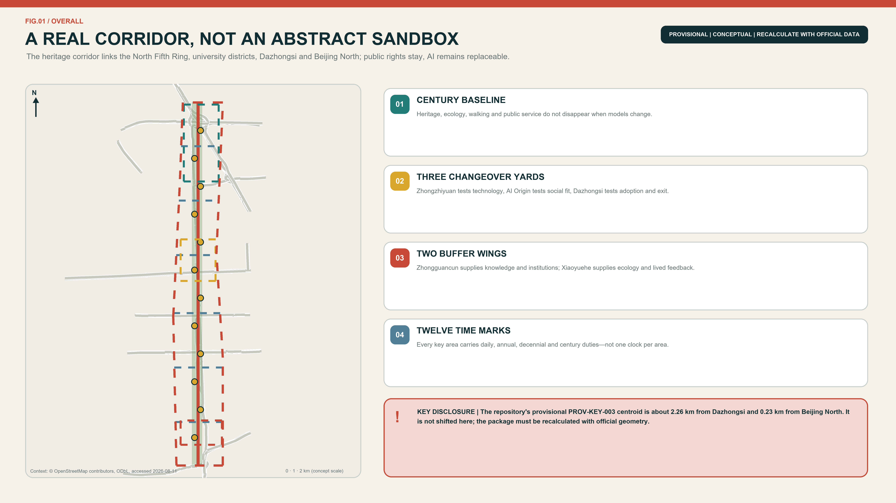
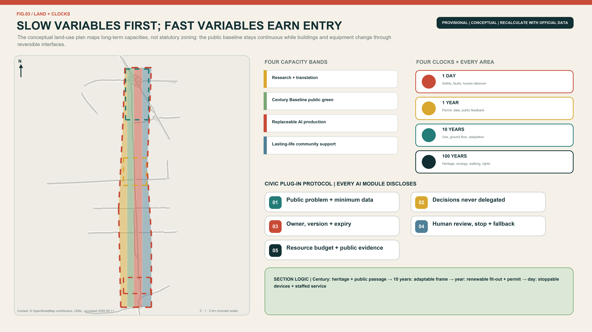
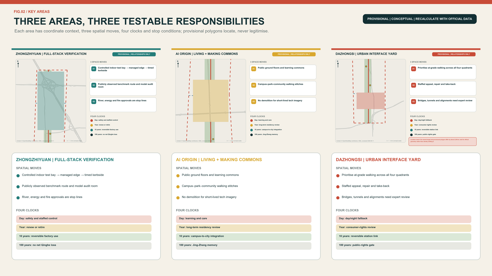
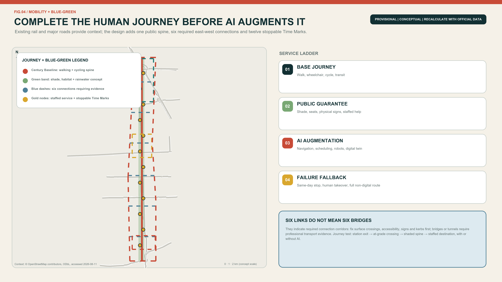
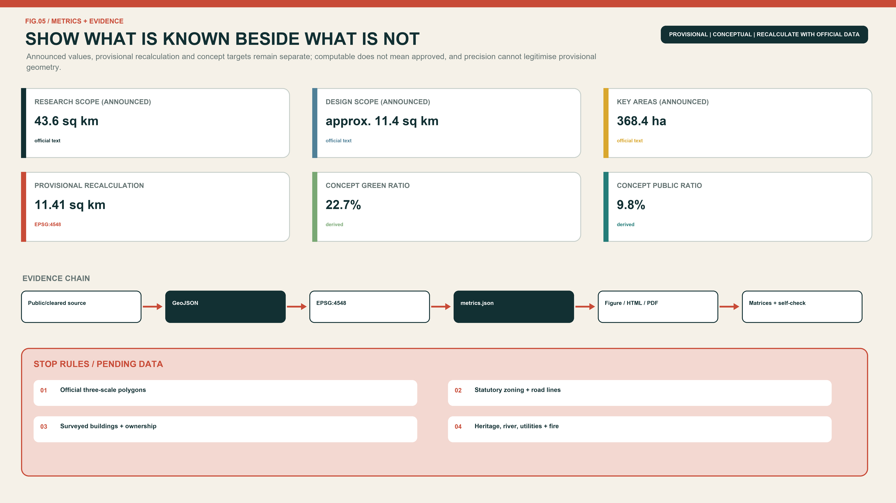

# JING-ZHANG SLOW VARIABLES

> **Fast technology, lasting life.** Models may change every week; a city cannot be rebuilt every week. This proposal separates the enduring layer of heritage, public space, walking, care and civil rights from a replaceable layer of models, robots, sensors and events. Every AI-enabled service enters the city with five obligations: a review date, a named human owner, a takeover procedure, a non-AI alternative and an end-of-life destination.

## Design Basis and Source List

The evidence hierarchy begins with the competition repository. The official-announcement extract defines the three scales, three key areas and expected design depth. The agent taskbook defines the three positionings, five functions and six mandatory agent tasks. National planning references provide professional principles and land-use terminology; they do not create project-specific statutory controls that have not been released. [source:OFFICIAL-ANNOUNCEMENT] [standard:PROJECT-AGENT-OPEN-CALL-TASKBOOK]

The only geometry currently available is the repository's provisional polygon set, registered on 5 June and reviewed on 7 August 2026. It was fitted to textual extents and announced approximate areas. It may support intake drawings, conceptual geometry and internal recalculation, but it is not an official planning boundary and says nothing conclusive about roads, parcels, ownership, heritage controls or engineering feasibility. [source:PROVISIONAL-BOUNDARY] [data:geometry/site_boundary.geojson#SITE-001]

Sources are separated into formal task evidence, provisional geometry and background precedents. External case studies are used only for factual citation and mechanism transfer; their photographs, maps, logos and layouts are not reproduced. Missing official building surveys, zoning controls, utilities, ownership, traffic sections and heritage controls remain explicit data gaps. The package therefore presents a recalculable conceptual framework and professional hand-off points, not an approved plan. [depth:existing_conditions_diagnosis] [source:SOURCE-REGISTRY]

## Three-Level Scope Framework

The three scales carry different responsibilities. The 43.6-square-kilometre Coordinated Research Area asks how universities, research, capital, urban scenarios and daily life can form a durable ecosystem. The approximately 11.4-square-kilometre Overall Design Area asks how the public spine, land use, walking, blue-green space and renewal projects work together. The 368.4-hectare Key-Area Detailed Design Area asks what the three Changeover Yards should do first, who maintains them and when each action is reviewed. [source:OFFICIAL-ANNOUNCEMENT] [metric:site_area_sqm]

| Scope | Announced size | Responsibility | Design level | Data status |
| --- | ---: | --- | --- | --- |
| Coordinated Research Area | 43.6 km² | Industry, talent life, global links and governance | Strategic research | Textual extent and announced area |
| Overall Design Area | 11.4 km² | Century Baseline, Buffer Wings, land use and renewal | Conceptual RDP-level urban design | Provisional polygon |
| Three Key Areas | 368.4 ha | Three differentiated Changeover Yards | Conceptual implementation interface | Three provisional polygons |

Boundary replacement is part of the design method. When official polygons arrive, the site and key-area boundaries are replaced first; land use, buildings, roads, green space, public space and phasing are then clipped; all areas and ratios are recalculated in EPSG:4548; and the five figures, both HTML views and both drawing sets are regenerated. A geometry change may never be hidden by updating only a cover image. [depth:three_level_scope_framework] [data:geometry/key_areas.geojson#PROV-KEY-001]

This iteration makes only relational claims: the heritage park should stay publicly continuous; east-west links should outrank gated campuses; the three key areas should form a differentiated learning chain; and daily services should not be displaced by a monoculture of offices. FAR, height, coverage, setbacks, road redlines and confirmed floor area remain pending official data. [standard:MOHURD-CONTROL-DETAILED-PLANNING]

## Coordinated Research Area: Industry and Future City Research

The principal name is JING-ZHANG SLOW VARIABLES and the line is “Fast technology, lasting life.” The identity uses a continuous dark line for century-scale heritage and public commitments, a segmented vermilion pulse for replaceable technology, and circular Time Marks where they meet. The naming family is one Century Baseline, three Changeover Yards, two Buffer Wings, twelve Time Marks and four Urban Clocks. All graphics use original geometry and system fonts rather than corporate marks. [source:AGENT-TASKBOOK] [depth:overall_spatial_structure]

The three official positionings remain intact. The Centennial Jing-Zhang Cultural Belt protects continuity of memory; the Urban AI Life Experience Belt protects continuity of everyday service; and the AI Integrated Innovation Belt protects continuity of responsibility from research through testing, adoption, maintenance and retirement. The five official functions become daily full-stack testing, annual ecosystem collaboration, time-limited AI scenarios, shared day-and-night urban life and public lifecycle governance. The Technology Services Wing supplies talent, finance, legal and IP services; the Xiaoyue River Scenario Enablement Wing supplies real needs and feedback. [standard:PROJECT-OFFICIAL-ANNOUNCEMENT]

Eight cases contribute mechanisms rather than visual forms. Barcelona 22@ links innovation to housing, services and green axes. King's Cross combines railway heritage, universities and long-term stewardship. West Chelsea shows why access, light and adjacent-development rules matter to a linear park. Paris Rive Gauche and Urban Lab combine district delivery with real-world pilots. Helsinki's Smart Kalasatama demonstrates small, short-cycle co-created trials. Singapore's Punggol Digital District integrates university, industry and district systems. Amsterdam treats registration, accountability, objections and audit as a lifecycle. Montréal's Mila shows how a neutral research institution can connect open science, transfer and responsible AI. [source:CASE-BCN-22AT] [source:CASE-AMS-ALGO]

The resulting ecosystem moves from controlled technical changeover at Zhongzhiyuan, to social adaptation at AI Origin, to market adoption and maintenance at Dazhongsi. Each transfer requires a Clock Contract recording public-value baseline, permitted data, owner, review date, human takeover, non-AI route and asset afterlife. Haidian's district-wide AI strength is useful background, but district figures are not downscaled into invented project-area outputs or investment promises. [source:HAIDIAN-GOV-REPORT-2026]

## Overall Design Area: Urban Renewal and Regulatory-Plan-Level Urban Design

The spatial structure is one Century Baseline, three Changeover Yards, two Buffer Wings and twelve Time Marks. The Baseline combines heritage, walking, cycling, blue-green space and public service. The Yards specialise in technical durability, social fitness and market maintenance. The Wings move expertise and lived experience into the spine, then return public feedback to research. Six conceptual cross-links identify priorities for east-west walking, cycling and universal access; they are not proposed road redlines. [data:geometry/roads.geojson#ROAD-SPINE-001] [depth:traffic_rail_slow_parking]

Four conceptual land-use bands are recalculable across the provisional area: research and translation; the blue-green public Baseline; replaceable AI production and service; and long-life community support. A stable layer protects green space, public space, basic walking and non-digital service. An adaptable layer accommodates mixed uses and reconfigurable ground floors. A fast layer is reserved for detachable equipment, temporary tests and events. Public-space and green-space polygons may overlap because one records public use and the other ecological/open-space character. [data:geometry/land_use.geojson#LU-001] [metric:green_ratio]

Renewal follows “retain first, adapt second, demolish only after evidence.” Without surveyed buildings, structural condition, ownership or heritage controls, this package makes no demolition decision about a real building. The submitted building polygons are nine conceptual envelopes for reversible partitions, shared ground floors, equipment interfaces and maintenance routes. Height, FAR, coverage, daylight, fire access and parking stay unknown until professional review of official data. [data:geometry/buildings.geojson#BLDG-ZY-01] [depth:retain_renovate_demolish]

Urban character avoids a generic cyber aesthetic. Durable layers use repairable, low-glare materials and shade. Replaceable layers use detachable signs, legible status lights and tactile or written information that does not depend on a QR code. Technical objects may not occupy an accessible route or replace seats, shade, water, help points and other fundamentals. [standard:MOHURD-URBAN-DESIGN-MEASURES]

## Detailed Design of Key Areas

**Zhongzhiyuan - Daily Changeover Yard.** This is the full-stack innovation and reliability gateway. It combines a controlled low-speed test loop, model and edge-device changeover bays, a public benchmark gallery and a staffed takeover room. Only systems that pass the safety gate reach the public edge; deep testing remains isolatable. Existing structures are to be retained or adapted where evidence permits, while new insertions remain demountable and serviceable. Testing, logistics and public walking are separated by time as well as space. [data:geometry/key_areas.geojson#PROV-KEY-001] [depth:three_key_area_detailed_design]

**Beijing AI Origin Community - Annual Living Commons.** This is the near-campus translation and talent-staying core, not merely a startup showroom. Shared ground floors, bookable classrooms, a family-friendly commons, quiet work rooms and staffed non-digital counters connect campuses, communities and the park. Students, residents, carers and frontline operators review services before launch; the annual review decides renewal, reduction or exit. Housing mix, ownership and campus links remain conceptual pending statutory and stakeholder evidence. [data:geometry/key_areas.geojson#PROV-KEY-002] [source:CASE-LON-KX]

**Dazhongsi - Decennial Reuse Yard.** This is the adoption and long-term maintenance gateway for AI-native businesses. The priorities are walking continuity across the four station quadrants, active and inclusive ground floors, night safety and kerb/parking management. A product take-back desk, Public Adoption Hall and maintenance workshop convert purchase into a supported service relationship. Commercial activity must retain free places to stay, account-free access and staffed help. [data:geometry/key_areas.geojson#PROV-KEY-003] [source:CASE-NYC-HIGHLINE]

**Location-offset disclosure.** The current `PROV-KEY-003` directly retains the repository's provisional source geometry. Its centroid is approximately 39.94692° N, 116.34850° E: about 2.26 km from Dazhongsi metro station and 0.23 km from Beijing North Railway Station, so the polygon does not align with its Dazhongsi name anchor. This proposal neither shifts the polygon independently nor invents precision. The moves in this section are therefore functional directions for the Dazhongsi task, not site or engineering conclusions from the submitted polygon. Official key-area geometry must trigger recalculation of geometry, metrics, figures, evidence matrices and bilingual narrative anchors. [source:ISSUE-1029] [data:geometry/key_areas.geojson#PROV-KEY-003]

All three Yards use one handover sheet. Zhongzhiyuan transfers technical boundaries and failure records. AI Origin transfers user feedback and equity review. Dazhongsi transfers operating cost, adoption conditions and retirement routes. Failure at one gate never implies automatic progression. Every key-area polygon is provisional, so detailed placements express relationships and priorities only and must be recalculated when official geometry arrives. [source:PROVISIONAL-BOUNDARY]

## AI Innovation Ecosystem, Personas, and AI+ Scenarios

Six personas reveal whether innovation supports a lasting life. An early-career researcher needs attainable short-stay housing, night safety and peers. A startup team needs small test spaces, compliance and procurement translation. A worker with children or care duties needs predictable time and service. An older or disabled resident needs accessibility, a staffed route and freedom from digital exclusion. A frontline cleaner, guard, technician or service worker needs training and real takeover authority. An international developer or visitor needs multilingual orientation and a route into community life. Personas are planning lenses, never identity scores. [source:AGENT-TASKBOOK]

| ID | Scenario and type | Place and users | Minimum data and human review | Expiry and non-AI route |
| --- | --- | --- | --- | --- |
| S01 | Model Expiry Label - industry test | Zhongzhiyuan; teams and buyers | Version, purpose, benchmark, owner; independent sign-off | 90-day review; physical label and ledger |
| S02 | Low-Speed Robot Endurance Loop - industry test | Zhongzhiyuan; robot teams and pedestrians | Occupancy and event logs, no face recognition; safety marshal | Per-session permit; human delivery/cleaning |
| S03 | City-Model Changeover Bay - industry test | Zhongzhiyuan; planning and operations | Synthetic or cleared data; professional scope check | Retest each release; drawings and site visit |
| S04 | Explainable Walking Navigation | Whole line; walkers, cyclists, disabled users | Obstacles and hours; accessibility review | Quarterly; signs and staffed help |
| S05 | Family Health-Service Navigation | AI Origin; families and older people | Voluntary input, no diagnosis; clinical/social referral | Six months; phone and counter |
| S06 | Campus-Community Learning Assistant | AI Origin; learners and residents | Public courses and bookings; teacher confirmation | Each term; noticeboard and manual booking |
| S07 | Community Legal-Process Guide | AI Origin; residents and small teams | Public procedures, no case dossier; legal review | Six months; legal-aid entry |
| S08 | Night Public-Space Companion | AI Origin/Dazhongsi; night users | Lighting, repairs and active help request, no blanket tracking | Monthly; lights, patrol and help point |
| S09 | Robot Delivery Time Slots | Three areas; shops, residents and couriers | Time slot and kerb use; on-site operator | Clear daily; human delivery retained |
| S10 | Multilingual Heritage Guide | Public spine; visitors and community | Verified history and language preference; curator review | Annual; physical label and volunteer guide |
| S11 | Shared-Space Scheduler | Three Yards; teams and community | Capacity and booking only; venue confirmation | Quarterly; staffed booking and fair quota |
| S12 | Public-Service Degradation Drill - operations test | Dazhongsi; operators and public | Fault tickets and recovery time; duty manager switches mode | Monthly drill; complete manual process |

Every card passes five gates: necessity, minimum data, physical safety, human accountability and exit/asset disposition. S01-S03 are explicit industrial testing scenarios, while S12 tests recovery after public-service failure. All cards provide notice, choice, appeal and an accessible alternative. AI outputs may not directly decide medical care, education, legal outcomes, employment or eligibility for public resources. [standard:PROJECT-AGENT-OPEN-CALL-TASKBOOK]

The operating loop is research, validation, shared use, maintenance and retirement. Researchers document performance; independent reviewers and professionals operate the technical gate; user representatives operate the social gate; service owners operate the delivery gate; and an annual public ledger records renewal, pause, incidents and repair. Fast model replacement is kept separate from repeated construction by using stable interfaces and reusable spatial modules. [source:CASE-HEL-KALASATAMA]

## Land Use, Building Scale, and Retain-Renovate-Demolish Strategy

Four conceptual land-use bands partition the provisional site: research and translation; the blue-green Century Baseline; replaceable AI production and service; and long-life community support. Their codes follow the repository subset of the national land-use classification. They are a functional balancing device, not parcel ownership or approved zoning. Community support explicitly accommodates education, culture, daily service, housing and small commerce so an innovation district remains a place to live. [standard:MNR-LAND-USE-CLASSIFICATION-GUIDE] [data:geometry/land_use.geojson#LU-002]

Buildings are organised by layer life rather than futuristic appearance. Structural shells and public ground floors should be stable for decades; building services, partitions and shared programmes may change in five to ten years; sensors, robot docks, exhibits and event components should be removable within a year. The nine submitted footprints are envelopes for changeover modules, not a surveyed building stock or approved construction programme. [metric:building_footprint_area_sqm] [data:geometry/buildings.geojson#BLDG-AO-02]

Retain-renovate-demolish decisions pass four evidence gates: heritage/structure/ownership/current use; fitness of retention and adaptive reuse; lifecycle comparison of low-disruption retrofit and new build; and only then a parcel-level decision. Current evidence supports only a principle of retention first, adaptation second and reversible insertion. It does not support naming a real building for demolition. [depth:retain_renovate_demolish]

FAR, height, coverage, green ratio as a statutory control, setbacks, daylight and parking remain pending. Once official boundaries and controls are available, a parcel capacity table should be tested against public space, transport, utilities, fire safety, daylight and heritage rather than a single maximum FAR. Talent stays and family services are functional directions, not promised housing quotas or eligibility rules. [depth:development_intensity_controls]

## Transport, Rail, Municipal Infrastructure, and Public Services

The movement framework combines one north-south public walking/cycling Baseline with six conceptual east-west links. The Baseline carries continuous accessible movement and cultural interpretation. Cross-links prioritise connections to campuses, communities, stations and both Wings, but remain need corridors rather than construction alignments. The final 500 metres from transit should be walk-first. Test vehicles are time-, speed- and area-limited and can be stopped immediately by on-site staff. [data:geometry/roads.geojson#CROSS-03] [metric:mobility_crosslink_count]

Transit integration begins with people: step-free routes, crossing time, shade, seating, night lighting and physical wayfinding are checked before autonomous shuttles, parking or loading. The four Dazhongsi quadrants, other station exits and detailed transfer arrangements require official station, road, flow and fire-safety evidence. This proposal therefore defines priority and interfaces rather than an engineering alignment. [depth:traffic_rail_slow_parking]

Municipal and digital systems follow one rule: the city base does not depend on AI; AI only augments it. Water, power, heat, communications, drainage, fire systems and emergency broadcasting retain independent safe operation. Edge computing, sensing and twins attach through separable interfaces. Data are minimised as public, operational or sensitive, with purpose, retention period and owner recorded. Intelligent control degrades to established operation during failure. [depth:municipal_new_infrastructure] [source:CASE-SG-PDD]

Every AI public-service interface visibly lists the staffed counter, opening time, account-free route, help point and accessible mode. Health applications navigate and refer rather than diagnose; education does not replace teacher judgement; legal tools do not adjudicate; safety tools avoid indiscriminate biometric surveillance. Capacity and final location await the missing public-facility baseline. [source:AGENT-TASKBOOK]

## Blue-Green Network, Public Space, and Urban Character

The Century Baseline is first a place to walk, rest, cool down and seek help, and only second a technology display. The submitted green-space polygon creates a continuous conceptual band. Twelve small public Time Marks connect the Yards. Their EPSG:4548 areas generate `green_ratio` and `public_space_ratio`; both are internal design readings from provisional geometry, not statutory ratios or approved controls. [metric:green_ratio] [metric:public_space_ratio]

Three pilgrimage landmarks perform ordinary public duties. The **Century Gauge** aligns verified railway, innovation and resident contributions while leaving unknown history blank. The **Changeover Clock** shows the version, owner, next review and fault state of each scenario rather than an advertising leaderboard. The **Offline Commons** provides physical guidance, staffed service, water, seating, charging and quiet space, demonstrating that the city still works without AI. Distributed Slow-Variable Archive Cabinets hold open documentation, failure records and maintenance manuals. [source:JZ-PARK-PLANNING-2021]

The cultural route has three chapters: Building the Line, in which Jing-Zhang is public engineering memory; Growing the City, in which Zhongguancun moves knowledge into innovation; and Staying Together, in which AI is admitted to daily life only when it is maintainable, contestable and retireable. Exhibit labels distinguish fact, inference and concept. People, companies and trademarks enter a final exhibition only with permission. [source:OFFICIAL-ANNOUNCEMENT]

Character is divided between durable and changeable layers. Durable elements are shaded, repairable, low-glare and materially restrained. Changeable elements use bolted connections, replaceable panels and common interfaces. Night lighting communicates safety, opening and status without creating a bright cyber canyon. Planting, water management, sponge-city engineering, heritage views and material specifications await site and professional studies. [depth:blue_green_public_space]

## Renewal Projects, Implementation Policy, and Phasing

Nine project packages make the concept grabbable: P01 Century Baseline continuity audit; P02 six cross-link site surveys; P03 Zhongzhiyuan controlled changeover loop; P04 AI Origin Lasting-Life Commons; P05 Dazhongsi Adoption and Repair Hall; P06 twelve Time Mark components; P07 three pilgrimage landmarks; P08 Clock Contract and public ledger; and P09 official-data replacement with whole-package recalculation. Each carries prerequisites, suggested owners, public-review points and exit conditions. [depth:renewal_project_list] [data:geometry/phasing.geojson#PHASE-001]

Phase 1, years 0-2, is low-disruption and reversible: baseline surveys, accessibility and walking audits, a staffed commons, three industrial tests, Clock Contracts and Time Mark prototypes. Phase 2, years 3-5, may adapt the three Yards, station interfaces and blue-green continuity only after official boundaries, controls, ownership and professional studies exist. Phase 3, years 6-10, expands, reconstructs or retires according to public evaluation and may transfer proven mechanisms into the Wings. [depth:phasing_implementation]

The annual programme follows four clocks: daily operating/fault status, quarterly scenario open days, annual renewal hearings and Changeover Week, and a decennial spatial/public-commitment review. International activity includes an Urban AI Durability Challenge, public-service degradation drills, developer-resident repair sessions, residencies and an open yearbook. These are programme concepts rather than funded or confirmed government events. [source:CASE-PARIS-URBAN-LAB]

A proposed Slow Variables Council would include planning, landscape, transport, utilities, heritage, law, AI safety, operations, resident and accessibility representatives. Operating finance includes maintenance and retirement reserves; procurement includes data exit, model replacement, takeover and asset recovery. The Technology Services Wing supports expertise and finance, the Scenario Wing supports lived trials, and the three Yards manage staged handover. [source:CASE-MTL-MILA]

## Metrics, Area Recalculation, and Compliance Matrix

Metrics are separated into three classes. Package facts can be recalculated from submitted geometry: provisional site, green-space and public-space areas, conceptual building footprints, key-area count and cross-link count. Task baselines are announced values such as 43.6 and 11.4 square kilometres and 368.4 hectares. Performance measures - walking continuity, equivalent non-AI coverage, on-time review, recovery time, talent stayability and equitable public-space use - remain unset until field baselines exist. [source:PROCESSED-FACT-PACK]

| Metric | Current state | Formula | Design meaning |
| --- | --- | --- | --- |
| Provisional ODA area | `site_area_sqm` | EPSG:4548 polygon area | Internal denominator only |
| Conceptual green ratio | `green_ratio` | green area / site area | Century Baseline continuity, not statutory control |
| Conceptual public-space ratio | `public_space_ratio` | public area / site area | Supports Time Marks and free stay |
| Conceptual building footprints | `building_footprint_area_sqm` | sum module envelopes | Adaptable modules, not surveyed or approved scale |
| Key areas | 3 | count polygons | Ensures differentiated detail |
| Scenario cards | 12 | count readable cards | At least three industry tests; all take-over and exit capable |
| Cross-links | 6 | count concepts | Site-survey priority, not road redlines |

GeoJSON is stored in EPSG:4326 and measured in EPSG:4548. The land-use partition must remain gap-free and overlap-free within project tolerance, and green, public-space and building metrics are recomputed from their files. The compliance matrix covers seventeen official tasks and six agent tasks; the standard matrix distinguishes addressed rules from data gaps; the depth matrix connects fifteen professional items to prose, geometry, drawings and assumptions. [depth:metrics_recalculation] [data:geometry/green_space.geojson#GREEN-001]

The concept also has a binary quality test. A scenario without an expiry, owner, takeover, non-AI route or retirement destination is incomplete. A spatial project that weakens heritage, blue-green continuity, walking, public access or the choices of vulnerable users cannot offset that loss with an efficiency score. Metrics support comparison and deliberation; they do not automate public decisions. [source:CASE-AMS-ALGO]

## Risk, Copyright, and Compliance

The largest spatial risk is misalignment between provisional polygons and real roads, park limits or key areas. Every figure therefore labels the boundary PROVISIONAL and treats areas as package-internal calculations. Official boundaries, key areas, buildings, ownership, controls, roads, utilities, flood/fire constraints, heritage controls and facilities require a new professional review. The proposal is not an approved regulatory plan, construction permit, investment commitment or engineering basis. [depth:risk_missing_data] [data:geometry/constraints.geojson#none]

The public-data boundary permits only registered public or cleared material. Privacy protection uses purpose limitation, data minimisation and no-personal-data defaults. Copyright treatment limits external material to attributed factual reference. Implementation risk is controlled through small, reversible and exit-capable pilots. Human review retains final responsibility for medical, educational, legal, safety, spatial and public-resource decisions.

AI risk is managed across the lifecycle. Purpose and minimum data are checked before launch; safety staff and human reviewers control operation; appeal and a non-AI equivalent protect choice; fault logs and review decide renewal; retirement deletes or lawfully archives data and recovers devices. Indiscriminate face recognition, hidden social scoring, automated diagnosis, automated legal judgement, automated education eligibility and unexplainable allocation of public resources are excluded. [source:GENERATIVE-AI-MEASURES]

Equity failures can also be spatial: screens exclude people who cannot scan, robots block tactile paths, events displace free use, and innovation rent can push out the workers who maintain the district. Accessibility review, carers and families, frontline takeover authority, quiet rooms, staffed counters and a public ledger therefore operate together. Children, health and disability contexts default to no-personal-data options. [source:BARRIER-FREE-LAW]

All prose, design geometry, diagrams, HTML and PDFs were originally generated for this package. External material is summarised as citation only; no external photograph, raster map tile, logo, portrait or restricted layout is embedded. Five map-based figures use only OpenStreetMap major-road context and Nominatim station anchors as a low-contrast location aid, with source, licence and access date shown on every map; they do not serve as official boundaries, statutory zoning, legal metrics or engineering alignments. [source:OSM-CONTEXT-20260811] The package uses COMMUNITY-DISPLAY-ONLY for project-community display and review. Qualified human teams retain final professional judgement and responsibility for statutory process and implementation. [source:SOURCE-REGISTRY]

## References

1. Beijing Municipal Commission of Planning and Natural Resources, Haidian Branch, official open-call announcement, 9 May 2026. [source:OFFICIAL-ANNOUNCEMENT]
2. Centennial Jing-Zhang AI Innovation Belt repository, agent open-call taskbook extract, 18 May 2026. [source:AGENT-TASKBOOK]
3. Ministry of Housing and Urban-Rural Development, Measures for Urban Design Administration and regulatory detailed planning procedures. [standard:MOHURD-URBAN-DESIGN-MEASURES]
4. Ministry of Natural Resources, land and sea-use classification guidance, 2023. [standard:MNR-LAND-USE-CLASSIFICATION-GUIDE]
5. Barcelona City Council, 22@ implementation materials and Barcelona Impulsa 2025. [source:CASE-BCN-22AT]
6. Greater London Authority and Knowledge Quarter, King's Cross Opportunity Area materials. [source:CASE-LON-KX]
7. New York City Planning, Special West Chelsea District zoning text. [source:CASE-NYC-HIGHLINE]
8. City of Paris, Paris Rive Gauche and Urban Lab innovation districts. [source:CASE-PARIS-URBAN-LAB]
9. Forum Virium Helsinki, Smart Kalasatama agile-piloting tools. [source:CASE-HEL-KALASATAMA]
10. JTC Singapore, Punggol Digital District and Open Digital Platform. [source:CASE-SG-PDD]
11. City of Amsterdam, algorithm policy and *Grip on Algorithms*. [source:CASE-AMS-ALGO]
12. Mila and the Government of Québec, Montréal's AI ecosystem and trustworthy-AI programme. [source:CASE-MTL-MILA]

References support only their adjacent claims. Dynamic institution sizes, planning capacities and historical project figures have not been converted into Jing-Zhang performance promises. External pages were checked on 11 August 2026 and should be rechecked for version, availability and reuse terms at every iteration. [source:SOURCE-REGISTRY]
