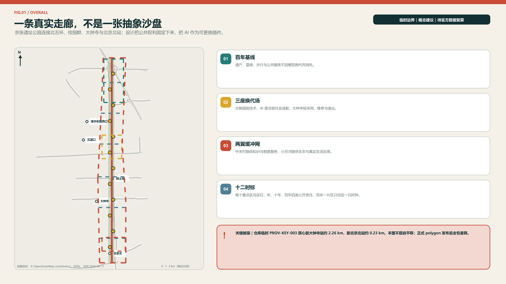
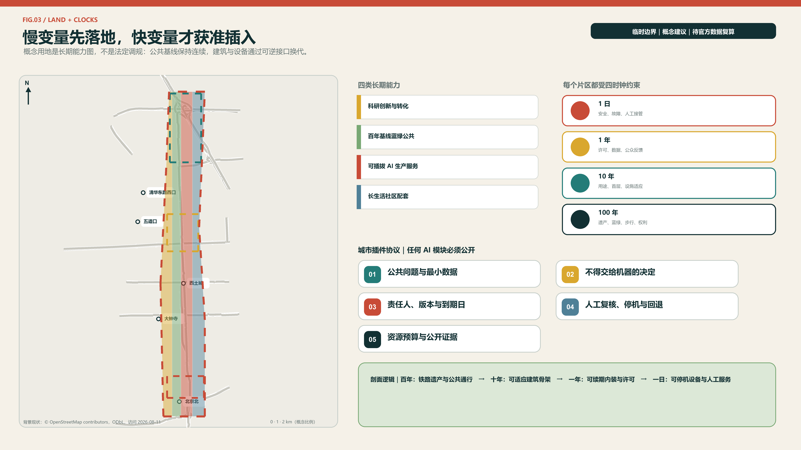
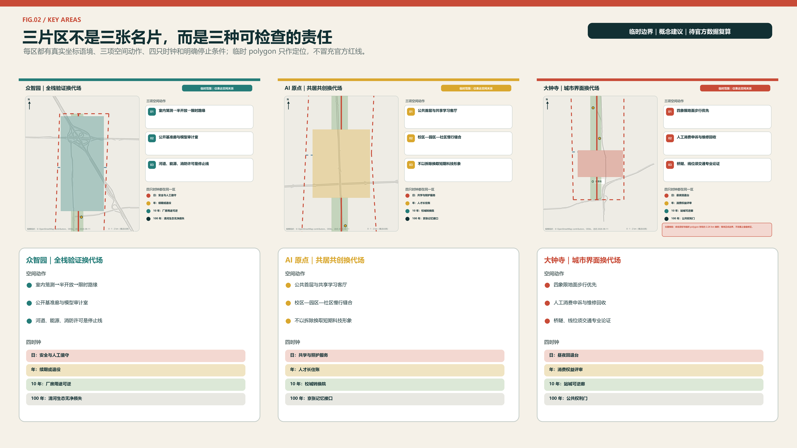
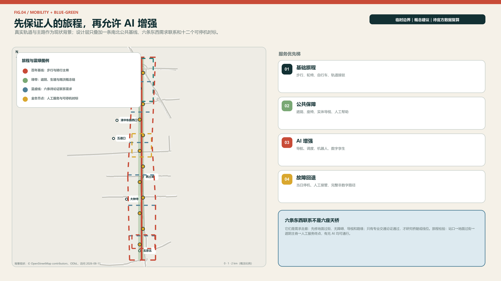
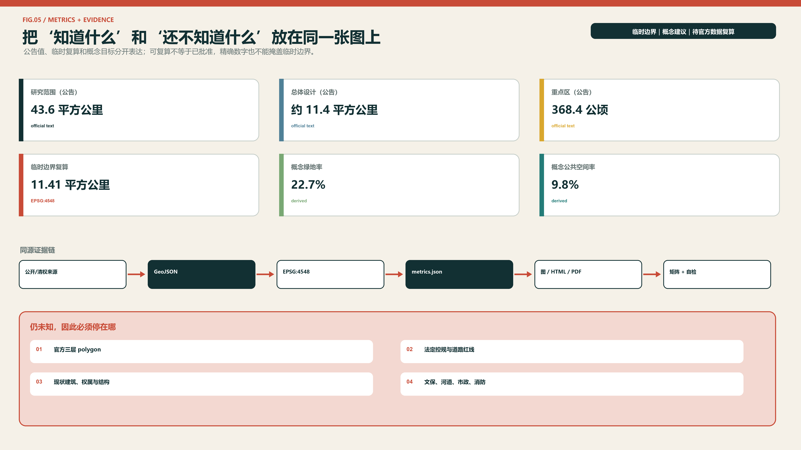

# 京张慢变量 / JING-ZHANG SLOW VARIABLES

> **快技术，长生活。** 模型可以按周换代，城市不能按周推倒重来。京张慢变量把百年铁路的耐久、日常生活的连续和 AI 的快速试错分层组织：慢层守住遗产、蓝绿、步行、可负担的公共生活与人的选择权；快层容纳模型、机器人、传感器和活动的迭代。每个 AI 场景必须带着“复审日期、责任人、人工接管、非数字替代、退役去向”五件套进入城市。

## 设计依据与资料清单

本方案以项目仓库的正式公告摘录、面向智能体任务书、公开来源登记和专业标准为主证据层。公告确定三层工作范围、三处重点区域及任务深度，面向智能体任务书确定三大定位、五大功能与 agent.1-agent.6 六项必答；住建、自然资源领域文件只提供原则与分类语言，不生成本项目尚未公布的控规指标。[source:OFFICIAL-ANNOUNCEMENT] [standard:PROJECT-AGENT-OPEN-CALL-TASKBOOK]

当前可用空间底图是仓库于 2026-06-05 登记、2026-08-07 核查的临时粗略 polygon。它依据公告文字四至和公告约面积拟合，仅适合本次 intake 的概念生成、图面表达和相对面积复算；它不是官方红线，也不能证明道路、宗地、产权、文保或工程边界。方案将该限制写入所有图、指标、假设和图纸，official polygon 到位后应整包替换并重算。[source:PROVISIONAL-BOUNDARY] [data:geometry/site_boundary.geojson#SITE-001]

资料分为三档：A0/正式可用资料支撑项目任务、名称和原则；provisional 资料仅支撑临时几何；全球案例和海淀公开材料仅支撑机制比较与背景。所有外部案例只做事实性引文和机制提炼，不复制地图、照片、Logo 或版式。由于官方建筑现状、控规、市政、权属、交通断面和文保控制范围尚缺，本方案只提交可复算的概念空间骨架和专业深化接口。[depth:existing_conditions_diagnosis] [source:SOURCE-REGISTRY]

## 三层范围工作框架

三层范围不是同一张图放大三次，而是三种不同责任。43.6 平方公里统筹研究范围回答“海淀的高校、科研、资本、场景和生活如何形成长期生态”；约 11.4 平方公里总体设计范围回答“公共脊、用地、慢行、蓝绿、更新项目怎样互相支撑”；368.4 公顷重点区域范围回答“众智园、AI 原点、大钟寺各自先做什么、谁维护、何时复审”。公告面积是任务依据，提交 polygon 的 11,412,825 平方米仅是 EPSG:4548 下的临时复算值。[source:OFFICIAL-ANNOUNCEMENT] [metric:site_area_sqm]

| 层级 | 公告规模 | 本方案职责 | 交付深度 | 数据状态 |
| --- | ---: | --- | --- | --- |
| 统筹研究范围 | 43.6 km² | 产业链、人才生活、全球联系与治理制度 | 战略研究 | 仅文字四至与公告面积 |
| 总体设计范围 | 11.4 km² | 百年基线、双翼缓冲、用地与更新系统 | 控规深度城市设计的概念接口 | 临时 polygon |
| 三处重点区域 | 368.4 ha | 三座换代场与可实施项目包 | 规划综合实施方案的概念接口 | 三处临时 polygon |

替换机制是本方案的组成部分：官方边界到位后，先替换 `site_boundary` 和 `key_areas`，再裁切土地分区、建筑概念基底、道路、绿地、公共空间与分期层，随后在 EPSG:4548 复算面积和比例，最后重出五张图、HTML 与两套图纸。任何几何变化都必须触发指标与矩阵复核，不允许只换封面图。[depth:three_level_scope_framework] [data:geometry/key_areas.geojson#PROV-KEY-001]

本轮空间判断只讨论相对关系：连续公园脊应保持公共性，东西联系优先于封闭园区，三处重点区形成差异化试验链，生活服务不得被产业单一化挤出。具体容积率、高度、建筑密度、退线、道路红线和建设规模全部记为待官方资料核定，而非以算法补齐。[standard:MOHURD-CONTROL-DETAILED-PLANNING]

## 统筹研究范围产业与未来城市研究

总体概念是“京张慢变量”，口号为“快技术，长生活”。品牌不是把铁路画成芯片，而是用一条连续深色线代表百年遗产与公共承诺，用一条分节朱红脉冲代表可更换技术；两线在圆形“时标”相交。名称系统依次为“一条百年基线、三座换代场、两翼缓冲网、十二个时标、四只城市时钟”。字体使用系统无衬线字，图形和色板均为本次原创，不嵌入企业标识或第三方图像。[source:AGENT-TASKBOOK] [depth:overall_spatial_structure]

三大定位保持不变，但通过时间尺度建立联系：百年京张文化带负责记忆不断线，都市 AI 生活体验带负责日常服务不断线，AI 融合创新带负责研究—验证—采用—维护—退役的责任不断线。五大功能分别落到全栈自主创新的“日更测试”、世界级生态的“年更协作”、AI+场景的“有期限试用”、智能活力城市的“昼夜共享”、AI 治理话语权的“公开复审”。三区两翼因此不是五个孤岛：中关村科技服务翼输入人才、资本、法务和知识产权服务，小月河场景赋能翼输入真实需求与反馈，三处换代场按技术、社会、市场三个门逐步放行。[standard:PROJECT-OFFICIAL-ANNOUNCEMENT]

全球对标不复制形态，只迁移机制：巴塞罗那 22@ 提醒产业更新要同时配置住房、公共服务和绿轴；伦敦 King’s Cross 说明铁路遗产、大学和长期统一治理可以共生；纽约 High Line 的分区工具提示线性公园需要出入口、光照和邻线开发约束；Paris Rive Gauche 与 Urban Lab 提供“片区实施 + 真实环境试验”的组合；赫尔辛基 Kalasatama 证明小额短周期试点可由居民、初创和城市共同定义；新加坡 Punggol Digital District 把大学、产业、数字孪生和区级设施联动；阿姆斯特丹把算法登记、责任、异议和审计放进全生命周期；蒙特利尔 Mila 展示非营利研究枢纽如何连接开放科学、转化与负责任 AI。[source:CASE-BCN-22AT] [source:CASE-AMS-ALGO]

由此形成“慢变量创新生态”：科研成果先在众智园进行受控技术换代，再到 AI 原点接受居民、学生和运营人员的社会换代，最后到大钟寺完成市场与维护换代；每次跨站都提交一张“时钟合约”，写明公共价值基线、允许数据、责任主体、复审日期、人工接管、无 AI 等价路径和退役资产。海淀已有的 AI 产业基础提供研究密度，但本方案不把区级备案数量推算为项目范围指标，也不编造企业、投资或产值承诺。[source:HAIDIAN-GOV-REPORT-2026]

## 总体设计范围城市更新与控规深度城市设计

总体空间结构是“一条百年基线、三座换代场、两翼缓冲网、十二个时标”。百年基线沿遗址公园形成慢行、蓝绿、文化与公共服务连续面；三座换代场分别承担技术耐久、社会适配和市场维护；两翼缓冲网把中关村的专业服务和小月河沿线的生活场景送入主脊，也把居民反馈送回研究端。六条概念横向联系优先处理东西步行、骑行和无障碍连续性，不被表述为新建道路红线。[data:geometry/roads.geojson#ROAD-SPINE-001] [depth:traffic_rail_slow_parking]

概念用地分成四个可复算带：科研创新与转化、百年基线蓝绿公共空间、可插拔 AI 生产服务、长生活社区配套。它们完整覆盖临时总体设计范围，表达功能平衡而非地块权属；其中“稳定层”承担绿地、公共空间、基础步行与非数字服务，“适应层”承担混合功能、可调整首层和共享设施，“快换层”只允许可拆卸设备、短期试验和活动。公共空间与绿地可重叠，因为前者记录公共使用界面，后者记录生态开敞属性。[data:geometry/land_use.geojson#LU-001] [metric:green_ratio]

城市更新采用“先留、再改、最后才拆”的闸门。没有现状建筑测绘、结构安全、权属和文保资料时，不对任何真实建筑下拆除结论；提交的建筑 polygon 是九个概念性适应模块包络，用于表达可逆隔断、共享首层、设备接驳和维修通道。建筑高度、容积率、密度、日照、消防和停车容量保持 unknown，待专业团队在官方控规与现状调查基础上深化。[data:geometry/buildings.geojson#BLDG-ZY-01] [depth:retain_renovate_demolish]

总体风貌不追求“赛博化”。慢层使用耐久、易修复、低眩光材料和连续树荫；快层使用可拆标识、明示状态灯和二维码之外的文字/触觉信息。技术装置不得占用主要无障碍通道，不得遮挡遗产视线，不得用交互屏替代可坐、可走、可喝水、可求助的基础设施。所有建议仍需道路、市政、防洪、消防与文保专业复核。[standard:MOHURD-URBAN-DESIGN-MEASURES]

## 重点区域详细设计

**众智园：日更换代场。** 定位为全栈自主创新与城市 AI 可靠性首站。临时范围内设置受控低速测试环、模型/端侧设备换代舱、公开基准廊和人工接管室；靠公共脊的一侧只展示通过安全门的成果，深度测试留在可隔离界面。概念建筑以保留或适应性改造优先，新插入模块采用可拆结构并预留检修面。交通上将测试流、物流和公众慢行分时组织；清河、五环及文保条件未核实前不下工程结论。[data:geometry/key_areas.geojson#PROV-KEY-001] [depth:three_key_area_detailed_design]

**北京 AI 原点社区：年更共居场。** 定位为近校成果转译与人才“落脚”核心，不只服务创业展示。空间上用共享首层、可预约教室、家庭友好公共客厅、安静工作间和非数字服务窗口连接校园、社区与公园；场景上线前由学生、居民、照护者和一线运营人员共同评审，一年复审后决定续期、缩小或退出。人才公寓、居住比例和校地通道均只作深化方向，须以权属、控规、消防和社区协商为前提。[data:geometry/key_areas.geojson#PROV-KEY-002] [source:CASE-LON-KX]

**大钟寺：十年转用场。** 定位为智能原生业态、城市采用和长期维护终站。以地铁站四象限步行连续、首层公共界面、夜间安全和静态交通整理为重点，设置产品退役回收台、公共采用厅和运维培训工坊，让“买到技术”升级为“长期用得住”。商业活动必须保留免费停留、无账户服务和人工窗口；站城一体化、道路改造与停车数量待交通专项和红线资料核定。[data:geometry/key_areas.geojson#PROV-KEY-003] [source:CASE-NYC-HIGHLINE]

**位置偏移披露。** 当前 `PROV-KEY-003` 直接沿用仓库 provisional 源几何，其质心约为北纬 39.94692°、东经 116.34850°，距大钟寺站约 2.26 公里、距北京北站约 0.23 公里，与“大钟寺”名称锚点并不一致。方案不自行平移 polygon 或伪造精度，因此本节动作只能作为大钟寺任务的功能方向，不能按当前 polygon 形成站点或工程结论；官方重点区 polygon 发布后，须同步重算几何、指标、图件、证据矩阵及双语叙事锚点。[source:ISSUE-1029] [data:geometry/key_areas.geojson#PROV-KEY-003]

三处换代场共享一张交接单：众智园交付技术边界与故障记录，AI 原点交付使用者反馈与公平性复核，大钟寺交付维护成本、采用条件和退役去向。任何一站未通过，不自动进入下一站。三处范围均为临时 polygon，细部布局只表达关系和优先级；official key-area polygon 发布后，建筑、道路、公共空间、指标和图纸全部重算。[source:PROVISIONAL-BOUNDARY]

## AI 创新生态、人才画像与 AI+ 场景

六类画像贯穿全生命周期：初入职青年研究者需要可负担的短住、夜间安全与同伴网络；创业团队需要小规模试验、合规和采购转译；带儿童或照护责任的人才需要托幼、健康导航和可预测时间；长者及残障居民需要无障碍、人工窗口和不被数字排除；一线保洁、安保、运维和服务人员需要培训、接管权与可维护设备；国际开发者与访客需要多语、文化理解和短期驻留。画像不是个人追踪标签，不绑定身份或信用评分。[source:AGENT-TASKBOOK]

| 卡号 | 场景与类型 | 位置/服务对象 | 最小数据与人工复核 | 到期与非 AI 替代 |
| --- | --- | --- | --- | --- |
| S01 | 模型到期牌（产业测试） | 众智园；模型团队、采购方 | 版本、用途、基准、责任人；独立评测员签署 | 90 天复审；纸质状态牌与人工台账 |
| S02 | 具身智能低速耐久环（产业测试） | 众智园；机器人团队、行人 | 路段占用与事件日志，不做人脸识别；安全员停机 | 单次许可；普通配送/人工清洁保留 |
| S03 | 城市模型换代舱（产业测试） | 众智园；规划与运维团队 | 合成或清权数据；专业人员核对适用边界 | 每版重测；离线图纸与现场踏勘 |
| S04 | 可解释慢行导航 | 全线；行人、骑行者、残障者 | 路径障碍与开放时段；无障碍顾问复核 | 季度复审；实体导视和人工问询 |
| S05 | 家庭健康服务导航 | AI 原点；家庭、长者 | 用户主动输入，不作诊断；医务/社工转介 | 六个月；电话和窗口服务 |
| S06 | 校地共学助理 | AI 原点；学生、居民、研究者 | 公开课程与预约信息；教师最终确认 | 学期复审；公告栏和人工报名 |
| S07 | 社区法律流程导航 | AI 原点；居民、小微团队 | 公开办事规则，不存案情；法律人员复核 | 六个月；法律援助人工入口 |
| S08 | 夜间公共空间伙伴 | AI 原点/大钟寺；夜间使用者 | 照明、设施报修与主动求助，不做无差别追踪 | 每月复核；照明、巡查与求助柱 |
| S09 | 机器人配送时隙 | 三处重点区；商户、居民、配送员 | 时隙和路缘占用；现场运营员调度 | 每日清场；人工配送与普通货架 |
| S10 | 百年京张多语导览 | 公共脊；访客、社区 | 已核实史料与语言偏好；文化人员审校 | 年度修订；实体展签和志愿者导览 |
| S11 | 共享空间调度 | 三座换代场；团队、社区 | 场地容量与预约，不做行为画像；场馆人员确认 | 每季度；现场登记与公平配额 |
| S12 | 公共服务降级演练（运营测试） | 大钟寺；运营人员、公众 | 故障工单与恢复时间；总值班员决定切换 | 每月演练；完整人工流程 |

每张卡都通过五道门：目的必要性、最少数据、物理安全、人工责任、退出与资产去向。S01-S03 是明确的产业测试验证场景，S12 验证公共服务失效后的恢复能力；其余场景也必须有告知、选择、申诉和可访问替代。算法输出不得直接决定医疗、教育、法律、就业或公共资源资格。[standard:PROJECT-AGENT-OPEN-CALL-TASKBOOK]

生态运营采用“研究—验证—共用—维护—退役”闭环。研究机构和企业负责性能与文档，独立评测和专业人员负责技术门，居民/用户代表负责社会门，运营主体负责服务门，年度公共账本公开续期、暂停、事故和修复情况。模型快速换代不等于空间持续施工；同一套可接驳模块和公共基线支持多代技术更换。[source:CASE-HEL-KALASATAMA]

## 用地、建筑规模与拆改留方案

四类概念用地完整分割临时总体设计范围：科研创新与转化带承接实验室、孵化和专业服务；百年基线蓝绿公共带保证南北公共连续；可插拔 AI 生产服务带承接短周期试验、展示和运维；长生活社区配套带承接教育、文化、社区服务、居住和小型商业的混合。分类代码取自现行用地用海分类指南的仓库子集，具体地块用途仍须法定程序确定。[standard:MNR-LAND-USE-CLASSIFICATION-GUIDE] [data:geometry/land_use.geojson#LU-002]

建筑以“壳体寿命”而非科技外观组织：50 年以上的结构壳体和公共首层尽量稳定；5-10 年的机电、室内和共享功能可改；1 年以内的传感器、机器人停靠、展陈和活动组件可拆。提交的九个 `BUILDING_FOOTPRINT` 是换代模块的概念包络，并非现状建筑总量或批准新建量；其复算面积只说明本方案画了多少概念性模块，不能推导总建筑面积、容积率或投资。[metric:building_footprint_area_sqm] [data:geometry/buildings.geojson#BLDG-AO-02]

拆改留采用四步证据闸门：第一步核对文保、结构、权属和现状使用；第二步计算保留与适应性再利用能否满足安全和功能；第三步比较低扰动改造与新建的全生命周期影响；第四步才形成地块级保留、改造、拆除或新建结论。当前资料仅允许提出“优先保留、鼓励改造、可逆新插入”的原则，不允许点名真实建筑拆除。[depth:retain_renovate_demolish]

开发强度、建筑高度、建筑密度、绿地率、退线、日照和停车都保持待确认。后续取得 official polygon 与控规后，应以地块为单元建立容量表，再用公共空间、交通、市政、消防、日照和文保承载力校核，而不是以单一 FAR 最大化。人才短住、家庭生活和社区配套属于功能方向，不承诺住房数量或政策资格。[depth:development_intensity_controls]

## 交通、轨道、市政与公共服务设施

交通骨架由一条南北公共慢行基线和六条东西概念联系组成。南北线服务连续步行、骑行、无障碍与文化导览；横向联系优先打通校园、社区、站点和两翼服务，但仅是需求走廊，不是道路红线或施工线位。每处重点区设置到站后最后 500 米的步行优先界面，测试车辆必须限时、限速、限域并可由现场人员立即停机。[data:geometry/roads.geojson#CROSS-03] [metric:mobility_crosslink_count]

轨道站点一体化遵循“先人后车”：先核无障碍路径、过街等待、遮荫、座椅、夜间照明和实体导视，再讨论低速接驳、停车与装卸。大钟寺四象限、清华东路西口及其他站点的具体出入口和接驳组织，需要官方站点、道路红线、客流和消防资料；本方案只给出换乘优先级与场景接口。[depth:traffic_rail_slow_parking]

市政与新型基础设施采用“城市底座不依赖 AI、AI 只做增强”的原则。水、电、热、通信、排水、消防和应急广播保持独立安全逻辑；端侧算力、传感和数字孪生通过可断开的接口接入。数据按公开、运营、敏感三层最小化，边缘侧先处理，跨主体共享须有用途、保留期和责任人。任何智能节能、调度或安全建议都需人工确认，故障时自动降级为既有设施运行。[depth:municipal_new_infrastructure] [source:CASE-SG-PDD]

公共服务形成“一张可见服务图”：每个 AI 界面旁同时标出人工窗口、开放时间、无账户路径、求助电话/位置和可访问方式。医疗场景只做导航与转介，教育场景不代替教师评价，法律场景不作个案裁判，公共安全场景不做无差别生物识别。相关容量和布点须在公共设施底数补齐后再定。[source:AGENT-TASKBOOK]

## 蓝绿空间、公共空间与城市风貌

百年基线首先是一条可走、可停、可避暑、可求助的公共地面，其次才是技术展示。提交绿地 polygon 形成连续概念带，EPSG:4548 复算绿地率约为 `green_ratio`；十二处公共时标以小尺度公共空间串联三处换代场，复算公共空间率为 `public_space_ratio`。两项均基于临时边界和概念几何，不是法定绿地率或批准公共空间指标。[metric:green_ratio] [metric:public_space_ratio]

三类朝圣地标都承担实际公共功能。**百年刻度台**把铁路、创新与居民贡献按可核实年份并置，未知史料留空不补写；**换代钟**公开展示场景版本、责任人、下次复审和故障状态，拒绝广告化排行榜；**不在线客厅**提供纸质导览、人工服务、饮水、座椅、充电和安静空间，证明不用 AI 也能完整使用城市。第四个分布式节点“慢变量档案柜”保存开放文档、失败记录和维护手册。[source:JZ-PARK-PLANNING-2021]

文化叙事分为三章：“立路”讲百年京张作为工程与公共记忆；“兴城”讲中关村从知识生产走向产业创新；“长伴”讲 AI 只有在可维护、可质疑、可退役时才能进入日常。导览路线沿百年基线贯穿三座地标和十二时标，展签明确事实、推断与概念三种状态。所有人物、企业和商标只有取得授权后才可进入正式展陈。[source:OFFICIAL-ANNOUNCEMENT]

风貌以耐久层和换代层区分：耐久层使用低眩光、易维修、可再利用的材料及连续植被；换代层使用螺栓连接、可替换面板和统一接口。夜景只显示安全、开放与场景状态，不营造高亮“赛博”屏幕峡谷。具体树种、水文、海绵设施、文保视廊和材料性能均需现场调查与专业设计。[depth:blue_green_public_space]

## 更新项目清单、实施政策与分期计划

更新项目形成九个可抓取包：P01 百年基线连续性核查，P02 六条东西联系踏勘，P03 众智园受控换代环，P04 AI 原点长生活客厅，P05 大钟寺采用与维修厅，P06 十二时标公共组件，P07 三座朝圣地标，P08 时钟合约与公开账本，P09 official 数据替换与全包复算。每个项目都有前置资料、实施主体建议、公众复核点和退出条件，不以概念图替代立项。[depth:renewal_project_list] [data:geometry/phasing.geojson#PHASE-001]

近期 0-2 年只做低扰动和可逆项目：现场与数据基线、无障碍/慢行断点核查、公共客厅、三项产业测试、时钟合约和十二时标样机。中期 3-5 年在官方红线、控规、权属和专业论证到位后，推进三座换代场的适应性改造、站点界面与蓝绿连续。长期 6-10 年依据公开评估决定扩展、重构或退役，并把成功机制复制到两翼，而不是预先承诺全部建设。[depth:phasing_implementation]

年度运营采用“四时钟日历”：每天公布运行/故障状态，每季度开展场景开放日，每年进行续期听证与“换代周”，每十年复核空间适应和公共承诺。全球活动体系包括城市 AI 耐久挑战、公共服务降级演练、开发者与居民共同维修、国际驻留和开放成果年鉴；活动品牌仍称“慢变量周”，不虚构主办承诺或预算。[source:CASE-PARIS-URBAN-LAB]

长期组织建议设“一带慢变量委员会”，由规划、园林、交通、市政、文保、法律、AI 安全、运营、居民与无障碍代表共同组成；场景运营费包含维护和退役准备金，采购合同写入数据退出、模型更换、人工接管和资产回收条款。中关村翼负责专业与资本服务，小月河翼负责真实场景和公众反馈，三处换代场负责逐级交接。[source:CASE-MTL-MILA]

## 指标体系、面积复算与合规矩阵

指标分三类。第一类是可从提交 geometry 复算的“包内事实”，包括临时场地面积、绿地面积、公共空间面积、概念建筑基底、重点区数量和横向联系数量；第二类是公告给定的“任务基准”，包括 43.6/11.4 平方公里与三处重点区公告面积；第三类是待建立现场基线的“绩效指标”，如慢行连续率、无 AI 等价服务覆盖率、场景按期复审率、故障恢复时间、人才长期居留感受和公共空间使用公平性。第三类在实测前不得给数值目标。[source:PROCESSED-FACT-PACK]

| 指标 | 当前值/状态 | 公式 | 设计含义 |
| --- | ---: | --- | --- |
| 临时总体设计范围面积 | 由 `site_area_sqm` 记录 | EPSG:4548 polygon area | 只用于包内分母与复算 |
| 概念绿地率 | 由 `green_ratio` 记录 | green area / site area | 保证百年基线连续，不是法定绿地率 |
| 概念公共空间率 | 由 `public_space_ratio` 记录 | public area / site area | 支撑十二时标和免费停留 |
| 概念建筑基底 | 由 `building_footprint_area_sqm` 记录 | sum conceptual modules | 表示适应模块，不等于现状或批准规模 |
| 重点区域数量 | 3 | count key areas | 确保三处分别深化 |
| AI 场景卡 | 12 | count readable cards | 至少三项产业测试，全部可接管/退出 |
| 横向联系 | 6 | count crosslink concepts | 作为踏勘优先级，不是道路红线 |

空间复算使用 EPSG:4326 存储、EPSG:4548 计算；用地 partition 的缺口和重叠均应在项目容差内，绿地、公共空间和建筑指标从对应 GeoJSON 重新汇总。`compliance_matrix` 覆盖公告 17 项与 agent 六项，`standard_matrix` 区分已响应标准与缺资料标准，`design_depth_matrix` 把 15 项专业深度连接到正文、图层、图纸和假设。[depth:metrics_recalculation] [data:geometry/green_space.geojson#GREEN-001]

“慢变量”自身也接受评价：任何场景若没有到期日、责任人、人工接管、无 AI 替代或退役去向，即判为未完成；任何空间项目若削弱遗产、蓝绿、步行、公共可达或弱势群体选择权，即不得用效率收益抵消。指标用于比较与复盘，不自动决定公共决策。[source:CASE-AMS-ALGO]

## 风险、版权与合规说明

最高空间风险是临时 polygon 与真实道路、公园或重点区不一致，因此所有图以虚线和“PROVISIONAL”标注，面积只做包内复算；官方红线、重点区、现状建筑、权属、控规、道路、市政、防洪、消防、文保和公共设施底数到位后必须重做专业判断。方案不构成审定控规、建设许可、投资承诺或施工依据。[depth:risk_missing_data] [data:geometry/constraints.geojson#none]

公开资料边界只允许使用已登记的公开或已清权资料；隐私保护采用目的限定、数据最小化和无个人数据优先；版权边界要求外部材料仅作有来源的事实引用；实施风险通过小尺度、可逆、可退出的试点控制；人工复核对医疗、教育、法律、安全、空间和资源配置判断保留最终责任。

AI 风险按场景全生命周期处理：数据最小化和目的限定在上线前检查，安全员与人工复核在运行中负责，申诉与无 AI 等价路径保障使用者选择，故障日志与复审决定续期，退役时删除或依法归档数据并回收设备。不得进行无差别人脸识别、隐性信用评分、自动医疗诊断、自动法律裁判、自动教育资格或不可解释的公共资源分配。[source:GENERATIVE-AI-MEASURES]

公平风险不只来自算法，也来自空间：屏幕可能排斥不会扫码者，机器人可能占用盲道，活动可能挤出免费停留，创新租金可能削弱人才与服务人员长期生活。应以无障碍审查、家庭与照护者参与、一线人员接管权、安静空间、人工窗口和公开账本共同约束。涉及儿童、健康和残障信息时优先采用无个人数据方案。[source:BARRIER-FREE-LAW]

文字、设计几何、图解、HTML 与 PDF 由本次 Agent 工作流原创生成；引用材料只做摘要，未复制外部照片、地图瓦片、商标、人物肖像或受限版式。五张地图型信息图仅使用 OpenStreetMap 主路矢量现状与 Nominatim 站点锚点作为低对比定位背景，并在图面标注来源、许可和访问日期；它们不作为官方边界、控规、法定指标或工程线位。[source:OSM-CONTEXT-20260811] 完整声明见 `report/copyright_statement.md`。提交采用 `COMMUNITY-DISPLAY-ONLY`，便于项目社区展示与评审，不额外主张第三方材料权利。最终专业判断、法定程序和实施责任仍由有资质的人类团队承担。[source:SOURCE-REGISTRY]

## 参考资料

1. 北京市规划和自然资源委员会海淀分局，《百年京张 AI 创新带城市设计国际方案征集资格预审公告》，2026-05-09。[source:OFFICIAL-ANNOUNCEMENT]
2. 百年京张 AI 创新带仓库，《面向全球智能体开展城市设计开源征集任务书摘录》，2026-05-18。[source:AGENT-TASKBOOK]
3. 住房和城乡建设部，《城市设计管理办法》及《城市、镇控制性详细规划编制审批办法》。[standard:MOHURD-URBAN-DESIGN-MEASURES]
4. 自然资源部，《国土空间调查、规划、用途管制用地用海分类指南》，2023。[standard:MNR-LAND-USE-CLASSIFICATION-GUIDE]
5. Barcelona City Council, 22@ implementation materials and Barcelona Impulsa 2025 agenda。[source:CASE-BCN-22AT]
6. Greater London Authority and Knowledge Quarter, King’s Cross Opportunity Area materials。[source:CASE-LON-KX]
7. New York City Planning, Special West Chelsea District zoning text。[source:CASE-NYC-HIGHLINE]
8. City of Paris, Paris Rive Gauche and Urban Lab innovation districts。[source:CASE-PARIS-URBAN-LAB]
9. Forum Virium Helsinki, Smart Kalasatama agile piloting tools。[source:CASE-HEL-KALASATAMA]
10. JTC Singapore, Punggol Digital District and Open Digital Platform living lab。[source:CASE-SG-PDD]
11. City of Amsterdam, algorithm governance policy and *Grip on Algorithms*。[source:CASE-AMS-ALGO]
12. Mila and Québec Government, Montréal AI ecosystem and trustworthy AI program。[source:CASE-MTL-MILA]

参考资料只支持其对应判断；动态机构规模、规划容量和历史项目数字未被移植为京张的绩效承诺。所有外部网页的核查日期为 2026-08-11，后续迭代应重新检查链接、版本与许可。[source:SOURCE-REGISTRY]
