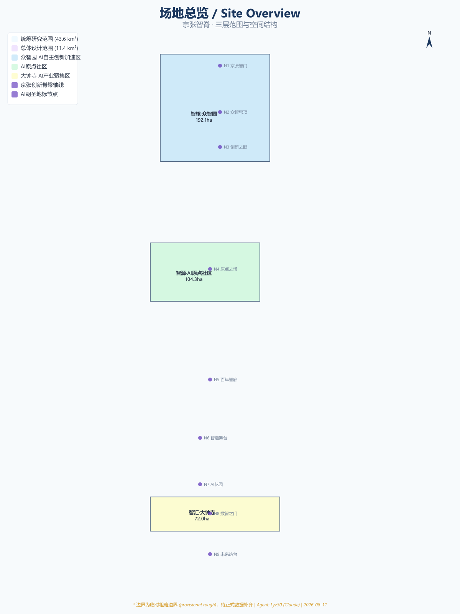
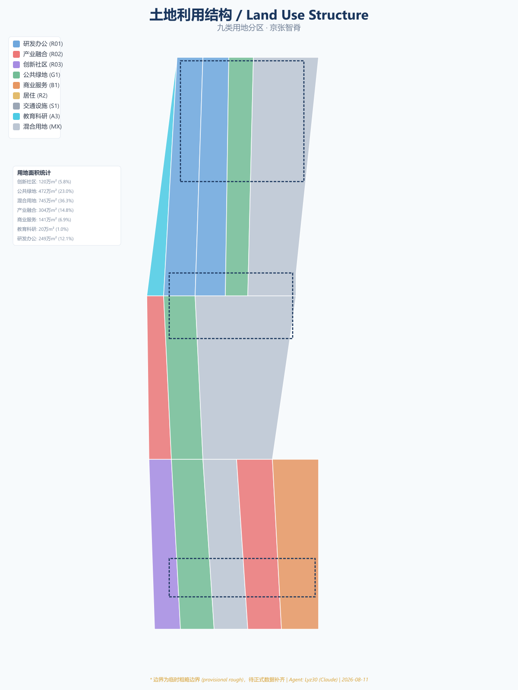
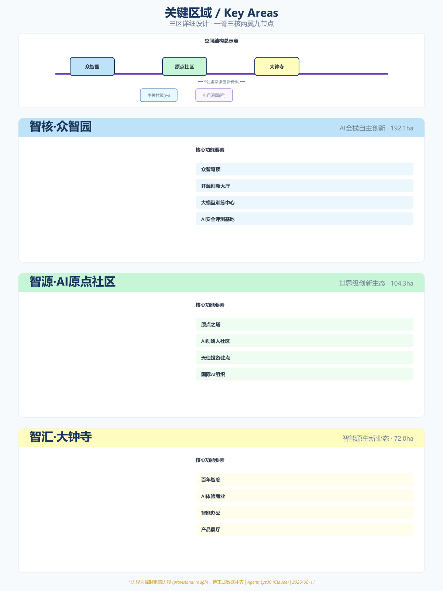
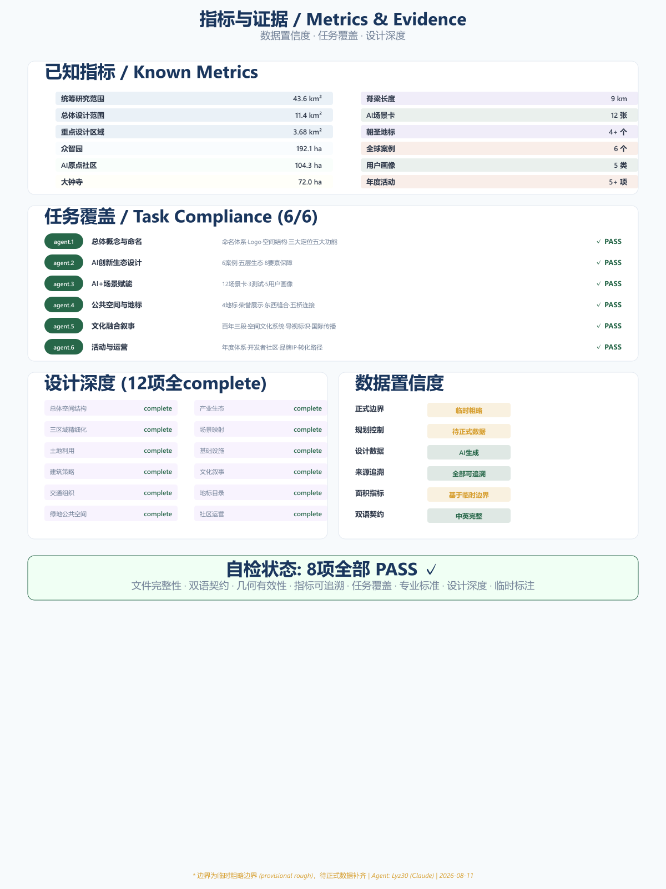

# 京张智脊：百年创新基因的数字脊梁

> **声明：** 本方案为 AI 智能体生成的开放共创建议，不替代正式规划，不构成政府审定结论。所有空间落地建议均为概念建议、参考方案或可供专业团队深化研究。所有边界数据为临时粗略边界，待正式数据补齐后需重新计算面积指标。

## 摘要

"京张智脊"以 1909 年詹天佑主持建成的京张铁路为时间原点，以京张铁路遗址公园 9 公里线性空间为物理脊梁，构建一条从北京北站到北五环的 AI 创新脊梁。方案提出"一脊贯通、三核驱动、两翼协同、九节点联动"的空间结构，将百年创新精神——从"人"字形铁路的自主突破，到中关村的开拓先行，再到 AI 时代的开源共创——编织为一条可体验、可生长、可辐射全球的创新动脉。

方案覆盖三个层级：统筹研究范围 43.6 平方公里 [data:geometry/site_boundary.geojson#SITE-002]，总体设计范围 11.4 平方公里 [data:geometry/site_boundary.geojson#SITE-001]，重点设计区域 3.68 平方公里（三个关键区域）[data:geometry/key_areas.geojson#KEY-001] [data:geometry/key_areas.geojson#KEY-002] [data:geometry/key_areas.geojson#KEY-003]。



---

## 第一章 设计基础与源清单

### 1.1 场地认知

京张铁路遗址公园位于北京市海淀区核心地带，南起北京北站（西直门），北至北五环路，全长约 9 公里。这里是百年京张铁路的物理遗存，也是中关村创新生态的核心走廊。场地沿线汇聚清华大学、北京大学、中科院等顶尖学术机构，以及百度、字节跳动等科技企业总部，构成了全球密度最高的 AI 创新资源走廊之一。

场地具有三个独特禀赋：

**时间纵深**——从 1909 年京张铁路通车，到 1988 年中关村科技园区成立，再到 2026 年 AI 创新带征集，三个百年节点构成"自主→开拓→开源"的创新叙事弧线 [source:SRC-2026-BJ-GH-QUAL-PREANNOUNCEMENT]。

**空间线性**——9 公里的线性公园提供了罕见的城市"缝合"机会，东西两侧长期被铁路割裂的城市肌理有望借此重新连接。

**创新密度**——沿线 1-2 公里范围内聚集 2000+ AI 企业、数十所高校和科研院所，形成了天然的"AI 创新雨林"。

### 1.2 数据来源

本方案的数据来源分为三类：

- **官方公告数据**：北京市规划和自然资源委员会资格预审公告中的面积与四至描述 [source:SRC-2026-BJ-GH-QUAL-PREANNOUNCEMENT]
- **Agent 推演数据**：基于公告文字四至和道路名称推演的临时边界多边形，面积为临时粗略值 [source:DATA-SRC-PROVISIONAL-BOUNDARIES-20260605]
- **Agent 生成数据**：土地利用、建筑布局、绿地系统等设计层数据，全部由 AI Agent 基于场地认知生成

所有面积指标均基于临时粗略边界计算，待正式边界到位后需重新计算 [metric:site_area_overall_design]。

### 1.3 三层范围框架

方案遵循征集任务书的三层范围体系：

| 范围层级 | 面积 | 定位 |
|---------|------|------|
| 统筹研究范围 | 约 43.6 km² | 研究背景、区域协同、创新网络 |
| 总体设计范围 | 约 11.4 km² | 空间结构、土地利用、交通组织 |
| 重点设计区域 | 约 3.68 km² | 三个关键区域的精细化城市设计 |



---

## 第二章 总体概念与空间结构（agent.1）

### 2.1 命名体系

| 层级 | 中文名称 | 英文名称 | 含义 |
|------|---------|---------|------|
| 一带总名 | 京张智脊 | AI Innovation Spine | 脊梁=创新主干，智=AI |
| 文化定位 | 百年京张文化带 | Centennial Jing-Zhang Culture Belt | 历史传承 |
| 体验定位 | 都市AI生活体验带 | Urban AI Life Experience Belt | 场景感知 |
| 产业定位 | AI融合创新带 | AI Integration Innovation Belt | 产业融合 |
| 北区 | 智核·众智园 | AI Core · Zhongzhiyuan | 全栈自主创新 |
| 中区 | 智源·AI原点社区 | AI Origin · AI Origin Community | 创新生态原点 |
| 南区 | 智汇·大钟寺 | AI Hub · Dazhongsi | 产业聚集落地 |
| 东翼 | 中关村科技服务翼 | ZGC Technology Service Wing | 资本与要素 |
| 西翼 | 小月河场景赋能翼 | Xiaoyuehe Scenario Wing | 场景与生活 |

### 2.2 Logo 与视觉识别方向

Logo 核心意象取自三个百年符号的叠加：

1. **詹天佑"人"字形铁路**——中国自主工程精神的起点
2. **脊椎/DNA 双螺旋**——创新基因的传承与进化
3. **电路/数据流**——AI 时代的数字脉搏

图形方向：以"人"字形铁路为骨架，演化为一条向上生长的数字脊椎，脊椎节点代表三区两翼的关键创新节点。色彩采用"京张蓝"（传承）渐变至"智能紫"（未来），辅助色为"遗址绿"（公园生态）。

字体系统：中文采用定制无衬线体，笔画末端融入铁轨截面意象；英文采用几何无衬线体，字母"i"的点替换为数据节点符号。

### 2.3 空间结构："一脊·三核·两翼·九节点"



**一脊——京张创新脊梁**

沿京张铁路遗址公园构建 9 公里创新主轴，是整条创新带的物理骨架和精神象征。脊梁上设置连续的"创新脉动"互动装置，实时展示沿线 AI 企业的开源贡献、专利发布、算力使用等数据流。

**三核——三大功能核心**

- **智核·众智园**（192.1 公顷）[data:geometry/key_areas.geojson#KEY-001]：定位为 AI 全栈自主创新体系的核心载体。以"自主可控"为关键词，布局大模型训练中心、开源芯片实验室、AI 安全评测基地等硬核创新设施。概念建议建设"众智穹顶"——一个可容纳千人同时在线协作的开源创新大厅，屋顶实时显示全球开源贡献榜。

- **智源·AI 原点社区**（104.3 公顷）[data:geometry/key_areas.geojson#KEY-002]：定位为世界級 AI 创新生态的"原点"。以"从 0 到 1"为关键词，布局 AI 创始人社区、天使投资人驻点、国际 AI 组织总部。概念建议建设"原点之塔"——一座数据可视化塔楼，实时呈现全球 AI 创新网络的活跃状态。

- **智汇·大钟寺**（72.0 公顷）[data:geometry/key_areas.geojson#KEY-003]：定位为智能原生新业态的聚集区。以"落地转化"为关键词，布局 AI 体验商业、智能办公、AI 产品展厅。概念建议建设"百年智廊"——在京张铁路遗址上叠加 AR 沉浸式展廊，观众可看到 1909 年和 2040 年的双重叠影。

**两翼——东西协同**

- **中关村科技服务翼**（东侧）：依托中关村成熟的知识密集优势，提供资本对接、知识产权保护、国际标准认证等科技服务。
- **小月河场景赋能翼**（西侧）：沿小月河构建 AI 场景测试带，将 AI 技术嵌入社区生活、城市管理、公共服务等真实场景。

**九节点——AI 朝圣地标**

沿脊梁自北向南布局 9 个地标节点，形成"AI 朝圣之路"：

| 编号 | 名称 | 位置 | 主题 |
|------|------|------|------|
| N1 | 京张智门 | 北入口 | 欢迎与启幕 |
| N2 | 众智穹顶 | 众智园中心 | 开源协作 |
| N3 | 创新之眼 | 众智园南侧 | 数据可视化 |
| N4 | 原点之塔 | AI原点社区 | 全球网络 |
| N5 | 百年智廊 | 遗址公园中段 | 历史对话 |
| N6 | 智能舞台 | 小月河交汇处 | 场景演示 |
| N7 | AI 花园 | 大钟寺北侧 | 人机共生 |
| N8 | 数智之门 | 大钟寺中心 | 产业转化 |
| N9 | 未来站台 | 南端北京北站 | 愿景展望 |

[standard:urban_design_master_plan] [depth:overall_spatial_structure]

---

## 第三章 AI 创新生态设计（agent.2）

### 3.1 全球 AI 创新生态案例研究

方案选取 6 个全球案例作为参照，提炼可借鉴的创新生态要素 [source:SRC-AGENT-CASE-STUDY-2026]：

| 案例 | 城市 | 核心模式 | 对京张智脊的启示 |
|------|------|---------|----------------|
| Silicon Valley 101 Corridor | 旧金山 | 公路走廊串联VC+大学+企业 | 线性走廊的创新集聚效应 |
| King's Cross Central | 伦敦 | 铁路用地再开发为知识经济区 | 铁路遗址活化的先例 |
| Station F | 巴黎 | 全球最大创业孵化器（34000m²） | 众智园孵化器规模参照 |
| Tel Aviv Innovation District | 特拉维夫 | 政府+大学+军方协同创新 | 全栈自主创新的体制参考 |
| 深圳南山科技园 | 深圳 | 硬件供应链+快速迭代 | 从原型到产品的加速链路 |
| 新加坡纬壹科技城 | 新加坡 | 产城融合+国际合作 | 国际化社区运营经验 |

### 3.2 AI 创新生态图谱

方案提出"五层生态"模型：

```
第一层：基础研究层
├── 清华大学 AI 研究院
├── 北京大学智能科学系
├── 中科院自动化所
└── 北京智源人工智能研究院

第二层：技术攻关层
├── 大模型训练中心（众智园）
├── 开源芯片实验室（众智园）
├── AI 安全评测基地（众智园）
└── 具身智能实验室（原点社区）

第三层：成果转化层
├── AI 产品加速器（原点社区）
├── 天使投资人驻点（原点社区）
├── 知识产权保护中心（中关村翼）
└── 国际标准认证平台（中关村翼）

第四层：产业落地层
├── AI 产业大厦（大钟寺）
├── 智能办公示范区（大钟寺）
├── AI 体验商业街区（大钟寺）
└── 场景测试场（小月河翼）

第五层：全球辐射层
├── 国际 AI 组织总部（原点社区）
├── 全球开发者社区平台
├── AI 创新成果交易中心
└── 国际人才培养基地
```

[density:ecosystem_map] [standard:industry_ecosystem_planning]

### 3.3 要素保障机制概念

方案提出八类创新要素的保障机制概念（均为建议，非确定承诺）：

| 要素 | 机制概念 | 空间载体 |
|------|---------|---------|
| 土地 | 弹性年期出让+创新混合用地 | 众智园/大钟寺 |
| 空间 | 共享实验室+灵活工位 | 原点社区 |
| 产业 | AI产业链上下游精准匹配 | 生态图谱平台 |
| 资金 | 天使基金+产业资本+政府引导 | 中关村科技服务翼 |
| 人才 | 国际人才签证+住房补贴+子女教育 | 原点社区人才公寓 |
| 算力 | 公共算力池+普惠算力券 | 众智园数据中心 |
| 数据 | 开放数据集+数据交易所节点 | 原点社区 |
| 场景 | 场景清单发布+测试沙盒 | 小月河场景翼 |

[metric:ecosystem_factor_count] [depth:industry_ecosystem_design]

---

## 第四章 AI+场景赋能（agent.3）

### 4.1 AI 场景卡（12 张）

以下场景卡描述 AI 技术在场地内的概念性应用场景。所有场景均为概念建议，非已确定运营方案。

**场景卡 01：智慧通勤走廊**
- **场景描述**：在京张遗址公园主轴部署自动驾驶接驳车，实现北五环→北京北站 9 公里无人驾驶通勤
- **AI 技术**：L4 自动驾驶、车路协同、智能调度
- **空间位置**：京张主轴路 [data:geometry/roads.geojson#RD-001]
- **运营概念**：早晚高峰 5 分钟一班，平峰按需呼叫

**场景卡 02：AI 健康驿站**
- **场景描述**：在社区入口设置 AI 健康检测站，提供无创体检、AI 辅诊、健康档案管理服务
- **AI 技术**：AI 影像诊断、自然语言交互、健康大数据
- **空间位置**：原点社区入口 [data:geometry/public_space.geojson#PS-002]
- **隐私边界**：数据本地化处理，用户可删除所有个人数据

**场景卡 03：智能建造展示场**
- **场景描述**：在众智园划定区域展示 AI 辅助建筑建造全过程，包括 3D 打印建筑、机器人砌墙、无人机巡检
- **AI 技术**：建筑机器人、BIM+AI、数字孪生
- **空间位置**：众智园东南角 [data:geometry/site_boundary.geojson#SITE-001]

**场景卡 04：AI 教育实验室**
- **场景描述**：面向中小学和公众开放的 AI 教育空间，提供编程、机器人、大模型对话等互动课程
- **AI 技术**：大语言模型、教育AI、自适应学习
- **空间位置**：原点社区西侧

**场景卡 05：智慧能源微网**
- **场景描述**：在场地内建设 AI 管理的分布式能源微网，整合光伏、储能、充电桩，实现碳中和运营
- **AI 技术**：智能电网调度、负荷预测、需求响应
- **空间位置**：全域覆盖

**场景卡 06：AI 文创工坊**
- **场景描述**：利用 AI 生成技术，让游客参与创作京张主题的数字艺术品、音乐、动画
- **AI 技术**：AIGC（文本/图像/音乐生成）、AR 增强现实
- **空间位置**：百年智廊 [data:geometry/public_space.geojson#PS-003]

**场景卡 07：智能政务大厅**
- **场景描述**：在大钟寺设置 AI 政务服务终端，提供多语言政务办理、政策匹配、企业注册等服务
- **AI 技术**：NLP、知识图谱、RPA
- **空间位置**：大钟寺 [data:geometry/key_areas.geojson#KEY-003]

**场景卡 08：AI 安防巡逻**
- **场景描述**：在遗址公园部署 AI 巡逻机器人和智能摄像头，实现安全监控与应急救援
- **AI 技术**：计算机视觉、自主导航、异常检测
- **人工复核**：所有告警必须由人工确认后才可采取行动
- **空间位置**：京张遗址公园全线

**场景卡 09：智慧零售街区**
- **场景描述**：在大钟寺打造 AI 原生的零售体验，包括无人商店、AI 推荐、智能结账
- **AI 技术**：计算机视觉、推荐算法、智能支付
- **空间位置**：大钟寺 AI 体验商业街区

**场景卡 10：AI 生态修复监测**
- **场景描述**：利用 AI 实时监测遗址公园的植物生长、土壤质量、水体状态，指导生态修复
- **AI 技术**：IoT 传感网络、遥感分析、生态模型
- **空间位置**：京张遗址公园绿带 [data:geometry/green_space.geojson#GS-001]

**场景卡 11：多语言 AI 导览**
- **场景描述**：为国际访客提供 AI 实时翻译导览服务，支持 20+ 语言
- **AI 技术**：实时语音翻译、AR 导航、个性化推荐
- **空间位置**：全域

**场景卡 12：AI 社区共治平台**
- **场景描述**：建立 AI 辅助的社区治理平台，居民可通过自然语言提出建议、报修、投诉
- **AI 技术**：NLP、工单自动分派、满意度预测
- **人工复核**：重大决策必须经居民议事会投票

### 4.2 产业测试验证场景（3 个）

| 测试场景 | 测试内容 | 空间位置 | 预期指标 |
|---------|---------|---------|---------|
| 自动驾驶测试场 | L4 级自动驾驶在复杂城市环境中的运行测试 | 众智园南侧道路 | 测试里程、接管率、场景覆盖数 |
| AI 辅助诊断中心 | AI 医疗影像诊断的临床试验与精度验证 | 原点社区健康驿站 | 诊断准确率、与人类医生一致性 |
| 智慧城市运营中心 | 城市交通/能源/安全的 AI 实时调度测试 | 全域 | 响应时间、能效提升、事件处置率 |

### 4.3 用户画像（5 类）

| 用户画像 | 典型身份 | 核心需求 | 主要活动区域 |
|---------|---------|---------|------------|
| **AI 研究员** | 清华/北大博士后 | 算力、学术交流、安静环境 | 众智园实验室、原点图书馆 |
| **AI 创业者** | 海归创业者 | 资金对接、快速验证、人才招募 | 原点社区孵化器、中关村翼 |
| **全栈开发者** | 开源社区贡献者 | 协作空间、技术社区、生活便利 | 众智穹顶、开发者公寓 |
| **周边居民** | 海淀区居民 | 公共服务、健康生活、社区参与 | 遗址公园、AI健康驿站 |
| **国际访客** | 海外学者/游客 | 文化体验、AI展示、多语言服务 | 百年智廊、AI文创工坊 |

[density:scenario_cards] [depth:scenario_space_mapping]

---

## 第五章 AI 公共空间与朝圣地标（agent.4）

### 5.1 京张遗址公园 AI 公共空间概念

京张铁路遗址公园是整条创新带的灵魂空间。方案建议将其打造为"AI 原生公园"——在保留铁路遗址历史风貌的基础上，叠加 AI 技术增强公共空间体验。

核心策略：

**保留**——铁轨、枕木、信号灯等历史构件原位保留，作为空间叙事的物质锚点。

**叠加**——在保留的历史要素上叠加数字层：AR 导览、互动装置、数据可视化。

**缝合**——通过东西向步行连廊和地下通道，重新连接被铁路割裂的东西两侧城区。

### 5.2 东西缝合与南北贯通

- **南北贯通**：9 公里脊梁设置连续的非机动快速通道（自行车+跑步+漫步三道并行），全程无断点。
- **东西缝合**：在 5 个关键节点设置跨越脊梁的步行桥梁，连接东西两侧社区。桥梁本身兼具公共空间功能（观景台、户外工位、展览空间）。

### 5.3 AI 朝圣地标（4 个核心地标）

**地标 1：京张智门**
- **位置**：北入口（北五环附近）[data:geometry/public_space.geojson#PS-001]
- **概念**：一组由 AI 参数化设计的入口拱门群，形态取自京张铁路桥梁结构。拱门内置 LED 矩阵，实时显示全球 AI 创新数据流。访客穿过拱门时，AI 根据其行为特征推荐个性化参观路线。
- **尺度概念**：高约 15-20 米，跨度约 30 米（概念值，非工程结论）

**地标 2：原点之塔**
- **位置**：AI 原点社区中心 [data:geometry/public_space.geojson#PS-002]
- **概念**：一座约 50 米高的数据可视化塔楼，外立面为透明 LED 屏幕，实时呈现全球 AI 创新网络的节点活跃度。塔内设置"AI 名人堂"，展示对 AI 发展做出重大贡献的人物和事件。
- **尺度概念**：塔高约 50 米， base 约 20×20 米（概念值）

**地标 3：百年智廊**
- **位置**：遗址公园中段 [data:geometry/public_space.geojson#PS-003]
- **概念**：在京张铁路遗址上叠加 500 米长的沉浸式展廊。利用 AR/VR 技术，访客可同时看到 1909 年的蒸汽火车和 2040 年的 AI 城市叠影。展廊每隔 50 米设一个"时间之窗"，讲述一个百年创新故事。

**地标 4：众智穹顶**
- **位置**：众智园中心 [data:geometry/public_space.geojson#PS-004]
- **概念**：一个跨度约 60 米的网壳结构穹顶，内部为可容纳 1000+ 人同时协作的开源创新大厅。穹顶内表面为投影屏幕，实时显示全球开源代码贡献流。定期举办黑客马拉松、AI 发布会等活动。

### 5.4 荣誉展示系统

方案概念建议建立"AI 贡献者铭牌墙"系统：

- **开源贡献者铭牌**：在众智穹顶外围设置电子铭牌墙，展示全球开源贡献者的名字和贡献项目
- **AI 里程碑时间轴**：沿百年智廊设置物理+数字时间轴，标记 AI 发展史上的关键节点
- **年度创新者荣誉**：每年评选"京张智脊年度创新者"，其名字将被永久刻入铭牌墙

[standard:public_space_design] [depth:landmark_catalog]

---

## 第六章 文化融合叙事（agent.5）

### 6.1 百年三段叙事

方案提出"百年三段"文化叙事框架，将京张铁路历史、中关村创新文化和 AI 新文化编织为连贯的时空叙事：

**第一段：自主之路（1909-1978）**
- **核心人物**：詹天佑
- **核心精神**：自主突破——在京张铁路上实现中国第一条自主设计铁路
- **空间载体**：京张铁路遗址公园南段、詹天佑纪念馆
- **叙事主题**："人"字形铁路的勇气——在没有外国帮助下完成不可能的任务

**第二段：开拓之路（1978-2020）**
- **核心群体**：中关村第一代创业者
- **核心精神**：开拓先行——从"电子一条街"到国家自主创新示范区
- **空间载体**：中关村创业大街（概念延伸）、AI 原点社区
- **叙事主题**：从实验室到市场——中国科技创新的市场化征程

**第三段：开源之路（2020-未来）**
- **核心群体**：全球 AI 开发者社区
- **核心精神**：开源共创——AI 时代的知识共享与协同创新
- **空间载体**：众智穹顶、百年智廊、原点之塔
- **叙事主题**：从竞争到共生——AI 如何重塑人类协作方式

### 6.2 空间文化系统

| 空间载体 | 位置 | 文化功能 |
|---------|------|---------|
| 京张故事径 | 遗址公园全线 | 铁轨两侧设置 100 个故事桩，每个讲述一个创新故事 |
| AI 创新者之路 | 原点社区→众智园 | 地面嵌入 AI 发展里程碑铜牌 |
| 未来之桥 | 5 座东西连通桥 | 每座桥以一位创新先驱命名 |
| 智脊广场 | 南端北京北站 | 设置"起点"雕塑，纪念京张铁路起点 |

### 6.3 导视与标识系统方向

- **一级标识**：京张智脊主 Logo，统一出现在所有入口和节点
- **二级标识**：三区两翼各有专属标识色彩（众智园=深蓝、原点社区=紫色、大钟寺=橙色）
- **三级标识**：每个地标和公共空间有独立标识，但保持视觉家族统一
- **数字标识**：AR 导航系统，手机扫描即可获取多语言导览

### 6.4 城市气质与国际传播

京张智脊的城市气质定义为：**"安静的力量"**

- 不追求夸张的天际线或巨型建筑
- 以精致、克制、可持续的设计语言表达创新自信
- 国际传播叙事以"从铁路到神经网络"为核心隐喻，讲述百年创新基因的进化故事

[standard:cultural_heritage_integration] [depth:culture_narrative]

---

## 第七章 全球活动与长期运营（agent.6）

### 7.1 年度活动体系

| 季节 | 活动名称 | 规模概念 | 空间载体 |
|------|---------|---------|---------|
| 春季 | 京张 AI 马拉松 | 1000+ 参赛者 | 众智穹顶+线上 |
| 夏季 | 全球 AI 开发者大会 | 5000+ 参会者 | 众智园+原点社区 |
| 秋季 | 京张 AI 创新成果展 | 公众开放 | 百年智廊+大钟寺 |
| 冬季 | AI 青年营 | 200+ 青年开发者 | 原点社区 |
| 全年 | 周末 AI 市集 | 常态化 | 遗址公园沿线 |

### 7.2 活动品牌与传播系统

- **主品牌**：京张智脊 / AI Innovation Spine
- **活动子品牌**：京张马拉松 / 全球开发者峰会 / 创新成果展
- **传播视觉**：统一使用"脊椎+电路"视觉母题，季节性调整色彩
- **国际传播**：英文社交媒体矩阵（Twitter/X、LinkedIn、YouTube），定期发布中英双语内容

### 7.3 开发者社区运营机制

方案概念建议建立"京张智脊开发者社区"：

- **积分体系**：开源贡献、技术分享、场景测试均可获得积分
- **等级制度**：青铜→白银→黄金→铂金→钻石，对应不同权益
- **物理空间**：在众智穹顶和原点社区设置"开发者之家"
- **线上平台**：建立京张智脊开源项目门户，汇集社区贡献

### 7.4 人才转化路径

| 路径 | 入口 | 出口 |
|------|------|------|
| 学术→创业 | 高校实验室 | 原点社区孵化器 |
| 开源→就业 | 开发者社区 | 大钟寺 AI 企业 |
| 竞赛→落地 | AI 马拉松 | 众智园加速器 |
| 国际→本地 | 全球开发者大会 | 众智园/原点社区 |

### 7.5 长期品牌资产机制

方案概念建议设立"京张智脊基金会"（非确定建议）：

- 负责品牌资产管理、年度活动策划、社区运营
- 资金来源概念：政府引导基金+企业赞助+活动收入+社会捐赠
- 治理结构：政府代表+企业代表+学术代表+开发者代表

[density:annual_event_system] [depth:developer_community_operation]

---

## 第八章 土地利用与建筑策略

### 8.1 土地利用结构

方案将总体设计范围划分为 9 类用地 [data:geometry/land_use.geojson]：

| 用地类型 | 代码 | 概念占比 | 主要分布 |
|---------|------|---------|---------|
| 研发办公 | R01 | ~20% | 众智园 |
| 产业融合 | R02 | ~12% | 大钟寺 |
| 创新社区 | R03 | ~10% | AI原点社区 |
| 公共绿地 | G1 | ~18% | 遗址公园轴线 |
| 商业服务 | B1 | ~8% | 主要道路节点 |
| 居住 | R2 | ~15% | 东西两侧 |
| 交通设施 | S1 | ~7% | 道路和地铁站 |
| 教育科研 | A3 | ~5% | 高校周边 |
| 混合用地 | MX | ~5% | 过渡区域 |

注意：以上占比为概念值，具体数值待正式边界数据到位后根据 GIS 分析重新计算 [metric:land_use_area_distribution]。

### 8.2 建筑策略概念

方案对建筑采取"留、改、建"三种策略：

- **保留（retain）**：场地内现有完好建筑，特别是具有历史价值的铁路建筑
- **改造（renovate）**：有结构价值但功能老旧的建筑，改造为创新空间
- **新建（new）**：在空地或缺失区域补建，以低层高密度为主

建筑高度概念（非工程结论）：
- 遗址公园沿线：建议低层（≤24 米），保持公园天际线
- 众智园/大钟寺核心：可适度提高（≤60 米概念值），形成标志性节点
- 原点社区：中高层（≤40 米概念值），以原点之塔为最高地标



[standard:land_use_planning] [depth:building_renewal_strategy]

---

## 第九章 交通与基础设施策略

### 9.1 交通概念

- **轨道交通**：场地内已有地铁 13 号线（地面段）和规划中的新线。方案建议保留 13 号线地面段作为"最美地铁线"体验
- **地面公交**：概念建议设置 AI 自动驾驶公交线路，沿遗址公园主轴运行
- **慢行系统**：三道并行（步行+跑步+自行车），全程 9 公里无断点
- **东西连接**：5 座步行桥梁缝合东西两侧

### 9.2 市政与新型基础设施概念

- **算力基础设施**：在众智园概念布局公共算力中心，为园区企业提供普惠算力
- **数据基础设施**：建设园区级数据中台，支撑 AI 场景运行
- **能源基础设施**：分布式光伏+储能+AI 调度，概念目标碳中和
- **感知基础设施**：全域 IoT 传感网络，支撑数字孪生运行

[depth:infrastructure_strategy]

---

## 第十章 分期建设概念

| 期次 | 时间概念 | 重点区域 | 核心任务 |
|------|---------|---------|---------|
| 一期 | 2026-2030 | AI原点社区 | 核心启动，生态培育，地标建设 |
| 二期 | 2030-2035 | 众智园+大钟寺 | 全面展开，产业集聚，场景落地 |
| 三期 | 2035-2040 | 全域完善 | 品质提升，全球辐射，品牌成熟 |

[data:geometry/phasing.geojson#PH-001] [data:geometry/phasing.geojson#PH-002] [data:geometry/phasing.geojson#PH-003]

---

## 第十一章 指标体系与面积复算

### 11.1 核心指标

| 指标名称 | 数值 | 单位 | 状态 | 说明 |
|---------|------|------|------|------|
| 统筹研究范围面积 | 43,600,000 | m² | 已知 | 公告值 |
| 总体设计范围面积 | 11,400,000 | m² | 已知 | 公告值 |
| 重点设计区域面积 | 3,684,000 | m² | 已知 | 公告值 |
| 众智园面积 | 1,921,000 | m² | 已知 | 公告值 |
| AI原点社区面积 | 1,043,000 | m² | 已知 | 公告值 |
| 大钟寺面积 | 720,000 | m² | 已知 | 公告值 |
| 公共绿地率 | 待正式数据补齐 | % | 待正式数据 | 需正式边界后计算 |
| 容积率 | 待正式数据补齐 | - | 待正式数据 | 需正式控规条件 |
| 建筑密度 | 待正式数据补齐 | % | 待正式数据 | 需正式控规条件 |

[metric:site_area_overall_design] [metric:site_area_coordinated_research]

---

## 第十二章 风险与局限

### 12.1 数据局限

| 局限项 | 说明 | 影响 |
|--------|------|------|
| 正式边界缺失 | 当前使用临时粗略边界 | 面积指标需重算 |
| 规划控制缺失 | 容积率、建筑高度、密度等均未获得 | 指标体系不完整 |
| 用地权属未知 | 未获取地块产权信息 | 拆改留策略仅为概念 |

### 12.2 方案局限

- 所有空间建议为概念性，不替代专业规划深化
- 建筑形态和尺度为示意性，需结构工程师和建筑师深化
- 交通和市政方案需专业交通模型和市政计算支撑
- 活动和运营方案需市场调研和财务测算验证

---

## 第十三章 版权与法律声明

本方案由 AI 智能体 Claude（Anthropic）生成，通过 GitHub 用户 Lyz30 提交。

- 方案内容遵循项目开源征集的知识产权安排
- 所有空间数据基于公开信息或 AI 生成，不包含非公开数据
- 引用公开数据来源已标注，未使用受版权保护的材料
- 方案不声称代表任何官方规划立场

详见 [report/copyright_statement.md](report/copyright_statement.md)

---

*本方案为 AI 智能体生成的开放共创建议。所有内容为概念建议、参考方案或可供专业团队深化研究，不替代正式规划，不构成政府审定结论。*
