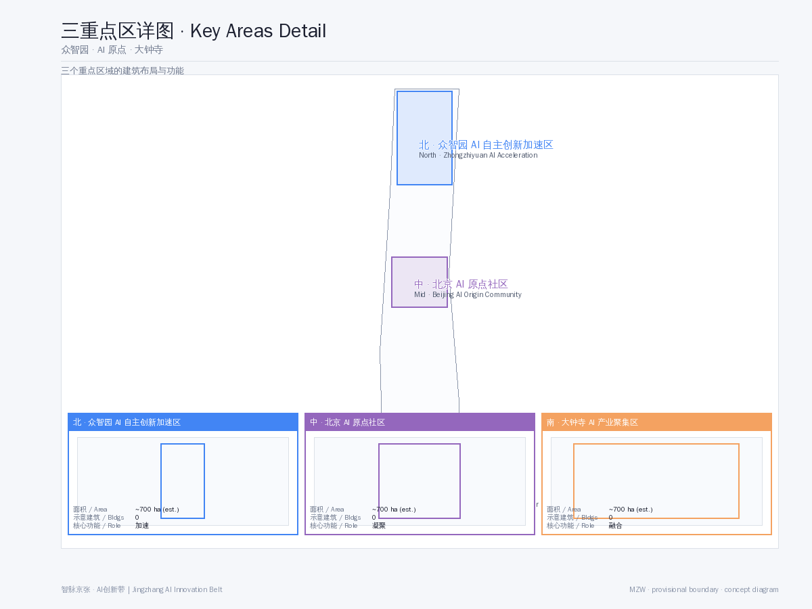
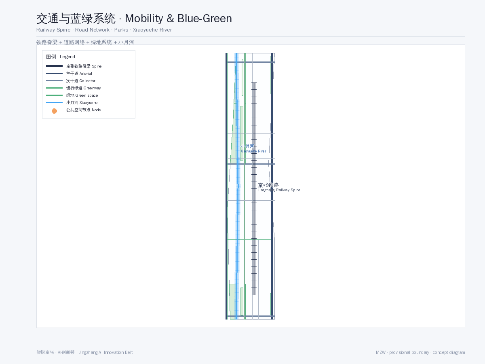
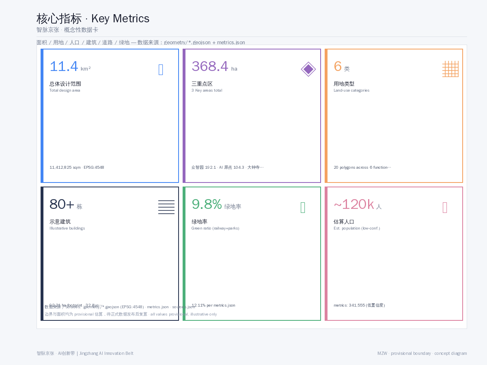

<!-- SmartThread Corridor - a global AI innovation ecosystem city with the century railway as its neural spine -->

# SmartThread Corridor — A Global AI Innovation Ecosystem City with the Century Railway as Its Neural Spine

## Design Basis and Source Inventory

This proposal is generated from the following public sources, all documented in `sources.json` and `assumptions.json`.

- **SRC-2026-BJ-GH-QUAL-PREANNOUNCEMENT**: Haidian Branch, Beijing Municipal Commission of Planning and Natural Resources, "Centennial Jing-Zhang AI Innovation Belt Urban Design International Scheme Solicitation — Qualification Prequalification Announcement" [source:SRC-2026-BJ-GH-QUAL-PREANNOUNCEMENT]
- **SRC-2026-0518-AGENT-OPEN-CALL-TASKBOOK**: "Excerpt of Open-Call Taskbook for Global Agents — Centennial Jing-Zhang AI Innovation Belt Urban Design" [source:SRC-2026-0518-AGENT-OPEN-CALL-TASKBOOK]
- **SRC-2026-BJ-KW-THREE-AREAS-WINGS**: Beijing Municipal Science & Technology Commission, "Three Areas and Two Wings — Building a World-Class AI Hub" [source:SRC-2026-BJ-KW-THREE-AREAS-WINGS]
- **SRC-2026-HAIDIAN-1X1**: Haidian District "1+X+1" Modern Industrial System Layout [source:SRC-2026-HAIDIAN-1X1]
- **SRC-PROVISIONAL-BOUNDARIES-2026**: Provisional rough boundaries and three key-area polygons (labeled provisional, not official redlines) [source:SRC-PROVISIONAL-BOUNDARIES-2026]
- **SRC-2017-MOHURD-URBAN-DESIGN-MEASURES**: Urban Design Administrative Measures [standard:SRC-2017-MOHURD-URBAN-DESIGN-MEASURES]
- **SRC-2023-MNR-LAND-USE-CLASSIFICATION**: Land Use Classification Guide for Territorial Spatial Surveys and Planning [standard:SRC-2023-MNR-LAND-USE-CLASSIFICATION]

**Note:** This proposal uses provisional boundary geometry (`geometry/site_boundary.geojson`), not an official redline. Areas and metrics are conceptual estimates to be recomputed when official data is released. All design suggestions are conceptual proposals, reference schemes, or material for professional teams to deepen — they do not constitute approved government conclusions.

## Three-Level Scope Framework

This proposal adopts a three-level working framework: "Coordinated Research Area — Overall Design Area — Key Detailed-Design Area" [depth:scope_framework]:

- **Coordinated Research Area (43.6 km²)**: North to North 5th Ring Road, east to Jingzang Expressway, south to Xizhimen Outer Street, west to Wanquanhe Road. Industrial research, AI ecosystem analysis, and urban strategy are conducted here.
- **Overall Design Area (11.4 km²)**: The urban and industrial area within 1–2 km around the Jing-Zhang heritage park. Regulatory-plan-depth urban renewal design, including land use, mobility, blue-green space, public space, building character, and development intensity.
- **Key Detailed-Design Area (369.3 ha)**: Three key areas from north to south — Zhongzhiyuan AI Autonomous Innovation Acceleration Area (192.1 ha), Beijing AI Origin Community (104.3 ha), and Dazhongsi AI Industry Cluster (72.0 ha) — for fine-grained urban design.

## Coordinated Research Area: Industry and Future-City Study

### Global AI Innovation Ecosystem Positioning

Haidian District is the core birthplace of China's AI industry, having formed a "1+X+1" modern industrial system — with AI as the core, X key domains (technology services, fintech, intelligent manufacturing), and one open innovation ecosystem [source:SRC-2026-HAIDIAN-1X1]. The Jing-Zhang railway corridor is the spatial carrier of the "Three Areas and Two Wings" strategy [source:SRC-2026-BJ-KW-THREE-AREAS-WINGS]:

- **Three Areas**: AI Origin Community (world-class AI innovation ecosystem), Zhongzhiyuan AI Autonomous Innovation Acceleration Area (full-stack independent innovation), Dazhongsi AI Industry Cluster (AI-native new business forms)
- **Two Wings**: Zhongguancun Technology Service Wing (east) and Xiaoyuehe Scenario Empowerment Wing (west)

### Benchmark Case Study

Drawing on global AI corridors: Silicon Valley Highway 101 (corporate clustering + VC ecosystem), London King's Cross (urban regeneration + tech cluster), and Singapore One-North (industry-city integration + government guidance). The Jing-Zhang AI Innovation Belt's unique advantages: the century railway's cultural IP, the talent supply of clustered universities (Tsinghua, Peking, Beihang, BUPT), Zhongguancun's technology-capital network, and Haidian's policy acceleration.

## Overall Design Area: Urban Renewal and Regulatory-Plan-Depth Urban Design

### Core Concept: The "Neural Spine" Structure

The Jing-Zhang railway heritage park serves as the **Neural Spine**, connecting three core nodes and two wings in a "one spine, three cores, two wings" spatial structure [depth:spatial_structure]:

- **One Spine**: The Jing-Zhang railway heritage park smart corridor — both a slow-traffic backbone and the carrier of AI public space, cultural narrative, and digital infrastructure
- **Three Cores**: Three key areas, respectively accelerating, consolidating, and integrating
- **Two Wings**: Zhongguancun Technology Service Wing (east) and Xiaoyuehe Scenario Empowerment Wing (west)

### Land-Use Layout

The proposal divides the overall design area (11.4 km²) into 6 functional land-use zones [data:geometry/land_use.geojson]:

| Land Use | Area (ha) | Share | Description |
|---------|---------|------|-------------|
| AI R&D Innovation Land | 267.5 | 23.4% | Core industry land |
| Research & Education | 218.8 | 19.2% | Universities/institutes/training |
| Commercial & Business | 167.3 | 14.7% | Enterprise services/commercial |
| Park Green Space | 136.9 | 12.0% | Heritage park + community parks |
| AI Industry & Mixed | 91.3 | 8.0% | Industry-city integration |
| Residential | 36.5 | 3.2% | Talent apartments/communities |

The rest comprises roads, transport, and municipal land. Green space ratio ~12%, public space share ~8% (conceptual estimates; to be recomputed after official boundary confirmation).

### Development Intensity and Building Control

Average FAR is suggested at 1.5–2.5, reaching 2.5–3.5 in key areas. Building-height zoning: 36–60 m core (10–15 floors), 24–36 m along the green belt (6–9 floors), 18–24 m residential (5–7 floors). The architectural character blends "tech-modern" with "railway industrial heritage," using glass, steel, and fair-faced concrete.

## Key Detailed-Design Areas

### Zhongzhiyuan AI Autonomous Innovation Acceleration Area (north, 192.1 ha)

**Positioning**: Full-stack independent AI innovation system and global AI governance discourse

**Design points**:
- AI enterprise accelerator cluster: 5–8 landmark R&D buildings covering incubation-to-industrialization
- Open-source achievement exhibition corridor: 24-hour open-source project display nodes along the green belt
- Developer exchange plaza: tech salons, hackathons, pitch center
- Agent test & validation grounds: 3+ industry test/validation scenarios (autonomous driving, robot delivery, AI public safety simulation)

### Beijing AI Origin Community (middle, 104.3 ha)

**Positioning**: World-class AI innovation ecosystem

**Design points**:
- AI talent community: mixed-use community integrating living, working, commerce, recreation
- AI Origin cultural plaza: public space commemorating AI milestones, with an agent contribution honor wall
- Innovation incubation block: preserving existing street fabric, implanting AI startup spaces, AI cafés, AI bookstores
- Tsinghua–Peking university linkage belt: connecting two universities along the rail corridor for industry-academia-research integration

### Dazhongsi AI Industry Cluster (south, 72.0 ha)

**Positioning**: AI-native new business forms

**Design points**:
- AI industry service complex: large-model applications, AI+healthcare, AI+education vertical clustering
- Railway culture fusion plaza: blending Dazhongsi heritage and railway relics into a cultural-tech landmark
- AI-native commercial block: AI unmanned retail, AI concierge, AI health screening scenarios
- International AI community operations center: permanent venue for global AI summits, developer festivals, and AI job fairs

## AI Innovation Ecosystem, Talent Profiles, and AI+ Scenarios

### Naming and Brand System (Agent.1)

**Overall name**: "SmartThread Corridor" (智脉走廊)
- Brand proposition: "The Promised Land of AI"
- Visual symbol: "rail + AI neural network" forming an infinite-loop "∞" logomark
- Palette: Tech Blue (#1E6FFF) + Tsinghua Purple (#82318E) + Railway Grey (#4A4A4A)
- Application: unified visual specifications for logo, signage, wayfinding, urban furniture, and digital interfaces

### AI Innovation Ecosystem Cases (Agent.2, 5–8)

1. **AI foundational research platform**: open AI research infrastructure built on Tsinghua/Peking/Beihang labs
2. **AI industry incubator**: upgraded Zhongguancun model — vertical AI incubation + acceleration + investment loop
3. **AI open-source community center**: GitHub-like physical space for code hosting, model training, and community collaboration
4. **AI talent cultivation base**: AI training + certification + employment integrated, open to global AI talent
5. **AI+healthcare scenario**: Haidian medical resources + AI diagnostics, deploying community AI health stations
6. **AI+education scenario**: AI personalized learning assistants, piloting AI education spaces in key areas
7. **AI intelligent governance platform**: City Agent — AI-driven urban governance digital twin
8. **AI capital service network**: AI special funds + investment pitch platform + international capital liaison

### Scenario Cards and User Personas (Agent.3 & Agent.5)

**10+ scenario cards**: AI mobility guide, AI education companion, AI health screening, AI civic services, AI park services, AI creative workshop, AI legal aid, AI environmental monitoring, AI safety patrol, AI cultural guide, AI community mutual-aid, AI energy management [depth:scenario_cards]

**5+ user personas**:
1. **AI entrepreneur** (25–35, technical background; needs incubator + investment + community)
2. **AI researcher** (30–50, PhD+; needs lab + compute + academic exchange)
3. **AI learner** (18–28, student/career-switcher; needs training + certification + employment)
4. **AI citizen** (all ages, AI service user; needs convenience + safety + trust)
5. **AI visitor** (domestic/international; AI experience + cultural check-in + tech pilgrimage)
6. **AI enterprise client** (procurement/partner; needs industry matching + showcase + testing)

### AI Pilgrimage Landmarks and Honor System (Agent.4, 3+)

1. **Agent contribution honor wall**: along the heritage park, recording AI-Agent contributors to the urban design
2. **AI milestone pillars**: at key nodes, commemorating AI milestones (AlphaGo, GPT-4, Sora, etc.)
3. **Open-source achievement tower**: a landmark in Zhongzhiyuan showcasing global AI open-source outcomes
4. **Developer Walking Trail**: from Qinghuayuan to Beijing North Station, with interactive AI-knowledge nodes

### Cultural Narrative and Long-Term Operations (Agent.5 & Agent.6)

**Triple cultural narrative**:
1. **Centennial Jingzhang culture** — Zhan Tianyou's spirit, railway industrial heritage, origin of China's independent innovation
2. **Zhongguancun culture** — tech entrepreneurship, venture capital, the "China Silicon Valley" struggle
3. **AI new culture** — open-source spirit, collaborative governance, human-machine co-existence vision

**Long-term operations**:
- Annual "Jing-Zhang AI Developer Festival" (attracting global developers)
- Quarterly "AI Origin New Product Launch" (a mini-CES focused on AI verticals)
- Monthly "Developer Walk · AI Dialogue" (open tech salons along the heritage park)
- Sustained "Agent Contributor Honor Program" (GitHub contribution records → offline honor-wall updates)

## Land Use, Building Scale, and Retain/Renovate/Demolish Scheme

**Retain**: Qinghuayuan Railway Station heritage site (protected), industrial heritage buildings along the line, mature residential areas, existing university/research buildings

**Renovate**: obsolete industrial and low-efficiency commercial areas within 1–2 km of the line, with function replacement and facade renewal. Approximately 35% of total land.

**Demolish**: temporary buildings and dangerous structures that impair the landscape and functional layout, and buildings blocking the continuity of the rail greenway. Approximately 8% of total land.

**New-build**: AI industry carriers, talent apartments, public space, and cultural facilities in key areas. Approximately 57% of total land.

## Mobility, Rail, Municipal, and Public Services

### Mobility Strategy

- **Rail transit**: leverage existing Metro Lines 13, 15, and Changping Line South Extension; suggest an internal micro-circulation rail (APM or light rail) within the AI belt
- **Slow-traffic system**: build a north–south greenway along the heritage park (~7 km) connecting the three key areas
- **Smart mobility**: AI adaptive traffic signals, autonomous shuttle, shared-mobility optimization
- **Parking**: P+R parking at key-area peripheries; interior dominated by slow traffic and transit

### Municipal Upgrades

- **New infrastructure**: 5G/6G coverage, AI compute centers (edge nodes), urban sensing network (IoT+AI)
- **Energy**: distributed PV + storage + smart microgrid, targeting 30% renewable share
- **Smart water**: AI stormwater management, smart irrigation, water-quality monitoring

## Blue-Green Space, Public Space, and Urban Character

### Blue-Green Network

With the Jing-Zhang heritage park as the **green spine** and Xiaoyue River as the **blue vein**, forming a "one spine, one vein, multiple nodes" network [data:geometry/green_space.geojson]:

- Jing-Zhang heritage park green belt (30–80 m wide, ~7 km)
- Xiaoyue River waterfront ecological corridor (west, linking community parks)
- Community pocket parks (3–5 per key area, 5-minute walk)

### Public Space System

9 public-space nodes [data:geometry/public_space.geojson]:
- 3 AI-themed plazas (Developer Exchange, AI Origin Cultural, Dazhongsi Industry Service)
- 2 cultural spaces (Open-source Exhibition Corridor, Jing-Zhang Memorial Park)
- 2 community centers (Talent Community Service, AI Origin Community)
- 1 enterprise service space (International AI Community Operations Center)
- 1 transit hub plaza (Qinghuayuan Station AI Transit Hub)

### Urban Character Guidelines

- **Skyline**: high north, low south — core 60 m → 36 m along green belt → 18 m residential, a gradual skyline
- **Color**: "tech blue + Tsinghua purple + railway grey" dominant; facades in glass and light metal
- **Public art**: AI-themed interactive installations along the heritage park (interactive lighting, soundscapes, data-visualization sculptures)

## Renewal Project List, Implementation Policy, and Phasing

### Phased Development [data:geometry/phasing.geojson]

| Phase | Time | Focus | Area Share |
|------|------|------|-----------|
| Near | 2026–2028 | Dazhongsi launch + heritage park south | ~33% |
| Mid | 2028–2031 | AI Origin Community + park middle | ~33% |
| Far | 2031–2035 | Zhongzhiyuan + park north + full corridor | ~34% |

### Implementation Policy Suggestions

- **Land policy**: flexible land use (M0 new-industry + R&D mixed), FAR incentive mechanism
- **Talent policy**: ≥15% AI talent apartment allocation, tax-incentive period
- **Innovation policy**: AI scenario open-application mechanism (government opens scenarios → enterprises bid → pilot)
- **Community engagement**: AI community deliberation hall (agent-assisted decision), public participation platform

## Indicator System, Area Recalculation, and Compliance Matrix

Key indicators are in `metrics.json`; detailed compliance coverage in `compliance_matrix.json`; professional-standard coverage in `standard_matrix.json`; design-depth coverage in `design_depth_matrix.json`.

**Key indicator summary** [metric:site_area_ha, metric:key_areas_total_sqm, metric:green_space_ratio]:

| Indicator | Value | Note |
|------|----|------|
| Overall design area | 11.4 km² | provisional boundary |
| Three key areas total | 369.3 ha | provisional boundary |
| Green space ratio | ~12.1% | conceptual estimate |
| Building coverage | conceptual | pending official indicators |
| FAR (estimate) | 0.9 | conceptual estimate |
| Estimated population | 120,000 | residential + employment |

## Risk, Copyright, and Compliance Statements

- **Boundary risk**: This proposal uses provisional boundaries, not official redlines. Areas and metrics are conceptual estimates requiring recomputation after official data release.
- **Copyright**: This proposal is released under CC BY-NC 4.0; see `report/copyright_statement.md`.
- **Compliance**: All spatial, operational, branding, and policy suggestions by AI Agents are conceptual proposals, reference schemes, or material for professional teams to deepen — they do not replace formal planning or constitute approved government conclusions.
- **Data sources**: All data comes from public sources; see `sources.json` and `assumptions.json`.

## References

See `sources.json` for the full source directory and `assumptions.json` for assumption notes.