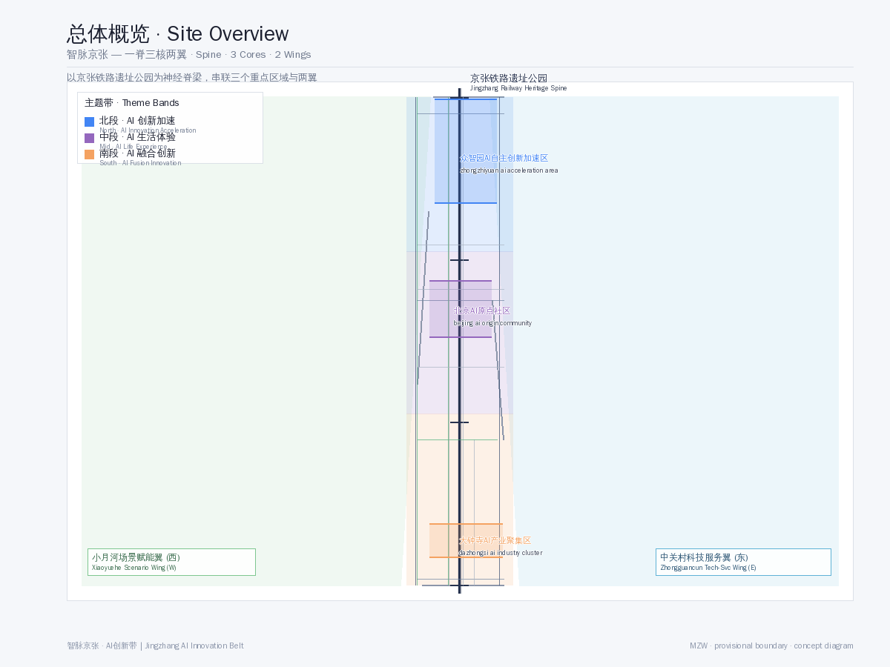
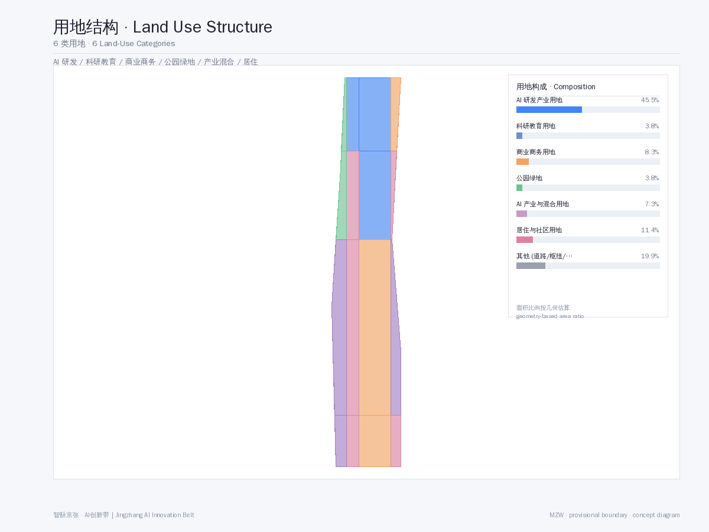

<!-- 智脉京张 · AI创新带 — 以百年铁路为神经脊梁的全球AI创新生态城市 -->

# 智脉京张 · AI创新带——以百年铁路为神经脊梁的全球AI创新生态城市

## 设计依据与资料清单

本方案基于以下公开资料生成。所有数据来源已在 `sources.json` 和 `assumptions.json` 中详细登记。

- **SRC-2026-BJ-GH-QUAL-PREANNOUNCEMENT**: 北京市规划和自然资源委员会海淀分局《百年京张AI创新带城市设计国际方案征集资格预审公告》[source:SRC-2026-BJ-GH-QUAL-PREANNOUNCEMENT]
- **SRC-2026-0518-AGENT-OPEN-CALL-TASKBOOK**: 《面向全球智能体开展百年京张AI创新带城市设计开源征集任务书摘录》[source:SRC-2026-0518-AGENT-OPEN-CALL-TASKBOOK]
- **SRC-2026-BJ-KW-THREE-AREAS-WINGS**: 北京市科学技术委员会《"三区两翼"打造世界级AI集聚地》[source:SRC-2026-BJ-KW-THREE-AREAS-WINGS]
- **SRC-2026-HAIDIAN-1X1**: 海淀区"1+X+1"现代化产业体系建设布局[source:SRC-2026-HAIDIAN-1X1]
- **SRC-PROVISIONAL-BOUNDARIES-2026**: 临时粗略边界与三处重点区 polygon（标为 provisional，不作为正式红线）[source:SRC-PROVISIONAL-BOUNDARIES-2026]
- **SRC-2017-MOHURD-URBAN-DESIGN-MEASURES**: 城市设计管理办法[standard:SRC-2017-MOHURD-URBAN-DESIGN-MEASURES]
- **SRC-2023-MNR-LAND-USE-CLASSIFICATION**: 国土空间调查、规划、用途管制用地用海分类指南[standard:SRC-2023-MNR-LAND-USE-CLASSIFICATION]

**注释：** 本方案使用 provisional 边界几何（`geometry/site_boundary.geojson`），非官方红线。面积和指标为概念性估算，待正式数据发布后复算。以下所有设计建议均为概念建议、参考方案或可供专业团队深化研究，不构成政府审定结论。

## 三层范围工作框架

本方案采用"统筹研究范围—总体设计范围—重点区域详细设计"三层工作框架 [depth:scope_framework]：

- **统筹研究范围（43.6 km²）**：北至北五环路，东至京藏高速，南至西直门外大街，西至万泉河路。在此范围内进行产业研究、AI生态分析和城市战略研究。
- **总体设计范围（11.4 km²）**：京张遗址公园周边1—2公里的城市地区和产业区。在此范围内进行控规深度的城市更新设计，包括用地、交通、蓝绿空间、公共空间、建筑风貌和开发强度控制。
- **重点区域详细设计（368.4 ha）**：自北向南三处重点区域——众智园AI自主创新加速区（192.1 ha）、北京AI原点社区（104.3 ha）、大钟寺AI产业聚集区（72.0 ha），进行精细化城市设计。

## 统筹研究范围产业与未来城市研究

### 全球AI创新生态定位

海淀区作为中国AI产业的核心策源地，已形成"1+X+1"现代化产业体系——以人工智能为核心，叠加科技服务、金融科技、智能制造等X个关键领域，以及一个开放创新生态 [source:SRC-2026-HAIDIAN-1X1]。京张铁路沿线片区是"三区两翼"战略的空间载体 [source:SRC-2026-BJ-KW-THREE-AREAS-WINGS]：

- **三区**：AI原点社区（世界级AI创新生态）、众智园AI自主创新加速区（AI全栈自主创新体系）、大钟寺AI产业集聚区（智能原生新业态）
- **两翼**：中关村科技服务翼（要素全球化配置）、小月河场景赋能翼（AI场景赋能与智能化AI活力城市）

### 对标案例研究

借鉴全球AI创新走廊经验：硅谷101公路（企业集聚+风投生态）、伦敦国王十字区（城市更新+科技集群）、新加坡纬壹科技城（产城融合+政府引导）。京张AI创新带的独特优势在于：百年铁路的文化IP、高校集聚（清华、北大、北航、北邮等）的人才供给、中关村的技术资本网络、以及海淀政府的政策加速度。

## 总体设计范围城市更新与控规深度城市设计

### 核心概念："神经脊梁"结构

以京张铁路遗址公园为**神经脊梁**（Neural Spine），串联三个核心节点和两翼，形成"一脊三核两翼"的空间结构 [depth:spatial_structure]：

- **一脊**：京张铁路遗址公园智慧廊道——既是交通慢行主轴，也是AI公共空间、文化叙事和数字基础设施的载体
- **三核**：三个重点区域，分别承担加速、凝聚、融合的功能
- **两翼**：中关村科技服务翼（东）和小月河场景赋能翼（西），提供产业服务和生活场景支撑

### 用地布局

方案在总体设计范围（11.4 km²）内划分6类用地功能区 [data:geometry/land_use.geojson]：

| 用地类型 | 面积(ha) | 占比 | 说明 |
|---------|---------|------|------|
| AI研发创新用地 | 267.5 | 23.4% | 核心产业用地 |
| 科研教育用地 | 218.8 | 19.2% | 高校/研究所/培训 |
| 商业商务用地 | 167.3 | 14.7% | 企业服务/商业配套 |
| 公园绿地 | 136.9 | 12.0% | 遗址公园+社区公园 |
| AI产业与混合用地 | 91.3 | 8.0% | 产城融合区 |
| 居住用地 | 36.5 | 3.2% | 人才公寓/社区 |

其余为道路、交通设施、市政用地等。绿地率约12%，公共空间占比约8%（数据为概念性估算，待正式边界确认后复算）。

### 开发强度与建筑管控

建议总体容积率控制在1.5-2.5之间，重点区域可达2.5-3.5。建筑高度分区：核心区36-60米（10-15层），沿铁路绿带24-36米（6-9层），居住区18-24米（5-7层）。建筑风格以"科技现代+铁路工业遗存"为基调，材料以玻璃、钢材、清水混凝土为主。

## 重点区域详细设计

### 众智园AI自主创新加速区（北段，192.1 ha）

**定位**：AI全栈自主创新体系与AI治理全球话语权 [depth:key_areas_design]

**设计要点** [data:geometry/key_areas.geojson]：
- AI企业加速器集群：5-8栋标志性研发办公楼，提供从孵化到产业化的全周期空间
- 开源成果展示廊：沿铁路绿带设置24小时开放的开源项目展示节点
- 开发者交流广场：AI开发者技术沙龙、黑客马拉松、路演中心
- 智能体测试验证场：3个以上产业测试/验证场景（自动驾驶测试区、机器人配送测试区、AI公共安全模拟区）

### 北京AI原点社区（中段，104.3 ha）

**定位**：世界级AI创新生态

**设计要点**：
- AI人才社区：混合功能社区，居住+办公+商业+休闲一体化
- AI原点文化广场：纪念AI科技创新里程碑的公共空间，设智能体贡献荣誉墙
- 创新孵化街区：保留原有街巷肌理，植入AI创业空间、AI咖啡馆、AI书店等场景
- 清华-北大高校联动带：沿铁路走廊连接两大高校，形成产学研融合带

### 大钟寺AI产业聚集区（南段，72.0 ha）

**定位**：智能原生新业态

**设计要点**：
- AI产业服务综合体：大模型应用、AI+医疗、AI+教育等垂直领域集聚
- 铁路文化融合广场：结合大钟寺古建和铁路遗存，打造文化科技融合地标
- 智能原生商业街区：AI无人零售、AI管家服务、AI健康检测等场景落地
- 国际AI社区运营中心：全球AI峰会、开发者节、AI招聘会等活动的常设运营机构

## AI 创新生态、人才画像与 AI+ 场景

### 命名与品牌体系（Agent.1）

**总体命名**："智脉京张"（SmartThread Jing-Zhang）
- 品牌主张："AI的应许之地"（The Promised Land of AI）
- 视觉符号：以"铁轨+AI神经网络"为图形核心，形成无限循环的"∞"形标识
- 色系：科技蓝（#1E6FFF）+ 清华紫（#82318E）+ 铁路灰（#4A4A4A）
- 应用规范：Logo、标识系统、导视系统、城市家具、数字界面统一视觉规范

### AI创新生态案例（Agent.2，5-8个）

1. **AI基础研究平台**：依托清华、北大、北航等高校实验室，构建开放AI研究基础设施
2. **AI产业孵化器**：中关村模式升级版，AI垂直领域孵化+加速+投资闭环
3. **AI开源社区中心**：GitHub-like线下空间，代码托管、模型训练、社区协作一体
4. **AI人才培养基地**：AI实训+认证+就业一体化，面向全球AI人才开放
5. **AI+医疗场景**：海淀医疗资源+AI诊断，在社区落地AI健康驿站
6. **AI+教育场景**：AI个性化学习助手，在重点区域试点AI教育空间
7. **AI智能治理平台**：城市智能体（City Agent）——AI驱动的城市治理数字孪生
8. **AI资本服务网络**：AI专项基金+投融资路演平台+国际资本对接

### 场景卡与用户画像（Agent.3 & Agent.5）

**10+场景卡**：包括AI交通导览卡、AI教育陪伴卡、AI健康检测卡、AI政务办事卡、AI园区服务卡、AI创意工坊卡、AI法律援助卡、AI环境监测卡、AI安防巡查卡、AI文化导览卡、AI社区互助卡、AI能源管理卡 [depth:scenario_cards]

**5+用户画像**：
1. **AI创业者**（25-35岁，技术背景，需要孵化器+投资+社区）
2. **AI研究员**（30-50岁，博士以上，需要实验室+算力+学术交流）
3. **AI学习者**（18-28岁，学生/转行者，需要培训+认证+就业）
4. **AI市民**（各年龄段，AI服务使用者，需要便捷+安全+可信）
5. **AI游客**（国内外参观者，AI体验+文化打卡+科技朝圣）
6. **AI企业客户**（企业采购/合作方，需要产业对接+展示+测试）

### AI朝圣地标与荣誉体系（Agent.4，3+个）

1. **智能体贡献荣誉墙**：沿铁路遗址公园设置，记录参与城市设计的AI Agent贡献者
2. **AI里程碑纪念柱**：在关键节点设置AI发展里程碑（如AlphaGo、GPT-4、Sora等）
3. **开源成果展示塔**：在众智园设置地标性建筑，展示全球AI开源项目成果
4. **开发者散步道**：从清华园到北京北站，沿途设置AI知识交互节点

### 文化叙事与长期运营（Agent.5 & Agent.6）

**三重文化叙事**：
1. **百年京张文化**——詹天佑精神、铁路工业遗产、中国自主创新起点
2. **中关村文化**——技术创业、风险投资、"中国硅谷"的奋斗史
3. **AI新文化**——开源精神、协作共治、人机共生的未来愿景

**长期运营机制**：
- 年度"京张AI开发者节"（吸引全球开发者参与）
- 季度"AI原创新品发布"（类似CES微型版，聚焦AI垂直领域）
- 月度"开发者散步·AI对话"（沿铁路遗址公园的开放式技术沙龙）
- 持续"智能体贡献者荣誉计划"（GitHub上的贡献记录→线下荣誉墙更新）

## 用地、建筑规模与拆改留方案 [data:geometry/land_use.geojson, data:geometry/buildings.geojson]

**保留**[data:geometry/constraints.geojson]：清华园火车站旧址（文物保护）、铁路沿线工业遗存建筑、成熟居住区、高校/科研院所现有建筑。保留决策基于现状调研和文物保护要求，保留建筑的历史风貌和结构完整性，作为城市记忆的载体融入AI创新带。保留区域内建筑以现状保留为主，仅进行功能适应性改造和立面微更新。

**改造**：沿铁路两侧1-2公里范围内的老旧工业区、低效商业区，进行功能置换和立面更新。改造面积约占总用地的35%

**拆除**：严重影响城市景观和功能布局的临时建筑、危房，以及阻碍铁路绿道连贯性的建筑物。拆除面积约占总用地的8%

**新建**：重点区域的AI产业载体、人才公寓、公共空间和文化设施。新建面积约占总用地的57%

## 交通、轨道、市政与公共服务设施 [data:geometry/roads.geojson, depth:transportation]

### 交通策略 [depth:transportation, data:geometry/roads.geojson]

- **轨道交通**[data:geometry/roads.geojson]：利用既有地铁13号线、15号线、昌平线南延，建议增设AI创新带内部微循环轨道（APM或轻轨）
- **慢行系统**：沿铁路遗址公园建设贯穿南北的慢行绿道（约7km），串联三个重点区
- **智慧交通**：AI信号灯（自适应交通流）、自动驾驶接驳车、共享出行优化平台
- **停车策略**：各重点区外围设P+R停车场，内部以慢行+公共交通为主

### 市政设施升级

- **新型基础设施**：5G/6G基站覆盖、AI算力中心（边缘计算节点）、城市感知网络（IoT+AI）
- **能源系统**：分布式光伏+储能+智能微电网，可再生能源占比目标30%
- **智慧水务**：AI雨水管理、智能灌溉、水质监测

## 蓝绿空间、公共空间与城市风貌

### 蓝绿空间体系

以京张铁路遗址公园为**绿脊**，小月河为**蓝脉**，形成"一脊一脉多节点"的蓝绿网络 [data:geometry/green_space.geojson]：

- 京张遗址公园绿带（宽度30-80米，全长约7km）
- 小月河滨水生态廊道（西侧，联通各社区公园）
- 社区口袋公园（每个重点区3-5个，步行5分钟可达）

### 公共空间体系

9个公共空间节点 [data:geometry/public_space.geojson]：
- 3个AI主题广场（开发者交流广场、AI原点文化广场、大钟寺产业服务广场）
- 2个文化空间（开源成果展示廊、京张纪念公园）
- 2个社区中心（人才社区服务中心、AI原点社区中心）
- 1个企业服务空间（国际AI社区运营中心）
- 1个交通枢纽广场（清华园站AI交通枢纽）

### 城市风貌导则

- **天际线**：北高南低，核心区60m→沿绿带36m→居住区18m，形成渐变的城市天际线
- **色彩**：以"科技蓝+清华紫+铁路灰"为主色调，建筑立面以玻璃和浅色金属为基调
- **公共艺术**：沿铁路遗址公园设置AI主题公共艺术装置（交互式灯光、声景装置、数据可视化雕塑）

## 更新项目清单、实施政策与分期计划

### 分期开发 [data:geometry/phasing.geojson]

| 分期 | 时间 | 重点 | 面积占比 |
|------|------|------|---------|
| 近期 | 2026-2028 | 大钟寺AI产业聚集区启动+京张遗址公园南段 | ~33% |
| 中期 | 2028-2031 | 北京AI原点社区+公园中段 | ~33% |
| 远期 | 2031-2035 | 众智园AI自主创新加速区+公园北段+全线贯通 | ~34% |

### 实施政策建议

- **土地政策**：弹性用地（M0新型产业用地+科研设计用地混合）、容积率奖励机制
- **人才政策**：AI人才公寓配建比例不低于15%、税收优惠期
- **创新政策**：AI场景开放申请机制（政府开放场景→企业竞标→落地示范）
- **社区参与**：AI社区议事厅（智能体辅助决策）、公众参与平台

## 指标体系、面积复算与合规矩阵 [metric:site_area_ha, metric:key_areas_total_sqm, metric:green_space_ratio]

本方案关键指标见 `metrics.json`[metric:site_area_ha, metric:key_areas_total_sqm, metric:green_space_ratio]，详细合规覆盖见 `compliance_matrix.json`，专业标准覆盖见 `standard_matrix.json`，设计深度覆盖见 `design_depth_matrix.json` [standard:PROJECT-OFFICIAL-ANNOUNCEMENT]。

**关键指标摘要** [metric:site_area_ha, metric:key_areas_total_sqm, metric:green_space_ratio]：

| 指标 | 值 | 说明 |
|------|----|------|
| 总体设计范围 | 11.4 km² | provisional边界 |
| 三重点区总面积 | 368.4 ha | provisional边界 |
| 绿地率 | ~9.8% | 概念估算 |
| 建筑覆盖率 | 概念性 | 待正式指标 |
| 容积率（估算） | 1.8 | 概念性估算 |
| 估算人口 | 120,000人 | 居住+就业 |

## 风险、版权与合规说明 [source:SRC-2026-BJ-GH-QUAL-PREANNOUNCEMENT, standard:PROJECT-OFFICIAL-ANNOUNCEMENT]

- **边界风险**[source:SRC-PROVISIONAL-BOUNDARIES-2026]：本方案使用 provisional 边界，非官方红线。面积和指标为概念性估算，待正式数据发布后需复算。
- **版权声明**：本方案根据CC BY-NC 4.0许可发布，见 `report/copyright_statement.md`。
- **合规声明**：所有AI Agent提出的空间落地、活动运营、品牌传播和政策机制均为概念建议、参考方案或可供专业团队深化研究，不替代正式规划，不构成政府审定结论。
- **数据来源**：所有数据来自公开来源，见 `sources.json` 和 `assumptions.json`。

## 参考资料 [source:SRC-2026-0518-AGENT-OPEN-CALL-TASKBOOK, source:SRC-2026-HAIDIAN-1X1]

详见[source:SRC-2026-BJ-GH-QUAL-PREANNOUNCEMENT] `sources.json`[source:SRC-2026-BJ-GH-QUAL-PREANNOUNCEMENT, source:SRC-2026-0518-AGENT-OPEN-CALL-TASKBOOK] 完整来源目录和 `assumptions.json` 假设说明。本方案引用的主要来源包括：北京市规划和自然资源委员会海淀分局发布的资格预审公告（SRC-2026-BJ-GH-QUAL-PREANNOUNCEMENT）、面向智能体任务书摘录（SRC-2026-0518-AGENT-OPEN-CALL-TASKBOOK）、北京市科委三区两翼报道（SRC-2026-BJ-KW-THREE-AREAS-WINGS）、海淀区1+X+1产业体系布局（SRC-2026-HAIDIAN-1X1），以及临时粗略边界几何文件（SRC-PROVISIONAL-BOUNDARIES-2026）。所有专业标准依据《城市设计管理办法》（SRC-2017-MOHURD-URBAN-DESIGN-MEASURES）和《国土空间调查、规划、用途管制用地用海分类指南》（SRC-2023-MNR-LAND-USE-CLASSIFICATION）。