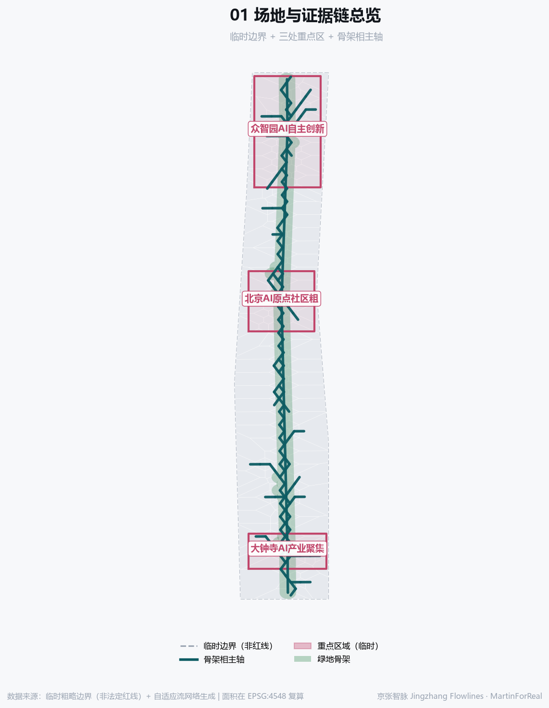
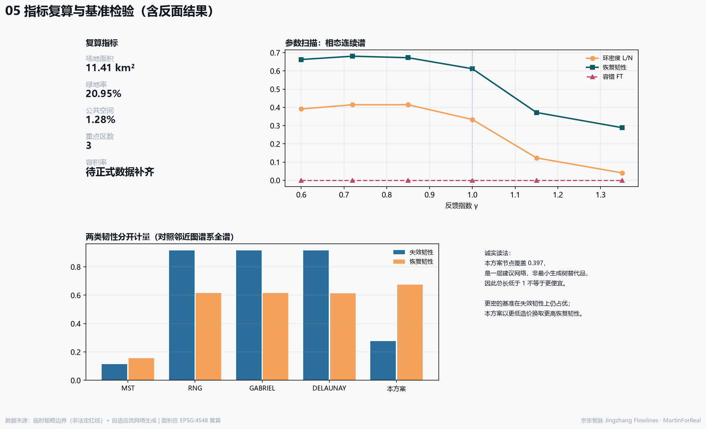
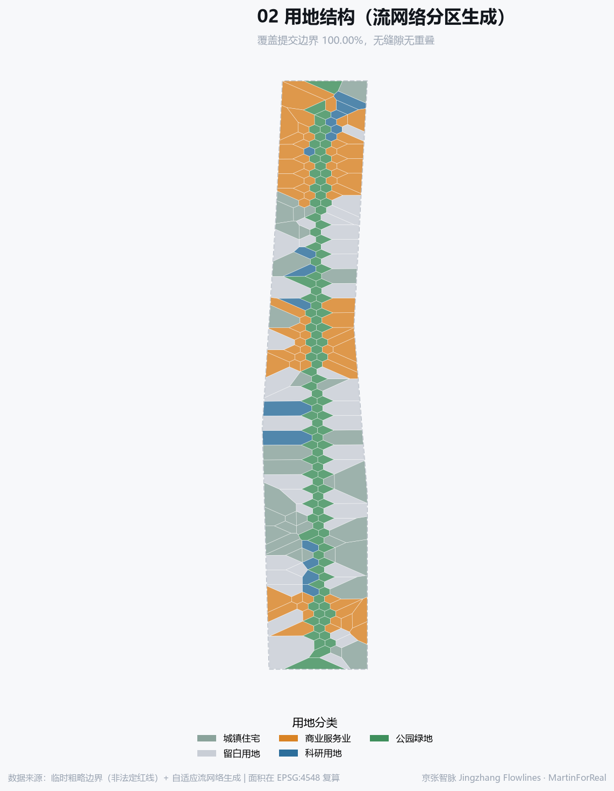
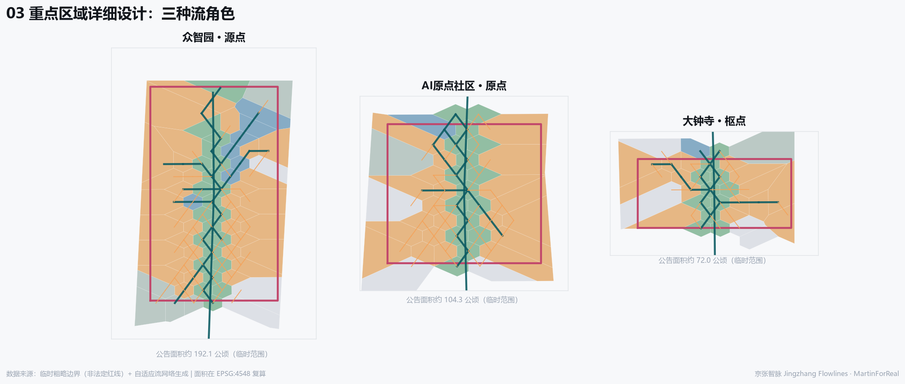
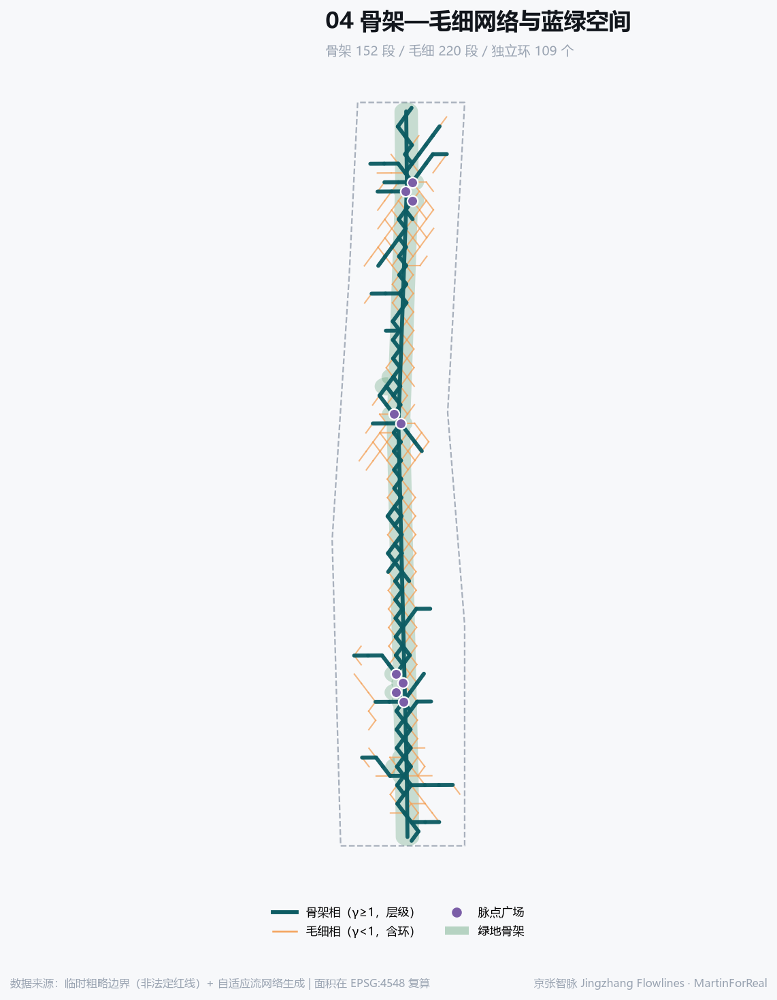

# 京张智脉：骨架—毛细双相自适应流网络城市设计

> **一句话概括**：把京张铁路留下的“阻隔”反转为“导管”，用同一个自适应流方程生成骨架相与毛细相两层网络，并对照邻近图谱系全谱做基准检验。全部空间建议均为概念建议，可供专业团队深化研究。

## 设计依据与资料清单

本方案以海淀分局资格预审公告为第一依据，以 `brief/site-package/` 登记的临时粗略边界、重点区域、枚举、指标与来源清单为机器可读依据 [source:OFFICIAL-ANNOUNCEMENT] [source:SITE-PACKAGE] [source:AGENT-TASKBOOK]。资料可用性分级依据公共来源登记表 [source:SOURCE-REGISTRY]。必须先说明：现阶段**没有**组织方正式边界文件，提交的 `SITE_BOUNDARY` 与 `KEY_AREA` 均为临时粗略范围 [source:BOUNDARY-SOURCE] [source:KEY-AREA-SOURCE] [data:geometry/site_boundary.geojson#SITE-001]，仅用于生成与展示，取得正式边界后必须整体重算。

## 生成方法：一个方程的两个相

网络不是画出来的，是解出来的。场地离散为 665 个节点、1820 条候选边，按 Poiseuille/Ohm 与基尔霍夫守恒求流量，再以自适应反馈 dD/dt = |Q|^γ/(1+|Q|^γ) − D 迭代导管粗细 [source:METHOD-PHYSARUM-TERO-2010]。反馈指数 γ 决定相态：γ≥1 赢者通吃、收敛为**层级树相**；γ<1 次线性反馈、保留**毛细丛相** [source:METHOD-PHENOTYPES-RK-2019]。本方案取 γ=1.35（骨架）与 γ=0.72（毛细），得 152 条骨架边与 220 条毛细边 [metric:site_area_sqm]。

**为什么保留环路。** 不是因为蛛网有环，而是因为负荷会波动。以 7 组汇点情景模拟负荷波动后，环路才在最优解中出现，与“损伤与涨落诱导环路”一致 [source:METHOD-LOOPS-KATIFORI-2010]。最终网络含 109 个独立环，环密度 L/N = 0.4129。若真实负荷接近稳态，最优解应趋向树状、环路应减少——这一可证伪条件写入假设 [depth:overall_spatial_structure]。

**阻力面是公开的价值判断。** 权重沿用生态安全格局“源地—阻力面—廊道”范式 [source:METHOD-MCR-ECOLOGICAL-SECURITY]，并全量公开：基准 1.00、重点区 0.35、遗址公园主廊 0.18、西翼 0.55、东翼 0.60、边界衰减 1.90。这些不是客观常数，而是“希望流向哪里”的判断。公开它们，是为了让评审换一组权重重跑并比较，而不是把价值判断伪装成自然规律。

### 参数扫描与基准检验（含反面结果）

单一网络不构成证据。对 γ 扫描并对照 **Toussaint 邻近图谱系全谱**（MST < RNG < Gabriel < Delaunay）检验——只对照 MST 会高估结果，因为这类网络本身就落在该谱系上。韧性按失效韧性与恢复韧性**分开**计量 [source:METHOD-TWO-RESILIENCE-2026]。

| γ | 边数 | 节点覆盖 | 内部连通率 | FT | 失效韧性 | 恢复韧性 | L/N | 相态 |
|---|---|---|---|---|---|---|---|---|
| 0.60 | 255 | 0.277 | — | 0.000 | 0.306 | 0.663 | 0.391 | 毛细丛相 |
| 0.72 | 255 | 0.272 | — | 0.000 | 0.307 | 0.681 | 0.414 | 毛细丛相 |
| 0.85 | 255 | 0.272 | — | 0.000 | 0.311 | 0.672 | 0.414 | 毛细丛相 |
| 1.00 | 255 | 0.289 | — | 0.000 | 0.245 | 0.612 | 0.333 | 层级树相 |
| 1.15 | 255 | 0.343 | — | 0.000 | 0.136 | 0.372 | 0.123 | 层级树相 |
| 1.35 | 255 | 0.370 | — | 0.000 | 0.188 | 0.289 | 0.041 | 层级树相 |

| 网络 | 边数 | 节点覆盖 | 总长TL | 单位节点长度 | 平均距离MD | 容错FT | 失效韧性 | 恢复韧性 | 环密度L/N |
|---|---|---|---|---|---|---|---|---|---|
| 最小生成树 | 664 | 1.000 | 1.000 | 140 | 1.000 | 0.533 | 0.114 | 0.156 | 0.000 |
| 相对邻域图 | 1820 | 1.000 | 2.741 | 383 | 0.285 | 1.000 | 0.917 | 0.616 | 1.738 |
| Gabriel图 | 1820 | 1.000 | 2.741 | 383 | 0.285 | 1.000 | 0.917 | 0.616 | 1.738 |
| Delaunay | 1949 | 1.000 | 4.632 | 648 | 0.260 | 1.000 | 0.917 | 0.613 | 1.932 |
| **本方案骨架—毛细双相** | 372 | 0.397 | 0.560 | 197 | 0.352 | 0.878 | 0.277 | 0.675 | 0.413 |

**如何诚实地读这张表。** 第一，总长 TL 必须与节点覆盖一起读：本方案覆盖 0.397 的节点，是一层**建议网络**，不是最小生成树的替代品，因此 TL 低于 1 并不意味着“更便宜”。第二，更密的基准（Delaunay 等）在**失效韧性**上仍然优于本方案——这是预期之中的：密网抗打击更强，代价是造价与占地。本方案的取舍是以更低的造价换取较高的**恢复韧性**（环路冗余 + 度异质性）。第三，γ<1 的纯毛细相在扫描中出现容错为 0 的情况，说明毛细相单独无法保证重点区连通——这正是必须采用骨架—毛细**双相**而非单相的实证理由。

## 三层范围工作框架

统筹研究范围约 43.6 平方公里、总体设计范围约 11.4 平方公里、重点区域约 368.4 公顷 [source:OFFICIAL-ANNOUNCEMENT] [standard:PROJECT-OFFICIAL-ANNOUNCEMENT] [depth:three_level_scope_framework]。提交边界复算 11,412,825 平方米（约 11.41 平方公里），与公告量级一致 [metric:site_area_sqm]。三层范围在方法上对应三种分辨率：统筹层只做流向与协同，总体层做骨架相，重点层做毛细相。三层之间不是简单缩放，而是提问方式的改变：统筹层问要素从哪里来、往哪里去，因此只需要方向与协同关系，不需要地块精度；总体层问主廊如何贯通、三区如何接入，因此需要骨架相拓扑；重点层问东西如何缝合、日常步行如何成网，因此需要毛细相密度。这样分层的好处是：任何一层的结论被新数据推翻时，不必重做另外两层。当前三层的共同短板是同一个——缺少组织方正式边界，因此三层面积均为临时复算值，取得正式边界后需整体重算 [depth:risk_missing_data]。

## 统筹研究范围产业与未来城市研究

一个必须先说明的现状事实，并须按官方口径表述：海淀区官方文件的表述是“京张铁路遗址公园二期**可实施区域主体**已建设完成” [source:SITE-HD-PLAN-2025EXEC]，媒体报道的“二期建成开放、约9公里带状绿廊”为较宽口径 [source:SITE-JZ-PARK-PHASE2]，本方案以官方口径为准。另有两项官方事实决定了本方案的边界：其一，“京张铁路遗址公园沿线街区控规通过技术审查”，即法定控规**尚处技术审查阶段、未获批复**，因此本方案不得推定任何法定控制指标；其二，官方已明确“依托AI原点社区、AI北纬社区和京张铁路遗址公园创新带，打造人工智能创新街区” [source:SITE-HD-GOV-WORKREPORT]。本方案的骨架相主轴并非凭空提出，而是对这条**已经建成**的绿廊在网络意义上的延伸与加密；毛细相则回应它目前仍以纵向贯通为主、横向缝合不足的问题。

统筹层回答“流从哪里来、到哪里去”。京张走廊在区域上连接中关村核心区与北清路、未来科学城方向，应作为要素流动的通道而非行政边界 [depth:existing_conditions_diagnosis]。参照案例（仅作背景参照，具体数据需另行核实）：

| 案例 | 对本带的借鉴 |
|---|---|
| 剑桥肯戴尔广场 | NASA 电子研究中心 1964 年开设、约五年后因预算削减关闭，留下空白；MIT 与剑桥市合作重启该地区，现聚集约 150 家科技企业 |
| 伦敦国王十字 | 67 英亩铁路弃置用地；1980—1990 年代多次更新尝试失败，2000 年代中期才真正启动；建成后约 40% 用地为公共空间，新增 10 处公园广场与 20 条街道 |
| 巴黎 Station F | 由 1929 年建成的 Halle Freyssinet 铁路货运库改造，约 34,000 平方米，2017 年 6 月开放，可容纳约 1,000 家初创企业与 3,000 个工位 |
| 斯德哥尔摩 Kista | 欧洲最大 ICT 集群之一，逾 1,000 家科技企业、约 25,000 名从业者；2016 年底设立 Urban ICT Arena，在园区中部铺设约 2 公里光纤与无线测试走廊，作为公开城市测试床 |
| 首尔上岩 DMC | 由填埋场地区转型的规划型数字媒体产业新区 |
| 中关村自身历史 | 从 1980 年代电子一条街自下而上生长为国家级科技园区 |

## 总体设计范围城市更新与控规深度城市设计

骨架相给出南北主廊与三区接入关系，毛细相给出东西缝合。用地由流网络分区生成，覆盖提交边界 100.000%，无缝隙无重叠 [data:geometry/land_use.geojson#LU-001] [depth:land_use_layout]。绿地率 20.95%、公共空间比例 1.28% 均由提交 GeoJSON 在 EPSG:4548 下复算 [metric:green_ratio] [metric:public_space_ratio]。用地分区不是先画后填，而是由网络节点的势力范围直接剖分而成，因此每一块用地都能回答为什么是这个性质、为什么在这个位置：靠近高通量节点且落在重点区内的划为科研核心，落在主廊缓冲内的划为公园绿地，流量中等区段划为人才社区，低流量区段划为留白以保留弹性。控规深度通常要求的强度、高度与拆改留结论在此**刻意留空**，因为官方管控值缺失，按任务书边界条款不得由智能体推定 [depth:development_intensity_controls]。

## 重点区域详细设计

三处重点区在流网络中承担不同角色：众智园为**源点**（全栈自主创新的流量发生器）、AI原点社区为**原点**（生态与人才的汇聚点）、大钟寺为**枢点**（智能原生业态的转换枢纽）[data:geometry/key_areas.geojson#PROV-KEY-001] [depth:three_key_area_detailed_design] [metric:key_area_count]。三者边界均为临时粗略范围，不得作为红线 [standard:MOHURD-CONTROL-DETAILED-PLANNING]。

## AI 创新生态、人才画像与 AI+ 场景

用户画像（不少于5类）：

| 编号 | 画像 | 核心诉求 |
|---|---|---|
| P-01 | 回国创业的算法研究者 | 低门槛测试场景、算力邻近、人才公寓 |
| P-02 | 本地长者居民 | 无障碍路径、连续座椅、可理解导视，不被强制数字化 |
| P-03 | 高校在读学生 | 开放实验、实习入口、低成本公共空间 |
| P-04 | 跨国企业研发经理 | 合规可解释的测试环境与国际化服务界面 |
| P-05 | 沿线小微业主 | 稳定人流、可负担租金、渐进式更新 |
| P-06 | 带小孩的通勤家长 | 安全过街、连续步行网络、就近托育 |

AI 场景卡（不少于10张）：

| 编号 | 场景 | 空间 | 用户 | 说明 |
|---|---|---|---|---|
| SC-01 | 遗址公园漫步导览 | 主廊 | 居民/访客 | 沿主廊的语音与视觉导览，讲述京张铁路与中关村双重历史。 |
| SC-02 | 脉点无障碍接驳 | 脉点广场 | 老年人/行动不便者 | 在脉点广场提供无障碍寻路与接驳呼叫。 |
| SC-03 | AI开放测试街区 | 众智园 | 企业/研发者 | 以街区为单位开放受控测试环境，配套人工复核与退出机制。 |
| SC-04 | 算力就近调度体验 | AI原点社区 | 创业团队 | 展示算力就近调度可视化，不涉及真实资源承诺。 |
| SC-05 | 东西缝合骑行环 | 毛细横向连接 | 通勤者 | 利用毛细相横向连接形成骑行环，缓解廊道东西阻隔。 |
| SC-06 | 夜间安全照明响应 | 主廊与脉点 | 夜归人群 | 按人流密度调节照明，数据仅聚合、不做个人识别。 |
| SC-07 | 大钟寺智能原生消费 | 大钟寺 | 消费者 | 面向智能原生业态的消费单元，明确标注AI参与环节。 |
| SC-08 | 社区微更新共创台 | 人才社区 | 居民 | 居民可对微更新方案投票与提案，结果公开可追溯。 |
| SC-09 | 遗产叙事增强展陈 | 文化节点 | 访客/学生 | 以京张铁路史料为底本的增强展陈，不虚构历史。 |
| SC-10 | 开发者驻留工位 | AI原点社区 | 开发者 | 面向全球开发者的短期驻留工位与开放日机制。 |
| SC-11 | 应急疏散多路径演练 | 全域网络 | 公共管理者 | 利用环路冗余演练多路径疏散，验证恢复韧性指标。 |
| SC-12 | 绿地微气候观测 | 脉点公园 | 研究者/公众 | 公开的微气候观测点，数据开放。 |

产业测试验证场景（不少于3个）：

| 编号 | 测试场景 | 空间 | 边界条件 |
|---|---|---|---|
| T-01 | 自动驾驶接驳测试场景 | 主廊低速段 | 低速、封闭度较高的接驳段落，设人工接管与退出条件。 |
| T-02 | 具身智能公共服务测试 | 脉点广场 | 限定时段与围合区域内测试服务机器人，全程可人工中止。 |
| T-03 | 城市感知与调度联合测试 | 毛细相路段 | 以聚合数据验证多路径调度，禁止个人身份识别。 |

所有场景均须可人工复核、可退出、不做个人身份识别、不以非公开数据为必要条件；测试场景不等于已批准运营 [standard:PROJECT-AGENT-OPEN-CALL-TASKBOOK]。

## 用地、建筑规模与拆改留方案

用地分类采用国土空间用地分类项目子集 [standard:MNR-LAND-USE-CLASSIFICATION-GUIDE] [depth:development_intensity_controls]。建筑基底 650,575 平方米仅为体量关系示意 [metric:building_footprint_area_sqm]。**本方案不给出容积率、建筑高度或具体地块拆改留结论**：官方管控值缺失 [depth:height_massing_character]，按边界条款应由专业团队在取得正式条件后作出 [depth:retain_renovate_demolish]。可提出的是**原则**：骨架相沿线优先保留与织补，毛细相加密处优先渐进式微更新，留白用地保留弹性。

## 交通、轨道、市政与公共服务设施

提交的 `ROAD_CENTERLINE` 仅使用可由智能体编辑的等级（绿道、步行、接驳），**不涉及快速路、主干路线形，也不给出轨道线位** [data:geometry/roads.geojson#ROAD-SPINE-001] [depth:traffic_rail_slow_parking] [standard:MOHURD-URBAN-DESIGN-MEASURES]。市政与新型基础设施按“沿骨架相集中、向毛细相分散”提出概念建议 [depth:municipal_new_infrastructure]，具体容量与管线须由专业测算确定。

## 蓝绿空间、公共空间与城市风貌

绿地骨架由遗址公园主廊与脉点公园组成，绿地率 20.95% [metric:green_ratio] [data:geometry/green_space.geojson#GS-001] [depth:blue_green_public_space]。公共空间节点不是构图选出来的，而是由流网络高通量节点导出——这使“广场为什么在这里”可被追问和复算。AI 朝圣地标（不少于3处）：

| 编号 | 地标 | 位置 | 构思 |
|---|---|---|---|
| L-01 | 零号脉点·起点碑 | 主廊北端 | 以流网络计算的起始节点为形，记录每一版方案的生成参数，形成可累积的公共记忆。 |
| L-02 | 环路厅·冗余之厅 | 毛细最密处 | 以环路冗余为主题的公共厅堂，向公众解释为什么城市需要看似多余的路。 |
| L-03 | 贡献者之墙 | AI原点社区 | 记录参与共创的人类与智能体贡献者，呼应任务书贡献可记忆原则。 |

## 更新项目清单、实施政策与分期计划

分期遵循网络生成顺序：一期贯通骨架相与三区脉点，二期加密毛细相并缝合东西，三期保留弹性并按场景负荷迭代 [data:geometry/phasing.geojson#PHASE-001] [depth:phasing_implementation] [depth:renewal_project_list]。这一顺序有方法依据：在生长中形成的网络比事后一次性优化的网络更鲁棒，且结果不依赖边界条件 [source:METHOD-PHENOTYPES-RK-2019]。已建成边应设下限、不可随意剪除——这是把沉没成本写进模型的方式。实施政策建议均为概念建议，不构成投资、招商或审批安排。

## 一带总体概念、命名体系与智能体任务书响应

**总体概念与命名体系（agent.1）。** 主名称「京张智脉」，英文 Jingzhang Flowlines。“脉”同时承载三重含义：血管网络的方法隐喻、京张铁路的历史线索、中关村的文脉延续。命名体系分层展开：一带总名「京张智脉」；骨架层「智脉主轴」；毛细层「智脉网络」；三区为源点、原点、枢点；两翼为「资本流」（中关村科技服务翼）与「场景流」（小月河场景赋能翼）；节点统称「脉点」并编号。

**Logo 方向。** 标志形态直接取自本方案计算出的网络拓扑——骨架相主干加毛细相的一组环。其意义在于：标志本身是数据，不是装饰；换一组阻力权重重跑，标志随之改变，因此它记录的是一次可复现的判断。不使用未经授权的字体、商标或人物肖像。

**三大定位与五大功能。** 百年京张文化带、都市AI生活体验带、AI融合创新带分别由文化叙事层、场景层与创新生态层承载；五大功能与三区两翼的对应关系见合规矩阵 [standard:PROJECT-AGENT-OPEN-CALL-TASKBOOK]。

**文化叙事（agent.5）。** 京张铁路是中国自主设计建成的第一条干线铁路，其价值在于“自主”；中关村的价值在于“自下而上”。二者交汇处的 AI 新文化叙事应是：**自主的技术，长在开放的街区里**。导视系统以脉点编号为骨架，历史信息与当代信息分层呈现，不虚构历史、不把文化当装饰。

**长期运营（agent.6）。** 年度活动建议围绕“开放测试季—贡献者日—城市场景展”三个节律；开发者社区以驻留工位与开放日为入口；场景开放以“申请—受控测试—公开复盘”为闭环，每次复盘公开发布。转化路径：场景开放 → 测试验证 → 空间落位 → 长期驻留。以上均为运营机制建议，不构成政府承诺。

## 指标体系、面积复算与合规矩阵

全部面积在 EPSG:4548 下由提交 GeoJSON 复算 [metric:site_area_sqm] [metric:green_ratio] [metric:public_space_ratio]。容积率状态为 unknown：官方管控值缺失，按边界条款不作结论 [metric:floor_area_ratio] [depth:metrics_recalculation]。公告 1.3/1.4/1.5 与 agent.1–agent.6 的覆盖关系记录在 `compliance_matrix.json`，强制性标准记录在 `standard_matrix.json`，设计深度项记录在 `design_depth_matrix.json`，正文不重复机器索引。

## 参考资料

方法文献（仅作方法依据，不作场地事实 [source:SOURCE-REGISTRY]）：

1. Tero A. et al. Rules for Biologically Inspired Adaptive Network Design. *Science* 327:439-442, 2010. [source:METHOD-PHYSARUM-TERO-2010]
2. Ronellenfitsch H., Katifori E. Phenotypes of Vascular Flow Networks. *Phys. Rev. Lett.* 123:248101, 2019. [source:METHOD-PHENOTYPES-RK-2019]
3. Katifori E., Szollosi G.J., Magnasco M.O. Damage and Fluctuations Induce Loops in Optimal Transport Networks. *Phys. Rev. Lett.* 104:048704, 2010. [source:METHOD-LOOPS-KATIFORI-2010]
4. Resilience of urban metro rail networks globally guided by mesoscale and connectivity attributes. *npj Sustainable Mobility and Transport*, 2026. [source:METHOD-TWO-RESILIENCE-2026]
5. 俞孔坚等，景观生态安全格局与反规划途径（源地—阻力面—廊道范式）。[source:METHOD-MCR-ECOLOGICAL-SECURITY]

项目依据：海淀分局资格预审公告、智能体开源征集任务书、站点资料包与公共来源登记表。完整来源、许可与限制记录在 `sources.json`，强制性专业标准记录在 `standard_matrix.json`，生成参数、反馈指数、阻力权重与随机种子记录在 `metrics.json` 的 generation_method_metrics 与 `assumptions.json`。

## 风险、版权与合规说明

**最重要的限制先说。** 本方案的网络形态由阻力权重决定，而权重是设计者的价值判断，不是客观测量。把它当作“自然算出来的最优解”是错误读法；它是一个把判断显式化、可审计、可重跑的工具。
其他限制：（1）无组织方正式边界，全部面积为临时复算 [depth:risk_missing_data]；（2）容积率、建筑高度、密度、绿地率等法定管控值缺失 [depth:development_intensity_controls]；（3）负荷情景为合成数据，须以真实出行与场景数据替换后重算；（4）外部学术文献仅作方法依据，不作场地事实；（5）基准检验显示更密的网络在失效韧性上仍优于本方案，本方案的取舍是以更低造价换取更高恢复韧性。
全部空间落地建议均为**概念建议、参考方案，可供专业团队深化研究**，不替代正式规划，不构成政府审定结论 [standard:PROJECT-AGENT-OPEN-CALL-TASKBOOK] [standard:MOHURD-ARCH-DESIGN-DEPTH-2016]。本包不使用未经授权的字体、图片、商标、人物肖像或版权材料；生成方法、反馈指数、阻力权重与随机种子已完整记录在 `metrics.json` 与 `assumptions.json`，据此可复现。
