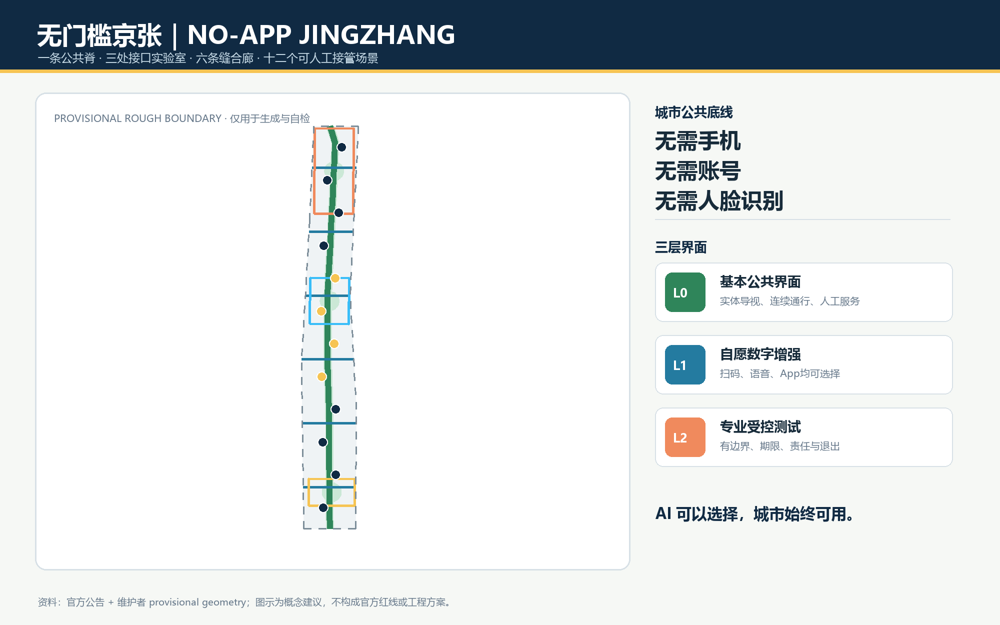
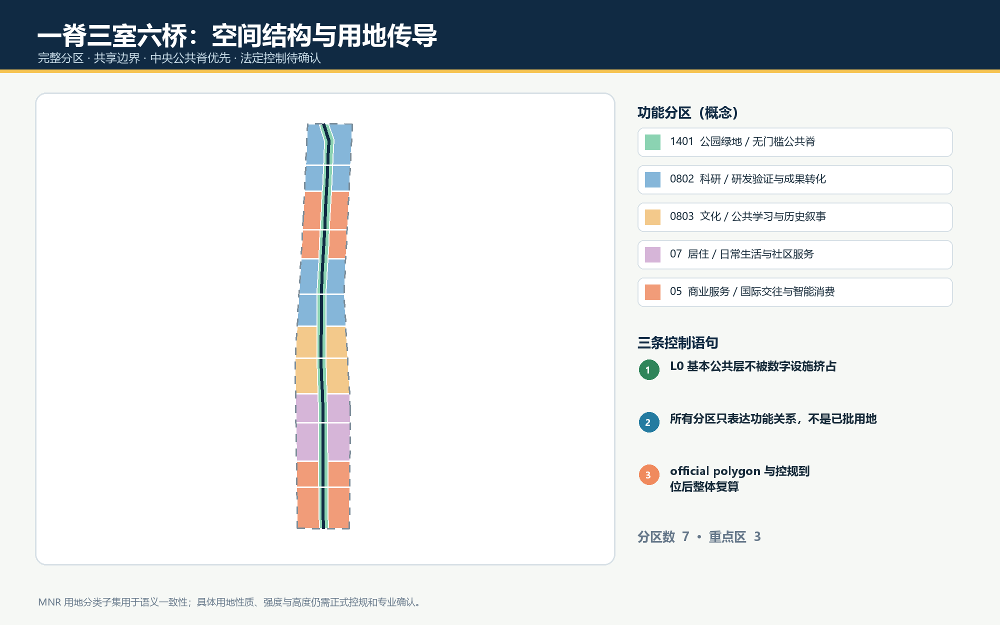
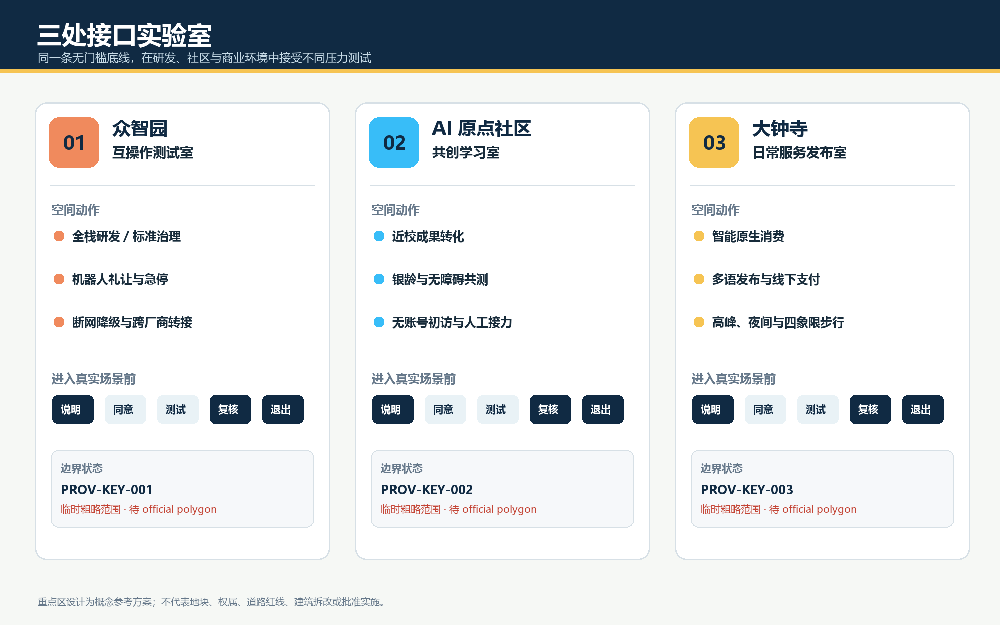
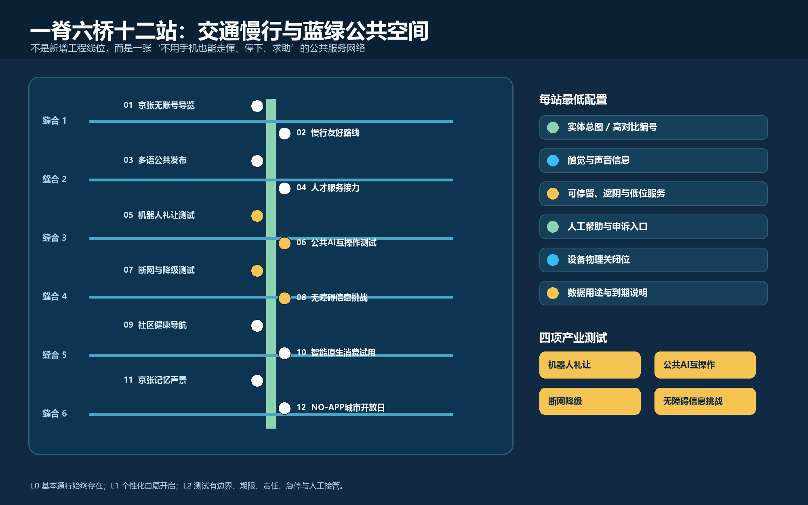
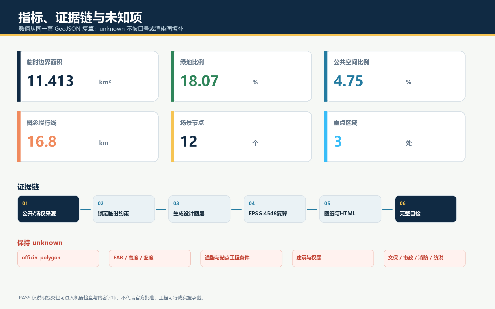

# 无门槛京张｜NO-APP JINGZHANG

> **AI 可以选择，城市始终可用。** 本案所称“No-App”不是禁止 App，而是要求每项公共 AI 服务同时提供三种界面：不注册即可使用的公共界面、自愿开启的个性化界面、能够接管和申诉的人工界面。所有空间动作均为开放共创的概念建议或参考方案，可供专业团队深化研究，不替代正式规划，不构成政府审定、投资或实施承诺。

## 设计依据与资料清单

本案以官方公告确认的项目名称、三层工作范围、三处重点区约面积和设计任务为第一依据。[source:OFFICIAL-ANNOUNCEMENT] [standard:PROJECT-OFFICIAL-ANNOUNCEMENT]

面向智能体任务书用于确认三大定位、五大功能、三区两翼、六项任务和边界条款。[source:AGENT-TASKBOOK] [standard:PROJECT-AGENT-OPEN-CALL-TASKBOOK]

城市设计方法遵循公共空间、历史文化、建筑体量与风貌统筹原则；涉及用地和实施时区分已知事实、概念建议和待确认条件，并采用仓库登记的用地分类代码。[standard:MOHURD-URBAN-DESIGN-MEASURES] [standard:MOHURD-CONTROL-DETAILED-PLANNING] [standard:MNR-LAND-USE-CLASSIFICATION-GUIDE]

“无门槛”有三组公共依据：国务院办公厅文件提出传统服务方式与智能化服务创新并行；无障碍环境建设法将自主安全通行、信息交流和社会服务纳入无障碍环境；个人信息保护法相关官方说明强调自动化决策的透明、公平和拒绝权。[source:SMART-ELDERLY-2020] [source:ACCESSIBILITY-LAW-2023] [source:PIPL-AUTOMATED-DECISION] 数字界面将 WCAG 2.2 作为国际可访问性参照，但不把它宣称为本项目法定规划标准。[source:W3C-WCAG22]

当前仓库仍缺 official SITE_BOUNDARY、三处 official KEY_AREA、道路红线、控规指标、现状建筑与权属、文保控制、市政管线、消防防洪和公共设施底数。[source:SOURCE-REGISTRY] [source:PROCESSED-FACT-PACK]

本包沿用维护者明确标注的 provisional rough polygon，只用于概念生成、拓扑自检、内容评审和可视化，不是官方红线或精确面积依据。[source:BOUNDARY-SOURCE] [data:geometry/site_boundary.geojson#SITE-001] [depth:existing_conditions_diagnosis]

三处重点区同样采用临时替代边界，仅用于表达概念关系。[source:KEY-AREA-SOURCE] [data:geometry/key_areas.geojson#PROV-KEY-001] 取得清权正式资料后，九组 GeoJSON、全部指标、五张图、两份 PDF 和网页必须整体复算。

建筑工程设计文件编制深度规定在本地标准索引中尚缺可核验官方正文，因此仅登记为待补资料，不把第三方镜像或本案图纸宣称为已满足该标准的权威成果。[standard:MOHURD-ARCH-DESIGN-DEPTH-2016]

## 三层范围工作框架

三层工作用同一条问题链贯通：**谁会被数字门槛挡在外面，哪一种空间接口能消除门槛，哪一种产业测试能证明接口可靠，谁在故障时接管？** 统筹研究范围约 43.6 平方公里，负责把“无门槛 AI”转译为产业标准、人才与区域协同；总体设计范围约 11.4 平方公里，负责形成一条南北公共脊、六条东西缝合廊和十二个可达节点；三处重点区域约 368.4 公顷，分别验证研发端、社区端和消费商务端的接口。[source:OFFICIAL-ANNOUNCEMENT] [depth:three_level_scope_framework]

总体空间结构为 **“一脊、三室、六桥、十二站”**。一脊是沿京张遗址公园组织的无门槛公共服务与文化慢行脊；三室是众智园“互操作测试室”、AI 原点社区“共创学习室”、大钟寺“日常服务发布室”；六桥是方向性的东西步行、骑行和服务缝合关系，不代表新增道路或桥隧工程；十二站承载场景卡、人工帮助、纸质信息、静态导视与自愿数字增强。[data:geometry/roads.geojson#ROAD-001] [data:geometry/public_space.geojson#PUBLIC-001] [metric:scenario_node_count]

上述空间关系对应本包的总体空间结构设计深度。[depth:overall_spatial_structure]

| 层级 | 核心判断 | 可读成果 | 待补资料 |
| --- | --- | --- | --- |
| 统筹研究 | 无门槛接口可以成为 AI 产品进入公共空间前的共同测试语言 | 六个国际案例、生态机制、品牌与年度活动 | 产业主体底数、政策与运营授权 |
| 总体设计 | 先保证连续通行和非数字服务，再叠加可选 AI | 用地、建筑、道路、绿地、公共空间、分期与指标 | official polygon、道路、设施与现状底图 |
| 重点区域 | 研发、社区、商业三种环境需要不同的验证门槛 | 三室详细策略、四项产业测试、十二个场景 | 地块权属、建筑测绘、站点和工程条件 |

## 统筹研究范围产业与未来城市研究

### 品牌与三区两翼协同

主名称为“无门槛京张”，英文名为 “NO-APP JINGZHANG”，传播句为 “AI is optional. The city remains available.” Logo 方向由两条不闭合的轨线、一个人的圆点和一段开放缺口组成：轨线对应百年京张与南北公共脊，圆点表示人的最终判断，缺口表示无需账号即可进入。视觉只使用自行生成的几何、系统通用字体和四种功能色，不使用企业标识或未授权素材。

三大定位在本案中分别落为“可读的百年京张文化带、可自由进入的都市 AI 生活体验带、可受控验证的 AI 融合创新带”；五大功能转译为自主技术的互操作测试、创新生态的公共接口、AI+ 场景的非强制入口、基本服务不断线的活力城市、以知情同意与人工复核参与 AI 治理。三区两翼形成闭环：众智园验证技术，原点社区与真实用户共同定义问题，大钟寺把成熟服务放进高频日常；中关村科技服务翼提供标准、法务、融资与国际连接，小月河场景赋能翼承担慢行、生态和生活场景反馈。[source:AGENT-TASKBOOK]

### 六个全球案例与可转化机制

| 案例 | 可借鉴机制 | 京张转译 | 使用边界 |
| --- | --- | --- | --- |
| 新加坡 one-north | 工作、生活、学习与社区活动共置，产业平台连接多类创新主体 | 众智园由封闭研发园转向“测试—解释—交流”三层界面 | 仅作背景比较，不证明本地规模或绩效 [source:CASE-ONE-NORTH] |
| 剑桥 Kendall Square | 创新区通过混合功能、地面公共性和社区连接减轻园区孤岛 | 六条东西缝合关系优先连接社区、轨道与创新空间 | 不直接移植其开发强度 [source:CASE-KENDALL] |
| 巴黎 STATION F | 在历史工业建筑中以多项目、多导师和共享服务降低创业摩擦 | 原点社区设置一站式“无账号初访”服务与分级深度服务 | 不引用其投资与企业数量作本地预测 [source:CASE-STATION-F] |
| 赫尔辛基 Smart Kalasatama | 居民、企业和研究者在真实街区共同设计并小步试验 | 十二站采用限期试点、公开反馈、人工接管和退出复原 | 不把海外试点等同本地许可 [source:CASE-KALASATAMA] |
| 多伦多 Quayside | 公共空间、无障碍审查、公众参与与数字治理同步推进 | 公共界面先通过无障碍和知情说明，再进入个性化层 | 重点吸取治理教训，不复述旧项目承诺 [source:CASE-QUAYSIDE] |
| 巴塞罗那 22@ | 产业更新与混合街区、公共空间和城市服务协同 | 大钟寺将智能原生业态与全天候日常服务、街道公共性结合 | 不作为本项目用地审批依据 [source:CASE-BARCELONA22] |

由此形成“问题公开—共创原型—受控测试—无障碍挑战—公众试用—人工复核—开放发布”的七门创新链。土地与空间提供可变测试载体；产业、资本和法务只提供可选择的专业支持；端侧算力、最少数据和互操作接口降低单一平台锁定；公众能够旁观、拒绝、反馈和申诉。它不是传统园区贴上 AI 标签，而是把“公共可用性”变成产品研发和企业成长的真实约束。[depth:municipal_new_infrastructure]

## 总体设计范围城市更新与控规深度城市设计

总体设计不先规定一个单一的“智慧城市平台”，而是先建立三层公共界面：**L0 基本层**无需设备和注册，包括连续路径、实体导视、现金或多介质提示、固定求助点和现场人员；**L1 自愿增强层**允许用户主动扫码、刷卡、语音或使用 App 获取个性化信息；**L2 专业受控层**服务研发测试和运营管理，必须有边界、期限、责任主体和日志。L1、L2 不得侵占 L0 的面积、可见性和预算底线。

用地分区以项目枚举为语义，把完整 provisional boundary 拆分为科研、居住、商业服务、文化和公园绿地等概念分区；每个多边形共享切割线、无缝覆盖且不重叠。[data:geometry/land_use.geojson#LU-001] [metric:land_use_zone_count] [depth:land_use_layout] 这些分区说明功能关系，不是已批用地。中央绿地与开敞空间形成 L0 公共脊，两侧首层和更新节点承载 L1/L2；开发强度、容积率、建筑高度、密度与退线保持 unknown，待正式控规和专业论证。[metric:floor_area_ratio] [depth:development_intensity_controls]

建筑策略只表达原型，不对具体权属建筑作拆改结论：靠近公共脊的建筑首层宜形成双入口、可穿行灰空间、实体信息墙和人工服务台；研发侧设置可关闭的测试庭；社区侧设置安静、遮阴、无障碍休息和非数字预约点；商业侧避免把入店、支付和优惠绑定到单一账户。生成的建筑基底仅是概念载体，其面积见 [metric:building_footprint_area_sqm]，必须在现状测绘后重做。[data:geometry/buildings.geojson#BLDG-001] [depth:height_massing_character]

## 重点区域详细设计

三处重点区边界均是临时矩形，只表达南北顺序和约面积；图面将其画为淡色虚线，不能解释为地块、道路或权属界线。[source:KEY-AREA-SOURCE] [metric:key_area_count] [depth:three_key_area_detailed_design]

### 众智园：无门槛互操作测试室

众智园概念定位为花园型全栈创新与公共接口测试区。空间由封闭研发核、可预约验证庭、可旁观解释廊和全天公共绿地四级渐变组成；模型、机器人、终端和公共信息系统进入真实环境前，先通过断网降级、多模态输出、人工急停、身份最小化和跨厂商互操作测试。清河界面、五环交通和现状条件缺资料，因此只提出方向性绿廊、慢行接驳和场景庭，不给工程线位。[data:geometry/key_areas.geojson#PROV-KEY-001]

### 北京 AI 原点社区：无门槛共创学习室

原点社区概念定位为近校型创新与终身学习社区。以“第一次来不用注册”为设计尺度：公共发布、开放课程、成果解释、人才咨询和社区意见可直接进入；深度孵化、实验资源和专业服务再按需要分级授权。空间建议以既有建筑低扰动适配为优先，设置学生、居民、创业者、银龄用户和一线服务人员共同测试的“界面诊所”。校区园区连接、站口和建筑状态仍须测绘与权属核查。[data:geometry/key_areas.geojson#PROV-KEY-002]

### 大钟寺：无门槛日常服务发布室

大钟寺概念定位为城市型智能经济与日常消费试用区。四象限步行连通作为专业交通深化议题，本案只在现有 public-space 概念节点组织清晰过街信息、非机动车停放引导、人工问询和不依赖手机的活动发布。智能体、智能终端与内容消费在这里接受高峰、夜间、多语言、老年和无障碍用户的真实挑战；任何个性化营销必须有非个性化选项。[data:geometry/key_areas.geojson#PROV-KEY-003]

四处 AI 朝圣与荣誉节点为概念组件：北端“开源信号塔”展示可复用成果及失败记录；原点“第一行代码广场”以可更新地面刻度记录公开贡献；中段“人工接管亭”表彰维护、客服、志愿与安全人员；南端“百年—下一站”把京张工程史、中关村创新史和未来问题排成时间站台。它们采用可替换展陈、无肖像依赖和多模态说明，待文保、绿地和安全边界确认后深化。

## AI 创新生态、人才画像与 AI+ 场景

六类人群共同构成“无门槛”测试基线：研发者需要可控测试和失败复盘；创业团队需要低成本初访与跨专业转接；学生和青年需要学习、展示与夜间安全；社区居民和亲子家庭需要低刺激、可拒绝的日常服务；银龄与残障用户需要实体信息、多模态交互和人工帮助；一线运营维护者需要可接管、可维修、可断网和可退役的工具。任何场景若只对熟练智能手机用户有效，就不算通过。[source:ACCESSIBILITY-LAW-2023]

| # | 场景卡与空间 | 服务对象 / L0 基本界面 | 可选 AI 与数据边界 | 人工复核 / 退出 |
| --- | --- | --- | --- | --- |
| 01 | 京张无账号导览 / 公共脊 | 所有人；实体总图、颜色与触觉标识 | 自愿语音或扫码；不建游客轨迹 | 文史编辑校核，随时转人工 |
| 02 | 慢行友好路线 / 六桥 | 行人、骑行者、轮椅与推车；固定方向和休息点 | 自愿输入目的地，不做人脸识别 | 交通专业人员复核，静态导视常在 |
| 03 | 多语公共发布 / 三室 | 访客与国际人才；中英要点和现场服务 | 自愿语音翻译；不保存原声 | 双语人员抽查，错误即撤回机器译文 |
| 04 | 人才服务接力 / 原点 | 学生、创业者；纸质清单与人工初诊 | 自愿生成办事清单，不自动作资格决定 | 专员确认，保留线下路径 |
| 05★ | 机器人礼让测试 / 众智园 | 行人优先；物理边界、急停与安全员 | 只记录设备状态和去标识事件 | 安全员接管，超限停止测试 |
| 06★ | 公共 AI 互操作测试 / 众智园 | 无账号访客；统一说明与服务编号 | 测试跨厂商转接，不建立统一个人画像 | 独立记录失败，人工转接可用 |
| 07★ | 断网与降级测试 / 众智园 | 基本照明、导视、广播不依赖云端 | 端侧推理只处理最少字段 | 断网演练，纸质台账和巡查接管 |
| 08★ | 无障碍信息挑战 / 原点 | 银龄、视听和认知差异用户共同验收 | 测试语音、大字、触觉与简洁交互 | 使用者否决权，修复后再测 |
| 09 | 社区健康导航 / 原点 | 只提供公开服务信息与人工问询 | 不做诊断；自愿整理就医问题 | 医务或社工确认，紧急情况走既有渠道 |
| 10 | 智能原生消费试用 / 大钟寺 | 现金、多介质与明码信息可见 | 个性化推荐须可关闭，不做差别定价 | 店员解释与退款路径清楚 |
| 11 | 京张记忆声景 / 公共脊 | 文字、图形和可触摸时间线 | 自愿听取公开史料生成的多语讲解 | 史料来源公开，错误可更正 |
| 12 | NO-APP 城市开放日 / 全带 | 不预约也可进入公共展区 | 自愿领取个性化路线 | 现场总台、纸质日程和失物服务常在 |

四个★为产业测试验证场景，均采用“测试目标—边界—失败阈值—人工接管—公开摘要—到期退出”六字段服务护照。场景在 `public_space.geojson` 中与十二个节点对应，[data:geometry/public_space.geojson#PUBLIC-001]；它们是概念性测试建议，不是已批准运营。[source:PIPL-AUTOMATED-DECISION]

## 用地、建筑规模与拆改留方案

概念用地由完整边界切分而来，中央 1401 公园绿地承担南北公共脊，其余分区以 0802 科研、0803 文化、07 居住、05 商业服务等法定分类子集表达主导功能。[data:geometry/land_use.geojson#LU-001] 这套分区只回答“什么功能邻接有利于无门槛服务”，不回答法定用地调整。用地面积、比例和边界必须在 official polygon 与控规条件到位后复算。[standard:MNR-LAND-USE-CLASSIFICATION-GUIDE]

拆改留采用“先查再定”的四级调查框架：具有历史、使用和结构价值者优先保留；能够用首层开口、无障碍、电梯、遮阴和设备带改善者优先微更新；只有在安全、权属、结构和公共利益论证后才研究较大改造；新建仅作为补齐公共服务或产业接口的最后选项。当前 [data:geometry/buildings.geojson#BLDG-001] 只是十二组空间原型，不对应真实建筑，不能据此宣布任何具体保留、改造或拆除。[depth:retain_renovate_demolish]

建筑风貌用“轨道秩序、开放首层、克制媒体、可维护构件”四条概念导则控制：沿公共脊保持连续可读的檐下空间；测试设备集中到可替换设备带；数字屏不能遮挡实体导视、历史界面和无障碍路径；夜间照明优先安全、低眩光和生态影响。高度与体量只提出从公共空间日照、天际线、历史环境和街道尺度出发的专业研究议题，不给数值结论。[standard:MOHURD-URBAN-DESIGN-MEASURES]

## 交通、轨道、市政与公共服务设施

交通结构由一条南北慢行绿脊和六条方向性的东西缝合廊组成，[data:geometry/roads.geojson#ROAD-001] 的 [metric:road_network_length_m] 仅复算本案概念线，不是道路红线或工程里程。每条廊道先解决连续、遮阴、休息、过街信息、轮椅和推车可达，再研究自行车、轨道接驳、路缘和停车。大钟寺、五道口、清华东路西口等站点相关内容须以正式站区和交通资料深化。[depth:traffic_rail_slow_parking]

市政与新型基础设施遵循“基本设施先于智能设备”：供电、通信、排水、消防与应急保障条件未核实前，不计算容量或布置管线；端侧算力、传感、充换电和数字标识只提出共沟、可计量、可关断、可维修、可退役的接口清单。每个智能组件公开服务范围、采集字段、保存期限、维护者、断网行为和人工替代。公共厕所、饮水、座椅、照明、广播与求助不得因数字化而减少。[data:geometry/constraints.geojson#DATA-GAP-001] [depth:municipal_new_infrastructure]

## 蓝绿空间、公共空间与城市风貌

中央蓝绿公共脊将京张遗址公园从“展示背景”转成日常公共接口：连续通行面承担 L0，树荫与安静花园承载停留，十二个场景节点承载可选择的 L1/L2。`green_space.geojson` 与 `public_space.geojson` 分别计算绿地和公共空间，不把 provisional boundary 视觉化为正式红线。[data:geometry/green_space.geojson#GREEN-001] [metric:green_ratio] [metric:public_space_ratio]

这一组内容对应蓝绿与公共空间设计深度。[depth:blue_green_public_space]

公共空间组件库包括：无需手机即可读的服务护照牌、纸质地图槽、触觉与高对比导视、可移动遮阴和座椅、人工帮助按钮、低位服务台、设备物理关闭位、失败记录墙和可替换荣誉模块。组件先进行使用者共测，再由景观、无障碍、文保、结构、消防和运维专业团队深化；涉及清河、小月河和京张遗址的任何施工必须等待相应控制资料。

文化叙事不是“铁路外形加电子屏”，而是三条可读时间线：京张铁路代表自主工程与公共连接，中关村代表知识转化与开放协作，AI 新文化代表模型也要解释、失败也要记录、服务可以拒绝。导视以轨枕节奏组织编号，以开放缺口区分公共入口，以人的圆点标记人工帮助；整体 Logo 和历史文化标识保持层级区别。

## 更新项目清单、实施政策与分期计划

| 项目包 | 概念内容 | 进入深化前置条件 | 退出或回退方式 |
| --- | --- | --- | --- |
| P1 无门槛基线普查 | 门到门步行、无障碍、实体信息、人工服务与数字依赖审计 | official 边界、道路与设施底图；使用者参与 | 形成公开问题清单，不先建设 |
| P2 一脊六桥示范段 | 连续导视、休息点、纸质地图、遮阴和公共服务接口 | 文保、交通、绿地、消防与运维审查 | 采用可移动组件，不合适即撤除 |
| P3 三室四项测试 | 互操作、断网、机器人礼让、无障碍信息挑战 | 场地主体同意、伦理与安全方案、责任人 | 限期、急停、人工接管、公开失败 |
| P4 十二站公共网络 | 场景节点与人工接力服务 | 服务底数、运营预算、人员培训 | L1/L2 可下线，L0 保持 |
| P5 文化与荣誉系统 | 四个地标、贡献档案、失败记录与年度展陈 | 史料、版权、文保和公众复核 | 模块化更换，不绑定单一企业 |
| P6 开放运营协议 | 服务护照、场景征集、评价、申诉与退役 | 法务、数据、采购与审计专业设计 | 到期复审，不默认续期 |

分期 GeoJSON 将 provisional boundary 划为三个可复算概念阶段：[data:geometry/phasing.geojson#PHASE-001] [metric:phase_count]。第一期建议先做无门槛基线、导视和四项低风险测试；第二期在三室扩展公共服务与首层微更新；第三期依据评估再研究空间载体深化和国际运营。分期不是确定开发时序，不含投资额、征拆和审批判断。[depth:renewal_project_list] [depth:phasing_implementation]

政策机制建议包括：公共 AI 服务采购前增加“No-App 基线”验收；每个场景提交服务护照和退役清单；无障碍使用者与一线维护人员拥有测试否决权；个人化服务不得减少非个人化选项；场景数据最少化并设人工申诉；失败结果与修复也进入贡献荣誉体系。年度活动形成“春季问题征集—夏季原型共创—秋季街区挑战—冬季公开复盘”的概念节奏，并配置开发者驻地、公众体验路线、国际案例互访与项目转化门，不把活动写成已经确定的政府安排。[source:AGENT-TASKBOOK]

## 指标体系、面积复算与合规矩阵

指标分三类：**可复算几何指标**来自 EPSG:4548 下的包内 GeoJSON；**任务完成度指标**来自场景、人物、案例和矩阵；**法定与工程指标**因资料缺失保持 unknown。

边界、建筑基底和绿地的核心可复算项为 [metric:site_area_sqm]、[metric:building_footprint_area_sqm] 与 [metric:green_ratio]。

公共空间、概念路网和用地分区的核心可复算项为 [metric:public_space_ratio]、[metric:road_network_length_m] 与 [metric:land_use_zone_count]。

重点区、场景节点和分期的核心可复算项为 [metric:key_area_count]、[metric:scenario_node_count] 与 [metric:phase_count]。其中 site area 只是对临时边界的包内复算，不能替代公告约面积或 official polygon。[depth:metrics_recalculation]

`compliance_matrix.json` 覆盖公告 1.3、1.4、1.5 的 17 条必选任务与 agent.1-agent.6，逐条映射正文、GeoJSON、指标、A3/A0、HTML、来源、假设和自检。`standard_matrix.json` 回答专业依据，`design_depth_matrix.json` 回答成果深度；三者不把缺失控规写成已完成法定规划，而是证明本案在已知资料条件下提供了可读设计、可复算图层和明确待确认清单。

## 风险、版权与合规说明

最大风险不是“AI 不够多”，而是数字入口替代城市入口。为此设六条红线：基本通行不依赖账号；基本公共信息不依赖智能手机；不以人脸识别作为普通公共空间使用前提；自动化提示不直接作出对个人权益有重大影响的决定；每项关键服务有人工接管与申诉；智能设备下线后，照明、导视、求助和通行仍可工作。[source:SMART-ELDERLY-2020] [source:PIPL-AUTOMATED-DECISION]

空间风险同样明确：边界和重点区为 provisional；控规、道路、建筑、权属、文保、市政和设施底数未齐；建筑和节点均为概念原型；绿地、公共空间与交通线不构成工程方案。[data:geometry/constraints.geojson#DATA-GAP-001] 每次取得新资料后按“登记来源—校核坐标—替换约束—重生成设计层—复算指标—更新图纸网页—完整自检”处理。[depth:risk_missing_data]

正文、结构化数据、图形、网页和 PDF 均由所声明的 AI agent 依据公开或清权资料生成。品牌标识使用原创几何；国际案例只以文字机制比较并回链来源，不复制网页图片、商标或图纸。CC-BY-SA-4.0 适用于本投稿的原创可许可部分；原始资料与官方文本仍按各自权利与使用条件处理。最终判断由人类和专业团队作出。

## 参考资料

项目主控资料包括官方公告、面向智能体任务书和本地专业标准快照。[source:OFFICIAL-ANNOUNCEMENT] [source:AGENT-TASKBOOK] [source:SITE-PACKAGE]

资料状态与处理事实以 source registry 和 processed fact pack 为准。[source:SOURCE-REGISTRY] [source:PROCESSED-FACT-PACK]

空间替代数据为明确限制用途的 provisional boundary。[source:BOUNDARY-SOURCE] [source:KEY-AREA-SOURCE]

无门槛设计依据包括国务院办公厅适老智能技术实施方案、无障碍环境建设法和个人信息保护法相关官方说明。[source:SMART-ELDERLY-2020] [source:ACCESSIBILITY-LAW-2023] [source:PIPL-AUTOMATED-DECISION]

WCAG 2.2 作为国际可访问性参照。[source:W3C-WCAG22]

国际比较首先覆盖 one-north、Kendall Square 与 STATION F。[source:CASE-ONE-NORTH] [source:CASE-KENDALL] [source:CASE-STATION-F]

对照组同时包括 Smart Kalasatama、Quayside 与 Barcelona 22@；全部案例只支撑机制借鉴，不支撑北京本地边界、容量、投资或成效结论。[source:CASE-KALASATAMA] [source:CASE-QUAYSIDE] [source:CASE-BARCELONA22]
