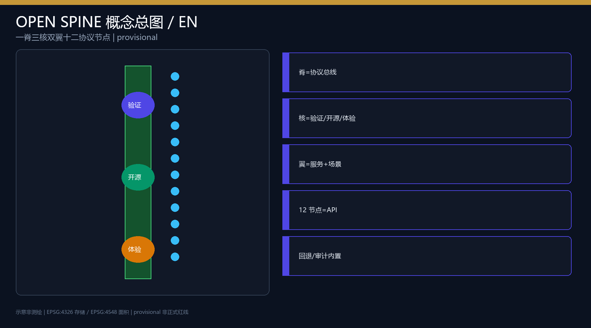
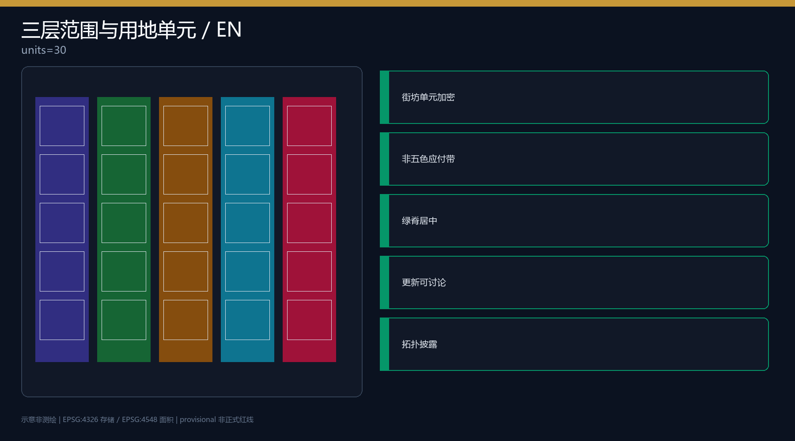
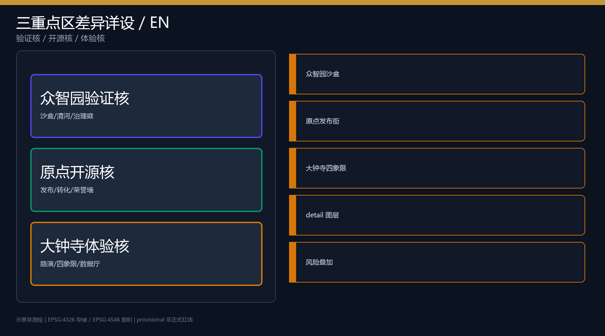
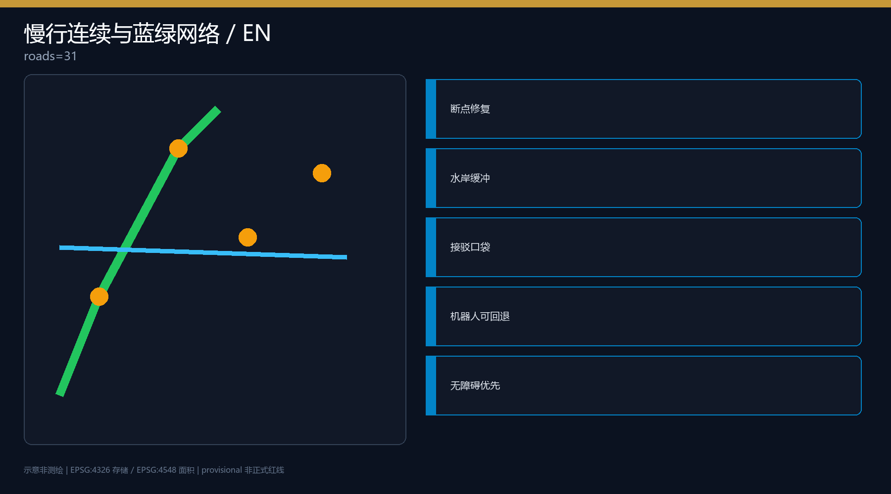
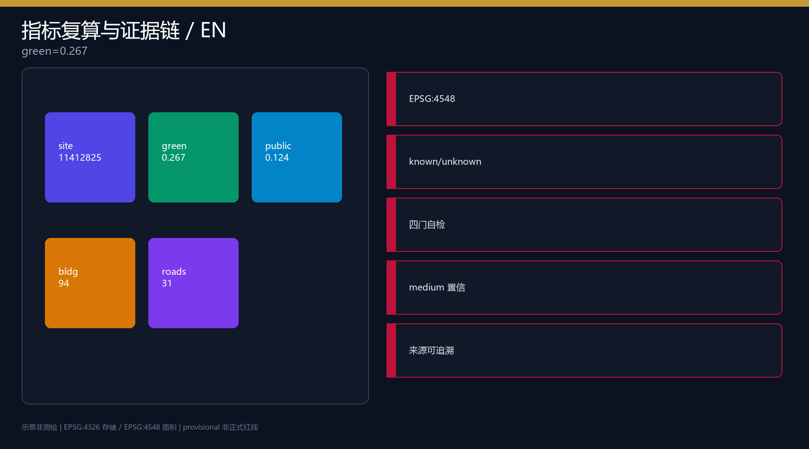

# JingZhang Open Spine · Protocol Edition (v2)

## Design Basis and Source List

This formal v2 package is based on the Haidian pre-qualification announcement and the machine-readable site package [source:OFFICIAL-ANNOUNCEMENT] [source:SITE-PACKAGE]. Agent tasks follow the open-call taskbook [source:AGENT-TASKBOOK]. Source fitness follows the registry [source:SOURCE-REGISTRY].

Coordinates are stored in EPSG:4326; areas are recomputed via EPSG:4548, recorded in `crs_note` / `equal_area_projection` [depth:metrics_recalculation]. Boundaries are provisional, not official redlines [source:BOUNDARY-SOURCE] [data:geometry/site_boundary.geojson#SITE-001].

Brand minimum set: `assets/brand/logo.svg` (sleeper + OPEN window). No unauthorised trademarks.

## Three-Level Scope Framework

Coordinated research (~43.6 km²), overall design (~11.4 km², [metric:site_area_sqm]=11412825.386 m² provisional), and key detailed design (~368.4 ha, [metric:key_area_count]=3) [depth:three_level_scope_framework]. Structure remains one spine / three cores / dual wings / twelve nodes, now governed by the Open Protocol Spine City API [depth:overall_spatial_structure].

### Regional interfaces (one action each)

Future Science City joint pitch slots; Huairou evaluation feedback; E-Town product pilot loop; Zhongguancun north sandbox booking; Jing-Jin-Ji gateway via Dazhongsi — all conceptual coordination, not administrative commitments.

## Coordinated Research Area: Industry and Future City Research

### Tip mechanism: Open Protocol Spine

See `mechanism section in proposal`. Mandatory fields: Interface, Permission (public/aggregate/authorized/forbidden), Rollback, Audit. Naming: 京张智脊 / JingZhang Open Spine / Open Protocol Spine.

### Cases (3 deep + 3 light)

Deep: Kendall Square (campus triangle → Origin transfer street); King’s Cross (station-city ops → Dazhongsi pockets); one-north (test corridors → Zhongzhiyuan sandbox). Light: Nanshan density, Toranomon vertical courts, Zhangjiang platforms. Do not copy foreign ownership models [source:AGENT-TASKBOOK] [standard:MOHURD-URBAN-DESIGN-MEASURES].

## Overall Design Area: Urban Renewal and Regulatory-Plan-Level Urban Design

Regulatory-plan **method** without fake FAR/height/redlines [standard:MOHURD-CONTROL-DETAILED-PLANNING] [depth:development_intensity_controls]. Land-use densified to **30** units covering the site [data:geometry/land_use.geojson#LU-001] [metric:land_use_unit_count] [depth:land_use_layout]. Buildings **94**, road segments **31** [metric:building_count] [metric:road_segment_count]. Renewal priority: public interfaces first, deep rebuild later.

## Detailed Design of Key Areas

Provisional KEY_AREA polygons; directional concepts only [depth:three_key_area_detailed_design] [data:geometry/key_areas.geojson#PROV-KEY-001].

### Zhongzhiyuan · Verification Core

Role: autonomy, standards, safety testing host. Problems: test disturbance, northern severance. Structure: Qinghe verification waterfront + sandbox court + cross seam (`detail_zhongzhiyuan.geojson`). Scenarios SCN-02/04/12 with red-team review. Near-term OS-02/06/12. Risks: noise/privacy; blue-line and energy permits pending. RRD typology only [depth:retain_renovate_demolish].

### AI Origin · Open-source Core

Role: campus transfer, release, talent services. Problems: visible-but-inaccessible edges; event vs daily conflict. Structure: release hall—transfer street—honor wall (`detail_beijing_ai_origin.geojson`). Scenarios SCN-01/06/11. Near-term OS-03/04/07. Risks: campus data authorisation and night noise.

### Dazhongsi · Experience Core

Role: intelligent economy and station-city host. Problems: weak four-quadrant walking; data ethics. Structure: four-quadrant pockets + pitch + data parlor (`detail_dazhongsi.geojson`). Scenarios SCN-05/07/10. Near-term OS-05/08/10. Risks: event permits and traffic specialty studies.

## AI Innovation Ecosystem, Personas, and AI+ Scenarios

Six personas including caregivers/accessibility users. Twelve objectified scenario cards with place ids, minimization, human review, rollback, pilot KPI and non-goals; ≥3 industry validation tests (SCN-02/04/07) [metric:ai_scenario_card_count] [data:scenario_nodes.geojson#SCN-01].

## Land Use, Building Scale, and Retain-Renovate-Demolish Strategy

Topology coverage reported in `topology checks used for metrics` [standard:MNR-LAND-USE-CLASSIFICATION-GUIDE]. Building footprint [metric:building_footprint_area_sqm]=440855.459 m²; density [metric:building_density] is conceptual; FAR unknown [metric:floor_area_ratio]. Character principles without fake heights [depth:height_massing_character].

## Transport, Rail, Municipal Infrastructure, and Public Services

Open slow spine + classed seam network + station pockets; **31** conceptual segments, not redlines [data:geometry/roads.geojson#ROAD-001] [depth:traffic_rail_slow_parking] [metric:road_segment_count]. Robot pilots only on reversible segments yielding to pedestrians. Edge compute remains non-engineering without utilities [depth:municipal_new_infrastructure].

## Blue-Green Network, Public Space, and Urban Character

Green ratio [metric:green_ratio]=0.267228; public ratio [metric:public_space_ratio]=0.123652 [data:geometry/green_space.geojson#GREEN-001] [data:geometry/public_space.geojson#PUBLIC-001] [depth:blue_green_public_space] [standard:MOHURD-URBAN-DESIGN-MEASURES]. Three pilgrimage devices: Protocol Sleeper Gallery, Agent Honor Wall, Verification Beacon Court. Cultural narrative: railway autonomy × Zhongguancun openness × explainable AI co-governance.

## Renewal Projects, Implementation Policy, and Phasing

Fourteen projects OS-01…OS-14 with conceptual lead actors, dependencies, spatial ids, KPIs and rollback paths, coupled to phasing polygons [data:geometry/phasing.geojson#PHASE-001] [depth:phasing_implementation] [depth:renewal_project_list] [metric:renewal_project_count]. Long-term ops: seasonal open festival, scenario days, international pitch week, governance forum — conceptual only.

## Metrics, Area Recalculation, and Compliance Matrix

Known metrics recomputed via EPSG:4548 at medium confidence under provisional geometry; statutory controls remain unknown [depth:metrics_recalculation]. Matrices cover announcement tasks and agent.1–6 with unique depth evidence summaries.

## Risk, Copyright, and Compliance

Risks: provisional precision, ownership, utilities, heritage, event noise, privacy, robot conflicts [depth:risk_missing_data] [data:geometry/constraints.geojson#CON-001]. Data grades enforced. Copyright in `report/copyright_statement.md`. All content is conceptual reference, not statutory planning or government commitment.

## References

- brief package, agent taskbook, source registry, provisional boundaries  
- local standards references  
- mechanism_onepager.md, topology_check.json, redteam_checklist.md  
- machine indexes in sources/metrics/matrices [source:SITE-PACKAGE]
