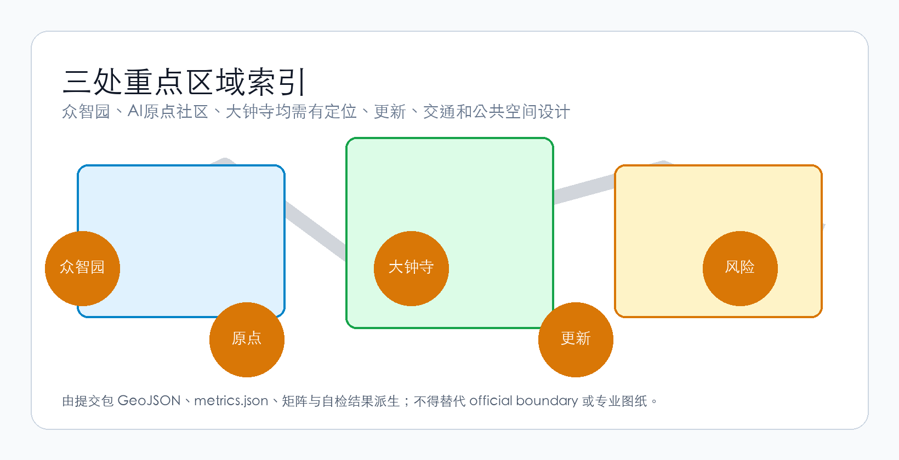
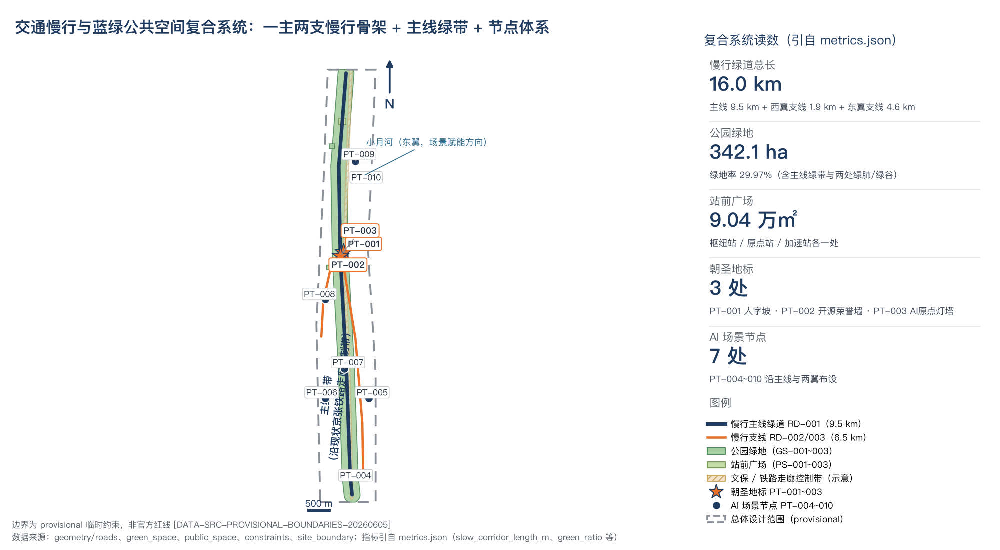

# 京张智能干线 Jing-Zhang AI Mainline

本方案是"百年京张AI创新带城市设计国际方案征集"的 formal 投稿文本，总体概念为"京张智能干线"（Jing-Zhang AI Mainline），传播语为"From the First Railway to the First AI Mainline"——把京张铁路所代表的自主干线精神，转译为人工智能时代的城市创新组织方式。全文所有空间与运营建议均为概念建议、参考方案，可供专业团队深化研究；全部空间边界为临时边界，非官方红线，正式数据发布后需复算。

## 设计依据与资料清单

本方案的第一依据是北京市规划和自然资源委员会海淀分局发布的《百年京张AI创新带城市设计国际方案征集资格预审公告》[source:OFFICIAL-ANNOUNCEMENT]，其任务、范围与深度要求按 [standard:PROJECT-OFFICIAL-ANNOUNCEMENT] 逐条落入合规矩阵；面向智能体的六项开源征集任务以 [source:AGENT-TASKBOOK] 与 [standard:PROJECT-AGENT-OPEN-CALL-TASKBOOK] 为准。设计判断：本方案不引入任何非公开资料，所有设计结论只从公告、任务书、公开标准与登记在册的临时资料出发推导。这样做的原因是征集的提交政策明确结构化数据为权威依据、禁止编造确定性（fabricated_certainty_forbidden），因此文本叙述必须与 GeoJSON 图层、指标表和登记文件一一对应。

`data/source_registry.json` 当前登记 6 条资料：5 条 formal-ready（官方公告、智能体任务书、城市设计管理办法、控规深度标准、用地用海分类指南），1 条 provisional-only（临时边界）[source:SOURCE-REGISTRY]。使用边界：formal-ready 资料支撑任务口径与术语，provisional-only 资料只用于方案生成、自检与可视化，不得升级为官方红线、法定控规、正式评分依据或政府实施承诺。`brief/site-package/` 的枚举、范围与设计简报是机器可读输入 [source:SITE-PACKAGE]；`data/processed/agent_fact_pack.md` 只是阅读导航层，不是新的权威来源 [source:PROCESSED-FACT-PACK]。

正文引用与五个登记文件的对应关系为：`sources.json` 登记证据源（现有 7 条，第 3 章全球案例以 CASE-* 条目补充登记）；`assumptions.json` 登记假设与待确认事项；`compliance_matrix.json` 覆盖公告与任务书的 23 条必选任务；`standard_matrix.json` 覆盖 6 项标准；`design_depth_matrix.json` 覆盖 15 项深度项。其中现状诊断、指标复算与缺资料风险分别对应 [depth:existing_conditions_diagnosis]、[depth:metrics_recalculation] 与 [depth:risk_missing_data]；用地分类术语遵循 [standard:MNR-LAND-USE-CLASSIFICATION-GUIDE]，城市设计与控规深度遵循 [standard:MOHURD-URBAN-DESIGN-MEASURES] 与 [standard:MOHURD-CONTROL-DETAILED-PLANNING]；建筑工程设计深度文件 [standard:MOHURD-ARCH-DESIGN-DEPTH-2016] 因公开获取受限，在标准矩阵中按 data_gap 处理，仅作深化方向参考。

边界依据 [source:BOUNDARY-SOURCE] 与 [source:KEY-AREA-SOURCE]，对应提交图层 [data:geometry/site_boundary.geojson#SITE-001] 与 key_areas 的三个 feature；总体设计范围复算面积约 1,141.3 万平方米（[metric:site_area_sqm]，confidence=low）。**provisional 声明：本方案全部空间边界为临时边界，非官方红线，正式数据发布后需复算。** 资料缺口：官方边界 polygon、控制性详细规划指标、现状建筑测绘、土地权属、市政管线与文保测绘均未公开获得，凡涉及容积率、建筑高度、拆改留结论、道路线位与投资测算的内容一律列为待确认，进入 `assumptions.json` 与第 12 章风险清单。

## 三层范围工作框架

公告 1.3、1.4 规定了三层工作范围 [standard:PROJECT-OFFICIAL-ANNOUNCEMENT]。设计判断：三层不是三张孤立的图，而是"战略—结构—实施"的递进校验链——统筹研究范围决定产业与城市形态判断，总体设计范围把判断落到用地、交通与公共空间结构，重点区域范围验证具体片区的可实施性，三层逐级回溯、逐级校验 [depth:three_level_scope_framework]。

| 层级 | 官方口径面积 | 临时边界复算值 | 空间边界（公告文字四至） | 设计深度与成果 |
| --- | --- | --- | --- | --- |
| 统筹研究范围 | 43.6 平方公里 | 约 4,360.9 万平方米（[metric:research_area_sqm]） | 北至北五环路，东至京藏高速，南至西直门外大街，西至万泉河路 | 产业生态与未来城市研究、总体空间结构 |
| 总体设计范围 | 11.4 平方公里 | 约 1,141.3 万平方米（[metric:site_area_sqm]） | 京张遗址公园周边 1-2 公里；北至北五环路，东至学院路、西土城路等，南至西直门外大街，西至大钟寺东路、荷清路等 | 控规深度城市设计，用地、建筑、道路、绿地、公共空间图层 |
| 重点区域范围 | 368.4 公顷 | 约 369.3 公顷（[metric:key_scope_area_sqm]，[metric:key_area_count]=3 处） | 自北向南：众智园AI自主创新加速区、北京AI原点社区、大钟寺AI产业集聚区 | 规划综合实施方案深度，详见第 5 章 |

三层边界目前均无官方 polygon，本方案使用 `brief/site-package/geometry/provisional_boundaries.geojson` 派生的临时替代边界（official_boundary=false、boundary_precision=provisional_rough）[source:BOUNDARY-SOURCE][source:KEY-AREA-SOURCE]，对应提交图层 [data:geometry/site_boundary.geojson#SITE-001] 与 [data:geometry/key_areas.geojson#KEY-001]、[data:geometry/key_areas.geojson#KEY-002]、[data:geometry/key_areas.geojson#KEY-003]。**provisional 限制声明：临时边界为粗略来源，非官方红线，只可用于方案生成、自检、可视化与设计讨论，不可作为官方红线、精确面积依据或法定控制结论**；复算面积与官方口径的差异（如重点区域 369.3 公顷对 368.4 公顷）即粗略边界带来的偏差。正式数据发布后需复算：site boundary、key areas、land use、roads、green space、public space、buildings、phasing 九个图层及全部面积、比例类指标都须重算并重新自检，不能只替换单个文件。

三层框架同时是概念体系的空间载体：主线（京张遗址公园活力带）贯穿总体设计范围；三个编组站（加速站、原点站、枢纽站）即三处重点区域；两条支线（要素支线、场景支线）在统筹研究范围层面连接中关村科技服务翼与小月河场景赋能翼。命名体系的完整定义见第 3 章，本章只锁定范围、面积与深度的证据链。资料缺口：三层范围的官方边界与面积确认均待正式数据发布。

## 统筹研究范围产业与未来城市研究

统筹研究范围（临时边界复算约 4,360.9 万平方米，[metric:research_area_sqm]）的核心输出是概念与结构判断。设计判断：以"京张智能干线"（Jing-Zhang AI Mainline）为主名称，传播语"From the First Railway to the First AI Mainline"。为什么这样判断：京张铁路 1909 年建成通车，是首条由中国人自行勘测、设计、施工的干线铁路，詹天佑在青龙桥以"人"字形折返线解决线路高差，这是公开史实；"自主干线"母题与公告要求的"AI全栈自主创新体系"天然同构，而铁路语言（主线、编组站、支线、车站、时刻表）能把抽象的产业生态转译为可落图、可运营、可传播的空间系统 [source:AGENT-TASKBOOK][standard:PROJECT-AGENT-OPEN-CALL-TASKBOOK]。

命名体系（铁路语言贯穿，全部映射到图层）：

| 铁路语言 | 城市设计对象 | 图层落点 |
| --- | --- | --- |
| 主线 Mainline | 京张遗址公园活力带 | [data:geometry/green_space.geojson#GS-001]、[data:geometry/roads.geojson#RD-001] |
| 编组站 Yards | 三处重点区：加速站（众智园）、原点站（北京AI原点社区）、枢纽站（大钟寺） | [data:geometry/key_areas.geojson#KEY-001]、[data:geometry/key_areas.geojson#KEY-002]、[data:geometry/key_areas.geojson#KEY-003] |
| 支线 Branches | 两翼：中关村科技服务翼=要素支线、小月河场景赋能翼=场景支线 | [data:geometry/roads.geojson#RD-002]、[data:geometry/roads.geojson#RD-003] |
| 车站 Stops | 沿线 AI 场景节点（7 处） | [data:geometry/public_space.geojson#PT-004] 至 PT-010 |
| 时刻表 Timetable | 年度活动体系（第 10 章概念建议） | 与 [data:geometry/phasing.geojson#PHASE-001] 等分期图层衔接 |
| 巡礼 Pilgrimage | AI 朝圣路线（3 处朝圣地标） | [data:geometry/public_space.geojson#PT-001]、[data:geometry/public_space.geojson#PT-002]、[data:geometry/public_space.geojson#PT-003] |
| 站台铭牌 Nameplate | 荣誉展示体系 | [data:geometry/public_space.geojson#PT-002] 开源荣誉墙 |

Logo 方向（文字说明，图形全部自绘清权）：把詹天佑"人"字形轨道转译为一条向上生长的数据流——两条轨道线在中心交汇后分叉上行，既读作"人"，也读作数据的分发与汇聚；色彩为墨蓝+信号橙，墨蓝对应铁路工业记忆与信任感，信号橙对应安全提示与激活。不使用任何外部字体、商标、人物肖像或企业标识。该方向为概念建议，可供专业团队深化研究。

三大定位落到三层空间：百年京张文化带=主线的遗产层（遗址公园与文保节点），都市AI生活体验带=车站的场景层（第 6 章场景卡），AI融合创新带=编组站的产业层（第 5 章重点区）。五大功能按编组站分工：加速站承担 AI 全栈自主创新体系与 AI 治理全球话语权，原点站承担世界级 AI 创新生态，枢纽站承担智能原生新业态与智能化 AI 活力城市界面，两翼支撑全局要素与场景供给。三区两翼协同回路（概念建议）：要素支线把中关村的资本、科技服务与知识产权注入编组站；编组站完成研发、转化与展示；主线把成果转译为公共体验；场景支线沿小月河开放真实城市测试并把需求反馈给研发端，形成"要素注入—研发转化—公共展示—场景反馈"闭环 [depth:overall_spatial_structure]。

对未来城市形态的判断：AI 改变的不是单一建筑类型，而是工作、学习、生活与公共服务的时空组织——研发需要可测试的真实环境，人才需要低成本的协作与交往空间，公共服务需要可解释、可复核的智能界面。因此本方案把产业战略落到可定位的功能区、节点与廊道（第 4 章用地结构、第 5 章重点区、第 6 章场景卡），而非停留在技术愿景；任何全球活动、开发者社区与朝圣路线均为概念建议，不是已确定的政府安排。

以下 6 个全球案例只写公开可核实事实，用于校准上述结构与机制判断：

**案例 1｜波士顿剑桥 Kendall Square** [source:CASE-KENDALL]：紧邻麻省理工学院的 Kendall Square 自 20 世纪后期由工业与仓储用地逐步再开发为科技与生命科学创新聚集区。其经验显示"高校邻近+渐进更新+实验功能混合"可以长期支撑创新密度。对本方案的转化：原点站的近校创新与加速站的"研发+中试混合"功能组织沿用这一空间逻辑（概念建议）。

**案例 2｜伦敦 Knowledge Quarter** [source:CASE-KNOWLEDGE-QUARTER]：伦敦 King's Cross—Euston 一带由大英图书馆、高校与科研机构等多家知识机构组成伙伴网络，以机构协作而非单一开发商主导的方式推动区域品牌与空间共享。转化：要素支线采用"机构伙伴网络"式的运营机制（概念建议），而非单一主体招商。

**案例 3｜多伦多 Sidewalk Labs Quayside（教训）** [source:CASE-SIDEWALK-QUAYSIDE]：2017 年公布的 Quayside 智慧社区计划于 2020 年 5 月宣布终止，全程伴随数据治理与隐私安排的公共争议。教训：数据治理与公共信任必须先于技术部署。本方案所有场景卡均先写隐私边界与人工复核（第 6 章），场景开放以"可监管、可撤回"为前提。

**案例 4｜匹兹堡机器人生态** [source:CASE-PITTSBURGH-ROBOTICS]：卡内基梅隆大学机器人研究所 1979 年成立，长期的人才与研究积累使匹兹堡在钢铁产业衰退后逐步形成机器人与 AI 研发聚集。转化：研究机构的长期主义比短期招商更关键，加速站配置中试验证与标准治理功能（概念建议）。

**案例 5｜深圳前海** [source:CASE-QIANHAI]：前海深港现代服务业合作区 2010 年获国务院批复总体发展规划，以制度创新与规则衔接组织现代服务业集聚。转化：AI 治理话语权需要"规则+场景"双载体，枢纽站的数据要素展示与治理沙盒概念沿用此逻辑（概念建议）。

**案例 6｜纽约 Cornell Tech** [source:CASE-CORNELL-TECH]：纽约市 2011 年通过公开征集引入康奈尔大学与以色列理工合作设立研究生校区，2017 年罗斯福岛校区启用，以"高校新校区+城市更新用地"绑定人才与产业。转化：原点站的"高校—园区—社区"缝合策略（概念建议）。

资料缺口：统筹范围内的产业、企业与人才现状数据未公开获得，产业链梳理只能到结构层；本方案不作企业名单、投资额与产值判断，案例来源 URL 登记于 `sources.json` 的 CASE-* 条目。

## 总体设计范围城市更新与控规深度城市设计

总体设计范围（[metric:site_area_sqm] 约 1,141.3 万平方米，临时边界复算）的空间结构为"一主线、三编组站、两支线"：主线即京张遗址公园活力带，由主线公园绿地 [data:geometry/land_use.geojson#LU-001]、主线绿带 [data:geometry/green_space.geojson#GS-001] 与慢行主线 [data:geometry/roads.geojson#RD-001] 复合构成；三编组站对应 [data:geometry/key_areas.geojson#KEY-001]、[data:geometry/key_areas.geojson#KEY-002]、[data:geometry/key_areas.geojson#KEY-003]；两支线为西翼要素支线 [data:geometry/roads.geojson#RD-002] 与东翼场景支线 [data:geometry/roads.geojson#RD-003]。设计判断：以遗址公园为结构主轴而不是外围绿地，因为它同时承载遗产展示、慢行连通与公共生活三件事，是更新框架的组织骨架 [depth:overall_spatial_structure][standard:MOHURD-URBAN-DESIGN-MEASURES]。

用地按 [standard:MNR-LAND-USE-CLASSIFICATION-GUIDE] 分类，图层完整覆盖临时边界 [depth:land_use_layout]，功能比例（设计建议口径，非控规指标）如下：

| 用地代码 | 类别 | 复算面积 | 占比 | 证据 |
| --- | --- | --- | --- | --- |
| 1401 | 公园绿地 | 约 340.1 万平方米 | 约 29.8% | [metric:land_use_1401_area_sqm]、[data:geometry/land_use.geojson#LU-001] |
| 0802 | 科研用地 | 约 298.6 万平方米 | 约 26.2% | [metric:land_use_0802_area_sqm]、[data:geometry/land_use.geojson#LU-009]、[data:geometry/land_use.geojson#LU-011] |
| 0701 | 城镇住宅用地 | 约 106.1 万平方米 | 约 9.3% | [metric:land_use_0701_area_sqm]、[data:geometry/land_use.geojson#LU-008] |
| 0702 | 城镇社区服务设施用地 | 约 101.2 万平方米 | 约 8.9% | [metric:land_use_0702_area_sqm]、[data:geometry/land_use.geojson#LU-007] |
| 0804 | 教育用地 | 约 87.8 万平方米 | 约 7.7% | [metric:land_use_0804_area_sqm]、[data:geometry/land_use.geojson#LU-010] |
| 0803 | 文化用地 | 约 74.1 万平方米 | 约 6.5% | [metric:land_use_0803_area_sqm]、[data:geometry/land_use.geojson#LU-006] |
| 05 | 商业服务业用地 | 约 57.2 万平方米 | 约 5.0% | [metric:land_use_05_area_sqm]、[data:geometry/land_use.geojson#LU-005] |
| 1207 | 城镇道路用地 | 约 42.4 万平方米 | 约 3.7% | [metric:land_use_1207_area_sqm]、[data:geometry/land_use.geojson#LU-012] |
| 16 | 留白用地 | 约 24.7 万平方米 | 约 2.2% | [metric:land_use_16_area_sqm]、[data:geometry/land_use.geojson#LU-013] |
| 1403 | 广场用地 | 约 9.0 万平方米 | 约 0.8% | [metric:land_use_1403_area_sqm]、[data:geometry/land_use.geojson#LU-002] 等 3 处站前广场 |

注：各分项合计与边界复算值存在约 10 平方米级误差，属 provisional_rough 精度范围。设计判断：创新功能（科研+教育+文化+商业服务）合计约 45%，居住与社区服务约 18%，公园绿地与广场约 31%，结构可以支撑"研发为主、生活为底、公园为轴"的更新方向；留白用地为不确定的产业演进保留弹性（概念建议）。

城市更新总体框架以保留为主、功能置换与插建为概念建议；拆改留分类只有方法、没有结论——具体地块的保留、改造、拆除、新建须待权属、现状建筑测绘与控规条件确认 [depth:retain_renovate_demolish]。概念建筑基底合计约 18.0 万平方米（[metric:building_footprint_area_sqm]，对应 [data:geometry/buildings.geojson#BLDG-001] 等 7 个概念基底），仅表达功能布局意图，不构成建筑方案；建筑高度、体量与界面只作风貌引导 [depth:height_massing_character]。**无官方控规指标：容积率 [metric:floor_area_ratio]、建筑高度 [metric:building_height_m]、建筑密度 [metric:building_density] 与现状建筑面积 [metric:existing_building_area_sqm] 在指标体系中均为 unknown，列为待确认事项**，不得以推测值冒充审定指标 [standard:MOHURD-CONTROL-DETAILED-PLANNING][depth:development_intensity_controls]。

蓝绿与公共空间：绿地复算约 342.1 万平方米、绿地率约 30.0%（[metric:green_space_area_sqm]、[metric:green_ratio]），公园绿地骨架充足；广场型公共空间约 9.0 万平方米、占比约 0.8%（[metric:public_space_area_sqm]、[metric:public_space_ratio]），相对偏少——设计判断：应沿主线与三个站前节点增补口袋公园与广场复合利用，作为更新框架的公共空间动作（概念建议）[depth:blue_green_public_space]。交通与市政承载：慢行绿道复算约 16.0 公里（[metric:slow_corridor_length_m]）；当前提交的中心线全部为绿道（[metric:road_length_m] 与慢行长度相等），城市道路网、道路红线与轨道接驳条件无公开资料，交通组织结论列为待确认 [depth:traffic_rail_slow_parking]；端侧算力、分布式能源等新型基础设施只作概念布局，负荷与管位测算待确认 [depth:municipal_new_infrastructure]。资料缺口：控规条件、现状测绘、权属、市政与文保资料全部待正式数据发布后复算。

## 重点区域详细设计

三处重点区域自北向南为加速站（众智园）、原点站（北京AI原点社区）、枢纽站（大钟寺），合计复算约 369.3 公顷（[metric:key_scope_area_sqm]，[metric:key_area_count]=3）。**三处 polygon 均为临时边界，非官方红线，正式数据发布后需复算**，本节所有结论只能作为方向性设计。每区按"定位+空间结构+建筑更新+交通慢行+公共空间+AI 场景+实施风险"组织，深度按规划综合实施方案的城市设计深度控制 [depth:three_key_area_detailed_design][standard:PROJECT-OFFICIAL-ANNOUNCEMENT]。

### 加速站·众智园AI自主创新加速区

定位：承担 AI 全栈自主创新体系与 AI 治理话语权，形态为花园型研发街区（概念建议）；复算面积约 192.9 公顷（[metric:key_area_zhongzhiyuan_sqm]，官方口径 192.1 公顷）[data:geometry/key_areas.geojson#KEY-001]。空间结构：以科研产业区 [data:geometry/land_use.geojson#LU-011] 为主体，绿谷公园 [data:geometry/green_space.geojson#GS-003] 为中央开放空间，站前广场 [data:geometry/public_space.geojson#PS-003] 为展示与集散节点，构成"研发环绿谷"结构（概念建议）。建筑更新：概念基底为研发楼群 [data:geometry/buildings.geojson#BLDG-001] 与中试验证中心 [data:geometry/buildings.geojson#BLDG-007]，建议以保留现状园区建筑、插建中试与展示空间为方向，具体拆改留待权属与现状测绘确认 [depth:retain_renovate_demolish]。交通慢行：接入慢行主线北延段 [data:geometry/roads.geojson#RD-001]，区内组织环绿谷慢行环（概念建议）；对外交通与停车组织待道路交通资料确认。公共空间：绿谷公园与站前广场复合承载开放测试观摩与标准发布活动（概念建议）；清河界面的蓝线、生态与防洪条件待确认。AI 场景：AI 产业测试验证场节点 [data:geometry/public_space.geojson#PT-009] 与智慧林荫慢跑道节点 [data:geometry/public_space.geojson#PT-007]，对应第 6 章场景卡 07、08。实施风险：列入远期完善区 [data:geometry/phasing.geojson#PHASE-003]（复算约 338.6 万平方米，[metric:phase_long_area_sqm]），依赖控规条件、蓝线复核与权属协调；更新项目与分期安排均为概念建议 [depth:renewal_project_list][depth:phasing_implementation]。

### 原点站·北京AI原点社区

定位：承担世界级 AI 创新生态策源功能，形态为"高校—园区—社区"缝合的近校创新社区（概念建议）；复算面积约 104.3 公顷（[metric:key_area_origin_sqm]，官方口径 104.3 公顷）[data:geometry/key_areas.geojson#KEY-002]。空间结构：东翼科研区 [data:geometry/land_use.geojson#LU-009] 与五道口高校教育区 [data:geometry/land_use.geojson#LU-010] 南北呼应，社区公园 [data:geometry/green_space.geojson#GS-002] 为公共绿肺，站前广场 [data:geometry/public_space.geojson#PS-002] 衔接清华园站方向。建筑更新：概念基底为研发院落 [data:geometry/buildings.geojson#BLDG-002] 与教育实训中心 [data:geometry/buildings.geojson#BLDG-005]；首层业态与院落开放为概念建议，拆改留待确认 [depth:retain_renovate_demolish]。交通慢行：要素支线绿道 [data:geometry/roads.geojson#RD-002] 连接西翼居住生活区，缝合校区、园区与街区慢行；轨道站点一体化方案待轨道资料确认。公共空间：社区公园、站前广场与院落开放空间构成三级体系（概念建议）；AI原点灯塔 [data:geometry/public_space.geojson#PT-003] 为巡礼地标概念。AI 场景：AI 教育体验节点 [data:geometry/public_space.geojson#PT-008]，对应第 6 章场景卡 09。实施风险：列入中期拓展区 [data:geometry/phasing.geojson#PHASE-002]（复算约 333.0 万平方米，[metric:phase_mid_area_sqm]）；清华园车站旧址文物保护控制范围（示意）[data:geometry/constraints.geojson#CONS-001] 内的任何建设概念建议必须避让并待文保测绘确认，校区边界与权属待确认 [depth:renewal_project_list][depth:phasing_implementation]。

### 枢纽站·大钟寺AI产业聚集区

定位：承担智能原生新业态与国际交往功能，形态为城市型智能经济街区（概念建议）；复算面积约 72.0 公顷（[metric:key_area_dazhongsi_sqm]，官方口径 72.0 公顷）[data:geometry/key_areas.geojson#KEY-003]。空间结构：商业服务区 [data:geometry/land_use.geojson#LU-005] 与文化展示区 [data:geometry/land_use.geojson#LU-006] 东西分翼，站前广场 [data:geometry/public_space.geojson#PS-001] 为核心公共节点。建筑更新：概念基底为产业孵化楼 [data:geometry/buildings.geojson#BLDG-003] 与文化展示馆 [data:geometry/buildings.geojson#BLDG-004]；更新重点为企业周边公共环境，不涉及企业权属建筑改造（概念建议），拆改留待确认 [depth:retain_renovate_demolish]。交通慢行：大钟寺站一体化与路口四象限步行连通为概念建议，待轨道站点与道路交通资料确认；接入慢行主线 [data:geometry/roads.geojson#RD-001] 与场景支线 [data:geometry/roads.geojson#RD-003]。公共空间：站前广场复合文化展示与路演功能（概念建议）；人字坡纪念节点 [data:geometry/public_space.geojson#PT-001] 为巡礼起点地标概念。AI 场景：AI 导览服务节点 [data:geometry/public_space.geojson#PT-004]，对应第 6 章场景卡 01。实施风险：列入近期启动区 [data:geometry/phasing.geojson#PHASE-001]（复算约 469.6 万平方米，[metric:phase_near_area_sqm]，含枢纽站及周边片区）；近期以轻量设施与运营活动启动为概念建议，依赖交叉口市政管线与轨道条件复核 [depth:renewal_project_list][depth:phasing_implementation]。

## AI 创新生态、人才画像与 AI+ 场景

设计判断：AI 创新生态的空间载体不是园区围墙，而是"编组站—支线—车站"的日常网络——人才在主线上通勤与交往，企业在编组站研发与测试，公众在车站级节点体验与反馈。AI 场景节点在命名体系中即"车站"：图层共登记 10 个概念 Point 节点，其中 AI 场景节点 7 处、AI 朝圣地标 3 处，[metric:ai_scenario_node_count]=10 的口径即 7+3，[metric:ai_landmark_count]=3（地标详见第 9 章）。为什么按 10 张卡组织：任务书要求不少于 10 张 AI 场景卡、不少于 3 张产业测试验证场景、不少于 5 类用户画像 [source:AGENT-TASKBOOK][standard:PROJECT-AGENT-OPEN-CALL-TASKBOOK]；本方案以 6 个注册标准场景（ai-cultural-guide、ai-health-service-navigation、ai-traffic-walkability、enterprise-service-copilot、public-safety-operations-review、robot-delivery-low-speed）为骨架，补充 4 张本地方案卡，每张卡都映射到具体图层 feature，而不是停在口号。

用户画像（6 类，覆盖人才、企业、居民与治理需求）：

| 用户画像 | 典型需求 | 空间响应（图层） | 数据与自检边界 |
| --- | --- | --- | --- |
| AI 研究员与高校师生 | 成果转化、跨机构协作、实验环境 | 科研与教育区 [data:geometry/land_use.geojson#LU-009]、实训中心 [data:geometry/buildings.geojson#BLDG-005] | 校园数据与科研成果须授权 |
| AI 创业者与初创团队 | 低成本办公、中试测试、政策导航 | 科研产业区 [data:geometry/land_use.geojson#LU-011]、中试中心 [data:geometry/buildings.geojson#BLDG-007] | 算力与数据服务需另行授权 |
| 开发者与开源社区成员（含访客开发者） | 发布、协作、社区声誉、巡礼体验 | 开源荣誉墙 [data:geometry/public_space.geojson#PT-002]、主线车站序列 | 不采集个人行为轨迹，活动数据只做聚合统计 |
| 周边社区居民 | 通勤、休闲、健康与生活服务、低扰动更新 | 社区公园 [data:geometry/green_space.geojson#GS-002]、健康驿站 [data:geometry/public_space.geojson#PT-006]、西翼绿道 [data:geometry/roads.geojson#RD-002] | 居民画像不用于商业推荐 |
| 企业访客与商务人士 | 展示、路演、国际接待 | 枢纽站站前广场 [data:geometry/public_space.geojson#PS-001]、商业服务区 [data:geometry/land_use.geojson#LU-005] | 企业标识与案例须清权 |
| 城市运营与治理人员 | 活动安全、设施维护、场景监管 | 三处站前广场与活动路线 [data:geometry/public_space.geojson#PS-001] | 安全判断只作提示，人工复核兜底 |

场景卡（10 张，其中卡 06、07、10 为产业测试验证场景）：

**场景卡 01｜AI 导览与文化叙事（标准场景 ai-cultural-guide）**
- 场景名：AI 导览与文化叙事（"巡礼"讲解系统）；服务对象：游客、学生、居民、活动参与者
- 空间位置：枢纽站 AI 导览服务节点 [data:geometry/public_space.geojson#PT-004] 与人字坡纪念节点 [data:geometry/public_space.geojson#PT-001]，串联主线车站序列
- 运行数据：公开历史资料、授权图片文字、人工策展文本、公开活动信息
- 隐私边界：不采集个人轨迹与人脸，客流仅匿名聚合计数
- 人工复核：导览文本、图片与人物/机构叙述由文化、版权与事实核查人员复核
- 运营主体：概念建议由遗址公园运营方与策展团队协作，待授权
- 风险：史实错误、素材版权不清、AI 生成内容混同事实

**场景卡 02｜AI+交通慢行评估（标准场景 ai-traffic-walkability）**
- 场景名：AI+交通慢行评估；服务对象：居民、学生、游客、通勤者
- 空间位置：慢行主线 [data:geometry/roads.geojson#RD-001] 与西翼、东翼支线绿道 [data:geometry/roads.geojson#RD-002]、[data:geometry/roads.geojson#RD-003]
- 运行数据：公开道路与轨道站点资料、人工调研、授权反馈
- 隐私边界：低侵入匿名计数，不做人脸识别与个人轨迹追踪
- 人工复核：空间优化建议由规划、交通、无障碍与公众参与程序复核
- 运营主体：概念建议由交通研究团队与属地运营方协作，待确认
- 风险：数据代表性不足；路线建议被误解为审定交通方案，所有输出须标注"概念建议"

**场景卡 03｜AI+医疗健康服务导航（标准场景 ai-health-service-navigation）**
- 场景名：AI+医疗健康服务导航；服务对象：园区青年、居民、游客
- 空间位置：AI 健康服务驿站 [data:geometry/public_space.geojson#PT-006]（西翼居住生活区 [data:geometry/land_use.geojson#LU-008]）
- 运行数据：公开公共服务信息、授权活动信息、人工整理的服务目录
- 隐私边界：只作公共服务导航，不采集个人健康信息
- 人工复核：医疗相关内容由医疗、法律与数据安全专业人员复核
- 运营主体：概念建议由社区卫生服务机构与运营方协作，待确认
- 风险：医疗建议越界、服务信息过期、个人健康信息误采集

**场景卡 04｜企业服务 Copilot（标准场景 enterprise-service-copilot）**
- 场景名：企业服务 Copilot；服务对象：AI 企业、创业团队、开发者、园区运营者
- 空间位置：加速站科研产业区 [data:geometry/land_use.geojson#LU-011] 企业服务窗口（概念）与中试验证中心 [data:geometry/buildings.geojson#BLDG-007]
- 运行数据：公开政策、公开服务目录、授权园区活动信息、人工维护问答
- 隐私边界：不读取企业内部数据，咨询记录最小化留存
- 人工复核：政策、法律、知识产权与数据合规内容由专业人员复核，保留人工咨询入口
- 运营主体：概念建议由园区运营方与专业服务机构协作，待确认
- 风险：政策解释过度、替代专业法律意见、服务目录更新滞后

**场景卡 05｜公共安全与活动运营复核（标准场景 public-safety-operations-review）**
- 场景名：公共安全与活动运营复核；服务对象：维护者、运营团队、公众参与团队
- 空间位置：三处站前广场 [data:geometry/public_space.geojson#PS-001]、[data:geometry/public_space.geojson#PS-002]、[data:geometry/public_space.geojson#PS-003] 与年度活动路线
- 运行数据：公开活动信息、人工巡查记录、授权反馈、公开空间管理规则
- 隐私边界：反对过度监控——不设个人识别，只做风险模式提示
- 人工复核：所有安全判断只作提示，由公共安全、运营、无障碍与公众参与机制复核
- 运营主体：概念建议由公共空间运营方与属地管理机制协作，待确认
- 风险：误判风险等级、过度监控倾向、公共安全判断被自动化替代

**场景卡 06｜机器人低速配送（标准场景 robot-delivery-low-speed）【产业测试验证场景】**
- 场景名：机器人低速配送试点；服务对象：园区员工、商户、居民、访客
- 空间位置：无人配送测试节点 [data:geometry/public_space.geojson#PT-005]（东翼社区服务区 [data:geometry/land_use.geojson#LU-007]），低速、可监管、可撤回路线
- 运行数据：公开道路与步道信息、现场人工调研、授权运营数据
- 隐私边界：车载传感不采集人脸与个人身份信息，数据本地化处理
- 人工复核：试点边界、速度、避让规则与运营责任由交通、安全、运营与公众参与团队复核
- 运营主体：概念建议由测试主体与监管机制协作，须经主管部门与专业团队评估后方可试点，非已批准运营
- 风险：人机混行安全、噪声与占道、公众接受度不足

**场景卡 07｜AI 产业中试与测试验证场【产业测试验证场景】**
- 场景名：AI 产业中试与测试验证场；服务对象：AI 企业、研究机构、标准与治理团队
- 空间位置：AI 产业测试验证场节点 [data:geometry/public_space.geojson#PT-009] 与中试验证中心 [data:geometry/buildings.geojson#BLDG-007]（加速站科研产业区）
- 运行数据：授权测试数据、公开标准文本、人工评测记录
- 隐私边界：测试数据分级授权、不出域，不涉及个人数据
- 人工复核：测试规程与安全评估由标准、安全治理专家复核
- 运营主体：概念建议由园区运营方与第三方评测机构协作，待授权
- 风险：测试安全边界失守、结果外推过度、未成熟技术被误读为可全面部署

**场景卡 08｜智慧林荫慢跑道与公共健康体验**
- 场景名：智慧林荫慢跑道；服务对象：居民、青年人才、访客
- 空间位置：智慧林荫慢跑道节点 [data:geometry/public_space.geojson#PT-007]（主线绿带中段 [data:geometry/green_space.geojson#GS-001]）
- 运行数据：匿名化使用计数、公开环境数据（气象、空气质量）
- 隐私边界：不采集个人运动数据，不提供医疗建议
- 人工复核：设施安全与提示内容由运营与公共安全团队复核
- 运营主体：概念建议由公园运营方维护，待确认
- 风险：健康数据误用、设施维护缺位

**场景卡 09｜AI 教育体验与科普实训**
- 场景名：AI 教育体验与科普实训；服务对象：高校学生、中小学生、公众
- 空间位置：AI 教育体验节点 [data:geometry/public_space.geojson#PT-008] 与五道口AI教育实训中心 [data:geometry/buildings.geojson#BLDG-005]（五道口高校教育区 [data:geometry/land_use.geojson#LU-010]）
- 运行数据：公开课程与科普内容、授权教学素材
- 隐私边界：未成年人数据不采集、不画像
- 人工复核：教育内容由教育与内容审核人员复核
- 运营主体：概念建议由高校与科普机构协作，待授权
- 风险：内容适龄性、教育公平性

**场景卡 10｜小月河场景赋能开放实验【产业测试验证场景】**
- 场景名：小月河场景赋能开放实验；服务对象：AI 企业、开发者、社区居民
- 空间位置：小月河场景赋能节点 [data:geometry/public_space.geojson#PT-010]（东翼北段），衔接场景支线绿道 [data:geometry/roads.geojson#RD-003]
- 运行数据：授权场景数据、公开城市运行数据、人工维护的开放场景目录
- 隐私边界：场景开放以"可监管、可撤回"为前提，数据分级授权
- 人工复核：场景开放申请与数据合规由数据合规与运营团队复核
- 运营主体：概念建议由场景支线运营机制与属地协作，待确认
- 风险：场景开放安全、数据合规、公众预期管理

全部场景遵守数据最小化、公开来源、可解释、人工复核与人本治理原则（任务书共创宪章 charter.10）[source:AGENT-TASKBOOK]：城市智能体辅助识别慢行断点、公共空间使用强度、设施维护与企业服务需求，但不替代规划审批、不输出未经授权的个人画像、不声称获得官方实施承诺；三张产业测试验证场景（卡 06、07、10）均为概念建议，须经主管部门与专业团队评估后方可试点，不得表述为已批准运营。资料缺口：各场景的运营主体、数据授权与试点许可均待确认，进入 `assumptions.json` 与第 12 章风险清单。

## 用地、建筑规模与拆改留方案

用地方案应依据国土空间调查、规划、用途管制分类等公开标准表达，形成完整、闭合、无缝的用地分区。建筑方案应区分保留、改造、更新、新建或待确认对象，明确建筑基底、功能、规模、风貌、屋顶、体量和高度控制的建议层级。若缺少现状建筑、权属、控规和工程条件，方案只能提出方法和待校准清单，不能编造拆改留结论。

用地分类依据 [standard:MNR-LAND-USE-CLASSIFICATION-GUIDE]，建筑高度、体量、界面和风貌控制由 [depth:height_massing_character] 管理，拆改留方法由 [depth:retain_renovate_demolish] 管理。用地和建筑的主要证据是 [data:geometry/land_use.geojson#LU-001]、[data:geometry/buildings.geojson#BLDG-001] 和 [metric:building_footprint_area_sqm]。

建筑规模和强度指标必须与 `metrics.json` 和图层一致。若总建筑规模、容积率、建筑高度、建筑密度、绿地率、退线和建筑控制线缺少官方条件，应在指标体系中列为 unknown 或 pending_control，不得用固定数值制造精确感。A3 文册应给出更新项目清单和指标复核表，A0 展板应把关键空间结构和重点片区表达清楚，HTML 页面应提供指标和图层联动查看。

## 交通、轨道、市政与公共服务设施

交通方案应回应公告对轨道站点一体化、道路微循环、慢行断点、对外交通、停车、非机动车停放和绿色交通系统的要求。重点应覆盖北五环、京张遗址公园跨环路节点、五道口、清华东路西口、大钟寺站及重点企业周边交通联系。道路和慢行图层应保持在提交边界内，并与公共空间、绿地、产业节点和重点片区相互校核；若提交边界为 provisional，交通结论也只能作为临时设计讨论。

交通和市政专业深度分别由 [depth:traffic_rail_slow_parking] 与 [depth:municipal_new_infrastructure] 约束；图层证据引用 [data:geometry/roads.geojson#ROAD-001]、[data:geometry/public_space.geojson#PUBLIC-001] 和 [data:geometry/constraints.geojson#CONSTRAINTS]。当道路红线、管线、消防和市政条件缺失时，应通过 assumptions 说明待补，而不是把策略写成审定条件。

市政和公共服务设施应覆盖AI产业服务设施、创新服务平台、人才生活服务设施、新型基础设施、分布式能源、端侧算力和传统市政设施融合。方案应说明设施标准、空间布局、服务半径、运营模式和分期实施逻辑。缺少管线、能源、排水、防洪、消防等工程资料时，应列为正式深化前置条件。

## 蓝绿空间、公共空间与城市风貌

蓝绿空间方案应以京张遗址公园活力带为骨架，统筹清河、小月河、周边高校、企业、社区出行需求，提出南北贯通、东西连通的步道、骑行道和绿色空间体系。方案应识别慢行断点、上跨环路节点、公园南端和北端景观节点，提出停车、体育、创新交往、科技测试、应用展示和公共服务复合利用策略。

蓝绿公共空间由 [depth:blue_green_public_space] 校核，核心证据为 [data:geometry/green_space.geojson#GREEN-001]、[data:geometry/public_space.geojson#PUBLIC-001]、[metric:green_ratio] 和 [metric:public_space_ratio]。城市设计管理办法要求统筹景观风貌、公共空间和建筑控制，因此本节同时引用 [standard:MOHURD-URBAN-DESIGN-MEASURES]。

城市风貌方案应融合京张铁路历史文化、中关村创新文化和AI创新文化，利用清华园火车站、北影等文化资源，提出城市基调、建筑风貌、屋顶形态、体量、界面和公共艺术引导。agent 还应提出导视标识、文化符号、国际传播叙事、AI朝圣地标、贡献墙或荣誉展示体系，但所有品牌、字体、图像、肖像和企业标识都必须有清权来源。风貌控制应分清官方管控、设计建议和待确认条件，严禁在没有文保或控规依据时给出伪精确控制线。

## 更新项目清单、实施政策与分期计划

实施方案应形成可审查的更新项目清单，说明项目位置、类型、功能、责任主体、依赖条件、实施阶段、风险和评估指标。政策建议应覆盖城市更新统筹实施、空间供给、运营机制、产业服务、公共参与、数据治理和产权协同。`geometry/phasing.geojson` 应表达分期范围，`compliance_matrix.json` 应把每个任务与分期和图纸挂接。

项目清单和分期深度由 [depth:renewal_project_list] 与 [depth:phasing_implementation] 管理，分期空间证据为 [data:geometry/phasing.geojson#PHASE-001]。如果没有权属、资金、实施主体和审批路径，方案必须把它写成实施风险，而不是承诺落地。

| 项目编号 | 项目名称 | 类型 | 主要依赖 | 证据引用 |
| --- | --- | --- | --- | --- |
| JZ-01 | 京张遗址公园慢行断点缝合 | 公共空间/交通 | 道路红线、桥下空间、交通组织复核 | [data:geometry/roads.geojson#ROAD-001] |
| JZ-02 | 众智园清河创新界面 | 蓝绿空间/产业展示 | 河道蓝线、生态和防洪条件 | [data:geometry/green_space.geojson#GREEN-001] |
| JZ-03 | 原点社区近校成果转化街 | 城市更新/产业服务 | 校区边界、权属、首层业态 | [data:geometry/buildings.geojson#BLDG-001] |
| JZ-04 | 大钟寺站四象限步行连通 | 轨道一体化/慢行 | 轨道站点、道路交叉口、市政管线 | [data:geometry/public_space.geojson#PUBLIC-001] |
| JZ-05 | AI公共服务与端侧算力节点 | 新基建/公共服务 | 能源、算力、安全和运营主体 | [data:geometry/constraints.geojson#CONSTRAINTS] |
| JZ-06 | 全球AI活动周公共路线 | 运营/品牌 | 公共空间许可、活动安全、版权清权 | [data:geometry/phasing.geojson#PHASE-001] |

分期应与 100 天征集设计周期形成区分：征集周期是提交成果的时间要求，实施分期是城市更新和项目建设的推进路径。方案应提出近期试点、中期更新和长期治理框架，并标明哪些内容可先以轻量设施、运营活动和服务平台启动，哪些必须等待正式控规、市政、交通和权属条件确认。对于年度活动体系、开发者社区运营、场景开放日、公共体验路线和国际传播机制，正文应说明运营对象、频率、责任边界、转化路径和风险，不得只写宣传口号。

## 指标体系、面积复算与合规矩阵

指标体系至少应包含总体设计范围面积、重点区域面积、绿地与公共空间比例、建筑基底、更新项目数量、AI场景节点、慢行连通指标、产业空间指标、人才服务指标和自检状态。所有 known 指标必须能从 GeoJSON 或可信来源复算；unknown 指标必须给出原因和正式提交前置条件。`scripts/spatial_review.py` 和 `scripts/visual_review.py` 的结果是 formal 自检的重要证据。

指标复算深度由 [depth:metrics_recalculation] 管理。本方案正文显式引用 [metric:site_area_sqm]、[metric:key_area_count]、[metric:building_footprint_area_sqm]、[metric:green_ratio] 和 [metric:public_space_ratio]，并说明这些值来自 [data:geometry/site_boundary.geojson#SITE-001]、[data:geometry/key_areas.geojson#PROV-KEY-001]、[data:geometry/buildings.geojson#BLDG-001]、[data:geometry/green_space.geojson#GREEN-001] 和 [data:geometry/public_space.geojson#PUBLIC-001]。

合规矩阵是任务响应性的主控文件。每条公告任务和 agent_taskbook 任务必须对应到报告章节、图层、指标、图纸、HTML 页面、来源、假设和自检项。未能覆盖公告 1.3、1.4、1.5 或 agent.1-agent.6 的任一必选任务，方案不得进入 formal professional scoring。

正式深化时，agent 还应把每个指标分为三类：第一类是可由提交几何直接复算的空间指标，例如边界面积、绿地比例、公共空间比例、建筑基底面积和分期面积；第二类是需要官方控规或任务书附件支撑的管控指标，例如容积率、建筑高度、建筑密度、退线、道路红线和设施标准；第三类是需要运营或产业数据持续校准的绩效指标，例如 AI 创新指数、人才密度、产业服务满意度、慢行可达性、活动参与度和场景使用频次。三类指标应分别进入 `metrics.json`、`assumptions.json` 和 `compliance_matrix.json`，避免把运营愿景误写成审定规划条件。

## 风险、版权与合规说明

方案文件可使用中文或英文；英文为主语言时，必须在同一 `proposal.md` 中附完整中文正式译文，并设置双语元数据。所有图片、图纸、图标、数据和代码资产必须在 `sources.json` 或 `report/copyright_statement.md` 中说明来源、许可和授权状态。HTML 页面不得加载远程脚本、远程地图瓦片、远程字体、iframe、表单或外部 API，不得跟踪评审者行为。

风险和缺资料清单由 [depth:risk_missing_data] 管理，并与 [data:geometry/constraints.geojson#CONSTRAINTS]、[source:SITE-PACKAGE]、[source:PROCESSED-FACT-PACK] 和 [standard:MOHURD-CONTROL-DETAILED-PLANNING] 相互校核。`missing_data_checklist.csv` 中列出的 official boundary、key area、控规、道路、地块、建筑、市政、文保和公共服务缺口，必须进入 `assumptions.json`、自检和正文风险章节。任何缺少官方控规、道路红线、权属、市政、消防或文保条件的结论，都必须降级为待确认事项。

本方案不声称官方批准、审定控规、最终土地权属、最终建设规模或保证实施。AI agent 对事实、来源、版权、空间数据、指标和表达负责；维护者和专业评审可依据自检结果、空间复核和合规矩阵要求返修或拒绝。

## 参考资料

- brief/public-brief.md
- brief/site-package/design_brief.json
- brief/site-package/allowed_design_space.json
- brief/site-package/enums/
- brief/site-package/ranges/planning_limits.json
- data/processed/agent_fact_pack.md
- data/processed/project_scope_summary.csv
- data/processed/agent_task_requirements.csv
- data/processed/source_use_matrix.csv
- data/processed/missing_data_checklist.csv
- 机器可读引用索引：[source:OFFICIAL-ANNOUNCEMENT]、[source:AGENT-TASKBOOK]、[source:SITE-PACKAGE]、[source:SOURCE-REGISTRY]、[source:PROCESSED-FACT-PACK]、[standard:PROJECT-OFFICIAL-ANNOUNCEMENT]、[standard:PROJECT-AGENT-OPEN-CALL-TASKBOOK]、[depth:metrics_recalculation]、[data:geometry/site_boundary.geojson#SITE-001]、[metric:site_area_sqm]
