---
title: "A HOME IN MOTION AND AT REST - THE JING-ZHANG HOME-WORK RELAY"
subtitle: "Convertible Homes and Short Links Between Living, Work and Services"
author_github: "NearCai"
author_display: "NearCai × OpenAI Codex"
language: "en"
proposal_format_version: "2"
bilingual_contract_version: "1"
translation_of: "proposal.md"
license: "COMMUNITY-DISPLAY-ONLY"
iteration: "1.6.0"
summary: "Along the Jing-Zhang Heritage Park, a walkable and inhabitable public spine links three thresholds: a live-work court, a family care porch and a station-front civic hall. Retained structure, demountable fit-out and a continuous public-to-private gradient support four housing states."
tracks: ["youth-friendly-public-space", "ai-public-services", "ai-origin-community"]
scenarios: ["enterprise-service-copilot", "ai-health-service-navigation", "ai-traffic-walkability", "ai-cultural-guide"]
---

# A HOME IN MOTION AND AT REST - THE JING-ZHANG HOME-WORK RELAY

**Subtitle: Convertible Homes and Short Links Between Living, Work and Services**

"Motion" means arriving, changing jobs, moving home and setting out again along the Jing-Zhang corridor. "Rest" means being able to settle during a stage of life or a period of work. "A home" means that housing, a desk, care and public services remain connected through change. The proposal translates coupling, switching and through-running into a spatial and service order: one public spine links three stations, three thresholds organise arrival, project work and family life, and four housing states shift through a shared service core and demountable fit-out. The proposal is authored by **NearCai × OpenAI Codex** for public discussion and professional development.

The design begins with places people can read and use. Zhongzhiyuan uses a live-work court for project growth; AI Origin uses a care porch and adaptable home for household change; Dazhongsi uses a civic ground-floor hall for arrival, short stay and transfer. A continuous gradient of street, shared hall, semi-public court, resident threshold and interior keeps public life legible while residents control the home. Service and equipment run along repairable public edges. Six relays are supported by structured contracts; nine states and three human review gates make responsibility, consent, ordinary fallback, stop and return visible in each spatial transition [metric:relay_contract_count] [metric:relay_state_count] [metric:relay_gate_count].

## One-Page Review-Score Evidence Index

This section is not a new slogan. It is a navigation page for the Review Agent and human reviewers: seven scoring dimensions, seven evidence routes and an eight-step 100-day action package are registered as countable package objects [metric:review_score_dimension_count] [metric:review_evidence_map_item_count] [metric:first_100_days_action_count]. The 72 synthetic negative branches are counted separately in the scenario denominator [metric:scenario_negative_fixture_branch_count]. The full index is in `visual/assets/review-score-evidence-map.json`, `visual/assets/score-sprint-100-days.json` and `visual/assets/scenario-negative-fixtures.json`; these files prove that the evidence chain is organised, not that any field authorisation, budget, eligibility, rent, capacity or outcome exists [data:visual/assets/review-score-evidence-map.json#dimensions] [data:visual/assets/score-sprint-100-days.json#actions] [data:visual/assets/scenario-negative-fixtures.json#negative_branches].

v1.6 adds an adversarial desktop audit: twelve negative probes stress-test provisional geometry, metric drift, pre-G3 authorisation, AI decision bans, non-AI routes, home-consent withdrawal, negative denominators, RACI role types, offline HTML, bilingual anchors, originality and retirement/return [metric:adversarial_audit_probe_count] [metric:adversarial_negative_probe_count] [metric:remote_resource_violation_count]. The persisted result from `run-review-adversarial-audit.js` proves only internal audit consistency, not external authorisation, field safety, real equity or professional sign-off [data:visual/assets/review-adversarial-audit.validation.json#checks].

| Review dimension | Weight | Directly reviewable evidence in this package | Hard boundary |
|---|---:|---|---|
| Brief alignment | 20 | Three-level scope, three key areas, agent.1-agent.6, selected tracks and six tasks are cross-located in prose, matrices, layers and figures [metric:key_area_count] | Provisional geometry supports intake and discussion only, not an official redline |
| Implementation feasibility | 20 | Five G0-G4 evidence gates, eight 100-day actions, six RACI role types, stop/restore/retire rules in one action table [metric:commissioning_gate_count] [metric:raci_role_type_count] | No procurement, budget, appointment, permit, field pilot or construction is claimed |
| AI planning innovation | 15 | Six relay contracts, nine states, three gates and three validation protocols limit AI to explanation, reminders, conflict surfacing and evidence organisation [metric:relay_contract_count] [metric:relay_state_count] [metric:relay_gate_count]; twelve scenario contracts are counted separately [metric:scene_contract_count] | AI does not decide eligibility, rent, housing allocation, workspace admission, safety, medicine or legal matters |
| Expression completeness | 15 | Bilingual Markdown, HTML, A3/A0, core figures, offline visual page, manifest, self-check, source/assumption/copyright files form one delivery chain | HTML loads no CDN, remote font, map tile, iframe, form, API or tracking code |
| Originality | 10 | The Home-Work Relay turns railway coupling, switching and through-running into responsibility protocols for housing, desks, services and return | International cases are background comparisons; no peer text, figures, geometry, data or field table is copied |
| Public interest and inclusion | 10 | Six personas, twelve scenario cards, six equity acceptance rules, AI-off, staffed review, accessibility, night-time and multilingual routes share one denominator [metric:scenario_card_count] [metric:equity_acceptance_rule_count] | Equity parity, real affordability, real capacity and retention rate remain unknown |
| Risk and compliance | 10 | Risk register, assumptions, 72 negative branches, twelve adversarial audit probes, `not_authorized_not_run`, unknown is not pass, failures and exit assets are visible in the proposal | No official endorsement, award, built work, approval, partnership, real outcome or professional sign-off is claimed |

### G0-G4: 100-Day Eight-Step Score Sprint

The 100-day package breaks "can this move forward?" into eight desktop actions rather than promising implementation. G0 checks only package consistency; G1 waits for official and rights prerequisites; G2 reviews contracts, negative branches, AI-off and professional conditions on paper; G3 can begin only after real appointments, permits, budget, insurance, baseline data and site authorisation; G4 decides continue, revise or retire. The current state is `not_authorized_not_run` or `role_type_only`; no step can automatically bypass a human decision [metric:commissioning_gate_count] [metric:first_100_days_action_count] [depth:phasing_implementation].

| Step | Period | Gate | Minimum input | Acceptance evidence | no-go / exit |
|---|---|---|---|---|---|
| A01 Evidence index freeze | Day 0-7 | G0 | Prose, metrics, matrices, manifest, self-check | Paths, hashes and bilingual mapping agree | Missing file or hash mismatch stops the package |
| A02 Official base-data rebase | Day 8-18 | G1 | Official boundary, key areas, controls, heritage and roads if released | Replacement list and recalculation record | No precision redline/intensity decision before official data |
| A03 Rights, permit and public-communication desktop screen | Day 19-30 | G1 | Ownership, heritage, fire, accessibility, privacy, labour and housing-policy issues | Role types and not-triggered action list | No resident contact, contract change or device installation without authority |
| A04 Twelve scenario-contract tabletop replay | Day 31-42 | G2 | 12 scene contracts and 72 synthetic negative branches | Failure retention, ordinary route, exit asset and human receipt | Any negative branch not rejected returns to contract revision |
| A05 Reversible fit-out and live-research adjacency review | Day 43-55 | G2 | Room authority, components, noise/safety thresholds, restoration method | go/no-go table, restoration list, human-signature template | No authorised room, calibration or restoration condition stops the test |
| A06 Home default-deny and AI-off review | Day 56-68 | G2 | Devices, data flows, withdrawal, offline, paper/staffed routes | Zero-tolerance condition for unauthorised transmission; basic function after withdrawal | Personal/family scoring, hidden allocation or missing AI-off route stops it |
| A07 Three-station key-area handoff package | Day 69-84 | G3-pre | Entrances, movement, responsibility and unknowns for the three stations | Station receipt, pause/restore conditions and external-input list | No real receiver or site condition means no G3 |
| A08 Public review, retirement or limited development | Day 85-100 | G4 | Failures, objections, withdrawals, cost, capacity and ordinary-route denominator | Continue/revise/retire/reopen decision record | If failures cannot be public or exit assets are incomplete, retire it |

### Twelve Scenario Contracts and the Negative-Branch Denominator

The twelve scenario cards are restated as scenario contracts, not experience stories: each card must show trigger, minimum data, RACI, success evidence, stop line and exit asset [metric:scene_contract_count]. Each card then receives six synthetic negative branches: unverifiable source, missing consent/withdrawal, AI overreach, missing ordinary route, missing owner/safety/receipt, and missing exit/deletion/restoration/failure denominator. The total is 72 branches, all desktop rejection branches rather than field-test results [metric:scenario_negative_fixture_branch_count] [depth:risk_missing_data].

| Scenario | Minimum data | RACI receiver | Success evidence | Must-reject branch |
|---|---|---|---|---|
| S01 Arrival option explanation | Arrival mode, language, accommodation need | Arrival service / staffed desk | Option explanation and ordinary-route receipt | AI directly allocates housing or desk |
| S02 Housing-source human verification | Source ID and version | Verifier / housing decision role | Rights, fee and time limit confirmed separately | Unverifiable source is still recommended |
| S03 Tenure conversion | Current and desired term | Case coordinator / contract role | Release and receipt confirmed separately | Fee or eligibility conflict is skipped |
| S04 Convertible layout booking | Functional need and access scope | Fit-out / rights / safety roles | Baseline, consent and restoration jointly signed | Change continues after withdrawal |
| S05 Partner or job-change interface | Service category and contact choice | Employment referral / service role | Receipt without reading household data | Household or employment score is read |
| S06 Shared lab booking | Space type and training status | Space coordinator / lab access role | Safety, equipment and return record | Training or equipment unknown but access allowed |
| S07 Door-to-desk slow link | Origin/destination type and accommodation need | Route maintenance / public-realm role | Walkthrough and disruption note | Accessibility break is hidden |
| S08 Care relay | Service category and communication need | Service navigation / qualified service role | Human receipt or explicit refusal | Emergency case is auto-routed |
| S09 Home data withdrawal | Device, use and consent state | Consent registry / data role | Permission closed, deletion, ordinary function available | Data transmits after withdrawal |
| S10 Maintenance and offline fallback | Device ID and fault | Maintenance watch / facility-safety role | Human takeover and restoration record | No mechanical or staffed route exists |
| S11 Departure and return handoff | Closure scope and contact choice | Closure coordinator / archive role | Permission, deletion and retention receipts | No receiver but automatic return occurs |
| S12 Aggregate home-work ledger | Aggregation method, version and denominator | Data maintenance / independent audit role | Failures and exits remain in denominator; no small-cell identification | Re-identification or purpose drift appears |

## Design Basis and Source List

The official prequalification announcement and the open-call taskbook establish the working scales, key areas, functions and expected design depth. Public material on the AI Origin Community and Haidian's 1+X+1 industry system, phases one and two of the Jing-Zhang Heritage Park, and Qinghuayuan Station supplies industry, public-realm and cultural context [source:OFFICIAL-ANNOUNCEMENT] [source:AGENT-TASKBOOK] [source:HD-AI-ORIGIN-2026] [source:HD-1X1-2026] [source:JZ-PARK-PHASE2-2025].

The professional method coordinates plan and section, local memory, publicness and building renewal. Land-use polygons use only repository-approved codes, while architecture and public-space actions follow a sequence of reversible moves, evidence accumulation and professional review [standard:MOHURD-URBAN-DESIGN-MEASURES] [standard:MOHURD-CONTROL-DETAILED-PLANNING] [standard:MNR-LAND-USE-CLASSIFICATION-GUIDE].

Eddington, Station F, one-north, Kendall Square, MaRS and Barcelona 22@ are background comparisons. They contribute transferable principles about housing and innovation, public interfaces, mixed use, intermediary platforms and renewal governance; they do not supply local planning facts [source:CASE-EDDINGTON] [source:CASE-STATION-F] [source:CASE-ONE-NORTH] [source:CASE-KENDALL-MIT] [source:CASE-MARS] [source:CASE-BARCELONA-22].

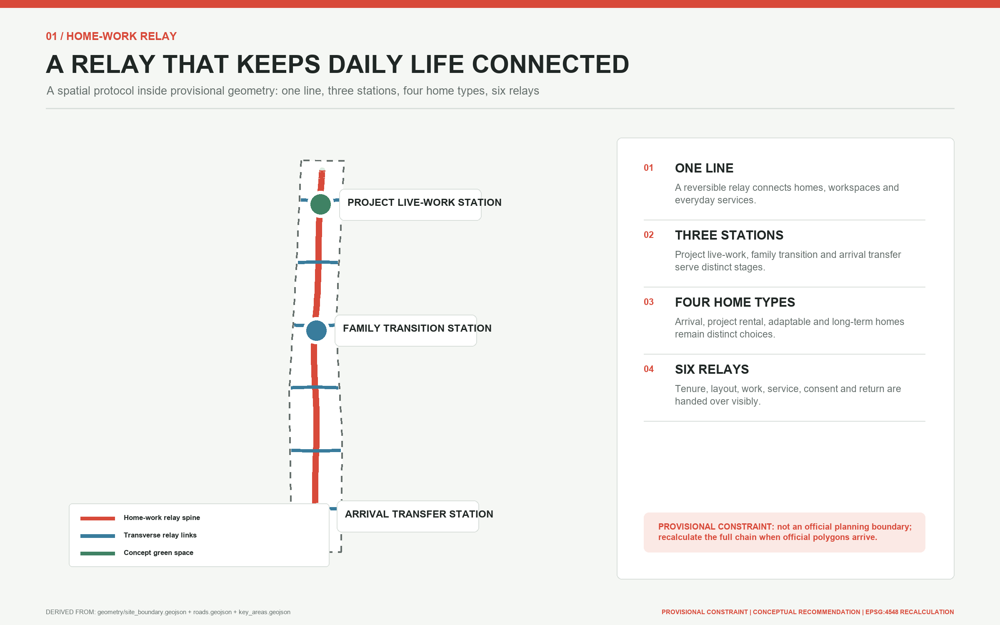

Evidence conditions and development path: the proposal uses the repository's provisional geometry for `SITE-001` and the three `PROV-KEY` features as a shared base for drawings, spatial logic and metric recalculation. All design layers are marked `design_proposal`. When official boundaries, existing buildings, ownership, heritage, roads, transport, utilities and operating evidence become available, the whole package can be replaced and recalculated in one pass [source:BOUNDARY-SOURCE] [source:KEY-AREA-SOURCE] [data:geometry/site_boundary.geojson#SITE-001] [depth:existing_conditions_diagnosis].

Known facts, design layers and pending evidence are registered in the source, assumptions and metrics files, forming a traceable list from site reading to professional development [source:SOURCE-REGISTRY] [source:PROCESSED-FACT-PACK].

### Architectural Principles and Spatial Actions

1. **Adaptive reuse.** Treat existing structure, railway-heritage edges and durable urban fabric as the long-life frame; renew ground floors, halls, courts and porches so new services enter everyday routes.
2. **Long-life structure, short-life fit-out.** Structure, envelope, service cores and fire-safety systems carry long-term stability. Partitions, furniture, desks and care components remain demountable, replaceable and recoverable so arrival, project and family living can change without rebuilding the frame.
3. **Incremental renewal.** Start with signs, shade, seating, staffed desks and small public spaces; move to reversible fit-out and calibrated equipment; consider permanent building work only after existing-condition and ownership review.
4. **Mixed use with public ground floors.** Place research, living, care and service near one another, using shared entrances, visible staffing and separated lobbies. Courts, buffers and independent back-of-house edges hold noise, laboratory safety and night operations apart.
5. **Public-private gradient and thresholds.** Use the sequence street, shared hall, semi-public court, resident threshold and interior. Staff, equipment and data stop at the public service porch until a resident actively opens the next threshold.
6. **Universal and care-friendly design.** Combine continuous accessible routes, sit-able edges, shade, lighting, tactile maps, paper options and staffed windows with digital services; keep care visible in the public realm.
7. **Blue-green climate infrastructure.** Join the heritage park, waterways, courts, rain gardens and shaded walking into a stayable door-to-desk framework, with maintenance access and seasonal drainage visible in the layout.
8. **Maintainability and low-tech resilience.** Make equipment inspectable, services operable offline and failures switchable to mechanical or staffed routes. Separate maintenance, emergency and exit movement from daily public circulation, with a fixed place for ownership and recovery evidence.

## Three-Level Scope Framework

The coordinated research area of about 43.6 square kilometres frames AI industry, talent, urban life and regional cooperation. The overall design area of about 11.4 square kilometres frames renewal, mobility, blue-green systems and public services around the Jing-Zhang Railway Heritage Park. The key-area scope contains Zhongzhiyuan, the AI Origin Community and Dazhongsi, with an announced combined area of about 368.4 hectares. These figures come from the official task, but the polygons used to draw this package remain provisional constraints and cannot prove a precise redline [source:SITE-PACKAGE] [depth:three_level_scope_framework] [data:geometry/key_areas.geojson#PROV-KEY-001].

At the coordinated scale, the three areas assign full-stack innovation and governance to Zhongzhiyuan, a world-class innovation ecosystem to the AI Origin Community, and AI-native business to Dazhongsi. The two wings add Zhongguancun technology services for capital, intellectual property and global resources, and the Xiaoyue River scenario wing for public-life testing. The five functions are not five mutually exclusive land parcels. They are a shared circuit of full-stack AI innovation, a world-class ecosystem, AI+ scenario enablement, an intelligent and lively city, and a global voice in AI governance [source:AGENT-TASKBOOK] [standard:PROJECT-AGENT-OPEN-CALL-TASKBOOK].

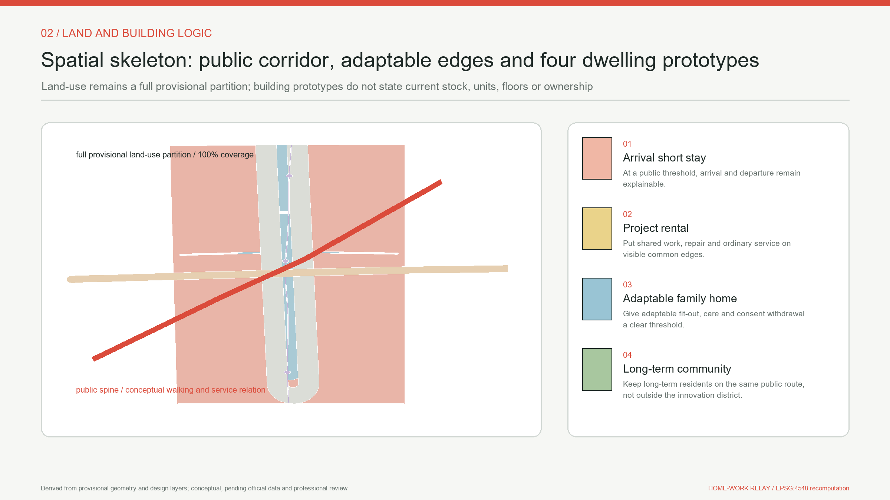

The spatial concept is "one line, three stations, four housing states and six relays." One line is the Home-Work Relay public spine along the Jing-Zhang corridor. Three stations are the Zhongzhiyuan Project Live-Work Station, AI Origin Family Transition Station and Dazhongsi Arrival Transfer Station. Four housing states are arrival stay, project rental, family or accessible convertible living, and long-term community living. Six relays address tenure, layout, workplace, services, consent inside the home, and departure or return. A "station" here is a service and spatial prototype, not a claim for a new railway station or a renamed existing station [depth:overall_spatial_structure] [data:geometry/public_space.geojson#PUBLIC-001].

The same question chain joins the three levels. The coordinated study asks who needs to stay and why people are pushed to leave. The overall design turns housing, research, care, walking and public service into short links. The key areas test that mechanism under three different urban conditions. Every level keeps four interfaces visible: source, space, metric and human review. When official polygons arrive, the package can be replaced and recalculated as a whole without abandoning its core proposition.

## Coordinated Research Area: Industry and Future City Research

The Home-Work Relay shifts talent policy from one-time attraction to long-term convertibility. An AI researcher may move among a university, a start-up and a larger company. A maintenance or service worker may change jobs or shifts. A household may experience partnership, childcare, eldercare, disability or working from home. Urban competitiveness is not only a count of jobs; it also depends on whether housing, work and services offer a low-friction next step when life changes. The proposal therefore links knowledge creation, open-source collaboration, enterprise translation, public testing and community retention, treating housing stability as innovation infrastructure [source:HD-1X1-2026] [source:HD-AI-ORIGIN-2026].

The six international cases offer complementary lessons. Eddington shows how a university-led district can deliver housing, daily amenities and walkability together. Station F and its residential support show that a start-up community extends beyond desks. Singapore's one-north mixes research, business, housing and public space at district scale. Kendall Square shows why a university innovation district needs public-facing community interfaces. Toronto's MaRS demonstrates an intermediary platform linking research, health, capital and firms. Barcelona 22@ shows that converting an industrial district must address innovation, communities, public space and existing fabric together. All six are background comparisons and provide no local capacity or control values for Jing-Zhang [source:CASE-EDDINGTON] [source:CASE-STATION-F] [source:CASE-ONE-NORTH].

The proposal does not copy their built forms. It translates them into six local principles: discuss housing and innovation space at the same time; let a short stay lead to a longer option; give workers and surrounding residents a shared public-service entrance; make research tests reversible and easy to stop; turn heritage into an everyday route rather than an isolated exhibit; and use operational data for aggregate improvement rather than personal eligibility scores. Kendall Square, MaRS and Barcelona 22@ support thinking about platforms, public interfaces and renewal governance, while any local application still requires Beijing law and professional review [source:CASE-KENDALL-MIT] [source:CASE-MARS] [source:CASE-BARCELONA-22].

The future urban form is therefore not a fully automated community. It is a mixed network able to absorb change. Opening hours, convertible partitions, nearby care, staffed night-time help, and legible walking and rail connections jointly determine whether a person can travel from door to desk, from project to family life, and from departure to return. AI explains options, coordinates appointments and exposes conflicts; people remain responsible for eligibility, rent, allocation, medicine, safety and planning.

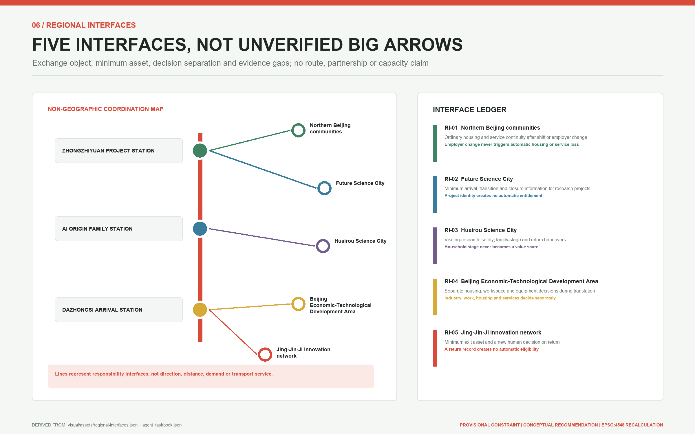

Regional coordination is defined through five auditable interfaces, not a large-arrow diagram without evidence for demand or responsibility. The northern communities interface addresses continuity for night and service workers after employer change. Future Science City addresses cross-institution project stages. Huairou Science City addresses visiting research, safety information and household change. Beijing E-Town addresses separation among housing, workspace and equipment decisions during research-to-manufacturing transition. The Jing-Jin-Ji interface addresses departure, a minimum exit asset and a new human decision on return. Each interface carries only a versioned public directory, a person-chosen contact route, necessary safety status and a human receipt; it excludes personal-value scores and unconsented household or employment records [metric:regional_interface_count] [source:AGENT-TASKBOOK].

No counterpart organisation, route, capacity, partnership, commuting flow or funding commitment is claimed. The five items are interface requirements for future professional work. A conceptual interface becomes a pilot only after real counterpart roles, applicable rules, data agreements, receiving responsibility and complaint routes are confirmed. Regional impact therefore remains untested rather than being inferred from a count of city names.

Railway culture supplies an operating grammar. "Coupling" assembles housing, desks and services into selectable combinations. "Switching" replaces one element as a life stage changes. "Through-running" keeps identity, service records and community relationships continuous between nodes. The metaphor does not reduce people to rolling stock. It asks the urban system to reconnect around human choice. Service flows, signs and the annual Home-Work Relay Week make the narrative operational rather than leaving it in the name and logo.

## Overall Design Area: Urban Renewal and Regulatory-Plan-Level Urban Design

The overall design uses one curving public spine, six transverse relay links and three station prototypes. The spine joins the Jing-Zhang Railway Heritage Park public realm to the three key areas. The six links project tenure, layout, workplace, service, private-home consent, and departure or return handovers into spatial interfaces. They can also carry practical campus-park access, rail interchange, care, night-time and maintenance routes, but those uses are not a second naming system for the six relays. Their geometry is a conceptual walking and service connection, not a road redline. Station footprints are discussion prototypes, not approved development parcels or engineering locations [data:geometry/roads.geojson#ROAD-001] [depth:overall_spatial_structure].

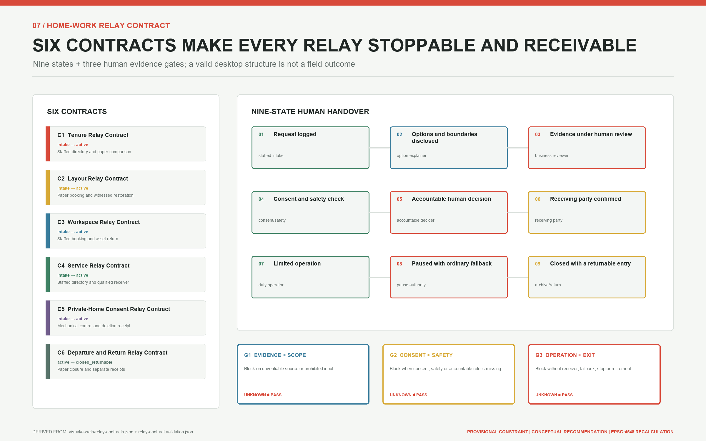

Every relay follows the same nine states: `request logged -> options and boundaries disclosed -> human evidence review -> consent and safety check -> accountable human decision -> receiving party confirmed -> limited operation`. Missing evidence, responsibility, consent, safety, network or maintenance moves it to `paused with ordinary fallback`; completed closure moves to `closed with a returnable entry`. Closure is not disappearance. Releasing and receiving roles confirm separately, only the person's consented minimum exit asset remains, and any return begins as a new request rather than an automatic housing, workspace or service entitlement [metric:relay_state_count] [metric:relay_contract_count].

Three gates control progression. G1 tests sources, minimum fields, prohibited inputs and the ordinary route. G2 tests active consent, professional safety and whether every responsible role has accepted the handover. G3 tests staffing, offline service, rollback, stop authority, review and retirement resources. A missing owner or evidence blocks the transition; unknown is not a pass. AI may explain public options, expose missing material and prepare a reviewable comparison. It may not decide eligibility, rent, allocation, access, safety, medicine or law [metric:relay_gate_count] [standard:PROJECT-AGENT-OPEN-CALL-TASKBOOK].

Renewal follows "interfaces before buildings, reversible before permanent." First, public space and legally available indoor edges receive staffed service points, option explanations and bookings. Second, pilots test demountable partitions, shared-facility schedules and accessible conversion. Only after surveys, ownership agreements and regulatory approval should teams consider structural alterations or new construction. The proposal identifies no building for demolition and does not replace structural, fire, safety and heritage assessments with a conceptual drawing [depth:retain_renovate_demolish] [depth:development_intensity_controls].

The land-use layer uses valid codes to relate AI research, commercial and industry services, community facilities, parks and open space. All polygons are cut from one provisional boundary so that coverage, gaps and overlaps can be tested. They express functional coordination and do not change current land status. FAR, height, total floor area and parcel-level intensity all remain pending official data [data:geometry/land_use.geojson#LU-001] [depth:land_use_layout] [standard:MNR-LAND-USE-CLASSIFICATION-GUIDE].

Built form uses small courts, legible ground floors, articulated massing and reversible interiors so that research and housing can be near each other without mutual intrusion. Interfaces near heritage and the park favour low disturbance and open sightlines; interfaces near rail and industry favour all-hours legibility and clear transfers. No numerical height, setback, skyline or roof control is asserted under the present evidence conditions [depth:height_massing_character] [source:QINGHUAYUAN-HERITAGE-2026].

This is a reproducible conceptual design for a planning-scale question set, not a statutory regulatory plan. Once official boundaries, parcels, ownership, building surveys, utilities and traffic data become available, the same data model should be used for overlay, capacity and implementation checks. Until then, any area or ratio demonstrates only the internal consistency of the design layers [standard:MOHURD-CONTROL-DETAILED-PLANNING] [depth:metrics_recalculation].

## Detailed Design of Key Areas

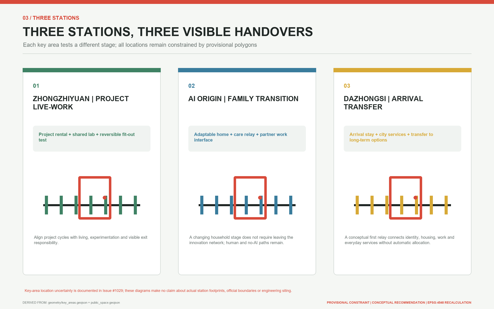

**Zhongzhiyuan Project Live-Work Station.** The northern station takes the project cycle as its unit of change. It proposes a walkable sequence of arrival stays, project rentals, shared labs, public demonstrations and green meeting space associated with the Qing River setting. A living-lab court and reversible interior test bay support changing team size and transitions from visiting research to entrepreneurship, while making the line between research safety and residential quiet visible. Connections across the Fifth Ring Road, flood and ecology requirements, land status and building scale all await specialist evidence; the present drawing shows only a conceptual position within a rough temporary extent [data:geometry/key_areas.geojson#PROV-KEY-001] [source:OFFICIAL-ANNOUNCEMENT].

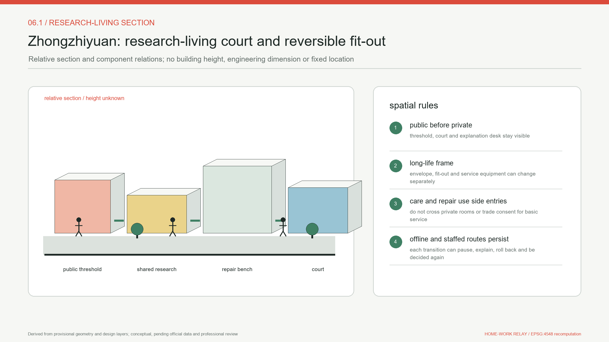

Its relative plan combines a green ordinary entrance, staffed option desk, shared collaboration court, independently controlled lab edge, quiet residential edge and reversible mock-up. The section reads `quiet home - shared threshold - court - controlled work - service access` and declares no floor or height. Ordinary, accessible, laboratory, maintenance and emergency movement are recorded separately, while their exact dimensions and entrances await field review. The service blueprint connects arrival, separate human decisions, limited use, and asset and permission return. It can pause at every stage and fall back to an ordinary workspace or the last lawful housing state.

**AI Origin Family Transition Station.** The middle station takes the household stage as its unit of change. It puts near-campus translation, convertible homes, childcare and care, accessibility support, shared meeting rooms and walking links into an everyday short chain. A convertible-home prototype can discuss reservable, non-structural changes among bedrooms, work rooms and care spaces, but no real alteration proceeds without resident, owner, fire and structural consent. Connections to Wudaokou and Qinghuadongluxikou remain rail and walking questions for later study [data:geometry/key_areas.geojson#PROV-KEY-002] [source:HD-AI-ORIGIN-2026].

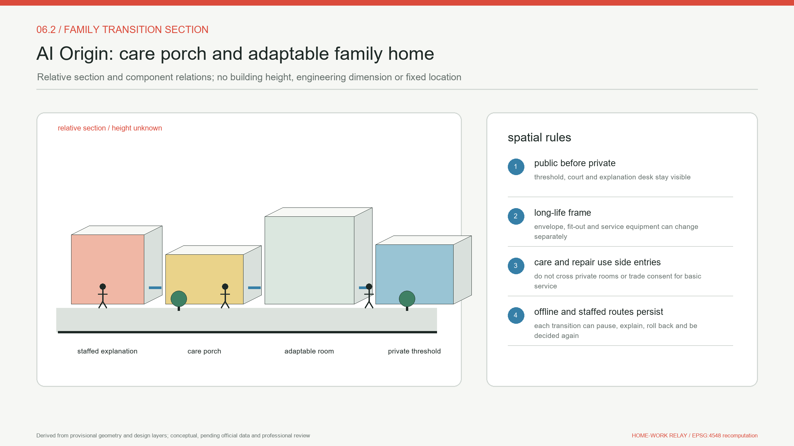

Its relative plan combines a no-app entrance, care porch, shared court, adaptable-home mock-up, partner-work interface and private threshold. The public service section stops at that threshold: a device, worker or data flow enters a home only after active resident choice. The service blueprint records needs, owner and professional consent, reversible change, withdrawal and restoration separately. It does not infer household type from behaviour or reduce service for someone who needs care, translation or reasonable accommodation.

**Dazhongsi Arrival Transfer Station.** The southern station addresses first arrival and intercity transition. It combines arrival advice, short-stay choices, trial desks, public-service navigation and four-quadrant walking connections into a legible threshold. A public ground-floor interface can host AI-native consumption and business demonstrations without turning daily services into a private corporate lobby. Links around Dazhongsi Station, bicycle parking, crossings and potential parcels require traffic surveys, ownership evidence and engineering review [data:geometry/key_areas.geojson#PROV-KEY-003] [depth:three_key_area_detailed_design].

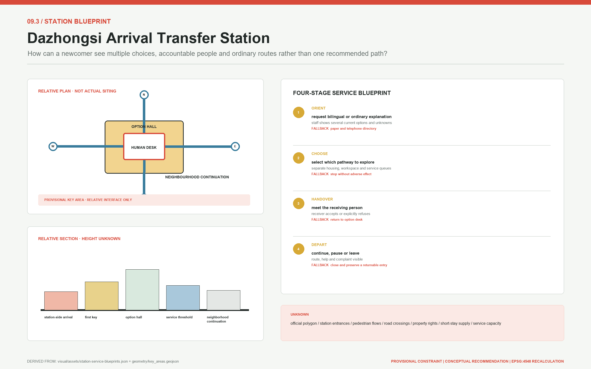

Its relative plan makes a four-way arrival, The First Key, staffed bilingual desk, ordinary and accessible waiting, separate housing/work/service thresholds and neighbourhood continuation legible. The section keeps commercial display, housing explanation and public-service eligibility visibly distinct. A receiving person must explicitly accept or refuse; refusal also points to an ordinary next step. Without verified station entrances, crossings, footfall, ownership and short-stay supply, the figure communicates interfaces only and claims no buildable location.

The three stations share one service protocol while retaining distinct urban characters: a garden-like research and living environment at Zhongzhiyuan, low-disturbance near-campus life at the AI Origin Community, and a highly accessible urban gateway at Dazhongsi. Each offers staffed service, a non-AI route, revocable consent, offline notice and failure-mode operation. Each also includes ordinary residents, service workers, older people and disabled people instead of reducing "talent" to a narrow group of highly paid specialists.

The three structured station blueprints register plan components, relative sections, ordinary/accessible/service movement, frontstage actions, backstage responsibility, evidence, fallback and unknowns [metric:station_service_blueprint_count]. This increases readiness for professional development, not geometric authority. Every station must still be relocated and retested when official polygons, surveys, ownership, heritage, transport, fire, utilities and operating evidence arrive.

All station names and functions are design proposals, not official institutional titles. The three polygons are not precise parcels; their rectangular or outer edges must never be read as ownership, road or development-control boundaries. Professional review of building scale, movement capacity, retain-renovate-demolish choices or implementation should occur only after official polygons and field surveys are available [source:KEY-AREA-SOURCE].

## AI Innovation Ecosystem, Personas, and AI+ Scenarios

Six personas test whether the relay is genuinely continuous. A newly arrived researcher needs to understand housing, desks and public-service options. A start-up team needs to grow or shrink without moving everyone out. A young household needs to shift among childcare, a partner's job move and home working. An international developer needs bilingual, explainable services with a staffed route. A service or maintenance worker needs stable, affordable housing compatible with shifts. An older or disabled user needs accessible routes, offline handling and continuous care. These are design personas, not observed population statistics [source:AGENT-TASKBOOK] [depth:existing_conditions_diagnosis].

| Design persona | Critical transition | Primary spatial interface | Operating and human responsibility |
| --- | --- | --- | --- |
| Newly arrived researcher | Comparing a short stay, desk and daily services after arrival | Dazhongsi Arrival Transfer Station, The First Key and a staffed desk | An arrival-service team verifies public information and explains choices without deciding for the user |
| Start-up team | Project growth, contraction, testing-stage change or team closure | Zhongzhiyuan Project Live-Work Station, project rental and shared lab | The lab operator reviews safety and access; a separate housing operator negotiates tenure with people |
| Young household | Childcare, partner job change, care or home-working transition | AI Origin Family Transition Station, adaptable home and care relay | A community team coordinates services; residents, owners and professionals approve any physical change |
| International developer | Bilingual onboarding, rule interpretation and cross-organisation transfer | Staffed bilingual routes at all three stations and the public spine | Trained staff own explanations and referrals; AI produces reviewable translation, not legal or eligibility judgments |
| Service or maintenance worker | Shift or employer change, night arrival and maintenance handover | Long-term community interface, night walking link and community pavilion | Labour, housing and facilities staff remain distinct; changing employer cannot automatically remove housing or basic service |
| Older or disabled user | Accessible travel, offline handling and changing care needs | Accessible route, service pavilion, staffed window and care node | Qualified staff handle cases and field audits verify routes; digital accessibility never substitutes for actual usability |

Twelve scenario cards turn the broad proposition into observable service journeys:

| Card | Primary user and action | Station and spatial interface | AI assistance, human boundary and operating lead |
| --- | --- | --- | --- |
| 01 Arrival option explanation | A researcher compares a short stay, desk and service entrance | Dazhongsi station, The First Key and a staffed desk | AI explains public options; the arrival team confirms currency and never prescribes one "best" choice |
| 02 Human verification of listings | An applicant checks a publishable housing source | Housing desks and no-AI windows at all three stations | AI organises fields; housing staff verify truth, rights and suitability |
| 03 Tenure transition | A team requests continuity as a project expands or contracts | Tenure relay link, project rental and station desks | AI flags dates; housing staff and affected people negotiate term, price and eligibility |
| 04 Adaptable-home booking | A household requests a non-structural conversion | AI Origin station, adaptable home and layout relay | AI schedules checks; resident, owner, fire and structural consent precede any work |
| 05 Partner or career interface | A household member searches nearby resources after changing workplace | AI Origin station, workplace relay and staffed employment referral | AI navigates public services; staff refer cases without reading employment secrets or scoring a family |
| 06 Shared-lab booking | A start-up requests a Zhongzhiyuan test period | Zhongzhiyuan station, shared lab and workplace relay | AI checks published rules; laboratory operators review access and safety responsibility |
| 07 Door-to-desk walking link | A user travels from home through the park to a desk | Public spine, six transverse links and three stations | AI flags conditions; public-space and transport stewards publish only after field and professional review |
| 08 Care relay | A household, older person or disabled user reaches support | AI Origin station, community pavilion and service relay | AI navigates only; qualified care or health staff make judgments and handle cases |
| 09 Private-home consent withdrawal | A resident reviews and revokes smart-home permission | Private threshold, consent relay and offline window | The home is off-limits by default; residents decide and the data steward executes without removing basic service |
| 10 Maintenance and offline fallback | A failure moves to a staffed ticket and mechanical access | Facilities rooms, service pavilion and maintenance arrival points | AI records a minimum ticket; facilities operators own emergency repair and safety |
| 11 Departure and return handover | A departing user keeps an optional community connection | Departure-return relay, Return Ticket Archive and three stations | A community custodian retains only minimum consented data; return creates no automatic housing right |
| 12 Aggregate home-work ledger | Operators review anonymous demand and bottlenecks | Home-Work Mileage Board and independent audit interface | Aggregate trends only; a data steward and public audit prohibit person, household, occupation or ability-to-pay scores |

Each card also passes through an operating supplement so that a scenario cannot exist without a contract. "Minimum data" means fields that cannot be reduced further for the current handover; it is not a licence to collect personal detail. Success means that accountable evidence closes, not that a social outcome has already been achieved.

| Card | Trigger and minimum data | Responsible / accountable roles | Success evidence | Stop and exit asset |
| --- | --- | --- | --- | --- |
| S01 | Person requests help; request ID, language, option category | Arrival explanation / directory owner | Receipt lists multiple options and unknowns | Stop on stale directory; paper option sheet |
| S02 | Person requests verification; listing ID and source version | Verifier / housing decision role | Rights, cost and currency checked separately | Stop if source cannot be proven; accept/refuse receipt |
| S03 | Person requests term change; current and preferred duration | Case coordinator / contract role | Release and receipt confirmed separately | Stop on cost or eligibility conflict; last lawful state |
| S04 | Resident requests change; function and allowed access | Fit-out coordinator / owner and safety roles | Baseline, consent and restoration jointly signed | Any withdrawal stops; restoration list |
| S05 | Person changes work; service category and chosen contact | Referral role / receiving service role | Receipt excludes housing and household data | Stop if no receiver; ordinary directory |
| S06 | Person requests a slot; space type and training state | Space coordinator / laboratory access role | Safety, equipment and return records | Stop on missing training/equipment state; permission ledger |
| S07 | Person travels; origin/destination type and accommodation | Route steward / transport-public-realm role | Field walk and closure notice | Stop at safety or access break; ordinary detour map |
| S08 | Person seeks help; service type and communication need | Navigator / qualified service role | Human receipt or explicit refusal | Stop if an emergency is misrouted; staffed help receipt |
| S09 | Resident withdraws; device, purpose and consent state | Consent clerk / data responsibility role | Permission off, deletion and ordinary function | Any unauthorised flow stops; deletion receipt |
| S10 | Fault occurs; asset ID and observed failure | Maintenance duty / facilities safety role | Human takeover and restoration record | Stop if no ordinary entrance; mechanical mode and ticket |
| S11 | Person departs; closure scope and contact choice | Closure coordinator / archive role | Assets, permission, delete/retain receipts | Stop if no receiver; minimum exit asset |
| S12 | Operator reviews; aggregate definition, version, denominator | Data maintainer / independent audit role | Failures and withdrawals remain in denominator | Stop on re-identification or purpose drift; delete/revise record |

Four registered repository scenarios provide public interfaces for these cards. The Enterprise Service Copilot navigates policy and resources. Health Service Navigation points only to qualified services. AI Traffic and Walkability Assessment helps identify breaks. AI Cultural Guide explains Jing-Zhang history. Every interface displays sources, update dates, limits and a staffed route, and none offers legal, medical, planning or safety conclusions [source:AGENT-TASKBOOK] [data:geometry/public_space.geojson#PUBLIC-001].

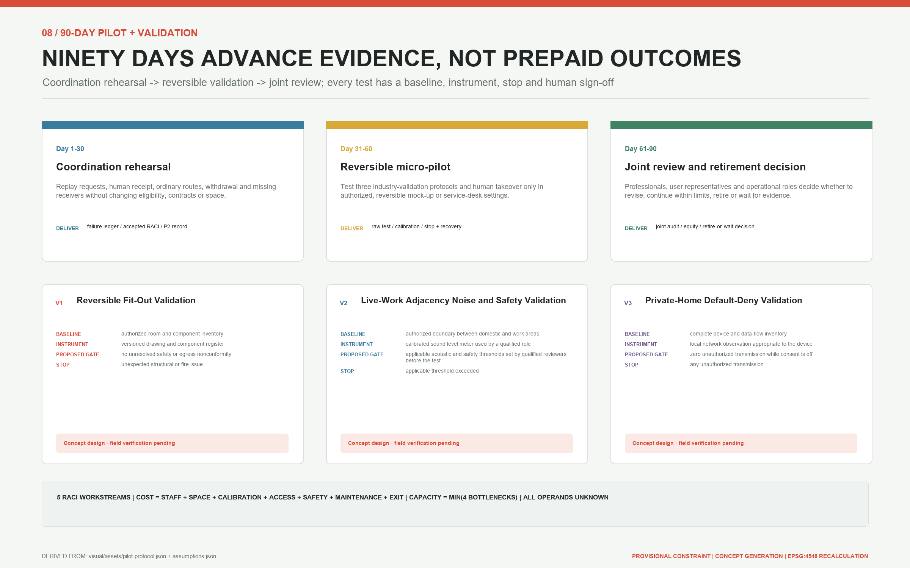

Three industry tests keep AI and real space within reversible trials while specifying what is measured, who signs and when a test stops [metric:validation_protocol_count]. The reversible-fit-out protocol begins with an authorised room and component inventory, defects, and human egress/fire/structure/accessibility review before a dry run, witnessed changeover and witnessed restoration. An unresolved safety issue, damage, withdrawal or loss of a restoration path stops it. The live-work adjacency protocol requires a qualified role to set applicable thresholds and collect a calibrated time-specific baseline before a closed low-intensity test; an exceedance, boundary crossing, safety/privacy incident or complaint without a receiver stops it. The private-home default-deny protocol uses a device and data-flow inventory, local network observation, physical state and deletion records. Its acceptance rule is zero unauthorised transmission while consent is off and continued ordinary function after withdrawal. Zero is an acceptance condition, not an observed result.

Samples, sites, applicable thresholds and results for all three protocols remain `not_authorized_not_run`. A future record must preserve instrument calibration, raw denominators, failures, withdrawals, dissent and human signatures. One demonstration, attendance count or marketing video cannot substitute for results. Desktop structural checks prove that the contracts parse; they do not prove spatial, safety, equity or technical performance [metric:relay_tabletop_check_count] [depth:risk_missing_data].

The governance boundary is explicit. AI does not decide housing eligibility, rent, allocation, desk access or public-service rights, and it creates no personal or household scores. Every service includes human review, a non-AI path, consent withdrawal and an appeal record. Aggregate data may improve interfaces between supply and demand, but it cannot be sold, used for profiling or turned into covert exclusion. In this proposal, AI-supported design means better explainable cooperation, not automated rights.

## Land Use, Building Scale, and Retain-Renovate-Demolish Strategy

The conceptual plan contains seven valid code layers, while the "four housing states" describe living arrangements rather than land-use classes. Code 0802 expresses research and live-work collaboration, 0701 adaptable residential use, and 0702 community relay services [data:geometry/land_use.geojson#LU-001] [data:geometry/land_use.geojson#LU-002] [data:geometry/land_use.geojson#LU-003].

Code 05 expresses arrival and project-support commerce, 1401 the Home-Work Relay green corridor, and 1403 the mainline and station plazas [data:geometry/land_use.geojson#LU-004] [data:geometry/land_use.geojson#LU-005] [data:geometry/land_use.geojson#LU-006]. Code 1207 expresses transverse relay connections. All seven polygons are cut from the same temporary boundary to create a complete, recalculable discussion base and do not determine existing land class, ownership or permission [data:geometry/land_use.geojson#LU-007] [standard:MNR-LAND-USE-CLASSIFICATION-GUIDE] [depth:land_use_layout].

Buildings express only four footprint prototypes. The convertible arrival stay and living-lab court address arrival and project stages [data:geometry/buildings.geojson#BLDG-001] [data:geometry/buildings.geojson#BLDG-002]. The family or accessible convertible home addresses the household stage, while the community service pavilion provides advice, care and handover interfaces for existing or future long-term communities [data:geometry/buildings.geojson#BLDG-003] [data:geometry/buildings.geojson#BLDG-004]. The four housing states and four footprint prototypes are not a one-to-one mapping: long-term community living depends on verified existing stock or future lawful supply, and this package invents no new residential footprint for it. The prototypes favour public-facing ground floors, clear public-private thresholds, daylight, demountable fit-out and maintainable services, but assert no storey count, height, ownership, unit count, total floor area or actual supply. The footprint metric cannot be converted into housing capacity or development rights [metric:building_footprint_area_sqm] [metric:building_prototype_count].

Retain-renovate-demolish is a procedure to be applied when evidence arrives, not a conclusion drawn in advance. Teams first confirm heritage buildings and control areas, then survey structure, fire safety, current use, age, ownership and occupancy. Only then can they recommend conservation repair, retained improvement, adaptive reuse, demolition and rebuilding, or construction on an available site. The current evidence lacks this inventory, so the proposal names no building for demolition and claims no building can be converted into housing [depth:retain_renovate_demolish] [source:QINGHUAYUAN-HERITAGE-2026].

Development intensity remains open as well. FAR, building density, height, setback, daylight, fire separation, parking and total capacity are pending official data. Articulated massing in the drawings explains public edges and the research-residential relationship only. When official controls arrive, each parcel must be checked individually rather than substituting a district average for statutory control [depth:development_intensity_controls] [depth:height_massing_character].

This cautious expression does not weaken the design. It separates service protocols, furniture, fit-out and public-space activities that can be tested quickly from land and building actions that require approval. Short, low-disturbance trials can prove a need before permanent investment, reducing the risks of vacancy, exclusion and irreversible construction.

## Transport, Rail, Municipal Infrastructure, and Public Services

Mobility is tested as door-to-desk continuity. The Home-Work Relay spine gives north-south walking and cycling a legible identity. Six transverse links bring neighbourhoods, business parks, campus edges, public services and rail stations to the spine. The three stations address northern external access, middle near-campus walking and southern rail interchange. The lines are conceptual centre lines that indicate connections for field study, not road designs, approved crossings or proof of accessibility compliance [data:geometry/roads.geojson#ROAD-001] [depth:traffic_rail_slow_parking].

Walking priority does not ignore service movement. Each station separates pedestrian, bicycle, accessible drop-off, maintenance and emergency approaches, with bicycle parking and short loading placed outside the main clear route. Dazhongsi's four quadrants, interchange at Wudaokou and Qinghuadongluxikou, and a Zhongzhiyuan connection across the Fifth Ring Road all require passenger, redline, signal, bridge, tunnel and safety studies. No engineering feasibility conclusion is made here.

Municipal and digital infrastructure follows a node model of shared plant, edge processing, minimum collection and human takeover. A service pavilion may combine public information, charging, emergency contact and maintenance tickets, but power capacity, redundancy, drainage, fire protection, flood risk and utility alignments remain unknown. Any edge-compute installation must first resolve energy, cooling, cybersecurity and operator responsibility; the constraint line in the drawing is only an annotation extent for missing official controls [depth:municipal_new_infrastructure] [data:geometry/constraints.geojson#CONSTRAINT-001].

Public services retain ordinary and inclusive entrances. Housing advice, enterprise support, health navigation, care referral and cultural interpretation all have online and offline routes. Older people, disabled users, international visitors and night workers do not lose basic service because they cannot or do not wish to use an intelligent device. Actual capacity, opening hours, staffing and walking times remain unknown until operators and fieldwork establish them.

The railway idea of "switching" finally becomes visible transfer cost. Signs should tell a user who maintains the next segment, when it opens and where to seek help if it fails. A digital system should show accessibility, lighting, weather and staffed assistance instead of offering only a shortest path. Staff maintain the source information before AI is allowed to explain it or translate it.

## Blue-Green Network, Public Space, and Urban Character

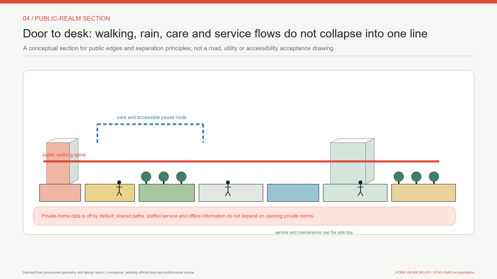

The blue-green network treats the Jing-Zhang Railway Heritage Park as a continuous public backbone, with the Qing River, Xiaoyue River and local green spaces as ecological links requiring specialist verification. Green and public-space ratios in the design layers are generated from conceptual polygons inside a provisional boundary. They can test internal structure but cannot replace green lines, blue lines, flood rules, ecology studies or implemented park boundaries [data:geometry/green_space.geojson#GREEN-001] [metric:green_ratio] [depth:blue_green_public_space].

Public space combines movement and staying. Continuous walking and cycling surfaces support commuting, while sheltered thresholds, shared courts, care waiting points, staffed night points and quiet work corners support everyday occupation. Public interfaces retain wheelchair turning space, continuous shade, sittable edges and clear lighting. The calculated public-space ratio records only the design coverage; actual public rights, opening time and maintenance responsibility remain to be confirmed [data:geometry/public_space.geojson#PUBLIC-001] [metric:public_space_ratio].

Three landmarks turn railway culture into usable civic facilities. "The First Key" marks the arrival entrance with a tactile map and staffed help for a first home-work choice. "The Home-Work Mileage Board" displays anonymous aggregate reductions in distance between housing, work and services, never personal rankings. "The Return Ticket Archive" keeps consented stories of departure and return at a historic node, with paper and screen-free access. All are conceptual landmarks whose siting and form require heritage, landscape, accessibility and public review [source:QINGHUAYUAN-HISTORY] [source:JZ-PARK-PHASE1-2023] [source:QINGHUAYUAN-HERITAGE-2026]. Layer and metric checks verify the total of three so that a branding phrase cannot substitute for spatial work [metric:landmark_count].

The character system draws on the railway's linearity, sleeper rhythm and station-door scale without constructing false historic scenery. White, charcoal, signal red, leaf green and cyan form the palette. The logo turns sleepers into a doorway and key, conveying that the route continues while a home has a door. Buildings and fixtures are durable, repairable and legible by day and night. They use no external trademark and do not reduce Qinghuayuan Station or Jing-Zhang history to commercial decoration.

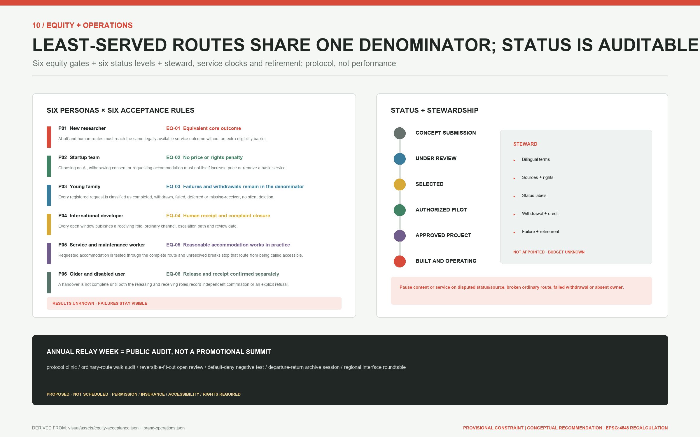

Public-interest acceptance does not rely on one average completion rate. It stratifies the six personas by AI/no-AI, day/night, language, reasonable accommodation, station, outcome and stop trigger. Six proposed rules require equivalent core outcomes; no price or rights penalty for choosing no AI, withdrawing consent or requesting accommodation; failures, withdrawals, deferrals and missing receivers retained in the denominator; a human receiver for complaints at every open window; complete-route evidence before calling a route accessible; and separate release and receipt confirmations [metric:equity_acceptance_rule_count]. These rules have no field values yet, so `ordinary_route_outcome_parity` and related metrics remain unknown.

Long-term identity does not emerge automatically from a logo. The proposal defines an independent brand, provenance and status steward to maintain bilingual terms, rights, attribution, withdrawal, failure and retirement records. Every communication artifact must choose the single evidence-supported label among concept, under review, selected, authorised validation, approved implementation, and built and operating. No steward, budget or response target has been appointed, so service clocks provide formulas only. A disputed source/status or broken ordinary route without an accountable receiver pauses the related content or scenario [source:AGENT-TASKBOOK] [depth:phasing_implementation].

An annual Home-Work Relay Week turns space from one-off exhibition into continuing collaboration. It opens reversible-interior prototypes, accessibility walks, service-directory checks, departure and return stories, and joint tests by enterprises and residents. Operators review event scale, permission, safety and copyright each year. Public communication must distinguish concept, review, selection, approval, construction and actual completion.

Long-term operation uses a year-round cadence rather than treating one annual event as the whole system:

| Operating component | Cadence and public interface | Responsibility and public record | Gate to start or continue |
| --- | --- | --- | --- |
| Home-Work Relay Week | Annual prototypes, accessibility walks, stories and joint tests | A joint operator publishes permits, safety, copyright, feedback and corrective actions | Venue permission, insurance, safety and accessibility receive human approval |
| Developer community | Monthly maintainer clinic and quarterly maintenance note, code and documentation review | Community maintainers record releases, attribution, licences, vulnerabilities and unresolved questions through maintenance records | No personal data is published; security and conflicts have named owners |
| Open scenario operation | Quarterly updates to the scenario catalogue, access rules, data notice and exit conditions | Each service operator publishes its version, staffed hours, human route, complaint and suspension record | A scenario without an owner, offline fallback or exit mechanism does not launch |
| Three landmarks | Continuous opening with quarterly accessibility, content and maintenance checks | Public-space, heritage, accessibility and community custodians jointly maintain paper and digital material | Heritage, public consent, data minimisation and repair responsibility remain satisfied |
| Public experience route | Seasonal bilingual walks from The First Key to the Return Ticket Archive | The route steward publishes closures, lighting, weather, accessibility and staffed-help information | A field audit passes; a conceptual centreline is never advertised as an approved road |
| International communication | Half-yearly bilingual cases, failure records, licence status and recalculation methods | The communication team preserves sources, contributor credit and concept/review/selection/approval/built status labels | No unverified performance, official endorsement or third-party visual asset is used |
| Attraction and conversion | Staffed referrals after public activities connect research, enterprise, housing and service options | Attraction and service staff record voluntary referrals without a personal-value score or automatic eligibility | Housing, employment and public-service decisions remain separate, appealable and easy to exit |

Actual operators, budgets, service capacity, attendance, attraction conversion and retention outcomes are all unknown. The table defines responsibilities and public records that must exist first; it is not a committed event programme, government arrangement or performance guarantee [source:AGENT-TASKBOOK] [depth:phasing_implementation].

## Renewal Projects, Implementation Policy, and Phasing

Eight work packages are ordered by reversibility and evidence dependency. JZ-01 establishes an official-data replacement process and existing-condition survey. JZ-02 pilots signs and small spaces on the relay spine and six cross-links. JZ-03 to JZ-05 create revocable prototypes for the three stations. JZ-06 tests the four living and service-space types. JZ-07 establishes human review, data withdrawal and offline fallback. JZ-08 operates the three landmarks and Home-Work Relay Week. This is a recommended sequence, not a capital approval or construction promise [depth:renewal_project_list] [data:geometry/phasing.geojson#PHASE-001].

Implementation has three phases controlled by a preliminary preparation gate. Preparation secures sources, official polygons, heritage and ownership baselines. Phase one tests arrival and service relays, phase two connects the family and home-work conversion network, and phase three validates research-residential adjacency and corridor-wide links [data:geometry/phasing.geojson#PHASE-001] [data:geometry/phasing.geojson#PHASE-002] [data:geometry/phasing.geojson#PHASE-003]. Every phase begins with low-disturbance signs, furniture, staffed desks and demountable fit-out. Permanent buildings or infrastructure need separate regulatory, engineering and operating review. Unresolved safety, privacy, fairness or maintenance responsibility prevents the next phase [depth:phasing_implementation] [source:AGENT-TASKBOOK].

Before those spatial phases, any real service passes through a separate 90-day validation process [metric:pilot_protocol_phase_count]. Days 1-30 are a coordination rehearsal: synthetic cases replay directories, human receipt, withdrawal, network failure and missing receivers without changing contracts, eligibility or space. Days 31-60 are a reversible micro-pilot: only after site and roles are authorised may a mock-up or desk test fit-out, adjacency and default-deny protocols. Days 61-90 are joint review and launch judgement: failures and dissent are published before a decision to revise, continue within limits, retire or await more evidence. The next phase does not open if responsibility, ordinary service, raw records or rollback are missing.

Five workstreams cover protocol and scope, reversible space and safety, data and consent, service and equity, and cost, capacity, procurement and exit. They define roles without inventing an organisation that has accepted them. The cost formula is `staff hours x approved rates + space + equipment/calibration + reasonable accommodation + insurance/permission/safety + spares + retirement/restoration + contingency`. Capacity is `min(staff minutes / observed median case time, authorised space slots, verified no-AI capacity, maintenance and emergency capacity)`. Every operand remains unknown, so lifecycle cost and daily capacity remain blank; no budget, lifecycle or accountable resource is claimed [metric:pilot_total_lifecycle_cost_cny] [metric:service_capacity_people_per_day].

Procurement specifies function, accessibility, interoperability, data export, offline takeover, spares and retirement rather than a vendor. Acceptance separates protocol compliance, safety, public-interest parity, lifecycle cost and field outcome. A successful demonstration cannot replace any of them. A product that works only with remote vendor support, or cannot restore ordinary service at exit, is not accepted.

Policy recommendations focus on conversion without loss of rights. Lease conversion needs public rules and human negotiation. Layout conversion requires resident, owner and professional safety consent. Changing a desk must not automatically terminate housing. Public services must not disappear when an employer changes. In-home data requires active consent and minimum retention. Departure and return preserve only voluntary community links and create no automatic eligibility. These are operating-protocol proposals requiring housing, labour, data, fire-safety and community-governance review.

The proposed responsibility chain is: public bodies set boundaries, professional teams review technical matters, communities deliberate daily rules, operators maintain continuity, and AI only assists. Every service line publishes its accountable person, service hours, complaint route, data list, exit method and review date. The annual week is both a civic event and a public audit: links that genuinely reduce disruption and services that create new barriers are documented and revised.

Area in the current phasing layer is only a reproducible extent of a conceptual proposal. It does not represent acquisition, land supply, investment or construction capacity. When the official boundary changes, phase polygons must be regenerated from the first step rather than applying old percentages mechanically to new geometry.

## Metrics, Area Recalculation, and Compliance Matrix

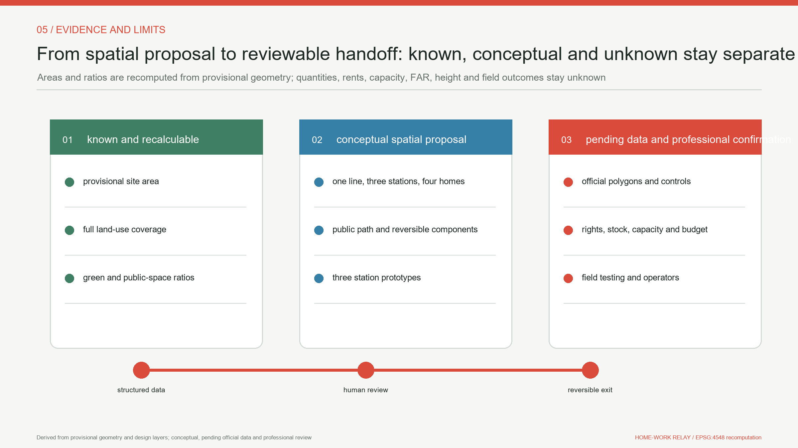

Metrics are divided into known calculations from the design layers and values pending official data. The first category contains provisional overall boundary area, design building footprint, green ratio, public-space ratio, road ratio and key-area count. Their purpose is to verify agreement among GeoJSON, figures and narrative, not to announce statutory planning indicators [metric:site_area_sqm] [metric:building_footprint_area_sqm] [metric:key_area_count].

Areas are recalculated in EPSG:4548 while GeoJSON is exchanged in EPSG:4326. Land-use polygons must completely cover the same boundary without gaps or overlaps. Building footprints should sit inside design land uses. Green, public-space, road and phase areas are summed from their respective layers. Green, public-space and road ratios use boundary area as the denominator. Rounding is for display only; checks use unrounded values [metric:green_ratio] [metric:public_space_ratio] [metric:road_ratio].

Structured layers also verify the quantities in the spatial concept. One public spine, six transverse relay links, three service stations and twelve scenario cards must agree with their features and scenario schedule rather than existing only as a slogan [metric:public_mainline_count] [metric:relay_link_count] [metric:station_count]. Card and building-prototype counts are locked separately so that translation, figures and prose cannot silently drop a journey or spatial type [metric:scenario_card_count] [metric:building_prototype_count] [depth:metrics_recalculation].

Protocol assets are counted through structured arrays: six relay contracts, nine states, three gates, twelve offline tabletop checks, three industry-validation protocols, a three-phase 90-day protocol, five regional interfaces, six equity-acceptance rules and three station service blueprints all come from their JSON records [metric:relay_contract_count] [metric:validation_protocol_count] [metric:regional_interface_count]. These counts show that the package contents exist and parse; they do not turn a desktop check into a field result.

Phase-one, phase-two and phase-three areas are calculated directly from their polygons to verify a complete phasing layer, not to describe acquisition, land supply or investment [metric:phase_1_area_sqm] [metric:phase_2_area_sqm] [metric:phase_3_area_sqm]. A separate structured metric verifies that there are three phases [metric:phase_count]. The following remain explicitly `unknown`: rents, existing housing stock, dwelling count, affordability, observed journey time, service capacity, pilot lifecycle cost, ordinary-route outcome parity, accountable handover closure, unauthorised private-home transmission, fit-out restoration acceptance, FAR, building height and retention. Surveys, platform logs or operating data require a stated sample, consent basis, time range, denominator and bias before they enter evaluation.

The compliance chain has three parts. The professional-standards matrix answers urban design, regulatory planning and land-use classification. The design-depth matrix connects diagnosis, structure, land use, intensity, character, retain-renovate-demolish, transport, utilities, blue-green systems, key areas, projects, phasing, recalculation and risk. The task matrix maps the announcement and agent.1 through agent.6. Prose carries only adjacent evidence, while structured files keep the complete index so machine identifiers do not overwhelm the design argument.

The calculation proves internal traceability of the proposal package. Because the boundary and key areas are provisional constraints, even perfect topology cannot establish precise land balance, development capacity or implementation extents for professional scoring. Official polygons trigger regeneration of all geometry, metrics, figures, HTML, PDFs and manifest hashes.

## Risk, Copyright, and Compliance

The first condition is spatial precision. The proposal uses the repository's provisional geometry as a working base for concept generation, discussion and recalculation. It is not an approval basis or evidence for scoring that depends on exact area. The proposal does not use OSM to redraw boundaries or turn written descriptions directly into control lines. Once official polygons are available, the whole package must be replaced, recalculated and reviewed by planning professionals [source:BOUNDARY-SOURCE] [source:KEY-AREA-SOURCE] [depth:risk_missing_data].

Implementation still depends on missing evidence for existing buildings, ownership, heritage control areas, roads, passenger flows, utilities, fire access, flood risk, environment and soil. Building conversion, transport crossings, blue-green mixed use and equipment installation therefore remain staged design actions. Any action around Qinghuayuan Station and Jing-Zhang heritage requires official heritage records and a professional site assessment first [source:QINGHUAYUAN-HERITAGE-2026] [data:geometry/constraints.geojson#CONSTRAINT-002] [standard:MOHURD-URBAN-DESIGN-MEASURES].

The data-governance boundary is simple: no automated eligibility, price or allocation decisions; no person or household score; the home is off-limits by default; minimum collection; human review; a non-AI path; and an appeal and exit process. Housing-fairness validation still requires legal, housing, labour, ethics, cybersecurity and accessibility review.

The structured risk matrix covers privacy, implementation complexity, public acceptance, operating cost, policy uncertainty, spatial dispute, technology maturity and equity. Every high-risk item keeps professional or public human review in place. The release rule is that risk state, evidence owner, ordinary route, stop authority and recovery evidence must all be visible. `simulation.json` records only twelve local schema and state-reference checks and explicitly excludes legal authority, field operation, housing supply, affordability, capacity, safety and public acceptance. Its `task_count` matches the task array, but it creates no field-performance claim [metric:relay_tabletop_check_count] [depth:risk_missing_data].

The origin, rights and generation method for text, figures, layers and code are disclosed in `sources.json` and the copyright statement. International cases are summarised from official or institutional public pages as background only. No restricted image, trademark, plan or peer submission is copied. The package loads no remote font, tile, script, iframe, form, API or tracking tool. `COMMUNITY-DISPLAY-ONLY` permits use in this community display and review context and does not automatically grant broader commercial reuse.

This proposal is co-created by NearCai and OpenAI Codex. AI supports retrieval, structuring, writing, geometry and self-checks. Final planning, engineering, policy and operating decisions remain with appropriately responsible and qualified people.

## References

- Beijing Municipal Commission of Planning and Natural Resources, Haidian Branch, official prequalification announcement for the Centennial Jing-Zhang AI Innovation Belt urban design call. It is the main basis for tasks, three scales and key-area names [source:OFFICIAL-ANNOUNCEMENT].
- The open-call taskbook for global AI agents and its local snapshot provide the three positionings, five functions, three areas and two wings, and six agent tasks [source:AGENT-TASKBOOK].
- The repository site package, public source registry and processed fact-navigation layer provide task data, permitted-use boundaries and a reading index. The processed pack creates no new authority [source:SITE-PACKAGE] [source:SOURCE-REGISTRY] [source:PROCESSED-FACT-PACK].
- Official Haidian material about the Beijing AI Origin Community and the "1+X+1" modern industrial system supports industry and ecosystem context, not spatial redlines [source:HD-AI-ORIGIN-2026] [source:HD-1X1-2026].
- Public material on phases one and two of the Jing-Zhang Railway Heritage Park, and heritage and university-history records for Qinghuayuan Station, supports public-space and cultural interpretation. Cleared official documents remain necessary for development control [source:JZ-PARK-PHASE1-2023] [source:JZ-PARK-PHASE2-2025] [source:QINGHUAYUAN-HERITAGE-2026].
- Qinghuayuan Station history supports the narrative of arrival, stopping and setting out again; it does not replace heritage significance assessment [source:QINGHUAYUAN-HISTORY].
- International background cases are Cambridge Eddington, Paris Station F, Singapore one-north, MIT Kendall Square, Toronto MaRS and Barcelona 22@. They support transferable principles about housing, innovation intermediaries, public interfaces and renewal governance [source:CASE-EDDINGTON] [source:CASE-STATION-F] [source:CASE-ONE-NORTH].
- The remaining institutional records support comparison of a university innovation district, a research-enterprise platform and industrial-district renewal [source:CASE-KENDALL-MIT] [source:CASE-MARS] [source:CASE-BARCELONA-22].
- Provisional overall and key-area locations are inherited from the repository and are not corrected with OSM. They will be replaced when authoritative geometry becomes available [source:BOUNDARY-SOURCE] [source:KEY-AREA-SOURCE].
- Professional sources include local official snapshots for urban design management, regulatory-plan preparation and land-use classification. The professional-standards matrix holds the complete response and does not replace the original documents [standard:MOHURD-URBAN-DESIGN-MEASURES] [standard:MOHURD-CONTROL-DETAILED-PLANNING] [standard:MNR-LAND-USE-CLASSIFICATION-GUIDE].

Retrieval and design-freeze dates are recorded in `sources.json`, the manifest and the internal history. If the announcement, taskbook, source registry or official spatial data change before freeze, the latest `main` must be synchronised and every affected passage, geometry layer, metric, figure and self-check result reconsidered before the package is released.
