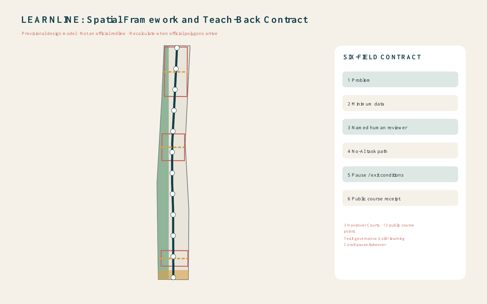
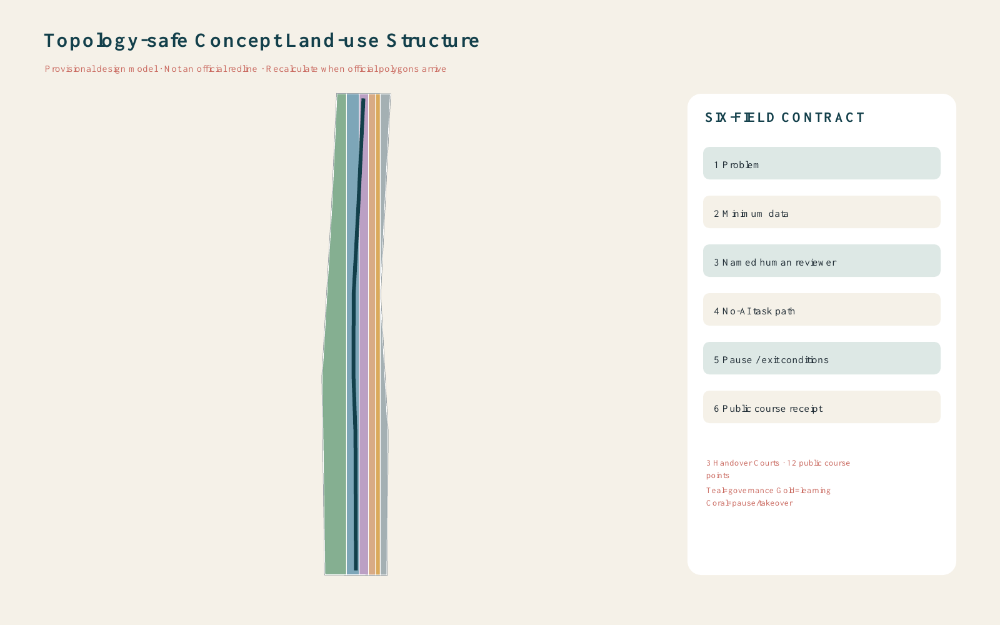
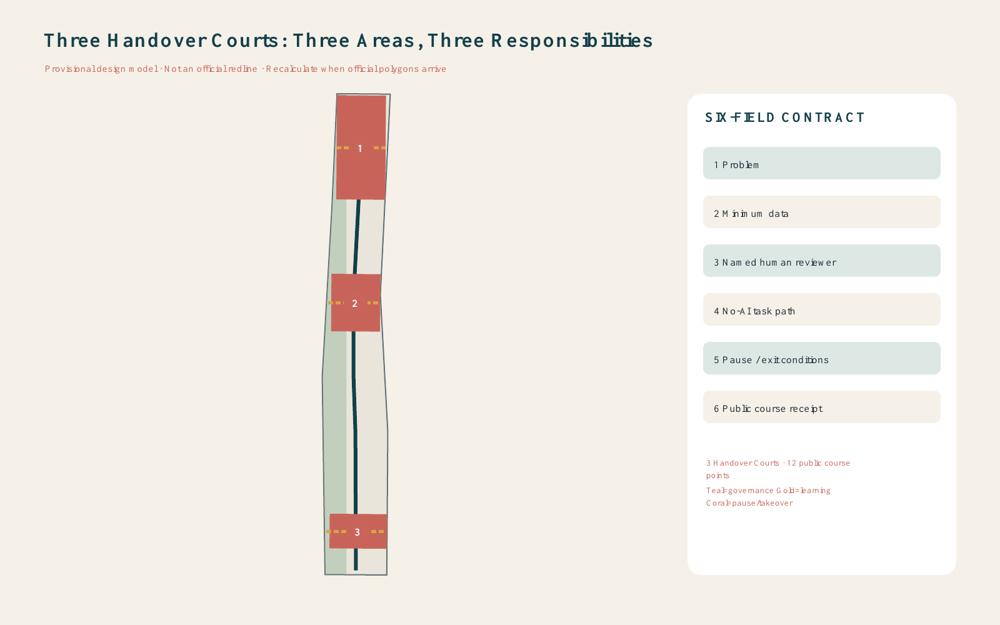
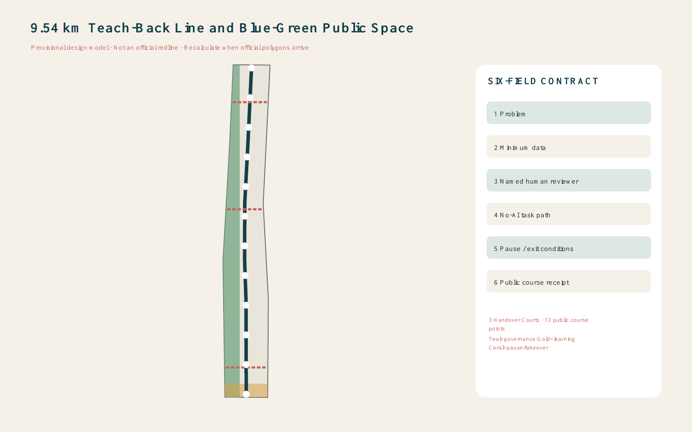
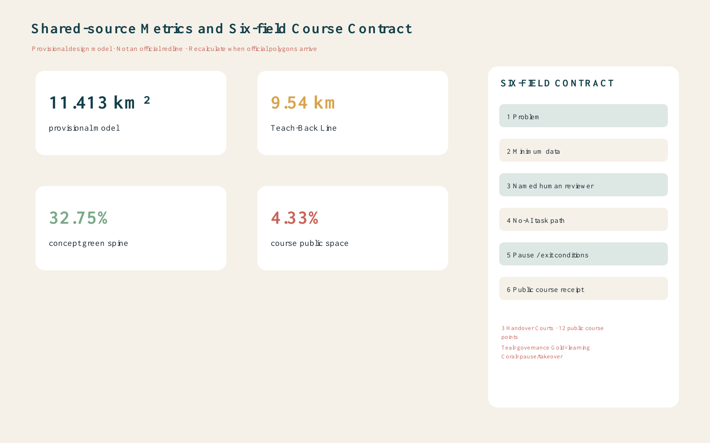

# Jing-Zhang LEARNLINE

## Design Basis and Source List

LEARNLINE is a professional-design package built from the official open-call announcement, the cleared Agent taskbook, the repository source registry, and the provisional site and key-area polygons. The site polygon is explicitly a provisional constraint: it is not an official redline, approval basis, ownership boundary, engineering line, or statutory control. The model must be rebuilt when authoritative polygons arrive [source:OFFICIAL-ANNOUNCEMENT] [source:AGENT-TASKBOOK] [depth:existing_conditions_diagnosis].

The submitted provisional geometry computes an area of 11,412,825.386 sqm. The site and key-area provenance are separately recorded [source:BOUNDARY-SOURCE] [source:KEY-AREA-SOURCE]. Repository rules, processed navigation material, and source-use boundaries are documented without upgrading background material into formal evidence [source:SITE-PACKAGE] [source:SOURCE-REGISTRY] [source:PROCESSED-FACT-PACK]. LEARNLINE's governing idea is a Teach-Back City: before an AI project enters a public, enterprise, or civic setting, it must publicly teach back six fields - problem, minimum necessary data, named human reviewer, no-AI task path, pause/exit conditions, and public course receipt.

## Three-Level Scope Framework

The 43.6 sq km coordinated research area frames the regional AI ecosystem; the roughly 11.4 sq km overall design area translates that strategy into renewal, mobility, public-space, and service systems; the three provisional key areas test detailed spatial and operating proposals. These levels are connected through one evidence chain rather than treated as three unrelated drawings [data:geometry/site_boundary.geojson#SITE-001] [data:geometry/key_areas.geojson#PROV-KEY-001] [depth:three_level_scope_framework].

The spatial structure is one 9.54 km Teach-Back Line, three Handover Courts, twelve public course points, and a continuous learning loop. The north-south line carries daily walking, learning, and public receipts; three east-west stitches connect the key areas; the loop links deployment, human takeover, feedback, exit, and post-use review. This is a conceptual design network inside the provisional boundary, not an additional planning redline [depth:overall_spatial_structure] [standard:PROJECT-OFFICIAL-ANNOUNCEMENT].

## Coordinated Research Area: Industry and Future City Research

LEARNLINE converts an innovation ecosystem into a public operating contract. Its six fields require every pilot to state what problem it solves, what data it truly needs, who can explain and take over, how the same task works without AI, what triggers suspension or exit, and what results will be published afterward. A dark teal identity signals heritage and dependable governance; warm gold marks public learning and receipts; restrained coral is reserved for takeover and pause states. This is a competition identity direction, not an official logo [standard:PROJECT-AGENT-OPEN-CALL-TASKBOOK] [data:geometry/roads.geojson#ROAD-001].

Six international mechanisms are used only as governance comparisons. Helsinki's AI Register demonstrates system disclosure and feedback [source:CASE-HELSINKI]. Amsterdam's algorithm register makes use, status, and impact information visible [source:CASE-AMSTERDAM]. Singapore AI Verify turns governance principles into tests [source:CASE-SINGAPORE]. Canada's Algorithmic Impact Assessment links risk questions to mitigation [source:CASE-CANADA]. New York City's AI Action Plan connects governance, engagement, and institutional capacity [source:CASE-NYC]. Barcelona's Decidim demonstrates hybrid public participation infrastructure [source:CASE-BARCELONA]. LEARNLINE spatializes the common lesson as a walkable cycle of register, test, participate, take over, exit, and review.

## Overall Design Area: Urban Renewal and Regulatory-Plan-Level Urban Design

The topology-safe land-use model fully partitions the provisional site into a 32.75% concept learning green spine, AI research and public evaluation, enterprise services and international exchange, talent living and community services, Jing-Zhang culture and public learning, and slow-mobility/station access bands. Adjacent polygons share cut lines and cover the boundary without gaps or overlaps [data:geometry/land_use.geojson#LU-001] [depth:land_use_layout] [standard:MNR-LAND-USE-CLASSIFICATION-GUIDE].

Three conceptual footprints identify places where Handover Courts could be deepened by professional teams. They do not claim parcel ownership, demolition, approved floor area, height, or density. FAR and other statutory controls remain pending official data [data:geometry/buildings.geojson#BLDG-001] [depth:development_intensity_controls] [standard:MOHURD-CONTROL-DETAILED-PLANNING]. The renewal logic prioritizes reversible public interfaces, ground-floor learning uses, and human-service fallbacks before permanent construction.

## Detailed Design of Key Areas

Zhongzhiyuan becomes the Evaluation and Governance Court: model testing, safety review, low-carbon compute demonstrations, and a public failure library. The AI Origin Community becomes the Open-source Transfer Court: university-to-enterprise translation, licensing support, talent services, and teacher-led public courses. Dazhongsi becomes the Native-AI Exchange Court: intelligent products, content disclosure, international demonstration, and consumer recourse [data:geometry/key_areas.geojson#PROV-KEY-001] [depth:three_key_area_detailed_design].

Each court is connected to the north-south line by an east-west pedestrian stitch and contains a human takeover desk, a no-AI route, a course receipt wall, and a pause rehearsal point. The detailed locations remain provisional and must be recalculated from official key-area polygons. No bridge, tunnel, station, utility, ownership, or engineering-feasibility conclusion is asserted.

## AI Innovation Ecosystem, Personas, and AI+ Scenarios

The twelve course points cover three industrial validation cases - public model safety evaluation, edge-compute energy testing, and an enterprise-service-agent sandbox - plus open-source transfer, accessible walking assistance, elderly-friendly service support, park maintenance, public-safety operations review, AI education, native-AI retail, multilingual visitor service, and Jing-Zhang cultural interpretation. Every card repeats the six-field Teach-Back Contract so a pilot cannot hide responsibility behind a different interface [metric:public_course_point_count] [standard:GENERATIVE-AI-INTERIM-MEASURES].

Six user groups are mapped to space and operations: open-source developers need contribution and testing rooms; start-ups need low-cost validation and accountable enterprise services; enterprise visitors need demonstration and international exchange; residents need quiet, accessible, non-coercive daily services; students and researchers need transfer and learning spaces; frontline staff need authority to override and report failure. Accessibility and an equivalent no-AI path are preconditions, not optional add-ons [standard:BARRIER-FREE-ENVIRONMENT-LAW] [standard:ELDERLY-SMART-TECH-PLAN-2020-45].

Three conceptual pilgrimage and honor nodes reinforce the contract. The First Receipt Wall displays rights-cleared contributions, failures, and revisions. The Human Takeover Bell hosts operational drills. The Centennial Signal Post links railway signalling history with contemporary explainability. These are reference components for professional and heritage review, not approved installations.

## Land Use, Building Scale, and Retain-Renovate-Demolish Strategy

Land-use geometry is a complete conceptual partition; building geometry marks only three illustrative retrofit or reuse interfaces. Existing-building surveys, ownership, structural safety, heritage constraints, approved controls, and utility capacity are absent, so no parcel is labelled for confirmed demolition or new construction. The method is retain first, repair public interfaces second, and study selective addition only after official and professional evidence arrives [depth:retain_renovate_demolish] [depth:height_massing_character].

The currently computable building-footprint area is a design-model output from three conceptual footprints [metric:building_footprint_area_sqm]. It is not total floor area or an approved development scale. The architecture-design-depth reference snapshot still lacks its complete official source, so [standard:MOHURD-ARCH-DESIGN-DEPTH-2016] is disclosed as a data gap rather than used as proof of engineering readiness.

## Transport, Rail, Municipal Infrastructure, and Public Services

The 9.54 km Teach-Back Line is a conceptual greenway aligned within the provisional boundary, complemented by three transverse Handover Court stitches. It prioritizes walking, cycling, station approach, accessible rest, and clear non-digital wayfinding. It does not establish road redlines, railway alignments, bridge or tunnel feasibility, parking quantities, or traffic approvals [data:geometry/roads.geojson#ROAD-001] [metric:teach_back_line_length_m] [depth:traffic_rail_slow_parking].

Municipal and public-service recommendations are deliberately staged: first provide human service desks, low-energy edge-compute demonstrations, and offline fallback information; then test energy, drainage, safety, fire, communications, and maintenance requirements; only after official capacity data may a professional team define permanent infrastructure. The submitted constraints layer makes these missing controls explicit [data:geometry/constraints.geojson#CONSTRAINTS] [depth:municipal_new_infrastructure].

## Blue-Green Network, Public Space, and Urban Character

The concept learning green spine occupies 3,737,700.314 sqm, or 32.75% of the provisional design model. Public course space occupies 494,175.339 sqm, or 4.33%. Both values are recomputed from submitted geometry in EPSG:4548; neither is an approved green-space ratio or statutory public-space control [data:geometry/green_space.geojson#GREEN-001] [metric:green_ratio] [depth:blue_green_public_space].

Public space provides shaded teaching, takeover rehearsals, quiet fallback service, accessible seating, and quarterly receipt display [data:geometry/public_space.geojson#PUBLIC-001] [metric:public_space_ratio]. The visual language combines railway memory, Zhongguancun experimental culture, and accountable AI: dark teal structure, warm gold learning markers, coral pause elements, recycled brick, and low-glare surfaces. City character is coordinated as a concept under [standard:MOHURD-URBAN-DESIGN-MEASURES], subject to heritage and professional review.

## Renewal Projects, Implementation Policy, and Phasing

Phase 1 establishes the contract before construction: publish the six fields, select three low-risk pilots, name human reviewers, and rehearse no-AI task paths. Phase 2 installs reversible course points and the three Handover Courts, then publishes quarterly receipts. Phase 3 considers permanent spatial work only after official boundaries, planning controls, municipal capacity, transport, ownership, and heritage conditions are confirmed [data:geometry/phasing.geojson#PHASE-001] [depth:renewal_project_list] [depth:phasing_implementation].

An annual operating reference includes a spring open course, summer testing week, autumn global Teach-Back forum, and winter pause drill. Developer communities, enterprises, residents, educators, and public-service staff review receipts together. These are conceptual operating recommendations, not confirmed public programmes, budgets, procurement, or government commitments.

## Metrics, Area Recalculation, and Compliance Matrix

The reproducible model records a provisional site area of 11,412,825.386 sqm [metric:site_area_sqm], a 9,540 m Teach-Back Line, three Handover Courts [metric:handover_court_count], twelve course points, a 32.75% concept green spine [metric:green_space_area_sqm], and a 4.33% course public-space share [metric:public_space_area_sqm]. Geometry, metrics, the visual page, figures, and drawings use the same values; FAR remains unknown rather than invented.

All 23 announcement and Agent task requirements are mapped to report sections, geometry, metrics, drawings, sources, assumptions, and checks. All 15 required design-depth items are complete to the extent permitted by public and provisional data [depth:metrics_recalculation]. This means the package is auditable as an open-call concept; it does not transform missing official controls into planning approval.

## Risk, Copyright, and Compliance

The main operational risks are absent responsibility, excess data collection, a nominal rather than usable non-AI path, failure to suspend a harmful pilot, and receipts that publish successes but hide failures. The six-field contract turns these into pre-deployment checks, live takeover drills, and post-use review. Provisional geometry, official-data gaps, generation methods, asset rights, and recalculation triggers are disclosed in the structured evidence layer [depth:risk_missing_data].

All maps are generated from repository geometry; graphics, HTML, and PDFs are authored for this submission using local code and system fonts. No remote map tile, remote font, tracker, form, iframe, personal data, unlicensed face, trademark, or copyrighted third-party image is included. Every spatial recommendation is a conceptual reference for professional deepening; it does not replace formal planning or constitute a government decision.

## References

The evidence register includes the official announcement, cleared Agent taskbook, repository source registry, processed fact pack, provisional geometry basis, professional-standard snapshots, and six official international mechanism references. Exact provenance, URLs, purposes, and limitations are recorded in `sources.json`; machine evidence remains authoritative over presentation artifacts. The package should be synchronized and rechecked whenever the repository brief, official geometry, validation rules, Issues, or review comments change.
