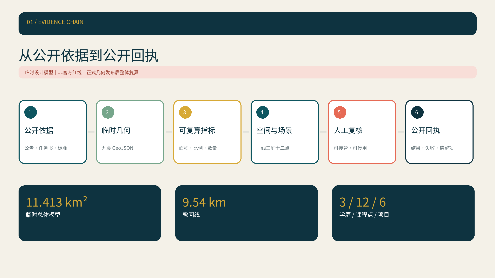
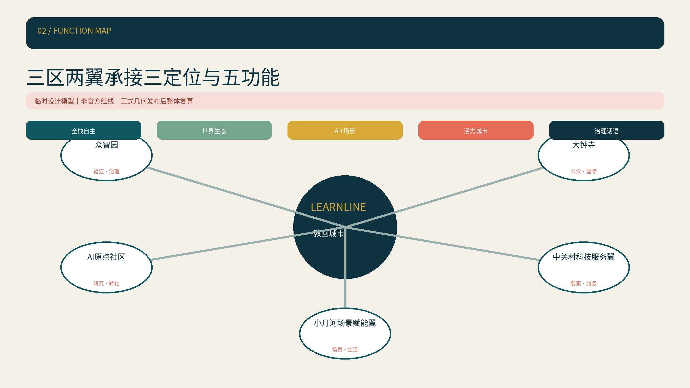
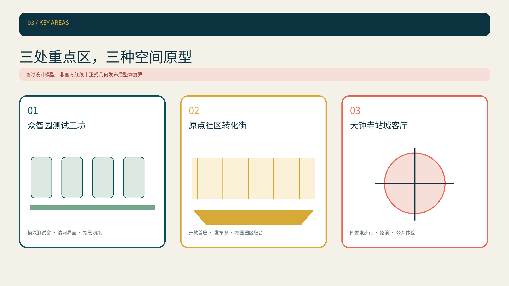
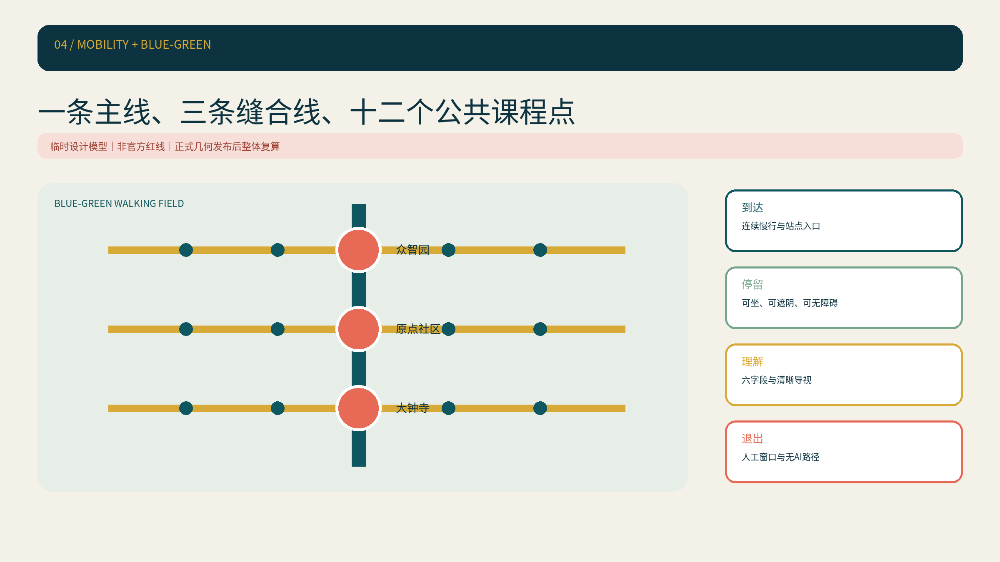
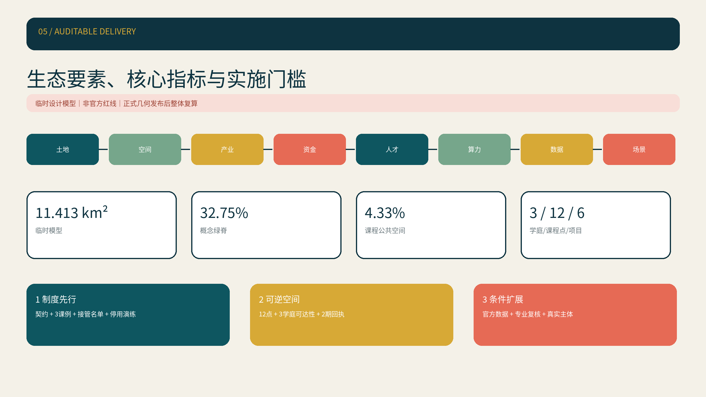

# 京张共学线 LEARNLINE

> **方案一句话**：让每个进入城市的 AI 项目都能向公众“教回”它解决什么问题、使用什么数据、由谁人工复核、停用时如何继续服务。
>
> **精度声明**：本方案使用仓库提供的临时边界建立可复算设计模型，不是官方红线、法定控规或工程实施依据；正式几何发布后须整体重算九类空间数据、指标、图件、HTML 与图册。

## 设计依据与资料清单

本方案以《百年京张AI创新带城市设计国际方案征集资格预审公告》和面向智能体任务书为目标依据，以场地包、来源登记表和专业标准快照为工作边界 [source:OFFICIAL-ANNOUNCEMENT] [source:AGENT-TASKBOOK] [depth:existing_conditions_diagnosis]。来源、许可、用途和限制完整登记在 `sources.json`；需要正式数据才能判断的控规、道路红线、权属、市政、消防、文保与建筑拆改留事项继续保留为“待正式数据补齐”。

空间模型采用仓库临时总体边界与三处临时重点区，分别登记为 [source:BOUNDARY-SOURCE] 和 [source:KEY-AREA-SOURCE]。当前可复算面积只用于检验方案内部一致性；任何外部引用都必须同时保留“临时设计模型”限定。图件中的虚线边界、面积指标和重点区位置均不构成审批结论 [data:geometry/site_boundary.geojson#SITE-001] [metric:site_area_sqm]。

LEARNLINE 的核心制度是“教回城市（Teach-Back City）”六字段契约：问题、最少必要数据、具名人工复核、无 AI 同任务路径、暂停/退出条件、公开课程回执。它把透明、可接管、可停用和可复盘从抽象原则变成每个场景开放前都要通过的城市门槛 [standard:GENERATIVE-AI-INTERIM-MEASURES] [standard:BARRIER-FREE-ENVIRONMENT-LAW]。

## 三层范围工作框架

三层范围不是三套互不相干的图纸，而是一条“战略判断—空间配置—片区验证”的证据链：43.6 平方公里统筹研究范围提出产业与未来城市关系；约 11.413 平方公里临时总体设计模型组织更新、交通、蓝绿和设施；三处临时重点区验证空间、场景和运营能否闭环 [source:OFFICIAL-ANNOUNCEMENT] [depth:three_level_scope_framework]。

| 层级 | 关键问题 | LEARNLINE 回答 | 审查落点 |
| --- | --- | --- | --- |
| 统筹研究范围 | AI生态如何与城市生活协同 | 三定位、五功能、三区两翼和五类区域接口 | 方案级功能矩阵、全球案例与生态要素链 |
| 总体设计范围 | 产业与公共利益如何落到空间 | 一线、三学庭、十二课程点、蓝绿慢行网 | 九类 GeoJSON、指标与分期清单 |
| 重点区域范围 | 三处片区如何形成不同能力 | 验证、转化、面向公众的三种空间原型 | 三处重点区图、JZ项目与RACI |

总体概念为“一线、三座交接学庭、十二个公共课程点、一个持续学习环”。9.54 公里教回线沿京张遗址公园串联三座学庭；课程点承载日常可体验场景；持续学习环把部署、人工接管、公众反馈、整改和退出连成一条可审查流程 [data:geometry/roads.geojson#ROAD-001] [metric:teach_back_line_length_m]。

## 统筹研究范围产业与未来城市研究

### 三定位—五功能—三区两翼—空间节点—角色矩阵

三大定位分别强调京张历史连续性、可感知的都市 AI 日常和从研发到场景的融合创新；五大功能不是口号，而由具体片区、节点和待确认角色共同承担 [standard:PROJECT-AGENT-OPEN-CALL-TASKBOOK] [depth:overall_spatial_structure]。

| 五大功能 | 对应定位 | 三区两翼主接口 | 空间节点 | 待确认运营角色 |
| --- | --- | --- | --- | --- |
| AI全栈自主创新体系 | AI融合创新带 | 众智园 + 中关村科技服务翼 | 安全治理沙盒、端侧算力驿站 | 研究平台、测试机构、算力与安全服务角色 |
| 世界级AI创新生态 | AI融合创新带 | AI原点社区 + 科技服务翼 | 开源发布厅、成果转化街 | 高校技术转移、孵化、法务与知识产权服务角色 |
| AI+场景赋能新范式 | 都市AI生活体验带 | 小月河场景赋能翼 + 三处重点区 | 十二课程点、公共服务样板街 | 场景业主、社区服务与独立评估角色 |
| 智能化AI活力城市 | 都市AI生活体验带 | 大钟寺 + 小月河场景赋能翼 | 路演客厅、慢行导航、公共体验路线 | 街区运营、交通与无障碍复核角色 |
| AI治理全球话语权 | 百年京张文化带 + AI融合创新带 | 众智园 + 全线公开回执网络 | 人工接管钟、回执墙、年度论坛 | 治理研究、公众代表、独立安全与伦理复核角色 |

### 区域协同接口

协同关系只定义“可以交换什么、通过何种接口验证”，不声称已签约或获得政府承诺。每项合作均以公开课、联合测试议题或开放资料包为最小启动单元，真实主体和授权需后续确认 [source:AGENT-TASKBOOK]。

| 协同对象 | 建议交换内容 | 空间/运营接口 | 证据状态 |
| --- | --- | --- | --- |
| 北纬社区 | 社区AI服务需求、无AI替代路径与居民反馈方法 | 小月河课程点 + 季度回执会 | 任务书要求；对象与授权待确认 |
| 未来科学城 | 科研成果、工程验证需求与人才课程 | 原点社区发布厅 + 专题测试周 | 概念接口；未主张合作成立 |
| 怀柔科学城 | 科学智能、科研仪器与可信数据议题 | 众智园安全沙盒 + 联合公开课 | 概念接口；数据另行清权 |
| 北京经开区 | 制造、机器人和产业场景需求 | 大钟寺路演客厅 + 场景需求清单 | 概念接口；企业名单不预设 |
| 京津冀创新网络 | 跨区域人才、场景需求和复盘方法 | 全球教回论坛 + 可复用六字段模板 | 任务书方向；机制待共建 |

### 六个全球 AI 创新生态案例

案例选择从“治理机制”转向“研究—人才—企业—测试—转化”的生态组织，并只提取官方页面可支持的机制，不照搬规模数字或招商承诺。

| 案例 | 已公开的生态机制 | 对 LEARNLINE 的可转译做法 |
| --- | --- | --- |
| 多伦多 Vector Institute | 高校研究、人才项目、行业伙伴、AI工程与应用协作 [source:CASE-VECTOR] | 原点社区连接高校人才，科技服务翼把问题转成联合项目 |
| 蒙特利尔 Mila Ventures | 研究人才、创业训练、加速、企业连接与早期支持 [source:CASE-MILA] | 建立“研究成果—团队—首个场景—回执”的转化门槛 |
| AI Singapore | 100 Experiments、工程学徒与真实产业问题共同推进 [source:CASE-AISINGAPORE] | 将测试周同时设计为人才培养和最小可用原型验证 |
| Seoul AI Hub | 创业企业培育、AI人才、交流空间与国际网络 [source:CASE-SEOUL] | 三座学庭形成共享空间、企业服务和国际展示的组合入口 |
| AI Sweden | 伙伴网络、技术基础设施、共享测试床、数据与法律支持 [source:CASE-AISWEDEN] | 众智园设置技术测试、数据责任与监管对话的并行工作台 |
| 慕尼黑 appliedAI | 科研、产业、公共部门与初创企业共同进行AI应用和能力建设 [source:CASE-APPLIEDAI] | 科技服务翼采用跨角色项目制，不预设单一供应商 |

### 八要素生态链

土地和空间只提供可逆载体；产业提出问题；资金以阶段性、可退出支持替代一次性承诺；人才通过真实项目学习；算力和数据按授权开放；测试场景必须有人审、能暂停、有回执。中关村科技服务翼贯穿法务、知识产权、融资准备、标准、安全和国际合作，但所有机构均以角色类型表达，待后续依法确认。

| 要素 | 最小供给 | 进入下一环节的证据 | 失败或暂停处理 |
| --- | --- | --- | --- |
| 土地 | 可逆、低干预试验空间 | 场地授权与用途边界 | 未授权不落地 |
| 空间 | 学庭、课程点、测试工作台 | 无障碍和消防初核 | 不合格则改为线上/室内替代 |
| 产业 | 可验证的问题陈述 | 明确受益人、影响对象与基线 | 问题不可验证则退回 |
| 资金 | 分阶段支持角色 | 公开里程碑与停止条款 | 未达门槛不进入下一阶段 |
| 人才 | 学徒、研究者、产品与公共服务人员 | 具名导师和人工复核人 | 责任人缺席即暂停 |
| 算力 | 经授权的开发/测试资源 | 用量、能耗与安全边界 | 超范围立即降级 |
| 数据 | 最少必要、可撤回的数据包 | 来源、许可、保存期和删除证明 | 无法清权则使用合成或公开数据 |
| 场景 | 三类低风险测试 + 十二课程点 | 指标、公众反馈、无AI路径演练 | 触发红线则停用并公开复盘 |

## 总体设计范围城市更新与控规深度城市设计

总体空间结构以低对比临时边界为约束，以教回线为南北公共骨架，以三条东西缝合线接入高校、社区、轨道站点和产业空间。用地、建筑、道路、绿地、公共空间和分期从同一边界生成，避免“图上成立、数据不闭合” [data:geometry/land_use.geojson#LU-001] [data:geometry/buildings.geojson#BLDG-001] [metric:building_footprint_area_sqm]。

空间更新采用三种强度：可先启动的运营和导视；需专业复核后实施的可逆轻设施；必须等待官方控规、权属、市政和工程条件的永久建设。建筑高度、容积率、建筑密度、道路红线和具体拆改留均保持待正式数据补齐，不以概念值替代法定控制 [standard:MOHURD-CONTROL-DETAILED-PLANNING] [depth:development_intensity_controls]。

## 重点区域详细设计

三处重点区使用不同的空间语言，避免把同一六字段面板机械复制：众智园是“可见的测试工坊”，以模块化工作台、测试窗和清河低碳界面表达验证；原点社区是“开放的转化街”，以连续首层、共享台阶和发布廊表达知识流动；大钟寺是“面向公众的城市客厅”，以站城入口、四象限步行缝合和国际路演空间表达交流 [data:geometry/key_areas.geojson#PROV-KEY-001] [depth:three_key_area_detailed_design]。

| 重点区 | 核心问题 | 独特空间动作 | 首批可验证输出 |
| --- | --- | --- | --- |
| 众智园AI自主创新加速区 | 模型与安全如何被共同验证 | 测试工坊 + 清河创新界面 + 人工接管演练场 | 3类测试协议、暂停演练和安全回执 |
| 北京AI原点社区 | 科研成果如何转成可用服务 | 开源发布厅 + 近校转化街 + 校园园区慢行缝合 | 开源贡献、首个用户验证和转化回执 |
| 大钟寺AI产业集聚区 | 智能原生业态如何面对公众 | 站城客厅 + 四象限步行连接 + 数据要素会客厅 | 公众体验、国际路演和非AI替代服务记录 |

## AI 创新生态、人才画像与 AI+ 场景

五类用户画像覆盖开源开发者、初创团队、企业访客、周边居民和高校师生；每类画像同时记录目标、空间入口、可能受损方式和无 AI 路径。城市智能体可以辅助识别慢行断点、设施维护和服务需求，但不得做人脸识别、个体轨迹分析、自动执法或居民商业画像 [standard:BARRIER-FREE-ENVIRONMENT-LAW] [standard:GENERATIVE-AI-INTERIM-MEASURES]。

十二张场景卡分为三类：产业验证（C01-C04）、公共服务（C05-C09）和文化传播（C10-C12）。其中安全治理沙盒、端侧算力驿站和公共服务无AI切换演练构成三类产业测试场景；每个场景都必须填写六字段、设置人工复核并保留退出通道 [data:geometry/public_space.geojson#PUBLIC-001] [metric:public_course_point_count]。

| 场景组 | 课程点 | 主要用户 | 人工/非AI边界 |
| --- | --- | --- | --- |
| C01-C04 产业验证 | 开源发布、安全沙盒、端侧算力、成果转化 | 开发者、初创、高校 | 人工签署测试范围；无授权数据不进入 |
| C05-C09 公共服务 | 慢行、无障碍、老年服务、公园维护、公共安全 | 居民、访客、运营者 | 保留人工窗口、纸面导视与人工巡检 |
| C10-C12 文化传播 | 京张故事、多语服务、全球活动路线 | 全体公众、国际访客 | 史实和译文人工复核；不自动生成官方结论 |

## 用地、建筑规模与拆改留方案

用地模型完整覆盖临时总体边界且无内部重叠，分类依据公开标准；建筑图层只表达概念性基底和空间容量测试，不指认具体权属或拆除对象 [standard:MNR-LAND-USE-CLASSIFICATION-GUIDE] [data:geometry/land_use.geojson#LU-001]。在现状建筑、产权、文保和结构安全资料到位前，拆改留采用“保留优先—轻改可逆—条件触发”的方法，不形成地块级结论 [depth:retain_renovate_demolish]。

永久建筑、地下空间、桥隧与轨道接口必须由相应专业团队复核。当前图件只展示功能关系、步行联系和可逆空间原型；任何工程尺度和投资判断均不在本方案授权范围内。

## 交通、轨道、市政与公共服务设施

交通策略以步行和骑行为首要体验：教回线组织南北连续性，三条东西缝合线连接重点区与周边目的地，站点入口和慢行断点以“到达—停留—理解—继续通行”的顺序设计 [data:geometry/roads.geojson#ROAD-001] [depth:traffic_rail_slow_parking]。大钟寺四象限连通、北五环跨越和轨道接驳只作为概念问题清单，不能替代交通工程论证。

市政与新基础设施采用小规模、分布式和可监测原则：端侧算力节点需说明能耗、安全、数据边界和运营责任；公共服务节点必须保留断网和停机条件下的基本服务 [data:geometry/constraints.geojson#CONSTRAINTS] [depth:municipal_new_infrastructure]。

## 蓝绿空间、公共空间与城市风貌

临时设计模型内，概念绿脊面积为 **3,737,700.314 平方米**，占 **32.75%**；课程公共空间面积为 **494,175.339 平方米**，占 **4.33%**。这些数值由提交几何在 EPSG:4548 中复算，只说明本方案内部空间分配，不是法定绿地率或官方面积 [data:geometry/green_space.geojson#GREEN-001] [data:geometry/public_space.geojson#PUBLIC-001] [metric:green_ratio]。

城市风貌以“铁路信号—知识交换—公开回执”为叙事线：深青用于历史与可靠治理，暖金用于学习和交接，珊瑚色专门提示暂停、人工接管和风险。众智园使用工坊语言，原点社区使用开放街廊语言，大钟寺使用站城客厅语言；三者共享品牌骨架但不复制同一立面 [depth:blue_green_public_space]。

## 更新项目清单、实施政策与分期计划

六个更新项目均采用角色型 RACI。A为最终负责、R为执行、C为专业复核、I为被告知；所有角色均为待确认类型，不代表已获得任何机构授权 [data:geometry/phasing.geojson#PHASE-001] [depth:renewal_project_list]。

| 项目 | A 发起/负责 | R 运营 | 人工复核与数据责任 | 安全/无障碍与暂停决定 | 最低公开回执 KPI |
| --- | --- | --- | --- | --- | --- |
| JZ-01 慢行断点缝合 | 街区统筹角色 | 公共空间运营角色 | 交通人工复核；数据由场景业主负责 | 交通/无障碍专业角色；A决定暂停 | 断点清单、无AI导视、1次停用演练 |
| JZ-02 清河创新界面 | 园区统筹角色 | 蓝绿空间运营角色 | 生态监测人工复核；数据最少化 | 生态/防洪角色；A决定暂停 | 季度维护回执、异常处置记录 |
| JZ-03 近校成果转化街 | 校园园区协调角色 | 转化服务角色 | 技术转移人工复核；成果权利人负责数据 | 知识产权/无障碍角色；A决定暂停 | 项目来源、首个用户验证、退出记录 |
| JZ-04 大钟寺四象限连通 | 站城协调角色 | 街区运营角色 | 交通人工复核；不采个体轨迹 | 交通/消防/无障碍角色；A决定暂停 | 四象限路线图、拥堵人工巡查记录 |
| JZ-05 公共服务与端侧算力 | 场景开放委员会角色 | 技术运营角色 | 具名人工接管；场景业主为数据责任人 | 安全/隐私角色拥有立即停用权 | 用量、能耗、接管与删除回执 |
| JZ-06 全球AI活动路线 | 活动治理委员会角色 | 活动运营角色 | 内容与翻译人工复核；报名数据责任人 | 公共安全/无障碍角色可暂停 | 参与、可达、投诉、事故和改进回执 |

三阶段路径设有硬门槛：近期“制度先行”至少完成六字段模板、三类低风险课例、人工接管名单与一次无AI演练；中期“可逆空间”需完成十二课程点、三学庭可达性检查和连续两个季度回执；远期“条件扩展”只在正式边界、控规、权属、市政和真实运营主体齐备后由专业团队另行研究。任一阶段若出现责任人缺席、数据无法清权、无AI路径不可用、重大安全/无障碍问题或连续两期不公开回执，即暂停并退回上一阶段 [depth:phasing_implementation]。

年度活动形成“春季开放课—夏季测试周—秋季教回论坛—冬季停用演练”闭环。每项活动至少公开问题清单、参与角色、测试范围、人工接管、结果与遗留问题；只有完成回执的团队才能进入下一周期。人才转化以参与真实课例和具名导师为门槛，企业转化以可验证场景和合规数据为门槛，国际传播以双语证据包和状态声明为门槛；不以到场人数或媒体曝光替代公共价值。

## 指标体系、面积复算与合规矩阵

本次统一复算结果为：临时总体设计边界 **11,412,825.386 平方米**；教回线 **9,540 米**；概念绿脊 **3,737,700.314 平方米（32.75%）**；课程公共空间 **494,175.339 平方米（4.33%）**；三座交接学庭、十二个课程点和六个更新项目均进入结构化指标 [metric:site_area_sqm] [metric:green_space_area_sqm] [metric:public_space_area_sqm]。

合规矩阵逐条覆盖公告 1.3-1.5 和 agent.1-agent.6；标准矩阵记录专业依据与缺口；设计深度矩阵记录每项成果的机器证据和人类可读落点 [depth:metrics_recalculation]。容积率、建筑高度、建筑密度、道路红线和具体拆改留继续为待正式数据补齐，不因概念图完整而升级为已知值。

## 风险、版权与合规说明

本方案的首要风险是责任人缺席、数据越界、人工路径失效、试点无法停用和回执只报成功。六字段契约、RACI、阶段门槛和退出条件共同把这些风险转成可检查动作。所有空间建议均为概念建议和供专业团队深化的参考方案，不替代正式规划，不构成政府审定、投资承诺或工程可行性结论 [depth:risk_missing_data]。

中文网页以内嵌子集形式使用 Noto Sans CJK SC 字体以保证跨环境可读；字体采用 SIL Open Font License 1.1。图册 PDF 嵌入同一字体的所需字形。案例资料仅作为生态机制比较，未复制第三方图片、商标或宣传材料。新增或替换任何字体、地图、图像、人物、企业标识和活动素材时，必须重新登记来源、许可、署名和复用边界 [source:FONT-NOTO-CJK]。

## 参考资料

- 官方公告与任务书：[source:OFFICIAL-ANNOUNCEMENT] [source:AGENT-TASKBOOK]
- 场地包、来源登记和临时几何：[source:SITE-PACKAGE] [source:SOURCE-REGISTRY] [source:BOUNDARY-SOURCE]
- 北美与亚洲生态案例：[source:CASE-VECTOR] [source:CASE-MILA] [source:CASE-AISINGAPORE]
- 欧洲与首尔生态案例：[source:CASE-SEOUL] [source:CASE-AISWEDEN] [source:CASE-APPLIEDAI]
- 完整出处、访问日期、许可和用途限制见 `sources.json`；完整指标和公式见 `metrics.json`。
