# 京张共地 / THE SHARED FLOOR

> **REPLACE THE MODEL, NOT THE CITY / 换模型，不换城市.** The Shared Floor is a civic contract across time: public ground and long-life support remain, while the service chassis, replaceable infill and AI equipment change at their own cycles. One shared ground, seven Switch Streets, three long-life frames and four seasons of public life make AI a reversible urban capability—not the owner of the city.

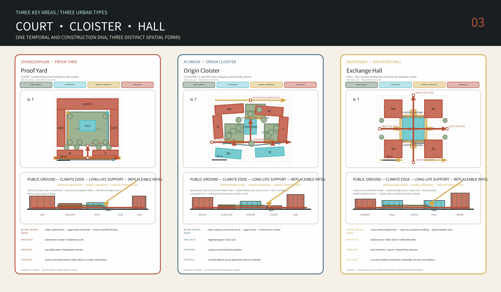

## Design Basis and Source List

The first design decision is deliberately counter-intuitive: the central Jing-Zhang Railway Heritage Park is not an empty axis awaiting a new masterplan. In July 2026 the Beijing Forestry and Parks Bureau announced completion of the Phase II supporting works, describing a northern segment of about 30.01 hectares and a fishbone network for walking, running and cycling. The 2.5-kilometre, 16.8-hectare Phase I segment between Zhichun Road and Qinghua East Road had already opened in 2023. The useful competition task is therefore not to draw another north-south green stripe, but to connect this civic ground to campuses, neighbourhoods, metro stations, industry and rivers on both sides, and to resolve thresholds, entrances, crossings and day-to-night operation. [source:BEIJING-PARK-PHASE-II] [source:BEIJING-PARK-PHASE-I]

Evidence is classified in five states. `official` identifies the announcement and registered government material; `background` supports diagnosis only; `provisional` supports generation and discussion but not statutory claims; `design` is a recalculable proposal authored by this submission; and `unknown` must remain numerically empty. The repository supplies coarse provisional polygons for the overall design scope and three key areas. Its own basis note records that the named OpenStreetMap polygon for the built heritage park has zero overlap with the provisional overall polygon and lies at a nearest distance of 412.5 metres. No authoritative adjudication is available. The submission therefore does not silently swap boundaries; it makes successful rebinding a design-performance requirement. [source:BOUNDARY-BASIS] [data:geometry/site_boundary.geojson#SITE-001] [depth:risk_missing_data]

The package retains the announcement's scale references of 43.6 square kilometres for coordinated research, 11.4 square kilometres for overall design, and 368.4 hectares across the three key areas. Parcel limits, road redlines, FAR, statutory heights, ownership, retain-renovate-demolish decisions and heritage buffers remain `unknown` until official attachments are released. Except for four separately credited, hash-pinned 1909 Jing-Zhang construction-album thumbnails whose source rights status is preserved, external research contributes cited facts and open data only; no government-page imagery, commercial basemaps or other entrants' graphics are copied. Source type, URL or local path, access date, rights, intended use and limitations are recorded in `sources.json`. [source:OFFICIAL-ANNOUNCEMENT] [source:SOURCE-REGISTRY] [source:LOC-JINGZHANG-ALBUM-1909]

This agent workflow has not conducted a site visit, authorised resident interviews or a questionnaire, and it makes no commitment on behalf of any local institution. The fifteen everyday-life rehearsals therefore specify what must be observed next, who would be accountable and which conditions stop a pilot; they are not evidence of existing demand or performance. Footfall, night safety, affordability, opening hours, operators and acceptance require a field baseline through observation, accompanied route walks and formally authorised interviews before implementation. [assumption:A-SOCIAL-BASELINE-001] [depth:risk_missing_data]

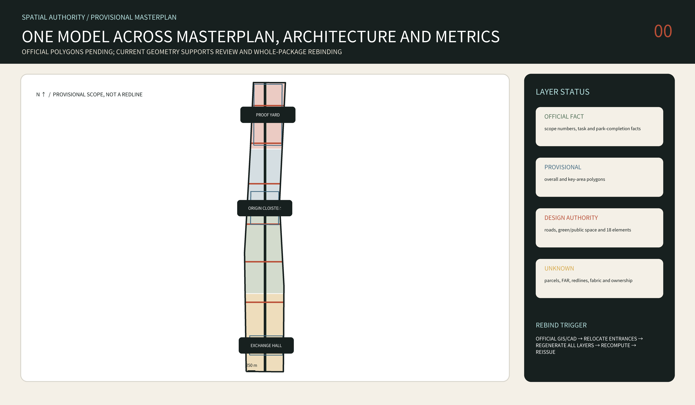

## Three-Level Scope Framework

At the 43.6-square-kilometre research scale, the proposal organises an innovation metabolism rather than a coloured land-use ribbon. Universities and institutes produce knowledge; Zhongzhiyuan hosts controlled proof and testing; AI Origin translates research from zero to one and supports talent life; Dazhongsi exposes adoption to citizens and the market; operating evidence then returns to the research end. This loop turns the brief's three strategic positions, five functions and “three zones and two wings” into five observable actions: `research — translate — prove — adopt — learn`. [source:AGENT-TASKBOOK] [standard:PROJECT-AGENT-OPEN-CALL-TASKBOOK]

Within the 11.4-square-kilometre overall design scope, the project proposes only a rebindable spatial grammar: one existing heritage civic ground, seven types of transverse `Switch`, three key urban rooms, and a family of four-season climate refuges. The interfaces address campus edges, neighbourhood thresholds, transit transfer, river-greenway connections, transitions to quiet night zones, servicing and loading, and heritage interpretation. The seven lines in the submitted geometry are conceptual test positions inside the provisional boundary—not road centrelines and not capital-project commitments. [data:geometry/roads.geojson#SWITCH-01] [depth:overall_spatial_structure] [assumption:A-BND-001]

In the three detailed areas, the proposal reaches the scale of a six-metre structural grid, useful building depth, courtyard proportion, ground-floor interface, shade element, rain garden, service strip and staffed handoff point. A reference cell is placed near each provisional key-area centroid so geometry can be recomputed. These cells express portable architectural relationships and do not claim real parcels. When official polygons arrive, the compiler relocates entrances and limits, regenerates buildings, roads, green space, public space and phases, and then recomputes every metric; it does not stretch the old drawing. [data:geometry/key_areas.geojson#PROV-KEY-001] [metric:prototype_count] [depth:three_level_scope_framework]

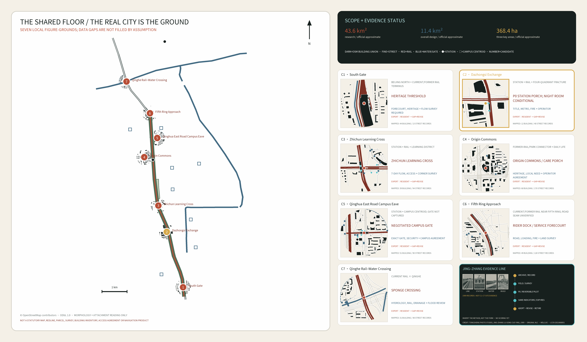

The atlas uses ODbL-attributed OSM rail, water, parks, stations and campus centroids for corridor orientation, then redraws seven compact 300-m windows of building unions, streets, rail, water, education boundaries and mapped gates. Data gaps stay blank rather than being invented as city; absence from an extract does not prove physical absence. The three key areas are label anchors only and the seven civic rooms remain design candidates awaiting surveyed addresses and operating agreements. The atlas is not a redline, parcel map, building inventory, survey, access agreement, navigation, approval or construction product. [source:OSM-CORRIDOR-CONTEXT-2026] [source:OSM-SEVEN-ROOM-FIGURE-GROUND-2026] [assumption:A-MOBILITY-001]

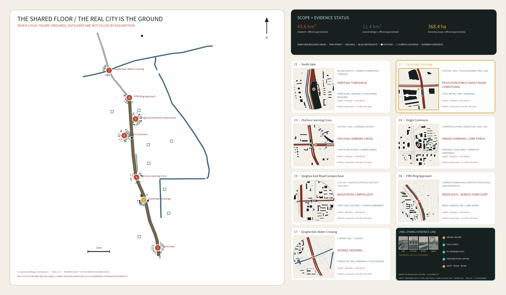

This is the participant-authored spatial hypothesis layer, not an existing-conditions map. It organizes one Shared Floor grammar as an auditable research model that can be rebound as a whole; every position and quantity must be recomputed when official boundaries, ownership, utilities and approval data arrive. [data:PROV-SITE-001] [metric:binding_offset_m]

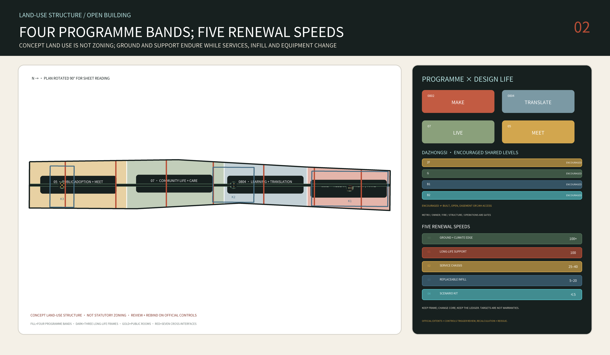

## Coordinated Research Area: Industry and Future City Research

The name **The Shared Floor** puts the identity on common ground rather than technological spectacle. The mark is an open square urban room crossed by a horizontal line: the room represents accessible shared space, the line carries both the Jing-Zhang heritage and the transverse stitch, and the opening means that every AI service retains a human entrance and an exit. The palette combines railway oxide red, shade green, paper cream and restrained cyan. It avoids corporate logos, human likenesses and simulated railway emblems. [source:AGENT-TASKBOOK] [depth:height_massing_character]

Six international districts are read as transferable mechanisms, not stylistic collage: one-north in Singapore for work-live-learn mixing and public-space operation; Punggol Digital District for university-industry-district-energy coordination; Barcelona 22@ for reuse of an industrial fabric; Paris-Saclay for its multi-institution network and dependence on transit; London's Knowledge Quarter for connecting institutions through an existing city rather than enclosing a campus; and Kendall Square for bringing public space and innovation employment into the same planning negotiation. Their shared lesson is that innovation density cannot be measured by office floor area alone. Networks must pass through daily life, while branding, expensive infrastructure and land-value uplift can exclude the very people the district needs if housing, services and long-term operators are absent. [source:PRECEDENTS-OFFICIAL] [standard:MOHURD-URBAN-DESIGN-MEASURES]

Industry space is therefore organised as four combinable room types: `make` for laboratories, prototypes and red-team trials; `translate` for standards, intellectual property, financing and incubation; `live` for housing, childcare, exercise, food and night study; and `meet` for public exhibitions, markets, forums and staffed services. These are architectural and ground-floor operating labels, not new statutory land-use categories. National land-use codes remain those permitted by the task package and are explicitly described as conceptual. [data:geometry/land_use.geojson#LU-RESEARCH] [standard:MNR-LAND-USE-CLASSIFICATION-GUIDE]

Official Haidian material describes the roughly three-square-kilometre AI Origin community as being surrounded by more than thirty universities and institutes, over one thousand AI scientists, 13,000 developers, 100,000 relevant students and more than 4,000 talent apartments. This density is not a reason for more enclosure. It is evidence for shared laboratories, exhibitions, food, services and evening learning on the public side of campus boundaries. [source:AI-ORIGIN-2026] [depth:existing_conditions_diagnosis]

Chinese specificity here begins with an institutional and everyday overlap: campuses/work units, gated residential compounds, stations, the heritage park and service labour jointly shape the city. Peking University research on six Xueyuanlu campuses finds that the largest spatial-integration gain already occurs when a closed campus selectively opens its main passages; blanket opening adds much less. The proposal therefore uses operated, timed `Negotiated Gates` with emergency rules rather than removing every wall. The approved seven-node public-space project south of Qinghua East Road is treated as adjacent work to coordinate with—not a project this submission may claim or duplicate. [source:PKU-XUEYUANLU-CAMPUS-2025] [source:QINGHUA-EAST-PUBLIC-SPACE-2026]

### Regional Coordination Interfaces

The corridor is not an island. Following the taskbook's regional-coordination requirement, five named interfaces each state their outbound flow, inbound flow and negotiation status; all are pending-negotiation concept proposals: [source:AGENT-TASKBOOK] [assumption:A-REGIONAL-001]

- **Beiwei AI Community**: outbound — operating manuals for the staffed fallback and no-phone paths; inbound — community-governance and elder-participation experience feeding the four-season public calendar.
- **Future Science City**: outbound — Proof Yard templates for spatially controlled trials; inbound — energy and materials pilot demand as an external source for Proof Yard scheduling.
- **Huairou Science City**: outbound — verification methods for recomputable state tasks; inbound — large-facility metrology and calibration supporting the first-year baseline instrumentation.
- **Beijing E-Town (BDA)**: outbound — scenario packages that have passed the adoption gates (low-speed delivery, accessible navigation); inbound — scaled operating data used to revise exit thresholds.
- **Beijing–Tianjin–Hebei corridor**: talent and event exchange along the Jing-Zhang heritage line, with the Exchange Hall as the corridor-side display and conversion window.

Every interface requires confirmation by its counterpart; until confirmed it remains a spatial and operational reservation, not an agreed arrangement.

## Overall Design Area: Urban Renewal and Regulatory-Plan-Level Urban Design

The overall structure is called `One Floor / Seven Switches / Three Rooms`. `One Floor` is the completed park and the civic ground that can connect to it. `Seven Switches` are interface types that adapt to seven urban conditions. `Three Rooms` test a different building-to-public-space relationship at Zhongzhiyuan, AI Origin and Dazhongsi. The structure does not mistake a rectangular provisional boundary for a street, a reference building for an existing building, or seven test locations for approved engineering sites. [data:geometry/site_boundary.geojson#SITE-001] [data:geometry/public_space.geojson#ROOM-PROOF] [depth:overall_spatial_structure]

The land-use layer is a seamless four-band conceptual partition expressing four emphases: research and proof, educational translation, public/commercial adoption, and community life. Actual conditions and statutory uses await cadastral and regulatory data. The building layer contains only the three reference prototypes and records `reference_prototype=true`, conceptual storeys, height and `not_regulatory`. The movement layer describes walking, cycling, transit thresholds and transverse public interfaces; it does not fabricate arterial roads or underground metro structures where evidence is absent. Green and public-space geometry is independently measurable, while phasing separates investigation, reversible prototypes, network connections and conditional capital renewal. [data:geometry/land_use.geojson#LU-RESEARCH] [data:geometry/buildings.geojson#ZY-NORTH] [metric:building_footprint_area_sqm]

Only one preferred design basis is submitted: The Shared Floor. Two other spatial roots are disclosed later only as compact evidence of an executed comparison, not as parallel final proposals. The final project must satisfy all of these gates: one connected public-route network reaching every public room; unique spatial IDs; winter-sun openings; a root-level summer-shade threshold; separation of long-life support from replaceable infill; and whole-project rebinding when official polygons arrive. The same rules produce three distinct spatial orders—court, cloister and hall. [source:OPEN-BUILDING-KENDALL-1999] [metric:prototype_count] [assumption:A-OPEN-BUILDING-001]

The Shared Floor inherits no historical silhouette. It inherits operating rules: `jian` as maintainable contemporary modular coordination, `yuan` as a room for common life, `xiang` as transverse permeability, `lang / grey space` as four-season infrastructure, and a gate–cloister–court sequence that makes public, negotiated and controlled rights legible. The six- and eight-metre grids are contemporary structural choices, not dimensions claimed from *Yingzao Fashi*; no “borrowed view” is valid until photographs, coordinates and sightlines verify it. [source:PALACE-MUSEUM-YINGZAO-MODULE] [source:VECTOR-COURTYARD-HYBRID] [depth:overall_spatial_structure]

FAR, statutory building density and height, setbacks, road redlines, fire access, infrastructure capacity and public-facility quotas are absent from the public package. The proposal completes these topics as a register of `condition to confirm — evidence trigger — affected output` instead of filling diagrams with invented values. A complete submission is not a statutory approval. Implementation still requires locally qualified planning, architectural, transport, fire, structural, MEP, heritage and accessibility review. [standard:MOHURD-CONTROL-DETAILED-PLANNING] [metric:floor_area_ratio] [assumption:A-CONTROLS-001]

## Detailed Design of Key Areas

**Zhongzhiyuan — Proof Yard / 验证院（COURT）.** A 156 by 156 metre reference frame organises long-life support on a six-metre grid: a northern high-bay proof building, two laboratory/service wings, split low public observation galleries, and one replaceable embodied-AI test cell in the yard. Entry follows `forecourt → observation cloister → transparent threshold → controlled test yard`; the southern edge provides both a winter sun pocket and a summer shaded wait. Public, robot and service routes do not cross. Loss of localisation or communication causes safe-stop and human takeover. This is an urban instrument the public can observe without entering by mistake. [data:geometry/buildings.geojson#ZY-NORTH] [data:geometry/buildings.geojson#ZY-TEST-CELL] [data:geometry/public_space.geojson#ROOM-PROOF]

**Beijing AI Origin — Origin Cloister / 原点廊院（CLOISTER）.** A 172 by 140 metre reference frame uses a six-metre grid but rejects a sealed super-court. An all-day public lane passes through a Care Court, Forum Court, Learning-Making Court and quiet loop, joining campus-side shared laboratories to neighbourhood childcare, food, exercise, night learning and staffed help. Mornings support older residents’ slow walking and exercise, afternoons intergenerational care, and evenings a neighbour table and study; the continuous eave handles rain, summer radiant heat and winter wind. Its rule is “survey first, reuse first, then insert reversibly”; it does not pre-label any existing building for demolition. [data:geometry/buildings.geojson#AO-NW] [data:geometry/buildings.geojson#AO-COMMONS] [source:AI-ORIGIN-2026] [assumption:A-PROTOTYPE-001]

**Dazhongsi — Exchange Hall / 城市交汇厅（HALL）.** A 148 by 148 metre reference frame combines four 38 by 38 metre corner supports, a four-way public cross and one 46 by 46 metre replaceable all-weather hall; the larger-span portion uses an eight-metre reference grid. Four civic gates first enter a four-to-six-metre Shared Eave and converge on a hall that stays traversable when side programmes close; two southern loading spurs stop at the corner service blocks and do not cross the public cross. Affordable daily food, repair, a Rider Dock, enterprise service, forum, night waiting and human handoff share the ground floor, with some seating requiring no purchase. During a digital outage the hall still works through fixed signs, paper information, lighting and staff. [data:geometry/buildings.geojson#DZ-NE] [data:geometry/buildings.geojson#DZ-CANOPY] [data:geometry/public_space.geojson#ROOM-EXCHANGE]

Official material requires four non-interchangeable extents to remain distinct: the 72.0-hectare competition key area, the approximately 5.03-hectare Lanjing Lijia planning study, the 39,522.11-square-metre land-supply package, and a 300-metre station-city coordination range. The 300 metres is not a parcel, redline, access right or blanket build permission, and the land package does not authorise this proposal's P0 location. [source:BEIJING-STATION-CITY-INTEGRATION-2024] [source:DAZHONGSI-LANJINGLIJIA-INTEGRATION-2026] [source:DAZHONGSI-LANJINGLIJIA-LAND-SALE-2025]

The Lanjing Lijia scheme identifies B2, B1, ground and 2F as “encouraged shared levels.” That does not mean the levels are already open, carry a public easement or provide 24-hour passage. Two public non-motor parking areas east and west of the planned M12 Dazhongsi E exit total approximately 0.14 hectares; they are a planning requirement whose completion has not been verified. [source:DAZHONGSI-LANJINGLIJIA-INTEGRATION-2026] [source:DAZHONGSI-LANJINGLIJIA-BIKE-2025]

The final land review also requires green-space interpenetration with Jing-Zhang Railway Heritage Park and study of an elevated-corridor or underground-passage station link; it records proximity to the nationally protected Juesheng Temple. The proposal therefore draws relationships, not a guessed alignment or heritage buffer. Official protection and construction-control material and authority review must be overlaid before any site decision. [source:DAZHONGSI-LANJINGLIJIA-LAND-REVIEW-2025] [source:JUESHENG-TEMPLE-NATIONAL-HERITAGE]

The first conclusion at Dazhongsi is not “place it” but “literal placement fails.” Centring the 148 by 148 metre reference frame on the working midpoint of two OpenStreetMap station records intersects 34 mapped records. They include building footprints, rail/platform, station and street records, but are not 34 surveyed independent objects. This failure rejects dropping the generic type onto the station and proves that the provisional submitted `ROOM-EXCHANGE` cannot be silently moved to the real station. [source:OSM-DAZHONGSI-CONTEXT-2026] [metric:dazhongsi_literal_frame_mapped_intersection_record_count] [metric:dazhongsi_overlay_to_submitted_room_centroid_m] [assumption:A-DAZHONGSI-FIRST-BAY-001]

The next reversible move is therefore a `P0 Station Porch`, not the full hall and not a claimed site. A 36 by 36 metre observation/control envelope contains only one demountable 8 by 8 metre support bay and a 16 by 16 metre treated-ground patch. Its drawing preserves a 3.0-metre step-free public strip, a 1.5-metre service strip, two 1.8-metre open escape-direction reserves, staffed low counter, visible drainage, a no-phone route and a fire-access interface explicitly left unknown. [source:GB55019-2021] [source:GB55037-2022] The mapped non-intersection is only an orientation screen: official redline, title, metro protection, utilities, geotechnics, measured accessibility, fire and operator evidence may rebind or discard it. [metric:dazhongsi_p0_test_envelope_sqm] [metric:dazhongsi_p0_covered_bay_sqm] [metric:dazhongsi_p0_treated_ground_sqm] The mapped-conflict screen is recorded separately as [metric:dazhongsi_first_bay_mapped_collision_area_sqm]. [assumption:A-DAZHONGSI-FIRST-BAY-001] [assumption:A-LIFE-SAFETY-001]

The participant ROM is ¥1.9–3.8 million for the 8 by 8 metre roof, 16 by 16 metre reversible ground, water/service/light/data/fire interfaces, furniture/help/wayfinding, survey/design and 35 percent contingency. It excludes land, tax, escalation, major metro/utility/road work, soil treatment and finance. The ¥1.2–2.2 million annual working allowance assumes an 18-hour staffed one-counter service, a five-FTE roster plus cleaning, maintenance, insurance and audit; a 24-hour Night Room needs at least three additional FTE and a separate safety contract. No named operator, twelve-month operating reserve, access agreement, permit and professional review means no opening. [metric:dazhongsi_p0_rom_cost_low_million_cny] [metric:dazhongsi_p0_rom_cost_high_million_cny] [metric:dazhongsi_p0_opex_working_low_million_cny_per_year] [assumption:A-OPERATIONS-001]

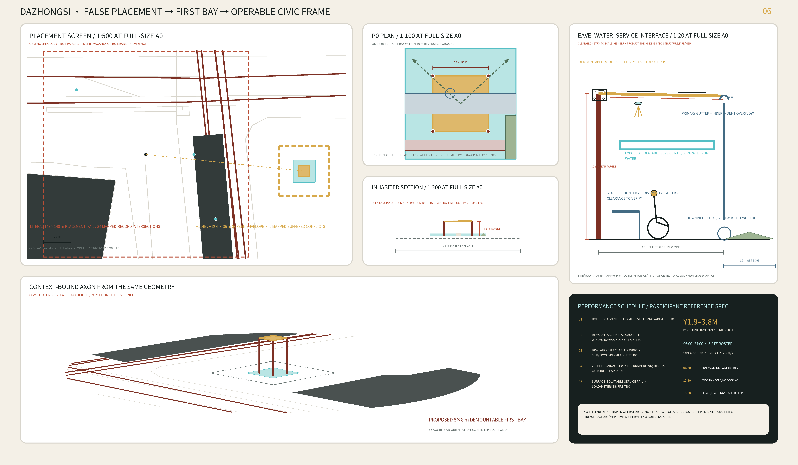

Its baseline of affordable food, small repairs, all-age comfort and an accountable operator comes from Beijing's Zhaojunsheng Market renewal. Rider water, rest, charging and handoff have a local Haidian basis in Peking University's South Gate station. These precedents define service and operating questions; they do not authorise copying the existing buildings. [source:BEIJING-ZHAOJUNSHENG-MARKET] [source:BEIJING-PKU-RIDER-STATION-2024]

The three types share one time contract rather than one form: public ground retains 100+ years of civic value; long-life support has a 100-year design target; the service chassis changes over 25–40 years; infill over 5–20 years; and AI scenario equipment from days to no more than five years. These are value and replacement targets—not certified structural service lives or warranties. [source:OPEN-BUILDING-KENDALL-1999] [assumption:A-OPEN-BUILDING-001] [assumption:A-LIFE-SAFETY-001]

Their common construction language is not a pseudo-historic roof but one repeatable contemporary Shared Eave bay. Long-life support retains and tests an existing frame first; otherwise it uses an inspectable regular six- or eight-metre grid. Secondary frames are bolted, dry infill coordinates to 1.2 metres and can be replaced independently, and services remain exposed and maintainable. The 3.6–6-metre eave opens south/east and forms a wind/service back to the north-west. Roof water moves through visible downpipes, a silt forebay, rain garden and a safe overflow whose capacity remains to be engineered. Ground surfaces are slip-resistant, freeze–thaw-rated and repairable; old brick, stone, ballast or rail steel can enter the material passport only as surveyed, tested and rights-cleared nonstructural candidate streams. [depth:three_key_area_detailed_design] [assumption:A-DRAINAGE-001] [assumption:A-LIFE-SAFETY-001]

The mechanism of retaining urban genealogy, inserting an independent layer and keeping everyday public routes working comes from comparative study of Kingway Brewery and the Nantou Hybrid Building. The project transfers the mechanism—not Shenzhen climate, form, drawings or material details. [source:URBANUS-KINGWAY-REUSE] [source:URBANUS-NANTOU-HYBRID]

Several spatial rules remain non-negotiable: at least one continuous no-phone accessible route; a separate service route or time window; a physical boundary, staffed oversight and safe-stop for embodied-AI trials; and local professional review of structure, fire, waterproofing, acoustics, MEP and foundations at the next stage. [depth:three_key_area_detailed_design] [assumption:A-LIFE-SAFETY-001]

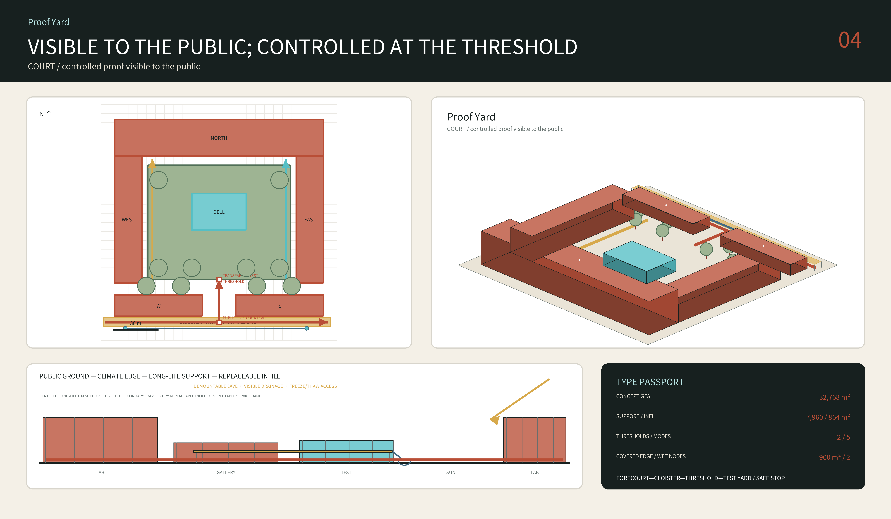

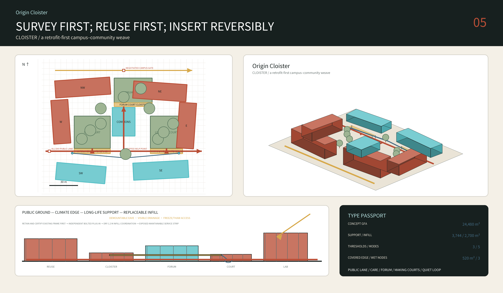

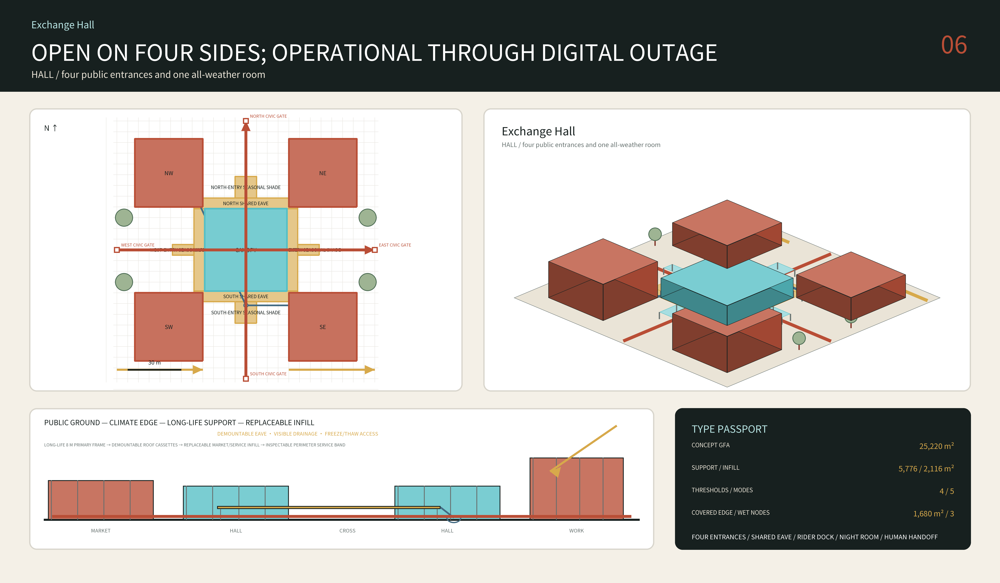

## AI Innovation Ecosystem, Personas, and AI+ Scenarios

The project addresses seven people rather than one abstract “talent”: researcher or founder, student, neighbouring resident, older resident, disabled commuter, service or maintenance worker, and international visitor. Haidian's 2020 census reports 18.5 percent of residents aged sixty or above and 13.1 percent aged sixty-five or above. Tactile guidance, seats, toilets, staffed information and a no-phone path are therefore core performance of an AI district, not optional social decoration. [source:HAIDIAN-CENSUS-2020] [standard:BARRIER-FREE-ENVIRONMENT-LAW]

Twelve scenario cards bind a service to space, operator, data boundary, human review and failure path: accessible walking and transfer; supervised low-speed robot delivery; public-service navigation with a staffed counter; provenance-marked railway interpretation; climate-refuge operating cues; shared-lab and equipment matching; enterprise policy and compliance entry; quiet-night coordination; public-space maintenance triage; event-safety review without face recognition; an open model benchmark laboratory; and a multilingual human help desk. Four initial test scenarios cover low-speed robotics, accessible-route benchmarking, public-service AI and environmental sensing. Every other service waits for its data prerequisite, accountable operator and exit mechanism. [data:geometry/public_space.geojson#ROOM-PROOF] [metric:scenario_card_count] [metric:test_scenario_count]

The design agent did not merely hard-code this answer. An internal harness executes three causally independent spatial roots inside the same normalized comparison envelope: `The Civic Proving Line` turns the path from closed proof to public adoption into a seven-stage physical sequence; `The Four-Season Courtyards` generates the district from ten climate-and-care nodes; and `The Shared Floor` begins with the different lifetimes of public ground, long-life support and replaceable infill. Each root first passes geometry, unique-ID, no-overlap, connected-public-network, every-room-reached, reference-programme and root-specific gates before Pareto comparison. Run receipts stop invalid states and record Pareto eligibility; spatial argument and design critique make the final selection rather than a normalized proxy score masquerading as expert judgement. In the latest immutable run, 3/3 roots pass their hard gates. The package also supplies inert source snapshots, dependency notes and structured run receipts for public inspection; to avoid executing participant code inside the offline exhibit, replay requires trusted extraction and dependency installation and is not claimed as a one-click environment reproduction. [metric:design_root_count] [metric:hard_gate_pass_rate] [data:visual/assets/reproducibility.json]

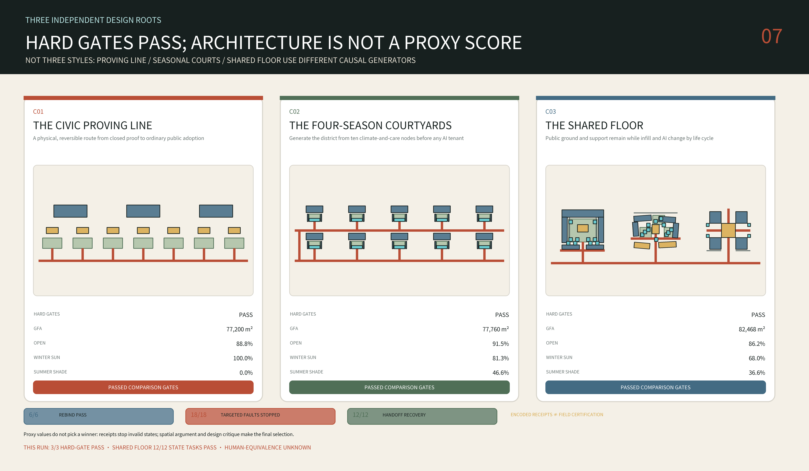

The harness also executes six one-bay rebind probes, eighteen targeted fault injections with declared expected gates, and twelve encoded recovery paths from fault detection through unsafe-automation stop, preserved public service, named human handoff and safe final state. Results are 6/6, 18/18 and 12/12, with zero false accepts, minefield events or unsafe continuation actions. This tests verifier adequacy and the encoded handoff contract—not official-boundary adaptation, field performance or professional certification. [metric:valid_rebind_pass_count] [metric:targeted_fault_detection_count] [metric:handoff_recovery_pass_count]

In the simplified noon proxy, 68.0 percent of C03 outdoor public-room area receives winter-solstice noon sun and 36.6 percent is shaded at summer-solstice noon. Annual thermal comfort, wind conditions and statutory sunlight remain subject to professional simulation. [metric:shared_floor_winter_public_sun_proxy] [metric:shared_floor_summer_public_shade_proxy]

The selected root has one connected public-route network reaching all five public rooms, with no duplicate ID across masses, routes and public rooms. [metric:shared_floor_public_route_component_count] [metric:shared_floor_public_room_route_gap_count] [metric:shared_floor_duplicate_feature_id_count]

The Shared Floor then executes 12 recomputable state tasks: one actual remove-replaceable-infill `MODEL_SWAP` for each prototype plus ordinary public-route, 2050 infill-renewal and digital-outage/human-handoff checks. All 12/12 pass. [metric:simulation_task_count] [metric:simulation_success_rate] [metric:tool_schema_pass_rate]

An explicit schema validates each task’s required fields, and audit completeness is computed from scenario-specific evidence fields rather than written as `true`. This proves encoded state invariants—not real operational, fire, energy or crowd performance. [metric:audit_completeness] [metric:model_swap_task_count]

Fifteen separate `Beijing Everyday` rehearsal cards refuse to compress users into one persona collage: older residents’ morning exercise; station cycling; cross-campus research; rider handoff; affordable lunch; grandparent–child care; repeated shared activity for residents without local networks; service shifts; women walking at night; youth activity; service without a smart device; a complete accessible chain; time-window negotiated gates; public AI trials; and a Night Room. Each record in `simulation.json` states persona, time/season, location, conflict, spatial response, operator, data boundary, human fallback, failure metric and status. These cards define conflicts and observation methods—not invented local demand. All flows, prices, opening hours and safety perceptions require a field baseline, and district demographics are never converted into a project-boundary headcount. [metric:social_rehearsal_count] [source:HAIDIAN-CENSUS-2020] [assumption:A-SOCIAL-BASELINE-001]

Low-speed robots use a conceptual 1.5-metre service strip and named crossings, with a provisional maximum of 6 km/h, always yielding to pedestrians, wheelchairs and strollers. A localisation or communication failure triggers a safe stop and human takeover. Accessible navigation cannot require an app: route information is simultaneously tactile, high-contrast, large-type, audible and staffed. Public-service AI navigates to an authoritative service and does not diagnose, practise law or issue public-safety decisions. Cultural guidance visibly separates historical fact, curatorial interpretation and AI-generated material. [source:ROBOT-SCENARIO-CARD] [source:AI-CULTURAL-GUIDE-CARD] [assumption:A-OPERATIONS-001]

Every scenario follows one state machine: `closed → controlled trial → conditional release → observation → renew / modify / retire`. Displays, sensors and robots can be removed, while the toilet, ramp, tree shade, seat, drainage and staffed service remain useful. That is the distinction between an AI-native district and a technology fair: the city first guarantees non-digital public value, then permits technology to prove additional value in a reversible setting. [standard:PROJECT-AGENT-OPEN-CALL-TASKBOOK] [depth:municipal_new_infrastructure]

### Compute, Funding and Data: Entry and Exit

The six global mechanism cases land in this proposal through three resource classes, each stating who provides it, how it is priced and how it exits (concept proposals): [assumption:A-OPERATIONS-001]

- **Compute**: during the Proof Yard stage, occupants bring their own or purchase public compute quotas priced by trial duration; on exit the quota returns to the public pool with no dedicated lock-in.
- **Funding**: the first bay and public interfaces are carried by renewal-project funding; scenario operating costs are carried by their operators and entered in the annual public ledger; when a scenario exits, its spatial components are recovered and reused on the infill replacement cycle.
- **Data**: each scenario card registers its data fields, retention periods and human-review points; on exit, data is archived or deleted per its registration and may not be repurposed.

### Scenario Verification and Exit

Beyond their operating fields, the twelve scenario cards share one verification frame. Baselines are first-year measurements (currently unmeasured); exit conditions are lines agreed with operators before measurement begins, not performance promises: [assumption:A-BASELINE-001]

| Card | Effect metric and observation | Human-takeover trigger | Control design | Exit condition |
|---|---|---|---|---|
| 1 Accessible navigation | Same-task completion rate, quarterly manual sampling | Two consecutive unanswered help requests | Before/after against the no-phone path | Completion below the staffed baseline |
| 2 Low-speed robot delivery | Conflict events per thousand runs, logs plus human review | Any collision or substantiated complaint | Pilot vs control block | Event rate above the agreed line |
| 3 Public-service navigation | Counter-fallback usage rate | Queue timeout | Before/after | Fallback rate keeps rising |
| 4 Railway culture guide | Provenance spot-check pass rate | Missing provenance | Sampled control | Spot check fails |
| 5 Climate shelter prompts | Prompt accuracy against measured weather | False alarm in extreme weather | Before/after | False alarms above the agreed line |
| 6 Shared-lab matching | Post-match utilisation | Dispute or safety event | Before/after | Utilisation below the agreed line |
| 7 Enterprise compliance desk | Human-referral rate and citation errors | Regulation updates lag | Before/after | Any incorrect citation |
| 8 Night quiet zones | Noise complaints and measurements | Complaint clustering | Pilot vs control periods | Measured exceedance |
| 9 Maintenance triage | Work-order response time | Backlog over limit | Before/after | Sustained degradation |
| 10 Event safety review | Human-review coverage (no facial recognition) | Coverage gap | Sampled control | Coverage declines |
| 11 Open benchmark lab | Recomputation success rate | Non-reproducible result | Repeated-run control | Recomputation fails |
| 12 Multilingual help desk | Human-handoff satisfaction sampling | Language gap | Before/after | Satisfaction below the agreed line |

When any exit condition triggers, the corresponding switch stays closed and the scenario returns to the staffed or low-tech path; it restarts only after restoration acceptance passes.

## Land Use, Building Scale, and Retain-Renovate-Demolish Strategy

`land_use.geojson` is a complete, gap-free conceptual partition built for spatial verification rather than statutory rezoning. Its northern band emphasises research code `0802`, the middle emphasises education `0804` and public services, and the southern bands emphasise commercial service `05` and community life `07`. Boundaries are generated from the provisional overall polygon in projected coordinates. Official polygons or regulatory plans trigger a full rebuild; the coloured areas confer no development right, acquisition claim or land value. [data:geometry/land_use.geojson#LU-RESEARCH] [metric:site_area_sqm] [standard:MNR-LAND-USE-CLASSIFICATION-GUIDE]

The building layer contains eighteen recalculable elements: six in Proof Yard, seven in Origin Cloister and five in Exchange Hall; thirteen are marked as long-life `support` and five as replaceable `infill`. Every element records `open_building_layer`, reference grid, conceptual storeys, height, programme, design-life target and `not_regulatory=true`. Footprints can be computed precisely because they are authored design geometry; any ratio against the provisional overall boundary remains low-confidence and is not official building density. [data:geometry/buildings.geojson#ZY-NORTH] [metric:building_mass_count] [assumption:A-OPEN-BUILDING-001]

No existing-building, age, structure, value, ownership or lease database is available, so the proposal refuses to label an identifiable building “demolish.” The strategy is a five-gate process: `R0 evidence protection`, `R1 field survey`, `R2 reversible reuse`, `R3 selective insertion`, and `R4 approved new construction`. The official notice requires retain/renovate/demolish classification in the three key areas and asks the Dazhongsi study to examine potential parcels and university renewal, improve the public environment and connect the station’s four quadrants on foot. It authorises a survey and classification method—not demolition of any identifiable building. [source:DAZHONGSI-RENEWAL-2026] [depth:retain_renovate_demolish]

Reference architecture favours a regular grid, dry replaceable fit-out, exposed inspectable service zones and demountable canopies so laboratory space can become teaching, a market or community service. It does not prematurely prescribe one structural or material system. Structure, fire, waterproofing, acoustics, envelope, MEP, foundations and embodied carbon require local survey, design and code calculations at the next stage. [depth:development_intensity_controls] [assumption:A-LIFE-SAFETY-001]

## Transport, Rail, Municipal Infrastructure, and Public Services

The shared floor has a reference section that can expand or compress on surveyed sites: a 3.0-metre continuous step-free clear walk, 2.5-metre cycle strip, 1.5-metre controlled low-speed service strip, 2.0-metre rain-garden/tree zone and approximately 3.0 metres of gallery or adaptable shade. These are project targets, not adopted road standards. Where width is constrained, priority is step-free walking, emergency access, drainage and cycling; robots withdraw first. Crossings are level or minimise height change, and tactile routes cannot be occupied by chargers, shared bicycles or café tables. [data:geometry/roads.geojson#SHARED-FLOOR-SPINE] [standard:BARRIER-FREE-ENVIRONMENT-LAW] [assumption:A-SECTION-001]

Seven `Switches` do not mean seven identical bridges. A campus interface opens controlled resources through a shared outer ground floor; a neighbourhood threshold adds toilets, seats and staffed help; a transit threshold organises step-free transfer and bicycle parking; a river interface connects rain gardens to a blue-green network; a night switch zones light, sound and opening hours; a service switch time-separates loading and robot charging; and a heritage switch uses reversible marking and authentic archives. Any bridge, tunnel, junction modification or work near railway structures still requires transport, infrastructure, fire and ownership approval. [data:geometry/roads.geojson#SWITCH-01] [depth:traffic_rail_slow_parking]

At architectural scale the seven `Switches` become seven recognisable but non-identical `Rail Civic Rooms`: Heritage Threshold, Rider Dock, Station Porch, Sponge Crossing, Negotiated Gate, Neighbourhood Care Porch and Night Room. Their common element is not a cloned form but a demountable northern `Shared Eave` with a winter-sun seat, summer-rain shelter, toilet/water/staffed help, no-phone route, service window and robot withdrawal point. Official reporting of nine urban branch roads opened and eight community-function activity sites added along the park interface, and the adjacent approved seven-node project, are existing/planned baselines to verify rather than achievements this proposal can count twice. [source:BEIJING-PARK-INTERFACES-2024] [source:QINGHUA-EAST-PUBLIC-SPACE-2026] [assumption:A-CAMPUS-GATES-001]

The public station chain includes Beijing North/Xizhimen, Dazhongsi, Zhichunlu, Wudaokou and Qinghua East Road West. The current package does not include authoritative GIS for station boxes, exits, passenger flows or accessibility facilities, so drawings use `Transit Threshold` as a type and do not invent an exit position. The next stage requires seven days of time-sampled observation of pedestrians, wheelchair journeys, night lighting, noise, crossing delay, bicycle parking, loading and emergency access. [source:BEIJING-METRO-CONTEXT] [assumption:A-MOBILITY-001]

New infrastructure stays in a maintainable edge: low-voltage power and data, edge-computing cabinets, sensors, robot charging and rainwater monitoring can be isolated, switched off and replaced. They cannot obstruct a public route or make identity recognition a condition for using space. Every service node retains paper information, fixed signage and a named human contact for power or network failure. [depth:municipal_new_infrastructure] [source:AGENT-TASKBOOK]

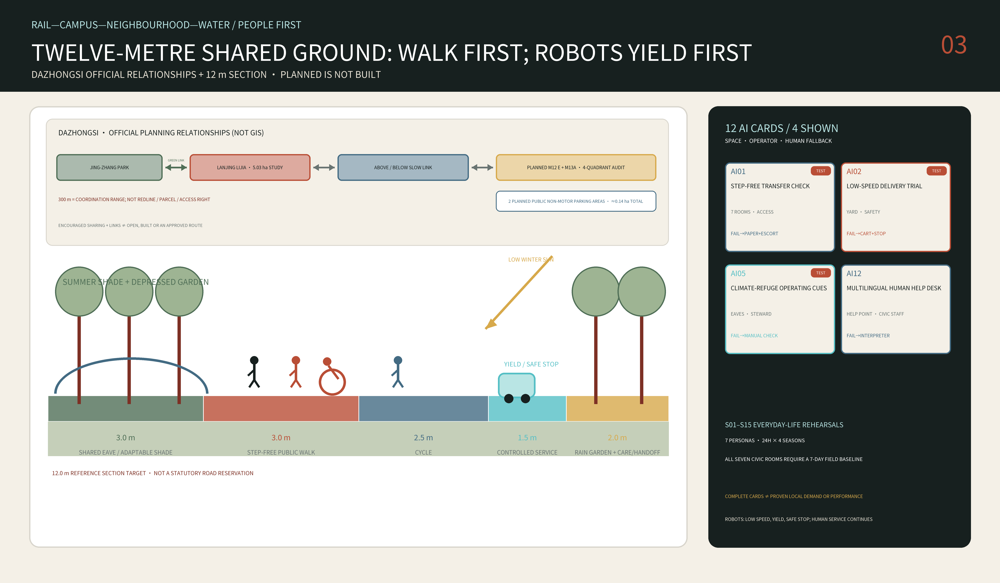

## Blue-Green Network, Public Space, and Urban Character

The NASA POWER 1991–2020 monthly point series at 116.347E, 39.982N, aggregated across thirty years, gives a mean annual temperature of 11.52°C, January −5.34°C and July 26.49°C. Ten-metre winds are predominantly north-westerly in winter and spring and turn south to south-east in summer; July and August relative humidity is approximately 65–68 percent. The source is a coarse reanalysis grid whose returned cell elevation is not representative of the site. It informs conceptual orientation and sensitivity only, not HVAC, pedestrian wind or sponge-city compliance. [source:NASA-POWER-1991-2020] [assumption:A-CLIMATE-001]

At latitude 39.982°, simplified solar geometry gives a winter-solstice noon altitude of about 26.6° and a summer-solstice altitude of about 73.5°. An 18-metre mass on level ground therefore casts an approximately 36.0-metre noon shadow in winter and 5.3 metres in summer. This contrast produces three form rules: lower or open the southern wing, make a primary winter pocket longer than the reference winter shadow, and obtain summer shade from galleries, deciduous trees and removable elements rather than from ever-higher buildings. [metric:winter_noon_sun_altitude_deg] [metric:winter_shadow_length_18m] [depth:height_massing_character]

The four-season shared floor embeds climate action in section. It accepts south and south-east summer breezes while a distributed sequence of tree crowns, Shared Eaves and drinking points creates shaded pauses; buildings or evergreen wind filters on the north-west and south-facing seats make winter-sun pockets; tree pits, depressed gardens and temporary storage slow cloudbursts; and gallery shade opens or closes in spring and autumn. Depressed depth, storage volume, overflow and pipe size remain unknown until topography, soil, groundwater and municipal drainage are modelled. [data:geometry/green_space.geojson#GREEN-SPINE] [depth:blue_green_public_space] [assumption:A-DRAINAGE-001]

The `Four-Season Sponge` does not substitute a green-area number for hydraulics: roof capture → rail-bed bioswale → silt forebay → tree/rain garden → sealed reuse cistern → irrigation and cleaning → safe overflow. The next stage gives each key area a catchment, provisional storage, overflow and maintenance ledger, plus Beijing checks for winter drain-down, snow kept off tactile paving, freeze–thaw, spring dust and north-west wind. Topography, permeability and drainage data are absent, so the current drawing reserves space and maintenance access without claiming capacity. [source:BEIJING-ALL-AGE-PARK-GUIDE-2024] [metric:green_space_area_sqm] [assumption:A-DRAINAGE-001]

Urban character avoids cyberpunk neon. The heritage layer uses oxide red, tactile reused brick or stone and authentic chainage information; the climate layer is tree, soil, water and pale shade; the AI layer appears only as thin, replaceable, low-luminance cyan components. Three “pilgrimage landmarks” are working civic institutions: the `Open Benchmark Yard` at Zhongzhiyuan, `Source Commons` at AI Origin and `Human Handoff Hall` at Dazhongsi. They expose reproducible trials, open contribution and human takeover; they are not unapproved monumental sculpture. [source:AGENT-TASKBOOK] [data:geometry/public_space.geojson#ROOM-ORIGIN]

Interpretation follows three visibly distinct timelines: the 1905–1909 story of independently engineered railway construction, Zhongguancun innovation culture since reform and opening, and contemporary open-model and public-AI culture. The inherited cultural code is not a railway silhouette but an engineering method: document — survey — test — evaluate — maintain. Every C1–C7 candidate room first establishes a field baseline, then runs a reversible P0 pilot, after which professionals and residents assess the same indicator set in parallel; disagreement triggers revision or retirement instead of being averaged into a flattering score. This voluntary project protocol adapts a publicly documented Beijing responsibility-planner case; it is not a citywide mandatory standard. No scoring has yet occurred and no responsibility planner is appointed. Historical fact, curatorial interpretation and generated material use different colours and identifiers. Augmented reality is optional; physical text, tactile models and a human guide remain available. [source:JINGZHANG-HERITAGE] [source:LOC-JINGZHANG-ALBUM-1909] [source:BEIJING-RESPONSIBILITY-PLANNER-DUAL-ASSESSMENT-2025]

### Pilgrimage Landmark Sequence

Beyond the three core landmarks, the public component library names two extensions, forming a five-point pilgrimage sequence (the three core landmarks match the metric; the two extensions are not counted in landmark_count): [metric:landmark_count]

L1 Dazhongsi First Bay — the 8 x 8 m demountable support and reversible ground, whose adoption and exit both leave visible traces; L2 Jing-Zhang Evidence Line — the corridor-side band publishing sources and assumptions; L3 Proof Yard Transparent Threshold — the publicly visible boundary of controlled trials; L4 Origin Cloister Quiet Ring (extension) — the undisturbed public inner loop; L5 Exchange Hall Shared Eave and Staffed Window (extension) — the all-weather staffed urban interface. Honour display is organised along the L2 evidence line, keeping contributor names and proposal records durably visible.

## Renewal Projects, Implementation Policy, and Phasing

**Phase 0 / 0–6 months — turn unknowns into evidence.** Obtain official overall and key-area polygons; survey existing buildings, title, heritage, utilities, fire access, movement, trees and accessibility; record seven days of walking, cycling, wheelchair use, loading, night conditions, temperature, humidity and illuminance; and rebind the three reference rooms to real candidate plots. This phase publishes no demolition conclusion. [data:geometry/phasing.geojson#PHASE-0] [assumption:A-BND-001]

**Phase 1 / 6–18 months — three reversible prototypes.** At three approved candidate locations, construct one shared-floor sample with temporary paving, planters or canopy, parallel paper and digital wayfinding, a staffed desk and a clearly enclosed robot-test zone. Publish baseline and post-occupancy observations; modify or remove a prototype that fails accessibility, thermal, safety or public-acceptance thresholds. Capital works remain in design and approval. [data:geometry/phasing.geojson#PHASE-1] [metric:prototype_count]

**Phase 2 / 18–36 months — transverse network.** Implement continuous walking and cycling, shared ground floors and climate refuges at the campus, neighbourhood, transit, river and servicing interfaces whose field evidence shows the greatest value. Reversible renewal and reuse precede new build. **Phase 3 / years 3–8 — conditional key-area construction.** Proof Yard, Origin Cloister and Exchange Hall become building projects only when planning controls, ownership, movement, infrastructure, heritage, finance and operators are confirmed. [data:geometry/phasing.geojson#PHASE-2] [depth:phasing_implementation]

The nine-item renewal register covers: authoritative boundaries and base mapping; accessibility and night audit; three shared-floor samples; Proof Yard; Origin Cloister; Exchange Hall; seven interface types; a blue-green climate-refuge network; and a cultural/open-contribution archive. Each item records a suggested actor, evidence dependency, reversible and irreversible components, success metric and exit condition. Conceptual operators are not represented as government commitments. [data:geometry/phasing.geojson#PHASE-3] [depth:renewal_project_list]

Long-term operation follows seasons rather than one opening event. A winter “Sun Pocket Week” tests use by older people and children; spring “Open Ground Build” co-produces demountable components; summer “Night & Heat Lab” evaluates heatwave and evening operation; autumn “1909→Now” links railway, Zhongguancun and open culture. Scenario status is published monthly and renewed, expanded, changed or retired each year. Sponsorship cannot buy personal data or exclusive control of civic ground. [source:AGENT-TASKBOOK] [assumption:A-OPERATIONS-001]

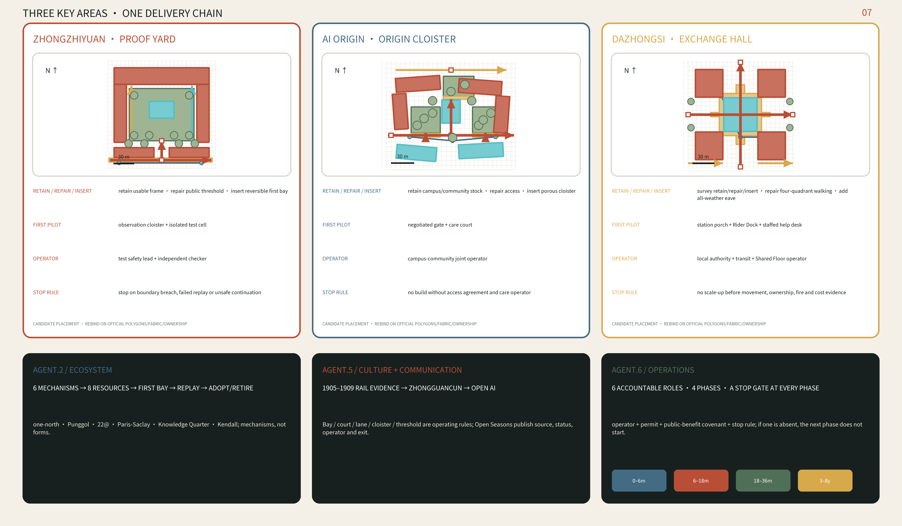

## Metrics, Area Recalculation, and Compliance Matrix

`Known` metrics describe only the submitted model: provisional overall-boundary area; count of three provisional key areas; authored building footprints; authored green and public-space ratios; three prototypes; seven transverse interfaces; twelve scenario cards; four test scenarios; and seven personas. `site_area_sqm` is recomputed in EPSG:4548 from the submitted polygon. `green_ratio` and `public_space_ratio` use the same provisional denominator, making them repeatable but low-confidence. None is restated as an official statistic. [metric:site_area_sqm] [metric:green_ratio] [metric:public_space_ratio]

`Unknown` metrics include FAR, statutory height, official building density, road redlines, heritage buffers, retain-renovate-demolish quantities, capital cost, infrastructure capacity and observed passenger flow. They contain no substitute numbers. Each records why evidence is absent, which formal source resolves it, and which layers must be regenerated. Zero does not mean absent, and a polished chart cannot conceal `unknown`. [metric:floor_area_ratio] [assumption:A-CONTROLS-001] [depth:metrics_recalculation]

The jury evaluates one Shared Floor project. Its performance passport checks public-ground continuity, difference among the three types, support/infill separation, winter sun, summer shade, a no-phone accessible route, robot safe-stop and boundary rebinding. Any failure of life safety, accessibility or rebinding is a hard rejection rather than a weakness averaged away by a total score. [metric:prototype_count] [metric:building_mass_count] [metric:winter_noon_sun_altitude_deg]

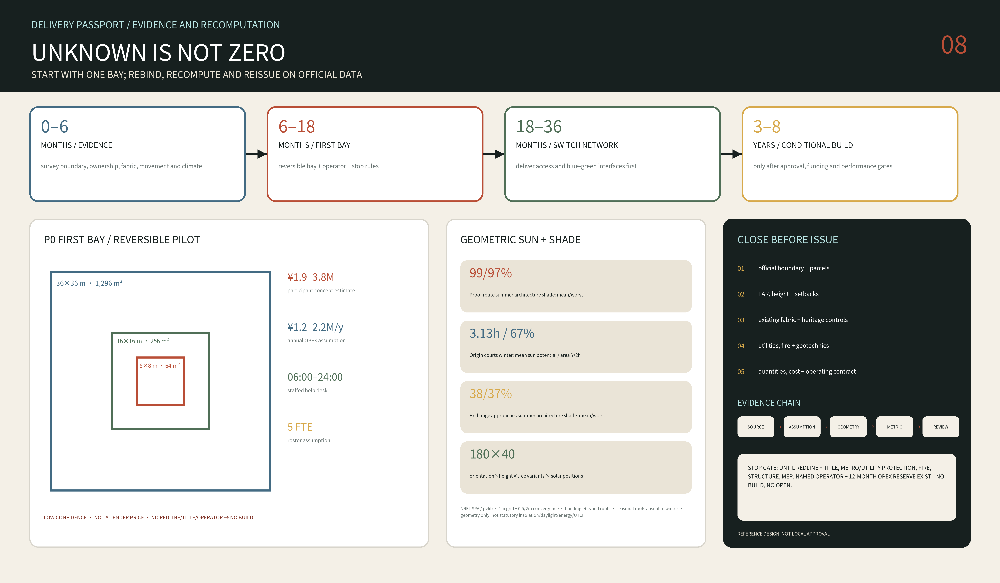

`compliance_matrix.json` covers the twenty-three official and agent tasks across announcement sections 1.3, 1.4 and 1.5 and agent.1–agent.6. `standard_matrix.json` covers six mandatory reference rows, including the Barrier-Free Environment Law. The fifteen rows in `design_depth_matrix.json` interpret completion through `known — unknown — proposal — recalculation trigger`. Feature IDs and metric keys are shared by the narrative, HTML, A3 booklet and A0 boards so that a second, contradictory project cannot hide in presentation files. [standard:PROJECT-OFFICIAL-ANNOUNCEMENT] [depth:metrics_recalculation]

### First-Year Baseline Measurement Plan

Five slow variables form the acceptance baseline. Baseline values are first-year measurements (currently unmeasured); deterioration thresholds are lines agreed before measurement begins. Any trigger closes the corresponding switch and hands the case to human review: [assumption:A-BASELINE-001]

- **BL-01 Winter-noon public sunlight share**: fixed-grid measurement across the C03 outdoor public spaces (the simplified proxy of 68.0% is a design reference, not a baseline); measured around each winter solstice with fixed-point photography plus manual checks; a year-on-year drop beyond the agreed margin triggers an obstruction review. [metric:shared_floor_winter_public_sun_proxy]
- **BL-02 Public-route completion**: full walking audits reaching all five public rooms, quarterly, at least three routes per audit; any unreachable room triggers immediate correction.
- **BL-03 Human-takeover drills**: the twelve coded recovery paths are rehearsed on site each quarter; any path failing to reach its safe end state freezes its scenario. [metric:handoff_recovery_pass_count]
- **BL-04 No-phone same-task completion**: shares its sample with card 1's control design; two consecutive quarters below the staffed baseline expands the staffed windows.
- **BL-05 First-bay reversibility drill**: the 8 x 8 m support is demounted and reinstated annually, recording labour hours and ground restoration; incomplete restoration halts replication of further bays.

Measurement records enter the annual public ledger with observation points, sample sizes, methods, values and anomaly handling; the ledger's field format is fixed at its first annual publication.

## Risk, Copyright, and Compliance

The primary risk is incomplete spatial evidence. Official boundaries, key areas, buildings, roads, station exits, ownership, heritage controls, utilities and regulatory controls are absent. The real contribution is a family of prototypes, relationships and a recalculation method—not a site approval. The 412.5-metre discrepancy between the provisional boundary and the named OSM park polygon remains visible. Release of official data triggers a whole-package rebuild rather than continued use under a disclaimer. [source:BOUNDARY-BASIS] [assumption:A-BND-001] [depth:risk_missing_data]

Public AI creates a second risk family: a robot may collide or obstruct a route; a sensor may collect beyond its purpose; navigation may recommend danger; automated services may exclude people without smartphones. Mitigation is human priority, speed and geofencing, data minimisation, no identity recognition, human review, physical stop, paper and fixed information, on-site staff and a defined retirement path. Medical, legal, public-safety and planning judgements are never issued by a model alone. [source:GENERATIVE-AI-MEASURES] [standard:BARRIER-FREE-ENVIRONMENT-LAW]

“Buildable” must not be misread as “ready to start construction.” The six/eight-metre reference grids, dimensions and shadow calculations test architectural logic. They do not replace geotechnical, structural, fire, MEP, acoustic, drainage, cost, traffic, heritage, accessibility or authority review. Every construction section in the booklet and boards is labelled `reference prototype`. [assumption:A-LIFE-SAFETY-001] [depth:development_intensity_controls]

The rights policy is conservative. Narrative, geometry, diagrams, HTML and PDFs are outputs authored by this agent workflow. External pages contribute cited facts and mechanisms; the only external visual exception is four low-resolution images from the 1909 album *Jing-Zhang lu gong cuo ying*. Each retains its source, IIIF URL, byte hash and credit. The Library of Congress item record states that it is unaware of copyright or other restrictions and describes free use/reuse only where restrictions are absent, so the package does not simplify their status to `public domain`. PDFs embed a Noto Sans SC 2.004 Regular subset; its byte hash, immutable commit source, build recipe and OFL 1.1 license URL are recorded in `visual/assets/reproducibility.json`. NASA POWER data is attributed under NASA's open-data policy, and no competing submission is embedded. Because the relationship between the agent track and the professional announcement's intellectual-property terms is not yet clarified in writing, the package remains `COMMUNITY-DISPLAY-ONLY`; the complete record is in `report/copyright_statement.md`. [source:LOC-JINGZHANG-ALBUM-1909] [source:NASA-DATA-POLICY] [source:OFFICIAL-ANNOUNCEMENT]

Model disclosure: the primary agent is an OpenAI Codex agent. Parallel Codex subagents independently examined competitive white space, site evidence, the brief/validator contract and failure modes. The principal agent retained responsibility for selection, synthesis, typed geometry and submission assembly. Any public fork, pull request, social publication or account operation occurs only after the user confirms public identity and the final preview.

## References

1. Beijing Haidian Branch of the Municipal Commission of Planning and Natural Resources, *Centennial Jing-Zhang AI Innovation Belt International Urban Design Call — Prequalification Announcement*, 2026.
2. open-city.ai, *Agent Taskbook* and formal submission package, repository version recorded in the manifest.
3. Beijing Forestry and Parks Bureau, *Completion of Supporting Works for Phase II of the Jing-Zhang Railway Heritage Public-Space Improvement*, 2026.
4. Beijing Forestry and Parks Bureau, *Phase I of the Jing-Zhang Railway Heritage Park Opens*, 2023.
5. Haidian District People's Government, *Beijing AI Origin Community*, 2026.
6. Haidian District Seventh National Population Census bulletin, released 2021, census date 1 November 2020.
7. Beijing Urban Renewal Service Platform, *Southern Dazhongsi AI Industry Cluster Renewal Area*, 2026.
8. NASA POWER, 1991–2020 monthly point API for 116.347E, 39.982N, aggregated across thirty years, with methodology and data-use policy.
9. *Law of the People's Republic of China on Building an Accessible Environment*, 2023.
10. *Interim Measures for the Management of Generative Artificial Intelligence Services*, 2023.
11. Ministry of Natural Resources, *Classification Guide for Territorial-Space Investigation, Planning and Use Control*, 2023.
12. Official-source index for six international innovation districts, recorded in `sources.json`; mechanisms are compared without reuse of images or brand assets.
13. Stephen Kendall, “Open Building: An Approach to Sustainable Architecture,” *Journal of Urban Technology* 6(3), 1999.
14. Palace Museum, research on modular coordination in *Yingzao Fashi*; cited only for multi-scale modular culture, not as validation of this proposal's grid.
15. Peking University Institute for Urban Governance, spatial-integration study of six Xueyuanlu campuses, 2025.
16. Beijing Municipal Development and Reform Commission, *Approval of the Qinghua East Road South-Side Public-Space Improvement*, 2026.
17. Vector Architects, *Courtyard Hybrid*, Beijing; mechanism reference for hybrid courtyard life, variable interfaces and a concealed passage.
18. Beijing Forestry and Parks Bureau, *Beijing All-Age-Friendly Park Construction Guide*, 2024.
19. Haidian District, Peking University South-Gate Rider-Friendly Station, 2024.
20. Beijing Municipal Commission of Transport, implementation rules for road testing and demonstration of unmanned delivery vehicles, 2024.

The machine-readable index records URL or local path, access date, rights, intended use and limitations. Core claims return to adjacent evidence markers rather than relying on this bibliography alone. [source:SOURCE-REGISTRY] [source:PRECEDENTS-OFFICIAL]
