# 京张共地 / THE SHARED FLOOR

> **换模型，不换城市 / REPLACE THE MODEL, NOT THE CITY.** 京张共地是一份跨时间尺度的城市契约：公共地面和长期支撑留下，服务底盘、可换填充与 AI 设备按各自寿命更新。一层共地、七条转换街、三座长期框架、四季公共生活——AI 是可撤回的城市能力，不是城市的主人。

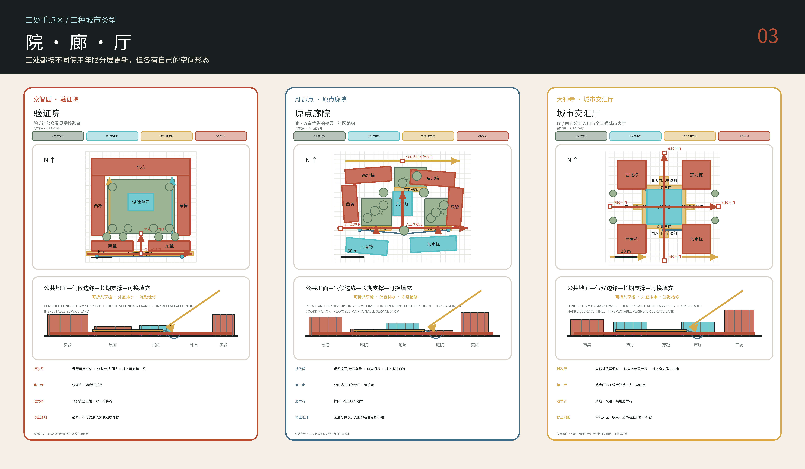

## 设计依据与资料清单

本方案先做了一个反常识判断：京张铁路遗址公园的主轴不是等待设计的空白。北京市园林绿化局在 2026 年 7 月宣布二期配套完工，北段约 30.01 公顷，并明确其“鱼骨状”慢行网络；一期清华东路至知春路段早在 2023 年已开放，长 2.5 公里、16.8 公顷。因此竞赛最有价值的任务不是再画一条南北绿带，而是把既有公共空间接入东西两侧的校园、社区、地铁、产业与河流，补足门槛、入口、路口和日夜运营。[source:BEIJING-PARK-PHASE-II] [source:BEIJING-PARK-PHASE-I]

证据按可靠程度分为五类：官方资料（`official`）、背景资料（`background`）、待核实的临时资料（`provisional`）、本方案提出且可重新计算的设计建议（`design`），以及目前没有可靠资料、必须留空的未知项（`unknown`）。仓库中的总体设计范围和三处重点区只是临时粗略边界。背景核对发现，已命名的 OpenStreetMap（OSM）公园范围与临时总体范围重叠率为 0%，最近相距 412.5 米。现有资料不足以判断哪一方准确，因此本方案不自行移动边界，而要求正式边界公布后重新调整图纸并计算指标。[source:BOUNDARY-BASIS] [data:geometry/site_boundary.geojson#SITE-001] [depth:risk_missing_data]

本次提交使用公告给出的 43.6 平方公里统筹研究范围、11.4 平方公里总体设计范围和三处共 368.4 公顷重点区作为规模口径；任何地块、道路红线、容积率、高度、权属、拆改留和文保缓冲结论都保持 `unknown`，直到官方附件补齐。除四幅单独署名、固定哈希并保留来源权利状态的 1909 年京张工程档案缩略图外，外部研究只引用文字事实和开放数据，不复制政府网页图像、商业地图或其他参赛者图面。来源类型、URL 或本地路径、获取日、权利、用途与局限见 `sources.json`。[source:OFFICIAL-ANNOUNCEMENT] [source:SOURCE-REGISTRY] [source:LOC-JINGZHANG-ALBUM-1909]

本次智能体工作流程没有开展现场踏勘、获授权的居民访谈或问卷调查，也没有替任何本地机构作出承诺。因此十五种日常生活情景只用于规定“下一步要观察什么、由谁负责、什么情况必须停止”，不被当作已发生的需求或绩效。人流、夜间安全、价格承受力、开放时段、运营者与接受度必须在实施前通过现场观察、伴随路线和正式访谈建立基线。[assumption:A-SOCIAL-BASELINE-001] [depth:risk_missing_data]

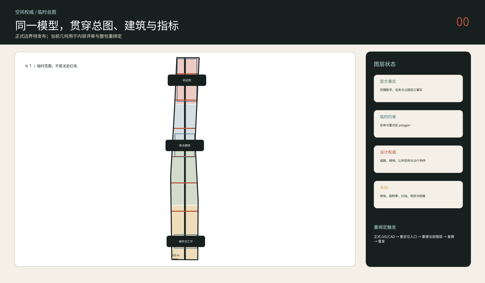

## 三层范围工作框架

在 43.6 平方公里统筹研究范围内，方案组织的是一条创新代谢链，而不是一条用地色带：高校与研究机构产生知识，众智园承担受控验证，AI 原点承担从 0 到 1 的转译和人才生活，大钟寺承担面向公众与市场的采用，真实运营结果再返回研究端。这个回路把公告要求的三大定位、五大功能和“三区两翼”转化为 `研究—转译—验证—采用—反馈` 五个可观察动作。[source:AGENT-TASKBOOK] [standard:PROJECT-AGENT-OPEN-CALL-TASKBOOK]

在 11.4 平方公里总体设计范围内，方案只提出可重新绑定的空间语法：一条既有遗产公共底板、七类横向 `Switch` 接口、三座重点城市房间和一组四季气候庇护点。七类接口分别服务校园边界、社区入口、轨道换乘、河流绿网、夜间安静转换、后勤装卸和遗产解说；提交几何中的七条线是临时边界内的概念性测试位置，不是道路中心线或建设承诺。[data:geometry/roads.geojson#SWITCH-01] [depth:overall_spatial_structure] [assumption:A-BND-001]

在三处重点区域内，设计进一步落到 6 米结构网格、建筑进深、院落尺度、首层界面、遮荫构件、雨水花园、服务带和人工值守点。每个原型暂放在临时重点区中心附近，仅用于核对尺寸和空间关系，不代表真实地块已选定。正式边界图公布后，先核实入口和边界，再按新边界重新绘制建筑、道路、绿地、公共空间和分期，并重新计算全部指标；不能只把旧图缩放后继续使用。[data:geometry/key_areas.geojson#PROV-KEY-001] [metric:prototype_count] [depth:three_level_scope_framework]

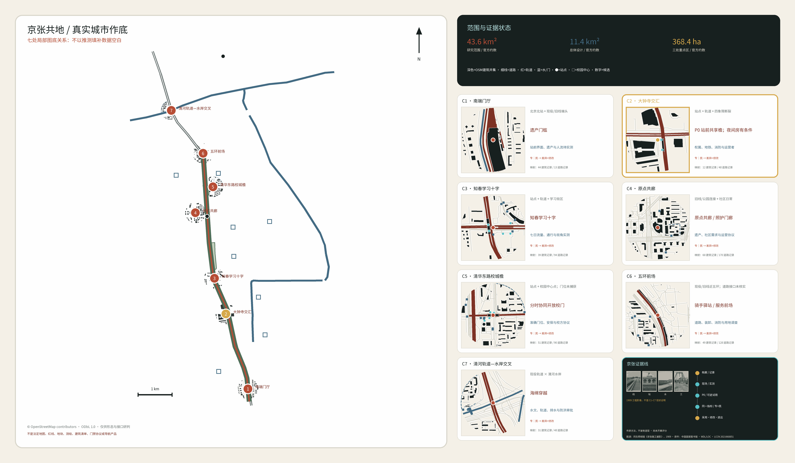

走廊图以带 ODbL 署名的 OSM 轨道、水系、公园、站点和校园中心点构成总体定位，再以七个 300 米局部窗口重绘建筑并集、道路、轨道、水系、教育边界与已映射门点；数据空白保持空白，不被补画成城市，某要素未出现在 extract 中也不证明其现场不存在。三处重点区仅为文字标签锚点，七座城市房间是等待实测地址和运营协议的设计候选，不得用作红线、地块、建筑清单、测绘、门禁协议、导航、审批或建设依据。[source:OSM-CORRIDOR-CONTEXT-2026] [source:OSM-SEVEN-ROOM-FIGURE-GROUND-2026] [assumption:A-MOBILITY-001]

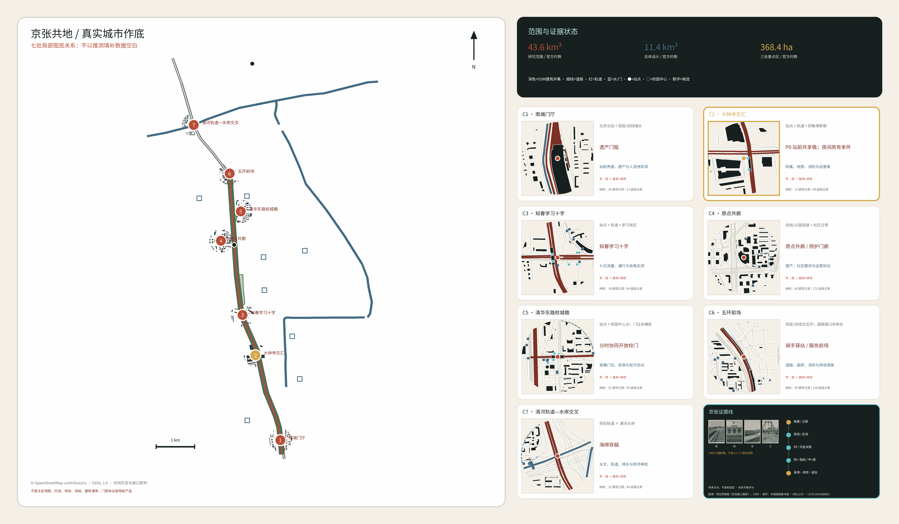

上图是参赛者的空间假设层，不是现状底图：它把同一套共地语法组织成可审计、可整体重绑定的研究模型；正式边界、权属、管线与审批资料到位后，所有位置和数量必须重新计算。[data:PROV-SITE-001] [metric:binding_offset_m]

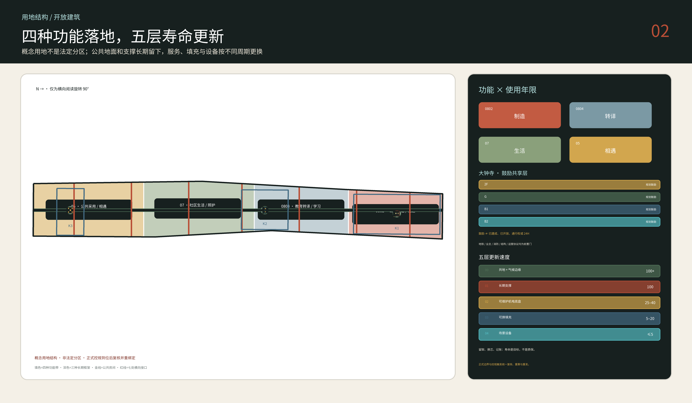

## 统筹研究范围产业与未来城市研究

方案名称“京张共地”把品牌的重心放在公共地面而非科技装置。标志由一条未封闭的方形“城市房间”和一条穿过它的横线组成：方形代表可进入、可停留的共同空间，横线代表京张遗产和横向缝合，开口代表任何 AI 服务都必须保留人工入口与退出路径。主色为铁路氧化铁红、树荫绿、纸本米白和低饱和青色；不使用企业商标、人物肖像或仿制铁路徽记。[source:AGENT-TASKBOOK] [depth:height_massing_character]

六个国际案例被拆成“可转移机制”，而不是风格拼贴：新加坡 one-north 的工作—生活—学习混合和公共空间运营；Punggol Digital District 的大学—产业—区域能源协同；Barcelona 22@ 的存量工业区再利用；Paris-Saclay 的多机构网络和公共交通依赖；London Knowledge Quarter 在既有城市中连接机构而非圈地建园；Cambridge Kendall Square 以公共空间和创新就业共同进入规划谈判。它们共同提醒海淀：创新密度不能只由办公面积表示，网络必须穿过日常生活；同时，品牌化、昂贵基础设施和地产增值若没有住房、公共服务与长期运营，会反过来排除需要的人。[source:PRECEDENTS-OFFICIAL] [standard:MOHURD-URBAN-DESIGN-MEASURES]

本方案把产业空间分成四类，可按需要组合：试验制造（实验、样机和查找系统漏洞的安全测试）、成果转化（知识产权、融资、标准和孵化）、生活配套（住房、托育、运动、餐饮和夜间学习）、公共交流（展览、市场、论坛和人工服务）。这些只是建筑和首层的使用建议，不是新的法定用地分类；国土空间用地仍使用任务包允许的代码，并明确标为概念分区。[data:geometry/land_use.geojson#LU-RESEARCH] [standard:MNR-LAND-USE-CLASSIFICATION-GUIDE]

海淀官方材料称 AI 原点社区约 3 平方公里范围内聚集 30 多所高校和科研机构、1000 余名 AI 科学家、1.3 万名开发者、10 万名相关专业学生，并已有 4000 多套人才公寓。这个密度不是继续围墙化的理由，而是把校园边界外侧做成可共享的实验、展示、餐饮、服务和晚间学习空间的依据。[source:AI-ORIGIN-2026] [depth:existing_conditions_diagnosis]

这里的中国特定性首先是制度与日常生活的叠合：校园/单位、封闭小区、车站、遗址公园和服务劳动共同塑造城市。北京大学对学院路六个校园的研究表明，从完全封闭转向有限开放主要通道已经带来最大的空间整合增益，全面开放的追加效果小得多；因此方案采用有运营者、有时段、有紧急规则的“分时协同开放校门”，而不是拆掉所有围墙。清华东路南侧已获批的七节点公共空间项目则被视为必须衔接、不得冒领或重复建设的邻接工程。[source:PKU-XUEYUANLU-CAMPUS-2025] [source:QINGHUA-EAST-PUBLIC-SPACE-2026]

## 总体设计范围城市更新与控规深度城市设计

总体结构概括为“一层共地、七类横向连接、三处重点空间”。“一层共地”指已建公园和与之相连的公共地面；“七类横向连接”针对校园、社区、车站、河流等不同条件；“三处重点空间”分别在众智园、AI 原点和大钟寺检验一种建筑与公共空间的关系。临时边界的矩形边不是街道，概念建筑也不是现状建筑，七个测试位置更不是最终工程点位。[data:geometry/site_boundary.geojson#SITE-001] [data:geometry/public_space.geojson#ROOM-PROOF] [depth:overall_spatial_structure]

用地层采用四个无缝概念分区，只表达总体功能重心：研究验证、教育转译、公共商业采用与社区生活；真实现状和法定用途待官方地籍与控规补齐。建筑层只有三组参考原型，均带 `reference_prototype=true`、概念层数与 `not_regulatory` 说明。道路层只画步行、骑行、站点接驳与横向公共接口，既有主干路和地铁结构没有数据就不伪造。绿地与公共空间层可独立复算，分期层则把调查、临时原型、网络连接和资本更新分开。[data:geometry/land_use.geojson#LU-RESEARCH] [data:geometry/buildings.geojson#ZY-NORTH] [metric:building_footprint_area_sqm]

方案只对外提交一个优选深化的城市世界：京张共地。生成阶段的两个其他空间根在后文只作为已执行比较的紧凑过程证据公开，不是并列终稿。最终形态必须同时满足：公共路线形成一张连通网络并到达每个公共空间；所有空间 ID 唯一；南侧保留冬日太阳；夏季阴影达到根级门槛；长期支撑与可换填充分离；官方边界到位后可以整体重绑定。三座框架共享这些规则，却分别形成院、廊、厅三种空间秩序。[source:OPEN-BUILDING-KENDALL-1999] [metric:prototype_count] [assumption:A-OPEN-BUILDING-001]

京张共地不继承传统建筑的轮廓，而继承一组可工作的营造规则：以“间”理解可维护的现代模数，以“院”承载共同生活，以“巷”保持横向渗透，以“廊/灰空间”调节四季，以“门—廊—院”的连续门槛表达公共、协商与受控权利。6 米和 8 米柱网只是当代结构选择，不声称源自《营造法式》；任何“借景”也必须等现场照片、坐标和视线验证后才能成立。[source:PALACE-MUSEUM-YINGZAO-MODULE] [source:VECTOR-COURTYARD-HYBRID] [depth:overall_spatial_structure]

控制性详细规划所需要的 FAR、建筑密度、法定高度、退线、道路红线、消防、市政容量和公共设施指标均未在公开包中给出。方案把这些项目完成为“待确认条件—触发资料—受影响成果”的清单，而不是用虚构数字填满表格。形式完整不等于法定有效；设计可以进入内容评审，实施仍需本地规划、建筑、交通、消防、结构、机电、文保和无障碍专业复核。[standard:MOHURD-CONTROL-DETAILED-PLANNING] [metric:floor_area_ratio] [assumption:A-CONTROLS-001]

## 重点区域详细设计

**众智园：验证院 / Proof Yard（COURT）。** 156×156 米参考框以 6 米网格组织长期支撑：北侧高跨验证楼、两条实验/服务翼、分开的低矮公众观察廊，以及院心一座可替换具身 AI 测试单元。进入序列是“前院 → 观察廊 → 透明门槛 → 受控试验院”，南缘同时提供冬日太阳口袋与夏季阴影等待区；公共、机器人与后勤路线不交叉。失联即停、人工接管。它是一台公众可以观察、但不会误入的城市仪器。[data:geometry/buildings.geojson#ZY-NORTH] [data:geometry/buildings.geojson#ZY-TEST-CELL] [data:geometry/public_space.geojson#ROOM-PROOF]

**北京 AI 原点：原点廊院 / Origin Cloister（CLOISTER）。** 172×140 米参考框采用 6 米网格，但拒绝完整封闭的大院：一条全天开放的公共巷依次经过照护院、讲学庭、试作院和安静环，把校园侧的共享实验连接到社区侧的托育、餐饮、运动、夜间学习与人工服务。早晨服务老人慢行与晨练，下午支持祖辈—儿童照护，晚上转为邻里长桌和学习；连续廊檐同时处理雨、夏季辐射与冬季避风。它遵循“先调查、优先再利用、再可逆插入”，不把任何现状建筑预先写成可拆对象。[data:geometry/buildings.geojson#AO-NW] [data:geometry/buildings.geojson#AO-COMMONS] [source:AI-ORIGIN-2026] [assumption:A-PROTOTYPE-001]

**大钟寺：城市交汇厅 / Exchange Hall（HALL）。** 148×148 米参考框由四个 38×38 米角部支撑体、四向公共十字和一座 46×46 米可替换全天候大厅组成；较大跨度部分采用 8 米参考网格。四座城市门先进入 4–6 米深的共享檐，再汇入即使侧翼关闭仍可穿越的市厅；南侧两条装卸支线止于角部服务体，不穿越公共十字。便宜日常餐食、修理、骑手驿站、企业服务、论坛、夜间等候和人工接管共享首层，部分座位无需消费。数字系统停机时，市厅仍依靠固定标识、纸本信息、照明和现场人员工作。[data:geometry/buildings.geojson#DZ-NE] [data:geometry/buildings.geojson#DZ-CANOPY] [data:geometry/public_space.geojson#ROOM-EXCHANGE]

官方材料要求先分清四个不能互换的范围：72.0 公顷竞赛重点区、约 5.03 公顷蓝景丽家规划研究、39,522.11 平方米供地包，以及车站周边 300 米站城协同范围。300 米是协调范围，不是地块、红线、通行权或普遍建设许可；供地包也不授权本方案的 P0 落位。[source:BEIJING-STATION-CITY-INTEGRATION-2024] [source:DAZHONGSI-LANJINGLIJIA-INTEGRATION-2026] [source:DAZHONGSI-LANJINGLIJIA-LAND-SALE-2025]

蓝景丽家方案把 B2、B1、地面和 2F 列为“鼓励共享层”，不等于这些楼层已经开放、形成公共地役权或可以 24 小时通行；M12 大钟寺站 E 出入口东西两侧的两处公共非机动车停车场合计约 0.14 公顷，属于规划要求，未核实建成。[source:DAZHONGSI-LANJINGLIJIA-INTEGRATION-2026] [source:DAZHONGSI-LANJINGLIJIA-BIKE-2025]

最终供地审查还要求绿地与京张铁路遗址公园互渗，并研究以高架连廊或地下通道连接车站；文件同时记录项目邻近全国重点文物保护单位觉生寺。因此本方案只画关系，不猜具体线路或文保缓冲线，正式保护范围、建控地带和主管部门意见到位后再套核。[source:DAZHONGSI-LANJINGLIJIA-LAND-REVIEW-2025] [source:JUESHENG-TEMPLE-NATIONAL-HERITAGE]

其“便宜餐食—小修小补—多年龄舒适—运营者负责”的基线来自北京兆君盛菜市场更新；骑手饮水、休息、充电和交接则有北大南门驿站的海淀现实依据。两者只定义必须落实的服务与运营问题，不授权复制现有建筑。[source:BEIJING-ZHAOJUNSHENG-MARKET] [source:BEIJING-PKU-RIDER-STATION-2024]

城市交汇厅在大钟寺的第一条结论不是“落地”，而是“原样落地失败”。以两条 OSM 站点记录的工作中点为锚，将 148×148 米参考框直接居中，会与 34 条映射记录相交；这些记录包括建筑轮廓、轨道/站台、站点和道路，但不是 34 个经核验的独立实体。这个失败否决把通用原型压在站上的做法，也证明当前提交中的临时 `ROOM-EXCHANGE` 不能被悄悄搬到真实站点。[source:OSM-DAZHONGSI-CONTEXT-2026] [metric:dazhongsi_literal_frame_mapped_intersection_record_count] [metric:dazhongsi_overlay_to_submitted_room_centroid_m] [assumption:A-DAZHONGSI-FIRST-BAY-001]

因此第一项可建工作缩小为 **P0 站前共享檐**：36×36 米只是定位筛查包络，拟建工程只有一跨 8×8 米可拆支撑和 16×16 米可逆地面。平面预留 3.0 米无台阶公共带、Ø1.50 米回转、1.5 米后勤带和两向 1.8 米开敞疏散目标；这些是本方案的设计储备，不是合规结论。[source:GB55019-2021] P0 是开敞雨棚，不设烹饪、电动自行车动力电池充电、燃料储存或封闭活动；消防车接口、出口数量/宽度/距离、人数、结构、基础和市政均保持未知。[source:GB55037-2022] A0 原尺寸的 1:20 净几何接口把 4.2 米檐下净高目标、屋面内 3.6 米公共庇护区、可检查服务轨、2% 排水假设、独立溢流和 1.5 米湿边画清楚；构件和产品厚度仍待结构、消防和机电确定。64 平方米屋面每 10 毫米降雨对应 0.64 立方米水量，但出口、蓄水与渗透仍由地形、土壤和市政排水决定。[metric:dazhongsi_p0_test_envelope_sqm] [metric:dazhongsi_p0_covered_bay_sqm] [metric:dazhongsi_p0_treated_ground_sqm] 映射冲突筛查单独记录为 [metric:dazhongsi_first_bay_mapped_collision_area_sqm]。[assumption:A-DAZHONGSI-FIRST-BAY-001] [assumption:A-LIFE-SAFETY-001]

参赛者概算为 ¥1.9–3.8M，按 64 平方米结构/屋面、256 平方米可逆地面、水电照明数据/消防接口、家具帮助点、调查设计和 35% 不可预见费构成；它不是北京投标价，且不含土地、税、涨价、重大地铁/道路/市政迁改、土壤和融资。06:00–24:00 单柜台覆盖按 6,570 小时/年、每 FTE 1,680 个生产小时和 1.20 假期培训系数得到 4.69，向上取 5 FTE 轮班；工作运维区间 ¥1.2–2.2M/年仍不是报价。没有具名运营者、12 个月运维储备、通行协议、地铁保护、消防/结构/机电审查和许可，就不建设或开放；01:00 夜间城市房在额外人员与安全合同到位前不成立。[metric:dazhongsi_p0_rom_cost_low_million_cny] [metric:dazhongsi_p0_rom_cost_high_million_cny] [metric:dazhongsi_p0_opex_working_low_million_cny_per_year] [assumption:A-OPERATIONS-001]

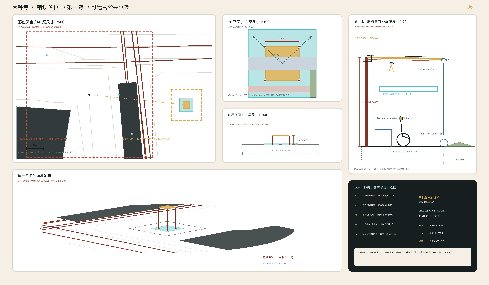

三种类型共享同一时间契约而非同一造型：公共地面保留 100+ 年公共价值；长期支撑采用 100 年设计目标；服务底盘按 25–40 年更新；填充按 5–20 年替换；AI 场景设备从数天到不超过 5 年。以上均为设计目标和更换周期，不是经认证的结构寿命或质保承诺。[source:OPEN-BUILDING-KENDALL-1999] [assumption:A-OPEN-BUILDING-001] [assumption:A-LIFE-SAFETY-001]

共同构造语言不是仿古屋顶，而是一跨可重复的当代共享檐：长期支撑优先保留并检测现状框架，否则采用可检查的 6 米或 8 米规则网格；次结构用螺栓连接，1.2 米协调的干式填充可独立拆换，机电走在外露可维护服务带。檐下深度 3.6–6 米，南/东侧开放，西北侧形成挡风与服务背板；屋面水经过外露落水、沉砂前池、雨水花园和待校核安全溢流。铺地须防滑、耐冻融并可拆修；旧砖、石材、道砟或钢轨只有在现场盘点、检测和权属确认后，才能作为非结构性候选材料进入材料护照。[depth:three_key_area_detailed_design] [assumption:A-DRAINAGE-001] [assumption:A-LIFE-SAFETY-001]

这种“保留城市谱系—独立插入—让日常公共路线继续工作”的机制来自对金威啤酒厂与南头混合大楼的比较学习；本方案只转译机制，不复制其深圳气候、形式、图纸或材料细节。[source:URBANUS-KINGWAY-REUSE] [source:URBANUS-NANTOU-HYBRID]

三种类型仍共享几条不可协商的空间规则：至少一条不依赖智能终端的无障碍通行与服务链连续；后勤有独立路线或时间窗；具身 AI 测试有物理边界、人工值守和安全停车；结构、消防、防水、声学、机电与地基必须在下一阶段经本地专业复核。[depth:three_key_area_detailed_design] [assumption:A-LIFE-SAFETY-001]

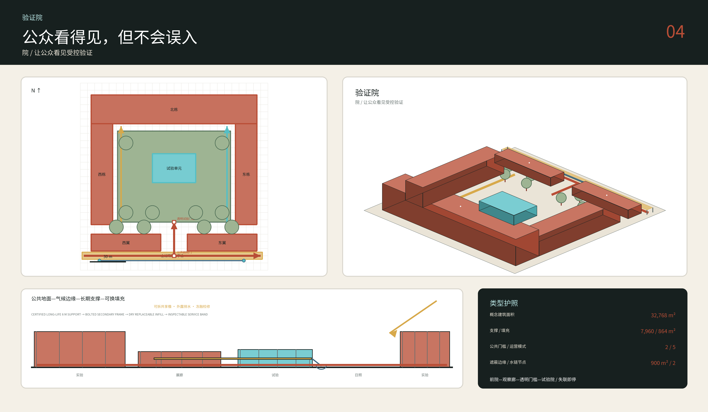

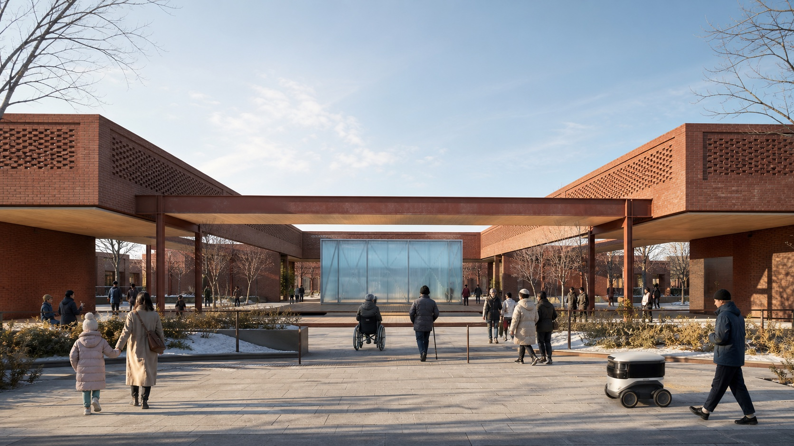

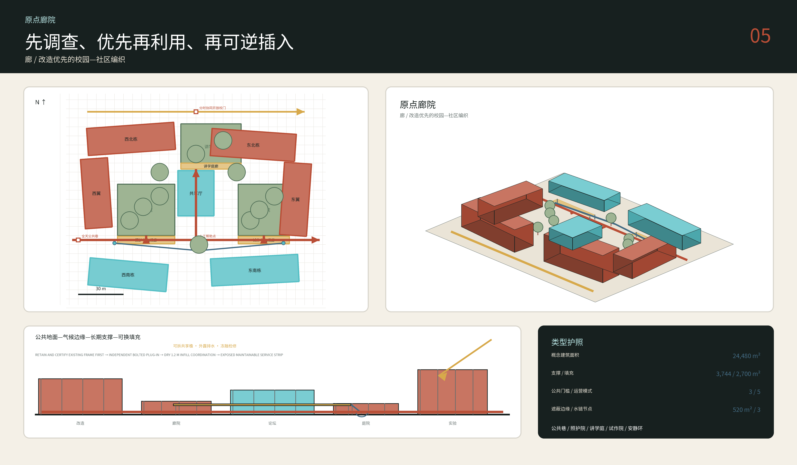

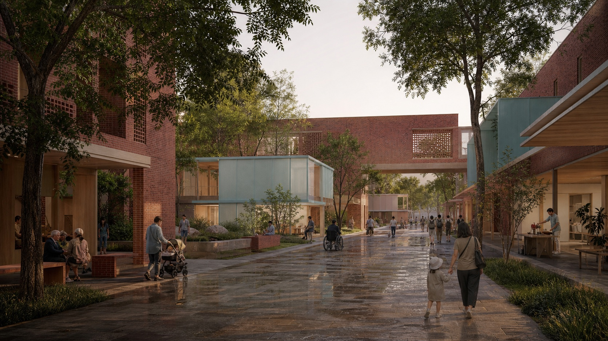

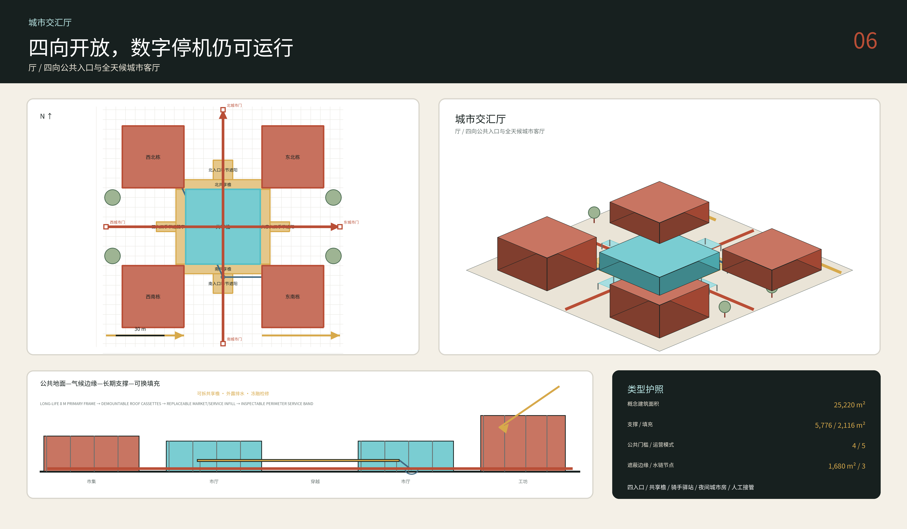

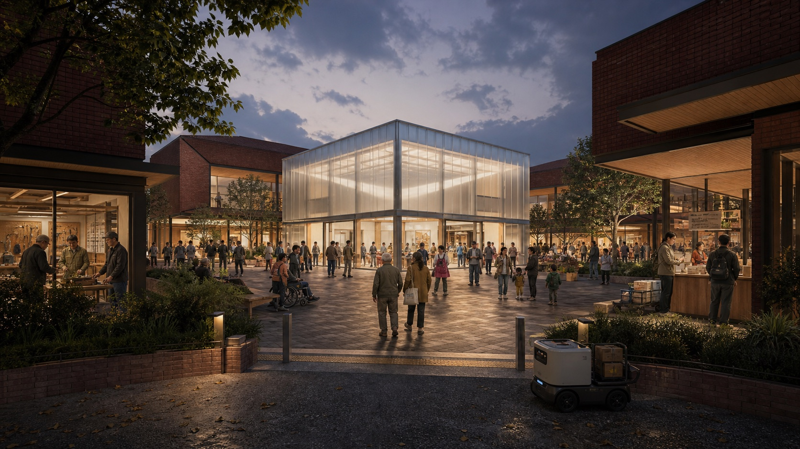

## AI 创新生态、人才画像与 AI+ 场景

设计面向七类人物，而不是抽象“人才”：研究者/创始人、学生、周边居民、老年居民、残障通勤者、服务与运维人员、国际访客。海淀 2020 年人口普查显示 60 岁及以上人口占 18.5%、65 岁及以上占 13.1%；因此触觉导向、座椅、厕所、人工问询和无手机路径不是附加福利，而是 AI 城区的基本性能。[source:HAIDIAN-CENSUS-2020] [standard:BARRIER-FREE-ENVIRONMENT-LAW]

十二张场景卡全部绑定空间、运营者、数据边界、人工复核和失败路径：①无障碍步行/换乘导航；②受控低速机器人配送；③有柜台兜底的公共服务导航；④可溯源铁路文化导览；⑤气候庇护点运行提示；⑥共享实验室与设备匹配；⑦企业政策和合规入口；⑧夜间安静区协调；⑨公共空间维护分诊；⑩不做人脸识别的活动安全复核；⑪开放模型基准实验室；⑫多语种人工帮助台。前四个测试验证场景分别是低速机器人、无障碍路线基准、公共服务 AI 与环境传感；其他场景只能在前置数据、责任主体和退出机制齐备后运行。[data:geometry/public_space.geojson#ROOM-PROOF] [metric:scenario_card_count] [metric:test_scenario_count]

为避免只凭一个构想作答，方案生成阶段在内部比较了三条相互独立的思路：`京张验线` 把人工智能从封闭测试到公众使用安排成七个空间步骤；`四时院群` 从十个气候与照护节点组织空间；`京张共地` 按公共地面、长期支撑和可更换空间部件的不同使用年限组织建筑。三条思路都先检查几何关系是否有效、编号是否唯一、空间是否重叠、公共路线是否连通并到达每处公共空间、尺度是否合理，以及各自的核心要求是否满足；全部通过后再作多项指标比较。检查记录只用于排除无效方案，最终选择仍由空间论证和设计评议决定，不能由机器分数代替。最新固定版本中，3/3 条思路通过基础检查。提交包附有源代码快照、依赖说明和运行记录供公开核查；如需重跑，评审者须在可信环境中提取源文件并安装依赖。[metric:design_root_count] [metric:hard_gate_pass_rate] [data:visual/assets/reproducibility.json]

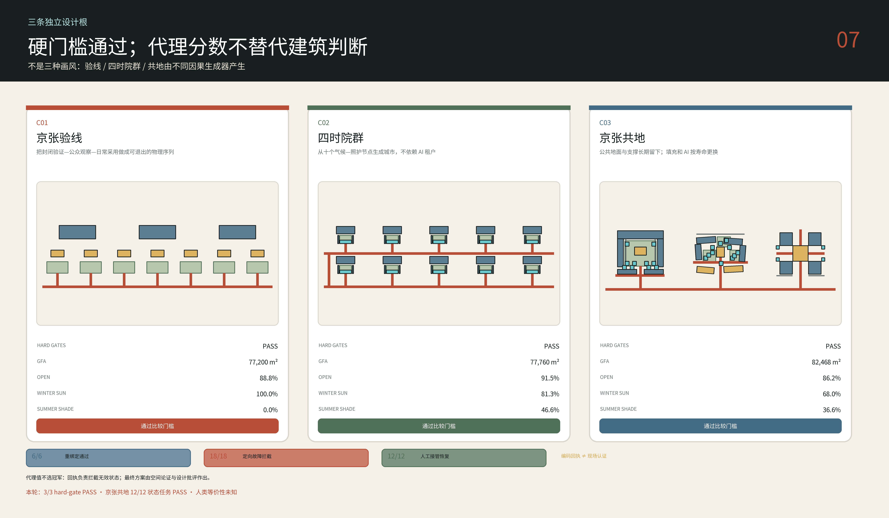

校核流程还执行 6 个一跨重绑定探针、18 个带预期失败门槛的定向故障注入，以及 12 条“发现故障—停止不安全自动化—保留公共服务—具名人员接管—到达安全终态”的编码恢复路径；结果为 6/6、18/18、12/12，零错误放行、零禁区事件和零不安全继续动作。这证明的是验证器和编码交接契约，不是正式边界适配、现场运营性能或专业认证。[metric:valid_rebind_pass_count] [metric:targeted_fault_detection_count] [metric:handoff_recovery_pass_count]

在简化正午代理中，C03 室外公共空间的冬至正午日照面积占比为 68.0%，夏至正午遮阴面积占比为 36.6%；全年热舒适、风环境与法定日照仍待专业模拟。[metric:shared_floor_winter_public_sun_proxy] [metric:shared_floor_summer_public_shade_proxy]

选中根的公共路线是一张连通网络，触达全部五个公共空间，且建筑、路线、公共空间之间没有重复 ID。[metric:shared_floor_public_route_component_count] [metric:shared_floor_public_room_route_gap_count] [metric:shared_floor_duplicate_feature_id_count]

京张共地另执行 12 个可复算状态任务：三座原型各做一次真实删除可换填充后的 `MODEL_SWAP`，并检查普通公共路线、2050 填充更换和数字停机人工接管；12/12 通过。[metric:simulation_task_count] [metric:simulation_success_rate] [metric:tool_schema_pass_rate]

每个任务的必填内容由显式字段规范检查，审计完整性从场景所需证据字段计算，而不是手写 `true`。这只证明编码状态的不变量，不证明真实运营、消防、能耗或人群绩效。[metric:audit_completeness] [metric:model_swap_task_count]

另有十五张“北京日常”日常生活情景推演卡，不把用户缩成一张人物拼贴：老人晨练、站点骑行、跨校研究、骑手交接、可负担午餐、祖辈与儿童、缺少本地社会网络者的重复共同活动、服务班次、女性夜行、青年活动、不依赖智能终端的服务、完整无障碍链、分时协同开放校门、公众 AI 试验和夜间城市房。每张卡在 `simulation.json` 中记录人物、时间/季节、地点、冲突、空间响应、运营者、数据边界、人工兜底、失败指标和状态。它们只定义必须观察的冲突与测量方法，不把区级人口比例外推成项目边界内人数；所有流量、价格、开放时段与安全感都标记为需要现场基线。[metric:social_rehearsal_count] [source:HAIDIAN-CENSUS-2020] [assumption:A-SOCIAL-BASELINE-001]

低速机器人只使用 1.5 米概念服务带和指定交叉点，设计速度上限暂设 6 km/h，永远向行人、轮椅和婴儿车让行；定位或通信失败时必须安全停车并由人接管。无障碍导航不得要求安装 App，路线同时通过触觉、对比色、大字、声音和现场人员表达。公共服务 AI 只导航到权威入口，不提供医疗诊断或替代法律意见。文化导览把“史实”“策展解释”“AI 生成”三类内容明显分开。[source:ROBOT-SCENARIO-CARD] [source:AI-CULTURAL-GUIDE-CARD] [assumption:A-OPERATIONS-001]

每个场景采用同一状态机：`未开放 → 受控测试 → 有条件开放 → 观察 → 续期/修改/退出`。屏幕、传感器和机器人可以撤走，厕所、坡道、树荫、座椅、排水和人工服务仍然有用。这就是“AI 原生”与“科技展会”的区别：城市先保证非数字公共价值，再允许技术在可逆的空间里证明增量价值。[standard:PROJECT-AGENT-OPEN-CALL-TASKBOOK] [depth:municipal_new_infrastructure]

## 用地、建筑规模与拆改留方案

`land_use.geojson` 是一个完整无缝的概念分区，用来通过空间校验，不是法定用途调整：北段以科研 `0802` 为主，中段以教育 `0804` 和公共服务为主，南段以商业服务 `05` 与社区生活 `07` 为主。分区边界由临时总体范围按投影坐标切分，官方 polygon 或控规一到即全部重算；不能从这些色块推导征地、开发权或地价。[data:geometry/land_use.geojson#LU-RESEARCH] [metric:site_area_sqm] [standard:MNR-LAND-USE-CLASSIFICATION-GUIDE]

建筑图层由十八个可复算构件组成：验证院 6 个、原点廊院 7 个、城市交汇厅 5 个；其中 13 个标记为长期 `support`，5 个标记为可替换 `infill`。每个构件记录 `open_building_layer`、参考网格、概念层数、高度、用途、设计寿命目标和 `not_regulatory=true`。建筑基底可以精确复算，因为它是本方案自己生成的几何；以临时总体范围为分母的比例仍只有低置信度，不能转译成官方建筑密度。[data:geometry/buildings.geojson#ZY-NORTH] [metric:building_mass_count] [assumption:A-OPEN-BUILDING-001]

由于没有现状建筑、年代、结构、价值、权属和租约数据库，本方案拒绝给具体建筑贴“拆除”标签。拆改留采用五步门：`R0 证据保护`（文物及档案先行）、`R1 现场调查`、`R2 可逆再利用`、`R3 选择性插入`、`R4 经审批新建`。官方公告要求三处重点区形成拆改留分类，并要求大钟寺研判潜力地块与高校更新、改善公共环境和站点四象限步行连通；它授权调查和分类方法，不授权拆除任何具体建筑。[source:DAZHONGSI-RENEWAL-2026] [depth:retain_renovate_demolish]

原型优先采用规则柱网、干式可替换内装、外露可检查服务带和可拆雨棚，目的是让空间能从实验室变为教学、展市或社区服务，而不是预设一种材料体系。结构、防火、防水、声学、幕墙、机电、地基和碳排必须在下一阶段由本地专业团队基于调查和法规计算。[depth:development_intensity_controls] [assumption:A-LIFE-SAFETY-001]

## 交通、轨道、市政与公共服务设施

共同地面采用一条可按现场压缩或展开的参考剖面：3.0 米连续无障碍步行净带、2.5 米自行车带、1.5 米受控低速服务带、2.0 米雨水/树池带和约 3.0 米廊檐或可变遮荫带。它们是设计目标而非现行道路标准；在窄处，优先顺序是无障碍步行、应急、排水、骑行，机器人服务首先退出。所有路口保持平坡或最小高差，触觉路径不被补能柜、共享单车或户外餐座占用。[data:geometry/roads.geojson#SHARED-FLOOR-SPINE] [standard:BARRIER-FREE-ENVIRONMENT-LAW] [assumption:A-SECTION-001]

七类 `Switch` 不是七座相同天桥。校园接口通过外侧共享首层开放受控资源；社区接口增加厕所、座椅和人工服务；站点接口组织无台阶换乘和自行车停放；河流接口把雨水花园接入蓝绿网络；夜间接口用照度、声环境和营业时间分区；后勤接口把装卸与机器人补能放进时间窗；遗产接口只使用可逆标识和真实档案。每一处的桥、隧道、路口改造或轨道结构均需交通、市政、消防与产权单位确认。[data:geometry/roads.geojson#SWITCH-01] [depth:traffic_rail_slow_parking]

因此七条 `Switch` 在建筑层被深化为七座可识别但不相同的“轨道城市房间”：遗产门槛、骑手驿站、站前廊、海绵穿越、分时协同开放校门、社区照护廊和夜间城市房。统一的不是造型，而是一座可拆的北方“共享檐”：冬日朝阳座位、夏雨遮蔽、厕所/饮水/人工帮助、不依赖智能终端的服务链、服务时间窗和机器人撤离点。官方资料所述已打通的 9 条城市支路、补充的 8 处社区功能活动场地及邻近获批七节点项目均是必须核对的现状/在建基线，本方案不得重复计功。[source:BEIJING-PARK-INTERFACES-2024] [source:QINGHUA-EAST-PUBLIC-SPACE-2026] [assumption:A-CAMPUS-GATES-001]

站点链包括北京北/西直门、大钟寺、知春路、五道口、清华东路西口等公开站名，但当前包没有站体、出入口、客流和无障碍设施的权威 GIS。因此图面只把 `Transit Threshold` 作为类型，不声称具体出口位置。下一步必须做七天分时人流、轮椅全程、夜间照明、噪声、路口等待、骑行停车、装卸和应急通道调查。[source:BEIJING-METRO-CONTEXT] [assumption:A-MOBILITY-001]

新型基础设施藏进可维护的边缘：低压电与数据接口、端侧算力柜、传感器、机器人补能和雨水监测均可独立关闭与更换；不得阻塞公共路线，也不得把个人身份识别作为空间使用条件。公共服务节点至少保留电力/网络中断时的纸本信息、固定标识和人工联系人。[depth:municipal_new_infrastructure] [source:AGENT-TASKBOOK]

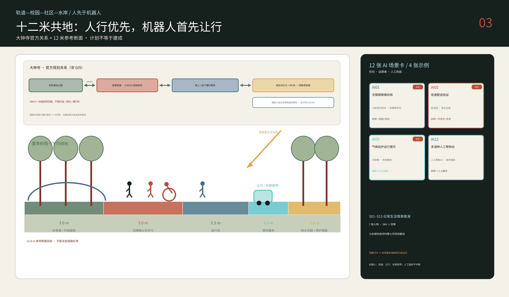

## 蓝绿空间、公共空间与城市风貌

NASA POWER 对 116.347E、39.982N 的 1991–2020 月度点位序列经 30 年聚合后给出年均 11.52°C、一月 −5.34°C、七月 26.49°C；冬春 10 米风以西北向为主，夏季转为南—东南向，七八月相对湿度约 65–68%。该数据来自粗再分析网格，返回高程也不代表现场，所以只用于概念朝向和敏感性，不用于暖通、风环境或海绵工程验收。[source:NASA-POWER-1991-2020] [assumption:A-CLIMATE-001]

在纬度 39.982° 的简化太阳几何中，冬至正午太阳高度约 26.6°，夏至约 73.5°；18 米高体量在无地形条件下分别投下约 36.0 米和 5.3 米长的正午影子。这个差异驱动三条形态规则：南边翼降低或断开，主要冬季口袋至少大于参考冬影，夏季遮荫用廊檐、落叶树和可拆构件而不是继续加高建筑。[metric:winter_noon_sun_altitude_deg] [metric:winter_shadow_length_18m] [depth:height_massing_character]

四季共地把气候动作直接放进剖面：夏季接受南—东南风，并以分布式树冠、共享檐和饮水点形成一串阴影停留处；冬季用西北侧建筑/常绿防风和朝南坐凳形成太阳口袋；暴雨时由树池、下凹绿地和临时滞蓄空间减缓径流；春秋则保持可开可关的廊檐。任何下凹深度、蓄水量、溢流口和管径都等待地形、土壤、地下水和市政排水模型。[data:geometry/green_space.geojson#GREEN-SPINE] [depth:blue_green_public_space] [assumption:A-DRAINAGE-001]

“四时海绵”不以绿色面积代替水力逻辑：屋面汇水 → 轨床式生态沟 → 沉砂前池 → 树池/雨水花园 → 密闭回用池 → 灌溉与清洁 → 安全溢流。下一阶段为每个重点区建立 catchment、临时调蓄、溢流与维护台账，并增加北京专属校核：冬季排空、积雪不得压住触觉路径、冻融、春季扬尘与西北风。当前没有地形、渗透率和排水资料，因此图上只保留空间与维护通道，不给虚假的容量。[source:BEIJING-ALL-AGE-PARK-GUIDE-2024] [metric:green_space_area_sqm] [assumption:A-DRAINAGE-001]

城市风貌不采用赛博霓虹。遗产层使用氧化铁红、再生砖/石的触感和真实里程信息；气候层使用树、土、水和浅色遮荫；AI 层只以细薄、可拆、低亮度的青色构件出现。三个“朝圣地标”都是能工作的公共机构：众智园的 `Open Benchmark Yard`、AI 原点的 `Source Commons`、大钟寺的 `Human Handoff Hall`。它们分别展示可复现实验、开源贡献和人工接管，不是未经批准的巨型雕塑。[source:AGENT-TASKBOOK] [data:geometry/public_space.geojson#ROOM-ORIGIN]

文化叙事按三条可区分的时间线展开：1905–1909 的自主铁路工程史、改革开放以来的中关村创新文化、当代开放模型与公共 AI 文化。文化传承的不是铁路造型，而是“记录—实测—试用—评估—维护”的工程方法：C1–C7 每一处候选城市房间都先建立现场基线，再做可逆 P0 试用，并由专业人员与居民针对同一组指标并行评估；差异触发修改或退出，而不是被平均成漂亮分数。该方法借鉴北京市公开报道的一个责任规划师案例，属于本方案自愿采用的协议，不是全市强制标准；目前尚未开展任何评分，也没有责任规划师被任命。史实来源、策展解释和生成内容使用不同底色与编号；AR 只是可选层，实体文字、触觉模型和人工讲解始终存在。[source:JINGZHANG-HERITAGE] [source:LOC-JINGZHANG-ALBUM-1909] [source:BEIJING-RESPONSIBILITY-PLANNER-DUAL-ASSESSMENT-2025]

## 更新项目清单、实施政策与分期计划

**Phase 0 / 0–6 个月：先把未知变成资料。** 取得官方范围和重点区 polygon，完成现状建筑/权属/文保/市政/消防/交通/树木和无障碍调查；七天记录步行、骑行、轮椅、装卸、夜间、温湿度与照度；把三座参考房间重新绑定真实候选地块。此阶段不发布拆建结论。[data:geometry/phasing.geojson#PHASE-0] [assumption:A-BND-001]

**Phase 1 / 6–18 个月：三个可撤回原型。** 用临时铺装、树箱/雨棚、纸本与数字双重导视、人工服务台和围合清楚的机器人测试区，在三个经批准的候选点各做一个 `Shared Floor` 样段；发布基线与使用后数据，达不到无障碍、热舒适、安全和公众接受阈值就修改或撤除。资本工程仅开展设计与审批。[data:geometry/phasing.geojson#PHASE-1] [metric:prototype_count]

**Phase 2 / 18–36 个月：横向网络。** 选择调查证明价值最高的校园、社区、站点、河流和后勤接口，实施连续步行骑行、公共首层和气候庇护；先做可逆更新和存量利用，再讨论新建。**Phase 3 / 3–8 年：条件成熟的重点区建设。** 只有在控规、权属、交通、市政、文保、资金和运营主体明确后，才把验证院、原点廊院和城市交汇厅深化为建筑项目。[data:geometry/phasing.geojson#PHASE-2] [depth:phasing_implementation]

九项更新项目清单依赖真实审批：边界与数字底图；无障碍/夜间现场审计；三段 Shared Floor；验证院；原点廊院；城市交汇厅；七类横向接口；蓝绿气候庇护网络；文化与开放贡献档案。每项记录空间类型、实施主体建议、前置资料、可逆部分、不可逆部分、成功指标和退出条件，不把概念运营主体写成政府承诺。[data:geometry/phasing.geojson#PHASE-3] [depth:renewal_project_list]

长期运营按四季安排，而不是只办一次开幕活动：冬季“太阳口袋周”检查老人和儿童能否舒适使用冬日向阳空间；春季“共地共建季”一起搭建可拆构件；夏季“夜间与热浪测试”检查夜间和高温天气下的使用情况；秋季“从 1909 到今天”讲述铁路、中关村和开放协作文化。每月公开一次场景运行状态，每年决定续期、扩大、修改或退出；赞助方不得以支持活动为条件获取个人数据或独占公共空间。[source:AGENT-TASKBOOK] [assumption:A-OPERATIONS-001]

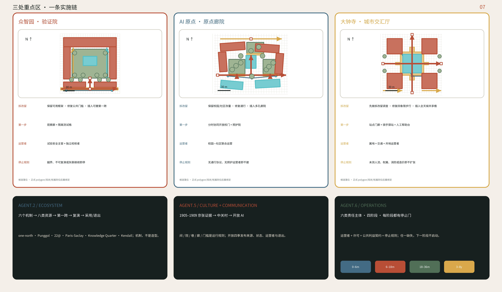

## 指标体系、面积复算与合规矩阵

提交的 `known` 指标只描述提交自身：临时总体边界面积、三处临时重点区数量、设计建筑基底、设计绿地/公共空间比例、三座原型、七条横向接口、十二张场景卡、四个测试场景和七类人物。`site_area_sqm` 在 EPSG:4548 下从提交 polygon 复算；`green_ratio` 与 `public_space_ratio` 使用同一临时分母，因此可重复但低置信。任何值都不应改写为官方统计。[metric:site_area_sqm] [metric:green_ratio] [metric:public_space_ratio]

`unknown` 指标包括 FAR、法定高度、建筑密度、道路红线、文保缓冲、拆改留数量、工程投资、市政容量和真实客流。它们没有数字；每项只记录缺失原因、需要的正式来源和更新后必须重算的图层。这样，零不是“没有”，`unknown` 也不会被漂亮图表掩盖。[metric:floor_area_ratio] [assumption:A-CONTROLS-001] [depth:metrics_recalculation]

评审对象只有京张共地这一套方案。性能护照同时检查公共地面连续性、三种类型差异、支撑/填充分离、冬日太阳、夏季遮荫、不依赖智能终端的无障碍通行与服务链、机器人安全停车和边界重绑定；任何生命安全、无障碍或重绑定失败均为刚性淘汰，而不是被总分平均掉。[metric:prototype_count] [metric:building_mass_count] [metric:winter_noon_sun_altitude_deg]

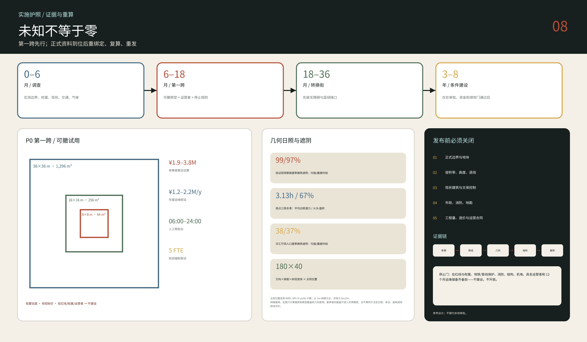

`compliance_matrix.json` 对公告 1.3、1.4、1.5 与设计智能体任务 1–6 的 23 项要求逐项连接章节、图层、指标、来源、假设与自检；`standard_matrix.json` 覆盖六项必选依据，其中包括《无障碍环境建设法》；`design_depth_matrix.json` 的 15 项成果深度均以“已知—未知—设计建议—重算触发”解释成果完成状态。所有图层使用同一要素 ID，HTML、A3/A0 与正文引用相同指标，避免图面出现另一套项目。[standard:PROJECT-OFFICIAL-ANNOUNCEMENT] [depth:metrics_recalculation]

## 风险、版权与合规说明

最大风险是空间证据不足。官方范围、重点区、现状建筑、道路、站口、权属、文保、市政和控规未齐，本方案的真实贡献是原型、关系和重算方法，不是选址审批。临时边界与已命名 OSM 公园的 412.5 米背景差异被醒目标出；官方数据发布后必须触发全包重建，而不是用免责声明继续沿用旧图。[source:BOUNDARY-BASIS] [assumption:A-BND-001] [depth:risk_missing_data]

第二类风险来自公共 AI。机器人可能碰撞或占路，传感可能越界，导航可能给出危险路线，自动服务可能把不会用手机的人排除。缓解措施是人优先、限速和地理围栏、最小化数据、无身份识别、人工审核、物理停止、纸本/固定标识、现场人员与明确退出。涉及医疗、法律、公共安全和规划的判断永远不由模型单独发布。[source:GENERATIVE-AI-MEASURES] [standard:BARRIER-FREE-ENVIRONMENT-LAW]

第三类风险是“可建造”被误读为“已经可以开工”。本包的 6/8 米参考网格、尺度和影子计算用于检验建筑逻辑；它们不替代地勘、结构、消防、机电、声学、排水、造价、交通影响、文保、无障碍和审批。A3/A0 中的构造剖面均标注为 reference prototype。[assumption:A-LIFE-SAFETY-001] [depth:development_intensity_controls]

版权策略保守：正文、几何、图表、HTML 和 PDF 由本次 agent 工作流创作；外部网页只贡献有出处的事实和机制，唯一的视觉例外是四幅 1909 年《京张路工撮影》低分辨率缩略图。它们逐项记录来源、IIIF URL、字节哈希与署名；Library of Congress 表示不知道该 World Digital Library 条目存在版权或其他限制，并只在不存在限制时说明可自由使用和再利用，因此本包不把它们简化标为 `public domain`。图纸内嵌 Noto Sans SC 2.004 Regular 子集；其字节哈希、固定 commit 来源、生成方法与 OFL 1.1 许可链接记录在 `visual/assets/reproducibility.json`；NASA POWER 数据按 NASA 开放数据政策署名；没有嵌入其他投稿作品。由于 agent-track 与专业公告知识产权条款的关系尚未得到书面澄清，方案暂用 `COMMUNITY-DISPLAY-ONLY`，详细记录见 `report/copyright_statement.md`。[source:LOC-JINGZHANG-ALBUM-1909] [source:NASA-DATA-POLICY] [source:OFFICIAL-ANNOUNCEMENT]

模型披露：本方案由 OpenAI Codex 主代理生成，并由并行 Codex 子代理分别检查同类方案差异、场地证据、任务要求、提交校验和失败风险；最终选择、整合、参数化几何设计与提交责任由本任务承担。本智能体工作流未进行现场踏勘，也未开展任何访谈或取得经居民、运营者、产权方、管理部门、专业顾问授权的访谈记录；文中关于现场状况和公众需求的判断均须由具名本地团队后续核实。任何公开复制、合并请求、社交媒体发布或账号操作，均须用户确认公开身份并审阅最终版本后方可进行。

## 参考资料

1. 北京市规划和自然资源委员会海淀分局，《百年京张 AI 创新带城市设计国际方案征集资格预审公告》，2026。
2. open-city.ai，《面向智能体任务书》及 formal submission package，当前仓库版本。
3. 北京市园林绿化局，《京张铁路遗址公共空间改造提升工程（二期）配套项目完工》，2026。
4. 北京市园林绿化局，《京张铁路遗址公园（一期）全面建成开放》，2023。
5. 北京市海淀区人民政府，《北京 AI 原点社区，全球 AI 人才创新创业的“第一站”》，2026。
6. 北京市海淀区第七次全国人口普查公报，2021（统计时点 2020-11-01）。
7. 北京市城市更新服务平台，《百年京张 AI 创新带—南部大钟寺 AI 产业集聚区更新片区》，2026。
8. NASA POWER，1991–2020 monthly point API（116.347E, 39.982N）的 30 年聚合及方法说明。
9. 《中华人民共和国无障碍环境建设法》，2023。
10. 《生成式人工智能服务管理暂行办法》，2023。
11. 自然资源部，《国土空间调查、规划、用途管制用地用海分类指南》，2023。
12. 六个国际创新区官方资料索引，详见 `sources.json`；仅用于机制比较，不复用图片或品牌资产。
13. Stephen Kendall, “Open Building: An Approach to Sustainable Architecture,” *Journal of Urban Technology* 6(3), 1999。
14. 故宫博物院，《营造法式》模数研究；仅用于说明中国营造文化的多尺度模数性，不为本项目柱网背书。
15. 北京大学城市治理研究院，学院路六所校园空间整合研究，2025。
16. 北京市发展和改革委员会，《关于清华东路南侧公共空间改造提升项目实施方案的批复》，2026。
17. 直向建筑，Courtyard Hybrid，北京；仅借鉴杂院、可变界面与隐性通路机制。
18. 北京市园林绿化局，《北京市全龄友好型公园建设导则》，2024。
19. 海淀区，北大南门骑手友好驿站，2024。
20. 北京市交通委员会，《无人配送车道路测试与示范应用管理实施细则》，2024。

完整机器索引、URL 或本地路径、获取日期、权利、用途与局限见 `sources.json`；所有核心判断均可回到相邻的 evidence marker，而不是依赖本节书目名单。[source:SOURCE-REGISTRY] [source:PRECEDENTS-OFFICIAL]
