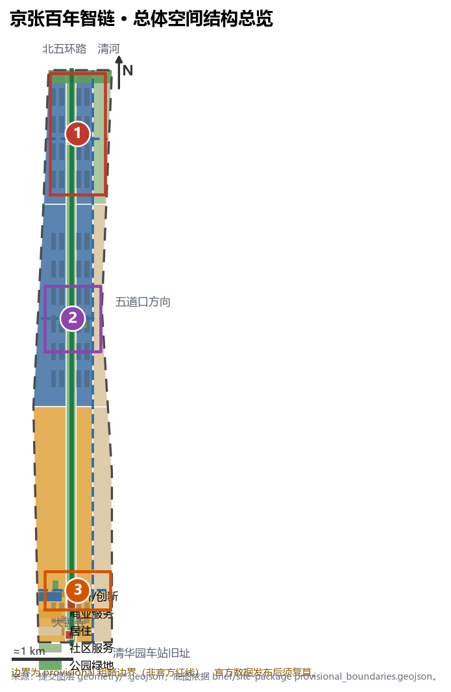
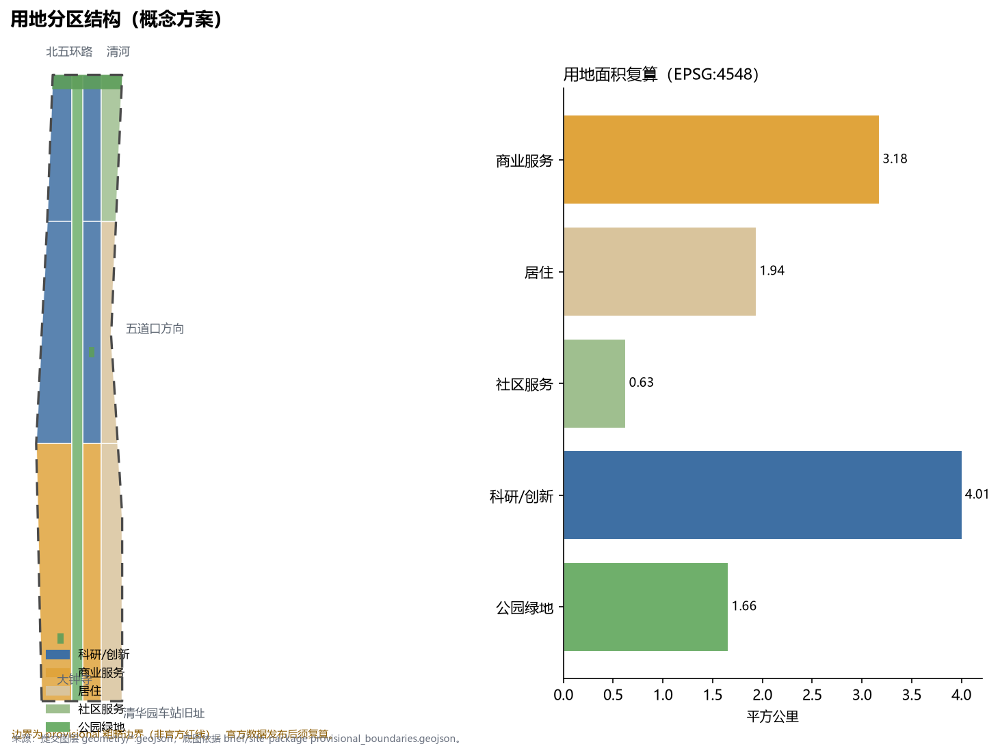
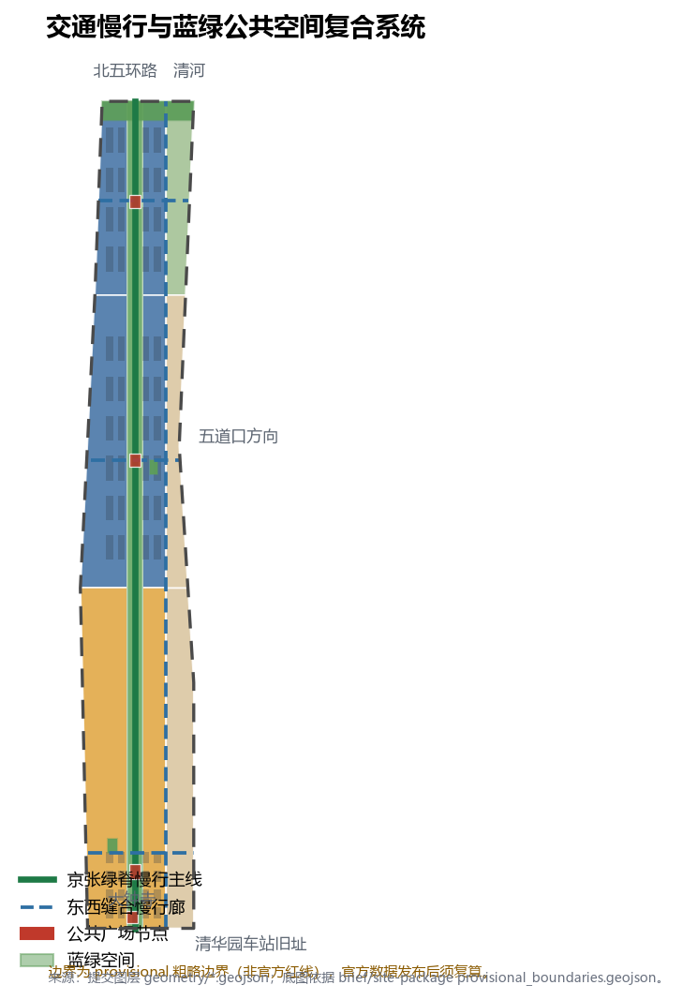
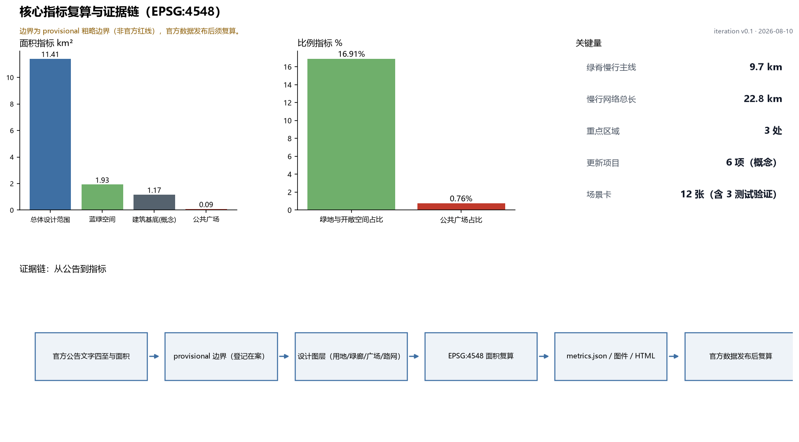

# 京张百年智链：轨道上的AI创新带

本方案是面向百年京张 AI 创新带的 formal AI 城市设计方案。它把 1909 年京张铁路留下的南北走廊，重新组织为一条面向全球开发者的「智链」：文化记忆、创新产业与日常生活沿同一条绿脊展开。方案所有空间落地建议均为**概念建议、参考方案或可供专业团队深化研究**，不替代正式规划，不构成政府审定结论。

## 设计依据与资料清单

方案的第一依据是北京市规划和自然资源委员会海淀分局发布的《百年京张AI创新带城市设计国际方案征集资格预审公告》，其中确定统筹研究范围约 43.6 平方公里、总体设计范围约 11.4 平方公里、三处重点区域合计 368.4 公顷，并要求方案达到控规深度城市设计与规划综合实施方案深度 [source:OFFICIAL-ANNOUNCEMENT]。第二依据是面向智能体的开源征集任务书，它把六项必选任务（agent.1–agent.6）、十条共创原则和边界条款整理为机器可读文件 [source:AGENT-TASKBOOK]。

场地几何采用仓库维护者登记的 provisional 边界：总体设计范围与三处重点区 polygon 均为依据公告文字四至和公告面积校核得到的粗略替代边界，只用于生成、展示、自检与设计讨论，不得作为官方红线、审批依据或精确面积复算依据 [source:BOUNDARY-SOURCE]。资料用途边界以 `data/source_registry.json` 为准：formal 可用资料、背景资料与 provisional-only 资料严格分级使用，本方案未把任何 background/provisional 材料升级为法定结论 [source:SOURCE-REGISTRY]。`data/processed/agent_fact_pack.md` 仅作为阅读导航 [source:PROCESSED-FACT-PACK]。

官方红线、重点区精确 polygon、容积率、建筑高度、建筑密度、绿地率、退线等控制条件目前缺失，全部列入待确认事项（见假设与风险章节）[data:geometry/constraints.geojson#CONSTRAINT-002]。图 1 给出方案总体证据链与提交包结构：正文负责人类阅读，GeoJSON、指标与矩阵负责机器复核。

## 三层范围工作框架

方案按公告三层范围组织工作。**统筹研究范围**（43.6 km²）回答创新生态、产业链协同与未来城市形态问题，成果为战略框架、命名体系与案例研究；**总体设计范围**（11.4 km²）回答城市更新总体框架、用地结构、交通市政与风貌控制，成果落到用地、建筑、道路、绿地、公共空间和分期图层 [depth:three_level_scope_framework]；**重点区域范围**（368.4 ha）对众智园、北京 AI 原点社区、大钟寺三处片区做详细设计 [data:geometry/key_areas.geojson#PROV-KEY-001]。

三层之间的转译规则是：统筹层的每一个产业判断，必须能在总体层找到承载它的用地与公共空间；总体层的每一个空间动作，必须能在重点层或图层中被复核。例如「开源协作需要可发布、可聚集的场所」这一判断，对应总体层的原点社区科研用地 [data:geometry/land_use.geojson#LU-003] 与重点层的开源发布广场 [data:geometry/public_space.geojson#PUBLIC-002]。

provisional 边界的处理方式：本方案用它确定「走廊形态、相对位置与面积量级」，不用它断言任何地块级结论；官方 polygon 发布后，site boundary、key areas、land use、roads、green space、public space、buildings、phasing 与全部面积指标将按同一生成规则重算 [metric:site_area_sqm]。面积复算统一在 EPSG:4548 投影下进行，总体范围复算值 11.41 km²，与公告 11.4 km² 校核一致。

方案提出的总体空间结构为「**一带三核、五廊缝合、蓝绿复合环**」：一带是贯穿南北的京张绿脊（遗址公园活力带）；三核是三处重点区域；五廊是绿脊主线加三条东西向缝合慢行廊与一条东侧社区联络道；蓝绿复合环由绿廊、北缘绿带、广场节点与活动路线联动形成 [depth:overall_spatial_structure]。

## 统筹研究范围产业与未来城市研究

**命名体系（回应 agent.1）**：方案提出一带总名称「**京张智链 · JINGZHANG AI LINK**」。「智链」同时指铁路链路的物理连续与开源协作的信任链；三条定位带分别获得可传播的副名——百年京张文化带称「轨道记忆带」，都市 AI 生活体验带称「日常场景带」，AI 融合创新带称「全栈加速带」。Logo 方向为原创概念：以双线铁路断面与神经突触同构的图形表达「轨道上的智能」，主色取铁路耐候钢棕与信号绿，避免使用任何企业商标、字体或肖像；最终视觉识别需由专业品牌团队清权后深化 [source:AGENT-TASKBOOK]。

**全球 AI 创新生态案例（回应 agent.2）**：方案选取 6 个公开案例并提炼可转化机制——（1）剑桥 Kendall Square：大学策源与高密度混合街区，转化机制为「近校转化街」；（2）伦敦 King's Cross：铁路遗产驱动的更新与学院集群，转化机制为「轨道遗产作公共主轴」；（3）新加坡 one-north：科研走廊与带状公园缝合，转化机制为「绿脊+组团」；（4）深圳湾 super headquarters base 周边片区：企业总部与滨海公共空间复合，转化机制为「企业界面公共化」；（5）上海西岸：工业遗存转文化走廊，转化机制为「文化叙事引导更新分期」；（6）多伦多 MaRS Discovery District：城市中心科研转化区，转化机制为「街道即试验场」。以上案例仅作为背景研究引用，其数据不构成 formal 证据，也不暗示任何企业与本方案存在关联 [source:CASE-STUDIES-BACKGROUND]。

**要素机制**：围绕土地、空间、产业、资金、人才、算力、数据、场景八类要素，方案提出「空间供给清单 + 场景开放清单 + 要素服务台」的概念机制：更新项目清单提供空间，场景卡提供测试与应用入口，服务台聚合法务、知识产权、投融资与算力接口。所有机制均为概念建议，招商、资金与政策安排不构成确定承诺 [standard:PROJECT-AGENT-OPEN-CALL-TASKBOOK]。

未来城市形态研究的核心判断是：AI 改变的不是单一建筑类型，而是「街道的可测试性」与「场所的可发布性」。因此方案把总体层的空间动作集中在三类载体——可测试的街道（绿脊与缝合廊）、可发布的场所（广场与发布厅）、可居住的社区（原点社区生活圈）[standard:MOHURD-URBAN-DESIGN-MEASURES]。

## 总体设计范围城市更新与控规深度城市设计

总体设计范围的城市更新框架以「保留绿脊、缝合东西、激活界面」为总纲。用地结构按国土空间调查分类标准表达，形成 7 个完整覆盖、无缝无重叠的分区：绿脊为公园绿地（1401），西侧为科研用地（0802）承载创新功能，东侧为居住（0701）与社区服务（0702）承载生活，大钟寺段西侧为商业服务业用地（05）承载智能原生消费 [standard:MNR-LAND-USE-CLASSIFICATION-GUIDE] [data:geometry/land_use.geojson#LU-001]。

设计判断有三条。第一，铁路走廊不画新红线，而以既有遗址公园绿带为公共空间主轴，把「南北贯通」作为不可让渡的结构性目标 [depth:overall_spatial_structure]。第二，东西向缝合优先于新增开发：三条缝合慢行廊分别对应大钟寺段、五道口—原点段与众智园段，目标是消解铁路对城市的东西割裂 [data:geometry/roads.geojson#ROAD-003]。第三，创新功能沿绿脊西侧带状布局，与生活区保持步行可达而互不干扰，建筑基底以概念体量网格表达，总面积约 1.17 km²，仅用于讨论开发量级，不构成建筑规模审定 [metric:building_footprint_area_sqm]。

控规深度要求方面：容积率、建筑高度、建筑密度、绿地率、退线五项官方控制条件缺失，方案在 `metrics.json` 中将其标记为 unknown 并给出原因，待官方控规或任务书附件发布后补齐 [depth:development_intensity_controls]。更新对象识别、功能比例、公共空间率与交通组织的相互支撑关系由图层与指标共同表达；任何无法从结构化数据复算的结论均不写入正文 [depth:land_use_layout]。

## 重点区域详细设计

三处重点区域均使用 provisional polygon，以下结论为方向性设计，官方 polygon 发布后需重新校准 [depth:three_key_area_detailed_design]。

**① 众智园 AI 自主创新加速区（公告 192.1 ha）** [data:geometry/key_areas.geojson#PROV-KEY-001]：定位为花园型全栈自主创新街区（概念）。空间结构为「一廊界面 + 三组团」：北侧清河界面组织低碳创新交往与展示廊；内部按加速、标准治理、测试验证三组团布置概念建筑基底。AI 场景落位安全治理沙盒（S02）与端侧算力驿站（S03）。实施依赖为清河蓝线、生态与防洪条件确认；风险在于园区权属多元，需统筹实施主体。

**② 北京 AI 原点社区（公告 104.3 ha）** [data:geometry/key_areas.geojson#PROV-KEY-002]：定位为近校型成果转化与人才社区（概念）。空间动作为「校区—园区—街区」慢行缝合：沿清华东路西口方向组织成果转化街（S07），设置开源发布广场（PUBLIC-002）与发布厅（S01），补足人才服务与居住生活配套。拆改留逻辑以保留与改造为主、新建为辅，概念网格中新建占比约三分之一 [data:geometry/buildings.geojson#BLDG-M001]。实施依赖为校区边界、权属与首层业态政策。

**③ 大钟寺 AI 产业聚集区（公告 72.0 ha）** [data:geometry/key_areas.geojson#PROV-KEY-003]：定位为城市型智能经济与国际交往街区（概念）。空间动作围绕大钟寺轨道站点四象限步行连通（JZ-04）展开：站前广场（PUBLIC-001）组织国际路演客厅（S05）与数据要素会客厅（S08），商业界面承载智能原生消费（S09）。实施依赖为站点交通组织、道路交叉口与市政管线条件。

## AI 创新生态、人才画像与 AI+ 场景

**用户画像（5 类）**：开源开发者（发布、协作、声誉）、初创团队（低成本空间、算力入口、试验场）、头部企业访客（展示、商务、招聘）、周边居民（通勤、休闲、低扰动更新）、高校师生（转化、协作、慢行）。每类画像对应明确的空间响应与数据边界：方案不采集个人行为轨迹，活动数据只做聚合统计，居民画像不用于商业推荐。

**场景卡（12 张，其中 S02、S11、S12 为产业测试验证场景）**：

| 场景 | 空间载体 | 服务对象 | 隐私与人工复核边界 |
| --- | --- | --- | --- |
| S01 开源发布厅 | 原点社区 PUBLIC-002 | 开发者、高校 | 公开活动数据，授权后展示贡献 |
| S02 安全治理沙盒（测试验证） | 众智园 | 模型与标准机构 | 测试数据隔离，监管可复核 |
| S03 端侧算力驿站 | 绿脊节点 | 初创团队 | 算力使用需另行授权 |
| S04 AI 慢行导航 | 绿脊全线 | 通勤者、访客 | 低侵入传感，仅聚合统计 |
| S05 国际路演客厅 | 大钟寺 PUBLIC-001 | 企业、投资人 | 商务信息不外泄 |
| S06 清河低碳创新廊 | 众智园北界面 | 园区企业 | 能耗数据脱敏 |
| S07 近校成果转化街 | 原点社区 LU-003 | 高校师生 | 成果与知识产权需授权 |
| S08 数据要素会客厅 | 大钟寺 | 数据机构 | 合规、授权、可审计 |
| S09 AI 生活服务样板街 | 社区交汇处 | 居民 | 不用于商业推荐 |
| S10 全球 AI 活动周路线 | 全线 | 全球访客 | 公开影像需清权 |
| S11 低速机器人配送（测试验证） | 绿脊慢行道 | 园区、社区 | 限定低速路段，可远程接管 |
| S12 AI 导览与铁路记忆解说（测试验证） | 绿脊全线 | 访客 | 内容经文化顾问复核 |

场景-空间-运营映射遵循「图层定位 + 矩阵登记」：每个场景在正文给出空间载体，在 `compliance_matrix.json` 登记运营与边界 [data:geometry/public_space.geojson#PUBLIC-002]。所有测试验证场景均为概念试点建议，不构成已批准运营 [source:AGENT-TASKBOOK]。

## 用地、建筑规模与拆改留方案

用地复算结果（EPSG:4548）：科研/创新（0802）约 4.01 km²，商业服务（05）约 3.18 km²，居住（0701）约 1.94 km²，社区服务（0702）约 0.63 km²，公园绿地（绿脊，1401）约 1.66 km²；含北缘绿带与街角公园的绿地与开敞空间合计约 1.93 km²，占总体范围 16.9% [metric:green_ratio] [data:geometry/land_use.geojson#LU-007]。

建筑以概念体量网格表达：保留、改造、新建三类动作按 1:1:1 交替标注，用于讨论更新策略而非确定地块结论 [depth:retain_renovate_demolish]。建筑高度、体量与风貌控制缺少官方条件，全部写为待确认；方案仅提出方向——绿脊两侧低矮连续界面、创新组团中等体量、站点周边适度集聚 [depth:height_massing_character]。所有面积、比例均可从 `geometry/*.geojson` 与 `metrics.json` 复算。

## 交通、轨道、市政与公共服务设施

交通框架为「一脊三横一纵」慢行网络：绿脊主线约 9.7 km 概念线位，三条东西缝合廊与东侧联络道合计约 22.8 km，全部为概念线位，不是道路红线 [metric:slow_network_length_m] [data:geometry/roads.geojson#ROAD-001]。轨道一体化聚焦大钟寺站与五道口方向站点的接驳改善，属待深化专项；对外交通依托北五环与京藏高速既有体系，方案不新增道路工程结论 [depth:traffic_rail_slow_parking]。

市政与新型基础设施采取「融合嵌入」策略：端侧算力驿站（S03）与分布式能源以小型化节点嵌入公共服务设施，避免独立占地；管线、能源、排水、防洪、消防条件缺失，列为正式深化前置条件 [depth:municipal_new_infrastructure] [data:geometry/constraints.geojson#CONSTRAINT-002]。

## 蓝绿空间、公共空间与城市风貌

蓝绿系统以绿脊为骨架：绿廊约 1.66 km² 贯穿全线，与北缘防护绿带、两处街角公园合计约 1.93 km²，另设四处广场节点复合布局 [data:geometry/green_space.geojson#GREEN-001]。公共空间体系包括清华园车站旧址文化前场（PUBLIC-004）、大钟寺站前广场、原点开源发布广场、众智园展示广场，间距约 3 km，形成可步行串联的公共空间序列 [metric:public_space_ratio]。

**AI 朝圣地标与荣誉展示体系（回应 agent.4）**：方案提出三个朝圣地标（概念建议）——（1）**「原点码头」**：清华园车站旧址附近的开源贡献纪念广场，以「从这里出发」叙事迎接南来访客；（2）**「里程碑・人民尺」**：沿绿脊每 100 m 设置智能里程碑桩，刻录年度杰出开源贡献与 Agent 名字（以最终评选与授权为准）；（3）**「信号塔」**：众智园北端的 AI 里程碑塔与智能体贡献荣誉墙，呼应铁路信号房原型。荣誉展示体系坚持可持续更新：每年登记杰出贡献，避免一次性网红化；所有名字展示须经贡献者授权 [standard:PROJECT-AGENT-OPEN-CALL-TASKBOOK]。

**文化叙事（回应 agent.5）**：方案组织「三段时间」叙事——1909 京张铁路（自主工程精神）、1980s 中关村电子一条街（草根创新文化）、2026 AI 原点（开放智能体协作），并转译为空间故事线：南端「出发」（清华园车站）—中段「加速」（五道口、原点社区）—北段「攀登」（众智园）—全线「抵达未来」。导视系统方向为「轨道记忆 × 代码美学」：里程符号沿用铁路里程语言，信息层采用开源项目版本号式的可读标记；城市风貌基调为红砖记忆色与耐候钢细节，建筑界面保持连续低压迫感。国际传播叙事以「从 1909 到未来：一条铁路的第二次出发」为主题句（概念文案）[source:AGENT-TASKBOOK]。

## 更新项目清单、实施政策与分期计划

| 项目 | 名称 | 类型 | 分期 | 主要依赖 |
| --- | --- | --- | --- | --- |
| JZ-01 | 京张绿脊慢行断点缝合 | 公共空间/交通 | 近期 | 道路红线、桥下空间复核 |
| JZ-02 | 众智园清河创新界面 | 蓝绿/产业展示 | 中期 | 河道蓝线、防洪条件 |
| JZ-03 | 原点社区近校成果转化街 | 城市更新 | 中期 | 校区边界、权属、业态政策 |
| JZ-04 | 大钟寺站四象限步行连通 | 轨道一体化 | 近期 | 站点交通组织、市政管线 |
| JZ-05 | AI 公共服务与端侧算力节点 | 新基建 | 中期 | 能源、安全、运营主体 |
| JZ-06 | 全球 AI 活动周公共路线 | 运营/品牌 | 近期启动 | 公共空间许可、版权清权 |

分期图层把近期启动（绿脊与广场轻量设施）、中期更新（西侧创新功能）与长期完善（东侧生活圈）表达为三片可复核范围 [data:geometry/phasing.geojson#PHASE-001]。实施政策建议覆盖更新统筹、空间供给、场景开放、公众参与与数据治理，均为概念建议 [depth:renewal_project_list]。

**全球活动体系与长期运营（回应 agent.6）**：提出「京张 AI 活动周」年度框架（概念）——春季开源贡献季、秋季场景开放日、全年开发者例会三层结构；活动品牌 IP 与一带 Logo 系统同源延展。开发者社区运营采用「线上仓库 + 线下绿脊」双轨：GitHub 式的公开贡献记录映射到里程碑桩与荣誉墙。场景开放运营建立「场景清单—申请—沙盒—评估—推广」闭环；转化路径为「黑客松 → 孵化 → 场景试点 → 商业合作」。所有活动与招商均为概念建议，不构成已确定安排 [depth:phasing_implementation]。

## 指标体系、面积复算与合规矩阵

指标分三类管理：第一类可由提交几何直接复算——总体范围 11.41 km²、绿地与开敞空间 16.9%、公共广场 0.76%、建筑基底（概念）1.17 km²、绿脊 9.7 km、慢行网络 22.8 km [metric:site_area_sqm]；第二类管控指标（容积率、高度、密度、绿地率、退线）缺官方条件，标记 unknown 待补；第三类绩效指标（AI 创新指数、人才密度、活动参与度）需运营数据持续校准，本包只给出定义不给出虚构数值 [depth:metrics_recalculation]。

绿地 16.9% 的设计含义是为高强度创新就业提供日常可及的开敞空间；公共广场沿绿脊 3 km 间距布置，支撑创新交往与活动运营；建筑基底量级用于讨论产业空间供给与市政承载的匹配关系。合规矩阵覆盖公告 1.3/1.4/1.5 全部任务与 agent.1–agent.6，标准矩阵响应六项专业标准，深度矩阵十五项均为 complete；完整索引见三个矩阵文件 [source:SITE-PACKAGE]。

## 风险、版权与合规说明

本方案为双语言包：中文主稿配 `proposal.en.md` 完整对照译文，报告 HTML、展示页、A3/A0 与含文字图件均提供英文版本，术语优先采用赛事中英术语表。

主要风险与缺口：官方红线与重点区精确 polygon 缺失（provisional 边界仅用于生成与讨论）、控规五项条件缺失、道路红线与市政管线未知、文物与权属条件待确认；上述缺口全部登记于 `assumptions.json` 与约束图层 [depth:risk_missing_data]。本方案不使用非公开资料、个人隐私数据或指定供应商条件；全部图件为脚本从提交图层派生的原创成果，案例研究仅作背景引用并注明限制；版权状态见 `report/copyright_statement.md` [source:SOURCE-REGISTRY]。AI 生成内容由提交者对事实、引用、版权与最终表达负责；方案不声称官方批准、审定控规或实施承诺。

## 参考资料

本章所列文献均已登记于 `sources.json`，使用边界（formal 依据 / 背景研究 / provisional）与资料清单章节一致 [source:SOURCE-REGISTRY]。

- 北京市规划和自然资源委员会海淀分局《百年京张AI创新带城市设计国际方案征集资格预审公告》（2026）[source:OFFICIAL-ANNOUNCEMENT]。
- open-city-ai/haidian 仓库：场地包 design_brief.json、agent_taskbook.json、provisional_boundaries.geojson 与 source_registry.json（2026）[source:SITE-PACKAGE]。
- 自然资源部《国土空间调查、规划、用途管制用地用海分类指南》（用地分类表达依据）[standard:MNR-LAND-USE-CLASSIFICATION-GUIDE]。
- 住房和城乡建设部《城市设计管理办法》《城市、镇控制性详细规划编制审批办法》（深度组织依据）[standard:MOHURD-URBAN-DESIGN-MEASURES] [standard:MOHURD-CONTROL-DETAILED-PLANNING]。
- 住房和城乡建设部《建筑工程设计文件编制深度规定（2016 年版）》（成果深度参照）[standard:MOHURD-ARCH-DESIGN-DEPTH-2016]。
- 剑桥 Kendall Square、伦敦 King's Cross、新加坡 one-north、深圳湾、上海西岸、多伦多 MaRS 等公开案例报道与规划文献（仅背景研究，非 formal 证据）[source:CASE-STUDIES-BACKGROUND]。
- 完整机器索引见 `sources.json`、`metrics.json` 与三个矩阵文件 [source:SOURCE-REGISTRY]。
