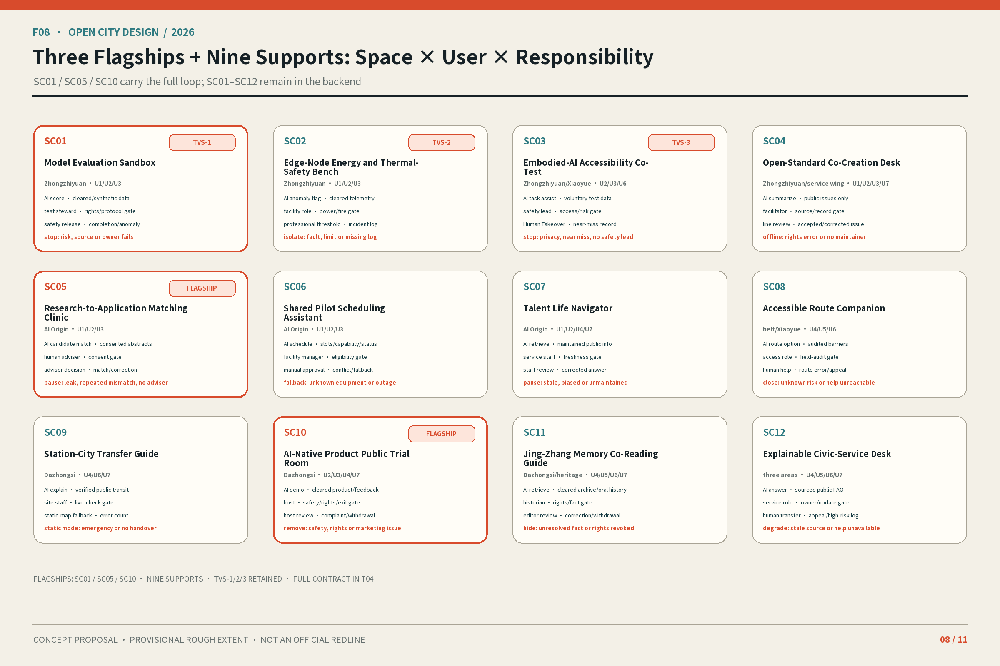
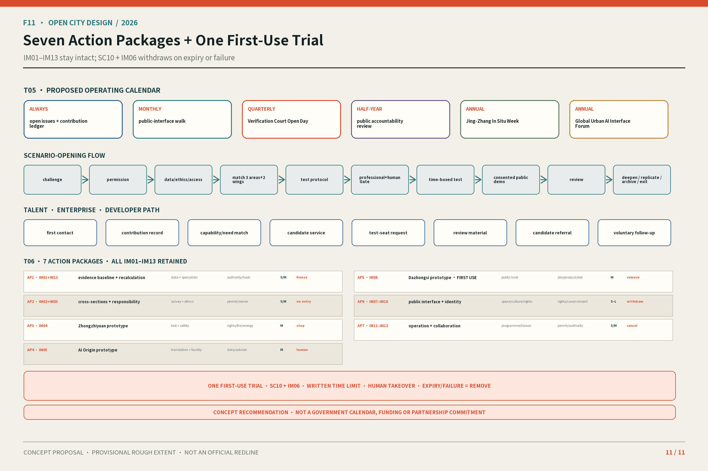

# Jing-Zhang In Situ: Making AI Visible, Human-Takeover-Ready, Verifiable, and Withdrawable

**Thesis:** Jing-Zhang In Situ turns AI from a hidden capability into three urban interfaces that the public can see, take over, verify, and withdraw. **People present, evidence present, and responsibility present** form one evaluation test: can people enter and appeal; can they trace sources and failures; and can they find an accountable person who restores a human service or removes the intervention? This remains an open-co-creation conceptual recommendation, not an approved plan, government commitment, or engineering conclusion.

Four primary messages organize the submission: (1) the threefold presence test; (2) one in-situ spine + three in-situ prototypes + twelve candidate responsibility cross-sections; (3) three flagship scenarios, SC01/SC05/SC10, + nine supporting scenarios; and (4) seven action packages + one time-bounded reversible first-use trial. The 30-second path is F01→F03→F08→F11; the three-minute path checks space, scenario, and withdrawal along the same route; the fifteen-minute path then opens F02/F04/F05/F06/F07/F09/F10, T01–T07, matrices, and sources.

## Design Basis and Source List

The announcement, agent taskbook, public site package, source registry, and local professional-standard snapshots define the task and the permissible strength of claims. Processed material is navigation, not substitute evidence.[source:DATA-SRC-OFFICIAL-ANNOUNCEMENT-20260509] [source:DATA-SRC-AGENT-TASKBOOK-20260518] [source:REPO-SOURCE-REGISTRY]

The organizer has not supplied official polygons for the three scope levels or three key areas. SITE and KEY_AREA are rough provisional constraints usable only for generation, intake checks, and scenario comparison. They do not establish a redline, ownership, approval, statutory land use, precise area, or feasibility. Official boundaries must trigger one-batch recalculation of all nine geometry layers, metrics, F01–F11, HTML, and PDFs.[source:DATA-SRC-PROVISIONAL-BOUNDARIES-20260605] [data:geometry/site_boundary.geojson#SITE-001]

Regulatory plans, parcel rights, building surveys, structure, fire, daylight, utilities, heritage, road sections, flows, parking, municipal capacity, enterprise/talent baselines, and field surveys remain unavailable. The proposal therefore does not fill unknown FAR, height, density, demolition, redlines, cost, bridge/tunnel, underground, or approval claims.[standard:PROJECT-OFFICIAL-ANNOUNCEMENT] [depth:existing_conditions_diagnosis]

## Three-Level Scope Framework

### Overall concept, naming, and visual identity

“Jing-Zhang” anchors railway heritage, spatial continuity, and public memory. “In Situ” requires people to enter, evidence to remain traceable, and responsibility to take over. It means learning and correcting on site, not claiming implementation. F06 uses two tracks, twelve ticks, three nodes, and open arcs to represent one belt, twelve cross-sections, three zones and two wings, and revisable interfaces. It uses no corporate mark or unauthorized railway identity.[standard:PROJECT-AGENT-OPEN-CALL-TASKBOOK] [depth:overall_spatial_structure]

### Three Positionings, Five Functions, and Three Zones and Two Wings

The three positionings are a Century-Old Jing-Zhang Cultural Belt, an Urban AI Life-Experience Belt, and an AI Convergence-Innovation Belt. T01 translates the five functions into inspectable mechanisms.

| T01 function | Main carrier | In-situ test |
| --- | --- | --- |
| Full-stack independent AI innovation | Zhongzhiyuan | Controlled tests, failure records, human stop |
| World-class AI innovation ecosystem | AI Origin + Zhongguancun wing | Matching, shared pilots, talent support, refusals |
| New AI+ scenario paradigm | Xiaoyue River wing + 12 cross-sections | Public co-test, low-tech alternative, appeal |
| Vibrant AI-enabled city | Park, public ground floors, station-city interfaces | Everyday access, legible status, withdrawal |
| Global voice in AI governance | Shared by three zones | Open sources, responsibility, review, stop |

### Twelve Everyday Cross-Sections

The north–south heritage park is the **in-situ spine**. CX01–CX12 are twelve east–west candidate responsibility cross-sections for field investigation, not engineering alignments. Each later needs a condition–plan–section–operation evidence set covering crossings, accessibility, cycling, shade, ground-floor use, lighting, seating, maintenance, human help, and exit. No connectivity rate or performance threshold is claimed now.[depth:three_level_scope_framework] [data:geometry/roads.geojson#ROAD-001] [data:geometry/public_space.geojson#PUBLIC-001]

CX01–CX12 and SC01–SC12 are separate systems. The types are riverfront R&D, campus gateway, research courtyard, campus ground floor, research conversion, talent life, neighborhood seam, Xiaoyue accessibility, rail interchange, station-city commons, market-culture ground floor, and quiet-care interface. Actual position and dimensions await survey.

## Coordinated Research Area: Industry and Future City Research

### Comparative mechanisms from global cases

T02 transfers only registered organizational mechanisms—not numbers, imagery, spatial conclusions, or partnership claims.

| T02 source | Mechanism for discussion | Local question |
| --- | --- | --- |
| Seoul AI Hub | Staged PoC and follow-up interface | How does a test leave review and choices? |
| one-north | Research cluster, living lab, public realm | How can R&D security coexist with access? |
| STATION F / F.ai | Cohort, office hours, access gradients | How are community and space accountable? |
| Maria 01 | Heritage reuse and incremental operation | How does heritage join innovation gradually? |
| Mila | Research, translation, talent, responsible AI | How does public interest enter conversion? |
| Dubai Future Accelerators | Challenge–pilot–evaluation | How does validation gain gates and stops? |
| Marineterrein | Reversible temporary use and exit | How can a failed trial restore the site? |

The first three mechanisms are supported by registered background sources.[source:CASE-SEOUL-AI-HUB-20250710] [source:CASE-SINGAPORE-ONE-NORTH-20230703] [source:CASE-STATION-F-FAI-20260211]

Heritage reuse and responsible governance remain background questions.[source:CASE-HELSINKI-MARIA-AREA] [source:CASE-MILA-IMPACT-20211118]

Challenge-led validation and reversible temporary use inform only gates.[source:CASE-DUBAI-FUTURE-ACCELERATORS] [source:CASE-AMSTERDAM-MARINETERREIN]

### Ecosystem map and eight enabling elements

F07 moves land, space, industry, capital, talent, compute, data, and scenarios through research→matching→controlled testing→public co-testing→feedback. Complaints, failures, costs, and revisions return to research. Land, capital, compute, and external regions remain authorization-dependent conditions, not committed resources or partners.[source:DATA-SRC-AGENT-TASKBOOK-20260518] [depth:overall_spatial_structure]

## Overall Design Area: Urban Renewal and Regulatory-Plan-Level Urban Design

Renewal uses three reversible verbs. **KEEP** retains buildings, mature trees, and services shown by survey to have public value. **OPEN** unlocks park edges, courtyards, and public ground floors only when rights, safety, and operations permit. **INTENSIFY** first raises use through shared time and reversible components; it does not presume more development.[standard:MOHURD-CONTROL-DETAILED-PLANNING] [depth:retain_renovate_demolish]

This differentiated mechanism binds the renewal-space network to the threefold-presence responsibility system: every spatial move must state its public entry, evidence status, accountable role, and restoration path. It does not merely rename conventional zoning with “AI.”

Provisional land use tests relationships among public access, innovation services, everyday care, and blue-green continuity. LU-001/LU-002 organize innovation and public interfaces; LU-003/LU-004 organize living and blue-green scenarios. Topological coverage does not prove statutory use.[data:geometry/land_use.geojson#LU-001] [data:geometry/land_use.geojson#LU-002]

FAR, height, density, building scale, and permanent construction await official controls and building records.[data:geometry/land_use.geojson#LU-003] [data:geometry/land_use.geojson#LU-004] [depth:development_intensity_controls]

## Detailed Design of Key Areas

All three prototypes use one space–scenario–human–evidence–withdrawal review frame, but carry different responsibilities.[depth:three_key_area_detailed_design] [metric:key_area_count]

### Zhongzhiyuan AI Independent Innovation Acceleration Area

The “riverfront validation interface” uses an evidence court, reversible display gallery, and controlled yard for flagship SC01 and supporting SC02–SC04. It makes protocols, status, and failures public. Rights, river constraints, energy, fire, and access await verification.[data:geometry/key_areas.geojson#PROV-KEY-001]

### Beijing AI Origin Community

The “open ground-floor campus” links flagship SC05 with supporting SC06, SC07, and SC12. A human adviser makes every referral; property rights, fire, operation, and accessibility gate entry.[data:geometry/key_areas.geojson#PROV-KEY-002]

### Dazhongsi AI Industry Cluster

The “four-quadrant station-city commons” hosts flagship SC10 and supporting SC08, SC09, and SC11. Ground-level continuity and human service come first. No underground connection, leasing, or building intervention is promised.[data:geometry/key_areas.geojson#PROV-KEY-003]

## AI Innovation Ecosystem, Personas, and AI+ Scenarios

### Seven personas

| T03 ID | Role | Protected entry |
| --- | --- | --- |
| U1 | Researchers and R&D staff | Controlled test, evidence review |
| U2 | Start-up and product teams | Rights, refusal, removal |
| U3 | Operations, safety, professional review | Human takeover, logs |
| U4 | Residents, community workers, merchants | Low-tech fallback, appeal |
| U5 | Children, carers, educators | Supervision, content review |
| U6 | Older and disabled visitors, companions | Accessibility, human help |
| U7 | International developers and visitors | Bilingual status, permission limits |

Every SC retains the same twelve-field responsibility contract: conceptual status, users, carrier, AI role, minimum data, proposed operator, human review, low-tech fallback, appeal, entry, evaluation, and exit. No accountable role or unresolved high-risk issue means no entry or immediate stop.[source:DATA-SRC-AGENT-TASKBOOK-20260518] [depth:municipal_new_infrastructure]

The three industrial testing-and-validation IDs remain locked: TVS-1 = SC01 model evaluation, TVS-2 = SC02 energy and thermal safety, and TVS-3 = SC03 embodied-AI accessibility co-testing. The 3+9 hierarchy does not remove those three professional validation obligations.

### Twelve scenario cards

The three flagships carry different responsibilities. **SC01 Model Evaluation Sandbox** in Zhongzhiyuan uses public or cleared benchmarks, synthetic data, and test logs; safety staff release it, and it stops for invalid sources or unresolved safety. **SC05 Research-to-Application Matching Clinic** at AI Origin uses only voluntarily supplied, match-permitted summaries; a human adviser chooses referrals, and leakage, persistent mismatch, or no adviser pauses service. **SC10 AI-Native Product Public Trial Room** at Dazhongsi uses cleared product notices and voluntary feedback; a host supervises, no purchase is automated, and safety, rights, misleading marketing, or failed complaint handling removes the trial.

| T04 group | Carrier / users | AI and minimum data | Human, low-tech, appeal | Evaluation / exit |
| --- | --- | --- | --- | --- |
| Flagship SC01 | Zhongzhiyuan; U1/U2/U3 | Evaluation; cleared benchmark, synthetic data, logs | Safety release; offline script; incident log | Protocol/exception/takeover; unresolved issue stops |
| Flagship SC05 | AI Origin; U1/U2/U3 | Matching; voluntary summaries, public needs | Adviser decides; booking ledger; correction | Consent/refusal/mismatch; leak stops |
| Flagship SC10 | Dazhongsi; U2/U3/U4/U7 | Trial; cleared notice, voluntary feedback | Host; paper feedback; complaint | Exit/complaint; dispute removes |
| Support SC02/SC03/SC04 | Zhongzhiyuan/Xiaoyue; U1/U2/U3/U6/U7 | Thermal safety, accessibility co-test, standards; permitted data | Experts/safety host/facilitator; meter, escort, issue wall | Threshold, near miss, rights, or no maintainer stops |
| Support SC06/SC07/SC12 | AI Origin/three zones; U1–U7 | Scheduling, life guide, public FAQ; public/voluntary minima | Administrator/service staff; sheet, map, counter | Conflict, discrimination, expiry, risky error downgrades |
| Support SC08/SC09/SC11 | Spine/Dazhongsi; U4–U7 | Route, interchange, co-reading; verified routes/transit/archives | Service point/on-site/history review; paper/static/audio-text | Route, emergency, fact, or rights issue hides/closes |

The backend boundaries remain explicit. **SC02** reads only cleared device telemetry and isolates for exceeded professional thresholds or incomplete logs. **SC03** collects voluntary tasks and environmental state, never an identity profile, and stops after a near miss or without a safety host. **SC04** summarizes only public standards, issues, and objections; a facilitator verifies each item, and misattribution, rights problems, or no maintainer takes it down.

**SC06** handles public time slots, equipment labels, and application state, returning to a manual sheet when permissions conflict. **SC07** uses public service information and active choices, pausing for stale, discriminatory, or unmaintained results. **SC12** cites dated public FAQs, never final legal, medical, or fire advice, and downgrades when sources or human transfer fail.

**SC08** requires a field accessibility audit and never continuously tracks identity. **SC09** explains verified public transport information and switches to a static map during emergencies or data error. **SC11** uses cleared archives and consented oral material, hiding disputed or withdrawn material. These nine are protection layers for the flagships and spine, not a decorative list.

F08 indexes the 3+9 portfolio without changing SC01–SC12.[data:geometry/public_space.geojson#PUBLIC-001]

## Land Use, Building Scale, and Retain-Renovate-Demolish Strategy

Land use and buildings remain provisional scenarios. Public ground floors, footprints, permeability, setbacks, roofs, and reversible components may be developed only after rights, structure, fire, daylight, utilities, and heritage checks.[standard:MNR-LAND-USE-CLASSIFICATION-GUIDE] [depth:land_use_layout]

The current footprint only recalculates a submitted scenario; it is neither surveyed condition nor approved envelope. Failure of any premise returns the proposal to a public-space or operational test.[data:geometry/buildings.geojson#BLDG-001] [metric:building_footprint_area_sqm] [depth:height_massing_character]

Development must first align source authority, survey date, current use, rights, accessible entries, structure, and fire conditions for each unit. Until then, map colors are scenarios only. They cannot support total floor area, FAR, coverage, density, acquisition, demolition, extension, or leasing lists.

## Transport, Rail, Municipal Infrastructure, and Public Services

Priority is walking, accessibility, cycling, public-transport connection, then necessary vehicles. Station work begins with ground-level legibility and human service. Without redlines, sections, flows, or parking data, no capacity, safety, bridge/tunnel, or underground conclusion follows.[depth:traffic_rail_slow_parking] [data:geometry/roads.geojson#ROAD-001]

Small edge nodes may combine seating, shade, light, and status information, but qualified teams must confirm power, heat, noise, cybersecurity, fire, drainage, and maintenance. Every high-risk service must switch to a human or static mode.

Cross-section audits record real conflict and responsibility across times: walking/cycling, accessibility, transit, loading/parking, emergency access, light/shade, and human help. A survey becomes evidence only after date, method, coverage, and rights are registered; otherwise it remains pending and produces no capacity or parking-demand number.

## Blue-Green Network, Public Space, and Urban Character

Qinghe, Xiaoyue River, the heritage park, and neighborhood shade form a pending field hypothesis for cooling, movement, and encounter. Green/public ratios compare submitted geometry only and are not statutory. AI devices cannot replace canopy, drainage, lighting, seating, tactile paths, or maintenance.[depth:blue_green_public_space] [data:geometry/green_space.geojson#GREEN-001] [metric:green_ratio]

Absolute green-space area recalculates the scenario layer only.[metric:green_space_area_sqm]

Absolute public-space area and ratio likewise recalculate with the provisional boundary.[metric:public_space_area_sqm] [metric:public_space_ratio]

### Three landmarks, the Open Contribution Ledger, and component library

The Zhongzhiyuan Validation Court displays test evidence; the Beijing AI Origin Commons Stage supports open-source explanation and correction; the Dazhongsi City Window connects product trials, culture, and human service. The Open Contribution Ledger records code/tools, data/evidence, scenarios, public service, maintenance, accessibility, and cultural correction. Its only states are submitted, reviewed, adopted, revised, and withdrawn; display never automatically means an award.

C01–C09 are the evidence pillar, cross-section marker, human-help point, reversible test bench, accessible seat/shade, data notice, contribution rail, maintenance box, and quiet interface. They specify function, information, accessibility, and responsibility—not structural or construction feasibility.

### Culture, wayfinding, and international communication

The cultural narrative is origin–presence–co-creation; the spatial storyline is track–interface–echo. F10 has **six levels**: overall logo, spatial orientation, cultural trace, scenario status, public service, and temporary activity. Fixed status terms are “Conceptual Recommendation,” “Controlled Test,” “Paused,” “Human Takeover,” and “Pending Site Verification.” “24H human service” is prohibited without staffing evidence.

The international line is: **“JING-ZHANG IN SITU: A century-old track, open public interfaces, and AI urban co-creation that people can inspect and correct.”** Every public communication also states the conceptual status and never implies selection, approval, or construction.

## Renewal Projects, Implementation Policy, and Phasing

Near-term work is limited to source baseline, cross-section survey, responsibility protocol, and reversible prototypes. Medium-term discussion of public ground floors, blue-green mobility, components, and landmarks requires rights and professional conditions. Permanent work awaits regulatory, transport, municipal, and engineering studies. Phases are not approvals.[data:geometry/phasing.geojson#PHASE-001] [depth:phasing_implementation]

### Annual operation and conversion pathway

| T05 frequency | Candidate activity | Required evidence / cancellation |
| --- | --- | --- |
| Continuous / monthly | Issue and contribution ledger / public-interface walk | Problem, owner, revision; stop without maintainer |
| Quarterly / half-yearly | Validation open day / public-responsibility review | Test, complaint, takeover; cancel if gate fails |
| Annual | Candidate “Jing-Zhang In Situ Week” and “Global Urban AI Interface Forum” brands | Separate permits, rights, staff; not a government calendar |

Scenario access follows open challenge→permission and data/ethics/accessibility screen→match to three zones and two wings→controlled protocol→professional and human gate→time-bounded test→consented public demonstration→review→develop, archive, or exit. A participant pathway ends with voluntary candidate referral; it promises no job, capital, procurement, space, or endorsement.

### Project implementation table

The front stage shows seven packages; the backend preserves the role, dependency, cost class, evidence, and stop action for every IM01–IM13. S/M/L mean research/coordination, reversible operations, and work requiring engineering development—not investment estimates.[depth:renewal_project_list]

| T06 package | Backend IDs | Front-stage action | Gate / withdrawal |
| --- | --- | --- | --- |
| AP1 Evidence baseline and recalculation | IM01+IM13 | Lock authority, differences, hashes | Source conflict freezes derived metrics |
| AP2 Cross-sections and responsibility protocol | IM02+IM03 | Survey CX01–12; define human, appeal, stop | No permit or owner means no entry |
| AP3 Zhongzhiyuan prototype | IM04 | Controlled SC01–04 validation | Professional or safety failure stops |
| AP4 AI Origin prototype | IM05 | SC05/06/07/12 matching and service | Leak, mismatch, unclear facility returns to human |
| AP5 Dazhongsi prototype | IM06 | SC10 flagship plus SC08/09/11 supports | Rights, safety, or complaint failure removes |
| AP6 Public interface and identity | IM07–IM10 | Landmarks, components, wayfinding, ledger | Rights, maintenance, fact, or consent failure removes |
| AP7 Operation and collaboration | IM11–IM12 | Candidate annual activity and external issues | No permit/authorization means no operation/partnership claim |

The **single first-use trial** binds existing **SC10 + IM06**. It starts only when product, site, staff, consumer-rights, accessibility, complaint, and removal permissions are documented. The responsible operator sets a written time limit; expiry defaults to removal and evidence archiving. A host may switch to human service at any time; safety, rights, misleading marketing, or failed complaint closure ends the trial immediately. It is neither SC13 nor IM14 and claims no measured performance.

## Metrics, Area Recalculation, and Compliance Matrix

Known metrics are limited to provisional site area, scenario building footprint, scenario green/public-space ratios, and the taskbook’s count of three key areas. Every visual lowers precision and places “recalculated from provisional boundary” next to the value. Land-use areas by code, total floor area, coverage/density, road area/ratio, phasing area, individual key-area areas, statutory FAR/height, flows, municipal headroom, and performance remain `unknown` pending authoritative data or professional review.[metric:site_area_sqm] [depth:metrics_recalculation]

F05 shows evidence authority and recalculation. The three matrices preserve detailed backend evidence. All 31 required outputs for agent.1–agent.6 receive individual section, figure, table, or structured-file anchors in `compliance_matrix.json`; repeated generic file lists no longer stand in for proof.[standard:MOHURD-ARCH-DESIGN-DEPTH-2016] [source:REPO-SOURCE-REGISTRY]

**Ten core claims review route:**

1. **Thesis/test:** three interfaces share people/evidence/responsibility present; introduction and F01/F06; conceptual-status limit.
2. **Evidence boundary:** provisional scope supports only generation/comparison; Design Basis and F01/F05; no redline, rights, or engineering inference.
3. **Spine/cross-sections:** heritage park organizes continuity and CX01–CX12 find breaks; Scope and F01/F04; position/performance await survey.
4. **Three prototypes:** Zhongzhiyuan validates, AI Origin translates, Dazhongsi hosts public trial; Key Areas and F03/F09; all polygons provisional.
5. **3+9 scenarios:** SC01/05/10 carry the full loop and nine add safeguards; T04/F08; twelve-scenario backend unchanged.
6. **Responsibility contract:** each SC keeps data, operator, human, low-tech, appeal, entry, evaluation, exit; T03/T04/F08; real performance unknown.
7. **Eight-element gate loop:** research, matching, test, public co-test, feedback; T02/F07; cases support background mechanisms only.
8. **Reversible renewal:** KEEP/OPEN/INTENSIFY precede permanence; F02/F04/F05; no invented FAR, height, redline.
9. **One first-use trial:** existing SC10+IM06 runs within a written window, then withdraws; T06/F08/F11; no new SC or IM.
10. **Seven packages/audit:** AP1–AP7 cover IM01–IM13 and anchor 6 agents/31 outputs; T06/F05/F11 and matrices; completeness means submission evidence only.

The human-readable 31-output route is six lines: agent.1 narrative/name/logo/structure/compliance (T01/F01/F06); agent.2 cases/ecosystem/industry-space/metrics-sources/index (T02/F05/F07); agent.3 personas/scenarios/space-operation/privacy-human boundary/index (T03/T04/F08); agent.4 public space/landmarks/contribution/components/index (F03/F04/F09); agent.5 culture/wayfinding/storyline/international copy/index (F10); agent.6 annual events/brand IP/developer and scenario operation/conversion/index (T05/F06/F11). The machine layer retains every original output key.

| T07 manual bilingual review | Finding |
| --- | --- |
| 13-section order, one thesis, four messages, ten claims | Same order and strength |
| Proper names, threefold presence, six-level wayfinding, fixed states | Compared item by item |
| SC/CX/IM/AP/U/C/TVS and F/T IDs | Same sets and groupings |
| Metric status, source markers, provisional boundary, figure position | No raised confidence or dropped limitation |

Exact section, figure/table, data, source, and limitation anchors live in `review_navigation.core_claims`. T07 records the manual parity conclusion and does not replace machine checks.

## Risk, Copyright, and Compliance

Key gaps are official boundaries, controls/rights, building conditions, transport/municipal/fire, heritage/ecology, enterprise/talent data, and real demand. Key risks are treating provisional data as official, AI bypassing humans, activities becoming promises, bilingual text weakening limits, and rights chains breaking. The response is to pause the claim, register the gap, await authorized input, and recalculate together.[depth:risk_missing_data] [standard:MOHURD-URBAN-DESIGN-MEASURES]

The path-level rights ledger covers bilingual text/HTML, F01–F11, A3/A0, fonts, icons, data, and code. Any new or regenerated asset reopens clearance. Medical, legal, fire, transport, structural, energy, and approval conclusions belong to accountable people or qualified teams. A passing self-check means only that the package may enter further review, not selection, approval, publication, or implementation.

This phase freezes the name; F/T/SC/CX/IM/C numbering; the threefold test; the fixed spatial grammar; the 3+9 portfolio; and seven-package mapping. Later work must not promote candidate collaboration into an existing partnership, replace design judgment with validator keywords, or draw fake precision. Questions needing fieldwork or authorization retain owner, trigger, and stop state until AP1 can review them in one batch.

## References

The announcement and taskbook delimit the task; standards delimit depth; the registry delimits use; provisional boundaries support only generation and recalculation. `REPO-PROCESSED-FACT-PACK` is navigation only; all seven cases are `background_only`. Readers can trace claims through `sources.json`, `assumptions.json`, `metrics.json`, GeoJSON, and the three matrices.[source:REPO-PROCESSED-FACT-PACK]

Reference order is direct source first, registry metadata second, processed pack only for navigation. If a source fails, exceeds permitted use, or conflicts with an authoritative version, the adjacent claim downgrades and enters AP1. A case, search snippet, or generated text never substitutes for an official attachment. Figure short codes must resolve to the same registry record, and the English text may not remove limits or increase certainty.

All spatial, scenario, identity, event, and collaboration content remains an open-co-creation recommendation for professional development. It neither replaces formal planning nor constitutes government approval or resource commitment.
