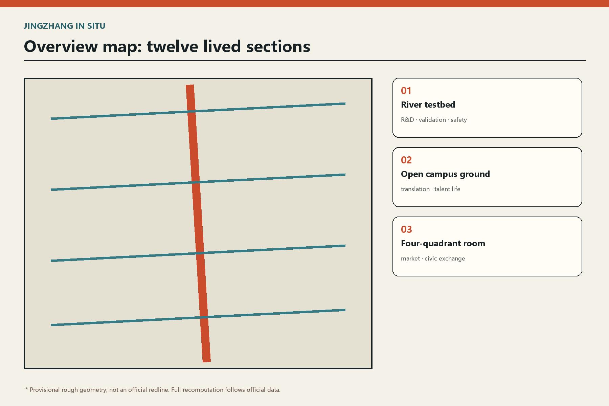
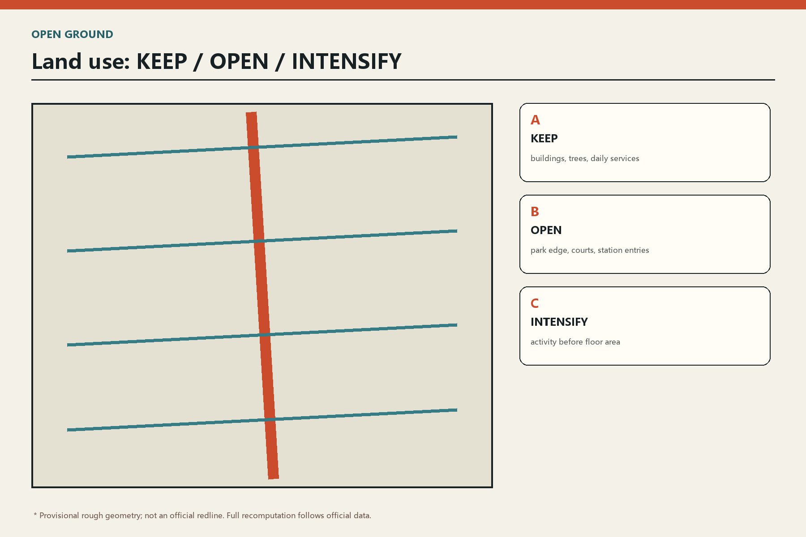
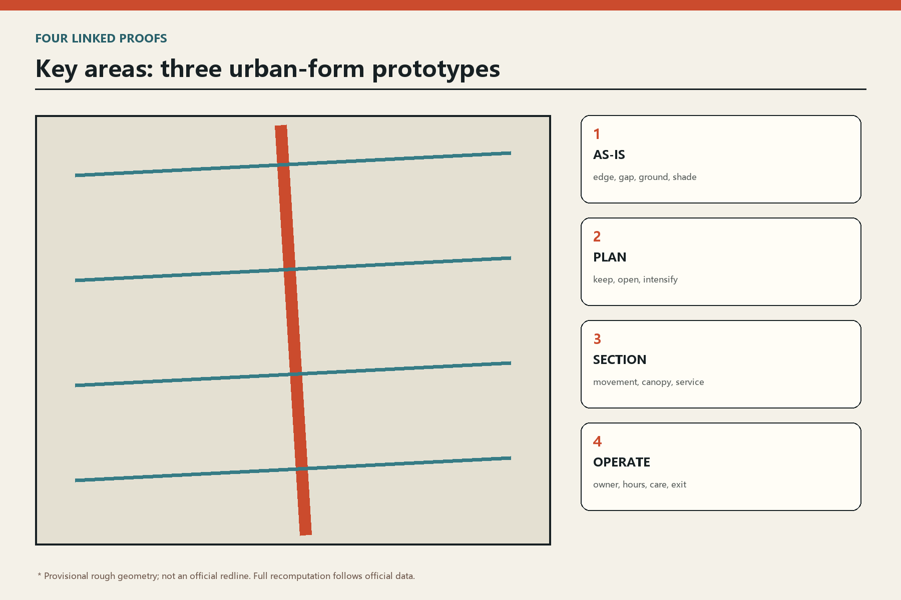
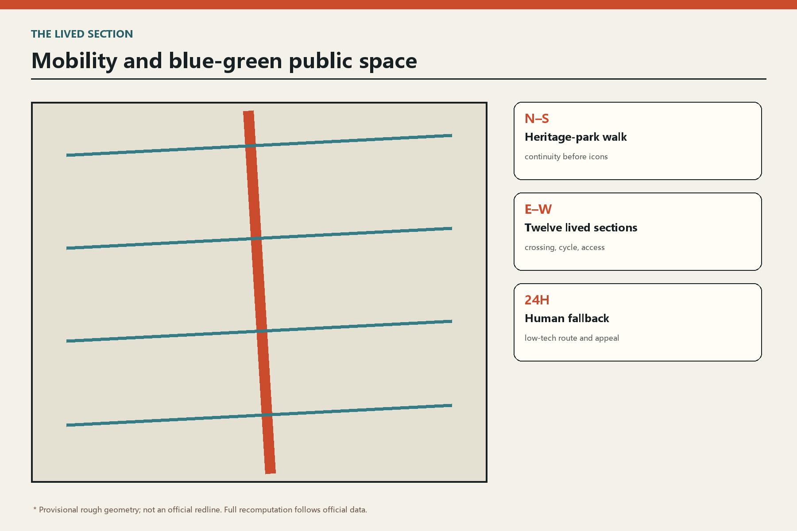
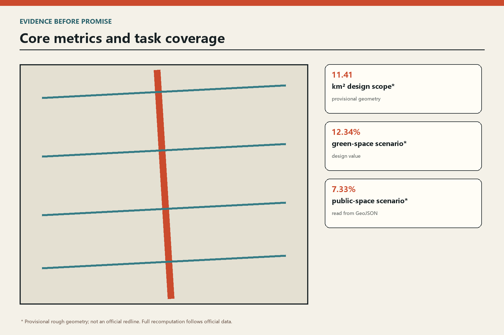

# JINGZHANG IN SITU: From the Built Park to Three Working AI Urban Interfaces

## Design Basis and Data Inventory

This proposal treats the urban interface rather than a technical slogan as the design object. It uses four linked proofs—an as-is record, a spatial plan, a lived section and an operations sheet—before any scenario may become an implementation proposal. The north-south heritage park is a civic backbone, while twelve east-west sections test crossings, accessible movement, shade, active ground floors and maintainable AI services.

Zhongzhiyuan is a river testbed for full-stack research and safety; AI Origin is an open campus ground for translation and talent life; Dazhongsi is a four-quadrant station room for market experience and civic exchange. All spatial moves are conceptual recommendations. Six official polygons and statutory controls are missing, so provisional rough geometry is never presented as a redline, ownership evidence, approval or engineering feasibility.

Evidence is separated into source, assumption, geometry, metric and human review. Official polygons, ownership, regulatory controls, road redlines, heritage controls, utilities and observed demand remain missing and trigger full recomputation when supplied.

[source:OFFICIAL-ANNOUNCEMENT] [source:AGENT-TASKBOOK] [standard:PROJECT-OFFICIAL-ANNOUNCEMENT]。证据续见：[standard:MOHURD-ARCH-DESIGN-DEPTH-2016] [depth:existing_conditions_diagnosis] [data:geometry/site_boundary.geojson#SITE-001]。证据续见：[metric:site_area_sqm]

## Three-Level Scope Framework

This proposal treats the urban interface rather than a technical slogan as the design object. It uses four linked proofs—an as-is record, a spatial plan, a lived section and an operations sheet—before any scenario may become an implementation proposal. The north-south heritage park is a civic backbone, while twelve east-west sections test crossings, accessible movement, shade, active ground floors and maintainable AI services.

Zhongzhiyuan is a river testbed for full-stack research and safety; AI Origin is an open campus ground for translation and talent life; Dazhongsi is a four-quadrant station room for market experience and civic exchange. All spatial moves are conceptual recommendations. Six official polygons and statutory controls are missing, so provisional rough geometry is never presented as a redline, ownership evidence, approval or engineering feasibility.

KEEP protects useful buildings, mature trees and daily services. OPEN makes park edges, courts and ground floors public. INTENSIFY adds shared hours and lightweight activity before floor area. Twelve scenario cards retain minimum data, human review, low-tech alternatives, appeal and stop conditions.

[standard:PROJECT-AGENT-OPEN-CALL-TASKBOOK] [depth:three_level_scope_framework] [depth:overall_spatial_structure]。证据续见：[data:geometry/key_areas.geojson#PROV-KEY-001]

## Industry and Future-City Research

This proposal treats the urban interface rather than a technical slogan as the design object. It uses four linked proofs—an as-is record, a spatial plan, a lived section and an operations sheet—before any scenario may become an implementation proposal. The north-south heritage park is a civic backbone, while twelve east-west sections test crossings, accessible movement, shade, active ground floors and maintainable AI services.

Zhongzhiyuan is a river testbed for full-stack research and safety; AI Origin is an open campus ground for translation and talent life; Dazhongsi is a four-quadrant station room for market experience and civic exchange. All spatial moves are conceptual recommendations. Six official polygons and statutory controls are missing, so provisional rough geometry is never presented as a redline, ownership evidence, approval or engineering feasibility.

Evidence is separated into source, assumption, geometry, metric and human review. Official polygons, ownership, regulatory controls, road redlines, heritage controls, utilities and observed demand remain missing and trigger full recomputation when supplied.

[source:AGENT-TASKBOOK] [depth:overall_spatial_structure] [data:geometry/phasing.geojson#PHASE-001]

## Urban Renewal and Regulatory-Depth Design

This proposal treats the urban interface rather than a technical slogan as the design object. It uses four linked proofs—an as-is record, a spatial plan, a lived section and an operations sheet—before any scenario may become an implementation proposal. The north-south heritage park is a civic backbone, while twelve east-west sections test crossings, accessible movement, shade, active ground floors and maintainable AI services.

Zhongzhiyuan is a river testbed for full-stack research and safety; AI Origin is an open campus ground for translation and talent life; Dazhongsi is a four-quadrant station room for market experience and civic exchange. All spatial moves are conceptual recommendations. Six official polygons and statutory controls are missing, so provisional rough geometry is never presented as a redline, ownership evidence, approval or engineering feasibility.

KEEP protects useful buildings, mature trees and daily services. OPEN makes park edges, courts and ground floors public. INTENSIFY adds shared hours and lightweight activity before floor area. Twelve scenario cards retain minimum data, human review, low-tech alternatives, appeal and stop conditions.

[standard:MOHURD-CONTROL-DETAILED-PLANNING] [standard:MNR-LAND-USE-CLASSIFICATION-GUIDE] [depth:land_use_layout]。证据续见：[depth:development_intensity_controls] [depth:building_height_massing] [depth:retain_renovate_remove]。证据续见：[data:geometry/land_use.geojson#LU-001] [metric:building_footprint_area_sqm]

## Detailed Design of the Three Key Areas

This proposal treats the urban interface rather than a technical slogan as the design object. It uses four linked proofs—an as-is record, a spatial plan, a lived section and an operations sheet—before any scenario may become an implementation proposal. The north-south heritage park is a civic backbone, while twelve east-west sections test crossings, accessible movement, shade, active ground floors and maintainable AI services.

Zhongzhiyuan is a river testbed for full-stack research and safety; AI Origin is an open campus ground for translation and talent life; Dazhongsi is a four-quadrant station room for market experience and civic exchange. All spatial moves are conceptual recommendations. Six official polygons and statutory controls are missing, so provisional rough geometry is never presented as a redline, ownership evidence, approval or engineering feasibility.

Evidence is separated into source, assumption, geometry, metric and human review. Official polygons, ownership, regulatory controls, road redlines, heritage controls, utilities and observed demand remain missing and trigger full recomputation when supplied.

[depth:three_key_area_detailed_design] [data:geometry/key_areas.geojson#PROV-KEY-001] [data:geometry/key_areas.geojson#PROV-KEY-002]。证据续见：[data:geometry/key_areas.geojson#PROV-KEY-003] [metric:key_area_count]

## AI Ecosystem, Talent and AI-Enabled Scenarios

This proposal treats the urban interface rather than a technical slogan as the design object. It uses four linked proofs—an as-is record, a spatial plan, a lived section and an operations sheet—before any scenario may become an implementation proposal. The north-south heritage park is a civic backbone, while twelve east-west sections test crossings, accessible movement, shade, active ground floors and maintainable AI services.

Zhongzhiyuan is a river testbed for full-stack research and safety; AI Origin is an open campus ground for translation and talent life; Dazhongsi is a four-quadrant station room for market experience and civic exchange. All spatial moves are conceptual recommendations. Six official polygons and statutory controls are missing, so provisional rough geometry is never presented as a redline, ownership evidence, approval or engineering feasibility.

KEEP protects useful buildings, mature trees and daily services. OPEN makes park edges, courts and ground floors public. INTENSIFY adds shared hours and lightweight activity before floor area. Twelve scenario cards retain minimum data, human review, low-tech alternatives, appeal and stop conditions.

[source:AGENT-TASKBOOK] [depth:municipal_new_infrastructure] [data:geometry/public_space.geojson#PUBLIC-001]

## Land Use, Building Scale and Spatial Controls

This proposal treats the urban interface rather than a technical slogan as the design object. It uses four linked proofs—an as-is record, a spatial plan, a lived section and an operations sheet—before any scenario may become an implementation proposal. The north-south heritage park is a civic backbone, while twelve east-west sections test crossings, accessible movement, shade, active ground floors and maintainable AI services.

Zhongzhiyuan is a river testbed for full-stack research and safety; AI Origin is an open campus ground for translation and talent life; Dazhongsi is a four-quadrant station room for market experience and civic exchange. All spatial moves are conceptual recommendations. Six official polygons and statutory controls are missing, so provisional rough geometry is never presented as a redline, ownership evidence, approval or engineering feasibility.

Evidence is separated into source, assumption, geometry, metric and human review. Official polygons, ownership, regulatory controls, road redlines, heritage controls, utilities and observed demand remain missing and trigger full recomputation when supplied.

[standard:MOHURD-URBAN-DESIGN-MEASURES] [depth:development_intensity_controls] [depth:building_height_massing]。证据续见：[data:geometry/buildings.geojson#BLDG-001] [metric:building_footprint_area_sqm]

## Mobility, Rail, Utilities and Public Services

This proposal treats the urban interface rather than a technical slogan as the design object. It uses four linked proofs—an as-is record, a spatial plan, a lived section and an operations sheet—before any scenario may become an implementation proposal. The north-south heritage park is a civic backbone, while twelve east-west sections test crossings, accessible movement, shade, active ground floors and maintainable AI services.

Zhongzhiyuan is a river testbed for full-stack research and safety; AI Origin is an open campus ground for translation and talent life; Dazhongsi is a four-quadrant station room for market experience and civic exchange. All spatial moves are conceptual recommendations. Six official polygons and statutory controls are missing, so provisional rough geometry is never presented as a redline, ownership evidence, approval or engineering feasibility.

KEEP protects useful buildings, mature trees and daily services. OPEN makes park edges, courts and ground floors public. INTENSIFY adds shared hours and lightweight activity before floor area. Twelve scenario cards retain minimum data, human review, low-tech alternatives, appeal and stop conditions.

[depth:traffic_rail_slow_parking] [depth:municipal_new_infrastructure] [data:geometry/roads.geojson#ROAD-001]。证据续见：[data:geometry/constraints.geojson#CONSTRAINTS]

## Blue-Green Space, Public Space and Character

This proposal treats the urban interface rather than a technical slogan as the design object. It uses four linked proofs—an as-is record, a spatial plan, a lived section and an operations sheet—before any scenario may become an implementation proposal. The north-south heritage park is a civic backbone, while twelve east-west sections test crossings, accessible movement, shade, active ground floors and maintainable AI services.

Zhongzhiyuan is a river testbed for full-stack research and safety; AI Origin is an open campus ground for translation and talent life; Dazhongsi is a four-quadrant station room for market experience and civic exchange. All spatial moves are conceptual recommendations. Six official polygons and statutory controls are missing, so provisional rough geometry is never presented as a redline, ownership evidence, approval or engineering feasibility.

Evidence is separated into source, assumption, geometry, metric and human review. Official polygons, ownership, regulatory controls, road redlines, heritage controls, utilities and observed demand remain missing and trigger full recomputation when supplied.

[depth:blue_green_public_space] [data:geometry/green_space.geojson#GREEN-001] [data:geometry/public_space.geojson#PUBLIC-001]。证据续见：[metric:green_ratio] [metric:public_space_ratio]

## Renewal Projects, Policy and Phasing

This proposal treats the urban interface rather than a technical slogan as the design object. It uses four linked proofs—an as-is record, a spatial plan, a lived section and an operations sheet—before any scenario may become an implementation proposal. The north-south heritage park is a civic backbone, while twelve east-west sections test crossings, accessible movement, shade, active ground floors and maintainable AI services.

Zhongzhiyuan is a river testbed for full-stack research and safety; AI Origin is an open campus ground for translation and talent life; Dazhongsi is a four-quadrant station room for market experience and civic exchange. All spatial moves are conceptual recommendations. Six official polygons and statutory controls are missing, so provisional rough geometry is never presented as a redline, ownership evidence, approval or engineering feasibility.

KEEP protects useful buildings, mature trees and daily services. OPEN makes park edges, courts and ground floors public. INTENSIFY adds shared hours and lightweight activity before floor area. Twelve scenario cards retain minimum data, human review, low-tech alternatives, appeal and stop conditions.

[depth:renewal_project_list] [depth:phasing_implementation] [data:geometry/phasing.geojson#PHASE-001]

## Metrics, Recalculation and Compliance

This proposal treats the urban interface rather than a technical slogan as the design object. It uses four linked proofs—an as-is record, a spatial plan, a lived section and an operations sheet—before any scenario may become an implementation proposal. The north-south heritage park is a civic backbone, while twelve east-west sections test crossings, accessible movement, shade, active ground floors and maintainable AI services.

Zhongzhiyuan is a river testbed for full-stack research and safety; AI Origin is an open campus ground for translation and talent life; Dazhongsi is a four-quadrant station room for market experience and civic exchange. All spatial moves are conceptual recommendations. Six official polygons and statutory controls are missing, so provisional rough geometry is never presented as a redline, ownership evidence, approval or engineering feasibility.

Evidence is separated into source, assumption, geometry, metric and human review. Official polygons, ownership, regulatory controls, road redlines, heritage controls, utilities and observed demand remain missing and trigger full recomputation when supplied.

[depth:metrics_recalculation] [metric:site_area_sqm] [metric:green_ratio]。证据续见：[metric:public_space_ratio] [metric:key_area_count]

## Risk, Copyright and Compliance

This proposal treats the urban interface rather than a technical slogan as the design object. It uses four linked proofs—an as-is record, a spatial plan, a lived section and an operations sheet—before any scenario may become an implementation proposal. The north-south heritage park is a civic backbone, while twelve east-west sections test crossings, accessible movement, shade, active ground floors and maintainable AI services.

Zhongzhiyuan is a river testbed for full-stack research and safety; AI Origin is an open campus ground for translation and talent life; Dazhongsi is a four-quadrant station room for market experience and civic exchange. All spatial moves are conceptual recommendations. Six official polygons and statutory controls are missing, so provisional rough geometry is never presented as a redline, ownership evidence, approval or engineering feasibility.

KEEP protects useful buildings, mature trees and daily services. OPEN makes park edges, courts and ground floors public. INTENSIFY adds shared hours and lightweight activity before floor area. Twelve scenario cards retain minimum data, human review, low-tech alternatives, appeal and stop conditions.

[source:BOUNDARY-SOURCE] [depth:risk_missing_data] [data:geometry/constraints.geojson#CONSTRAINTS]

## References

This proposal treats the urban interface rather than a technical slogan as the design object. It uses four linked proofs—an as-is record, a spatial plan, a lived section and an operations sheet—before any scenario may become an implementation proposal. The north-south heritage park is a civic backbone, while twelve east-west sections test crossings, accessible movement, shade, active ground floors and maintainable AI services.

Zhongzhiyuan is a river testbed for full-stack research and safety; AI Origin is an open campus ground for translation and talent life; Dazhongsi is a four-quadrant station room for market experience and civic exchange. All spatial moves are conceptual recommendations. Six official polygons and statutory controls are missing, so provisional rough geometry is never presented as a redline, ownership evidence, approval or engineering feasibility.

Evidence is separated into source, assumption, geometry, metric and human review. Official polygons, ownership, regulatory controls, road redlines, heritage controls, utilities and observed demand remain missing and trigger full recomputation when supplied.

[source:SOURCE-REGISTRY] [source:PROCESSED-FACT-PACK] [source:SITE-PACKAGE]。证据续见：[source:KEY-AREA-SOURCE] [standard:MOHURD-URBAN-DESIGN-MEASURES]
