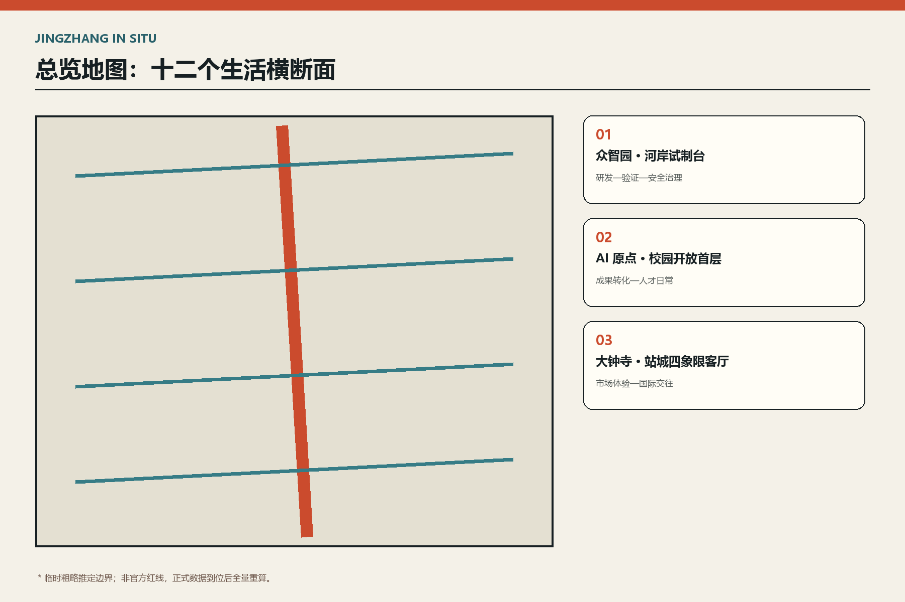
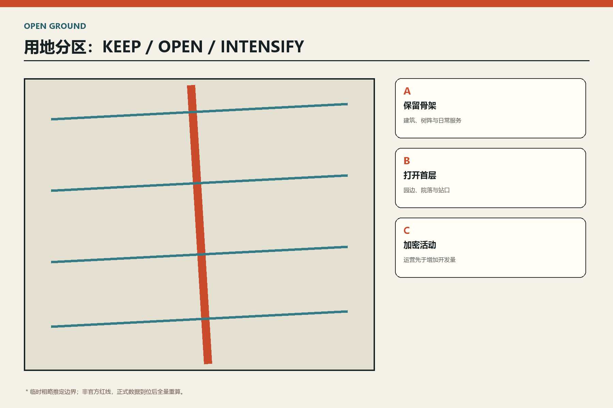
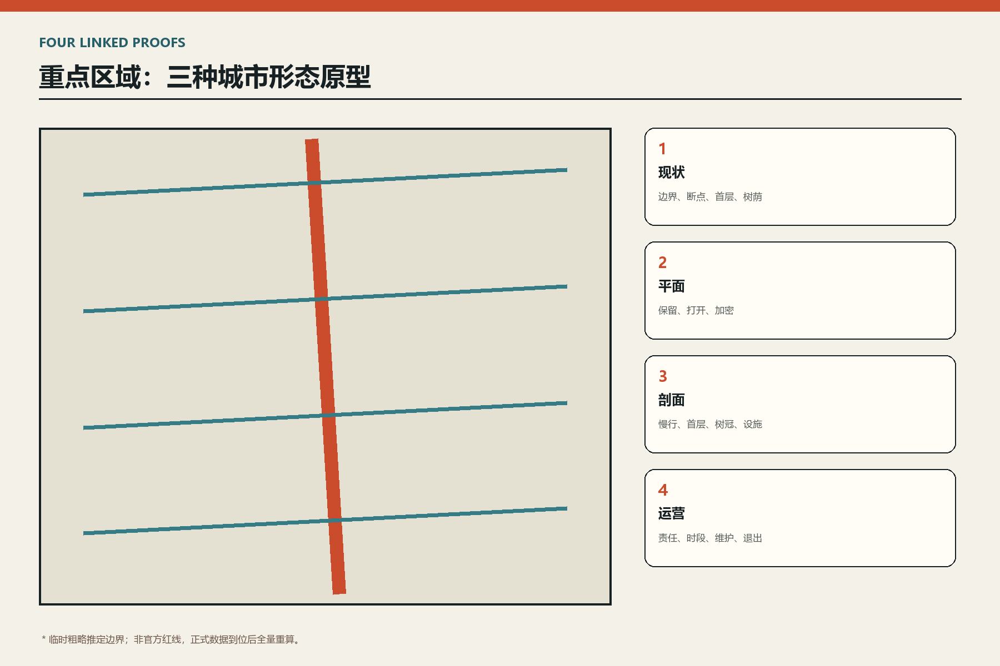
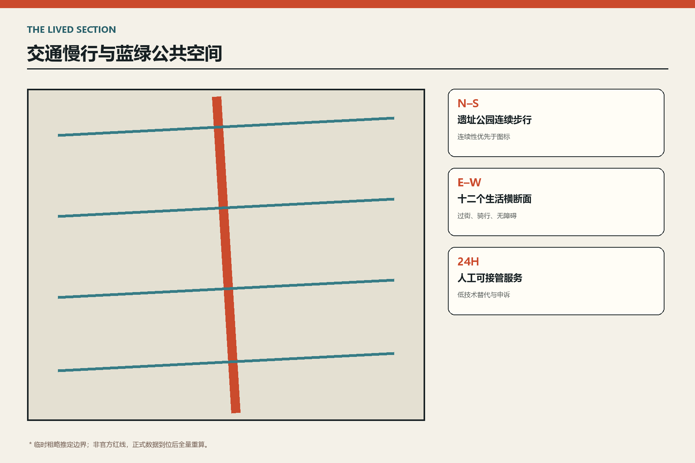
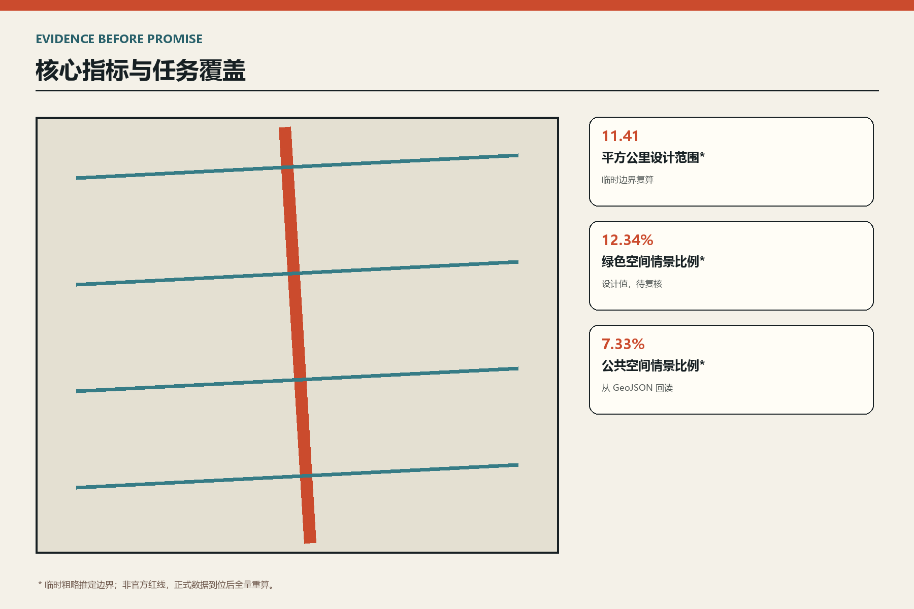

# 京张在场：从已建公园到三处可工作的 AI 城市界面

## 设计依据与资料清单

本方案把城市界面而非技术口号作为设计对象。公告给出三层范围的约面积与文字四至，却没有六个正式 polygon；提交中的 SITE 与 KEY_AREA 因而是临时粗略推定边界，仅用于生成、可视化、intake 自检与非规定性讨论，不是官方红线、权属、审批、精确面积或工程依据。正式 polygon 到位后，九类图层、全部指标、图件、HTML 与 PDF 必须统一重算。设计达到可讨论的城市设计深度，不等于完成或批准控规；FAR、高度、密度、道路红线、文保、市政和消防均保持 unknown。

本方案把城市界面而非技术口号作为设计对象。公告给出三层范围的约面积与文字四至，却没有六个正式 polygon；提交中的 SITE 与 KEY_AREA 因而是临时粗略推定边界，仅用于生成、可视化、intake 自检与非规定性讨论，不是官方红线、权属、审批、精确面积或工程依据。正式 polygon 到位后，九类图层、全部指标、图件、HTML 与 PDF 必须统一重算。设计达到可讨论的城市设计深度，不等于完成或批准控规；FAR、高度、密度、道路红线、文保、市政和消防均保持 unknown。

[source:OFFICIAL-ANNOUNCEMENT] [source:AGENT-TASKBOOK] [standard:PROJECT-OFFICIAL-ANNOUNCEMENT]。证据续见：[standard:MOHURD-ARCH-DESIGN-DEPTH-2016] [depth:existing_conditions_diagnosis] [data:geometry/site_boundary.geojson#SITE-001]。证据续见：[metric:site_area_sqm]

## 三层范围工作框架

统筹层回答创新链与城市生活如何互相支持，总体层回答已建遗址公园周边如何更新，重点片区回答具体界面怎样工作。总体以遗址公园为南北公共骨架，但评价单元下沉到十二个生活横断面。每个横断面必须交付现状、平面、剖面、运营四联证据：记录断点与首层，标注 KEEP/OPEN/INTENSIFY，校核步行骑行无障碍与树冠，并写清责任、开放时段、维护、人工接管和退出条件。

统筹层回答创新链与城市生活如何互相支持，总体层回答已建遗址公园周边如何更新，重点片区回答具体界面怎样工作。总体以遗址公园为南北公共骨架，但评价单元下沉到十二个生活横断面。每个横断面必须交付现状、平面、剖面、运营四联证据：记录断点与首层，标注 KEEP/OPEN/INTENSIFY，校核步行骑行无障碍与树冠，并写清责任、开放时段、维护、人工接管和退出条件。

[standard:PROJECT-AGENT-OPEN-CALL-TASKBOOK] [depth:three_level_scope_framework] [depth:overall_spatial_structure]。证据续见：[data:geometry/key_areas.geojson#PROV-KEY-001]

## 统筹研究范围产业与未来城市研究

产业闭环按原始创新—中试验证—孵化转化—市场体验—公众反馈—安全治理组织。众智园承担全栈研发、测试与治理，AI 原点连接高校成果、共享中试和人才日常，大钟寺承接 AI 原生产品、内容消费与国际交往。六个参考机制用于比较透明治理、慢行、复合首层和持续运营，不把外地绩效平移为本项目成果；季度开放日、半年公共复盘、年度界面大会与跨校开源周把品牌落实为日历。

产业闭环按原始创新—中试验证—孵化转化—市场体验—公众反馈—安全治理组织。众智园承担全栈研发、测试与治理，AI 原点连接高校成果、共享中试和人才日常，大钟寺承接 AI 原生产品、内容消费与国际交往。六个参考机制用于比较透明治理、慢行、复合首层和持续运营，不把外地绩效平移为本项目成果；季度开放日、半年公共复盘、年度界面大会与跨校开源周把品牌落实为日历。

[source:AGENT-TASKBOOK] [depth:overall_spatial_structure] [data:geometry/phasing.geojson#PHASE-001]

## 总体设计范围城市更新与控规深度城市设计

更新只有三个动词：KEEP 保留可用建筑、成熟树阵与日常服务；OPEN 打开封闭首层、园边和院落；INTENSIFY 通过共享时段、混合活动与轻量构件加密使用，而不是先增加开发量。完整用地覆盖与建筑包络均为设计情景，须在权属、结构、消防、日照、管线和文保底图补齐后深化。本方案不填未知 FAR 与高度，不下拆改留结论。

更新只有三个动词：KEEP 保留可用建筑、成熟树阵与日常服务；OPEN 打开封闭首层、园边和院落；INTENSIFY 通过共享时段、混合活动与轻量构件加密使用，而不是先增加开发量。完整用地覆盖与建筑包络均为设计情景，须在权属、结构、消防、日照、管线和文保底图补齐后深化。本方案不填未知 FAR 与高度，不下拆改留结论。

[standard:MOHURD-CONTROL-DETAILED-PLANNING] [standard:MNR-LAND-USE-CLASSIFICATION-GUIDE] [depth:land_use_layout]。证据续见：[depth:development_intensity_controls] [depth:building_height_massing] [depth:retain_renovate_remove]。证据续见：[data:geometry/land_use.geojson#LU-001] [metric:building_footprint_area_sqm]

## 重点区域详细设计

众智园原型是河岸试制台，以花园研发单元、可逆展示廊和户外测试庭形成低碳公共界面；五环接驳只保留待专题确认的关系。AI 原点原型是校园开放首层，以步行创新回路串联成果发布、共享中试、人才服务和社区生活。大钟寺原型是站城四象限客厅，容纳换乘、AI 原生市场、公共文化与国际交往，优先地面连续，不承诺地下或桥梁工程。三区地标分别是清河验证庭、原点发布台与大钟寺城市窗口。

众智园原型是河岸试制台，以花园研发单元、可逆展示廊和户外测试庭形成低碳公共界面；五环接驳只保留待专题确认的关系。AI 原点原型是校园开放首层，以步行创新回路串联成果发布、共享中试、人才服务和社区生活。大钟寺原型是站城四象限客厅，容纳换乘、AI 原生市场、公共文化与国际交往，优先地面连续，不承诺地下或桥梁工程。三区地标分别是清河验证庭、原点发布台与大钟寺城市窗口。

[depth:three_key_area_detailed_design] [data:geometry/key_areas.geojson#PROV-KEY-001] [data:geometry/key_areas.geojson#PROV-KEY-002]。证据续见：[data:geometry/key_areas.geojson#PROV-KEY-003] [metric:key_area_count]

## AI 创新生态、人才画像与 AI+ 场景

十二张场景卡覆盖河岸模型测试、标准共创、低碳算力、成果匹配、共享中试、人才导航、开源工作周、无障碍路线、站口提示、AI 产品试用、文化导览与公共服务问答。六类画像包括科研人员、创业团队、维护者、居民、儿童与照护者、老年人与残障访客。每卡标明位置、用户、最小数据、运营者、人工复核、低技术替代、申诉、评价与停止条件；医疗、法律、消防和交通结论始终由专业人员负责。

十二张场景卡覆盖河岸模型测试、标准共创、低碳算力、成果匹配、共享中试、人才导航、开源工作周、无障碍路线、站口提示、AI 产品试用、文化导览与公共服务问答。六类画像包括科研人员、创业团队、维护者、居民、儿童与照护者、老年人与残障访客。每卡标明位置、用户、最小数据、运营者、人工复核、低技术替代、申诉、评价与停止条件；医疗、法律、消防和交通结论始终由专业人员负责。

[source:AGENT-TASKBOOK] [depth:municipal_new_infrastructure] [data:geometry/public_space.geojson#PUBLIC-001]

## 用地、建筑规模与拆改留方案

用地是情景而非已批用途。临园界面优先公共开放，创新建筑首层优先共享服务，生活界面保证日常商业与照护，河岸界面保持连续绿地。建筑控制只表达基底、首层通透、退让和屋顶使用等可核查参数。现阶段基底面积来自提交图层复算；正式深化须逐栋套核现状、权属、结构、消防、日照、管线与文保，任何前提失败即退回公共空间和运营试点。

用地是情景而非已批用途。临园界面优先公共开放，创新建筑首层优先共享服务，生活界面保证日常商业与照护，河岸界面保持连续绿地。建筑控制只表达基底、首层通透、退让和屋顶使用等可核查参数。现阶段基底面积来自提交图层复算；正式深化须逐栋套核现状、权属、结构、消防、日照、管线与文保，任何前提失败即退回公共空间和运营试点。

[standard:MOHURD-URBAN-DESIGN-MEASURES] [depth:development_intensity_controls] [depth:building_height_massing]。证据续见：[data:geometry/buildings.geojson#BLDG-001] [metric:building_footprint_area_sqm]

## 交通、轨道、市政与公共服务设施

交通优先级为步行、无障碍、骑行、公交接驳与必要机动车。南北公园路径负责连续体验，十二个东西向横断面负责真实过街；站口优先地面连续，工程设施后置。道路图层因缺少红线、断面、客流和停车底数，只是概念网络。小型边缘节点与座椅、照明和遮阴结合，但供电、散热、噪声、网络安全、管线、消防和排涝必须在施工前专业确认。

交通优先级为步行、无障碍、骑行、公交接驳与必要机动车。南北公园路径负责连续体验，十二个东西向横断面负责真实过街；站口优先地面连续，工程设施后置。道路图层因缺少红线、断面、客流和停车底数，只是概念网络。小型边缘节点与座椅、照明和遮阴结合，但供电、散热、噪声、网络安全、管线、消防和排涝必须在施工前专业确认。

[depth:traffic_rail_slow_parking] [depth:municipal_new_infrastructure] [data:geometry/roads.geojson#ROAD-001]。证据续见：[data:geometry/constraints.geojson#CONSTRAINTS]

## 蓝绿空间、公共空间与城市风貌

清河、小月河、遗址公园与社区树荫共同构成降温和日常交往基础设施。绿色与公共空间比例均由提交图层复算，只用于比较情景分配，不是法定绿地率。每个横断面一起检查树冠、雨水、照明、座椅、盲道和骑行冲突。铁路历史通过材料尺度、里程标和口述史连续呈现，中关村文化通过协作空间表达，AI 文化通过透明状态、人工接管和公开复盘成为空间礼仪。

清河、小月河、遗址公园与社区树荫共同构成降温和日常交往基础设施。绿色与公共空间比例均由提交图层复算，只用于比较情景分配，不是法定绿地率。每个横断面一起检查树冠、雨水、照明、座椅、盲道和骑行冲突。铁路历史通过材料尺度、里程标和口述史连续呈现，中关村文化通过协作空间表达，AI 文化通过透明状态、人工接管和公开复盘成为空间礼仪。

[depth:blue_green_public_space] [data:geometry/green_space.geojson#GREEN-001] [data:geometry/public_space.geojson#PUBLIC-001]。证据续见：[metric:green_ratio] [metric:public_space_ratio]

## 更新项目清单、实施政策与分期计划

近期完成十二个横断面测绘、三处开放首层样板和三个公共地标；中期在权属与专业条件确认后打开园边、缝合慢行并适应性利用建筑；远期才讨论需要控规、市政和交通专题支撑的容量调整。每个项目同时设置进入与退出条件，官方边界、权属、资金、运营者、维护预算和安全审查缺一不可。仓库自检通过只代表可以进入审核，不代表获选、批准或实施。

近期完成十二个横断面测绘、三处开放首层样板和三个公共地标；中期在权属与专业条件确认后打开园边、缝合慢行并适应性利用建筑；远期才讨论需要控规、市政和交通专题支撑的容量调整。每个项目同时设置进入与退出条件，官方边界、权属、资金、运营者、维护预算和安全审查缺一不可。仓库自检通过只代表可以进入审核，不代表获选、批准或实施。

[depth:renewal_project_list] [depth:phasing_implementation] [data:geometry/phasing.geojson#PHASE-001]

## 指标体系、面积复算与合规矩阵

已知指标严格限于可复算数据：临时范围 11,412,825.386 平方米、建筑基底 310,807.184 平方米、绿色空间情景比例 0.123423、公共空间情景比例 0.073281，以及三处重点区。全部使用 EPSG:4548 复算。法定 FAR、高度、密度、人才与企业底数、真实客流停车、市政余量、减碳和实施绩效保持 unknown。合规矩阵把公告与 agent.1—agent.6 映射到章节、图层、指标、图件和 HTML，数字精确度不提升临时边界权威性。

已知指标严格限于可复算数据：临时范围 11,412,825.386 平方米、建筑基底 310,807.184 平方米、绿色空间情景比例 0.123423、公共空间情景比例 0.073281，以及三处重点区。全部使用 EPSG:4548 复算。法定 FAR、高度、密度、人才与企业底数、真实客流停车、市政余量、减碳和实施绩效保持 unknown。合规矩阵把公告与 agent.1—agent.6 映射到章节、图层、指标、图件和 HTML，数字精确度不提升临时边界权威性。

[depth:metrics_recalculation] [metric:site_area_sqm] [metric:green_ratio]。证据续见：[metric:public_space_ratio] [metric:key_area_count]

## 风险、版权与合规说明

主要风险是六个 official polygon、法定控规、权属与建筑底数、道路红线与客流、市政消防排涝、文保控制及服务设施底数缺失。正确动作是数据到位后全量重算与专业会签，而非补画伪精确线。全部图件、网页与图册为本次投稿独立生成，封面概念图由 OpenAI 图像工具在投稿者指令下生成，仅作氛围表达；未复制其他 COMMUNITY-DISPLAY-ONLY 投稿的图件、schema 或措辞。

主要风险是六个 official polygon、法定控规、权属与建筑底数、道路红线与客流、市政消防排涝、文保控制及服务设施底数缺失。正确动作是数据到位后全量重算与专业会签，而非补画伪精确线。全部图件、网页与图册为本次投稿独立生成，封面概念图由 OpenAI 图像工具在投稿者指令下生成，仅作氛围表达；未复制其他 COMMUNITY-DISPLAY-ONLY 投稿的图件、schema 或措辞。

[source:BOUNDARY-SOURCE] [depth:risk_missing_data] [data:geometry/constraints.geojson#CONSTRAINTS]

## 参考资料

资料分为项目公告与任务书、专业标准、临时边界三层。第一层限定范围与任务，第二层限定表达和实施边界，第三层只服务生成与复算。每项来源的用途、许可、访问与不支持结论在 sources.json 登记，读者可沿正文 marker 回到 geometry、metrics、assumptions 与三份矩阵。所有图件应理解为可复核设计情景，而非测绘或审批成果。

资料分为项目公告与任务书、专业标准、临时边界三层。第一层限定范围与任务，第二层限定表达和实施边界，第三层只服务生成与复算。每项来源的用途、许可、访问与不支持结论在 sources.json 登记，读者可沿正文 marker 回到 geometry、metrics、assumptions 与三份矩阵。所有图件应理解为可复核设计情景，而非测绘或审批成果。

[source:SOURCE-REGISTRY] [source:PROCESSED-FACT-PACK] [source:SITE-PACKAGE]。证据续见：[source:KEY-AREA-SOURCE] [standard:MOHURD-URBAN-DESIGN-MEASURES]
