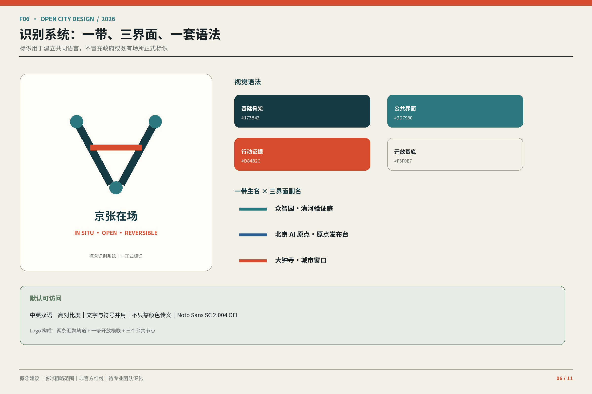
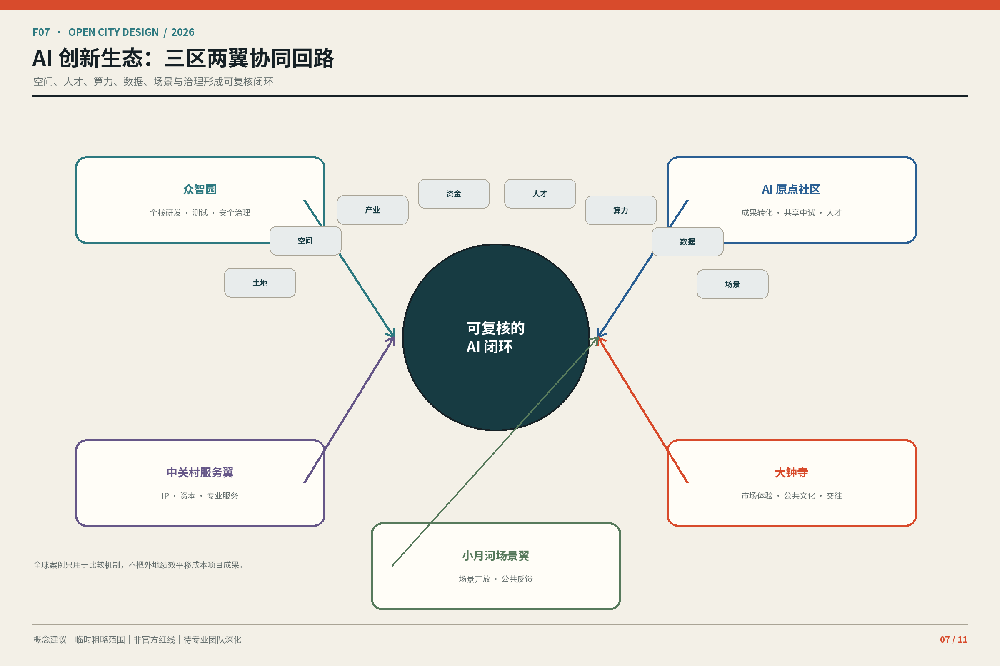
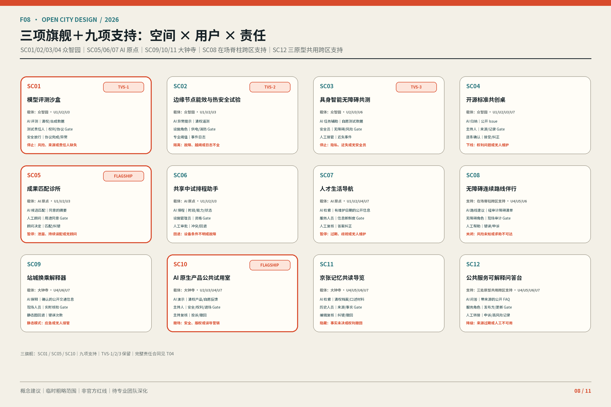
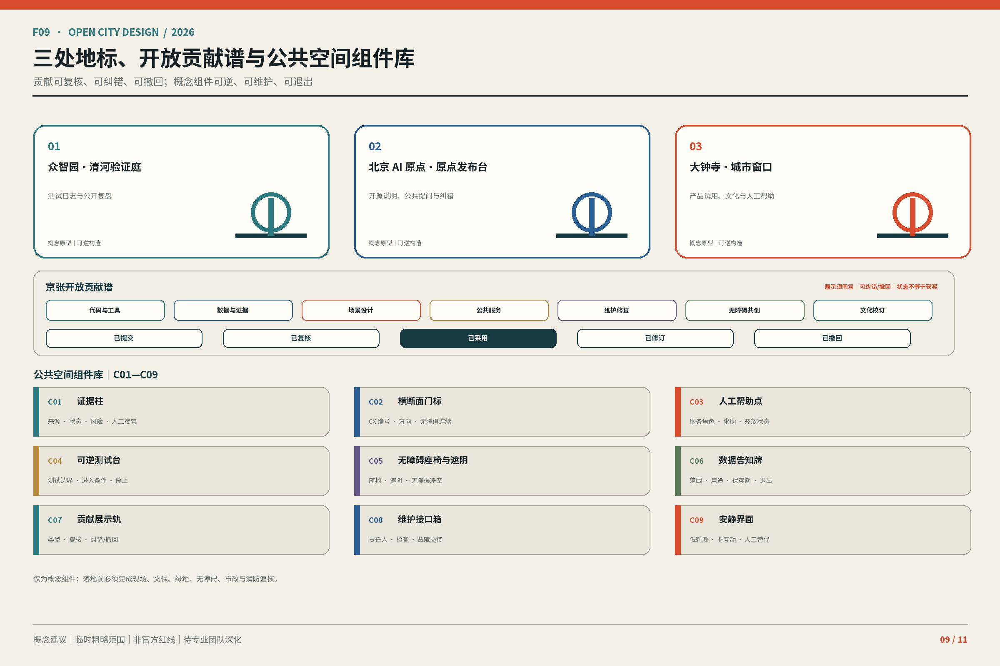
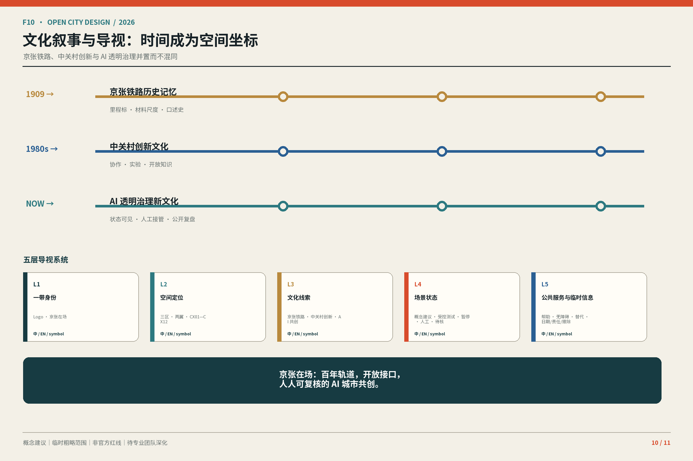
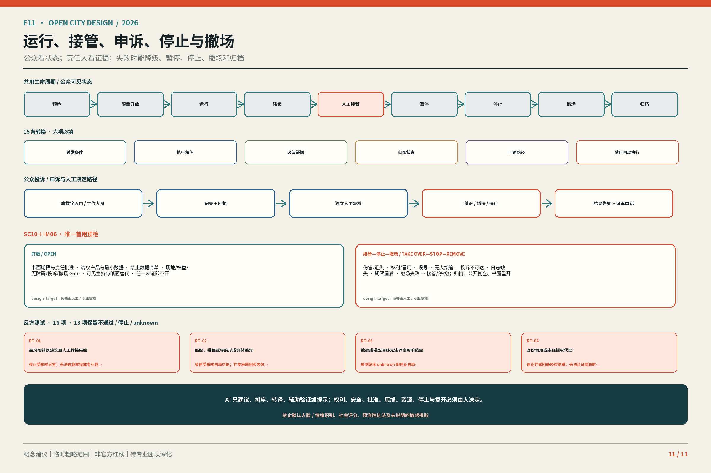

# 京张在场：把 AI 变成可见、可接管、可验证、可撤回的城市界面

**主命题**：京张在场把 AI 从隐藏能力变成三处公众可见、可人工接管、可验证、可撤回的城市界面。**人在场、证据在场、责任在场**不是三个口号，而是同一评价准则：能否进入和申诉，能否追溯来源与失败，能否找到责任人并恢复人工或撤场。本方案仍是开放共创的概念建议，不是获批规划、政府承诺或工程结论。

四个一级消息是：①三重在场评价准则；②一条在场脊柱＋三处在场原型＋十二条候选责任横断面的空间语法；③SC01、SC05、SC10 三旗舰＋九支持场景；④七个行动包＋一个有期限、可逆的首用试验。30 秒读 F01→F03→F08→F11；3 分钟沿同一路径核对空间、场景和退出；15 分钟再下钻 F02/F04/F05/F06/F07/F09/F10 与 T01—T07、矩阵和来源。

## 设计依据与资料清单

公告、面向智能体任务书、场地资料包、来源登记表和本地专业标准快照限定任务与表达；处理资料只承担导航作用。[source:DATA-SRC-OFFICIAL-ANNOUNCEMENT-20260509] [source:DATA-SRC-AGENT-TASKBOOK-20260518] [source:REPO-SOURCE-REGISTRY]

第 2 期资料冻结表逐项登记 publisher、URL/文件、发布日期或检索日、空间与时间范围、复用边界、采集—转换链、SHA-256、证据等级、限制和禁止用途。包内已有快照只按各自权利记录使用；无本地快照的案例只保留链接与释义。OSM 仅保留 2026-08-14 背景核对的 query/response hash 和“原始响应缺失、不可随包独立重放”说明，不进入 required design GeoJSON，也不称测绘成果。[source:DATA-SRC-PROVISIONAL-BOUNDARY-BASIS-20260814] [data:visual/assets/phase2-source-freeze.json#open_data_separation]

组织方尚未提供三层范围和三处重点区的正式 polygon。SITE 与 KEY_AREA 是临时粗略约束，只能生成图件、入口自检和比较情景；不能证明红线、权属、审批、法定用地、精确面积或工程可行性。正式边界到位后，九类图层、指标、F01—F11、HTML 与 PDF 必须同批重算。[source:DATA-SRC-PROVISIONAL-BOUNDARIES-20260605] [data:geometry/site_boundary.geojson#SITE-001]

法定控规、逐栋现状、结构消防、日照管线、文保、道路断面、客流停车、市政容量、企业人才底数和现场调查仍缺失。因此本文不填写未知 FAR、高度、密度、拆改留、红线或投资，不作桥隧、地下空间和审批判断。[standard:PROJECT-OFFICIAL-ANNOUNCEMENT] [depth:existing_conditions_diagnosis]

## 三层范围工作框架

### 总体概念、命名与品牌识别

“京张”锚定铁路遗产、空间连续与公共记忆；“在场”要求人能进入、证据能追溯、责任能接管。英文名 **Jing-Zhang In Situ** 强调基于现场和就地修正，不暗示已经实施。F06 以两条轨迹、十二刻度、三个节点和开放弧线表达一带、十二横断面、三区两翼及可修订接口；不使用企业商标或未授权铁路标识。[standard:PROJECT-AGENT-OPEN-CALL-TASKBOOK] [depth:overall_spatial_structure]

### 三大定位、五大功能与三区两翼

三大定位为百年京张文化带、都市 AI 生活体验带、AI 融合创新带。表 T01 把五大功能压到可核验机制。

| T01 功能 | 主要载体 | 在场检验 |
| --- | --- | --- |
| AI 全栈自主创新体系 | 众智园 | 受控测试、失败记录、人工停止 |
| 世界级 AI 创新生态 | AI 原点＋中关村翼 | 匹配、中试、人才服务与拒绝记录 |
| AI+ 场景赋能新范式 | 小月河翼＋十二横断面 | 公共共测、低技术替代与申诉 |
| 智能化 AI 活力城市 | 公园、公共首层与站城界面 | 日常可达、状态可读、可撤回 |
| AI 治理全球话语权 | 三区共同承担 | 来源、责任、复盘和停止公开 |

### 十二个生活横断面

南北向遗址公园是“一条在场脊柱”，CX01—CX12 已升级为可定位、可复核的候选分析路径；12 条均为 `candidate_not_surveyed`，不是工程线位、道路中线或现场成果。每条记录稳定 ID、坐标、类型、选择依据、主要用户、冲突、来源和现场核验项。[depth:three_level_scope_framework] [data:geometry/roads.geojson#SPINE-001] [data:geometry/roads.geojson#CX01] 候选总数与已踏勘数分别回到两项独立指标，`cross_section_surveyed_count=0` 明确保留未踏勘的负结果。[metric:cross_section_candidate_count] [metric:cross_section_surveyed_count]

CX01—CX12 与 SC01—SC12 分开编号。类型依次为河岸研发、公园门户、研发庭院、校园公共首层、成果转译、人才生活、社区缝合、小月河无障碍界面、轨道—公园连接、站城客厅、市集文化首层、安静照护。仅深化三种不同类型：CX02 公园门户、CX05 成果转译、CX10 站城客厅；其关系性剖面宽度全是 `design-target`，现状总宽与道路红线为 `unknown`，其余九条保持候选清单。[metric:detailed_cross_section_count] 三条代表剖面的逐项数据锚点如下。[data:geometry/roads.geojson#CX02] [data:geometry/roads.geojson#CX05] [data:geometry/roads.geojson#CX10]

## 统筹研究范围产业与未来城市研究

### 全球案例机制比较

T02 只迁移已登记案例的组织机制，不迁移数字、图像、空间结论或合作承诺。

| T02 来源 | 可讨论机制 | 本地问题 |
| --- | --- | --- |
| Seoul AI Hub | 分阶段 PoC 与后续接口 | 测试如何留下复盘和选择？ |
| one-north | 产研集聚、living lab、公共空间 | 研发安全如何与公共可达共存？ |
| STATION F / F.ai | cohort、office hours、访问梯度 | 社区和空间如何分层负责？ |
| Maria 01 | 遗产再用与渐进运营 | 遗产空间如何进入创新网络？ |
| Mila | 研究、转化、人才与责任 AI | 公共利益如何进入转化链？ |
| Dubai Future Accelerators | challenge—pilot—evaluation | 验证如何有 Gate、可停止？ |
| Marineterrein | 可逆临时使用与复盘退出 | 失败时如何恢复？ |

前三项机制来自登记的背景源。[source:CASE-SEOUL-AI-HUB-20250710] [source:CASE-SINGAPORE-ONE-NORTH-20230703] [source:CASE-STATION-F-FAI-20260211]

遗产再用与责任治理仍是背景问题。[source:CASE-HELSINKI-MARIA-AREA] [source:CASE-MILA-IMPACT-20211118]

挑战制和可逆临时使用只启发 Gate。[source:CASE-DUBAI-FUTURE-ACCELERATORS] [source:CASE-AMSTERDAM-MARINETERREIN]

### 生态图与八要素机制

F07 让土地、空间、产业、资金、人才、算力、数据、场景沿“研究—匹配—受控测试—公共共测—反馈”循环；投诉、失败、成本和修订回到研究端。土地、资金、算力和外部区域均是待授权条件，不是已承诺资源或合作。[source:DATA-SRC-AGENT-TASKBOOK-20260518] [depth:overall_spatial_structure]

## 总体设计范围城市更新与控规深度城市设计

更新只使用三个可回退动词：**KEEP** 保留经调查有公共价值的建筑、树阵和服务；**OPEN** 在权属、安全和运营允许时打开园边、院落与公共首层；**INTENSIFY** 先以共享时段和可逆构件提高使用强度，不预设开发量。[standard:MOHURD-CONTROL-DETAILED-PLANNING] [source:DATA-SRC-MOHURD-CONTROL-DETAILED-PLANNING] [depth:retain_renovate_demolish]

这一差异化机制把更新空间网络与三重在场责任体系绑定：任何空间动作都必须同时说明公众入口、证据状态、责任角色和恢复方式，而不是为传统功能分区换一个 AI 名称。

城市设计在这里承担平面与立体空间、公共空间、交通市政和城市风貌的统筹框架；本期只把该框架转译为可复核设计建议，不据此声称已有批准的项目控制要求。[standard:MOHURD-URBAN-DESIGN-MEASURES] [source:DATA-SRC-MOHURD-URBAN-DESIGN-MEASURES]

临时用地仅检验公共开放、创新服务、生活照护和蓝绿连续。LU-001/LU-002 组织创新与公共界面，LU-003/LU-004 组织生活与蓝绿情景；完整覆盖不证明法定用途。[data:geometry/land_use.geojson#LU-001] [data:geometry/land_use.geojson#LU-002]

四块情景用地复用完全相同的共享边界坐标：缺口和重叠均为 0 m²。这一结果只证明包内 partition 拓扑一致，不把情景升级为法定用地、宗地、控规或权属结论。[metric:land_use_gap_area_sqm] [metric:land_use_overlap_area_sqm]

FAR、高度、密度、建筑规模和永久建设等待正式控规及逐栋资料。[data:geometry/land_use.geojson#LU-003] [data:geometry/land_use.geojson#LU-004] [depth:development_intensity_controls]

## 重点区域详细设计

三处原型使用同一 400 m × 400 m `design-target` 比较框和“平面—关系剖面—运营状态”图例，但承担不同责任；400 m 是共同尺度画布，不是实测边长。每处都登记 5 条背景观察和 3 项空间动作，尺寸逐项标注 `open-data-derived`、`design-target` 或 `unknown`。[depth:three_key_area_detailed_design] [metric:key_area_count] [metric:background_observation_count] 空间动作总数另行按结构化字段精确计数。[metric:spatial_action_count]

### 众智园 AI 自主创新加速区

**背景观察**：①公告命名并给出约 192.1 公顷（`open-data-derived`）；②一期固定 SC01—SC04、SC01 为旗舰（`design-target`）；③任务线索要求处理园带与创新载体关系；④正式 polygon、权属和道路红线未知；⑤出入口、树荫、坡度、客流和无障碍连续性未调查。**空间动作**：验证庭院、园带接口、可逆证据前场；三者依次把受控测试与旁观、慢行与人工帮助、可断电与可移除条件并置。CX02 只给关系性设计目标，真实河岸、能源、消防和接驳待核验。[data:geometry/key_areas.geojson#PROV-KEY-001] [data:geometry/roads.geojson#CX02]

### 北京 AI 原点社区

**背景观察**：①公告命名并给出约 104.3 公顷（`open-data-derived`）；②一期固定 SC05—SC07、SC05 为旗舰；③成果转化、人才服务和开放共享来自任务；④校园开放边界、首层使用和消防未知；⑤居民、学生、研发及配送时段流量未调查。**空间动作**：开放首层环、成果转译诊所、照护服务节点；人工顾问决定引荐，并保留非智能入口、安静绕行和社区服务时段。CX05 是关系剖面设计目标，不是已建或已开放事实。[data:geometry/key_areas.geojson#PROV-KEY-002] [data:geometry/roads.geojson#CX05]

### 大钟寺 AI 产业聚集区

**背景观察**：①公告命名并给出约 72.0 公顷（`open-data-derived`）；②一期固定 SC09—SC11、SC10 为旗舰；③站城到达、公共体验和文化表达来自任务；④车站界面、商业权属、消防与撤场路线未知；⑤换乘、消费、摊位和文化访客流量未调查。**空间动作**：四象限到达环、公众试用室、市集文化界面；其中试用室只承载唯一 SC10＋IM06 首用试验。CX10 把到达、试用、人工投诉和撤场并置，但不承诺地下联通、招商或改造。[data:geometry/key_areas.geojson#PROV-KEY-003] [data:geometry/roads.geojson#CX10]

场景归属按逐 ID 冻结：众智园为 SC01、SC02、SC03、SC04；AI 原点为 SC05、SC06、SC07；大钟寺为 SC09、SC10、SC11。SC08 是整条在场脊柱的跨区无障碍支持，SC12 是三处原型共用的公共服务与人工转接支持，二者不归入任一连续编号片区。

## AI 创新生态、人才画像与 AI+ 场景

### 七类用户画像

| T03 ID | 角色 | 必保入口 |
| --- | --- | --- |
| U1 | 科研与研发人员 | 受控测试、证据复核 |
| U2 | 创业与产品团队 | 清权、拒绝与撤场 |
| U3 | 运营维护、安全与专业复核 | 人工接管、日志 |
| U4 | 居民、社区工作者与商户 | 低技术替代、申诉 |
| U5 | 儿童、照护者与教育者 | 监护、内容复核 |
| U6 | 老年人、残障访客及陪同者 | 无障碍、人工帮助 |
| U7 | 国际开发者与专业访客 | 双语状态、许可边界 |

U6 的低技术替代以“传统服务方式与智能化服务创新并行”为政策背景；这不证明海淀已有相应服务、需求数字或实施承诺，仍须逐场景核验人员、线下入口和维护责任。[source:DATA-SRC-ELDERLY-SMART-TECH-PLAN-2020-45] [depth:blue_green_public_space]

所有 SC 共用十二字段责任合同：概念状态、用户、载体、AI 作用、最小数据、拟议运营角色、人工复核、低技术替代、申诉、进入条件、评价方法、退出动作。没有责任人或高风险问题不能闭环即不进入或立即停止。[source:DATA-SRC-AGENT-TASKBOOK-20260518] [depth:municipal_new_infrastructure]

某场景只有在确属向境内公众提供生成文本、图像、音频或视频的生成式 AI 服务时，才进入《生成式人工智能服务管理暂行办法》的相应适用判断；本方案的 Human Takeover、停止与退出是设计合同，不把第十四条扩写为一般退出权，也不虚构第十五条的法定数字响应期限。[source:DATA-SRC-GENERATIVE-AI-INTERIM-MEASURES] [depth:municipal_new_infrastructure]

三项产业测试验证编号继续锁定：TVS-1＝SC01 模型评测，TVS-2＝SC02 能效与热安全，TVS-3＝SC03 具身智能无障碍共测；3+9 的竞争性层级不删除这组三项专业验证义务。

### 十二张场景卡

三旗舰完整承担差异化责任：**SC01 模型评测沙盒**在众智园使用公开或清权基准、合成数据和测试日志，由安全人员放行，来源失效或安全问题未解即停；**SC05 成果匹配诊所**在 AI 原点只处理主动提供且允许匹配的摘要，由人工顾问决定引荐，泄露、持续误配或无顾问即暂停；**SC10 AI 原生产品公共试用室**在大钟寺使用清权说明和自愿反馈，主持人监督且不自动购买，安全、版权、误导营销或投诉失效即撤场。

| T04 组合 | 载体 / 用户 | AI 与最小数据 | 人工、低技与申诉 | 评价 / 退出 |
| --- | --- | --- | --- | --- |
| 旗舰 SC01 | 众智园；U1/U2/U3 | 评测；清权基准、合成数据、日志 | 安全放行；离线脚本；异常登记 | 协议/异常/接管；问题未解即停 |
| 旗舰 SC05 | AI 原点；U1/U2/U3 | 匹配；自愿摘要、公开需求 | 顾问决定；预约台账；纠错 | 同意/拒绝/误配；泄露即停 |
| 旗舰 SC10 | 大钟寺；U2/U3/U4/U7 | 试用；清权说明、自愿反馈 | 主持监督；纸面反馈；投诉 | 退出/投诉；争议即撤场 |
| 支持 SC02/SC03/SC04 | 众智园；U1/U2/U3/U6/U7 | 热安全、无障碍共测、标准归纳；许可数据 | 专业人员/安全员/主持；仪表、陪同、议题墙 | 越阈、近失、版权或无人维护即停 |
| 支持 SC06/SC07 | AI 原点；U1/U2/U3/U4 | 排程、生活导航；最小公开或自愿数据 | 管理员/服务员；表格、地图、柜台 | 权限冲突、歧视、过期即降级 |
| 支持 SC09/SC11 | 大钟寺；U4/U6/U7 | 换乘、共读；确认交通与清权档案 | 现场/历史复核；静态图、文字音频 | 应急、事实或权利争议即隐藏/关闭 |
| 跨区支持 SC08 | 在场脊柱；U4/U6/U7 | 无障碍路线；现场核验路径 | 服务点；纸图与人工带领 | 路径风险未知或人工求助不可达即关闭 |
| 跨区支持 SC12 | 三处原型；U4/U5/U6/U7 | 公开 FAQ；带来源和日期 | 服务角色；柜台与人工转接 | 过期或高风险误答且无法转接即降级 |

后台逐卡边界仍完整保留：**SC02** 只读清权设备遥测，由能源、消防和噪声专业人员确认，越过专业阈值或日志不全即隔离；**SC03** 只采自愿任务和环境状态，不建身份画像，现场安全员缺位或发生近失事件即停；**SC04** 只归纳公开标准、Issue 和异议，主持人逐条确认，错误归因、版权问题或无人维护即下线。

**SC06** 只处理公开时段、设备标签与申请状态，设施管理员审批，设备条件不明或权限冲突即退回人工表格；**SC07** 只用公开服务信息和主动选择，信息过期、结果歧视或无人维护即暂停。

**SC09** 只解释经确认的公开交通信息，应急状态或信息失真即切静态图；**SC11** 只使用清权档案和经同意口述材料，史实争议未解或权利撤回即隐藏相关内容。跨区的 **SC08** 以现场无障碍审计为公开前提，不持续追踪身份，路线风险未知或人工求助不可达即关闭；跨三原型的 **SC12** 只引用带来源和日期的公开 FAQ，不替代法律、医疗、消防结论，来源过期或人工转接不可用即降级。九项支持场景因此是对三旗舰和整条脊柱的专业、公共与文化保护层。

F08 用同一 ID 索引 3 旗舰＋9 支持，不改变后台 SC01—SC12。[data:geometry/public_space.geojson#PUBLIC-001]

## 用地、建筑规模与拆改留方案

用地和建筑都是临时情景。公共首层、基底、通透、退让、屋顶与可逆构件可供深化；逐栋 KEEP/OPEN/INTENSIFY 必须等待权属、结构、消防、日照、管线与文保套核。[standard:MNR-LAND-USE-CLASSIFICATION-GUIDE] [source:DATA-SRC-MNR-LAND-USE-CLASSIFICATION-202311] [depth:land_use_layout]

当前建筑基底只能复算提交图层，不等于现状或获批建筑包络；任一前提失败即退回公共空间或运营试验。[data:geometry/buildings.geojson#BLDG-001] [metric:building_footprint_area_sqm] [depth:height_massing_character]

深化时须先把每个单元的资料权威、调查日期、现状用途、权属状态、可达入口、结构与消防条件并列，再判断保留、开放或提高使用强度。未经这一步，图上的颜色只能代表设计情景；不能据此计算总建筑面积、容积率和建筑密度，也不能形成征拆、加建或招商清单。

## 交通、轨道、市政与公共服务设施

交通优先步行、无障碍、骑行、公交接驳与必要机动车。站口先改善地面可读和人工服务；缺少红线、断面、客流、停车资料时不作容量、安全、桥隧或地下工程结论。[depth:traffic_rail_slow_parking] [data:geometry/roads.geojson#SPINE-001]

《无障碍环境建设法》第三十九条所述现场指导、人工办理，限于医疗健康、社会保障、金融业务、生活缴费等服务事项的公共服务场所；本方案把人工帮助用于更广城市界面时只作为设计目标，不声称该条普遍适用，也不声称已完成场所合规或无障碍审计。[source:DATA-SRC-BARRIER-FREE-ENVIRONMENT-LAW] [depth:traffic_rail_slow_parking]

边缘节点可结合座椅、遮阴、照明和状态告知，但供电、散热、噪声、网络、消防、排涝和维护须由专业团队确认；高风险服务必须切换人工或静态模式。

十二横断面现在提供逐条现场核验清单：合法路径与权属、现状宽度与障碍、铺装与坡度、过街等待、遮阴休息、轮椅回转、昼夜人流、维护及应急通行。只有来源、日期、方法、覆盖范围、同意与责任人登记齐全，才可把对应项升级为调查证据；本期全部保持“未踏勘”，不生成通行能力、无障碍通过率或停车需求数字。[metric:pedestrian_flow_count] [metric:accessible_route_pass_rate]

## 蓝绿空间、公共空间与城市风貌

清河、小月河、遗址公园和社区树荫构成待调查的降温、慢行和交往基础。绿色/公共空间比例只比较提交图层情景，不是法定指标；AI 装置不能替代树冠、雨水、照明、座椅、盲道和维护。[depth:blue_green_public_space] [data:geometry/green_space.geojson#GREEN-001] [metric:green_ratio]

绿色空间绝对面积只复算情景图层。[metric:green_space_area_sqm]

公共空间绝对面积和比例同样随临时边界重算。[metric:public_space_area_sqm] [metric:public_space_ratio]

### 三地标、开放贡献谱与组件库

众智园验证庭公开测试证据，AI 原点发布台支持开源说明与纠错，大钟寺城市窗口连接产品试用、文化与人工服务。“京张开放贡献谱”记录代码工具、数据证据、场景、公共服务、维护、无障碍和文化校订，状态仅为已提交、已复核、已采用、已修订、已撤回，不把展示自动称为获奖。

组件 C01—C09 依次为证据柱、横断面门标、人工帮助点、可逆测试台、无障碍座椅遮阴、数据告知牌、贡献展示轨、维护接口箱、安静界面；只定义功能、信息、无障碍和责任，工程可行性待深化。

### 文化、导视与国际传播

文化叙事是“来路—在场—共创”，空间故事是“轨迹—接口—回声”。F10 的**六层**导视为总体 Logo、空间定位、文化线索、场景状态、公共服务、临时活动；固定状态词是“概念建议 / Conceptual Recommendation”“受控测试 / Controlled Test”“暂停服务 / Paused”“人工接管 / Human Takeover”“待现场核验 / Pending Site Verification”。没有人员证据不得写“24H 人工服务”。

国际主文案为：“**京张在场：百年轨道，开放接口，人人可复核的 AI 城市共创。**”所有外宣同时显示概念状态，不暗示入选、批准或建成。

## 更新项目清单、实施政策与分期计划

近期只做资料基线、横断面调查、责任协议和可逆原型；中期在权属与专业条件确认后讨论公共首层、蓝绿慢行、组件和地标；永久建设须等待控规、交通、市政与工程专题。阶段不是批准时序。[data:geometry/phasing.geojson#PHASE-001] [depth:phasing_implementation]

### 年度运营与转化路径

| T05 频率 | 候选活动 | 必留证据 / 取消条件 |
| --- | --- | --- |
| 持续 / 每月 | Issue 与贡献台账 / 公共接口步行 | 问题、责任、修订；无维护者即停 |
| 每季 / 每半年 | 验证庭开放日 / 公共责任复盘 | 测试、投诉、接管；Gate 不过即取消 |
| 每年 | “京张在场周”与“全球城市 AI 接口论坛”候选品牌 | 逐项许可、清权、人员；不形成政府日程 |

场景开放路径为公开挑战→许可与数据/伦理/无障碍初筛→匹配三区两翼→受控协议→专业与人工 Gate→限时测试→经同意演示→复盘→深化、归档或退出；参与者后续路径止于自愿的候选转介，不承诺岗位、资金、采购、空间或背书。

### 项目级实施表

前台只显示七包；13 个逐 IM 机器对象位于 `design_depth_matrix.json#/items/11/implementation_projects`，逐项保存责任角色、依赖、定性成本、证据、维护、评价、Human Takeover 与停止/退出。S/M/L 只表示研究协调、可逆运营、待工程深化，不是投资估算。[depth:renewal_project_list]

| T06 包 | 后台 ID | 前台动作 | Gate / 撤回 |
| --- | --- | --- | --- |
| AP1 证据基线与重算 | IM01+IM13 | 锁定权威版本、差异与哈希 | 来源冲突即冻结派生指标 |
| AP2 横断面与责任协议 | IM02+IM03 | 调查 CX01—12；保障跨区 SC08；定人工、申诉、停止 | 无许可或责任人即不进入 |
| AP3 众智园原型 | IM04 | SC01/02/03/04 受控验证 | 专业条件或安全失败即停 |
| AP4 AI 原点原型 | IM05 | SC05/06/07 匹配与服务 | 泄露、误配、设施不明即人工回退 |
| AP5 大钟寺原型 | IM06 | SC09/10/11 到达、试用与文化 | 权利、安全或投诉失效即撤场 |
| AP6 公共界面与身份 | IM07–IM10 | 地标、组件、导视、贡献谱及跨三原型 SC12 | 权属、维护、史实或同意失败即移除 |
| AP7 运营与协同 | IM11–IM12 | 年度候选活动与外部议题接口 | 无许可或授权不得公开运行/称合作 |

**唯一首用试验**绑定既有 **SC10＋IM06**：只有产品、场地、人员、消费者权益、无障碍、投诉和撤场许可齐备才启动；期限由正式许可与运营方书面设定，届满默认撤场并归档证据。期间主持人可随时切人工，任何安全、权利、误导或投诉闭环失败立即终止。它不是 SC13 或 IM14，也不宣称真实绩效。

## 指标体系、面积复算与合规矩阵

本期共 21 项已知/记录指标，其中 19 项可从随包 GeoJSON 和结构化字段独立复算；面积/长度使用 EPSG:4548，误差门槛 ≤0.5%，计数必须完全一致。每项都按“基线—动作—目标或观察窗口—证据状态—复算触发器”登记，并保留 `status/value/unit/source_files/formula/confidence/assumptions`。[metric:site_area_sqm] [metric:candidate_cross_section_total_length_m] [depth:metrics_recalculation]

不利、零值和未知不会被删去：12 条候选中已踏勘为 0；情景用地缺口/重叠为 0；这些结果分别回到计数与拓扑指标。[metric:cross_section_surveyed_count] [metric:land_use_gap_area_sqm] [metric:land_use_overlap_area_sqm] OSM 背景核对记录遗址公园相交 0% 与四条命名道路平均偏移 667 m。[metric:osm_heritage_park_intersection_ratio] [metric:osm_named_street_average_offset_m] FAR、高度、道路面积、客流、无障碍通过率和文保控制面积仍为 `unknown`；OSM 两项因原始响应缺失不计入 19 项随包独立复算，也不能据此修改 provisional 边界。[metric:floor_area_ratio]

F05 是证据权威与重算链；三份矩阵保存逐项后台证据。六个 agent 的 31 项 required outputs 在 `compliance_matrix.json` 中逐项指向章节、F 图、T 表或结构化文件，不再用相同文件列表代替完成证明。[standard:MOHURD-ARCH-DESIGN-DEPTH-2016] [source:REPO-SOURCE-REGISTRY]

**十项核心 claim 审阅导航**：

1. **主命题与准则**：三处界面共同接受人在场、证据在场、责任在场的检验；入口在导语、F01/F06，限制是概念状态。
2. **证据边界**：临时范围仅能生成和比较，正式资料触发整包重算；入口在“设计依据”、F01/F05，不能外推红线、权属或工程。
3. **在场脊柱与责任横断面**：遗址公园组织南北连续，CX01—CX12 发现东西断点；入口在“三层范围”、F01/F04，位置和性能待调查。
4. **三处原型**：众智园验证、AI 原点转译、大钟寺公共试用各负其责；入口在“重点区域”、F03/F09，三块边界均为 provisional。
5. **三旗舰＋九支持**：SC01/05/10 展开关键闭环，九项支撑专业与公共安全；入口在 T04/F08，不改变十二场景后台。
6. **场景责任合同**：十二场景都有最小数据、运营角色、人工、低技、申诉、进入、评价和退出；入口在 T03/T04/F08，真实绩效仍未知。
7. **八要素 Gate 循环**：研究、匹配、测试、共测和反馈连接八要素；入口在 T02/F07，案例只支持背景机制。
8. **可逆更新**：KEEP/OPEN/INTENSIFY 先于永久建设，公共首层、慢行、蓝绿共同成网；入口在 F02/F04/F05，不补 FAR、高度或道路红线。
9. **唯一首用试验**：既有 SC10＋IM06 在书面期限内运行，届满或失败即撤；入口在 T06/F08/F11，不新增场景或项目。
10. **七包与审计闭环**：AP1—AP7 覆盖 IM01—IM13，并把 6 个 agent、31 项输出逐项锚定；入口在 T06/F05/F11 和三份矩阵，完成仅指提交证据齐备。

31 项输出的人读入口压为六行：agent.1 看主叙事、名称、Logo、结构与合规（T01/F01/F06）；agent.2 看案例、生态、产业空间、指标来源与视觉入口（T02/F05/F07）；agent.3 看 persona、十二场景、空间运营、隐私人工边界与入口（T03/T04/F08）；agent.4 看公共空间、地标、贡献谱、组件与入口（F03/F04/F09）；agent.5 看文化、导视、空间故事、国际文案与入口（F10）；agent.6 看年度活动、品牌 IP、开发者与场景运营、转化和入口（T05/F06/F11）。机器层逐 output 保留精确键名。

| T07 人工双语复核 | 结论 |
| --- | --- |
| 13 章顺序、1 主命题、4 一级消息、10 claims | 同序、同强度 |
| 专名、三重在场、六层导视、固定状态词 | 已逐项对照 |
| SC/CX/IM/AP/U/C/TVS 与 F/T 编号 | 集合及分组一致 |
| 指标状态、来源 marker、临时边界、图位 | 不提高置信度，不遗漏限制 |

十项核心 claim 的精确章节、图表、数据、来源与限制见结构化 `review_navigation.core_claims`；T07 只记录人工 parity 结论，不代替机器检查。

## 风险、版权与合规说明

主要缺口是正式边界、控规权属、逐栋现状、交通市政消防、文保生态、企业人才与真实需求；主要风险是临时数据被当成 official、AI 越过人工、活动被写成承诺、双语弱化限制、资产许可链中断。正确动作是暂停声明、登记缺口、等待授权资料并同批重算。[depth:risk_missing_data]

路径级版权台账覆盖双语正文/HTML、F01—F11、A3/A0、字体、图标、数据和代码；任何新增或再生成资产都重开清权。医疗、法律、消防、交通、结构、能源和审批结论只能由相应责任人员或专业团队作出。自检通过只表示可进入进一步审核，不代表入选、批准、发布或实施。

本期冻结名称、F/T/SC/CX/IM/C 编号、三重在场准则、固定空间语法、三旗舰九支持和七包映射。后续深化不得把候选协同写成既有合作，不得以关键词堆叠替代设计判断，也不得为了视觉完整而补画伪精确几何。需要现场或授权才能回答的问题应保留责任人、触发条件和停止状态，等资料到位后再通过 AP1 同批复核，而不是在本版本内推断。

## 参考资料

公告和任务书限定任务，专业标准限定表达深度，来源登记表限定用途，临时边界只支持生成与复算。`REPO-PROCESSED-FACT-PACK` 仅作导航；七案例均为 `background_only`。读者可通过 `visual/assets/phase2-source-freeze.json`、`sources.json`、`assumptions.json`、`metrics.json`、GeoJSON 和三份矩阵回溯。[source:REPO-PROCESSED-FACT-PACK]

引用顺序遵循“直接来源优先、登记信息辅助、处理包只导航”。来源失效、用途越界或权威版本冲突时，相邻 claim 自动降级并进入 AP1；不能用案例、搜索摘要或生成文本替代正式附件。图件中的来源短码须能返回同一登记项，英文稿也不得删除限制或提升确定性。

本方案的空间、场景、品牌、活动和协同内容均为开放共创建议，可供专业团队深化，不替代正式规划，也不构成政府审定或资源承诺。
