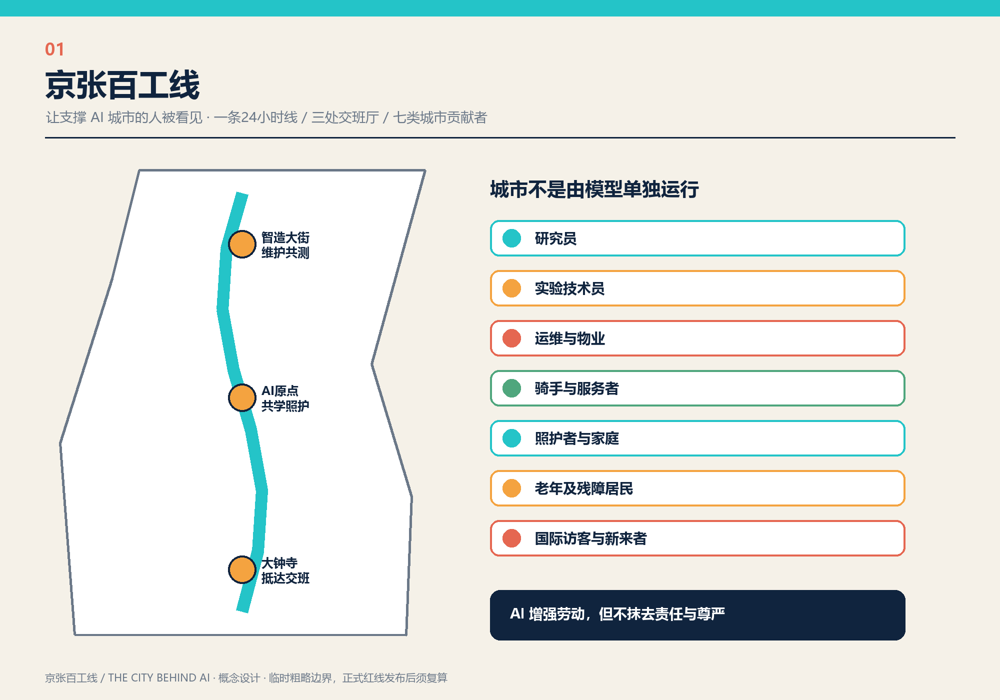
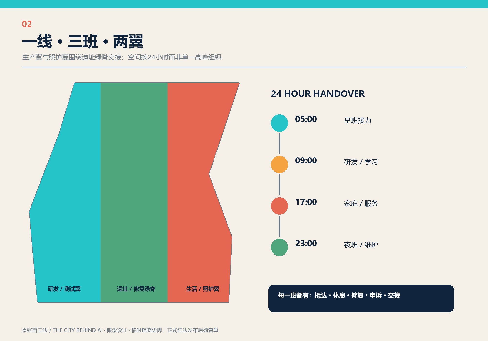
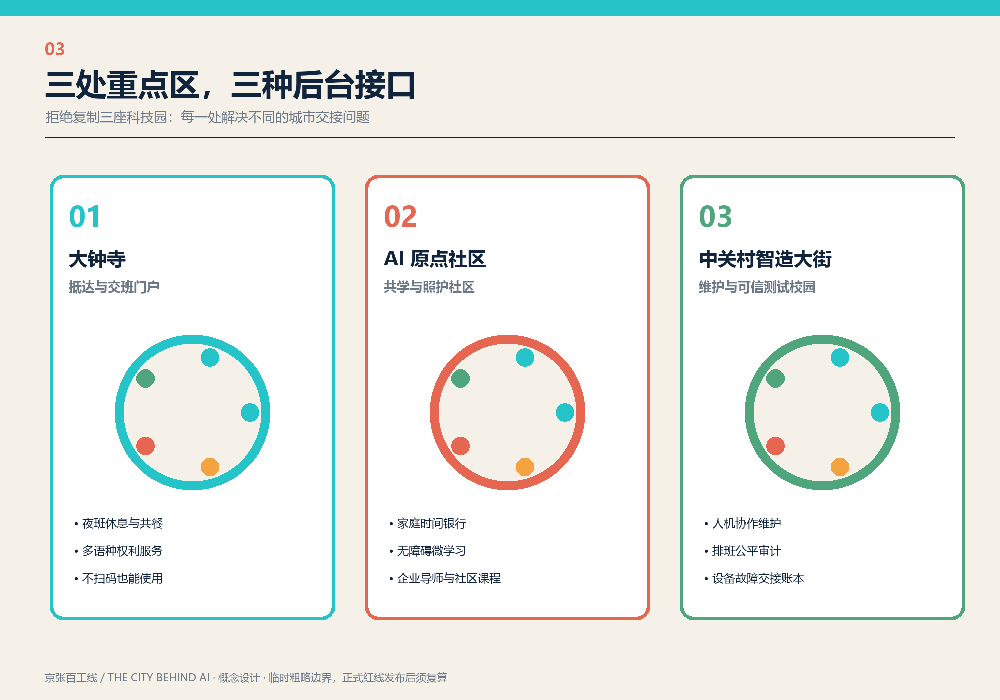
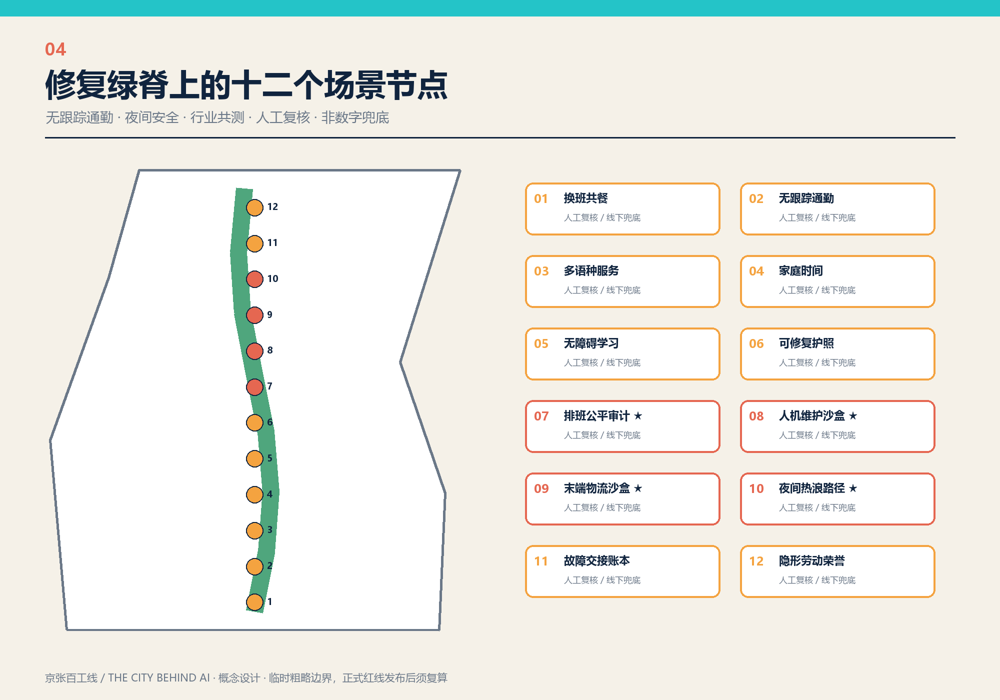
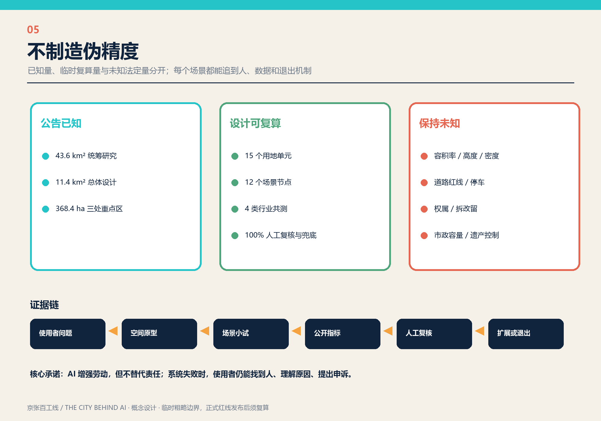

# 京张百工线：让支撑 AI 城市的人被看见

> THE CITY BEHIND AI / JING-ZHANG MANY HANDS LINE

## 设计依据与资料清单

本方案的起点不是“再造一个会思考的园区”，而是追问：一座 AI 城市每天由谁真正托住？答案包括研究员、实验技术员、设备运维者、物业与环卫人员、骑手与零售服务者、照护者和家庭，也包括需要无障碍服务的老年人、残障者和初来北京的国际访客。方案把这些常被隐藏的劳动、交接与修复活动变成公共空间和治理基础设施，用一条贯穿京张遗址绿脊的“百工线”重新组织生产、生活与服务。

第一依据是公开征集公告 [source:OFFICIAL-ANNOUNCEMENT] 和智能体任务书 [source:AGENT-TASKBOOK]；结构化资料以 [source:SITE-PACKAGE]、[source:SOURCE-REGISTRY]、[source:PROCESSED-FACT-PACK] 为索引。用地口径参照 [source:MNR-LAND-USE]，城市设计与控规深度分别参照 [source:MOHURD-URBAN-DESIGN]、[source:MOHURD-CONTROL-PLAN]。规划限制登记 [source:PLANNING-LIMITS] 明确了当前缺少容积率、高度、道路红线、权属、现状建筑、遗产控制线与市政容量数据，因此本方案把这些字段保持为 unknown，不用概念设计冒充法定结论。

提交几何以 [data:geometry/site_boundary.geojson#SITE-001]、[data:geometry/key_areas.geojson#PROV-KEY-001] 为入口，并明确来自 [source:BOUNDARY-SOURCE]、[source:KEY-AREA-SOURCE] 的临时粗略 polygon：`official_boundary=false`、`geometry_role=provisional_constraint`、`boundary_precision=provisional_rough`。它们可以支持方案讨论和自动检查，不能作为审批红线；获得正式 CAD/GIS 后，需要同步替换九个图层并重算全部指标。[assumption:A-BOUNDARY-001] [assumption:A-CONTROLS-001]

本方案逐项响应 [standard:PROJECT-OFFICIAL-ANNOUNCEMENT]、[standard:PROJECT-AGENT-OPEN-CALL-TASKBOOK]、[standard:MOHURD-URBAN-DESIGN-MEASURES]、[standard:MOHURD-CONTROL-DETAILED-PLANNING]、[standard:MNR-LAND-USE-CLASSIFICATION-GUIDE] 和 [standard:MOHURD-ARCH-DESIGN-DEPTH-2016]。后者在本阶段仅作为建筑原型深化接口，不表示已有建筑工程设计条件。[depth:existing_conditions_diagnosis]

## 三层范围工作框架

统筹研究范围约 43.6 平方公里，用来识别“谁支撑 AI 城市”及其产业链、通勤链、照护链和能源数据链；总体设计范围约 11.4 平方公里，用来落位百工线、两翼功能和公共服务网络；三处重点区域合计约 368.4 公顷，用来建立可落地的交班空间原型。面积分别登记为 [metric:announced_research_area_sqkm]、[metric:announced_overall_area_sqkm]、[metric:announced_key_areas_total_ha]，临时 polygon 复算面积另见 [metric:site_area_sqm]，两者不可混用。

空间结构概括为“一线、三班、两翼”。一线是从大钟寺至北部创新区的 24 小时百工慢行—服务—展示线；三班是城市的早班、日班、夜班，每个班次都有通勤、餐食、照护、维修和申诉接口；两翼是研发测试翼与生活照护翼，两者以八条交接支线相连。这里的“交班”既是时间动作，也是治理动作：数据交接要留痕，算法决定要复核，设备故障要可追踪，居民投诉要有真人负责。[depth:three_level_scope_framework] [depth:overall_spatial_structure]

三个层级使用同一套七类人物画像和十二张场景卡，但回答不同问题：研究范围回答产业与人才如何循环；总体范围回答空间和公共服务如何连接；重点区回答一个场景怎样被搭建、测试、评估、退出。这样避免宏大愿景与现场使用脱节，也避免把一处演示装置误当成完整的城市生态。

## 统筹研究范围产业与未来城市研究

百工线把 AI 产业生态拆成七种相互依赖的资源：空间、产业、资金、人才、算力、数据和场景。空间不只供研发办公，也包括维修间、夜间休息点、家庭服务和申诉窗口；产业不只统计头部企业，也识别实验外包、设备维护、物流、餐饮和社区服务；资金设置“首试采购+维护预算+退出成本”三本账；人才把技术人才与技术劳动者并列；算力公开能耗与服务时段；数据遵循最小采集；场景必须有真实使用者和独立评估。

国际案例只作背景，不承担本地边界或控制依据。NIST AI RMF [source:CASE-NIST-AIRMF] 提供 Govern—Map—Measure—Manage 的生命周期框架；欧盟 TEF [source:CASE-EU-TEF] 说明 AI 应在真实环境测试；Punggol Digital District [source:CASE-PUNGGOL] 展示产业、教育、社区与区级平台协同；Smart Kalasatama [source:CASE-KALASATAMA] 强调居民共创和小步试点；SHIFT London [source:CASE-SHIFT-LONDON] 把城市作为包容性测试床；Barcelona 22@ [source:CASE-BARCELONA-22AT] 提醒创新区同时需要住房、绿地与公共服务；Quayside 的数字治理讨论 [source:CASE-QUAYSIDE] 则提醒任何平台必须有公共监督、隐私边界和退出机制。七个案例仅提炼机制，不复制空间形态。[metric:persona_count]

未来城市的关键不是让 AI 取代后台，而是让后台获得更好的工具、更清楚的责任边界和更体面的空间。每个场景必须回答六个问题：谁受益、谁承担额外劳动、谁能纠错、采集什么数据、没有手机能否使用、系统失败由谁负责。只有同时回答，才进入空间试点；否则继续停留在研究清单。[assumption:A-LABOR-001]

## 总体设计范围城市更新与控规深度城市设计

总体结构以 [data:geometry/land_use.geojson#LU-001] 代表的十五个概念单元为底图 [metric:land_use_component_count]：中部连续公园绿地承担遗址阅读、生态修复与慢行；西翼布置研发、可信测试、交通换乘；东翼布置公共服务、照护和职住支持。[data:geometry/roads.geojson#ROAD-001] 的百工主线与八条交接支线把两翼连成短链，[data:geometry/public_space.geojson#SCENARIO-001] 把三处交班厅和十二个场景节点嵌入主线，[data:geometry/green_space.geojson#GREEN-001] 则承担贯通背景。[depth:land_use_layout] [depth:traffic_rail_slow_parking] [depth:blue_green_public_space]

控规层面的贡献不是给出未经授权的数值，而是提供“待填控制表”：每个单元预留主导功能、混合比例、公共界面、首层开放、夜间服务、无障碍、物流时窗、数据设施和运维责任字段。容积率、建筑密度、高度、退界、停车和道路面积均保持 unknown，分别见 [metric:floor_area_ratio]、[metric:official_building_density]、[metric:building_height_m]、[metric:parking_supply_sqm]、[metric:road_area_sqm]、[metric:road_area_ratio]。[depth:development_intensity_controls]

城市更新采用“保留可用空间—修复公共界面—插入小型原型—再决定增量”的顺序。没有现状建筑和权属普查之前，[data:geometry/buildings.geojson#BLDG-001] 代表的十二个概念性公共原型不对任何真实建筑作拆改留判断；待补齐普查后，再将原型与保留、改造、拆除三类图斑逐一校核。[assumption:A-EXISTING-001] [depth:retain_renovate_demolish] [depth:height_massing_character]

## 重点区域详细设计

三处重点区不是三张相似的科技园效果图，而是三种不同的城市后台接口。大钟寺片区约 72 公顷，定位“抵达与交班门户”：轨道换乘人流、夜班人员、骑手与访客在交班厅完成休息、信息、工具、餐食和多语种服务；公共界面强调可见入口和不扫码也能使用。AI 原点社区约 104.3 公顷，定位“共学与照护社区”：家庭时间银行、无障碍微学习、社区课程和企业导师共同运作，避免人才政策只服务单身高技能者。中关村智造大街约 192.1 公顷，定位“维护与可信测试校园”：把人机协作维护、算法排班审计、设备故障账本和修复工坊组成可观摩的产业测试链。[metric:key_area_count]

每处重点区采用四件套：一间可全年使用的交班厅、一段可测试的户外路径、一套公开的场景账本、一个由真实使用者参与的季度评审。场景上线先做无数据版本，再逐步增加传感或模型能力；任一场景都可以回退到人工服务，不以安装设备数量衡量成功。空间边界见 `geometry/key_areas.geojson`，三处节点见 `geometry/public_space.geojson`。[assumption:A-SCENARIO-001] [depth:three_key_area_detailed_design]

四个可识别地标构成朝圣与传播系统：百工谱记录岗位、工具与贡献；交班厅展示城市每个班次如何接力；修复园让设备维护和材料再生成为公众课程；贡献标尺公开“节省了谁的时间、减少了谁的风险、谁仍在承担劳动”。它们共享铁路枕木节奏、手掌交叠和青绿—琥珀配色，不以巨构雕塑争夺遗址主体地位。[metric:pilgrimage_landmark_count] [assumption:A-BRAND-001]

## AI 创新生态、人才画像与 AI+ 场景

七类人物画像是：研究员；实验技术员；设备、物业与市政运维者；骑手、零售与餐饮服务者；照护者、儿童与家庭；老年及残障居民；国际访客与新来者。画像不用于身份标签或行为预测，只用于检查空间是否遗漏了真实的时间表、语言、身体能力和责任关系。[metric:persona_count]

十二张场景卡依次为：换班共餐桌、无跟踪通勤助手、多语种权利服务台、家庭时间协调站、无障碍微学习舱、可修复性护照亭、算法排班公平审计、人机协作维护沙盒、包容性末端物流沙盒、夜间与热浪安全路径、设备故障交接账本、隐形劳动荣誉谱。全部节点写入 `geometry/public_space.geojson` [metric:scenario_node_count]，并统一标注 `human_review_required=true`、`non_digital_fallback=true` 与数据最小化原则，因此人工复核和非数字兜底覆盖率均为 100%：[metric:human_review_coverage_ratio]、[metric:non_digital_fallback_coverage_ratio]。

其中四类进入产业真实测试：[1] 算法排班公平审计，比较工时稳定、收入波动和申诉处理；[2] 人机协作维护沙盒，测试故障接管、工具可达和安全停机；[3] 包容性末端物流沙盒，测试骑手、商户、行人与机器人路权；[4] 夜间与热浪安全路径，测试照明、补水、遮阴、报警与人工救助。每项先通过伦理和安全门槛，再小范围测试，最后由使用者、行业、社区和独立专家共同决定扩展或退出。[metric:test_validation_scenario_count]

## 用地、建筑规模与拆改留方案

概念用地以国家用地分类口径组织，但混合功能通过程序而非私造编码表达。中轴 `1401` 公园绿地保持连续，研发测试单元、公共服务照护单元、交通换乘单元和居住生活单元分列两翼。图层严格覆盖临时总体范围并进行拓扑检查；这只是总体结构，不构成供地、产权或审批建议。[metric:green_ratio] [metric:public_space_ratio]

十二个建筑原型总占地仅作为图面复算 [metric:building_footprint_area_sqm]，不推导总建筑面积。`total_floor_area_sqm` 保持 unknown [metric:total_floor_area_sqm]。每个原型优先考虑利用既有厂房、首层空置空间、桥下与站点附属空间的可能性，但是否保留、改造或新建必须以测绘、结构鉴定、权属和遗产评估为前提。建筑体量采取小尺度、多入口、可拆装、首层透明和工具可见的原则，避免形成封闭企业园区。

拆改留流程分四步：建立现状建筑唯一编码；登记年代、结构、使用、权属与碳成本；叠加遗产和安全控制；最后由专业团队与社区共同确定类别。任何自动分类只提供建议，不作最终决定。遗产控制面积目前 unknown [metric:heritage_control_area_sqm]。[depth:metrics_recalculation]

## 交通、轨道、市政与公共服务设施

交通目标是让不同班次的人都能安全抵达，而不是只优化高峰白领通勤。百工主线组织步行、自行车、无障碍轮椅和低速服务；八条交接支线连接两翼与三处重点区，概念网络长度见 [metric:slow_network_length_m]。轨道站点、公交、停车、装卸和机器人线路必须在正式交通专项中校核，当前道路图层不代表红线或工程线位。[assumption:A-MOBILITY-001]

夜间策略采用“有人、有光、有水、有退路”：交班厅保留值守人员；连续照明不依赖人脸识别；补水、卫生间与急救点按夜班节奏开放；任何数字通行都保留实体按钮、纸面信息和人工窗口。末端物流按时段共享路权，自动设备必须低速、可听见、可急停、可被人工接管。

市政系统提出待核验接口：算力与机房披露能耗和余热利用可能；公共空间预留维修隔离区；雨洪系统与修复花园协同；传感设施采用可拆卸、最小采集和明确维护人。市政容量指标因资料缺失保持 unknown [metric:municipal_capacity_index]。公共服务优先补齐托育、夜间餐食、无障碍卫生间、劳动争议咨询、健康休息和工具借用，而不是把所有需求转化为 App。

## 蓝绿空间、公共空间与城市风貌

京张遗址绿脊是百工线的公共背景，也是低技术优先的气候基础设施。连续树荫、透水地面、雨水花园、可坐可躺的边界和夜间温和照明先于智能装置；修复园展示材料、设备与植物的养护过程，让“维护”成为被尊重的公共知识。现有遗产资料不足，因此所有触碰遗构的动作都需专项确认。[assumption:A-HERITAGE-001]

公共空间使用一套“百工构件库”：交班长桌、可移动工具墙、遮阴补水架、多语种纸面导视、无障碍工作台、故障留痕牌。构件可以由不同片区和开发主体复用，但必须保留开放使用、人工服务和维护预算。品牌视觉以深海军蓝表示责任底账，以青色表示协作流，以琥珀色表示交班时刻，以珊瑚色标记需要人工关注的风险。

城市风貌不追求统一的“AI 未来感”，而呈现工具、材料、维修痕迹与真实使用。沿遗址一侧控制为低扰动、可逆、透空的公共界面；城市一侧允许小尺度生产与社区功能混合。高度和天际线需取得正式视廊与控制数据后深化，当前不设数值结论。[depth:municipal_new_infrastructure]

## 更新项目清单、实施政策与分期计划

八个更新项目是：①百工慢行主线；②三处交班厅；③百工谱与贡献标尺；④修复园与开放工具图书馆；⑤家庭时间银行和托育支持；⑥四类行业可信测试场；⑦夜间安全与热浪响应网络；⑧开放场景账本与申诉平台。[metric:renewal_project_count] 每个项目均需明确空间责任人、运营责任人、数据责任人、年度维护费和退出方案。

分三阶段实施。0—2 年“交班可见”：用低成本公共空间、服务时段和纸面账本启动，不等待大规模建设。3—5 年“行业共测”：四类测试通过安全、劳动、公平与环境评估后扩展。6—10 年“城市后台开放”：形成可复用构件、场景标准和国际交流机制。图层见 [data:geometry/phasing.geojson#PHASE-001]；阶段由触发条件驱动，不构成政府投资或审批承诺。[assumption:A-OPERATIONS-001] [depth:phasing_implementation]

运营机制包括四个年度事件：城市后台开放周、百工修复节、可信排班公开审计日、全球城市场景交换营 [metric:annual_event_system_count]。开发者和企业通过“问题认领—小范围测试—公开指标—使用者评审—退出或扩展”进入；社区持有否决高风险采集的权利；国际团队必须把方案转换成本地语言、无障碍格式和清晰责任清单，不能只做展示。

## 指标体系、面积复算与合规矩阵

指标分三类。第一类是公告已知量：43.6 平方公里、11.4 平方公里、三处合计 368.4 公顷。第二类是按临时 polygon 或设计图层复算的低置信度量，如 [metric:site_area_sqm]、[metric:building_footprint_area_sqm]、[metric:green_ratio]、[metric:public_space_ratio]、[metric:slow_network_length_m]。第三类是资料不足而明确 unknown 的法定或工程量，如容积率、高度、市政容量、道路面积和停车规模。

合规证据链由 `compliance_matrix.json` 对应 23 项任务，`standard_matrix.json` 对应专业标准，`design_depth_matrix.json` 对应 15 项设计深度，`self_check.json` 记录边界、拓扑、静态网页和专业证据检查。九个空间文件均有可点击数据引用：[data:geometry/site_boundary.geojson#SITE-001]、[data:geometry/key_areas.geojson#PROV-KEY-001]、[data:geometry/land_use.geojson#LU-001]、[data:geometry/buildings.geojson#BLDG-001]、[data:geometry/roads.geojson#ROAD-001]、[data:geometry/green_space.geojson#GREEN-001]、[data:geometry/public_space.geojson#PUBLIC-001]、[data:geometry/constraints.geojson#CONSTRAINT-001]、[data:geometry/phasing.geojson#PHASE-001]。

深度项逐项引用：[depth:existing_conditions_diagnosis]、[depth:three_level_scope_framework]、[depth:overall_spatial_structure]、[depth:land_use_layout]、[depth:development_intensity_controls]、[depth:height_massing_character]、[depth:retain_renovate_demolish]、[depth:traffic_rail_slow_parking]、[depth:municipal_new_infrastructure]、[depth:blue_green_public_space]、[depth:three_key_area_detailed_design]、[depth:renewal_project_list]、[depth:phasing_implementation]、[depth:metrics_recalculation]、[depth:risk_missing_data]。

## 风险、版权与合规说明

最大风险是把临时边界和概念图层误读为法定方案。为此，所有图纸、网页、GeoJSON 和指标均重复标注 provisional，且正式红线到位后必须整体重算。第二类风险是“以照护之名进行监控”：家庭协调、通勤和安全场景禁止默认做人脸、情绪或连续定位；若未来确需敏感数据，必须重新取得授权并完成影响评估。第三类风险是算法把不公平排班包装成效率；因此人工复核、申诉、工时和收入稳定性是扩展前置条件。[assumption:A-PRIVACY-001]

第四类风险是维护成本被从建设预算中删除。每个装置、模型和平台必须登记维护人、响应时限、停机模式和退出费用。第五类风险是无障碍和多语种被当作附加功能；本方案把非数字兜底列为全部场景的硬约束。第六类风险是开源材料包含第三方受限图像；本包所有图形、图标、排版和示意几何均由投稿者生成，不复制案例图片，正文仅链接公开页面。

本方案采用 CC-BY-4.0 许可，允许在署名条件下复用文本、图形和结构化数据。任何后续实施仍须符合规划、建筑、文保、交通、消防、无障碍、劳动、数据和网络安全等适用规范；本投稿不代表政府部门、社区、企业或专业机构已批准、出资或承诺实施。[depth:risk_missing_data]

## 参考资料

本地项目资料包括征集公告 [source:OFFICIAL-ANNOUNCEMENT]、智能体任务书 [source:AGENT-TASKBOOK]、站点资料包 [source:SITE-PACKAGE]、来源登记 [source:SOURCE-REGISTRY]、事实导航包 [source:PROCESSED-FACT-PACK]、临时总体边界 [source:BOUNDARY-SOURCE]、临时重点区边界 [source:KEY-AREA-SOURCE]、规划限制 [source:PLANNING-LIMITS]、用地分类 [source:MNR-LAND-USE]、城市设计管理参考 [source:MOHURD-URBAN-DESIGN] 与控规深度参考 [source:MOHURD-CONTROL-PLAN]。

国际背景资料包括 NIST AI RMF [source:CASE-NIST-AIRMF]、EU Testing and Experimentation Facilities [source:CASE-EU-TEF]、Punggol Digital District [source:CASE-PUNGGOL]、Smart Kalasatama [source:CASE-KALASATAMA]、SHIFT London [source:CASE-SHIFT-LONDON]、Barcelona 22@ [source:CASE-BARCELONA-22AT] 与 Waterfront Toronto Quayside 数字治理讨论 [source:CASE-QUAYSIDE]。这些资料只用于比较治理与运营机制，不用于推断海淀的地块、权属、交通或法定控制。
