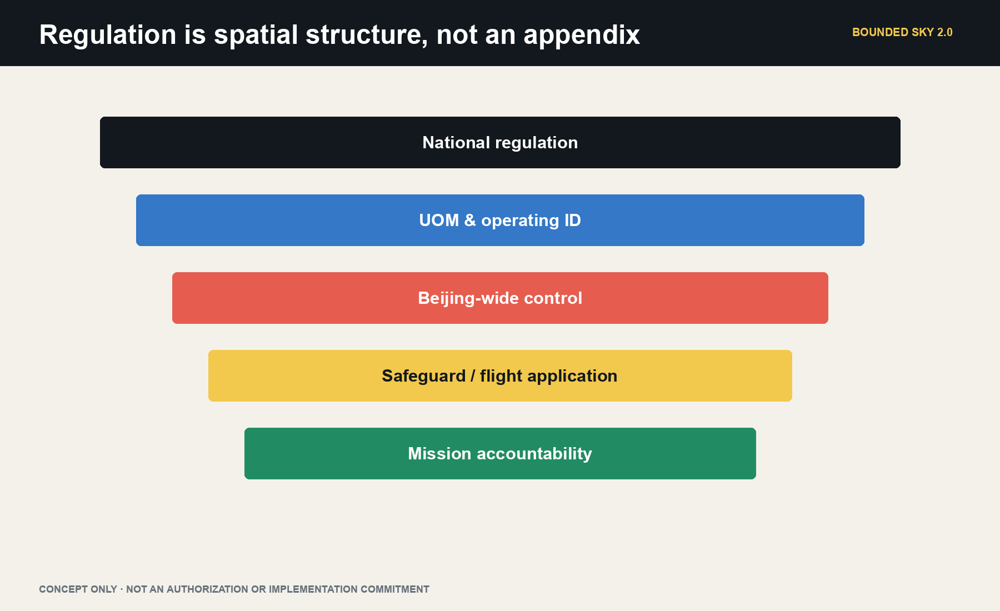
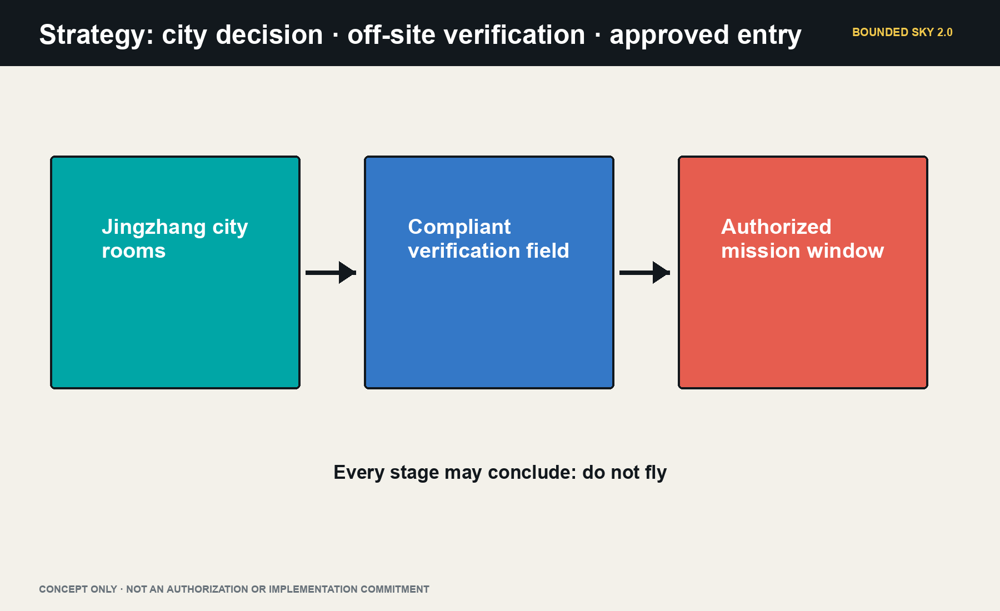
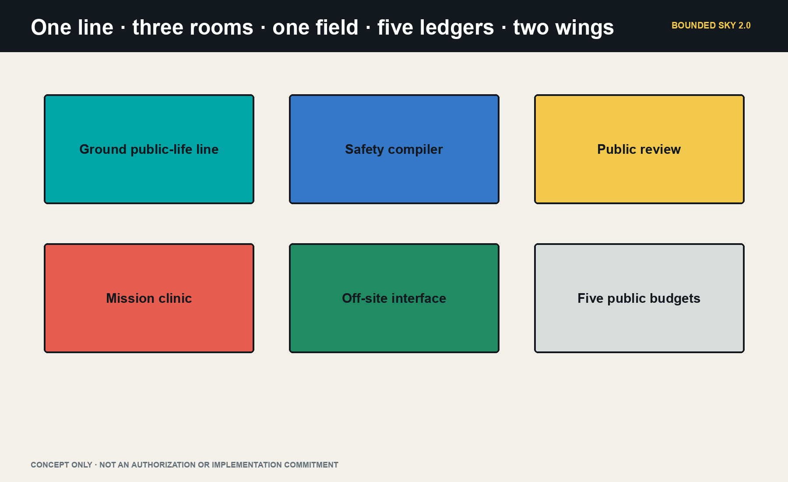
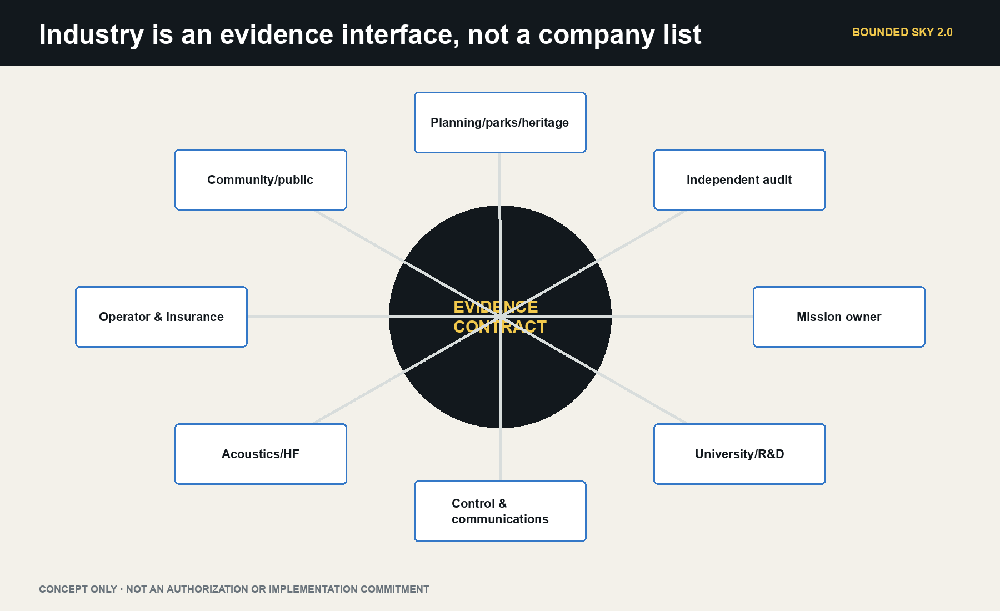
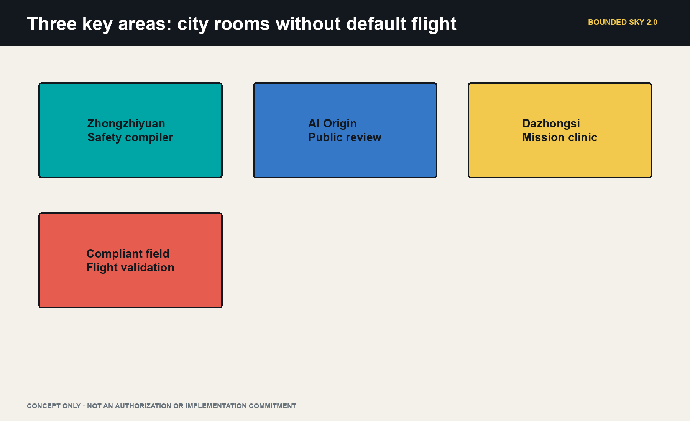
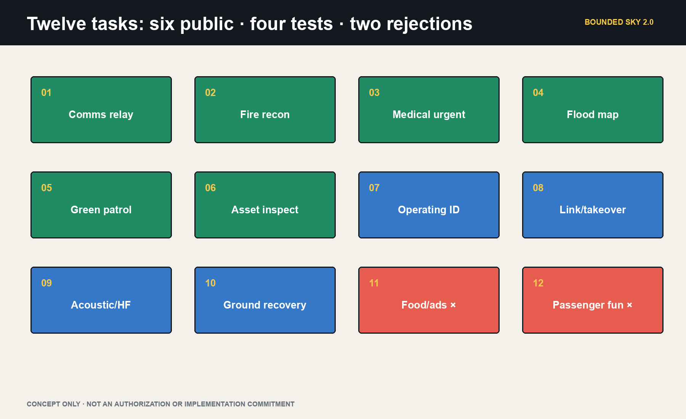
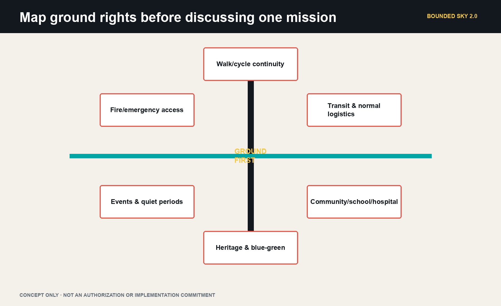
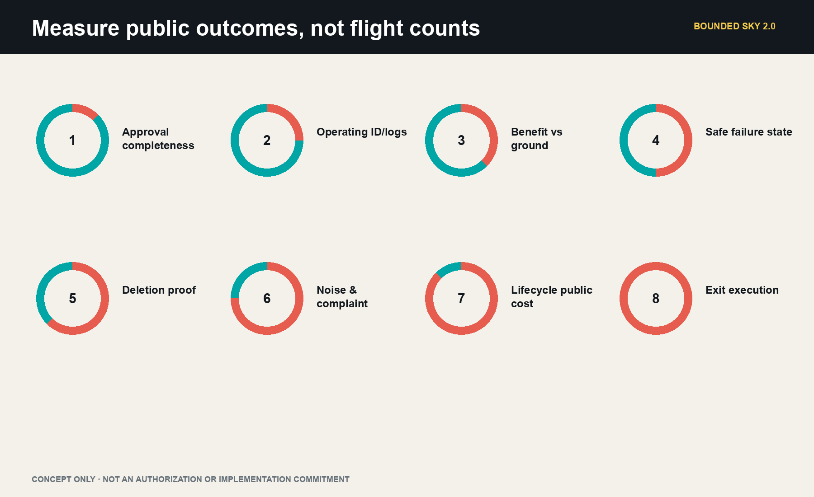

# BOUNDED SKY: A Low-Altitude Public Protocol for Centennial Jingzhang

> Urban sky is not an empty page for efficiency. Every flight spends safety, quiet, energy, ground occupation, and public time. Those costs should enter a public ledger before a city asks how far a low-altitude economy can fly.

This is not an airway, depot, or flight-show proposal. It is verification infrastructure for public low-altitude services under Beijing's current control regime. Since 1 May 2026, all outdoor UAS activity in Beijing requires application and approval, while UAS and core-component storage within the Sixth Ring is generally prohibited. The three Jingzhang key areas therefore default to no aircraft storage, no routine nest, and no park airway. They host digital twins, mission diagnosis, public review, rule replay, and responsibility display. Aircraft custody, operator training, operating-identification tests, and controlled flight validation connect to Haidian Airport or another separately confirmed compliant setting. Only a documented emergency, fire, medical, ecological, or maintenance need may progress toward one bounded, separately authorized mission window [source:BEIJING-UAS-REGULATION-2026] [source:BEIJING-UAS-SPECIAL-SAFEGUARD-2026].

The boundary is first legal, then civic, then spatial. The Agent does not approve, operate, or scale a service. It compiles a real need into evidence gaps, ground counterfactuals, candidate actions, and stop conditions so responsible humans can decide whether the task is worth flying, can lawfully fly, and has an accountable recovery path.

## Core Concept and Mechanism: The Low-Altitude Budget Compiler

The compiler turns a request into a reviewable urban action. Inputs include mission owner, beneficiary, urgency, ground alternative, time window, operator, and failure cost. Constraints include Beijing approval, special safeguards, UOM and operating identification, weather and communications, privacy, acoustics, ecology, and ground separation. Five ledgers record safety, quiet/ecology, privacy/data, energy/carbon, and ground public space. Outputs are limited to reject, desk simulation, off-site validation, hold for evidence, authorized mission window, or abort to ground [data:visual/assets/agent-governance.json].

The system has three responsibility segments. Jingzhang's city rooms diagnose demand, run digital twins, and host public review. A compliant verification field handles custody, training, operating identification, and controlled failure tests. An authorized mission window contains one real public task. There is no automatic progression: every segment may conclude that not flying is the correct outcome [data:simulation.json#SIM-BS-001] [depth:ai_scenario_system].

## Design Basis and Source List

The proposal first follows the official brief: three nested scopes, three key areas, urban renewal, mobility and municipal systems, AI scenarios, and public space. The Agent taskbook adds identity, comparative cases, scenario cards, cultural narrative, pilgrimage landmarks, and long-term operation [source:OFFICIAL-ANNOUNCEMENT] [source:AGENT-TASKBOOK]. Public material does not establish real flight corridors, building heights, property rights, local noise or weather baselines, communications coverage, or operating permission. All operational figures are therefore unknown or explicitly synthetic.

The policy chain has four levels. National regulation establishes registration, flight application, safety responsibility, emergency response, cybersecurity, and noise control. CAAC's UOM and 2026 operating-identification rules establish visibility and traceability. Beijing's 2026 regulation adds full-city control and Sixth-Ring storage constraints. Beijing's low-altitude action plan gives Haidian a role in regulatory/service platforms, digital base maps, testing, and demonstrations rather than routine central-city logistics or passenger service. Policy support does not equal project authorization [source:UAS-INTERIM-REGULATION] [source:CAAC-OPERATING-ID-2026] [source:BEIJING-LOW-ALTITUDE-ACTION-PLAN].

Published Haidian practice supports a narrower demand set: high-rise fire governance, flood preparation, forest-fire patrol, controlled research validation, and firefighter operator training. Jingzhang Phase II also serves dense public life, with nearly 70 communities, about 450,000 residents, more than ten universities, and more than forty research institutes. The heritage park's ecological, cultural, historical-display, recreation, and free-access roles remain primary [source:HAIDIAN-EMERGENCY-NEEDS-2026] [source:HAIDIAN-AIRPORT-PRACTICE-2025] [source:JINGZHANG-PHASE2-CONTEXT].

The overall boundary and all three key-area polygons are provisional repository geometry. They support topology, visualization, and repeatable calculations only; they are not official redlines, cadastral evidence, precise area, or an aviation plan [data:geometry/site_boundary.geojson#SITE-001]. Official polygons, buildings, sensitive receptors, weather, acoustics, communication, and authorization data must trigger a full regeneration of geometry, metrics, simulation, figures, HTML, and PDFs.

## Three-Level Scope Framework

One chain connects all three scales: real need, ground counterfactual, verification evidence, human responsibility, and exit decision. The 43.6 km2 coordinated scope organizes technical output, compliant verification, and regional method exchange. The 11.4 km2 overall-design scope protects ground rights and hosts the digital base map, mission ledger, and public review. The 368.4 ha key-area scope hosts three city rooms: safety compilation, public deliberation, and mission diagnosis. None creates a route [depth:three_level_scope_framework].

The five public budgets are safety risk, quiet/ecology, privacy/data, energy/carbon, and ground public space. Current 0-100 values are synthetic test tokens, not decibels, probabilities, emissions, legal data volumes, or statutory capacity. Budgets cannot purchase a hard gate: missing approval, operator, identification, weather, communications, separation, privacy, or human command means rejection or return to desk study [metric:airspace_budget_dimension_count].

The spatial shorthand is one ground line, three rooms, one field, five ledgers, and two wings. The ground line protects continuous public life in the heritage park. Zhongzhiyuan hosts safety compilation, AI Origin hosts public review, Dazhongsi hosts mission diagnosis, and a separately compliant field hosts aircraft verification. The east wing links research review; the west wing links communities and public services [data:geometry/key_areas.geojson#PROV-KEY-001].

## Coordinated Research Area: Industry and Future City Research

BOUNDED SKY has three positions: a public verification belt for world-class AI industry, a rule laboratory joining low-altitude systems to urban planning, and a future-city model that people can understand and stop. Its five functions are verification, transfer, enterprise service, talent life, and public culture. Zhongzhiyuan emphasizes full-stack safety research, AI Origin emphasizes university transfer and civic negotiation, and Dazhongsi emphasizes complex urban service and international communication [source:AGENT-TASKBOOK] [standard:PROJECT-AGENT-OPEN-CALL-TASKBOOK].

The ecosystem is defined by six accountable interfaces rather than a list of drone companies: vehicle and sensing providers submit bounded capability; universities test algorithms, noise, and human factors; planners define ground rights; operators provide authorization and fallback material; community representatives review quiet time and public budgets; independent auditors preserve incidents, complaints, and recovery. Regional links are proposed as exchange interfaces, not claimed partnerships: method exchange with Future Science City, instrument scenarios with Huairou, manufacturing and maintenance learning with the Economic-Technological Development Area, and locally re-authorized rule templates across Beijing-Tianjin-Hebei.

The Agent is necessary because negotiation is continuous. Weather, budget balance, requests, complaints, equipment state, and human instructions change faster than a static plan. The Agent produces an explainable candidate schedule, records why a task was refused, and recomputes the complete package when policy or geometry changes. Humans retain budget setting, sensitive-area confirmation, emergency release, operation, approval, and final veto [data:visual/assets/agent-governance.json].

### Global Case Comparison and Full-Stack Ecosystem

To keep “world-class ecosystem” from becoming a company list, the package compares six public cases through mechanisms only: Kendall Square for compact interfaces among universities, firms and public space; 22@Barcelona for renewal and knowledge-industry mix; King's Cross Knowledge Quarter for cultural, research and public-realm networks; Paris-Saclay for regional research collaboration; Station F for shared platforms and staged founder support; and Toronto Waterfront for public-realm-first civic technology scrutiny. Transferable mechanisms, limits and source status are recorded in `visual/assets/ecosystem-cases.json`. They are background-only and do not support local investment, output, business-attraction or policy claims [source:GLOBAL-CASE-SHORTLIST] [data:visual/assets/ecosystem-cases.json].

The “one line, three rooms, one field, five ledgers, two wings” frame maps to eight full-stack elements. Land remains reversible ground rights; space is the three city rooms and an off-site verification interface; industry links controls, sensing, acoustics, planning, operation, and audit; funding is a lifecycle-cost and insurance question; talent includes researchers, operators, maintainers, community reviewers, and accessibility workers; compute is auditable and edge-minimized; data is task-essential; and scenarios comprise twelve mission cards plus four validation families [depth:ai_ecosystem_mapping] [data:visual/assets/operations-program.json].

## Overall Design Area: Urban Renewal and Regulatory-Plan-Level Urban Design

The overall design starts with a ground-priority map, not an airway. Continuous green and public space, schools, hospitals, communities, transit interchange, crowd periods, fire access, and maintenance routes form negative space. A task can enter a formal application discussion only after those rights, an equivalent ground service, and a clear public necessity are documented [data:geometry/land_use.geojson#LU-001] [depth:overall_spatial_structure].

The plan draws four negative spaces rather than a corridor: crowded events, sensitive receptors, heritage/ecological quiet space, and transport/emergency paths. Indoor-first and reversible interventions host digital display, staffed service, acoustic experiments, and data audit. No empty-looking roof is presumed usable, and no permanent aircraft depot, charging room, nest, or routine launch facility is proposed [source:BEIJING-UAS-REGULATION-2026].

Urban space is changed by the protocol at ground level: non-app explanations and appeals, staffed transfer, removable status elements, and edge processing that exports only task-essential event summaries. If the ordinary route, human fallback, or quiet boundary cannot be maintained, the aerial service stops. The right to exit is therefore an urban-design condition, not a software disclaimer [data:geometry/public_space.geojson#PUBLIC-001].

## Detailed Design of Key Areas

The Zhongzhiyuan Safety Compiler Room links full-stack R&D with governance. A mission-schema workshop, urban-canyon digital twin, operating-identification bench, failure-injection theatre, and professional sign-off room turn algorithms, controls, communications, acoustics, insurance, and emergency procedures into one evidence packet. It stores no aircraft and never converts indoor R&D into presumed outdoor permission [data:geometry/key_areas.geojson#PROV-KEY-001].

The AI Origin Public Review Room links universities and civic rule-making. An acoustic room, minimum-field-of-view demonstrator, non-app service desk, fairness replay table, and appeal wall let residents, students, disabled people, carers, and frontline workers test necessity, burden, data minimization, and ground alternatives. A rule freezes when a material objection cannot be remedied [source:PIPL] [data:geometry/key_areas.geojson#PROV-KEY-002].

The Dazhongsi City Mission Clinic is not a passenger or routine-delivery hub. Fire, medical, emergency, parks, heritage, and maintenance teams submit a beneficiary, urgency, ground baseline, time window, failure cost, and accountable owner. The Agent compares ground-only, low-altitude-assisted, and no-action options. Only a mission whose evidence and public value outperform the ground counterfactual is recommended for off-site validation [data:geometry/key_areas.geojson#PROV-KEY-003].

The three rooms connect methodically to a separately compliant verification setting. Published Haidian Airport practice documents research validation, payload development, controlled patrol, and firefighter training, but this proposal claims neither partnership nor authorization. What leaves Jingzhang is an experimental evidence contract, not a commercial flight order [source:HAIDIAN-AIRPORT-PRACTICE-2025].

The three landmarks are carriers for a responsibility-replay honor layer and a public-space component library. Only a public-interest task with a versioned replay, published reason, acknowledged limitation and named human sign-off can enter the honor layer. Status signs, staffed desks, budget ticks, quiet edges and fallback markers are removable, maintainable, non-blocking and available on paper or through staffed explanation. The landmark display layers, honor rules and component catalogue are recorded in `visual/assets/landmark-component-library.json` [data:visual/assets/landmark-component-library.json].

## AI Innovation Ecosystem, Personas, and AI+ Scenarios

Seven role-based personas shape governance rather than marketing: emergency/fire command; medical teams; parks, heritage, and municipal maintainers; accountable operators; research developers; disabled people, carers, and non-smartphone users; and residents, students, and visitors. These roles do not create personal behavioral profiles [source:PIPL] [depth:ai_scenario_system].

Twelve cards comprise six public missions, four capability tests, and two negative tests: disaster communications, high-rise fire reconnaissance, urgent medical samples or supplies, flood mapping, green-space fire-risk patrol, heritage/municipal inspection; operating identification, urban-canyon links and takeover, acoustic/human-factors validation, network-loss recovery; and routine food/advertising plus passenger/park-entertainment requests that must be rejected. Each card declares a city-room role, verification field, mission window, ground counterfactual, minimum evidence, success measure, and `stop_if` [data:visual/assets/scenario-cards.json] [metric:scenario_card_count].

Four industrial validation families test operating identification and UOM interfaces, communications and human takeover under urban obstruction, task-level acoustics and group differences, and privacy minimization with purpose lock and deletion. The Agent returns desk study, off-site validation, hold for evidence, or reject. It never promotes simulation into flight [source:CAAC-OPERATING-ID-2026] [data:simulation.json#SIM-BS-001].

This is an AI urban-planning loop rather than an abstract algorithm demo. Inputs come from provisional GeoJSON, a task schema, weather and acoustic placeholders, and human instructions. The algorithm performs constraint solving, conflict scheduling, bias comparison, and versioned recalculation. Beneficiaries include emergency teams, maintainers, researchers, disabled people, residents, students, visitors, and enterprises. Human review decides authorization, privacy, emergency action, and final veto; each result must return to a concrete transport, public-space, community-governance, and industry interface before the next test phase [data:visual/assets/agent-governance.json] [metric:simulation_success_rate].

## Land Use, Building Scale, and Retain-Renovate-Demolish Strategy

The four provisional land-use groups remain AI research, green and open space, industry and commerce, and community service. The protocol adds conditions rather than inventing a new statutory use: green space prioritizes quiet and ecology; community space prioritizes privacy and equivalent service; research space may study bounded testing; commercial space requires proven ground access and handover. Topology is recomputable, while statutory classification and exact scale await official material [data:geometry/land_use.geojson#LU-002] [standard:MNR-LAND-USE-CLASSIFICATION-GUIDE].

Building action has four levels: retain, light retrofit, removable prototype, and new-build pending. Light retrofit means status signs, staffed desks, removable separation, and edge-computing interfaces. Removable prototypes support closed studies and do not create permanent stations. New launch, power, or communications facilities remain pending structure, fire, electromagnetic, acoustic, landscape, ownership, and funding review. The submitted building footprint is conceptual, not a roof-load or demolition survey [data:geometry/buildings.geojson#BLDG-001] [metric:building_footprint_area_sqm].

Height, floor-area ratio, roof form, and development intensity are not guessed. Equipment should not obscure railway heritage, public interfaces should not become private advertising, status lighting should avoid disturbance, and every pilot element should be restorable. If professional review removes a node, the wider protocol still works. The ability to do less is a central implementation discipline.

## Transport, Rail, Municipal Infrastructure, and Public Services

Walking, cycling, rail, and ordinary logistics always precede aerial service. The continuous heritage-park route cannot be occupied by launch or queuing. At Dazhongsi and other interchanges, four-quadrant walking, bicycle parking, and staffed handover come first. Every schedule checks that an equivalent ground path exists; if ground transfer creates a new accessibility or crowd risk, the request goes to human coordination rather than shifting harm to the street [data:geometry/roads.geojson#ROAD-001] [depth:transport_municipal_facilities].

Municipal interfaces include isolatable power, charging safety, redundant communication, remote identification, weather and acoustic observation, emergency landing, and fire access. Admission requires maintenance, spares, insurance, staffing, and removal resources for a complete cycle. Energy values in the simulation are task-level test budgets; they are not measured consumption or a carbon claim [metric:energy_budget_violations].

Public service has two doors. A digital door submits structured requests; a staffed door explains, assists, hears appeals, and handles emergencies. The Agent proposes schedules and impact statements. Named humans remain responsible for operation, permission, incident response, privacy, and public-budget change. A network loss freezes new work, preserves state, transfers control, and restores ground service; failure of that chain keeps the system closed [data:visual/assets/agent-governance.json].

## Blue-Green Network, Public Space, and Urban Character

Blue-green space is a protected subject, not an airway backdrop. Rivers, continuous green space, and the heritage park carry ecology, exercise, rest, and memory. Quiet edges, no continuous personal tracking, pending bird and seasonal surveys, and event-period pauses translate that priority into design rules. Green and public-space ratios come from provisional geometry and serve internal consistency only [data:geometry/green_space.geojson#GREEN-001] [metric:green_ratio].

Three conceptual landmarks form a public AI pilgrimage route. A northern Public Stop Bell shows who can pause and restore a system. A central Sky Ledger Wall replays anonymized budgets, refusals, and complaints. A southern Ground-Air Handover Gate explains responsibility across rail, walking, ordinary logistics, and low-altitude tasks. They require landscape, accessibility, acoustic, and operational design and are not approved structures [metric:ai_landmark_count].

The identity is a Jingzhang line held by a bracket. Black marks ground rights, cyan marks an admitted task, yellow marks scarce budget, and coral is reserved for stop or risk. Chinese and English names sit together; state never depends on color alone. The intended character is not a sky full of devices, but rules that are visible while technical burden recedes [data:visual/assets/identity-system.json].

The cultural storyline has three chapters: the railway brings distance to Haidian; Zhongguancun turns knowledge into public collaboration; and AI lets a city pause and replay. The heritage-park ground line carries chapter one, east-west negotiation nodes carry chapter two, and the three responsibility landmarks carry chapter three. Signage uses a ground line, numbered budget tick, stop mark, handover gate and replay timestamp, with Chinese, English, non-colour cues and staffed explanation. International copy stays explicit about concept status: no route, flight, permit or built landmark is claimed [data:visual/assets/culture-signage.json] [depth:cultural_storyline].

## Renewal Projects, Implementation Policy, and Phasing

Nine first packages are proposed: evidence baseline, boundary recalculation, three budget cells, request schema, staffed interface, status and identity system, twelve stress tests, complaint replay, and annual audit. Each package names responsible roles, inputs, stop conditions, recovery, and evidence. Missing authorization or responsibility leaves it in research status; an event date cannot force release [data:geometry/phasing.geojson#PHASE-001] [depth:renewal_project_list].

Phase P0 covers evidence, regulation, civic questions, and offline simulation. P1 studies equipment and human fallback in one closed interface. P2 may consider one authorized small pilot inside one cell. P3 only studies cross-cell coordination after independent evaluation. Every phase may expand, narrow, or exit. Official geometry, local acoustic and weather baselines, airspace and operating permission, insurance, fire review, and public deliberation are hard gates [assumption:A-AIRSPACE-AUTH-001] [depth:phasing_implementation].

A long-term Bounded Sky Week is proposed as a global open challenge. Teams run the same public synthetic tasks and compare who meets needs with less public cost. Residents and professionals review refusals, bias, and recovery rather than speed alone. The annual ledger becomes a transferable rule library that another city can retest with local budgets and sensitive uses. The event is not approved; host, place, date, and funding remain human decisions.

The operating system runs as a quarterly cycle of rule calibration, closed validation, public replay and responsibility ledger. Developers enter through the public task schema and offline replay pack; operators add responsibility, insurance and recovery material; communities review rules and request replays; professional teams decide whether to continue only after official data and permission gates. The activity brand is a removable communication and audit format, not a registered mark or government event. Every phase retains expand, narrow and exit decisions, and staffed and ordinary logistics must continue when low-altitude service is closed. Follow-up pathways for developers, operators, communities and institutions are recorded in `visual/assets/operations-program.json` [data:visual/assets/operations-program.json] [depth:long_term_operation].

## Metrics, Area Recalculation, and Compliance Matrix

Known spatial values are limited to values recomputable from submitted geometry: provisional site area, building footprint, green ratio, public-space ratio, and three key areas. They are not official area or regulatory control [metric:site_area_sqm] [metric:public_space_ratio]. Real altitude, route length, noise, weather availability, flights, incident rate, public acceptance, and operating cost remain unknown until official and field evidence exists.

The simulation contains twelve structured tasks. Every record passes schema and leaves a complete audit trail. School-period, noise-exceedance, network-loss, and missing-authority tasks achieve the expected reject or fallback branch. A 1.0 simulation success rate therefore means the control logic behaved as designed, not that twelve flights succeeded [metric:simulation_task_count] [metric:simulation_success_rate]. A synthetic first-come counterfactual admits more work but incurs four budget violations; the bounded model records none. This is an algorithm stress test, not proof of real-world superiority.

The compliance matrix covers brief items 1.3, 1.4, 1.5 and agent.1-agent.6. The standards matrix covers urban design, regulatory-plan depth, land use, accessibility, age inclusion, and data boundaries. Any updated input triggers version locking, GeoJSON recutting, metric recalculation, simulation replay, bilingual figure regeneration, PDF/HTML generation, and a new full self-check [depth:metrics_recalculation].

## Risk, Copyright, and Compliance

The highest risks are policy and airspace uncertainty, technical maturity, and implementation complexity; public acceptance, spatial rights, equity, privacy, and maintenance follow. `risk.json` assigns design risk levels, mitigation, and human review. High-risk scenarios stay closed until authorization, professional assessment, human takeover, insurance, public communication, and recovery resources are jointly available [data:risk.json] [depth:risk_missing_data].

Data is minimized. The ledger stores task class, time window, budget use, decision reason, and responsible role. It excludes unrelated facial data, continuous personal trajectories, and cross-scenario profiles. People can inspect rules, object, and request replay. Unexplainable data linkage must be removed or stopped. The Agent advises; humans remain responsible for approval, enforcement, operation, incidents, sensitive information, and final public-interest judgment.

Text, structured design, figures, and layout were generated by Codex with user authorization. Official sources retain their rights. Figures derive from package GeoJSON, JSON, and original geometric elements; no news images, remote tiles, third-party trademarks, or uncleared fonts are used. Community display permission does not transfer source rights or imply official endorsement, planning approval, flight permission, engineering feasibility, or implementation.

## References

1. Official prequalification announcement for the Centennial Jingzhang AI Innovation Belt [source:OFFICIAL-ANNOUNCEMENT].
2. Repository Agent taskbook, six mandatory tasks, and supplementary review dimensions [source:AGENT-TASKBOOK].
3. State Council and Central Military Commission, Interim Regulations on the Flight Administration of Unmanned Aircraft, State Council Order No. 761, effective 1 January 2024 [source:UAS-INTERIM-REGULATION].
4. Repository public source registry and local professional-standard snapshots [source:SOURCE-REGISTRY].
5. Provisional overall and key-area geometry, used only for concept generation and recalculation workflow [source:BOUNDARY-SOURCE].
6. Package `simulation.json`, `metrics.json`, and `visual/assets/airspace-budget.json`, recording the offline protocol and repeatable stress test.
