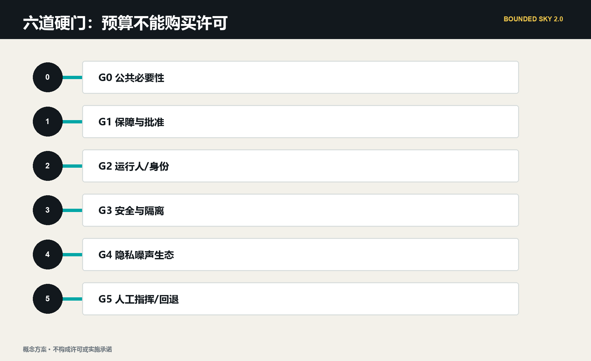
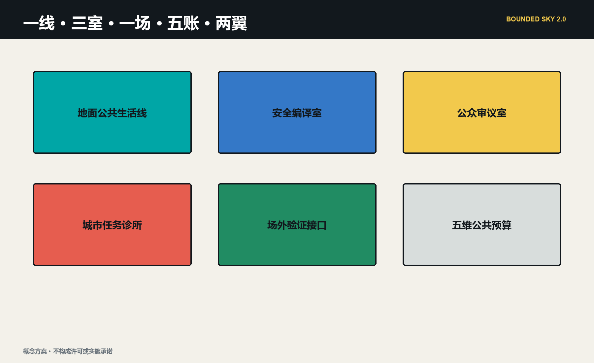
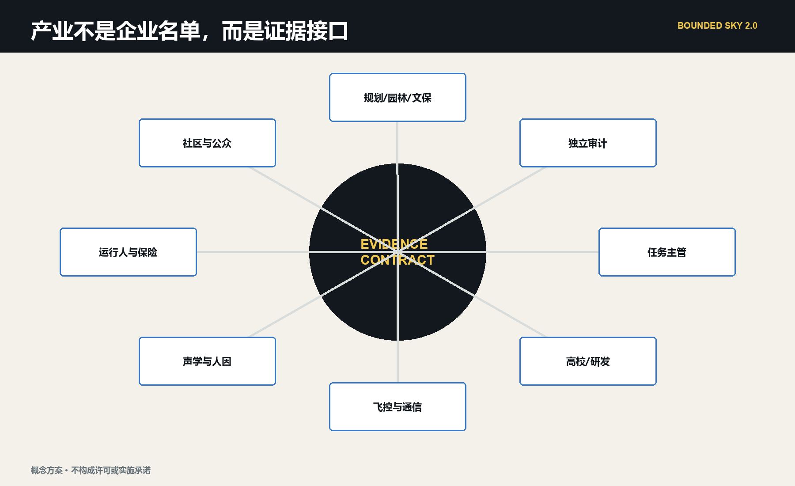
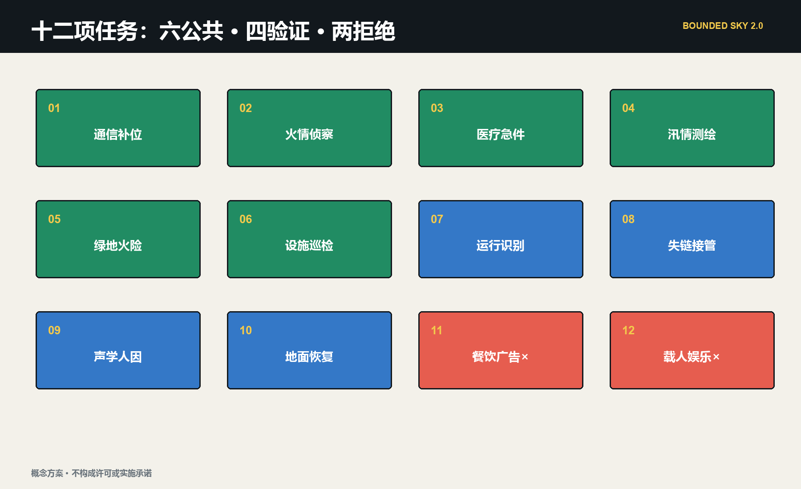
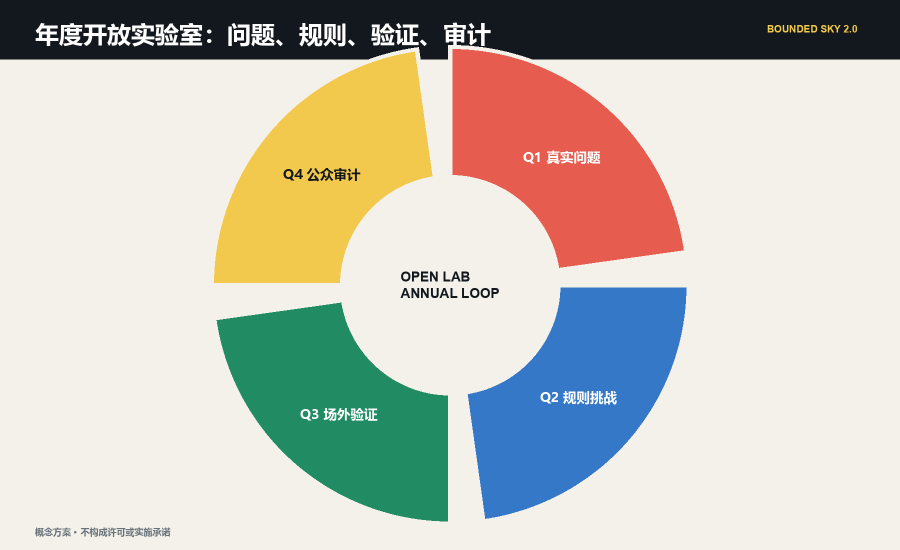
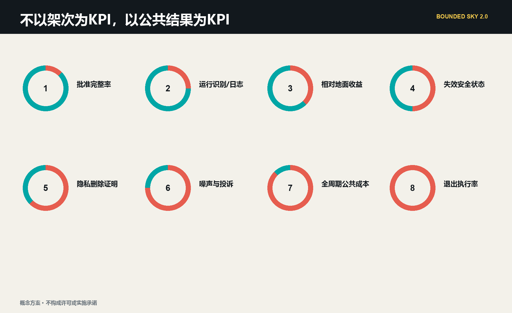

# 天空有边 / BOUNDED SKY：百年京张低空公共协议带

> 城市的天空不是效率的空白页。每一次飞行都在消耗安全、安静、碳、地面占用与公共时间；先把这些代价写进公开账本，再讨论低空经济能够飞多远。

本方案不是航线、机库或飞行表演设计，而是一套面向北京真实管制条件的“城市低空公共服务验证基础设施”。2026 年 5 月 1 日起，北京全域室外无人机活动须申请，六环内无人机及核心部件存储原则上受禁；因此京张沿线三处重点区默认不存机、不建常态机巢、不开放公园航路，只承担数字孪生、任务诊断、公众审议、规则回放和责任展示。实机保管、飞手训练、运行识别和失效验证接到海淀机场或其他经主管部门确认的合规场地；只有应急、消防、医疗、生态或设施维护等任务证明公共必要性，并完成特殊保障、飞行申请、运营、安全、隐私、噪声和地面隔离后，才可能以“一次任务、一个时窗、一名指挥、一套退出动作”临时进入 [source:BEIJING-UAS-REGULATION-2026] [source:BEIJING-UAS-SPECIAL-SAFEGUARD-2026]。

这使“天空有边”从限制技术的口号变成一个可操作的城市设计命题：边界首先是法律边界，其次是公共利益边界，再次是地面空间、安静、隐私、能源和财政边界。Agent 不审批、不操控、不自动扩张，只把真实需求编译成证据缺口、候选方案、地面对照和停止条件，帮助人类判断“是否值得飞、能否合法飞、失败后谁接手”。

## 核心概念与机制：低空预算编译器

“低空预算编译器”把一条自然语言请求编译成可复核的城市动作，而不是把 Agent 当成自动写规划的聊天界面。输入层接收任务主管、受益人、紧迫性、地面对照、概念位置、时窗、运行人和失败代价；约束层叠加北京管制、特殊保障、UOM/运行识别、气象通信、敏感区、隐私、噪声、生态和地面隔离；预算层记录安全、安静/生态、隐私/数据、能源/碳、地面公共空间五本账；决策层只输出拒绝、桌面仿真、场外验证、待补证据、获批任务窗口、终止转地面六类状态；证据层保存版本号、触发的 `stop_if`、人工复核者、事故/投诉与恢复动作 [data:visual/assets/agent-governance.json]。

它采用“三段式责任链”：京张城市室负责需求诊断、数字孪生和公众审议；合规验证场负责设备保管、操控训练、运行识别和封闭实测；获批任务窗口负责一次真实公共任务。三段之间不是自动流水线，任何一段都可作出“不飞”的最终建议。规则或官方边界更新时，Agent 重新编译全部任务、图层和指标；人类委员会可以冻结规则、改写预算或一键否决，结果回到公开账本 [data:simulation.json#SIM-BS-001] [depth:ai_scenario_system]。

## 设计依据与资料清单

方案首先服从征集公告的三层范围、三处重点区域、城市更新、交通市政、AI 场景和公共空间任务；面向智能体任务书补充品牌、案例、场景卡、文化叙事、朝圣节点和长期运营 [source:OFFICIAL-ANNOUNCEMENT] [source:AGENT-TASKBOOK]。公开资料不足以支持真实航路、建筑高度、权属、噪声基线、气象窗口或运营许可，因此临时边界只用于概念拓扑和复算，所有运行性能保持为“待现场测量”或“离线合成压力测试”。正文中的“城市房间”“验证接口”“任务窗口”和“预算”均为可供专业团队深化的设计建议，不是法定空域或政府决定。

政策链分四层。国家《无人驾驶航空器飞行管理暂行条例》规定实名登记、飞行活动申请、安全主体责任、应急处置、网络信息安全和噪声控制；民航 UOM 与 2026 年运行识别规范要求可被识别和监管；北京 2026 年地方规定进一步明确全域管制和六环内存储边界；北京低空经济行动方案则把海淀定位在监管/服务平台、城市低空数字底图、测试验证和应用示范，而不是中央城区批量物流和客运 [source:UAS-INTERIM-REGULATION] [source:CAAC-OPERATING-ID-2026] [source:BEIJING-LOW-ALTITUDE-ACTION-PLAN]。政策支持产业不等于许可项目，这是方案最重要的证据纪律。

需求链来自海淀与北京已公开实践：海淀正在推进高层建筑消防隐患治理、防汛准备和森林防火智慧指挥，已有无人机森林防火巡护、海淀机场科研验证和消防飞手训练；北京洪涝救援已使用无人机开展应急通信和监测。这些材料证明“应急、消防、巡检、验证”值得继续研究，却不能证明京张的点位、频次和设备已经可行 [source:HAIDIAN-EMERGENCY-NEEDS-2026] [source:HAIDIAN-AIRPORT-PRACTICE-2025] [source:BEIJING-FLOOD-UAS-PRACTICE-2025]。

场地链提醒方案保持克制：京张二期服务近 70 个社区、约 45 万居民、10 余所高校和 40 余家科研机构；遗址公园的首要价值是生态、文化、历史展示、休闲和免费公共使用。低空系统必须服务这些密集的真实主体，而不是把公园当成没有地面权利的基础设施走廊 [source:JINGZHANG-PHASE2-CONTEXT] [source:JINGZHANG-PARK-PUBLIC-REALM]。

当前总体边界和三处重点区均来自仓库临时粗略几何，不能用于审批、确权、精确面积或真实飞行规划 [data:geometry/site_boundary.geojson#SITE-001]。取得官方 polygon、建筑与人口敏感点、气象、噪声、通信覆盖和许可资料后，Agent 必须重裁所有图层，重新计算地面与空中预算，重跑 12 项压力测试，并更新五张图、双语网页和 PDF；不能只替换一张底图。

## 三层范围工作框架

三层空间由同一条“真实问题－地面对照－验证证据－人类责任－退出结论”贯通。43.6 km² 统筹研究范围组织北京技术输出、海淀机场等合规验证和京津冀外场接口；11.4 km² 总体设计范围保护地面公共权利，部署数字底图、任务账本和公共审议界面；368.4 ha 三处重点区域分别承担安全编译、公众审议和城市任务诊断。三个尺度都不生成实际航线，越接近真实运行，越必须离开概念图转入主管部门的正式程序 [depth:three_level_scope_framework]。

五维公共预算分别是：安全风险、安静与生态、隐私与数据、能源与碳、地面公共空间。当前 0-100 数值只是离线压力测试单位，不代表分贝、事故概率、碳排、合法数据量或法定容量。预算不能购买硬门：即使公共收益很高，只要许可、运行人、运行识别、气象通信、地面隔离、隐私或人工指挥任一不成立，结论仍是拒绝或回到桌面 [data:geometry/constraints.geojson#BS-CELL-01] [metric:airspace_budget_dimension_count]。

空间骨架升级为“一线、三室、一场、五账、两翼”。一线是京张遗址公园地面公共生活连续线；三室是众智园安全编译室、原点社区公众审议室、大钟寺城市任务诊所；一场是独立合规实飞验证接口；五账是五类公共预算；东翼连接高校、研究机构与专业审查，西翼连接社区、公共服务和地面运营。它把“创新带”从设备走廊改成证据和责任走廊 [data:spatial.json]。

| 层级 | 主要对象 | 可做 | 默认不可做 | 关键产物 |
|---|---|---|---|---|
| 统筹研究范围 | 区域产业与监管协同 | 方法、标准、场外验证网络 | 推定跨区航路与合作 | 验证接口清单、规则版本 |
| 总体设计范围 | 公园、社区、交通、公共服务 | 数字底图、地面对照、公众预算 | 常态航路、机巢与机库 | 敏感受体图、任务账本 |
| 三处重点区 | 可感知的公共界面 | 仿真、展陈、任务诊断、申诉 | 未经批准的室外飞行 | 三类城市房间与责任地标 |
| 获批任务窗口 | 单次公共任务 | 按批准条件执行和审计 | 自动复用和规模扩张 | 任务证据包、事后评估 |

## 统筹研究范围产业与未来城市研究

“天空有边”对应三大定位：世界级 AI 产业的公共验证带、低空系统与城市规划协同的规则实验室、可被公众理解和叫停的未来城市样板。五类功能为研发验证、成果转化、企业服务、人才生活、公共文化；北部众智园侧重全栈验证与安全标准，中部原点社区侧重高校成果转化与公众协商，南部大钟寺侧重城市服务和国际展示，两翼分别连接科研网络与社区产业网络。这一结构回应任务书但不声称形成了既定产业政策 [source:AGENT-TASKBOOK] [standard:PROJECT-AGENT-OPEN-CALL-TASKBOOK]。

产业生态不是“引入更多无人机企业”的名单，而是六类可复核接口：飞控与感知企业提供受限能力；高校提供算法、噪声和人因研究；规划团队定义地面公共权利；运营方提交任务与保险/回退材料；社区代表参与预算和安静时段审议；审计机构保存事件、投诉和恢复记录。区域协同采用接口而非虚构合作：未来科学城可交换测试方法，怀柔科学城可提供科学仪器场景研究，经开区可交流制造与运维规范，京津冀节点可共享匿名化规则模板；任何跨区应用都须重新许可和本地评估。

Agent 的不可替代性来自连续协商而不是“自动写规划”。它需要在不断变化的天气、任务优先级、预算余额、投诉阈值、设备状态和人工指令之间形成可解释方案，保存每次拒绝的理由，并在边界或政策更新时全链复算。人工委员会保留预算设定、敏感区确认、紧急放行和最终否决权；Agent 不能审批、不能替代操控员，也不能把历史偏好变成永久配额 [data:visual/assets/agent-governance.json]。

### 全球案例对照与全栈生态映射

为避免把“世界级生态”写成企业名单，本包选取六个公开案例，只比较空间与治理机制：Kendall Square 对应高校、企业和公共空间的紧凑接口；22@Barcelona 对应存量更新与知识产业混合；King's Cross Knowledge Quarter 对应文化机构、科研组织和公共界面的连续网络；Paris-Saclay 对应跨节点科研协作；Station F 对应共享平台和分阶段创业服务；Toronto Waterfront 对应公共空间优先与技术治理审议。每个案例的可转化机制、不可直接套用的限制和来源状态记录在 `visual/assets/ecosystem-cases.json`，均为 background-only，不支撑本地投资、产值、招商或政策承诺 [source:GLOBAL-CASE-SHORTLIST] [data:visual/assets/ecosystem-cases.json]。

“一线、三室、一场、五账、两翼”对应八要素全栈生态：土地是临时边界与可退出的地面权利；空间是三个城市房间和场外验证接口；产业是飞控、感知、声学、规划、运营与审计网络；资金只作为待核的全生命周期成本与保险约束；人才包括研究者、操控员、维护者、社区审查者和无障碍服务者；算力采用可审计的离线编译与端侧最小化；数据只保留任务必要字段和事件摘要；场景由 12 张卡和四类能力验证驱动。中关村科技服务翼负责方法、知识产权和专业服务，小月河场景赋能翼负责公共体验与地面替代 [depth:ai_ecosystem_mapping] [data:visual/assets/operations-program.json]。

## 总体设计范围城市更新与控规深度城市设计

总体层不先画航线，而是先画“地面优先图”。连续绿地、公共活动界面、学校医院等敏感点、轨道换乘、人群密集时段、消防和维护通道构成低空设计的负空间；只有在这些权利被标注且有人工等价服务后，才讨论单次任务是否值得进入正式申请。原有用地、绿地、公共空间、建筑和慢行图层继续作为结构化底板，概念约束通过 `constraints.geojson` 叠加，不改变临时用地边界 [data:geometry/land_use.geojson#LU-001] [depth:overall_spatial_structure]。

总体空间不画连续开放走廊，而画四类负空间：人员密集和活动时段、学校医院社区等敏感受体、遗址生态和安静空间、交通与应急通道。任何候选任务先从这些负空间中被“扣除”，再讨论是否仍有必要。建筑更新坚持“保留优先、室内优先、可逆嵌入”：城内只部署不含飞行器存储的数字展示、人工服务、声景实验和数据审计界面；不因屋顶看似空闲就推定可起降 [standard:MOHURD-CONTROL-DETAILED-PLANNING]。

城市更新由协议反推空间：地面设置不依赖 App 的任务说明与申诉入口；站点周边保留人工交接和普通物流路径；公园边缘采用可撤除的状态构件；数据设施优先使用端侧处理，只上传任务必要的事件摘要。若普通路径、人工回退或安静边界不能持续，低空服务停止而不是让地面使用者让路。该原则把“可退出”变成城市设计条件，而非软件免责声明 [data:geometry/public_space.geojson#PUBLIC-001]。

## 重点区域详细设计

众智园“安全编译室”对应 AI 全栈自主创新和治理功能。空间原型由任务 schema 工坊、城市峡谷数字孪生、运行识别联调台、失效注入剧场和专业签认室组成，全部可置于既有室内或临时展陈。这里把算法、飞控、通信、气象、人因、保险和应急写成同一份证据包；不存储无人机，不以室内研发反推室外许可。产业价值是形成可复用的测试方法、接口规范和失败案例库，而不是形成飞行吞吐量 [data:geometry/key_areas.geojson#PROV-KEY-001]。

北京 AI 原点社区“公众审议室”对应世界级创新生态与人才生活。它由安静声景室、最小视场体验台、非 App 人工入口、算法公平复演桌和申诉调解墙组成。居民、学生、残障人士、照护者和一线服务人员用合成数据检查：任务是否必要、谁承担噪声、图像是否过度、地面替代是否被忽略。验收不是“支持率”，而是不同群体的影响是否被记录、异议是否能冻结规则、修复是否能回放 [source:PIPL] [data:geometry/key_areas.geojson#PROV-KEY-002]。

大钟寺“城市任务诊所”对应智能原生新业态，但它不做客运或常态配送枢纽。消防、医院、园林、应急、文保和设施维护团队带着真实问题来“挂号”，依次提交受益人、紧迫性、地面基线、任务时限、失败代价和主管责任；Agent 生成三套方案：纯地面、低空辅助、不执行。只有公共价值和完整证据胜过地面对照时，任务才被推荐到场外验证。地面空间优先修补四象限步行、非机动车和人工物流，状态界面不承担默认起降 [data:geometry/key_areas.geojson#PROV-KEY-003]。

三处重点区通过“一场”联动海淀合规验证资源。海淀机场公开实践显示其可服务科研验证、载荷开发、标准研究、巡护与消防训练，但本方案只提出方法接口，不声称已签合作或获授权。送往场外验证的不是商业订单，而是一份包含测试目的、合格判据、失效注入、运行识别、数据处理和人工责任的实验合同 [source:HAIDIAN-AIRPORT-PRACTICE-2025]。

## AI 创新生态、人才画像与 AI+ 场景

七类用户画像决定系统如何治理而非如何营销：应急/消防指挥需要确定的权限链；医疗团队需要端到端责任与冷链证据；园林/文保/市政维护者需要“发现到工单”的闭环；运行人和飞手需要明确批准边界；研究开发者需要可重复测试；残障人士、照护者和非智能手机使用者需要等价地面服务；居民、学生和游客需要安静、隐私、告知与申诉。画像只描述服务角色，不建立个人行为档案 [source:PIPL] [depth:ai_scenario_system]。

十二张场景卡围绕六个公共任务、四个能力验证和两个负向测试展开：灾害通信、高层火情侦察、急救样本/关键物资、汛情测绘、森林绿地火险巡护、遗址/市政设施巡检；运行识别、城市峡谷通信与接管、噪声与人因、网络中断地面恢复；常态餐饮/广告和载人观光/公园娱乐必须被拒绝。每张卡都同时列出城市室、验证场、获批任务窗口、地面对照、最低证据、成功判据和停止条件 [data:visual/assets/scenario-cards.json] [metric:scenario_card_count]。

四类产业验证任务分别是：广播式/网络式运行识别与 UOM 接口；复杂遮挡下通信、定位、失链和人工接管；任务级声学、重复暴露和群体差异；隐私最小化、端侧处理、用途锁定和任务后删除。它们能形成飞控、通信、载荷、人因、声学、合规和城市规划企业共同使用的开放挑战集。Agent 先检查 schema，再输出“桌面、场外、补证、拒绝”，绝不把仿真结果自动升级为飞行 [source:CAAC-OPERATING-ID-2026] [data:simulation.json#SIM-BS-001]。

| 场景组 | 先证明什么 | 主要量化项 | 必须由谁签认 |
|---|---|---|---|
| 应急与消防 | 地面通信/视线确有缺口 | 信息有效性、响应时耗、失链与越界 | 应急/消防指挥、运行人 |
| 医疗 | 时效收益大于新增风险 | 端到端时间、温控、交接完整性 | 医疗责任人、运行人 |
| 生态与维护 | 发现能进入处置闭环 | 误报、工单闭环、影像删除 | 资产主管、园林/文保 |
| 产业验证 | 失效可控、身份可见 | 识别完整性、接管、丢包、声学 | 专业测试与主管部门 |
| 负向测试 | 规则不被商业压力穿透 | 稳定拒绝、理由公开 | 公共治理委员会 |

这不是抽象的算法展示，而是 AI 城市规划闭环：数据输入来自临时 GeoJSON、任务 schema、天气/噪声占位和人工指令；算法负责约束求解、冲突排程、偏差对照和版本化复算；服务对象包括急救人员、维护者、科研团队、残障人士、居民、学生、游客和企业；人工复核决定许可、隐私、应急与最终否决。每次决策都必须回到交通、公共空间、社区治理和产业运营的具体界面，才能进入下一期试验 [data:visual/assets/agent-governance.json] [metric:simulation_success_rate]。

## 用地、建筑规模与拆改留方案

用地结构沿用四类临时分区：AI 研发创新、公园绿地与开敞空间、产业商业服务、社区服务配套。低空协议不创造第五类法定用地，也不以“新基建”名义占用公园：绿地优先安静、生态和遗址体验；社区优先隐私和服务等价；研发区承载室内数字验证；商业区承载任务诊断与公众展示。任何实机存储、充换电、机库、机巢和常态起降均不作为本范围内的默认设施 [source:BEIJING-UAS-REGULATION-2026] [data:geometry/land_use.geojson#LU-002]。

建筑采取“保留、室内轻改、可撤展陈、新建不建议”四级动作。轻改只包括任务柜台、数字孪生屏、声学体验、端侧数据处理和责任账本；可撤展陈包括非飞行器形态的停止钟、账本墙和换手门。没有必要在公共空间展示真实飞行器或电池，避免存储、安全、消防和品牌展销混淆。现有 `buildings.geojson` 只是概念基底，不能推导真实承载、产权或拆改量 [data:geometry/buildings.geojson#BLDG-001]。

体量、建筑高度、开发强度和屋顶形态不由 Agent 猜填。城市风貌控制强调设备不遮挡铁路文化线索、不以企业广告占据公共界面、夜间状态光不制造光扰、所有设施可在试点结束后恢复原状。若专业复核证明某节点不适合，协议允许删除节点而不破坏整体系统；这种“可少做”是有界天空区别于基础设施扩张叙事的实施纪律。

## 交通、轨道、市政与公共服务设施

交通策略始终把步行、骑行、轨道和普通物流放在低空之前。京张遗址公园的连续慢行线是不可被飞行任务侵占的公共底板；大钟寺等换乘节点先解决四象限步行、非机动车和人工交接，再研究低空服务。Agent 每次排程都必须验证地面等价路径是否可用，若转地面会造成新的无障碍或拥堵风险，则任务进入人工协调，而不是简单把成本转嫁给街道 [data:geometry/roads.geojson#ROAD-001] [depth:transport_municipal_facilities]。

城内市政接口被压缩为普通电源、数据沙箱、声学/环境基线仪器和公共状态终端，不设置无人机充换电或存储。真实任务所需的运行识别、通信冗余、气象、应急处置和消防保障由批准文件与运行人证据包定义，不能被城市设计图替代。所有设备以“可维护、可撤除、可审计、不遮挡、不收集无关数据”为准入条件 [source:CAAC-UOM-NOTICE] [source:CAAC-OPERATING-ID-2026]。

公共服务采用双入口：数字入口提交结构化请求，人工入口负责解释、代办、申诉和紧急处置。城市 Agent 可以生成候选排程和影响说明，操控、放行、事故响应、隐私判断和公共预算变更仍由具名责任人完成。网络中断时系统冻结新增任务、保存当前状态、通知人工接管并恢复地面服务；无法完成这一链条时保持关闭 [data:visual/assets/agent-governance.json]。

## 蓝绿空间、公共空间与城市风貌

蓝绿系统不是航路背景，而是首先被保护的敏感主体。清河、小月河、连续绿地和遗址公园承载生态、休憩、运动与历史记忆，方案用低对比临时边界表达定位，用安静边、无持续追踪、鸟类与季节性调查待补、活动时段暂停等规则表达设计态度。绿地和公共空间比例来自当前临时几何，只能用于方案内部一致性检查 [data:geometry/green_space.geojson#GREEN-001] [metric:green_ratio]。

地面公共空间设置三类概念地标：北部“公共停止钟”展示谁能暂停以及如何恢复；中部“天空账本墙”把匿名化预算、拒绝和投诉复演为公共教育；南部“地空换手门”解释轨道、步行、人工物流与低空任务的责任交接。它们共同构成 AI 朝圣路线，但都只是可供景观、无障碍、声学和运营团队深化的建议，不是已建成设施 [metric:ai_landmark_count]。

地标不是一次性雕塑，而是“责任回放荣誉层”和公共空间组件库的载体：只有完成版本化复演、公开理由、限制披露并获得具名人工签认的公共任务，才进入责任回放荣誉层；状态牌、人工服务台、预算刻度、安静边界和回退标识五类组件均可撤、可维护、不阻断步行，并保留纸面和口头入口。组件目录、荣誉规则和三处地标的显示层级见 `visual/assets/landmark-component-library.json` [data:visual/assets/landmark-component-library.json]。

品牌标识是一条被括号约束的京张轨迹：黑色基线代表地面公共权利，青色开放段代表可审查任务，黄色预算刻度代表稀缺额度，珊瑚红只用于暂停和风险。中文“天空有边”与英文“BOUNDED SKY”并列，公共状态不依赖颜色，另配文字、形状和声音提示。城市风貌不追求飞行器满天，而以“看得见规则、看不见技术负担”为目标 [data:visual/assets/identity-system.json]。

文化叙事沿“铁路把远方带到海淀—中关村把知识变成公共协作—AI 让城市学会暂停和复演”三章展开。遗址公园连续地面线是第一章的空间载体，东西两翼的协商节点承接第二章，三处责任地标承接第三章；导视以地面基线、编号刻度、停止符号、换手门和回放时间戳构成语法，中文、英文、非颜色线索和人工解释同时存在。国际传播只使用概念状态文案，明确没有路线、飞行、许可或建成地标，避免把文化叙事变成科技装饰 [data:visual/assets/culture-signage.json] [depth:cultural_storyline]。

## 更新项目清单、实施政策与分期计划

首批十个项目包为：法规与证据底线、官方边界重算器、城市低空数字底图、三处城市房间、公共任务 schema、场外验证接口、12 项挑战集、运行识别/失效测试、公众申诉与修复、年度成本和退出审计。每个包有责任角色、输入、采购/合作边界、停止条件和证据产物；缺少责任人与许可时保持“研究中”，不以展会或招商节点倒逼放行 [data:geometry/phasing.geojson#PHASE-001]。

分期采用五级证据成熟度。S0（0-6 个月）完成法规、官方边界需求、受体和地面对照；S1（6-12 个月）开放城市房间与离线挑战，不接触真实飞行；S2（12-18 个月）在独立合规场地完成设备、运行识别、通信、声学、人因和应急验证；S3 没有固定日期，只在主管部门和任务责任人确认公共必要性后讨论一次获批任务窗口；S4 是独立复盘，只有任务收益、投诉、成本和失败均达到事先标准才允许重复。每一级都可扩展、收窄或退出 [assumption:A-AIRSPACE-AUTH-001] [depth:phasing_implementation]。

| 阶段 | 交付物 | 进入门 | 退出触发 |
|---|---|---|---|
| S0 证据底座 | 来源库、敏感受体、地面对照、责任图 | 任务主管具名 | 无必要性或资料不可得 |
| S1 城市房间 | 数字孪生、场景卡、公众预算、申诉 | 合成/脱敏数据 | 规则无法解释或群体影响遗漏 |
| S2 场外验证 | 运行识别、失效、声学、人因报告 | 合规场地和专业计划 | 安全状态、隐私或恢复不达标 |
| S3 单次任务 | 批准、运行、地面隔离、应急包 | 全部主管门与公众告知 | 任一条件变化或现场指挥终止 |
| S4 审计 | 效益、成本、投诉、事件、删除证明 | 独立复核 | 收窄、暂停或永久退出 |

长期运营建议为“Bounded Sky Open Lab / 有界天空开放实验室”：全球团队面对同一组公开合成任务，不比赛飞得多，而比赛谁能更早识别“不该飞”、谁能用更少数据完成判断、谁的失效和地面恢复最清楚。年度账本沉淀为可复用规则、失败案例和测试方法；该活动尚未获批，不代表政府主办、采购或招商承诺。

运营体系按季度形成“规则校准—封闭验证—公共回放—责任账本”年度循环：开发者从公开任务 schema 和离线回放包进入，运营方补充责任、保险和恢复材料，社区审查规则并发起复演，专业团队在官方资料和许可齐备后决定是否继续。活动品牌只是一套可撤的传播和审计格式，不是注册商标或政府活动安排；每个阶段都保留扩展、收窄、退出三种结论，低空关闭时人工和普通物流服务必须继续。开发者、运营者、社区和机构的后续转化路径及门槛记录在 `visual/assets/operations-program.json` [data:visual/assets/operations-program.json] [depth:long_term_operation]。

## 指标体系、面积复算与合规矩阵

空间已知值只包括当前临时几何可重算的总体面积、建筑基底、绿地比例、公共空间比例和三处重点区数量，均不能替代官方统计 [metric:site_area_sqm] [metric:public_space_ratio]。航路、高度、容量、频次、事故率、居民接受度和运营成本保持未知。新版 KPI 不追求架次，而围绕七个判据：合法批准完整率、运行识别与日志完整率、紧急任务相对地面对照的收益、失效转安全状态、隐私删除与用途锁定、任务事件噪声/投诉、全生命周期公共成本。除合规完整率和数据删除等应为 100% 的底线外，具体阈值必须由基线和试验共同确定，不能由 Agent 猜数。

每次任务的最小审计记录为：需求编号、主管责任人、受益人、地面对照、批准版本、运行人/飞行器身份、时空边界、五维预算、人工指挥、异常、投诉、地面恢复、数据删除、成本和最终“继续/收窄/退出”。公开账本只展示匿名化任务级摘要，不公开姓名、电话、住址或可反推个体的轨迹 [source:PIPL]。

离线仿真包含 12 个结构化任务，所有任务通过 schema 并留下审计；系统对普通商业、隐私越界、网络中断和权限缺失执行预期拒绝或回退，所以“仿真成功率 1.0”只表示控制分支按设计运行，不表示飞行成功 [metric:simulation_task_count] [metric:simulation_success_rate]。一个先到先得的合成对照接受更多请求却产生四次预算越界，而有界策略保持零能耗预算越界；这只是算法压力测试，不是现实世界优越性证明。

合规矩阵逐条映射公告 1.3、1.4、1.5 与 agent.1-agent.6；标准矩阵覆盖城市设计、控规深度、用地分类、无障碍、适老与数据边界；设计深度矩阵把每项判断连接到正文、图层、指标、图纸和自检。任何输入更新都会触发统一流水线：锁定版本、重裁 GeoJSON、复算指标、重跑仿真、重绘中英文图、重生成 PDF/HTML、再执行完整自检 [depth:metrics_recalculation]。

## 风险、版权与合规说明

最高风险不是技术不够酷，而是把政策产业方向误读为飞行许可、把应急例外泛化为商业常态、把公园和居民当成背景。`risk.json` 因而把管制/特殊保障、运行安全、任务必要性、隐私与首都安全列为 5 级；噪声生态、公平公共空间、经济持续性和证据成熟度列为 4 级。所有高风险场景默认关闭，证明责任在申请方 [data:risk.json] [depth:risk_missing_data]。

数据原则是最小化：任务账本记录任务类型、时间窗、预算消耗、决定理由和责任角色，不记录与服务无关的人脸、连续个人轨迹或跨场景画像。公众可以查询规则、提交异议并要求复演；不能解释的数据关联必须删除或停止使用。Agent 的决策是建议，审批、执法、操控、事故责任、敏感信息判断和最终公共利益权衡均由人类承担。

本方案文本、代码式结构、图面和版式由 Codex 在用户授权下生成；引用的官方公告、任务书、法规和仓库资料保留原权利与来源。图件由本包 GeoJSON、JSON 和原创几何元素派生，不使用新闻图片、第三方地图瓦片、企业商标或未清权字体。许可仅覆盖社区展示和征集评审，不代表转让第三方资料权利，也不代表官方认可、规划审批、飞行许可、工程可行性或实施承诺。

## 参考资料

1. 北京市规划和自然资源委员会海淀分局，《百年京张 AI 创新带城市设计国际方案征集资格预审公告》 [source:OFFICIAL-ANNOUNCEMENT]。
2. 仓库 `brief/site-package/agent_taskbook.json`，面向智能体的任务书、六项任务和补充评审维度 [source:AGENT-TASKBOOK]。
3. 北京市人民政府，《北京市促进低空经济产业高质量发展行动方案（2024-2027 年）》 [source:BEIJING-LOW-ALTITUDE-ACTION-PLAN]。
4. 北京市人大常委会，《北京市无人驾驶航空器管理规定》，2026 年 5 月 1 日施行 [source:BEIJING-UAS-REGULATION-2026]。
5. 北京市公安局，《北京市无人驾驶航空器特殊保障规定（试行）》等 [source:BEIJING-UAS-SPECIAL-SAFEGUARD-2026]。
6. 国务院、中央军委，《无人驾驶航空器飞行管理暂行条例》 [source:UAS-INTERIM-REGULATION]。
7. 中国民航局，UOM 监管服务公告与《民用无人驾驶航空器系统运行识别规范》解读 [source:CAAC-UOM-NOTICE] [source:CAAC-OPERATING-ID-2026]。
8. 海淀区公开的应急、消防、森林防火巡护与海淀机场验证实践 [source:HAIDIAN-EMERGENCY-NEEDS-2026] [source:HAIDIAN-AIRPORT-PRACTICE-2025]。
9. 京张遗址公园二期与一期公共空间资料 [source:JINGZHANG-PHASE2-CONTEXT] [source:JINGZHANG-PARK-PUBLIC-REALM]。
10. 《中华人民共和国个人信息保护法》与海淀声环境功能区资料 [source:PIPL] [source:HAIDIAN-SOUND-ZONING]。
11. 临时总体边界与三处重点区域，仅用于概念生成、自检和复算流程 [source:BOUNDARY-SOURCE]。
12. 本包 `simulation.json`、`metrics.json` 与 `visual/assets/scenario-cards.json`，作为离线设计协议和可重复压力测试记录。
