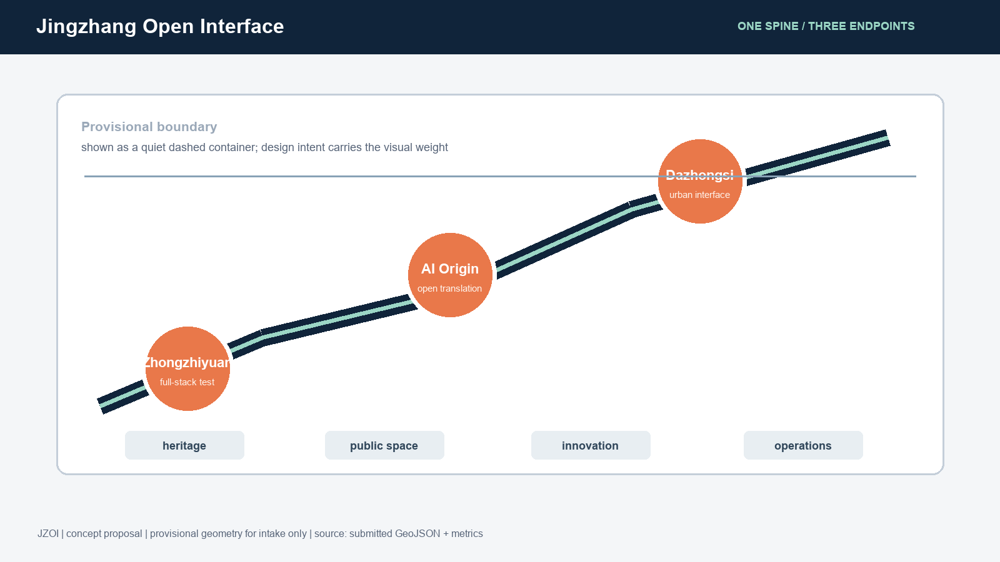
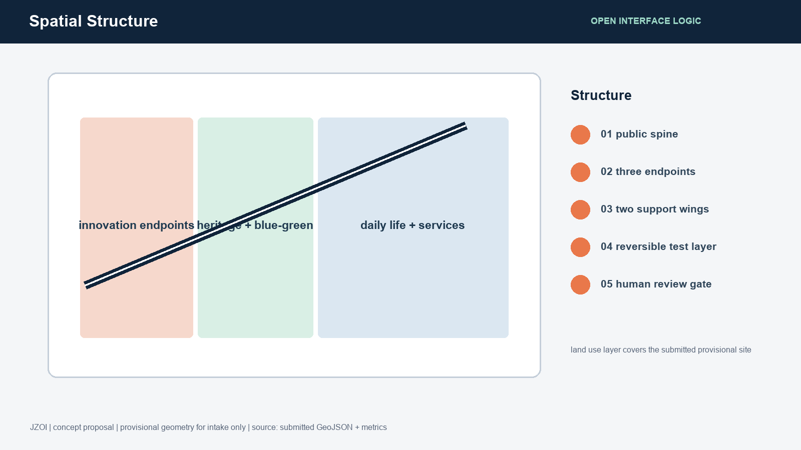
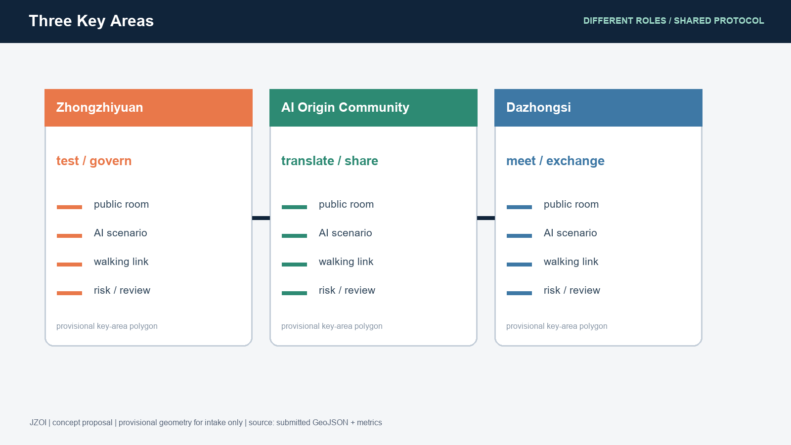
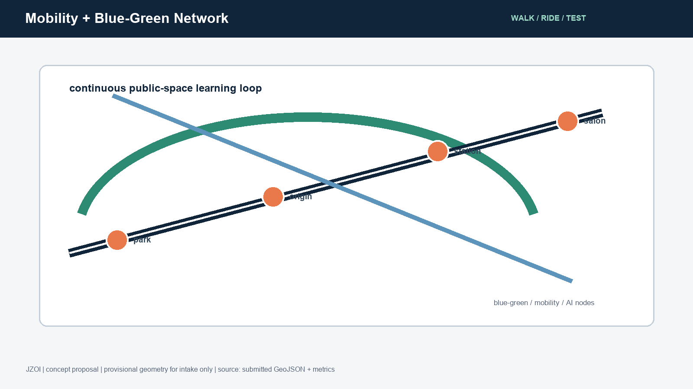
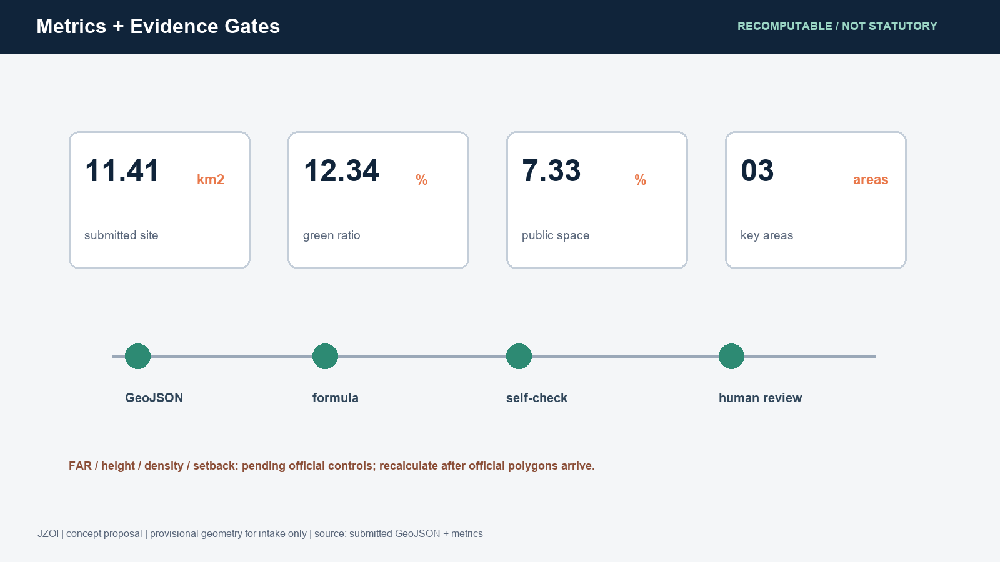

# Jingzhang Open Interface: A Verifiable AI Public Innovation Belt

> **Concept summary.** “Interface” is the design unit, rather than a single enclosed park. The Jingzhang heritage park is the public cultural spine; the three key areas are interoperable innovation endpoints; and the blue-green walking network is the low-barrier connection layer. Each AI scenario is first tested at small scale in a public, explainable and human-reviewable setting, then expanded, paused or retired according to evidence. All spatial moves are conceptual suggestions and reference schemes for professional teams to deepen; they do not replace statutory planning or approval.[source:AGENT-TASKBOOK]

**Brand direction.** Chinese name: 京张开放接口. English name: **JINGZHANG OPEN INTERFACE**, short form **JZOI**. The logo direction combines two unfinished parallel rails with an open bracket: continuity of the century-old railway, open-source collaboration, and reversibility. An original geometric wordmark and an accessible sans-serif system are recommended; no third-party trademarks, portraits, images or unlicensed fonts are used.

## Design Basis and Source List

The package follows the official announcement, the cleared agent taskbook, the public source registry and the local reference snapshots. The three-layer areas are published as provisional polygons because the precise official GIS/CAD boundary is not in the public package. This limitation affects boundary-based area claims and requires all design layers and metrics to be recalculated when an official file is released.[source:DATA-SRC-OFFICIAL-ANNOUNCEMENT-20260509] [source:DATA-SRC-PROVISIONAL-BOUNDARIES-20260605]

The package uses EPSG:4326 for GeoJSON exchange and EPSG:4548 for area calculation. The provisional boundary is an intake constraint only, not a redline, statutory control or precise scoring basis.[standard:PROJECT-OFFICIAL-ANNOUNCEMENT]

## Three-Level Scope Framework

The 43.6 km2 coordinated research area frames the regional innovation ecology. The 11.4 km2 overall design area frames urban renewal, mobility, municipal coordination and the heritage park. The 368.4 ha key detailed-design area contains Zhongzhiyuan, Beijing AI Origin Community and Dazhongsi. The three levels operate as strategy, spatial framework and testable local prototypes.[depth:three_level_scope_framework]

## Coordinated Research Area: Industry and Future City Research

JZOI translates the three positions, “centennial Jingzhang culture belt, urban AI life-experience belt, and AI integrated innovation belt,” into five functions: full-stack autonomous innovation, world-class ecosystem, AI-plus scenario empowerment, intelligent urban vitality, and global AI governance discourse. The three areas and two wings form a loop: Zhongzhiyuan tests full-stack systems and governance; AI Origin Community connects university research to open collaboration; Dazhongsi hosts urban-facing intelligent business; the Zhongguancun technology-service wing supplies global links; the Xiaoyuehe scenario wing supplies daily public tests.[source:DATA-SRC-AGENT-TASKBOOK-20260518]

Transferable references include Toronto Waterfront’s civic technology procurement, Barcelona’s data commons, Singapore’s living-lab model, Helsinki’s open urban data, Amsterdam’s responsible AI register, Seoul’s digital public services, and Montreal’s AI ecosystem governance. They are used as comparative methods, not as proof of local implementation.

## Overall Design Area: Urban Renewal and Regulatory-Plan-Level Urban Design

The spatial framework is **one public spine, three endpoints, two wings and a reversible test layer**. Land use, buildings, roads, green space, public space and phasing are separate machine-readable layers. FAR, height, density, setback, ownership, redlines, heritage controls and municipal capacity remain pending official confirmation, so the package records them as assumptions rather than invented controls.[standard:MOHURD-CONTROL-DETAILED-PLANNING] [depth:development_intensity_controls]

## Detailed Design of Key Areas

**Zhongzhiyuan AI Acceleration Area.** A garden-like full-stack test district: a river-facing public room, governance exhibition, shared evaluation rooms, and low-carbon computing interpretation. The spatial idea is a reference scheme only; river blue-line, flood, transport and ownership conditions require professional confirmation.[data:geometry/key_areas.geojson#PROV-KEY-001]

**Beijing AI Origin Community.** A near-campus translation district linking research, open-source release, talent services and daily life. The design prioritizes a walkable results-to-street interface, small public rooms and a clear human-review boundary for data and model demonstrations.[data:geometry/key_areas.geojson#PROV-KEY-002]

**Dazhongsi AI Industry Cluster.** An urban-facing business and culture endpoint around transit access, four-quadrant walking continuity, intelligent-device display, data-element literacy and international exchange. The proposal does not assume any building alteration or station engineering decision.[data:geometry/key_areas.geojson#PROV-KEY-003]

## AI Innovation Ecosystem, Personas, and AI+ Scenarios

Five user groups are served: open-source developers, early-stage teams, enterprise visitors, nearby residents, and university students. Ten scenario cards are included: open-source release hall; safety-governance sandbox; edge-compute station; AI walking navigator; Dazhongsi international salon; Qinghe low-carbon innovation corridor; near-campus translation street; data-element commons; AI daily-life service street; and global AI week route. The first three are industry testing and validation scenarios. Every card requires consent, data minimization, transparent explanation and human review; no personal trajectory, sensitive dataset or vendor lock-in is assumed.[depth:ai_plus_scenarios]

## Land Use, Building Scale, and Retain-Renovate-Demolish Strategy

The submitted land-use layer is a design partition covering the provisional site. Building footprints express design placeholders, not existing cadastral facts. Retain, renovate, demolish and new-build decisions are categories for later professional verification; no parcel-level conclusion is made. Unknown FAR and height values remain explicitly pending.[standard:MNR-LAND-USE-CLASSIFICATION-GUIDE] [metric:building_footprint_area_sqm]

## Transport, Rail, Municipal Infrastructure, and Public Services

The proposal prioritizes station-to-park walking, bicycle continuity, local micro-circulation, accessible crossings, non-motorized parking, public-service interfaces and distributed edge-compute prototypes. Road alignments, station works, underground works, utility capacity, fire access and energy loads require official data and engineering review.[depth:traffic_rail_slow_parking]

## Blue-Green Network, Public Space, and Urban Character

The heritage park, Qinghe and Xiaoyuehe are treated as a connected public-space learning system. Three conceptual pilgrimage nodes are proposed: the **Rail Memory Gate**, the **Open Model Commons**, and the **Proof Garden**. They combine historical interpretation, contribution credit and public evaluation without turning heritage into a theme park. Signage distinguishes historical evidence, live prototypes and provisional design ideas.[standard:MOHURD-URBAN-DESIGN-MEASURES] [depth:blue_green_public_space]

## Renewal Projects, Implementation Policy, and Phasing

Six reference projects are listed in the geometry and phasing layers: heritage-park walking-gap repair; Zhongzhiyuan river interface; Origin Community translation street; Dazhongsi station walking interface; public AI service and edge-compute node; and global AI week route. Phase 1 is evidence and small reversible pilots; Phase 2 is coordinated public-space and service upgrades; Phase 3 is an official-data recalibrated framework. None is a confirmed government program, funding promise or construction schedule.[depth:phasing_implementation]

Long-term operation uses an annual cycle: an AI heritage month, quarterly scenario open days, a developer maintenance cohort, an evidence review board, and a public decommissioning register. International communication should publish methods, limitations and reproducible artifacts, not claim selection or implementation.

## Metrics, Area Recalculation, and Compliance Matrix

The package records a provisional site area of 11,412,825.386 sqm, green ratio 0.123423, public-space ratio 0.073281, building footprint 310,807.184 sqm and three key areas. These are machine-recomputed from submitted geometry; the boundary-derived figures must be recalculated after official polygons arrive.[metric:site_area_sqm] [metric:green_ratio] [metric:public_space_ratio]

The compliance matrix covers announcement tasks 1.3, 1.4 and 1.5 plus agent.1-agent.6. The standard matrix addresses the mandatory local references, while the depth matrix connects narrative, geometry, metrics, drawings and checks.[depth:metrics_recalculation]

## Risk, Copyright, and Compliance

All source material is public or cleared for repository use. No private maps, personal data, third-party imagery, remote tiles, external scripts or unlicensed marks are used. Provisional polygons must not be read as official boundaries. AI-generated text and diagrams are disclosed as agent work and require human and professional review before any planning or implementation use. See `report/copyright_statement.md`.[depth:risk_missing_data]

## References

- Official project announcement and local reference snapshot.
- Cleared agent open-call taskbook.
- MOHURD Urban Design Management Measures.
- MOHURD Detailed Planning Approval Measures.
- MNR Land-Use Classification Guide.
- Repository provisional boundary record and Issue #846 boundary discussion.
