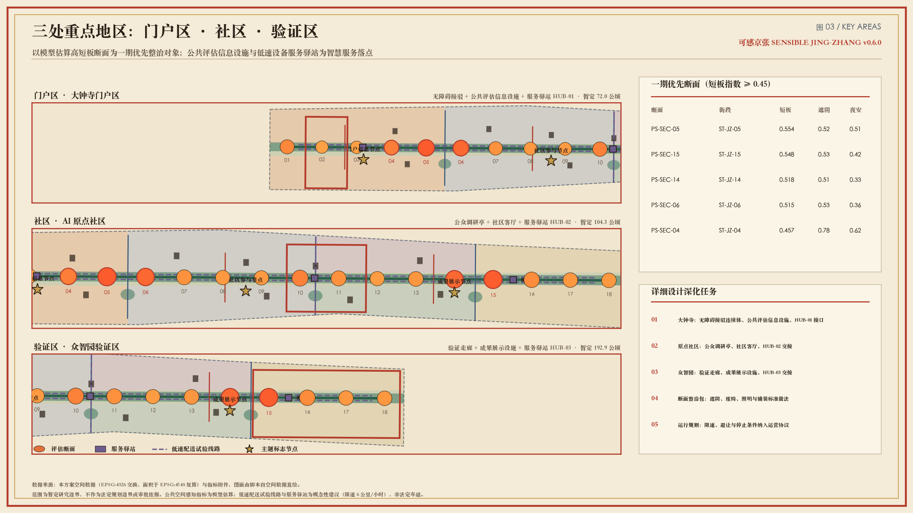
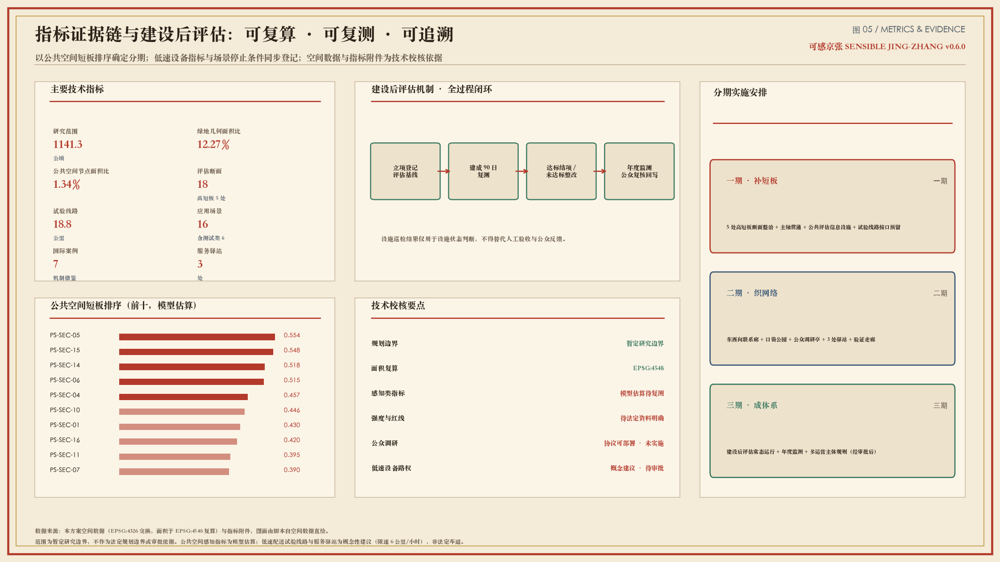

# 可感京张 · 感知基线带规划｜第二次测量

> **一带正式名**：可感京张 / Sensible Jing-Zhang  
> **副标题**：第二次测量 / The Second Survey（Survey＝勘测 ∩ 感知调研）  
> **结构口号**：一脊 · 三区 · 十八断面 · 机器人友好慢行层  
> **叙事引子（非证据）**：《复测记》第一幕「醒来」——一百年前，詹天佑测量我；今天，我测量走在我身上的你们。以下各章以《复测记》分幕冷开场，均为叙事装置，不作空间证据。[assumption:A-DRAMA-001]

本方案是一份**规划说明书体例**的 formal 包：空间上把京张铁路遗址公园绿脊写成感知主脊；机制上用感知短板指数、感知合约与 SP-Survey 把“哪里该先改”变成可复算、可问人、可追责的优先序；基础设施上把机器人低速共享通道与驿站写成与步行、骑行分层共存的智慧城市底盘。理论层转译 Lynch 心智地图、Gehl 公共生活、Jacobs 街道眼、Whyte 小广场、PPS 场所营造、空间句法、15 分钟城市、Complete Streets/NACTO 与 CPTED 等城市设计/城市科学框架，一律作为**方法背景**，不作海淀法定依据或本地已测分数。[source:OFFICIAL-ANNOUNCEMENT] [source:AGENT-TASKBOOK] [assumption:A-BOUNDARY-001] [assumption:A-THEORY-001]

## 设计依据与资料清单

> **《复测记》·第二幕「第一根轨」（非证据）**：他们曾把尺子放在我身上画第一根轨；今天尺子换成资料清单——公告、任务书、边界与方法，先量清楚再开口。[assumption:A-DRAMA-001]

### 模块说明：依据分层与证据纪律

本模块回答“凭什么这样写”。资料分五层，不可混用：

1. **主控层**：官方资格预审公告与面向智能体任务书，决定三层范围、三区任务与 agent.1–6。[source:OFFICIAL-ANNOUNCEMENT] [source:AGENT-TASKBOOK] [source:SITE-PACKAGE]
2. **工作面层**：`brief/site-package/`、`data/source_registry.json`、`data/processed/agent_fact_pack.md`，供机器可读导航，不新增权威事实。[source:SOURCE-REGISTRY] [source:PROCESSED-FACT-PACK]
3. **边界层**：总体设计范围采用 provisional 边界，面积复算为 [metric:site_area_sqm]（EPSG:4548），不得冒充 official redline。[source:BOUNDARY-SOURCE] [source:KEY-AREA-SOURCE] [data:geometry/site_boundary.geojson#SITE-001] [data:geometry/constraints.geojson#CON-PROV] [depth:existing_conditions_diagnosis] [assumption:A-BOUNDARY-001] [assumption:A-CONTROLS-001]
4. **方法与理论层（不作法定依据）**：热舒适与可视感知 [source:VATA-PAPER] [source:CITY-LANDSCAPE-INSIGHT]；人在环路 [source:SP-SURVEY-PAPER] [source:SP-SURVEY-PLATFORM] [source:SP-SURVEY-PROTOCOL]；城市设计/城市科学理论见下文与文末附录。[assumption:A-THEORY-001]
5. **表达层**：效果图与海报为自制概念素材 [source:AWAKENING-POSTER] [source:RENDERS-SUITE]，仅作设计沟通，非实景。[assumption:A-RENDER-001]

标准响应：[standard:PROJECT-OFFICIAL-ANNOUNCEMENT] [standard:PROJECT-AGENT-OPEN-CALL-TASKBOOK] [standard:MOHURD-URBAN-DESIGN-MEASURES] [standard:MOHURD-CONTROL-DETAILED-PLANNING] [standard:MNR-LAND-USE-CLASSIFICATION-GUIDE] [standard:MOHURD-ARCH-DESIGN-DEPTH-2016]

### 理论依据：为何用“感知—复测”而不是“展示带”

- **可意向性（imageability）**：Lynch 提出路径、边界、区域、节点、地标五要素组织城市心智地图；本方案把京张绿脊写成主路径（path），三重点区写成节点（node），朝圣地标与基线碑写成地标（landmark），避免只有功能分区没有可读意象。[source:THEORY-LYNCH-IMAGE]
- **人尺度与步行速度感知**：Gehl 强调城市应按步行速度与五感设计，追求 lively / safe / sustainable / healthy；本方案以遮阴、驻留、夜安等人尺度指标替代巨型屏幕叙事。[source:THEORY-GEHL-CITIES-PEOPLE] [source:THEORY-GEHL-PLDP]
- **场所而非布景**：PPS 四要素（可达连接、用途活动、舒适形象、社交性）要求公共空间可审计；Whyte 指出座椅、日照、边界效应决定小广场成败——对应本包的断面整治包与基线碑公开界面。[source:THEORY-PPS-PLACE] [source:THEORY-WHYTE-SOCIAL-LIFE]
- **街道眼与多样性**：Jacobs 的“街道眼”、混合功能与短街区提醒：安全与活力来自真实使用，而非封闭园区；机器人层不得挤走行人停留。[source:THEORY-JACOBS-DEATH-LIFE]

## 三层范围工作框架

> **《复测记》·第三幕「坡度」（非证据）**：战略层、总体层、重点区层像三级坡度——坡太陡人上不去，坡太缓又到不了下一站。三层是证据链，不是三张无关地图。[assumption:A-DRAMA-001]

### 模块说明：嵌套尺度如何形成证据链

三层不是三张无关地图，而是从战略到街角的证据链。[depth:three_level_scope_framework] 嵌套逻辑对应城市规划常用的“战略—结构—节点”尺度：上层提出问题与制度，中层给出可步行的空间骨架，下层给出可实施的第一刀。任何上层口号若不能在下层找到断面 ID、场景卡与停止条件，即判定为空洞。

**约 43.6 平方公里统筹研究层**回答“为什么是海淀、为什么是这里”：把高校、科研平台、企业、社区与公共空间组织为可感知的创新生活带；输出七个全球案例转译、感知合约制度与机器人友好街道标准，不生成伪精确地块结论。[metric:ecosystem_case_count]、[metric:phasing_stage_count]

**约 11.4 平方公里总体设计层**回答“城市如何承载”：以感知主脊串联大钟寺、原点社区、众智园；布置十八处感知断面、机器人低速共享通道与三级慢行—蓝绿体系。暂定 polygon 复算面积见 [metric:site_area_sqm]，仅用于图层与指标一致性检验。[metric:park_spine_length_m] [metric:perception_section_count] [metric:robot_corridor_length_m]

**三处重点区域层**回答“第一步在哪里发生”：大钟寺做门户接驳与感知基线碑，原点社区做人在环路调研与青年第三空间，众智园做测试走廊与机器人驿站。重点区数量见 [metric:key_area_count]；几何不替代公告面积。[data:geometry/key_areas.geojson#KEY-001] [assumption:A-KEYAREA-001]

### 理论依据：15 分钟城市的使用与批判

统筹层借用 Moreno 等提出的 15 分钟城市六项日常功能（居住、工作、供给、照护、学习、娱乐）作为**服务域检查清单**，检验主脊两侧是否只剩“通勤穿越”而缺少可停留公共服务；同时采纳批判研究的警告——设施点位供给不等于实际可达与公平，禁止把“15 分钟”写成已达成覆盖率。[source:THEORY-15MIN-CITY] [source:THEORY-15MIN-CRITIQUE] [assumption:A-THEORY-001]

## 统筹研究范围产业与未来城市研究

> **《复测记》·第四幕「隧道记忆」（非证据）**：隧道里曾只有蒸汽与黑暗；今天记忆要写成可复测的舒适、夜安与可停止的公共智能。[assumption:A-DRAMA-001]

### 模块说明：产业带如何写成公共基础设施

本模块回答“创新带的公共价值是什么”。可感京张不是又一条“科技展示带”，而是一条**可步行、可复测、可让机器人低速共存**的公共基础设施。产业叙事必须落到：谁能舒服地走到、谁能被安全地接驳、谁的贡献可被公开审计。

### 核心理念：把遗产主脊写成“感知基线 + Physical AI 公共层”

1. **感知基线**：每 300–500 米设断面，用遮阴、绿视、驻留、夜安合成短板指数，驱动更新优先序。指标口径对齐 Gehl PLDP 对驻留与活动多样性的观测精神，并结合街景热舒适方法，但本地数值仍为模型估计。[metric:mean_perception_shortfall] [source:THEORY-GEHL-PLDP] [source:VATA-PAPER] [assumption:A-PERCEPTION-MODEL-001]
2. **感知合约**：立项登记基线 → 建成 90 日复测 → 达标结项/未达标整改 → 年度普查回写；把“设计承诺”写成可追责的公共合同。[assumption:A-SURVEY-PROTOCOL-001]
3. **Physical AI 层**：机器人低速共享通道（≤6 km/h）、三处驿站、巡检复测与数字孪生断面档案，与步行优先权绑定，而非替代行人。[metric:robot_hub_count] [assumption:A-ROBOT-001] [assumption:A-PRIVACY-001]

### 理论依据：街道眼、绿道与可停止的智慧城市

Jacobs 的街道眼要求界面活跃与自然监视；线性公园/绿道传统（本包以全球案例转译）要求连续慢行与多功能蓝绿；Quayside 教训要求数据治理先于技术承诺。三者共同约束：创新带首先是公共生活带，其次才是测试床。[source:THEORY-JACOBS-DEATH-LIFE] [source:CASE-QUAYSIDE-LESSON] [assumption:A-THEORY-001]

### 七个全球案例：不复制建筑，转译机制

- **Singapore / Punggol Digital District · Physical AI testbed**：多运营商机器人在混合公共区试验，并以 Active Mobility 豁免框架约束速度与安全；海淀转译为“概念低速共享层 + 驿站 + 停止条件”，不宣称已获豁免。[source:CASE-SG-PDD] [source:CASE-SG-IMDA]
- **Singapore / URA 末端配送与路径宽度讨论**：强调坡度、路径宽度与取送点；海淀转译为 R07 标准断面与 PERCEPKIT 无障碍组件，不作工程定线。[source:CASE-SG-URA]
- **Barcelona Superblock**：以步行优先、绿色街道与健康指标重配街道断面；海淀转译为“感知短板断面优先整治包”，而非照搬网格尺度。[source:CASE-BCN-SUPERBLOCK]
- **Toronto / Meadoway 线性公园可视化**：用鸟瞰+人视效果图工具包做公众沟通；海淀转译为 `assets/renders/` 九张概念效果图，明确非实景。[source:CASE-MEADOWAY]
- **St. Louis / Chouteau Greenway**：遗产铁路与创新节点编织；海淀转译为“一脊三区”与朝圣地标，不复制投资规模。[source:CASE-CHOUTEAU]
- **Helsinki Testbed / Mobility Lab**：真实城市环境试验与数字孪生，并强调试验≠采购承诺；海淀转译为众智园测试走廊与“失败可回滚”。[source:CASE-HEL-TESTBED]
- **Toronto Quayside 教训（负面参照）**：先定数据与 IP 框架、避免技术决定论；海淀据此把隐私、人工复核与退出条款写入全部场景卡。[source:CASE-QUAYSIDE-LESSON]

共同启示：**强感知证据 + 中立公共层 + 真实用户 + 可停止的机器人试验**，比巨型屏幕或机器人雕塑更接近“政客与设计师都看得懂”的智慧城市。案例数量 [metric:ecosystem_case_count]。

### 三大定位与五大功能响应

**三大定位**：百年京张文化带（Rail→Perception→Commons）；都市 AI 生活体验带（舒适导航、夜安、文化十二幕）；AI 融合创新带（测试走廊、驿站、感知合约）。**五大功能**：众智园承担可信测试与机器人交接；原点社区组织青年创新与 SP 调研；大钟寺连接门户业态与基线碑；沿线十八断面形成 AI+ 场景赋能；公开看板与年度普查争取可审计的治理话语权。[source:AGENT-TASKBOOK]

定位—功能映射必须可检查：每个定位至少对应一类断面族、一处重点区动作、一张场景卡与一项年度运营产品，防止口号悬浮。

## 总体设计范围城市更新与控规深度城市设计

> **《复测记》·第五幕「站与城」（非证据）**：站不是终点，城才是。一脊三区十八断面，把“下车”写成“进入可感的公共层”。[assumption:A-DRAMA-001]

### 模块说明：总体结构如何组织城市更新

总体结构为 **一脊 · 三区 · 十八断面 · 机器人友好慢行层**。[depth:overall_spatial_structure] 感知主脊示意长度 [metric:park_spine_length_m]，见 [data:geometry/roads.geojson#RD-SPINE]。本模块完成三件事：（1）把遗产绿脊写成连续公共层；（2）用断面族把更新优先序从“平均主义”改为“短板驱动”；（3）用线—面—点三级语法约束展示与家具，防止满街屏幕。

### 理论依据：Lynch 五要素 + Gehl 驻留活动

Lynch 五要素在本包的空间翻译：主脊=路径；公园/界面割裂=边界；三重点区=区域；接驳核与广场=节点；基线碑/朝圣地标=地标。[source:THEORY-LYNCH-IMAGE] Gehl 区分必要活动、可选活动与社会活动——高短板断面往往卡在“可选活动消失”（不愿停留），故一期优先补遮阴与座椅，而不是先做形象工程。[source:THEORY-GEHL-CITIES-PEOPLE] [source:THEORY-GEHL-PLDP]

### 十八断面不是等距装饰，是六类断面族

| 断面族 | 代表断面 | 主导问题 | 一期动作 | 机器人层关系 |
| --- | --- | --- | --- | --- |
| A 门户接驳 | PS-SEC-01–03 | 站城转换、遮阴连续 | 接驳无障碍连续体 | 驿站 HUB-01 交接 |
| B 高短板暴晒 | PS-SEC-04–06 | 短板≥0.45、遮阴不足 | 遮阴/座椅/铺装整治包 | 通道避让驻留区 |
| C 校园门廊 | PS-SEC-07–09 | 校城接口、高峰人流 | 错峰驻留与导视 | 配送限时段 |
| D 原点客厅 | PS-SEC-10–12 | 青年第三空间、调研 | SP 调研亭、公众感知站 | 驿站 HUB-02 |
| E 暗展跨越 | PS-SEC-13–15 | 夜安偏低、界面封闭 | 照明与界面微改 | 巡检复测优先 |
| F 上行测试 | PS-SEC-16–18 | 研发界面、测试观看 | 测试走廊与荣誉墙 | 驿站 HUB-03 |

高短板断面数量 [metric:high_shortfall_section_count]，平均短板 [metric:mean_perception_shortfall]。短板指数为模型估计，待 SP-Survey/现场复测。[assumption:A-PERCEPTION-MODEL-001] [data:geometry/public_space.geojson#PS-SEC-05] 断面间距 300–500 米对应步行体验采样尺度：过稀则漏掉局部暴晒/暗点，过密则治理成本不可持续。

### 公共展示与感知的三级语法

**线**：主脊连续展示/感知界面；**面**：三处朝圣地标广场与重点区客厅；**点**：感知基线碑、SP 调研亭、开发者荣誉墙、机器人驿站。展示优先使用遗产尺度（站台边缘、轨枕模数），禁止满街屏幕与拟物机器人雕塑。[assumption:A-BRAND-001] 这与 PPS“用途与活动优先于装置物”一致：家具服务停留，而非反向占用公共性。[source:THEORY-PPS-PLACE]

## 重点区域详细设计

> **《复测记》·第六幕「五道口洪流」（非证据）**：人流涌来时，我第一次听见“不愿停留”的声音。三处重点区是三个不同的门：接驳、回声、测试。[assumption:A-DRAMA-001]

### 模块说明：三门机制与详细设计任务

三处重点区是感知合约与 Physical AI 的三个不同门。[depth:three_key_area_detailed_design] 详细设计不是三套外观，而是三套可运营机制：门户接驳、社区复测、园区验证。每处均给出空间锚点、理论转译、一期动作、机器人关系与停止条件入口。

### 理论依据：Whyte 广场 + Oldenburg 第三空间 + TOD 式门户

Whyte 强调可坐、可晒可荫、可观察他人（triangulation）；Oldenburg 的第三空间解释青年为何需要家与实验室之外的非正式聚集；门户区则要求站城连续与首层界面可读。三套理论分别对应大钟寺、原点、众智园的主导问题，而不是互相复制。[source:THEORY-WHYTE-SOCIAL-LIFE] [source:THEORY-OLDENBURG-THIRDPLACE] [source:THEORY-LYNCH-IMAGE]

### 城门点 · 大钟寺（智能原生门户）

**空间任务**：以接驳核组织无障碍连续体与首层连续遮阴界面；设感知基线碑作为合约公开界面；布置机器人驿站 HUB-01 服务末端交接，不进入人流核心候车区。[data:geometry/key_areas.geojson#KEY-003] [data:geometry/public_space.geojson#PS-ROBOT-HUB-01]

**详细设计要点**：
1. 出站后 150–300 米内完成“找方向—找荫—找坐—找信息”四步，对应 Whyte 小广场要素。
2. 基线碑公开短板指数与复测状态，禁止广告化屏幕墙。
3. HUB-01 只做交接与充换电，峰值人流时限入；与 SC08/SC10 场景卡联动。

### 原点 · AI 原点社区（近校青年创新街区）

**空间任务**：以 SP 调研亭与公众感知站把居民、青年研究者纳入人在环路；配套第三空间与服务前台；驿站 HUB-02 服务校园—社区配送，高峰时段限速限流。[data:geometry/key_areas.geojson#KEY-002] [assumption:A-SURVEY-PROTOCOL-001]

**详细设计要点**：
1. 第三空间（咖啡馆/共享工作角/社区客厅）与调研亭并置，使“被调研”成为日常停留的一部分，而非临时路障。[source:THEORY-OLDENBURG-THIRDPLACE]
2. 知情同意、可撤回、禁生物特征写入 SC04；协议未部署不得宣称样本。
3. 校园门廊族断面（C/D）承接高峰洪流，设置错峰驻留带。

### 上行点 · 众智园（验证前台）

**空间任务**：以测试走廊承载低速物流、导览与巡检复测；开发者荣誉墙记录可复现贡献；驿站 HUB-03 作为测试交接与充换电节点。未达安全阈值不得进入城市试点。[data:geometry/key_areas.geojson#KEY-001] [assumption:A-ROBOT-001] [assumption:A-AI-SAFETY-001]

**详细设计要点**：
1. 测试观看区与步行通道分层，避免“看热闹”挤占通行。
2. 荣誉墙只记录可复现贡献与失败复盘，拒绝流量榜。
3. 与 Helsinki testbed 原则一致：试验≠采购承诺，失败可回滚。[source:CASE-HEL-TESTBED]

## AI 创新生态、人才画像与 AI+ 场景

> **《复测记》·第七幕「暴晒的等待」（非证据）**：场景卡不是炫技清单。每一张都要回答：谁负责、在哪里、用什么数据、谁复核、怎样停止——尤其当烈日把短板晒出来的那五分钟。[assumption:A-DRAMA-001]

### 模块说明：从人到场景到文化运营的完整链条

本模块把 AI+ 从“能力清单”改写成“可治理的公共服务包”。顺序固定：先有人（画像）→ 再有场景卡（治理条款）→ 再有十二幕与微短剧（文化/传播接口）。任何缺少停止条件的场景不得进入试点推荐。

### 理论依据：公共生活观测 + 隐私先置

Gehl PLDP 提供“数人、数停留、数活动类型”的观测伦理：先理解公共生活，再谈算法增强。[source:THEORY-GEHL-PLDP] Quayside 教训与本包隐私假设要求：聚合优先、禁人脸库、禁行踪追踪、人工复核不可缺席。[source:CASE-QUAYSIDE-LESSON] [assumption:A-PRIVACY-001]

### 六类人，一条线上的六种一天

青年研究员、创业运营者、社区居民、骑手/配送员、文旅访客、行动不便使用者。[metric:persona_count]  
对每类人至少回答四个问题：一天中何时接触主脊、最怕什么短板、需要哪张场景卡、遇到冲突时谁复核。机器人场景必须同时回答：谁负责、在哪里、用什么数据、谁复核、怎样停止。

### 十六张场景卡（含治理与停止条件）

既有服务/文化/治理场景保留并补齐条款；新增 Physical AI 与智慧城市卡：

| ID | 场景 | 首要空间 | 拟议主体 | 数据边界 | 停止条件 |
| --- | --- | --- | --- | --- | --- |
| SC01 | 热舒适导航 | 主脊+口袋公园 | 公园/运营方 | 聚合环境数据，无个人轨迹 | 误导高温风险或投诉越线 |
| SC02 | 感知无障碍路径 | 接驳廊 | 交通/无障碍组织 | 现场审计为主 | 重识别风险 |
| SC03 | 夜间可感安全线路 | 低夜安断面 | 公园运营 | 匿名声级/照明，不摄像执法 | 误报或扰民照明 |
| SC04 | SP 调研亭 | 原点社区 | 高校+社区 | 知情同意，可撤回 | 协议未部署即不得宣称样本 |
| SC05 | 舒适感知测试场 | 众智园走廊 | 众智园运营 | 合成/授权数据 | 安全阈值未达 |
| SC06 | AI 文化导览十二幕 | 十二幕站点 | 文化运营 | 授权解说，无行踪追踪 | 文保前置未满足 |
| SC07 | 微短剧共创拍摄开放 | 指定广场 | 文旅运营 | 许可拍摄，禁人脸库 | 公共性被挤占 |
| SC08 | 企业服务问询前台 | 大钟寺界面 | 产业运营 | 企业自愿 | 强制画像 |
| SC09 | 机器人低速配送试点 | RD-ROBOT 通道 | 物流+园区 | 无行人识别训练外传 | 碰撞/越速/投诉即停 |
| SC10 | 感知合约公开看板 | 基线碑 | 独立评估组 | 公开指标，无个人 | 数据不可复核则停排名 |
| SC11 | 青年第三空间匹配 | 社区节点 | 社区运营 | 自愿兴趣标签 | 骚扰申诉越线 |
| SC12 | 健康活动风险提示 | 公园段 | 卫生/公园 | 气象聚合 | 医疗建议越权 |
| SC13 | 自主清扫与维护机器人 | 主脊非高峰 | 环卫运营 | 只作业区域，不巡人脸 | 扰民噪声或冲突 |
| SC14 | 设施巡检复测（人测+机测） | 十八断面 | 运维+评估 | 设施状态+环境指数 | 机测替代人工决策 |
| SC15 | 数字孪生断面档案 | 全线 | 数据治理组 | 聚合层孪生，禁个体轨迹 | Quayside 式数据失控风险 |
| SC16 | 匿名环境传感袖套 | PERCEPKIT 支座 | 经批准机构 | 温湿光照声，到期删除 | 未批准传感立即拆除 |

场景总数 [metric:scenario_card_count]，其中测试验证类 [metric:test_validation_scenario_count]。[assumption:A-PRIVACY-001] [assumption:A-AI-SAFETY-001]

### 京张十二幕（完整幕表）

概念脚本大纲，供文旅与专业团队深化；**非已批准演出**，不作空间证据。[assumption:A-DRAMA-001] 幕点与感知断面/重点区/驿站锚点对应，并联动场景卡 SC06/SC07。文化叙事采用 Lynch 地标串联 + 线性公园体验节奏：观众沿 path 移动，在 node 停留，在 landmark 完成记忆锚点。[source:THEORY-LYNCH-IMAGE]

| 幕 | 幕名 | 梗概 | 空间锚点 | 联动场景卡 |
| --- | --- | --- | --- | --- |
| 1 | 醒来 | 铁路以第一人称睁开感知：听见脚步行进的节奏 | RD-SPINE 感知主脊全线 | SC06 |
| 2 | 第一根轨 | 轨枕模数成为公共家具与铺装母题，而非仿古布景 | GS-SPINE / LU-SPINE | SC06 |
| 3 | 坡度 | 量轮椅、婴儿车与低速机器人能否同坡通行 | PS-SEC-07–09 校园门廊族 | SC02 / SC09 |
| 4 | 隧道记忆 | 暗段照明与界面写入夜安档案 | PS-SEC-13–15 暗展跨越族 | SC03 / SC14 |
| 5 | 站与城 | 接驳连续体把「下车」写成「进入城市」 | KEY-003 / PS-SEC-01–03 | SC08 |
| 6 | 五道口洪流 | 高峰人流被拆成可停留的涟漪 | 近校界面 / PS-SEC-07–09 | SC11 / SC01 |
| 7 | 暴晒的等待 | 短板最高的五分钟：更新优先序从这里起算 | PS-SEC-04–06 高短板族 | SC01 |
| 8 | 夜间的犹豫 | 夜安=照明+界面+可呼叫停靠点 | 低夜安断面 | SC03 |
| 9 | 原点回声 | 「被测量」变成「共同复测」 | KEY-002 / PS-SEC-10–12 | SC04 |
| 10 | 众智园测试 | 低速机器人可停止、可复盘、不替代行人 | KEY-001 / PS-SEC-16–18 | SC05 / SC09 |
| 11 | 大钟寺门户 | 基线碑与驿站把到访写成可审计的第一次接触 | KEY-003 / HUB-01 | SC08 / SC10 |
| 12 | 把测量权交还给人 | 终幕反转：测量权移交市民与年度普查 | 基线碑 + SP-Survey 回写 | SC04 / SC07 / SC10 |

完整机器可读幕表见 `visual/assets/twelve-acts.json`。分镜长卷与终幕效果图见 `assets/renders/r08-twelve-acts-storyboard.jpg`、`assets/renders/r09-act12-finale.jpg`。[source:RENDERS-SUITE]

### 微短剧共创机制（运营接口，非证据）

与场景卡 SC06（AI 文化导览十二幕）、SC07（微短剧共创拍摄开放）打通，作为 agent.6 年度运营产品之一。[assumption:A-DRAMA-001] [assumption:A-PRIVACY-001]

1. **选景清单**：十二幕锚点即许可拍摄候选点；优先广场/断面驻留区与朝圣地标，禁止占用轮椅通道、机器人限速冲突区与未获文保前置的界面。
2. **授权与禁则**：需场地许可与肖像授权；**禁人脸库、禁行踪追踪、禁未脱敏街景训练外传**；历史叙事由顾问复核，不虚构詹天佑对白。
3. **AI 共创流程**：清权素材或自制概念图 → AI 辅助剪辑/配音（可选）→ 人工审核（公共性/隐私/史实）→ 开源展廊收录；公共性被挤占或投诉越线即停止（SC07 停止条件）。
4. **与感知合约衔接**：优秀作品可标注对应断面 ID，但不得把播放量写成建成品质证据；年度「可感京张周」可设共创单元，其余时间靠授权窗口滚动。

## 机器人与智慧城市基础设施（系统层）

> **《复测记》·第八幕「夜间的犹豫」（非证据）**：低速机器人可以同行，但不得抢走夜路的安全感。优先序写死：人 → 自行车 → 机器人 → 必要机动车。[assumption:A-DRAMA-001]

### 模块说明：Physical AI 如何进入街道而不夺权

本模块把机器人写成**可分层的街道分配问题**，而不是科技装置展览。所有通道与驿站均为概念设计层，待交通、消防、权属与运营商审批。[assumption:A-ROBOT-001]

### 理论依据：Complete Streets / NACTO + CPTED

Complete Streets 与 NACTO 街道设计指南要求断面为多模式重新分配空间；本包据此写出明确优先序，并把机器人放在自行车之后、机动车之前的低速共享层。[source:THEORY-COMPLETE-STREETS] [source:THEORY-NACTO-STREETS] CPTED（自然监视、领域感、出入控制、维护）约束夜安设计：照明与界面微改优先，拒绝以摄像头执法替代环境设计。[source:THEORY-CPTED]

### 低速共享通道与驿站

- 机器人低速共享通道总长 [metric:robot_corridor_length_m]，道路类复用 `local_access`/`branch`，自定义 `facility_role=robot_low_speed_shared_corridor`，概念限速 ≤6 km/h。[data:geometry/roads.geojson#RD-ROBOT-1] [assumption:A-ROBOT-001]
- 三处驿站面积合计 [metric:robot_hub_area_sqm]，`space_kind=robot_service_hub`，服务充换电与交接，不作商业占地。[data:geometry/public_space.geojson#PS-ROBOT-HUB-01] 驿站数量 [metric:robot_hub_count]。
- **街道优先序**：步行与无障碍 → 自行车 → 机器人低速共享 → 必要机动车。机器人不得占用轮椅通道与断面驻留区。
- **运行规则（概念）**：高峰人流时段限行；碰撞/越速/投诉即停（SC09）；机测不得替代人工决策（SC14）。

### PERCEPKIT 感知家具组件库

K01 遮阴环 Shade Loop；K02 伴坐轨枕座 Rail Bench；K03 感知基线碑 Commit Stele；K04 SP 调研亭 Survey Booth；K05 无障碍交接坞 Accessible Dock；K06 机器人驿站框架 Robot Hub Frame；K07 匿名传感袖套 Sensor Sleeve（可拆）；K08 夜间安全灯带 Quiet Light。全部可替换、可撤场；未获消防/文保/无障碍确认不得固定安装。[assumption:A-ACCESS-001]  
组件逻辑对应 Whyte/Gehl：先解决坐、荫、看见与被看见，再谈传感；K07 必须可拆且到期删除数据（SC16）。[source:THEORY-WHYTE-SOCIAL-LIFE] [source:THEORY-GEHL-CITIES-PEOPLE]

## 用地、建筑规模与拆改留方案

> **《复测记》·第九幕「原点回声」（非证据）**：拆改留之前先听回声——权属、碳、消防、首层公共性。强度只给方法包络，不预锁数值。[assumption:A-DRAMA-001]

### 模块说明：在资料缺口下如何诚实做控规深度城市设计

概念用地 [data:geometry/land_use.geojson#LU-SPINE] 完整覆盖暂定边界，单元数 [metric:land_use_parcel_count]。[depth:land_use_layout] [standard:MNR-LAND-USE-CLASSIFICATION-GUIDE] 建筑图层 [data:geometry/buildings.geojson#BLD-001] 仅为界面原型，基底 [metric:building_footprint_area_sqm]；容积率、高度、密度保持 unknown。[depth:development_intensity_controls] [assumption:A-INTENSITY-001]

拆改留采用“先读懂再决定”：历史文化、结构消防、碳、租户、首层公共性、功能适配、权属、实施扰动八项评分；原型 `renewal_action` 不是对现实建筑的审定。[depth:retain_renovate_demolish] [depth:height_massing_character]

### 理论依据：渐进都市主义与首层公共性

Jacobs 反对一次性大拆大建对多样性的破坏；本包用三档强度情景包络做压力测试，而不是预锁单一容积率。首层公共性权重大于形象高度——对应 Gehl“底层界面决定城市生活”。[source:THEORY-JACOBS-DEATH-LIFE] [source:THEORY-GEHL-CITIES-PEOPLE] [assumption:A-THEORY-001]

### 强度情景包络（只给方法，不给数值）

- **S1 低扰动**：轻改+运营为主，检验“不新增开发量能否支撑感知合约与驿站运营”。
- **S2 织补**：权属清晰地块中等织补，检验“青年居住+孵化+公共界面”三类需求。
- **S3 雄心**：轨道接口周边较高强度，检验是否牺牲展示层公共性与遗产尺度。  
三档均待官方控规到位后重算九图层，不得预锁一档。[assumption:A-INTENSITY-001]

## 交通、轨道、市政与公共服务设施

> **《复测记》·第十幕「众智园测试」（非证据）**：没有官方红线就不画跨线桥；测试走廊可以先跑，市政机房不能先盖。[assumption:A-DRAMA-001]

### 模块说明：慢行优先的交通与“缺资料诚实声明”

慢行网络由感知主脊、东西缝合廊、轨道接驳与机器人低速共享层组成。[depth:traffic_rail_slow_parking] 路网密度 [metric:road_network_density_km_per_sqkm]。没有官方红线与站口资料时，不画跨线桥、不算站点覆盖。[assumption:A-TRANSIT-001]

市政与能源资料缺失，算力、充电与地下空间只做专项可行性，不先建机房。[depth:municipal_new_infrastructure] [assumption:A-MUNICIPAL-001]

### 理论依据：空间句法筛查 + Walk Score 方法警示 + Complete Streets

空间句法的整合度/选择度可作为断点与缝合廊的**方法学初筛**，本包给出候选廊道几何，但不宣称已完成句法计算或本地整合度排名。[source:THEORY-SPACE-SYNTAX] Walk Score 类方法证明“到设施的步行可达”可被量化，但本包禁止直接套用商业评分冒充海淀实测。[source:THEORY-WALKSCORE] Complete Streets/NACTO 指导断面分配与行人优先。[source:THEORY-COMPLETE-STREETS] [source:THEORY-NACTO-STREETS]

公共服务思考借用 15 分钟城市六功能清单做缺口识别，同时用批判文献避免“画个圈就算覆盖”。[source:THEORY-15MIN-CITY] [source:THEORY-15MIN-CRITIQUE]

## 蓝绿空间、公共空间与城市风貌

> **《复测记》·第十一幕「大钟寺门户」（非证据）**：门户先立公共性：绿脊、朝圣地标、基线碑与概念效果图——工业骨架、花园底盘、数字点火。[assumption:A-DRAMA-001]

### 模块说明：蓝绿与公共空间是创新带的稳定底座

蓝绿系统是创新带最稳定的公共基础设施。[depth:blue_green_public_space] 概念绿地见 [data:geometry/green_space.geojson#GS-SPINE]，绿地率 [metric:green_ratio]，公共空间比 [metric:public_space_ratio]（含断面、地标与机器人驿站节点）。三处朝圣地标数量 [metric:ai_landmark_count]。

风貌原则：**工业骨架、花园底盘、数字点火**——青色只在入口、提交与状态变化处点亮；可访问性、低扰动与真实贡献本身就是未来感。[assumption:A-BRAND-001]

### 理论依据：绿色基础设施 + PPS/UN-Habitat 公共空间治理

EPA 绿色基础设施强调蓝绿的多功能（降温、雨水、休闲、生物多样性）；本包把主脊写成降温—慢行—感知复测共用走廊，而非纯景观。[source:THEORY-EPA-GREEN-INFRA] PPS 四要素与 UN-Habitat 公共空间工具包要求包容、可治理、可维护；朝圣地标必须服务停留与导向，禁止不可达雕塑。[source:THEORY-PPS-PLACE] [source:THEORY-UN-HABITAT-PUBLIC]

### 概念效果图套图（非实景）

九张写实+暖宣纸调效果图见 `assets/renders/`：R01 全带鸟瞰；R02 大钟寺门户；R03 高短板整治前后；R04 原点调研亭；R05 众智园机器人走廊；R06 夜安与合约看板；R07 机器人共享断面；R08 十二幕分镜长卷；R09 终幕「把测量权交还给人」。仅供沟通与设计表达。[source:RENDERS-SUITE] [assumption:A-RENDER-001]

## 更新项目清单、实施政策与分期计划

> **《复测记》·第十二幕「把测量权交还给人」（非证据）**：分期不是投资承诺。终幕把测量权交回市民——年度普查、微短剧共创与感知合约，才是长期运营。[assumption:A-DRAMA-001]

### 模块说明：从项目库到感知合约的实施闭环

项目库扩展为可检查清单，总数 [metric:renewal_project_count]（正文与 visual 页同步，概念建议）。[depth:renewal_project_list]

一期（补短板）：高短板断面整治包、主脊贯通试点、感知基线碑、机器人通道标线试点。  
二期（织网络）：东西缝合廊、口袋公园、SP 调研亭、三处驿站、测试走廊。  
三期（成体系）：感知合约运行、年度普查、场景卡滚动、机器人多运营商规则（若获批）。  
分期阶段数见 [metric:phasing_stage_count]；分期几何见 [data:geometry/phasing.geojson#PH-1]，时段是路线图不是投资承诺。[depth:phasing_implementation] [assumption:A-OPS-001]

### 理论依据：战术城市主义式小步验证 + 公共生活复测

一期动作对齐“小而可逆”的干预逻辑：先改遮阴/座椅/照明等可撤场组件，再用 SP-Survey 与 Gehl 式公共生活观测验证是否出现可选活动回流；验证失败则回滚，而不是加大屏幕。[source:THEORY-GEHL-PLDP] [source:SP-SURVEY-PAPER] [assumption:A-SURVEY-PROTOCOL-001]

### 年度运营日历（八个产品）

A01 一月感知基线发布；A02 三月 Maintainers/调研员驻留；A03 四月复测步行日；A04 六月 Trust Test 低速机器人公开测；A05 九月可感京张周；A06 十月全球案例转译论坛；A07 每月失败复盘夜；A08 全年 City Pull Request + 微资助。年度周只占一周，其余靠复测与工单闭环。[assumption:A-OPS-001]

## 指标体系、面积复算与合规矩阵

### 模块说明：哪些数可复算，哪些数只是方向

全部空间量由 EPSG:4326 交换几何投影到 EPSG:4548 复算。[depth:metrics_recalculation] 关键指标包括 [metric:site_area_sqm]、[metric:green_ratio]、[metric:public_space_ratio]、[metric:building_footprint_area_sqm]、[metric:park_spine_length_m]、[metric:perception_section_count]、[metric:high_shortfall_section_count]、[metric:mean_perception_shortfall]、[metric:robot_corridor_length_m]、[metric:robot_hub_count]、[metric:robot_hub_area_sqm]、[metric:scenario_card_count]、[metric:ecosystem_case_count]、[metric:phasing_stage_count]、[metric:ai_landmark_count]、[metric:persona_count]、[metric:renewal_project_count]、[metric:road_network_density_km_per_sqkm]、[metric:land_use_parcel_count]、[metric:key_area_count]、[metric:test_validation_scenario_count]。

九个数据文件可独立检查：边界、重点区、用地、建筑、道路（含机器人通道）、绿地、公共空间（含驿站）、约束、分期。空/provisional 约束是诚实的“未取得”，不是遗漏。

感知类指标（短板、夜安等）标注为模型估计，待人在环路复测；Walk Score/空间句法数值若未来引入，必须用批准数据重算并公开公式，禁止直接粘贴外部网站分数。[source:THEORY-WALKSCORE] [source:THEORY-SPACE-SYNTAX] [assumption:A-PERCEPTION-MODEL-001] [assumption:A-THEORY-001]

合规矩阵覆盖公告 1.3–1.5 与 agent.1–agent.6；标准矩阵对应六项依据；深度矩阵覆盖现状诊断、三层范围、总体结构、用地、强度、形态、拆改留、交通、市政、蓝绿、重点区、项目、分期、复算与风险。[depth:risk_missing_data]

## 风险、版权与合规说明

### 模块说明：把“不知道”写成风险，而不是省略

首要风险是把想象误写成事实。[depth:risk_missing_data] 边界、控规、权属、交通、文保、市政、机器人路权、隐私与品牌风险登记于 assumptions；官方数据到位后应整体重算图层、指标、五图、HTML、PDF 与效果图标注。

理论误用风险：把 Jacobs/Gehl/Lynch/15 分钟城市写成“已符合国际标准”或本地达标证明——一律禁止；理论只指导机制设计。[assumption:A-THEORY-001]

隐私与安全底线：不采集不必要数据，不以个人轨迹换热力图，不让模型替代医生/教师/执法/审批；机器人场景必须可紧急停止、可人工接管、可公开复盘。[assumption:A-PRIVACY-001] [assumption:A-AI-SAFETY-001] [assumption:A-ROBOT-001]

正文、图面、标志、效果图、HTML 与 PDF 为本次方案原创生成；地图只使用仓库暂定几何；全球案例与理论只转译机制并链接一手页面。许可见 `report/copyright_statement.md`。本包不声称官方批准、法定规划、资金落实或实施授权。

## 参考资料

第一组征集主控：[source:OFFICIAL-ANNOUNCEMENT] [source:AGENT-TASKBOOK] [source:SITE-PACKAGE]。第二组边界与数据治理：[source:SOURCE-REGISTRY] [source:PROCESSED-FACT-PACK] [source:BOUNDARY-SOURCE] [source:KEY-AREA-SOURCE]。第三组方法与工具：[source:VATA-PAPER] [source:CITY-LANDSCAPE-INSIGHT] [source:SP-SURVEY-PAPER] [source:SP-SURVEY-PLATFORM] [source:SP-SURVEY-PROTOCOL]。第四组全球案例一手页：[source:CASE-SG-PDD] [source:CASE-SG-IMDA] [source:CASE-SG-URA] [source:CASE-BCN-SUPERBLOCK] [source:CASE-MEADOWAY] [source:CASE-CHOUTEAU] [source:CASE-HEL-TESTBED] [source:CASE-QUAYSIDE-LESSON]。第五组城市设计/城市科学理论：[source:THEORY-LYNCH-IMAGE] [source:THEORY-GEHL-PLDP] [source:THEORY-GEHL-CITIES-PEOPLE] [source:THEORY-PPS-PLACE] [source:THEORY-WHYTE-SOCIAL-LIFE] [source:THEORY-JACOBS-DEATH-LIFE] [source:THEORY-SPACE-SYNTAX] [source:THEORY-WALKSCORE] [source:THEORY-15MIN-CITY] [source:THEORY-15MIN-CRITIQUE] [source:THEORY-NACTO-STREETS] [source:THEORY-COMPLETE-STREETS] [source:THEORY-CPTED] [source:THEORY-EPA-GREEN-INFRA] [source:THEORY-OLDENBURG-THIRDPLACE] [source:THEORY-UN-HABITAT-PUBLIC]。第六组自制视觉：[source:AWAKENING-POSTER] [source:RENDERS-SUITE] [source:OSM-CONTEXT]。

### 理论与方法附录（转译表）

| 理论/方法 | 核心命题 | 本包转译 | 明确不做 |
| --- | --- | --- | --- |
| Lynch 可意向性 | 路径/边界/区域/节点/地标 | 一脊三区+基线碑/朝圣地标 | 不虚构历史对白 |
| Gehl 人尺度/PLDP | 步行速度、驻留与活动多样性 | 短板指数维度+公共生活复测 | 不宣称已完成全年观测 |
| Jacobs 街道眼 | 自然监视与多样性 | 界面活跃、机器人不夺停留 | 不大拆大建式更新 |
| Whyte 小广场 | 座椅、日照、边界、三角化 | 门户/原点广场家具与遮阴 | 不做不可达雕塑 |
| Oldenburg 第三空间 | 家/工作之外的非正式聚集 | 原点社区客厅与青年场景 | 不强制社交画像 |
| PPS / UN-Habitat | 场所四要素与包容治理 | 公共空间审计口径 | 不把装置当公共性 |
| Space Syntax | 网络整合度/选择度 | 断点与缝合廊方法初筛 | 不发布伪精确整合度图 |
| Walk Score 类 | 设施步行可达验证 | 未来复算公式预留 | 不粘贴商业网站分数 |
| 15 分钟城市（含批判） | 六功能近距生活 | 统筹层服务域检查清单 | 不宣称已达覆盖 |
| Complete Streets / NACTO | 多模式街道再分配 | 人>自行车>机器人>车 | 不设机器人专属机动车道 |
| CPTED | 自然监视与维护 | 夜安断面照明/界面 | 不以摄像执法替代设计 |
| 绿色基础设施 | 蓝绿多功能 | 主脊降温—慢行—复测 | 不把绿地只当美化 |

全部理论引用均为方法背景。[assumption:A-THEORY-001]

### 机器可读证据索引

- 来源：见上节全部 `[source:]`
- 标准：`[standard:PROJECT-OFFICIAL-ANNOUNCEMENT]` … `[standard:MOHURD-ARCH-DESIGN-DEPTH-2016]`
- 深度：`[depth:existing_conditions_diagnosis]` … `[depth:risk_missing_data]`
- 指标：`[metric:site_area_sqm]` … `[metric:ecosystem_case_count]、[metric:phasing_stage_count]`
- 假设：`[assumption:A-BOUNDARY-001]` `[assumption:A-CONTROLS-001]` `[assumption:A-KEYAREA-001]` `[assumption:A-PERCEPTION-MODEL-001]` `[assumption:A-SURVEY-PROTOCOL-001]` `[assumption:A-ROBOT-001]` `[assumption:A-PRIVACY-001]` `[assumption:A-AI-SAFETY-001]` `[assumption:A-INTENSITY-001]` `[assumption:A-TRANSIT-001]` `[assumption:A-MUNICIPAL-001]` `[assumption:A-ACCESS-001]` `[assumption:A-BRAND-001]` `[assumption:A-OPS-001]` `[assumption:A-RENDER-001]` `[assumption:A-DRAMA-001]` `[assumption:A-THEORY-001]`

**一句话交付：让百年铁路不只被纪念——让下一百年的舒适、慢行与可停止的公共智能，在同一条可感主脊上被共同复测。**
