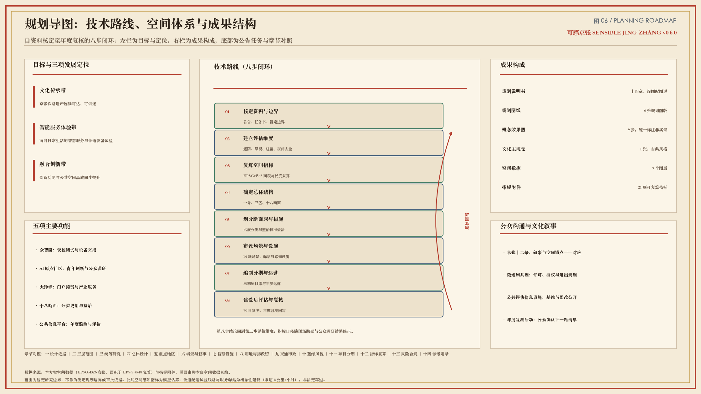
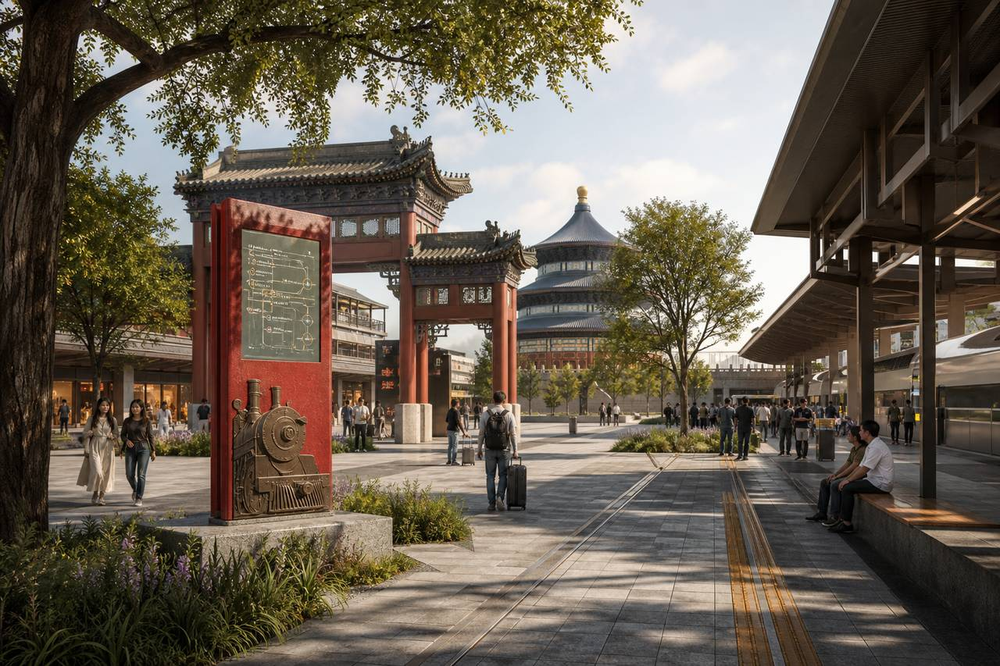
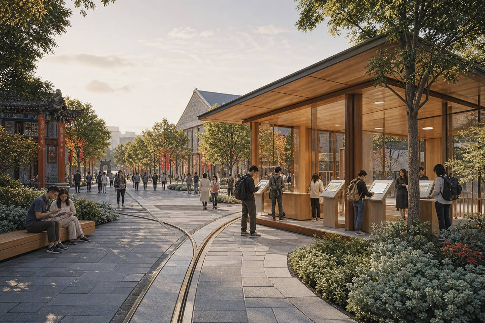
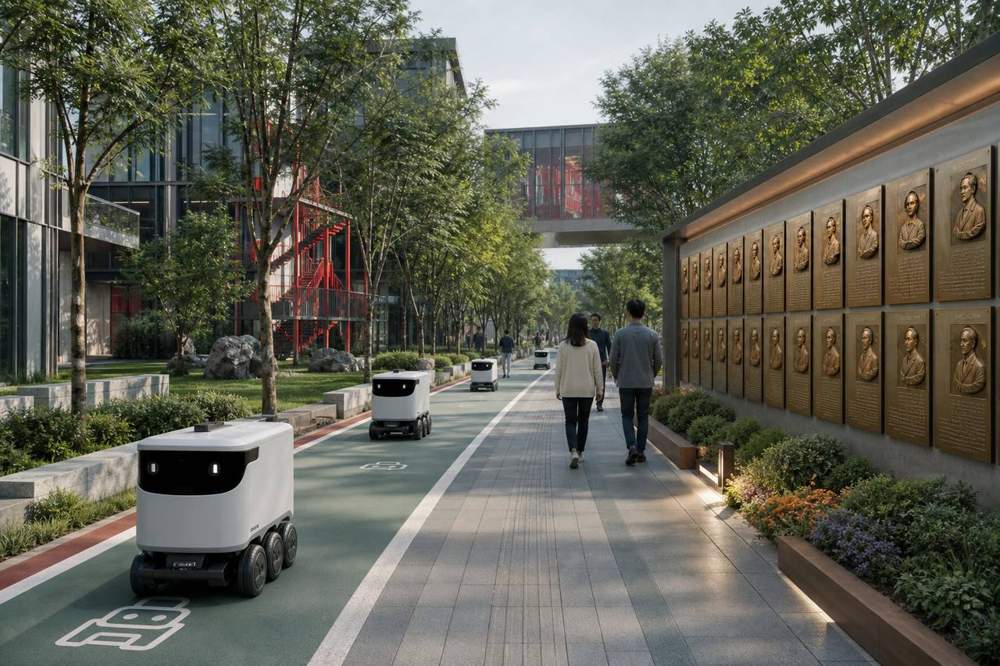
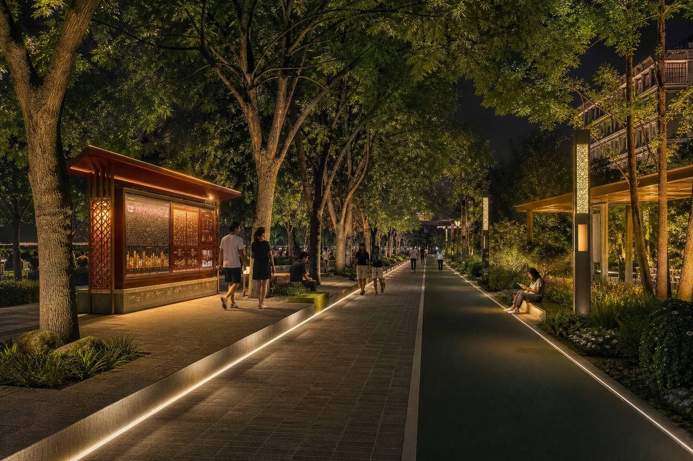

# 《京张醒来之后》——京张铁路遗址公园感知提升与智慧慢行系统规划（第二次测量）

> **规划项目名称**：可感京张 / Sensible Jing-Zhang
> **文化叙事名称**：《京张醒来之后》·第二次测量 / The Second Survey
> **总体空间结构**：一脊、三区、十八断面及低速智能设备试验网络
> **成果构成**：规划说明书（本文）、6 张规划图、9 张概念效果图、1 张文化主视觉、空间数据与指标附件、A0 图版与 A3 图册
> **阅读方式**：全文十四章，每章以《复测记》冷开场引入议题，正文按“规划重点—空间策略—管控要求—实施与边界”展开；正文所有图纸均配“画面内容—读图要点—规划含义—使用边界”四段图说。

> **第一幕“醒来”**
> **时间与地点**：初夏清晨五时四十分，京张铁路遗址公园主轴北段，站台遗存与轨枕之间。
> **人物**：早班通勤者、清扫人员、参与复测的青年规划师，以及被拟人化的“京张”。
> **场景**：晨光沿着轨道方向铺开，公共评估信息设施亮起，显示遮阴、绿视、驻留和夜间安全四项初始基线。
> **冲突**：“京张”记得自己被测量过一次——那一次测的是坡度、曲线与里程；而今天走在它身上的人，抱怨的是没有树荫、没有座椅、夜里不敢独行。
> **转折**：青年规划师没有先画线，而是把四项基线抄进随身的复测本，约定“先量人，再量地”。
> **引语**：“上一次，人们测量我通向多远；这一次，请先测量你们走得是否舒适。”
> 本幕为文化运营构想，不作为现状事实或规划依据。[assumption:A-DRAMA-001]

规划以京张铁路遗址公园为连续公共空间主轴，统筹大钟寺、AI 原点社区和众智园三处重点地区。方案以遮阴、绿视、驻留和夜间安全等指标识别公共空间短板，建立公众调研、建设后评估与年度监测机制；同时提出低速配送试验线路、服务驿站和智慧城市场景的概念性布局。城市意象、公共生活、场所营造、步行可达性和完整街道等理论用于支撑规划方法，不作为海淀法定规划依据或本地实测结论。[source:OFFICIAL-ANNOUNCEMENT] [source:AGENT-TASKBOOK] [assumption:A-BOUNDARY-001] [assumption:A-THEORY-001]

三条主线贯穿全文：其一，把“好走、好停、好用”的公共空间品质转化为可复算、可复测的指标，让更新顺序有据可依；其二，把人工智能与低速智能设备安置在明确的空间位置与运行规则之内，使技术服务于日常通行而非占用通行；其三，把居民与青年研究人员的判断写进评估与整改流程，使公共空间的改善能够被持续检验。

**图 00｜文化主视觉《京张醒来之后》**

- **画面内容**：以古典水墨与暖宣纸调组织画面，铁路遗存、绿脊、人群与晨光叠合，画面右下角为“第二次测量”题识。
- **读图要点**：主视觉不承载空间信息，仅确立本方案的文化基调——遗产不是布景，测量对象由“线路”转为“人”。
- **规划含义**：文化叙事与规划指标共用同一套空间锚点，公众通过故事进入，专业人员通过指标复核，两条路径在同一处公共空间汇合。
- **使用边界**：本方案自制文化图像，不代表现状实景、历史场景复原或已批准建设方案。[source:AWAKENING-POSTER] [assumption:A-RENDER-001]

**图 01｜总体空间结构（暂定研究边界）**

- **画面内容**：横向图版，底图为暂定研究边界与概念用地，绿色粗线为约 9.3 公里公共空间主轴，橙色圆点为 18 处评估断面（圆点大小与颜色随短板指数变化），紫色虚线为低速配送试验线路，方块为 3 处服务驿站，金色标记为 3 处主题标志节点；右侧依次为三层范围关系、低速设备运行规则和核心指标。
- **读图要点**：先看绿线的连续性，再看橙点的疏密与深浅——颜色越深、圆点越大，表示模型估算的公共空间短板越显著，也就是一期整治的优先对象；红框为三处重点地区。
- **规划含义**：图面同时回答“骨架在哪里”“问题在哪里”“先做哪里”三个问题，构成后续用地、交通、蓝绿与实施分期各章的共同底图。
- **使用边界**：边界为暂定研究范围，非法定规划边界；断面指标为模型估算，须经现场踏勘与公众调研复核。[data:geometry/site_boundary.geojson#SITE-001] [assumption:A-BOUNDARY-001] [assumption:A-PERCEPTION-MODEL-001]

## 一、设计依据与资料清单

> **第二幕“第一根轨”**
> **时间与地点**：同日上午，临时工作站的长桌上。
> **人物**：青年规划师、资料组、“京张”。
> **场景**：公告、任务书、研究边界与铁路历史图件依次展开，桌面很快铺满。
> **冲突**：规划师想直接落笔画一条贯通线，“京张”却按住图纸，追问这条线的依据从哪一份文件来、能作到什么深度。
> **转折**：团队先建立资料分类与适用范围清单，凡未取得法定资料的内容一律标注“待明确”，再开始画第一根轨。
> **引语**：“图纸可以提出未来，但每一条线都应说明从何而来。”
> 本幕用于导入规划依据与资料边界，不替代正式依据。[assumption:A-DRAMA-001]

### 1.1 规划依据与资料边界

规划依据分为任务要求、基础资料、暂定边界、研究方法和设计表达五类，各类资料的适用范围如下：

1. **任务依据**：官方资格预审公告与面向智能体任务书，用于确定三层研究范围、三处重点地区及六项任务要求。[source:OFFICIAL-ANNOUNCEMENT] [source:AGENT-TASKBOOK] [source:SITE-PACKAGE]
2. **基础资料**：`brief/site-package/`、`data/source_registry.json` 和 `data/processed/agent_fact_pack.md` 用于核对公开资料、数据来源及缺失项，不新增法定规划结论。[source:SOURCE-REGISTRY] [source:PROCESSED-FACT-PACK]
3. **暂定边界**：总体设计范围采用暂定研究边界，投影复算面积为 1141.3 公顷 [metric:site_area_sqm]（EPSG:4548）。该边界仅用于方案研究和指标一致性检验，不作为法定规划边界或审批依据。[source:BOUNDARY-SOURCE] [source:KEY-AREA-SOURCE] [data:geometry/site_boundary.geojson#SITE-001] [data:geometry/constraints.geojson#CON-PROV] [depth:existing_conditions_diagnosis] [assumption:A-BOUNDARY-001] [assumption:A-CONTROLS-001]
4. **研究方法**：热舒适与视觉感知研究用于构建公共空间评估维度 [source:VATA-PAPER] [source:CITY-LANDSCAPE-INSIGHT]；公众偏好调研方法用于后续方案复核 [source:SP-SURVEY-PAPER] [source:SP-SURVEY-PLATFORM] [source:SP-SURVEY-PROTOCOL]；相关城市设计理论作为方法参考，详见文末附录。[assumption:A-THEORY-001]
5. **设计表达**：效果图与主视觉为本方案自制的概念性设计表达，不代表现状实景或已批准建设方案。[source:AWAKENING-POSTER] [source:RENDERS-SUITE] [assumption:A-RENDER-001]

相关标准与任务依据：[standard:PROJECT-OFFICIAL-ANNOUNCEMENT] [standard:PROJECT-AGENT-OPEN-CALL-TASKBOOK] [standard:MOHURD-URBAN-DESIGN-MEASURES] [standard:MOHURD-CONTROL-DETAILED-PLANNING] [standard:MNR-LAND-USE-CLASSIFICATION-GUIDE] [standard:MOHURD-ARCH-DESIGN-DEPTH-2016]

### 1.2 现状认识与主要问题

沿线现状可概括为“遗产骨架清晰、日常使用不足”。铁路遗存构成连续且可识别的线性空间，但沿线遮阴不连续、可坐设施不足、部分路段夜间照明与界面活跃度偏低，站城接驳处的方向识别与无障碍连续性仍待完善；同时，创新功能在两翼快速聚集，公共空间供给与人群活动强度之间存在错配。既有开发强度、道路红线与建筑高度等法定控制条件尚未取得，因此本方案不对上述指标作出推定，而是先解决“公共空间是否好用”这一可观察、可复测的问题。[source:VATA-PAPER] [assumption:A-CONTROLS-001]

### 1.3 方法依据与规划响应

- **可意向性（imageability）**：Lynch 提出以路径、边界、区域、节点和地标五类要素组织城市心智地图；本方案将京张绿脊确定为主要路径，将三处重点地区确定为特色节点，将主题标志节点与公共评估信息设施确定为地标，增强空间体系的整体识别性。[source:THEORY-LYNCH-IMAGE]
- **人尺度与步行速度感知**：Gehl 强调城市应按步行速度与五感设计，追求 lively / safe / sustainable / healthy；本方案以遮阴、驻留、夜间安全等人尺度指标替代巨型屏幕叙事。[source:THEORY-GEHL-CITIES-PEOPLE] [source:THEORY-GEHL-PLDP]
- **公共场所营造**：PPS 从可达与连接、用途与活动、舒适与形象、社交性四个方面评价公共空间；Whyte 强调座椅、日照和边界条件对小型公共空间使用效能的影响。规划据此形成断面分类整治措施和公共评估信息界面。[source:THEORY-PPS-PLACE] [source:THEORY-WHYTE-SOCIAL-LIFE]
- **自然监视与功能多样性**：Jacobs 关于自然监视、混合功能和短街区的研究表明，公共空间安全与活力依赖持续、真实的日常使用。低速智能设备通行空间不得占用行人通行和停留空间。[source:THEORY-JACOBS-DEATH-LIFE]

### 1.4 技术路线与成果结构

规划技术路线分为八步：核定资料与边界、建立公共空间评估维度、复算空间指标、确定总体结构、划分断面族与整治措施、布置应用场景与设施、编制分期与运营安排、开展建设后评估并回到第一步复核。该路线在图 02 中以规划导图形式表达，用于说明各章之间的依赖关系与成果去向。

**图 02｜规划导图（技术路线与成果结构）**

- **画面内容**：左栏为目标体系与三项发展定位，中部为八步技术路线闭环（自资料核定至年度复核），右栏为成果构成（规划说明、规划图、空间数据、指标、场景与文化叙事），底部为公告任务与本文章节的对照条。
- **读图要点**：技术路线为闭环而非单向流程，第八步“年度复核”直接回到第二步“评估维度”，表示指标口径会随实测与公众反馈修正。
- **规划含义**：导图说明本方案的判断依据可追溯——每一项空间措施都能上溯到一项评估结论，每一项评估结论都能上溯到一类资料或一项明示假设。
- **使用边界**：导图为方法示意，不含空间比例关系；图中“待明确”环节表示尚未取得法定资料。[depth:existing_conditions_diagnosis] [assumption:A-CONTROLS-001]

## 二、三层范围工作框架

> **第三幕“坡度”**
> **时间与地点**：上午九时，校园门廊段一处坡道。
> **人物**：轮椅使用者、推婴儿车的居民、一台低速配送设备、青年规划师。
> **场景**：三方几乎同时抵达坡道口，路面宽度只够两者并行。
> **冲突**：轮椅使用者选择绕行较缓的一侧，婴儿车停下等待，配送设备原地徘徊——同一段坡道对三类使用者意味着三种难度。
> **转折**：规划师由此确定分级传导规则：宏观层定方向，总体层定结构，重点地区层必须落到坡度、宽度与时段这类具体条件。
> **引语**：“一张总图说明方向，一段坡道检验规划能否抵达日常。”
> 本幕用于导入三级规划范围，不作为无障碍实测结论。[assumption:A-DRAMA-001]

### 2.1 三层规划范围与任务传导

规划采用“统筹研究—总体设计—重点地区”三级工作框架。[depth:three_level_scope_framework] 统筹研究层提出区域协同和公共治理方向；总体设计层落实空间结构、慢行网络和蓝绿系统；重点地区层进一步明确近期项目、典型断面和运行要求。

**约 43.6 平方公里统筹研究层**：研究高校、科研平台、企业、社区与公共空间之间的协同关系，提出创新生态、公共空间治理和低速智能设备试验的总体方向；本层形成 7 项国际案例借鉴 [metric:ecosystem_case_count]，不作地块级空间控制。

**约 11.4 平方公里总体设计层**：以京张铁路遗址公园为公共空间主轴，串联大钟寺、AI 原点社区和众智园；形成慢行、蓝绿和低速配送试验网络。暂定边界复算面积为 1141.3 公顷 [metric:site_area_sqm]，公共空间主轴长约 9.3 公里 [metric:park_spine_length_m]，设置 18 处感知评估断面 [metric:perception_section_count]。

**三处重点地区层**：大钟寺重点完善门户接驳和信息服务，AI 原点社区重点建设公众调研与青年公共活动空间，众智园重点设置低速设备验证场地和配套服务驿站。共划定 3 处暂定重点地区 [metric:key_area_count]；相关几何范围不替代公告或法定规划边界。[data:geometry/key_areas.geojson#KEY-001] [assumption:A-KEYAREA-001]

### 2.2 三级范围工作要点

| 层级 | 空间范围 | 核心议题 | 主要成果 | 设计深度 | 本阶段局限 |
| --- | --- | --- | --- | --- | --- |
| 统筹研究层 | 约 43.6 平方公里 | 创新生态协同、公共空间治理、试验制度借鉴 | 发展定位、案例机制转译、治理与数据边界建议 | 策略与机制层面 | 不作地块级控制，不涉及权属处置 |
| 总体设计层 | 约 11.4 平方公里 | 空间结构、慢行与蓝绿系统、公共空间短板 | 一脊三区十八断面结构、概念用地、指标复算 | 面向控制性详细规划深化的概念性城市设计 | 强度、红线与建筑高度待法定资料明确 |
| 重点地区层 | 3 处，合计约 369.2 公顷 | 门户接驳、社区参与、试验验证 | 详细设计要点、近期项目、运行与评估要求 | 概念性详细设计与实施要点 | 具体工程定线与设备路权待审批 |

三级范围之间采用“同一套指标、逐级细化”的传导方式：统筹层提出议题，总体层给出空间落点，重点地区层给出可检查的动作与时序，避免上下层结论互相脱节。

### 2.3 日常服务可达性方法

统筹研究以居住、就业、商业服务、照护、教育和休闲六类日常功能作为服务配置检查项，重点识别主轴两侧公共服务缺口。设施数量不能等同于实际可达性，后续仍需结合路网、过街条件和不同人群出行能力开展评估。[source:THEORY-15MIN-CITY] [source:THEORY-15MIN-CRITIQUE] [assumption:A-THEORY-001]

## 三、统筹研究范围产业与未来城市研究

> **第四幕“隧道记忆”**
> **时间与地点**：傍晚七时二十分，旧铁路暗段。
> **人物**：巡检人员、夜跑者、“京张”。
> **场景**：自然光在几十米内退去，路面由亮转暗，夜跑者放慢脚步，回头确认身后。
> **冲突**：“京张”怀念蒸汽时代隧道里的黑暗，那是它记忆的一部分；但巡检人员记录到的，是照度不足、界面封闭、无人可见的一段路。
> **转折**：双方各让一步——黑暗作为叙事保留在灯光与解说中，通行路径则按照度、界面活跃度与停留条件逐项整治。
> **引语**：“保留黑暗的记忆，不等于保留令人犹豫的道路。”
> 本幕用于导入夜间安全和公共空间评估策略，不作为现场测量记录。[assumption:A-DRAMA-001]

### 3.1 创新带的公共空间支撑体系

规划将创新活动与公共空间改善同步推进，重点提升步行连续性、环境舒适度、站城接驳和试验活动的安全管理水平，使技术应用服务于日常通行和公共生活。创新功能的外部效应最终体现在公共空间中：会议之间的十分钟步行、实验室之间的设备转运、夜班之后的独行回家，都需要具体的遮阴、照明、坐憩与交接空间来承载。

### 3.2 核心策略：公共空间评估与实体智能试验协同

1. **公共空间评估**：沿约 9.3 公里的主轴设置 18 处评估断面，平均间距约 540 米，并在门户、校园和夜间薄弱段加密复核。模型综合遮阴、绿视、空间围合、驻留潜力和夜间安全等维度，平均短板指数为 0.416 [metric:mean_perception_shortfall]；该结果用于确定研究阶段的更新顺序，需经现场踏勘和公众调研校准。[source:THEORY-GEHL-PLDP] [source:VATA-PAPER] [assumption:A-PERCEPTION-MODEL-001]
2. **建设后评估机制（感知合约）**：项目立项时登记基线，建成 90 日后开展复测；达到目标后结项，未达到目标的项目提出整改措施，并纳入年度监测。[assumption:A-SURVEY-PROTOCOL-001]
3. **实体智能试验设施**：在不影响步行和无障碍通行的前提下，设置低速配送试验线路、3 处服务驿站 [metric:robot_hub_count]、设施巡检和断面档案。试验设施实行限速、分时运行、人工接管和退出管理。[assumption:A-ROBOT-001] [assumption:A-PRIVACY-001]

三项策略互为条件：没有评估口径，试验缺少验收标准；没有建设后评估，改善难以持续；没有明确的运行与退出规则，试验会侵占公共空间。

### 3.3 公共生活与数据治理要求

沿线首层界面、公共活动和自然监视共同构成日常安全基础；绿道应同时承担慢行、生态和休闲功能。涉及数据采集的试验须先明确数据最小化、使用期限、责任主体和退出机制，再进入公共空间应用。[source:THEORY-JACOBS-DEATH-LIFE] [source:CASE-QUAYSIDE-LESSON] [assumption:A-THEORY-001]

### 3.4 国际案例借鉴及适用条件

- **新加坡榜鹅数字园区（实体智能试验区）**：多运营主体设备在混合公共区开展试验，并以主动出行豁免框架约束速度与安全责任；本方案借鉴其“规则先行”的做法，转译为低速共享层、服务驿站与明确的停止条件，不宣称已获得任何豁免。[source:CASE-SG-PDD] [source:CASE-SG-IMDA]
- **新加坡市区重建局（末端配送与路径条件研究）**：强调坡度、有效通行宽度与取送点组织；本方案转译为共享断面的空间分层要求与无障碍交接组件，不作工程定线。[source:CASE-SG-URA]
- **巴塞罗那超级街区**：以步行优先、绿色街道与健康指标重新分配街道断面；本方案转译为“短板断面优先整治包”，而非照搬其街区网格尺度。[source:CASE-BCN-SUPERBLOCK]
- **多伦多 Meadoway 绿廊**：以鸟瞰与人视相结合的可视化工具包开展公众沟通；本方案转译为 9 张概念效果图与逐图图说，并统一标注非实景。[source:CASE-MEADOWAY]
- **圣路易斯 Chouteau 绿道**：将遗产铁路与创新节点编织为连续绿道；本方案转译为“一脊三区”结构与主题标志节点，不复制其投资规模。[source:CASE-CHOUTEAU]
- **赫尔辛基城市试验与移动实验室**：在真实城市环境开展试验并建立数字孪生，同时明确试验不等于采购承诺；本方案转译为众智园验证走廊与“未达要求即退出”规则。[source:CASE-HEL-TESTBED]
- **多伦多 Quayside（负面参照）**：数据与知识产权框架滞后于技术部署，导致公共信任受损；本方案据此把隐私保护、人工复核与退出条款写入全部应用场景。[source:CASE-QUAYSIDE-LESSON]

案例借鉴主要集中于步行优先、线性公共空间、真实城市试验和数据治理四类机制。规划不照搬项目规模或建筑形式，相关建议须结合海淀现状、审批条件和公众反馈进一步深化。共研究 7 项国际案例 [metric:ecosystem_case_count]。

### 3.5 三大定位与五大功能响应

**三项发展定位**：建设京张铁路文化传承带、面向日常生活的智能服务体验带和人工智能融合创新带。**五项主要功能**：众智园承担受控测试与设备交接，AI 原点社区组织青年创新和公众调研，大钟寺完善门户接驳与产业服务，沿线十八断面承载分类更新，公共信息平台与年度监测支撑建设后评估。[source:AGENT-TASKBOOK]

三项定位分别落实到断面类型、重点地区、应用场景和年度运营安排，形成空间建设与长期运营相衔接的实施体系。

## 四、总体设计范围城市更新与控规深度城市设计

> **第五幕“站与城”**
> **时间与地点**：上午十时，大钟寺站出站口至遗址公园入口之间。
> **人物**：首次到访的访客、门户区服务人员、“京张”。
> **场景**：列车到站，人流涌出，访客在出站口停下辨认方向。
> **冲突**：交通设施把人送到了城市边上，却没有把人送进城市——三十米之内没有遮阴，没有可坐处，导向信息与商业标识混在一起。
> **转折**：访客沿一段连续的树荫与首层界面走了两百米，抬头找到了公园入口，脚步由试探转为从容。
> **引语**：“到站只是交通结束，能够顺利进入城市，才是公共空间的开始。”
> 本幕用于导入站城接驳与总体空间结构。[assumption:A-DRAMA-001]

### 4.1 总体空间结构与更新重点

本章为面向控制性详细规划深化的概念性城市设计，不替代法定控规成果；开发强度、道路红线和建筑高度等指标须在取得法定资料后确定。

总体形成 **一脊、三区、十八断面和低速智能设备试验网络** 的空间结构。[depth:overall_spatial_structure] “一脊”为长约 9.3 公里的京张铁路遗址公园公共空间主轴 [metric:park_spine_length_m] [data:geometry/roads.geojson#RD-SPINE]；“三区”为大钟寺、AI 原点社区和众智园三处重点地区；“十八断面”用于识别不同路段的环境问题和更新措施。公共展示设施按主轴、重点广场和服务节点分级设置，避免连续设置大型电子屏幕。

**图 03｜全带鸟瞰（R01，概念效果图）**

- **画面内容**：自南向北俯视整条公共空间主轴，绿脊连续贯通，两侧为创新与居住功能带，画面中景可见三处重点地区的门户广场、社区客厅与验证走廊。
- **读图要点**：注意绿脊在跨越东西向道路处的连续处理方式，以及两翼建筑首层向绿脊一侧的开放界面；画面未表达具体建筑形式与高度。
- **规划含义**：鸟瞰图用于说明“一条主轴统领、三处地区分工”的结构关系，是图 01 结构图的空间感受版本。
- **使用边界**：概念效果图，不代表现状实景、建筑设计方案或已批准建设内容。[source:RENDERS-SUITE] [assumption:A-RENDER-001]

### 4.2 城市意象与公共生活响应

规划将遗址公园主轴作为主要路径，将三处重点地区作为特色区域，将接驳广场和公共活动空间作为节点，将信息标识和文化设施作为地标，形成清晰的空间识别体系。[source:THEORY-LYNCH-IMAGE] 近期更新优先改善遮阴、座椅、照明和首层界面，为必要活动、可选活动和社会活动提供连续的空间条件。[source:THEORY-GEHL-CITIES-PEOPLE] [source:THEORY-GEHL-PLDP]

### 4.3 十八处评估断面的分类与管控要求

| 断面族 | 代表断面 | 主导问题 | 一期动作 | 低速设备层关系 |
| --- | --- | --- | --- | --- |
| A 门户接驳 | PS-SEC-01–03 | 站城转换、遮阴连续 | 接驳无障碍连续体 | 二期建设 HUB-01 服务驿站 |
| B 综合短板整治 | PS-SEC-04–06 | 绿视、驻留和夜间安全等综合短板 | 分项补绿、座椅、照明与铺装整治 | 试验线路避让驻留区 |
| C 校园门廊 | PS-SEC-07–09 | 校城接口、高峰人流 | 错峰驻留与导视 | 配送限时段 |
| D 原点客厅 | PS-SEC-10–12 | 青年公共活动、公众调研 | 公众调研亭与公共评估点 | 服务驿站 HUB-02 |
| E 夜间安全整治 | PS-SEC-13–15 | 夜间安全、驻留和空间围合综合短板 | 照明、界面与停留空间改善 | 优先开展设施巡检 |
| F 园区验证 | PS-SEC-16–18 | 研发界面、试验展示 | 验证走廊与成果展示设施 | 服务驿站 HUB-03 |

模型估算的高短板断面共 5 处 [metric:high_shortfall_section_count]，分别为 PS-SEC-05、PS-SEC-15、PS-SEC-14、PS-SEC-06 和 PS-SEC-04；平均短板指数为 0.416 [metric:mean_perception_shortfall]。其中 PS-SEC-04 的主要问题为绿视和驻留条件，不宜概括为遮阴不足。上述结果用于研究阶段排序，需经现场踏勘和公众调研复核。[assumption:A-PERCEPTION-MODEL-001] [data:geometry/public_space.geojson#PS-SEC-05]

### 4.4 十八处断面模型估算结果

下表为 18 处断面的模型估算值（0—1，数值越高表示条件越好；综合短板指数越高表示问题越突出），用于确定研究阶段的整治顺序。

| 断面 | 街段 | 断面族 | 综合短板 | 遮阴 | 绿视 | 驻留 | 夜间安全 | 主导短板 | 整治时序 |
| --- | --- | --- | --- | --- | --- | --- | --- | --- | --- |
| PS-SEC-05 | ST-JZ-05 | B | 0.554 | 0.52 | 0.44 | 0.29 | 0.51 | 驻留、绿视 | 一期 |
| PS-SEC-15 | ST-JZ-15 | E | 0.548 | 0.53 | 0.59 | 0.30 | 0.43 | 驻留、夜间安全 | 一期 |
| PS-SEC-14 | ST-JZ-14 | E | 0.518 | 0.51 | 0.69 | 0.29 | 0.33 | 夜间安全、驻留 | 一期 |
| PS-SEC-06 | ST-JZ-06 | B | 0.515 | 0.53 | 0.61 | 0.30 | 0.36 | 驻留、夜间安全 | 一期 |
| PS-SEC-04 | ST-JZ-04 | B | 0.457 | 0.78 | 0.28 | 0.47 | 0.62 | 绿视、驻留 | 一期 |
| PS-SEC-10 | ST-JZ-10 | D | 0.446 | 0.36 | 0.35 | 0.75 | 0.70 | 遮阴、绿视 | 二期 |
| PS-SEC-01 | ST-JZ-01 | A | 0.430 | 0.35 | 0.70 | 0.75 | 0.64 | 遮阴 | 二期 |
| PS-SEC-16 | ST-JZ-16 | F | 0.420 | 0.79 | 0.41 | 0.48 | 0.56 | 绿视、驻留 | 二期 |
| PS-SEC-11 | ST-JZ-11 | D | 0.395 | 0.68 | 0.38 | 0.72 | 0.68 | 绿视 | 二期 |
| PS-SEC-07 | ST-JZ-07 | C | 0.390 | 0.79 | 0.70 | 0.48 | 0.40 | 夜间安全、驻留 | 二期 |
| PS-SEC-13 | ST-JZ-13 | E | 0.375 | 0.78 | 0.68 | 0.47 | 0.49 | 驻留、夜间安全 | 二期 |
| PS-SEC-17 | ST-JZ-17 | F | 0.368 | 0.84 | 0.32 | 0.63 | 0.66 | 绿视 | 二期 |
| PS-SEC-18 | ST-JZ-18 | F | 0.368 | 0.66 | 0.52 | 0.72 | 0.70 | 遮阴、绿视 | 三期 |
| PS-SEC-08 | ST-JZ-08 | C | 0.357 | 0.84 | 0.67 | 0.62 | 0.55 | 夜间安全 | 三期 |
| PS-SEC-09 | ST-JZ-09 | C | 0.352 | 0.67 | 0.54 | 0.72 | 0.65 | 绿视、遮阴 | 三期 |
| PS-SEC-12 | ST-JZ-12 | D | 0.349 | 0.84 | 0.57 | 0.62 | 0.61 | 绿视 | 三期 |
| PS-SEC-03 | ST-JZ-03 | A | 0.328 | 0.84 | 0.49 | 0.62 | 0.69 | 绿视 | 三期 |
| PS-SEC-02 | ST-JZ-02 | A | 0.324 | 0.67 | 0.65 | 0.72 | 0.69 | 遮阴 | 三期 |

读表要点有三：第一，短板不等于全面落后，PS-SEC-04 与 PS-SEC-16 的遮阴条件较好，问题集中在绿视与驻留，整治应分项施策；第二，夜间安全偏低的断面集中于 E 族与 C 族，与暗段和校园错峰人流的空间特征一致；第三，全部数值均为模型估算，进入实施前须以现场踏勘和公众调研结果替换。[assumption:A-PERCEPTION-MODEL-001]

### 4.5 断面整治标准做法（概念性建议）

一期整治采用可替换、可复测的标准组件，按“先补基本条件，再谈展示功能”的顺序实施：

1. **遮阴与乘荫**：结合现状乔木缺口补植与轻型遮阴构架，优先保证等候点、坡道口与休憩点连续可荫；构架为可拆卸形式，固定基础须另行审查。
2. **可坐与停留**：结合轨枕式座椅与边界矮墙形成成组坐憩位，坐憩位与主要通行带保持分离，避免驻留活动挤占通行宽度。[source:THEORY-WHYTE-SOCIAL-LIFE]
3. **夜间照明与界面**：采用连续、低眩光的路径照明，配合首层界面开放与日常维护改善自然监视条件；不以增设摄像设备替代空间环境改善。[source:THEORY-CPTED]
4. **铺装与无障碍**：整治高差、井盖与坡度衔接，保障轮椅、婴儿车连续通行，交接处不设置临时台阶。
5. **信息与复测**：每处整治断面设置一处公共评估信息点，公布整治前基线、目标与复测时间。

上述做法的具体尺寸、照度与材料标准须在取得法定规划与专业规范核定条件后确定，本阶段不预设定量控制值。[assumption:A-ACCESS-001] [assumption:A-CONTROLS-001]

**图 04｜短板断面整治前后（R03，概念效果图）**

- **画面内容**：同一断面的两种状态并置。左侧为整治前：硬质铺装、无遮阴、等候人群暴露在日晒下；右侧为整治后：补植与遮阴构架形成连续树荫，成组座椅与公共评估信息点置于通行带之外。
- **读图要点**：对比两侧的通行宽度可见，整治后停留空间来自边界空间的重新组织，而非压缩人行通道。
- **规划含义**：这一组对比说明一期整治的性质——以小规模、可逆的组件解决“暴晒的等待”，并以复测确认改善是否成立。
- **使用边界**：概念效果图，非实景，不代表施工图设计或已确定的树种、铺装与家具选型。[source:RENDERS-SUITE] [assumption:A-RENDER-001]

### 4.6 公共展示与服务设施分级

**线性设施**沿公共空间主轴连续设置导向、照明和休憩设施；**重点空间**结合三处重点地区设置门户广场、社区客厅和验证展示空间；**服务节点**设置公共信息牌、公众调研点、成果展示设施和低速设备服务驿站。设施尺度与站台、轨枕等铁路遗存要素协调，优先服务通行和停留需求。[assumption:A-BRAND-001] [source:THEORY-PPS-PLACE]

## 五、重点区域详细设计

> **第六幕“五道口洪流”**
> **时间与地点**：早高峰八时十分，校园门廊段。
> **人物**：赶课的学生、送早餐的骑手、运营巡查员、“京张”。
> **场景**：连续人流沿狭窄界面通过，一名学生想靠边站着吃完早餐。
> **冲突**：他每次靠边，都会挡住后面的人；而他若继续走，就得边走边吃——空间给了通行，却没有给停留留出位置。
> **转折**：运营人员在界面一侧划出错峰驻留带，并把配送时段调至高峰之后，通行与停留各得其所。
> **引语**：“人流需要被疏导，停留也应获得位置。”
> 本幕用于导入重点地区差异化设计，不作为高峰人流实测数据。[assumption:A-DRAMA-001]

### 5.1 三处重点地区的差异化任务

三处重点地区分别承担门户接驳、社区参与和园区验证功能。[depth:three_key_area_detailed_design] 规划从公共空间、近期项目、低速设备运行和建设后评估四个方面提出差异化设计要求。

| 编号 | 重点地区 | 暂定面积（公顷） | 主要职能 | 近期重点 | 对应断面族 | 服务驿站 |
| --- | --- | --- | --- | --- | --- | --- |
| KEY-003 | 大钟寺门户区 | 72.0 | 站城接驳、门户形象、产业服务 | 无障碍接驳连续体与公共信息服务 | A 门户接驳 | HUB-01（二期） |
| KEY-002 | AI 原点社区 | 104.3 | 青年公共活动、公众调研、社区服务 | 公众调研亭与社区客厅 | C／D 校园门廊与原点客厅 | HUB-02（二期） |
| KEY-001 | 众智园验证区 | 192.9 | 受控试验、成果展示、设备交接 | 验证走廊与成果展示设施 | F 园区验证 | HUB-03（二期） |

三处地区合计约 369.2 公顷，占总体设计范围约三分之一；其余范围以主轴沿线断面整治和界面改善为主，不设集中建设任务。

**图 05｜三处重点区域与一期优先断面**

- **画面内容**：自上而下为大钟寺门户区、AI 原点社区、众智园验证区三个放大窗，每窗显示重点地区边界、概念建筑基底、评估断面、服务驿站与主题标志节点；右侧为一期优先断面清单与深化任务。
- **读图要点**：三窗采用同一比例与同一图例，便于横向比较——门户区的问题集中在接驳连续性，社区段的问题集中在停留与参与空间，园区段的问题集中在试验与展示界面的组织。
- **规划含义**：重点地区不是三个独立项目，而是同一条主轴上分工不同的三段，其共同任务是把主轴的通行连续性接入日常生活。
- **使用边界**：重点地区范围为暂定研究边界；建筑基底仅为界面研究原型，不代表实际建筑处置方案。[data:geometry/key_areas.geojson#KEY-002] [assumption:A-KEYAREA-001]

### 5.2 公共空间与站城衔接方法

大钟寺门户空间重点保障可坐、可荫、易识别和连续步行；AI 原点社区补充居住与工作空间之外的日常交往场所；众智园设置可观察、可管理的试验展示空间。三处重点地区采用不同的空间组织方式，避免功能和形象重复。[source:THEORY-WHYTE-SOCIAL-LIFE] [source:THEORY-OLDENBURG-THIRDPLACE] [source:THEORY-LYNCH-IMAGE]

### 5.3 大钟寺门户区

**空间任务**：完善轨道接驳与无障碍步行连续性，形成连续遮阴的首层公共界面；设置公共信息牌，公开建设后评估结果；一期预留低速设备服务驿站 HUB-01 的场地和接口，二期结合审批条件建设，避免进入核心候车区。[data:geometry/key_areas.geojson#KEY-003] [data:geometry/public_space.geojson#PS-ROBOT-HUB-01]

**详细设计要点**：

1. 出站后 150–300 米内完成“找方向—找荫—找坐—找信息”四步，对应 Whyte 关于小型公共空间要素的研究结论。
2. 公共信息牌公布评估指标、复测进度和整改情况，不设置广告化屏幕墙。
3. HUB-01 二期建设后仅承担设备交接与充换电，高峰时段限制设备进入核心人流区。
4. 门户广场保留连续步行主线，临时活动与展陈布置于主线之外，不得在高峰时段占用接驳通道。

**图 06｜大钟寺门户人视（R02，概念效果图）**

- **画面内容**：人视高度看向门户广场，左侧为连续遮阴的首层界面与成组座椅，中景为公共评估信息牌，远景为进入遗址公园的绿脊入口。
- **读图要点**：画面刻意压低了展示设施的尺度与亮度，信息牌与导向标识同高，不形成连续电子界面。
- **规划含义**：门户的评价标准不是形象强度，而是“看懂、到达、停留”三件事能否在出站后的两三百米内完成。
- **使用边界**：概念效果图，非实景；广场铺装、树种与信息设施形式均为示意。[source:RENDERS-SUITE] [assumption:A-RENDER-001]

### 5.4 AI 原点社区

**空间任务**：设置公众调研亭和公共空间评估点，引导居民与青年研究人员参与方案复核；结合社区客厅和共享服务空间布置 HUB-02，服务校园与社区之间的低速配送，并在高峰时段限速限流。[data:geometry/key_areas.geojson#KEY-002] [assumption:A-SURVEY-PROTOCOL-001]

**详细设计要点**：

1. 非正式交往空间（咖啡馆、共享工作角、社区客厅）与调研亭并置，使参与调研成为日常停留的一部分，而非临时路障。[source:THEORY-OLDENBURG-THIRDPLACE]
2. 公众调研实行知情同意和随时退出，不采集生物特征；未完成实际调研前不得将模型估算表述为公众意见。
3. 校园门廊族与原点客厅族断面承接高峰人流，设置错峰驻留带并明确高峰时段的配送避让要求。
4. 社区公共空间同时满足夜间照明与自然监视要求，使青年夜间活动具备基本安全条件。

**图 07｜原点社区公众调研亭（R04，概念效果图）**

- **画面内容**：社区客厅一侧的轻型调研亭，居民在遮阴下就座填答，屏幕以图示方式呈现待选空间方案，旁侧为可回写的公共评估信息面板。
- **读图要点**：调研亭与通行路径之间保留缓冲带，参与者不需要站在人流中作答；亭体为轻型可拆卸结构。
- **规划含义**：公众参与要有具体的坐下来的位置，才能形成稳定样本；调研结论回写到公共界面，参与者才能看到意见的去向。
- **使用边界**：概念效果图，非实景；图中调研界面为示意，实际调研须依据知情同意协议开展。[source:SP-SURVEY-PROTOCOL] [source:RENDERS-SUITE] [assumption:A-RENDER-001]

### 5.5 众智园验证区

**空间任务**：以验证走廊承载低速配送、导览和设施巡检；成果展示墙记录可复核的技术与运营成果；服务驿站 HUB-03 承担设备交接和充换电。未达到安全要求的设备不得进入公共空间试验。[data:geometry/key_areas.geojson#KEY-001] [assumption:A-ROBOT-001] [assumption:A-AI-SAFETY-001]

**详细设计要点**：

1. 测试观看区与步行通道分层设置，避免观摩活动占用连续通行空间。
2. 成果展示设施记录可复核的技术、空间和运营成果，不设置以流量为导向的排名。
3. 试验项目与采购决策相分离；未达到安全、公共性或运营要求的项目及时退出。[source:CASE-HEL-TESTBED]
4. 验证走廊设置明确的进入与退出端点、限速标识和人工接管位置，运行日志按期公开复盘要点。

**图 08｜众智园验证走廊（R05，概念效果图）**

- **画面内容**：验证走廊内低速配送设备沿外侧车道行进，行人在内侧连续通行，观看区设于走廊一侧的抬高平台，尽端为成果展示设施。
- **读图要点**：设备通行带、行人通行带与观看区在平面上彼此分离；地面标识提示限速与避让规则。
- **规划含义**：受控试验的前提是空间上的可分离与管理上的可停止；走廊既是试验场地，也是公众理解技术边界的场所。
- **使用边界**：概念效果图，非实景；设备型号、车道尺寸与标识形式均为示意，实际运行须经审批。[source:RENDERS-SUITE] [assumption:A-ROBOT-001] [assumption:A-RENDER-001]

## 六、AI 创新生态、人才画像与 AI+ 场景

> **第七幕“暴晒的等待”**
> **时间与地点**：七月午后两时，综合短板断面的接驳等候点。
> **人物**：等车的访客、带孩子的居民、现场调研员。
> **场景**：地面温度明显偏高，等候点没有遮阴，也没有可坐处，人们站在广告牌的阴影里。
> **冲突**：热舒适导航给出了一条“更凉的路线”，但访客真正需要的是此处的一片树荫；技术能提示绕行，不能替代供给。
> **转折**：调研员当场记录反馈，遮阴与休憩整治任务被登记进一期整治包，并约定建成后复测。
> **引语**：“技术应先回答哪里需要一片树荫，再回答还能展示什么。”
> 本幕用于导入应用场景与治理边界，不作为现场气象或公众意见数据。[assumption:A-DRAMA-001]

### 6.1 使用人群与场景组织

规划面向青年研究人员、创业与运营人员、社区居民、配送人员、文旅访客和行动不便人群六类主要使用者组织应用场景。每项场景均明确服务对象、空间位置、责任主体、数据边界和暂停或退出条件；未明确安全责任和退出机制的场景不进入试点。

### 6.2 服务对象及其活动需求

规划重点服务青年研究人员、创业与运营人员、社区居民、配送人员、文旅访客和行动不便人群，共 6 类 [metric:persona_count]。规划分别梳理各类人群的主要活动时段、空间需求、出行障碍和服务场景，并为低速智能设备应用明确责任主体、空间范围、数据边界、人工复核和退出机制。

| 使用人群 | 主要活动时段 | 空间需求 | 主要障碍 | 对应空间落点 | 对应场景 |
| --- | --- | --- | --- | --- | --- |
| 青年研究人员 | 日间与夜间通勤、午间短时休息 | 连续步行路径、非正式交往空间、夜间安全 | 夜间照明不足、缺少可坐处 | 原点客厅族断面、社区客厅 | 青年公共空间匹配、夜间安全线路 |
| 创业与运营人员 | 工作日全时段 | 会面与洽谈空间、服务问询、便捷接驳 | 服务信息分散、门户识别性弱 | 大钟寺门户界面 | 企业服务问询、文化导览 |
| 社区居民 | 早晚与周末 | 遮阴、坐憩、儿童与老人活动空间 | 遮阴不连续、驻留空间不足 | 综合短板族断面、口袋公园 | 热舒适导航、健康活动提示、公众调研 |
| 配送人员 | 午间与晚间高峰 | 停靠与交接空间、清晰路径 | 缺少合规交接点、与人流冲突 | 服务驿站、试验线路端点 | 低速配送试点、设备交接管理 |
| 文旅访客 | 周末与节假日 | 导向信息、遗产解说、休憩 | 方向识别困难、解说不足 | 主题标志节点、十二幕站点 | 文化导览、微短剧共创 |
| 行动不便人群 | 全时段 | 无障碍连续通行、缓坡与休息点 | 高差与临时占用、坡道不连续 | 门户接驳族断面、无障碍交接点 | 无障碍路径服务、设施巡检复测 |

### 6.3 公共生活观测与隐私保护

公共生活观测记录人流、停留和活动类型，用于判断空间使用状况。[source:THEORY-GEHL-PLDP] 数据应用遵循最小必要、聚合优先、禁止建立人脸库和禁止追踪个人行程等要求，重要结论须经人工复核。[source:CASE-QUAYSIDE-LESSON] [assumption:A-PRIVACY-001]

### 6.4 十六项应用场景及管理要求

场景覆盖公共服务、测试验证、文化传播、产业服务和运营治理，并设置相应的暂停或退出条件：

| 序号 | 场景 | 主要空间 | 建议责任主体 | 数据边界 | 暂停或退出条件 |
| --- | --- | --- | --- | --- | --- |
| 01 | 热舒适步行导航 | 主轴与口袋公园 | 公园管理与运营单位 | 聚合环境数据，不采集个人轨迹 | 出现高温风险误导或投诉超出约定范围 |
| 02 | 无障碍路径服务 | 门户接驳廊 | 交通管理与无障碍服务机构 | 以现场设施审计数据为主 | 存在个人重识别风险 |
| 03 | 夜间安全步行线路 | 夜间安全薄弱断面 | 公园运营单位 | 匿名声环境与照明数据，不用于摄像执法 | 出现误报或照明扰民 |
| 04 | 公众调研亭 | AI 原点社区 | 高校与社区共同组织 | 知情同意，可随时撤回 | 调研协议未部署即不得宣称样本 |
| 05 | 环境舒适度测试场 | 众智园验证走廊 | 众智园运营单位 | 合成或经授权数据 | 未达到安全阈值 |
| 06 | 文化导览（京张十二幕） | 十二幕叙事节点 | 文化运营单位 | 经授权解说内容，不追踪行程 | 文物保护前置条件未满足 |
| 07 | 微短剧共创拍摄开放 | 指定广场与驻留区 | 文旅运营单位 | 许可拍摄，禁止建立人脸库 | 公共通行与使用被挤占 |
| 08 | 企业服务问询 | 大钟寺门户界面 | 产业服务运营单位 | 企业自愿提供信息 | 出现强制画像行为 |
| 09 | 低速配送试点 | 低速配送试验线路 | 物流企业与园区共同承担 | 不得外传含行人识别的训练数据 | 发生碰撞、超速或持续投诉即暂停 |
| 10 | 建设后评估公开看板 | 公共评估信息设施 | 独立评估机构 | 公开空间指标，不含个人信息 | 数据不可复核时停止发布排名 |
| 11 | 青年公共空间匹配 | 社区公共节点 | 社区运营单位 | 自愿填写的兴趣标签 | 出现骚扰申诉 |
| 12 | 健康活动风险提示 | 公园段落 | 卫生与公园管理部门 | 气象与环境聚合数据 | 提示内容越出非医疗建议范围 |
| 13 | 自主清扫与维护设备 | 主轴非高峰时段 | 环卫运营单位 | 仅记录作业区域，不识别人员 | 出现噪声扰民或通行冲突 |
| 14 | 设施巡检与复测 | 十八处评估断面 | 运维与评估单位 | 设施状态与环境指标 | 以机器巡检替代人工决策 |
| 15 | 断面数字档案 | 全线 | 数据治理机构 | 聚合层数字孪生，禁止个体轨迹 | 出现数据治理失控风险（参照多伦多 Quayside 教训） |
| 16 | 可拆卸环境传感组件 | 感知设施模块支座 | 经批准的机构 | 温度、湿度、光照与声级，到期删除 | 未取得批准的传感设备立即拆除 |

场景总数 16 [metric:scenario_card_count]，其中测试验证类 6 [metric:test_validation_scenario_count]。[assumption:A-PRIVACY-001] [assumption:A-AI-SAFETY-001]

### 6.5 文化叙事体系：京张十二幕

概念脚本大纲，供文旅与专业团队深化；**非已批准演出**，不作为规划依据。[assumption:A-DRAMA-001] 十二幕与评估断面、重点地区及服务驿站一一对应，并与文化导览、微短剧共创两项场景联动。文化叙事结合主轴、节点和地标组织游览节奏，使不同幕点与具体公共空间相对应。[source:THEORY-LYNCH-IMAGE]

**表 6-3　十二幕叙事结构**

| 幕 | 幕名 | 时间与地点 | 主要人物 | 冲突与转折 | 代表性引语 |
| --- | --- | --- | --- | --- | --- |
| 1 | 醒来 | 清晨，主轴北段站台遗存 | 通勤者、青年规划师、“京张” | 被测量者要求先测量使用者的体验，规划师改为先记录基线 | “这一次，请先测量你们走得是否舒适。” |
| 2 | 第一根轨 | 上午，临时工作站 | 规划师、资料组 | 急于落笔与依据不足的矛盾，转为先建立资料适用范围清单 | “每一条线都应说明从何而来。” |
| 3 | 坡度 | 上午，校园门廊段坡道 | 轮椅使用者、婴儿车家庭、低速设备 | 同一坡道对三类使用者难度不同，转为分级传导与分时组织 | “一段坡道，检验规划能否抵达日常。” |
| 4 | 隧道记忆 | 傍晚，旧铁路暗段 | 巡检人员、夜跑者 | 保留黑暗记忆与保障夜间通行的冲突，转为“记忆入解说、路径入整治” | “保留记忆，不等于保留令人犹豫的道路。” |
| 5 | 站与城 | 上午，大钟寺出站口 | 首访访客、门户服务人员 | 到站却难以进城，转为沿连续界面完成辨向与停留 | “能够顺利进入城市，才是公共空间的开始。” |
| 6 | 五道口洪流 | 早高峰，校园门廊段 | 学生、骑手、巡查员 | 停留必然妨碍通行，转为设置错峰驻留带与配送时段调整 | “人流需要被疏导，停留也应获得位置。” |
| 7 | 暴晒的等待 | 夏日午后，综合短板断面 | 等候访客、居民、调研员 | 导航能提示绕行却不能提供树荫，转为登记整治任务并约定复测 | “先回答哪里需要一片树荫。” |
| 8 | 夜间的犹豫 | 夜间，夜间安全薄弱断面 | 独行者、值守人员 | 安全感无法凭主张建立，转为以连续照明、活跃界面与可呼叫点支撑 | “安全感应当能够被看见、被复测。” |
| 9 | 原点回声 | 上午，原点社区调研亭 | 居民、产权单位、设计人员 | 一处建筑拟拆与居民意见冲突，转为调整为保留改造并公开理由 | “如果城市在测量我，我也应当修改它。” |
| 10 | 众智园测试 | 下午，众智园验证走廊 | 运营人员、测试团队、行人 | 设备遇行人后减速停车，转为终止未达阈值的测试并恢复步行优先 | “可以运行，也必须可以停止。” |
| 11 | 大钟寺门户 | 周末上午，门户区 | 访客、服务人员 | 信息分散导致方向迷失，转为在同一界面完成辨向、停留与反馈 | “门户首先应让人看懂、到达并停留。” |
| 12 | 把测量权交还给人 | 年度复测日，全线 | 市民、评估机构、运营单位 | 谁来决定下一轮整治，转为由公开复测结果与公众确认共同形成清单 | “城市不是一次完成的答案。” |

**表 6-4　十二幕空间与规划对应**

| 幕 | 空间锚点 | 联动场景 | 对应规划动作 | 分镜要点 |
| --- | --- | --- | --- | --- |
| 1 | 公共空间主轴全线 | 文化导览、公开看板 | 建立四项评估基线并公开 | 晨光沿轨道方向的长镜头 |
| 2 | 概念绿脊与用地单元 | 文化导览 | 编制资料清单与适用范围 | 桌面图件的俯拍特写 |
| 3 | PS-SEC-07–09 校园门廊族 | 无障碍路径、低速配送试点 | 分级传导与分时运行规则 | 三组车轮与脚步的并列镜头 |
| 4 | PS-SEC-13–15 夜间安全整治断面 | 夜间安全线路、设施巡检 | 照明与界面整治任务登记 | 由亮入暗的连续推移 |
| 5 | KEY-003 与 PS-SEC-01–03 | 企业服务问询 | 门户无障碍接驳连续体 | 出站口至公园入口的跟拍 |
| 6 | 近校界面与门廊族断面 | 青年公共空间匹配、热舒适导航 | 错峰驻留带与配送时段调整 | 高峰人流的定点长镜头 |
| 7 | PS-SEC-04–06 综合短板断面 | 热舒适导航 | 一期遮阴与休憩整治包 | 阴影边界的时间推移 |
| 8 | 夜间安全薄弱断面 | 夜间安全线路 | 连续照明与可呼叫停靠点 | 人物背影与路径灯序 |
| 9 | KEY-002 与 PS-SEC-10–12 | 公众调研亭 | 拆改留评价与意见回写 | 评价表与手写批注特写 |
| 10 | KEY-001 与 PS-SEC-16–18 | 环境舒适度测试、低速配送试点 | 停止条件与人工接管记录 | 减速停车的低角度镜头 |
| 11 | KEY-003 与 HUB-01 | 企业服务问询、公开看板 | 公共评估信息设施建设 | 信息面板与人群的对位 |
| 12 | 公共评估信息设施与年度公众复核 | 公众调研、公开看板、微短剧共创 | 年度监测与下一轮项目清单 | 十二处节点依次熄灯的收束 |

完整幕表及空间对应关系见成果附件；分镜长卷与终幕效果图分别见图 09 和图 10。[source:RENDERS-SUITE]

**图 09｜京张十二幕分镜长卷（R08，概念漫画式分镜）**

- **画面内容**：横向长卷分十二格，依次对应十二幕的时间、场所与关键动作，画面语言接近连环画与分镜脚本，格与格之间以铁轨线索连接。
- **读图要点**：每格右下角标注对应的空间锚点，可与图 01 的断面编号对照阅读；长卷从清晨开始、以年度复测结束，构成一个完整的时间循环。
- **规划含义**：分镜长卷把抽象指标转成可讲述的场景，便于居民、运营单位与专业人员在同一叙事框架下讨论同一处空间。
- **使用边界**：概念性文化表达，非已批准演出方案，不作为现状事实或规划依据；涉及历史人物与事件的内容须经专业复核。[source:RENDERS-SUITE] [assumption:A-DRAMA-001] [assumption:A-RENDER-001]

### 6.6 微短剧文化运营与空间使用管理

微短剧共创与“京张十二幕”导览协同组织，纳入年度文化运营安排。[assumption:A-DRAMA-001] [assumption:A-PRIVACY-001]

1. **空间准入**：十二幕空间锚点作为拍摄候选区域，优先使用广场、断面驻留区与主题标志节点；不得占用无障碍通道、低速设备交叉冲突区以及未完成文物保护审查的空间界面。
2. **授权与限制要求**：拍摄活动须取得场地许可和肖像授权；不得建立人脸数据库，不得追踪个体行程，不得将未脱敏街景素材用于外部模型训练；涉及历史人物和事件的内容须经专业人员复核，不设置未经史料支持的历史人物对白。
3. **共创流程**：采用已获授权的素材或自制概念图，可使用人工智能辅助剪辑和配音；发布前由人工复核公共性、隐私和史实。影响正常通行或引发持续投诉时暂停活动。
4. **与建设后评估衔接**：作品可标注对应空间位置，但传播量不作为空间品质评价指标；年度主题活动设置共创单元，其他时段实行预约和许可管理。

**图 10｜终幕“把测量权交还给人”（R09，概念效果图）**

- **画面内容**：年度复测日的傍晚，主轴上的叙事节点依次熄灯，仅公共评估信息设施保持开启，市民围在信息面板前查看复测结果与下一年度项目清单。
- **读图要点**：画面中心不是构筑物，而是人群与信息面板之间的关系；灯光的减法处理用以强调运营的常态化而非活动的高峰。
- **规划含义**：终幕对应本方案的运营主张——文化活动是入口，年度复测与公众确认才是长期机制。
- **使用边界**：概念效果图，非实景，不代表已确定的活动方案、设施形式或运营主体。[source:RENDERS-SUITE] [assumption:A-OPS-001] [assumption:A-RENDER-001]

## 七、实体智能与智慧城市基础设施

> **第八幕“夜间的犹豫”**
> **时间与地点**：晚十时四十分，夜间安全薄弱断面。
> **人物**：独自回家的青年、值守人员、一台夜巡设备。
> **场景**：路径两侧界面封闭，前方一段照明间断，青年放慢脚步，握紧手机。
> **冲突**：他需要的并不是更多摄像头，而是有人可见、有光可循、有处可停。
> **转折**：连续照明、活跃界面与可呼叫停靠点让他走完这段路；他在信息设施上留下一条评价，成为下一次整改的依据。
> **引语**：“安全感应当能够被看见、被复测，也能够推动下一次整改。”
> 本幕用于导入夜间安全与低速设备运行要求。[assumption:A-DRAMA-001]

### 7.1 低速智能设备的空间与运行条件

低速智能设备试验以保障行人和无障碍通行为前提，统筹线路、交接点、运行时段和安全管理。所有线路和驿站均为概念性建议，实施前须完成交通、消防、产权和运营审批。[assumption:A-ROBOT-001]

### 7.2 完整街道与环境安全响应

街道空间按步行与无障碍、自行车、低速智能设备、必要机动车的顺序配置，并通过分时运行减少冲突。[source:THEORY-COMPLETE-STREETS] [source:THEORY-NACTO-STREETS] 夜间安全优先采用连续照明、活跃界面、清晰出入口和日常维护等环境设计措施，不以增加摄像设备替代空间改善。[source:THEORY-CPTED]

### 7.3 低速配送试验线路与服务驿站

- 低速配送试验线路包括主轴两侧平行线路和 1 条横向连接线，中心线累计长度约 18.8 公里 [metric:robot_corridor_length_m]；其有效服务范围约等于 9.3 公里主轴长度，不应理解为一条连续 18.8 公里的独立线路。概念运行速度上限为 6 公里/小时。[data:geometry/roads.geojson#RD-ROBOT-1] [assumption:A-ROBOT-001]
- 规划提出 3 处低速设备服务驿站 [metric:robot_hub_count]，概念性用地面积合计约 972 平方米 [metric:robot_hub_area_sqm]，用于充换电和末端交接；实施时应结合既有设施复合设置，不单独形成商业用地。[data:geometry/public_space.geojson#PS-ROBOT-HUB-01]
- **街道空间优先顺序**：步行与无障碍、自行车、低速智能设备、必要机动车。低速设备不得占用无障碍通道和主要停留空间。
- **运行要求**：高峰时段限制设备通行；发生碰撞、超速或持续投诉时暂停试验；自动巡检结果不得替代人工决策。

| 编号 | 服务驿站 | 所在重点地区 | 主要功能 | 建设时序 | 实施前置条件 |
| --- | --- | --- | --- | --- | --- |
| HUB-01 | 大钟寺门户驿站 | KEY-003 | 末端交接、充换电，避开核心候车区 | 一期预留接口，二期建设 | 交通组织与场地权属核定 |
| HUB-02 | 原点社区交接驿站 | KEY-002 | 校园与社区之间配送交接 | 二期 | 社区协商与高峰限流方案 |
| HUB-03 | 众智园测试驿站 | KEY-001 | 测试设备进出、交接与检修 | 二期 | 消防与试验安全审查 |

三处驿站合计约 972 平方米，均按“结合既有设施复合设置”原则布局；驿站不得独立形成对外经营场地，运行时段与限速要求纳入运营协议。

**图 11｜共享断面分层（R07，概念效果图）**

- **画面内容**：一处典型断面的人视表达，自内向外依次为行人通行带、休憩驻留带、绿化隔离带与低速设备通行带，断面尽端为无障碍交接点。
- **读图要点**：低速设备通行带位于绿化带外侧，与行人通行带之间有连续物理分隔；驻留带布置在通行带与界面之间，不占用通行宽度。
- **规划含义**：共享不等于混行。断面的空间分层是低速设备进入公共空间的前置条件，也是发生冲突时可以暂停设备而不影响步行的基础。
- **使用边界**：概念效果图，非实景；各带宽度为示意，实际断面须按道路红线与工程规范核定。[source:THEORY-NACTO-STREETS] [assumption:A-ROBOT-001] [assumption:A-RENDER-001]

### 7.4 感知设施模块（PERCEPKIT）

感知设施模块包括：K01 遮阴构架、K02 轨枕式座椅、K03 公共评估信息牌、K04 公众调研亭、K05 无障碍交接点、K06 低速设备服务驿站、K07 可拆卸环境传感组件、K08 夜间安全照明。各组件采用可替换、可拆卸方式，固定安装前须完成消防、文物保护和无障碍审查。[assumption:A-ACCESS-001]

| 组件 | 名称 | 主要功能 | 布设位置 | 审查前置 |
| --- | --- | --- | --- | --- |
| K01 | 遮阴构架 | 补足等候点与休憩点的连续遮阴 | 短板断面、门户等候点 | 基础形式与文物保护审查 |
| K02 | 轨枕式座椅 | 提供成组坐憩位并延续遗产要素 | 驻留带、口袋公园 | 材料与无障碍净宽核定 |
| K03 | 公共评估信息牌 | 公布基线、目标、复测与整改情况 | 每处整治断面与门户区 | 内容审核与信息公开要求 |
| K04 | 公众调研亭 | 承载知情同意前提下的公众调研 | 原点社区、社区客厅 | 调研协议与场地许可 |
| K05 | 无障碍交接点 | 保障轮椅与婴儿车连续通行及交接 | 坡道口、驿站端点 | 无障碍设计规范核定 |
| K06 | 低速设备服务驿站 | 充换电与末端交接 | 三处重点地区 | 消防、交通与运营审批 |
| K07 | 可拆卸环境传感组件 | 采集温湿、光照与声级等环境指标 | 感知设施模块支座 | 数据最小化与删除期限约定 |
| K08 | 夜间安全照明 | 形成连续、低眩光的夜间路径 | 夜间安全整治断面 | 照明设计与扰民防控 |

设施设计优先满足就座、遮阴和自然监视等基本公共空间需求；环境传感组件须可拆卸，采集数据按规定期限删除。[source:THEORY-WHYTE-SOCIAL-LIFE] [source:THEORY-GEHL-CITIES-PEOPLE]

### 7.5 夜间安全与公共信息设施

夜间安全整治以 E 族断面为重点，采用“连续照明—活跃界面—可呼叫停靠点—日常维护”四项措施组合，并通过公共信息设施公布整治进度与复测结果。夜间时段的低速设备运行须进一步限速并加密避让提示；巡检记录仅用于设施状态判断，不得用于识别个人。[source:THEORY-CPTED] [assumption:A-PRIVACY-001]

**图 12｜夜间安全与公共评估信息设施（R06，概念效果图）**

- **画面内容**：夜间的主轴段落，路径照明连续且低眩光，一侧首层界面仍有活动，公共评估信息设施以低亮度显示当期复测进度，远处为可呼叫停靠点标识。
- **读图要点**：画面中的亮度层级由路径、界面、信息设施依次递减，避免信息设施成为夜间最亮的元素。
- **规划含义**：夜间安全依靠环境条件而非监控密度；信息设施在夜间承担的是“可求助、可查证”的功能。
- **使用边界**：概念效果图，非实景；照度关系为示意，实际照明须按规范设计并评估扰民影响。[source:THEORY-CPTED] [assumption:A-RENDER-001]

## 八、用地、建筑规模与拆改留方案

> **第九幕“原点回声”**
> **时间与地点**：上午十一时，原点社区调研亭内。
> **人物**：老住户、产权单位代表、设计人员。
> **场景**：桌上摊开一张建筑更新评价表，八项评价逐格填写。
> **冲突**：一处旧建筑在初步方案中被标注为拟拆除，老住户指出其首层多年承担社区服务功能，产权单位则担心结构与消防条件。
> **转折**：该建筑由拟拆除调整为保留改造，调整理由与依据被完整记录并在公开界面说明。
> **引语**：“如果城市在测量我，我也应当看见意见如何改变城市。”
> 本幕用于导入拆改留评价与公众参与机制，不构成具体建筑处置结论。[assumption:A-DRAMA-001]

### 8.1 用地与建筑控制的研究边界

概念用地 [data:geometry/land_use.geojson#LU-SPINE] 完整覆盖暂定边界，单元数 9 [metric:land_use_parcel_count]。[depth:land_use_layout] [standard:MNR-LAND-USE-CLASSIFICATION-GUIDE] 建筑图层 [data:geometry/buildings.geojson#BLD-001] 仅为界面原型，基底 7.3 公顷 [metric:building_footprint_area_sqm]；容积率、建筑高度和建筑密度尚待法定规划资料明确。[depth:development_intensity_controls] [assumption:A-INTENSITY-001]

### 8.2 概念用地单元构成

| 编号 | 用地类别 | 单元名称（概念） | 面积（公顷） | 规划意图 |
| --- | --- | --- | --- | --- |
| LU-SPINE | 公园绿地 | 京张线性公园主轴 | 174.9 | 承载主轴慢行、生态与公共活动 |
| LU-W0 | 商业服务业用地 | 大钟寺服务带西段 | 152.1 | 门户产业服务与首层公共界面 |
| LU-W1 | 科研用地 | 科技服务翼西侧 | 150.5 | 科研功能与沿线界面开放 |
| LU-W2 | 教育用地 | 高校协同带西侧 | 102.2 | 校城接口与错峰使用 |
| LU-W3 | 城镇住宅用地 | 青年居住混合带西侧 | 74.1 | 青年居住与社区服务复合 |
| LU-E0 | 商业服务业用地 | 大钟寺服务带东段 | 146.0 | 门户接驳与商业服务衔接 |
| LU-E1 | 科研用地 | 原点社区科研混合带 | 127.3 | 创新功能与社区参与结合 |
| LU-E2 | 公共管理与公共服务用地 | 众智园公共服务带 | 98.1 | 验证展示与公共服务配套 |
| LU-E3 | 城镇住宅用地 | 青年居住混合带东侧 | 116.2 | 居住与日常服务补充 |

九个单元合计约 1141.3 公顷，与暂定研究范围复算面积一致。用地类别为概念性判断，法定用地性质、边界与指标须在取得控制性详细规划资料后校核。[assumption:A-CONTROLS-001]

**图 13｜用地布局与典型横断面**

- **画面内容**：左侧为九个概念用地单元的分区图，叠加概念建筑基底与重点地区边界；右侧上部为用地构成条形图，下部为西—东典型横断面，标示低速设备通行层位置。
- **读图要点**：横断面自西向东为西翼功能带、步行带、低速设备层、主轴绿道、步行带、东翼功能带；低速设备层紧贴绿道外侧，不进入无障碍通道与驻留带。
- **规划含义**：用地图与横断面共同说明“带状复合”的组织方式——功能沿主轴两侧分层布置，公共空间居中且连续。
- **使用边界**：用地为概念性研究，非法定用地划分；建筑基底为界面原型，不代表现状建筑或处置结论。[data:geometry/buildings.geojson#BLD-001] [assumption:A-INTENSITY-001]

### 8.3 拆改留评价与渐进更新

拆改留决策采用历史文化价值、结构与消防条件、全生命周期碳排放、现有使用主体、首层公共性、功能适配性、权属条件和实施扰动八项评价；原型字段 `renewal_action` 仅用于方案研究，不构成对现状建筑的正式审定。[depth:retain_renovate_demolish] [depth:height_massing_character]

| 评价项 | 判断内容 | 倾向保留改造的情形 | 需要专项论证的情形 |
| --- | --- | --- | --- |
| 历史文化价值 | 与铁路遗产、地区记忆的关联度 | 具有遗产要素或地区标识作用 | 价值不明需专业评估 |
| 结构与消防条件 | 结构安全与消防可达 | 可通过加固与改造满足要求 | 结构隐患严重 |
| 全生命周期碳排放 | 拆除重建与改造利用的比较 | 改造利用碳排放明显更低 | 数据不足需测算 |
| 现有使用主体 | 现有功能与使用人群 | 承担社区服务或稳定就业 | 使用主体需搬迁安置 |
| 首层公共性 | 首层界面对公共空间的贡献 | 首层可开放、可复合使用 | 首层封闭且难以改造 |
| 功能适配性 | 与规划功能的匹配程度 | 可适配创新、居住或服务功能 | 功能冲突明显 |
| 权属条件 | 权属清晰程度与协商难度 | 权属清晰、协商基础较好 | 权属复杂需先行处置 |
| 实施扰动 | 施工对居民与运营的影响 | 可分段、可逆实施 | 需长期封闭施工 |

规划参考 Jacobs 关于渐进更新与功能多样性的研究，采用三档开发强度情景开展承载能力测试，不预设单一容积率。建筑首层界面重点保障公共可达、复合使用和步行体验，并参考 Gehl 关于人尺度公共界面的研究成果进行评价。[source:THEORY-JACOBS-DEATH-LIFE] [source:THEORY-GEHL-CITIES-PEOPLE] [assumption:A-THEORY-001]

### 8.4 开发强度情景方案（暂不设定控制数值）

- **S1 低扰动更新情景**：以既有建筑改造和运营提升为主，评估不新增开发规模条件下公共空间评估机制与服务驿站的运营可行性。
- **S2 适度织补情景**：在权属清晰、建设条件适宜的地块开展适度织补，综合评估青年居住、创新孵化和首层公共界面的空间需求。
- **S3 轨道节点集约利用情景**：在轨道交通接口周边研究较高强度的集约利用方式，重点评估公共空间承载能力及铁路遗产风貌协调性。

三类情景均须在法定控制性详细规划资料明确后重新开展图层和指标校核，不预先确定推荐情景。[assumption:A-INTENSITY-001]

## 九、交通、轨道、市政与公共服务设施

> **第十幕“众智园测试”**
> **时间与地点**：下午三时，众智园验证走廊。
> **人物**：测试团队、运营人员、穿行的行人。
> **场景**：一台低速设备在走廊内行进，行人从侧向进入通行带。
> **冲突**：设备减速停车后重新起步的时机与人工接管的责任归属，在现场出现分歧。
> **转折**：本次测试因未达到安全阈值被当场终止，走廊恢复为步行优先状态，运行日志与复盘要点同步登记。
> **引语**：“可以运行，也必须可以停止；可以试验，也必须保留人工决定。”
> 本幕用于导入试验设施与市政条件的实施前置要求。[assumption:A-DRAMA-001]

### 9.1 慢行交通与市政设施安排

慢行网络由公共空间主轴、东西向联系廊、轨道接驳通道与低速智能设备共享层组成。[depth:traffic_rail_slow_parking] 路网密度为 2.93 千米/平方千米 [metric:road_network_density_km_per_sqkm]。在道路红线和轨道站口资料未明确前，不提出跨线设施的工程定位，也不计算站点服务覆盖率。[assumption:A-TRANSIT-001]

现阶段市政与能源资料尚不完整，算力设施、充换电设施和地下空间利用仅提出专项可行性研究要求，不确定机房等工程设施的具体建设位置。[depth:municipal_new_infrastructure] [assumption:A-MUNICIPAL-001]

### 9.2 慢行网络构成

| 层级 | 构成要素 | 主要功能 | 设计要求 | 本阶段限定 |
| --- | --- | --- | --- | --- |
| 带级 | 公共空间主轴绿道 | 南北贯通的连续慢行与休闲通道 | 连续遮阴、连续照明、无障碍贯通 | 跨越处工程做法待红线明确 |
| 段级 | 东西向联系廊、轨道接驳通道 | 缝合两翼校区、社区与站点 | 过街连续、导向清晰、界面活跃 | 跨线设施不作工程定位 |
| 邻里级 | 口袋公园、断面驻留带、服务驿站节点 | 就近停留、休憩与末端交接 | 驻留与通行分离、设施可维护 | 具体点位结合权属条件确定 |
| 共享层 | 低速智能设备试验线路 | 末端配送与设施巡检试验 | 分层设置、限速分时、可暂停 | 路权与运营方案待审批 |

**图 14｜慢行网络、蓝绿体系与低速配送试验线路**

- **画面内容**：绿色粗线为主轴绿道，蓝灰线为东西向联系廊与轨道接驳通道，紫色虚线为低速配送试验线路，方块为服务驿站，绿色面域为概念绿地；右侧为公共空间三级层级与蓝绿、慢行、设备指标。
- **读图要点**：低速设备线路始终与主轴绿道平行而不重合，仅在一处横向连接线跨越主轴，交叉点即为管理与限速的重点位置。
- **规划含义**：慢行网络的核心问题是连续性，设备网络的核心问题是可控性；两套网络在同一图面上分色表达，便于检查两者是否互相干扰。
- **使用边界**：线路与驿站均为概念性建议，非法定车道或工程定线；跨线与过街做法待道路红线资料明确后深化。[data:geometry/roads.geojson#RD-ROBOT-1] [assumption:A-TRANSIT-001] [assumption:A-ROBOT-001]

### 9.3 路网分析与步行可达性方法

空间句法的整合度和选择度可用于断点及联系廊的初步识别。本方案提出候选廊道几何，尚未完成本地化空间句法计算和整合度排序。[source:THEORY-SPACE-SYNTAX] Walk Score 类方法表明设施步行可达性可以量化评价；后续评估须采用经核定的本地路网和设施数据，不直接引用商业平台评分。[source:THEORY-WALKSCORE] 典型断面分配与行人优先要求参考 Complete Streets 和 NACTO 相关方法。[source:THEORY-COMPLETE-STREETS] [source:THEORY-NACTO-STREETS]

公共服务配置采用 15 分钟城市六类日常功能清单识别设施缺口，并结合实际路网、过街条件、服务容量和不同人群出行能力校核真实可达性。[source:THEORY-15MIN-CITY] [source:THEORY-15MIN-CRITIQUE]

### 9.4 市政与公共服务专项研究要求

| 专项 | 现阶段结论 | 后续研究要求 | 前置条件 |
| --- | --- | --- | --- |
| 轨道接驳 | 提出接驳廊道与门户衔接原则 | 站口客流与接驳设施容量核定 | 轨道站口与红线资料 |
| 过街与跨线 | 识别东西向联系需求 | 过街方式、坡度与无障碍方案比较 | 道路与铁路管理条件 |
| 供电与充换电 | 提出驿站充换电复合设置原则 | 负荷测算与设施布点专项 | 供电条件与产权协商 |
| 算力与信息设施 | 不确定机房等设施位置 | 需求测算与选址专项研究 | 市政与能源资料 |
| 地下空间 | 不提出开发方案 | 利用可行性与安全评估 | 地质与既有管线资料 |
| 公共服务设施 | 按六类日常功能识别缺口 | 服务容量与人群可达性评估 | 设施与人口数据核定 |

上述专项在取得相应法定资料前均不作定量结论；涉及工程实施的内容须经专业审批。[assumption:A-MUNICIPAL-001] [assumption:A-TRANSIT-001]

## 十、蓝绿空间、公共空间与城市风貌

> **第十一幕“大钟寺门户”**
> **时间与地点**：周末上午十时，大钟寺门户区。
> **人物**：带家人来访的市民、门户服务人员、“京张”。
> **场景**：一家人从站口出来，先找方向，再找阴凉，最后在信息设施前停下。
> **冲突**：门户曾以形象工程为目标，结果是“好看但难用”——方向不清、缺少坐处、评估结果无人可查。
> **转折**：连续绿地、开放首层与公共评估信息设施共同承担导向、遮阴与信息公开三项职能，停留自然发生。
> **引语**：“门户首先应当让人看懂、到达并愿意停留。”
> 本幕用于导入门户风貌与公共空间管控要求。[assumption:A-DRAMA-001]

### 10.1 蓝绿空间与公共空间体系

蓝绿系统承担生态调节、慢行休闲和公共活动等复合功能。[depth:blue_green_public_space] 概念绿地范围见 [data:geometry/green_space.geojson#GS-SPINE]。按概念绿地几何面积与暂定研究范围计算，绿地系统几何面积比为 12.27% [metric:green_ratio]；按公共空间节点几何面积与暂定研究范围计算，公共空间节点面积比为 1.34% [metric:public_space_ratio]，其范围包括评估断面、主题标志节点和低速设备服务驿站。主题标志节点共 3 处 [metric:ai_landmark_count]。上述指标不同于法定绿地率或公共空间供给率。

风貌塑造以铁路工业遗存为结构基础，以连续绿地和公共空间为环境基底；数字化设施集中设置在入口、公共信息节点和运行状态提示位置，控制数量、亮度和尺度，避免形成连续电子界面。[assumption:A-BRAND-001]

### 10.2 绿色基础设施与公共空间治理

规划参考 EPA 绿色基础设施的多功能理念，统筹降温、雨洪调蓄、休闲活动和生物多样性，将主轴建设为降温、慢行与感知复测复合走廊。[source:THEORY-EPA-GREEN-INFRA] 依据 PPS 和联合国人居署公共空间方法，公共空间应满足包容使用、持续治理和日常维护要求；主题标志节点应兼具停留与导向功能，不设置不可达、难维护的独立景观构筑物。[source:THEORY-PPS-PLACE] [source:THEORY-UN-HABITAT-PUBLIC]

### 10.3 主题标志节点与风貌管控

| 编号 | 节点 | 所在位置 | 承担功能 | 风貌要求 |
| --- | --- | --- | --- | --- |
| 标志节点一 | 门户信息节点 | 大钟寺门户区 | 导向、信息公开、停留 | 尺度与站台遗存协调，控制亮度 |
| 标志节点二 | 社区参与节点 | AI 原点社区 | 公众调研、社区活动 | 轻型可拆卸，界面开放 |
| 标志节点三 | 成果展示节点 | 众智园验证区 | 成果展示、试验说明 | 展示内容以可复核成果为限 |

三处节点均要求可达、可维护、可停留，不以体量或亮度取胜；沿线其他位置不再增设集中展示构筑物。[assumption:A-BRAND-001]

### 10.4 概念效果图套图索引（非实景）

九张概念效果图从总体鸟瞰、重点地区、人视体验、典型断面与文化叙事五个层面表达规划意图，全部为本方案自制设计表达。[source:RENDERS-SUITE] [assumption:A-RENDER-001]

| 编号 | 题名 | 视角 | 表达重点 | 对应图号与章节 |
| --- | --- | --- | --- | --- |
| R01 | 全带鸟瞰 | 鸟瞰 | 一脊三区十八断面的结构关系 | 图 03，第四章 |
| R02 | 大钟寺门户 | 人视 | 站城接驳、连续遮阴与信息设施 | 图 06，第五章 |
| R03 | 短板断面整治前后 | 人视对比 | 遮阴、坐憩与驻留条件改善 | 图 04，第四章 |
| R04 | 原点社区公众调研亭 | 人视 | 公众参与空间与意见回写 | 图 07，第五章 |
| R05 | 众智园验证走廊 | 人视 | 受控试验与空间分离 | 图 08，第五章 |
| R06 | 夜间安全与信息设施 | 夜景人视 | 连续照明、活跃界面与求助点 | 图 12，第七章 |
| R07 | 共享断面分层 | 断面人视 | 步行、骑行与低速设备分层 | 图 11，第七章 |
| R08 | 十二幕分镜长卷 | 分镜长卷 | 文化叙事与空间锚点对应 | 图 09，第六章 |
| R09 | 终幕“把测量权交还给人” | 人视 | 年度复测与公众确认机制 | 图 10，第六章 |

## 十一、更新项目清单、实施政策与分期计划

> **第十二幕“把测量权交还给人”**
> **时间与地点**：年度复测日傍晚，全线十二处叙事节点。
> **人物**：市民、评估机构、运营单位、“京张”。
> **场景**：叙事节点依次熄灯，公共评估信息设施保持开启，年度复测结果与下一年度项目清单同时公布。
> **冲突**：谁有权决定下一轮先修哪里——是模型的排序，还是使用者的判断。
> **转折**：清单由公开复测结果与公众确认共同形成，模型排序只作为候选依据。
> **引语**：“城市不是一次完成的答案；下一次测量，由我们共同开始。”
> 本幕用于导入分期实施、公众复核和持续运营机制。[assumption:A-DRAMA-001]

### 11.1 更新项目库

项目库扩展为可检查清单，总数 12 [metric:renewal_project_count]（正文与成果展示页同步，均为概念建议）。[depth:renewal_project_list]

| 编号 | 项目 | 分期 | 主要内容 | 建议责任主体 | 实施前置条件 |
| --- | --- | --- | --- | --- | --- |
| P01 | 主轴慢行贯通工程 | 一期 | 打通断点，整治铺装与照明 | 公园管理与建设单位 | 权属核定与施工组织 |
| P02 | 短板断面整治包（5 处） | 一期 | 遮阴、座椅、照明与铺装标准做法 | 建设与运营单位 | 现场踏勘复核 |
| P03 | 公共评估信息设施 | 一期 | 公开评估指标、进度与整改情况 | 评估机构与运营单位 | 信息公开审核 |
| P04 | 低速配送线路接口预留 | 一期 | 预留线路、标识与安全管理接口 | 交通管理与园区 | 交通组织审查 |
| P05 | 大钟寺无障碍接驳工程 | 二期 | 完善站城接驳并建设 HUB-01 | 交通与门户运营单位 | 站口资料与红线明确 |
| P06 | 东西向联系廊（3 条） | 二期 | 缝合两翼校区与社区 | 建设与交通单位 | 过街方案与红线核定 |
| P07 | 降温口袋公园（3 处） | 二期 | 在短板断面周边补充绿荫与坐憩 | 园林与社区单位 | 用地与权属协商 |
| P08 | 公众调研亭 | 二期 | 承载知情同意前提下的公众调研 | 高校与社区 | 调研协议部署 |
| P09 | 低速设备服务驿站（3 处） | 二期 | 充换电与末端交接 | 物流企业与园区 | 消防与运营审批 |
| P10 | 众智园验证走廊与成果展示设施 | 二期 | 受控试验与成果展示接口 | 园区运营单位 | 试验安全审查 |
| P11 | 微短剧共创与十二幕导览 | 三期 | 文化运营配套与空间准入管理 | 文旅运营单位 | 场地许可与文物保护审查 |
| P12 | 年度公共空间监测 | 三期 | 公众调研与设施巡检相互校核 | 评估机构 | 数据治理与经费安排 |

### 11.2 实施时序

一期（补短板）：实施 5 处高短板断面整治、主轴贯通试点和公共评估信息设施，预留低速设备线路及驿站接口。

二期（织网络）：建设 3 条东西向步行联系廊、口袋公园、公众调研亭、3 处低速设备服务驿站和众智园验证走廊。

三期（成体系）：持续开展建设后评估、年度监测和应用场景滚动复核；经审批后完善多运营主体运行规则。

规划实施分为 3 个阶段 [metric:phasing_stage_count]；分期范围见 [data:geometry/phasing.geojson#PH-1]。具体建设时序和投资安排须结合审批、产权和资金条件确定。[depth:phasing_implementation] [assumption:A-OPS-001]

### 11.3 小规模、可逆性试点与建设后评估

一期优先采用小规模、可逆性干预，实施遮阴、座椅和照明等可替换组件；建成后通过公众偏好调研（SP-Survey）和公共生活观测评价可选活动与停留行为变化。未达到目标的措施应调整或撤除，不以增加展示设备替代空间品质改善。[source:THEORY-GEHL-PLDP] [source:SP-SURVEY-PAPER] [assumption:A-SURVEY-PROTOCOL-001]

### 11.4 年度运营计划

| 编号 | 时间 | 运营任务 | 主要产出 |
| --- | --- | --- | --- |
| A01 | 一月 | 发布公共空间评估基线 | 年度基线报告与公开看板更新 |
| A02 | 三月 | 组织调研员驻场 | 公众调研样本与问题清单 |
| A03 | 四月 | 组织复测步行活动 | 现场核验记录与整改建议 |
| A04 | 六月 | 开展低速设备公开测试 | 测试报告与停止条件复核 |
| A05 | 九月 | 举办年度文化主题活动 | 十二幕导览与共创作品 |
| A06 | 十月 | 开展国际案例交流 | 机制借鉴与适用条件更新 |
| A07 | 每月 | 组织试点复盘 | 问题工单与整改进度 |
| A08 | 全年 | 征集城市共创提案 | 提案清单与小额支持安排 |

年度主题活动以短周期集中展示为主，常态化运营依托复测、问题工单、整改和信息公开形成闭环。[assumption:A-OPS-001]

## 十二、指标体系、面积复算与合规矩阵

### 12.1 指标口径与使用边界

全部空间量由 EPSG:4326 交换几何投影到 EPSG:4548 复算。[depth:metrics_recalculation] 主要技术指标如下：总体面积 1141.3 公顷 [metric:site_area_sqm]；绿地系统几何面积比 12.27% [metric:green_ratio]；公共空间节点面积比 1.34% [metric:public_space_ratio]；建筑基底 7.3 公顷 [metric:building_footprint_area_sqm]；公共空间主轴长度 9.3 公里 [metric:park_spine_length_m]；感知断面数 18 [metric:perception_section_count]；高短板断面数 5 [metric:high_shortfall_section_count]；平均短板指数 0.416 [metric:mean_perception_shortfall]；低速配送试验线路长度 18.8 公里 [metric:robot_corridor_length_m]；低速设备服务驿站数 3 [metric:robot_hub_count]；驿站面积合计 972 平方米 [metric:robot_hub_area_sqm]；应用场景数 16 [metric:scenario_card_count]；国际案例数 7 [metric:ecosystem_case_count]；分期阶段数 3 [metric:phasing_stage_count]；主题标志节点数 3 [metric:ai_landmark_count]；服务人群类别数 6 [metric:persona_count]；更新项目数 12 [metric:renewal_project_count]；路网密度(km/km²) 2.93 [metric:road_network_density_km_per_sqkm]；用地单元数 9 [metric:land_use_parcel_count]；重点地区数 3 [metric:key_area_count]；测试验证场景数 6 [metric:test_validation_scenario_count]。

| 指标 | 数值 | 口径说明 | 数据来源 | 指标性质 |
| --- | --- | --- | --- | --- |
| 总体研究面积 | 1141.3 公顷 | 暂定研究边界投影复算 | 边界图层 | 几何复算 |
| 绿地系统几何面积比 | 12.27% | 概念绿地几何面积／研究范围 | 绿地图层 | 几何复算，不同于法定绿地率 |
| 公共空间节点面积比 | 1.34% | 断面、标志节点与驿站面积／研究范围 | 公共空间图层 | 几何复算，不同于供给率 |
| 建筑基底面积 | 7.3 公顷 | 界面研究原型基底 | 建筑图层 | 几何复算，非现状统计 |
| 公共空间主轴长度 | 9.3 公里 | 主轴中心线长度 | 道路图层 | 几何复算 |
| 评估断面数 | 18 处 | 主轴沿线评估点位 | 公共空间图层 | 方案设定 |
| 高短板断面数 | 5 处 | 短板指数不低于 0.45 | 公共空间图层 | 模型估算 |
| 平均短板指数 | 0.416 | 18 处断面算术平均 | 公共空间图层 | 模型估算 |
| 低速配送试验线路长度 | 18.8 公里 | 两侧平行线路与横向连接线中心线累计 | 道路图层 | 几何复算 |
| 服务驿站数与面积 | 3 处／972 平方米 | 概念性用地面积合计 | 公共空间图层 | 几何复算 |
| 路网密度 | 2.93 千米/平方千米 | 概念路网总长／研究范围 | 道路图层 | 几何复算 |
| 容积率、建筑高度、人口容量 | 待明确 | 需法定控规资料 | — | 本阶段不作推定 |

相关指标分别由边界、重点地区、用地、建筑、道路、绿地、公共空间、约束和分期图层复算。暂缺的法定规划控制条件以“待明确”标注，不作推定。

感知类指标（短板、夜间安全等）标注为模型估计，待人在环路复测；Walk Score 与空间句法数值若未来引入，必须用批准数据重算并公开公式，禁止直接引用外部网站评分。[source:THEORY-WALKSCORE] [source:THEORY-SPACE-SYNTAX] [assumption:A-PERCEPTION-MODEL-001] [assumption:A-THEORY-001]

**图 15｜指标证据链、建设后评估与分期**

- **画面内容**：左上为规划指标一览，左下为短板排行前十，中上为建设后评估闭环（立项登记基线—建成九十日复测—达标结项或整改—年度监测回写），中下为技术校核要点，右侧为三期实施安排。
- **读图要点**：短板排行与右侧分期一一对应，可直接检查“排序在前的断面是否被安排在前期”；闭环图中的最后一步指向第一步，表示指标随复测更新。
- **规划含义**：指标不是结论展示，而是实施与评估的接口；每一期建设都要留下可复测的基线与目标。
- **使用边界**：图中感知类数值为模型估算；技术校核要点说明资料边界与审批前置条件，不代表法定审批结果。[data:geometry/phasing.geojson#PH-1] [assumption:A-PERCEPTION-MODEL-001]

### 12.2 任务覆盖与成果核查

成果已对照征集公告相关任务、规划依据和设计深度要求进行核查，覆盖现状诊断、三级范围、总体结构、用地、强度、建筑形态、保留更新、交通、市政、蓝绿空间、重点地区、项目、分期、指标复算和风险控制等内容。[depth:risk_missing_data]

规划说明书、规划图纸、空间数据、指标附件与成果展示页互相校核：文字结论对应图纸位置，图纸要素对应空间数据编号，数值指标对应复算公式。凡三者不一致的内容，以空间数据与指标附件为准并在下一版修正。

## 十三、风险、版权与合规说明

### 13.1 实施前置条件

本章说明方案深化与实施所需的前置资料、审批条件、版权边界和风险控制要求。

| 事项 | 现阶段状态 | 实施前置条件 | 风险与应对 |
| --- | --- | --- | --- |
| 规划边界 | 暂定研究边界 | 取得法定边界与用地资料 | 边界调整后重新复算全部指标 |
| 控制性详细规划 | 强度、高度、红线待明确 | 取得法定控规成果 | 不预设控制数值，情景方案备选 |
| 产权与用地 | 未开展权属核查 | 权属核定与协商 | 项目分期与可逆做法降低风险 |
| 交通与轨道 | 站口与红线资料不足 | 交通组织与站口资料核定 | 不作跨线工程定位 |
| 文物保护 | 未完成审查 | 文物保护专项审查 | 固定安装与拍摄活动均设前置 |
| 市政条件 | 资料不完整 | 供电、算力与地下空间专项 | 仅提出研究要求 |
| 低速设备路权 | 概念性建议 | 路权与运营方案审批 | 设停止条件与退出机制 |
| 数据保护 | 已提出边界要求 | 数据治理方案与协议 | 最小化采集、期限删除、人工复核 |
| 品牌与标识使用 | 自制标识 | 使用授权与规范 | 不使用未获授权的机构标识 |

法定资料补充后，应同步校核空间图层、技术指标、图纸和展示文件。[depth:risk_missing_data]

城市设计与城市科学理论仅用于方法参考，不构成本地达标证明或法定标准。[assumption:A-THEORY-001]

### 13.2 隐私与安全底线

不采集不必要数据，不以个人轨迹换取热力图，不让模型替代医生、教师、执法与审批决策；低速设备场景必须可紧急停止、可人工接管、可公开复盘。[assumption:A-PRIVACY-001] [assumption:A-AI-SAFETY-001] [assumption:A-ROBOT-001]

### 13.3 版权与授权说明

正文、图面、标志、效果图、网页与图册为本次方案原创生成；地图使用本方案登记的暂定几何；国际案例与理论仅用于规划方法借鉴。许可见 `report/copyright_statement.md`。本方案不声称官方批准、法定规划、资金落实或实施授权。

## 十四、参考资料与技术附录

第一组征集主控：[source:OFFICIAL-ANNOUNCEMENT] [source:AGENT-TASKBOOK] [source:SITE-PACKAGE]。第二组边界与数据治理：[source:SOURCE-REGISTRY] [source:PROCESSED-FACT-PACK] [source:BOUNDARY-SOURCE] [source:KEY-AREA-SOURCE]。第三组方法与工具：[source:VATA-PAPER] [source:CITY-LANDSCAPE-INSIGHT] [source:SP-SURVEY-PAPER] [source:SP-SURVEY-PLATFORM] [source:SP-SURVEY-PROTOCOL]。第四组全球案例一手页：[source:CASE-SG-PDD] [source:CASE-SG-IMDA] [source:CASE-SG-URA] [source:CASE-BCN-SUPERBLOCK] [source:CASE-MEADOWAY] [source:CASE-CHOUTEAU] [source:CASE-HEL-TESTBED] [source:CASE-QUAYSIDE-LESSON]。第五组城市设计与城市科学理论：[source:THEORY-LYNCH-IMAGE] [source:THEORY-GEHL-PLDP] [source:THEORY-GEHL-CITIES-PEOPLE] [source:THEORY-PPS-PLACE] [source:THEORY-WHYTE-SOCIAL-LIFE] [source:THEORY-JACOBS-DEATH-LIFE] [source:THEORY-SPACE-SYNTAX] [source:THEORY-WALKSCORE] [source:THEORY-15MIN-CITY] [source:THEORY-15MIN-CRITIQUE] [source:THEORY-NACTO-STREETS] [source:THEORY-COMPLETE-STREETS] [source:THEORY-CPTED] [source:THEORY-EPA-GREEN-INFRA] [source:THEORY-OLDENBURG-THIRDPLACE] [source:THEORY-UN-HABITAT-PUBLIC]。第六组自制视觉：[source:AWAKENING-POSTER] [source:RENDERS-SUITE] [source:OSM-CONTEXT]。

### 14.1 公开任务书与资料边界引用

本方案的任务背景、发展愿景与重点方向引自公开任务书草案，资料可用范围引自公开资料边界说明；两份文件均为项目维护者发布的公开版草案，正式文本发布后须复核相关表述。

- 公开任务书草案：`brief/public-brief.md`，用于项目背景、发展愿景、重点方向与方案边界的基础引用 [source:AGENT-TASKBOOK]
- 公开资料边界说明：`brief/README.md`，用于界定可公开、不可公开与需复核资料的使用范围 [source:SOURCE-REGISTRY]

### 14.2 理论与方法附录（规划响应表）

| 理论/方法 | 核心命题 | 本方案转译 | 适用边界 |
| --- | --- | --- | --- |
| Lynch 可意向性 | 路径、边界、区域、节点、地标 | 一脊三区、公共评估信息设施与主题标志节点 | 仅用于空间识别体系构建，不作为历史叙事依据 |
| Gehl 人尺度／公共生活观测 | 步行速度、驻留与活动多样性 | 短板指标与公共生活复测 | 尚未完成全年连续观测 |
| Jacobs 自然监视 | 自然监视与功能多样性 | 活跃首层界面与行人停留优先 | 不支持大规模一次性拆除更新 |
| Whyte 小型公共空间 | 座椅、日照、边界和交往触发 | 门户区和原点社区家具与遮阴 | 景观设施须兼具可达性和日常使用功能 |
| Oldenburg 第三空间 | 居住与工作空间之外的非正式交往 | 原点社区客厅与青年公共活动 | 不开展强制性社交画像 |
| PPS／UN-Habitat | 场所评价与包容治理 | 公共空间评估口径 | 设施装置数量不等同于公共性水平 |
| Space Syntax | 网络整合度与选择度 | 断点和联系廊方法初筛 | 未完成本地化计算前不发布数值排名 |
| Walk Score 类 | 设施步行可达评价 | 预留本地化复算方法 | 不直接引用商业平台评分 |
| 15 分钟城市及相关批判 | 六类日常功能近距配置 | 统筹层服务配置检查 | 服务数量不等同于真实可达性 |
| Complete Streets／NACTO | 多模式街道空间再分配 | 步行与无障碍、自行车、低速设备、必要机动车依次优先 | 不设置占用行人空间的低速设备专用通道 |
| CPTED | 自然监视与日常维护 | 夜间安全断面照明、界面和维护 | 不以摄像设备替代空间环境改善 |
| 绿色基础设施 | 蓝绿空间复合功能 | 主轴承担降温、慢行与复测功能 | 绿地建设不以单一景观美化为目标 |

全部理论引用均为方法背景。[assumption:A-THEORY-001]

### 14.3 图纸与图说索引

| 图号 | 图名 | 类型 | 所在章节 | 配套文字 |
| --- | --- | --- | --- | --- |
| 图 00 | 文化主视觉《京张醒来之后》 | 文化主视觉 | 开篇 | 画面内容、读图要点、规划含义、使用边界 |
| 图 01 | 总体空间结构 | 规划图 | 开篇 | 同上 |
| 图 02 | 规划导图（技术路线与成果结构） | 规划导图 | 第一章 | 同上 |
| 图 03 | 全带鸟瞰（R01） | 概念效果图 | 第四章 | 同上 |
| 图 04 | 短板断面整治前后（R03） | 概念效果图 | 第四章 | 同上 |
| 图 05 | 三处重点区域与一期优先断面 | 规划图 | 第五章 | 同上 |
| 图 06 | 大钟寺门户人视（R02） | 概念效果图 | 第五章 | 同上 |
| 图 07 | 原点社区公众调研亭（R04） | 概念效果图 | 第五章 | 同上 |
| 图 08 | 众智园验证走廊（R05） | 概念效果图 | 第五章 | 同上 |
| 图 09 | 十二幕分镜长卷（R08） | 分镜长卷 | 第六章 | 同上 |
| 图 10 | 终幕“把测量权交还给人”（R09） | 概念效果图 | 第六章 | 同上 |
| 图 11 | 共享断面分层（R07） | 概念效果图 | 第七章 | 同上 |
| 图 12 | 夜间安全与信息设施（R06） | 概念效果图 | 第七章 | 同上 |
| 图 13 | 用地布局与典型横断面 | 规划图 | 第八章 | 同上 |
| 图 14 | 慢行网络、蓝绿体系与试验线路 | 规划图 | 第九章 | 同上 |
| 图 15 | 指标证据链、建设后评估与分期 | 规划图 | 第十二章 | 同上 |

图 00 至图 15 均在正文对应位置配有“画面内容—读图要点—规划含义—使用边界”四段图说；A0 图版与 A3 图册按同一图序编排，图序、图名与文字口径三者一致。

### 14.4 技术校核索引

| 索引类别 | 覆盖范围 | 核对方式 |
| --- | --- | --- |
| 来源 | 本章第一段登记的六组 `[source:]` 条目 | 与 `sources.json` 逐条对应 |
| 标准 | `[standard:PROJECT-OFFICIAL-ANNOUNCEMENT]` 至 `[standard:MOHURD-ARCH-DESIGN-DEPTH-2016]` | 与征集要求和国家、行业规范对应 |
| 深度 | `[depth:existing_conditions_diagnosis]` 至 `[depth:risk_missing_data]` | 与成果深度要求逐项对应 |
| 指标 | 自总体面积 1141.3 公顷 `[metric:site_area_sqm]` 至分期阶段数 3 `[metric:phasing_stage_count]`，共 21 项 | 与 `metrics.json` 复算结果一致 |
| 假设 | 自 `[assumption:A-BOUNDARY-001]` 至 `[assumption:A-THEORY-001]`，共 17 条 | 与 `assumptions.json` 逐条对应 |

上述五类标签构成本方案的技术校核索引：所有结论均可回溯到来源、标准、深度、指标与假设，其中受资料条件限制的判断均已在对应位置注明适用边界。

**规划愿景：以京张铁路遗产为纽带，持续改善沿线公共空间品质，形成安全、舒适、开放并可持续评估的城市公共空间主轴。**
