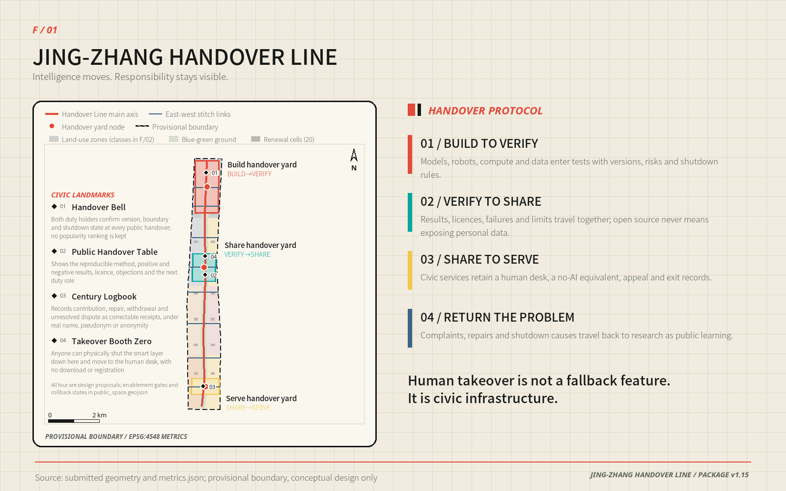
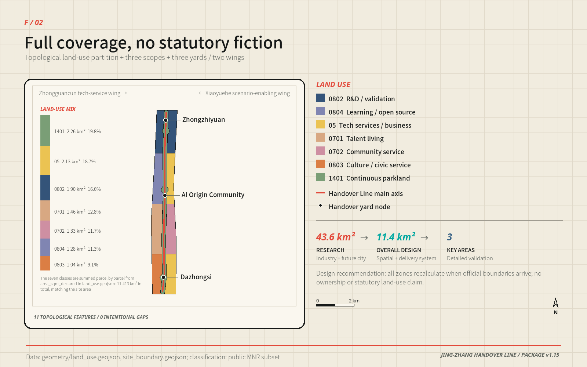
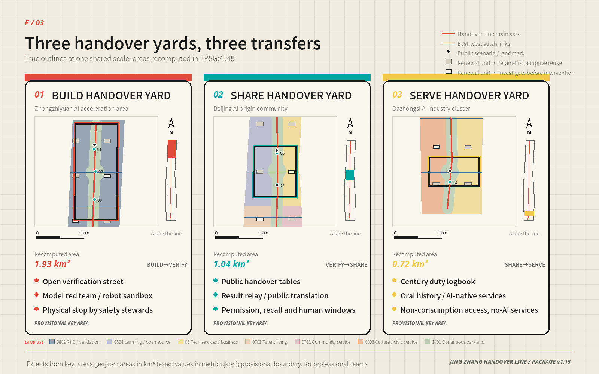
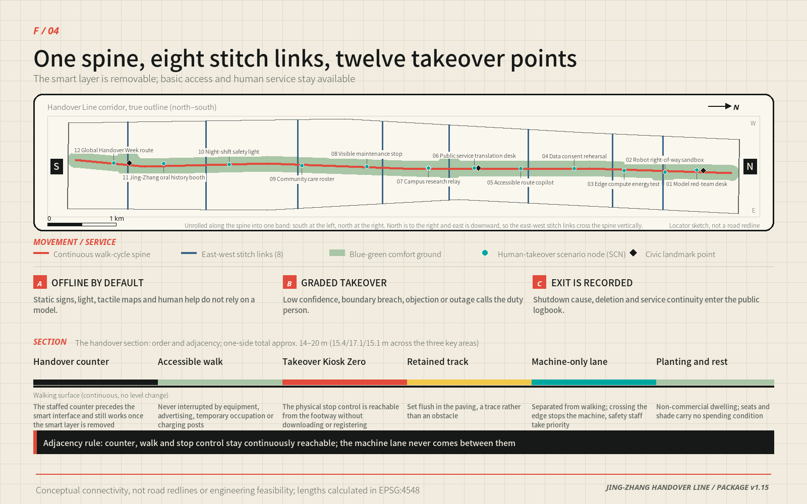

# JING-ZHANG HANDOVER LINE

> Intelligence moves. Responsibility stays visible.

The proposal translates a durable railway practice—shift handover—into a civic protocol for the AI era. Research hands a capability to validation; validation hands it to an open community; the community hands a service to residents. When the system is uncertain, offline, outside its boundary or challenged by a person, control must move back to an accountable human. “One line, three yards, two support wings and twelve reversible scenarios” is therefore both a spatial structure and a public-duty structure.

## Design Basis and Source List

The official call, agent taskbook and repository site package define the assignment. The package supplies schemas, enums, a source registry, provisional geometry and validators, while explicitly recording missing official boundaries, regulatory controls, ownership, roads, utilities, fire-safety, heritage and complete existing-building data. This submission keeps facts, inference and design separate: public facts are registered in sources.json; provisional polygons retain official_boundary=false; new geometry is labelled design_proposal. The authoritative entries are [source:OFFICIAL-ANNOUNCEMENT], [source:AGENT-TASKBOOK], [source:SITE-PACKAGE], [source:SOURCE-REGISTRY] and [source:PROCESSED-FACT-PACK].

Calculations use [source:BOUNDARY-SOURCE] and [source:KEY-AREA-SOURCE], represented by [data:geometry/site_boundary.geojson#SITE-001] and [data:geometry/key_areas.geojson#PROV-KEY-001]. They support concept generation, comparison and review, not statutory redlines or precise official areas. Exchange coordinates use EPSG:4326 and measurements use EPSG:4548. The design responds to [standard:PROJECT-OFFICIAL-ANNOUNCEMENT], [standard:PROJECT-AGENT-OPEN-CALL-TASKBOOK], [standard:MOHURD-URBAN-DESIGN-MEASURES], [standard:MOHURD-CONTROL-DETAILED-PLANNING], [standard:MNR-LAND-USE-CLASSIFICATION-GUIDE] and the disclosed data gap in [standard:MOHURD-ARCH-DESIGN-DEPTH-2016]. Existing-condition limits are recorded under [depth:existing_conditions_diagnosis].

## Three-Level Scope Framework

The three scopes form one evidence chain. The coordinated research area asks how Haidian could build a globally connected ecosystem around open collaboration and trustworthy validation. The overall design area turns those mechanisms into land use, renewal, movement, blue-green space, civic facilities and implementation gates. Three key areas then test whether a real place can combine programme, building, access, public space, AI governance and delivery conditions. This cascade is governed by [depth:three_level_scope_framework] and [depth:overall_spatial_structure].

The provisional overall polygon measures 11,412,825.386 square metres [metric:site_area_sqm], and three provisional key areas are represented [metric:key_area_count]. North, centre and south host Build→Verify, Verify→Share and Share→Serve. A technology-services wing provides legal, IP, talent, standards and finance navigation; a scenario-enablement wing provides civic, environmental and everyday-life tests. Feedback, maintenance and shutdown records travel north again so the system learns from the city rather than merely deploying into it.

## Coordinated Research Area: Industry and Future City Research

The official call and the agent taskbook already fix the belt's three positions, five functions and "three areas, two wings" structure. This proposal does not invent a competing vocabulary; it translates each official term into an identifiable spatial carrier, an operable mechanism and a checkable evidence entry. "Handover Line" is the spatial name of that translation, not a replacement for the official positioning.

| Official position / function | Spatial and operational carrier | Evidence entry |
| --- | --- | --- |
| Position · Centennial Jing-Zhang Culture Belt | The Century Logbook, oral-history booth and the Tsinghuayuan Railway Station cultural anchor as one continuous record sequence | [data:geometry/public_space.geojson#SCN-11], A-HERITAGE-001 |
| Position · Urban AI Life Experience Belt | Twelve reversible scenarios on a continuous public handover ground | [metric:scenario_node_count], [metric:public_space_ratio] |
| Position · AI Integrated Innovation Belt | Eight shared stacks interfacing across the three areas in a build–verify–share–serve–feedback loop | [depth:overall_spatial_structure] |
| Function · Full-stack self-reliant AI system | Zhongzhiyuan Build→Verify Yard: red-team desk, robot right-of-way sandbox, edge-compute energy station | [data:geometry/key_areas.geojson#PROV-KEY-001] |
| Function · World-class AI innovation ecosystem | AI Origin Community Verify→Share Yard plus the Zhongguancun technology-services wing | [data:geometry/key_areas.geojson#PROV-KEY-002] |
| Function · AI+ scenario empowerment paradigm | Four controlled validation sandboxes and eight civic scenarios under one launch–review–exit rule | [metric:industry_validation_scenario_count] |
| Function · Intelligent, vibrant AI city | Xiaoyuehe scenario-enablement wing carrying civic, environmental and everyday-life tests | [depth:blue_green_public_space] |
| Function · Global voice in AI governance | Public duty logbook, four ledgers and Global Handover Week as a reviewable governance record | [depth:risk_missing_data] |

Within that framing, the three working lines are a public validation corridor for trustworthy AI, a human-takeover demonstrator for AI-native urban life, and a shared memory field joining centennial engineering culture with open-source culture; the five actions are build, verify, share, serve and review. The logo combines two rails, a baton and a signal bracket: coal black is auditable duty, signal red is the stop threshold, electric cyan is an open interface, and bone white is a readable public record.

Regional innovation synergy is stated at four levels rather than inside the belt alone. Within the belt, "three areas, two wings" organises the research, validation and service loop. Within the city, the proposal connects to the "two zones and one belt" industrial framework named in the official call, matching Zhongguancun Science City's technology supply to the belt's validation, open-sharing and scenario demand. At the municipal level, Future Science City, Huairou Science City and Beijing Economic-Technological Development Area form an original-research / engineering-validation / scale-delivery division of labour, in which this belt is the public-validation and governance-rule output end rather than a duplicate pilot-production base. At the regional level, compute, energy and scenario cooperation interfaces are reserved along the Jing-Zhang direction toward Zhangjiakou and other Beijing-Tianjin-Hebei nodes. Haidian's "1+X+1" industrial system is defined by the competent authorities; this proposal only supplies spatial interfaces and validation tools on its "AI+" side. All synergy is expressed as interfaces, rules and reviewable records — never as boundary changes, quota transfers, investment arrangements or commitments already made by any party.

Six global references contribute mechanisms, not copied form or performance claims, and each row states the institutional condition that does not transfer. Comparability is limited by A-CASES-001 and every translation is governed by [depth:overall_spatial_structure].

| Case | Mechanism | Translation here | Condition that does not transfer |
| --- | --- | --- | --- |
| JTC LaunchPad @ one-north [source:CASE-ONE-NORTH] | Testbed, incubation and ground-floor display on one site | Public validation street and visitable ground floor in the Build→Verify Yard | Single master developer and estate leasing regime |
| Smart Kalasatama [source:CASE-KALASATAMA] | Agile, resident-centred pilots that can be evaluated and stopped | Exit conditions and a no-AI equivalent in all twelve scenarios | City scale, welfare system and participation tradition |
| STATION F [source:CASE-STATION-F] | One shared service platform across many programmes | Eight shared stacks instead of an invented company list | Single-building private operator |
| 22@ Barcelona [source:CASE-22BARCELONA] | Economic transition aligned with housing, public space and governance | Three-layer renewal: operate first, convert last | Statutory land conversion and development-right transfer tools |
| Kendall Square K2C2 [source:CASE-KENDALL] | Land use, transport, urban design and action in one study | Nine geometry layers, metrics and depth matrix generated from one model | Zoning code and community review procedure |
| Knowledge Quarter London [source:CASE-KNOWLEDGE-QUARTER] | Consortium knowledge exchange with public access | Public Handover Table and Global Handover Week as common ground | Voluntary institutional alliance and existing cultural density |

Eight shared stacks replace an invented company list: land, space, industry, finance navigation, talent, compute, data and scenarios. Each stack has an interface, access conditions and a responsible operator. Residents should see not just an AI output but who owns the duty, how the system stops and where an appeal goes.

## Overall Design Area: Urban Renewal and Regulatory-Plan-Level Urban Design

The overall design area runs north to the Fifth Ring Road, east toward Xueyuan Road and Xitucheng Road, south to Xizhimenwai Street, and west toward Dazhongsi East Road and Heqing Road. The Jing-Zhang Rail Heritage Park is the only continuous public carrier crossing it, and this proposal treats it as the skeleton of the vitality belt rather than as background greenery: the Handover Line coincides with the park's north-south and east-west active-mobility system, eight stitch links tie in campuses, parks, communities and transit directions, and three yards raise the corridor from a landscape route to a public mechanism that carries build, verify and serve duties. The park's north end, south end and the section crossing the Fifth Ring Road are the three break points that need dedicated treatment; only connection intent and interface principles are given here, never a bridge, tunnel or engineering conclusion.

The structure is therefore a "skeleton–stitch–handover" system rather than a zoning drawing: the line carries responsibility, the links form a removable network, and the yards are where the operating mechanism changes. The topological land-use model has eleven features [metric:land_use_zone_count] and fully covers the provisional site in [data:geometry/land_use.geojson#LU-001]. Northern research land supports build and verification; mixed education, service, residential and community uses support the central open-source district; culture and service uses support the southern civic interface. The mix is not a collage: each segment should hold work, life, social and learning scenarios at once, which is how a walkable balance between jobs, housing and services is tested. Campus, park and neighbourhood integration is proposed first where a yard meets a stitch link, because that is where a coordinated delivery model is most likely to hold. This is a design proposition under [depth:land_use_layout], not an existing cadastral or statutory plan.

Renewal follows “inventory first, temporary use second, fixed work last.” Twenty building typology cells [metric:renewal_cell_count] in [data:geometry/buildings.geojson#BLDG-001] have a combined conceptual footprint of 221,014.099 square metres [metric:building_footprint_area_sqm]. They compare open R&D courts, validation workshops, shared service stacks and community collaboration rooms; they do not represent the existing building stock, demolition decisions or approved floor area.

FAR and maximum building height remain unknown [metric:floor_area_ratio] [metric:maximum_building_height_m]. Under [depth:development_intensity_controls], official controls, heritage requirements, transport capacity and utility data must enter the model before any intensity plan is produced.

## Detailed Design of Key Areas

All three polygons are provisional, represented by [data:geometry/key_areas.geojson#PROV-KEY-001], [data:geometry/key_areas.geojson#PROV-KEY-002] and [data:geometry/key_areas.geojson#PROV-KEY-003]. The work is directional and subject to [depth:three_key_area_detailed_design].

### Zhongzhiyuan AI Acceleration Area: Build→Verify Yard

The northern yard proposes a public validation street, two groups of shared test courts and a low-impact green edge toward the Qing River. Model red teaming, robot right-of-way tests and edge-compute energy tests display version, risk, duty person and shutdown method; logistics and controlled operations enter from inside the estate while visitors enter from the Handover Line, separated by a transparent but impassable safety interface. Because the area carries standard-setting and safety-governance work, buildings, green space and water are designed under one interface rule: the riverside section becomes an "explainable green space" that posts water quality, runoff, shade and equipment energy on fixed signage and on paper, so green space itself becomes a validation ground rather than decoration. Qing River engineering culture is shown through riverside record plates and the duty logbook without altering the channel. Improvements toward the Fifth Ring Road are stated as needs and priorities only; sections, ramps, crossings and feasibility must be judged by transport and municipal professionals against official data [depth:traffic_rail_slow_parking].

### Beijing AI Origin Community: Verify→Share Yard

The central yard groups a public handover table, campus research relay, translation desk, accessible-route copilot and community collaboration rooms around walkable open-source and living space. Ground floors stay continuous but graded at night; planting, shared living rooms and closable porches sit between research activity and quiet residential edges. Moving research into the city needs two walkable stages: an incubation stage next to campus gates and institute entrances, and a translation stage along the Handover Line that opens to the neighbourhood. Stations toward Wudaokou and Qinghua East Road West Entrance are the start of those two stages; integration there is not about adding retail floor area but about completing the "arrive – recognise – ask for help – enter public space" interface and repairing walking and cycling breaks between campuses and parks. Low-impact incremental renewal means validating demand with time-sharing and temporary use rights before discussing ownership and conversion. Open source is not unconditional disclosure: code, models, datasets and space use each carry their own licence, withdrawal path and safety review.

### Dazhongsi AI Industry Cluster: Share→Serve Yard

The southern yard hands capability to daily civic service. The Dazhongsi station direction, the commercial blocks and the south end of the Jing-Zhang Rail Heritage Park form a walkable sequence through the civic handover hall, Century Logbook and oral-history booth. Agent, smart-terminal and content-consumption businesses share one precondition — comparable, refusable, exitable — so AI-native commerce cannot require facial recognition or a mandatory app, and non-commercial access remains available. Data-element and digital-asset circulation is discussed only under consent, withdrawal and audit; the proposal does not design the trading rules themselves. The four quadrants at the Dazhongsi station intersection are currently car-dominated and are treated as the condition on which the southern segment depends: the quadrants need a continuous, visible, step-free walking relationship, with an arrival interface and a human help point in each. Bicycle parking follows "close to entrances, never occupying the continuous walking surface, recoverable and relocatable" rather than trading order for railings. Rail interchange, the exact quadrant connection, treatment of existing buildings and landmark height all require official transport, ownership, fire-safety and heritage data before professional development.

## AI Innovation Ecosystem, Personas, and AI+ Scenarios

Seven personas anchor the system. Each is bound to a spatial carrier, a scenario and an aggregate measure; none becomes a commercial tracking profile, and no persona is used to allocate resources or rank an individual.

| Persona | Core need | Spatial carrier | Scenarios | Measure (aggregate, non-identifying) |
| --- | --- | --- | --- | --- |
| Developers | Reproducible tests and contribution records | Public validation street, Public Handover Table | SCN-01, SCN-07 | Contribution entries, reproduction success rate |
| Start-up teams | Low-cost trials, compliance and compute access | Shared test courts, shared service stacks | SCN-02, SCN-03 | Trial queue time, access availability |
| Industry maintainers | Visible faults, versions and duty | Visible maintenance stop, Century Logbook | SCN-08 | Ticket closure rate, mean takeover time |
| Students and researchers | Clear translation and licensing boundaries | Campus research relay, open release hall | SCN-07 | Licence completeness, withdrawal response time |
| Residents and older people | Equal service without a smart device | Human desks, community collaboration rooms | SCN-06, SCN-09 | No-AI equivalent coverage |
| Disabled and temporarily impaired people | Verified continuous accessible routes | Accessible-route copilot, tactile maps | SCN-05 | Route verification pass rate, break repair time |
| International visitors | Multilingual explanation and human help | Public translation desk, Manual Override Pavilion | SCN-06, SCN-12 | Human-help response time, paper multilingual coverage |

Twelve nodes [metric:scenario_node_count] are encoded from [data:geometry/public_space.geojson#SCN-01], including four controlled industry-validation scenarios [metric:industry_validation_scenario_count]. Every row states the minimum data, the duty owner, manual takeover, the no-AI equivalent and the exit condition. The shared rule is that loss of connection, a scope breach, a risk threshold or any person's objection stops the smart function immediately while the basic service continues on the duty logbook.

| ID | Scenario and location | Users and minimum data | Human handover, no-AI equivalent and exit condition |
| --- | --- | --- | --- |
| SCN-01 | Model red-team desk; Zhongzhiyuan | Model teams; test samples, version and risk items only | Signed human review, paper risk log; exit on unresolved major risk |
| SCN-02 | Robot right-of-way sandbox; Zhongzhiyuan | Robot teams and safety staff; tracks inside a closed segment | Physical stop by safety staff, manual closed testing; exit on breach or outage |
| SCN-03 | Edge-compute energy station; Zhongzhiyuan | Operators; independent meter and task load | Manual shutdown, offline metering; exit on temperature or energy threshold |
| SCN-04 | Data-consent rehearsal; north-central edge | Data product teams and the public; voluntary consent records | Paper consent, immediate deletion window; exit if withdrawal is impossible |
| SCN-05 | Accessible-route copilot; Origin Community | People with reduced mobility; user-entered route barriers | Tactile map, human direction; exit if a route is unverified or broken |
| SCN-06 | Public translation desk; Origin Community | Residents and international visitors; text entered on site | Human desk, multilingual paper; hand over on low confidence or any rights decision |
| SCN-07 | Campus research relay; Origin Community | Students, staff, developers; author-cleared metadata | Human curation, open catalogue; withdraw if licence or safety review is unclear |
| SCN-08 | Visible maintenance stop; central segment | Facility maintainers and residents; anonymous faults, ticket status | Phone and paper reporting, human dispatch; hand over on auto-dispatch conflict |
| SCN-09 | Community care roster; living segment | Older people, carers, community staff; minimal roster data | Staff telephone roster; refusing algorithmic allocation does not reduce service |
| SCN-10 | Night-shift safety light; south-central segment | Night pedestrians and maintainers; device status, no facial capture | Fixed lighting, human patrol; revert to constant light on sensing anomaly |
| SCN-11 | Jing-Zhang oral-history booth; Dazhongsi | Residents, visitors, researchers; cleared archive index | Human guide and paper catalogue; show index only when provenance is uncertain |
| SCN-12 | Global Handover Week route; whole belt | Developers, public, international visitors; booking and anonymous counts | Fixed signage, volunteers; suspend interaction on crowding or safety risk |

Four ledgers govern operation: a data ledger says what is and is not used; a duty ledger names the owner and on-site person; a takeover ledger sets thresholds and response time; an exit ledger records shutdown, deletion and service continuity. A system goes offline when it loses connection, breaches scope, crosses a risk threshold or is challenged by a person. The basic service continues.

## Land Use, Building Scale, and Retain-Renovate-Demolish Strategy

Land-use codes follow the public subset: 1401 parkland, 0802 research, 0804 education, 0803 culture, 0702 community service, 0701 residential and 05 commercial service. Their union covers the site without intentional overlap or gap. The continuous green class is both a land-use zone and the climate-comfort foundation of the line. This is a recalculable urban-design structure, not evidence of ownership or permission.

Buildings follow four decisions: retain, adapt, reversible insertion and investigate. “Investigate” is not demolition; it holds a decision until survey, structural safety, ownership, fire, heritage and stakeholder work is complete. The approach satisfies [depth:retain_renovate_demolish]. Character guidance under [depth:height_massing_character] prioritises visible and accessible ground floors, courtyards and passages that break down large blocks, maintainable roofs, quiet residential edges and low-impact reversible work near heritage. Numerical height, setbacks and scale await official controls.

## Transport, Rail, Municipal Infrastructure, and Public Services

The active-mobility spine measures approximately 9,499.778 metres [metric:handover_spine_length_m]. With eight stitch links [metric:cross_link_count], the conceptual movement network totals 18,855.117 metres [metric:conceptual_movement_length_m] in [data:geometry/roads.geojson#ROAD-001]. These lines mark connectivity intent only. Transit integration, crossings, sections, parking, fire access and logistics require professional data and modelling under [depth:traffic_rail_slow_parking].

Municipal design follows “ordinary service first, smart layer removable.” Lighting, drainage, power, communications, fire safety, accessibility and a human desk precede sensors and models. Edge compute is separately metered; digital signs retain static text and tactile versions. Distributed energy and edge compute join conventional power, heat and communication systems under one rule — metered on site, published on site, stoppable on site: roofs and structures reserve space for distributed generation and storage, waste heat is used nearby first, and energy and temperature data are published through SCN-03. Whether and at what scale any of this connects must be determined by the energy and utility authorities against real capacity. The empty [data:geometry/constraints.geojson#CONSTRAINTS-DATA-GAP] honestly records that public utility and statutory constraint geometry is unavailable. No capacity, investment or connection date is promised. This fulfils [depth:municipal_new_infrastructure].

Supporting facilities along the line follow "continuous walking first, static traffic off the public surface": car and bicycle parking sit near entrances without cutting the walking surface; sports and informal exchange facilities reuse under-bridge, residual and low-efficiency space as bookable public time slots; display and technology-testing functions concentrate along the public validation street instead of spreading into residential edges. Facility scale, provision standards and parking ratios must follow official regulatory plans and transport assessment; only layout principles and priorities are proposed here.

## Blue-Green Network, Public Space, and Urban Character

The concept contains 2,264,695.802 square metres of green space [metric:green_space_area_sqm], a 0.198434 ratio [metric:green_ratio], and 1,039,257.211 square metres of public handover ground [metric:public_space_area_sqm], a 0.091060 ratio [metric:public_space_ratio]. Geometry is in [data:geometry/green_space.geojson#GREEN-01] and [data:geometry/public_space.geojson#PUBLIC-01]. These are design quantities on a provisional boundary, not current net gains or statutory ratios. They test whether shade, stormwater, rest, access and public trial interfaces have enough continuous ground. The system responds to [depth:blue_green_public_space].

Four civic landmarks are useful institutions rather than isolated sculpture. The Shift Clock displays model version, scope and next human review. The Public Handover Table hosts code review, civic questions and research release. The Century Logbook places railway maintenance, developer contribution and service review in one record. Manual Override Pavilions provide a physical stop, human help, paper map and accessible service. Honour goes to maintainers, vulnerability reporters, public-code contributors and people who improve accessibility—not to capital or attention.

Urban character uses a "railway maintenance ledger" vocabulary: coal-black structure, signal-red thresholds, electric-cyan interfaces, bone-white record surfaces, with wayfinding organised by station number, shift, version, duty person and update time. Cultural and artistic assets are joined without being occupied: the Tsinghuayuan Railway Station direction acts as the historic origin of the northern segment, presented through platform-scale record devices, paper archives and an oral-history interface, with no intervention proposed on the protected fabric itself and all conservation measures deferred to the heritage authority [depth:risk_missing_data]; the Beijing Film Academy direction along Xitucheng Road is treated as an interface for filmed records, public screening and shared narrative — a collaboration possibility, not a settled arrangement. The Qing River and Xiaoyuehe anchor public life in the northern and central segments, prioritising shade, places to sit and continuous walking, with removable and maintainable waterside elements. For areas with renewal potential, character control is expressed as checkable guidance rather than fixed numbers: height and intensity await the official regulatory plan; massing is controlled through courtyards, passages and interface segmentation; roof form follows "equipment integration first, a readable fifth façade, no large reflective or glare surfaces" and reserves space for distributed energy and stormwater elements. All of this is urban-design advice, subject to statutory approval [depth:height_massing_character].

## Renewal Projects, Implementation Policy, and Phasing

Twelve minimum projects begin with reversible public value: basic shade and wayfinding, red-team desk, robot sandbox, energy test, public handover table, research relay, accessible copilot, visible maintenance stop, civic handover hall, Century Logbook, oral-history booth and Handover Week route. Every project needs an owner, licence, maintenance budget, exit plan, deletion method and continuity arrangement. The project-list depth is recorded by [depth:renewal_project_list].

Three conditional phases [metric:phase_count] are represented in [data:geometry/phasing.geojson#PHASE-001]. Phase 1 returns to a trustworthy baseline through official data, inventory and low-risk human-led pilots. Phase 2 opens the central handover yard only after ownership and community review. Phase 3 considers belt-wide operation only after transport, utilities, heritage, privacy and safety tests. Dates do not trigger delivery automatically; evidence does. This is the core of [depth:phasing_implementation].

Four annual shifts support long-term operation: Open Shift in spring, Maintainers’ Night in summer, Global Handover Week in autumn and Annual Review Shift in winter. The attraction path is visit, problem match, controlled trial, public evaluation and local partnership; no subsidy, procurement, investment or government commitment is claimed.

## Metrics, Area Recalculation, and Compliance Matrix

Metrics make the design challengeable. Areas and lengths derive from EPSG:4548 geometry, while counts derive from feature properties. Known values include site, green and public-space areas and ratios, building typology footprint, spine and network length, stitch links, scenarios, validation tests, key areas, renewal cells, land-use features and phases. Every item records formula, source file, confidence and assumptions in metrics.json. This follows [depth:metrics_recalculation].

| Metric | Value and reading | Evidence |
| --- | --- | --- |
| Provisional site area | 11,412,825.386 m²; recalculate once official boundaries arrive | [metric:site_area_sqm] |
| Conceptual green space | 2,264,695.802 m²; structural green, not a current net gain | [metric:green_space_area_sqm] |
| Conceptual green ratio | 0.198434; supports shade, stormwater and continuous walking | [metric:green_ratio] |
| Public handover ground | 1,039,257.211 m²; continuous corridor plus three yards | [metric:public_space_area_sqm] |
| Public space ratio | 0.091060; guarantees non-commercial use and human service | [metric:public_space_ratio] |
| Building typology footprint | 221,014.099 m²; twenty conceptual cells only | [metric:building_footprint_area_sqm] |
| Handover Line length | 9,499.778 m; continuous active-mobility and accountability spine | [metric:handover_spine_length_m] |
| Conceptual movement length | 18,855.117 m; includes eight east-west stitch links | [metric:conceptual_movement_length_m] |
| East-west stitch links | 8; pending transport and engineering verification | [metric:cross_link_count] |
| AI scenario nodes | 12; all with human takeover and a no-AI equivalent | [metric:scenario_node_count] |
| Industry validation scenarios | 4; controlled sandboxes only | [metric:industry_validation_scenario_count] |
| Key areas | 3; all provisional boundaries | [metric:key_area_count] |
| Renewal typology cells | 20; not an inventory of existing buildings | [metric:renewal_cell_count] |
| Land-use features | 11; topological union covers the site | [metric:land_use_zone_count] |
| Conceptual phases | 3; condition-triggered, not automatic | [metric:phase_count] |

The official call also asks for a planning indicator system covering an AI innovation index, talent density and output scale. This proposal supplies definitions rather than values: before official statistics, ownership and enterprise data exist, any number would be unverifiable false precision. The table below fixes the calculation basis, the data precondition and the trigger for assignment; once official data arrives the same model assigns all of them at once, under the same recalculation rules as the geometric metrics.

| Planning indicator | Definition | Data precondition | Status |
| --- | --- | --- | --- |
| AI innovation index | Weighted from publicly verifiable sub-items: public code contributions, reproducible validation records, scenario exit and repair records, open interface count | Public contribution ledger and scenario operation records for the belt | [metric:ai_innovation_index] unassigned |
| Talent density | AI-related workforce and students per unit of employment land | Official employment, enrolment and land ownership data | [metric:talent_density] unassigned |
| Output scale | Annual output of AI and "AI+" industries within the statistical scope | Statistical scope definition and enterprise register | [metric:output_scale] unassigned |
| Renewed building scale | Total planned floor area after renewal within the area | Existing building survey, regulatory plan and permit data | [metric:renewed_building_scale_sqm] unassigned |
| AI enterprise clustering target | Target count of AI enterprises and research institutions | Competent authority target and enterprise register | [metric:ai_enterprise_target_count] unassigned |

These five sit with FAR and building height in the same class: defined but unassigned. That is not an omission — it returns the act of assignment to the bodies that hold the official data, while guaranteeing that once the data exists the figures can be recomputed and challenged by the same method. compliance_matrix.json covers official clauses and agent.1–6, standard_matrix.json covers six standards, and design_depth_matrix.json covers all fifteen required professional-depth items.

## Risk, Copyright, and Compliance

The central risk is confusing provisional data and concept work with an official decision. Boundary replacement requires full recalculation; missing controls prohibit invented intensity; connection lines cannot become road or bridge claims; heritage, utilities, building safety and ownership require prior professional review. These dependencies are governed by [depth:risk_missing_data].

Privacy uses data minimisation, voluntary participation, purpose limitation, withdrawal, limited retention and human appeal. Secret maps, non-public tables, unauthorised personal data, mandatory facial recognition and unreviewable rights decisions are excluded. People without a smartphone, non-Chinese speakers, disabled people, older people and anyone who declines AI retain equivalent basic service.

All figures, diagrams, visual identity, text, geometry and PDFs are original for this submission or programmatically derived from cleared repository data. External cases are paraphrased without copying photographs, maps, trademarks or protected layouts. The proposal is an open co-design recommendation; it does not replace planning, architecture, transport, landscape, municipal, heritage, legal, privacy or engineering services, and makes no claim of government approval, funding, procurement or delivery.

## References

The baseline references inside the public source index are brief/public-brief.md, which states the public brief for this open call, and brief/README.md, which states how repository material may be used and where its public boundary lies. Beyond those, repository references include design_brief.json, agent_taskbook.json, allowed_design_space.json, sources.json, provisional_boundaries.geojson, planning_limits.json, standards.json, source_registry.json, agent_fact_pack.md, all schemas and enums, and the repository validators. Detailed provenance sits in sources.json; assumptions and recalculation triggers sit in assumptions.json; generation and rights are stated in report/copyright_statement.md.

The external mechanism set comprises official or institutional material from JTC LaunchPad, Forum Virium Helsinki, STATION F, Ajuntament de Barcelona 22@, City of Cambridge K2C2 and Knowledge Quarter London, retrieved on 2026-08-08. They are comparative references only. The primary evidence remains the Chinese proposal, nine geometry files, metrics, matrices, offline visual review desk and bilingual drawing sets.
