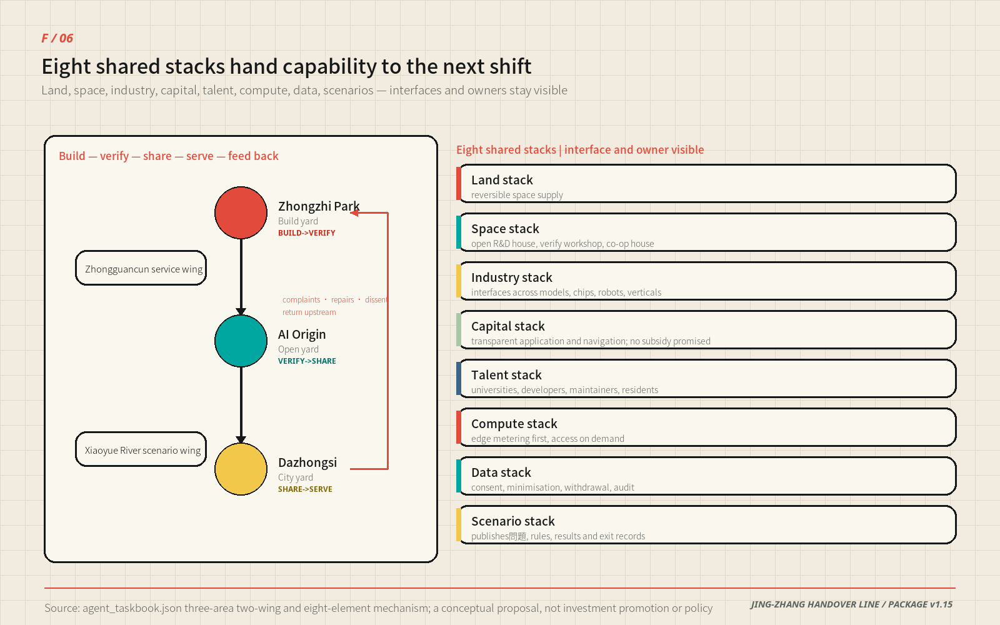

# JING-ZHANG HANDOVER LINE

## Move Good AI into the City Faster, Give Every Handover a Return Path

One line moves AI from the laboratory into daily life. At every stop, someone can receive it, return it and explain it.

Picture an ordinary weekday afternoon. Someone is queuing at a service point near Dazhongsi, and beside the counter hangs a board: who is on duty today, which version of the service is running, and which button returns the matter to a person. They need not know which model sits behind it, and need not install anything — they only need to see that this shift has someone answerable for it. **That is what this proposal sets out to build in the city: not a cleverer service, but a signature on every handover.**

The Jing-Zhang Railway left more than an alignment. It left a discipline of shift handover: the outgoing shift must state what it is handing over, the incoming shift must decide independently whether to accept it, and unresolved work may not disappear between the two. This proposal translates that discipline into a spatial protocol for civic AI. BUILD hands a capability to VERIFY; VERIFY hands reproducible results to SHARE; SHARE hands a service to the city; complaints, repairs, failures and shutdown reasons then travel back to BUILD. Capability may move faster, while responsibility always retains a signatory and a return ticket.

A task remaining possible without AI is still the public-service floor, but it is no longer the entire story. The positive value of the Handover Line is that useful technology can find a test space, a responsibility interface, a civic carrier and a reusable record more quickly. When conditions change, it can also leave without damaging the basic service. The mechanism therefore advances innovation speed and public trust together [source:AGENT-TASKBOOK] [standard:PROJECT-AGENT-OPEN-CALL-TASKBOOK].

This iteration completes one implementation proof that remains under participant control. Twelve synthetic scenarios were replayed through an offline state machine: smart layer off, injected exception, receiver refusal, human takeover, deletion of temporary synthetic records, and return to basic service. All 12/12 tasks and 48/48 assertions passed. The result proves that the protocol can be executed and audited; it is not presented as field safety, a public trial or launch approval. Field rehearsal remains 0/12 [metric:simulation_task_count] [metric:simulation_success_rate] [metric:field_rehearsal_task_count].

> **How to read this figure.** Read it in three moves. First, 12/12 and 48/48 show what was actually completed. Next, the six component groups, six organisation types and S-class cost formula show how the first authorised field pilot can be assembled. Finally, “field 0/12” prevents a digital rehearsal from being mistaken for built or operational evidence. The two lines at the foot of the figure are a **division of responsibility**: the teal line is what this round has delivered and can be re-checked; the red line lists four items — field safety, measured accessibility, public acceptance and competent-authority approval — that **belong to the field stage**, with their owners, entry conditions and trigger points set out in the section on the four things implementability is judged on, and are carried by the professional procedure that follows authorisation.

| Review question | Handover Line response | Current evidence state |
| --- | --- | --- |
| Is the concept distinctive? | Railway dual-control handover becomes a BUILD→VERIFY→SHARE→SERVE→RETURN urban AI protocol | Space, roles, scenarios and rollback share one numbering system |
| Is the space explicit? | One line, three Handover Yards, two support wings, eight east-west stitch links and twenty renewal-type cells | GeoJSON and five core figures are locatable and recomputable |
| Is it implementable? | Begin with one movable Public Handover Table, then the three yards, and only later discuss a belt-wide network | Digital tabletop complete; first field pilot awaits authority |
| How is "faster" delivered? | Trustworthy → less repetition → faster: the receiving side reproduces rather than retests; the exit plan exists before launch, so the approver's exposure is computable | The chain is fixed in "Where 'faster' actually happens"; two time metrics are unvalued, with protocols shipped in the package |
| How does public interest enter? | Staffed counters, a continuous step-free walk, fixed wayfinding, paper and telephone channels precede the smart layer | Every scenario states its human service and post-exit spatial use |
| Are claim boundaries honest? | All spatial moves are concepts; provisional geometry is not an official redline; fieldwork, prices and appointments remain subject to due process | Itemised in `assumptions.json` and the risk chapter |

### Three Reading Paths: 60 Seconds, 5 Minutes, Deep Read

This proposal is long. So that readers with different time budgets can still reach a complete judgement, three non-overlapping paths follow — **each is self-contained, and finishing any one of them answers "what does this propose, and how far does the evidence go".**

| Path | What to read | What it lets you answer |
| --- | --- | --- |
| **60 seconds** | The one-sentence claim above this section, figure F/05, and the three lines of figures below | What this proposal builds, how far it has got, and that it has not entered the field |
| **5 minutes** | Three-level scope framework → the five-functions table → the three Handover Yards → the twelve scenario cards → the first-year verification plan | Spatial structure, division of responsibility, the scenario list, and how it is measured |
| **Deep read** | Read in order of contents while checking against `compliance_matrix.json`, `metrics.json` and `sources.json` item by item | Where the evidence for each claim sits, how it is recomputed, and what would invalidate it |

**The three lines of figures for the 60-second path:** offline tabletop tasks **12/12** passed; takeover assertions **48/48** passed; field tasks **0/12**, carried by the post-authorisation professional process. **These three lines appear together in the figures, in both offline pages and in `simulation.json` — the same numbers in all four places.**

## Three Legacies of One Railway: Alignment, Level Crossing, and Shift Handover

The previous section treats "handover" as the core mechanism of this proposal; this section states where it comes from, so that a metaphor is not mistaken for evidence. The facts below are public and verifiable. The proposal extracts transferable practice from them and infers no statutory conclusion.

| Date | Public fact | Source |
| --- | --- | --- |
| 1905—1909 | Zhan Tianyou became chief engineer of the Jing-Zhang Railway in May 1905 and the line opened on 2 October 1909, the first state trunk line surveyed, designed, built, and managed entirely by China; a "herringbone" reversing alignment on the hillside beside Qinglongqiao station bought height by lengthening the run | [source:SRC-JINGZHANG-1909] |
| 1910／1960 | Qinghuayuan Station opened as the first stop north of Xizhimen; in 1960 the section shifted about 800 m east for campus expansion and the old building was put to other uses; it was later restored and retained during the heritage-park works | [source:SRC-QINGHUAYUAN-STATION] [source:SRC-HERITAGE-PARK-P1] |
| 1952—1954 | The faculty reorganisation created eight institutes — aeronautics, geology, mining, forestry, medicine, iron and steel, petroleum, agricultural machinery — on a university district running north from Jimen Bridge to Qinghua East Road; Xueyuan Road opened at the end of 1954 and gave the "Eight Institutes" their name | [source:SRC-BAXUEYUAN-1952] |
| 2019-12-30 | The Beijing–Zhangjiakou high-speed railway opened: 174 km long, maximum design speed 350 km/h, and the world's first automatic driving of a Fuxing intelligent EMU at 350 km/h | [source:SRC-JINGZHANG-HSR-2019] |
| 2023-06 | Phase 1 of the Jing-Zhang Railway Heritage Park was completed between Qinghua East Road and Zhichun Road: 2.5 km long, 16.8 ha, reusing old rails, switches and locomotive elements along the line and retaining the restored Qinghuayuan station building | [source:SRC-HERITAGE-PARK-P1] |

For a century this corridor has been asked the same question: does speed yield to gradient, or the other way round. In 1909 the answer was the switchback; in 2019 it was 350 km/h. AI does not change the question. It only changes what the "gradient" is made of — the continuity, reachability, and exitability of public service.

Three legacies can therefore be inherited. Each maps to one concrete action in this proposal, and each carries an inference that explicitly does not follow.

| Legacy | What this proposal inherits | What does not follow |
| --- | --- | --- |
| Alignment | The spine follows the disused alignment, so "continuous and step-free" is an opening condition rather than a favour | Not a measured gradient compliance result; longitudinal survey still required |
| Level crossing | Eight east–west branches stitch the two sides at historic crossing positions; the railway-crossing etymology of "Wudaokou" coexists with the Wudao Temple account, and this proposal settles neither | No alignment, tenure, or boundary is inferred from a place name |
| Shift handover | Dual-signature handover: release and receipt are two independent judgements, and unfinished items may not disappear at the change of shift | Not an operating authorisation or a safety certification |

The two timelines meet at Qinghua East Road: the northern end of heritage park Phase 1 and the northern edge of the "Eight Institutes" university district are the same street. The railway left a north–south line; the university district left an east–west population. The one spine and eight branches of this proposal follow those two existing pieces of city structure instead of drawing a new net over them.

The heritage park is the only continuous public carrier these three legacies have today. The Handover Line does not start a second green corridor; it upgrades the park's existing north–south continuity and east–west connections into a public mechanism that also carries research, verification, and city-service handovers. Implementation boundaries, heritage control lines, and tenure remain with the competent authorities, and this proposal draws no engineering conclusion on them [depth:blue_green_public_space].

## Design Basis and Source List

The proposal is based on the open-call announcement, the Agent taskbook, the repository site package, the public source registry and local snapshots of professional references. The announcement sets an approximately 43.6 km² coordinated research area, an approximately 11.4 km² overall design area and three key areas. The taskbook requires three positionings, five functions, three areas and two wings, six Agent tasks and long-term operation. These materials define the assignment and output depth; news graphics, commercial maps, OSM and generated images are never used to infer statutory redlines [source:OFFICIAL-ANNOUNCEMENT] [source:SITE-PACKAGE] [source:SOURCE-REGISTRY].

The repository still lacks exact official polygons, approved regulatory plans, ownership, surveyed buildings, road redlines, municipal capacity, fire constraints, heritage controls and a complete ecological baseline. Submitted geometry is therefore either an explicitly labelled provisional constraint or a design proposal. It supports generation, comparison and self-checking only. Decimal areas come from projection algorithms and do not imply statutory precision. When official material arrives, the nine geometry layers, metrics, paired figures, four PDFs and both narratives must be recalculated together. **The gap itself is kept as a register, not merely as a statement**: the `features` array in `geometry/constraints.geojson` stays empty because the organiser's own validator requires it — `validate_empty_constraints_declaration` states that inventing constraint geometry is worse than leaving the set empty until citable official or cleared geometry exists — while the file's top-level `data_gap` records each of eight missing layers as "which layer is absent → which metrics it blocks → what triggers recomputation". **Every one of the 14 unvalued metrics can be traced in that register to the reason it still has no value** [source:BOUNDARY-SOURCE] [data:geometry/site_boundary.geojson#SITE-001] [depth:existing_conditions_diagnosis].

The evidence is separated into four roles rather than blended into one bibliography:

| Evidence layer | What it can answer | What it cannot answer |
| --- | --- | --- |
| Task authority | Scope, mandatory tasks and output boundaries | Official redlines or approved controls |
| Professional references | Methods for urban design, land-use classification, accessibility and service review | Project-specific approval opinions |
| Background cases and statistics | Industry, talent and operating questions; mechanism comparison | Recruitment targets, investment amounts or surveyed existing conditions |
| Submitted geometry and rehearsal | Internal spatial relationships, state transitions and rollback logic | Built status, authority or field performance |

Regulatory-plan depth, urban design and land-use expression respond respectively to [standard:MOHURD-CONTROL-DETAILED-PLANNING], [standard:MOHURD-URBAN-DESIGN-MEASURES] and [standard:MNR-LAND-USE-CLASSIFICATION-GUIDE]. Policies for generative AI, accessibility and older people define the service boundary. Requiring an equivalent non-AI path for every service is a higher standard chosen by this proposal; it is not misrepresented as a universal legal obligation.

All graphics, layouts, text, geometry deductions and offline rehearsals were produced by the disclosed participants and agents. External cases are paraphrased only for public mechanisms; no photographs, maps, trademarks or third-party diagrams are reused. Font, PDF and media rights are set out as a checkable table in the "Risk, Copyright, and Compliance" section, with the full registration in `sources.json` and `report/copyright_statement.md`. Claude Opus 5 produced this revision, Codex (GPT-5) produced the earlier score-edition rewrite, Sonike submits it, and human and professional teams retain final judgement.

## Three-Level Scope Framework

Each scope does a different job. The 43.6 km² coordinated research area establishes industry, talent, scenario and regional interfaces. The approximately 11.4 km² overall design area turns those interfaces into a continuous civic-space and responsibility network. The three key areas turn “who hands what to whom, where it is tested, and where it returns after failure” into spatial prototypes that professional teams can deepen [source:OFFICIAL-ANNOUNCEMENT] [depth:three_level_scope_framework] [assumption:A-BOUNDARY-001].

The submitted overall boundary recomputes to approximately 11.413 km² and remains a provisional model quantity. The spatial framework is not the boundary colour field. It is a 9.50 km north-south handover spine, eight east-west stitch links, three Handover Yards and four civic landmarks. The east-west links reconnect universities, parks, communities and transit to the spine. The spine moves a capability from building to service and returns problems to research [metric:site_area_sqm] [metric:handover_spine_length_m] [metric:cross_link_count].

The three key areas use one protocol but carry different duties. Zhongzhiyuan is the Build Handover Yard for BUILD→VERIFY. Beijing AI Origin Community is the Share Handover Yard for VERIFY→SHARE. Dazhongsi is the Serve Handover Yard for SHARE→SERVE. They are not three similar technology parks; they are three non-interchangeable functions in one innovation chain [data:geometry/key_areas.geojson#PROV-KEY-001] [metric:key_area_count]. Recomputed in EPSG:4548 their areas are **1.93, 1.04 and 0.72 km²**, about 3.69 km² in total — the same order as the roughly 368.4 ha given in the announcement. The three figures come straight out of `key_areas.geojson`, so anyone with the same geometry obtains the same numbers; they remain model quantities of provisional geometry, not statutory areas.

> **How to read this figure.** The dashed outline is a provisional range, not the protagonist; the red north-south line carries responsibility handover and the blue cross-links stitch everyday city life back to it. Three coloured yards place building, sharing and civic service in distinct duty positions. Four diamond landmarks make contribution, shutdown, maintenance and human takeover visible in public space.

## Coordinated Research Area: Industry and Future City Research

The Handover Line is not another approval wall. It is a shorter and more trustworthy route for good technology to become urban. Conventional innovation chains often break between laboratory output and city use: a product lacks a controlled place to be tested, a service operator cannot identify which version it received, and failed experience does not return to research. The proposal fills this gap with four explicit handovers. BUILD brings version, risk and shutdown procedures to VERIFY. VERIFY passes positive and negative results with limits of applicability to SHARE. SHARE passes licence, maintenance and recall rules to SERVE. SERVE returns complaints, repairs and exit causes to BUILD.

The taskbook’s three positionings therefore sit on one timeline. The Centennial Jing-Zhang Cultural Belt preserves the intergenerational memory of independent construction and responsible handover. The Metropolitan AI Life Experience Belt lets ordinary people understand, try, refuse and appeal. The AI Integrated Innovation Belt provides validation, open collaboration and industrial translation. The five functions are not five parallel slogans: each lands on one segment of the handover chain, with one spatial carrier and one boundary this proposal does not claim [source:AGENT-TASKBOOK] [standard:PROJECT-AGENT-OPEN-CALL-TASKBOOK].

| The taskbook's five functions | Position on the handover chain | Spatial carrier | What this proposal does not claim |
| --- | --- | --- | --- |
| Full-stack independent AI innovation system | BUILD: development enters validation carrying version, risk and shutdown method | Zhongzhiyuan AI Independent Innovation Acceleration Area (Build Yard) | No judgement on technical routes; no supplier or architecture is specified |
| World-class AI innovation ecosystem | VERIFY→SHARE: results, licences, failures and limits of validity published together | Beijing AI Origin Community (Share Yard) | No fabricated company lists, investment figures or output values |
| New paradigm of AI+ scenario empowerment | SHARE→SERVE: twelve scenarios, each with minimum data and a human takeover path | Twelve scenario nodes plus the Xiaoyue River scenario wing | A test scenario is never written as approved operation |
| Intelligent and vibrant AI city | SERVE: civic service keeps a staffed counter and a no-AI equivalent route | Dazhongsi AI Industry Cluster (Serve Yard) plus the continuous public handover ground | Device counts and automation rates are not used as vitality indicators |
| Global voice in AI governance | RETURN: dual signatures, exit records and the annual ledger can be taken and recomputed by others | Century Logbook, annual handover ledger, bilingual protocol templates | No standard is issued on anyone's behalf; no governance conclusion is claimed as adopted |

The division between three areas and two wings reads from the same table: the three yards complete the three signings on the handover chain, forming the **three-area two-wing collaboration loop** — problems enter through the wings, pass three signings among the three areas, and the wings carry the method back out. The Zhongguancun technology-service wing carries what the taskbook calls **global allocation of resources, Zhongguancun IP and capital empowerment**, which here becomes applicable interfaces for universities, standards, legal advice, compute, talent and capital. The Xiaoyue River scenario wing carries **AI scenario empowerment and the intelligent, vibrant AI city**, which here becomes a supply of authorised city problems and public space. The wings support only; they never make the receiving decision for a yard. The taskbook states the belt's goal as **a global AI industrial highland and place of pilgrimage**: this proposal reads "highland" as good technology reaching the street faster here, and "pilgrimage" as anyone being able to come and watch one real handover happen — not to view a set of uncheckable promotional figures.

Industrial goals must land on a checkable order of magnitude rather than on phrases such as "build a highland". The Haidian District 2025 statistical bulletin gives these public figures: 123 filed and launched large models, 92 national key laboratories in the district, 57,900 technology contracts registered during the year with a total value of 405.31 billion yuan, and a year-end permanent population of 3.111 million [source:HAIDIAN-2025-STATISTICAL-BULLETIN]. Their statistical scope is the whole district, far larger than this belt's 43.6 km², so they are used only to converge the problem — they show that this corridor faces real services already inside the filing and safety-assessment process, not an abstract notion of models. They are not used to manufacture target values for this proposal, and not one of them enters `metrics.json`.

### Where "faster" actually happens: three acceleration points, one causal chain and two unvalued metrics

The title promises "faster", so it must say which segment gets faster and give a quantity capable of refuting it. **One admission first: this proposal is full of gates, and gates slow things down.** Acceleration does not happen at the gate; it happens in the rework the gate removes. That causal chain has to be written out, or "faster" is only an adjective.

| Acceleration point | Where the conventional path is slow | The step the Handover Line removes | Checked by which metric |
| --- | --- | --- | --- |
| One less repeated validation | The receiving side does not trust the handing side's tests and runs them again from scratch | Dual signature requires the handing side to release reproducible minimum evidence with the capability; the receiving side reproduces it rather than retesting | Rework rounds [metric:handover_rework_rounds] |
| One less "nobody dares approve" | The approver cannot estimate the cost of failure, so approval is refused or suspended indefinitely | Exit precedes launch: the state a failure returns to is written in advance, so the approver's exposure becomes computable | Time to service [metric:handover_to_service_days] |
| One less search from zero | Every team hunts separately for test space, a liability interface and a compliance entry, spending the same time over again | The eight shared interfaces turn those three into a standing, applicable supply that does not depend on any particular actor showing up | Time to service [metric:handover_to_service_days] |

**There is exactly one causal chain, and it is fixed here: trustworthy → less repetition → faster.** Not "fewer steps therefore faster" — this proposal plainly has more steps; but "each step's result can be taken on trust by the next, therefore nothing is redone". The chain has an explicit way of breaking: **if the receiving side still redoes the validation the handing side already performed, the chain is broken and the claim of "faster" is refuted** — `handover_rework_rounds` exists precisely to observe that.

Both metrics carry status `unknown` in `metrics.json`, each with a complete measurement protocol; **this proposal sets no target value**, and the baseline must come from real handover ledgers after authorisation. No figure is given because a "30% shorter" without a baseline is worse than no figure at all [metric:handover_to_service_days] [metric:handover_rework_rounds] [assumption:A-BASELINE-001].

### Six international cases: transfer mechanisms, not forms

| Case | Transferable mechanism | Translation on the Handover Line | Explicitly not transferred |
| --- | --- | --- | --- |
| JTC LaunchPad @ one-north | Startup space and industry services sit close enough to reduce friction between tests and partnerships | Shared service stacks next to validation workshops [source:CASE-ONE-NORTH] | Its land-lease regime and rent structure |
| Smart Kalasatama | Resident time and everyday problems calibrate technology | Public-value review in the Serve Handover Yard [source:CASE-KALASATAMA] | Its resident incentive scheme and personal-data consent model |
| STATION F | Large entrepreneurial communities require stable civic services and partner interfaces | Result relay and service desks in the Share Yard [source:CASE-STATION-F] | Its single-owner investment scale and membership pricing |
| 22@ Barcelona | Industry renewal and neighbourhood public space advance together | Twenty renewal cells and a continuous public handover ground [source:CASE-22BARCELONA] | Its floor-area bonus and title-exchange instruments |
| Kendall Square K2C2 | Research clusters need walkable cross-district links and civic interfaces | Eight east-west stitch links [source:CASE-KENDALL] | Its zoning procedure and transfer of development rights |
| Knowledge Quarter London | Dense institutions collaborate around shared questions rather than one enclosed campus | Five regional exchange interfaces [source:CASE-KNOWLEDGE-QUARTER] | Its membership legal structure and cost-sharing rules |

Regional synergy does not fabricate partnerships; it exchanges reusable methods. Beiwei Community may contribute authorised community-service questions. Future Science City and Huairou Science City may exchange methods for translating and measuring research outputs. Beijing E-Town may return engineering retest questions. Beijing-Tianjin-Hebei nodes may compare cross-regional service interfaces. The Handover Line exports protocols, rehearsal templates and failure records, not unverified “success”; it receives questions without promising data sharing, procurement or joint operation [assumption:A-CASES-001].

| Interface named by the taskbook | What the line can export | What it can receive | Refusal condition |
| --- | --- | --- | --- |
| Beiwei Community | Human-takeover and accessible-service templates | Authorised community questions | Resident participation or data boundary unconfirmed |
| Future Science City | Urban validation problem sheets | Testing needs from common technologies | Research result presented as deployable product |
| Huairou Science City | Public translation methods for scientific results | Measurement and calibration advice | Any non-public research or facility data involved |
| Beijing E-Town | Engineering problem sheets from controlled scenarios | Manufacturing-condition retest needs | Enterprise, order or production-line relationship unclear |
| Beijing-Tianjin-Hebei nodes | Bilingual protocols and annual failure summaries | Cross-city service comparison questions | Responsible party, permission or scope unclear |

Regional collaboration most often stops at "contact established". The table below compresses it to the smallest deliverable unit: the first exchangeable output for each counterpart, which type of organisation carries it, what format the evidence takes, what causes refusal, and how often it is reviewed. **Until the first output has happened, the interface is recorded as not started; a meeting, a letter of intent or a name list does not substitute for it.**

| Counterpart | First exchangeable output (minimum unit) | Responsible organisation type | Evidence format | Refusal condition | Review cycle |
| --- | --- | --- | --- | --- | --- |
| Beiwei Community | One authorised community-service problem sheet | Community service + public service operations | Problem-sheet JSON (submitting role, scope of authorisation, data boundary) | Resident participation or data boundary unconfirmed | Quarterly |
| Future Science City | One urban validation problem sheet and its receipt | University transfer + independent review | Problem sheet and receipt JSON, with separate positive and negative result fields | Research result presented as deployable product | Half-yearly |
| Huairou Science City | One public-translation method note | Science communication + culture venue | Method note in Markdown plus one public talk record | Any non-public research or facility data involved | Half-yearly |
| Beijing E-Town | One controlled-scenario engineering problem sheet | Test safety + facility maintenance | Problem-sheet JSON plus independent meter readings | Enterprise, order or production-line relationship unclear | Quarterly |
| Beijing-Tianjin-Hebei nodes | One bilingual protocol summary and annual failure summary | Public service operations + independent review | Bilingual Markdown plus a public logbook entry | Responsible party, permission or scope unclear | Annually |

The main name is "Jing-Zhang Handover Line" and the English name is "JING-ZHANG HANDOVER LINE" — not a separate coinage but a direct translation, so both languages point at the same thing. **The naming system is unified by one verb, handover**: three handover yards, the Handover Bell, the Public Handover Table, the dual-signature handover ledger, Global Handover Week, the annual handover ledger. Any new element must be nameable with that verb; if it cannot be, it does not belong on this line. The visual identity and logo direction follow from it: the mark combines two rails, a baton and signal brackets. Coal black means auditable duty, signal red means a stop threshold decided by a person, electric cyan means an open interface, and duty yellow means service reaching daily life. The system extends to wayfinding, protocol cards, logbooks, event publications and the Public Handover Table without requiring a screen.

### When the Three Positionings Collide in One Place, Which Gives Way

The taskbook's three positionings are compatible in most places, but on a given site they push against each other. **The table below fixes the collision cases and gives the priority rule — the rule comes before the case, and nothing is left to "depending on circumstances".**

| Collision | Which gives way | Priority rule | Basis |
| --- | --- | --- | --- |
| Heritage elements of the cultural belt × test facilities of the innovation belt | **The innovation belt gives way** | Anything added inside heritage scope must be reversible and removable; no irreversible method may enter, even if it is cheaper or faster | Exit exists before opening; `assumptions.json#A-HERITAGE-001` |
| Public passage of the living-experience belt × controlled enclosure of the innovation belt | **The innovation belt gives way** | Enclosure may only happen at the end of a stitch link or on a separate parcel, and **may not cut the continuous passage of the north-south spine**; the machine lane may not come between staffed counter, walkway and stop entrance | The adjacency rule on F/04; rule R2, human floor first |
| Character requirements of the cultural belt × accessibility works of the living-experience belt | **Character gives way to reach** | No mandatory accessibility item may be dropped for the sake of character; the method follows heritage procedure but the result must be reachable, and a stretch that cannot be altered stays closed rather than opening in a degraded form | The HV-05 test; the vacancy prohibition of the public space management post |
| All three positionings × operational efficiency | **Efficiency gives way to the basic layer** | No efficiency arrangement may let the basic layer degrade; an unstaffed period closes the smart layer rather than letting it stand in | Rules R2 and R3; `prohibition_when_unstaffed` in `role-spec.json` |

**All four rules point the same way: the side that gives way is always the thing that can be done later, and the side that does not is always the thing that cannot be recovered once lost** — the irreversibility of heritage, the continuity of passage, the floor of reachability, the existence of basic service. All four are observable: the basis column of each row points at a reviewable decision inside the package [assumption:A-HERITAGE-001] [depth:three_level_scope_framework]。

### Taskbook Cross-Reference: One Entry Point per Requirement

The taskbook's requirements are spread across three positionings, five functions, three areas with two wings, and six agent tasks, so a reader ends up hunting back and forth. The table below gives **one entry point per requirement**: one section, one figure number, one place in a structured file. **No requirement is given two entry points**, so the table is both an index and a check against duplicated expression.

| Taskbook requirement | Single entry point in the text | Figure | Structured-file entry |
| --- | --- | --- | --- |
| Positioning · Centennial Jing-Zhang cultural belt | Three Legacies a Railway Left Behind | F/01 | `sources.json#SRC-JINGZHANG-1909` |
| Positioning · Urban AI living-experience belt | AI innovation ecosystem, personas and AI+ scenarios | F/04 | `geometry/public_space.geojson#SCN-01…12` |
| Positioning · AI convergence innovation belt | Industry and future-city research in the study scope | JZ/03 | `compliance_matrix.json#agent.2` |
| Function · Full-stack self-reliant AI innovation system | Five-functions table, row 1 | F/03 | `geometry/key_areas.geojson#PROV-KEY-001` |
| Function · World-class AI innovation ecosystem | Five-functions table, row 2 | JZ/06 | `geometry/key_areas.geojson#PROV-KEY-002` |
| Function · New paradigm of AI+ scenario enablement | Five-functions table, row 3 | JZ/08 | Twelve scenarios in `simulation.json` |
| Function · Intelligent and vibrant AI city | Five-functions table, row 4 | JZ/09 | `geometry/key_areas.geojson#PROV-KEY-003` |
| Function · Global voice in AI governance | International communication built on reviewable records | JZ/05 | `visual/assets/governance/shift-ledger.schema.json` |
| Area · Zhongzhiyuan | Zhongzhiyuan: Build Handover Yard | JZ/07 | `geometry/key_areas.geojson#PROV-KEY-001` |
| Area · Beijing AI Origin Community | Beijing AI Origin Community: Share Handover Yard | JZ/07 | `geometry/key_areas.geojson#PROV-KEY-002` |
| Area · Dazhongsi | Dazhongsi: City Handover Yard | JZ/07 | `geometry/key_areas.geojson#PROV-KEY-003` |
| Wing · Zhongguancun technology-service wing | The three-areas-two-wings loop passage | JZ/03 | `compliance_matrix.json#agent.1` |
| Wing · Xiaoyue River scenario-enablement wing | The three-areas-two-wings loop passage | JZ/03 | `compliance_matrix.json#agent.3` |
| agent.1 Overall concept and function coordination | Three-level scope framework | F/01 | `compliance_matrix.json#agent.1` |
| agent.2 Full-stack system and innovation ecosystem | AI innovation ecosystem, personas and AI+ scenarios | JZ/06 | `compliance_matrix.json#agent.2` |
| agent.3 Scenario enablement and vibrant city | The twelve scenario cards table | JZ/08 | `compliance_matrix.json#agent.3` |
| agent.4 Civic space, new formats and pilgrimage landmarks | Blue-green space, civic space and urban character | F/04 | `geometry/public_space.geojson` |
| agent.5 Cultural convergence narrative | Three Legacies a Railway Left Behind | F/01 | `sources.json#SRC-DAZHONGSI-BELL` |
| agent.6 Event system and long-term operation | Long-term operation, annual events and international communication | JZ/13 | `compliance_matrix.json#agent.6` |

**The same table also exists in machine-readable form, and it checks itself.** `taskbook_entry_map` in `compliance_matrix.json` expands the nineteen rows above into bilingual seven-tuples — requirement, text entry, figure, structured entry, **spatial object**, **metric** and **failure condition** — and verifies three things when it is generated, with the outcome written into `uniqueness_check`: **0 duplicate requirement names, 0 duplicate entry quadruples, 0 entries pointing at a metric that does not exist, verdict pass**. The failure-condition column is what separates this map from an ordinary index: for each requirement it states **the observation that would show the requirement has not actually been met**, for instance "a scenario card without a post-exit use is still opened" or "an interface has no first exchangeable output and stops at intent".

**This table can be refuted on the spot.** All three entry points on any row open directly: the section is in the contents, the figure number is printed at the top left of the figure, and the structured-file location can be searched with a text tool. If any row's entry point does not open, or what it opens is unrelated to that requirement, that row is wrong [depth:three_level_scope_framework] [assumption:A-CASES-001].

## Nine New Things This Proposal Puts Forward, Each Against Conventional Practice

Originality should not be claimed with adjectives. Each row below states **what it is**, **how it differs from conventional practice**, and **which file in the package holds it** — the middle column is the evidence of originality.

| Mechanism | What it is | Difference from conventional practice | Carrier |
| --- | --- | --- | --- |
| Four-step handover loop | Build → verify → open source → serve → **back to build** | Conventional smart-city delivery is one-way; the fourth step sends complaints, repairs, objections and shutdown reasons back to the development end | [data:geometry/phasing.geojson#PHASE-001] |
| Dual-signature handover ledger | Release and receipt are **two independent judgements**; the releasing party cannot sign for the receiving party | Conventional acceptance is a single signature; here the receiver must independently reproduce minimum evidence before accepting or refusing, and open items may not vanish at the change of shift | `visual/assets/governance/shift-ledger.schema.json` |
| The no-AI equivalence test | For any AI service, the same thing can be accomplished without AI | Conventional metrics — device counts, automation rates — cannot be checked by an ordinary person; this test can be checked by anyone, once | The human-path column of the twelve scenario cards |
| Intelligent-layer switch | The offline page lets a reader **switch the intelligent layer off on the spot**, turning all twelve cards to their no-AI face | Conventional proposals leave accessibility in prose, so readers must confirm it across chapters; as a switch, any missing item is visible at once | `visual/index.html` |
| Three handover yards | Build, share and serve yards matching the three stages of capability flow | Conventional zoning is named by function (R&D zone, commercial zone); here zones are named by **the stage of responsibility handover** | [data:geometry/key_areas.geojson#PROV-KEY-001] |
| Eight shared interfaces | Resources become **interface plus rule plus checkable record**; whoever meets the rule may connect | Conventional industry plans list companies, so the whole scheme collapses if they do not come; interface supply depends on no particular actor | The AI ecosystem, personas and AI+ scenarios section of this proposal |
| Conditional phase gates | Phasing is a **set of conditions**, not a timetable; failing one rolls back to the last usable state | Conventional phasing promises years; this promises what must be satisfied before the next phase may begin | [metric:phase_count] |
| Fault-injection self-check | Faults are injected against each protocol rule: **84 synthetic faults, all 84 intercepted, none missed (author's own test, not independent verification)** | Conventional proposals only declare rules; here the rules are run against faults the authors built for them | `visual/assets/governance/rule-check-report.json` |
| Tactile corridor map | Print-ready vector artwork legible without relying on colour | Conventional accessibility stops at "accessible facilities are provided"; here a plate-ready file is delivered, with dimensions left to code and manufacturer | `assets/tactile/tactile-corridor-map.svg` |

**None of the nine is a slogan: each has a file in the package, and each states when it fails.** The handover protocol may not be enabled without a named human owner; the dual-signature ledger keeps the intelligent layer off while an item is open; the no-AI equivalence test blocks any service where it does not hold; and a conditional phase gate rolls back when its conditions are unmet. **If a mechanism cannot say when it does not hold, it is not yet a mechanism.**

### The Three Core Claims Among the Nine: Difference, Falsification Condition, and First Field Test

The nine entries above are not equal. Three of them are this proposal's genuine original claims; the other six are how those three unfold in space, operation and expression. The table below covers only the three, and for each gives **the closest existing practice, the key difference, what would refute it, and how the first field session would test it**.

| Core claim | Closest existing practice | Key difference | Falsification condition | First field test |
| --- | --- | --- | --- | --- |
| **Dual-control shift ledger**: release and intake are two independent sign-offs | Construction handover sheets; release approval and rollback in MLOps | Existing practice merges release and intake into one approving signature; here two different roles each sign once, the intake role must independently reproduce the minimum evidence before signing, and open items do not disappear with a signature | If one person signing both sides is still accepted, or an open item disappears after handover, the claim is refuted | Ten handovers at the P0 table, three of them deliberately signed on both sides by one person and two deliberately carrying an open item, observing whether they are refused |
| **The non-AI equivalent is a precondition for opening, not a degraded mode** | Alternative channels required by accessibility law; parallel online and counter public services | Existing practice treats the staffed channel as a fallback; here "a non-AI equivalent route exists" is a **precondition for opening** the smart layer, and failing any of the four acceptance parts keeps it closed | If a scenario opens while its non-AI equivalent has not passed, or completion stays below the agreed line with the layer off while the service keeps running, the claim is refuted | HV-03 paired observation: one round each with the smart layer on and off, on the same day and in the same hours |
| **Exit is a design object and must exist before opening** | Demolition clauses for temporary structures; end-of-pilot evaluation | Existing practice handles exit when a project ends; here **the use of the space after exit must be writable before opening**, and a scenario that cannot state it may not open; an exit record missing any of its three fields is incomplete | If a scenario opens without a defined post-exit use, or a shutdown missing one of the three fields is still accepted, the claim is refuted | Strike down the P0 table the same day and check that no trace remains on the ground and all three exit fields are present |

**All three carry a falsification condition, and that is not a rhetorical device.** A claim that cannot be refuted is, in review, worth no more than an adjective; each row above names the observation that would show it wrong and how that observation is made [depth:phasing_implementation] [assumption:A-OPERATIONS-001]。

### Integrated planning, space-industry fusion, and territorial-planning innovation

**"Integrated" here does not mean binding thematic chapters together; it means different disciplines working on one recomputable data package.** A conventional integrated output is an album binding transport, municipal, green space and industry chapters, reconciled by hand. In this package the geometry, metrics, figures, drawings and three matrices are **generated from one source**, so a change in any chapter changes the number every other chapter cites, and anything that will not change surfaces immediately as a contradiction. The test of whether an integrated plan is truly integrated is therefore whether its disciplinary conclusions **can all be overturned by one recomputation** [depth:metrics_recalculation].

**Space-industry fusion lands on interfaces, not on lists.** This proposal names no companies and promises no output value. The relation between industry and space is expressed through eight shared interfaces — land slots, validation space, open-source results, compute and equipment, data, talent, funding services, and city scenarios — each stating the minimum exchangeable result, the entry condition, and the refusal condition. The reason is falsifiability: **a list expires, an interface does not.** Five years on, with a different set of companies, the interface specification can still be tested. Industry is not "placed into" a parcel; it connects through a gate that can refuse it and that it can exit. Fusion is measured by **how many can actually connect and can actually leave**, not by occupancy rate [depth:overall_spatial_structure].

**Territorial-planning innovation lands on concrete adaptive and evolvable mechanisms, not on adjectives.** AI does not add a layer of devices to the city; it changes the scale, the time slot, and the replacement speed of space. The key variable of urban form shifts from "how big do we build" to **"how often is it replaced, and does replacement hurt anyone"**. Three mechanisms answer exactly that: removable components let space evolve on a "removable first, built second" basis; conditional phase gates allow expansion only after a threshold is passed and roll back to the last usable state when it is not; exit records leave a challengeable receipt for every replacement. The credibility of a planning output therefore comes not from the certainty of its conclusions but from **who can overturn them, with what, and within how long**. All of this is method advice and does not replace statutory preparation or approval [standard:MOHURD-CONTROL-DETAILED-PLANNING].

## Overall Design Area: Urban Renewal and Regulatory-Plan-Level Urban Design

The overall structure is “one line, three yards, two wings, eight links and twenty cells”. The line is a continuous public handover ground. The yards perform three acceptance steps for building, sharing and civic service. The wings support technology and scenarios. Eight east-west links repair the separation between the long north-south strip and adjacent neighbourhoods. Twenty renewal cells distribute open research courts, validation workshops, shared service stacks and community collaboration rooms along the belt [depth:overall_spatial_structure] [data:geometry/buildings.geojson#BLDG-001] [metric:renewal_cell_count].

Renewal along the corridor has already entered statutory preparation: the draft *Block-Level Regulatory Detailed Plan for the Jing-Zhang Railway Heritage Park Corridor (Key Area of the AI Innovation Block) (2022–2035)* completed public consultation and a notice on how comments were taken up has been issued [source:SRC-HD-CORRIDOR-CTRL-PLAN]. **Its scope is not the same as the scope of this open call and the two may not be applied to each other**; this proposal cites it as background only — the authorities describe this corridor as a "key area of the AI innovation block", which runs in the same direction as this proposal — and infers no statutory control, indicator or land-use conclusion from it.

Land use is organised around the functions required by the handover chain rather than a single “AI park” field. Research and validation support BUILD→VERIFY. Education and open learning support VERIFY→SHARE. Technology services, commerce and community services support SHARE→SERVE. Continuous parkland and civic space run through all stages. Eleven topology-safe zones cover the provisional boundary without overlaps, and every shared edge comes from one partition model [data:geometry/land_use.geojson#LU-001] [metric:land_use_zone_count] [depth:land_use_layout].

Renewal changes interfaces before deciding buildings. Mature neighbourhoods, heritage traces and usable structures are retained first. Ground floors, courtyards and edges can receive low-impact repair. Test enclosures, handover tables, wayfinding and displays use removable components. Demolition is considered only when formal investigation shows that structure, fire safety, ownership and public value cannot be resolved through retention or repair. The twenty concept cells are not presented as twenty buildings awaiting demolition or construction [depth:retain_renovate_demolish] [assumption:A-BUILDING-001].

> **How to read this figure.** The left colour band gives the area and share of each of the seven land-use classes; the seven add up to 11.413 km², matching the site area. Inside the corridor every parcel carries its land-use code in print, so classes can be read without relying on colour vision. On the right, 43.6 → 11.4 → 3 shows how the three scope levels converge. The note "11 topological features / 0 intentional gaps" at the lower left states that this partition covers the site completely and is not an indicative sample.

FAR, total floor area, statutory building density, height, setbacks, road redlines and parking controls await approved plans and specialist conditions. The package only computes approximately 221,000 m² of concept building footprint to compare the relative spatial supply of four cell types. It does not infer FAR, surveyed building stock or approved new-build capacity [metric:building_footprint_area_sqm] [depth:development_intensity_controls] [assumption:A-CONTROLS-001].

## Detailed Design of Key Areas

All three key areas share one spatial order: staffed civic counter, continuous step-free walking surface, directly reachable stop entrance, retained rail trace, machine test lane separated from people, and a planted rest strip with no spending threshold. A machine-only lane may not be inserted between the staffed counter, walkway and stop entrance. This adjacency rule turns human takeover from a process chart into an urban-design relationship [depth:three_key_area_detailed_design] [standard:MOHURD-URBAN-DESIGN-MEASURES].

> **How to read this figure.** The three key areas are drawn at the same scale, so their sizes can be compared directly; the narrow strip beside each card shows where that area sits along the whole corridor. The recomputed areas 1.93 / 1.04 / 0.72 km² come from the EPSG:4548 projection and carry the same decimals as `metrics.json`. The three lines under each card are the public-facing interfaces of that Handover Yard, not a construction list.

**The three key areas are not three similar parks — their shapes already say different things.** Every one of the seven rows below is recomputed directly in EPSG:4548 from `geometry/key_areas.geojson`, `geometry/roads.geojson` and `geometry/public_space.geojson`; the same method returns a spine length of 9499.778 m, matching the declared value in `metrics.json` exactly, so the "length inside the area" rows can be checked with the same ruler.

| Recomputed item | Zhongzhiyuan (Build) | Origin Community (Share) | Dazhongsi (Serve) |
| --- | --- | --- | --- |
| Area | 1.93 km² | 1.04 km² | 0.72 km² |
| Bounding size (E-W × N-S) | 954 × 2061 m | 948 × 1117 m | 1116 × 657 m |
| **N-S ÷ E-W** | **2.16 (long north-south strip)** | **1.18 (near square)** | **0.59 (wide east-west band)** |
| Spine length inside the area | 1999 m (21.0% of the whole) | 1110 m (11.7%) | 651 m (6.8%) |
| Stitch links entering | 2 (links 7, 8) | 1 (link 5) | 1 (link 1) |
| Scenario nodes | SCN-01/02/03, **all by appointment or time-bounded and enclosed** | SCN-06/07, **all permanent, working hours** | SCN-12, the annual event route |
| Landmarks and renewal cells | LANDMARK-01 Handover Bell; 5 cells | LANDMARK-02 Public Handover Table, LANDMARK-04 Takeover Booth Zero; 2 cells | LANDMARK-03 Century Logbook; 2 cells |

**Those three ratios invert monotonically: 2.16 → 1.18 → 0.59.** This is no accident of drafting; it is what the three stages of responsibility each demand of the city — **the closer a capability comes to ordinary life, the more the corridor should yield to the cross-city interface**. The north is the corridor's own ground: the narrowest, longest shape, 21% of the spine, and all three scenarios requiring physical enclosure. By the south the spine is down to 6.8% and the shape inverts for the first time to wider than it is long — **where service finally meets daily life, this line steps out of the leading role on purpose**. The middle is the turning point: near square, and holding the two most public-facing of the four landmarks inside 1.04 km².

One more figure shows that "one line" is not a rhetorical flourish: of the spine's 9499.778 m, **only 3760 m (39.6%) falls inside the three key areas; the remaining 5739 m is connective tissue between them**. Most of this line belongs to no key area at all — the proposal does not number three plots, it treats the 60% between them as a design object too [metric:handover_spine_length_m] [data:geometry/key_areas.geojson#PROV-KEY-001] [depth:three_key_area_detailed_design].

### Zhongzhiyuan: Build Handover Yard / BUILD→VERIFY

Zhongzhiyuan AI Independent Innovation Acceleration Area conducts controlled validation before models, robots, edge compute and data tools enter the city. A public validation street links open research courts, enclosed test yards, independent review rooms and a failure-sample wall. Robot right-of-way tests remain inside closable time windows and physical separation, with an independent stop held by the safety steward. Edge compute receives independent metering and thermal management before continuous operation is discussed. The builder must hand over version, sample boundary, risk, energy and shutdown method together; the verifier may refuse.

**The shape decides how the shared section deforms here.** Within a 954 × 2061 m north-south strip the six-part sequence is unchanged, but the machine test lane reaches its widest anywhere on the line, and **stays entirely on the east side of the spine rather than crossing to the west** — all three scenarios here are by appointment or time-bounded and enclosed, and only by keeping them on one side can the collision rule hold that "enclosure may occur only at a link end or on a separate plot and may never cut the continuous north-south passage". The ground floor therefore splits in two: **west-side ground floors open toward the spine**, giving the open research courts and independent review rooms an enterable face reached straight from the walkway; **east-side ground floors open inward to the courtyard**, holding the enclosed test yards and the failure-sample wall, leaving the spine only an observation window that can be seen through but not entered — so a passer-by can see that testing is happening without being able to walk into it. The Handover Bell, one of the four landmarks, stands in this stretch (LANDMARK-01), and its position matches its meaning: **the bell marks the moment a capability is independently accepted, so it belongs where verification happens, not where service happens.** The before-and-after fits in one line — **before, testing happened where it could not be seen; after, testing is still enclosed, but the fact that it is happening, when, and with what conclusion is visible from the spine.**

The Qinghe direction to the north holds something this yard should remember. Qinghe Station broke ground in 1905 and was completed in 1906, and Zhan Tianyou surveyed, built and accepted it. To make way for the new high-speed station, the old station building — about 700 tonnes and roughly 336 m² — was moved 84.55 m east in September 2017 and a further 274.81 m south-west in February 2019, 359.36 m in total, and now stands beside the new station, open to the public [source:SRC-QINGHE-STATION]. **A city willing to move an old station building more than three hundred metres, and to record every leg of that journey, should also be willing to wait one more test cycle for a verification.** Hence the rule of this yard: better a round slower than handing over something not yet finished.

### Beijing AI Origin Community: Share Handover Yard / VERIFY→SHARE

Beijing AI Origin Community translates technical results into open material that developers, residents and service staff can understand. The Campus Research Relay handles licence, authorship and recall. The Public Service Translation Desk preserves a staffed window and multilingual paper. The Data Consent Rehearsal uses paper and digital paths to explain authorisation, withdrawal and deletion. “Open” means results, failures, licences and limits travel together; it never means unconditional release of personal data.

**A near-square plan plus two landmarks makes this stretch a street type rather than a courtyard type.** At 948 × 1117 m, with only 11.7% of the spine inside it, public life here is not carried by corridor length but by the cross-street interface: the single stitch link 5 crosses the spine inside the area, and the two most public-facing of the four landmarks — LANDMARK-02 the Public Handover Table and LANDMARK-04 Takeover Booth Zero — both sit around that crossing. Every spatial move therefore presses down onto the ground floor: **a continuous ground floor opens to the street, and the handover table does not retreat into a lobby but stands inside the pavement setback**, so the handing-out and taking-in surfaces can be read from the street without entering any institution; the research relay racks and the multilingual paper window run along the same stretch of frontage, letting someone merely walking past watch one complete handover in a single walk. Takeover Booth Zero sits at the north mouth of that crossing because **the entrance to basic service should appear where people enter the stretch, not be buried deep inside it**. The before-and-after: **before, results sat upstairs; after, results sit on the ground floor, and whether to look is the passer-by's own decision.**

"AI Origin" is not a name this proposal invented. In January 2026 Beijing announced its first four AI innovation blocks, and Haidian's "AI Origin Community" was among them: bounded by Wangzhuang Road and Zhanchunyuan West Road to the east, Zhongguancun Street to the west, Tsinghua University to the north and the North Fourth Ring West Road to the south, radiating about 3 km² around Wudaokou, with more than 400 firms inside and close to 74% of them in artificial intelligence [source:SRC-AI-ORIGIN-BLOCK-2026]. **Siting the Share Yard here is not a preference for a location; it is that the people who most need the rule "publish results, licences, failures and limits together" are already gathered here.** Density does not produce reproducibility by itself; it only multiplies the cost of the irreproducible. The written boundary is an official description, not a statutory line, and no area is recomputed from it.

### Dazhongsi: Serve Handover Yard / SHARE→SERVE

Dazhongsi AI Industry Cluster tests whether a capability can enter ordinary life. A civic handover hall carries translation, care, maintenance and cultural services. The Century Logbook publishes launch, shutdown, complaint, repair and version-change records. Fixed wayfinding, a paper directory, human help and a physical stop entrance run along the same east-west frontage. **Of the four landmarks the one inside this area is the Century Logbook (LANDMARK-03); Takeover Booth Zero (LANDMARK-04) sits in the Origin Community in the middle stretch** — both positions can be checked point by point in `geometry/public_space.geojson` — so the human entrance here is carried by the civic handover hall itself and does not depend on that booth. When a service exits, its space returns to ordinary public use instead of retaining dedicated equipment with no maintainer.

**This is the only one of the three that is wider east-west than it is long north-south, with just 651 m of spine inside it.** That is not a defect but a consequence of its duty: the Serve Yard faces daily life, and daily life arrives sideways — people come in from the blocks on either side, from the metro mouths and from housing, not down the length of a corridor. The spatial moves therefore do not sit on the spine but on **the short stretch where the spine meets the cross-city frontage**: the civic handover hall, the repair post and the community care desk line up along that east-west face, each with its staffed window opening straight onto the street and no internal circulation to negotiate first. Here the spine drops from "the through route" to "one of the ways to arrive", surrendering the widest part of the section to the rest strip with no spending threshold and to the waiting area in front of the staffed windows — **because along this stretch, the people queuing to get something done outnumber the people passing through.** The before-and-after: **before, this was a stretch the corridor passed through; after, it is where the corridor arrives and stops.**

**AI-native new business formats land here by writing "comparable, refusable, exitable" into the consumption and business scenarios themselves.** AI-native consumption never requires face recognition or a compulsory app as a condition of entry; it uses explainable product comparison, in-person trial, human advisers and anonymous feedback. Agent services, smart terminals and content-consumption formats share one precondition: **the same thing can be done without AI.** Business space offers three interfaces — international exchange and pitching, compliance advice, and the publication of city problems. Data elements and digital assets circulate only under authorisation, revocability and auditability; **this proposal does not design the trading rules themselves and promises the introduction of no format whatsoever.** Format mix, rent and operating parties must be settled by rights holders and competent authorities through statutory procedure.

Dazhongsi was originally Juesheng Temple, built by imperial order in the eleventh year of Yongzheng (1733) and named after the Yongle Bell it houses. That bell carries Buddhist scripture cast over its body in both Chinese and Sanskrit — more than 230,000 characters in all. The temple became the Dazhongsi Ancient Bell Museum in 1985, and Juesheng Temple was listed as a national key cultural relic protection unit in 1996 [source:SRC-DAZHONGSI-BELL]. **A bell that carries 230,000 characters cast into its own body is itself a record that cannot be quietly rewritten.** The landmark that stands here, the **Century Logbook**, inherits exactly that: the record can only be appended to and corrected, never erased, and a withdrawn entry keeps its reason for withdrawal rather than vanishing from public memory. **The Handover Bell is not here** — it stands in the Build Yard to the north, because a bell marks **the moment a capability is independently accepted**, and that belongs where verification happens; what this Yongle Bell corresponds to was never a moment but **a record written full, and impossible to unwrite**. This proposal proposes no change to the heritage fabric itself, and landmark siting follows heritage and public-space procedure [assumption:A-HERITAGE-001].

### First field prototype: Public Handover Table

The first authorised step is not construction of the whole belt. It is one movable Public Handover Table in an existing ground floor or sheltered civic interface. Two independent surfaces form the table. The outgoing side displays version, risk and shutdown method. The incoming side records accept, accept with conditions or refuse. No automated merge control sits between them. Fixed wayfinding, tactile material, paper service cards and a directly reachable stop demonstrator remain beside the table. Every component can leave the same day; no permanent work, network connection or public-data collection is required.

> **How to read this figure.** Read the section left to right as one complete handover: the staffed counter comes first, the step-free walking surface stays continuous throughout, the stop entrance sits within arm's reach on the walkway, the rail trace is flush-set into the paving, the machine test lane is separated from pedestrians, and the outermost band is a rest strip with no spending threshold. The section fixes order and adjacency; dimensions are left to the site professionals.

| Prototype component | Minimum delivery | Acceptance method | Exit method |
| --- | --- | --- | --- |
| Dual-control table | Separate outgoing and incoming surfaces, version slot and refusal slot | Two role types can complete independent records; one action cannot auto-approve both | Disassemble to an ordinary table |
| Non-AI service kit | Fixed wayfinding, paper directory and human-help contact | Test task remains possible with smart layer off | Retain as ordinary basic service |
| Stop demonstrator | Physical button or mechanical sign reachable from the walk | Triggered without download or registration | Remove without leaving an interface |
| Inclusion kit | Tactile, large-print and multilingual cards; seated use position | Professional accessibility review precedes field test | Archive as a reusable kit |
| Public logbook | Version, question, acceptance decision and rollback | Positive and negative results share one record with traceable revisions | Archive on paper without personal data |
| Reversible boundary kit | Movable enclosure, floor marking and safety signs | Strike checklist confirms that circulation is fully restored | Remove all items the same day |

## AI Innovation Ecosystem, Personas, and AI+ Scenarios

The Handover Line organises the ecosystem as shared interfaces rather than a recruitment list. Each interface combines reversible space, an entry rule and a handover record. Specific companies, institutions and funding channels remain subject to later public process. If one named actor never arrives, the spatial and protocol asset can still serve another team that meets the rule.

| Shared interface | What it supplies | Spatial carrier | Entry and exit rule |
| --- | --- | --- | --- |
| Land and time | Reversible time-bound use of space | Four renewal-cell types | Apply for a time slot; restore civic use at the end |
| Validation space | Independent review, enclosed tests and metering | Validation workshops and Build Yard | Risk, version or emergency stop missing means refusal |
| Open results | Licence, authorship, failures and applicability | Share Yard | Unclear rights trigger withdrawal while the record remains |
| Compute and devices | Metered edge access | SCN-03 | Independent metering; thermal or safety threshold triggers stop |
| Data | Consent, minimisation, withdrawal and deletion | SCN-04 | No collection without authority; deletion is verified after withdrawal |
| Talent | Role specifications, credited contribution and maintenance succession | Research courts, collaboration rooms and logbook | Role comes before appointee; no staffing means no smart layer |
| Funding service | Process explanation, document navigation and professional referral | Shared service stack | No promise of subsidy, investment or assessment outcome |
| Urban scenarios | Problems, test rules, positive and negative results, exit records | Twelve scenario nodes | Publish the rule first; retain both positive and negative outcomes |

> **How to read this figure.** The inner ring is the eight shared interfaces and the outer ring is the types of actor that may connect. Arrows run both ways, because connecting and leaving must both hold; no single actor is a precondition for an interface to exist.

Talent is not compressed into one “high-end talent” category. Developers need reproducible tests and credit. Startups need affordable time slots, a compliance entrance and a space that can recover after failure. Established firms and institutes need shared standards and real questions. Maintainers need visible versions, faults and duty. Residents, older people, disabled people, children, people without smartphones and international visitors need services that do not exclude them through a technical threshold. Each persona maps to a place, scenario and aggregated public-interest check.

| Persona | Need | Space and scenario | Public-interest check |
| --- | --- | --- | --- |
| Developers and students | Reproducible, credited and recallable outputs | SCN-01, SCN-07, Public Handover Table | Complete licence and reproduction record |
| Startups and growing teams | Controlled failure, metered compute, compliance entry | SCN-02, SCN-03, validation workshop | Failure does not become a permanent spatial burden |
| Universities and institutes | Research translation, independent review, long-term collaboration | Research court and Campus Research Relay | Research result is not presented as deployment evidence |
| Operators and maintainers | Work orders, versions, shutdown rights and handover | SCN-08 and Century Logbook | Missing duty role forces smart layer off |
| Residents and older people | Staff, telephone and paper access | SCN-06 and SCN-09 | Refusing an algorithm does not reduce basic service |
| Disabled and temporarily mobility-impaired people | Continuous routes, tactile material and human directions | SCN-05 and Takeover Booth Zero | Zero severe break after professional review |
| Children and young people | Safe movement without identification or profiling | SCN-05 and SCN-10 | Personal collection about minors remains zero |
| International visitors and non-app users | Multilingual help, fixed wayfinding and volunteers | SCN-06 and SCN-12 | Route remains completable without installing an app |

The taskbook sets four countable floors, and this proposal exceeds each of them and can be counted on the spot: **at least 10 AI scenario cards — 12 given** (SCN-01…12); **at least 3 AI industrial test-and-validation scenarios — 4 given** (SCN-01 to SCN-04); **at least 5 personas — 8 given**; **at least 3 AI pilgrimage landmarks — 4 given** (LANDMARK-01…04, see the blue-green and public space section). All twelve AI scenario cards are written into the public-space layer, four of them **AI industrial test-and-validation scenarios** (SCN-01 to SCN-04 satisfy the requirement of at least three); the twelve cards and the eight personas together form the **public experience route**, so anyone may walk the public segments only, without entering any test segment. Every record contains its users, minimum data, outgoing and incoming role types, human path, stop condition and post-exit spatial use. The same rules then enter the offline rehearsal [data:geometry/public_space.geojson#SCN-01] [metric:scenario_node_count] [metric:industry_validation_scenario_count].

| ID | Scenario | Spatial carrier | Minimum data and human takeover | Responsible organisation type｜hours | Use of the space after exit | Verification method (measure｜observation; control) |
| --- | --- | --- | --- | --- | --- | --- |
| SCN-01 | Model red-team desk | Validation street, Build Yard ground floor | Test samples and risk items; human review, stopped while a major risk is open | Test safety + independent review｜booked, enclosed | Ordinary equipment bay and meeting frontage | Major-risk closure rate and dual-signature completeness｜every handover checked, recomputed by the independent review role; control: detection rate when the same test batch is reviewed by people alone |
| SCN-02 | Robot right-of-way sandbox | Enclosed sandbox segment, Build Yard | Tracks in the closed segment; safety officer stops it physically, closed on any breach | Test safety + on-site safety officer｜time-limited, not a public route | Restored to ordinary courtyard surface | Time from breach to enclosure and safety-officer stop success｜every session checked; control: human detection time without automatic breach judgement |
| SCN-03 | Edge-compute energy test station | Independently metered bay, Build Yard | Separate meter and load; manual shutdown, stopped at threshold | Energy/fire + equipment maintenance｜booked | Meter box removed, original paving restored | Time from threshold to shutdown and agreement with the independent meter｜every session checked; control: energy use at the same load without smart scheduling |
| SCN-04 | Data consent rehearsal ground | Consent desk, Share Yard | Voluntary consent records; paper consent slip and immediate deletion, exit if it cannot be revoked | Civic service + legal/licensing｜permanent, working hours | Ordinary enquiry desk and paper directory point | Time from withdrawal to completed deletion and withdrawal success rate｜every authorisation checked; control: the same two figures with the paper consent slip alone |
| SCN-05 | Step-free route co-pilot | Spine and the eight branch junctions | Obstacles users report themselves; tactile map and staffed enquiry, nothing published unreviewed | Public-space management + accessibility review｜permanent, all hours | Tactile guidance and fixed wayfinding retained | Break density (per km) and repair closure rate｜one joint walk per month, retested as soon as a break is repaired; control: the same route walked with the tactile map and staffed directions only |
| SCN-06 | Civic service translation desk | Multilingual counter, Share Yard | Text entered on site; staffed counter and multilingual paper, entitlement decisions always human | Civic service + volunteer organisation｜permanent, working hours | Staffed counter and multilingual paper retained | Task completion rate and waiting time｜weekly sample; control: the same task completed with multilingual paper and the staffed counter alone |
| SCN-07 | Campus result relay | Result relay rack, Share Yard | Authorised result metadata; human curation, withdrawn if the licence is unclear | University translation + civic service｜permanent, working hours | Open catalogue and display rack | Licence resolvability and time to take an item down｜every listing checked; control: licence-checking time under human curation alone |
| SCN-08 | Visible repair post | Repair post, Serve Yard | Anonymous repair reports and ticket state; telephone and paper reporting, handover on conflict | Facility maintenance + community service｜permanent, all hours | Telephone and paper repair point retained | Ticket closure rate and first response time｜every ticket checked; control: the same two figures with telephone and paper reporting alone |
| SCN-09 | Community care rostering desk | Community care desk, Serve Yard | Minimised roster data; staff roster by telephone, refusing the algorithm changes nothing | Community care + subdistrict service｜permanent, working hours | Ordinary office and reception desk | Roster conflict rate and the completion gap for people who decline the algorithm｜every roster cycle checked; control: telephone rostering alone |
| SCN-10 | Night-shift safety light | Lighting pole positions along the spine | Device state, no faces; fixed lighting and patrol, back to steady light on anomaly | Municipal lighting + patrol｜permanent, night | Base lighting retained, smart module detached | Success in returning to steady light and time to detect a fault｜every night checked; control: fixed lighting and staffed patrol alone |
| SCN-11 | Jing-Zhang oral-history kiosk | Oral-history pavilion, Serve Yard | Cleared collection index; human guiding and paper catalogue, index only when provenance is unclear | Cultural venue + volunteer organisation｜weekends and festivals | Pavilion retained as a paper directory point | Provenance resolvability and how often index-only display triggers｜every enquiry checked; control: paper catalogue and staffed narration alone |
| SCN-12 | Global Handover Week route | Whole-line route and the three yards | Bookings and anonymous footfall; fixed wayfinding and volunteers, paused when crowded | Event safety + cultural operation｜annual event week | Fixed wayfinding retained, the rest removed | Time to trigger the crowding pause and share of takeovers by stewards｜hourly during the event; control: fixed wayfinding and volunteers alone |

This table is also the **scenario–space–operation mapping** the taskbook requires: responsible parties are given as organisation types, never named bodies, and actual parties await public procedure. **A scenario may be enabled only once the "use after exit" cell for it already holds.** Four of the twelve are industrial test-and-validation scenarios (SCN-01 to SCN-04) and the other eight are city-service scenarios; the Xiaoyue River scenario wing supplies the authorised city problems and public space among them, and the Zhongguancun technology-service wing supplies legal, standards, compute and talent interfaces [metric:industry_validation_scenario_count].

Five vertical "AI+" interfaces are added inside the overall design area: software toolchain collaboration handles code and build logs only; medical Q&A explains procedure and never diagnoses; educational support explains method and never grades; legal advice organises a request and never rules on rights; daily-life services help with forms and bookings and never build cross-matter profiles. Any conclusion touching diagnosis, judgement, grading, eligibility or personal entitlement must go to a qualified person.

## Land Use, Building Scale, and Retain-Renovate-Demolish Strategy

On the same stretch of street, someone runs a test inside the validation workshop during the day while someone from the block above comes down for groceries in the evening — land use has to hold both, not show one of them out. Land use follows the published classification: 0701 residential, 0702 community service, 0802 research, 0803 culture, 0804 education, 09 commercial service and 1401 park green. Within the submitted model they cover the provisional overall area and explain functional relationships. They do not claim surveyed land use, ownership or planning permission [standard:MNR-LAND-USE-CLASSIFICATION-GUIDE] [data:geometry/land_use.geojson#LU-001].

Four renewal-cell types appear five times each. Open research courts place building and independent review next to each other. Validation workshops provide closable, meterable tests with removable enclosures. Shared service stacks offer licence, legal, compute, funding and result-referral interfaces. Community collaboration rooms keep staffed service, care, maintenance and resident feedback inside everyday life. The twenty cells are a typology and a spatial supply model, not a title-verified project list.

| Treatment | When it applies | Design move | Evidence before the next step |
| --- | --- | --- | --- |
| Retain | Heritage trace, mature civic service or usable structure | Repair circulation and ground-floor interfaces without changing the body | Existing-condition survey, ownership and safety review |
| Renovate | A ground floor, yard or edge can improve with low impact | Reversible partitions, wayfinding, shade and accessibility repair | Structure, fire, accessibility and operating plan |
| Temporary insertion | A test, event or handover needs a short-term carrier | Movable table, enclosure, meter and display | Site authority, insurance and strike list |
| Demolition/new-build study | Retention and repair cannot resolve major safety or public-value failures | Enter professional options appraisal only; no conclusion here | Survey, appraisal, approved plan and statutory procedure |

Total floor area, FAR, statutory building density, maximum height and renewed floor area remain pending official data. Massing and interface drawings express spatial order only. Any exact construction quantity must be checked by professional teams after official geometry, controls, ownership and surveyed conditions are available [depth:height_massing_character] [metric:total_floor_area_sqm].

## Transport, Rail, Municipal Infrastructure, and Public Services

Pushing a pram from the north end to the south end, a person meets eight east–west junctions. What she needs is not smarter navigation but that none of those eight requires lifting the wheels. Transport therefore first ensures that a person can complete the route continuously, then adds smart service. The north-south spine retains continuous walking and cycling surfaces while eight east-west links reconnect adjacent districts. The last 500 metres from transit to civic service prioritise orientation, shade, seating, accessibility and human help. When AI navigation fails, fixed wayfinding, a tactile map, an unpowered route and a person remain available [data:geometry/roads.geojson#ROAD-001] [depth:traffic_rail_slow_parking].

The proposal does not pre-design railway or road engineering. Eight spine-link intersections are registered as potential grade-break review points, with per-point coordinates in `geometry/constraints.geojson#data_gap.pending_field_checks.grade_check_points`, and **anyone can recompute them from `geometry/roads.geojson`** — they are the intersections of the spine ROAD-001 with the eight stitch links ROAD-002 to ROAD-009. What is registered is where a future survey must go, not any official control. All eight require surveyed long sections and road redlines. Maximum gradient is not inferred without elevation data. Robots and delivery devices may be tested only in separated, time-bounded areas where a safety steward can stop them physically; they may not occupy the step-free walking surface [assumption:A-TRANSPORT-001].

As the backbone of the vitality belt, the heritage park has three walking-continuity breakpoints that must be handled individually: the junction with the existing street network at its north end, the crossing towards Dazhongsi at its south end, and continuity where it passes over the North Fifth Ring Road. **The third one can be measured directly in the submitted geometry**: the spine stops roughly 111 m south of the provisional northern boundary, and that unconnected stretch is the break itself rather than a drafting error — coordinates and derivations for all three are recorded in `geometry/constraints.geojson#data_gap.pending_field_checks.slow_mobility_breaks`. At these three points this proposal states only the intent to connect and the interface principles — continuous, with a usable detour, shaded, and with staffed wayfinding — and **states no bridge or tunnel form, span, or engineering feasibility conclusion**; those three belong to transport and municipal professionals working from survey data and statutory procedure [depth:traffic_rail_slow_parking].

Municipal strategy begins with reversible metering. Edge devices meter energy and heat independently. Temporary installations do not connect to unverified municipal systems. Drinking water, toilets, shaded seating, staffed counters, steady lighting, telephone and paper service precede new screens. Sensors may report status; they cannot establish drainage, power, fire, structure or communications capacity [depth:municipal_new_infrastructure] [assumption:A-MUNICIPAL-001].

> **How to read this figure.** The twelve teal dots on the left-hand plan are the twelve takeover points, numbered to match the scenario numbers in the text; the blue cross lines are the eight east-west stitch links. A / B / C at the upper right are the takeover rules themselves. The section below fixes order and adjacency only and states no dimensions — what matters is the adjacency rule: staffed counter, walkway and stop entrance must stay continuously reachable.

Public service uses two layers, not a primary service and a fallback. The basic layer consists of staff, telephone, paper, fixed wayfinding and directly usable space. Only after that layer exists does the smart layer add translation, retrieval, reminders, route explanation and state organisation. Turning the smart layer off never downgrades the basic layer. This protects older people, disabled people, children, international visitors, people without smartphones and anyone who chooses not to use an algorithm.

## Blue-Green Network, Public Space, and Urban Character

In the submitted model, concept green space represents approximately 19.84% of the provisional range and concept public handover ground approximately 9.11%. These are internal design-geometry quantities, not surveyed green ratio, statutory control or built increase. They must be redrawn and recomputed when ecological baseline, trees, hydrology, terrain and public-space surveys become available [metric:green_ratio] [metric:public_space_ratio] [depth:blue_green_public_space].

At three o'clock on a summer afternoon, what decides whether someone walks the whole belt is rarely any intelligent service; it is whether there is a continuous run of shade and a seat that costs nothing to use. The blue-green system therefore performs three practical jobs. It gives continuous walking shade and rest, offers reversible points for rain and soil observation, and forms a speed buffer between human service and machine testing. Rest strips have no spending threshold. Vegetation, movable separation and the safety steward’s duty together separate a test lane from the walk; a screen warning alone is insufficient [assumption:A-BASELINE-001].

Urban character derives from four railway primitives: line, station, shift and ledger. The line is continuous space, the stations are the three Handover Yards, the shift is a role and version, and the ledger is a public record. Materials prioritise maintenance, replacement and legibility. The scheme avoids giant technology sculptures and irreversible dedicated devices. Night lighting keeps a steady basic layer and returns to it whenever smart adjustment fails.

Two watercourses anchor public life in the northern and middle stretches: the Qing River in the north and the Xiaoyue River in the middle. Waterside sections give priority to shade, places to sit and stop, and continuous walking; bankside fittings are removable and maintainable, and neither the channel form nor the flood section is altered. Art resources along Xitucheng Road, represented by the Beijing Film Academy, are connected on a "link without occupying" basis — a possible collaboration on filmed records, public screenings and shared narrative, an intention rather than a settled arrangement. The same applies towards Qinghuayuan Station: no change to the heritage fabric itself is proposed, and protection measures and opening arrangements follow the heritage authority.

Height and intensity await the official regulatory plan, so character control uses checkable guidance rather than fixed numbers: massing is controlled through courtyards, through-passages and segmented frontages; **roof form is guided by "equipment integrated first, a legible fifth facade, and no large reflective or glare-producing surfaces"**, with space reserved for distributed energy and rainwater facilities. All of this is urban-design advice, subject to statutory approval [source:MOHURD-URBAN-DESIGN-MEASURES] [depth:height_massing_character].

Four AI pilgrimage landmarks move honour away from capital scale and towards civic contribution. The Handover Bell records when a capability was accepted independently. The Public Handover Table shows positive and negative results with refusal reasons. The Century Logbook credits maintainers, repairers and people who stopped a service in time. Takeover Booth Zero makes basic service, human help and the stop entrance visible. All are concepts subject to ownership, heritage and public-space procedure [metric:civic_landmark_count] [data:geometry/public_space.geojson#LANDMARK-01].

### Synthetic Counter-Cases for the Eight Personas: Who This System Would Fail First

The table above states what each group needs. This one runs the other way: **assuming the system goes wrong, who gets left out first, which staffed route they fall back to, what condition triggers a shutdown, and who is responsible for the repair.** Every row is a synthetic counter-case, not a real one, and carries no personal information.

| Persona | Most likely form of exclusion | Staffed route | Shutdown trigger | Repair responsibility |
| --- | --- | --- | --- | --- |
| Developers and students | Output licence unresolvable, withdrawal entry broken | Human curation and paper catalogue | An unresolvable licence takes the item down | Public service operations + independent review |
| Startups and growing teams | Opaque metering; installations cannot be removed after failure | Independent meter readings and paper tickets | A threshold fires but shutdown does not follow | Controlled test safety + facility maintenance |
| Universities and institutes | A research result written up as a deployment result | Independent review files a written opinion | A result is described as "verified" | Independent review |
| Operators and maintainers | The smart layer keeps running through an unstaffed period | Telephone and paper reporting | The staffed counter is unattended | Public service operations |
| Residents and older people | Only the smart interface remains after a counter is withdrawn | Telephone rostering and paper handling | Any of the four non-AI-equivalent checks fails | Community service and care |
| Disabled and temporarily impaired people | Temporary obstruction cuts the continuous route; the stop entrance is unreachable | Tactile map and staffed directions | Any mandatory accessibility item fails | Public space management + independent review |
| Children and young people | Passage is captured as an identifiable profile | On-duty staff respond on site | Any collection of a minor's personal data occurs | Dissent and overlooked-group representation |
| International visitors and non-app users | Passage made conditional on installing an app or spending | Multilingual paper and volunteers | An arrangement conditional on installing an app appears | Culture and venue + annual event operations |

**This table is meant to be read backwards.** The forward table answers "what did we build for whom"; the counter-case table answers "**who does this system fail first**". Six of the eight rows have trigger conditions that map directly onto R1–R7 or HV-01–HV-06, so it is not a checklist but a set of observable decisions [assumption:A-OPERATIONS-001] [depth:blue_green_public_space]。

### Honour display system: a correctable record, not a leaderboard

Honour records run a seven-step loop — nomination, evidence, dual review, published objection, correction, withdrawal, appeal — and accept real names, pseudonyms, or anonymity. They are never ranked by traffic or votes. Every record must be open to being challenged and corrected; a withdrawn record keeps its stated reason for withdrawal rather than being erased from public memory. The Century Logbook is its physical carrier, and the Handover Bell and Public Handover Table are its once-a-year public moment [data:geometry/public_space.geojson#LANDMARK-03].

### Public-space component library: removable first, built second

Public space along the line uses a kit of removable components rather than bespoke installations. Eight component types cover every on-site need of the twelve scenario nodes and four landmarks, and each states its installation method, maintenance responsibility type, and the standard to which the space is restored after removal. **The dimensions and methods below are reference specifications, not construction drawings**: final selection depends on road redlines, survey data, heritage control lines, and fire-safety opinions.

| Component | Reference method (not a construction drawing) | Maintenance responsibility | Removal condition and restoration standard |
| --- | --- | --- | --- |
| Movable barriers and floor decals | Ballasted bases, no drilling; decals in removable material | Site operator | Removed the same day a rehearsal ends, leaving no adhesive or holes |
| Handover tables and work benches | Modular tops in parts one person can carry | Resident duty team | Removed when the project exits; original passage width restored |
| Shade and seating units | Independent or ballasted footings, never fixed to trees or existing structures | Landscape maintenance | May stay or go; if it stays it joins the public furniture register |
| Paper directories and duty boards | Replaceable panels, so a revision changes the panel and not the base | Resident duty team | Base retained, panel replaced with each version |
| Always-on lighting poles | Base lighting layer on its own supply, unaffected by the intelligent layer | Municipal lighting | Never removed with the project; the intelligent module detaches separately |
| Step-free ramps and tactile guide strips | Gradient, width, and texture to accessibility requirements, continuing existing tactile paving | Site operator plus accessibility review | Never removed with the project; continuity must exist before any intelligent layer |
| Independently metered socket boxes | Sub-metered from the site supply, with physical disconnection | Equipment maintenance | Whole box removed after disconnection; original paving restored |
| Temporary display racks | Demountable frames, never hung from existing building facades | Cultural operator | Removed at the end of the display period; the interface returns to its prior state |

The intelligent layer is only a pluggable module mounted on these components: unplug it and the component is still usable public furniture, leaving no dead shell on the site [standard:BARRIER-FREE-ENVIRONMENT-LAW].

### Wayfinding, signage, and the symbol set

The logo is only the starting point. What actually lands on the street is four physical symbols that need no screen: the handover mark ("a signature happened here"), the duty board ("who is responsible right now"), the stop bracket ("you can stop here and return to a human"), and the crossing bar (an east–west stitching point). The four symbols constitute this proposal's **spatial cultural system and its carriers**: the Jing-Zhang railway heritage system supplies the form, Zhongguancun's innovation culture supplies the events, and the new AI culture narrative supplies today's view of responsibility — **so urban character is not a question of style but of how a city treats a handover**. All four take their form from the rails and switches already present in the heritage park; their size, contrast, and tactile edges follow accessibility and contrast requirements, and tactile paving, tactile maps, and staffed enquiry are never dropped because an intelligent layer exists [standard:BARRIER-FREE-ENVIRONMENT-LAW] [standard:WCAG-CONTRAST].

Cultural signage and handover symbols stay in separate layers: cultural signage tells history, handover symbols tell present responsibility. The two are not mixed with each other, nor confused with the belt-wide logo system. Every symbol uses a replaceable panel, so a revision changes the panel and not the base, and no iteration leaves a batch of discarded hardware in public space [assumption:A-CONTRAST-001].
**Colour-vision-deficiency separation is now measured, not asserted.** For the eleven fill colours the figures actually use (seven land-use code colours plus four semantic colours), CIEDE2000 differences were computed for every pair, then recomputed after simulating deuteranopia, protanopia and tritanopia with the Viénot 1999 LMS matrices: the median pairwise ΔE00 is 38.0 for normal vision, 25.2 under deuteranopia, 26.9 under protanopia and 55.5 under tritanopia. **Three exceptions are stated item by item**: "09 tech services and business" and the duty-yellow accent differ by only about 2.3 under any vision (they occupy different roles, fill versus accent, and are never compared within one layer); under protanopia "0701 talent living" and "1401 continuous parkland" fall to 2.8; under tritanopia "0702 community service" and "0803 culture and civic service" fall to 0.4.

**Once measured, it was fixed rather than merely listed as a limitation.** The corridor plan in the land-use figure (F/02) previously separated its parcels by colour alone; each parcel now carries its land-use code printed on it (0802, 0804, 09, 0701, 0702, 0803, 1401), placed largest parcel first and skipped on collision so that labels never overlap. The composition bar and legend already print code, area and share line by line. **The figure therefore no longer requires hue discrimination to be read**, satisfying WCAG 2.1 SC 1.4.1 (colour is not the only visual means). The boundaries are recorded in the same place: the two colour pairs remain close in value and must be re-picked to ΔE00 ≥ 10 when the figures are rebuilt; real-user testing belongs to the on-site stage led by an accessibility reviewer once site authorisation exists, and its trigger and owner are registered in `assumptions.json#A-CONTRAST-001`. All values above can be recomputed independently from `jzstyle.LAND_USE_COLORS` using Viénot 1999 simulation plus CIEDE2000 [standard:WCAG-CONTRAST] [assumption:A-CONTRAST-001].

### Bilingual Spot Check: What Was Checked and What It Found

A bilingual package is not finished when the translation is finished. This round ran a machine spot check comparing the two versions class by class. The results follow — **including the one inconsistency it found**.

| Checked item | Method | Result |
| --- | --- | --- |
| Key numbers with units | Regex-extract every "number + unit" pair from both versions, normalise the units, compare class by class | 36 classes. **One inconsistency found**: the English read `221,014 m²` while the Chinese read 22.10 万平方米, a difference in precision; both now read about 221,000 m², with the exact 221,014.099 kept in `metrics.json` |
| Area unit notation | Count the notations used in each version | **Mixed usage found in the English**: `km²` 8 times alongside `sq km` 6 times, and `ha` alongside `hectares`; now standardised to `km²` / `m²` / `ha` |
| Field 0/12 | Compare every occurrence and its position | Same figure in the same place in both versions, none missing |
| Provisional-boundary qualifiers | Compare the paragraphs where provisional appears | Paragraph for paragraph |
| Licence terms and no-endorsement | Compare the full grant, the third-party exclusion and the no-endorsement statement | All three present in both versions and matching the positions listed in `same_text_locations` in `manifest.json` |
| Position of the five core figures | Compare the line numbers of the figure references | Line numbers identical |
| Heading and table structure | Compare heading and table line numbers | Line numbers identical |

**The value of this table is that it records a failure.** Through earlier iterations an inconsistency of this kind only surfaced when somebody else pointed it out; once the spot check became a fixed step, it was caught before submission. The check script stays outside the repository under the submission rules, but **every row above can be reproduced from the two files in this package with common command-line tools**.

### Three Reading Distances, Three Type Layers: Measured Values and the Test

A drawing is not one scale: a board, a booklet and a phone are three reading distances. **The test follows common exhibition practice: cap height must be no less than one 250th of the reading distance.** The sizes below are the actual minimum and title sizes used in each medium, with cap height taken as 0.70 of the type size. They are reviewable measurements, not design intentions.

| Medium and reading layer | Design reading distance | Actual type size | Cap height | Maximum legible distance |
| --- | --- | --- | --- | --- |
| A0 board · far layer (main title) | 3 m | 95.4 pt | 23.5 mm | 5.9 m |
| A0 board · middle layer (section titles, footer) | 1.5 m | 25.0–34.6 pt | 6.2–8.5 mm | 1.5–2.1 m |
| A0 board · near layer (body and captions) | 0.8 m | 13.0 pt | 3.2 mm | 0.80 m |
| A3 booklet · desk (main title) | 0.4 m | 47.6 pt | 11.8 mm | 2.9 m |
| A3 booklet · desk (smallest body) | 0.4 m | 7.6 pt | 1.9 mm | 0.47 m |
| Offline page · phone | 0.35 m | 10–14 px | 1.9–2.6 mm | 0.46–0.65 m |

**The three layers each stand on their own and do not substitute for one another.** The far layer of an A0 board is what tells a passer-by at three metres what this is; the middle layer lets someone at a metre and a half find the section they want; the near layer is the evidence and the qualifiers, read at the board itself. **Detailed evidence on an A0 board is therefore not solved by enlarging type but by layering: not being able to read the body text from three metres is the design, not a defect.** The same test governs wayfinding and the identity: street wayfinding takes a far-layer size, service-desk cards a 0.4 m size, and international-communication thumbnails a 0.35 m size, with the thumbnail layer carrying no figures or qualifiers, only the name and a status label.

**Each of the five core figures carries a short alternative text**, held in the guide text under `assets/media/` for screen readers and plain-text environments. Each one states four fixed things: the conclusion of the figure, the key numbers on it, the provisional nature of the boundary, and **the conclusions that cannot be drawn from it**. Alternative text differs from a caption: a caption explains how to read the figure, while alternative text gives someone who cannot see it the same judgement [depth:metrics_recalculation] [assumption:A-CONTRAST-001].

### Reading this proposal without a screen: audio, video, tactile, and 3D

The same content exists in five forms a person can receive directly, each a fallback for the others rather than a replacement: a three-minute audio guide in Chinese and English with a line-by-line caption script, a short video guide in both languages, a tactile map of the main corridor segment (printable vector linework for blind readers and the staffed enquiry desk), 3D model data for the Public Handover Table, and an interactive page that opens offline. If any one form fails, the other four still explain the same thing on their own; the paper directory and staffed enquiry remain the final layer and depend on no device at all.

Generation methods are disclosed item by item: audio is local speech synthesis, video and figures are procedurally generated, and the tactile map is exported directly from the same geometry. None contains a real person's likeness, a real voice sample, or third-party material; the 3D data describes only the dimensional relations of removable components and is not a survey product. All media are declared in `manifest.json`, play offline, never autoplay, and depend on no remote service [source:TTS-MACOS-SYNTH] [source:TOOLCHAIN-BUILD].

## Renewal Projects, Implementation Policy, and Phasing

In the first year no building is demolished. What happens is this: one table is carried to a ground-floor doorway, two people sign it once, and it is taken away the same day leaving no mark on the ground. Implementation begins with a participant-controlled digital rehearsal and one S-class prototype that can be assembled after authorisation, not with a promise to build the entire belt. The offline rehearsal has already replayed role interfaces, human service, deletion and rollback for twelve scenarios. The first field step is only the Public Handover Table: no live business connection, no public data and no permanent works. At minimum risk, it can test whether two role types decide independently, whether service continues with the smart layer off, and whether the space fully recovers after strike [assumption:A-OPERATIONS-001].

### Completed: twelve-scenario offline takeover tabletop

The rehearsal reads twelve synthetic shift ledgers and executes four assertions for each: the basic service exists with the smart layer off; the receiver can refuse independently and return judgement to a person; temporary synthetic records are deleted; and the state returns to its named human service. All twelve tasks succeeded, giving 48/48 passed assertions. Task-field completeness and audit completeness are both 100% [metric:offline_takeover_assertion_count] [metric:offline_takeover_assertion_pass_rate] [metric:audit_completeness].

| Scenario group | Digital tabletop | Human state verified | Field state |
| --- | --- | --- | --- |
| SCN-01–03 industry validation | 3/3 success | Human review, physical closure, independent metering and stop | 0/3; awaiting site and safety authority |
| SCN-04–07 data and open results | 4/4 success | Paper consent, tactile/human directions, staffed counter and human curation | 0/4; awaiting service and accessibility review |
| SCN-08–10 maintenance and care | 3/3 success | Paper repair, telephone roster, fixed lighting and patrol | 0/3; awaiting operating responsibility and field conditions |
| SCN-11–12 culture and events | 2/2 success | Paper directory, human guide, fixed wayfinding and volunteers | 0/2; awaiting rights, event and safety authority |

**What it proves.** Protocol fields, role separation, state transition, human recovery and synthetic-record handling can be executed and recomputed in one structure. **Where it applies.** These results apply to the executability of protocol fields, role separation, state transitions and the rollback structure; reachability, real staff response, system performance, public acceptance, safety, accessibility and compliance are produced by the field process, whose duty holders and trigger points are written in “Four Things That Make It Buildable” and “Specifications for the Eight Posts”. The digital result and field count of 0/12 appear together in `simulation.json` and the metrics so a fixture cannot be mistaken for operational performance.

### Protocol Rules and Fault-Injection Self-Test: 96 Checks, 0 False Blocks, 0 Misses

The handover protocol is not one principle but seven machine-decidable rules. To confirm that the seven **both catch what they should and do not block compliant cases**, two kinds of check were run over the twelve synthetic shift ledgers: twelve baseline cases (compliant instances, expected to pass) and eighty-four fault-injection cases (one defect injected each, expected to be caught), 96 in total, with per-case results kept in `visual/assets/governance/rule-check-report.json`.

| Rule | Statement | Injected cases caught |
| --- | --- | --- |
| R1 Dual-control separation | Release and intake must be judged by different roles; no one signs both sides | 12 / 12 |
| R2 Human floor first | A staffed equivalent must exist before the smart layer, and at least one channel stays usable when the smart layer is off | 12 / 12 |
| R3 Blocking item holds it off | While a blocking open item stands unresolved, the smart layer must stay off | 12 / 12 |
| R4 No trial without observed rollback | No limited trial before a rollback drill has been observed to pass | 12 / 12 |
| R5 Synthetic never touches live | Synthetic records must not touch live services and must carry no personal data | 12 / 12 |
| R6 Refusal needs reasons | A refusal must state reviewable reasons | 12 / 12 |
| R7 No attestation without appointment | While a role is unappointed, the dual-control state may not be marked as jointly attested | 12 / 12 |

**Testing both sides is what makes this self-test worth anything.** Injection cases alone can be aced by blocking everything; baseline cases alone can be aced by passing everything. Only when twelve baselines produce no false block and eighty-four injections produce no miss are the rules both effective and not over-broad.

**R7 deserves a separate note.** It turns "the post is not yet appointed" from a remark into a machine-enforced interlock: without an appointment the dual-control state cannot be marked as jointly attested, so nothing that depends on that state can move forward. The post specifications appear in the previous section, and the start/stop authority and vacancy prohibitions of the eight posts are built to match this rule [assumption:A-OPERATIONS-001] [depth:phasing_implementation].

### First authorised step: Public Handover Table P0

P0 carries cost class **S: a small, movable civic interface with no permanent works**. Instead of an unsupported lump sum, the concept estimate uses a replaceable formula: `component quantity × at least three reviewed quotations + staff hours × approved rate + 10% concept contingency`. S covers furniture, wayfinding, inclusion kit, logbook, rehearsal and strike. It excludes roads, utilities, structure and permanent equipment. A formal amount is quoted and the basis published only after site authority.

| Cost package | Quantity basis | Responsible organisation type | Acceptance evidence |
| --- | --- | --- | --- |
| C1 Dual-control table and reversible boundary | 1 set | Site asset manager or district-platform type | Assembly, stability and strike checklist |
| C2 Fixed wayfinding and paper service kit | 1 bilingual, large-print, tactile and paper set | Civic-service operator type | Smart-layer-off task sheet |
| C3 Stop demonstrator and state sign | 1 set, never connected to a live system | Facility-maintenance and on-site safety type | Trigger, display and reset record |
| C4 Inclusion review | 1 professional review and 1 repair pass | Independent accessibility/public-interest review type | Severe-break register and closure evidence |
| C5 Dual-role rehearsal | 1 outgoing and 1 incoming role type | Scenario operator plus independent reviewer | Accept, conditional accept and refusal records |
| C6 Public archive and deletion check | 1 logbook and temporary-record clearance | Data and archive responsibility type | Positive/negative result, deletion and strike receipts |

Six gates must all pass before the field rehearsal: written site authority; separate appointment of outgoing and incoming roles; public-liability and event cover matching the actual format; completed accessibility and safety review; three quotations and continuing maintenance responsibility; and an executable method for strike, paper archive and temporary-record deletion. Until then the digital smart layer stays off, while fixed wayfinding and staffed service may be prepared independently.

The first field round uses authorised staff and professional reviewers only. It does not recruit the public or process live business. Proposed acceptance targets are: 100% separation of the two role types; 100% completion of the task with the smart layer off; 100% deletion of temporary electronic records; zero severe accessibility or safety breaks; removal of all components within the agreed strike window; and 100% completeness of positive, negative and revision records. These are pilot targets, not observed results.

### How the P0 Field Session Is Recorded: One Sheet That Collects No Personal Data

The field session is led by the post-authorisation professional process, but the record format can be fixed now so that nobody improvises one later. The whole session uses a single sheet, with the four observation classes written on the same row, so spatial rule, role behaviour and service outcome cannot be reported separately.

| Observation | What is recorded | How | What is not recorded |
| --- | --- | --- | --- |
| Spatial adjacency rule | Whether staffed counter, walkway and stop entrance stay continuously reachable; whether the machine lane cuts between them | A patrol every half hour, ticked item by item with the location of any break | No image, track or dwell time of any person |
| Role refusal | Number of refusals by the intake role, the stated reason class each time, and whether the more conservative state was held afterwards | One record per refusal, reasons classified against R1–R7 | No name or affiliation of either party |
| Human completion rate | Items completed and time percentiles for the same task while the smart layer is off | Paired observation, matched to the on state on the same day and hours | No identity, contact detail or case content |
| Shutdown and restoration | Trigger class, time to shutdown, whether basic service continued, who reviewed the restoration | One record per shutdown, with the second reviewer named by role | No field traceable to an individual |

**"Non-AI equivalent" is not a promise but an acceptance test in four parts, and failing any one keeps the smart layer closed.** (1) Completion rate: with the layer off, the completion rate for the same task is not below the agreed line. (2) Time: the difference in median time does not exceed the agreed line. (3) Reachable path: a complete route needing no download, registration or smartphone exists and can be walked on the spot. (4) Duty holder present: the staffed counter is attended during that period. All four are measured by the paired method of HV-03 and enter the same public table.

**The AI innovation index only has a definition once it is split into sub-items.** The index is unmeasured in `metrics.json`; the four sub-items are collected as follows. **Open interfaces**: the sampling unit is one published interface, the base period is the first published quarter, an interface withdrawn is deducted in that period, and one whose owner is unclear is not counted. **Reproducible outputs**: the sampling unit is one output carrying a licence and a reproduction record; an unresolvable licence is not counted. **Human takeover availability**: the sampling unit is one scenario in one period, and an understaffed period counts in the denominator but not the numerator. **Exit-record completeness**: it follows the definition of HV-04. All four carry a stop-publication condition: **when the original records of any sub-item cannot be reviewed, the index is not published for that period and the previous period's value is not carried forward** [assumption:A-BASELINE-001] [depth:metrics_recalculation].

### The Six Closest Existing Mechanisms, Compared Item by Item

The table above already names the closest existing practice for each of the three core claims. This one widens the field to **the six mechanisms most easily taken as equivalent**, states the irreplaceable difference in each case, and — most importantly — **what evidence would refute the claim that this is new**. **The first row has to be shift handover in high-reliability industries** — the railway branch of that family is exactly where this proposal's core metaphor comes from, and a table that compares only against MLOps and acceptance sheets is a row of straw men. Putting the strongest rival first narrows the delta, but it is what makes the conclusion credible.

| Existing mechanism | What it already achieves | The irreplaceable difference here | What evidence would refute the originality claim |
| --- | --- | --- | --- |
| **Shift handover in high-reliability industries** (railway crews, flight crews, nuclear control rooms, clinical bedside handoff) | Two-person independent confirmation, open items that cannot vanish at shift change, a handover log that is traceable and auditable after the fact — a mature, long-tested practice, and the railway branch of it is where this proposal's metaphor comes from | They hand over **task state inside a single organisation**, across a control room, a cockpit or a bedside, invisible from outside; this proposal hands over **a capability together with its exit plan and its spatial landing point**, across organisations, and the handover must be visible to ordinary people in public space and triggerable by them on the spot back to a human | A shift-handover regime in any industry that makes "the post-exit use of the space must exist before launch" a precondition, or that turns the handover itself into a public interface anyone can attend and trigger |
| MLOps release approval and rollback | Version, approval, canary and rollback closed inside the system | Its rollback lands on the previous version; here rollback lands on **staffed service and physical space**, and the post-exit use of that space must exist before opening | An MLOps framework that makes "return to a staffed counter" and "post-exit use of the space" preconditions of release |
| City-brain / smart-city operations centre | Data aggregation, situation monitoring, cross-department coordination | It measures itself by adoption and automation rates; here "the basic layer does not degrade when the smart layer closes" is a precondition of opening, and no automation rate appears among the metrics | An operations centre that makes "a non-AI equivalent exists" a hard precondition for opening a scenario |
| Regulatory sandbox | Controlled trials bounded in scope and time | A sandbox ends on time; here it ends on **condition gates**, and the safety role can only stop, never start — in a sandbox the authority usually decides both | A sandbox that grants the stop power unilaterally to the safety post while withholding the start power from it |
| Alternative channels required by accessibility law | An alternative must be provided | It treats the alternative as a fallback; here it is a **precondition for opening**, with "equivalent" split into completion rate, time, reachable route and duty holder present | A code that splits "equivalent" into measurable parts and makes them a condition of opening |
| Construction handover sheet | Release and receipt are recorded and traceable | It usually takes one approving signature; here two different roles each sign once, the intake role must independently reproduce the minimum evidence, and open items do not disappear with a signature | An acceptance regime that compels two independent role sign-offs and forbids closing open items by signature |

**The last column matters most.** Any proposal can fill the first three; the fourth asks the author to say in advance **under what circumstances they would be shown wrong**. Filling it is what lets a reviewer verify the claim of novelty rather than accept it [assumption:A-CASES-001] [depth:phasing_implementation]。

### One End-to-End Worked Example: SCN-04 Data Consent Ground, from Site to Exit

Earlier sections write site, role, data, components, shutdown and metrics separately. This section connects them **on a single scenario**, so a reader does not have to assemble them across sections.

| Stage | What it is for SCN-04 |
| --- | --- |
| Site | The consent desk of the Share Handover Yard (Beijing AI Origin Community), on the street-facing ground floor, occupying one station of the P0 Public Handover Table |
| Roles | Release = public service operations; intake = legal/licensing; second reviewer = independent review; dissent = dissent and overlooked-group representation. No one person may hold two of them |
| Minimum data | Three fields of a voluntary consent record: scope, term, method of withdrawal. **Not collected**: identity document number, contact details, or case content |
| Spatial components | C1 dual desk, C2 non-AI equivalent (paper consent slip), C3 visible stop button, C4 appeal and exit, C5 dual-control logbook, C6 accessible route |
| Shutdown triggers | Any one of three stops it: a withdrawal request cannot be completed as deletion on the spot; the staffed counter is unattended; rule R5, synthetic records must not touch live services, is triggered |
| Field metrics | Time from withdrawal to completed deletion, and withdrawal success rate; the control is the same two figures with the paper consent slip alone (HV-03 paired observation) |
| Space after exit | The consent desk returns to an ordinary enquiry counter and paper catalogue point with no trace on the ground; consent records already created are filed under HV-04, and missing any of the three fields makes the record incomplete |

**The same chain has already been replayed once on the offline tabletop.** `TABLETOP-SCN-04` in `simulation.json` records the release role, intake role, human fallback and the results of the four checks; in the field only the measured object changes, not the decision rule [metric:offline_takeover_assertion_count] [depth:phasing_implementation].

### One Synthetic Change Case: Withdrawing a Single Consent in SCN-04 and What It Moves

The previous section takes SCN-04 from site to exit. This one changes **one thing only** — a user withdraws their consent — and then lists layer by layer what that sets off. This is the smallest testable form of what "rollback" means here: **change one place and everything else must follow automatically, with the change reviewable.**

| Layer | What happens after the withdrawal | Basis |
| --- | --- | --- |
| Roles | Public service operations receives it and executes deletion on the spot; legal/licensing reviews the deletion scope; independent review files an opinion; no one person may hold two of the four | `two_person_review` in `role-spec.json` |
| Record | That consent record enters the shutdown and exit record, which must carry all three of cause, executed deletion and continued basic service | HV-04 completeness definition |
| Metrics | "Time from withdrawal to completed deletion" and "withdrawal success rate" each gain one sample; if deletion cannot complete on the spot, that sample counts in the denominator but not the numerator | HV-03 / HV-04 |
| Gate | If deletion cannot complete on the spot, the first shutdown condition of SCN-04 fires, the smart layer of that scenario closes at once, and the basic layer — paper consent slip and staffed counter — keeps running | Shutdown trigger 1 of the scenario |
| Phasing | That scenario is out of the "may extend" pool for the period; unresolved positive and negative results of phase 1 may not be inherited by phase 2 | The entry gate of conditional phasing |
| Rollback destination | Service does not fall to "no service" but to a state declared in advance — for SCN-04 that destination is written into the geometry: **paper consent slip and immediate deletion**. Each of the twelve scenarios has one, fixed beforehand rather than decided on the day | `rollback_state` in `geometry/public_space.geojson#SCN-04` |
| Rollback result | Service is not interrupted: the user switches to the paper consent slip on the spot, and synthetic records already created are cleared under R5 with nothing left behind | `synthetic_record_disposal` in the offline rehearsal `TABLETOP-SCN-04` |

**This chain has already been replayed once on the offline tabletop** with all four assertions passing; in the field only the measured object changes, not the decision rule. **The number of layers a single withdrawal can move is the only place where the word "rollback" can be tested** — if a withdrawal changed one record while metrics, gates and figure states stayed put, the mechanism would be a claim and nothing more [metric:offline_takeover_assertion_count] [depth:phasing_implementation]。

### Six action packages and responsible organisation types

| Package | Pilot space | Scale range (magnitude derived from submitted geometry) | Responsible organisation types | Cost class ／ funding magnitude (estimate category) | Entry gate | Phase | Urban state after rollback |
| --- | --- | --- | --- | --- | --- | --- | --- |
| P0 Public Handover Table | Candidate sheltered interface/ground floor in AI Origin | Single point, footprint on the order of ten square metres, no construction | Site manager, service operator and independent reviewer | S｜small (below the hundred-thousand order) | Six authorisation gates | Phase 1 | Ordinary table, fixed wayfinding and staffed service |
| P1 Continuous civic handover base | ROAD-001 and eight link intersections | Linear: 9.50 km spine plus eight junctions, interface-level repair | Public-space manager and transport/accessibility professionals | M｜medium (packaged segment by segment, never one whole-line outlay) | Formal survey and route audit | From phase 1, segment by segment | Fixed wayfinding, steady lighting and staffed help |
| P2 Northern validation handover | SCN-01–03 | Three courtyard-scale sites, floor area on the order of a thousand square metres | Test safety and energy/fire professionals | M｜medium | Site, safety, insurance and independent metering | Phase 3 | Enclosed courtyard or ordinary equipment bay |
| P3 Central open translation | SCN-04–07 | Four ground-floor interfaces, floor area on the order of a thousand square metres | Civic service, legal/licensing and university-translation types | S/M｜small to medium | Rights, revocation and staffed counter in place | Phase 2 | Ordinary information service and publication space |
| P4 Maintenance and care | SCN-08–10 | Three point facilities plus lighting pole positions along the spine, no new construction | Facility maintenance, community care and lighting types | S/M｜small to medium | Human channel and continuous duty defined | Phase 1 | Telephone, paper dispatch and steady lighting |
| P5 Culture and Global Handover Week | SCN-11–12 | Point pavilion plus an annual route, route-scale, kilometre order | Cultural venue, event safety and volunteer-organisation types | S｜small | Clearance, event permit, safety and strike | Phase 2 | Paper catalogue and everyday public passage |

**Both the scale range and the funding magnitude are estimate categories — not budget commitments and not quotations.** Scale is derived directly from the submitted geometry (a 9.50 km spine, twenty renewal cells totalling about 221,000 m² of footprint, twelve scenario nodes as points); funding is given only as a class such as small or medium, to show that **this round needs no large outlay**. Actual amounts depend on tenure, permission and scale once settled, and must be fixed by at least three quotations. S, M and L indicate estimating method and complexity rather than committed budgets. S is a movable interface and staff rehearsal. M is repair to an existing ground floor, street edge or small facility, estimated from surveyed area, component count and professional hours. L means road, municipal, structural or belt-wide network work; no L-class item enters the first pilot. Every package first completes a start sheet covering rights, roles, permission, one-off cost, continuing maintenance and exit-asset handling. The table above is this proposal's renewal implementation project list: six action packages mapped onto twenty renewal cells and twelve scenario nodes, each with its space, responsible organisation type, cost class, entry gate and the state the city returns to after rollback [depth:renewal_project_list] [metric:renewal_cell_count].

### The four things implementability is judged on: phase path, pilot area, participants, and metrics

Implementability is most easily reduced to the phrase "delivered in three phases". This section splits it into the four things the rubric asks about, each pointing to a file in the package that can be opened.

| Element | What this proposal provides | Where it can be opened and checked | Condition for advancing |
| --- | --- | --- | --- |
| **Phase path** | Three **conditional gates**, not a timetable: phase 1 returns the baseline and pilots civic service in the south; phase 2 the Share Yard and the middle connection; phase 3 the Build Yard and belt-wide operation | `geometry/phasing.geojson` records an entry gate, an acceptance gate and a rollback state for each phase, and **no fixed years** | A phase is not entered until the previous phase's positive and negative results are inherited |
| **Pilot area** | Three handover yards plus twelve scenario nodes plus twenty renewal cells, all with coordinates and identifiers | `geometry/key_areas.geojson`, `geometry/public_space.geojson#SCN-01…12`, `geometry/buildings.geojson` | Nothing is sited before site rights and a responsible party are authorised |
| **Participants** | Eight **role specifications**, not appointments: qualification, authority, the condition that forbids operating while the post is vacant, and an escalation path; each of the six action packages names its responsible organisation type | `visual/assets/governance/role-spec.json`, where all eight posts carry `assignment_status` **`unassigned`** | Role assignment rests with the competent authority; nothing is released until both sides of the dual signature are assigned |
| **Metrics** | **58 metrics, 44 of them valued and recomputable**; each of the 14 unvalued ones **carries a complete measurement protocol** | `metrics.json` (with `formula` and `source_files`) and the 14 protocols in `visual/assets/governance/measurement-protocol.json` | A metric stays unvalued while any publication threshold is unmet |

**The metrics row deserves its own note.** The 44 valued metrics — site area, green ratio, public-space ratio, spine length, scenario node count, land-use feature count and so on — are all recomputable independently in EPSG:4548 from `formula` and `source_files`: anyone with the same geometry gets the same number. The remaining 14 fall into three classes — statutory controls, industry performance and handover time — whose target values must be set by the competent authority from the official regulatory plan, guidelines and an operating baseline. This proposal does not set them, but writes an executable measurement protocol for each (definition, collecting role, sampling unit, frequency or trigger, denominator, missing-value handling, quality check, dispute review, privacy and retention, publication threshold). **The two handover-time metrics are new in this round and exist specifically to test the "faster" in the title**: the baselines for `handover_to_service_days` and `handover_rework_rounds` can only come from real handover ledgers after authorisation, so they too stay unvalued — an acceleration promise without a baseline is less checkable than no promise at all. **Publishing a measurement protocol is not publishing a target — the method is finished, and the decision is left to whoever has the authority to make it** [metric:site_area_sqm] [depth:metrics_recalculation].

### Specifications for the Eight Posts: What Each Must Be Able to Do, Stop, and Shut Down When Vacant

The specification comes before the appointee. Each of the eight posts states its minimum qualification, what it may decide on its own, what it may expressly not decide, whether it can start or stop, and what must stop while the post is vacant. Appointments are made by the competent authority through a public process; this proposal names no organisation or individual and claims no partnership, commission or signed relationship.

| Post specification | Minimum qualification (abridged) | May decide alone | Expressly may not decide | Start／stop | Must stop while vacant |
| --- | --- | --- | --- | --- | --- |
| Public space management | Maintenance scheduling, accessibility inspection and repair closure, night lighting and paving hazard judgement | Isolate a stretch of walkway and route a temporary step-free detour; remove any pluggable smart-layer fitting and restore fixed wayfinding | Road redlines and section details; additions or removals inside heritage scope; any judgement touching individual rights | Start／stop | No smart layer on that stretch; only fixed wayfinding, steady lighting and a staffed help line remain |
| Controlled test safety | Field safety certification for robots or embodied devices, emergency-stop layout and drill organisation, electrical and storage safety judgement | Halt the batch and clear the site at once; refuse a batch whose version, scope or known-fault record is incomplete | Whether a test result may be called verified in public; intellectual property and data reuse; whether to extend to a public frontage | **Stop only** | No controlled test may start; the machine lane returns to enclosure or an ordinary equipment bay |
| Public service operations | Public-facing counter service and complaint intake, open-licence and consent-withdrawal review, multilingual and accessible communication | Take down any item whose source, licence or duty holder is unclear; switch a smart service back to the staffed counter | Diagnosis, adjudication, scoring or eligibility findings; making smart-service use a precondition for basic service; extending personal-data retention | Start／stop | Smart interfaces may not be the only option; without a staffed counter the service may not open |
| Community service and care | Community service or elder-care post certification, telephone and paper dispatch scheduling, age-friendly communication and assistance | Switch automated dispatch back to telephone and paper rostering; arrange equivalent service for anyone declining smart services | Service eligibility and fee-relief policy; health or medical findings; disclosure of personal information | Start／stop | Automated dispatch may not run alone; without a staffed fallback the scenario may not open |
| Culture and venue | Exhibition and venue safety management, basic copyright and likeness review, heritage-requirement identification and prior filing | Hide a disputed-ownership item first while keeping the audit trail; suspend any access arranged on condition of spending or installing an app | Heritage scope and historical findings; final ownership judgement; ranking contributors | Start／stop | Items with unclear source or licence may not be shown; unattended smart exhibits are switched off |
| Annual event operations | Large public event organisation and contingency planning, volunteer management and training, complete strike-down and site restoration | Reduce or cancel any event segment whose conditions are unmet; withhold handback of the site until strike-down completes | Investment amounts, subsidies or public procurement; any statement of government endorsement; presenting event findings as implementation approval | Start／stop | The event may not run; temporary installations must be removed first |
| Independent review | No reporting line or interest in the reviewed party; able to recompute metrics and reproduce test records independently; able to judge whether evidence supports a conclusion | Rule that evidence is insufficient to support restoration or publication; require original records; enter a dissenting opinion in the public logbook | Making operational decisions on behalf of an executing post; evaluating or certifying individuals; altering records submitted by others | **Stop only** | No merge, publication or restoration requiring two-person review may proceed |
| Dissent and overlooked-group representation | No reporting line to the building, verification or operating parties; able to identify overlooked groups and failure modes; able to record and publish dissent in non-technical language | Trigger a shutdown alone and require a review; require evidence that the non-AI equivalent service is available | Consenting on behalf of affected groups; disclosing any individual's circumstances; operational and engineering arrangements | **Stop only** | No new public-facing smart scenario may be added and no existing one may be widened |

Three rules run through the table. **First, all eight posts hold the power to stop, and it is always unilateral** — any one post can stop something on its own without the other party's agreement, while only five posts may start anything: controlled test safety, independent review and dissent representation can stop but never open. **Second, every item needing two-person review names its second reviewer**, and that reviewer sits outside the same execution chain: public space and culture-venue are reviewed by independent review, community care by the dissent representative, and independent review's own filed opinion by the dissent representative. **Third, conflict always holds the more conservative side** — the isolation stays, the halt stays; independent review enters a written opinion in the same logbook, and only if disagreement persists does it go to qualified professionals and the competent authority. The evidence each post must hand over at the end of a shift is written out item by item [depth:phasing_implementation] [assumption:A-OPERATIONS-001].

### What this protocol costs to run: hours per handover, the staffing order of magnitude, and the risk that nothing ever opens

A text this full of gates has to answer what the gates themselves cost — otherwise "faster" holds only on paper. **This section gives no monetary figure** (anything beyond the S/M/L classes would need quotations), only orders of magnitude derivable inside the package, plus one risk that has to be met head-on.

| Cost item | How the order of magnitude is derived | The order of magnitude here | Who carries it |
| --- | --- | --- | --- |
| Hours per handover | The handing side assembles version, risk and stop procedure; the intake side independently reproduces the minimum evidence; a second review role signs | **One action each from three roles, in hours**, and it does not grow with the number of scenarios — a handover is a discrete event, not standing duty | Scenario operation plus independent review |
| Staffing the permanent scenarios | Seven permanent scenarios (SCN-04 to SCN-10) × their operating hours × the responsible post for that scenario | Four at working hours, two around the clock (SCN-05, SCN-08), one at night (SCN-10); the other five scenarios are by appointment, time-bounded or annual and create no standing duty | Public service operation, community care, facility maintenance, municipal lighting and other existing functions |
| Net new posts | Which of the eight posts are new here rather than existing municipal functions | **Only the three stop-only posts are new**: controlled-test safety, independent review, and the objection and overlooked-groups representative; the other five map onto existing functions | To be settled by the competent authority through public process |

**What matters is that these two costs differ in kind.** Handover hours are **per event** — a few hours each, and they do not grow with the number of scenarios. Staffing is **per hour of opening**, and looks far more expensive — but it is **not an expense this proposal adds**: the non-AI equivalent path requires the staffed counter to exist anyway. What this proposal demands is not "hire one more person" but "do not remove the person who was already there just because a smart layer arrived". The genuine increment is those three stop-only posts, and they are precisely the three that must not be economised — **an independent review post that can be cut is not independent review**.

**So: is the objection that "under these rules the likeliest steady state is that nothing ever opens" correct?** Partly, and this proposal accepts it: **if no post is filled, the steady state is that the smart layer never opens while basic service runs as usual — that is the design intent, not a failure mode.** But it does not mean the belt stalls, because **the gates are wired in parallel by scenario, not in series behind one master gate**: opening SCN-06 needs only that scenario's responsible posts, not all eight assignments; the P0 table needs two role types and one reviewer, not an establishment for the whole belt. Opening this belt is therefore not one all-or-nothing switch but **twelve small switches that can be opened, and closed, one at a time**.

**Take the least flattering example: nobody is willing to fund a patroller for SCN-10, the night-shift safety light.** Under these rules the result is not an unlit street but **the smart control module suspended and the base lighting held permanently on** — the street works as usual, just not smartly. That is the direction in which this protocol fails, and the test of whether it is worth installing at all: **when it breaks, what drops out is the smart service, not the public service** [assumption:A-OPERATIONS-001] [depth:phasing_implementation].

### Conditional phasing, not a government timetable

Three phase geometries express the order in which responsibilities may be combined; they are not investment or construction commitments. Recomputed in the submitted geometry the three phases cover **4.84, 3.55 and 3.03 km²**, 11.41 km² in total, matching the overall design area — **phasing adds no new extent; it only changes the order in which the same extent is merged in** [metric:phase_1_area_sqm] [metric:phase_count].

Phase 1, “Baseline Return and Southern Civic-Service Pilot”, completes official-material registration, route audit, P0 and low-risk human-led scenarios. Phase 2, “Share Handover Yard and Middle Links”, must inherit positive and negative Phase 1 evidence and pass ownership, fire, community and accessibility review. Phase 3, “Build Handover Yard and Belt Operation”, additionally requires transport, municipal, heritage, privacy, safety and continuing-budget conditions [data:geometry/phasing.geojson#PHASE-001] [metric:phase_count] [depth:phasing_implementation].

An indicative sequence after authority is approximately four weeks for P0 preparation, review, rehearsal and strike; approximately two to three months for one M-class ground-floor or street-interface repair; and a separately commissioned belt network only after official conditions and evidence from the first two stages exist. These are concept-level process estimates that professional teams may adjust to site, procurement and approval; they are not a government programme.

Long-term operation follows a four-season duty roster. Spring publishes urban problems and open handovers. Summer holds Maintainers’ Night and demonstrates reliability and human takeover. Autumn uses Global Handover Week for controlled rehearsal and bilingual exchange. Winter publishes the annual list of shutdowns, complaints, repairs and exits. Brand assets, events and partnership channels are all recallable: misleading endorsement use revokes the brand licence, missing conditions shrink or cancel an event, and unclear duty or permission causes a partnership interface to refuse.

## Long-Term Operation, Annual Events, and International Communication

### Annual event system, event brand and communication visual system

The event system follows the handover chain: four times a year, each event handling one link of the chain, each obliged to leave a downloadable public artefact behind. An event that leaves none is not held the following year.

| Season | Event | Chain link | Public artefact left behind |
| --- | --- | --- | --- |
| Spring | Open Problems Week: city service providers publish the year's real problem list | SERVE→BUILD | Problem list and compiled refusal reasons |
| Summer | Verification Open Days: red-teaming, robot right-of-way and energy trials open to public observation | BUILD→VERIFY | Positive and negative results with stated limits of validity |
| Autumn | Global Handover Week: international developers, universities and city service providers complete one full handover together | VERIFY→SHARE | Bilingual protocol templates and the annual failure digest |
| Winter | Annual Handover Ledger: projects retained, amended and discontinued published on one screen | SHARE→SERVE | Annual ledger with an itemised reason for each discontinuation |

The event brand reuses the Handover Line signage and the four symbols rather than starting a second visual system; publications, protocol cards, and duty logbooks share one layout, so any year's record can be cited directly by the next. Host, budget, venue, and partners all await authorisation; this section is a conceptual mechanism and is not written as a settled arrangement [source:AGENT-TASKBOOK].

### Developer community operation and AI scenario-opening operation

The developer community is organised around reproducibility, not membership: a submission enters the Share Handover Yard catalogue only with its version, licence, failure record, and withdrawal method attached, and the catalogue is ordered by reproducibility rather than by institutional rank. Scenario opening runs at three authorisation levels — observation, controlled testing, public trial operation — each stating minimum data, the human takeover path, and the use of the space after exit; no level may be skipped before the previous one is passed [data:geometry/public_space.geojson#SCN-01] [metric:scenario_node_count].

### Attraction-and-conversion mechanism and civic landmark operation

A team has four steps from first contact to staying: observe one full handover during Global Handover Week, then apply for a controlled testing slot, then enter public trial operation at the verification workshop, and finally be judged by the city service provider on whether it enters daily service. Entry conditions, exit conditions, and the public artefact owed at each step are published in advance, so a team can decide for itself whether to come. Space maps onto the four renewal unit types, slots are revocable, and a failure does not convert into a permanent spatial burden. This proposal promises no subsidy, investment, tax, or settlement policy, and replaces no statutory investment-promotion procedure.

### International communication: build "global attention" on a checkable record

International communication does not run on adjectives. This belt can export four things others can pick up directly: the bilingual handover protocol template, the minimum-data and human-takeover list for all twelve scenarios, the annual handover ledger including failures and discontinuations, and the reproducible method for generating the figures and geometry. Together they form a method pack any city can take away and recompute — not a promotional film. Others may take the ruler; they do not have to accept our readings.

Outward statements are bound by the same discipline: they must carry the limits of validity and the unfinished items, must not present conceptual advice as a government decision, and must not present a digital rehearsal as field operation. Chinese and English deliverables correspond section by section and a glossary ships with the package, so that one mechanism does not become two different things in two languages [source:AGENT-TASKBOOK].

### Ready-to-use copy for international communication

The copy below can be published as it stands. A publisher may rewrite the wording but may not drop the three boundaries that follow it; the Chinese version is in the same section of `proposal.md`.

> A century ago the Beijing–Zhangjiakou Railway left this corridor a shift-handover discipline: whoever releases must state what is released, whoever receives must judge independently whether to accept, and nothing unfinished may disappear at the change of shift. The Jing-Zhang Handover Line translates that discipline into a public protocol for artificial intelligence entering the city — build hands to verify, verify hands to open source, open source hands to city service, and complaints and shutdown reasons travel back along the same line. Every intelligent service on the line keeps a staffed counter, a continuous step-free route, and an exit record; anyone can switch the intelligent layer off at Takeover Booth Zero and the service carries on. We do not promise faster technology. We promise that every handover leaves a record someone can question.

Three boundaries must always travel with the copy: first, every spatial proposal is a concept, not a government decision, and replaces no statutory approval; second, what this package has completed is a twelve-scenario offline tabletop rehearsal (12/12) with field rehearsals at 0/12, and it may not be described as built or in operation; third, the boundary geometry is provisional and the whole package is recomputed once official geometry arrives [source:AGENT-TASKBOOK].

## Metrics, Area Recalculation, and Compliance Matrix

This section has a single aim: any number here can be recomputed by the reader, and the result should match what the package states. Metrics fall into three groups for that reason. The first is recomputed directly from submitted geometry and answers internal area, length, count and ratio questions. The second depends on official regulatory and engineering material and remains pending. The third concerns operations and industry: it defines a measurement method first, while an authorised body later determines baseline and target. The v2 human layer presents only figures that change a design judgement; complete formulae, source files, confidence and recalculation triggers remain in `metrics.json` [depth:metrics_recalculation].

| Key metric | Current value | Design meaning and boundary |
| --- | --- | --- |
| Provisional overall range | 11.413 km² | Projected concept boundary, not an official redline [metric:site_area_sqm] |
| Concept green ratio | 19.84% | Internal design-geometry ratio, not a statutory green ratio [metric:green_ratio] |
| Concept public handover ground | 9.11% | Continuous civic-space model, not an existing-condition survey [metric:public_space_ratio] |
| Handover spine | 9.50 km | North-south responsibility and public-space armature [metric:handover_spine_length_m] |
| East-west stitch links | 8 | Reconnect adjacent districts and identify grade-review points [metric:cross_link_count] |
| Key areas | 3 | Build, Share and Serve handover duties [metric:key_area_count] |
| Reversible AI scenarios | 12 | Each keeps human service and an exit state [metric:scenario_node_count] |
| Industry validation scenarios | 4 | Model, robot, edge compute and data consent [metric:industry_validation_scenario_count] |
| Offline tabletop | 12/12 success | Synthetic state-machine execution only [metric:simulation_success_rate] |
| Field rehearsal | 0/12 | Awaiting site, role and professional authority [metric:field_rehearsal_task_count] |

Geometry area is recomputed in EPSG:4548. Land use comes from one topology-safe partition, green and public space use union area, and footprint and phase quantities come from their corresponding layers. Figures round for legibility while exact values remain in the metrics. Replacing the official boundary changes the input rather than the formula and triggers paired figures, PDFs, HTML and both narratives together.

Announcement sections 1.3–1.5 and agent.1–agent.6 are indexed in `compliance_matrix.json`. Ten professional responses appear in `standard_matrix.json`. Fifteen design-depth items are complete and link narrative, drawings, geometry, metrics, sources, assumptions and self-checks. Those matrices are the audit index; the narrative no longer repeats every ID.

Participant-controlled validation covers deterministic structure, spatial topology, visual packaging and professional evidence. The new `simulation.json` also allows task count, success rate, field completeness and audit completeness to be recomputed from its task array. Passing these checks only means the package can enter review; it does not mean that the design is approved, constructible or safe to operate on site.

### First-Year Verification Plan: How Handover Quality Is Measured, and What Stops It

This section states method and decision structure, not numerical conclusions. All six handover-quality variables are currently unmeasured. HV-01 to HV-04 are the four assertions already replayed in the offline tabletop, now applied to real objects: the `audit_complete`, `human_takeover_route`, `smart_layer_off_baseline` and `rollback_to_human_service` checks in `simulation.json` were each run once per scenario on the digital tabletop and all passed; in the field only the measured object changes, not the decision rule [metric:offline_takeover_assertion_count] [metric:offline_takeover_assertion_pass_rate]. HV-05 and HV-06 need on-site professional leadership and are carried by the post-authorisation process. Once deterioration triggers, the smart layer of that scenario closes first, the basic layer keeps running, and review then decides to reduce, revise or exit.

| Handover-quality variable | Observation points (selection rule) | Sample size and frequency | Statistical method | Deterioration threshold (closes the smart layer) | Anomaly handling | Publication format |
| --- | --- | --- | --- | --- | --- | --- |
| HV-01 Handover completeness | The handover desks of the three Yards and the P0 Public Handover Table; a handover is a discrete event, so the place it happens is the observation point and no further sampling frame is drawn | Every case; one record per handover, so no minimum sample size arises | Completeness = handovers independently signed by both parties with reproducible minimum evidence ÷ all handovers, recorded monthly; months are not merged | Below the agreed line for two consecutive months, or any single case where the outgoing role signs for the incoming role | Late signatures caused by equipment failure are flagged separately, counted in the denominator but not the numerator, and never filled in silently | Shift-ledger JSON (object, version, checksum, open items, intake decision, duty role type) |
| HV-02 Continuity of the staffed route | The spine crossings with the eight east-west links, the four civic landmarks and the P0 table; at least one complete walking route at each | One walk-through per place per month; retested as soon as any break is repaired | Break density (per km), plus the share of routes on which staffed counter, walkway and stop entrance stay continuously reachable | Break density rising on any route for two consecutive months, or a stop entrance becoming unreachable | Construction-related temporary breaks carry their own time limit, enter the public list, and do not count towards deterioration | Break list CSV (segment, type, dates found and repaired, status) |
| HV-03 Basic-layer completion rate (control design) | The service point of each of the twelve scenarios, paired at the same place and the same hours | At least one paired smart-layer on/off observation per scenario per week, recorded as pairs | Paired comparison of completion rate and time distribution for the same task under both states; differences and percentiles are reported, never a single mean | Completion rate below the agreed line in the off state; the scenario may not open, or the smart layer closes at once | Understaffed periods are listed separately; understaffing itself triggers closure, and those periods do not enter the control | Paired-observation CSV (scenario, date and hours, state, completion rate, time percentiles) |
| HV-04 Exit-record completeness | Wherever a shutdown event occurs | Every case; one record per shutdown | Completeness = shutdowns recording all three of cause, executed data deletion and continued basic service ÷ all shutdowns | Any single shutdown missing any one of the three | Data that must be retained by law and cannot be deleted carries its stated legal basis and retention period and is listed separately | Shutdown and exit record JSON (cause, deletion executed, basic service continued, duty role type) |
| HV-05 Measured accessibility | Selected by the accessibility professionals, covering the three Yards and the P0 table | Once a month; retested as soon as any place is altered | Share of items passing the current accessibility design code, recorded point by point at original values, never averaged across points | Any mandatory item failing closes the smart layer at that point | Temporary obstruction carries its own time limit and is not merged into failed items | Point-by-point CSV (place, checked item, pass or fail, reviewer role type) |
| HV-06 Service equivalence for people who decline the algorithm | The seven permanent scenarios that keep a staffed counter (SCN-04 to SCN-10) | Voluntary reports, plus one accompanied test per quarter; no personal identity recorded | Difference in completion rate and in median time for the same task, aggregated by scenario; no individual-level analysis | Either difference exceeding the agreed line in any scenario | Declining to report draws no adverse inference; an insufficient sample is labelled as such, never extrapolated or substituted from another scenario | Scenario-level aggregate CSV with no identifiable information |

The numbers inside those thresholds are lines agreed by the professional team, the users and the operators before measurement starts; this table gives the decision structure, not a promised value. This section and the verification column of the twelve scenario cards are two sides of one thing: the cards answer how a single scenario is measured, this table answers how the six variables aggregate across the belt and what stops them [depth:phasing_implementation] [assumption:A-OPERATIONS-001].

## Risk, Copyright, and Compliance

The central risk is not merely that “AI can fail”, but whether the city still serves, who can stop the service, and whether the failure returns to research. The proposal manages six groups: spatial, service, data, rights, operations and representation. Each has a trigger, human action, rollback state and next evidence [depth:risk_missing_data] [data:geometry/constraints.geojson#CONSTRAINTS-DATA-GAP].

| Risk | Current control | Rollback after trigger | Evidence still required |
| --- | --- | --- | --- |
| Provisional geometry mistaken for official redline | Dashed low-confidence graphics and concept note | Stop precise siting and statutory interpretation | Official geometry and CRS review |
| Smart layer offline, outside authority or misleading | Staffed counter, physical stop and dual-control roles | Switch off smart layer while basic service continues | Field rehearsal and professional safety review |
| Personal-data excess or failed withdrawal | Minimum data, synthetic fixtures, withdrawal and deletion assertions | Stop collection and verify temporary records cleared | Authorised data-impact review |
| Accessibility or vulnerable users excluded | Fixed/tactile wayfinding, paper, telephone and human service | Do not open smart layer; repair severe break first | Real-site professional review and authorised user test |
| Temporary pilot becomes permanent | S-class movable components, strike list and maintenance duty | Same-day removal and return to ordinary use | Written permission, budget and asset-disposition responsibility |
| Concept presented as government commitment | Consistent concept/pending-review labels | Withdraw misleading material and publish a correction | Continued communication and licence review |

The compliance baseline uses policies for generative AI service, accessible environments and the use of smart technologies by older people. The proposal collects no personal private information, non-public spatial data or internal operating data, and makes no diagnosis, judgement, eligibility, grading or approval decision [source:GENERATIVE-AI-INTERIM-MEASURES] [source:BARRIER-FREE-ENVIRONMENT-LAW] [source:ELDERLY-SMART-TECH-PLAN]. Any rights-affecting decision returns to a qualified person; AI output remains assistance.

### Compliance baseline: separate the statutory floor from what this proposal sets for itself

A reviewer needs to know which line is a statutory duty that must be checked and which is a standard this proposal added. The table separates the two:

| Basis | Statutory / normative floor | What this proposal sets above that floor |
| --- | --- | --- |
| Interim Measures for the Management of Generative AI Services [standard:GENERATIVE-AI-INTERIM-MEASURES] | Providers file and complete safety assessment, and are responsible for generated content | Every scenario adds a human takeover path and a stop threshold; base service does not degrade when the intelligent layer is switched off |
| Barrier-Free Environment Construction Law of the PRC [standard:BARRIER-FREE-ENVIRONMENT-LAW] | Public places build accessible facilities and ensure accessible information | A continuous step-free walking surface is an opening condition; no intelligent layer may exist before tactile maps, paper and staffed enquiry |
| Implementation Plan on Helping Older People Use Smart Technology [standard:ELDERLY-SMART-TECH-PLAN-2020-45] | Traditional service channels are retained; smart terminals may not be compulsory | Telephone, paper and staffed counters are written into every one of the twelve scenarios; refusing the algorithm never lowers base service |
| Urban Design Management Measures [standard:MOHURD-URBAN-DESIGN-MEASURES] | Urban design expresses public space, character, massing and frontage; quantified control belongs to statutory procedure | Height and intensity are left blank with a stated recalculation trigger; only checkable form principles are given |
| Depth-of-Documentation Rules for Building Engineering Design [standard:MOHURD-ARCH-DESIGN-DEPTH-2016] | Required expression depth and drawing content at each stage | Key areas are expressed at concept-stage depth with no construction-level dimensions; the component kit is explicitly labelled reference specification |
| Open call announcement and agent taskbook [standard:PROJECT-OFFICIAL-ANNOUNCEMENT] | The three-level scope, three key areas and each task under announcement 1.5 | Each is mapped in `compliance_matrix.json` to sections, layers, metrics and sources, and is machine-checkable |

Wherever this proposal sets something above the floor, it states the trigger condition and the exit method alongside it, and **never presents a self-set standard as a statutory duty**; where a duty is statutory, this proposal only compares for compliance and offers no legal opinion.

Graphics, drawings, writing, geometric deductions, offline pages and tabletop rehearsal are original or programmatically produced; public cases are compared in words only, and none of their images, maps, trademarks or protected layouts is reproduced. The font rights chain closes inside the package and can be checked item by item on the spot:

| Use | Font | Rights basis | How to check on the spot |
| --- | --- | --- | --- |
| Chinese embedded in the four PDFs | Noto Serif SC | SIL Open Font License 1.1 permits embedding and redistribution [source:FONT-NOTO-SERIF-SC] | `pdffonts drawings/a3-booklet.pdf`, read the emb column |
| Latin text in the four PDFs | The PDF base fourteen | Built into the PDF specification; no font file ships with the package [source:FONT-PDF-BASE14] | Same command; base fonts do not appear as embedded |
| Text in the 26 raster figures | Noto Sans CJK SC / Noto Sans | SIL OFL 1.1; glyphs are rasterised to pixels only [source:FONT-NOTO-RASTER] | Font files in the package number zero: `find <pkg> -name '*.tt[cf]' -o -name '*.otf'` |
| Gallery cover text | Noto Sans CJK SC / Noto Sans | As above [source:FONT-NOTO-COVER] | As above |
| Character encoding resource | Adobe CMap UniGB-UCS2-H | Public Adobe CMap; encoding only, no glyphs [source:FONT-ADOBE-CID] | No glyph embedding for it in `pdffonts` output |

Audio is produced by local speech synthesis and contains no real voice samples [source:TTS-MACOS-SYNTH]; toolchain dependencies and their licences are registered item by item [source:TOOLCHAIN-BUILD]. External use must never imply government endorsement, implementation approval, built status or completed public participation [assumption:A-FONT-001].

Each output maps to how it was produced, and every check uses only files inside the package plus common tools:

| Output | How it was produced | How to check it yourself |
| --- | --- | --- |
| The 26 raster figures | Rendered programmatically from `geometry/*.geojson` and `metrics.json`; no external image, map or layout is traced | Every area, length and count on a figure recomputes from the package geometry and metrics; projection and scale bar are printed on the figure |
| The four PDF drawing sets | Composed from the same rendered outputs; Chinese uses an embedded OFL face, Latin uses the PDF base fourteen | Read the embedded column of `pdffonts`; `pdftotext <pdf> - \| grep -c "PACKAGE v"` should equal the page count |
| The two offline pages | Rendered from `proposal.md` with hand-written layout; no external resource is referenced | `grep -c 'https\?://' visual/index.html` returns 0, and the page opens with the network off |
| The twelve synthetic shift ledgers and the rehearsal record | Synthetic data constrained by `shift-ledger.schema.json`, replayed one by one through the offline state machine | The `tasks` array in `simulation.json` recomputes task count, success rate, assertion count and pass rate |
| Audio and video guides | Local speech synthesis with programmatic captions; no real voice sample is used | Caption text shares its source with the matching chapters and can be compared paragraph by paragraph |
| All structured files | Written by hand and checked by script | The four gates of `scripts/self_check_submission.py` can each be rerun |

The rendering scripts stay outside the repository under the submission rules: deterministic validation of a submission directory accepts data and asset extensions only. Reproducibility therefore rests on outputs recomputing from package data. Every check in the table above uses package files and common command-line tools, so a reader can verify it without holding the scripts [depth:metrics_recalculation] [assumption:A-FONT-001].

### This proposal's licence: not interpreting a blank identifier, but granting rights

**The conclusion first; readers need not compare three signals.** The package does carry all three — a machine-readable identifier, the rights holders' grant, and the third-party exclusion plus non-endorsement clause — but deciding *"may I use this"* takes **one row of the table below**. This section and the two that follow are its supporting derivation, not a prerequisite for reading it.

| What you want to do | Already permitted? | Sole basis | What you must also do |
| --- | --- | --- | --- |
| Reproduce, translate, adapt, teach or research from it (non-commercially) | **Yes, without contacting the authors** | Rights holders' grant, equivalent to CC BY-NC 4.0 | Attribute, mark changes, and keep the line "this proposal is an open co-creation suggestion and represents no government decision or approval" |
| Any commercial use | **No** | The rights holders' grant is limited to non-commercial use | — |
| State or imply government endorsement, implementation approval, completed construction, or completed public consultation | **No — no grant may override this** | Non-endorsement clause | — |
| Reuse third-party material from the package | **Not applicable: there is none** | Third-party images, maps, trademarks and protected layouts number 0; Chinese glyphs are rasterised to pixels under the OFL and no font file is distributed | — |
| Look up the terms of `COMMUNITY-DISPLAY-ONLY` before deciding | **Not needed — act on row one** | The organiser has not published the identifier's terms; if it is later defined more strictly the stricter reading governs, and if more permissively this package still grants only the scope in row one | — |

This table and the precedence order set out later are two renderings of one rule: the table is the conclusion, the later text the derivation. **Where they diverge, this table governs.**

`COMMUNITY-DISPLAY-ONLY` is not a licence this proposal invented. It is one of the three enum values of the `license` field in the organiser's own `schema/proposal.schema.json` (the other two being `CC-BY-4.0` and `CC-BY-SA-4.0`). The identifier appears five times across the mainline — in `agent.html`, `schema/proposal.schema.json`, `scripts/scaffold_ai_submission.py`, `scripts/validate_submission.py`, and `templates/proposal.md` — always as an enum value, a template placeholder, or a validation whitelist, and **nowhere are its terms defined**. What follows is therefore a reading of an identifier the organiser left blank, not a self-made licence.

The reason for not simply adopting a standard licence is concrete: both other enum values permit commercial use, while this proposal must exclude commercial use *and* forbid presenting the content as a government decision. No standard option satisfies both at once.

**This section therefore does not interpret that identifier; it grants rights directly.** Copyright in the contents of this package rests with the authors. So that no reader has to first determine what an identifier the organiser left blank means, the authors here make a **self-contained, directly executable grant**: **any use of this package's contents that complies with CC BY-NC 4.0 (attribution, non-commercial, changes indicated) is hereby licensed by the authors**; the attribution should carry the sentence "this proposal is open co-creation advice and represents no government decision or approval".

That sentence is not an interpretation of the organiser's identifier and not a legal opinion. **It is a grant made by the rights holder over rights it actually holds** — it needs no external text to be executable. Should the organiser define the identifier later, that definition governs; until then a reader may act on CC BY-NC 4.0 without waiting. Third-party material falls outside this grant: the package uses no third-party image, map, trademark or protected layout, and the font rights chain is set out in the table above.

All space, brand, event, organisation-type, cost-class and indicative-sequence statements are concept advice for professional, operating and communication teams to deepen. Official boundaries, controls, ownership, construction, procurement, budget, personnel, permission and operation must be lawfully confirmed by the competent parties.

### Per-Asset Rights Inventory: Deliverable, Holder, Production Method, Licence Location and Check in One Table

The table above registers font rights by use. This one registers by **asset class**, with six columns together, so whether a given output may be reused can be judged without assembling facts across files.

| Asset class (count) | Rights holder | How it was produced | Where the licence text sits | Third-party content | How to verify |
| --- | --- | --- | --- | --- | --- |
| Raster figures, 26 | The package participants | Rendered programmatically from `geometry/*.geojson` and `metrics.json` | `manifest.json#license.author_grant_en` | None (glyphs rasterised to pixels under OFL; no font file ships) | Compare `manifest.json#files[].sha256` file by file |
| PDF drawing sets, 4 | The package participants | Composed from the same rendered outputs | As above | Chinese uses an embedded OFL subset; Latin uses the PDF base fourteen | Embedded column of `pdffonts` plus sha256 |
| Main text and translation, 2 | The package participants | Written by hand, bilingual structure checked by machine | As above | None | The three line-number parity checks plus sha256 |
| Geometry layers, 9 | The package participants | Derived from announcement text and area cross-checks, EPSG:4548 | As above | None (no commercial map, OSM or news graphic used) | The `spatial_review` gate plus sha256 |
| Structured files, 11 | The package participants | Written by hand, checked by script | As above | None | The four gates plus sha256 |
| Offline pages, 2 | The package participants | Rendered from `proposal.md` with hand-written layout | Same text in the footer | No external resource (`grep -c 'https\?://'` returns 0) | Open with the network off, plus sha256 |
| **Model-generated illustration, 1** | The package participants | Generated by the participants from a text prompt with the image model gpt-image-2, **with no reference image, photograph, map or existing work supplied as input**; used only as the cover background, while the cover type is rendered locally from OFL fonts | As above | None (the figures in it are silhouettes without facial features, so no likeness rights arise) | Type matches the figures and PDFs and can be checked at 1:1, plus `sources.json#IMAGEGEN-COVER-ILLUSTRATION` |
| Audio, video and tactile items, 15 | The package participants | Local speech synthesis, programmatic captions and vector plates | Same text in `assets/media/*.md` | No real voice, no likeness, no third-party material | Compare captions against their source text, plus sha256 |

**This table can be machine-checked, and it has been.** `visual/assets/governance/rights-inventory.schema.json` constrains every entry of `rights_inventory` under JSON Schema Draft 2020-12: **the rights holder must always be `package_participants`, the licence location must begin with `manifest.json#license.`, and production method, third-party content and verification may none of them be empty**, with no extra fields allowed. Run through a generic validator (`jsonschema` 4.x) it returns **0 errors**. That means any asset class quietly added later without its rights written out will fail the check outright. `files[]` in `manifest.json` holds 83 entries, 82 of them carrying a `sha256` (`manifest.json` does not hash itself); the `rights_inventory` block records the six columns above and points each class at its `files[]` entries. **Every cell in the third-party column reads "none", which is what allows this package to make a direct grant at all** [assumption:A-FONT-001] [depth:metrics_recalculation]。

### Which Signal Governs When the Three Licence Signals Conflict

Three things exist side by side in this package: the machine-readable identifier `COMMUNITY-DISPLAY-ONLY` in `manifest.json`, the full grant text given by the rights holders in the previous section, and the third-party exclusion together with the no-government-endorsement statement. **The order of precedence in a conflict is fixed and leaves no room for interpretation:**

1. **The third-party exclusion and the no-endorsement statement override everything.** They are prohibitions that no grant can break through: this package does not cover third-party material (it contains zero third-party images, maps, trademarks or protected layouts, and the font rights chain is in the table above), and no use may imply government endorsement, implementation approval, completed construction or completed public participation.
2. **Next comes the rights holders' full grant text.** It is a grant the rights holders make over rights they themselves hold, enforceable without support from any external text; a reader who complies with CC BY-NC 4.0 is already licensed.
3. **The machine-readable identifier ranks last.** `COMMUNITY-DISPLAY-ONLY` is at present only an enumeration value in the organiser's schema, with terms unpublished. **If it is later defined more strictly than item 2, the stricter one governs; if it is defined more loosely, this package still grants only within the scope of item 2** — the grant here does not widen automatically because an identifier widens.

The same rule is written into `license.precedence_zh/en` in `manifest.json`, so the machine-readable entry point and the text give one and the same decision and a reader need not infer it [assumption:A-FONT-001] [depth:metrics_recalculation].

## References

Only task, standard, policy and case sources cited in the human layer are listed below. Complete provenance, rights, retrieval dates, permitted use and limitations remain in `sources.json`.

1. Centennial Jing-Zhang AI Innovation Belt Urban Design Open Call announcement [source:OFFICIAL-ANNOUNCEMENT]
2. Global Agent taskbook and six Agent tasks [source:AGENT-TASKBOOK]
3. Public site package, source registry and provisional geometry [source:SITE-PACKAGE] [source:SOURCE-REGISTRY] [source:BOUNDARY-SOURCE]
4. Measures for the Administration of Urban Design and regulatory-plan preparation rules [standard:MOHURD-URBAN-DESIGN-MEASURES] [standard:MOHURD-CONTROL-DETAILED-PLANNING]
5. National land and sea-use classification guide [standard:MNR-LAND-USE-CLASSIFICATION-GUIDE]
6. Interim Measures for the Management of Generative AI Services [source:GENERATIVE-AI-INTERIM-MEASURES]
7. Law of the People’s Republic of China on Building Accessible Environments [source:BARRIER-FREE-ENVIRONMENT-LAW]
8. National plan addressing difficulties faced by older people using smart technologies [source:ELDERLY-SMART-TECH-PLAN]
9. JTC LaunchPad @ one-north, Smart Kalasatama and STATION F mechanism references [source:CASE-ONE-NORTH] [source:CASE-KALASATAMA] [source:CASE-STATION-F]
10. 22@ Barcelona, Kendall Square K2C2 and Knowledge Quarter London mechanism references [source:CASE-22BARCELONA] [source:CASE-KENDALL] [source:CASE-KNOWLEDGE-QUARTER]
11. Opening of the Jing-Zhang Railway, the Guangou herringbone alignment, and the history of Qinghuayuan Station [source:SRC-JINGZHANG-1909] [source:SRC-QINGHUAYUAN-STATION]
12. The Xueyuan Road "Eight Institutes" and the 1952 faculty reorganisation [source:SRC-BAXUEYUAN-1952]
13. Opening of the Beijing–Zhangjiakou high-speed railway and completion of Jing-Zhang Railway Heritage Park Phase 1 [source:SRC-JINGZHANG-HSR-2019] [source:SRC-HERITAGE-PARK-P1]
14. Haidian District 2025 statistical bulletin on national economic and social development [source:HAIDIAN-2025-STATISTICAL-BULLETIN]
15. WCAG 2.1 contrast success criteria [source:W3C-WCAG-21] [standard:WCAG-CONTRAST]

Implementation evidence in this version is bounded jointly by `simulation.json`, `metrics.json` and `assumptions.json#A-OPERATIONS-001`: digital tabletop 12/12 complete, field rehearsal 0/12. The next step is one authorised S-class Public Handover Table field rehearsal, after which professional review decides whether to continue, revise or stop.
