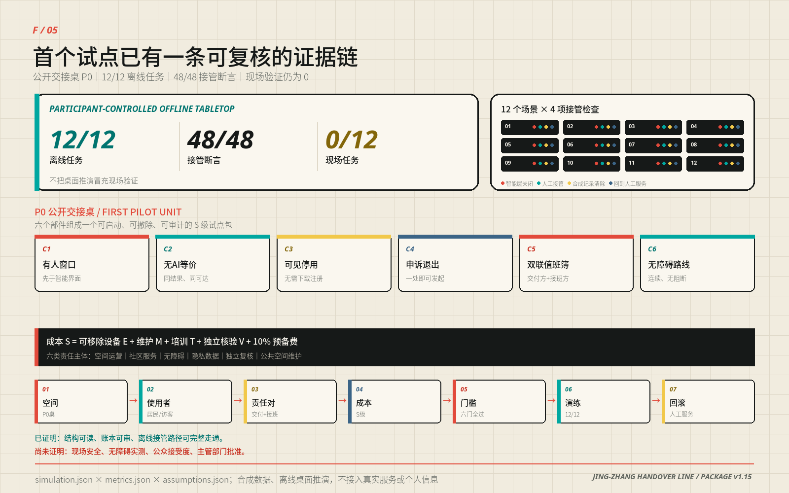
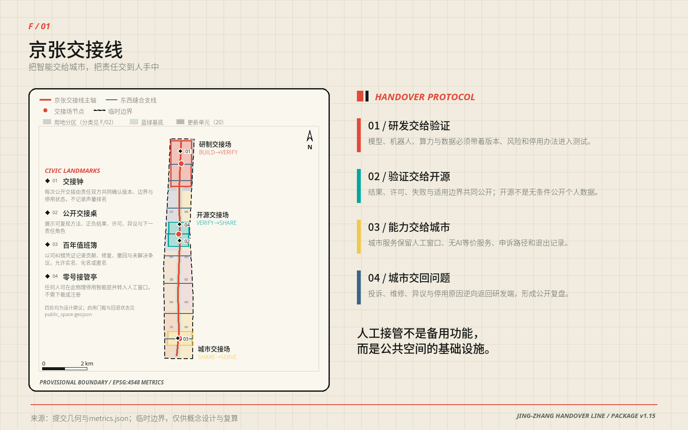
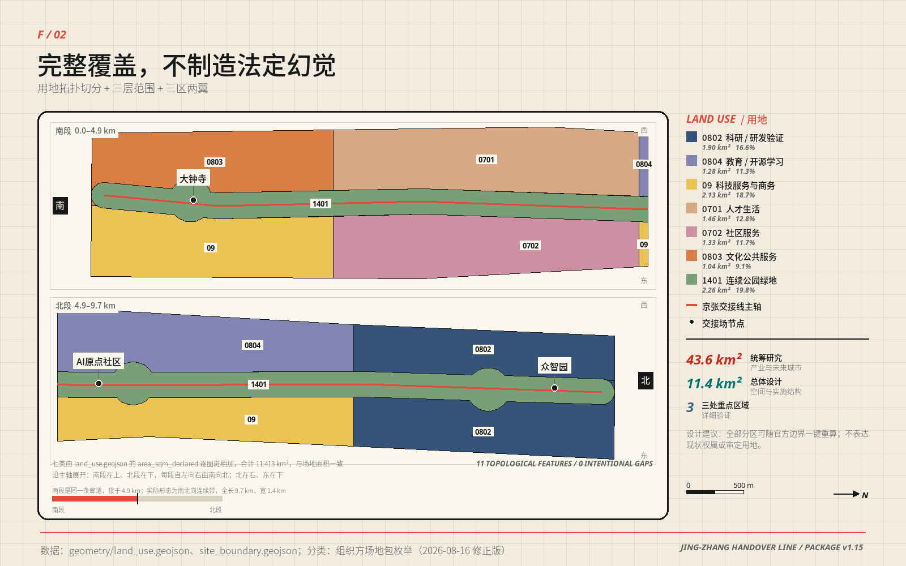
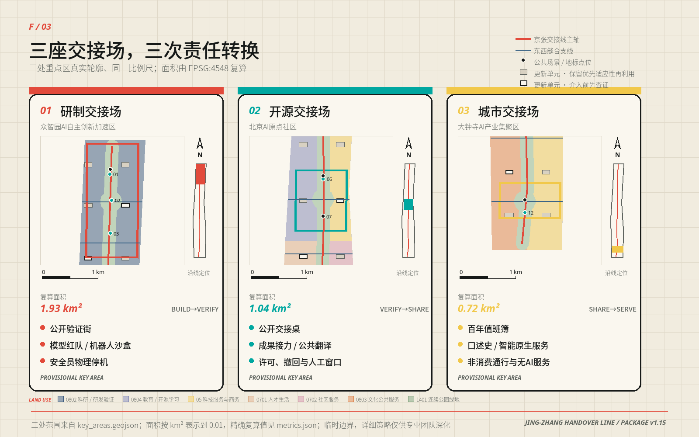
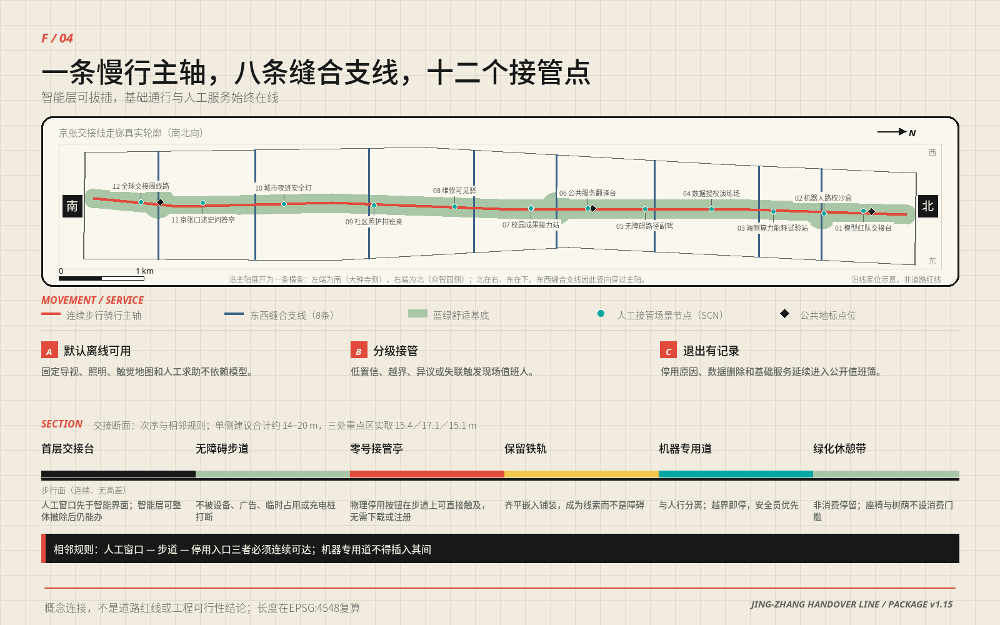

# 京张交接线 / JING-ZHANG HANDOVER LINE

## 让好 AI 更快进城，让每次交接都有回路

一条线，把 AI 从实验室送进日常；每一站都有人接得住、退得回、看得懂。

京张铁路最重要的遗产不只是一条线位，也是一套交接制度：上一班必须说明交出了什么，下一班必须独立判断是否接收，未完成事项不能在交班中消失。本方案把这套制度转译为城市 AI 的空间协议。研制把能力交给验证，验证把可复现结果交给开源社区，开源社区把服务交给城市；投诉、维修、失败和停用原因再沿同一条线回到研发端。能力因此可以加速流动，责任始终留有签收人与回程票。

“无 AI 也能办成”仍是公共服务的基础地板，但不再是方案的全部叙事。交接线的积极价值，是让一项已经证明有用的技术更快找到测试空间、责任接口、公共服务载体和可复用记录；一旦条件变化，又能不伤害基础服务地退出。这个机制同时回应创新速度与公共信任，而不是在二者之间二选一 [source:AGENT-TASKBOOK] [standard:PROJECT-AGENT-OPEN-CALL-TASKBOOK]。

本轮已经完成一项参与者可控制的实施证据：十二个合成场景逐条跑过“智能层关闭—异常触发—接入方拒收—人工接管—合成记录清零—回到基础服务”的离线状态机，12/12 任务成功、48/48 断言通过。它证明协议能够被执行和审计，但不冒充现场安全、公众测试或上线批准；现场演练仍是 0/12 [metric:simulation_task_count] [metric:simulation_success_rate] [metric:field_rehearsal_task_count]。

> **读图只需三步。** 先看 12/12 与 48/48，确认本轮真正完成了什么；再看公开交接桌的六类构件、六类责任主体和 S 级成本公式，理解授权后怎样做第一个现场试点；最后看“现场 0/12”，确认数字演练没有被包装成建成或运营事实。

| 评审要问的事 | 本方案的回答 | 当前证据状态 |
| --- | --- | --- |
| 核心概念是否原创 | 把铁路双联交班变成“BUILD→VERIFY→SHARE→SERVE→RETURN”的城市 AI 空间协议 | 空间、角色、场景和回滚均有同一套编号 |
| 空间是否明确 | 一条交接线、三座交接场、两翼支撑、八条东西缝合支线、二十个更新类型单元 | GeoJSON 与五张核心图可复算、可定位 |
| 是否可实施 | 先做一张无固定土建的公开交接桌，再做三座交接场，最后讨论全带网络 | 数字桌面演练已完成；首个现场试点待授权 |
| 公共利益如何进入 | 人工窗口、连续无障碍步行面、固定导视、纸本/电话通道先于智能层存在 | 每个场景写明人工服务与退出后的空间用途 |
| 结论边界是否诚实 | 空间均为概念建议；临时边界不等于官方红线；现场、造价和角色均待专业程序 | `assumptions.json` 与风险章节逐项登记 |

## 一条铁路留下的三件遗产：线形、道口与交接班

上一节把“交接”当作本方案的核心机制，这一节交代它的出处，免得把比喻当论据。下面都是公开可核验的史实，方案只从中提取可继承的做法，不据此推断任何法定结论。

| 时间 | 公开史实 | 出处 |
| --- | --- | --- |
| 1905—1909 | 1905 年 5 月詹天佑任京张铁路总工程司，1909 年 10 月 2 日通车，是中国第一条完全自己勘测、设计、施工和管理的国有干线铁路；在青龙桥站一侧山腰修“人”字形铁路，以延长距离换取高度 | [source:SRC-JINGZHANG-1909] |
| 1910／1960 | 清华园车站设立，为出西直门后向北的第一站；1960 年配合校园扩建，该段东移约 800 米，老站房转作他用；旧站房后在遗址公园建设中修复保留 | [source:SRC-QINGHUAYUAN-STATION] [source:SRC-HERITAGE-PARK-P1] |
| 1952—1954 | 院系调整新建北京航空、地质、矿业、林、医、钢铁、石油、农机八所学院，校舍选在北起清华东路、南到蓟门桥的大学区；学院路 1954 年底建成通车，“八大学院”由此得名 | [source:SRC-BAXUEYUAN-1952] |
| 2019-12-30 | 京张高铁开通运营，线路全长 174 公里、最高设计时速 350 公里，并在世界上首次实现复兴号智能动车组时速 350 公里自动驾驶 | [source:SRC-JINGZHANG-HSR-2019] |
| 2023-06 | 京张铁路遗址公园（一期）建成，位于清华东路至知春路，总长 2.5 公里、总面积 16.8 公顷，利用沿线旧铁轨、道岔与机车元素，并修复保留清华园站站房 | [source:SRC-HERITAGE-PARK-P1] |

一百年里这条走廊被反复要求回答同一个问题：速度与坡度谁让谁。1909 年的答案是折返，2019 年的答案是 350 公里。AI 进来以后问题没有变，只是“坡”从地形换成了城市——公共服务的连续性、可达性和可退出性。

三件遗产因此可以继承。每一件都对应本方案的一个具体动作，也各有明确不成立的推论。

| 遗产 | 本方案继承的做法 | 不成立的推论 |
| --- | --- | --- |
| 线形 | 主轴沿废弃线形布置，把“连续无高差”写成开放前提而不是优待 | 不等于已测得纵坡合规，仍须纵断面实测复核 |
| 道口 | 八条东西支线在历史道口方向缝合两侧街区；“五道口”得名于铁路道口的说法与五道庙一说并存，本方案不作地名考证结论 | 不据地名推定线位、权属或边界 |
| 交接班 | 双联签收：交出与接入是两次独立判断，未完成事项不得在交班中消失 | 不等于已获运营授权或安全认证 |

两条时间线在清华东路交会：遗址公园一期的北端与“八大学院”大学区的北界是同一条路。铁路留下的是南北向的线，高校区留下的是东西向的人，本方案的一线八支正是沿着这两笔已有的城市结构走，而不是另画一张网。

遗址公园是这三件遗产今天唯一连续的公共载体。交接线不另起一条绿廊，而是把公园已有的南北贯通与东西连通升级为同时承担研发、验证与城市服务交接的公共机制；实施边界、文保控制线与权属仍以主管部门意见为准，本方案不在其上给出工程结论 [depth:blue_green_public_space]。

## 设计依据与资料清单

方案依据征集公告、面向智能体任务书、仓库场地资料包、公开资料登记表与本地专业标准快照。公告给出约 43.6 平方公里统筹研究范围、约 11.4 平方公里总体设计范围和三处重点区域；任务书要求三大定位、五大功能、三区两翼、六项智能体任务和长期运营。本包使用这些材料确定任务和表达深度，不以新闻图、商业地图、OSM 或生成图推断法定红线 [source:OFFICIAL-ANNOUNCEMENT] [source:SITE-PACKAGE] [source:SOURCE-REGISTRY]。

当前仓库仍没有官方精确范围、审定控规、权属、现状建筑、道路红线、市政容量、消防、文保和完整生态本底。提交几何因此全部采用明确标注的临时约束与设计建议：边界只用于生成、比较和自检，面积小数来自投影算法，不代表法定精度。官方资料到位后，九类几何、指标、中英图件、四套 PDF 与正文一起重算 [source:BOUNDARY-SOURCE] [data:geometry/site_boundary.geojson#SITE-001] [depth:existing_conditions_diagnosis]。

资料在本方案中分成四种角色，而不是混成一张参考文献表：

| 资料层 | 用来回答什么 | 不用来回答什么 |
| --- | --- | --- |
| 任务权威 | 征集范围、必答任务、成果边界 | 不替代官方红线和审定控规 |
| 专业标准 | 城市设计、用地分类、无障碍与公共服务的检查方法 | 不替代具体项目审批意见 |
| 背景案例与统计 | 收敛产业、人才和运营问题，比较机制 | 不制造招商目标、投资额或现状调查结论 |
| 提交几何与演练 | 检查方案内部空间关系、状态机和回滚逻辑 | 不证明已建成、已授权或现场绩效 |

控规深度、城市设计与用地分类分别响应 [standard:MOHURD-CONTROL-DETAILED-PLANNING]、[standard:MOHURD-URBAN-DESIGN-MEASURES] 与 [standard:MNR-LAND-USE-CLASSIFICATION-GUIDE]。生成式 AI、无障碍和老年人智能技术政策用于定义服务边界；其中“所有服务必须有无 AI 等价路径”是本方案自设的更高公共服务标准，不伪装成普遍法定义务。

全部图形、版式、文字、几何推演和离线演练由本包参与者与所披露智能体协作完成。外部案例只转述公开机制，不复制照片、地图、商标或他人图表；字体、PDF 与媒体权利链见 `report/copyright_statement.md`。本次提分重构由 Codex（GPT-5）完成，Claude Opus 5 参与此前迭代，Sonike 负责提交，人类与专业团队保留最终判断。

## 三层范围工作框架

三层范围各做一件不同的事。43.6 平方公里统筹研究范围负责建立产业、人才、场景和区域协同接口；约 11.4 平方公里总体设计范围负责把这些接口组织成一条连续公共空间与责任网络；三处重点区域负责把“谁交给谁、在哪里验、失败后回到哪里”做成可被继续深化的空间原型 [source:OFFICIAL-ANNOUNCEMENT] [depth:three_level_scope_framework]。

总体设计范围在提交几何中复算为约 11.413 平方公里，只是临时模型量。空间骨架不是边界色块，而是 9.50 公里的南北交接主轴、八条东西缝合支线、三座交接场和四处公共地标。东西支线把高校、园区、社区、轨道与公园生活接回主轴；南北主轴让一项能力从研制走到服务，再把问题送回研发 [metric:site_area_sqm] [metric:handover_spine_length_m] [metric:cross_link_count]。

三处重点区域采用同一交接协议，但承担不同责任：众智园是研制交接场，负责 BUILD→VERIFY；北京 AI 原点社区是开源交接场，负责 VERIFY→SHARE；大钟寺是城市交接场，负责 SHARE→SERVE。三者不是三个相似园区，而是同一条创新链上不能互相替代的三种城市功能 [data:geometry/key_areas.geojson#PROV-KEY-001] [metric:key_area_count]。

> **图中虚线是临时范围，不是设计主角。** 红色南北线承担责任交接，蓝色横线缝合两侧城市生活；三个彩色交接场分别把研制、开源和公共服务放在不同的责任位置。四个菱形地标让贡献、停用、维修和人工接管能在公共空间被看见。

## 统筹研究范围产业与未来城市研究

交接线不是给创新加一道审批墙，而是给好技术一条更短、更可信的城市化路径。常规创新链常在“实验室成果”和“城市应用”之间断开：产品不知道去哪里做受控验证，公共服务方不知道接收了哪个版本，失败经验又回不到研发。本方案把这段空白拆成四次明确交接：研制携带版本、风险和停止办法进入验证；验证把正负结果与适用边界一起交给开源；开源把许可、维护和撤回办法交给服务；服务把投诉、维修和退出原因送回研制。

任务书的三大定位因此落在同一条时间线上。百年京张文化带保存“自主建造与交班”的跨代记忆；都市 AI 生活体验带让普通人能看懂、试用、拒绝和申诉；AI 融合创新带提供验证、开源与产业转化接口。五大功能分别落到研发试验、成果验证、开放协作、城市服务和长期治理，而不是并列成五个口号 [source:AGENT-TASKBOOK] [standard:PROJECT-AGENT-OPEN-CALL-TASKBOOK]。

“三区两翼”的职责也被重新写清。研制、开源、城市三座交接场负责交接链上的三次签收；中关村科技服务翼提供高校、标准、法务、算力、人才和资本服务的接口，小月河场景翼提供经授权的城市问题与公共空间。两翼只提供支持，不替三座交接场作接收决定。

产业目标要落在可核对的量级上，而不是“打造高地”这类表述。海淀区 2025 年统计公报给出的公开量级是：备案上线大模型 123 款、在区全国重点实验室 92 家、全年登记技术合同 5.79 万项、成交总额 4053.1 亿元、年末常住人口 311.1 万人 [source:HAIDIAN-2025-STATISTICAL-BULLETIN]。这些数字的口径是海淀全区，远大于本带 43.6 平方公里，因此只用来收敛问题——它说明这条走廊面对的是已经进入备案与安全评估流程的真实服务，而不是抽象的模型概念。它们不用来制造本方案的目标值，也没有任何一项进入 `metrics.json`。

### 六个全球案例，只借机制，不复制形态

| 案例 | 可转化机制 | 在交接线中的落点 |
| --- | --- | --- |
| JTC LaunchPad @ one-north | 初创空间与产业服务相邻，降低从试验到合作的摩擦 | 共享服务栈与验证工坊并置 [source:CASE-ONE-NORTH] |
| Smart Kalasatama | 以居民时间和真实生活问题校准技术 | 城市交接场的公共价值复核 [source:CASE-KALASATAMA] |
| STATION F | 大尺度创业社群需要稳定的公共服务与伙伴接口 | 开源交接场的成果接力与服务台 [source:CASE-STATION-F] |
| 22@ Barcelona | 产业更新与街区公共空间同步推进 | 二十个更新单元与连续公共交接面 [source:CASE-22BARCELONA] |
| Kendall Square K2C2 | 科研集群需要跨街区步行联系和公共界面 | 八条东西缝合支线 [source:CASE-KENDALL] |
| Knowledge Quarter London | 机构密集区以共同议题而非单一园区协作 | 五条区域协同接口 [source:CASE-KNOWLEDGE-QUARTER] |

区域协同不虚构合作关系，只交换可复用的方法。北纬社区可以提出社区服务问题，未来科学城与怀柔科学城可以交换科研成果转译和测量方法，北京经开区可以带回工程化复测问题，京津冀节点可以比较跨区公共服务接口。交接线向外输出协议、演练模板和失败记录，不输出未经验证的“成功结论”；向内承接问题，不承诺数据共享、采购或共同运营。

| 协同对象 | 交接线可输出 | 可承接 | 拒收条件 |
| --- | --- | --- | --- |
| 北纬社区 | 人工接管与无障碍服务模板 | 经授权的社区问题 | 未确认居民参与与数据边界 |
| 未来科学城 | 城市化验证问题单 | 共性技术成果的测试需求 | 把研究结论写成可部署产品 |
| 怀柔科学城 | 科学成果公众转译方法 | 测量与校准建议 | 触及非公开科研或设施数据 |
| 北京经开区 | 受控场景的工程问题单 | 制造工况复测需求 | 企业、订单和产线关系不清 |
| 京津冀节点 | 双语协议与年度失败摘要 | 跨城服务比较问题 | 责任主体、许可和适用范围不清 |

品牌名为“京张交接线 / JING-ZHANG HANDOVER LINE”。Logo 由两条铁轨、交接棒和信号括号组成；煤黑表示可审计责任，信号红表示必须由人决定的停止阈值，电气青表示开放接口，值班黄表示服务进入日常。它可以延展到导视、协议卡、值班簿、活动出版物和公开交接桌，而不依赖电子屏幕。

## 总体设计范围城市更新与控规深度城市设计

总体结构概括为“一线、三场、两翼、八支、二十单元”。一线是连续公共交接面；三场完成研制、开源和城市服务的三次签收；两翼提供技术服务与场景支持；八条东西支线修补南北长条带与两侧街区之间的断裂；二十个更新单元把开放研发院、验证工坊、共享服务栈和社区协作屋均匀嵌入沿线 [depth:overall_spatial_structure] [data:geometry/buildings.geojson#BLDG-001] [metric:renewal_cell_count]。

用地不是按“AI 产业园”单一色块组织，而是按交接链所需功能混合：科研与验证承载 BUILD→VERIFY，教育与开源学习承载 VERIFY→SHARE，科技服务、商业与社区服务承载 SHARE→SERVE，连续公园绿地和公共空间贯穿全线。十一块拓扑分区共同覆盖临时边界且不重叠，所有相邻边界来自同一切分模型 [data:geometry/land_use.geojson#LU-001] [metric:land_use_zone_count] [depth:land_use_layout]。

更新首先改接口，再决定建筑。既有成熟街区、遗产线索和可继续使用的主体优先保留；首层、院落和边界界面可采用低扰动修缮；验证围界、交接桌、导视和展陈采用可拆构件；只有在正式调查证明结构、消防、权属与公共价值均不能通过保留或改造解决时，才进入拆除研究。总体设计不把二十个概念单元误写成二十栋待拆或待建建筑 [depth:retain_renovate_demolish]。

开发强度、总建筑面积、法定建筑密度、高度、退界、道路红线和停车指标均等待正式控规与专项条件。提交包只计算概念建筑基底约 22.10 万平方米，用来检查四类更新单元在空间上的相对供给，不反推容积率、现状建筑总量或新建规模 [metric:building_footprint_area_sqm] [depth:development_intensity_controls]。

## 重点区域详细设计

三处重点区域共享一套空间顺序：有人值守的公共窗口—连续无障碍步行面—可直接触及的停用入口—保留的铁路线索—与人分离的机器试验带—不设消费门槛的绿化休憩带。机器专用道不得插入人工窗口、步道和停用入口之间；这条相邻规则把“人工接管”从流程图变成了城市设计关系 [depth:three_key_area_detailed_design] [standard:MOHURD-URBAN-DESIGN-MEASURES]。

### 众智园：研制交接场 / BUILD→VERIFY

众智园承担模型、机器人、端侧算力与数据工具进入城市前的受控验证。公共验证街把开放研发院、封闭测试院、独立评审室和失败样本墙连接起来；机器人路权只在可封闭时段和物理隔离范围内测试，安全员拥有独立停机权；端侧算力先接独立计量与热管理，再讨论持续运行。研制方必须把版本、样本边界、风险、能耗和停止办法一起交出，验证方可以拒收。

### 北京 AI 原点社区：开源交接场 / VERIFY→SHARE

原点社区把技术结果翻译成可被开发者、居民和公共服务人员理解的开放成果。校园成果接力站处理许可、作者贡献和撤回；公共服务翻译台保留人工窗口与多语纸本；数据授权演练场用纸面和数字两条路径说明授权、撤回与删除。这里的“开源”是结果、失败、许可与适用边界共同公开，不是无条件公开个人数据。

### 大钟寺：城市交接场 / SHARE→SERVE

大钟寺检验一项能力能否进入日常生活。城市交接厅承载翻译、照护、维修和文化服务；百年值班簿公开记录上线、停用、投诉、修复与版本变更；零号接管亭提供固定导视、纸本目录、人工求助和物理停用入口。任何服务退出后，空间应回到普通公共使用，而不是留下专用设备和无人维护的界面。

### 首个现场原型：公开交接桌

授权后的第一步不是建设整条线，而是在一处已有首层或有遮蔽的公共界面搭一张可移动的公开交接桌。它由两块相互独立的台面组成：交出侧陈列版本、风险和停止办法，接入侧记录接受、附条件接受或拒收；中间不设自动合并按钮。桌旁保留固定导视、触觉件、纸本服务卡和可直接触及的停用演示件。全部构件当日可撤，不需要固定土建、联网或采集公众数据。

| 原型构件 | 最小交付 | 验收方式 | 退出方式 |
| --- | --- | --- | --- |
| 双联交接桌 | 交出与接入两块独立台面、版本槽和拒收槽 | 两个角色能独立填写，不能由同一动作自动通过 | 解体后恢复普通桌面 |
| 无 AI 服务包 | 固定导视、纸本目录、人工求助号码 | 智能层关闭时仍能完成测试任务 | 继续作为日常基础服务 |
| 停用演示件 | 从步行面可触及的物理按钮或机械牌 | 不下载、不注册即可触发演示状态 | 拆除，不留接口 |
| 包容性套件 | 触觉卡、大字卡、多语卡、可坐使用位置 | 专业无障碍复核后才进入现场测试 | 归档为可重复使用套件 |
| 公开值班簿 | 记录版本、问题、接收结论与回滚 | 正负结果同页保存、可追溯修改 | 纸本归档，不留个人信息 |
| 可逆边界件 | 可移动围界、地贴与安全标识 | 撤场检查确认通行完整恢复 | 当日全部撤除 |

## AI 创新生态、人才画像与 AI+ 场景

交接线把产业生态组织成“共享接口”而不是招商名单。每个接口都由一段可逆空间、一套进入规则和一份交接记录组成；具体企业、机构和资金渠道待后续公开程序确认。这样即使某个主体不来，空间与协议仍能被另一支符合条件的团队使用。

| 共享接口 | 提供什么 | 空间载体 | 进入与退出规则 |
| --- | --- | --- | --- |
| 土地与时段 | 可撤回的空间使用时段 | 四类更新单元 | 先申请时段，结束即恢复公共用途 |
| 验证空间 | 独立评审、封闭测试、计量 | 验证工坊与研制交接场 | 风险、版本、急停缺一即拒收 |
| 开源成果 | 许可、作者、失败与适用边界 | 开源交接场 | 权利不清即撤下，记录保留 |
| 算力与设备 | 端侧计量和按需接入 | SCN-03 | 独立计量，温升或安全阈值触发停机 |
| 数据 | 授权、最小化、撤回和删除 | SCN-04 | 无授权不采，撤回后验证删除 |
| 人才 | 角色规格、贡献署名和维护接班 | 研发院、协作屋、值班簿 | 岗位先于人选，缺岗则智能层不开 |
| 资金服务 | 流程解释、材料导航与专业转介 | 共享服务栈 | 不承诺补贴、投资或评审结果 |
| 城市场景 | 问题、测试规则、正负结果和退出记录 | 十二个场景节点 | 规则先公开，结果正负同时留下 |

人才不被合并成“高端人才”一个词。开发者需要可复现的测试和署名；初创团队需要低成本时段、合规入口和失败后可退出的空间；成熟企业与院所需要标准共建与真实问题；维护者需要版本、故障和责任可见；居民、老人、残障者、儿童、无智能手机者和国际访客需要不被技术门槛排除。每类人都对应具体空间、场景和可聚合评价口径。

| 用户画像 | 需要什么 | 对应空间与场景 | 公共利益检查 |
| --- | --- | --- | --- |
| 开发者与学生 | 可复现、可署名、可撤回的成果 | SCN-01、SCN-07、公开交接桌 | 许可与复现记录完整 |
| 初创与成长团队 | 受控试错、算力计量、合规入口 | SCN-02、SCN-03、验证工坊 | 失败不转为永久空间负担 |
| 高校与院所 | 成果转译、独立复核、长期协作 | 研发院、校园成果接力站 | 研究结论不冒充部署结论 |
| 运营与维护者 | 工单、版本、停用权和交班 | SCN-08、百年值班簿 | 缺岗时智能层必须关闭 |
| 居民与老人 | 人工服务、电话和纸本入口 | SCN-06、SCN-09 | 拒绝算法不降低基础服务 |
| 残障与临时行动不便者 | 连续路径、触觉与人工问路 | SCN-05、零号接管亭 | 专业复核严重断点为零 |
| 儿童与青少年 | 安全通行且不被识别画像 | SCN-05、SCN-10 | 未成年人个人采集恒为零 |
| 国际访客与无 App 使用者 | 多语、固定导视、志愿者服务 | SCN-06、SCN-12 | 不安装 App 也能完成路线 |

十二个场景全部写入公共空间图层，其中四个是产业验证场景。每个场景包含服务对象、最小数据、交出与接入角色类型、人工路径、停止条件和退出后的空间用途；同一规则随后进入离线演练 [data:geometry/public_space.geojson#SCN-01] [metric:scenario_node_count] [metric:industry_validation_scenario_count]。

| ID | 场景 | 最小数据与智能价值 | 人工接管与退出 |
| --- | --- | --- | --- |
| SCN-01 | 模型红队交接台 | 测试样本、版本与风险条目；辅助整理红队结果 | 人工评审与纸面风险登记；重大风险未闭环即停 |
| SCN-02 | 机器人路权沙盒 | 封闭段轨迹；验证路权、避障和失联策略 | 安全员物理停机；越界或近失事件即封闭 |
| SCN-03 | 端侧算力能耗试验站 | 独立电表与任务负载；比较能耗和温升 | 人工停机、离线计量；安全阈值触发即停 |
| SCN-04 | 数据授权演练场 | 自愿授权记录；演练最小化、撤回和删除 | 线下授权单与即时删除；无法撤回即退出 |
| SCN-05 | 无障碍路径副驾 | 用户主动报告的路线障碍；辅助路径说明 | 触觉地图与人工问路；未经复核不发布 |
| SCN-06 | 公共服务翻译台 | 现场输入文本；辅助多语解释 | 人工窗口与多语纸本；权益决定一律交人 |
| SCN-07 | 校园成果接力站 | 经授权成果元数据；辅助检索与转译 | 人工策展与开放目录；许可不清即撤下 |
| SCN-08 | 维修可见驿 | 匿名报修和工单状态；辅助分流 | 电话、纸面报修与人工派单；冲突即交班 |
| SCN-09 | 社区照护排班桌 | 最小化排班信息；辅助提醒 | 工作人员电话排班；拒绝算法不影响服务 |
| SCN-10 | 城市夜班安全灯 | 设备状态，不采人脸；辅助故障识别 | 固定照明与人工巡查；感知异常回常亮 |
| SCN-11 | 京张口述史问答亭 | 清权馆藏索引；辅助多语检索 | 人工讲解与纸本目录；出处不清只显示索引 |
| SCN-12 | 全球交接周线路 | 预约与匿名客流；辅助路线与活动解释 | 固定导视与志愿者；拥挤或安全风险即暂停 |

总体设计范围内另设五类“AI+”垂直接口：信软工具链协作只处理代码和构建日志；医疗问答只解释流程、不诊断；教育辅助只解释方法、不评分；法律咨询只整理诉求、不作权利判断；生活服务只协助表单与预约、不做跨事项画像。任何涉及诊断、判决、评分、资格或个人权益的结论必须交给具备资质的人。

## 用地、建筑规模与拆改留方案

用地采用公开分类代码表达：0701 居住、0702 社区服务、0802 科研、0803 文化、0804 教育、09 商业服务业、1401 公园绿地。它们在提交模型中共同覆盖临时总体范围，用于说明功能关系，不代表现状地类、产权或规划许可 [standard:MNR-LAND-USE-CLASSIFICATION-GUIDE] [data:geometry/land_use.geojson#LU-001]。

建筑更新采用四类单元，每类各五个：开放研发院提供研制与独立评审的相邻首层；验证工坊提供可封闭、可计量、可撤围界的测试空间；共享服务栈提供许可、法务、算力、资金和成果转介；社区协作屋把人工服务、照护、维修与居民反馈留在日常生活中。二十个单元是类型学和空间供给，不是建设项目的确权清单。

| 处置类别 | 适用判断 | 设计动作 | 进入下一步的证据 |
| --- | --- | --- | --- |
| 保留 | 遗产线索、成熟公共服务或可继续使用主体 | 修补通行与首层接口，不改变主体 | 现状调查、权属与安全复核 |
| 修缮 | 首层、院落或边界界面能低扰动改善 | 可逆隔断、导视、遮荫和无障碍修补 | 结构、消防、无障碍与运营方案 |
| 临时植入 | 测试、活动或交接需要短期载体 | 可移动桌、围界、计量箱和展陈 | 场地授权、保险、撤场清单 |
| 拆除/新建研究 | 保留与修缮无法解决重大安全或公共价值问题 | 只进入专业比选，不在本方案下结论 | 正式测绘、鉴定、控规与法定程序 |

总建筑面积、容积率、法定建筑密度、最大高度和更新建筑规模保持待正式数据补齐。图件中的体量、界面和更新单元只表达空间秩序；任何精确建造量均须由专业团队在官方边界、控规、权属与现状测绘到位后复核 [depth:height_massing_character] [metric:total_floor_area_sqm]。

## 交通、轨道、市政与公共服务设施

交通策略先确保“人能连续走完”，再叠加智能服务。南北主轴保留连续步行与骑行面，八条东西支线连接两侧街区；站口到公共服务的最后五百米优先完成辨向、遮荫、坐憩、无障碍和人工求助。AI 导航失效时，固定导视、触觉地图、无电路线和真人仍然可用 [data:geometry/roads.geojson#ROAD-001] [depth:traffic_rail_slow_parking]。

轨道与道路工程不被本方案预设。八个主轴—支线交汇点被登记为潜在高差检查点，需用正式纵断面和道路红线逐处复核；未取得高程时不推算最大纵坡。机器人和配送只在明确隔离、限时开放并由安全员可物理停机的范围内测试，不能侵占无障碍步行面。

市政策略从可逆计量开始。端侧设备必须独立计量用电和温升，临时设施不接入未经核定的市政系统；饮水、厕所、遮荫座椅、人工窗口、常亮照明、电话和纸本服务优先于新增屏幕。传感器可以报告状态，不能代替排水、电力、消防、结构和通信容量的专业核定 [depth:municipal_new_infrastructure]。

公共服务采用“双层服务”而不是“备用服务”。基础层由人工窗口、电话、纸本、固定导视和可直接使用的空间组成；智能层只在基础层已经成立后提供翻译、检索、提醒、路径说明和状态整理。智能层被关闭时，基础层不降级；这条原则保护老人、残障者、儿童、国际访客、无智能手机者和主动拒绝算法的人。

## 蓝绿空间、公共空间与城市风貌

提交模型中的概念绿地约占临时范围 19.84%，概念公共交接面约占 9.11%。它们是设计几何的内部量，不是现状绿地率、法定指标或已实施增量。正式生态本底、树木、水文、地形与公共空间调查到位后须重新划定和复算 [metric:green_ratio] [metric:public_space_ratio] [depth:blue_green_public_space]。

蓝绿空间承担三种实际作用：为连续步行面提供遮荫与休息，为雨水和土壤观察提供可逆测量位置，为人工服务和智能测试之间形成速度缓冲。休憩带不设消费门槛；机器试验带与步行面之间用植被、围界和安全员职责共同分隔，不能只靠屏幕提示。

城市风貌从铁路的“线、站、班、簿”四个原型出发。线对应连续空间，站对应三座交接场，班对应角色与版本，簿对应公开记录。材料以可维护、可更换、可读为先，避免巨型科技雕塑和不可撤的专用装置；夜间照明保持常亮基础层，智能调节异常时回到稳定照明。

四处 AI 朝圣地标把荣誉从资本规模转向公共贡献：交接钟记录一项能力何时被独立接收；公开交接桌展示正负结果和拒收理由；百年值班簿保存维护者、修复者与及时停用者的署名；零号接管亭让任何人看见基础服务、人工求助和停用入口。四处均为概念建议，落位须服从权属、文保与公共空间程序 [metric:civic_landmark_count] [data:geometry/public_space.geojson#LANDMARK-01]。

### 荣誉展示体系：可纠错的记录，不是排行榜

荣誉记录按“提名—证据—双复核—公示异议—纠错—撤回—申诉”七步闭环运行，允许实名、化名或匿名署名，不按流量或投票排名。任何一条记录都必须能被指出错误并被改正；被撤回的记录保留撤回原因，不从公共记忆里抹去。百年值班簿是它的物理载体，交接钟与公开交接桌是它每年一次的公开时刻 [data:geometry/public_space.geojson#LANDMARK-03]。

### 公共空间组件库：先能撤，再谈建

沿线公共空间用一套可撤构件，而不是定制装置：可移动围界与地贴、交接桌与工作台、遮荫与座椅单元、纸本目录与值班牌、常亮照明杆、无障碍坡道与触觉引导条、独立计量插座箱、临时展陈架。每一类都写明安装方式、维护责任、撤除条件和撤除后的空间恢复标准。智能层只作为可插拔模块挂在这些构件上，拔掉之后构件仍然是可用的公共家具，不在场地上留下无法使用的空壳。

### 导视、标识与符号系统

Logo 只是起点，真正落到街道上的是四类不依赖屏幕的实体符号：交接标表示“这里发生过一次签收”，值班牌表示“现在谁负责”，停止括号表示“这里可以停下并回到人工”，道口条标示东西缝合点。四类符号在遗址公园既有的铁轨与道岔意象上就地取形，尺寸、对比度与触觉边缘按无障碍与对比度要求设定，盲道、触觉地图和人工问询不因智能层存在而省略 [standard:BARRIER-FREE-ENVIRONMENT-LAW] [standard:WCAG-CONTRAST]。

文化标识与交接符号分层：文化标识讲历史，交接符号讲当下责任，两套不混用，也不与一带整体 Logo 系统混淆。所有符号采用可更换面板，改版只换面板不换基座，避免每次迭代都在公共空间留下一批废弃物。

### 不看屏幕也能读完这份方案：音频、视频、触觉与三维

同一套内容做了五种人类可直接接收的形态，互为后备而不是互相替代：中英三分钟音频导览（含逐句字幕稿），中英短视频导览，走廊主段的触觉地图（可打印的矢量线稿，供视障读者与人工问路台使用），公开交接桌的三维模型数据，以及可离线打开的交互网页。任何一种失效时，其余四种仍能独立说明同一件事；纸本目录与人工问询始终是最后一层，不依赖任何设备。

生成方式逐项披露：音频为本机语音合成，视频与图件为程序化生成，触觉地图由同一套几何直接导出，不含真人肖像、真实语音采样或第三方素材；三维数据只描述可拆构件的尺寸关系，不是测绘成果。媒体全部登记在 `manifest.json`，可离线播放，不自动播放，不依赖任何远程服务 [source:TTS-MACOS-SYNTH] [source:TOOLCHAIN-BUILD]。

## 更新项目清单、实施政策与分期计划

实施从一个参与者可控制的数字演练和一个授权后可搭建的 S 级原型开始，而不是从整条带的建设承诺开始。离线演练已经把十二个场景的角色接口、人工服务、删除和回滚逐条跑通；现场第一步只做公开交接桌，不连接真实业务、不采集公众数据、不做固定土建。这样可以在最小风险下验证“两个角色是否真能独立判断、智能层关闭后服务是否继续、撤场后空间是否恢复”。

### 已完成：十二场景离线接管桌面演练

演练读取十二份合成交接账，对每个场景执行四项断言：智能层关闭时基础服务存在；接入方能独立拒收并把判断交回人；临时合成记录清零；状态能回到指定人工服务。十二项任务全部成功，合计 48/48 断言通过；任务字段完整率与审计完整率均为 100% [metric:offline_takeover_assertion_count] [metric:offline_takeover_assertion_pass_rate] [metric:audit_completeness]。

| 场景组 | 数字桌面演练 | 验证的人工状态 | 现场状态 |
| --- | --- | --- | --- |
| SCN-01—03 产业验证 | 3/3 成功 | 人工评审、物理封闭、独立计量与停机 | 0/3，待场地与安全角色授权 |
| SCN-04—07 数据与开源 | 4/4 成功 | 线下授权、触觉/人工问路、人工窗口、人工策展 | 0/4，待服务与无障碍复核 |
| SCN-08—10 维修与照护 | 3/3 成功 | 纸面报修、电话排班、固定照明与巡查 | 0/3，待运营责任与现场条件 |
| SCN-11—12 文化与活动 | 2/2 成功 | 纸本目录、人工讲解、固定导视与志愿者 | 0/2，待版权、活动与安全授权 |

**它证明什么。** 协议字段、角色分离、状态转换、人工回退和合成记录处置可以在同一套结构中执行并复算。**它不证明什么。** 不证明现场空间可达、真实人员响应、系统性能、公共满意、安全、无障碍、合规或批准。数字结果与现场 0/12 同时写进 `simulation.json` 和指标，避免把测试夹具误读为实绩。

### 授权后第一步：公开交接桌 P0

P0 的成本等级为 **S：小型、可移动、无固定土建的公共界面**。概念估算不填一个没有询价依据的总数，而采用可替换公式：`构件数量 × 至少三方经复核询价 + 人员工时 × 经批准费率 + 10% 概念预备项`。S 级只含家具、导视、包容性套件、值班簿、演练与撤场；不含道路、市政、结构和永久设备工程。正式金额在场地授权后询价并公开口径。

| 成本包 | 数量口径 | 负责主体类型 | 形成的验收证据 |
| --- | --- | --- | --- |
| C1 双联桌与可逆边界件 | 1 套 | 场地资产管理/区属平台类型 | 组装、稳定性与撤场检查表 |
| C2 固定导视与纸本服务包 | 1 套中英大字/触觉/纸本材料 | 公共服务运营类型 | 智能层关闭任务清单 |
| C3 停用演示件与状态牌 | 1 套，不连接真实系统 | 设施维护与现场安全类型 | 触发、显示、复位记录 |
| C4 包容性复核 | 1 轮专业复核＋1 轮修订 | 独立无障碍/公共利益复核类型 | 严重断点清单与闭环记录 |
| C5 双联角色演练 | 交出、接入各 1 类角色 | 场景运营＋独立复核类型 | 接受、附条件接受、拒收三种记录 |
| C6 公开档案与删除核对 | 1 套值班簿与临时记录清零 | 数据与档案责任类型 | 正负结果、删除与撤场回执 |

六道门全部满足才进入现场演练：场地书面授权；交出与接入角色分别指派；公共责任与活动保险覆盖实际形态；无障碍和安全复核完成；三方询价与持续维护责任明确；撤场、纸本归档和临时记录删除办法可执行。任一道门未满足，数字智能层保持关闭，但固定导视与人工服务可独立准备。

第一轮现场只邀请经授权工作人员和专业复核者，不招募公众、不处理真实业务。建议验收目标是：两类角色分离 100%；智能层关闭任务完成率 100%；临时电子记录清零 100%；严重无障碍与安全断点为 0；构件在约定撤场窗口内全部移除；正负结果与修改记录完整率 100%。这些是试点验收目标，不是已观察结果。

### 六个行动包与责任组织类型

| 行动包 | 试点空间 | 责任主体类型 | 成本级 | 进入门 | 回滚后的城市状态 |
| --- | --- | --- | --- | --- | --- |
| P0 公开交接桌 | 原点社区候选首层/遮蔽界面 | 场地管理＋服务运营＋独立复核 | S | 六道授权门 | 普通桌面、固定导视与人工服务 |
| P1 连续公共交接底座 | ROAD-001 与八处支线交汇 | 公共空间管理＋交通/无障碍专业团队 | M | 正式测绘与路线审计 | 固定导视、常亮照明与人工求助 |
| P2 北部验证交接 | SCN-01—03 | 测试安全＋能源/消防专业团队 | M | 场地、安全、保险与独立计量 | 封闭院落或普通设备位 |
| P3 中部开源转译 | SCN-04—07 | 公共服务＋法务/许可＋高校转化类型 | S/M | 权利、撤回与人工窗口成立 | 普通信息服务与发布空间 |
| P4 维修与照护 | SCN-08—10 | 设施维护＋社区照护＋照明类型 | S/M | 人工渠道和持续值守明确 | 电话、纸面派单与常亮照明 |
| P5 文化与全球交接周 | SCN-11—12 | 文化场地＋活动安全＋志愿者组织类型 | S | 清权、活动许可、安全与撤场 | 纸本目录与日常公共通行 |

S、M、L 只表示估算方法和工程复杂度，不是预算承诺。S 是可移动界面与人员演练；M 是既有首层、街道界面和小型设施修补，按调查面积、构件数量和专业工时估算；L 是道路、市政、结构或全带网络工程，本方案不把任何 L 级项目放入第一轮试点。每个行动包先形成一张开工单：权利、角色、许可、一次性成本、持续维护、退出资产处置六项缺一不可。

### 条件分期，而非政府时间表

三期几何用于表达责任合并顺序，不是投资和开工承诺。第一期“交回基线与南段公共服务试点”先完成官方资料登记、路线审计、P0 和低风险人工主导场景；第二期“开源交接场与中段连接”只接收第一期的正负结果，并在权属、消防、社区与无障碍复核后推进；第三期“研制交接场与全带运营”还需交通、市政、文保、隐私、安全和持续预算共同成立 [data:geometry/phasing.geojson#PHASE-001] [metric:phase_count] [depth:phasing_implementation]。

授权后的参考工序为：P0 准备、复核、演练和撤场约四周量级；单处 M 级首层或街道界面修补约二至三个月量级；全带网络只在官方条件和前两阶段证据成立后另行编制。它们是概念级工序估计，专业团队可据现场、采购与审批程序调整，不构成政府安排。

长期运营采用四季班表：春季发布城市问题与开源交班；夏季举办维护者之夜，展示可靠性与人工接管；秋季以全球交接周组织受控演练与双语交流；冬季公布年度停用、投诉、修复和退出清单。品牌资产、活动机制和合作通道都必须可撤回：品牌出现误导背书时撤回授权，活动条件不足时缩小或取消，合作接口责任或许可不清时拒收。

## 长期运营、年度活动与国际传播

### 年度活动体系与活动品牌

活动体系跟着交接链走：一年四次，每次只处理链上的一个环节，每次都必须留下可下载的公共产物。没有产物的活动第二年停办。

| 时节 | 活动 | 对应环节 | 留下的公共产物 |
| --- | --- | --- | --- |
| 春 | 开放问题周：城市服务方公布本年度真实问题清单 | SERVE→BUILD | 问题单与拒收理由汇编 |
| 夏 | 验证开放日：红队、机器人路权与能耗试验对公众开放旁听 | BUILD→VERIFY | 正负结果与适用边界记录 |
| 秋 | 全球交接周：国际开发者、高校与城市服务方同场完成一次完整交接 | VERIFY→SHARE | 双语协议模板与年度失败摘要 |
| 冬 | 年度交接账发布：留下、修改、停用的项目同屏公布 | SHARE→SERVE | 年度交接账与逐项停用原因 |

活动品牌沿用交接线的标识与四类符号，不另起一套视觉；出版物、协议卡与值班簿使用同一版式，任何一年的记录都能被下一年直接引用。主办、预算、场地与合作方均待授权，本节是概念机制，不写成已定安排 [source:AGENT-TASKBOOK]。

### 开发者社区与场景开放运营

开发者社区按“可复现”而不是“会员制”组织：提交的成果必须附版本、许可、失败记录和撤回办法，才能进入开源交接场的目录；目录只按可复现程度排序，不按机构级别排序。场景开放分三级授权——旁听、受控测试、公开试运行，每一级都写明最小数据、人工接管路径和退出后的空间用途，未通过前一级不得跳级 [data:geometry/public_space.geojson#SCN-01] [metric:scenario_node_count]。

### 招引与转化路径

一支团队从接触到留下有四步：先在全球交接周旁听一次完整交接，再申请一个受控测试时段，通过后进入验证工坊的公开试运行，最后由城市服务方决定是否接进日常服务。每一步的准入条件、退出条件和应留下的公共产物都提前公开，团队据此自行判断要不要来。空间对应四类更新单元，时段可撤回，失败不转为永久空间负担。本方案不承诺补贴、投资、税收或落户政策，也不替代任何法定招商程序。

### 国际传播：把“全球关注”建立在可复核的记录上

国际传播不靠形容词。这条带可以对外输出四样别人能直接取用的东西：双语交接协议模板、十二个场景的最小数据与人工接管清单、年度交接账（含失败与停用原因）、以及可复现的图件与几何生成方法。它们合起来是一份任何城市都能取走并复算的方法包，而不是一段宣传片——别人可以拿走尺子，不必接受我们的读数。

对外表述同样受约束：必须同时给出适用边界与未完成项，不得把概念建议表述为政府决定，不得把数字演练表述为现场运营。中英文成果逐节对应，术语表随包发布，避免同一机制在两种语言里变成两件事 [source:AGENT-TASKBOOK]。

## 指标体系、面积复算与合规矩阵

指标分三类。第一类由提交几何直接复算，回答方案内部面积、长度、数量和比例；第二类依赖官方控规与工程资料，保持待正式数据补齐；第三类是运营与产业绩效，先定义测量方法，再由授权主体确定基线和目标。v2 正文只呈现会影响设计判断的关键数字，完整公式、来源文件、置信度和复算触发器保留在 `metrics.json` [depth:metrics_recalculation]。

| 关键指标 | 当前值 | 设计含义与边界 |
| --- | --- | --- |
| 临时总体范围 | 11.413 km² | 投影复算的概念边界，不是官方红线 [metric:site_area_sqm] |
| 概念绿地比例 | 19.84% | 设计几何内部比例，不是法定绿地率 [metric:green_ratio] |
| 概念公共交接面 | 9.11% | 连续公共空间模型，不是现状调查 [metric:public_space_ratio] |
| 交接主轴 | 9.50 km | 南北责任与公共空间骨架 [metric:handover_spine_length_m] |
| 东西缝合支线 | 8 条 | 接回两侧街区并形成高差复核点 [metric:cross_link_count] |
| 重点区域 | 3 处 | 研制、开源、城市三类交接责任 [metric:key_area_count] |
| 可逆 AI 场景 | 12 个 | 每个都有人工服务与退出状态 [metric:scenario_node_count] |
| 产业验证场景 | 4 个 | 模型、机器人、端侧算力、数据授权 [metric:industry_validation_scenario_count] |
| 离线桌面演练 | 12/12 成功 | 只代表合成状态机执行 [metric:simulation_success_rate] |
| 现场演练 | 0/12 | 待场地、角色与专业授权 [metric:field_rehearsal_task_count] |

几何面积统一在 EPSG:4548 复算。用地由同一边界拓扑切分，绿地和公共空间使用并集面积，建筑基底与分期从对应图层读取；图面显示值只做易读舍入，精确值留在指标文件。官方边界替换时只换输入、不换公式，并同步刷新图件、PDF、HTML 和正文。

公告 1.3—1.5 与 agent.1—agent.6 的任务覆盖保存在 `compliance_matrix.json`；十项专业标准响应保存在 `standard_matrix.json`；十五项成果深度均为 complete 并链接正文、图纸、几何、指标、来源、假设与自检。矩阵是审计索引，正文不再重复全部 ID。

本包的参与者可控制验证包括确定性结构、空间拓扑、视觉包装与专业证据四道 gate。新加入的 `simulation.json` 还能由任务数组复算任务数、成功率、字段完整率和审计完整率。通过这些检查只表示成果可进入评审，不代表设计获批、工程可建或现场服务安全。

## 风险、版权与合规说明

最重要的风险不是“AI 会不会出错”这一句，而是错误发生后城市是否仍能服务、谁有权停、记录能否回到研发。方案把风险按空间、服务、数据、权利、运营和表达六类管理；每类都给出触发、人工动作、回滚状态和下一步证据 [depth:risk_missing_data] [data:geometry/constraints.geojson#CONSTRAINTS]。

| 风险 | 当前控制 | 触发后的回滚 | 仍需补齐 |
| --- | --- | --- | --- |
| 临时边界被当成正式红线 | 全图虚线、低置信度与概念注记 | 停止精确落位和法定解读 | 官方几何与坐标系审查 |
| 智能层失联、越权或误导 | 人工窗口、物理停用、双联角色 | 关闭智能层，基础服务继续 | 现场演练与专业安全复核 |
| 个人数据过采或无法撤回 | 最小数据、合成夹具、撤回与删除断言 | 停止采集并验证临时记录清零 | 授权主体的数据影响评估 |
| 无障碍与弱势人群被排除 | 固定导视、触觉、纸本、电话与人工服务 | 不开放智能层，先修复严重断点 | 真实场地专业复核与经授权使用测试 |
| 临时试点长期化 | S 级可移动构件、撤场清单、维护责任 | 当日撤除，空间回归普通使用 | 许可、预算与资产处置书面确认 |
| 概念建议被误读为政府承诺 | 全包统一“概念建议/待专业复核” | 撤回误导材料并发布订正 | 后续传播与授权审查 |

合规基线来自生成式 AI 服务、无障碍环境和老年人智能技术政策；方案不采集个人隐私、非公开空间或内部运营数据，不作诊断、判决、资格、评分和审批决定 [source:GENERATIVE-AI-INTERIM-MEASURES] [source:BARRIER-FREE-ENVIRONMENT-LAW] [source:ELDERLY-SMART-TECH-PLAN]。任何涉及个人权益的判断交由具备资质的人，智能输出只作辅助。

版权上，包内图件、图纸、文字、几何推演、离线网页与桌面演练为原创或程序化生成；公开案例仅做文字机制比较。字体许可、PDF 内嵌情况、音视频生成方式与工具链版本逐项记录在 `sources.json` 和 `report/copyright_statement.md`。任何外部使用不得暗示政府背书、实施批准、已建成或已完成公众参与。

所有空间、品牌、活动、责任组织类型、成本等级和参考工序均为概念建议，可供专业、运营和传播团队深化。正式边界、控规、产权、建设、采购、预算、人员、许可和运营安排必须由有权主体依法确认。

## 参考资料

以下只列正文直接使用的任务、标准、政策与案例；完整来源、权利、获取日期、用途和限制见 `sources.json`。

1. 百年京张 AI 创新带城市设计开源征集公告 [source:OFFICIAL-ANNOUNCEMENT]
2. 面向全球智能体任务书与六项智能体任务 [source:AGENT-TASKBOOK]
3. 仓库公开场地资料包、来源登记与临时范围几何 [source:SITE-PACKAGE] [source:SOURCE-REGISTRY] [source:BOUNDARY-SOURCE]
4. 《城市设计管理办法》与控规编制审批办法 [standard:MOHURD-URBAN-DESIGN-MEASURES] [standard:MOHURD-CONTROL-DETAILED-PLANNING]
5. 《国土空间调查、规划、用途管制用地用海分类指南》 [standard:MNR-LAND-USE-CLASSIFICATION-GUIDE]
6. 《生成式人工智能服务管理暂行办法》 [source:GENERATIVE-AI-INTERIM-MEASURES]
7. 《中华人民共和国无障碍环境建设法》 [source:BARRIER-FREE-ENVIRONMENT-LAW]
8. 《关于切实解决老年人运用智能技术困难实施方案》 [source:ELDERLY-SMART-TECH-PLAN]
9. JTC LaunchPad @ one-north、Smart Kalasatama 与 STATION F 机制资料 [source:CASE-ONE-NORTH] [source:CASE-KALASATAMA] [source:CASE-STATION-F]
10. 22@ Barcelona、Kendall Square K2C2 与 Knowledge Quarter London 机制资料 [source:CASE-22BARCELONA] [source:CASE-KENDALL] [source:CASE-KNOWLEDGE-QUARTER]
11. 京张铁路建成通车与关沟“人”字形展线、清华园车站沿革 [source:SRC-JINGZHANG-1909] [source:SRC-QINGHUAYUAN-STATION]
12. 学院路“八大学院”与 1952 年院系调整 [source:SRC-BAXUEYUAN-1952]
13. 京张高铁开通运营与京张铁路遗址公园（一期）建成 [source:SRC-JINGZHANG-HSR-2019] [source:SRC-HERITAGE-PARK-P1]
14. 海淀区 2025 年国民经济和社会发展统计公报 [source:HAIDIAN-2025-STATISTICAL-BULLETIN]
15. Web 内容无障碍指南 WCAG 2.1 对比度成功准则 [source:W3C-WCAG-21] [standard:WCAG-CONTRAST]

本版本的实施证据由 `simulation.json`、`metrics.json` 和 `assumptions.json#A-OPERATIONS-001` 共同限定：数字桌面演练 12/12 完成，现场演练 0/12；下一步是取得授权后只做一个 S 级公开交接桌现场演练，再由专业复核决定继续、修改或停止。
