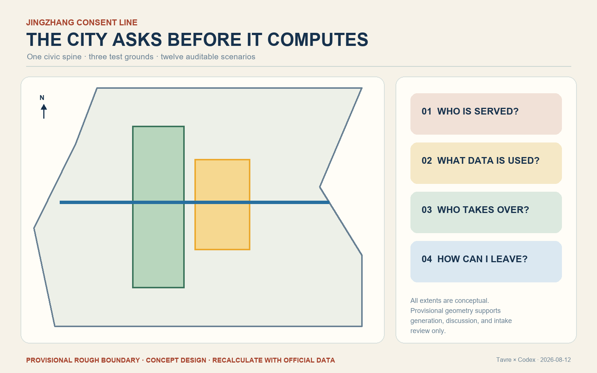
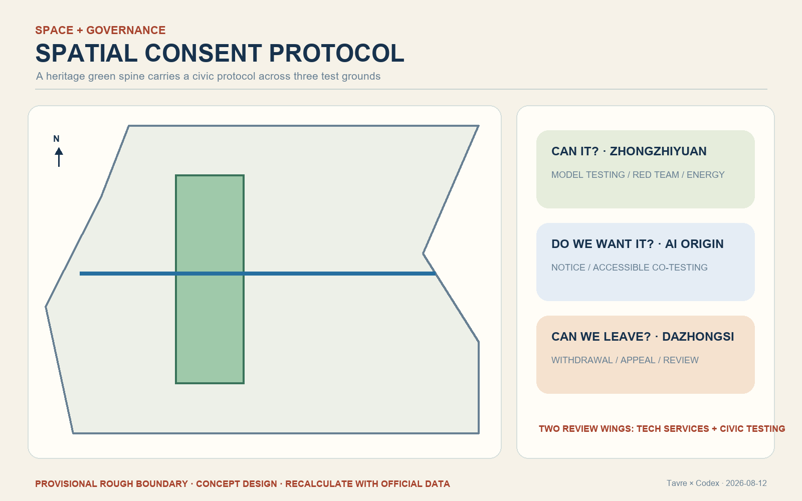
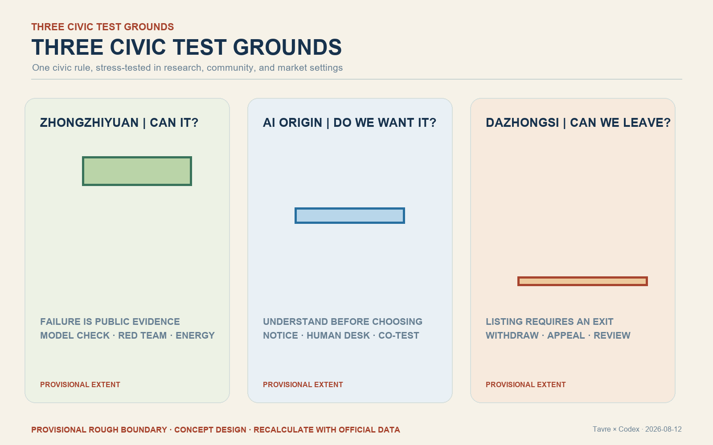
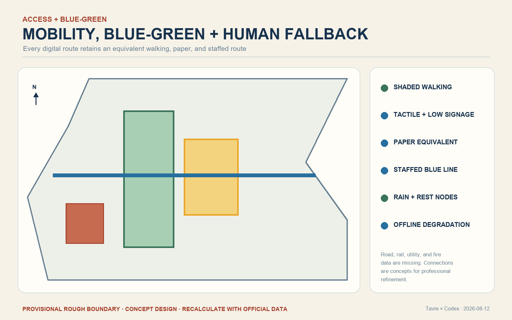
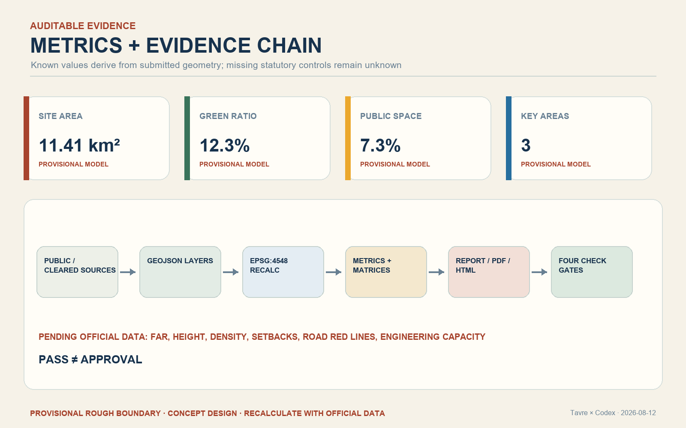

# JINGZHANG CONSENT LINE: The City Asks Before It Computes

## 1. Basis, evidence, and limits

This professional design package responds to the public open-call brief, its Agent taskbook, the registered source inventory, and the repository's mandatory professional-standard snapshots. GeoJSON, metrics, matrices, and the contributor self-check are the audit layer; this report is the human reading layer. The organizer has not supplied exact official site and key-area polygons. The submitted geometry is therefore a provisional constraint for design discussion and intake review only. It is not an official red line, statutory control, ownership boundary, or precise approval basis. All areas and ratios must be recalculated when official polygons arrive. [source:OFFICIAL-ANNOUNCEMENT] [source:AGENT-TASKBOOK] [depth:existing_conditions_diagnosis]

## 2. Three scopes and the central idea

The 43.6 km2 coordinated research area frames the innovation ecosystem; the approximately 11.4 km2 overall design area frames the renewal and public-space strategy; and the three key areas frame detailed concept design. The proposal calls this system the **Consent Line**. Before an AI service enters everyday urban life, it must answer four questions in public: whom does it serve, what data does it use, who can take over, and how can a person leave?

The spatial structure is one walkable consent spine, three civic test grounds, twelve scenario nodes, and two review wings. The Jingzhang heritage park becomes a readable public protocol rather than a technology showroom. Zhongzhiyuan asks whether a system can pass testing; the AI Origin Community asks whether people understand and want it; Dazhongsi asks whether a deployed service can be withdrawn, appealed, and reviewed. [data:geometry/site_boundary.geojson#SITE-001] [depth:three_level_scope_framework]

## 3. Identity, culture, and public language

The Chinese name is “京张问路”; the English name is “JINGZHANG CONSENT LINE.” A proposed mark uses two unfinished rail lines to form a question mark and signal outline. Brick red represents railway memory, amber means trial or explanation required, green means currently passed, and blue marks the human-service route. The system translates railway discipline - check the signal before movement - into a contemporary civic rule: ask people before computation. The identity is a concept for professional refinement and trademark review, not an adopted public brand. [standard:PROJECT-AGENT-OPEN-CALL-TASKBOOK] [depth:height_massing_character]

## 4. Overall renewal and land-use approach

The proposal keeps the provisional boundary visually quiet and concentrates design attention on the heritage green spine, east-west walking stitches, service nodes, and reversible infill. Land use remains a complete non-overlapping partition in the machine package. Existing buildings are treated with a retain-first method; lightweight consent halls are reversible prototypes pending official parcels, ownership, heritage controls, fire access, infrastructure, and approved development intensity. No demolition, height, FAR, setback, or road-red-line claim is made without official evidence. [data:geometry/land_use.geojson#LU-001] [data:geometry/buildings.geojson#BLDG-001] [depth:retain_renovate_demolish]

## 5. Three key-area concepts

- **Zhongzhiyuan - “Can it?” test ground.** A public testing loop along the Qinghe interface makes model limits, red-team results, energy disclosure, and stop conditions visible. Failure is recorded as useful evidence rather than hidden.
- **AI Origin Community - “Do we want it?” consent ground.** A campus-park-neighborhood walking stitch links an explanation hall, accessible co-testing tables, paper alternatives, and staffed service counters.
- **Dazhongsi - “Can we leave it?” review ground.** A station-linked civic room combines service listing, one-step withdrawal, appeal, consumer protection, enterprise demonstration, and public postmortem.

All three extents remain provisional and require official survey, regulatory, transport, heritage, and engineering confirmation. [data:geometry/key_areas.geojson#PROV-KEY-001] [data:geometry/key_areas.geojson#PROV-KEY-002] [data:geometry/key_areas.geojson#PROV-KEY-003]

## 6. People and twelve AI+ scenario cards

Six priority personas are surrounding residents and older adults; disabled people; open-source developers and university communities; start-ups; frontline service workers; and enterprise visitors and international talent. Nobody should lose a basic service because they refuse automation or cannot use a digital interface.

The twelve scenarios are: accessible walking guidance; disability-led co-testing; a model check-up station; edge-compute kiosks; dual-track community service windows; a medical navigation foyer that never diagnoses; a source-visible learning table; a legal-information desk that never presents generated text as counsel; a consumer-agent unsubscribe desk; an aggregated urban-maintenance review screen; an annual Global AI Consent Week; and three contribution signal towers. Each scenario must disclose data, responsibility, human takeover, exit, retention, and review. The three industrial validation groups are model testing, edge-compute operation, and agent listing/withdrawal. [data:geometry/public_space.geojson#PUBLIC-001] [data:geometry/roads.geojson#ROAD-001] [metric:public_space_ratio]

## 7. Mobility, blue-green space, and accessibility

The heritage park is a continuous walking and cycling spine supported by shade, rest, rainwater landscapes, tactile guidance, and staffed fallback points. East-west stitches focus on barriers and station approaches, but their alignments are conceptual until road, rail, pipeline, and fire-access data are supplied. AI guidance may identify route conditions using minimal, aggregated data; paper maps and human assistance remain equivalent options. [data:geometry/green_space.geojson#GREEN-001] [standard:BARRIER-FREE-ENVIRONMENT-LAW] [depth:traffic_rail_slow_parking]

## 8. Buildings, infrastructure, and human fallback

The building prototype is a small reversible consent hall with an explanation zone, a staffed blue-line counter, an accessible testing table, and a withdrawal/review desk. Distributed compute is a conditional infrastructure concept: local processing is preferred for low-risk tasks, while energy, retention, cybersecurity, and offline fallback must be disclosed. FAR, total floor area, height, density, setbacks, utilities, flood control, and fire engineering remain pending official information. [metric:building_footprint_area_sqm] [depth:municipal_new_infrastructure]

## 9. Landmarks and long-term operation

Three proposed pilgrimage landmarks make governance legible: the “Can it?” Signal Tower at Zhongzhiyuan, the “Do we want it?” Civic Table at the Origin Community, and the “Can we leave it?” Review Hall at Dazhongsi. A versioned contribution wall records successful work and stopped projects with reasons. The annual Global AI Consent Week includes a public red-team day, resident co-test day, accessible night walk, and failure postmortem. A standing developer community publishes quarterly scenario versions with expiry dates. These are operational reference schemes, not confirmed government programs. [source:AGENT-TASKBOOK] [depth:blue_green_public_space]

## 10. Projects and phasing

Phase 1 contains only reversible elements: bilingual/tactile wayfinding, the staffed human-service route, and three auditable industrial pilots. Phase 2 may deliver the three civic test grounds only after official planning, ownership, transport, municipal, fire, and heritage conditions are confirmed. Phase 3 establishes the independent review, expiry, and withdrawal ledger. The project list includes walking-gap repair, the Qinghe testing interface, the Origin Community consent street, Dazhongsi station review room, edge-compute service nodes, and the annual public route. [data:geometry/phasing.geojson#PHASE-001] [depth:phasing_implementation]

## 11. Metrics and recalculation

Known package metrics are computed from submitted geometry: site area, building footprint, green-space ratio, public-space ratio, and key-area count. Because the boundary is provisional, geometry-derived values describe only this concept model. Approved FAR, height, density, green ratio, setbacks, road red lines, and engineering capacity are unknown. The structured files preserve formulas, source files, confidence, and recalculation triggers. [metric:site_area_sqm] [metric:green_ratio] [metric:key_area_count] [depth:metrics_recalculation]

## 12. Standards, compliance, and public interest

The compliance matrix covers every open-call task and Agent taskbook item. The standard matrix responds to urban-design management, regulatory-plan depth, land-use classification, barrier-free environments, aging and digital inclusion, generative-AI governance, and architectural design depth. The design-depth matrix links each required item to geometry, metrics, drawings, and narrative evidence. AI assists diagnosis and alternatives; humans and competent professionals retain planning, service, engineering, and legal decisions. [standard:MOHURD-URBAN-DESIGN-MEASURES] [standard:GENERATIVE-AI-INTERIM-MEASURES] [depth:professional_standard_response]

## 13. Risks, rights, and next steps

The main risks are missing official polygons, regulatory controls, parcels, existing-building surveys, transport and municipal data, heritage controls, operating bodies, budgets, and tested public acceptance. Concept renderings are synthetic presentation artifacts and are not observations of current conditions. No official approval, confirmed investment, final ownership, exact construction scale, or guaranteed implementation is claimed. All media, tools, licenses, and generation methods are recorded in the source and copyright files. The next formal revision must replace provisional geometry, recompute all dependent layers and metrics, run professional and public accessibility review, and repeat every self-check gate. [data:geometry/constraints.geojson#CONSTRAINTS] [depth:risk_missing_data]
